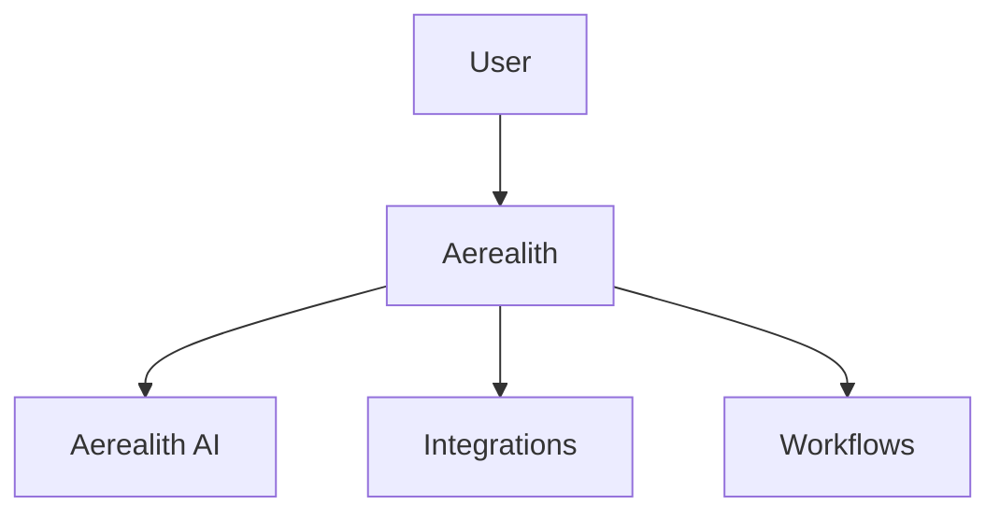

# Aerealith Documentation Skill

## Purpose

This skill provides repository-aware documentation support for the Aerealith
project.

Use it to create documentation that is:

- Accurate
- Complete
- Consistent
- Durable
- Properly scoped
- Easy to navigate
- Honest about implementation status
- Understandable without private project context

Documentation is part of the product.

A documentation task is not complete merely because text was written. The
result must match the repository, use canonical terminology, link to
authoritative sources, and clearly distinguish current functionality from future
direction.

---

# When to Use This Skill

Use this skill for tasks involving:

- New Markdown documentation
- Complete document rewrites
- README creation or maintenance
- Project overview documentation
- Vision and mission documentation
- Product requirements
- Product positioning
- Architecture documentation
- Architecture decision records
- Engineering standards
- Security documentation
- Operations documentation
- Contributor onboarding
- API and integration documentation
- Roadmaps
- Release notes
- Current-state summaries
- Documentation indexes
- Documentation audits
- Broken-link reviews
- Terminology reviews
- Company and project relationship documentation
- AAPE documentation completion reviews
- Pull-request documentation summaries
- Documentation-related GitHub issues
- Historical documentation cleanup
- Public project descriptions

Common identifying keywords include:

```text
documentation
docs
README
overview
vision
mission
roadmap
architecture
ADR
DEC
requirements
current state
release notes
contributor guide
onboarding
API documentation
documentation audit
broken links
rewrite
expand
canonical
source of truth
AAPE
```

---

# Canonical Product Language

Always preserve the distinction between Aerealith and Aerealith AI.

## Aerealith

**Aerealith** is the platform.

It is a modular digital orchestration platform intended to connect
applications, services, communities, workflows, infrastructure, knowledge,
automation, and intelligent capabilities through a trusted control layer.

## Aerealith AI

**Aerealith AI** is the intelligent assistant within Aerealith.

It provides conversational interaction, contextual understanding,
recommendations, explanations, summaries, and workflow assistance within
explicit permissions and approved boundaries.

Use this rule consistently:

> **Aerealith is the platform.**
>
> **Aerealith AI is the assistant within the platform.**

Do not use **Aerealith AI** as the canonical name of the entire platform.

The Discord application may be branded **Aerealith AI**, but Discord remains
one integration within the larger Aerealith platform.

---

# Canonical Positioning

Preserve the following project language.

## Product Positioning

> **Aerealith is the operating system for your digital life.**

## North Star

> **Reduce digital complexity without reducing user control.**

## Tagline

> **One Platform. Infinite Possibilities.**

The tagline describes platform potential.

It must not be used to imply that every planned or envisioned capability
currently exists.

---

# Core Documentation Principles

All documentation should follow these principles.

## Accuracy Before Completeness

Do not fill gaps with guesses.

When evidence is incomplete:

- State the uncertainty.
- Identify what was inspected.
- Explain what still requires verification.
- Avoid presenting assumptions as facts.

## One Authoritative Source

Prefer one canonical document for each major concept.

Supporting documents should summarize and link to that source rather than
repeating large sections that may drift over time.

## Current State Must Be Verifiable

A capability is current only when its implementation can be reasonably verified
through repository evidence.

Roadmaps, mockups, old presentations, and planning notes are not proof that a
capability is implemented.

## Future Direction Must Be Labeled

Planned and aspirational work must be clearly identified.

## Documentation Must Be Navigable

Readers should be able to move from a high-level overview to detailed product,
architecture, engineering, security, release, and onboarding documentation
without encountering broken links.

## Private Context Is Not Documentation

Do not assume readers know internal history, private conversations, unwritten
decisions, or personal terminology.

Explain necessary context in the document.

---

# Capability Status Language

Use these terms consistently:

- **Current** — implemented, verified, and available now
- **In Progress** — actively being developed
- **Planned** — approved but not complete
- **Future** — expected beyond the immediate roadmap
- **Vision** — long-term direction without a committed release
- **Blocked** — unable to proceed because a dependency or decision is unresolved
- **Deferred** — intentionally postponed
- **Complete** — all stated completion criteria are satisfied
- **Deprecated** — still present but scheduled for removal or replacement
- **Historical** — preserved for context but not authoritative for current work

Never present a Planned, Future, or Vision capability as Current.

Do not infer completion merely because:

- A package is installed
- A branch exists
- A task exists
- A roadmap references it
- A mockup shows it
- A README mentions it
- A design document describes it
- Partial code exists
- A vendor has been selected

---

# Company and Project Relationships

Use company and project names carefully.

Where verified, the intended hierarchy is:

```text
SinLess Industries
└── SinLess Games LLC
    └── Aerealith
        └── Aerealith AI
```

Use:

- **SinLess Industries** for the broader parent or umbrella identity where
  formally documented
- **SinLess Games LLC** for the legal owner, development company, copyright
  holder, or contractual entity where verified
- **Aerealith** for the project, product, platform, and repository
- **Aerealith AI** for the assistant and branded assistant applications

Do not invent:

- Legal ownership
- Trademark status
- Corporate structure
- Contractual authority
- Intellectual-property assignments
- Funding relationships

When a relationship is uncertain, identify the question that must be resolved.

---

# Documentation Hierarchy

Use the following hierarchy when deciding where information belongs.

```text
Vision
├── explains why Aerealith exists
├── defines long-term direction
└── constrains lower-level decisions

Product
├── defines users
├── defines problems and requirements
├── defines product behavior
└── translates vision into deliverable capability

Architecture
├── defines system structure
├── defines boundaries
├── defines major technical relationships
└── explains architectural direction

Decision Records
├── record binding choices
├── preserve alternatives
├── explain consequences
└── preserve decision history

Engineering
├── defines development standards
├── defines repository workflows
├── defines testing expectations
└── explains implementation practices

Security
├── defines protection requirements
├── defines trust boundaries
├── defines security processes
└── defines incident and vulnerability handling

Operations
├── defines deployment
├── defines observability
├── defines maintenance
├── defines backup and recovery
└── defines incident response

Current State
├── records verified implementation
├── identifies incomplete work
└── separates reality from aspiration

Roadmaps and Releases
├── define intended sequencing
├── define release gates
├── record delivered scope
└── distinguish planned work from shipped work
```

Do not place:

- Detailed implementation instructions in vision documents
- Product promises in architecture documents
- Temporary sprint tasks in canonical long-term documents
- Planned features in release notes as delivered
- Marketing claims in technical source-of-truth documents

---

# Standard Workflow

Follow this workflow for documentation tasks.

## 1. Understand the Request

Identify:

- The requested output
- The target audience
- The intended document type
- Whether the user wants a complete document or a patch
- The stated completion standard
- Any related AAPE, issue, epic, or release

## 2. Inspect Existing Documentation

Before writing:

- Read the target file
- Read the nearest documentation index
- Search for related documents
- Identify the authoritative source
- Check for duplicate content
- Check for contradictions
- Review related decisions

## 3. Inspect Repository Evidence

When documenting current behavior, inspect relevant:

- Source files
- Tests
- Package manifests
- Workspace configuration
- Database migrations
- API schemas
- Environment templates
- Dockerfiles
- CI workflows
- Deployment configuration
- Release notes
- Current-state documents

## 4. Plan the Change

For multi-file or substantial work, identify:

- Files to inspect
- Files to change
- Canonical sources
- Required decisions
- Links to add
- Validation steps
- Remaining uncertainties

## 5. Write or Rewrite

Create a complete and coherent document.

Preserve valid existing intent, but do not retain weak structure merely to avoid
rewriting.

## 6. Validate

Check:

- Terminology
- Status claims
- Links
- Paths
- Heading hierarchy
- Metadata
- Dates
- Current versus future language
- Security and trust implications
- Related indexes
- Git diff

## 7. Report the Result

Summarize:

- What changed
- Files changed
- Sources used
- Validation performed
- Remaining questions
- Suggested follow-up work

---

# Complete Rewrite Behavior

When asked to expand, formalize, or rewrite a document, default to a complete
ready-to-commit replacement unless the user explicitly asks for a small patch.

A complete rewrite should:

1. Preserve valid intent.
2. Preserve accepted decisions.
3. Correct outdated terminology.
4. Remove contradictions.
5. Add missing context.
6. Establish a logical structure.
7. Separate current and future capability.
8. Add appropriate links.
9. Preserve useful historical information.
10. Avoid unnecessary repetition.
11. Remain readable without private context.
12. Match nearby repository style.

Do not simply append new sections to an incoherent document.

Do not silently alter a binding decision.

---

# Document Metadata

Use a metadata block for major canonical documents where appropriate.

```md
# Document Title

Status: Draft
Owner: SinLess Games LLC
Last Updated: YYYY-MM-DD
Document Type: Appropriate Type
```

Common statuses include:

- Draft
- Active
- Proposed
- Planned
- Accepted
- Deprecated
- Superseded
- Historical
- Archived

Update `Last Updated` only when meaningful content changes.

Do not change dates solely because whitespace or formatting changed unless
repository policy requires it.

---

# Recommended Document Structure

Use only the sections that serve the document.

Potential sections include:

```text
Purpose
Scope
Audience
Definitions
Context
Problem
Goals
Non-Goals
Principles
Requirements
Current State
Planned Direction
Architecture
Security Considerations
Operational Considerations
Dependencies
Risks
Testing
Validation
Related Documentation
Success Criteria
Exit Criteria
Final Standard
```

Avoid mechanically adding every section.

---

# Writing Style

Use a professional, direct, durable technical-documentation style.

Documentation should be:

- Clear
- Specific
- Complete
- Structured
- Searchable
- Accessible
- Internally consistent
- Honest about uncertainty

Prefer:

> Aerealith validates authorization before executing a meaningful action.

Avoid:

> The system should probably check permissions when necessary.

Use strong requirement language only when the statement is:

- An approved requirement
- An accepted decision
- A canonical principle
- A verified current behavior

Avoid marketing exaggeration in technical documentation.

Avoid vague phrases such as:

- Powerful platform
- Revolutionary system
- Seamless experience
- Intelligent solution
- Best-in-class
- Fully autonomous

unless the statement is defined, supported, and appropriate to the document.

---

# Markdown Standards

Use GitHub-flavored Markdown.

## Headings

Use one level-one heading per document.

Follow a logical hierarchy:

```text
# Document Title
## Major Section
### Subsection
#### Detail
```

Do not skip heading levels without a clear reason.

## Code Blocks

Use fenced code blocks and specify the language when known.

```ts
export const example = true
```

## Tables

Use tables for comparison or structured reference.

Avoid placing long paragraphs in table cells.

## Diagrams

Use Mermaid when a diagram improves understanding.

Example:



Add explanatory prose around important diagrams.

Do not rely on a diagram alone for critical information.

## Lists

Use lists for collections and checklists.

Do not convert every paragraph into bullets.

## HTML

Avoid raw HTML unless Markdown cannot provide the required structure.

---

# Links and Navigation

Use relative repository links for internal documentation.

Before adding a link:

1. Confirm the target file exists.
2. Confirm exact capitalization.
3. Confirm the relative path.
4. Encode spaces where needed.
5. Confirm the target is authoritative.
6. Validate the link after editing.

Example:

```md
See the [Trust Model](./vision/Trust%20Model.md).
```

Major overview documents should link to:

- Vision
- Product
- Architecture
- Engineering
- Security
- Operations
- Current State
- Roadmap
- Releases
- Contributor onboarding
- Decision records

Update documentation indexes when adding or renaming major files.

Add backlinks when they materially improve navigation.

Do not add unmarked placeholder links to files that do not exist.

---

# Current-State Documentation

When writing about current implementation:

- Verify the behavior in the repository.
- Check tests where available.
- Check relevant configuration.
- Confirm deployment or operational support when claiming production readiness.
- Distinguish partial implementation from complete capability.
- Identify missing validation.

Useful wording includes:

> The repository contains an initial implementation, but production readiness has
> not been established.

> This capability is planned and has not been verified as currently implemented.

> The interface exists, but the complete workflow remains in progress.

Do not use old presentations or business plans as the sole source for current
technical status.

---

# Technology Documentation

The intended or active stack may include:

## Repository and Tooling

- TypeScript
- Nx
- pnpm

## Frontend

- Vite
- React
- React Router
- Tailwind CSS
- TanStack tools

## Backend

- Hono

## Data

- PostgreSQL
- CockroachDB
- Drizzle ORM

## Infrastructure

- Docker
- GitHub Actions
- Cloudflare
- Nx Cloud

## Quality and Observability

- Datadog
- Grafana-compatible observability
- Codecov
- Meticulous AI

## Security and Dependencies

- Snyk
- Semgrep
- Dependabot
- Renovate

## External Services

- Resend
- Cloudinary

Verify the status of every technology before describing it as currently active.

Prefer the canonical stack document for detailed technology claims.

---

# Trust and Security Requirements

Documentation must preserve these principles:

- Trust is earned rather than assumed.
- AI output is not authorization.
- Model confidence is not proof.
- Meaningful actions require authority.
- Permissions should follow least privilege.
- Sensitive actions require stronger verification.
- Meaningful actions should be explainable.
- Actions should be auditable.
- Automation should be bounded.
- Automation should be revocable.
- Failures should be safe and visible.
- Human authority should remain clear.
- Cross-tenant trust must not be assumed.
- Discord permissions alone do not prove user intent.

Do not describe Aerealith AI as an unrestricted autonomous agent.

Do not imply that a model can grant itself permission.

---

# Discord Documentation

Discord is the first flagship integration.

It may be described as:

- A major platform integration
- An initial community-management surface
- A first-class integration
- A proving ground for modular capabilities
- The first major real-world integration

Potential Discord capabilities may include:

- Moderation
- Tickets
- Onboarding
- Verification
- Roles
- Community analytics
- Notifications
- Automation
- Audit logging
- AI-assisted operations

Verify implementation status before describing any capability as current.

Do not describe Aerealith as only a Discord bot.

---

# Self-Hosting Documentation

Self-hosting is an important long-term direction.

Do not claim that Aerealith is currently self-hostable unless the repository
contains verified support for:

- Installation
- Configuration
- Secrets management
- Database setup
- Upgrades
- Backups
- Restore
- Security
- Monitoring
- Troubleshooting
- Operational maintenance

Label incomplete self-hosting support as Planned, Future, or Vision.

Containerization alone does not prove that self-hosting is supported.

---

# Documentation Audits

When performing an audit:

1. Define the scope.
2. Inventory files.
3. Identify authoritative sources.
4. Find duplicate content.
5. Find contradictory claims.
6. Find outdated terminology.
7. Find broken links.
8. Find missing documents.
9. Find stale status metadata.
10. Find future claims presented as current.
11. Find historical project names.
12. Find undocumented public interfaces.
13. Find missing navigation paths.
14. Record required actions.

Use a table such as:

| Location | Finding | Severity | Required Action | Status |
| -------- | ------- | -------- | --------------- | ------ |

Useful finding types include:

- Correct
- Missing
- Broken link
- Outdated
- Contradictory
- Duplicate
- Needs clarification
- Needs terminology update
- Historical
- Future claim presented as current
- Unverified implementation claim

Do not claim an audit is complete unless the stated scope was actually reviewed.

---

# Decision Records

Create or recommend a decision record when documentation introduces, changes,
or reverses a binding choice involving:

- Product identity
- Product boundaries
- Architecture
- Authentication
- Authorization
- Data ownership
- Privacy
- Trust
- Security
- Multi-tenancy
- Deployment
- Self-hosting
- Provider selection
- Major technology
- API contracts
- Compatibility
- Long-term platform direction

A decision record should normally contain:

```text
Title
Status
Context
Decision
Alternatives
Consequences
Security Implications
Operational Implications
Related Documentation
Supersession Information
```

Do not rewrite an accepted historical decision to make it appear that the newer
decision was always in place.

Create a superseding record when appropriate.

---

# API Documentation

When documenting APIs or public interfaces, inspect:

- Implementation
- Type definitions
- Validation
- Authentication
- Authorization
- Error handling
- Tests
- Rate limits
- Side effects
- Versioning
- Examples

Document:

- Purpose
- Endpoint or interface
- Inputs
- Outputs
- Errors
- Permissions
- Side effects
- Idempotency
- Security considerations
- Examples
- Limitations
- Stability

Do not document internal implementation details as stable public contracts
unless they are intentionally exposed.

---

# README Requirements

A README should answer:

- What is this?
- Why does it exist?
- Who is it for?
- What is its current status?
- How is it used or developed?
- Where is the detailed documentation?
- Who owns or maintains it?

Package and service READMEs should focus on local responsibility.

They should link to canonical project documentation instead of copying the full
project overview.

---

# Contributor Documentation

Contributor documentation should include or link to:

- Prerequisites
- Supported runtime versions
- Package manager
- Installation
- Environment setup
- Local development
- Validation commands
- Testing
- Linting
- Formatting
- Commit conventions
- Pull-request expectations
- Security reporting
- Documentation expectations
- Troubleshooting

Verify all commands before publishing them.

Do not invent scripts that do not exist.

---

# AAPE Completion Reviews

When reviewing whether an AAPE can be closed:

1. Read the objective.
2. Read the scope.
3. Read the expected outputs.
4. Read the dependencies.
5. Read the completion standard.
6. Inspect repository evidence.
7. Compare evidence against every required output.
8. Identify partial or missing work.
9. Classify the task.
10. Provide exact remaining actions.

Use these classifications:

- **Complete**
- **Substantially Complete**
- **In Progress**
- **Blocked**
- **Not Started**

Do not mark an AAPE complete merely because a related document exists.

Completion requires evidence that the stated completion standard has been met.

Example response:

```md
## AAPE-161 — In Progress

### Evidence

- `docs/Project-Overview.md` links to the vision index.
- The roadmap is linked.
- The architecture link resolves.

### Remaining Work

- Add contributor onboarding link.
- Add current-state link.
- Add a backlink from `docs/README.md`.
- Run the documentation link checker.

### Closure Condition

Close AAPE-161 after a new contributor can navigate from the project overview to
roadmap, architecture, current state, and onboarding without broken links.
```

---

# Pull-Request Support

When helping write a documentation pull request, include:

```md
## Summary

Describe the documentation outcome.

## Changes

List the major documents and concepts changed.

## Why

Explain the problem the documentation solves.

## Validation

List checks performed.

## Related Work

Reference relevant AAPEs or issues.

## Notes

State whether runtime behavior changed.
```

Do not claim tests or validations were run unless they were actually performed.

---

# Examples

## Example: Create a Project Overview

### Request

```text
Create docs/Project-Overview.md.
```

### Expected Behavior

1. Search for existing overview documents.
2. Review vision, positioning, roadmap, architecture, and current-state docs.
3. Identify the authoritative product definition.
4. Write a complete overview.
5. Distinguish Aerealith from Aerealith AI.
6. Explain audiences and boundaries.
7. Separate current and future capabilities.
8. Link to supporting documents.
9. Update the docs index where appropriate.
10. Validate links.

---

## Example: Rewrite a Vision Document

### Request

```text
Expand docs/vision/Trust Model.md into a canonical document.
```

### Expected Behavior

1. Read the entire existing document.
2. Review product philosophy, vision, positioning, architecture, and security
   documentation.
3. Preserve approved principles.
4. Expand permissions, risk, approval, verification, execution, explanation,
   audit, automation, failure, and revocation.
5. Make AI authority boundaries explicit.
6. Separate intended behavior from implemented behavior.
7. Return a complete replacement document.

---

## Example: Documentation Audit

### Request

```text
Audit all Aerealith descriptions for inconsistent terminology.
```

### Expected Behavior

1. Search repository descriptions, README files, docs, presentations, and
   release material.

2. Search terms such as:

   ```text
   Aerealith AI is
   Aerealith is
   Helix
   Discord bot
   AI platform
   operating system
   SinLess Games
   SinLess Industries
   self-hosted
   autonomous
   ```

3. Classify every relevant result.

4. Create an audit table.

5. Correct active contradictions.

6. Preserve intentional historical references.

7. Report unresolved items.

---

## Example: Current-State Review

### Request

```text
Document the current Discord integration.
```

### Expected Behavior

1. Inspect Discord packages and source code.
2. Inspect configuration and environment templates.
3. Inspect tests and workflows.
4. Inspect current-state and roadmap documents.
5. Describe only verified behavior as Current.
6. Label unfinished modules as In Progress or Planned.
7. Document security and permission boundaries.
8. Link to relevant architecture and trust documentation.

---

## Example: Broken-Link Repair

### Request

```text
Fix the documentation links in docs/README.md.
```

### Expected Behavior

1. Inspect every linked path.
2. Confirm exact casing.
3. Locate renamed files.
4. Repair relative paths.
5. Avoid inventing replacement files.
6. Update link labels where needed.
7. Run available link validation.
8. Report any missing targets that require new documents.

---

# Prohibited Behavior

Do not:

- Invent current functionality.
- Present roadmap work as shipped.
- Invent legal relationships.
- Describe Aerealith as only a Discord bot.
- Use Aerealith AI as the canonical platform name.
- Treat AI output as authorization.
- Treat confidence as proof.
- Claim self-hosting support without evidence.
- Create duplicate sources of truth without justification.
- Remove historical decisions without preserving them.
- Add links that have not been checked.
- Add commands that have not been verified.
- Hide contradictions.
- Claim an audit is complete without reviewing the scope.
- Rewrite unrelated code during documentation work.
- Use private context as a substitute for written explanation.
- Copy generated documentation without reviewing it.
- Update dates mechanically across unchanged documents.
- Claim validation that was not performed.

---

# Completion Standard

Documentation work is complete when:

- The intended audience can understand the subject without private context.
- The purpose and scope are clear.
- Terminology is consistent.
- Aerealith and Aerealith AI are distinguished.
- Current and future capabilities are separated.
- Major claims link to authoritative sources where appropriate.
- Links resolve.
- Related indexes are updated.
- Contradictions are resolved or recorded.
- Trust and security implications are represented.
- Current-state claims match repository evidence.
- Metadata is accurate where applicable.
- The final diff contains no unrelated changes.
- Remaining uncertainty is stated honestly.

At the end of the task, provide:

- A concise summary
- Files created or changed
- Authoritative sources used
- Validation performed
- Remaining questions
- Recommended follow-up work
- Suggested commit or pull-request wording when useful
