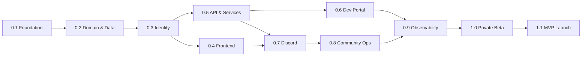

# Aerealith AI — Development Plan

This is the delivery plan for building Aerealith AI from release `0.1` to
`1.1 — MVP Production Launch`.

It is derived **entirely from `docs/`** — all 34 documents, 37,593 lines. No source code
was consulted. Every claim below is traceable to a document, and every place where the
documents disagree with each other is recorded rather than silently resolved.

The plan does not invent a roadmap. [docs/releases/README.md](docs/releases/README.md)
and [docs/vision/Roadmap.md](docs/vision/Roadmap.md) already define one, and they agree.
This document turns that spine into deliverables, sequencing, and exit criteria, and it
surfaces the decisions that must be made before the spine can be walked.

---

## Purpose

This document defines:

- what the documentation already settles, and what it leaves open
- the binding constraints every release must satisfy
- the contradictions that block specific releases until resolved
- what each release must deliver, and how we know it is done
- which RFCs must be written before which releases
- where the documentation itself is broken

It is a delivery plan. It is not a product spec, an architecture spec, or a replacement
for the RFCs. Those remain authoritative in [docs/product/](docs/product/),
[docs/architecture/](docs/architecture/), and [docs/rfcs/](docs/rfcs/).

---

## Document Precedence

The documents conflict. When they do, resolve in this order.

| Rank | Source                                                                                                | Why it wins                                                                                                                          |
| ---- | ----------------------------------------------------------------------------------------------------- | ------------------------------------------------------------------------------------------------------------------------------------ |
| 1    | [docs/rfcs/](docs/rfcs/)                                                                              | RFCs 0002–0005 carry `status: Implemented`. Per [RFC 0001](docs/rfcs/0001-rfc-process.md) they are binding decisions, not proposals. |
| 2    | [docs/vision/Trust Model.md](docs/vision/Trust%20Model.md)                                            | Trust rules are described as a per-feature ship gate ("The Trust Test"), not a milestone. They constrain every release.              |
| 3    | [docs/product/MVP Scope.md](docs/product/MVP%20Scope.md)                                              | Declares itself: "This document is a scope gate."                                                                                    |
| 4    | [docs/releases/README.md](docs/releases/README.md) + [docs/vision/Roadmap.md](docs/vision/Roadmap.md) | The release spine. These two agree with each other.                                                                                  |
| 5    | [docs/architecture/System Architecture.md](docs/architecture/System%20Architecture.md)                | Explicitly says it "does not fully define" schema, auth, bot internals, workflow engine, and more. Directional.                      |
| 6    | Everything else in `docs/product/`                                                                    | Feature-area detail. Defers to the scope gate.                                                                                       |

This ordering matters immediately: the System Architecture document specifies the route
prefix `/api/v1/`, and RFC 0003 specifies `/api/V1/` with an uppercase `V` and explicitly
forbids `/api/v1/`. **The RFC wins.** See `DEC-01`.

---

## The Release Spine

Verbatim from [docs/releases/README.md](docs/releases/README.md) → "Release Spine",
confirmed by [docs/vision/Roadmap.md](docs/vision/Roadmap.md) → "Release Flow". Each
release "proves" exactly one thing.

| Release | Name                                       | What it proves                                                 |
| ------- | ------------------------------------------ | -------------------------------------------------------------- |
| 0.1     | Foundation & Workspace                     | The project can be built, checked, and developed consistently. |
| 0.2     | Core Domain & Data Platform                | Stable contracts and safe migrations across environments.      |
| 0.3     | Authentication & Identity                  | Secure auth and consistent authorization.                      |
| 0.4     | Frontend Platform                          | A real, accessible, observable frontend shell.                 |
| 0.5     | API & Service Platform                     | Services are deployable and independently testable.            |
| 0.6     | Developer Portal & Integrations            | The API is a product surface.                                  |
| 0.7     | Discord Platform Foundation                | The module system works on a real flagship surface.            |
| 0.8     | Moderation, Tickets & Community Operations | A community can actually be run from Aerealith.                |
| 0.9     | Observability & Reliability                | Failures are visible, diagnosable, and recoverable.            |
| 1.0     | Private Beta                               | The system survives real users.                                |
| 1.1     | MVP Production Launch                      | Aerealith is real, useful, trustworthy, and expandable.        |

Post-MVP, not planned here: `1.2` Billing → `1.3` AI Assistant & Memory → `1.4` Workflow
Builder → `1.5` Marketplace → `1.6` Companion Apps → `1.7` Digital Life OS → `1.8`
Advanced Integrations → `1.9` Cloud Independence → `2.0` Self-Hosted Preview.

### Release dependency graph

From [docs/vision/Roadmap.md](docs/vision/Roadmap.md) → "Dependency model". Identity
gates both the frontend and the API, which then run in parallel.



### Milestones over dates

[docs/vision/Roadmap.md](docs/vision/Roadmap.md) → "Milestones Over Dates" is explicit:
"A release should ship because its exit criteria are satisfied," not because a date
arrived. This plan therefore assigns **no dates**. Effort ranges appear only in
[Capacity Planning](#capacity-planning), and they are not commitments.

---

## Start Here: 0.1 Is Not Closed

[docs/releases/0.1/Checklist.md](docs/releases/0.1/Checklist.md) → "Release Status"
reads:

```text
Status: Planned
Release: 0.1 — Foundation & Workspace
Completion Target: Before 0.2 begins
Required Coverage Minimum: 80%
```

Every row of its Go/No-Go table reads `Not Started`. Every task in
[docs/releases/0.1/Tasks.md](docs/releases/0.1/Tasks.md) (`T-0.1-001` … `T-0.1-039`)
carries `**Status:** Not Started`, except `T-0.1-037` which is `Deferred`. Sections 25
and the Release Completion Statement are unfilled placeholders.

The release documents also say `0.1`'s completion target is "Before 0.2 begins."

**Therefore the first task is not `0.2`.** It is to walk `0.1`'s 25 gates and either mark
them passed or fix what fails. The gate most likely to fail is the hard one:

> [docs/engineering/README.md](docs/engineering/README.md) and
> [docs/releases/0.1/Testing.md](docs/releases/0.1/Testing.md) require **80% minimum
> coverage** across statements, branches, functions, and lines, enforced by
> `pnpm test:coverage`, with CI failing below that number.

If coverage is not at 80%, `0.1` is not done, and by the project's own rule `0.2` has not
started.

---

## Binding Constraints

These apply to every release. They are not negotiable within this plan; changing them
requires an RFC.

### Engineering standards

From [docs/engineering/README.md](docs/engineering/README.md):

```text
Package manager   pnpm only. Never npm or yarn. Commit pnpm-lock.yaml.
Monorepo          Nx
Runtime           Node 24.x
Language          TypeScript, strict. No `any`. Narrow `unknown`.
Tests             Vitest. 80% minimum: statements, branches, functions, lines.
Formatting        Prettier. "Do not waste review time on formatting opinions."
Commits           Conventional Commits.
Secrets           Never committed. .env.example holds placeholders only.
```

CI must run, and fail on any of: `pnpm install`, `pnpm lint`, `pnpm format:check`,
`pnpm typecheck`, `pnpm test:coverage`, `pnpm build`, coverage below 80%, or a committed
secret.

Guiding philosophy, verbatim: "Build the simplest thing that can safely grow."

### The five release gates

From [docs/releases/README.md](docs/releases/README.md) → "Release Gates". "A release
should not be considered complete until its gates pass."

| Gate               | Asks                                                                |
| ------------------ | ------------------------------------------------------------------- |
| Product Gate       | Does the release deliver what it promised to prove?                 |
| Trust Gate         | Approvals, permissions, audit logs, AI disclosure, revocation.      |
| Engineering Gate   | Build, typecheck, lint, tests, error handling, secrets, env config. |
| Operations Gate    | Can it be deployed, observed, and rolled back?                      |
| Documentation Gate | Are the release's eight documents complete?                         |

Every release section below ends with exit criteria written against these gates.

### Trust Model — the hardest constraint

From [docs/vision/Trust Model.md](docs/vision/Trust%20Model.md). These are not `1.4`
features. They constrain code from `0.2` onward.

Every meaningful action must be "user-approved, understandable, permission-scoped,
auditable, reversible when possible, revocable at any time, aligned with user intent."

**Progressive Trust**, ten stages: Observe → Suggest → Ask → Verify → Execute → Explain →
Learn → Offer Automation → Trusted Automation → Revoke.

**Risk levels** and default behavior:

| Risk     | Examples                                           | Default                                       |
| -------- | -------------------------------------------------- | --------------------------------------------- |
| Low      | formatting, summaries, reminders                   | Automatable after repeated approval           |
| Medium   | posting, settings, workflows                       | Ask or verify, by trust history               |
| High     | moderation, deleting records, changing permissions | **Always verify before execution**            |
| Critical | billing, security, destructive infrastructure      | **Explicit confirmation + elevated approval** |

**Approval is required** whenever an action changes or deletes data, modifies
permissions, affects billing or security, posts publicly, messages or moderates users,
changes infrastructure, exposes private information, connects or disconnects an
integration, creates long-running automation, or cannot easily be reversed. "When unsure,
Aerealith should ask."

**Trust is scoped.** Verbatim: "A user approving an action in one Discord server does not
mean Aerealith can perform it in every server."

**The ten rules**: never assume correctness; never take unapproved meaningful actions;
always verify risky actions; always explain meaningful outcomes; always create audit
records for meaningful actions; always allow permissions and automations to be revoked;
never use private data for training without explicit consent; never hide AI involvement;
never escalate permission silently; never prioritize convenience over user trust.

**These ten rules are the acceptance test suite.** Write them as tests, not as prose.

### The platform must work without AI

[docs/product/Product Philosophy.md](docs/vision/Product%20Philosophy.md) → AI
Philosophy: "Core platform capabilities should never depend entirely on a single AI
provider." [docs/architecture/System Architecture.md](docs/architecture/System%20Architecture.md)
names "Risk: AI Becomes Too Central" and requires "Core platform behavior must work
without AI." [docs/product/MVP Scope.md](docs/product/MVP%20Scope.md) → Launch Readiness
requires "The platform should still work if AI is unavailable."

This is testable. Make it a test: disable the AI provider, run the suite, everything
except assistant features passes.

### RFC obligations for every new domain

Synthesized from RFCs 0002–0005. Adding a domain means all of this, or it is not done:

```text
libs/core/src/entities/<domain>/<domain>.entity.ts        domain entity, no ORM
libs/db/src/entities/<domain>/<domain>.persistence-entity.ts
libs/core/src/schemas/                                     reusable primitives
libs/contracts/src/schemas/                                request/response schemas (Zod)
libs/contracts/src/api/V1/services/<domain>/               versioned contracts
libs/contracts/src/dto/<domain>.dto.ts                     never a persistence entity
libs/db/src/mappers/<domain>.mapper.ts                     Date -> ISO string, strip secrets
libs/db/src/repositories/<domain>.repository.ts            returns domain entities or Result
libs/db/src/migrations/000N-create-<domain>.ts             ordered, reviewable
```

Plus: error codes as `DOMAIN_ERROR_NAME` mapped to an HTTP status and kept stable once
public; routes under `/api/V1/` with an uppercase `V`; responses in the RFC 0004 envelope
carrying `requestId` and `traceId`; and **never return a persistence entity from an API**.

Library boundary rule, verbatim from
[RFC 0002](docs/rfcs/0002-monorepo-library-boundaries.md): "libs/\* may depend on
libs/core only."

---

## Decision Register

The documentation contains fifteen unresolved conflicts and open questions. Each one
blocks a specific release. **Resolving these is the real Phase 0 of this project** — none
requires code, and every one will otherwise be decided badly under deadline pressure.

Recommendation column is my proposal, not a doc citation. It needs a human decision.

| ID     | Conflict                                                                                                                                                                                                                                                                                    | Sources                                                                                                   | Blocks   | Recommendation                                                                                                 |
| ------ | ------------------------------------------------------------------------------------------------------------------------------------------------------------------------------------------------------------------------------------------------------------------------------------------- | --------------------------------------------------------------------------------------------------------- | -------- | -------------------------------------------------------------------------------------------------------------- |
| DEC-01 | Route prefix. `/api/V1/` (uppercase `V`, and `/api/v1/` explicitly "Forbidden") vs `/api/v1/`.                                                                                                                                                                                              | RFC 0003 §Canonical Route Prefix vs System Architecture §API Architecture                                 | 0.5      | RFC 0003 wins. Fix the architecture doc.                                                                       |
| DEC-02 | Discord MVP module list: **13** modules vs **11** vs **8**. `module-manager`, `command-manager`, `basic-roles`, `basic-welcome`, `basic-analytics` are required, absent, or should-have depending on the file.                                                                              | MVP Scope §Discord MVP Modules; Discord Platform §MVP Discord Modules; Module System §Discord MVP Modules | 0.7      | MVP Scope is the scope gate: take its 11 "Required" + 2 should-have.                                           |
| DEC-03 | **The AI assistant.** MVP Scope makes an assistant chat surface, suggestions, and approval-gated actions MVP must-haves. The Roadmap defers "AI Assistant & Memory Foundation" to `1.3` — **after** MVP launch.                                                                             | MVP Scope §AI Assistant MVP Scope vs Roadmap `1.3`                                                        | 0.4, 0.8 | Ship a **suggest-and-approve-only** assistant in MVP; defer memory, routing, and autonomy to `1.3`. See below. |
| DEC-04 | Database engine. Roadmap names **CockroachDB**. System Architecture names no engine. RFC 0005 non-goals explicitly exclude "the final database provider" and "the final ORM implementation."                                                                                                | Roadmap `0.2` vs RFC 0005 §Non-Goals                                                                      | 0.2      | Decide now, via RFC. Everything in `0.2` depends on it.                                                        |
| DEC-05 | Which libraries actually exist. RFC 0002 names `core, contracts, api, db, ui, content, flags, observability` as **examples**, not a mandate. RFCs 0004 and 0005 then assume `core`, `contracts`, `api`, `db` exist with fixed substructure. `libs/config` is mentioned once, conditionally. | RFC 0002 §Rule 5 vs RFC 0004 §File Placement, RFC 0005 §Approved Folder Strategy                          | 0.2      | Mandate the eight. Add `libs/config` only if `libs/core` proves insufficient.                                  |
| DEC-06 | Mapper location: `libs/db/src/mappers/` or the app/service layer. RFC 0005 says both, and its own Open Questions asks which.                                                                                                                                                                | RFC 0005 §Proposed Decision vs §Approved Folder Strategy                                                  | 0.2      | `libs/db/src/mappers/`. Persistence knows about domain; domain must not know about persistence.                |
| DEC-07 | Error code representation: enum, const object, or string literal union? Explicitly open.                                                                                                                                                                                                    | RFC 0004 §Open Questions                                                                                  | 0.2      | Const object + derived union. Filenames already imply `*.enum.ts`; reconcile.                                  |
| DEC-08 | Where does `Result<T, E>` live — `libs/core` or `libs/contracts`? The RFC asks both and then files it under `libs/core/src/results/`.                                                                                                                                                       | RFC 0004 §Open Questions vs §File Placement                                                               | 0.2      | `libs/core`. It is a language primitive, not a contract.                                                       |
| DEC-09 | Persistence entity form: ORM classes, plain objects, or adapter-specific models? Open, and no ORM is chosen.                                                                                                                                                                                | RFC 0005 §Open Questions                                                                                  | 0.2      | Falls out of DEC-04. Decide together.                                                                          |
| DEC-10 | Is the `success`/`data`/`error` response envelope mandatory? RFC 0004 calls it "Recommended" and asks the question in Open Questions. RFC 0003 defers the whole shape to RFC 0004.                                                                                                          | RFC 0003 §Request and Response Strategy; RFC 0004 §Open Questions                                         | 0.5      | Mandatory. A "recommended" envelope becomes two envelopes.                                                     |
| DEC-11 | Cloudflare integration is MVP-required, "MVP / Post-MVP", and "Future" in three documents. Same three-way split for Grafana.                                                                                                                                                                | MVP Scope §Integrations vs Integrations.md §MVP Integrations vs Platform Capabilities CAP-INT-008         | 0.6      | Cloudflare bindings are infrastructure, not an "integration". Remove from the integrations table.              |
| DEC-12 | Webhooks: MVP-required, "MVP / Post-MVP", and Post-MVP. The line between "webhook foundation" (MVP) and "webhooks" (Post-MVP) is never defined.                                                                                                                                             | MVP Scope §Integrations vs Integrations.md vs Platform Capabilities CAP-INT-005/CAP-DEV-005               | 0.6      | Define "foundation" = signed inbound receipt + verification + delivery log. No management UI.                  |
| DEC-13 | Notification preferences: MVP (Platform Capabilities CAP-NOTIFY-005) vs Post-MVP (MVP Scope). Ticket summaries: MVP (MVP Scope) vs Post-MVP (AI Assistant.md, Discord Platform.md).                                                                                                         | direct contradiction                                                                                      | 0.8      | Scope gate wins both times.                                                                                    |
| DEC-14 | Persona priority. Product Overview and User Personas call individuals and Discord communities "two equal product anchors." MVP Scope ranks individuals **Secondary**.                                                                                                                       | Product Overview §Primary Launch Audience vs MVP Scope §MVP Audience Priority                             | 0.4      | Scope gate wins. Discord roles are Primary for MVP UX investment.                                              |
| DEC-15 | "MVP / Post-MVP" is used as a status across at least four documents and is **never defined**. It appears on Dashboard Summaries, Staff Summaries, Moderation Suggestions, Cloudflare, Webhooks, raid suspicion, Discord Event Trigger, and more.                                            | AI Assistant.md, Discord Platform.md, Integrations.md, Platform Capabilities.md                           | 0.4+     | Ban the label. Every row is MVP or it is not.                                                                  |

### DEC-03 deserves its own paragraph

The product is called **Aerealith AI**. The vision centers AI. And the roadmap ships the
AI assistant **after** the MVP launches.

This is not necessarily wrong — [docs/vision/Product Philosophy.md](docs/vision/Product%20Philosophy.md)
insists "AI is a capability, not the product," and the MVP must work without it. But the
scope gate and the roadmap cannot both be followed literally.

The resolution that satisfies both: in MVP, the assistant **may only suggest and
explain**. It proposes an action, a human approves it, the platform executes it, and the
audit log records both the suggestion and the approval. No memory beyond conservative
context. No autonomy. No model routing. That is exactly what
[docs/product/AI Assistant.md](docs/product/AI%20Assistant.md) → "Default Autonomy"
already prescribes: "Suggest first. Ask before action. Verify risky actions. Log
meaningful actions."

Everything the Roadmap puts in `1.3` — user-editable memory, provider routing, local
models — stays in `1.3`.

---

## RFCs Required Before Code

[RFC 0001](docs/rfcs/0001-rfc-process.md) → "When to Write an RFC" requires an RFC for
decisions affecting architecture, data models, API contracts, security, trust,
permissions, AI behavior, memory, automation, Discord actions, the module system,
integrations, provider lock-in, or self-hosting.

By that rule, **most of the releases below are currently ungoverned.** RFC 0001 itself
lists an "Early RFC Backlog" (0006–0015) that has not been written. RFCs 0004 and 0005
depend conceptually on decisions those missing RFCs would make.

Schedule them ahead of the release that needs them:

| RFC  | Subject                                                  | Must land before | Resolves                       |
| ---- | -------------------------------------------------------- | ---------------- | ------------------------------ |
| 0006 | Database provider, ORM, and persistence entity form      | 0.2              | DEC-04, DEC-09                 |
| 0007 | Library set, error-code representation, Result placement | 0.2              | DEC-05, DEC-07, DEC-08, DEC-06 |
| 0008 | Configuration and secrets model                          | 0.2              | —                              |
| 0009 | Authentication, session, and authorization model         | 0.3              | —                              |
| 0010 | API envelope, request/trace ID propagation               | 0.5              | DEC-01, DEC-10                 |
| 0011 | Event envelope, audit model, and idempotency             | 0.5              | —                              |
| 0012 | Workflow records and the approval primitive              | 0.5              | —                              |
| 0013 | Provider abstraction and integration interface           | 0.6              | DEC-11, DEC-12                 |
| 0014 | Module registry, manifest, and lifecycle                 | 0.7              | DEC-02                         |
| 0015 | Discord permission, role-hierarchy, and action safety    | 0.7              | —                              |
| 0016 | AI assistant boundaries and MVP memory scope             | 0.8              | DEC-03                         |
| 0017 | Observability, trace propagation, and alerting           | 0.9              | —                              |

Also fix, per RFC 0001's own rules: RFC 0001 is internally inconsistent. Its frontmatter
says `status: Implemented`, its metadata block says `Status: Draft`, and its Decision
section says `Pending`. Three states in one document. And its lifecycle diagram includes a
`Review` node that is not one of the seven declared statuses.

---

## Architecture Target

From [docs/architecture/System Architecture.md](docs/architecture/System%20Architecture.md).

### Ten layers

Client → Application → API/Service → Module → Integration → Data → Event/Workflow → AI →
Observability → Trust/Security.

Trust is not one of the layers in practice: "Trust is not a feature module. It is a
system-wide requirement" and "Trust and security must cross every layer."

### Libraries

Eight, per RFC 0002 §Rule 5, each depending on `libs/core` and nothing else:

| Library              | Purpose                                                                     |
| -------------------- | --------------------------------------------------------------------------- |
| `libs/core`          | Constants, errors, results, primitive types, domain entities, core schemas. |
| `libs/contracts`     | API contracts, DTOs, request/response schemas, versioned under `V1/`.       |
| `libs/api`           | Route helpers, middleware foundations, service-facing utilities.            |
| `libs/db`            | Persistence entities, migrations, repositories, mappers.                    |
| `libs/ui`            | Shared components and design system foundations.                            |
| `libs/content`       | Shared copy and structured content.                                         |
| `libs/flags`         | Feature flags and configuration boundaries.                                 |
| `libs/observability` | Logging, metrics, tracing, diagnostics.                                     |

RFC 0002 also mandates `apps/`, `apps/services/`, `apps/integrations/`, `tools/`, and
`tools/generators/`. Note that the architecture doc never mentions a top-level `tools/`
while RFC 0002 requires it — the RFC wins.

### Deployable units

"Potential" units are frontend worker, api worker, discord bot, workflow worker,
notification worker, integration worker, admin tools. The doc is emphatic: "Do not split
into many deployables before there is a real need," and "In early releases, some of these
may be combined."

For MVP that means **two**: a frontend/API worker, and the Discord bot. The architecture
doc notes the frontend Worker "may serve both: Static dashboard assets / API routes," and
that "If API separation becomes necessary, `apps/api` can become its own deployable."

### Permission flow

Ordered, from §Permission Flow. Every action follows it:

```text
Request
  -> Authenticate
  -> Check Aerealith Permissions
  -> Check External Platform Permissions
  -> Evaluate Risk Level
  -> Require Approval If Needed
  -> Execute Action
  -> Write Audit Log
```

Aerealith permissions are checked **before** platform permissions. Risk is evaluated
**before** approval. The audit log is written **after** execution.

### Audit rule

Verbatim: "If an action changes permissions, moderation state, tickets, workflows,
integrations, billing, or user/community data, it probably needs an audit log."

Required fields: timestamp, event type, actor, target, module, source, risk level,
result, request ID, trace ID, approval source, metadata.

---

## Release Plan

Deliverables use `D-<release>-NN`. They are intentionally **not** `T-<release>-NNN` —
that ID space belongs to each release's own `Tasks.md`, per the house convention in
[docs/releases/0.1/Tasks.md](docs/releases/0.1/Tasks.md). When you open a release folder,
expand these deliverables into `T-` tasks there.

Every release must also produce its eight documents (`README`, `Release`, `Features`,
`Architecture Changes`, `Tasks`, `Testing`, `Checklist`, `Breaking Changes`) before its
Documentation Gate passes.

---

### 0.1 — Foundation & Workspace

**Status per docs:** `Planned`. Not complete. Completion target: "Before 0.2 begins."

| ID       | Deliverable                                                                                                                 |
| -------- | --------------------------------------------------------------------------------------------------------------------------- |
| D-0.1-01 | Walk all 25 gates in `Checklist.md`; record pass/fail per gate.                                                             |
| D-0.1-02 | Reach 80% coverage on statements, branches, functions, and lines.                                                           |
| D-0.1-03 | Verify CI fails on lint, format, type, test, coverage, build, and secret errors.                                            |
| D-0.1-04 | Confirm the eight libraries and the `apps/services/`, `apps/integrations/`, `tools/generators/` folders exist per RFC 0002. |
| D-0.1-05 | Fill in the Release Completion Statement and flip Status to `Released`.                                                     |

**Exit criteria** — `Checklist.md`'s own Go/No-Go table shows no `Not Started` row, and
`pnpm test:coverage` reports ≥80% on all four metrics.

---

### 0.2 — Core Domain & Data Platform

**Proves:** stable contracts and safe migrations across preview, staging, and production.

**Blocked by:** DEC-04, DEC-05, DEC-06, DEC-07, DEC-08, DEC-09. **Needs RFCs 0006, 0007, 0008.**

Scope, from [docs/vision/Roadmap.md](docs/vision/Roadmap.md) `0.2`: core entities, shared
enums, Zod schemas, contracts, error codes, the database library, repositories,
migrations, and models for user, account, profile, preference, consent, session, and
waitlist.

| ID       | Deliverable                                                                                                                                                     |
| -------- | --------------------------------------------------------------------------------------------------------------------------------------------------------------- |
| D-0.2-01 | Write and accept RFCs 0006, 0007, 0008. Nothing below starts first.                                                                                             |
| D-0.2-02 | `libs/core`: `AerealithError` with all twelve fields, the ten error categories, the sixteen `COMMON_*` codes, and their HTTP status mapping.                    |
| D-0.2-03 | `libs/core`: `Result<T, E>` plus `ok()` / `err()`. Document throw-vs-Result per RFC 0004.                                                                       |
| D-0.2-04 | `libs/core/src/schemas/`: `email`, `id`, `slug`, `date-time`, `url`, `pagination`.                                                                              |
| D-0.2-05 | Domain entities for user, account, profile, preferences, settings, consent, session, waitlist. One entity per file. No ORM types.                               |
| D-0.2-06 | `libs/db`: persistence entities, repositories returning domain entities or `Result`, mappers converting `Date` → ISO 8601.                                      |
| D-0.2-07 | Migrations, ordered and reviewable. Prove they apply to an empty database in CI.                                                                                |
| D-0.2-08 | `libs/contracts`: versioned `V1/` contracts and DTOs. Types inferred via `z.infer`.                                                                             |
| D-0.2-09 | Enforce the library boundary rule with lint, not convention. RFC 0002 asks whether to do this "immediately or after 0.2" — do it now, while the graph is small. |
| D-0.2-10 | Consent model. It is required by the Trust Model and named in Roadmap `0.2`. Do not defer it to `0.3`.                                                          |

#### Exit criteria

- A fresh database reaches current schema with one command, verified in CI.
- No persistence entity is reachable from `libs/contracts`.
- Lint fails if any library imports a library other than `libs/core`.
- Every repository returns a domain entity or a `Result`. Never a row.
- 80% coverage holds.

---

### 0.3 — Authentication & Identity

**Proves:** secure auth and consistent authorization.

**Needs RFC 0009.** This is the highest-risk release; per
[docs/releases/README.md](docs/releases/README.md) → "If It Risks Trust, Slow Down," it
requires extra review.

Scope, from Roadmap `0.3`: sign-up, login, logout, token refresh, email verification,
account lifecycle, session handling, consent capture, roles, permissions, authorization
foundations.

| ID       | Deliverable                                                                                                                                                                             |
| -------- | --------------------------------------------------------------------------------------------------------------------------------------------------------------------------------------- |
| D-0.3-01 | RFC 0009: session vs token, storage, refresh, revocation, CSRF.                                                                                                                         |
| D-0.3-02 | Sign-up, login, logout, session issue and refresh.                                                                                                                                      |
| D-0.3-03 | Email verification. Note: MVP Scope omits this; Platform Capabilities CAP-ID-003 marks it MVP. Build it.                                                                                |
| D-0.3-04 | Server-side session revocation that takes effect immediately.                                                                                                                           |
| D-0.3-05 | Consent capture wired to the `0.2` consent model, with a visible record.                                                                                                                |
| D-0.3-06 | The permission-flow primitive: authenticate → Aerealith permissions → platform permissions → risk → approval → execute → audit. Implement it once, centrally. Everything else calls it. |
| D-0.3-07 | Risk-level enumeration (low/medium/high/critical) and the approval record.                                                                                                              |
| D-0.3-08 | Rate limiting on every auth route.                                                                                                                                                      |
| D-0.3-09 | Account deletion **request** path (MVP Scope includes the request path; the full deletion workflow is Post-MVP).                                                                        |

#### Exit criteria

- An unauthenticated caller is rejected with the RFC 0004 error envelope.
- A revoked session is dead on the next request, not at expiry.
- No secret appears in a client bundle or a log line.
- A high-risk action cannot execute without an approval record. Tested.
- Human security review completed and signed off.

---

### 0.4 — Frontend Platform

**Proves:** a real, accessible, observable frontend shell.

**Blocked by:** DEC-03, DEC-14, DEC-15.

Scope, from Roadmap `0.4`: shells for the public website, authenticated app, docs, and
developer portal; a shared UI library; theme system; accessibility standards; profile and
settings; frontend observability.

| ID       | Deliverable                                                                                                                                                                                                                    |
| -------- | ------------------------------------------------------------------------------------------------------------------------------------------------------------------------------------------------------------------------------ |
| D-0.4-01 | Public site shell, authenticated app shell, docs shell, developer portal shell.                                                                                                                                                |
| D-0.4-02 | Dashboard home answering the six questions from Dashboard.md: what is connected, what is enabled, what needs attention, what happened recently, what can I configure, what can I disable.                                      |
| D-0.4-03 | Setup progress and the attention-center foundation.                                                                                                                                                                            |
| D-0.4-04 | Account, profile, preferences, settings, consent, and session revocation surfaces.                                                                                                                                             |
| D-0.4-05 | Assistant chat surface — suggest-and-explain only, per DEC-03. No actions without approval.                                                                                                                                    |
| D-0.4-06 | Audit log viewer. Users must be able to see what happened.                                                                                                                                                                     |
| D-0.4-07 | Trust pages: what Aerealith can see, what it can do, how to revoke it. Terms and privacy.                                                                                                                                      |
| D-0.4-08 | Theme system and accessibility standards. Desktop-first: Dashboard.md says "MVP should prioritize desktop web."                                                                                                                |
| D-0.4-09 | Frontend observability and error capture.                                                                                                                                                                                      |
| D-0.4-10 | The frontend must never own permission truth, moderation enforcement, audit creation, integration secrets, workflow execution, or Discord action authority (System Architecture §Frontend Boundary Rule). Enforce with review. |

#### Exit criteria

- Every route renders signed in and signed out, with no console errors.
- Accessibility standards met and asserted automatically.
- The API rejects a forged client request that the UI would have prevented. "The API should not blindly trust the frontend."
- 80% coverage holds.

---

### 0.5 — API & Service Platform

**Proves:** services are deployable and independently testable.

**Blocked by:** DEC-01, DEC-10. **Needs RFCs 0010, 0011, 0012.**

Scope, from Roadmap `0.5`: Hono service conventions, service templates, HTTP APIs, tRPC
foundations, versioned routing under `/V1/services`, contracts, validation, error
responses, health checks.

| ID       | Deliverable                                                                                                                                              |
| -------- | -------------------------------------------------------------------------------------------------------------------------------------------------------- |
| D-0.5-01 | Route surface under `/api/V1/` with the seven categories: `services`, `integrations`, `modules`, `workflows`, `webhooks`, `internal`, `health`.          |
| D-0.5-02 | The success and error envelopes, carrying `requestId` and `traceId`.                                                                                     |
| D-0.5-03 | `x-request-id` propagation. Generate one when absent.                                                                                                    |
| D-0.5-04 | Validation at every boundary. Trust neither the frontend, nor a provider, nor another internal service.                                                  |
| D-0.5-05 | Health routes that expose no secrets.                                                                                                                    |
| D-0.5-06 | Event envelope: typed, versionable, traceable, safe to retry, explicit about source, actor, and target.                                                  |
| D-0.5-07 | Event flow: source → normalize → queue → handler → domain service. Normalization happens **before** the queue.                                           |
| D-0.5-08 | Audit log written by an event consumer, not inline at the call site.                                                                                     |
| D-0.5-09 | Idempotent consumers. Queues redeliver.                                                                                                                  |
| D-0.5-10 | Workflow records, status, and history. No engine, no builder — that is `1.4`.                                                                            |
| D-0.5-11 | **The approval gate.** Per the workflow diagram: trigger → condition → approval gate → action → audit + notification. Approval strictly precedes action. |
| D-0.5-12 | Notification service (in-app first).                                                                                                                     |

#### Exit criteria

- Every state-changing call emits exactly one event and produces exactly one audit entry.
- Replaying a queue message twice still produces one audit entry.
- A high-risk action blocks on an approval record and cannot be forced without one.
- A single request is traceable end to end by request ID.

---

### 0.6 — Developer Portal & Integrations

**Proves:** the API is a product surface, not an internal detail.

**Blocked by:** DEC-11, DEC-12. **Needs RFC 0013.**

| ID       | Deliverable                                                                                                                                            |
| -------- | ------------------------------------------------------------------------------------------------------------------------------------------------------ |
| D-0.6-01 | Developer portal IA, API reference, auth guide, integration setup guides.                                                                              |
| D-0.6-02 | Publish the RFC 0003 route conventions and the RFC 0004 error codes as developer docs. Every public endpoint documents its error codes.                |
| D-0.6-03 | Webhook foundation: signed inbound receipt, signature verification, idempotency, delivery log, rate-limit awareness (per DEC-12's definition).         |
| D-0.6-04 | Integration provider interface: connect, health, disconnect.                                                                                           |
| D-0.6-05 | Integration dashboard foundation with health status and a working disconnect.                                                                          |
| D-0.6-06 | Provider adapters for Discord, Resend, and Grafana Cloud. Map provider errors to platform errors (`provider timeout -> INTEGRATION_PROVIDER_TIMEOUT`). |
| D-0.6-07 | Document the Discord bot permission set and justify each permission.                                                                                   |
| D-0.6-08 | Onboarding guide: connect Discord, enable a module, run a moderation action.                                                                           |

#### Exit criteria

- Developer APIs respect the same permissions and audit rules as UI actions. "APIs should not bypass permissions just because they are programmatic."
- An integration can be connected, shown healthy, and disconnected — and the disconnect actually revokes access.
- A new user can link a Discord server using only the docs.

---

### 0.7 — Discord Platform Foundation

**Proves:** the module system works on a real flagship surface.

**Blocked by:** DEC-02. **Needs RFCs 0014, 0015.**

This is where Aerealith becomes a product. Per
[docs/releases/README.md](docs/releases/README.md) → "Discord Before Marketplace,"
first-party Discord modules exist to prove the module system before any third party
touches it.

| ID       | Deliverable                                                                                                                                                                                   |
| -------- | --------------------------------------------------------------------------------------------------------------------------------------------------------------------------------------------- |
| D-0.7-01 | Official Discord app and bot. Guided install flow.                                                                                                                                            |
| D-0.7-02 | Server linking with ownership verification. "Server linking should never assume ownership only because the bot is installed."                                                                 |
| D-0.7-03 | Module registry: manifest with id, name, version, status, required permissions, config schema, actions, events, dependencies, **risk level**, audit behavior, enable/disable behavior.        |
| D-0.7-04 | Module lifecycle: Available → Enabled → Configured → Active → Disabled → (re-enable). Define the disable path from `Enabled` and `Configured`; the doc's diagram only draws it from `Active`. |
| D-0.7-05 | Enable, disable, and configure — without data loss across a disable/re-enable cycle.                                                                                                          |
| D-0.7-06 | The eleven required Discord modules per DEC-02.                                                                                                                                               |
| D-0.7-07 | The dual permission check: Discord-native **and** Aerealith module permission. "Both must pass before a meaningful action is performed."                                                      |
| D-0.7-08 | Role hierarchy check. Explain failures in plain language, before the action, not after.                                                                                                       |
| D-0.7-09 | Missing-permission detection with a human-readable explanation.                                                                                                                               |
| D-0.7-10 | Common role creation: preview first, owner/admin approval required, safe defaults, audit entry. "Aerealith should never silently create powerful roles."                                      |
| D-0.7-11 | One rate-limited Discord REST client. No module calls Discord directly.                                                                                                                       |
| D-0.7-12 | Keep Discord logic inside Discord services and modules; expose normalized contracts outward (System Architecture §Risk: Discord Complexity Spreads Everywhere).                               |
| D-0.7-13 | Clean unlink and bot removal, with a stated data-retention rule.                                                                                                                              |

#### Exit criteria

- Missing permissions are detected before an action is attempted.
- A module survives enable → configure → disable → re-enable with settings intact.
- Every Discord write action produces an audit entry with actor, target, risk level, and approval source.
- Discord rate limits hold under a burst test.

---

### 0.8 — Moderation, Tickets & Community Operations

**Proves:** a community can actually be run from Aerealith.

**Blocked by:** DEC-03, DEC-13. **Needs RFC 0016.**

| ID       | Deliverable                                                                                                                                                                   |
| -------- | ----------------------------------------------------------------------------------------------------------------------------------------------------------------------------- |
| D-0.8-01 | Moderation: warn, timeout, kick, ban, unban, delete message, purge. Each writes a moderation case.                                                                            |
| D-0.8-02 | Purge requires all of: permission check, role hierarchy check, explicit confirmation, amount limit, reason, audit log, irreversibility warning.                               |
| D-0.8-03 | Staff notes, moderation history, user context view.                                                                                                                           |
| D-0.8-04 | Automod: blocked words, spam, repeated messages, excessive mentions, link and invite filtering, staff alerts, basic escalation. **Default path: Detect → Alert Staff → Log.** |
| D-0.8-05 | Tickets: panels, button/select creation, private channels, staff role access, close with reason.                                                                              |
| D-0.8-06 | Ticket transcripts, with configurable storage and signed, expiring access.                                                                                                    |
| D-0.8-07 | Moderation and ticket dashboard surfaces.                                                                                                                                     |
| D-0.8-08 | Assistant: explain, summarize, suggest. **Every action is a proposal requiring approval.** Path: Summarize → Suggest → Ask Staff → Verify → Execute Approved Action → Log.    |
| D-0.8-09 | Prove the assistant cannot auto-punish. Adversarial test, not a code comment.                                                                                                 |
| D-0.8-10 | Prove the platform functions with the AI provider disabled. Full suite, minus assistant features, green.                                                                      |
| D-0.8-11 | Automation suggestions on top of `0.5` workflow records. Manual trigger only.                                                                                                 |
| D-0.8-12 | Data retention and consent rules for community data (named in Roadmap `0.8`).                                                                                                 |

#### Exit criteria

- Purge and ban cannot execute without a confirmation step. Tested by attempting to bypass it.
- The assistant asks before every meaningful action, without exception.
- Disabling AI degrades the assistant and breaks nothing else.
- Every moderation action is audited with actor, target, reason, risk level, and timestamp.

---

### 0.9 — Observability & Reliability

**Proves:** failures are visible, diagnosable, and recoverable.

**Needs RFC 0017.**

The observability questions, from MVP Scope: "What failed? Where did it fail? Who was
affected? Can we recover? Is it safe to retry?"

| ID       | Deliverable                                                                  |
| -------- | ---------------------------------------------------------------------------- |
| D-0.9-01 | Structured logging across worker and bot.                                    |
| D-0.9-02 | Metrics, tracing, and Grafana Cloud integration.                             |
| D-0.9-03 | Request ID and trace ID propagated browser → API → bot → queue → consumer.   |
| D-0.9-04 | Frontend telemetry and error reporting.                                      |
| D-0.9-05 | Health and readiness checks that fail when a dependency is unreachable.      |
| D-0.9-06 | Alerts on error rate, bot disconnects, and queue depth.                      |
| D-0.9-07 | Backup, recovery, incident, and rollback procedures — written and rehearsed. |
| D-0.9-08 | Performance baselines and load testing.                                      |
| D-0.9-09 | Audit the logs: zero secrets, zero PII.                                      |

#### Exit criteria

- One request traceable end to end by ID.
- An induced failure raises an alert.
- A rollback has actually been performed in staging, not just documented.
- Operations Gate passes.

---

### 1.0 — Private Beta

**Proves:** the system survives real users.

The Roadmap's hard pre-beta checklist, verbatim: account creation and login; user
dashboard; Discord bot install flow; server linking; module enable/disable; basic
moderation; basic tickets; logging and audit trail; basic observability; terms and
privacy pages; admin and support workflow.

Private Beta **may** be rough: limited settings, incomplete analytics, manual support,
first-party modules only, incomplete billing. It **may not** include marketplace,
third-party modules, full billing, public self-hosting, automatic AI punishment, or
advanced AI autonomy.

| ID       | Deliverable                                                                                      |
| -------- | ------------------------------------------------------------------------------------------------ |
| D-1.0-01 | Gate access with the waitlist model from `0.2`.                                                  |
| D-1.0-02 | Onboard 5–15 invited Discord communities.                                                        |
| D-1.0-03 | Manual support and incident process.                                                             |
| D-1.0-04 | Instrument the onboarding funnel; find where users stall.                                        |
| D-1.0-05 | Verify revocation end to end: disconnect an integration, revoke automation, delete stored state. |
| D-1.0-06 | Security, privacy, reliability, and performance reviews.                                         |
| D-1.0-07 | Run "The Trust Test" against every shipped feature.                                              |

**Exit criteria** — every item on MVP Scope's Launch Readiness Checklist passes; no
Critical or High bug open; three beta communities run a week without escalation.

---

### 1.1 — MVP Production Launch

**Proves:** Aerealith is real, useful, trustworthy, and expandable.

Billing scope is explicitly limited: "basic plans and entitlement foundations" only. Full
billing is `1.2`. "Billing behavior remains transparent and non-manipulative."

| ID       | Deliverable                                                                 |
| -------- | --------------------------------------------------------------------------- |
| D-1.1-01 | Close surviving should-haves; defer the rest explicitly to the parking lot. |
| D-1.1-02 | Terms, privacy, and trust pages, legally reviewed.                          |
| D-1.1-03 | Basic plan and entitlement model. No dark patterns.                         |
| D-1.1-04 | Publish the Discord bot.                                                    |
| D-1.1-05 | Rollback verified from production.                                          |
| D-1.1-06 | Freeze scope. Everything else goes to the Post-MVP Parking Lot.             |

**Exit criteria** — all five gates pass; the Production MVP Scope list is satisfied in
full; the parking lot is populated and the team has stopped adding to MVP.

---

## Cross-Cutting Workstreams

These do not belong to a release. They run through all of them.

| Workstream      | Obligation                                                                                                                                                                                             |
| --------------- | ------------------------------------------------------------------------------------------------------------------------------------------------------------------------------------------------------ |
| Trust           | The ten Trust Model rules are tests. Run them every release. "The Trust Test" gates every feature.                                                                                                     |
| Audit           | Every meaningful action produces an audit event with the twelve required fields. If it changes permissions, moderation state, tickets, workflows, integrations, billing, or user data — it is audited. |
| Revocation      | Every permission and automation must be pausable, disableable, and deletable. "Revocation should be easy to find and easy to understand."                                                              |
| Scoping         | Approval in one context never transfers to another. Test this per surface.                                                                                                                             |
| AI independence | The platform works without AI. Tested, every release, from `0.8` onward.                                                                                                                               |
| Coverage        | 80% on statements, branches, functions, and lines. Not negotiable, not gamed. "Do not write fake tests just to inflate coverage."                                                                      |
| Docker          | Every deployable service gets a Dockerfile early. "Dockerization is a foundation. Self-hosting is a product."                                                                                          |
| Documentation   | Eight documents per release. The Documentation Gate is a real gate.                                                                                                                                    |

---

## Capacity Planning

The Roadmap forbids date-driven releases. These are **effort estimates for staffing, not
commitments**, assuming one to two engineers. A release ships when its gates pass.

| Release         | Effort    | Dominant risk                                          |
| --------------- | --------- | ------------------------------------------------------ |
| 0.1 (close out) | 1–2 weeks | Reaching 80% coverage retroactively.                   |
| 0.2             | 3–5 weeks | Three RFCs must land first. Foundation for everything. |
| 0.3             | 2–3 weeks | Auth is unforgiving. Extra review required.            |
| 0.4             | 3–4 weeks | Four shells plus the assistant surface.                |
| 0.5             | 3–4 weeks | Events, idempotency, and the approval primitive.       |
| 0.6             | 2 weeks   | Mostly documentation and adapters.                     |
| 0.7             | 4–5 weeks | New runtime, external dependency, module registry.     |
| 0.8             | 4–5 weeks | Densest product surface in the MVP.                    |
| 0.9             | 2 weeks   | Rehearsing rollback takes longer than writing it.      |
| 1.0             | 2–4 weeks | Set by what beta users find.                           |
| 1.1             | 1 week    | Hardening.                                             |

Roughly **six to nine months** at that staffing, **plus** the decision and RFC work below,
which is measured in days but gates months.

---

## Documentation Defects

Found while reading `docs/`. These are cheap and they are load-bearing.

| ID     | Defect                                                                                                                                                                                                                                                                                                 |
| ------ | ------------------------------------------------------------------------------------------------------------------------------------------------------------------------------------------------------------------------------------------------------------------------------------------------------ |
| DOC-01 | [docs/MASTER_INDEX.md](docs/MASTER_INDEX.md) is **0 bytes**, despite its name implying the documentation index.                                                                                                                                                                                        |
| DOC-02 | [docs/Untitled.md](docs/Untitled.md) is **0 bytes**. Delete it.                                                                                                                                                                                                                                        |
| DOC-03 | `docs/vision/Core Values.md.md` has a **double extension**. `README.md` links to it three times as `./Core%20Values.md`, which does not exist. Three broken links. Rename the file.                                                                                                                    |
| DOC-04 | [docs/README.md](docs/README.md) lists reading-order files in `UPPER_SNAKE_CASE.md` (`PROJECT_VISION.md`, `PRODUCT_OVERVIEW.md`, `SYSTEM_ARCHITECTURE.md`). Every other document prescribes Title Case with spaces. None of the UPPER_SNAKE files exist.                                               |
| DOC-05 | RFC 0001 declares three different statuses for itself: frontmatter `Implemented`, metadata block `Draft`, Decision section `Pending`.                                                                                                                                                                  |
| DOC-06 | RFC 0001's lifecycle diagram contains a `Review` state that is not one of its seven declared statuses.                                                                                                                                                                                                 |
| DOC-07 | RFC 0003 §Workflow Routes shows `api/V1/workflows/{workflowId}/runs` — missing the leading slash.                                                                                                                                                                                                      |
| DOC-08 | RFC 0004 maps both `COMMON_INVALID_CONTENT_TYPE` and `COMMON_UNSUPPORTED_MEDIA_TYPE` to HTTP 415. Two codes, one status. Intentional? Say so.                                                                                                                                                          |
| DOC-09 | [docs/product/Discord Platform.md](docs/product/Discord%20Platform.md) defers command specs to `docs/product/Discord Commands.md`, which does not exist. Same for `Notifications.md`, `Product Trust.md`, `Memory and Context.md`, `Marketplace.md`, `Self Hosting.md`, `Billing and Entitlements.md`. |
| DOC-10 | The architecture README defers seventeen subsystem documents that do not exist; only System Architecture is present.                                                                                                                                                                                   |
| DOC-11 | Module ID drift: `mod.discord.basic-roles` vs `mod.discord.roles`; `mod.discord.basic-welcome` vs `mod.discord.welcome`. Two IDs, unclear relationship.                                                                                                                                                |
| DOC-12 | Purge, moderation history, and staff notes are separate MVP modules in Discord Platform.md but features of `mod.discord.moderation` in MVP Scope.md and Module System.md. This changes the module registry design.                                                                                     |
| DOC-13 | `docs/README.md` shows a 10-folder tree; the release and architecture docs show 12 (adding `integrations/` and `api/`).                                                                                                                                                                                |

---

## Risks

Named in the docs, plus what I observed reading them.

| Risk                                                                                                                          | Source                                  | Mitigation                                                                                      |
| ----------------------------------------------------------------------------------------------------------------------------- | --------------------------------------- | ----------------------------------------------------------------------------------------------- |
| **Overbuilding too early.**                                                                                                   | System Architecture §Architecture Risks | "Avoid marketplace/plugin runtime before first-party modules work." Two deployables, not seven. |
| **AI becomes too central.** The product is named "Aerealith AI" and the roadmap ships the assistant after launch.             | System Architecture; DEC-03             | Make "works without AI" a test that runs every release.                                         |
| **Discord complexity spreads everywhere.**                                                                                    | System Architecture §Architecture Risks | Keep Discord logic in Discord services; expose normalized contracts.                            |
| **Weak auditability.**                                                                                                        | System Architecture §Architecture Risks | Audit as a platform behavior, written by an event consumer, not at call sites.                  |
| **Dependency spaghetti.** RFC 0002 asks whether to enforce boundaries "immediately or after 0.2."                             | RFC 0002 §Open Questions                | Enforce in `0.2` with lint. The graph is smallest now.                                          |
| **Tight provider lock-in.**                                                                                                   | System Architecture; Philosophy #9      | Adapters, env-based config, Dockerfiles early. Self-hosting stays at `2.0`.                     |
| **Scope creep from the vision.** The vision promises a "digital life operating system." The MVP is a Discord control panel.   | Roadmap §Quality Before Expansion       | "If It Is Not Required, Park It." Use the parking lot.                                          |
| **Building ahead of governance.** Auth, modules, workflows, audit, and secrets all require RFCs per RFC 0001, and none exist. | RFC 0001 §Early RFC Backlog             | Twelve RFCs, sequenced above. Days of work; they gate months.                                   |
| **The documentation outruns the code.** Thirty-four documents, ~37.6k lines, describing a product that has not shipped.       | observed                                | Treat `docs/` as a target, not a description. Keep the decision register current.               |

---

## Immediate Next Steps

None of these require writing product code.

1. **Close `0.1`.** Walk its 25 gates. It declares itself `Planned` and blocks `0.2` by
   its own completion target.
2. **Resolve the decision register.** Fifteen decisions, `DEC-01` … `DEC-15`. `DEC-02`
   (which Discord modules?) and `DEC-03` (is there an assistant in the MVP?) are the two
   that change what gets built.
3. **Fix the documentation defects.** `DOC-01` through `DOC-13`. Start with `DOC-03` —
   three broken links to your own core values.
4. **Write RFCs 0006, 0007, 0008.** They gate `0.2`, and `0.2` gates everything.
5. **Turn the ten Trust Model rules into a test file.** Before any feature can violate
   them.
6. **Then, and only then, start `0.2`.**

---

> A release should ship because its exit criteria are satisfied, not because a date
> arrived. Reduce digital complexity without reducing user control.
