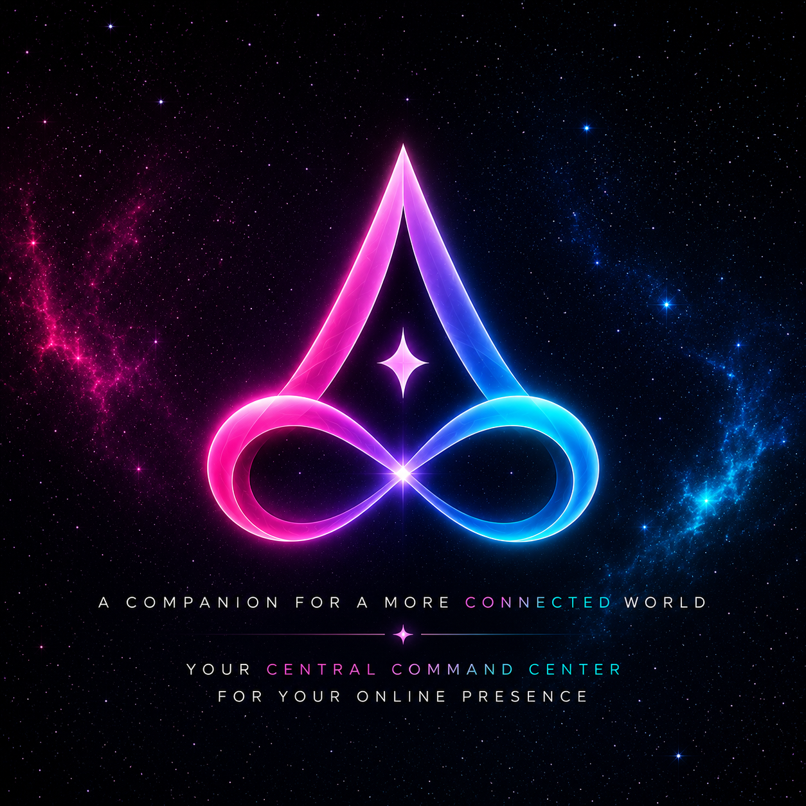

#

<div align="center">

  <a href="https://aerealith.com">
    
  </a>

  <h1>Aerealith AI</h1>

  <p>
    <strong>A secure, modular platform for building connected digital experiences.</strong>
  </p>

  <p>
    Website · Web Application · Documentation · Developer Portal · Platform Services · Discord Management
  </p>

  <p>
    <a href="https://github.com/SinLess-Games/Aerealith/actions/workflows/00-ci.yaml">
      
    </a>
    <a href="https://sonarcloud.io/summary/new_code?id=SinLess-Games_Aerealith">
      
    </a>
    <a href="https://github.com/SinLess-Games/Aerealith/actions/workflows/08-codeql.yaml">
      
    </a>
    <a href="https://github.com/SinLess-Games/Aerealith/actions/workflows/10-snyk.yaml">
      
    </a>
  </p>

  <p>
    
    
    
    
  </p>

  <p>
    <a href="https://github.com/SinLess-Games/Aerealith/issues">Issues</a>
    ·
    <a href="https://github.com/SinLess-Games/Aerealith/pulls">Pull Requests</a>
    ·
    <a href="https://github.com/SinLess-Games/Aerealith/actions">Actions</a>
    ·
    <a href="https://github.com/orgs/SinLess-Games/projects/3">Project Board</a>
    ·
    <a href="https://github.com/SinLess-Games/Aerealith/security">Security</a>
  </p>

</div>

---

## ✨ What Is Aerealith?

**Aerealith** is a modular platform built to unify the public website, authenticated web application, documentation, developer portal, backend services, automation, and community tooling into one coherent ecosystem.

The project is designed around a simple idea:

> Build shared foundations once. Reuse them everywhere. Keep every part understandable.

Aerealith is being developed as a secure, type-safe, maintainable monorepo with clear boundaries between applications, services, shared libraries, infrastructure, and automation.

---

## 🧭 Platform Vision

| Area                      | Purpose                                                                                                        |
| ------------------------- | -------------------------------------------------------------------------------------------------------------- |
| **Public Experience**     | Website, product information, contact flows, and platform discovery.                                           |
| **Web Application**       | Authenticated user experience, account management, platform settings, and future product modules.              |
| **Documentation**         | Guides, technical documentation, onboarding, and platform knowledge.                                           |
| **Developer Portal**      | Internal and external developer experience, service documentation, API discovery, and integrations.            |
| **Platform Services**     | Authentication, user management, APIs, background processes, and future edge services.                         |
| **Discord Platform**      | A modular Discord management system with independently configurable server modules.                            |
| **Shared Foundation**     | Contracts, schemas, errors, validation, types, utilities, configuration, and UI primitives.                    |
| **Security & Operations** | Automated validation, quality gates, code scanning, dependency review, observability, and controlled delivery. |

---

## 🏗️ Repository Architecture

```text
Aerealith/
├── apps/
│   ├── frontend/              # Website, web app, docs, and developer portal
│   └── services/
│       ├── auth/              # Authentication service
│       ├── user/              # User and profile service
│       └── discord/           # Future Discord platform service
│
├── libs/
│   ├── core/                  # Shared domain types, contracts, schemas, errors, constants
│   ├── db/                    # Database entities, persistence, migrations, and data access
│   ├── api/                   # Shared API abstractions and transport support
│   ├── ui/                    # Shared user-interface primitives and components
│   ├── utils/                 # Shared reusable utilities
│   ├── config/                # Centralized configuration support
│   └── flags/                 # Feature-flag support
│
├── .github/
│   ├── config/                # Repository automation and policy configuration
│   ├── instructions/          # Coding-agent and repository instructions
│   ├── workflows/             # CI, security, orchestration, and delivery workflows
│   ├── ISSUE_TEMPLATE/        # Structured issue forms
│   └── PULL_REQUEST_TEMPLATE/ # Pull request templates
│
└── docs/                      # Project documentation as the repository grows
```

### Dependency Direction

```text
apps/* and services/* → libs/*
libs/*                → libs/core
libs/*                ✕ other libs by default
```

The default rule is intentionally strict:

```text
Libraries may depend on libs/core.
Libraries should avoid depending on each other unless there is a clear,
intentional reason to do so.
```

This keeps the platform easier to test, reuse, migrate, and self-host later.

---

## 🧱 Core Principles

<table>
  <tr>
    <td width="50%">
      <h3>Keep It Simple</h3>
      <p>Prefer the smallest complete solution over elaborate abstractions.</p>
    </td>
    <td width="50%">
      <h3>Type Safety First</h3>
      <p>Use strict TypeScript, runtime validation, explicit contracts, and predictable errors.</p>
    </td>
  </tr>
  <tr>
    <td width="50%">
      <h3>Security by Default</h3>
      <p>Protect sensitive data, use least privilege, validate inputs, and require human review for high-risk work.</p>
    </td>
    <td width="50%">
      <h3>Shared Foundations</h3>
      <p>Place reusable platform concepts in shared libraries instead of duplicating them across services.</p>
    </td>
  </tr>
  <tr>
    <td width="50%">
      <h3>Modular by Design</h3>
      <p>Features, services, and Discord modules should be independently understandable and configurable.</p>
    </td>
    <td width="50%">
      <h3>Automation with Guardrails</h3>
      <p>Automate repetitive work, but keep security-sensitive and high-impact decisions under human control.</p>
    </td>
  </tr>
</table>

---

## 🚀 Getting Started

### Requirements

- **Node.js 24**
- **pnpm 10.23.0**
- **Git**
- Optional: Docker for container-focused development and security scanning

### Install

```bash
git clone https://github.com/SinLess-Games/Aerealith.git
cd Aerealith

pnpm install --frozen-lockfile
```

### Validate the Workspace

```bash
pnpm exec nx run-many -t lint typecheck test build
```

### Explore the Project Graph

```bash
pnpm exec nx graph
```

### Run Focused Validation

```bash
pnpm exec nx lint <project-name>
pnpm exec nx typecheck <project-name>
pnpm exec nx test <project-name>
pnpm exec nx build <project-name>
```

---

## 🛠️ Development Workflow

### 1. Create or Select an Issue

Every meaningful change should begin with a tracked Issue whenever practical.

Issues are used to capture:

- Scope
- Acceptance criteria
- Priority
- Risk
- Milestone
- Area ownership
- Agent eligibility
- Validation expectations

### 2. Create a Focused Branch

```bash
git checkout -b feature/123-short-description
```

### 3. Make the Smallest Complete Change

Keep changes focused.

Avoid unrelated refactors, dependency churn, generated-file edits, or broad formatting changes unless they are part of the issue.

### 4. Validate Before Opening a Pull Request

```bash
pnpm exec nx run-many -t lint typecheck test build
```

### 5. Open a Pull Request

Use a Conventional Commit-style title:

```text
feat(frontend): add account settings page
fix(auth): reject expired refresh tokens
refactor(core): simplify error serialization
docs(devportal): document API authentication
ci(repo): add security validation workflow
```

Use the appropriate Pull Request template and link the related Issue when required.

---

## 🔐 Security

Aerealith treats security as a product feature, not an afterthought.

The repository security program is designed to include:

- CodeQL language coverage
- SonarQube Cloud quality gates
- Semgrep static analysis
- DevSkim secure-coding checks
- njsscan JavaScript and TypeScript analysis
- Snyk dependency and code analysis
- Trivy filesystem, secret, misconfiguration, and container scanning
- Dockerfile and Compose configuration review
- Dependency automation with human approval gates
- Controlled security remediation workflows
- Human review for sensitive changes

High-risk changes are never automatically merged.

Examples of work that always requires human review:

```text
Authentication and authorization changes
Session, token, credential, and consent handling
Database migrations and schema changes
Dependency and lockfile changes
Dockerfiles, container images, and Compose files
Cloudflare, infrastructure, CI, and GitHub Actions changes
Security-sensitive findings
Breaking API or contract changes
```

### Reporting a Vulnerability

Please **do not post exploit details, credentials, sensitive logs, or proof-of-concept attack steps in a public Issue**.

Use the repository’s **Security** tab and private vulnerability-reporting flow when available.

---

## ✅ Quality Gates

Aerealith uses layered validation to keep changes reliable:

| Gate                  | Purpose                                                                |
| --------------------- | ---------------------------------------------------------------------- |
| **Lint**              | Enforces code quality, consistency, and maintainable patterns.         |
| **Typecheck**         | Verifies strict TypeScript correctness.                                |
| **Test**              | Validates expected behavior and prevents regressions.                  |
| **Build**             | Confirms projects can compile and package successfully.                |
| **SonarQube Cloud**   | Tracks code quality, reliability, maintainability, and quality gates.  |
| **Security Scanning** | Detects dependency, secret, code, infrastructure, and container risks. |
| **Human Review**      | Protects high-impact changes and verifies automation decisions.        |

---

## 🛡️ Security Automation

Repository security behavior is defined through policy files under:

```text
.github/config/
```

Important policy files include:

```text
security.yaml
routing.yaml
workers.yaml
reviewers.yaml
dependency-policy.yaml
labels.yaml
milestones.yaml
project.yaml
```

These files define:

- Which scanners can run
- Required security thresholds
- Issue and Pull Request routing
- Human-only work boundaries
- Coding-agent eligibility
- Dependency update policy
- Reviewer policy
- Milestone routing
- Project automation behavior

---

## 🗺️ Roadmap

### Foundation

- [x] Nx monorepo foundation
- [x] Shared library boundaries
- [x] TypeScript-first architecture
- [x] Repository automation policy
- [x] Security scanning policy
- [ ] Complete baseline CI validation
- [ ] Complete GitHub Project automation

### Identity and User Platform

- [ ] Sign-up and login flows
- [ ] Refresh-token lifecycle
- [ ] Email verification
- [ ] User profiles
- [ ] Preferences and settings
- [ ] Consent management
- [ ] Secure account recovery flows

### Platform Services

- [ ] Shared API standards
- [ ] Typed service contracts
- [ ] Database persistence and migrations
- [ ] Observability and structured logging
- [ ] Feature flags
- [ ] Edge-service support

### Frontend and Developer Experience

- [ ] Public website
- [ ] Authenticated web application
- [ ] Documentation experience
- [ ] Developer portal
- [ ] Shared component system
- [ ] Accessibility baseline

### Discord Platform

- [ ] Modular Discord bot architecture
- [ ] Per-server module settings
- [ ] Moderation tooling
- [ ] Role and automation support
- [ ] Ticket workflows
- [ ] Audit and transcript controls
- [ ] Dashboard integration

### Operations and Security

- [ ] CodeQL workflow coverage
- [ ] SonarQube Cloud integration
- [ ] Semgrep and Trivy reporting
- [ ] Snyk dependency reporting
- [ ] Container-image scanning
- [ ] Controlled remediation workflows
- [ ] Observability dashboards
- [ ] Deployment automation

---

## 🤝 Contributing

Contributions should be intentional, focused, and easy to review.

Before opening a Pull Request:

- [ ] Read the relevant repository instructions.
- [ ] Keep the change scoped to the Issue.
- [ ] Add or update tests where practical.
- [ ] Run relevant lint, typecheck, test, and build commands.
- [ ] Update documentation when behavior changes.
- [ ] Avoid adding secrets, credentials, or private data.
- [ ] Include screenshots or recordings for user-interface changes.
- [ ] Link the related Issue when required.
- [ ] Follow the configured Conventional Commit title format.

---

## 📁 Important Repository Links

| Resource                     | Location                                                                         |
| ---------------------------- | -------------------------------------------------------------------------------- |
| Issue Templates              | [`.github/ISSUE_TEMPLATE`](.github/ISSUE_TEMPLATE)                               |
| Pull Request Templates       | [`.github/PULL_REQUEST_TEMPLATE`](.github/PULL_REQUEST_TEMPLATE)                 |
| Repository Automation Config | [`.github/config`](.github/config)                                               |
| Agent Instructions           | [`.github/instructions`](.github/instructions)                                   |
| GitHub Actions               | [`.github/workflows`](.github/workflows)                                         |
| Security Policy Config       | [`.github/config/security.yaml`](.github/config/security.yaml)                   |
| Dependency Policy            | [`.github/config/dependency-policy.yaml`](.github/config/dependency-policy.yaml) |
| GitHub Project               | [Aerealith Delivery](https://github.com/orgs/SinLess-Games/projects/3)           |

---

<div align="center">

  <p>
    <strong>Built by SinLess Games.</strong>
  </p>

  <p>
    Aerealith is being built carefully: secure by default, modular by design, and focused on foundations that last.
  </p>

  <p>
    <a href="https://github.com/SinLess-Games/Aerealith/issues">Report an Issue</a>
    ·
    <a href="https://github.com/SinLess-Games/Aerealith/security">Security</a>
    ·
    <a href="https://github.com/orgs/SinLess-Games/projects/3">Project Board</a>
  </p>

</div>
