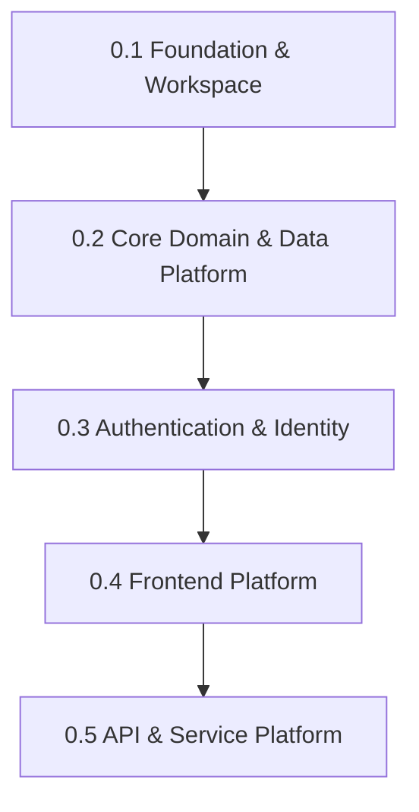

# 0.1 — Foundation & Workspace

Release `0.1` establishes the foundation for the Aerealith AI repository, workspace, tooling, documentation structure, and early development standards.

This release is not about shipping product features.

It is about making sure the project can be built, checked, formatted, documented, and expanded without chaos.

---

## Release Goal

The goal of `0.1 — Foundation & Workspace` is to create a clean, reliable development foundation for Aerealith AI.

This release should prove:

```text
Aerealith has a stable repo foundation that developers can build from.
```

Before Aerealith can ship Discord modules, AI assistant features, workflows, dashboards, integrations, or marketplace systems, the workspace itself needs to be predictable.

---

## Why This Release Exists

Aerealith AI is planned as a large modular platform.

That means the project needs strong foundations early:

- workspace structure
- package management
- TypeScript standards
- linting
- formatting
- commit rules
- documentation structure
- app/library boundaries
- build scripts
- development commands
- deployment assumptions
- Docker expectations
- CI readiness

Bad foundations turn into expensive rewrites later.

Release `0.1` exists to prevent that.

---

## Scope Summary

This release focuses on:

```text
Nx workspace
pnpm workspace
Node version standard
TypeScript foundation
ESLint
Prettier
Commitlint
Base package scripts
Initial app/library structure
Initial documentation structure
Initial Docker expectations
Initial CI foundation
Initial release documentation
```

---

## This Release Is About

Release `0.1` is about setting up the project so future releases can move faster.

It should answer:

```text
How is the repo structured?
How do developers install dependencies?
How do developers run checks?
How do developers format code?
How do developers lint code?
How do developers build the project?
Where do docs live?
Where do apps live?
Where do libraries live?
What standards do we follow?
```

---

## This Release Is Not About

Release `0.1` should not include major product features.

The following are out of scope:

```text
Authentication
User accounts
Discord bot features
Dashboard product features
AI assistant behavior
Workflow automation
Marketplace
Billing
Database-heavy product work
Advanced integrations
Self-hosting support
Mobile app
Desktop app
Production launch
```

Some placeholder structure may exist, but full implementation belongs to later releases.

---

## Release Documents

This folder contains the planning and tracking documents for release `0.1`.

| Document                                            | Purpose                                                                               |
| --------------------------------------------------- | ------------------------------------------------------------------------------------- |
| [Release](./Release.md)                             | Defines the release goal, scope, risks, dependencies, and exit criteria.              |
| [Features](./Features.md)                           | Lists the features and capabilities included in this release.                         |
| [Architecture Changes](./Architecture%20Changes.md) | Documents structural, workspace, and architecture changes introduced by this release. |
| [Tasks](./Tasks.md)                                 | Converts the release scope into actionable work items.                                |
| [Testing](./Testing.md)                             | Defines how to verify the release technically.                                        |
| [Checklist](./Checklist.md)                         | Final go/no-go checklist before marking the release complete.                         |
| [Breaking Changes](./Breaking%20Changes.md)         | Documents breaking changes introduced by this release.                                |

---

## Recommended Reading Order

Read these files in this order:

1. [Release.md](./Release.md)
2. [Features.md](./Features.md)
3. [Architecture Changes.md](./Architecture%20Changes.md)
4. [Tasks.md](./Tasks.md)
5. [Testing.md](./Testing.md)
6. [Checklist.md](./Checklist.md)
7. [Breaking Changes.md](./Breaking%20Changes.md)

This order moves from release intent to implementation detail to verification.

---

## Relationship to the Roadmap

Release `0.1` is the first release in the Aerealith milestone path.

```text
0.1 — Foundation & Workspace
0.2 — Core Domain & Data Platform
0.3 — Authentication & Identity
0.4 — Frontend Platform
0.5 — API & Service Platform
0.6 — Developer Portal & Integrations
0.7 — Discord Platform Foundation
0.8 — Moderation, Tickets & Community Operations
0.9 — Observability & Reliability
1.0 — Private Beta
1.1 — MVP Production Launch
```

Release `0.1` must be completed before later releases can safely build on top of the repo.

---

## Release Position



---

## Primary Outcomes

By the end of this release, Aerealith should have:

- a working Nx workspace
- pnpm configured
- Node version expectations documented
- TypeScript configured
- linting configured
- formatting configured
- commit rules configured
- base app/library structure
- initial documentation folders
- initial release docs
- common package scripts
- basic CI readiness
- early Docker expectations
- clear project standards

---

## Expected Repository Foundations

The repository should support a structure similar to:

```text
apps/
├── frontend/
└── api/

libs/
├── api/
├── content/
├── contracts/
├── core/
├── db/
├── flags/
├── observability/
└── ui/

docs/
├── README.md
├── vision/
├── product/
├── releases/
├── architecture/
├── engineering/
├── services/
├── modules/
├── integrations/
├── api/
├── operations/
└── rfcs/
```

The exact structure may evolve, but release `0.1` should establish the first stable version.

---

## Workspace Standards

Release `0.1` should establish the workspace standards that later releases follow.

## Package Manager

Aerealith should use:

```text
pnpm
```

## Monorepo Tooling

Aerealith should use:

```text
Nx
```

## Runtime

Aerealith should standardize around:

```text
Node 24.x
```

## Language

Aerealith should primarily use:

```text
TypeScript
```

## Style

Aerealith should follow:

```text
Strong typing
KISS principles
Minimal dependencies
Clear boundaries
Predictable scripts
Useful documentation
```

---

## Library Boundary Rule

The default library dependency rule should be:

```text
libs/* may depend on libs/core only.
```

Cross-library dependencies should be avoided unless explicitly allowed.

This helps keep the monorepo clean and prevents dependency spaghetti early.

---

## Initial Library Purpose

| Library              | Purpose                                                                         |
| -------------------- | ------------------------------------------------------------------------------- |
| `libs/core`          | Shared constants, errors, utils, primitive types, and foundational logic.       |
| `libs/contracts`     | Shared API contracts, DTOs, schemas, and interface boundaries.                  |
| `libs/api`           | API helpers, routing patterns, service-facing utilities.                        |
| `libs/db`            | Database entities, schema patterns, migrations, and data access foundations.    |
| `libs/ui`            | Shared frontend UI components and design system foundations.                    |
| `libs/content`       | Shared content, copy, docs/content helpers, and structured content foundations. |
| `libs/flags`         | Feature flag helpers and configuration boundaries.                              |
| `libs/observability` | Logging, metrics, tracing, and diagnostics helpers.                             |

---

## Required Commands

Release `0.1` should define or prepare commands similar to:

```text
pnpm install
pnpm lint
pnpm format
pnpm typecheck
pnpm test
pnpm build
```

Additional commands may exist, but these should be the core expectation.

---

## Documentation Foundations

Release `0.1` should ensure the documentation system exists and is easy to navigate.

Required documentation areas:

```text
docs/README.md
docs/vision/
docs/product/
docs/releases/
docs/releases/README.md
docs/releases/0.1/
```

The project should treat documentation as part of the product, not as an afterthought.

---

## Docker Expectations

Full self-hosting is not part of release `0.1`.

However, deployable apps and services should be designed with Docker in mind from the beginning.

Release `0.1` should establish the expectation that future deployable apps/services will have Dockerfiles.

This supports the long-term self-hosting direction without blocking early cloud-first development.

---

## CI Expectations

Release `0.1` should prepare the project for CI.

A basic CI flow should eventually verify:

```text
install
lint
typecheck
test
build
```

Full deployment automation can come later.

---

## Product Impact

Release `0.1` does not directly ship user-facing product features.

Its product impact is indirect but important.

It enables future work on:

- dashboard
- Discord bot
- assistant
- modules
- workflows
- integrations
- audit logs
- developer APIs
- marketplace
- self-hosting

A bad `0.1` slows everything after it.

A strong `0.1` makes every future release easier.

---

## Engineering Impact

Release `0.1` should make engineering easier by creating:

- predictable folder structure
- shared tooling
- consistent code formatting
- repeatable checks
- clear package boundaries
- release tracking docs
- early standards for future services and libraries

---

## Trust Impact

Even though `0.1` is mostly technical, it still supports trust.

Trust starts with maintainable systems.

A messy foundation makes it harder to build secure, auditable, reliable product behavior later.

---

## Completion Criteria

Release `0.1` is complete when:

```text
The workspace installs successfully.
The project has a clear folder structure.
Core tooling is configured.
Basic scripts exist.
Docs structure exists.
Release documentation exists.
The repo can be linted.
The repo can be formatted.
The repo can be typechecked.
The repo can be built or has a documented build path.
Initial CI expectations are documented.
Future releases have a stable foundation to build on.
```

---

## Success Standard

Release `0.1` succeeds when a developer can clone the repo, install dependencies, understand the structure, run core checks, and know where future work belongs.

The standard is:

> Aerealith has a clean foundation that future product, architecture, engineering, Discord, AI, automation, and integration work can safely build on.
