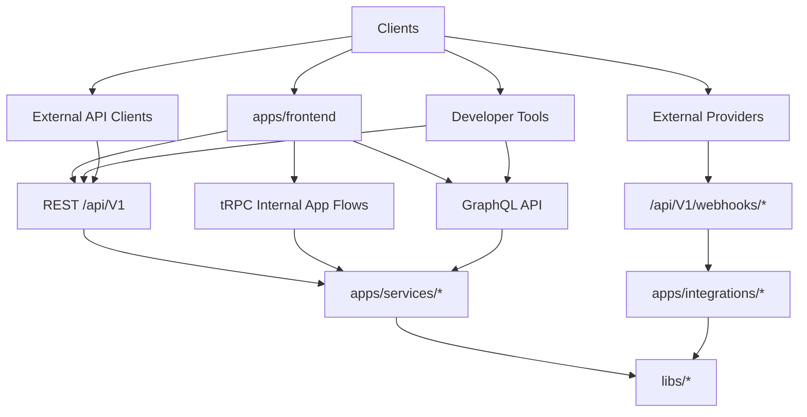
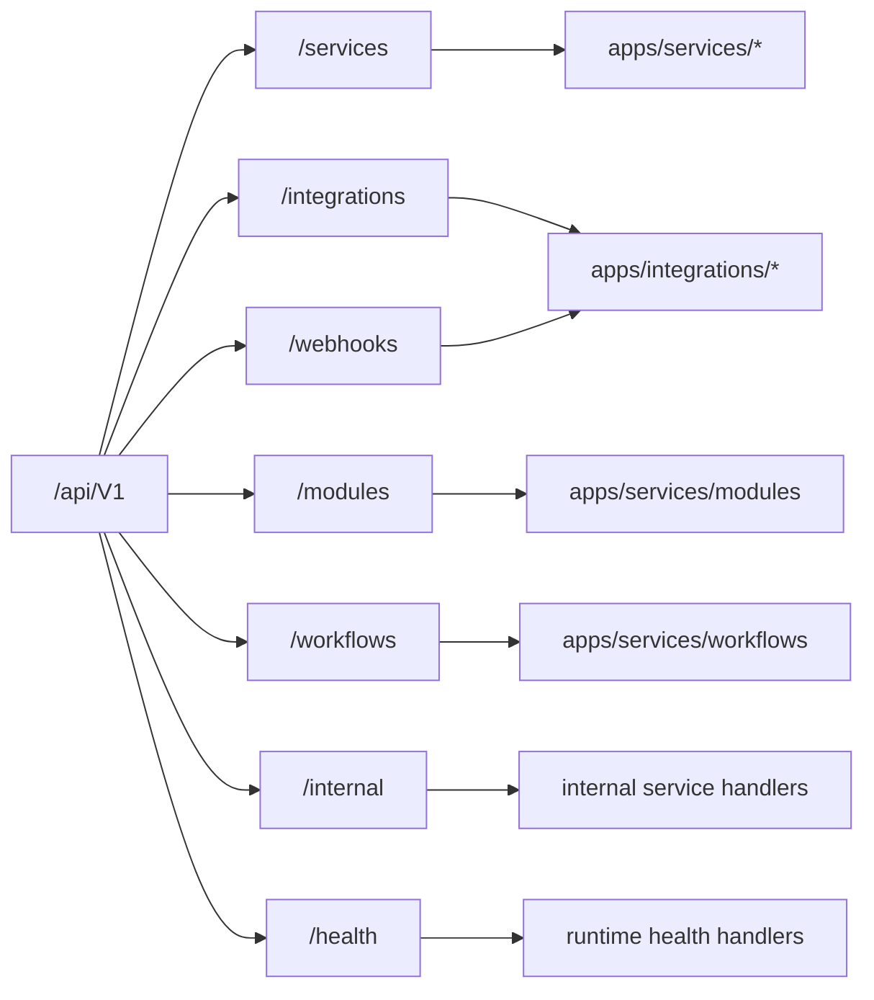
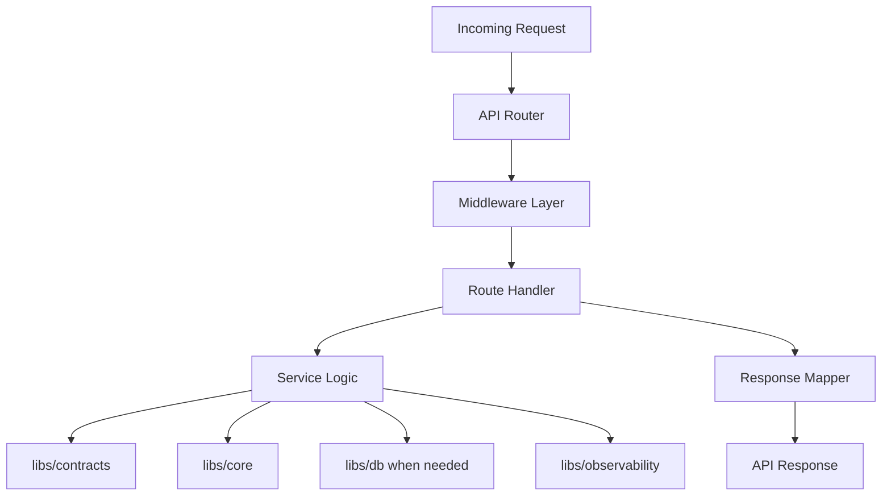
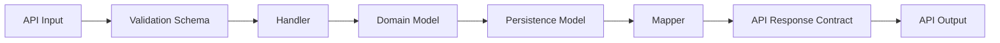
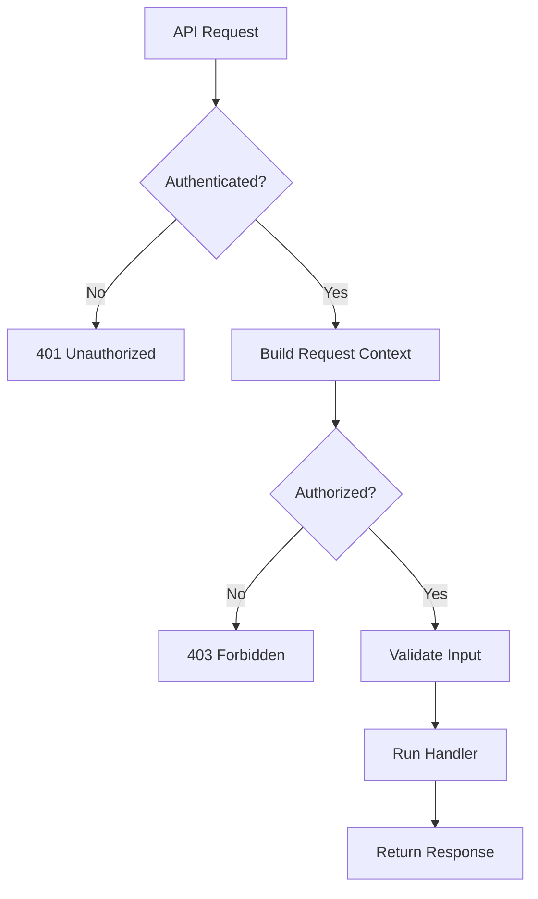
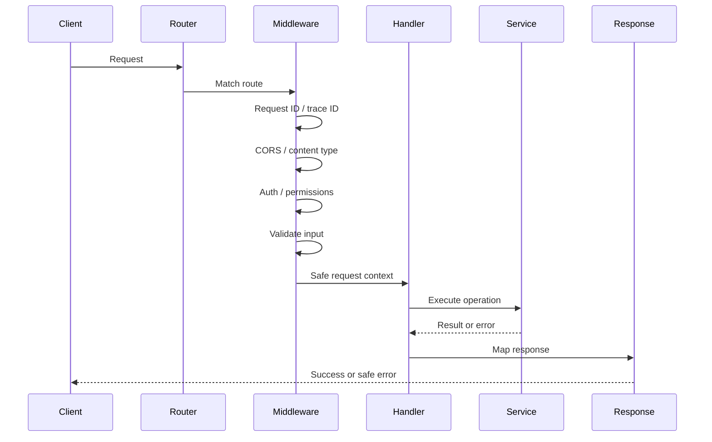

# API Architecture

Status: Draft
Owner: Tim Pierce / SinLess Games
Last Updated: 2026-07-09
Related RFCs:

- `docs/rfcs/0002-monorepo-library-boundaries.md`
- `docs/rfcs/0003-api-versioning-and-route-strategy.md`
- `docs/rfcs/0004-error-and-result-model.md`
- `docs/rfcs/0005-entity-schema-and-contract-strategy.md`

---

## Purpose

This document defines the API architecture for Aerealith AI.

The API layer is the contract between Aerealith frontend apps, services, integrations, workflows,
developer tools, and future external clients.

The goal is to keep Aerealith APIs:

```text
versioned
predictable
secure
typed
validated
observable
documented
provider-neutral
easy to test
easy to evolve
```

The API should be boring where it needs to be boring, flexible where it needs to be flexible, and
never a secret tunnel into backend chaos. 🧌

---

## Architecture Summary

Aerealith uses a multi-style API architecture.

The stable public API boundary is:

```text
/api/V1/
```

Aerealith supports these API styles:

| API Style     | Primary Use                                                                   |
| ------------- | ----------------------------------------------------------------------------- |
| REST          | Stable public API boundary and documented platform behavior.                  |
| tRPC          | Internal typed app flows where tight TypeScript integration helps.            |
| GraphQL       | Complex developer, data exploration, relationship-heavy, and portal surfaces. |
| Webhooks      | External provider event ingress.                                              |
| Health APIs   | Runtime health, readiness, and operational checks.                            |
| Internal APIs | Internal-only service and platform operations.                                |

The default rule:

> REST under `/api/V1/` is the stable public boundary. tRPC is allowed for internal typed app flows.
> GraphQL is supported for complex developer and data exploration surfaces.

---

## Core API Principles

Aerealith APIs should follow these principles:

```text
Version public APIs from the beginning.
Keep routes predictable.
Validate all boundary input.
Return consistent success and error shapes.
Use safe public error messages.
Include request IDs and trace IDs where practical.
Separate public APIs from internal APIs.
Keep contracts separate from persistence models.
Avoid provider lock-in in shared API shapes.
Prefer explicit permissions over hidden assumptions.
Document behavior before it becomes permanent.
```

---

## API Surface Overview



---

## API Versioning Standard

The canonical versioned API prefix is:

```text
/api/V#/
```

The first stable API version is:

```text
/api/V1/
```

Examples:

```text
/api/V1/services/users
/api/V1/services/accounts
/api/V1/integrations/github
/api/V1/modules
/api/V1/workflows
/api/V1/webhooks/github
/api/V1/health
```

Do not use:

```text
/api/v1/
/v1/api/
/api/1/
/api/version1/
```

The uppercase `V` is intentional.

---

## API Route Categories

Aerealith API routes should be grouped by platform responsibility.

| Route Prefix            | Purpose                                                           |
| ----------------------- | ----------------------------------------------------------------- |
| `/api/V1/services/`     | Platform-owned service APIs.                                      |
| `/api/V1/integrations/` | Integration connection, settings, sync, and provider-facing APIs. |
| `/api/V1/modules/`      | Module registry, module settings, and module lifecycle APIs.      |
| `/api/V1/workflows/`    | Workflow definitions, runs, approvals, and automation APIs.       |
| `/api/V1/webhooks/`     | External provider webhook ingress.                                |
| `/api/V1/internal/`     | Internal-only API routes.                                         |
| `/api/V1/health/`       | Health, readiness, liveness, and status APIs.                     |

---

## Route Category Diagram



---

## REST API Architecture

REST is the stable public API boundary.

REST should be used for:

```text
documented public API behavior
frontend stable API calls
developer portal stable examples
external API clients
SDK generation later
OpenAPI generation later
provider-neutral platform behavior
```

REST routes should use:

```text
/api/V1/
```

REST should be resource-oriented by default.

Examples:

```text
GET /api/V1/services/users/{userId}
PATCH /api/V1/services/users/{userId}
GET /api/V1/integrations/github
POST /api/V1/integrations/github/connect
POST /api/V1/modules/{moduleId}/enable
POST /api/V1/workflows/{workflowId}/approve
```

---

## REST Route Rules

REST routes should follow these rules:

```text
Use nouns for resources.
Use lowercase route segments after /api/V#/.
Use kebab-case for multi-word route segments.
Use explicit actions only when resource modeling becomes unclear.
Use descriptive path parameter names.
Do not expose persistence implementation details.
Do not encode destructive actions in query parameters.
```

Good:

```text
GET /api/V1/services/users/{userId}
PATCH /api/V1/services/accounts/{accountId}/settings
POST /api/V1/workflows/{workflowId}/approve
POST /api/V1/integrations/github/sync
```

Avoid:

```text
GET /api/V1/users?id=delete
POST /api/V1/doThing
GET /api/V1/database/user-table/{id}
POST /api/V1/integrations/GitHub/RunStuff
```

---

## HTTP Method Strategy

Use HTTP methods consistently.

| Method   | Use                                           |
| -------- | --------------------------------------------- |
| `GET`    | Read data.                                    |
| `POST`   | Create resources or trigger explicit actions. |
| `PUT`    | Replace a resource.                           |
| `PATCH`  | Partially update a resource.                  |
| `DELETE` | Delete, disconnect, or remove a resource.     |

Examples:

```text
GET /api/V1/modules
GET /api/V1/modules/{moduleId}
POST /api/V1/modules/{moduleId}/enable
PATCH /api/V1/modules/{moduleId}/settings
DELETE /api/V1/integrations/github
```

---

## tRPC Architecture

tRPC is allowed for internal typed app flows.

tRPC is useful when:

```text
frontend and backend are developed together
tight TypeScript inference improves speed
the route is internal to the Aerealith app experience
the contract is not intended as the primary public API
the data shape changes faster than public API contracts
```

tRPC should not replace REST as the stable public boundary.

The public developer-facing API remains:

```text
/api/V1/
```

tRPC should be treated as an internal application convenience layer.

---

## tRPC Rules

tRPC routes should follow these rules:

```text
Use for internal typed frontend flows.
Keep procedures permission-aware.
Validate inputs with schemas.
Return safe error shapes.
Do not expose backend implementation details.
Do not make tRPC the only way to access stable platform behavior.
Avoid using tRPC for external provider callbacks.
Avoid using tRPC as the public SDK foundation unless a future RFC approves it.
```

tRPC client setup should live in:

```text
apps/frontend/src/lib/trpc/
apps/frontend/src/app/providers/
```

Shared contracts and schemas should live in:

```text
libs/contracts
libs/core
```

---

## GraphQL Architecture

GraphQL is supported for complex developer and data exploration surfaces.

Aerealith uses Apollo Client on the frontend.

GraphQL is useful for:

```text
developer portal data exploration
API explorer experiences
event explorer experiences
relationship-heavy dashboard data
complex filtering and nested reads
future analytics-style developer surfaces
```

GraphQL should not replace all REST routes.

GraphQL is an additional API surface for use cases where graph-shaped access earns its complexity.

---

## GraphQL Rules

GraphQL should follow these rules:

```text
Use GraphQL where flexible graph-like querying helps.
Keep permission checks field-aware where needed.
Avoid exposing private fields by default.
Do not mirror database schema directly.
Do not expose persistence entities as GraphQL types.
Validate mutations.
Use safe error responses.
Keep schema documented.
```

GraphQL types should be designed as API contracts, not database models.

---

## API Style Decision Matrix

| Need                             | API Style       |
| -------------------------------- | --------------- |
| Stable public platform API       | REST `/api/V1/` |
| External client compatibility    | REST `/api/V1/` |
| SDK generation later             | REST `/api/V1/` |
| Internal typed frontend flow     | tRPC            |
| Developer data exploration       | GraphQL         |
| Complex relationship-heavy reads | GraphQL         |
| External provider events         | Webhooks        |
| Runtime readiness                | Health API      |
| Private operational behavior     | Internal API    |

---

## Webhook Architecture

Webhooks are external provider ingress points.

Webhook routes use:

```text
/api/V1/webhooks/{providerId}
```

Examples:

```text
/api/V1/webhooks/github
/api/V1/webhooks/google
/api/V1/webhooks/cloudflare
/api/V1/webhooks/email
```

Webhooks should usually map to:

```text
apps/integrations/{providerId}
```

or provider-specific handlers inside an integration runtime.

---

## Webhook Requirements

Webhook handlers should support:

```text
signature verification where supported
idempotency protection where practical
provider event validation
safe error handling
structured logs
request IDs
trace IDs
rate limit awareness
replay protection where possible
clear retry behavior
```

Webhook handlers should not trust provider payloads blindly.

Provider payloads are external input.

External input gets validated. Always.

---

## Health API Architecture

Health APIs should use:

```text
/api/V1/health/
```

Examples:

```text
GET /api/V1/health
GET /api/V1/health/readiness
GET /api/V1/health/liveness
GET /api/V1/health/integrations
```

Health APIs should support:

```text
deployment checks
runtime checks
readiness checks
liveness checks
dependency checks
integration availability checks
```

Public health endpoints should expose minimal information.

Protected internal health endpoints may expose richer diagnostics.

---

## Internal API Architecture

Internal APIs use:

```text
/api/V1/internal/
```

Examples:

```text
/api/V1/internal/jobs
/api/V1/internal/queues
/api/V1/internal/diagnostics
/api/V1/internal/scheduled-tasks
```

Internal APIs are not public contracts.

They may change faster than public APIs.

Internal APIs still require:

```text
authentication where needed
authorization where needed
validation
logging
safe errors
request tracing
```

Internal does not mean sloppy.

Internal just means not public API.

---

## API Runtime Placement

API runtime code should live under:

```text
apps/services/
apps/integrations/
```

Shared API helpers should live under:

```text
libs/api
```

Shared contracts should live under:

```text
libs/contracts
```

Core primitives should live under:

```text
libs/core
```

Database access should live under:

```text
libs/db
```

---

## API Runtime Diagram



---

## Hono Direction

Aerealith service runtimes may use Hono for HTTP APIs and Worker-friendly routing.

Hono is a good fit for:

```text
Cloudflare Workers
small service routers
middleware composition
typed route helpers
edge-friendly APIs
simple HTTP handlers
```

Hono should be treated as an implementation tool, not the architecture itself.

API contracts and route standards should remain Aerealith-owned.

---

## Cloudflare Workers Runtime

Cloudflare Workers is a primary runtime target.

API architecture should stay compatible with Workers by default.

Worker-friendly API behavior includes:

```text
Fetch API-compatible handlers
small runtime boundaries
edge-compatible dependencies
no Node-only assumptions unless compatibility is intentional
explicit environment binding access
request/response standard APIs
```

Do not casually add API dependencies that break Worker compatibility.

---

## Docker and Kubernetes Runtime

APIs should also remain compatible with Docker and Kubernetes.

Docker and Kubernetes support allows:

```text
self-hosting
enterprise deployments
local production-like testing
service portability
future cloud independence
```

Runtime code should avoid hard-locking to one provider.

Provider-specific code should be isolated behind adapters or integration boundaries.

---

## API Boundary Libraries

| Library              | API Role                                                                    |
| -------------------- | --------------------------------------------------------------------------- |
| `libs/core`          | Errors, results, primitives, schemas, IDs, enums, shared types.             |
| `libs/contracts`     | API request and response contracts, DTOs, versioned schemas.                |
| `libs/api`           | API helpers, middleware helpers, response mappers, request context helpers. |
| `libs/db`            | Persistence, repositories, queries, transactions, database mappers.         |
| `libs/observability` | Logs, traces, metrics, diagnostics, request instrumentation.                |
| `libs/flags`         | Feature flag checks and rollout decisions.                                  |

---

## Contract Strategy

API contracts should live in:

```text
libs/contracts
```

Versioned public contracts should align with:

```text
/api/V#/
```

Example structure:

```text
libs/contracts/src/api/V1/services/users/create-user.request.ts
libs/contracts/src/api/V1/services/users/create-user.response.ts
libs/contracts/src/api/V1/services/users/user.response.ts
```

Contracts should define:

```text
request body
response body
path params where useful
query params where useful
validation schema
inferred TypeScript type
```

---

## Schema Validation Strategy

Aerealith should validate data at API boundaries.

Validation should happen for:

```text
request bodies
path params
query params
headers where needed
webhook payloads
GraphQL mutation input
tRPC procedure input
internal route input
environment-derived API config
```

Schemas should be based on the project schema strategy.

Zod is the preferred runtime validation library where practical.

---

## Entity and Contract Separation

API contracts are not database entities.

Database entities are not API responses.

Important rules:

```text
Do not return persistence entities directly from APIs.
Do not expose database table names in public API contracts.
Do not expose internal database IDs unless intentionally public.
Do not expose private fields accidentally.
Use mappers between persistence, domain, and contract layers.
```

Boundary flow:



---

## Response Shape Strategy

Public API responses should be consistent.

Recommended success response:

```json
{
  "success": true,
  "data": {},
  "requestId": "req_123",
  "traceId": "trace_456"
}
```

Recommended error response:

```json
{
  "success": false,
  "error": {
    "code": "COMMON_NOT_FOUND",
    "message": "The requested resource was not found.",
    "category": "common",
    "retryable": false,
    "requestId": "req_123",
    "traceId": "trace_456",
    "details": null
  }
}
```

The exact contract may evolve, but public APIs should not randomly invent response shapes.

---

## Error Architecture

API errors should follow:

```text
docs/rfcs/0004-error-and-result-model.md
```

The API layer should use:

```text
AerealithError
stable error codes
safe public messages
request IDs
trace IDs
retryable metadata
structured details when safe
```

Public API responses should use safe messages.

Do not expose:

```text
stack traces
database errors
provider secrets
raw auth tokens
private diagnostic details
internal service paths
```

---

## Request Context

Every API request should have a request context where practical.

Request context may include:

```text
requestId
traceId
userId
accountId
organizationId
route
method
environment
feature flags
permissions
locale
user agent where useful
origin where useful
```

Request context should be passed explicitly or through safe framework mechanisms.

Do not hide important behavior in invisible globals.

---

## Request ID and Trace ID

API requests should support:

```text
x-request-id
x-trace-id
```

If a request ID is not provided, Aerealith should generate one where practical.

Request IDs connect:

```text
API responses
logs
errors
audit records
support diagnostics
```

Trace IDs connect:

```text
services
integrations
queues
background jobs
provider callbacks
workflow runs
```

---

## Authentication Architecture

API authentication should remain provider-neutral.

The API must not assume one permanent auth provider in its public architecture.

Auth behavior should be represented through:

```text
session contracts
auth middleware
permission checks
request context
route guards
provider adapters
```

Possible auth providers may change later.

The API contract should not become permanently tied to one provider unless a future RFC approves it.

---

## Authorization Architecture

Authentication answers:

```text
Who are you?
```

Authorization answers:

```text
What are you allowed to do?
```

API routes should check authorization explicitly.

Authorization should consider:

```text
user role
account ownership
organization membership
server/community role
developer access
admin access
feature flags
resource ownership
permission scopes
```

Permission-sensitive routes should fail safely.

---

## Permission Check Diagram



---

## Rate Limiting Strategy

Aerealith APIs should support rate limiting.

Rate limits may apply by:

```text
IP address
user
account
organization
API key
integration provider
route group
environment
```

Rate limit responses should use stable error codes.

Example:

```text
COMMON_RATE_LIMITED
```

Future response metadata may include:

```text
retryAfter
limit
remaining
resetAt
```

Rate limiting should protect the platform without creating mystery failures.

---

## Idempotency Strategy

State-changing API routes should support idempotency where repeated calls are likely.

Useful areas:

```text
payment-like operations later
integration connect callbacks
webhook processing
workflow actions
queue-triggered actions
resource creation
retryable external operations
```

Potential header:

```text
idempotency-key
```

This does not need to be implemented everywhere immediately.

It should be part of the API architecture direction.

---

## Pagination Strategy

List routes should support pagination.

Preferred style:

```text
cursor-based pagination
```

Example query params:

```text
?limit=50
?cursor=abc123
```

Response shape may include:

```json
{
  "success": true,
  "data": [],
  "pagination": {
    "nextCursor": "next_123",
    "hasMore": true
  },
  "requestId": "req_123"
}
```

Offset pagination may be acceptable for small internal surfaces, but cursor pagination is preferred
for scalable public APIs.

---

## Filtering and Sorting Strategy

List routes may support filtering and sorting through query params.

Examples:

```text
?status=active
?type=integration
?sort=createdAt
?direction=desc
```

Filters should be documented.

Unsupported filters should fail clearly.

Do not silently ignore important filter mistakes if they can mislead clients.

---

## API Security Requirements

API routes should protect against common security failures.

Requirements:

```text
validate all input
check authorization
use safe error messages
avoid leaking secrets
verify webhook signatures where supported
use CSRF protections where relevant
enforce CORS/origin rules where relevant
rate limit risky routes
log security-sensitive failures safely
avoid exposing internal stack traces
avoid trusting client-provided identity
```

Security-sensitive API behavior should be reviewed carefully.

---

## CORS and Origin Strategy

CORS and origin handling should be explicit.

Public APIs may allow documented origins.

Authenticated browser APIs should be stricter.

Rules:

```text
Do not allow wildcard origins for sensitive authenticated APIs.
Validate origins where browser credentials are involved.
Keep CORS config centralized.
Document allowed origins per environment.
```

Origin failures should map to a stable error code when practical.

Example:

```text
COMMON_INVALID_ORIGIN
```

---

## Content Type Strategy

API routes should enforce content types where relevant.

Common accepted content type:

```text
application/json
```

Unsupported content types should return a stable error.

Example:

```text
COMMON_UNSUPPORTED_MEDIA_TYPE
```

Large payloads should be rejected with:

```text
COMMON_PAYLOAD_TOO_LARGE
```

---

## WebSocket and Realtime Direction

Realtime APIs are not required by the initial API architecture, but the architecture should allow them
later.

Possible future realtime surfaces:

```text
workflow run updates
notification streams
audit log streams
developer event streams
integration sync status
AI assistant streaming
dashboard live status
```

Potential technologies:

```text
WebSocket
Server-Sent Events
GraphQL subscriptions
provider-specific streams
```

Realtime API design should require a future architecture update or RFC before becoming foundational.

---

## AI API Direction

AI-related APIs should follow the same API rules.

Potential routes:

```text
/api/V1/services/assistant
/api/V1/services/memory
/api/V1/workflows/{workflowId}/approve
/api/V1/workflows/{workflowId}/runs
```

AI APIs must support:

```text
permission checks
approval gates where needed
audit logs where relevant
safe error messages
privacy boundaries
clear user control
graceful degradation when AI is unavailable
```

AI should never be a hidden bypass around the API model.

---

## Integration API Direction

Integration APIs should live under:

```text
/api/V1/integrations/{integrationId}
```

Examples:

```text
/api/V1/integrations/github/connect
/api/V1/integrations/github/callback
/api/V1/integrations/github/sync
/api/V1/integrations/github/health
```

Integration APIs should isolate provider-specific behavior.

Provider-specific details should not leak into provider-neutral service APIs unless intentionally
designed.

---

## Module API Direction

Module APIs should live under:

```text
/api/V1/modules
```

Examples:

```text
GET /api/V1/modules
GET /api/V1/modules/{moduleId}
POST /api/V1/modules/{moduleId}/enable
POST /api/V1/modules/{moduleId}/disable
PATCH /api/V1/modules/{moduleId}/settings
```

Module APIs should support:

```text
module discovery
module settings
enable and disable actions
permission checks
audit events where relevant
safe defaults
```

---

## Workflow API Direction

Workflow APIs should live under:

```text
/api/V1/workflows
```

Examples:

```text
GET /api/V1/workflows
GET /api/V1/workflows/{workflowId}
POST /api/V1/workflows/{workflowId}/approve
POST /api/V1/workflows/{workflowId}/reject
GET /api/V1/workflows/{workflowId}/runs
```

Workflow APIs should support:

```text
approval gates
dry runs
audit logs
execution history
failure details
retry behavior
permission-aware actions
```

Risky workflow actions should require explicit confirmation or approval.

---

## Observability Architecture

API routes should emit useful observability data.

Observability should include:

```text
request logs
error logs
latency metrics
route-level metrics
status code metrics
trace IDs
request IDs
integration failure metrics
validation failure metrics
rate limit metrics
```

Observability should not leak secrets or unnecessary private data.

---

## Audit Relationship

Not every API request is an audit event.

However, some API actions should create audit records.

Examples:

```text
permission changes
integration connections
integration disconnections
module enablement
module disablement
workflow approval
workflow rejection
destructive actions
admin actions
security-sensitive failures
```

Audit events should include enough context to explain what happened.

---

## Documentation Architecture

Public APIs should eventually be documented under:

```text
docs/api/
```

Recommended docs:

```text
docs/api/README.md
docs/api/Versioning.md
docs/api/Routes.md
docs/api/Authentication.md
docs/api/Authorization.md
docs/api/Errors.md
docs/api/Pagination.md
docs/api/Webhooks.md
docs/api/GraphQL.md
docs/api/tRPC.md
```

API docs should align with `/api/V1/`.

Future OpenAPI generation may be added later.

---

## OpenAPI Direction

REST APIs should be designed so OpenAPI generation is possible later.

OpenAPI support would help with:

```text
developer documentation
SDK generation
API testing
contract review
client generation
developer portal examples
```

OpenAPI generation is not required immediately, but route and contract design should not block it.

---

## SDK Direction

Future SDKs should be based on stable API contracts.

SDKs should prefer:

```text
REST /api/V1/ for stable public behavior
generated types from contracts where practical
safe error handling
request ID support
clear auth configuration
```

tRPC should not be the default external SDK foundation unless a future RFC changes that decision.

---

## Testing Strategy

API testing should include:

```text
unit tests
schema validation tests
route handler tests
middleware tests
error serialization tests
authorization tests
integration webhook tests
contract tests
e2e tests for critical flows
```

Coverage requirement:

```text
80% statements
80% branches
80% functions
80% lines
```

API tests should verify both success and failure paths.

---

## API Test Areas

Test these areas first:

```text
route registration
request validation
query validation
path param validation
success response shape
error response shape
safe error messages
request ID propagation
trace ID propagation
authorization failures
not found behavior
rate limit behavior where implemented
webhook signature verification where implemented
```

---

## API File Structure

Recommended service API structure:

```text
apps/services/api/src/
├── app/
│   ├── routes/
│   ├── middleware/
│   ├── handlers/
│   └── server.ts
├── features/
│   ├── users/
│   ├── accounts/
│   ├── modules/
│   ├── workflows/
│   └── health/
├── lib/
│   ├── context/
│   ├── errors/
│   └── validation/
└── worker.ts
```

Recommended shared API helper structure:

```text
libs/api/src/
├── context/
├── errors/
├── middleware/
├── pagination/
├── responses/
├── routes/
├── validation/
└── index.ts
```

Recommended contract structure:

```text
libs/contracts/src/api/V1/
├── services/
├── integrations/
├── modules/
├── workflows/
├── webhooks/
└── health/
```

---

## API Middleware Model

API middleware may handle:

```text
request ID
trace ID
logging
CORS
content type checks
authentication
authorization
rate limiting
validation
error mapping
response headers
```

Middleware should be composable and explicit.

Avoid middleware that hides important authorization or mutation behavior.

---

## Middleware Flow



---

## API Anti-Patterns

Avoid:

```text
unversioned public APIs
random response shapes
throwing strings
returning raw database entities
leaking stack traces
hardcoding provider secrets
trusting webhook payloads without validation
using query params for destructive actions
mixing public and internal routes without clear boundaries
duplicating request/response contracts manually
putting business logic in route files
using tRPC as the only public API
mirroring database schema directly into GraphQL
skipping authorization because a route is internal
```

---

## Migration Notes

Current and future API cleanup should prioritize:

```text
standard /api/V1 route prefix
shared error response mapper
shared success response mapper
request ID support
trace ID support
schema validation helpers
contract organization under libs/contracts
API helper organization under libs/api
provider-neutral auth boundaries
webhook validation standards
REST public API documentation
GraphQL developer/data exploration planning
tRPC internal app provider setup
```

---

## Relationship to Frontend Architecture

The frontend should call APIs through:

```text
REST /api/V1/
tRPC internal app flows
GraphQL developer/data exploration
```

The frontend must not import backend implementation details.

The frontend may import shared contracts from:

```text
libs/contracts
```

The frontend may import shared primitives from:

```text
libs/core
```

The frontend must not import:

```text
libs/db
apps/services/*
apps/integrations/*
```

---

## Relationship to Monorepo Architecture

The API architecture follows monorepo boundaries.

Runtime API code belongs in:

```text
apps/services/
apps/integrations/
```

Shared API helpers belong in:

```text
libs/api
```

Shared contracts belong in:

```text
libs/contracts
```

Core errors, schemas, and primitives belong in:

```text
libs/core
```

Persistence belongs in:

```text
libs/db
```

---

## Relationship to Engineering Docs

Engineering docs should define how API work is implemented day to day.

This includes:

```text
lint commands
typecheck commands
test commands
coverage gates
local development
CI requirements
code review rules
documentation requirements
```

This architecture doc defines the API shape.

Engineering docs define the workflow for building within that shape.

---

## Success Criteria

The API architecture is successful when:

```text
public APIs are consistently versioned
REST /api/V1 is the stable public boundary
tRPC is limited to internal typed app flows
GraphQL supports complex developer and data exploration surfaces
webhooks are validated and observable
internal routes are clearly separated
health routes are simple and safe
contracts do not depend on persistence models
errors are safe and structured
request IDs and trace IDs are available
authorization is explicit
API routes are documented
tests cover success and failure paths
80% coverage is enforced
Cloudflare Workers remains supported
Docker and Kubernetes remain viable
```

---

## Final Standard

Aerealith APIs should be stable, typed, secure, observable, and easy to reason about.

The standard is:

> REST under `/api/V1/` is the stable public API boundary, tRPC is allowed for internal typed app
> flows, GraphQL is supported for complex developer and data exploration surfaces, and every API path
> must respect validation, authorization, safe errors, contracts, observability, and provider-neutral
> boundaries.
