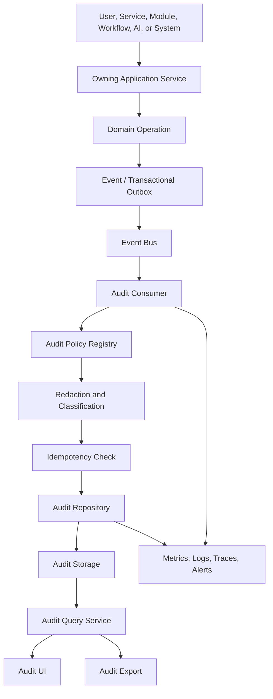
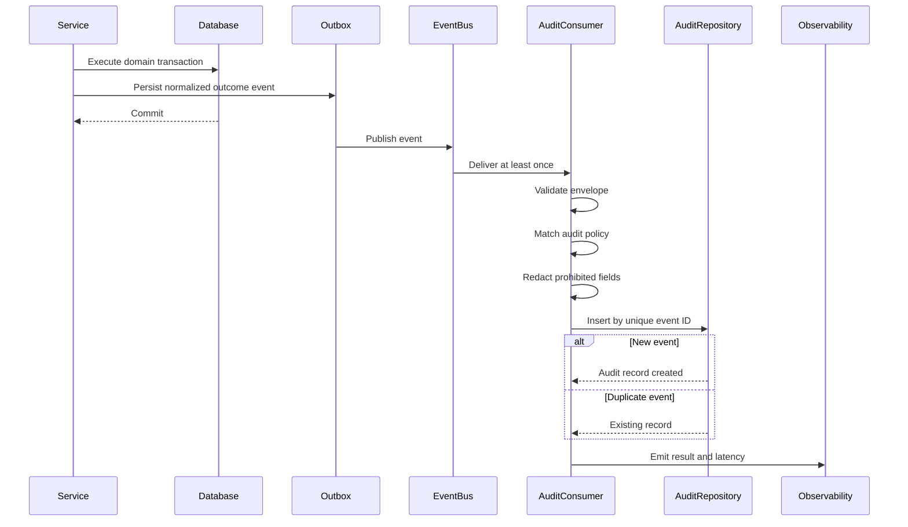
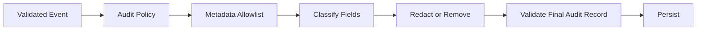
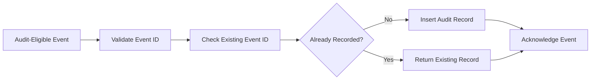
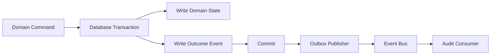

# Audit Architecture

Status: Draft
Implementation State: Target architecture; not current implementation evidence
Current-State Source: [Current Architecture](./Current%20Architecture.md)
Owner: SinLess Games LLC
Last Updated: 2026-07-18
Security Classification: Internal Architecture
Foundation Release: `0.5 — API & Service Platform`
Operational Hardening Release: `0.9 — Observability & Reliability`

Pending Decision Records:

- `docs/rfcs/0008-configuration-and-secrets-model.md`
- `docs/rfcs/0009-authentication-session-and-authorization-model.md`
- `docs/rfcs/0010-api-envelope-request-and-trace-id-propagation.md`
- `docs/rfcs/0011-event-envelope-audit-model-and-idempotency.md`
- `docs/rfcs/0012-workflow-records-and-approval-primitive.md`
- `docs/rfcs/0017-observability-trace-propagation-and-alerting.md`

Related RFCs:

- `docs/rfcs/0002-monorepo-library-boundaries.md`
- `docs/rfcs/0003-api-versioning-and-route-strategy.md`
- `docs/rfcs/0004-error-and-result-model.md`
- `docs/rfcs/0005-entity-schema-and-contract-strategy.md`
- `docs/rfcs/0013-provider-abstraction-and-integration-interface.md`
- `docs/rfcs/0014-module-registry-manifest-and-lifecycle.md`
- `docs/rfcs/0015-discord-permission-role-hierarchy-and-action-safety.md`
- `docs/rfcs/0016-ai-assistant-boundaries-and-mvp-memory-scope.md`

Related Architecture:

- `docs/architecture/Monorepo Architecture.md`
- `docs/architecture/Frontend Architecture.md`
- `docs/architecture/API Architecture.md`
- `docs/architecture/Service Architecture.md`
- `docs/architecture/Data Architecture.md`
- `docs/architecture/Auth Architecture.md`
- `docs/architecture/Security Architecture.md`
- `docs/architecture/Discord Architecture.md`
- `docs/architecture/Module Architecture.md`
- `docs/architecture/Workflow Architecture.md`
- `docs/architecture/AI Architecture.md`
- `docs/architecture/Integration Architecture.md`
- `docs/architecture/Notification Architecture.md`

---

## Purpose

This document defines the intended audit architecture for the Aerealith platform.

The audit architecture governs how Aerealith records, stores, protects, retrieves, explains, exports, retains, and monitors meaningful platform actions.

Audit architecture covers:

```text
audit event creation
event normalization
audit policy
actor identification
target identification
scope
risk level
approval correlation
request correlation
trace correlation
action outcome
provider outcome
idempotency
event consumption
append-oriented persistence
tamper resistance
access control
privacy
redaction
retention
export
legal hold
querying
user-visible history
community-visible history
administrator review
security investigation
operational monitoring
```

The guiding rule is:

> A meaningful action should leave a durable, scoped, understandable record of who or what initiated it, what was attempted, which resource was affected, which authority and approval applied, what result occurred, and how the action can be correlated across the platform.

Audit records exist to provide accountability.

They are not ordinary application logs, analytics events, domain records, or raw provider payload archives.

---

## Architecture Summary

Aerealith uses an event-driven, append-oriented audit architecture.

Services, modules, workflows, integrations, authentication systems, and administrative tools publish normalized outcome events.

A shared audit consumer:

```text
validates the event envelope
determines whether the event is auditable
applies audit policy
normalizes actor, target, scope, and outcome
redacts prohibited fields
checks idempotency
persists an append-oriented audit record
emits audit-consumer telemetry
```

The recommended flow is:

```text
Meaningful Action
→ Domain or Security Outcome Event
→ Event Bus or Transactional Outbox
→ Audit Consumer
→ Audit Policy
→ Redaction
→ Idempotency Check
→ Append Audit Record
→ Query and Export Surfaces
```

Application services should not write audit rows directly as part of normal business logic.

They should publish a normalized event describing the actual outcome.

The audit consumer owns the translation from an event into an audit record.

---

## Audit Architecture Goals

The audit architecture should provide:

```text
durable accountability
clear actor attribution
explicit target and scope
action outcome
approval correlation
request and trace correlation
provider-action correlation
idempotent event consumption
append-oriented records
safe redaction
privacy-aware metadata
searchable history
user and community visibility
administrator investigation
export support
retention control
tamper resistance
operational observability
provider-neutral contracts
```

---

## Non-Goals

The audit architecture does not require:

```text
full event sourcing
storing every application event forever
storing every HTTP request
storing every database query
storing full private content by default
storing secrets
replacing operational logs
replacing metrics and traces
replacing domain records
replacing moderation cases
replacing workflow run history
guaranteeing perfect legal compliance in every jurisdiction
allowing unrestricted administrator browsing
one audit service deployment per domain
```

Audit records support accountability.

They are not a copy of the entire platform.

---

## Core Principles

Aerealith audit systems follow these principles:

```text
Meaningful actions should be auditable.
Audit records should reflect actual outcomes, not intentions alone.
Audit records should be append-oriented.
Audit records should not be silently rewritten.
Duplicate event delivery must not create duplicate audit records.
Audit records should identify actor, target, scope, action, and result.
Approval-required actions should reference the exact approval used.
Audit records should include request and trace correlation.
Audit records should remain understandable without raw provider payloads.
Secrets must never enter audit data.
Private content should be minimized.
Audit access must be authorized and scope-bound.
Community audit data belongs to the authorized community context.
Users should be able to review important actions affecting them.
Audit retention must be documented.
Audit export must respect ownership and privacy.
Audit write failure must be observable.
AI actions must be audited through the same architecture.
```

---

## What Is an Audit Record?

An audit record is a durable account of a meaningful platform action or security-relevant decision.

Examples:

```text
user signed in
session revoked
password changed
API key created
integration connected
integration disconnected
module enabled
module configuration changed
workflow published
workflow approved
workflow executed
moderation action completed
ticket closed
provider credential revoked
AI-proposed action approved
administrator suspended an account
data export requested
account deletion initiated
```

An audit record should answer:

```text
Who or what acted?
What action occurred?
Which resource was affected?
Within which scope?
When did it happen?
What permission or authority applied?
Was approval required?
Which approval was used?
What result occurred?
Which request and trace produced it?
Which service or module executed it?
Did an external provider participate?
```

---

## Audit Terminology

| Term               | Meaning                                                                                                          |
| ------------------ | ---------------------------------------------------------------------------------------------------------------- |
| Audit Event        | A normalized event eligible to become an audit record.                                                           |
| Audit Record       | The persisted append-oriented record.                                                                            |
| Actor              | The identity, service, module, workflow, or system that initiated or caused the action.                          |
| Subject            | The identity or resource primarily affected by the action.                                                       |
| Target             | The specific resource on which the action operated.                                                              |
| Scope              | The user, account, organization, community, server, integration, or other boundary in which the action occurred. |
| Source             | The system or interface through which the action originated.                                                     |
| Outcome            | The final normalized result of the action.                                                                       |
| Approval Reference | The approval record authorizing a protected action.                                                              |
| Request ID         | Correlates the action with one application request.                                                              |
| Trace ID           | Correlates behavior across services, queues, providers, and consumers.                                           |
| Provider Reference | Correlates an action with an external provider operation.                                                        |
| Audit Policy       | Rules that determine whether and how an event becomes an audit record.                                           |
| Retention Class    | The retention and deletion policy applied to the record.                                                         |

---

## Audit Versus Other Records

Audit records are related to other platform records but do not replace them.

### Audit Versus Logs

Logs answer:

```text
What happened inside the software?
```

Audit records answer:

```text
What meaningful action affected a user, account, community, resource, permission, or security state?
```

Logs may contain:

```text
debug information
timings
stack traces
internal state
temporary diagnostics
```

Audit records contain:

```text
stable action identifiers
actor
target
scope
result
approval
correlation
safe metadata
```

Logs may be deleted quickly.

Audit records may require longer retention.

---

### Audit Versus Metrics

Metrics answer:

```text
How often?
How fast?
How many?
Is the system healthy?
```

Audit records answer:

```text
Who did what to which resource and what happened?
```

---

### Audit Versus Traces

Traces show distributed execution paths.

Audit records describe durable, meaningful outcomes.

One audit record may reference one trace.

One trace may contain many internal operations that do not each become audit records.

---

### Audit Versus Domain Records

Domain records represent current or operational state.

Examples:

```text
moderation case
ticket
workflow run
module configuration
integration connection
```

Audit records represent the meaningful actions that changed or interacted with that state.

A moderation case answers:

```text
What is the case?
```

An audit record answers:

```text
Who executed the moderation action, under which authority, and what was the outcome?
```

---

### Audit Versus Event Sourcing

Aerealith does not require full event sourcing for the MVP.

Audit records support:

```text
accountability
investigation
history
support
security review
```

Primary domain state remains in domain-owned tables.

Audit history should not be treated as the sole source from which every domain object must be reconstructed.

---

### Audit Versus Analytics

Analytics measures aggregate behavior and product usage.

Audit records track specific meaningful actions.

Audit data should not be reused casually for:

```text
behavioral advertising
unrelated profiling
marketing targeting
AI training
```

without explicit policy and consent.

---

## Auditable Actions

An action should generally be audited when it changes:

```text
identity
security state
permissions
credentials
account state
integration state
module state
workflow state
approval state
community state
moderation state
ticket state
data ownership
data export
data deletion
administrator access
AI memory or AI action state
```

---

## Auditable Action Categories

Recommended initial categories:

```text
authentication
identity
security
authorization
account
consent
session
credentials
integration
module
workflow
approval
notification
community
Discord
moderation
ticket
developer
AI
data
administration
operations
```

Categories support:

```text
filtering
retention
access policy
export
alerting
```

They do not replace the stable audit action identifier.

---

## Stable Audit Action Identifiers

Each auditable action should use a stable identifier.

Examples:

```text
auth.sign-in.succeeded
auth.sign-in.failed
auth.password.changed
auth.mfa.enabled
auth.mfa.disabled
session.created
session.revoked
session.revoked-all
identity.linked
identity.unlinked
credential.api-key.created
credential.api-key.revoked
account.created
account.updated
account.suspended
account.reactivated
account.deletion-requested
consent.granted
consent.revoked
integration.connected
integration.reauthorized
integration.disconnected
integration.revoked
module.enabled
module.configured
module.disabled
module.uninstalled
module.upgraded
workflow.created
workflow.version-published
workflow.enabled
workflow.disabled
workflow.run-triggered
workflow.run-cancelled
workflow.action-approved
workflow.action-rejected
workflow.action-executed
discord.server-linked
discord.server-disconnected
discord.ownership-verified
moderation.warned
moderation.timed-out
moderation.kicked
moderation.banned
moderation.unbanned
moderation.messages-purged
ticket.created
ticket.assigned
ticket.closed
developer.webhook-created
developer.webhook-disabled
ai.action-proposed
ai.action-approved
ai.action-rejected
ai.action-executed
ai.memory-confirmed
ai.memory-revoked
data.export-requested
data.export-completed
data.deletion-requested
data.deletion-completed
admin.break-glass-activated
```

Action identifiers should be:

```text
lowercase
stable
dot-separated
domain-oriented
past-tense or outcome-oriented where practical
```

---

## Action Outcome Versus Request Intent

Audit records should reflect actual outcomes.

Example:

```text
Requested action: ban member
Actual result: blocked by role hierarchy
```

The audit record should not claim:

```text
moderation.banned
```

if the provider action did not occur.

It may instead record:

```text
moderation.ban-blocked
```

or:

```text
moderation.action-denied
```

with a reason code.

Actions that are requested, approved, attempted, and completed may produce separate audit records when each stage is meaningful.

---

## Audit Outcome States

Recommended normalized outcomes:

```text
Succeeded
Failed
Denied
Rejected
Cancelled
Expired
PartiallySucceeded
Blocked
Revoked
Unknown
```

| Outcome              | Meaning                                                                      |
| -------------------- | ---------------------------------------------------------------------------- |
| `Succeeded`          | The intended action completed successfully.                                  |
| `Failed`             | Execution was attempted but did not complete.                                |
| `Denied`             | Authorization or permission policy prevented execution.                      |
| `Rejected`           | An approver or external authority rejected the action.                       |
| `Cancelled`          | The action was intentionally stopped.                                        |
| `Expired`            | The action or approval expired before execution.                             |
| `PartiallySucceeded` | Some effects occurred, but the complete action did not finish.               |
| `Blocked`            | A safety, provider, role-hierarchy, or system condition prevented execution. |
| `Revoked`            | Previously granted access or authority was removed.                          |
| `Unknown`            | The final outcome could not yet be confirmed.                                |

`Unknown` should be used sparingly.

An uncertain external-provider outcome should trigger reconciliation.

---

## High-Level Audit Architecture



---

## Audit Event Flow



---

## Audit Event Envelope

Audit-eligible events should use the shared event envelope.

Expected fields:

```text
eventId
eventType
eventVersion
occurredAt
publishedAt
source
service
module
actor
subject
target
scope
riskLevel
approvalId
requestId
traceId
causationId
correlationId
outcome
errorCode
providerReference
payload
metadata
```

The exact event envelope should be finalized in RFC 0011.

---

## Event Envelope Example

```ts
export interface AerealithEvent<TPayload = unknown> {
  readonly eventId: string
  readonly eventType: string
  readonly eventVersion: number
  readonly occurredAt: string
  readonly publishedAt?: string
  readonly source: EventSource
  readonly service?: string
  readonly module?: EventModuleReference
  readonly actor?: EventActor
  readonly subject?: EventResourceReference
  readonly target?: EventResourceReference
  readonly scope?: EventScope
  readonly riskLevel?: RiskLevel
  readonly approvalId?: string
  readonly requestId?: string
  readonly traceId?: string
  readonly causationId?: string
  readonly correlationId?: string
  readonly outcome?: EventOutcome
  readonly errorCode?: string
  readonly providerReference?: ProviderActionReference
  readonly payload: TPayload
  readonly metadata?: Readonly<Record<string, unknown>>
}
```

---

## Audit Policy Registry

The audit policy registry determines how events become audit records.

A policy should define:

```text
event type
supported event versions
audit action ID
category
severity
required actor information
required target information
required scope
required outcome
retention class
visibility
metadata allowlist
redaction rules
user-visible summary strategy
administrator visibility
security alert behavior
```

---

## Audit Policy Definition

```ts
export interface AuditPolicyDefinition {
  readonly eventType: string
  readonly supportedEventVersions: readonly number[]
  readonly actionId: string
  readonly category: AuditCategory
  readonly defaultSeverity: AuditSeverity
  readonly requiredActor: boolean
  readonly requiredTarget: boolean
  readonly requiredScope: boolean
  readonly requiredOutcome: boolean
  readonly retentionClass: AuditRetentionClass
  readonly visibility: AuditVisibility
  readonly allowedMetadataFields: readonly string[]
  readonly prohibitedMetadataFields: readonly string[]
  readonly alertPolicy?: AuditAlertPolicy
}
```

Unknown auditable event types should not be silently persisted through an unreviewed generic fallback.

They should:

```text
fail policy validation
produce operational telemetry
enter controlled dead-letter handling
```

---

## Audit Visibility

Audit visibility should be explicit.

Potential visibility levels:

```text
ActorOnly
User
Account
Organization
Community
Administrator
Security
Operations
Internal
```

### ActorOnly

Visible only to the actor and authorized security or support roles.

### User

Visible to the affected user.

### Account

Visible to authorized account members.

### Organization

Visible to authorized organization administrators.

### Community

Visible to authorized community or server administrators.

### Administrator

Visible to Aerealith administrators with appropriate permission.

### Security

Visible only to authorized security personnel or systems.

### Operations

Visible to authorized operations personnel.

### Internal

Not exposed through ordinary product UI.

Visibility must not be inferred only from the audit category.

---

## Actor Model

An actor is the identity or component responsible for initiating or causing an action.

Actor types may include:

```text
User
Service
Module
Workflow
AI
System
Administrator
Integration
DeveloperApplication
```

---

## Actor Reference

```ts
export interface AuditActor {
  readonly type: AuditActorType
  readonly id: string
  readonly displayName?: string
  readonly userId?: string
  readonly sessionId?: string
  readonly service?: string
  readonly moduleId?: string
  readonly moduleVersion?: string
  readonly workflowId?: string
  readonly workflowVersion?: number
  readonly developerApplicationId?: string
}
```

Actor display names may change.

Stable identifiers should remain authoritative.

Audit records should not rely only on a mutable display name.

---

## Human and System Actors

A system may execute an action because of a human decision.

Example:

```text
Human approver approved a workflow.
Workflow runtime executed the provider action.
```

The audit record may need to distinguish:

```text
initiating actor
approving actor
executing actor
```

Recommended fields:

```text
actor
approver
executor
```

These roles should not be collapsed when doing so would obscure responsibility.

---

## Impersonation and Delegation

If impersonation or delegated operation is ever supported, audit records must capture:

```text
original operator
effective user
delegation or impersonation reason
session
duration
scope
```

No impersonation capability should exist without visible and durable audit behavior.

---

## Subject and Target

The subject is the entity primarily affected.

The target is the resource on which the action operated.

They may be the same.

Examples:

```text
Action: suspend user
Subject: user
Target: user account
```

```text
Action: remove Discord member role
Subject: Discord member
Target: Discord role assignment
```

```text
Action: configure module
Subject: module installation
Target: module configuration
```

---

## Resource Reference

```ts
export interface AuditResourceReference {
  readonly type: string
  readonly id: string
  readonly displayName?: string
  readonly provider?: string
  readonly providerResourceId?: string
}
```

Display names should be treated as snapshots for readability.

Stable IDs remain authoritative.

---

## Scope Model

Every scoped audit record should identify where the action occurred.

Potential scope fields:

```text
userId
accountId
organizationId
communityId
serverId
integrationConnectionId
moduleInstallationId
workflowId
developerApplicationId
```

---

## Scope Reference

```ts
export interface AuditScope {
  readonly type: AuditScopeType
  readonly id: string
  readonly parent?: AuditScope
}
```

Scope should be explicit.

Audit access must not be based on guessing ownership from the target alone.

---

## Source Model

The source describes where the action originated.

Potential sources:

```text
web
API
Discord
workflow
module
AI assistant
developer API
webhook
scheduled worker
administrator console
support tool
system recovery
CLI
```

Source is useful for:

```text
investigation
support
filtering
risk review
```

Source does not define authorization.

---

## Request and Trace Correlation

Audit records should contain:

```text
requestId
traceId
```

where available.

### Request ID

Correlates behavior within one application request.

### Trace ID

Correlates behavior across:

```text
frontend
API
service
queue
integration runtime
provider call
audit consumer
notification consumer
```

A user-visible audit page may expose a safe support reference based on the request ID.

Raw internal tracing links should remain access-controlled.

---

## Correlation and Causation

Events may also use:

```text
correlationId
causationId
```

### Correlation ID

Groups related work.

Example:

```text
one workflow run
one account-deletion process
one integration-connection flow
```

### Causation ID

Identifies the event or action that directly caused another event.

Example:

```text
workflow.run.started
caused by
community.member.joined
```

These fields support investigation without requiring full event sourcing.

---

## Approval Correlation

Approval-required actions must reference the exact approval used.

Audit records should include:

```text
approvalId
approval type
approved by
approved at
approval scope
action fingerprint
```

The audit record does not need to duplicate the full approval record.

It should retain enough reference information to explain the connection.

---

## Risk Level

Audit records should preserve the action risk level.

Potential values:

```text
Low
Medium
High
Critical
```

Risk may influence:

```text
retention
visibility
alerting
review priority
required metadata
```

A high-risk action should not be downgraded in the audit record merely because it succeeded.

---

## Permission and Authorization Context

Audit records may include safe authorization context such as:

```text
required permission
authorization decision ID
role or capability used
provider permission checked
```

Avoid storing a full permanent snapshot of every role and permission unless required.

Permission records may change.

The audit record should capture the relevant authority used for the action, not a complete access-control database dump.

---

## Provider Correlation

Actions involving external providers should include provider references.

Potential fields:

```text
provider
connection ID
provider action ID
provider request ID
provider resource ID
provider result code
```

Provider credentials and raw authorization headers must never be included.

---

## Provider Action Reference

```ts
export interface AuditProviderReference {
  readonly provider: string
  readonly connectionId?: string
  readonly actionId?: string
  readonly requestId?: string
  readonly resourceType?: string
  readonly resourceId?: string
  readonly resultCode?: string
}
```

---

## Audit Record Model

A canonical audit record may include:

```text
audit ID
event ID
action ID
event type
event version
category
severity
outcome
occurred at
recorded at
actor
approver
executor
subject
target
scope
source
service
module
workflow
risk level
approval ID
request ID
trace ID
correlation ID
causation ID
provider reference
error code
safe summary
metadata
retention class
visibility
integrity metadata
```

---

## Audit Record Example

```ts
export interface AuditRecord {
  readonly id: string
  readonly eventId: string
  readonly actionId: string
  readonly eventType: string
  readonly eventVersion: number
  readonly category: AuditCategory
  readonly severity: AuditSeverity
  readonly outcome: AuditOutcome
  readonly occurredAt: string
  readonly recordedAt: string
  readonly actor?: AuditActor
  readonly approver?: AuditActor
  readonly executor?: AuditActor
  readonly subject?: AuditResourceReference
  readonly target?: AuditResourceReference
  readonly scope?: AuditScope
  readonly source: AuditSource
  readonly service?: string
  readonly module?: AuditModuleReference
  readonly workflow?: AuditWorkflowReference
  readonly riskLevel?: RiskLevel
  readonly approvalId?: string
  readonly requestId?: string
  readonly traceId?: string
  readonly correlationId?: string
  readonly causationId?: string
  readonly providerReference?: AuditProviderReference
  readonly errorCode?: string
  readonly summary?: string
  readonly metadata?: Readonly<Record<string, unknown>>
  readonly retentionClass: AuditRetentionClass
  readonly visibility: AuditVisibility
}
```

---

## Audit Severity

Recommended audit severity levels:

```text
Informational
Warning
High
Critical
```

| Severity      | Example                                                                        |
| ------------- | ------------------------------------------------------------------------------ |
| Informational | Module enabled, workflow created, successful sign-in.                          |
| Warning       | Permission denied, integration degraded, repeated failed sign-in.              |
| High          | Account suspended, administrator permission changed, moderation purge.         |
| Critical      | Break-glass access, credential compromise, critical security control disabled. |

Severity should be defined by policy.

It should not be derived from free-form event text.

---

## Safe Summary

Audit records may include a concise, deterministic summary.

Examples:

```text
Tim enabled the Discord moderation module for Server A.
A workflow action was rejected by the required approver.
The Aerealith bot could not ban the member because role hierarchy blocked the action.
An administrator revoked all sessions for the account.
```

Summaries should be:

```text
deterministic
localized later
free of secrets
understandable
based on actual structured fields
```

Critical audit meaning should not depend on AI-generated text.

---

## Structured Metadata

Audit metadata should contain only allowlisted, classified fields.

Appropriate metadata may include:

```text
reason code
configuration version
previous status
new status
message count for a purge
timeout duration
workflow step ID
module version
provider response category
```

Metadata should not include:

```text
passwords
session tokens
API key secrets
OAuth tokens
webhook secrets
private encryption keys
authorization headers
full ticket transcripts
full message content
unbounded provider payloads
raw request bodies
```

---

## Metadata Schema

Each audit policy should define a metadata schema.

Example:

```ts
export const ModerationBanAuditMetadataSchema = z.object({
  reason: z.string().trim().max(500).optional(),
  providerActionId: z.string().optional(),
  roleHierarchyChecked: z.boolean(),
  providerPermissionChecked: z.boolean(),
})
```

Arbitrary metadata objects should not be accepted from event producers.

---

## Data Classification

Audit fields should be classified.

| Classification | Examples                                                    |
| -------------- | ----------------------------------------------------------- |
| Public         | Public module name, public server name when already public. |
| Internal       | Service name, event version, error code.                    |
| Private        | User ID, account ID, private resource name.                 |
| Sensitive      | Security event, moderation target, session metadata.        |
| Secret         | Never allowed in audit records.                             |

Classification should influence:

```text
access
redaction
retention
export
logging
alerting
```

---

## Redaction

Redaction should occur before persistence.

The audit consumer should remove or transform prohibited fields.

Possible redaction strategies:

```text
omit field
replace with fixed redaction marker
hash where correlation is required
truncate
normalize to category
store reference instead of content
```

Redaction should be deterministic where correlation is needed.

---

## Redaction Flow



---

## Secret Detection

Audit ingestion should defensively detect likely secrets.

Potential detection targets:

```text
authorization headers
bearer tokens
API keys
private keys
session cookies
OAuth tokens
password fields
webhook secrets
```

A detected likely secret should:

```text
prevent persistence of the unsafe value
record a security telemetry event
preserve the audit action without the secret
alert when appropriate
```

Secret detection is defense in depth.

Producers remain responsible for not sending secrets.

---

## Append-Oriented Storage

Audit records should be append-oriented.

Normal application behavior should not:

```text
update the action
change the actor
change the target
change the result
rewrite the timestamp
delete a record silently
```

If a correction is required, create a new correction record linked to the original.

---

## Corrections

An audit correction may be needed when:

```text
a provider outcome was initially unknown
a user-visible display name was incorrect
an investigation confirmed a different normalized outcome
a legal annotation is required
```

Corrections should:

```text
reference the original audit ID
record the correcting actor
record the reason
record the corrected fields
preserve the original record
```

---

## Correction Record Example

```text
audit.record-corrected
```

Metadata may include:

```text
originalAuditId
correctionReason
correctedFields
```

A correction should not erase evidence of the original state.

---

## Deletion and Redaction Requests

Some privacy or legal requirements may require removing or anonymizing eligible audit data.

Potential strategies:

```text
anonymize actor reference
remove optional display name
replace target metadata
retain minimal security record
apply legal hold
delete after retention expiry
```

The architecture should avoid claiming that audit records are never deletable under any circumstance.

Retention and deletion behavior must follow documented policy and applicable law.

---

## Audit Integrity

Audit integrity means records cannot be casually or invisibly altered.

Initial controls should include:

```text
append-only repository methods
restricted database permissions
unique event IDs
restricted update paths
separate audit consumer
access logging
backup protection
alerts on write failures
```

Future controls may include:

```text
record hashes
hash chains
signed checkpoints
immutable storage exports
write-once object storage
external integrity verification
```

---

## Integrity Hash Direction

Future audit records may include an integrity hash computed from canonical fields.

Potential inputs:

```text
previous record hash
audit ID
event ID
action ID
occurred at
actor
target
scope
outcome
metadata hash
```

This may support tamper evidence.

It does not replace:

```text
authorization
database security
backups
access controls
```

---

## Hash Chain Direction

A future hash chain may be scoped by:

```text
account
organization
community
partition
time window
```

Global hash chains may create unnecessary coupling and throughput constraints.

Any integrity-chain design requires a dedicated RFC and operational recovery plan.

---

## Idempotency

Event delivery is treated as at least once.

The audit consumer must be idempotent.

The primary idempotency key should normally be:

```text
eventId
```

A unique database constraint should prevent duplicate audit records for the same event.

---

## Idempotency Flow



---

## Duplicate Events

A duplicate event should:

```text
not create another audit record
not produce another user notification unless separately intended
not trigger another security alert solely because of redelivery
increment deduplication telemetry
```

A distinct action should receive a distinct event ID.

---

## Ordering

Distributed event ordering cannot be assumed globally.

Audit records should preserve:

```text
occurredAt
recordedAt
eventId
correlationId
causationId
```

Queries should order deterministically, for example:

```text
occurred_at DESC
audit_id DESC
```

A later-recorded event may have occurred earlier.

The UI may distinguish:

```text
occurred time
recorded time
```

when useful.

---

## Event Versioning

Audit consumers must support explicit event versions.

The audit policy should define supported versions.

Unknown event versions should:

```text
fail safely
enter dead-letter handling
produce operational alerts
avoid partial incorrect persistence
```

A producer upgrading an event version must not silently break the audit consumer.

---

## Transactional Outbox

A transactional outbox is recommended when a domain change and its outcome event must be persisted reliably.

Example:

```text
update module state
insert outbox event
commit transaction
publish event asynchronously
```

This reduces the risk of:

```text
domain state changed
audit event lost
```

---

## Outbox Flow



---

## Direct Audit Write Exceptions

Direct audit writes should be rare.

Potential exceptions may include:

```text
audit subsystem recovery
administrative correction records
migration of historical audit data
break-glass activation when the event bus is unavailable
```

Exceptions require:

```text
explicit authorization
dedicated repository methods
structured reason
operational telemetry
security review
```

---

## Audit Consumer

The audit consumer owns:

```text
event validation
policy lookup
record normalization
metadata validation
redaction
idempotency
persistence
consumer telemetry
dead-letter behavior
```

The audit consumer does not own:

```text
domain authorization
provider action execution
workflow execution
module behavior
business outcome determination
```

The producer owns the truth of what occurred.

The consumer owns how that truth becomes an audit record.

---

## Consumer Failure Behavior

When the audit consumer fails:

```text
the event should remain retryable
the failure should be visible
the queue should not retry without limits
critical backlog should alert operations
dead-lettered events should be reviewable
```

A consumer failure must not silently discard an auditable event.

---

## Retry Architecture

Audit-consumer retries should apply to transient failures.

Retryable examples:

```text
database unavailable
temporary network failure
queue visibility timeout
temporary lock conflict
```

Non-retryable examples:

```text
unsupported event version
invalid audit policy
invalid metadata schema
missing required actor for a policy
prohibited secret field detected repeatedly
```

Non-retryable events should enter controlled dead-letter handling.

---

## Dead-Letter Handling

Dead-letter records should include:

```text
event ID
event type
event version
failure code
failure category
attempt count
first failed at
last failed at
safe payload reference
request ID
trace ID
```

Dead-letter storage should not duplicate unsafe raw secrets.

Operators should be able to:

```text
inspect
redact
correct
retry
discard with documented reason
```

Discarding an audit-eligible event should itself be auditable.

---

## Audit Write Failure Policy

The owning domain should define whether audit publication failure:

```text
blocks the action
allows the action with durable outbox recovery
allows the action and raises an operational incident
```

Recommended direction:

```text
Use a transactional outbox for meaningful state changes.
Do not depend on synchronous audit database writes inside the request.
Block only when no durable record of the outcome can be preserved for a critical action.
```

Critical actions may require stronger guarantees.

Examples:

```text
break-glass activation
credential issuance
critical permission escalation
account deletion
```

---

## Audit Storage

Audit persistence belongs in:

```text
libs/db
```

Recommended structure:

```text
libs/db/src/
├── schema/audit/
├── queries/audit/
├── mappers/audit/
├── repositories/audit/
└── migrations/audit/
```

---

## Suggested Tables

Potential tables include:

```text
audit_records
audit_record_corrections
audit_event_receipts
audit_exports
audit_export_items
audit_legal_holds
audit_retention_policies
audit_access_records
audit_dead_letters
```

Not every table is required for the MVP.

---

## Audit Records Table

Potential fields:

```text
id
event_id
action_id
event_type
event_version
category
severity
outcome
occurred_at
recorded_at
actor_type
actor_id
approver_type
approver_id
executor_type
executor_id
subject_type
subject_id
target_type
target_id
scope_type
scope_id
source
service
module_id
module_version
workflow_id
workflow_version
risk_level
approval_id
request_id
trace_id
correlation_id
causation_id
provider
provider_action_id
provider_resource_id
error_code
summary
metadata
retention_class
visibility
integrity_hash
previous_hash
```

Some compound data may use versioned JSON when appropriate.

Frequently queried fields should remain relational.

---

## Audit Event Receipts

An event receipt may track:

```text
event ID
event type
received at
processed at
status
audit record ID
attempt count
error code
```

The audit record table's unique `event_id` may be sufficient initially.

A separate receipt table may become useful for:

```text
consumer diagnostics
dead-letter workflows
processing latency
replay visibility
```

---

## Index Strategy

Audit indexes should reflect real query patterns.

Likely indexes include:

```text
event_id unique
scope_type + scope_id + occurred_at
actor_type + actor_id + occurred_at
target_type + target_id + occurred_at
category + occurred_at
action_id + occurred_at
outcome + occurred_at
request_id
trace_id
approval_id
correlation_id
provider + provider_action_id
recorded_at
```

Audit tables may become large.

Index cost must be reviewed carefully.

---

## Partitioning Direction

Audit records may eventually require partitioning by:

```text
time
account
organization
community
region
```

Time-based partitioning is the likely initial scaling direction.

Partitioning should not be introduced before evidence justifies the operational complexity.

A future partitioning RFC should define:

```text
partition key
retention
cross-partition queries
exports
legal holds
migration
```

---

## Query Architecture

Audit queries should be handled by an audit query service.

The query service should enforce:

```text
authentication
scope authorization
visibility
field redaction
pagination
filter allowlists
result limits
```

Audit query routes must not expose raw table access.

---

## Query Filters

Supported filters may include:

```text
date range
category
action ID
outcome
severity
actor
target
source
module
workflow
provider
risk level
request ID
trace ID
approval ID
```

Arbitrary database-column filtering should not be exposed.

---

## Pagination

Audit history should use cursor-based pagination.

Recommended ordering:

```text
occurred_at DESC
id DESC
```

Example:

```text
?limit=50&cursor=...
```

Maximum page sizes should be enforced.

---

## Search

Initial audit search may support:

```text
action ID
safe summary
actor display snapshot
target display snapshot
request ID
trace ID
```

Full-text search should not index secrets or unrestricted private metadata.

Search results must respect current scope authorization.

---

## Audit Detail Views

A detail response may include:

```text
action
outcome
occurred time
recorded time
actor
approver
executor
subject
target
scope
source
risk
approval reference
provider reference
request reference
safe metadata
correlated actions
```

The detail view must not expose internal security fields to unauthorized callers.

---

## Correlated Audit History

Correlated actions may be grouped by:

```text
request ID
trace ID
correlation ID
workflow run ID
approval ID
provider action ID
```

Example:

```text
workflow action proposed
workflow action approved
provider action attempted
provider action succeeded
notification delivered
```

The UI should avoid implying that correlation alone proves causation.

---

## Frontend Architecture

The frontend should provide audit surfaces appropriate to the current scope.

Potential routes:

```text
/audit
/audit/{auditId}
/accounts/{accountId}/audit
/organizations/{organizationId}/audit
/communities/{communityId}/audit
/communities/{communityId}/moderation/audit
/settings/security/activity
```

---

## Audit UI Goals

The audit UI should answer:

```text
What happened?
Who initiated it?
What was affected?
Where did it happen?
Did it succeed?
Was it approved?
Which permissions or provider checks applied?
When did it occur?
What should I do next?
```

---

## Audit List View

The list view should include:

```text
timestamp
action
actor
target
scope
outcome
severity
source
```

It should support:

```text
pagination
filters
date range
empty state
loading state
error state
export request
```

---

## Audit Detail View

The detail view may show:

```text
human-readable summary
structured action ID
actor and execution chain
scope
target
result
reason or error code
risk level
approval details
request and trace references
provider correlation
related records
```

Advanced diagnostic fields should require stronger permission.

---

## User Security Activity

Users should be able to review important security actions affecting their account.

Examples:

```text
sign-ins
password changes
identity linking
session revocation
MFA changes
API key changes
account deletion requests
```

This view may use a filtered subset of the audit architecture.

---

## Community Audit History

Authorized community administrators should be able to review:

```text
server connection changes
module changes
permission changes
moderation actions
ticket lifecycle actions
workflow actions
integration changes
```

Community audit history must remain scoped to that community.

It must not reveal private Aerealith internal events unrelated to the community.

---

## Administrative Audit View

Aerealith administrators may require broader audit access.

Administrator access should be:

```text
permission-scoped
MFA-protected
logged
reviewable
limited by role
```

Viewing sensitive audit records may itself require an audit record.

---

## Audit Access Logging

Sensitive audit access should be auditable.

Examples:

```text
administrator viewed private security audit
support operator exported account audit history
security analyst accessed break-glass records
```

Access audit records may include:

```text
viewer
target audit scope
reason
time
request ID
trace ID
```

Avoid creating infinite recursion where every normal user audit-page view creates another user-visible audit record.

Access logging should focus on sensitive or privileged access.

---

## API Routes

Potential audit routes include:

```text
GET /api/V1/audit
GET /api/V1/audit/{auditId}
GET /api/V1/audit/actions
GET /api/V1/audit/categories
POST /api/V1/audit/exports
GET /api/V1/audit/exports/{exportId}
```

Scoped routes may include:

```text
GET /api/V1/accounts/{accountId}/audit
GET /api/V1/organizations/{organizationId}/audit
GET /api/V1/communities/{communityId}/audit
GET /api/V1/workflows/{workflowId}/audit
GET /api/V1/integrations/connections/{connectionId}/audit
```

Internal routes may include:

```text
GET /api/V1/internal/audit/dead-letters
POST /api/V1/internal/audit/dead-letters/{deadLetterId}/retry
POST /api/V1/internal/audit/{auditId}/corrections
POST /api/V1/internal/audit/legal-holds
```

Exact routes should be finalized through API and security review.

---

## Audit Contracts

Potential contracts include:

```text
AuditRecordResponse
AuditRecordListResponse
AuditActorResponse
AuditResourceReferenceResponse
AuditScopeResponse
AuditProviderReferenceResponse
AuditExportRequest
AuditExportResponse
AuditCorrectionRequest
AuditDeadLetterResponse
```

Contracts should live under:

```text
libs/contracts/src/api/V1/audit/
```

Shared event contracts should live under:

```text
libs/contracts/src/events/
```

---

## Required API Envelope

Audit APIs must use the required response envelope.

Example success:

```json
{
  "success": true,
  "data": {
    "id": "aud_123",
    "actionId": "module.enabled",
    "outcome": "Succeeded",
    "occurredAt": "2026-07-12T18:42:00.000Z",
    "actor": {
      "type": "User",
      "id": "usr_123",
      "displayName": "Tim"
    },
    "target": {
      "type": "ModuleInstallation",
      "id": "modinst_456",
      "displayName": "Discord Moderation"
    }
  },
  "requestId": "req_123",
  "traceId": "trace_456"
}
```

Example error:

```json
{
  "success": false,
  "error": {
    "code": "AUDIT_RECORD_NOT_FOUND",
    "message": "The audit record could not be found.",
    "category": "audit",
    "retryable": false,
    "requestId": "req_123",
    "traceId": "trace_456",
    "details": null
  }
}
```

---

## Audit Error Codes

Potential error codes include:

```text
AUDIT_RECORD_NOT_FOUND
AUDIT_ACTION_NOT_FOUND
AUDIT_POLICY_NOT_FOUND
AUDIT_EVENT_INVALID
AUDIT_EVENT_VERSION_UNSUPPORTED
AUDIT_EVENT_DUPLICATE
AUDIT_ACTOR_REQUIRED
AUDIT_TARGET_REQUIRED
AUDIT_SCOPE_REQUIRED
AUDIT_OUTCOME_REQUIRED
AUDIT_METADATA_INVALID
AUDIT_METADATA_PROHIBITED
AUDIT_SECRET_DETECTED
AUDIT_WRITE_FAILED
AUDIT_QUERY_FORBIDDEN
AUDIT_EXPORT_FORBIDDEN
AUDIT_EXPORT_FAILED
AUDIT_CORRECTION_FORBIDDEN
AUDIT_CORRECTION_INVALID
AUDIT_RETENTION_POLICY_INVALID
AUDIT_LEGAL_HOLD_ACTIVE
AUDIT_DEAD_LETTER_NOT_FOUND
AUDIT_DEAD_LETTER_RETRY_FAILED
```

Public error codes become compatibility-sensitive.

---

## API Authorization

Audit API authorization should consider:

```text
authenticated identity
active scope
membership
role
required permission
record visibility
resource ownership
sensitivity
administrator status
support status
security status
```

Potential permissions:

```text
audit.read-own
audit.read-account
audit.read-organization
audit.read-community
audit.read-security
audit.read-administration
audit.export
audit.correct
audit.manage-retention
audit.manage-legal-hold
audit.manage-dead-letter
```

---

## Sensitive Audit Reads

Some audit actions may require stronger controls.

Examples:

```text
view security incident details
view administrator access history
view break-glass records
view authentication investigation data
export large audit histories
```

Controls may include:

```text
step-up authentication
reason entry
short-lived elevated access
access audit
rate limits
```

---

## Audit Export

Authorized users and communities should be able to export audit records they own or control.

Export architecture should support:

```text
scope validation
filter selection
authorization
asynchronous generation
redaction
format selection
signed expiring download
short artifact retention
audit record of the export
```

---

## Export Formats

Potential formats:

```text
JSON
CSV
human-readable PDF later
archive bundle
```

JSON should preserve structured fields.

CSV should flatten fields intentionally.

A PDF export may provide a readable report but should not become the only machine-readable format.

---

## Export Security

Audit exports must not include:

```text
unrelated scopes
secret fields
internal security-only fields
private metadata outside the caller's authority
raw provider credentials
raw event payloads
```

Exporting a large or sensitive audit set should itself be audited.

---

## Export Lifecycle

Recommended states:

```text
Requested
Generating
Ready
Downloaded
Expired
Failed
Cancelled
```

Export artifacts should use:

```text
encrypted storage
signed expiring links
short retention
access logging
```

---

## Community Ownership

Community audit data should belong to the authorized community context.

Community administrators should be able to review and export eligible records such as:

```text
module changes
moderation actions
ticket actions
workflow actions
integration changes
permission diagnostics
```

Aerealith may retain security or operational records according to platform policy.

Ownership does not mean every internal platform record is visible to the community.

---

## User Ownership

Users should be able to review audit history affecting:

```text
their identity
their sessions
their credentials
their account
their consent
their data exports
their deletion requests
their AI memory
```

Users should not receive unrestricted access to other users' security or moderation history.

---

## Privacy

Audit systems contain sensitive history.

Privacy requirements should address:

```text
purpose
scope
retention
access
export
deletion
legal hold
display names
IP metadata
device metadata
provider metadata
security events
```

Audit architecture should store the minimum information required to explain and investigate the action.

---

## IP Address and Device Metadata

Authentication and security audit records may use limited network or device metadata.

Potential fields:

```text
coarse location
device label
client type
IP-derived risk category
```

Raw IP addresses should be retained only when justified by security policy.

They should not become ordinary user-visible audit metadata.

Retention should be bounded.

---

## Private Content

Audit records should reference private content rather than copy it where practical.

Prefer:

```text
ticket ID
message ID
moderation case ID
workflow run ID
document ID
```

over:

```text
full ticket transcript
full Discord message
full uploaded document
full provider payload
```

This allows current authorization and deletion rules to remain effective.

---

## Retention

Every audit record should receive a retention class.

Potential retention classes:

```text
ShortOperational
Standard
ExtendedSecurity
CommunityHistory
Legal
PermanentPolicy
```

Exact durations must be defined separately.

---

## Suggested Retention Direction

| Record Type                                    | Initial Direction                                |
| ---------------------------------------------- | ------------------------------------------------ |
| Routine module and workflow actions            | Standard bounded retention.                      |
| Authentication and credential changes          | Extended security retention.                     |
| Moderation actions                             | Community-configurable within platform minimums. |
| Ticket operations                              | Follow ticket and community retention policy.    |
| Data export and deletion actions               | Extended retention.                              |
| Break-glass and critical administrator actions | Extended or legal retention.                     |
| Audit-consumer diagnostics                     | Short operational retention.                     |
| Dead-letter payload references                 | Short bounded retention after resolution.        |

Exact durations require privacy, security, and legal review.

---

## Retention Policy Model

A retention policy may define:

```text
policy ID
record category
default duration
minimum duration
maximum duration
scope overrides
legal-hold behavior
anonymization behavior
deletion behavior
```

Retention changes should not silently shorten required security retention.

---

## Legal Hold

A legal hold may suspend normal deletion for selected records.

Legal holds should be:

```text
explicit
authorized
scope-bound
reasoned
time-stamped
reviewable
audited
```

A legal hold record may include:

```text
hold ID
scope
record filters
reason
created by
created at
review date
released by
released at
```

The initial MVP may not require legal-hold tooling.

The data model should avoid making future support impossible.

---

## Audit Deletion

Audit deletion should occur only through controlled retention or approved privacy/legal processes.

Deletion should not occur because:

```text
the action is embarrassing
an administrator wants a cleaner history
a user dislikes the recorded outcome
a domain record was edited
```

Eligible deletion may occur because of:

```text
retention expiry
privacy request
account deletion policy
legal requirement
data correction
test-environment cleanup
```

Deletion itself should be audited where appropriate.

---

## Anonymization

Anonymization may preserve accountability while removing unnecessary personal data.

Potential changes:

```text
remove display name
replace user ID with irreversible pseudonym
remove IP metadata
remove optional device metadata
retain action, scope, and outcome
```

Anonymization policy must consider whether retained identifiers can still be re-associated.

---

## Backup and Recovery

Audit records should be included in database backup and recovery planning.

Backup requirements include:

```text
encryption
access restriction
retention
restore testing
integrity validation
```

A restore should preserve:

```text
event ID uniqueness
record order fields
retention class
visibility
integrity metadata
correction links
```

---

## Disaster Recovery

Audit recovery should define:

```text
recovery point objective
recovery time objective
queue replay behavior
outbox replay behavior
duplicate prevention
integrity verification
consumer restart behavior
```

After restoration, replayed events must not create duplicate audit records.

---

## Migration Strategy

Audit schema migrations require care because audit tables may be large and security-sensitive.

Prefer:

```text
additive changes
expand-and-contract migrations
nullable additions followed by backfill
batched backfills
new metadata versions
```

Avoid:

```text
rewriting all audit records in one blocking transaction
dropping audit fields without retention review
renaming action identifiers casually
changing outcome meanings in place
```

---

## Historical Event Migration

If event schemas change, historical audit records should remain valid.

Do not rewrite every old audit record merely to match a new event version.

Audit records should preserve:

```text
source event type
source event version
audit action ID
audit schema version if needed
```

---

## Audit Schema Version

A canonical audit schema version may be useful.

Potential field:

```text
auditSchemaVersion
```

This supports:

```text
future exports
migration
integrity verification
consumer compatibility
```

---

## Audit Access Through Support

Support personnel may need limited audit access.

Support access should be:

```text
case-bound
reason-bound
scope-limited
time-limited where practical
audited
```

Support should not automatically see:

```text
full security investigation details
unrelated communities
private ticket content
secret metadata
```

---

## Break-Glass Actions

Break-glass access is a critical auditable action.

A break-glass audit record should include:

```text
operator
reason
scope
start time
expiration
permissions granted
systems accessed
actions taken
end time
review status
```

Break-glass records should use:

```text
Critical severity
extended retention
security visibility
mandatory alerting
```

---

## Security Alerts From Audit Events

Some audit records should trigger security alerts.

Examples:

```text
break-glass activated
administrator role granted
MFA disabled for an administrator
all audit exports requested unexpectedly
repeated critical authorization denial
integration credential revoked after compromise
audit dead-letter backlog
audit write failure
```

Alert policy should be defined in the audit policy registry or security alerting configuration.

---

## Observability

Audit observability should answer:

```text
Are auditable events being produced?
Is the audit consumer healthy?
Are events being delayed?
Are events being duplicated?
Are writes failing?
Are dead letters increasing?
Are audit queries slow?
Are export jobs failing?
Are sensitive access patterns unusual?
```

---

## Metrics

Useful audit metrics include:

```text
audit event received count
audit record created count
audit record count by category
audit record count by outcome
audit record count by severity
audit deduplication count
audit validation failure count
audit redaction count
audit secret-detection count
audit write failure count
audit consumer latency
audit consumer lag
audit dead-letter count
audit query latency
audit query failure count
audit export count
audit export failure count
audit access-denied count
```

---

## Logs

Audit subsystem logs should include:

```text
event ID
event type
event version
action ID
processing status
error code
request ID
trace ID
attempt
duration
```

Logs must not include:

```text
raw secret values
unredacted event payloads
private ticket content
full provider payloads
authorization headers
session tokens
API keys
```

---

## Tracing

Trace context should propagate through:

```text
domain action
outbox
event publisher
event bus
audit consumer
audit repository
audit query
audit export
```

Audit-consumer spans should record:

```text
event validation
policy lookup
redaction
idempotency check
database insert
```

---

## Alerts

Operational alerts should exist for:

```text
audit consumer unavailable
audit queue backlog
audit write failure spike
audit dead-letter growth
unsupported event-version spike
secret-detection event
audit export failure
audit query latency spike
integrity verification failure
```

Critical audit failures should not disappear into a generic operations dashboard.

---

## Datadog and Grafana Cloud

Aerealith may use:

```text
Datadog
Grafana Cloud
```

for audit-subsystem telemetry.

These platforms may receive:

```text
metrics
safe structured logs
traces
alerts
```

They should not receive full audit records by default.

Audit records remain in the Aerealith data platform.

Observability providers are infrastructure, not the authoritative audit store.

---

## Health Checks

Audit runtimes should expose:

```text
liveness
readiness
queue health
database health
policy-registry health
dead-letter health
```

A runtime may be live but not ready when:

```text
the database is unavailable
the policy registry failed to load
required configuration is invalid
the event bus is unavailable
```

---

## Graceful Degradation

The audit subsystem should degrade safely.

| Failure                    | Required Behavior                                          |
| -------------------------- | ---------------------------------------------------------- |
| Event bus unavailable      | Preserve events in the outbox and retry publication.       |
| Audit database unavailable | Retain events for retry and alert operations.              |
| Policy missing             | Dead-letter the event and alert.                           |
| Event version unsupported  | Dead-letter rather than creating an incorrect record.      |
| Secret detected            | Remove the unsafe field and emit security telemetry.       |
| Audit query unavailable    | Preserve writes and show a temporary read failure.         |
| Export storage unavailable | Fail the export without exposing partial public artifacts. |
| AI unavailable             | Continue using deterministic audit summaries.              |

---

## AI Audit Boundaries

AI may:

```text
summarize audit history
explain correlated events
help users filter audit records
identify unusual patterns for review
```

AI must not:

```text
alter audit records
approve audit corrections
hide audit records
change retention
invent audit events
claim actions occurred without records
access audit records outside scope
```

---

## AI-Generated Audit Summaries

AI-generated summaries should be clearly presented as interpretation.

Structured audit fields remain authoritative.

AI summaries should:

```text
cite the source audit records
remain scope-bound
avoid inferring unsupported intent
avoid exposing hidden security metadata
```

Critical user-visible summaries should remain available without AI.

---

## Audit and AI Actions

AI-proposed or AI-assisted actions should capture:

```text
AI capability
proposal ID
human approver
executing capability
actual outcome
```

The audit record should make clear that:

```text
AI proposed
human approved where required
platform executed
```

AI must not appear as the sole authority for a protected action.

---

## Authentication Audit

Authentication-related audit records may include:

```text
sign-in success
sign-in failure where policy permits
password changed
password reset
MFA enabled
MFA disabled
identity linked
identity removed
session revoked
all sessions revoked
API key created
API key revoked
```

Sign-in failure retention and visibility should balance:

```text
security
privacy
abuse prevention
user usefulness
```

---

## Session Audit

Session audit records should identify:

```text
session ID
actor
revocation scope
revocation reason
device label where safe
result
```

They must not include:

```text
raw session token
session cookie
token hash
```

---

## Authorization Audit

Authorization denials may be audited when:

```text
the action is high risk
the denial suggests abuse
the target is sensitive
the caller is privileged
the pattern is security-relevant
```

Not every routine `403` requires a permanent user-visible audit record.

Operational telemetry may be sufficient for ordinary denials.

---

## Integration Audit

Integration audit records may include:

```text
connection created
authorization changed
permission changed
connection degraded
reauthorization completed
disconnect requested
credential revoked
connection revoked
```

Provider credentials must never enter audit metadata.

---

## Discord Audit

Discord audit records may include:

```text
server linked
ownership verified
bot removed
permission changed
module enabled
moderation action executed
ticket closed
role created
messages purged
```

Aerealith audit records are separate from Discord's own audit log.

Provider audit references may be stored where available.

---

## Moderation Audit

Moderation actions should generally record:

```text
moderator
target member
server
action
reason code
risk level
approval
role-hierarchy check result
provider permission check
provider outcome
request and trace IDs
```

Moderation evidence should live in the moderation domain.

The audit record should reference the moderation case rather than duplicate all evidence.

---

## Ticket Audit

Ticket audit records may include:

```text
ticket created
ticket assigned
ticket participant changed
ticket resolved
ticket closed
transcript generated
transcript accessed
```

Private ticket content should not be copied into audit metadata.

---

## Module Audit

Module audit records may include:

```text
module enabled
module configured
module activated
module degraded
module disabled
module uninstalled
module upgraded
permission requirements changed
```

Configuration changes should record:

```text
configuration version
changed field categories
previous and new configuration fingerprints
```

Avoid storing secrets or entire configuration payloads.

---

## Workflow Audit

Workflow audit records may include:

```text
workflow created
version published
workflow enabled
workflow disabled
run manually triggered
approval requested
approval granted
approval rejected
run cancelled
high-risk action executed
run partially succeeded
```

Workflow step history remains in the workflow domain.

Audit records identify meaningful actions and approvals.

---

## Notification Audit

Notification audit behavior may include:

```text
mandatory security notification created
critical notification delivery failed
notification preference changed
marketing consent changed
administrator broadcast created
delivery channel suppressed
```

Ordinary read and dismissal actions usually do not require immutable audit history.

---

## Data Export Audit

Data export audit records should include:

```text
requesting actor
scope
export type
filters
risk level
approval if required
artifact ID
status
expiration
download event where appropriate
```

Audit exports must not store the export contents inside the audit record.

---

## Data Deletion Audit

Data deletion should produce records for:

```text
deletion requested
deletion approved
deletion started
deletion completed
deletion partially completed
retention exception applied
```

The completed deletion record should not retain the deleted private content.

---

## Administrator Audit

Administrator actions requiring audit include:

```text
user suspended
user reactivated
permission granted
permission revoked
credential rotated
security control changed
audit record corrected
legal hold created
dead-letter event discarded
break-glass activated
```

Administrator audit records should use enhanced retention and visibility.

---

## File Structure

Recommended audit service structure:

```text
apps/services/api/src/features/audit/
├── application/
│   ├── get-audit-record.service.ts
│   ├── list-audit-records.service.ts
│   ├── create-audit-export.service.ts
│   ├── create-audit-correction.service.ts
│   └── get-audit-actions.service.ts
├── domain/
│   ├── audit-access.policy.ts
│   ├── audit-retention.policy.ts
│   ├── audit-redaction.policy.ts
│   ├── audit-export.policy.ts
│   └── audit-integrity.policy.ts
├── registry/
│   ├── audit-policy.registry.ts
│   ├── audit-policy.validator.ts
│   └── first-party/
├── consumers/
│   ├── audit-event.consumer.ts
│   ├── audit-event.validator.ts
│   ├── audit-record.mapper.ts
│   └── audit-dead-letter.handler.ts
├── queries/
│   ├── audit-query.service.ts
│   ├── audit-filter.validator.ts
│   └── audit-cursor.ts
├── exports/
│   ├── audit-export.coordinator.ts
│   ├── audit-export.renderer.ts
│   └── audit-export.storage.ts
├── transport/
│   ├── audit.routes.ts
│   ├── audit.handlers.ts
│   └── audit.validation.ts
├── observability/
│   ├── audit.metrics.ts
│   ├── audit.tracing.ts
│   └── audit.logging.ts
├── infrastructure/
│   ├── audit.queue.ts
│   ├── audit.config.ts
│   └── audit.dependencies.ts
└── index.ts
```

---

## Audit Worker Structure

Potential worker structure:

```text
apps/services/workers/src/audit/
├── audit.consumer.ts
├── audit.dead-letter.consumer.ts
├── audit.retention.worker.ts
├── audit.integrity.worker.ts
├── audit.export.worker.ts
└── index.ts
```

---

## Shared Audit Primitives

Potential core structure:

```text
libs/core/src/audit/
├── audit-action.ts
├── audit-category.ts
├── audit-severity.ts
├── audit-outcome.ts
├── audit-actor.ts
├── audit-scope.ts
├── audit-visibility.ts
├── audit-retention-class.ts
├── audit-errors.ts
└── index.ts
```

---

## Shared Audit Contracts

Potential contract structure:

```text
libs/contracts/src/audit/
├── records/
├── actors/
├── resources/
├── scopes/
├── policies/
├── exports/
├── corrections/
├── events/
└── index.ts
```

---

## Repository Interfaces

Potential repository interfaces:

```text
AuditRecordRepository
AuditCorrectionRepository
AuditExportRepository
AuditDeadLetterRepository
AuditLegalHoldRepository
```

Example:

```ts
export interface AuditRecordRepository {
  insert(record: AuditRecord): Promise<Result<AuditRecord, AerealithError>>

  findById(
    input: FindAuditRecordByIdInput,
  ): Promise<Result<AuditRecord | null, AerealithError>>

  findByEventId(
    eventId: string,
  ): Promise<Result<AuditRecord | null, AerealithError>>

  list(
    input: ListAuditRecordsInput,
  ): Promise<Result<AuditRecordPage, AerealithError>>
}
```

Normal repository interfaces should not expose record mutation.

---

## Configuration

Audit configuration may include:

```text
audit enabled
event-consumer enabled
retention defaults
export enabled
maximum query page size
maximum export size
dead-letter retention
integrity verification enabled
security-alert integration
```

Configuration should be centralized and runtime-validated.

---

## Environment Variables

Environment variables should use Aerealith-prefixed names.

Examples:

```text
AEREALITH_AUDIT_ENABLED
AEREALITH_AUDIT_CONSUMER_ENABLED
AEREALITH_AUDIT_MAX_PAGE_SIZE
AEREALITH_AUDIT_EXPORT_ENABLED
AEREALITH_AUDIT_EXPORT_RETENTION_HOURS
AEREALITH_AUDIT_DEAD_LETTER_RETENTION_DAYS
AEREALITH_AUDIT_INTEGRITY_ENABLED
```

Environment variables should not define individual action policies.

Action policy should remain code-owned or configuration-owned through a validated registry.

---

## Environment Separation

Audit environments should separate:

```text
databases
queues
exports
credentials
retention
observability labels
alerts
```

Recommended environments:

```text
local
test
preview
staging
production
```

Preview audit data must not contain production user data by default.

---

## Local Development

Local development should support:

```text
in-memory audit repository
local database audit storage
fake event bus
deterministic event fixtures
dead-letter simulation
duplicate-event simulation
disabled-audit mode for isolated tests
```

Developers should be able to inspect local audit history without production access.

---

## Runtime Portability

Audit behavior should remain compatible with:

```text
Cloudflare Workers
Node.js
Docker
Kubernetes
self-hosted deployments
```

Runtime-specific behavior should remain behind:

```text
queue adapters
database adapters
object-storage adapters
scheduler adapters
secret adapters
```

---

## Cloudflare Workers

Cloudflare Workers may host:

```text
audit query APIs
audit export intake
event producers
short audit consumers where suitable
```

Long-running export or retention jobs should use asynchronous workers.

---

## Docker

Audit consumers and export workers should be containerizable.

Container requirements include:

```text
Node.js 24.x
non-root user
minimal base image
validated configuration
health checks
graceful shutdown
no embedded secrets
structured logging
resource limits
dependency and image scanning
```

---

## Kubernetes

Kubernetes may later support:

```text
audit-consumer scaling
export-worker scaling
retention jobs
integrity-verification jobs
secret injection
network policies
resource limits
health-based restart
```

Horizontal scaling must preserve:

```text
idempotency
event ownership
dead-letter safety
export job ownership
retention leases
```

---

## Graceful Shutdown

Audit workers should:

```text
stop consuming new events
finish safe in-flight processing
persist consumer state
release leases
requeue retryable events
flush telemetry
close resources
exit within a bounded timeout
```

A restart must not duplicate audit records.

---

## Scaling Strategy

Potential scaling units include:

```text
audit event consumers
audit export workers
retention workers
integrity verification workers
query replicas
```

Scaling should be driven by:

```text
event volume
query volume
export volume
retention workload
database performance
```

---

## Backpressure

Audit ingestion should support backpressure through:

```text
queues
bounded consumer concurrency
consumer lag monitoring
dead-letter handling
batch insertion where safe
```

The system must not drop audit events merely because volume increases.

---

## Batch Processing

Batch insertion may improve throughput.

Batch behavior must preserve:

```text
individual event validation
individual idempotency
individual failure visibility
event ID uniqueness
```

One invalid event should not necessarily reject an entire batch unless the storage transaction requires it.

---

## Release Scope

The audit architecture is delivered in stages.

### Release 0.2

Should establish:

```text
audit domain primitives
audit identifiers
repository patterns
scope primitives
retention classes
```

### Release 0.3

Should establish:

```text
authentication audit
session audit
credential audit
consent audit
administrator security actions
```

### Release 0.4

Should establish:

```text
user security activity UI
basic account audit views
audit detail components
```

### Release 0.5

Should establish:

```text
event envelope
audit policy registry
audit consumer
append-oriented audit records
idempotency
request and trace correlation
approval correlation
audit query APIs
```

### Release 0.6

Should establish:

```text
integration audit
provider references
developer audit documentation
webhook and API-key audit
```

### Release 0.7

Should establish:

```text
Discord connection audit
module lifecycle audit
permission and role-hierarchy outcomes
community audit views
```

### Release 0.8

Should establish:

```text
moderation audit
ticket audit
workflow action audit
AI action-proposal audit
community export foundations
```

### Release 0.9

Should establish:

```text
audit-consumer telemetry
consumer lag alerts
dead-letter operations
export reliability
retention jobs
backup and restore verification
secret and PII audit review
integrity controls
```

### Release 1.0 and 1.1

Should establish:

```text
private-beta audit review
administrator access review
production retention review
production export review
incident-response integration
human security review
```

---

## MVP Audit Scope

The MVP audit scope should include:

```text
stable audit action identifiers
normalized audit events
audit policy registry
event-driven audit consumer
append-oriented audit records
actor, target, and scope
outcome
risk level
approval correlation
request and trace IDs
provider references
metadata allowlists
secret redaction
event idempotency
user security activity
account audit views
community audit views
moderation audit
workflow audit
integration audit
module audit
AI action audit
cursor-based querying
basic exports
retention classes
observability
```

The MVP does not require:

```text
global cryptographic hash chaining
write-once external archive
full legal-hold UI
advanced behavioral anomaly detection
AI-only audit explanations
full event sourcing
```

---

## Implementation Sequence

Recommended implementation order:

```text
1. Accept RFC 0011.
2. Define audit action IDs and naming rules.
3. Define audit categories, severities, outcomes, and visibility.
4. Define the shared event envelope.
5. Define actor, target, subject, and scope contracts.
6. Define audit record contracts.
7. Define retention classes.
8. Define the audit policy registry.
9. Define metadata allowlists and schemas.
10. Define redaction rules.
11. Implement event validation.
12. Implement the audit consumer.
13. Implement event ID idempotency.
14. Implement append-oriented persistence.
15. Add request, trace, correlation, and causation fields.
16. Add approval references.
17. Add provider references.
18. Build audit query APIs.
19. Build user security activity UI.
20. Build account and community audit UI.
21. Add moderation, integration, module, and workflow policies.
22. Add AI action policies.
23. Add audit export jobs.
24. Add dead-letter handling.
25. Add retention processing.
26. Add telemetry and alerts.
27. Add backup and recovery tests.
28. Add integrity controls appropriate to production.
29. Complete privacy and security review.
```

---

## Required Architecture Decisions

Before the audit foundation is considered stable, Aerealith must finalize:

```text
audit action naming
audit categories
audit severity values
audit outcome values
audit visibility values
actor model
target and subject model
scope model
event envelope
event versioning
audit policy format
metadata allowlists
redaction behavior
secret-detection behavior
idempotency key
audit write-failure policy
dead-letter behavior
retention classes
export formats
audit access permissions
```

Before integrity chaining is introduced, Aerealith must finalize:

```text
canonical serialization
hash algorithm
chain scope
checkpoint storage
rotation
recovery after restore
partition interaction
verification schedule
```

Before legal-hold tooling is introduced, Aerealith must finalize:

```text
hold authorization
scope
record selection
release policy
review schedule
export behavior
retention interaction
```

---

## Testing Strategy

Audit testing should include:

```text
event-envelope tests
event-version tests
policy-registry tests
metadata-schema tests
redaction tests
secret-detection tests
actor-mapping tests
scope tests
outcome tests
idempotency tests
duplicate-event tests
consumer-retry tests
dead-letter tests
append-only tests
correction tests
authorization tests
visibility tests
query tests
pagination tests
export tests
retention tests
legal-hold tests later
integrity tests later
integration tests
end-to-end tests
```

Coverage requirement:

```text
80% statements
80% branches
80% functions
80% lines
```

Coverage is the minimum.

Security-sensitive audit behavior requires direct tests.

---

## Critical Audit Tests

Tests must prove:

```text
meaningful actions produce audit-eligible events
audit events contain stable event IDs
duplicate events create one audit record
unsupported event versions do not create incorrect records
missing required actor fails policy validation
missing required target fails policy validation
missing required scope fails policy validation
secrets are removed before persistence
prohibited metadata is rejected
audit records cannot be updated through normal repositories
corrections preserve the original record
approval-required actions reference approval
request and trace IDs are preserved
provider references never include credentials
cross-account audit queries are rejected
cross-community audit queries are rejected
users cannot view security-only records
administrators require permission for broad access
audit exports respect scope
audit write failures are observable
dead-letter events are retained for review
AI cannot alter audit records
```

---

## Idempotency Tests

Idempotency tests should simulate:

```text
duplicate queue delivery
consumer restart
database timeout after insert
event publisher retry
outbox replay
provider callback replay
workflow event replay
```

The final audit record count should remain correct.

---

## Redaction Tests

Redaction tests should include:

```text
authorization header
session cookie
API key
OAuth access token
OAuth refresh token
password
private key
webhook secret
full ticket transcript
full Discord message content
```

The audit record should remain useful without preserving the prohibited value.

---

## Access-Control Tests

Tests should prove:

```text
a user sees only eligible personal audit records
an account member cannot read another account
a community administrator cannot read another community
a support role sees only permitted fields
an administrator access is recorded where required
a revoked membership loses audit access
```

---

## Event-Version Tests

Tests should verify:

```text
supported version accepted
unsupported newer version rejected safely
unsupported older version rejected safely
compatible additive fields ignored safely
policy migration works
```

---

## Append-Only Tests

Tests should prove:

```text
normal repository has no update method
direct record mutation is denied
correction creates a separate record
retention deletion uses a dedicated authorized path
```

---

## Export Tests

Export tests should prove:

```text
scope filters are enforced
private fields are redacted
expired links fail
downloads are authorized
large exports are asynchronous
export requests are audited
```

---

## Recovery Tests

Recovery tests should simulate:

```text
database restore
queue replay
outbox replay
consumer restart
duplicate event delivery
partial export recovery
retention job restart
```

Restoration must not duplicate audit records.

---

## End-to-End Tests

Initial E2E flows should include:

```text
perform a meaningful account action
publish an outcome event
consume the event
create an audit record
view it in the audit UI
filter by action
open the detail view
follow a related resource
request an export
download the export
```

Failure E2E flows should include:

```text
audit consumer unavailable
duplicate event
invalid event version
secret in metadata
unauthorized audit query
expired export
dead-letter retry
```

---

## Audit Architecture Anti-Patterns

Avoid:

```text
writing audit rows directly from every route handler
using application logs as the audit system
using audit records as the only source of domain truth
storing full request bodies
storing provider credentials
storing raw authorization headers
storing every provider payload forever
allowing unrestricted metadata
using mutable display names as the only actor identity
allowing audit records to be silently edited
deleting audit history because a user dislikes the outcome
treating a requested action as a completed action
assuming queue delivery occurs once
creating duplicate audit records during retries
allowing administrators unrestricted audit access without logging
exposing internal security metadata to communities
using AI-generated text as authoritative audit truth
using one global retention duration for every audit category
claiming audit integrity without testing restores and access controls
```

---

## Relationship to Service Architecture

Application services own:

```text
domain execution
authorization
risk evaluation
approval enforcement
actual action outcome
event publication
```

The audit consumer owns:

```text
audit policy
normalization
redaction
idempotency
persistence
```

Services should publish actual outcome events.

They should not fabricate audit rows separately from the action result.

---

## Relationship to API Architecture

Audit APIs use:

```text
/api/V1/
```

Responses use the required success and error envelopes.

Request and trace IDs should propagate through:

```text
audit queries
audit exports
audit corrections
dead-letter operations
```

---

## Relationship to Data Architecture

Audit persistence remains in:

```text
libs/db
```

Audit rows are separate from:

```text
domain entities
provider rows
API contracts
```

Audit data requires explicit:

```text
scope
classification
retention
visibility
export
deletion
```

---

## Relationship to Auth Architecture

Auth produces audit events for meaningful identity and session behavior.

Audit queries rely on current authentication and authorization.

An audit record showing that a user once had access does not grant current access to the record.

---

## Relationship to Security Architecture

Audit is a core security control.

It supports:

```text
accountability
incident response
privileged-access review
credential investigation
permission investigation
security alerting
forensic correlation
```

Audit does not replace:

```text
prevention
authorization
encryption
monitoring
backups
```

---

## Relationship to Discord Architecture

Discord actions produce normalized outcome events.

Discord-specific provider references may be included.

Discord SDK payloads and credentials remain outside audit contracts.

Aerealith audit history remains distinct from Discord's provider audit log.

---

## Relationship to Module Architecture

Modules declare which actions require audit.

Modules publish normalized outcome events.

Modules must not:

```text
write audit rows directly
disable required audit behavior
include secrets in audit metadata
```

Disabled or revoked modules may still have historical audit records.

---

## Relationship to Workflow Architecture

Workflow runs produce audit events for meaningful lifecycle and action behavior.

Workflow step history remains in the workflow domain.

Audit records correlate:

```text
workflow
run
step
approval
executed action
```

---

## Relationship to AI Architecture

AI-proposed and AI-assisted actions use the same audit architecture.

Audit records should distinguish:

```text
proposal creator
human approver
executing service
actual result
```

AI must not write or alter audit records directly.

---

## Relationship to Integration Architecture

Provider connections, permission changes, credential changes, actions, and disconnects should produce audit events.

Provider credentials remain isolated.

Audit records may include safe provider correlation identifiers.

---

## Relationship to Notification Architecture

Audit events may trigger notifications.

Notification delivery records are not automatically audit records.

Critical notification failures may themselves be auditable.

The audit system should not depend on successful notification delivery.

---

## Relationship to Trust Model

Auditability is central to user trust.

Users should be able to understand:

```text
what happened
who caused it
which scope was affected
whether approval occurred
whether the action succeeded
how to revoke or correct related access
```

Audit history should make Aerealith more understandable.

It should not become an opaque surveillance system.

---

## Relationship to Privacy

Audit records should preserve accountability while minimizing personal data.

Privacy requires:

```text
purpose limitation
field minimization
retention limits
scope isolation
access controls
export
eligible deletion
anonymization
legal review
```

Audit data must not become a hidden permanent profile of every user interaction.

---

## Relationship to Self-Hosting

The audit architecture supports self-hosting through:

```text
provider-neutral event contracts
portable relational persistence
Drizzle-managed migrations
replaceable queue adapters
environment-driven configuration
Docker support
Kubernetes support
local audit storage
exportable audit records
```

Self-hosted deployments should preserve the same:

```text
append-oriented behavior
scope checks
secret redaction
idempotency
retention controls
```

---

## Success Criteria

The audit architecture is successful when:

```text
meaningful actions produce normalized outcome events
every audit record has a stable action identifier
actors use stable identifiers
targets and scopes are explicit
outcomes reflect what actually happened
approval-required actions reference approvals
request and trace IDs are preserved
provider operations are correlated safely
audit records are append-oriented
normal application code cannot silently rewrite records
duplicate events create one audit record
unsupported event versions fail safely
metadata is schema-validated
secrets never enter audit storage
private content is minimized
audit access is authorization-controlled
cross-scope queries are blocked
users can review important account actions
communities can review eligible community actions
administrators cannot browse sensitive audit data without permission
exports are scoped and auditable
retention is explicit
write failures and dead letters are observable
backups and restores preserve audit integrity
AI cannot modify or invent audit records
Cloudflare Workers remain supported
Docker and Kubernetes remain viable
80% coverage is enforced
```

---

## Final Standard

Aerealith audit records should make meaningful platform behavior understandable, attributable, and reviewable without becoming an unrestricted archive of private data.

The standard is:

> Every meaningful Aerealith action produces a normalized outcome event containing stable identity, scope, target, risk, approval, result, and correlation information. A shared audit consumer validates, redacts, deduplicates, and persists that event as an append-oriented record that cannot be silently rewritten, does not contain secrets, remains accessible only within current authorization boundaries, supports user and community accountability, preserves provider and workflow correlation, follows explicit retention and export rules, remains observable under failure, and applies equally to human, administrator, module, workflow, integration, system, and AI-assisted actions.
