# Auth Architecture

Status: Draft
Owner: Tim Pierce / SinLess Games
Last Updated: 2026-07-12
Pending Decision Record:

- `docs/rfcs/0009-authentication-session-and-authorization-model.md`

Related RFCs:

- `docs/rfcs/0002-monorepo-library-boundaries.md`
- `docs/rfcs/0003-api-versioning-and-route-strategy.md`
- `docs/rfcs/0004-error-and-result-model.md`
- `docs/rfcs/0005-entity-schema-and-contract-strategy.md`

Related Architecture:

- `docs/architecture/Monorepo Architecture.md`
- `docs/architecture/Frontend Architecture.md`
- `docs/architecture/API Architecture.md`
- `docs/architecture/Service Architecture.md`
- `docs/architecture/Data Architecture.md`

---

## Purpose

This document defines the authentication, session, authorization, identity, and access-control architecture for Aerealith AI.

The auth architecture governs how Aerealith:

```text
creates identities
authenticates users
verifies email addresses
issues and refreshes sessions
revokes access
protects browser requests
supports developer credentials
enforces permissions
scopes access to accounts and resources
evaluates risky actions
requires approval
records security-sensitive events
supports account recovery
protects credentials and secrets
```

The objective is to build an identity system that is:

```text
secure
provider-neutral
revocable
auditable
permission-scoped
portable
testable
understandable
resistant to accidental privilege escalation
compatible with Cloudflare Workers, Docker, and Kubernetes
```

The guiding rule is:

> Authentication proves identity, authorization proves permission, approval authorizes a specific risky action, and none of those responsibilities may be delegated to the frontend.

---

## Architecture Summary

Aerealith uses a session-oriented authentication model for the browser application.

The preferred browser model is:

```text
server-side session record
opaque session token
HttpOnly cookie
Secure cookie in production
SameSite protection
CSRF protection where required
server-side revocation
session rotation
short, bounded session lifetime
```

The preferred public developer API model is:

```text
API keys initially
scoped bearer credentials
OAuth-compatible developer authorization later
credential rotation and revocation
```

The architecture remains provider-neutral.

Aerealith may use an external identity provider, a self-managed implementation, or a combination of both, provided the implementation preserves Aerealith-owned contracts, session behavior, permission checks, revocation, and audit requirements.

---

## Auth Architecture Principles

Aerealith auth should follow these principles:

```text
The backend is authoritative.
The frontend never owns permission truth.
Sessions must be revocable.
Revocation must take effect on the next protected request.
Credentials must be rotatable.
Permissions must be explicit.
Access must be scoped to the current resource context.
High-risk actions require approval in addition to permission.
Approval never transfers between contexts.
Identity providers must remain replaceable.
Authentication data must not leak into public contracts.
Secrets must not appear in logs or errors.
Every security-sensitive operation must be observable and auditable.
The platform must fail closed when authorization is uncertain.
```

---

## Authentication, Authorization, and Approval

These are separate platform concerns.

| Concern         | Question                                      | Example                                    |
| --------------- | --------------------------------------------- | ------------------------------------------ |
| Authentication  | Who is making the request?                    | The caller is user `usr_123`.              |
| Authorization   | May this identity access this resource?       | The user may edit account settings.        |
| Risk Evaluation | How dangerous is this operation?              | Changing permissions is high risk.         |
| Approval        | Has the exact risky operation been confirmed? | The owner approved the role change.        |
| Audit           | What happened and why?                        | The role change was executed and recorded. |

A caller may be authenticated but unauthorized.

A caller may be authorized but still require approval.

Approval does not create permission that the caller does not already possess.

---

## High-Level Auth Flow

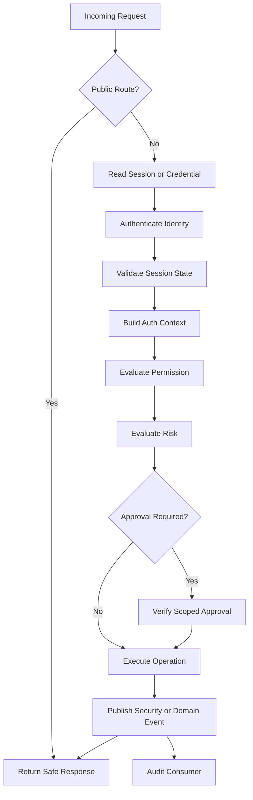

Any failure before execution must prevent the operation.

---

## Identity Model

An identity represents a verified or verifiable way to recognize a user.

An Aerealith user may have multiple identities.

Examples:

```text
email and password
passkey
OAuth provider identity
enterprise identity later
recovery identity
```

Identity records should remain separate from the primary user profile.

This allows:

```text
multiple login methods
provider replacement
identity linking
identity unlinking
account recovery
provider-specific metadata isolation
```

---

## Initial Identity Records

Potential identity records include:

```text
User
AuthIdentity
EmailVerification
PasswordCredential
PasskeyCredential
OAuthIdentity
RecoveryCode
Session
SessionRevocation
AuthAttempt
```

A user is the platform person or principal.

An auth identity is one method through which that user can authenticate.

---

## User and Identity Separation

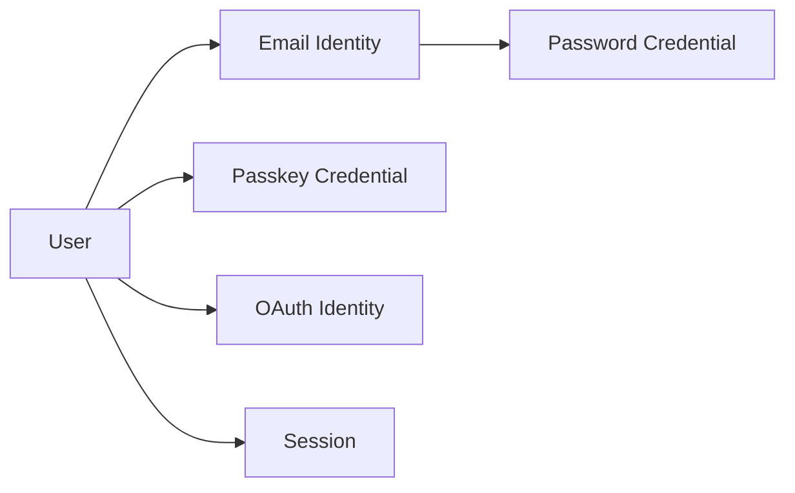

Deleting one identity method should not automatically delete the user unless it is the last valid identity and the account lifecycle explicitly requires deletion.

---

## Browser Authentication Direction

The browser application should use server-managed sessions.

The preferred flow is:

```text
user submits credentials
server validates credentials
server creates a session record
server generates an opaque session token
server stores only a secure token fingerprint or hash
browser receives the opaque token in an HttpOnly cookie
subsequent requests resolve the session server-side
```

The browser should not store long-lived bearer tokens in:

```text
localStorage
sessionStorage
IndexedDB
Redux state
URL parameters
```

HttpOnly cookies prevent ordinary frontend JavaScript from reading session credentials.

---

## Browser Session Flow

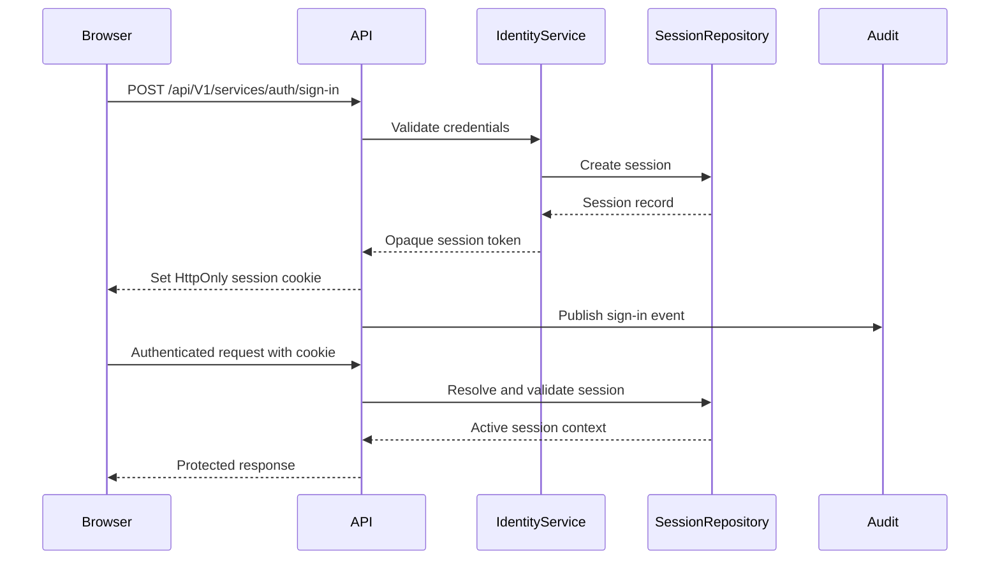

---

## Session Token Strategy

Browser session tokens should be:

```text
opaque
cryptographically random
unguessable
bounded in lifetime
rotatable
revocable
stored only in an HttpOnly cookie on the client
stored only as a fingerprint or secure hash on the server
```

Session tokens should not encode all permission truth.

Permission truth may change before a token expires.

The server must resolve current session and permission state for protected operations.

---

## Session Cookie Requirements

Production session cookies should use appropriate attributes.

Expected settings:

```text
HttpOnly
Secure
SameSite=Lax by default
Path=/
bounded Max-Age or Expires
explicit cookie name
environment-aware domain configuration
```

`SameSite=Strict` may be appropriate for some deployment shapes but can interfere with legitimate login and redirect flows.

`SameSite=None` must only be used with `Secure` and a documented cross-site requirement.

---

## Cookie Naming

Cookie names should be explicit and environment-safe.

Examples:

```text
__Host-aerealith_session
__Secure-aerealith_session
aerealith_session
```

The `__Host-` prefix is preferred when deployment conditions allow:

```text
Secure required
Path=/
no Domain attribute
host-bound cookie
```

Preview and local environments may require different names or settings.

Configuration must be centralized.

---

## Same-Origin API Direction

The preferred browser deployment exposes API behavior through the same origin where practical.

Example:

```text
https://aerealith.com/api/V1/
```

This reduces cross-origin complexity.

A separate API hostname may still exist:

```text
https://api.aerealith.com/
```

When browser requests cross origins, Aerealith must explicitly configure:

```text
CORS
credentialed requests
allowed origins
CSRF defenses
cookie domain behavior
preflight behavior
```

Wildcard origins must not be used with authenticated browser credentials.

---

## CSRF Strategy

Cookie-authenticated state-changing requests require CSRF protection where the deployment and SameSite model leave CSRF risk.

Potential protections include:

```text
SameSite cookies
Origin validation
Referer validation where appropriate
CSRF tokens
double-submit cookie pattern
custom request headers
content-type restrictions
```

Preferred layered model:

```text
SameSite protection
strict allowlisted origins
CSRF token for sensitive state-changing browser requests
```

CSRF protection is separate from authentication and authorization.

A valid session cookie does not prove the request was intentionally initiated by Aerealith.

---

## CORS Strategy

CORS must be centralized and environment-aware.

Allowed origins should be explicitly configured.

Examples:

```text
https://aerealith.com
https://www.aerealith.com
approved preview domains
approved local development origins
```

Rules:

```text
Do not reflect arbitrary origins.
Do not use wildcard origins with credentials.
Do not allow unnecessary headers or methods.
Do not expose sensitive response headers.
Keep preview origin rules bounded.
```

---

## Sign-Up Flow

The initial sign-up flow may include:

```text
submit email and password or supported identity method
validate input
normalize email
check availability without leaking unnecessary identity information
create pending user and identity records
capture required consent
send email verification
create a limited session or wait for verification
record security event
```

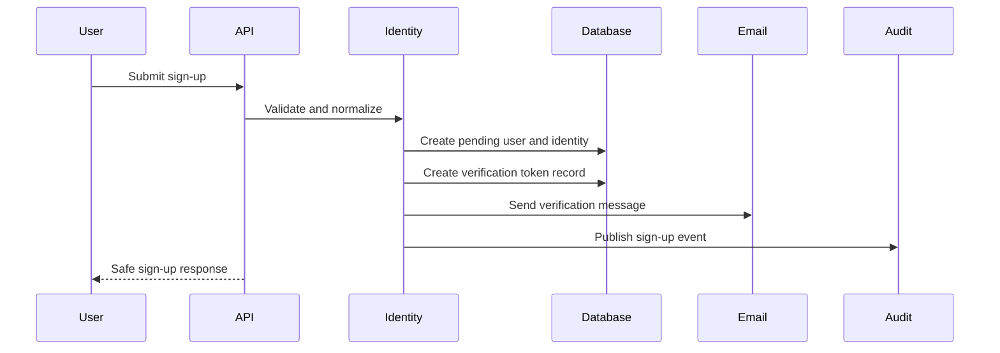

The response should avoid revealing whether unrelated email addresses already exist when that information could aid account enumeration.

---

## Email Verification

Email verification tokens should be:

```text
cryptographically random
single-use
short-lived
stored as a secure hash or fingerprint
bound to the intended identity
invalidated after successful use
invalidated when replaced
```

Verification records may include:

```text
verification ID
user ID
email identity ID
token fingerprint
created at
expires at
used at
invalidated at
request ID
trace ID
```

A verification token should not be reusable.

---

## Sign-In Flow

Sign-in should:

```text
validate input
locate the authentication identity safely
verify credentials
evaluate account state
evaluate rate limits
evaluate suspicious activity where available
create or rotate a session
publish a security event
return a generic safe failure when credentials are invalid
```

Do not reveal whether the email or password was the incorrect component.

Preferred public message:

```text
The provided credentials are invalid.
```

---

## Password Direction

If Aerealith supports local passwords, passwords must be hashed with an approved password-hashing algorithm.

Preferred direction:

```text
Argon2id
```

The implementation should configure:

```text
memory cost
time cost
parallelism
salt generation
hash version
future rehash detection
```

Never store:

```text
plaintext passwords
reversible encrypted passwords
passwords in logs
passwords in audit metadata
passwords in error details
```

---

## Password Policy

Password policy should prefer length and compromise resistance over arbitrary complexity theater.

Recommended direction:

```text
reasonable minimum length
large maximum length
all Unicode or documented supported character handling
compromised-password detection where practical
no forced periodic rotation without evidence of compromise
paste support
password manager compatibility
```

Do not silently truncate passwords.

---

## Password Rehashing

Password hashes should be upgraded when the hashing policy changes.

On successful sign-in:

```text
verify existing hash
check whether rehash is needed
create upgraded hash
replace old hash transactionally
```

A hash-version or algorithm metadata field may support migration.

---

## Account Recovery

Account recovery is a security-sensitive flow.

Recovery should require:

```text
identity verification
short-lived single-use recovery token
rate limiting
session revocation after successful recovery
notification to the account owner
audit event
```

Recovery must not silently bypass stronger authentication requirements.

---

## Password Reset Flow

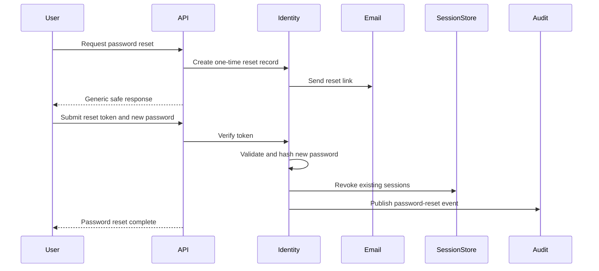

The password-reset request response should be generic whether or not the email exists.

---

## Multi-Factor Authentication Direction

The architecture should support multiple MFA methods.

Potential methods:

```text
TOTP authenticator applications
passkeys and WebAuthn
recovery codes
hardware security keys
email fallback only where risk permits
```

SMS should not be treated as the preferred strong factor.

The exact MVP MFA scope should be established by the authentication RFC and release plan.

---

## Passkey Direction

Passkeys should be supported by the architecture even if introduced after initial password authentication.

Passkey records may contain:

```text
credential ID
public key
user ID
counter
device label
created at
last used at
revoked at
transport metadata
```

Private keys remain with the user’s authenticator.

Aerealith stores public verification material only.

---

## Recovery Codes

Recovery codes should be:

```text
random
single-use
displayed once
stored as secure hashes
individually revocable through use
regenerable only after strong verification
```

Generating new recovery codes should invalidate previous unused codes.

---

## OAuth Login Direction

OAuth or OpenID Connect login may be supported through identity adapters.

Potential providers may include:

```text
Google
GitHub
Discord
Microsoft
Apple
enterprise identity providers later
```

Provider identity must be normalized into Aerealith-owned identity records.

Provider SDK types must not become platform identity contracts.

---

## OAuth Login Flow

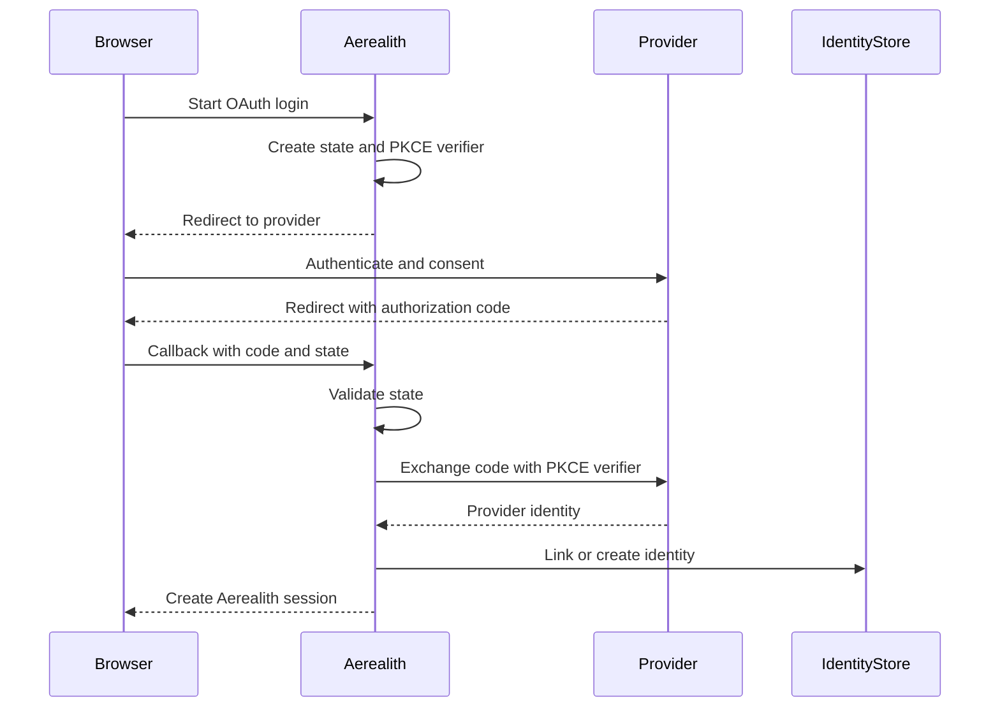

OAuth login must use:

```text
state validation
PKCE where applicable
strict redirect URI validation
short-lived authorization state
nonce validation for OpenID Connect
```

---

## Identity Linking

Linking an additional identity to an existing account should require an authenticated session and appropriate verification.

Rules:

```text
Do not link identities solely because email addresses match.
Require proof of control.
Prevent an identity from being linked to multiple unrelated users.
Audit link and unlink operations.
Require elevated confirmation for sensitive identity removal.
```

Removing the final usable authentication method should be prevented unless the account is being deleted or another recovery path exists.

---

## Integration OAuth Is Not Login OAuth

OAuth used to connect an external provider is separate from OAuth used to sign into Aerealith.

Examples:

```text
Sign in with Google = authentication identity
Connect Google Drive = integration authorization
Sign in with Discord = authentication identity
Connect a Discord server = integration authorization
```

These flows may share infrastructure helpers but must have separate:

```text
scopes
records
tokens
permissions
revocation behavior
audit events
user explanations
```

---

## Session Record Strategy

Session records may include:

```text
session ID
user ID
active account ID
token fingerprint
created at
last used at
expires at
absolute expiry
idle expiry
revoked at
revocation reason
device label
client metadata
IP metadata where justified
authentication method
MFA state
risk state
request ID
trace ID
```

Only data needed for security and user-visible session management should be retained.

---

## Session Lifetime

Sessions should use bounded lifetimes.

Potential controls:

```text
idle timeout
absolute timeout
rotation interval
elevated-auth timeout
device-specific revocation
global revocation
```

Exact durations should be environment and risk aware.

They should be finalized in RFC 0009 or security documentation.

---

## Session Rotation

Sessions should rotate when:

```text
sign-in succeeds
privilege level changes
MFA is completed
password is changed
account recovery completes
suspicious activity is detected
configured rotation interval is reached
```

Rotation should invalidate or supersede the previous credential safely.

---

## Session Refresh

A server-side session may update its expiry or rotate its opaque token through a controlled refresh flow.

Refresh behavior should:

```text
verify current session state
respect absolute expiry
respect revocation
rotate credentials when required
detect reuse where possible
record suspicious behavior
```

Refresh must not resurrect a revoked session.

---

## Session Revocation

Revocation must take effect on the next protected request.

Supported revocation scopes should include:

```text
one session
one device
all sessions for a user
all sessions for an account
sessions created before a security event
sessions associated with a compromised identity
```

Revocation causes may include:

```text
user sign-out
administrator action
password reset
identity removal
suspected compromise
account suspension
account deletion
credential rotation
```

---

## Session Revocation Flow

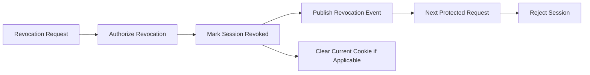

Revocation should not depend only on waiting for cookie or token expiry.

---

## Sign-Out

Sign-out should:

```text
revoke the current session
clear the browser cookie
publish a session-revoked event
return an idempotent success response
```

Calling sign-out multiple times should remain safe.

---

## Session Management UI

Users should be able to view and revoke active sessions.

The frontend may show:

```text
device label
approximate location where appropriate
browser or client
created at
last active at
current session indicator
authentication method
```

The UI must not expose raw token values or sensitive fingerprint data.

---

## Authentication Context

Every protected request should create an authentication context.

Example:

```ts
export interface AuthContext {
  readonly userId: string
  readonly sessionId: string
  readonly accountId?: string
  readonly organizationId?: string
  readonly roles: readonly string[]
  readonly scopes: readonly string[]
  readonly authenticationMethod: string
  readonly mfaSatisfied: boolean
  readonly requestId: string
  readonly traceId?: string
}
```

The exact type should be finalized in shared contracts or core primitives.

---

## Request Context Construction

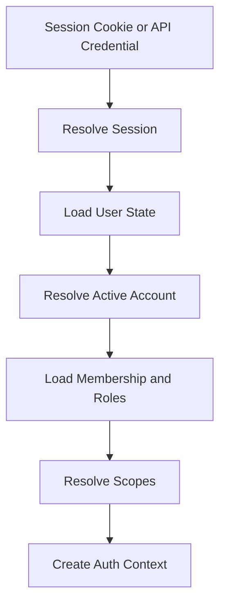

Auth context must be created from current server-side state.

The frontend may request a context but may not define it.

---

## Authorization Model

Aerealith authorization should combine:

```text
role-based access
permission scopes
resource ownership
account or organization membership
module permissions
integration permissions
resource state
risk classification
approval state
```

Roles alone are not enough for every decision.

A role may grant a permission, but the permission must still be evaluated against the target resource and active scope.

---

## Role-Based Access Control

Initial roles may include:

```text
user
developer
support
moderator
administrator
owner
system
```

Roles should represent broad responsibility.

Fine-grained behavior should use permissions or capabilities.

Do not add a new role for every tiny action.

---

## Permission and Capability Model

Permissions should use stable identifiers.

Examples:

```text
account.read
account.update
account.delete
session.read
session.revoke
integration.connect
integration.disconnect
module.enable
module.configure
workflow.create
workflow.approve
moderation.warn
moderation.ban
developer.api-key.create
admin.user.suspend
```

Permission names should be:

```text
lowercase
stable
resource-oriented
action-specific
documented
```

---

## Authorization Decision

An authorization decision should consider:

```text
identity
active session
active scope
roles
granted permissions
resource ownership
resource state
provider permissions where relevant
feature availability
risk level
approval state
```

Example result:

```ts
export interface AuthorizationDecision {
  readonly allowed: boolean
  readonly permission: string
  readonly reasonCode: string
  readonly riskLevel: RiskLevel
  readonly approvalRequired: boolean
}
```

Denial reasons should be safe and understandable without exposing security-sensitive internals.

---

## Authorization Flow

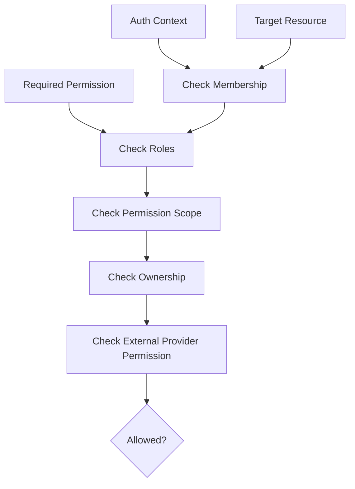

Not every operation requires every check.

The policy must explicitly determine which checks apply.

---

## Resource Scope

Permissions must be evaluated inside an explicit scope.

Possible scopes:

```text
user
account
organization
community
server
integration connection
module
workflow
developer application
```

Approval or permission in one scope must not automatically transfer to another.

Example:

```text
Permission to moderate Server A does not grant permission to moderate Server B.
Approval to disconnect Integration A does not authorize disconnecting Integration B.
```

---

## Active Account Context

The frontend may allow the user to select an active account or organization.

That selected value is a request hint, not trusted authorization truth.

The server must verify that the user:

```text
belongs to the selected account
has an active membership
has the required role or permission
may access the requested resource
```

Changing active account context must not alter permission records silently.

---

## External Platform Permissions

Some operations require both Aerealith permission and external-platform permission.

Examples:

```text
moderation action
role creation
message deletion
integration configuration
provider-owned resource changes
```

Both checks must pass.

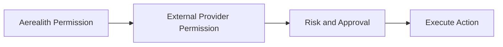

A provider permission must not replace Aerealith authorization.

Aerealith authorization must not pretend the provider grants capabilities it does not.

---

## Risk Evaluation

Authorization determines whether an action may be attempted.

Risk evaluation determines whether additional verification is required.

| Risk     | Examples                                                   | Default                             |
| -------- | ---------------------------------------------------------- | ----------------------------------- |
| Low      | Reads, summaries, formatting, non-destructive preferences. | Execute when authorized.            |
| Medium   | Posting, settings changes, workflow triggers.              | Ask or verify based on policy.      |
| High     | Moderation, deletion, permission changes.                  | Always require verification.        |
| Critical | Billing, security, destructive infrastructure.             | Require explicit elevated approval. |

The service layer is authoritative for risk classification.

---

## Approval Architecture

An approval authorizes one specific action.

Approval records should be bound to:

```text
actor
target
scope
operation
payload fingerprint
risk level
expiration
request
```

Changing the target or meaningful payload invalidates the approval.

An approval must not be a reusable “yes to anything” token.

---

## Step-Up Authentication

Sensitive operations may require recent stronger authentication.

Examples:

```text
change password
disable MFA
create recovery codes
remove final login identity
create administrator credential
change billing ownership
delete account
export sensitive data
```

Step-up authentication may require:

```text
recent password verification
passkey confirmation
TOTP confirmation
hardware-key confirmation
recovery-code verification
```

A session being valid does not guarantee that recent strong verification occurred.

---

## Elevated Authentication Context

The session may record temporary elevated state.

Example:

```text
mfaSatisfiedAt
stepUpExpiresAt
authenticationStrength
```

Elevated state should be:

```text
short-lived
operation-appropriate
revocable
not transferable between sessions
```

---

## Developer API Authentication

External developer clients should not use browser session cookies as their primary credential.

Initial developer credentials may use API keys.

API keys should be:

```text
random
shown once
stored as secure hashes
scoped
named
rotatable
revocable
expiration-capable
rate-limitable
auditable
```

---

## API Key Structure

An API key may use a public identifier and secret portion.

Example conceptual format:

```text
aer_live_<public-id>_<secret>
```

The exact format should be defined later.

The database may store:

```text
key ID
public prefix
secret hash
owner
scopes
created at
last used at
expires at
revoked at
environment
```

The full secret must never be stored after initial issuance.

---

## API Key Request Flow

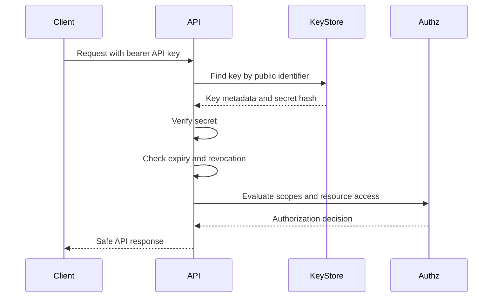

API key authentication still requires authorization.

---

## Developer OAuth Direction

OAuth-compatible developer authorization may be added later for third-party applications.

Potential capabilities:

```text
authorization code flow
PKCE
scoped access
user consent
refresh token rotation
application registration
credential revocation
token introspection or equivalent validation
```

This should require a dedicated RFC before becoming a public platform contract.

---

## Service-to-Service Authentication

During the MVP, logical services inside one runtime should use direct typed calls rather than pretending they are remote services.

When services are physically separated, service authentication may use:

```text
mutual TLS
signed service tokens
platform-issued workload identities
Cloudflare service bindings
Kubernetes workload identity
private network identity
```

Do not reuse user session credentials as generic service credentials.

---

## Internal Route Authentication

Routes under:

```text
/api/V1/internal/
```

must still be authenticated and authorized where they perform sensitive operations.

“Internal” does not mean “trusted by default.”

Potential controls:

```text
service identity
private network
signed request
binding-level trust
administrator permission
environment restriction
```

---

## Admin Authentication

Administrative access requires stronger controls.

Potential requirements:

```text
MFA or passkey
step-up verification
shorter session lifetime
dedicated administrator permission
explicit audit events
restricted origin or device policy later
high-risk approval for destructive actions
```

An administrator role must not bypass audit or approval requirements.

---

## Support Access

Support access should be distinct from administrator access.

Support tools may provide:

```text
limited account lookup
support diagnostics
session metadata
safe account status
user-requested assistance
```

Support access should not automatically permit:

```text
viewing private content
changing permissions
reading secrets
impersonating users
performing destructive actions
```

Any impersonation capability, if ever introduced, requires a dedicated RFC, explicit user-visible indication, and comprehensive audit behavior.

---

## Impersonation Direction

User impersonation should not be part of the default MVP architecture.

If introduced later, it must require:

```text
explicit support or administrator permission
strong authentication
documented support justification
short duration
visible banner
immutable audit trail
restricted action set
no access to secrets
no silent impersonation
```

---

## Waitlist and Invitation Access

Private beta access may be gated through the waitlist model.

Waitlist or invitation state may determine whether a verified user can complete onboarding.

Possible states:

```text
waiting
invited
accepted
onboarding
active
rejected
expired
```

Waitlist eligibility is not a substitute for authentication.

It is a product-access gate applied after identity verification.

---

## Account State

User or account state may affect authentication.

Potential states:

```text
pending
active
suspended
locked
disabled
deletion-requested
deleted
```

Authentication behavior should be explicit for each state.

Example:

| State                | Sign-In Behavior                                        |
| -------------------- | ------------------------------------------------------- |
| `pending`            | Limited access until required verification is complete. |
| `active`             | Normal authentication.                                  |
| `suspended`          | Reject protected access with safe explanation.          |
| `locked`             | Require recovery or security review.                    |
| `disabled`           | Reject access.                                          |
| `deletion-requested` | Allow only approved cancellation or completion flows.   |
| `deleted`            | Reject authentication.                                  |

---

## Lockout and Abuse Protection

Aerealith should protect authentication routes without enabling trivial denial-of-service attacks.

Use:

```text
rate limiting
progressive delays
IP and identity-aware controls
suspicious-attempt telemetry
temporary challenges
security notifications
```

Avoid permanent account lockout based only on attacker-controlled failed attempts.

---

## Rate Limiting

Authentication rate limits may apply by:

```text
IP
email or identity fingerprint
session
account
route
device signal
environment
```

Sensitive routes include:

```text
sign-up
sign-in
verification resend
password reset request
password reset completion
MFA verification
OAuth callback
API key verification
session refresh
```

Rate-limit responses should use stable error codes and safe messages.

---

## User Enumeration Protection

Public auth responses should avoid revealing whether a user, email, API key owner, or identity exists.

Examples:

Password reset request:

```text
If an account is eligible, recovery instructions will be sent.
```

Sign-in failure:

```text
The provided credentials are invalid.
```

Internal logs may record the actual reason when safe, but public responses should not.

---

## Error Model

Auth errors should follow:

```text
docs/rfcs/0004-error-and-result-model.md
```

Potential auth error codes include:

```text
AUTH_INVALID_CREDENTIALS
AUTH_EMAIL_NOT_VERIFIED
AUTH_SESSION_MISSING
AUTH_SESSION_EXPIRED
AUTH_SESSION_REVOKED
AUTH_SESSION_INVALID
AUTH_MFA_REQUIRED
AUTH_MFA_INVALID
AUTH_STEP_UP_REQUIRED
AUTH_IDENTITY_ALREADY_LINKED
AUTH_IDENTITY_NOT_FOUND
AUTH_ACCOUNT_SUSPENDED
AUTH_ACCOUNT_DISABLED
AUTH_RECOVERY_TOKEN_INVALID
AUTH_RECOVERY_TOKEN_EXPIRED
AUTH_API_KEY_INVALID
AUTH_API_KEY_EXPIRED
AUTH_API_KEY_REVOKED
AUTH_OAUTH_STATE_INVALID
AUTH_OAUTH_CALLBACK_FAILED
AUTH_RATE_LIMITED
```

Error codes exposed publicly become compatibility-sensitive.

---

## Safe Auth Errors

Public auth errors must not expose:

```text
password hashes
token values
session fingerprints
OAuth secrets
provider access tokens
stack traces
database errors
exact anti-abuse triggers
private account state not meant for disclosure
```

Internal diagnostics should remain structured and redacted.

---

## Authentication Events

Security-relevant auth behavior should publish events.

Potential events:

```text
identity.created
identity.linked
identity.unlinked
email.verification.requested
email.verified
session.created
session.rotated
session.revoked
session.rejected
auth.sign-in.succeeded
auth.sign-in.failed
auth.password.changed
auth.password.reset
auth.mfa.enabled
auth.mfa.disabled
auth.recovery-code.used
auth.api-key.created
auth.api-key.revoked
auth.suspicious-activity.detected
```

Events should use the platform event envelope.

---

## Auth Audit Requirements

Audit records should be created for meaningful authentication and authorization actions.

Examples:

```text
password changed
MFA enabled or disabled
identity linked or removed
session revoked
all sessions revoked
API key created or revoked
administrator permission changed
account suspended
account reactivated
high-risk authorization denied
approval used
```

Failed sign-in attempts may belong primarily in security telemetry rather than user-facing audit history, depending on privacy and retention policy.

---

## Auth Observability

Auth observability should answer:

```text
Are sign-ins succeeding?
Are failures increasing?
Are reset requests being abused?
Are sessions being rejected unexpectedly?
Are authorization denials increasing?
Are API keys failing?
Are OAuth callbacks failing?
Is one provider degraded?
Are revocations taking effect?
```

Potential metrics:

```text
sign-in success rate
sign-in failure rate
verification completion rate
password reset request count
password reset completion count
session creation count
session revocation count
revoked-session rejection count
MFA challenge success rate
authorization denial rate
API key authentication failure rate
OAuth callback failure rate
auth route latency
```

---

## Logging

Auth logs should include:

```text
operation
result
error code
user ID when known and safe
session ID when safe
request ID
trace ID
authentication method
provider
environment
risk state
duration
```

Auth logs must not include:

```text
passwords
raw tokens
cookie values
authorization headers
OAuth authorization codes
refresh tokens
API key secrets
MFA secrets
recovery codes
```

---

## Privacy

Authentication systems process sensitive data.

Data minimization should apply to:

```text
IP addresses
user agents
device metadata
location approximations
failed-attempt records
provider identity metadata
security history
```

Do not retain security metadata indefinitely without a documented purpose.

Users should be able to review active sessions and important account-security events.

---

## Session Metadata Retention

Session and authentication metadata should have bounded retention.

Retention rules should distinguish:

```text
active session records
recent revoked sessions
security events
failed attempts
device metadata
audit records
provider tokens
```

Exact retention periods should be defined in privacy and security documentation.

---

## Secret Storage

Auth secrets may include:

```text
password hashes
session token hashes
MFA secrets
OAuth client secrets
OAuth access and refresh tokens
API key hashes
email verification token hashes
password reset token hashes
signing keys
```

Secrets should be:

```text
encrypted or hashed as appropriate
access-controlled
rotatable
redacted
kept out of public contracts
kept out of logs
kept out of ordinary audit metadata
```

---

## Token Storage Rules

| Credential               | Client Storage                                      | Server Storage                            |
| ------------------------ | --------------------------------------------------- | ----------------------------------------- |
| Browser session token    | HttpOnly cookie                                     | Hash or fingerprint plus session metadata |
| Password                 | Never stored after submission                       | Password hash                             |
| Password reset token     | User-controlled link temporarily                    | Hash or fingerprint                       |
| Email verification token | User-controlled link temporarily                    | Hash or fingerprint                       |
| API key                  | Client secret storage                               | Hash plus metadata                        |
| OAuth access token       | Never frontend-exposed unless specifically required | Encrypted provider credential storage     |
| MFA recovery code        | User-secured copy                                   | Individual secure hashes                  |

---

## Encryption and Hashing

Use hashing when only verification is required.

Examples:

```text
passwords
session tokens
API key secrets
recovery tokens
verification tokens
recovery codes
```

Use encryption when the original secret must later be recovered.

Examples:

```text
OAuth refresh tokens
provider access tokens
TOTP secret when needed for verification
```

Encryption keys must remain separate from encrypted values.

---

## Auth Data Ownership

Auth data belongs to the identity domain.

Potential owned tables:

```text
auth_identities
password_credentials
passkey_credentials
email_verifications
password_resets
sessions
session_revocations
mfa_methods
recovery_codes
auth_attempts
api_keys
oauth_authorization_states
```

Other domains should not mutate auth tables directly.

They should call identity or authorization application services.

---

## Data Separation

Auth persistence types must not be exposed through public contracts.

For example, a session persistence row may contain:

```text
token hash
IP metadata
user-agent metadata
revocation reason
internal risk flags
```

A public session response should expose only safe information.

Example:

```ts
export interface SessionResponse {
  readonly id: string
  readonly deviceLabel?: string
  readonly createdAt: string
  readonly lastUsedAt?: string
  readonly expiresAt: string
  readonly current: boolean
}
```

---

## Contract Strategy

Versioned auth contracts should live under:

```text
libs/contracts/src/api/V1/services/auth/
```

Potential contracts:

```text
sign-up.request.ts
sign-up.response.ts
sign-in.request.ts
sign-in.response.ts
sign-out.response.ts
verify-email.request.ts
request-password-reset.request.ts
reset-password.request.ts
session.response.ts
list-sessions.response.ts
revoke-session.request.ts
auth-context.response.ts
```

Runtime validation should use Zod.

---

## API Route Direction

Potential public auth routes include:

```text
POST /api/V1/services/auth/sign-up
POST /api/V1/services/auth/sign-in
POST /api/V1/services/auth/sign-out
POST /api/V1/services/auth/refresh
POST /api/V1/services/auth/verify-email
POST /api/V1/services/auth/resend-verification
POST /api/V1/services/auth/password-reset/request
POST /api/V1/services/auth/password-reset/complete
GET /api/V1/services/auth/session
GET /api/V1/services/auth/sessions
DELETE /api/V1/services/auth/sessions/{sessionId}
DELETE /api/V1/services/auth/sessions
```

Potential identity routes include:

```text
GET /api/V1/services/identity
GET /api/V1/services/identity/methods
POST /api/V1/services/identity/methods
DELETE /api/V1/services/identity/methods/{identityId}
```

Exact routes must be finalized by RFC 0009 and API contract review.

---

## Auth Route Classification

| Route Type                | Authentication Requirement                                  |
| ------------------------- | ----------------------------------------------------------- |
| Sign-up                   | Public with anti-abuse controls                             |
| Sign-in                   | Public with anti-abuse controls                             |
| Verification              | Token-bound and rate-limited                                |
| Password reset request    | Public with enumeration protection                          |
| Password reset completion | Token-bound and rate-limited                                |
| Sign-out                  | Authenticated or idempotently safe                          |
| Session listing           | Authenticated                                               |
| Session revocation        | Authenticated and ownership-scoped                          |
| Identity linking          | Authenticated with verification                             |
| Identity removal          | Authenticated with step-up when sensitive                   |
| API key creation          | Authenticated, developer-authorized, step-up where required |

---

## Frontend Auth Architecture

The frontend should use an auth provider abstraction.

Recommended location:

```text
apps/frontend/src/app/providers/auth-provider.tsx
apps/frontend/src/features/auth/
apps/frontend/src/lib/auth/
```

The frontend may manage:

```text
loading state
safe current-user state
route transitions
sign-in and sign-out forms
session-management UI
permission-aware presentation
```

The frontend must not define:

```text
authoritative permission state
authoritative account membership
risk classification
approval validity
session validity
provider permission truth
```

---

## Frontend Session State

Redux Toolkit may hold a safe representation of current client auth state.

Example:

```text
unknown
authenticated
unauthenticated
refreshing
signed-out
```

Sensitive credentials must not be stored in Redux.

TanStack Query may cache safe session and current-user responses.

The server remains authoritative.

---

## Route Guards

Frontend route guards improve UX but are not security boundaries.

Route groups include:

```text
public routes
authenticated routes
administrator routes
developer routes
documentation routes
```

A guarded frontend route must still call a backend route that performs full authorization.

---

## Frontend Auth Flow

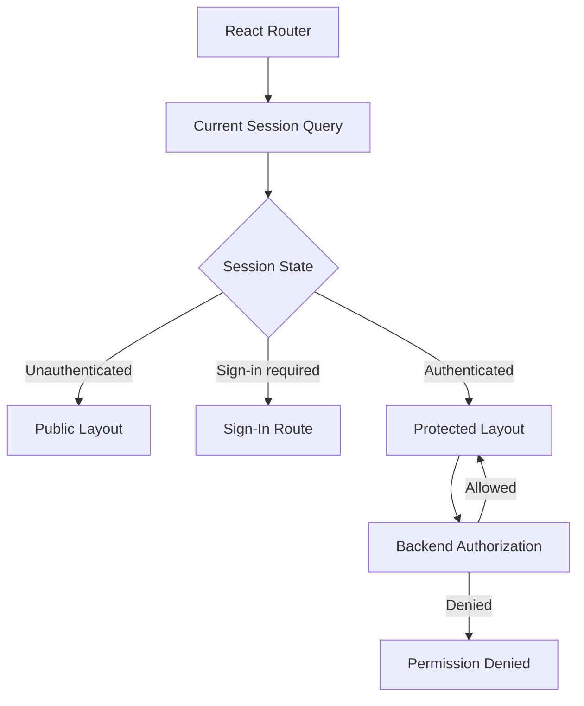

---

## Provider Neutrality

The frontend and services must not scatter provider-specific auth calls throughout the codebase.

Provider-specific behavior should be isolated behind interfaces.

Example:

```ts
export interface IdentityProviderAdapter {
  startAuthentication(
    input: StartAuthenticationInput,
  ): Promise<Result<AuthenticationRedirect, AerealithError>>

  completeAuthentication(
    input: CompleteAuthenticationInput,
  ): Promise<Result<ExternalIdentity, AerealithError>>
}
```

Aerealith-owned identity and session contracts remain stable even if the provider changes.

---

## Runtime Portability

The auth architecture should remain compatible with:

```text
Cloudflare Workers
Node.js
Docker
Kubernetes
```

Runtime-specific behavior should be isolated.

Examples:

```text
cookie adapter
crypto adapter
email adapter
secret-binding adapter
session storage adapter
rate-limit adapter
OAuth callback adapter
```

---

## Cloudflare Workers Considerations

Worker-compatible auth should use:

```text
Web Crypto APIs
Fetch API request and response objects
Worker secrets and bindings
edge-compatible password-hashing strategy or isolated auth runtime
serverless-compatible database access
explicit cookie serialization
```

Some password-hashing libraries may not be appropriate directly inside a Worker runtime.

If Argon2id cannot run safely and efficiently in the chosen Worker environment, password verification may require:

```text
a compatible WebAssembly implementation
a dedicated auth runtime
a provider adapter
another explicitly reviewed deployment design
```

The architecture must not silently downgrade password security to preserve one runtime.

---

## Docker and Kubernetes Considerations

Containerized auth runtimes may use:

```text
native password-hashing libraries
database connection pools
Kubernetes Secrets
external secret managers
private service networking
workload identity
```

The public auth contracts should remain unchanged across deployment models.

---

## Failure Behavior

Authentication systems must fail closed.

Examples:

```text
session store unavailable -> reject protected request safely
permission data unavailable -> deny sensitive action
approval state unavailable -> block approved-only action
OAuth state mismatch -> reject callback
MFA provider unavailable -> do not silently bypass MFA
audit publisher unavailable -> follow documented security-event fallback
```

Authentication infrastructure failure should not grant access.

---

## Graceful Degradation

Some failures may preserve limited behavior.

Examples:

```text
email provider unavailable -> account exists but verification delivery is delayed
one OAuth provider unavailable -> other login methods remain available
session-management UI unavailable -> current session remains valid
analytics unavailable -> authentication continues without analytics
AI unavailable -> authentication is unaffected
```

Core authentication must never depend on AI.

---

## Security Notifications

Users should receive appropriate notifications for important account-security events.

Potential notifications:

```text
new sign-in
password changed
password reset completed
MFA enabled or disabled
new recovery codes generated
identity linked or removed
API key created or revoked
all sessions revoked
suspicious activity detected
```

Notifications should not reveal secrets.

---

## Account Deletion Relationship

Account deletion should coordinate with auth.

At deletion initiation or completion, the identity service may need to:

```text
revoke active sessions
disable sign-in
revoke API keys
disconnect login identities
remove or invalidate recovery methods
delete credential material according to policy
publish audit events
```

Deletion must not leave usable credentials behind.

---

## Authentication Testing Strategy

Auth testing should include:

```text
unit tests
schema validation tests
password hashing tests
session lifecycle tests
cookie tests
CSRF tests
CORS tests
rate-limit tests
OAuth state and PKCE tests
email verification tests
password reset tests
MFA tests
authorization tests
approval tests
API key tests
security-event tests
integration tests
end-to-end tests
```

Coverage requirement:

```text
80% statements
80% branches
80% functions
80% lines
```

Coverage is the minimum.

Security-sensitive branches require direct tests even when aggregate coverage already passes.

---

## Critical Authentication Tests

Tests must prove:

```text
invalid credentials are rejected
public failures do not reveal whether an identity exists
passwords are never stored in plaintext
session tokens are not stored in plaintext
session cookies are HttpOnly
production cookies are Secure
revoked sessions fail on the next protected request
expired sessions are rejected
session rotation invalidates the previous credential
password reset tokens are single-use
email verification tokens are single-use
OAuth callbacks reject invalid state
PKCE verification is enforced where applicable
MFA cannot be bypassed
removing MFA requires appropriate verification
API keys can be revoked
API key secrets are shown only once
authorization cannot be bypassed through forged frontend state
high-risk actions require approval
approval cannot be reused for another resource
```

---

## Critical Authorization Tests

Tests must prove:

```text
authentication alone does not grant resource access
membership is checked against the active scope
ownership is checked where required
administrator roles do not bypass audit
external provider permissions are checked when needed
permission in one account does not transfer to another
permission in one server does not transfer to another
feature flags do not replace authorization
frontend route guards are not treated as backend security
```

---

## Adversarial Testing

Auth testing should include adversarial cases.

Examples:

```text
replayed reset token
replayed verification token
stolen revoked session
session fixation
CSRF attempt
OAuth state substitution
OAuth redirect manipulation
API key prefix guessing
rate-limit evasion attempts
forged role in request body
forged account ID
approval replay
approval payload modification
identity linking takeover attempt
final identity removal
```

---

## E2E Auth Tests

Playwright or equivalent E2E tests should validate:

```text
sign-up
email-verification UI
sign-in
sign-out
protected-route redirect
session persistence
session revocation
password reset
account and security settings
permission-denied experience
administrator route guard
developer route guard
```

Backend tests must independently prove security behavior.

E2E tests do not replace service-level authorization tests.

---

## Auth Test Environments

Auth tests should support:

```text
local development
CI
preview
staging
production smoke tests
```

Production smoke tests must not expose or print secrets.

Provider tests should use:

```text
test tenants
sandbox credentials
mock providers
recorded safe fixtures
```

---

## File Structure

Recommended auth structure inside the service runtime:

```text
apps/services/api/src/features/auth/
├── application/
│   ├── sign-up.service.ts
│   ├── sign-in.service.ts
│   ├── sign-out.service.ts
│   ├── refresh-session.service.ts
│   ├── verify-email.service.ts
│   ├── request-password-reset.service.ts
│   ├── reset-password.service.ts
│   ├── revoke-session.service.ts
│   └── get-auth-context.service.ts
├── domain/
│   ├── auth.policy.ts
│   ├── password.policy.ts
│   ├── session.policy.ts
│   ├── authorization.policy.ts
│   └── risk.policy.ts
├── transport/
│   ├── auth.routes.ts
│   ├── auth.handlers.ts
│   └── auth.middleware.ts
├── infrastructure/
│   ├── cookie.adapter.ts
│   ├── password-hasher.adapter.ts
│   ├── oauth-provider.adapter.ts
│   └── auth.dependencies.ts
└── index.ts
```

---

## Core Auth Entities

Potential domain entities:

```text
libs/core/src/entities/auth/
├── auth-identity.entity.ts
├── session.entity.ts
├── email-verification.entity.ts
├── password-reset.entity.ts
├── mfa-method.entity.ts
├── approval.entity.ts
└── index.ts
```

Only pure domain concepts belong here.

Provider SDK and database types must remain outside `libs/core`.

---

## Repository Interfaces

Potential repository interfaces:

```text
libs/core/src/contracts/repositories/
├── auth-identity.repository.ts
├── session.repository.ts
├── email-verification.repository.ts
├── password-reset.repository.ts
├── mfa-method.repository.ts
├── api-key.repository.ts
└── approval.repository.ts
```

Implementations belong in:

```text
libs/db/src/repositories/auth/
```

---

## Persistence Structure

Potential auth persistence structure:

```text
libs/db/src/
├── schema/auth/
├── queries/auth/
├── mappers/auth/
└── repositories/auth/
```

Potential tables:

```text
auth_identities
password_credentials
email_verifications
password_resets
sessions
mfa_methods
recovery_codes
api_keys
oauth_states
```

---

## Auth Middleware

Auth middleware may handle:

```text
credential extraction
session resolution
credential verification
request-context construction
basic authentication requirement
request and trace propagation
```

Authorization should remain explicit at the route or application-service policy boundary.

Avoid one magical middleware layer that silently determines every business permission.

---

## Permission Service Direction

A centralized permission capability should provide consistent decisions.

Example:

```ts
export interface PermissionService {
  evaluate(
    input: PermissionEvaluationInput,
  ): Promise<Result<AuthorizationDecision, AerealithError>>
}
```

The permission service may use:

```text
roles
membership
ownership
scopes
resource state
provider permission state
risk policy
```

It should return a decision rather than mutating the target resource.

---

## Auth Anti-Patterns

Avoid:

```text
storing session tokens in localStorage
putting raw credentials in Redux
trusting frontend roles
using JWT claims as permanent permission truth
waiting for token expiry instead of supporting revocation
returning different public errors for unknown email and bad password
storing raw reset or verification tokens
logging authorization headers
using OAuth email matching alone to link identities
mixing integration OAuth tokens with login identities
letting administrators bypass audit
using feature flags as authorization
granting broad global permissions for scoped resources
reusing approvals for different targets
implementing permission checks differently in every route
assuming internal routes are trusted
making core authentication depend on AI
```

---

## Migration Direction

Current and future auth work should prioritize:

```text
RFC 0009
provider-neutral identity contracts
server-side session records
opaque session cookies
session revocation
email verification
password reset
centralized permission evaluation
risk classification
approval records
auth events
audit integration
rate limiting
CSRF and CORS policy
API key foundations
security-focused tests
```

---

## Initial Implementation Sequence

Recommended implementation order:

```text
1. Accept RFC 0009.
2. Finalize identity and session contracts.
3. Define auth error codes.
4. Define auth persistence tables.
5. Implement password hashing or selected provider adapter.
6. Implement sign-up.
7. Implement email verification.
8. Implement sign-in.
9. Implement session resolution.
10. Implement sign-out and revocation.
11. Implement current-session endpoint.
12. Implement session-list and revoke endpoints.
13. Implement password reset.
14. Implement centralized authorization.
15. Implement risk evaluation.
16. Implement approval verification.
17. Add rate limiting.
18. Add CSRF and CORS enforcement.
19. Add auth audit events.
20. Complete security review and adversarial tests.
```

---

## MVP Auth Scope

Release `0.3 — Authentication & Identity` should prove:

```text
secure sign-up
secure sign-in
secure sign-out
email verification
server-side sessions
session refresh or renewal
session revocation
current-session resolution
centralized authorization
permission-scoped actions
risk levels
approval records
auth route rate limiting
account recovery foundation
consent integration
security review
```

MFA scope should be finalized by RFC 0009.

The architecture must not block MFA or passkeys later.

---

## Release Exit Criteria

Authentication and identity should not be considered complete until:

```text
an unauthenticated caller is rejected safely
an unauthorized caller is rejected safely
a revoked session fails on the next protected request
a password reset revokes existing sessions where required
no credential appears in a client bundle
no credential appears in logs
no credential appears in public errors
high-risk actions cannot execute without scoped approval
authorization is enforced by the backend
auth routes are rate-limited
security-sensitive events are audited
80% coverage passes
human security review is complete
```

---

## Relationship to Frontend Architecture

The frontend provides:

```text
auth forms
route guards
session UI
safe current-user state
session-management screens
permission-aware presentation
```

The backend provides:

```text
identity verification
session validity
authorization
risk classification
approval validity
account state
provider permission truth
```

Frontend checks are UX behavior.

Backend checks are security behavior.

---

## Relationship to API Architecture

Auth routes use:

```text
/api/V1/
```

Auth responses must use the standard API envelope.

Auth failures must use stable error codes and safe public messages.

Request and trace IDs should propagate through auth operations.

---

## Relationship to Service Architecture

Identity and authorization are logical service boundaries.

Other services call identity and permission capabilities rather than implementing their own auth behavior.

No service may assume a request is authorized merely because it reached the service.

---

## Relationship to Data Architecture

Auth persistence remains inside `libs/db`.

Domain identity and session models remain database-neutral.

Public contracts omit:

```text
token hashes
password hashes
MFA secrets
OAuth secrets
internal risk metadata
private client metadata
```

Session, consent, approval, and audit records must remain explicitly scoped.

---

## Relationship to Trust Model

Auth is one layer of the trust model.

Every meaningful action should remain:

```text
authenticated where required
authorized
risk-evaluated
approved where required
auditable
revocable
scope-bound
understandable
```

Authentication must not become a blanket grant for automation or AI actions.

---

## Relationship to AI

AI must not:

```text
authenticate users
invent permissions
approve its own actions
bypass step-up authentication
bypass MFA
bypass session revocation
change credentials without explicit approval
```

AI may help explain auth states or guide users through recovery, but core auth behavior must work without AI.

---

## Relationship to Self-Hosting

The auth architecture supports future self-hosting through:

```text
provider-neutral identity contracts
database-backed session support
portable cookie behavior
runtime adapters
Docker support
Kubernetes secret injection
replaceable email delivery
replaceable OAuth providers
documented key rotation
```

Self-hosted deployments must preserve the same security guarantees.

---

## Success Criteria

The auth architecture is successful when:

```text
browser credentials are stored in HttpOnly cookies
session tokens are opaque
server-side revocation works immediately
identity methods are provider-neutral
passwords are securely hashed
reset and verification tokens are single-use
permissions are centrally and consistently evaluated
resource scope is explicit
external provider permissions are checked where required
risk and approval are separate from authentication
high-risk actions cannot bypass approval
API keys are scoped and revocable
auth events are observable
security-sensitive actions are audited
secrets never appear in logs or public errors
Cloudflare Workers remain supported
Docker and Kubernetes remain viable
core authentication works without AI
80% coverage is enforced
```

---

## Final Standard

Aerealith authentication should prove identity without granting unchecked authority.

The standard is:

> Aerealith uses provider-neutral identities, server-managed revocable browser sessions, scoped developer credentials, centralized backend authorization, resource-aware permissions, explicit risk evaluation, and action-specific approval. The frontend may present access state, but only the service layer can authenticate, authorize, approve, execute, and audit a protected action.
