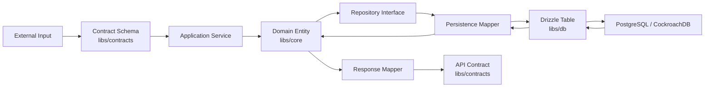
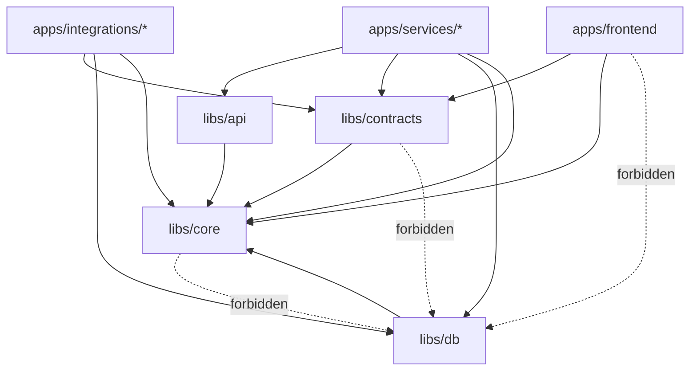
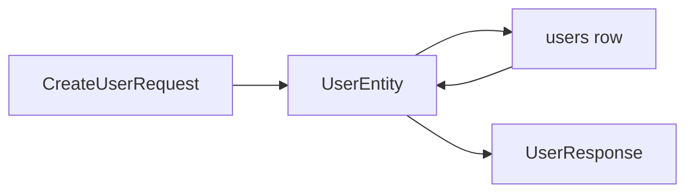
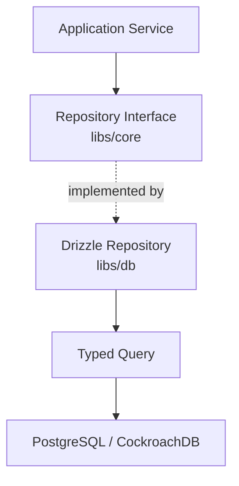
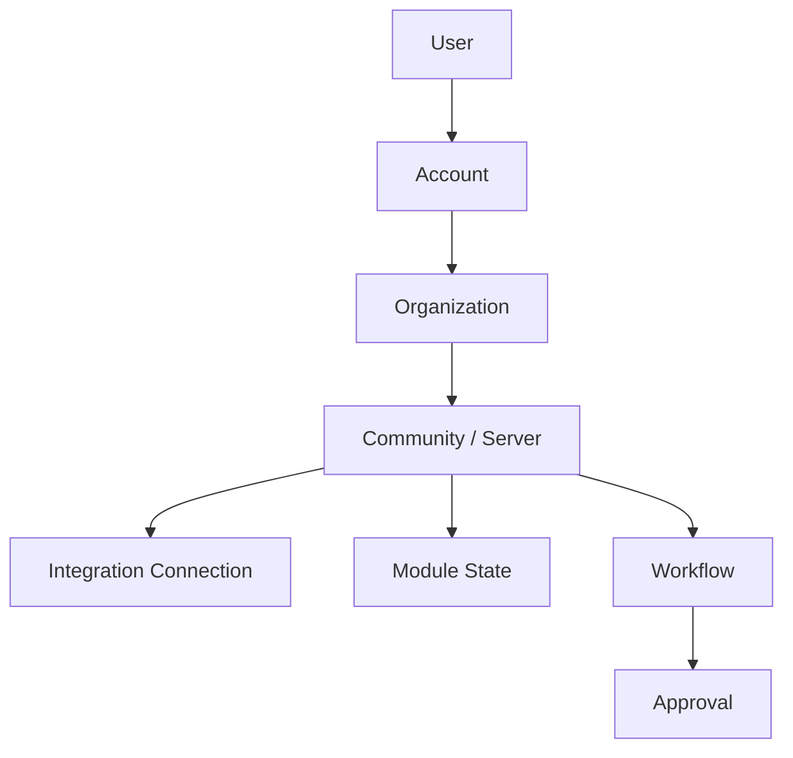
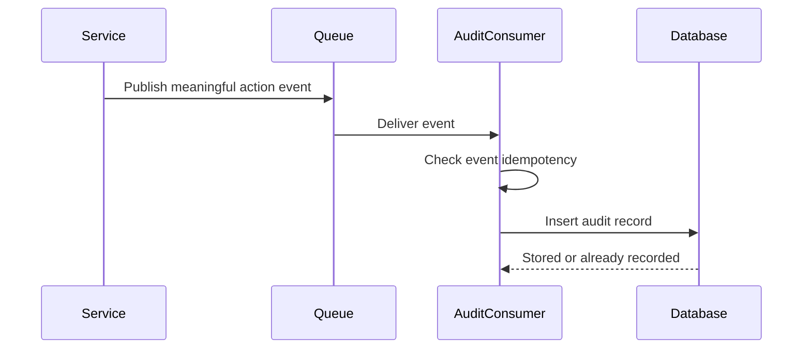
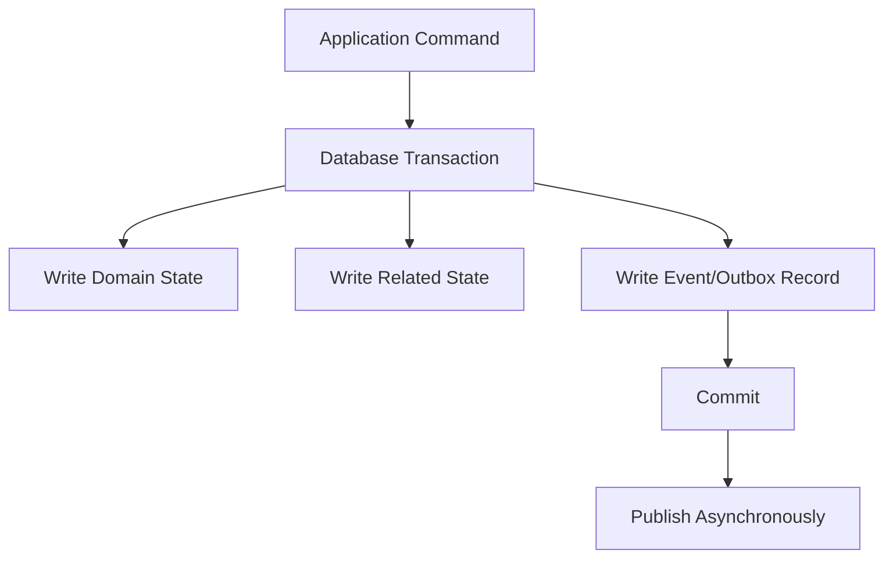

# Data Architecture

Status: Draft
Owner: Tim Pierce / SinLess Games
Last Updated: 2026-07-12
Related RFCs:

- `docs/rfcs/0002-monorepo-library-boundaries.md`
- `docs/rfcs/0003-api-versioning-and-route-strategy.md`
- `docs/rfcs/0004-error-and-result-model.md`
- `docs/rfcs/0005-entity-schema-and-contract-strategy.md`

Related Architecture:

- `docs/architecture/Monorepo Architecture.md`
- `docs/architecture/Frontend Architecture.md`
- `docs/architecture/API Architecture.md`
- `docs/architecture/Service Architecture.md`

---

## Purpose

This document defines the data architecture for Aerealith AI.

The data architecture governs how Aerealith:

```text
models platform concepts
validates runtime data
stores persistent state
maps between data layers
owns and scopes records
performs migrations
protects private information
records consent
records meaningful actions
supports exports and deletion
handles transactions
supports PostgreSQL and CockroachDB
uses Drizzle
backs up and restores data
evolves schemas safely
```

The objective is to build a data platform that is:

```text
strongly typed
runtime validated
privacy-aware
trust-aligned
auditable
portable
migration-safe
provider-conscious
testable
recoverable
capable of growing without leaking persistence details everywhere
```

The guiding rule is:

> Domain models describe what Aerealith means, persistence models describe how Aerealith stores it, and contracts describe what Aerealith exposes.

These layers may look similar.

They are not interchangeable.

---

## Architecture Summary

Aerealith uses a layered data architecture built around:

```text
PostgreSQL-compatible relational storage
CockroachDB compatibility
Drizzle ORM and Drizzle Kit
Zod runtime schemas
pure domain entities
explicit persistence tables
repository interfaces
data mappers
versioned API contracts
ordered migrations
typed transactions
structured audit events
```

The primary database model is relational.

The supported database direction is:

```text
PostgreSQL
CockroachDB
```

The ORM and schema tooling direction is:

```text
Drizzle ORM
Drizzle Kit
```

Aerealith should design around PostgreSQL-compatible SQL while treating CockroachDB compatibility as a tested constraint rather than an assumption.

The central separation is:

```text
Domain Entity
    != Persistence Row
    != API Contract
    != UI Model
```

---

## Core Data Principles

Aerealith data systems should follow these principles:

```text
Keep the domain independent from the database.
Do not expose persistence rows through APIs.
Validate data at every trust boundary.
Make ownership and scope explicit.
Use one source of truth for each record.
Prefer relational structure for relational data.
Use JSON only when flexibility is genuinely needed.
Use migrations for every persistent schema change.
Make migrations reviewable and repeatable.
Treat data deletion and export as architecture concerns.
Keep secrets outside ordinary application tables where practical.
Record consent intentionally.
Record meaningful actions through audit events.
Make writes transactionally safe.
Make retries idempotent.
Test PostgreSQL and CockroachDB compatibility.
Avoid database features that silently destroy portability.
```

---

## High-Level Data Flow



The application layer should not pass raw database rows directly to the frontend or public API.

---

## Data Layer Responsibilities

| Layer              | Responsibility                                                           | Primary Location                                                      |
| ------------------ | ------------------------------------------------------------------------ | --------------------------------------------------------------------- |
| Domain             | Platform meaning, entities, value objects, invariants, and domain rules. | `libs/core/src/entities/`                                             |
| Runtime Schemas    | Validation of primitive and domain-facing data.                          | `libs/core/src/schemas/`                                              |
| Contracts          | Versioned requests, responses, DTOs, and boundary schemas.               | `libs/contracts/src/`                                                 |
| Persistence Schema | Drizzle tables, columns, indexes, constraints, and relations.            | `libs/db/src/schema/`                                                 |
| Repositories       | Domain-oriented persistence operations.                                  | Interfaces in `libs/core`; implementations in `libs/db`.              |
| Queries            | Typed reusable database queries.                                         | `libs/db/src/queries/`                                                |
| Mappers            | Conversion between persistence and domain representations.               | `libs/db/src/mappers/`                                                |
| Transactions       | Transaction orchestration and transaction context.                       | `libs/db/src/transactions/`                                           |
| Migrations         | Ordered database changes.                                                | `libs/db/src/migrations/` or the configured Drizzle migration folder. |
| Database Client    | Connections, configuration, adapters, and lifecycle.                     | `libs/db/src/client/`                                                 |
| API Mapping        | Conversion from domain entities to public contracts.                     | `libs/api` or owning service.                                         |

---

## Approved Library Direction

The data architecture uses these primary libraries:

```text
libs/core
libs/contracts
libs/db
libs/api
```

Expected direction:



The domain layer must never depend on the persistence layer.

The contracts layer must never depend on the persistence layer.

---

## Database Direction

Aerealith uses a PostgreSQL-compatible relational database model.

Supported database engines:

```text
PostgreSQL
CockroachDB
```

The database engine may vary by environment or deployment model, provided all required behavior is tested.

Aerealith should avoid claiming compatibility merely because both databases speak PostgreSQL-flavored SQL.

Compatibility must be verified for:

```text
column types
default expressions
indexes
unique constraints
foreign keys
transactions
locking behavior
isolation behavior
generated values
JSON behavior
migration syntax
timestamp behavior
upserts
sequence behavior
schema namespaces
query performance
```

---

## PostgreSQL and CockroachDB Compatibility

PostgreSQL and CockroachDB share many SQL concepts, but they are not identical.

The architecture should use a tested common subset by default.

Prefer:

```text
UUID or string-compatible identifiers
standard relational constraints
explicit indexes
portable check constraints
portable JSON usage
transaction retry handling
explicit timestamps
Drizzle-generated parameterized queries
```

Treat these with caution:

```text
PostgreSQL extensions
advisory locks
database-specific functions
sequence assumptions
serializable transaction behavior
partial or expression indexes
specialized index types
generated columns
triggers
stored procedures
database-native enum behavior
```

A database-specific capability may be used when:

```text
the value is clear
the compatibility cost is documented
an adapter or fallback exists
tests cover both supported engines
an RFC or architecture decision approves the tradeoff
```

---

## Drizzle Direction

Aerealith uses:

```text
Drizzle ORM
Drizzle Kit
```

Drizzle should own:

```text
table declarations
column declarations
relations
query construction
migration generation
migration execution
database type inference
```

Drizzle should not define the domain architecture.

The ORM is an implementation tool inside `libs/db`.

Domain code should not import:

```text
drizzle-orm
database column types
table objects
query builder objects
database transaction objects
```

outside persistence-aware boundaries.

---

## Database Commands

The expected repository scripts are:

```text
pnpm db:generate
pnpm db:migrate
pnpm db:studio
```

Expected meanings:

| Command            | Purpose                                                            |
| ------------------ | ------------------------------------------------------------------ |
| `pnpm db:generate` | Generate a migration from declared Drizzle schema changes.         |
| `pnpm db:migrate`  | Apply pending migrations.                                          |
| `pnpm db:studio`   | Open Drizzle Studio for approved development and inspection tasks. |

Production schema changes must not rely on Drizzle Studio or manual edits.

Persistent changes require migrations.

---

## Domain Entity Strategy

Domain entities describe Aerealith concepts.

Examples:

```text
User
UserAccount
UserProfile
UserPreferences
UserSettings
UserConsent
UserSession
WaitlistEntry
IntegrationConnection
ModuleConfiguration
Workflow
WorkflowRun
Approval
Notification
AuditEvent
```

Domain entities should be:

```text
database-neutral
provider-neutral
runtime-neutral
strongly typed
safe to test without infrastructure
explicit about required and optional values
```

Domain entities may use:

```text
readonly interfaces
readonly object types
classes when behavior justifies them
value objects
branded string types
```

They should not contain:

```text
Drizzle table metadata
database decorators
SQL expressions
database transaction handles
provider SDK types
HTTP request objects
GraphQL resolver objects
```

---

## One Entity Per File

Aerealith uses one primary entity per file.

Examples:

```text
libs/core/src/entities/user/user.entity.ts
libs/core/src/entities/user/account.entity.ts
libs/core/src/entities/user/profile.entity.ts
libs/core/src/entities/user/session.entity.ts
libs/core/src/entities/system/waitlist.entity.ts
```

Supporting types may live beside the entity when tightly related.

Avoid giant files containing unrelated domain entities.

---

## Persistence Schema Strategy

Drizzle table declarations belong under:

```text
libs/db/src/schema/
```

Recommended organization:

```text
libs/db/src/schema/
├── index.ts
├── system/
│   ├── index.ts
│   └── waitlist.table.ts
├── user/
│   ├── index.ts
│   ├── user.table.ts
│   ├── user-account.table.ts
│   ├── user-profile.table.ts
│   ├── user-preferences.table.ts
│   ├── user-settings.table.ts
│   ├── user-consent.table.ts
│   └── user-session.table.ts
├── integrations/
├── modules/
├── workflows/
├── notifications/
└── audit/
```

Each table file should define:

```text
table
columns
primary key
foreign keys
unique constraints
indexes
database defaults
database-compatible enums or constraints
```

---

## Table Naming Strategy

Database table names should use:

```text
lowercase
snake_case
plural nouns where practical
stable names
```

Examples:

```text
users
user_accounts
user_profiles
user_preferences
user_settings
user_consents
user_sessions
waitlist_entries
integration_connections
workflow_runs
audit_events
```

Application TypeScript names should use:

```text
PascalCase for types and entities
camelCase for properties and functions
kebab-case for file names
```

Example mapping:

```text
database: user_sessions
TypeScript table variable: userSessionsTable
domain entity: UserSessionEntity
contract: UserSessionResponse
```

---

## Column Naming Strategy

Database columns should use `snake_case`.

Examples:

```text
id
user_id
account_id
created_at
updated_at
deleted_at
expires_at
request_id
trace_id
approval_id
```

Domain and contract properties should use `camelCase`.

Examples:

```text
userId
accountId
createdAt
updatedAt
deletedAt
expiresAt
requestId
traceId
approvalId
```

Mappers are responsible for the translation.

---

## Persistence Row Strategy

Persistence rows are database representations.

They may include:

```text
Date objects
database-native values
nullable storage values
foreign keys
database-only metadata
encrypted payloads
internal lifecycle fields
```

Persistence rows must not be treated as public contracts.

A persistence row may include data that should never be exposed publicly.

Examples:

```text
password hash
credential ciphertext
internal deletion marker
token fingerprint
provider metadata
security review state
private operational notes
raw event payload reference
```

---

## Entity, Row, and Contract Separation



Even when the shapes initially look similar, the layers stay separate.

Example:

```ts
export interface UserEntity {
  readonly id: string
  readonly email: string
  readonly displayName: string
  readonly status: UserStatus
  readonly createdAt: string
  readonly updatedAt: string
}

export interface UserPersistenceRow {
  readonly id: string
  readonly email: string
  readonly displayName: string
  readonly status: string
  readonly passwordHash: string | null
  readonly createdAt: Date
  readonly updatedAt: Date
}

export interface UserResponse {
  readonly id: string
  readonly displayName: string
  readonly status: UserStatus
  readonly createdAt: string
  readonly updatedAt: string
}
```

The persistence row contains fields the response intentionally omits.

---

## Mapper Strategy

Mappers convert between:

```text
persistence row -> domain entity
domain entity -> persistence input
domain entity -> contract response
provider payload -> normalized domain input
```

Persistence mappers belong in:

```text
libs/db/src/mappers/
```

Example:

```ts
export function mapUserRowToEntity(row: UserPersistenceRow): UserEntity {
  return {
    id: row.id,
    email: row.email,
    displayName: row.displayName,
    status: mapUserStatus(row.status),
    createdAt: row.createdAt.toISOString(),
    updatedAt: row.updatedAt.toISOString(),
  }
}
```

Mappers should:

```text
remain explicit
avoid hidden I/O
avoid large business workflows
normalize dates
normalize nullable values
map persistence errors safely
exclude private fields from public contracts
```

---

## Repository Strategy

Repositories represent persistence capabilities in domain terms.

Repository interfaces should live in a domain-accessible location such as:

```text
libs/core/src/contracts/repositories/
```

Repository implementations should live in:

```text
libs/db/src/repositories/
```

Example:

```ts
export interface UserRepository {
  findById(id: string): Promise<Result<UserEntity | null, AerealithError>>

  findByEmail(email: string): Promise<Result<UserEntity | null, AerealithError>>

  create(entity: UserEntity): Promise<Result<UserEntity, AerealithError>>

  update(entity: UserEntity): Promise<Result<UserEntity, AerealithError>>
}
```

Repositories should return:

```text
domain entities
typed projections
Result<T, E>
```

Repositories should not return:

```text
raw rows
Drizzle query builders
database client objects
unmapped driver results
```

---

## Repository Boundary Diagram



The application depends on repository capabilities, not Drizzle internals.

---

## Query Strategy

Reusable queries should live under:

```text
libs/db/src/queries/
```

Queries should be:

```text
typed
parameterized
narrowly scoped
tested
permission-neutral unless specifically designed otherwise
performance-aware
```

Example structure:

```text
libs/db/src/queries/
├── user/
│   ├── user.queries.ts
│   ├── user-account.queries.ts
│   ├── user-profile.queries.ts
│   └── user-session.queries.ts
├── system/
│   └── waitlist.queries.ts
└── index.ts
```

Application authorization should not be hidden inside generic SQL helpers.

The service layer remains responsible for permission decisions.

---

## Query Result Strategy

Queries should return the minimum data needed.

Prefer:

```text
explicit selected columns
typed projections
cursor-friendly ordering
stable query shapes
```

Avoid:

```text
SELECT *
loading secret fields unnecessarily
returning large JSON payloads by default
unbounded list queries
implicit ordering
```

A query that returns sensitive values should be clearly named and narrowly used.

---

## Data Validation Strategy

TypeScript does not validate runtime data.

Aerealith uses Zod for runtime validation.

Validate:

```text
API requests
API responses where valuable
database-derived enum values
environment configuration
provider payloads
webhooks
workflow configuration
module configuration
JSON columns
imported data
export requests
migration backfill inputs
```

Validation should occur at trust boundaries.

---

## Schema Ownership

Core reusable schemas belong in:

```text
libs/core/src/schemas/
```

Examples:

```text
id.schema.ts
email.schema.ts
slug.schema.ts
date-time.schema.ts
url.schema.ts
pagination.schema.ts
```

Versioned contract schemas belong in:

```text
libs/contracts/src/api/V1/
```

Persistence schemas belong in:

```text
libs/db/src/schema/
```

Do not confuse:

```text
Zod schema
Drizzle schema
API schema
domain rules
```

Each serves a different purpose.

---

## Type Inference

Infer TypeScript types from Zod schemas where practical.

Example:

```ts
import { z } from 'zod'

export const CreateAccountRequestSchema = z.object({
  displayName: z.string().trim().min(1).max(120),
})

export type CreateAccountRequest = z.infer<typeof CreateAccountRequestSchema>
```

Drizzle may infer persistence types from table declarations.

Those inferred persistence types should stay inside persistence-aware code.

---

## Identifier Strategy

Public identifiers should be:

```text
opaque
stable
non-sequential where practical
safe to expose
database-neutral
```

Preferred general representation:

```text
string identifiers
```

UUID-compatible identifiers are appropriate for PostgreSQL and CockroachDB.

Potential IDs include:

```text
userId
accountId
sessionId
integrationId
moduleId
workflowId
eventId
auditId
approvalId
notificationId
```

A later RFC may define whether public IDs use readable prefixes.

Possible examples:

```text
usr_...
acct_...
sess_...
int_...
wf_...
evt_...
aud_...
apr_...
```

Public IDs must not reveal:

```text
row counts
internal shard placement
database sequence state
private tenant information
```

---

## Timestamp Strategy

All persisted business records should use explicit timestamps where meaningful.

Common fields:

```text
created_at
updated_at
deleted_at
expires_at
revoked_at
approved_at
executed_at
occurred_at
```

Database storage may use native timestamp types.

Domain and API contracts should use ISO 8601 strings.

Example:

```text
2026-07-12T18:42:00.000Z
```

Store and compare time in UTC.

User-local presentation belongs in the frontend.

---

## Timestamp Ownership

Prefer application-controlled timestamps when cross-database behavior must remain predictable.

Database defaults may be used where appropriate, but behavior must be tested across supported engines.

Avoid relying on mixed timestamp sources in one operation.

For example, do not create one timestamp in JavaScript and another in the database unless the distinction is intentional.

---

## Enum Strategy

Domain enums belong in:

```text
libs/core/src/enums/
```

Persistence representations may use:

```text
text columns with constraints
database-native enums
lookup tables
```

For PostgreSQL and CockroachDB portability, text values with explicit validation or constraints may be safer than relying heavily on engine-specific enum behavior.

Public enum values are compatibility-sensitive.

Once exposed, enum values should not be casually renamed or removed.

---

## Nullable and Optional Data

`null` and `undefined` have different meanings.

Recommended convention:

```text
undefined = field omitted or not provided
null = explicitly no value
```

Database nullable columns should map deliberately into domain models.

Do not allow nullable values to spread accidentally merely because the database permits them.

Every nullable column should have a reason.

---

## JSON Data Strategy

Relational columns should be the default for stable, queryable business data.

Use JSON or JSONB-compatible storage for:

```text
provider metadata
versioned event payloads
module configuration
workflow configuration
audit metadata
extensible non-core attributes
```

Do not use JSON as a substitute for designing known relational fields.

JSON values should have:

```text
a Zod schema
a version where evolution matters
size limits
privacy classification
clear query expectations
```

Avoid storing secrets in general-purpose JSON blobs.

---

## Relational Modeling Strategy

Use relational modeling for:

```text
users and accounts
sessions
consent records
integration connections
module enablement
workflow records
workflow runs
approvals
notifications
audit event indexes
ownership and memberships
```

Use explicit foreign keys where they strengthen integrity and remain compatible with supported deployment patterns.

Avoid deeply tangled cyclic relationships.

---

## Core Data Domains

Initial data domains include:

```text
identity
users
accounts
profiles
preferences
settings
consent
sessions
waitlist
integrations
modules
workflows
approvals
notifications
audit
developer platform
```

---

## Initial Domain Ownership

| Domain             | Initial Records                                                              |
| ------------------ | ---------------------------------------------------------------------------- |
| Identity           | Auth identities, verification records, session state, revocation state.      |
| Users              | User identity-independent profile and lifecycle state.                       |
| Accounts           | Accounts, account membership, ownership, and account lifecycle.              |
| Profiles           | Public and private profile fields, visibility settings, links, and metadata. |
| Preferences        | User experience and product preferences.                                     |
| Settings           | Operational account and platform settings.                                   |
| Consent            | Consent grants, versions, timestamps, revocations, and evidence.             |
| Sessions           | Active sessions, expiry, refresh state, fingerprints, and revocation.        |
| Waitlist           | Invitations, statuses, invite codes, and onboarding progress.                |
| Integrations       | Connection state, provider identity, scopes, health, and revocation.         |
| Modules            | Registry entries, configuration, lifecycle, and enablement state.            |
| Workflows          | Definitions, versions, runs, approvals, actions, and history.                |
| Notifications      | Notification records, read state, delivery state, and preferences.           |
| Audit              | Append-oriented records of meaningful platform actions.                      |
| Developer Platform | API keys, webhook endpoints, delivery records, and developer applications.   |

---

## Tenancy and Scope Model

Every record that belongs to a user, account, organization, community, server, or integration must make its scope explicit.

Potential scope fields:

```text
user_id
account_id
organization_id
community_id
server_id
integration_connection_id
```

A record should not rely on hidden inference when explicit scope can prevent accidental cross-context access.

Trust is scoped.

Approval, permissions, automation, and access in one context must not silently transfer to another.

---

## Scope Diagram



Not every deployment will use every level immediately.

The data model should still preserve explicit ownership.

---

## Authorization and Data Access

Database queries do not replace authorization.

The application service must determine:

```text
who is requesting
which scope is active
which resource is targeted
which permission is required
which risk level applies
whether approval is required
```

Repository methods should accept enough scope information to avoid accidental broad access.

Prefer:

```ts
findWorkflowById({
  workflowId,
  accountId,
})
```

over:

```ts
findWorkflowById(workflowId)
```

when account scope is required for safety.

---

## Row-Level Security Direction

Database row-level security may be considered later.

It is not required as the initial authorization mechanism.

If adopted, row-level security should be:

```text
defense in depth
not the only authorization layer
covered by integration tests
compatible with supported database engines
documented clearly
```

Application authorization remains mandatory.

---

## Consent Architecture

Consent is a core domain, not an afterthought.

Consent records should capture:

```text
consent type
policy or capability
policy version
scope
actor
granted at
revoked at
source
evidence
request ID
trace ID
metadata where appropriate
```

Example consent types may include:

```text
terms acceptance
privacy policy acceptance
marketing communication
AI data use
private-data training consent
integration permissions
community data processing
analytics choices
```

---

## Consent Rules

Consent must be:

```text
specific
versioned
scoped
reviewable
revocable where applicable
auditable
```

A checkbox state alone is not a sufficient historical consent model.

The system should be able to answer:

```text
Who consented?
What did they consent to?
Which version did they accept?
When did they accept it?
From which context?
Was it later revoked?
```

---

## Session Data

Session records may include:

```text
session ID
user ID
account ID
created at
last used at
expires at
revoked at
refresh state
device label
client metadata
token fingerprint
risk metadata
```

Do not store raw session tokens when a secure fingerprint or hash is sufficient.

Session revocation must take effect according to the authentication architecture, not only when a token naturally expires.

---

## Credential and Secret Storage

Credentials are not ordinary user data.

Examples:

```text
OAuth access tokens
OAuth refresh tokens
API keys
webhook secrets
provider tokens
signing keys
session secrets
```

Secrets should be:

```text
encrypted at rest where stored
access-controlled
rotatable
redacted from logs
excluded from API responses
excluded from audit metadata
stored separately from public connection metadata
```

Where practical, use a secret manager or runtime secret binding rather than storing long-lived secrets in general database tables.

---

## Integration Connection Data

Integration connection records may contain:

```text
connection ID
provider
external account ID
scope
status
health state
connected at
last checked at
disconnected at
credential reference
provider metadata
owner scope
```

Credential material should be separated from ordinary connection metadata when practical.

Disconnecting an integration must revoke or invalidate access, not merely change a UI status.

---

## Module Data

Module records may include:

```text
module ID
version
status
required permissions
configuration schema version
configuration
dependencies
risk level
enabled at
disabled at
owner scope
```

Module configuration should be schema-validated.

Module disablement should preserve configuration unless the user explicitly requests deletion.

---

## Workflow Data

Workflow records may include:

```text
workflow ID
version
status
owner scope
trigger
conditions
approval requirements
actions
created by
updated by
created at
updated at
```

Workflow runs may include:

```text
run ID
workflow version
status
started at
completed at
trigger source
request ID
trace ID
approval ID
result
failure code
retry state
```

A workflow definition and a workflow run are different records.

Historical runs should preserve which workflow version executed.

---

## Approval Data

Approval records should capture:

```text
approval ID
requested action
scope
risk level
requested by
approved or rejected by
requested at
resolved at
expires at
decision
reason
request ID
trace ID
action fingerprint
```

Approvals must be bound to the action they authorize.

An approval should not be reusable for a different target, scope, or materially changed payload.

---

## Notification Data

Notification records may include:

```text
notification ID
recipient
type
title
message
severity
source
created at
read at
dismissed at
action target
delivery status
```

Notification preferences should be separate from individual notification records.

Channel-specific delivery attempts should not mutate the core notification meaning.

---

## Audit Data

Audit records document meaningful actions.

Audit data should be append-oriented.

Required fields may include:

```text
audit ID
event ID
event type
event version
occurred at
actor
target
scope
source
service
module
risk level
result
request ID
trace ID
approval ID
metadata
```

Audit records are not ordinary mutable application records.

Corrections should generally create another record rather than silently rewriting history.

---

## Audit Event Flow



The audit consumer should use a unique event identifier or equivalent mechanism to avoid duplicate audit records.

---

## Audit Is Not Event Sourcing

Aerealith does not require full event sourcing for the MVP.

Audit records provide:

```text
accountability
traceability
history
support evidence
security investigation context
```

Primary domain state remains in domain-owned relational tables.

Event sourcing should not be introduced unless a specific domain demonstrates that it needs it.

---

## Event Data

Events should use a stable envelope.

Expected fields:

```text
eventId
eventType
eventVersion
occurredAt
source
actor
target
scope
requestId
traceId
riskLevel
approvalId
payload
metadata
```

Event payloads should be normalized before entering the internal event system.

Raw provider payloads should not become the permanent internal event contract.

---

## Idempotency Data

Idempotency records may include:

```text
idempotency key
operation
scope
request fingerprint
status
result reference
created at
expires at
```

Idempotency can also be enforced through:

```text
unique constraints
event IDs
provider delivery IDs
workflow action fingerprints
consumer checkpoint records
```

The strategy should match the operation.

---

## Transaction Strategy

Transactions should protect one coherent database operation.

Examples:

```text
create a user and initial account ownership
create an account and default settings
record approval and update workflow state
disconnect integration and revoke credential reference
enable module and persist validated configuration
```

Transactions should remain local to one database wherever possible.

Avoid distributed transactions across:

```text
database
queue
email provider
storage provider
external APIs
```

Use events, idempotency, and compensating behavior for cross-system operations.

---

## Transaction Boundary Diagram



An outbox pattern may be adopted when reliable event publication becomes necessary.

---

## Outbox Direction

Aerealith may use an outbox pattern for operations that must update database state and publish an event reliably.

The outbox pattern provides:

```text
transactional persistence of domain change and pending event
asynchronous publication
retry-safe delivery
observable publication state
```

A future event RFC should define:

```text
outbox schema
publisher behavior
retry behavior
retention
dead-letter behavior
ordering guarantees
```

---

## Concurrency Strategy

Concurrent writes must be expected.

Use:

```text
transactions
unique constraints
compare-and-set behavior
version columns where useful
explicit state transition checks
retryable transaction classification
```

CockroachDB may require retry handling for serialization conflicts.

Retries must be bounded and safe.

Do not retry a state-changing operation unless idempotency or transaction semantics make it safe.

---

## Optimistic Concurrency

Version fields may be used for records where lost updates matter.

Example:

```text
version
updated_at
```

Update behavior may require:

```text
WHERE id = ? AND version = ?
```

If no record updates, return a conflict.

Potential error:

```text
COMMON_CONFLICT
```

---

## Uniqueness and Integrity

Use database constraints for invariants the database can enforce.

Examples:

```text
unique normalized email
unique provider connection per scope
unique audit event ID
unique idempotency key per operation and scope
foreign key ownership
non-negative counters
valid lifecycle status
```

Application checks are not a substitute for database constraints under concurrency.

Use both where appropriate.

---

## Index Strategy

Indexes should be created from real query needs.

Common index candidates:

```text
foreign keys
status fields used in filtered lists
created_at ordering
expires_at cleanup
provider and external account ID
request ID
trace ID
event ID
scope and resource combinations
unread notification queries
active session queries
workflow status queries
```

Avoid adding indexes blindly.

Every index increases:

```text
write cost
storage cost
migration cost
maintenance cost
```

---

## Pagination

List APIs should prefer cursor-based pagination.

Cursor ordering should be:

```text
stable
indexed
deterministic
```

Common pattern:

```text
created_at + id
```

Example query:

```text
?limit=50&cursor=...
```

Offset pagination may be used for small internal datasets where the tradeoff is acceptable.

---

## Sorting and Filtering

Supported filters and sort fields should map to indexed, intentional query paths.

Avoid allowing arbitrary client-provided column names.

Create allowlists for:

```text
sort fields
filter fields
directions
page size
```

Maximum page sizes should be enforced.

---

## Search Direction

Initial search should use database-supported queries where practical.

Potential future options:

```text
PostgreSQL full-text search
CockroachDB-compatible search patterns
external search provider
dedicated search service
```

A search service should not be introduced until product needs justify its operational cost.

Search indexes must respect:

```text
permissions
scope
deletion
privacy
retention
```

---

## Caching Direction

The database remains the source of truth for persistent state.

Caching may be used for:

```text
frequently read configuration
feature flags
module manifests
integration health summaries
rate limit state
short-lived query results
```

Caches must have:

```text
clear ownership
expiration
invalidation behavior
failure behavior
privacy classification
```

Do not cache secrets casually.

Do not treat cache state as authoritative unless explicitly designed that way.

---

## Derived Data

Derived data includes:

```text
dashboard counts
health summaries
analytics aggregates
notification badges
workflow statistics
integration status summaries
```

Derived data may be:

```text
computed on read
cached
materialized
updated by consumers
```

The source records must remain identifiable.

Derived data should be rebuildable where practical.

---

## Analytics Data

Product analytics should be separated from operational domain truth.

Analytics may record:

```text
feature usage
onboarding steps
conversion events
performance measurements
aggregate behavior
```

Analytics must not silently become a copy of private user content.

The analytics architecture should respect:

```text
consent
data minimization
retention
user export
user deletion
privacy policies
```

---

## PII Classification

Data should be classified.

Suggested classes:

| Class     | Description                                    | Examples                                                        |
| --------- | ---------------------------------------------- | --------------------------------------------------------------- |
| Public    | Intended for public visibility.                | Public display name, public profile fields.                     |
| Internal  | Operational but not inherently sensitive.      | Internal IDs, feature state, module status.                     |
| Private   | User or account data requiring access control. | Email, preferences, private profile fields.                     |
| Sensitive | Data requiring stronger controls.              | Session metadata, private moderation records, consent evidence. |
| Secret    | Credential or authentication material.         | Tokens, API keys, signing secrets, passwords.                   |

Classification should influence:

```text
access
logging
encryption
retention
export
deletion
observability
```

---

## Data Minimization

Store only data required for a defined purpose.

Before adding a field, answer:

```text
Why is this stored?
Who needs it?
How long is it needed?
Can it be derived?
Can it be stored in a less sensitive form?
Must it be exported?
Must it be deletable?
Can it appear in logs?
```

“Maybe useful later” is not sufficient justification for private data collection.

---

## Encryption

Encryption should exist at multiple layers where appropriate:

```text
TLS in transit
database/storage encryption at rest
application-level encryption for sensitive credentials
secret-manager protection
encrypted backups
```

Encryption does not replace authorization.

Encrypted data still needs:

```text
scope checks
key management
rotation
access logging
deletion behavior
```

---

## Key Management

Encryption keys must not be stored beside encrypted values in an equivalent access context.

Potential key sources:

```text
Cloudflare secrets
Kubernetes Secrets
external key-management service
Vault or compatible secret manager
environment-specific secret injection
```

Key rotation procedures should be documented before sensitive credentials become production-critical.

---

## Password Storage

Passwords, if Aerealith stores them directly, must be stored only as strong password hashes using an approved password-hashing algorithm.

Never store:

```text
plaintext passwords
reversible passwords
passwords in logs
passwords in audit metadata
```

Authentication architecture should define the exact implementation.

---

## Data Retention

Every major data domain should define retention behavior.

Retention policy should answer:

```text
How long is the record retained?
What triggers deletion?
What must be retained for security or legal reasons?
What is anonymized instead of deleted?
Which backups contain the data?
When do backup copies expire?
```

Retention should be configuration-driven where product requirements allow.

---

## Suggested Retention Categories

| Data                       | Initial Direction                                                        |
| -------------------------- | ------------------------------------------------------------------------ |
| Active account data        | Retain while account is active and as required for operation.            |
| Sessions                   | Retain active and recent security-relevant records for a bounded period. |
| Audit records              | Retain according to trust, security, and legal requirements.             |
| Provider credentials       | Delete or revoke promptly on disconnect.                                 |
| Notifications              | Retain for a bounded user-visible history period.                        |
| Workflow runs              | Retain according to account plan and operational need.                   |
| Temporary webhook payloads | Retain only as long as verification, retry, and diagnostics require.     |
| Deleted account content    | Remove or anonymize according to deletion policy and legal constraints.  |
| Backups                    | Retain under a documented rotation and expiry policy.                    |

Exact durations should be defined in privacy and operational documentation.

---

## Soft Deletion

Soft deletion may be used when records require:

```text
recovery window
auditability
referential continuity
legal hold
delayed cleanup
```

Common field:

```text
deleted_at
```

Soft deletion must not become permanent undeclared retention.

Every soft-deleted domain should have:

```text
visibility rules
restore rules
hard-deletion rules
retention duration
query filtering
export behavior
```

---

## Hard Deletion

Hard deletion permanently removes data from the active database.

Hard deletion may require:

```text
permission check
risk evaluation
explicit confirmation
audit event
dependency cleanup
credential revocation
search-index cleanup
cache invalidation
backup-retention explanation
```

Deletion workflows should be idempotent.

---

## Account Deletion

Account deletion should eventually coordinate:

```text
account state change
session revocation
integration disconnection
credential deletion
workflow disablement
notification handling
module data handling
community data ownership checks
export opportunity
retention exceptions
audit record
```

An account-deletion request and completed deletion are different states.

---

## Data Export

Users and communities should be able to export data they own or control.

Export architecture should support:

```text
permission checks
scope selection
data classification
asynchronous generation
signed expiring download
audit record
retention of export artifact for a short period
```

Export formats may include:

```text
JSON
CSV
archive bundle
human-readable reports
```

Exports must not include unrelated users’ private data.

---

## Backup Architecture

Production databases require backups.

Backup architecture should define:

```text
backup frequency
retention
encryption
storage location
access controls
restore testing
regional considerations
point-in-time recovery where supported
```

A backup is not trustworthy until restore has been tested.

---

## Restore Architecture

Restore procedures should cover:

```text
full database restore
point-in-time recovery
partial logical recovery where feasible
staging restore rehearsal
credential rotation after compromise
application compatibility with restored schema
```

Restore tests should be performed on a schedule.

---

## Disaster Recovery

Data recovery planning should define:

```text
Recovery Point Objective
Recovery Time Objective
responsible owner
communication path
rollback strategy
validation steps
post-restore audit
```

Exact RPO and RTO targets may evolve by release and service maturity.

---

## Migration Strategy

All persistent schema changes require migrations.

Migrations should be:

```text
ordered
committed
reviewable
deterministic
repeatable
tested against an empty database
tested against the previous supported schema
observable in deployment
```

Do not manually change production schema outside emergency procedures.

---

## Migration Lifecycle

```mermaid
flowchart LR
  Change["Change Drizzle Schema"]
  Generate["Generate Migration"]
  Review["Review SQL"]
  EmptyTest["Apply to Empty Database"]
  UpgradeTest["Apply to Previous Schema"]
  AppTest["Run Tests"]
  Stage["Deploy to Staging"]
  Verify["Verify Data and Compatibility"]
  Production["Apply in Production"]

  Change --> Generate
  Generate --> Review
  Review --> EmptyTest
  EmptyTest --> UpgradeTest
  UpgradeTest --> AppTest
  AppTest --> Stage
  Stage --> Verify
  Verify --> Production
```



Generated migration SQL must be reviewed.

Generation is not approval.

---

## Migration Compatibility

Production migrations should prefer expand-and-contract changes.

Example sequence:

```text
add new nullable column
deploy code that writes both forms
backfill old records
deploy code that reads the new form
add required constraint
remove old column in a later release
```

Avoid:

```text
renaming or dropping heavily used columns in one step
long blocking migrations
rewriting entire large tables without planning
requiring old and new code to disagree during rollout
```

---

## Destructive Migrations

Destructive migrations require:

```text
explicit review
backup confirmation
data retention decision
rollback or recovery plan
staging rehearsal
release note
approval
```

Examples:

```text
dropping tables
dropping columns
changing data types destructively
deleting rows
merging identifiers
removing enum values
```

---

## Data Backfills

Backfills should be:

```text
restartable
bounded
observable
idempotent
safe under concurrent writes
tested
```

Large backfills should not automatically run inside a normal request or application startup.

Use:

```text
migration jobs
maintenance scripts
scheduled workers
batched updates
```

---

## Seed Data

Seed data should be separated by purpose.

Potential categories:

```text
required system data
development fixtures
test fixtures
demo data
```

Production should receive only required system seed data.

Never seed production with fake user or secret data.

---

## Test Database Strategy

Tests should support:

```text
isolated schemas or databases
repeatable setup
automatic cleanup
migration application
deterministic fixtures
transaction rollback where appropriate
```

Repository tests should use a real supported database engine for meaningful integration coverage.

Mocks may supplement but should not replace all persistence integration tests.

---

## Cross-Database Testing

Aerealith should test the supported database matrix.

Recommended approach:

```text
PostgreSQL in required CI
CockroachDB compatibility in required or scheduled CI
migration application against both
repository integration tests against both where practical
```

A feature that passes PostgreSQL tests is not automatically CockroachDB-compatible.

---

## Empty Database Test

CI should prove:

```text
a new empty database can reach the current schema using migrations
```

This verifies:

```text
migration completeness
migration order
missing dependencies
invalid SQL
environment setup
```

---

## Upgrade Test

CI should also prove important supported upgrade paths.

At minimum:

```text
previous release schema -> current release schema
```

As the project matures, retain migration fixtures for major supported versions.

---

## Data Layer Testing

Testing should include:

```text
schema tests
mapper tests
query tests
repository tests
transaction tests
constraint tests
migration tests
idempotency tests
concurrency tests
retention tests
deletion tests
export tests
permission-scope tests
```

Coverage requirement:

```text
80% statements
80% branches
80% functions
80% lines
```

Coverage must include meaningful failure paths.

---

## Critical Data Tests

Critical tests should prove:

```text
persistence rows never escape as public API responses
mappers remove private fields
repositories return domain entities or Result
foreign-key scope is enforced
unique constraints prevent duplicates
session revocation persists
consent history is versioned
approval cannot authorize a different action
audit consumption is idempotent
integration disconnect removes or revokes credential access
deletion removes or anonymizes required records
migrations apply to an empty database
PostgreSQL and CockroachDB behavior is compatible
```

---

## Data Observability

Data operations should emit useful diagnostics.

Potential metrics:

```text
query duration
transaction duration
connection usage
transaction retries
serialization conflicts
migration duration
repository error count
deadlock or contention count
slow query count
backup status
restore test status
connection failures
```

Logs should include:

```text
operation
repository
table or domain where safe
duration
result
error code
request ID
trace ID
```

Logs should not include private values or secrets by default.

---

## Slow Query Handling

Slow queries should be:

```text
measured
sampled safely
connected to request and trace IDs
reviewed before adding indexes
tested with realistic data volume
```

Do not log raw query parameters if they may contain private data.

---

## Connection Management

Database connections should be managed through:

```text
libs/db/src/client/
```

The client layer should own:

```text
connection creation
environment validation
pool or adapter configuration
health checks
shutdown behavior
transaction creation
engine-specific adaptation
```

Cloudflare Workers, Node.js containers, and Kubernetes workloads may require different connection strategies.

These differences should remain behind adapters.

---

## Edge Runtime Database Access

Cloudflare Workers may require:

```text
serverless-compatible database connectivity
connection proxying
HTTP-compatible database drivers
pooled connection services
runtime binding adapters
```

The domain and repository interfaces should not change because the connection transport changes.

---

## Docker and Kubernetes Database Access

Docker and Kubernetes deployments may use:

```text
direct PostgreSQL connections
connection pools
sidecar or external proxies
Kubernetes Secrets
external secret managers
network policies
```

The database client should be configured by environment.

Application code should not hardcode hostnames or credentials.

---

## Data Portability

Aerealith should remain portable enough to support:

```text
managed PostgreSQL
managed CockroachDB
self-hosted PostgreSQL
self-hosted CockroachDB
future compatible adapters
```

Portability does not mean using no useful database features.

It means database-specific choices are deliberate and contained.

---

## Provider Independence

Data contracts should not expose one database provider’s terminology.

Avoid public concepts such as:

```text
row ID
sequence number
cluster region key
database shard
SQL transaction ID
```

unless the product explicitly requires them.

Public contracts describe Aerealith concepts.

---

## Schema Documentation

Important tables and domains should eventually document:

```text
purpose
owner
primary key
foreign keys
sensitive fields
retention
deletion behavior
indexes
high-volume queries
events produced
events consumed
```

Documentation may live under:

```text
docs/data/
docs/architecture/
libs/db/README.md
```

---

## Database Change Review

Database changes should be reviewed for:

```text
domain correctness
migration safety
PostgreSQL compatibility
CockroachDB compatibility
index cost
query performance
privacy impact
retention impact
deletion impact
backup impact
rollback behavior
contract compatibility
```

---

## Data Architecture Anti-Patterns

Avoid:

```text
returning Drizzle rows directly from API routes
putting Drizzle imports in libs/core
putting database imports in apps/frontend
using one model for domain, database, and API
storing every flexible field as JSON
adding nullable columns without a reason
unbounded list queries
SELECT * in public repository paths
storing secrets in general metadata blobs
relying only on application checks for uniqueness
using migrations that cannot be replayed
manually editing production schema
hard deleting data with no audit or recovery consideration
logging raw private fields
treating soft deletion as indefinite hidden retention
cross-domain table writes for convenience
assuming PostgreSQL behavior equals CockroachDB behavior
building event sourcing before a domain needs it
```

---

## Initial Data Implementation Structure

Recommended current structure:

```text
libs/db/
├── drizzle.config.ts
├── src/
│   ├── adapters/
│   │   ├── drizzle-persistence.adapter.ts
│   │   └── persistence.adapter.ts
│   ├── client/
│   │   ├── database.client.ts
│   │   ├── database.config.ts
│   │   └── database.types.ts
│   ├── enums/
│   ├── mappers/
│   │   ├── system/
│   │   └── user/
│   ├── migrations/
│   ├── queries/
│   │   ├── system/
│   │   └── user/
│   ├── repositories/
│   │   ├── system/
│   │   └── user/
│   ├── schema/
│   │   ├── system/
│   │   └── user/
│   ├── transactions/
│   ├── utils/
│   └── index.ts
├── project.json
├── tsconfig.json
├── tsconfig.lib.json
├── tsconfig.spec.json
└── vitest.config.mts
```

---

## Data Implementation Sequence

Recommended sequence:

```text
1. Confirm database engine compatibility rules.
2. Confirm Drizzle configuration.
3. Finalize core identifiers and timestamps.
4. Finalize domain entities.
5. Finalize repository interfaces.
6. Define Drizzle tables.
7. Define persistence mappers.
8. Implement typed queries.
9. Implement repositories.
10. Implement transactions.
11. Generate initial migrations.
12. Test empty-database migration.
13. Test PostgreSQL.
14. Test CockroachDB.
15. Publish versioned contracts.
16. Add consent and session models.
17. Add audit and event foundations.
18. Add backup and recovery procedures.
```

---

## Initial Required Domains

Release `0.2 — Core Domain & Data Platform` should establish:

```text
user
account
profile
preferences
settings
consent
session
waitlist
```

The release should also establish reusable foundations for:

```text
IDs
timestamps
pagination
errors
Result<T, E>
repositories
mappers
transactions
migrations
database configuration
```

---

## Migration From Existing Code

Current cleanup should prioritize:

```text
moving persistence-only contracts out of domain-facing folders
removing generated .js and .d.ts files from src
keeping Drizzle types inside libs/db
ensuring repository interfaces return domain entities
ensuring repository implementations map rows
ensuring API responses use contract-safe models
adding migrations for every declared table
adding empty-database CI tests
adding CockroachDB compatibility tests
```

---

## Relationship to Service Architecture

Services use repositories to access persistent data.

Services should not build arbitrary database queries inside route handlers.

The service layer owns:

```text
authorization
risk
approval
domain orchestration
transaction boundaries
event publication
```

The data layer owns:

```text
persistence
queries
mapping
constraints
transactions
migration compatibility
```

---

## Relationship to API Architecture

Public APIs expose versioned contracts.

The data layer must not leak:

```text
table names
database columns
ORM objects
raw rows
database error messages
private fields
```

API mappers convert domain results into contract-safe responses.

---

## Relationship to Frontend Architecture

The frontend may use:

```text
libs/contracts
libs/core
REST /api/V1/
tRPC
GraphQL
```

The frontend must not import:

```text
libs/db
Drizzle tables
database clients
persistence rows
migration code
```

---

## Relationship to Trust Model

Data architecture must support the trust model.

Meaningful data operations should be:

```text
permission-scoped
approval-aware
auditable
explainable
reversible when practical
revocable
aligned with user intent
```

Data ownership and scope must remain explicit.

Approval in one context must not authorize another.

---

## Relationship to Privacy

Privacy requirements affect:

```text
data collection
data classification
consent
retention
export
deletion
logging
analytics
backup expiry
provider credentials
AI context
```

Private data must not be used for model training without explicit consent.

AI-related context and memory must follow the same ownership, retention, export, and deletion rules as other user data.

---

## Relationship to Self-Hosting

The data architecture supports future self-hosting through:

```text
PostgreSQL compatibility
CockroachDB compatibility
Drizzle-managed migrations
environment-driven configuration
container-compatible database access
portable contracts
provider-neutral domain models
documented backup and restore procedures
```

Self-hosting should not require changing domain entities or public contracts.

---

## Success Criteria

The data architecture is successful when:

```text
domain entities contain no ORM dependencies
contracts contain no persistence dependencies
frontend code cannot import database code
repositories return domain entities or Result
mappers explicitly translate persistence data
private fields do not reach public responses
migrations create a fresh database successfully
supported upgrade paths are tested
PostgreSQL behavior is verified
CockroachDB compatibility is verified
consent is versioned and revocable
sessions can be revoked
approvals are scoped to exact actions
audit consumers are idempotent
data exports respect ownership
deletion behavior is documented
backups are encrypted
restores are rehearsed
80% coverage is enforced
```

---

## Final Standard

Aerealith data should remain structured, portable, private by design, and safe to evolve.

The standard is:

> Aerealith uses PostgreSQL-compatible relational storage with PostgreSQL and CockroachDB support, Drizzle for persistence implementation, Zod for runtime validation, pure domain entities for platform meaning, repositories and mappers for data access, versioned contracts for exposure, migrations for every schema change, and explicit rules for ownership, consent, audit, retention, export, deletion, backup, and recovery.
