# Discord Architecture

Status: Draft
Owner: Tim Pierce / SinLess Games
Last Updated: 2026-07-12
Security Classification: Internal Architecture
Primary Integration Status: Flagship First-Party Integration

Pending Decision Records:

- `docs/rfcs/0013-provider-abstraction-and-integration-interface.md`
- `docs/rfcs/0014-module-registry-manifest-and-lifecycle.md`
- `docs/rfcs/0015-discord-permission-role-hierarchy-and-action-safety.md`
- `docs/rfcs/0016-ai-assistant-boundaries-and-mvp-memory-scope.md`

Related RFCs:

- `docs/rfcs/0002-monorepo-library-boundaries.md`
- `docs/rfcs/0003-api-versioning-and-route-strategy.md`
- `docs/rfcs/0004-error-and-result-model.md`
- `docs/rfcs/0005-entity-schema-and-contract-strategy.md`
- `docs/rfcs/0008-configuration-and-secrets-model.md`
- `docs/rfcs/0009-authentication-session-and-authorization-model.md`
- `docs/rfcs/0010-api-envelope-request-and-trace-id-propagation.md`
- `docs/rfcs/0011-event-envelope-audit-model-and-idempotency.md`
- `docs/rfcs/0012-workflow-records-and-approval-primitive.md`

Related Architecture:

- `docs/architecture/Monorepo Architecture.md`
- `docs/architecture/Frontend Architecture.md`
- `docs/architecture/API Architecture.md`
- `docs/architecture/Service Architecture.md`
- `docs/architecture/Data Architecture.md`
- `docs/architecture/Auth Architecture.md`
- `docs/architecture/Security Architecture.md`

---

## Purpose

This document defines the Discord architecture for Aerealith AI.

Discord is Aerealith's first real platform integration and the flagship surface used to prove:

```text
the integration abstraction
the module system
permission enforcement
approval workflows
audit behavior
community operations
moderation tooling
ticket management
provider event normalization
provider rate-limit handling
graceful degradation
```

Discord is not the entire Aerealith platform.

It is the first substantial implementation of a larger modular system intended to support many providers, services, communities, workflows, and user-controlled integrations.

The guiding rule is:

> Discord-specific behavior stays inside the Discord integration boundary, while the rest of Aerealith communicates through normalized contracts, events, capabilities, and service interfaces.

Aerealith should become excellent at Discord without making every other part of the platform depend on Discord concepts.

---

## Architecture Summary

The Discord platform consists of:

```text
a persistent Discord gateway runtime
a Discord REST client
installation and OAuth flows
server ownership verification
normalized event ingestion
interaction and command handling
module registration and lifecycle
dual-layer permission checks
role-hierarchy safety
approval-aware action execution
rate-limit coordination
audit event publication
community data management
dashboard and configuration APIs
```

The primary Discord runtime belongs in:

```text
apps/integrations/discord
```

Stable platform contracts belong in:

```text
libs/contracts
```

Domain primitives and provider-neutral entities belong in:

```text
libs/core
```

Persistent Discord connection and community state belongs in:

```text
libs/db
```

Shared API behavior belongs in:

```text
libs/api
```

Discord should initially be one persistent deployment rather than a collection of premature microservices.

Logical modules can remain separated inside that runtime and be extracted only when scale, availability, security, or ownership justifies the cost.

---

## Discord Is a Provider, Not the Platform

Aerealith should use Discord as the first implementation of broader platform capabilities.

| Discord Concept          | Aerealith Concept                               |
| ------------------------ | ----------------------------------------------- |
| Discord server or guild  | Community or connected provider workspace       |
| Discord member           | Community member                                |
| Discord role             | Provider role                                   |
| Discord channel          | Provider communication surface                  |
| Discord permission       | External-provider permission                    |
| Discord interaction      | Provider command or action request              |
| Discord event            | Provider event                                  |
| Discord bot installation | Integration connection                          |
| Discord module           | Aerealith module enabled for a provider context |

Provider-neutral services should avoid importing Discord SDK types.

A service may understand:

```text
community
member
role
channel
message
moderation action
ticket
permission
provider event
```

It should not require:

```text
Discord.js classes
gateway packet types
Discord REST response objects
raw Discord snowflake wrappers
Discord-specific cache objects
```

unless it lives inside the Discord integration boundary.

---

## Terminology

Aerealith public-facing UI may use the term:

```text
Discord server
```

Discord's internal API and SDK terminology may use:

```text
guild
```

Within this architecture:

```text
server = user-facing language
guild = provider implementation language
community = provider-neutral Aerealith concept
```

Code inside `apps/integrations/discord` may use `guildId`.

Provider-neutral contracts should prefer `communityId`, `providerResourceId`, or similarly normalized identifiers where practical.

---

## Architecture Goals

The Discord architecture should provide:

```text
safe server linking
clear ownership verification
minimal provider permissions
one coordinated provider client
predictable module lifecycle
permission-aware commands
role-hierarchy validation
approval for risky actions
complete meaningful-action auditability
reliable event processing
idempotent consumers
graceful provider outage handling
clean disconnect and revocation
portable deployment
provider-neutral contracts
```

---

## Non-Goals

The initial Discord architecture does not require:

```text
a public third-party module marketplace
arbitrary user-supplied code execution
one deployment per Discord module
full event sourcing
automatic AI moderation
autonomous punishment
unrestricted cross-server automation
a Discord-specific top-level repository architecture
unlimited event retention
every possible Discord capability at MVP
```

These may be considered later through explicit roadmap items and RFCs.

---

## Core Principles

The Discord integration follows these principles:

```text
Installation does not prove ownership.
Discord permission does not replace Aerealith permission.
Aerealith permission does not replace Discord permission.
Role hierarchy must be checked before moderation or role actions.
High-risk actions require approval.
The bot requests only the permissions required by enabled capabilities.
One coordinated client owns outbound Discord API behavior.
Modules do not call Discord directly.
Provider events are normalized before entering the platform.
Provider payloads are treated as untrusted input.
Meaningful actions produce audit events.
Retries must be bounded and idempotent.
Disconnecting must revoke real access.
Core community operations must work without AI.
Discord-specific types do not leak across platform boundaries.
```

---

## High-Level Architecture

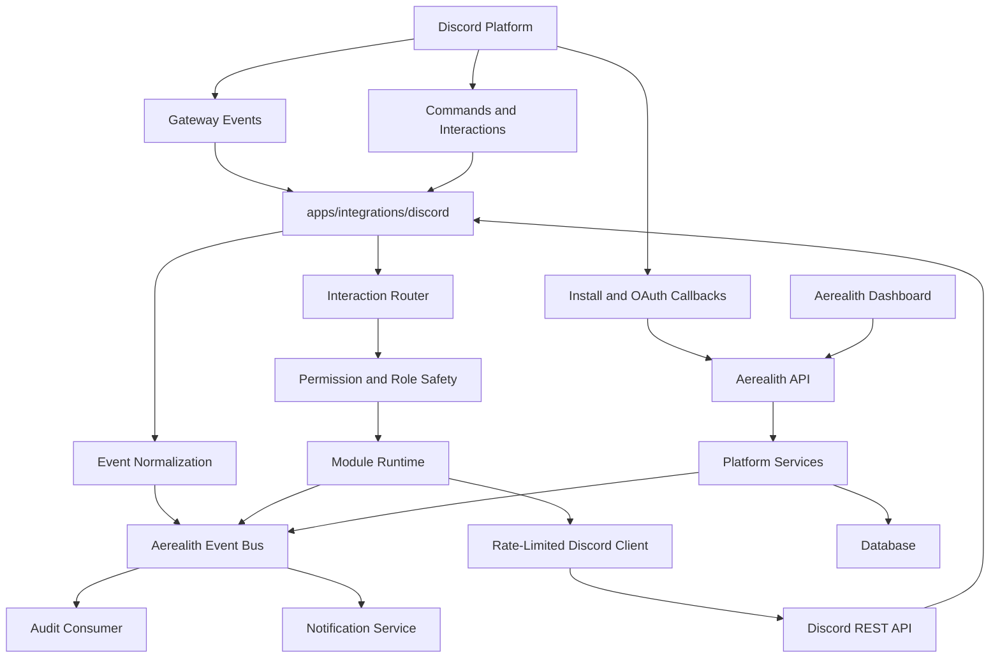

---

## MVP Deployment Shape

The MVP should use two main deployable units:

```text
combined frontend and API Worker
persistent Discord integration runtime
```

The frontend and API Worker owns:

```text
public pages
dashboard
Discord setup flow
server configuration APIs
module configuration APIs
approval APIs
audit viewing
integration health APIs
```

The persistent Discord runtime owns:

```text
gateway connection
Discord event consumption
interaction handling
Discord REST calls
provider rate limits
provider cache where justified
module event dispatch
provider-specific permission checks
```

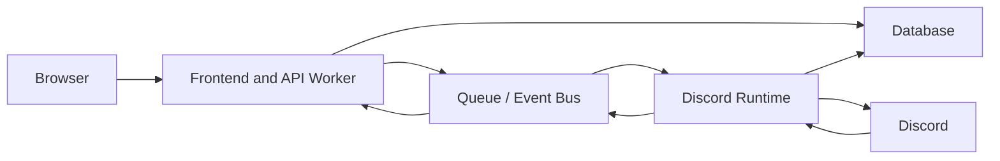

The Discord runtime should be containerized early.

It should remain deployable through:

```text
Docker
Kubernetes
a compatible persistent Node.js runtime
```

The gateway runtime should not be forced into an edge-request execution model unsuitable for persistent connections.

---

## Monorepo Placement

Recommended placement:

```text
apps/
├── frontend/
├── services/
│   └── api/
└── integrations/
    └── discord/
```

Shared libraries:

```text
libs/
├── api/
├── contracts/
├── core/
├── db/
├── flags/
├── observability/
└── ui/
```

Discord-specific implementation belongs in:

```text
apps/integrations/discord
```

Discord-specific persistence adapters may live in:

```text
libs/db/src/schema/integrations/discord/
libs/db/src/repositories/integrations/discord/
libs/db/src/mappers/integrations/discord/
```

Provider-neutral integration contracts belong in:

```text
libs/contracts
libs/core
```

---

## Dependency Rules

Allowed by default:

```text
apps/integrations/discord -> libs/core
apps/integrations/discord -> libs/contracts
apps/integrations/discord -> libs/db
apps/integrations/discord -> libs/observability
apps/integrations/discord -> libs/flags
```

Avoid by default:

```text
apps/frontend -> apps/integrations/discord
apps/services/* -> Discord SDK types
libs/core -> Discord SDK
libs/contracts -> Discord SDK
other integrations -> apps/integrations/discord internals
Discord modules -> raw unrestricted Discord clients
```

Platform code should consume normalized Discord capabilities through contracts or application interfaces.

---

## Internal Discord Runtime Layers

The Discord runtime should use these logical layers:

```text
transport
application
domain
provider
persistence
infrastructure
```

### Transport Layer

The transport layer receives:

```text
gateway events
interactions
slash commands
buttons
select menus
modal submissions
scheduled triggers
queue messages
```

It should:

```text
parse the provider input
validate expected structure
attach request and trace context
dispatch to the correct handler
return or acknowledge within provider timing requirements
```

It should not contain large amounts of business logic.

### Application Layer

The application layer coordinates:

```text
server linking
module dispatch
permission checks
role-hierarchy checks
approval verification
provider actions
event publication
notification requests
```

### Domain Layer

The domain layer owns provider-neutral rules such as:

```text
module lifecycle
risk classification
approval requirements
moderation action rules
ticket lifecycle
configuration validation
connection status
```

### Provider Layer

The provider layer owns:

```text
Discord gateway adapter
Discord REST adapter
Discord permission translation
role hierarchy calculation
interaction response formatting
Discord error normalization
Discord rate-limit behavior
```

### Persistence Layer

The persistence layer owns:

```text
server links
integration connections
module configuration
permission snapshots
role mappings
channel mappings
ticket records
moderation records
event receipts
delivery records
```

### Infrastructure Layer

The infrastructure layer owns:

```text
queue clients
runtime configuration
secret bindings
observability exporters
cache adapters
scheduled jobs
```

---

## Discord Runtime Flow

```mermaid
flowchart LR
  Input["Discord Input"]
  Validate["Validate Provider Input"]
  Normalize["Normalize"]
  Context["Build Discord Context"]
  Route["Route to Module"]
  PlatformPermission["Check Aerealith Permission"]
  DiscordPermission["Check Discord Permission"]
  Hierarchy["Check Role Hierarchy"]
  Risk["Evaluate Risk"]
  Approval["Verify Approval"]
  Execute["Execute Through Discord Client"]
  Event["Publish Outcome Event"]
  Audit["Audit Consumer"]

  Input --> Validate
  Validate --> Normalize
  Normalize --> Context
  Context --> Route
  Route --> PlatformPermission
  PlatformPermission --> DiscordPermission
  DiscordPermission --> Hierarchy
  Hierarchy --> Risk
  Risk --> Approval
  Approval --> Execute
  Execute --> Event
  Event --> Audit
```

Not every read-only operation requires approval or role hierarchy checks.

The action policy determines which controls apply.

---

## Discord Connection Model

A Discord connection represents Aerealith's relationship with a Discord server.

The connection lifecycle should distinguish:

```text
installation
ownership verification
linking
configuration
activation
degradation
disconnection
revocation
```

Installation alone must not create a fully trusted server connection.

---

## Server Connection Lifecycle

Recommended states:

```text
Discovered
Installed
PendingVerification
Linked
Configuring
Active
Degraded
Disconnected
Revoked
```

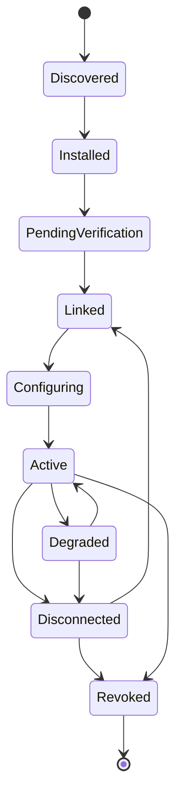

### Discovered

Aerealith knows about the server through an installation or provider event but has not verified ownership.

### Installed

The bot or application is present in the server.

Installation is not proof that the Aerealith user may administer the server.

### Pending Verification

A user has requested linking, but ownership or administrative authority remains unverified.

### Linked

Aerealith has verified that the requesting user may connect the server.

### Configuring

Required permissions, channels, modules, and settings are being configured.

### Active

The server is linked, sufficiently configured, and operational.

### Degraded

The server remains linked, but one or more required capabilities are unavailable.

Examples:

```text
missing Discord permission
bot role moved below a managed role
gateway unavailable
provider rate limiting
configured channel deleted
credential or installation issue
```

### Disconnected

The user intentionally disconnected the server integration.

A disconnected connection must not continue performing actions.

### Revoked

Access was removed because of:

```text
bot removal
credential invalidation
security incident
ownership loss
administrative revocation
account deletion
```

---

## Ownership Verification

Installing the Discord bot does not prove that an Aerealith user owns or administers the server.

Linking should verify:

```text
the Aerealith user identity
the Discord identity
the target server
the user's Discord membership
the user's required Discord authority
the current installation
```

Acceptable authority may include:

```text
Discord server owner
administrator permission
an explicitly approved management permission policy
```

The exact authority policy should be finalized in RFC 0015.

---

## Linking Flow

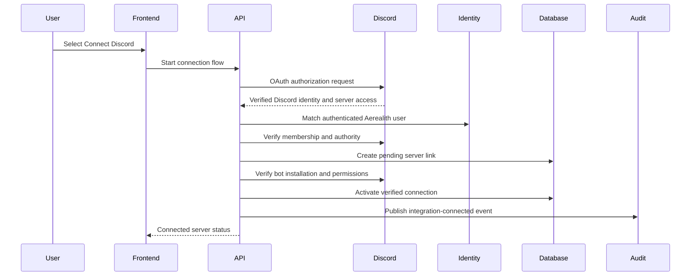

The linking operation should be idempotent.

Repeated callbacks should not create duplicate connections.

---

## Discord Identity Linking

A Discord login identity and a Discord server connection are separate concepts.

```text
Sign in with Discord
```

means:

```text
use Discord as an authentication identity
```

```text
Connect a Discord server
```

means:

```text
authorize Aerealith to operate within a Discord server
```

These must use separate:

```text
records
scopes
tokens
consent explanations
revocation flows
audit events
```

Matching Discord identity information alone must not silently link servers.

---

## Provider Credentials

Discord credentials may include:

```text
bot token
OAuth client secret
OAuth access token
OAuth refresh token
interaction verification key
webhook secrets where applicable
```

Credentials must be:

```text
stored outside source control
provided through secret bindings
restricted to required runtimes
rotatable
redacted from logs
excluded from API responses
excluded from audit metadata
```

The frontend must never receive the bot token or provider client secret.

---

## Discord Gateway

The persistent runtime owns the Discord gateway connection.

Gateway responsibilities include:

```text
connect
identify
resume
heartbeat
receive events
handle reconnects
track session state
normalize events
publish health metrics
```

Gateway code should not implement unrelated domain behavior directly.

It should dispatch normalized events to application or module handlers.

---

## Gateway Event Flow

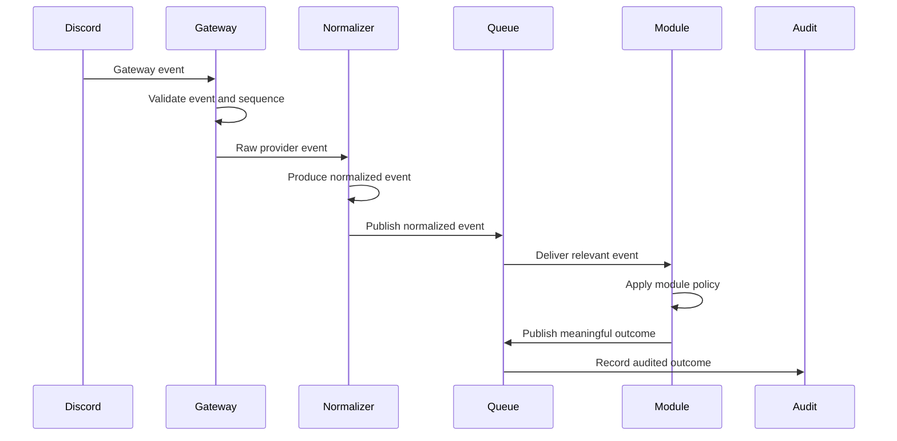

Raw gateway payloads should not become the permanent platform event contract.

---

## Gateway Intents

Discord gateway intents should be minimized.

Only request intents required for enabled platform capabilities.

Intent decisions should consider:

```text
feature requirement
privacy impact
provider review requirements
event volume
operational cost
data retention
```

Privileged intents should require explicit documentation and review.

The system should degrade clearly when an intent is unavailable.

---

## Event Normalization

Discord events should be mapped into normalized Aerealith events before reaching provider-neutral services.

Example raw concept:

```text
Discord messageCreate event
```

Normalized concept:

```text
community.message.created
```

Potential normalized events:

```text
community.connected
community.disconnected
community.member.joined
community.member.left
community.message.created
community.message.deleted
community.role.created
community.role.updated
community.channel.created
community.channel.updated
community.moderation.executed
community.ticket.created
community.ticket.closed
```

Normalized events should include provider references where needed without exposing raw provider SDK objects.

---

## Normalized Provider Reference

A provider-neutral reference may contain:

```ts
export interface ProviderResourceReference {
  readonly provider: string
  readonly resourceType: string
  readonly providerResourceId: string
  readonly communityId?: string
}
```

Discord IDs may remain strings in contracts.

Platform code should not assume all provider identifiers share Discord snowflake behavior.

---

## Event Envelope

Discord events should use the shared Aerealith event envelope.

Expected fields:

```text
eventId
eventType
eventVersion
occurredAt
source
actor
target
scope
requestId
traceId
riskLevel
approvalId
payload
metadata
```

Discord-specific metadata may include:

```text
guild ID
channel ID
message ID
interaction ID
Discord user ID
provider event type
provider sequence
```

Private content should be included only when required and permitted.

---

## Interaction Architecture

Discord interactions may include:

```text
slash commands
context menu commands
buttons
select menus
modal submissions
autocomplete
```

Interactions should be:

```text
acknowledged promptly
validated
routed through module ownership
permission-checked
risk-evaluated
approved where required
audited when meaningful
```

Interaction handlers must not bypass the same service policies used by dashboard or API actions.

---

## Interaction Flow

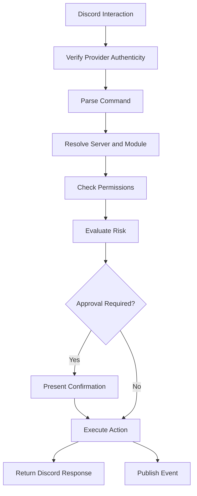

---

## Interaction Authenticity

Inbound HTTP interactions must be verified using Discord's supported request verification mechanism.

Verification should occur before parsing untrusted interaction data into privileged commands.

Invalid signatures should:

```text
return a safe rejection
produce security telemetry
avoid processing the command
avoid exposing verification details
```

---

## Command Routing

Commands should be owned by modules.

Recommended command routing inputs:

```text
command name
subcommand
server context
user context
module enablement state
module configuration
required permissions
risk classification
```

The command router should not contain the entire implementation of each command.

It should dispatch to module-owned application handlers.

---

## Discord REST Client

All outbound Discord API calls should go through one coordinated Discord client abstraction.

Modules must not independently construct unrestricted Discord REST clients.

The shared client should own:

```text
authentication
rate-limit coordination
request timeouts
bounded retries
error mapping
request and trace propagation
provider metrics
safe logging
```

Example:

```ts
export interface DiscordClient {
  sendMessage(
    input: SendDiscordMessageInput,
  ): Promise<Result<DiscordMessageResult, AerealithError>>

  timeoutMember(
    input: TimeoutDiscordMemberInput,
  ): Promise<Result<DiscordModerationResult, AerealithError>>

  createRole(
    input: CreateDiscordRoleInput,
  ): Promise<Result<DiscordRoleResult, AerealithError>>
}
```

The interface should expose capabilities, not raw unrestricted provider access.

---

## Rate-Limit Architecture

Discord rate limits must be treated as a first-class operational constraint.

The Discord client should:

```text
respect provider rate-limit headers
coordinate requests by route and bucket
apply bounded queues
delay safely when required
surface retry timing
avoid uncontrolled retry storms
emit rate-limit metrics
```

Modules should not attempt to work around provider rate limits.

---

## Rate-Limit Flow

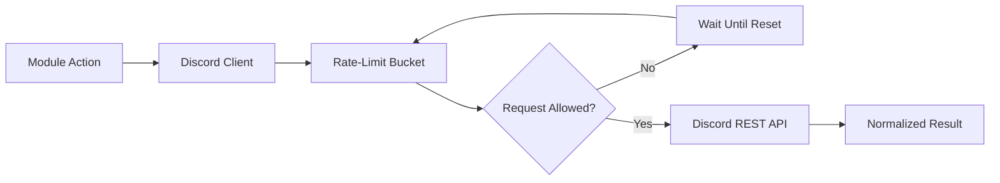

When a user-facing operation is delayed, Aerealith should present an understandable state rather than silently appearing broken.

---

## Retry Strategy

Retry only when:

```text
the provider failure may be temporary
the operation is idempotent or protected
the retry count is bounded
the provider retry timing is respected
the final failure remains visible
```

Do not automatically retry:

```text
missing permission
role-hierarchy denial
invalid target
unknown server
invalid configuration
explicit provider rejection
user cancellation
```

Provider errors should map to stable Aerealith error codes.

---

## Discord Error Mapping

Potential Discord-related error codes include:

```text
DISCORD_CONNECTION_NOT_FOUND
DISCORD_CONNECTION_REVOKED
DISCORD_SERVER_NOT_LINKED
DISCORD_OWNERSHIP_NOT_VERIFIED
DISCORD_BOT_NOT_INSTALLED
DISCORD_PERMISSION_MISSING
DISCORD_MEMBER_PERMISSION_MISSING
DISCORD_BOT_PERMISSION_MISSING
DISCORD_ROLE_HIERARCHY_BLOCKED
DISCORD_CHANNEL_NOT_FOUND
DISCORD_ROLE_NOT_FOUND
DISCORD_MEMBER_NOT_FOUND
DISCORD_RATE_LIMITED
DISCORD_GATEWAY_UNAVAILABLE
DISCORD_INTERACTION_EXPIRED
DISCORD_ACTION_REJECTED
DISCORD_PROVIDER_UNAVAILABLE
DISCORD_CONFIGURATION_INVALID
```

Raw Discord errors must not be sent directly to clients.

---

## Dual Permission Model

Every meaningful Discord action should evaluate two permission systems:

```text
Aerealith permission
Discord permission
```

Both must pass.

### Aerealith Permission

Determines whether the actor may request the platform action.

Examples:

```text
moderation.warn
moderation.timeout
moderation.ban
ticket.manage
module.configure
integration.disconnect
```

### Discord Permission

Determines whether:

```text
the Discord user has sufficient authority
the Aerealith bot has sufficient authority
Discord permits the operation in the current server
```

Passing one layer does not compensate for failing the other.

---

## Dual Permission Flow

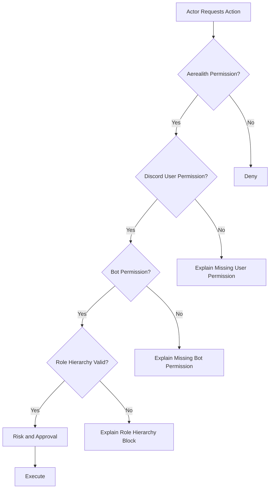

---

## Role Hierarchy

Discord role hierarchy must be checked before actions involving:

```text
moderation
role assignment
role removal
role creation
nickname changes
member management
```

A role-hierarchy check should consider:

```text
target member's highest role
requesting member's highest role
bot's highest role
server ownership
managed roles
provider restrictions
```

The system should explain role-hierarchy failures in plain language.

Example:

```text
Aerealith cannot timeout this member because their highest role is above the Aerealith bot role.
```

Avoid generic responses such as:

```text
Missing permissions.
```

when the actual issue is role order.

---

## Permission Snapshot

Aerealith may maintain a short-lived permission snapshot for:

```text
dashboard explanations
setup diagnostics
module readiness
configuration validation
```

A snapshot is not authoritative forever.

Sensitive actions should verify current provider state before execution.

Permission snapshots should include:

```text
captured at
server
bot permissions
relevant role position
missing required permissions
module readiness
```

---

## Permission Drift

Discord permissions and role ordering may change outside Aerealith.

The integration should detect permission drift through:

```text
gateway events
periodic health checks
failed provider actions
module readiness checks
dashboard refresh
```

When drift occurs:

```text
mark affected capability degraded
explain the missing permission
stop unsafe actions
notify appropriate administrators
preserve configuration
```

Aerealith must not silently request or escalate provider permissions.

---

## Provider Permission Minimization

The bot should request only the permissions required for approved capabilities.

Each requested permission should document:

```text
why it is needed
which modules require it
which actions it enables
what happens if it is missing
whether it is privileged or high risk
```

When a new module requires additional permissions:

```text
show the change
explain the reason
require administrator approval
update the installation or authorization flow
record the change
```

---

## Module Architecture

Discord modules prove Aerealith's larger module system.

A module should define:

```text
identity
name
version
status
required permissions
configuration schema
commands
actions
events consumed
events produced
dependencies
risk levels
audit behavior
enable behavior
disable behavior
```

The final MVP module list should be approved through RFC 0014 and release scope.

This architecture does not assume that every future Aerealith module is Discord-specific.

---

## Module Manifest

Example conceptual manifest:

```ts
export interface ModuleManifest {
  readonly id: string
  readonly name: string
  readonly version: string
  readonly provider: string
  readonly status: ModuleStatus
  readonly requiredPermissions: readonly string[]
  readonly configurationSchemaVersion: number
  readonly actions: readonly ModuleActionDefinition[]
  readonly events: readonly ModuleEventDefinition[]
  readonly dependencies: readonly string[]
  readonly defaultRiskLevel: RiskLevel
  readonly auditBehavior: ModuleAuditBehavior
}
```

The exact contract belongs in RFC 0014.

---

## Module Lifecycle

The required module lifecycle is:

```text
Available
Enabled
Configured
Active
Disabled
```

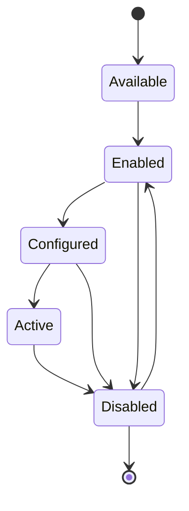

### Available

The module exists and is compatible with the server connection.

### Enabled

An authorized administrator has enabled the module.

### Configured

Required settings and provider resources are valid.

### Active

The module is processing events and may execute approved actions.

### Disabled

The module is inactive.

Its configuration should remain preserved unless the user explicitly requests deletion.

---

## Module Enablement

Enabling a module should:

```text
verify server connection
verify Aerealith permission
verify Discord authority
show required provider permissions
validate dependencies
validate configuration requirements
record module state
publish an audit event
```

Enabling must not automatically perform high-risk setup actions without approval.

---

## Module Disablement

Disabling a module should:

```text
stop new module processing
stop scheduled module actions
stop module-triggered provider writes
preserve configuration by default
preserve required historical audit records
cancel or pause relevant automation safely
publish a module-disabled event
```

Disablement should be reversible.

Deletion is a separate explicit action.

---

## Module Isolation

Modules should not:

```text
construct independent Discord clients
read unrelated module configuration
write unrelated module tables
bypass central permissions
bypass risk classification
bypass approval
bypass audit
register undocumented gateway behavior
```

Modules communicate through:

```text
module context
normalized events
service interfaces
provider capability interfaces
shared contracts
```

---

## Module Context

A module execution context may contain:

```text
module ID
module version
community ID
Discord guild ID
actor
request ID
trace ID
connection state
validated configuration
permission decision
risk level
approval
```

Sensitive credentials should not be included in ordinary module context.

Provider operations should go through the Discord client abstraction.

---

## Community Operations

Discord modules may support community operations such as:

```text
moderation
tickets
automod
welcome and onboarding
logging
role management
notifications
community configuration
analytics
```

The exact MVP scope should remain frozen by release planning and RFC decisions.

Adding a feature to the vision does not automatically add it to MVP.

---

## Moderation Architecture

Moderation actions may include:

```text
warn
timeout
kick
ban
unban
delete message
purge messages
```

Every moderation action should use:

```text
actor authentication
Aerealith permission
Discord member permission
bot permission
role-hierarchy check
risk classification
approval or confirmation
reason
provider execution
moderation record
audit event
```

---

## Moderation Flow

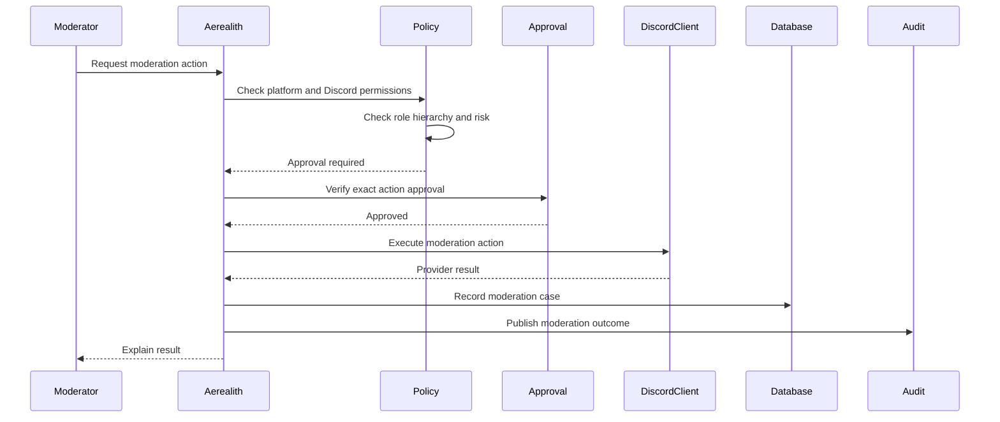

---

## Moderation Cases

A moderation action should create or update a moderation case where appropriate.

A moderation case may include:

```text
case ID
server
target member
actor
action
reason
risk level
created at
duration
expiration
provider result
request ID
trace ID
approval ID
evidence references
```

Moderation records should remain distinct from audit records.

Moderation records support community operations.

Audit records support platform accountability.

---

## Purge Safety

Message purge is a high-risk and difficult-to-reverse operation.

Purge should require:

```text
Aerealith permission
Discord permission
bot permission
role-hierarchy evaluation where relevant
explicit confirmation
bounded message count
clear target channel
reason
irreversibility warning
approval record
audit record
```

Purge requests should reject:

```text
unbounded amounts
ambiguous channels
missing reason where policy requires it
expired confirmation
changed request payload
missing bot permission
```

AI must not autonomously approve or execute purge operations.

---

## Automod Architecture

Initial automod capabilities may include:

```text
blocked words
spam detection
repeated messages
excessive mentions
link filtering
invite filtering
staff alerts
basic escalation
```

The default path should be:

```text
Detect
→ Alert Staff
→ Log
```

Automatic punitive action should not be the default MVP behavior.

Any automatic action should require:

```text
explicit module configuration
documented policy
appropriate risk classification
bounded behavior
revocation
audit
testing
```

---

## Ticket Architecture

Ticket functionality may support:

```text
ticket panels
button-based creation
select-menu creation
private channels
staff role access
ticket status
closing with reason
transcripts
retention configuration
```

Ticket creation should validate:

```text
module enabled
configured category or channel
staff roles
bot permissions
channel-creation permissions
requesting member
rate limits
duplicate open-ticket policy
```

---

## Ticket Lifecycle

Recommended lifecycle:

```text
Open
Assigned
WaitingOnUser
WaitingOnStaff
Resolved
Closed
Archived
```

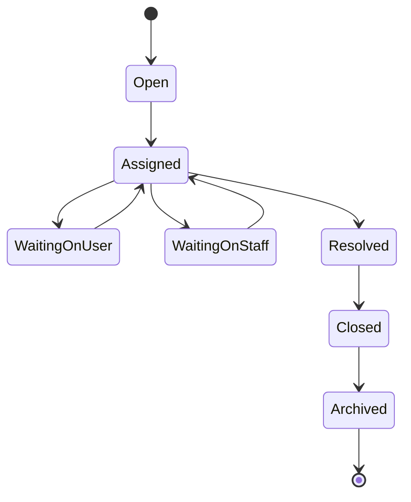

Ticket state should remain an Aerealith domain concept even when Discord channels are used as the interaction surface.

---

## Ticket Transcripts

Ticket transcripts may contain private community data.

Transcript architecture should define:

```text
who may create a transcript
which messages are included
which attachments are included
where transcripts are stored
how long they are retained
who may access them
how access is revoked
how deletion works
```

Transcript access should use:

```text
authenticated dashboard access
signed expiring links
permission checks
audit records
```

Transcripts must not become permanently public URLs.

---

## Common Role Creation

Aerealith may support guided role creation.

Role creation should use:

```text
preview
role name and permission explanation
safe defaults
role-hierarchy placement explanation
owner or administrator approval
provider execution
audit event
```

Aerealith must not silently create powerful roles.

Requested permissions should be minimal and understandable.

---

## Dashboard Architecture

The Discord dashboard should expose:

```text
connection status
server identity
bot installation state
ownership verification
module status
permission health
role-hierarchy warnings
configured channels
configured roles
recent actions
audit history
moderation cases
ticket status
integration health
disconnect control
```

The dashboard should answer:

```text
What is connected?
What is enabled?
What needs attention?
What happened recently?
What can I configure?
What can I disable?
```

---

## Discord API Routes

Potential routes include:

```text
GET /api/V1/integrations/discord
POST /api/V1/integrations/discord/connect
GET /api/V1/integrations/discord/callback
GET /api/V1/integrations/discord/servers
GET /api/V1/integrations/discord/servers/{serverId}
POST /api/V1/integrations/discord/servers/{serverId}/verify
GET /api/V1/integrations/discord/servers/{serverId}/health
GET /api/V1/integrations/discord/servers/{serverId}/permissions
DELETE /api/V1/integrations/discord/servers/{serverId}
```

Module routes may include:

```text
GET /api/V1/integrations/discord/servers/{serverId}/modules
POST /api/V1/integrations/discord/servers/{serverId}/modules/{moduleId}/enable
POST /api/V1/integrations/discord/servers/{serverId}/modules/{moduleId}/disable
PATCH /api/V1/integrations/discord/servers/{serverId}/modules/{moduleId}/settings
```

Moderation routes may include:

```text
POST /api/V1/integrations/discord/servers/{serverId}/moderation/warn
POST /api/V1/integrations/discord/servers/{serverId}/moderation/timeout
POST /api/V1/integrations/discord/servers/{serverId}/moderation/kick
POST /api/V1/integrations/discord/servers/{serverId}/moderation/ban
POST /api/V1/integrations/discord/servers/{serverId}/moderation/unban
POST /api/V1/integrations/discord/servers/{serverId}/moderation/purge
```

Exact routes should be finalized through contract and API review.

---

## API Authority

The frontend may hide or disable Discord actions for usability.

The API and service layers remain authoritative.

A forged frontend request must still fail when:

```text
the actor lacks Aerealith permission
the actor lacks Discord permission
the bot lacks Discord permission
role hierarchy blocks the action
the module is disabled
the connection is degraded or revoked
required approval is missing
the target is outside the active server scope
```

---

## Data Architecture

Discord data should remain separated into:

```text
provider connection data
community domain data
module state
operational records
credentials
audit records
```

Potential persistence records include:

```text
DiscordConnection
DiscordServerLink
DiscordInstallation
DiscordIdentityLink
DiscordPermissionSnapshot
DiscordRoleMapping
DiscordChannelMapping
DiscordEventReceipt
DiscordInteractionReceipt
DiscordModuleState
DiscordModuleConfiguration
ModerationCase
Ticket
TicketParticipant
TicketTranscript
```

---

## Suggested Tables

Potential table names:

```text
discord_connections
discord_server_links
discord_installations
discord_identity_links
discord_permission_snapshots
discord_role_mappings
discord_channel_mappings
discord_event_receipts
discord_interaction_receipts
discord_module_states
discord_module_configurations
moderation_cases
tickets
ticket_participants
ticket_transcripts
```

Provider credentials should remain separate from ordinary connection metadata.

---

## Connection Data

A Discord connection record may contain:

```text
connection ID
account or organization scope
community ID
Discord guild ID
Discord application ID
connection status
ownership verification status
connected by
connected at
last healthy at
degraded at
disconnected at
revoked at
credential reference
```

Do not expose credential references publicly unless they are safe opaque identifiers with a documented need.

---

## Configuration Data

Discord module configuration may use versioned JSON when configuration varies significantly by module.

Configuration should include:

```text
module ID
module version
schema version
server scope
configuration
enabled at
disabled at
configured by
updated at
```

Every configuration payload requires a Zod schema.

Unknown or invalid configuration must not be executed.

---

## Data Ownership

Community data belongs to the community or authorized account context, subject to platform policy and applicable law.

Aerealith should support clear ownership and control over:

```text
logs
tickets
moderation history
module configuration
workflow configuration
analytics
integration settings
```

Community administrators should eventually be able to:

```text
review
export
configure retention
delete where permitted
disconnect
```

Aerealith should not treat Discord community data as unrestricted platform-owned training material.

---

## Data Minimization

Discord can produce a large volume of events and content.

Aerealith should not store every event or message merely because it is available.

Before storing Discord data, answer:

```text
Which feature requires it?
Which server scope owns it?
How long is it needed?
Does the user understand it is stored?
Can metadata satisfy the requirement?
Can content be omitted?
Can it be deleted?
Can it be exported?
May it be sent to an AI provider?
```

---

## Message Content

Message content should be collected and retained only when required by enabled capabilities and permitted by Discord configuration and policy.

Potential uses include:

```text
automod
ticket transcripts
moderation evidence
assistant summaries
search or context features
```

Message content should not automatically enter:

```text
global analytics
long-term AI memory
training data
unrelated module storage
logs
```

---

## Retention

Retention should be configurable or documented for:

```text
raw provider event receipts
interaction receipts
message metadata
moderation evidence
ticket transcripts
module logs
permission snapshots
connection records
audit records
```

Provider event receipts should generally retain only what is required for:

```text
idempotency
retry
diagnostics
security investigation
```

---

## Disconnect Behavior

Disconnecting Discord must do more than change a dashboard status.

Disconnect should:

```text
verify permission
require confirmation
disable Discord modules
stop Discord-triggered workflows
stop provider actions
revoke or delete credentials
invalidate cached provider state
mark the connection disconnected
publish an integration-disconnected event
write an audit record
explain retained data
```

Where provider APIs permit, disconnect should revoke the provider authorization.

---

## Bot Removal

The Discord runtime should detect when the bot is removed from a server.

On removal:

```text
mark installation unavailable
mark the connection degraded or revoked
stop module processing
stop Discord writes
notify relevant account owners
retain configuration according to policy
record the provider event
```

Reinstalling should not silently reactivate every capability without re-verifying authority and permissions.

---

## Revocation

Revocation may be triggered by:

```text
user disconnect
Discord bot removal
credential invalidation
security incident
account suspension
ownership loss
provider application change
administrative action
```

Revocation should take effect promptly.

A revoked connection must fail closed.

---

## Audit Architecture

Meaningful Discord actions should publish audit events.

Audited behavior includes:

```text
server connected
server disconnected
ownership verified
module enabled
module disabled
module configured
permission changed
moderation action executed
ticket created
ticket closed
role created
workflow approved
integration credential revoked
```

Audit fields may include:

```text
timestamp
event ID
event type
actor
target
server
module
source
risk level
result
request ID
trace ID
approval ID
provider action ID
metadata
```

---

## Audit and Provider Events

A raw provider event is not automatically an audit record.

Example:

```text
Discord reports a member update
```

This may be operational input.

Example:

```text
A moderator bans a member through Aerealith
```

This is a meaningful action requiring an audit record.

Audit records should be created by the shared audit consumer using normalized outcome events.

---

## Idempotency

Discord event delivery and internal queues may redeliver events.

Consumers must be idempotent.

Idempotency may use:

```text
Discord interaction ID
Discord event ID where available
gateway sequence and session context
provider message ID
Aerealith event ID
operation fingerprint
unique database constraint
```

Duplicate delivery must not duplicate:

```text
moderation actions
ticket creation
role creation
module enablement
notifications without intent
audit records
```

---

## Interaction Idempotency

Discord interactions should be recorded before or during execution where duplicate delivery could cause repeated action.

An interaction receipt may contain:

```text
interaction ID
command
server
actor
received at
status
result reference
request ID
trace ID
```

A repeated interaction should return the existing result or a safe already-processed response when possible.

---

## Approval Integration

Discord actions use the shared Aerealith approval primitive.

An approval should bind to:

```text
actor
server
module
operation
target
payload fingerprint
risk level
expiration
```

Approval for:

```text
ban Member A in Server A
```

must not authorize:

```text
ban Member B
ban Member A in Server B
purge messages
change permissions
```

---

## Discord Confirmation UX

High-risk Discord interactions may use:

```text
ephemeral confirmation message
button confirmation
modal requiring reason
dashboard approval
step-up authentication for critical actions
```

Confirmation should clearly state:

```text
action
target
server
consequences
reversibility
required reason
```

Ambiguous confirmations should not be accepted.

---

## AI Assistant Boundaries

The Discord assistant may:

```text
summarize
explain
suggest
draft
classify
prepare a proposed moderation action
prepare a proposed response
```

The assistant must not:

```text
auto-punish users
approve its own action
invent Discord permissions
invent Aerealith permissions
bypass role hierarchy
bypass confirmation
silently message users
silently create roles
silently delete messages
silently change module configuration
```

---

## Assistant Moderation Flow

```text
Summarize
→ Suggest
→ Ask Staff
→ Verify Permissions
→ Verify Role Hierarchy
→ Verify Approval
→ Execute Approved Action
→ Audit
→ Explain Outcome
```

The platform must include an adversarial test proving that the assistant cannot execute moderation without approval.

---

## AI Independence

Discord community operations must continue to work when the AI provider is disabled.

Without AI, the following should remain operational:

```text
server linking
module enablement
module configuration
manual moderation
tickets
permission checks
role-hierarchy checks
audit logs
notifications
integration health
disconnect
```

Assistant-specific features may show a degraded state.

They must not break the rest of the Discord platform.

---

## Prompt Injection

Discord messages, tickets, channel topics, role names, and uploaded content are untrusted AI input.

They may contain instructions intended to manipulate the assistant.

Defenses include:

```text
labeling provider content as untrusted
separating content from system instructions
using structured action proposals
allowlisting tools and actions
validating generated arguments
requiring permission and approval
limiting context
auditing proposed and executed actions
```

A message claiming to authorize an action has no authority.

---

## Observability

Discord observability should answer:

```text
Is the gateway connected?
Is the bot installed?
Which servers are degraded?
Are Discord rate limits increasing?
Which modules are failing?
Are permissions missing?
Are role-hierarchy failures increasing?
Are interactions timing out?
Are queues backing up?
Are audit events being recorded?
```

---

## Metrics

Useful metrics include:

```text
gateway connection state
gateway reconnect count
gateway resume count
heartbeat latency
event count by type
interaction count
interaction latency
interaction failure rate
REST request count
REST latency
rate-limit count
rate-limit wait time
module execution count
module failure count
permission denial count
role-hierarchy denial count
provider error count
server health state
queue depth
consumer lag
```

---

## Logs

Discord logs should include:

```text
operation
server reference when safe
module
event type
interaction command
result
error code
request ID
trace ID
provider response code
duration
```

Logs must not include:

```text
bot token
OAuth client secret
access tokens
refresh tokens
authorization headers
private ticket content by default
unnecessary message content
raw user content without a defined purpose
```

---

## Tracing

Trace context should propagate through:

```text
dashboard
API
approval
queue
Discord runtime
Discord REST call
outcome event
audit consumer
notification consumer
```

A moderation action should be traceable from request to provider result and audit record.

---

## Health Checks

The Discord runtime should expose:

```text
liveness
readiness
gateway health
provider authentication health
queue health
database health
```

Liveness asks:

```text
Is the process running?
```

Readiness asks:

```text
Can the runtime safely receive and execute Discord work?
```

The runtime may remain live but not ready when:

```text
gateway authentication fails
required configuration is missing
database is unavailable
queue is unavailable
provider credential is revoked
```

---

## Server Health

Each connected server may have a health summary.

Potential states:

```text
Healthy
Degraded
Disconnected
Revoked
Unknown
```

Health checks may consider:

```text
bot installation
connection state
required permissions
role hierarchy
configured channels
configured roles
enabled module readiness
last successful provider call
```

---

## Graceful Degradation

The Discord integration should degrade safely.

Examples:

| Failure                    | Required Behavior                                           |
| -------------------------- | ----------------------------------------------------------- |
| Gateway disconnected       | Stop event-dependent behavior and reconnect with backoff.   |
| REST rate-limited          | Queue or delay safe requests and surface status.            |
| Missing bot permission     | Block affected actions and explain remediation.             |
| Role moved below target    | Block hierarchy-sensitive actions.                          |
| Configured channel deleted | Mark the affected module degraded.                          |
| AI unavailable             | Disable assistant features only.                            |
| Audit consumer delayed     | Preserve events and alert operations.                       |
| Database unavailable       | Stop state-changing actions that cannot be safely recorded. |

---

## Failure Safety

When security state is uncertain, fail closed.

Examples:

```text
permission state unavailable -> block write
role hierarchy unavailable -> block moderation
approval lookup unavailable -> block approval-required action
connection state unknown -> block provider write
audit event cannot be durably produced -> follow documented safe failure policy
```

The system should not guess that a dangerous action is probably allowed.

---

## Sharding Direction

Discord sharding may become necessary as the bot grows.

Sharding is not required solely because the architecture supports it.

A later scaling design may introduce:

```text
shard manager
multiple gateway workers
server-to-shard routing
distributed rate-limit coordination
shard health reporting
event partitioning
```

Sharding should be introduced based on:

```text
provider requirements
server count
gateway event volume
memory pressure
availability needs
operational evidence
```

---

## Scaling Strategy

Potential Discord scaling units include:

```text
gateway shards
interaction HTTP workers
REST action consumers
event normalizers
moderation workers
ticket transcript workers
scheduled health-check workers
```

Do not split these into separate deployments before evidence justifies the operational cost.

---

## Cache Strategy

The Discord runtime may cache:

```text
server metadata
member metadata
role metadata
channel metadata
permission calculations
module readiness
```

Caches must have:

```text
clear ownership
bounded size
invalidation behavior
provider event updates
fallback behavior
privacy classification
```

Cached permission state should not be trusted indefinitely for high-risk actions.

---

## Reconciliation

The Discord integration should support reconciliation jobs.

Reconciliation may compare:

```text
stored installation state
current bot presence
stored permissions
current permissions
stored channels
current channels
stored roles
current roles
module readiness
```

Reconciliation should repair safe metadata drift and flag unsafe configuration drift.

It should not silently recreate deleted provider resources without approval.

---

## Scheduled Work

Scheduled Discord work may include:

```text
connection health checks
permission checks
role-hierarchy checks
stale ticket cleanup
retention cleanup
transcript expiry
reconciliation
module maintenance
```

Scheduled tasks should be:

```text
idempotent
bounded
observable
scope-aware
safe under concurrent execution
```

---

## Security

Discord security follows:

```text
docs/architecture/Security Architecture.md
```

High-priority threats include:

```text
bot token compromise
OAuth callback manipulation
server-link takeover
permission escalation
role-hierarchy bypass
interaction replay
webhook forgery
malicious provider payloads
cross-server data access
approval replay
prompt injection
unbounded purge
credential leakage
```

---

## Discord Security Tests

Tests must prove:

```text
installation alone does not establish ownership
a user cannot link a server they do not administer
Aerealith permission is enforced
Discord user permission is enforced
bot permission is enforced
role hierarchy is enforced
permission in one server does not transfer to another
approval in one server does not transfer to another
replayed interactions do not duplicate actions
missing permissions are detected before execution
disconnect revokes operational access
bot removal disables provider writes
AI cannot auto-punish
raw provider errors do not leak
credentials never enter logs or responses
```

---

## Testing Strategy

Discord testing should include:

```text
unit tests
module lifecycle tests
manifest validation tests
permission tests
role-hierarchy tests
connection lifecycle tests
OAuth state tests
ownership verification tests
interaction verification tests
interaction routing tests
REST client tests
rate-limit tests
gateway event tests
normalization tests
idempotency tests
moderation tests
ticket tests
disconnect tests
AI-disabled tests
integration tests
end-to-end tests
burst tests
```

Coverage requirement:

```text
80% statements
80% branches
80% functions
80% lines
```

---

## Provider Test Adapter

Tests should not require unrestricted production Discord access.

Use:

```text
provider adapter mocks
safe recorded fixtures
test Discord applications
test servers
sandbox accounts
deterministic gateway fixtures
```

Mocks should not replace all live provider integration testing.

Staging should include a controlled Discord environment for real installation, permission, interaction, and rate-limit validation.

---

## Critical Test Scenarios

Critical scenarios include:

```text
connect server successfully
reject unverified ownership
detect missing bot permission
detect missing user permission
detect role-hierarchy conflict
enable module
configure module
disable module
re-enable module with settings preserved
execute approved moderation action
reject unapproved moderation action
reject approval replay
process duplicate gateway event once
process duplicate interaction once
disconnect and revoke
detect bot removal
operate with AI disabled
recover from gateway disconnect
respect provider rate limits under burst
```

---

## Burst Testing

The Discord client should be tested under controlled bursts.

Burst tests should validate:

```text
rate-limit bucket coordination
bounded queue growth
no uncontrolled retries
no duplicate actions
reasonable user feedback
metrics and alerts
recovery after provider limits reset
```

Passing a low-volume functional test does not prove rate-limit safety.

---

## File Structure

Recommended Discord integration structure:

```text
apps/integrations/discord/
├── src/
│   ├── app/
│   │   ├── bootstrap/
│   │   ├── configuration/
│   │   └── runtime.ts
│   ├── gateway/
│   │   ├── gateway.client.ts
│   │   ├── gateway.events.ts
│   │   ├── gateway.normalizer.ts
│   │   └── gateway.session.ts
│   ├── interactions/
│   │   ├── interaction.router.ts
│   │   ├── interaction.verifier.ts
│   │   ├── command.registry.ts
│   │   └── response.mapper.ts
│   ├── provider/
│   │   ├── discord.client.ts
│   │   ├── discord.rest.ts
│   │   ├── discord.permissions.ts
│   │   ├── discord.role-hierarchy.ts
│   │   ├── discord.rate-limits.ts
│   │   └── discord.errors.ts
│   ├── connections/
│   │   ├── connection.service.ts
│   │   ├── ownership-verification.service.ts
│   │   ├── connection-health.service.ts
│   │   └── disconnect.service.ts
│   ├── modules/
│   │   ├── registry/
│   │   ├── runtime/
│   │   └── first-party/
│   ├── events/
│   │   ├── event.publisher.ts
│   │   ├── event.consumer.ts
│   │   └── event.schemas.ts
│   ├── observability/
│   ├── workers/
│   └── index.ts
├── Dockerfile
├── README.md
├── project.json
├── tsconfig.json
├── tsconfig.app.json
├── tsconfig.spec.json
└── vitest.config.mts
```

---

## First-Party Module Structure

A first-party Discord module may use:

```text
apps/integrations/discord/src/modules/first-party/example/
├── application/
├── commands/
├── configuration/
├── events/
├── policies/
├── manifest.ts
├── example.module.ts
├── example.module.spec.ts
└── index.ts
```

A module should expose a narrow module interface to the runtime.

It should not receive unrestricted access to the entire application container.

---

## Shared Contract Structure

Potential shared Discord contracts:

```text
libs/contracts/src/integrations/discord/
├── connection/
├── server/
├── permissions/
├── modules/
├── moderation/
├── tickets/
├── events/
└── index.ts
```

Provider-neutral integration contracts should live outside the Discord-specific contract folder when they are reusable across providers.

---

## Database Structure

Potential persistence structure:

```text
libs/db/src/
├── schema/integrations/discord/
├── queries/integrations/discord/
├── mappers/integrations/discord/
└── repositories/integrations/discord/
```

Discord persistence mappers should convert provider-specific storage into domain-safe entities.

---

## Configuration

Discord runtime configuration may include:

```text
application ID
public verification key
bot token binding
OAuth client ID
OAuth client secret binding
OAuth callback URL
gateway intents
environment
API origin
queue binding
observability configuration
rate-limit configuration
```

Configuration should be centralized and validated at startup.

Avoid direct scattered environment access.

---

## Environment Separation

Discord environments should use separate:

```text
Discord applications
bot tokens
OAuth credentials
callback URLs
test servers
databases
queues
observability labels
```

Recommended environments:

```text
local
test
preview
staging
production
```

Preview environments should not receive production bot credentials.

---

## Deployment

The Discord runtime should be packaged as a container.

Container requirements:

```text
pinned runtime version
Node.js 24.x
non-root user
minimal base image
no embedded secrets
health checks
graceful shutdown
structured logging
resource limits
dependency scanning
container scanning
```

---

## Graceful Shutdown

On shutdown, the Discord runtime should:

```text
stop accepting new scheduled work
stop consuming new queue messages
complete or safely abandon in-flight idempotent work
close the gateway connection
flush required telemetry
close database resources
exit within a bounded timeout
```

A sudden restart should not duplicate completed actions.

---

## Kubernetes Direction

Kubernetes may later provide:

```text
replica management
gateway shard scheduling
health-based restart
secret injection
rolling deployment
resource limits
queue-consumer scaling
network policies
```

Multiple gateway replicas must not accidentally connect with overlapping shard ownership.

The deployment design must explicitly coordinate shard or session ownership before horizontal gateway scaling.

---

## Release Scope

The Discord platform is primarily delivered through:

```text
0.6 Developer Portal and Integrations
0.7 Discord Platform Foundation
0.8 Moderation, Tickets and Community Operations
0.9 Observability and Reliability
```

### Release 0.6

Should establish:

```text
provider abstraction
connect and disconnect
integration health
Discord setup documentation
webhook or callback verification
provider error mapping
permission documentation
```

### Release 0.7

Should establish:

```text
official Discord app and bot
guided installation
ownership verification
module registry
module lifecycle
permission checks
role-hierarchy checks
one rate-limited Discord client
first-party modules
clean unlink and removal behavior
```

### Release 0.8

Should establish:

```text
moderation
moderation cases
automod foundation
tickets
transcripts
assistant suggestions
approval-aware actions
community data retention
AI-disabled operation
```

### Release 0.9

Should establish:

```text
gateway telemetry
provider metrics
tracing
alerts
rollback
recovery
load and burst testing
secret and PII log review
```

---

## Documentation

Discord documentation should eventually include:

```text
docs/discord/README.md
docs/discord/Installation.md
docs/discord/Permissions.md
docs/discord/Ownership Verification.md
docs/discord/Modules.md
docs/discord/Moderation.md
docs/discord/Tickets.md
docs/discord/Troubleshooting.md
docs/discord/Disconnect and Data Retention.md
docs/discord/Development.md
```

Developer documentation should explain:

```text
how to install the bot
why each permission is requested
how to link a server
how to enable a module
how to configure a module
how to diagnose missing permissions
how to disconnect
what data is retained
```

---

## Discord Architecture Anti-Patterns

Avoid:

```text
treating installation as ownership verification
putting Discord code throughout platform services
sharing Discord SDK objects across libraries
allowing each module to create its own Discord client
checking only bot permissions
checking only user permissions
ignoring role hierarchy
silently requesting broad permissions
silently creating powerful roles
performing provider actions from the frontend
returning raw Discord errors
storing every Discord message by default
using AI to auto-punish
letting modules bypass approval
using one approval across servers
retrying non-idempotent actions blindly
assuming gateway delivery occurs exactly once
marking disconnect complete without revoking access
creating one microservice per module
```

---

## Required Architecture Decisions

Before the Discord MVP is complete, Aerealith must finalize:

```text
the MVP first-party module list
the module manifest contract
the module lifecycle contract
Discord ownership-verification requirements
required bot permissions
privileged gateway intents
Discord user authority requirements
role-hierarchy policy
interaction verification strategy
provider credential storage
provider event retention
ticket transcript retention
moderation evidence retention
sharding threshold
permission-health reconciliation interval
```

These decisions should be recorded through RFCs or dedicated Discord documentation.

---

## Implementation Sequence

Recommended implementation order:

```text
1. Accept RFC 0013 for provider abstraction.
2. Accept RFC 0014 for module registry and lifecycle.
3. Accept RFC 0015 for Discord permission and action safety.
4. Create the Discord runtime application.
5. Add validated Discord configuration.
6. Add the persistent gateway adapter.
7. Add the coordinated REST client.
8. Add structured provider error mapping.
9. Add connection and ownership verification.
10. Add server health and permission diagnostics.
11. Add normalized Discord event contracts.
12. Add the module registry.
13. Add module enable, configure, disable, and re-enable flows.
14. Add role-hierarchy validation.
15. Add request and trace propagation.
16. Add interaction idempotency.
17. Add moderation primitives.
18. Add ticket primitives.
19. Add audit event publication.
20. Add AI suggest-and-approve boundaries.
21. Add disconnect and revocation behavior.
22. Add gateway, provider, and module observability.
23. Run burst, failure, and adversarial tests.
24. Complete human security review.
```

---

## Success Criteria

The Discord architecture is successful when:

```text
Discord remains one integration inside a provider-neutral platform
installation does not imply ownership
server ownership is verified
Aerealith and Discord permissions are both enforced
bot permissions are checked before execution
role hierarchy is checked before sensitive actions
missing permissions are explained clearly
modules have a predictable lifecycle
module configuration survives disable and re-enable
modules cannot bypass the shared Discord client
provider rate limits are respected
provider events are normalized
duplicate events do not duplicate outcomes
meaningful actions produce audit records
high-risk actions require scoped approval
approval cannot transfer between servers
disconnect revokes operational access
bot removal disables provider actions
community data is scoped and controllable
AI cannot auto-punish
core Discord behavior works without AI
gateway and provider failures are observable
Docker and Kubernetes remain viable
80% coverage is enforced
```

---

## Final Standard

Discord is Aerealith's flagship first integration, not the boundary of its vision.

The standard is:

> Aerealith connects Discord through a persistent, provider-isolated runtime that verifies server ownership, enforces both Aerealith and Discord permissions, validates role hierarchy, routes behavior through first-party modules, coordinates all provider calls through one rate-limited client, requires approval for risky actions, normalizes provider events, records meaningful outcomes, protects community data, and remains fully subordinate to Aerealith's broader trust, security, service, and module architecture.
