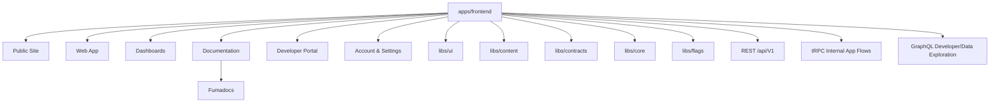
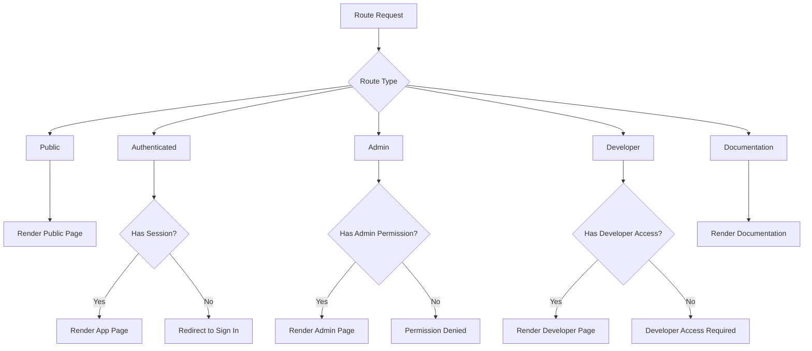
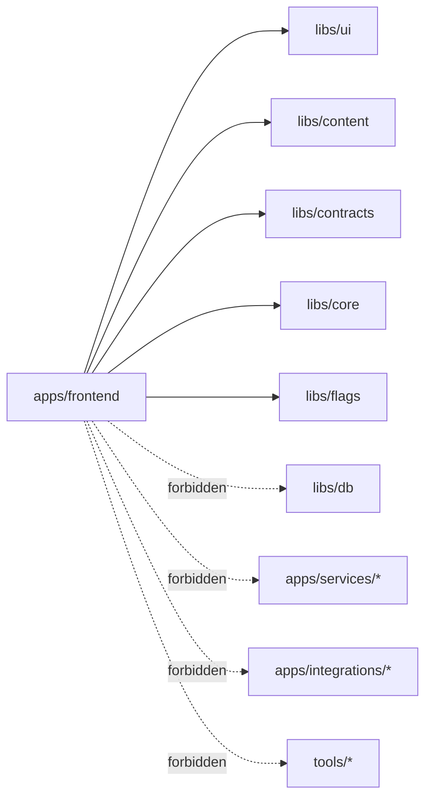
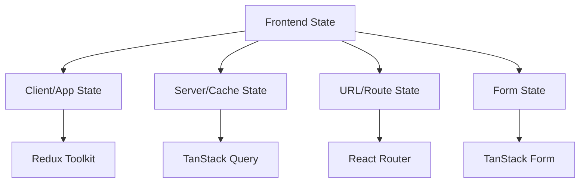
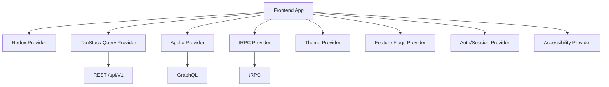

# Frontend Architecture

Status: Draft
Owner: Tim Pierce / SinLess Games
Last Updated: 2026-07-09
Related RFCs:

- `docs/rfcs/0002-monorepo-library-boundaries.md`
- `docs/rfcs/0003-api-versioning-and-route-strategy.md`
- `docs/rfcs/0004-error-and-result-model.md`
- `docs/rfcs/0005-entity-schema-and-contract-strategy.md`

---

## Purpose

This document defines the frontend architecture for Aerealith AI.

The frontend is the primary user-facing surface for:

```text
marketing site
web app
dashboards
documentation
developer portal
account pages
settings pages
```

The frontend should feel unified, fast, accessible, customizable, and trustworthy.

The goal is to keep one main frontend application that can grow into a full platform without becoming
a tangled pile of route spaghetti. 🍝

---

## Architecture Summary

The main frontend application lives at:

```text
apps/frontend
```

It is a single Vite React application responsible for public, authenticated, documentation,
developer, dashboard, account, and settings experiences.

The frontend stack is:

```text
Vite
React
React Router
Redux Toolkit
TanStack Query
Apollo Client
Tailwind CSS
Fumadocs
Cloudflare Workers
Docker
```

The frontend should be:

```text
SPA first
Cloudflare Workers first
Docker-compatible
Kubernetes-compatible
SSR-ready only when SSR clearly earns the complexity
```

---

## Frontend Product Scope

The frontend covers all major web surfaces.

| Surface          | Route Area                             | Purpose                                                               |
| ---------------- | -------------------------------------- | --------------------------------------------------------------------- |
| Marketing site   | `/`, `/features`, `/pricing`           | Public product and conversion pages.                                  |
| Web app          | `/dashboard`, `/servers`, `/workflows` | Main authenticated app experience.                                    |
| Dashboards       | `/dashboard`, `/servers/:serverId`     | Operational control panels.                                           |
| Documentation    | `/documentation`                       | Product, developer, architecture, engineering, release, and RFC docs. |
| Developer portal | `/developer`                           | Developer-facing APIs, guides, keys, events, SDKs, and tools.         |
| Account pages    | `/account`                             | User account management.                                              |
| Settings pages   | `/settings`                            | User, platform, dashboard, integration, and preference settings.      |

---

## Frontend Location

The frontend application stays here:

```text
apps/frontend
```

This app is the primary frontend entrypoint.

Do not split the marketing site, dashboard, docs, and developer portal into separate frontend apps by
default.

A separate frontend app may be considered later only if there is a strong reason, such as:

```text
different deployment requirements
different security boundary
different runtime needs
significantly different build profile
separate team ownership
clear performance need
```

Until then, one app keeps routing, design, auth, content, and platform behavior consistent.

---

## Frontend Architecture Diagram



---

## Stack Decisions

Aerealith uses a deliberate frontend stack.

The stack should be modern, fast, flexible, and boring enough to maintain.

### Vite

Aerealith uses Vite as the frontend build tool.

Why:

```text
fast local development
simple configuration
excellent React support
good TypeScript support
works well with Cloudflare-oriented builds
less framework lock-in than full-stack meta frameworks
strong ecosystem support
```

Vite gives Aerealith a clean frontend foundation without forcing server rendering, file-based routes,
or framework-specific server behavior too early.

---

### React

Aerealith uses React as the UI framework.

Why:

```text
huge ecosystem
strong TypeScript support
component-based architecture
excellent accessibility ecosystem
good testing support
compatible with Radix-style primitives
compatible with TanStack tools
compatible with Redux Toolkit
easy hiring and contributor familiarity
```

React is the right choice for a large dashboard-heavy product with reusable UI primitives and complex
interactive surfaces.

---

### React Router

Aerealith uses React Router for client-side routing.

Why:

```text
mature routing model
nested layouts
route-based data and UI organization
clear public/authenticated route separation
good SPA support
good future flexibility
less framework lock-in
```

React Router gives Aerealith explicit control over route structure.

The frontend should not rely on framework-specific routing conventions that make the repo harder to
understand.

---

### Redux Toolkit

Aerealith uses Redux Toolkit for app and client state.

Why:

```text
predictable client state
centralized app state when needed
excellent debugging tools
strong TypeScript support
stable architecture for large dashboards
useful from the start for platform-wide UI state
reduces future migration pain
```

Redux Toolkit should own client/application state such as:

```text
theme state
layout state
sidebar state
command palette state
session-adjacent UI state
dashboard preferences
local UI preferences
cross-page client state
feature UI toggles
```

Redux should not automatically own every server response.

Server/cache state belongs to TanStack Query.

---

### TanStack Query

Aerealith uses TanStack Query for server and cache state.

Why:

```text
excellent async server-state management
request caching
background refetching
loading and error states
mutation handling
query invalidation
strong TypeScript support
works with REST, tRPC, and GraphQL clients
```

TanStack Query should own:

```text
API response caching
server state
remote mutations
background refresh
stale data handling
optimistic updates where safe
```

Redux Toolkit and TanStack Query have separate jobs.

Redux is for client state.

TanStack Query is for server state.

---

### Apollo Client

Aerealith uses Apollo Client for GraphQL.

Why:

```text
mature GraphQL client
normalized caching
developer tooling
strong ecosystem
good fit for complex graph-like developer data surfaces
works well for data exploration experiences
```

Apollo Client should be used for GraphQL-specific frontend surfaces.

GraphQL is supported for:

```text
complex developer data exploration
event exploration
relationship-heavy dashboard data
future API explorer features
developer portal surfaces
```

Apollo should not replace the stable public REST API boundary.

---

### Tailwind CSS

Aerealith uses Tailwind CSS for styling.

Why:

```text
fast UI development
consistent utility-based styling
good design-token integration
works well with CSS variables
excellent dark mode support
good component library compatibility
strong ecosystem
```

Tailwind should be paired with Aerealith-owned design tokens and UI wrappers.

Tailwind is a styling tool, not the design system by itself.

---

### Fumadocs

Aerealith uses Fumadocs as part of the frontend documentation experience.

Why:

```text
documentation-first routing
good MD/MDX documentation experience
developer-friendly docs structure
search/navigation-friendly docs surfaces
works inside the frontend app
supports a polished documentation portal
```

The documentation route is:

```text
/documentation
```

Fumadocs should power the documentation experience inside the main frontend application.

---

## Why Not Next.js

Aerealith does not use Next.js as the main frontend framework.

Reasons:

```text
Aerealith is SPA-first.
The project does not need SSR by default.
The frontend should stay runtime-flexible.
The app should avoid framework-specific server assumptions early.
Cloudflare Workers compatibility should stay simple.
Docker and Kubernetes deployment should remain straightforward.
The frontend should not inherit complexity before it needs it.
```

Next.js is powerful, but it brings a larger framework model:

```text
file-based routing
server components
server actions
framework-specific caching behavior
framework-specific deployment concerns
SSR-first assumptions in many patterns
```

Aerealith may revisit SSR later.

Until SSR clearly earns the complexity, Vite + React Router is the cleaner choice.

---

## Why Not Remix

Aerealith does not use Remix as the main frontend framework.

Reasons:

```text
Aerealith does not need server-first routing for MVP.
The project wants simple SPA-first architecture.
The frontend should stay Cloudflare/Docker/Kubernetes portable.
React Router already provides the routing foundation needed.
```

Remix may be useful for server-first apps, but Aerealith does not need that complexity at the
foundation stage.

---

## Why Not Astro

Aerealith does not use Astro as the main frontend framework.

Reasons:

```text
Aerealith is app-heavy, not only content-heavy.
Dashboards need rich client interactivity.
Developer portal and docs are only one part of the frontend.
The web app needs shared state, authenticated routes, and dynamic UI.
```

Astro is excellent for content sites.

Aerealith needs a full application frontend.

---

## Why Not Separate Frontend Apps

Aerealith does not split marketing, dashboard, docs, and developer portal into separate apps by
default.

Reasons:

```text
shared layouts
shared auth
shared design system
shared content
shared feature flags
shared route protection
shared deployment model
simpler local development
fewer duplicated configs
```

Separate apps may be considered later only when there is a real operational need.

---

## Runtime Targets

The frontend should support three runtime directions:

```text
Cloudflare Workers
Docker
Kubernetes
```

### Cloudflare Workers

Cloudflare Workers is the primary frontend deployment target.

Why:

```text
edge-friendly runtime
fast global delivery
strong fit for Cloudflare-hosted Aerealith infrastructure
good pairing with Workers assets
simple public web deployment
```

The frontend should remain Worker-friendly.

---

### Docker

Docker support should exist for portability.

Why:

```text
self-hosting path
local production-like testing
CI compatibility
deployment flexibility
Kubernetes compatibility
```

SPA-first frontend deployment can be containerized as static assets behind a lightweight server.

If SSR is added later, the Docker model may evolve.

---

### Kubernetes

Kubernetes support should be possible for future self-hosting and advanced deployments.

Why:

```text
enterprise deployment compatibility
self-hosting compatibility
container orchestration
future service deployment alignment
```

For SPA-first architecture, Kubernetes can serve the built frontend as static assets.

A separate server runtime should only be added if SSR or server-side frontend behavior becomes
necessary.

---

## Rendering Strategy

The frontend is:

```text
SPA first.
SSR later only if it clearly earns the complexity.
```

SPA-first means:

```text
client-side routing
client-side dashboard interactions
API-driven data loading
static asset deployment
simple Cloudflare Worker asset serving
simple Docker/Kubernetes serving
```

SSR may be considered later for:

```text
SEO-critical pages
performance-critical public pages
social preview rendering
documentation search/indexing needs
complex authenticated server rendering
```

SSR should require an RFC or architecture update before becoming a default frontend assumption.

---

## Route Strategy

The frontend route model should be clear and product-oriented.

Initial and expected routes:

```text
/
/features
/pricing
/documentation
/privacy
/terms
/sign-in
/sign-up
/dashboard
/account
/settings
/servers
/servers/:serverId
/developer
/integrations
/workflows
/modules
```

Routes should map to product surfaces, not implementation details.

---

## Route Groups

The frontend should recognize these route groups:

| Route Group          | Purpose                                                |
| -------------------- | ------------------------------------------------------ |
| Public routes        | Marketing, pricing, legal, and sign-in/sign-up pages.  |
| Authenticated routes | Logged-in web app and dashboard pages.                 |
| Admin routes         | Admin-only operational controls.                       |
| Developer routes     | Developer portal, API tools, keys, events, and docs.   |
| Documentation routes | Fumadocs-powered documentation under `/documentation`. |

---

## Route Protection

Routes should be protected according to user state and permissions.



Route guards should be explicit, testable, and provider-neutral.

---

## Layout Strategy

The frontend should use these main layouts:

```text
public layout
dashboard layout
account/settings layout
documentation layout
developer layout
```

### Public Layout

Used for:

```text
/
/features
/pricing
/privacy
/terms
/sign-in
/sign-up
```

Public layout should prioritize:

```text
performance
SEO-ready structure
clear navigation
conversion
trust signals
responsive design
```

### Dashboard Layout

Used for:

```text
/dashboard
/servers
/servers/:serverId
/integrations
/modules
/workflows
```

Dashboard layout should include:

```text
sidebar navigation
top navigation
context switcher
notifications area
account menu
command palette support
loading/error boundaries
permission-aware navigation
```

### Account and Settings Layout

Used for:

```text
/account
/settings
```

Account and settings layout should include:

```text
profile navigation
preference sections
security settings
connected accounts
notification preferences
accessibility preferences
theme preferences
```

### Documentation Layout

Used for:

```text
/documentation
```

Documentation layout should include:

```text
documentation sidebar
table of contents
search
breadcrumbs
previous/next navigation
code block styling
content navigation
```

### Developer Layout

Used for:

```text
/developer
```

Developer layout should include:

```text
API docs navigation
API keys
event explorer
webhook tools
SDK docs
GraphQL tools
integration development docs
diagnostics
```

---

## Frontend Library Boundaries

The frontend may depend on:

```text
libs/ui
libs/content
libs/contracts
libs/core
libs/flags
```

The frontend must avoid:

```text
libs/db
apps/services/*
apps/integrations/*
tools/*
```

The frontend should treat APIs and contracts as boundaries.

It should not import backend implementation details.

---

## Frontend Dependency Diagram



---

## UI Library Boundary

Shared reusable UI belongs in:

```text
libs/ui
```

`libs/ui` should own:

```text
buttons
inputs
cards
dialogs
tabs
forms
navigation
accessibility primitives
themes
design tokens
shared CSS
layout primitives
feedback components
loading components
empty states
error states
```

Application-specific page composition should stay in:

```text
apps/frontend
```

Good split:

```text
libs/ui owns reusable primitives and patterns.
apps/frontend owns product-specific pages, routes, and feature composition.
```

---

## UI Component Foundation

Aerealith should use:

```text
Radix-style accessibility primitives where useful
Tailwind CSS for styling
CSS variables for tokens
Aerealith-owned wrappers in libs/ui
```

The frontend should not expose raw third-party primitives everywhere.

Instead, wrap primitives in Aerealith-owned components.

Example:

```text
Radix primitive -> Aerealith UI wrapper -> frontend usage
```

This gives Aerealith control over:

```text
accessibility defaults
styling defaults
theme behavior
API consistency
future replacements
```

---

## Styling Strategy

The frontend styling system uses:

```text
Tailwind CSS
CSS variables
shared theme tokens
dark mode
high contrast support
reduced motion support
reading comfort support
accessibility utilities
```

Tailwind should handle utility styling.

CSS variables should handle theme tokens.

`libs/ui` should expose reusable styles and primitives.

`apps/frontend` should compose product-specific screens.

---

## Theme Strategy

The frontend should support:

```text
light
dark
system
high contrast
reduced motion
reading comfort
```

Theme state should be accessible through the app shell.

Theme preferences should be persisted when appropriate.

Theme behavior should be available across:

```text
public site
dashboard
account pages
documentation
developer portal
```

---

## State Management Strategy

The frontend uses a split state model.



### Redux Toolkit State

Redux Toolkit owns app/client state.

Examples:

```text
theme
layout
sidebar state
command palette
global UI preferences
dashboard UI state
feature UI toggles
local user experience state
```

### TanStack Query State

TanStack Query owns server/cache state.

Examples:

```text
current user
dashboard data
server lists
integration status
module configuration
workflow runs
notifications
audit logs
```

### React Router State

React Router owns route state.

Examples:

```text
route params
search params
navigation state
route matching
layout nesting
```

### TanStack Form State

TanStack Form owns complex form state.

Examples:

```text
account forms
settings forms
integration setup forms
module configuration forms
workflow builder forms
developer portal forms
```

---

## Data Fetching Strategy

The frontend supports multiple API access styles.

| API Style       | Purpose                                      |
| --------------- | -------------------------------------------- |
| REST `/api/V1/` | Stable public API boundary.                  |
| tRPC            | Internal typed app flows.                    |
| GraphQL         | Complex developer/data exploration surfaces. |

The stable public API boundary is:

```text
/api/V1/
```

tRPC may be used for internal typed app flows.

GraphQL is supported for complex developer and data exploration experiences.

---

## REST API Strategy

REST is the stable public boundary.

Frontend REST calls should use:

```text
/api/V1/
```

Examples:

```text
/api/V1/services/users
/api/V1/services/accounts
/api/V1/integrations/github
/api/V1/modules
/api/V1/workflows
/api/V1/health
```

REST should be used for stable public behavior and documented API contracts.

---

## tRPC Strategy

tRPC is allowed for internal typed app flows.

Use tRPC where it improves internal frontend/backend type safety.

Do not treat tRPC as the only public platform API.

tRPC should not replace the documented REST `/api/V1/` boundary.

---

## GraphQL Strategy

GraphQL is supported for complex developer and data exploration surfaces.

Apollo Client is the frontend GraphQL client.

GraphQL is useful for:

```text
developer portal
API explorer
event explorer
relationship-heavy data
analytics-style queries
complex dashboard exploration
```

GraphQL should be treated as an additional API surface, not the replacement for all API behavior.

---

## API Provider Architecture

The frontend should use providers for API access.

Recommended provider areas:

```text
REST API provider
tRPC provider
Apollo GraphQL provider
TanStack Query provider
Redux provider
feature flag provider
theme provider
accessibility provider
auth/session provider
```

Provider code should live under:

```text
apps/frontend/src/app/providers/
```

API client utilities may live under:

```text
apps/frontend/src/lib/api/
apps/frontend/src/lib/trpc/
apps/frontend/src/lib/graphql/
```

Shared contracts and types should stay in:

```text
libs/contracts
```

---

## Provider Diagram



---

## Authentication Architecture

Frontend authentication should remain provider-neutral.

The frontend must not assume a specific auth provider as permanent architecture.

Avoid hard-locking the frontend to:

```text
Clerk
Auth0
Supabase
Firebase Auth
custom auth implementation
```

Auth UI should be provider-adaptable.

Session state should be accessed through:

```text
contracts
API boundaries
provider abstraction
route guards
```

The frontend should not reach into backend auth implementation details.

---

## Dashboard Architecture

The dashboard is the primary logged-in experience.

Expected dashboard areas:

```text
home
servers
integrations
modules
workflows
notifications
logs/audit
account
settings
developer later
```

Dashboard pages should be:

```text
permission-aware
responsive
accessible
stateful where needed
fast enough for daily use
designed around clear user actions
```

Dashboard features should live under feature folders.

Shared dashboard primitives should move to `libs/ui` when reuse becomes real.

---

## Documentation Architecture

The documentation route is:

```text
/documentation
```

Aerealith uses Fumadocs as part of the frontend.

Documentation sources may come from both:

```text
docs/
apps/frontend content/docs area if needed
```

The primary source of truth for platform docs should remain:

```text
docs/
```

Frontend-specific docs adapters, generated indexes, or Fumadocs content glue may live in the frontend
when needed.

Documentation should include all major docs areas:

```text
/documentation/vision
/documentation/product
/documentation/architecture
/documentation/engineering
/documentation/releases
/documentation/rfcs
```

Public/internal visibility rules may be added later, but the architecture should support all docs.

---

## Developer Portal Architecture

The developer portal is part of the main frontend app.

Route:

```text
/developer
```

Developer portal areas may include:

```text
API overview
API keys
REST API docs
GraphQL explorer
event explorer
webhooks
SDK docs
integration development
module development
workflow development
diagnostics
changelogs
```

The developer portal should share:

```text
auth
layout system
theme system
UI library
contracts
API providers
documentation system
```

The developer portal should not become a separate app unless a future deployment or security reason
requires it.

---

## Content Strategy

Public and marketing copy should come from:

```text
libs/content
```

Policy pages should also use:

```text
libs/content
```

Examples:

```text
home page copy
pricing copy
feature copy
footer copy
privacy policy
terms of use
acceptable use policy
responsible AI policy
security policy
support policy
```

Avoid hardcoding large public copy directly in route components.

Route components should compose content.

Content libraries should own structured copy.

---

## Environment and Config Strategy

Frontend config access should be centralized.

Use:

```text
apps/frontend/src/lib/config/
```

Components should not randomly access environment variables.

The frontend should use Aerealith-prefixed configuration names.

Preferred public config names:

```text
AEREALITH_API_URL
AEREALITH_APP_ENV
AEREALITH_PUBLIC_URL
AEREALITH_GRAPHQL_URL
AEREALITH_TRPC_URL
AEREALITH_DOCS_URL
```

Because Vite exposes browser build variables through Vite-specific mechanics, build-time variables may
need to be adapted internally.

If Vite requires exposed variables, use an adapter pattern such as:

```text
VITE_AEREALITH_API_URL -> Aerealith frontend config object
VITE_AEREALITH_APP_ENV -> Aerealith frontend config object
VITE_AEREALITH_GRAPHQL_URL -> Aerealith frontend config object
VITE_AEREALITH_TRPC_URL -> Aerealith frontend config object
```

Application code should read from the Aerealith config layer, not from raw environment access.

---

## Feature Flag Strategy

Frontend feature flags should come through:

```text
libs/flags
```

Feature flags may control:

```text
beta features
dashboard modules
developer portal surfaces
integration availability
experimental UI
documentation features
workflow features
AI features
```

Feature flags should be permission-aware when needed.

Feature flags should not be used to hide insecure behavior.

They are rollout controls, not authorization.

---

## Accessibility Standard

The frontend must support:

```text
keyboard navigation
visible focus states
semantic HTML
screen reader support
reduced motion support
high contrast support
accessible forms
accessible dialogs
accessible loading states
accessible error states
```

Accessibility is not optional.

Accessibility should be built into:

```text
libs/ui primitives
layouts
forms
dialogs
menus
navigation
tables
documentation
dashboard widgets
developer portal tools
```

---

## UX State Standard

The frontend should standardize common UX states.

Required states:

```text
loading
empty
error
permission denied
not found
offline/degraded
AI unavailable
integration unavailable
```

These states should be reusable through `libs/ui` when possible.

Pages should not invent completely different loading/error behavior every time.

---

## Error UX Strategy

Errors shown to users should use safe messages.

Frontend error UX should align with:

```text
docs/rfcs/0004-error-and-result-model.md
```

The frontend should show:

```text
safe user message
request ID when useful
retry option when retryable
support path when appropriate
permission guidance when denied
```

The frontend should not show:

```text
raw stack traces
private diagnostic details
provider secrets
unfiltered API errors
internal database details
```

---

## Loading UX Strategy

Loading states should be calm and useful.

Use:

```text
skeletons for structured content
spinners for small actions
progressive loading for dashboards
route-level pending states where useful
background refresh indicators where useful
```

Avoid turning every page into a spinner festival.

Tiny spinner chaos is still chaos. 🌀

---

## Performance Strategy

Frontend performance rules:

```text
lazy-load heavy routes
avoid massive global bundles
keep public pages fast
avoid unnecessary client state
optimize images and media
virtualize large lists
cache server state intentionally
measure before adding complexity
split docs/developer tooling when needed
avoid loading dashboard-only code on public pages
```

Performance matters most for:

```text
public homepage
pricing page
documentation search/navigation
dashboard shell
server dashboards
developer portal tools
large tables
audit logs
```

---

## File Structure

The frontend should use a hybrid app-shell plus feature-folder structure.

Recommended structure:

```text
apps/frontend/src/
├── app/
│   ├── layouts/
│   ├── providers/
│   ├── router/
│   └── routes/
├── features/
│   ├── account/
│   ├── auth/
│   ├── dashboard/
│   ├── developer/
│   ├── documentation/
│   ├── integrations/
│   ├── modules/
│   ├── servers/
│   └── workflows/
├── components/
├── hooks/
├── lib/
│   ├── api/
│   ├── config/
│   ├── graphql/
│   ├── redux/
│   └── trpc/
├── styles/
├── main.tsx
└── worker.ts
```

---

## Folder Responsibilities

| Folder           | Responsibility                                                                           |
| ---------------- | ---------------------------------------------------------------------------------------- |
| `app/layouts/`   | App-level layouts such as public, dashboard, docs, developer, and settings layouts.      |
| `app/providers/` | Root providers for Redux, Query, Apollo, tRPC, theme, flags, auth, and accessibility.    |
| `app/router/`    | Router configuration, route guards, route definitions, and route metadata.               |
| `app/routes/`    | Thin route entrypoints that compose feature screens.                                     |
| `features/`      | Product feature areas with screens, local components, hooks, and feature-specific logic. |
| `components/`    | App-specific shared components that are not reusable enough for `libs/ui`.               |
| `hooks/`         | App-specific shared hooks.                                                               |
| `lib/api/`       | REST API client helpers.                                                                 |
| `lib/graphql/`   | Apollo Client setup and GraphQL helpers.                                                 |
| `lib/trpc/`      | tRPC client setup and helpers.                                                           |
| `lib/redux/`     | Redux store, slices, selectors, and typed hooks.                                         |
| `lib/config/`    | Centralized frontend configuration.                                                      |
| `styles/`        | App-level styles and Tailwind entrypoints.                                               |

---

## Feature Folder Pattern

Feature folders may use this pattern:

```text
features/example/
├── components/
├── hooks/
├── screens/
├── api/
├── state/
├── types.ts
└── index.ts
```

Feature-local code should stay local until reused.

When reused across multiple feature areas, move it to:

```text
apps/frontend/src/components/
libs/ui
libs/contracts
libs/core
```

depending on what it is.

---

## Testing Strategy

The frontend requires:

```text
unit tests
component tests
accessibility tests
route tests
e2e tests with Playwright
```

Coverage requirement:

```text
80% statements
80% branches
80% functions
80% lines
```

The frontend follows the repo-wide 80% coverage gate.

---

## Critical Test Flows

Critical frontend flows should be tested first:

```text
homepage loads
feature page loads
pricing page loads
documentation route loads
sign-in page loads
sign-up page loads
dashboard shell loads
account/settings shell loads
developer portal shell loads
not-found route works
basic navigation works
theme switching works
route guards work
permission denied state works
```

Dashboard and developer tests should expand as those surfaces become real.

---

## E2E Testing

E2E tests should live in:

```text
apps/frontend-e2e
```

Playwright should validate critical user journeys.

Examples:

```text
public navigation
auth page navigation
dashboard shell
documentation navigation
developer portal shell
not-found route
responsive layout behavior
```

E2E tests should not try to cover every tiny component.

They should protect important user flows.

---

## Frontend Architecture Boundaries

Allowed:

```text
apps/frontend -> libs/ui
apps/frontend -> libs/content
apps/frontend -> libs/contracts
apps/frontend -> libs/core
apps/frontend -> libs/flags
apps/frontend -> /api/V1/
apps/frontend -> tRPC app client
apps/frontend -> GraphQL app client
```

Forbidden by default:

```text
apps/frontend -> libs/db
apps/frontend -> apps/services/*
apps/frontend -> apps/integrations/*
apps/frontend -> tools/*
apps/frontend -> database internals
apps/frontend -> provider secrets
```

---

## Anti-Patterns

Avoid:

```text
hardcoded large page copy inside route components
database imports in frontend
backend implementation imports in frontend
auth provider lock-in at component level
one giant global Redux slice
putting every server response in Redux
duplicating API types manually
unprotected admin routes
inaccessible dialogs
inaccessible tables
unlabeled forms
loading states with no error fallback
route files with large business logic
feature folders importing each other casually
```

---

## Migration Notes

Current and future frontend cleanup should prioritize:

```text
centralized providers
clear route groups
layout separation
Redux Toolkit setup
TanStack Query setup
Apollo Client setup
tRPC client setup
REST /api/V1 client setup
Fumadocs /documentation setup
Aerealith config layer
feature folder organization
UI extraction into libs/ui when reused
content extraction into libs/content
80% coverage enforcement
```

---

## Relationship to Monorepo Architecture

This document builds on:

```text
docs/architecture/Monorepo Architecture.md
```

The frontend belongs in:

```text
apps/frontend
```

Reusable UI belongs in:

```text
libs/ui
```

Reusable content belongs in:

```text
libs/content
```

Contracts belong in:

```text
libs/contracts
```

Core primitives belong in:

```text
libs/core
```

---

## Relationship to API Architecture

The frontend should call stable public APIs through:

```text
/api/V1/
```

tRPC is allowed for internal typed app flows.

GraphQL is supported for complex developer and data exploration surfaces.

The frontend should not bypass API boundaries to access backend internals.

---

## Relationship to Product Docs

Frontend architecture should support the product direction described in:

```text
docs/product/Product Overview.md
docs/product/Dashboard.md
docs/product/AI Assistant.md
docs/product/Automation.md
docs/product/Developer Platform.md
docs/product/Integrations.md
docs/product/MVP Scope.md
```

Product docs describe what the user experiences.

Frontend architecture describes how the web application is shaped to deliver it.

---

## Success Criteria

The frontend architecture is successful when:

```text
one frontend app supports all major web surfaces
public site stays fast
dashboard shell is reusable
documentation lives under /documentation
developer portal is part of the app
Redux Toolkit handles app/client state
TanStack Query handles server/cache state
Apollo Client supports GraphQL experiences
REST /api/V1 remains the stable public API boundary
tRPC supports internal typed app flows
layouts stay clear
feature folders stay organized
shared UI moves into libs/ui
shared content moves into libs/content
accessibility is built in
80% coverage is enforced
Cloudflare Workers remains the primary target
Docker and Kubernetes remain viable
SSR is not added until it earns the complexity
```

---

## Final Standard

Aerealith uses one Vite React frontend app for the marketing site, web app, dashboards,
documentation, developer portal, account pages, and settings.

The standard is:

> The Aerealith frontend is a SPA-first Vite React application deployed primarily on Cloudflare
> Workers, compatible with Docker and Kubernetes, powered by shared UI/content/contracts libraries,
> Redux Toolkit for client state, TanStack Query for server state, Apollo Client for GraphQL, Fumadocs
> for `/documentation`, strong accessibility, provider-neutral auth, and stable `/api/V1/`
> boundaries.
