# Integration Architecture

Status: Draft
Owner: Tim Pierce / SinLess Games
Last Updated: 2026-07-12
Security Classification: Internal Architecture
Initial Integration Release: `0.6 — Developer Portal & Integrations`
Flagship Integration: Discord

Pending Decision Records:

- `docs/rfcs/0008-configuration-and-secrets-model.md`
- `docs/rfcs/0009-authentication-session-and-authorization-model.md`
- `docs/rfcs/0010-api-envelope-request-and-trace-id-propagation.md`
- `docs/rfcs/0011-event-envelope-audit-model-and-idempotency.md`
- `docs/rfcs/0012-workflow-records-and-approval-primitive.md`
- `docs/rfcs/0013-provider-abstraction-and-integration-interface.md`
- `docs/rfcs/0014-module-registry-manifest-and-lifecycle.md`
- `docs/rfcs/0017-observability-trace-propagation-and-alerting.md`

Related RFCs:

- `docs/rfcs/0002-monorepo-library-boundaries.md`
- `docs/rfcs/0003-api-versioning-and-route-strategy.md`
- `docs/rfcs/0004-error-and-result-model.md`
- `docs/rfcs/0005-entity-schema-and-contract-strategy.md`

Related Architecture:

- `docs/architecture/Monorepo Architecture.md`
- `docs/architecture/Frontend Architecture.md`
- `docs/architecture/API Architecture.md`
- `docs/architecture/Service Architecture.md`
- `docs/architecture/Data Architecture.md`
- `docs/architecture/Auth Architecture.md`
- `docs/architecture/Security Architecture.md`
- `docs/architecture/Discord Architecture.md`
- `docs/architecture/Module Architecture.md`
- `docs/architecture/Workflow Architecture.md`
- `docs/architecture/AI Architecture.md`

---

## Purpose

This document defines the integration architecture for Aerealith AI.

Integrations connect Aerealith to external applications, platforms, services, communities, storage systems, communication providers, developer tools, and user-controlled accounts.

The integration architecture governs:

```text
provider registration
provider capabilities
connection lifecycle
installation and authorization
OAuth
API credentials
provider permissions
webhooks
callbacks
event normalization
outbound provider actions
rate limits
retries
idempotency
health monitoring
credential storage
credential rotation
disconnection
revocation
data synchronization
provider-specific runtimes
module integration
workflow integration
AI-assisted integration behavior
developer-facing integration APIs
```

The guiding rule is:

> External providers connect to Aerealith through isolated adapters and explicit capabilities, while the rest of the platform operates on normalized contracts instead of provider SDKs, raw payloads, or unrestricted credentials.

Integrations should make the platform more connected.

They must not make the platform dependent on one provider’s terminology, SDK, runtime, or permission model.

---

## Architecture Summary

Aerealith uses a provider-neutral integration architecture.

Each integration provider defines:

```text
provider identity
connection methods
authentication methods
supported capabilities
permission requirements
event types
webhook behavior
health behavior
disconnect behavior
credential requirements
rate-limit behavior
data-use policy
```

Provider-specific implementations remain behind adapters.

The rest of Aerealith communicates through:

```text
provider-neutral connection contracts
capability interfaces
normalized events
stable error codes
health records
workflow actions
module contracts
```

Discord is the first real integration and the flagship implementation used to prove the architecture.

Future integrations may include:

```text
GitHub
Google services
Microsoft services
Cloudinary
Resend
communication platforms
storage providers
developer platforms
productivity tools
community platforms
self-hosted systems
```

The existence of a future integration idea does not automatically include it in the MVP.

---

## Integration Versus Infrastructure

Not every external service is a product integration.

A product integration is something a user, community, developer, or account intentionally connects and manages through Aerealith.

Infrastructure is a platform dependency used to operate Aerealith.

Examples of infrastructure:

```text
Cloudflare
Grafana Cloud
Datadog
Snyk
Semgrep
Codecov
Dependabot
Renovate
Meticulous AI
```

Examples of product integrations:

```text
Discord
GitHub
Google Drive
Google Calendar
Gmail
Cloudinary
Resend when exposed as a user-configurable delivery provider
```

Some providers may be used in both roles.

For example, a communication provider may operate as internal infrastructure while also supporting a future customer-managed connection.

The architecture must distinguish:

```text
platform-owned infrastructure configuration
user-owned integration connections
```

---

## Architecture Goals

The integration architecture should provide:

```text
provider-neutral platform behavior
replaceable adapters
explicit capability declarations
secure connection flows
minimal provider permissions
revocable credentials
normalized events
safe outbound actions
bounded retries
idempotent processing
rate-limit awareness
observable provider health
graceful degradation
clean disconnect behavior
portable deployment
future self-hosting support
```

---

## Non-Goals

The initial integration architecture does not require:

```text
every provider in the product vision
a public integration marketplace
third-party integration code execution
runtime installation of arbitrary packages
one microservice per provider
full bidirectional synchronization for every provider
unrestricted provider API access
automatic permission escalation
silent provider fallback
automatic cross-provider data copying
```

The MVP should prove the architecture with a small number of high-value integrations.

---

## Core Principles

Aerealith integrations follow these principles:

```text
Providers are external trust boundaries.
Provider payloads are untrusted.
Provider credentials remain isolated.
Provider SDK types do not become platform contracts.
Connections are explicitly scoped.
Permissions are minimized.
Aerealith permission and provider permission are both required.
Provider actions use capability interfaces.
Events are normalized before platform distribution.
Retries are bounded and idempotent.
Rate limits are treated as normal provider behavior.
Disconnection revokes actual access.
Provider failures degrade safely.
Core platform behavior works when providers are unavailable.
User-owned data remains user-controlled.
```

---

## What Is an Integration?

An integration is an approved connection between an Aerealith scope and an external provider.

An integration may connect:

```text
a user
an account
an organization
a community
a Discord server
a developer application
a workflow
a module installation
```

to:

```text
an external account
an external workspace
an external server
an external repository
an external calendar
an external mailbox
an external storage location
an external communication channel
```

An integration is not merely an SDK dependency.

It includes:

```text
identity
authorization
permissions
credential lifecycle
health
events
actions
data policy
disconnect behavior
```

---

## Integration Terminology

| Term                   | Meaning                                                                       |
| ---------------------- | ----------------------------------------------------------------------------- |
| Provider               | An external platform or service supported by Aerealith.                       |
| Integration Definition | The platform-owned description of a provider and its capabilities.            |
| Connection             | One scoped authorization relationship with a provider.                        |
| Installation           | Provider-side application or bot installation where applicable.               |
| Provider Account       | The external account or identity associated with a connection.                |
| Provider Resource      | A remote workspace, server, repository, calendar, channel, or similar object. |
| Capability             | A bounded provider operation exposed to Aerealith.                            |
| Adapter                | Provider-specific implementation of a platform interface.                     |
| Webhook                | Provider-initiated HTTP event delivery.                                       |
| Callback               | Provider redirect or response used during authorization or setup.             |
| Sync                   | Reconciliation or transfer of approved data between systems.                  |
| Provider Event         | Raw event originating from a provider.                                        |
| Normalized Event       | Aerealith-owned representation of provider behavior.                          |

---

## High-Level Architecture

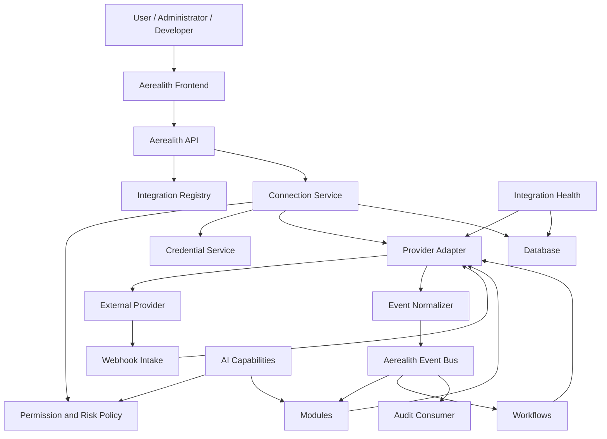

---

## Integration Registry

The integration registry is the authoritative catalog of supported providers.

It should answer:

```text
Which providers are supported?
Which provider versions are supported?
Which authorization methods are available?
Which capabilities are available?
Which permissions are required?
Which event sources are supported?
Which runtime is required?
Which connection scopes are supported?
Which modules depend on the provider?
Which health checks apply?
```

The registry describes providers.

It does not contain user credentials.

---

## Integration Definition

Each provider should have a validated integration definition.

Expected fields include:

```text
provider ID
display name
description
status
version
categories
connection methods
supported scopes
capabilities
required permissions
optional permissions
webhook support
event support
health strategy
disconnect strategy
runtime requirements
documentation links
```

Example:

```ts
export interface IntegrationDefinition {
  readonly id: string
  readonly name: string
  readonly description: string
  readonly version: string
  readonly status: IntegrationStatus
  readonly categories: readonly IntegrationCategory[]
  readonly connectionMethods: readonly IntegrationConnectionMethod[]
  readonly supportedScopes: readonly IntegrationScopeType[]
  readonly capabilities: readonly IntegrationCapabilityDefinition[]
  readonly requiredPermissions: readonly IntegrationPermissionRequirement[]
  readonly optionalPermissions: readonly IntegrationPermissionRequirement[]
  readonly webhookSupport: IntegrationWebhookSupport
  readonly healthStrategy: IntegrationHealthStrategy
  readonly disconnectStrategy: IntegrationDisconnectStrategy
  readonly runtimeRequirements: readonly IntegrationRuntimeRequirement[]
}
```

The exact contract should be finalized in RFC 0013.

---

## Provider Identity

Each provider requires a stable provider ID.

Examples:

```text
discord
github
google
microsoft
cloudinary
resend
```

Provider IDs should be:

```text
lowercase
stable
URL-safe
provider-oriented
independent from display names
```

Provider IDs become compatibility-sensitive when exposed through public contracts.

---

## Integration Categories

Potential categories include:

```text
community
communication
developer
productivity
storage
identity
email
calendar
media
observability
automation
```

Categories support discovery and organization.

They do not grant permission or capability.

---

## Integration Status

Provider definitions may use:

```text
Planned
Experimental
PrivateBeta
Available
Degraded
Deprecated
Unavailable
Revoked
```

### Planned

The integration is documented or proposed but not implemented.

### Experimental

The integration exists for controlled development or testing.

### Private Beta

The integration is available to approved users or environments.

### Available

The integration is supported for its documented scope.

### Degraded

The integration remains available but one or more provider capabilities are impaired.

### Deprecated

The integration remains temporarily supported but should not receive new adoption.

### Unavailable

The provider or adapter cannot currently be used.

### Revoked

The integration has been disabled because of security, policy, or platform concerns.

---

## Integration Scope

Every connection must have an explicit Aerealith scope.

Potential scope types:

```text
user
account
organization
community
server
developer application
module installation
```

A provider connection for one scope must not silently authorize another.

Examples:

```text
A user-level Google connection does not automatically authorize an organization.
A Discord server connection does not authorize another Discord server.
A GitHub organization connection does not authorize every personal repository.
```

---

## Provider Resource Scope

Providers may have their own resource hierarchy.

Examples:

```text
Discord application -> server -> channel -> message
GitHub account -> organization -> repository -> issue
Google account -> calendar -> event
Cloudinary account -> folder -> asset
```

The adapter should normalize provider resource references.

Example:

```ts
export interface IntegrationResourceReference {
  readonly provider: string
  readonly resourceType: string
  readonly providerResourceId: string
  readonly connectionId: string
  readonly parent?: IntegrationResourceReference
}
```

Platform contracts should not assume every provider uses Discord-style identifiers or GitHub-style repository paths.

---

## Connection Lifecycle

The canonical connection lifecycle is:

```text
Available
Connecting
PendingAuthorization
PendingVerification
Connected
Configuring
Active
Degraded
Disconnected
Revoked
Expired
```

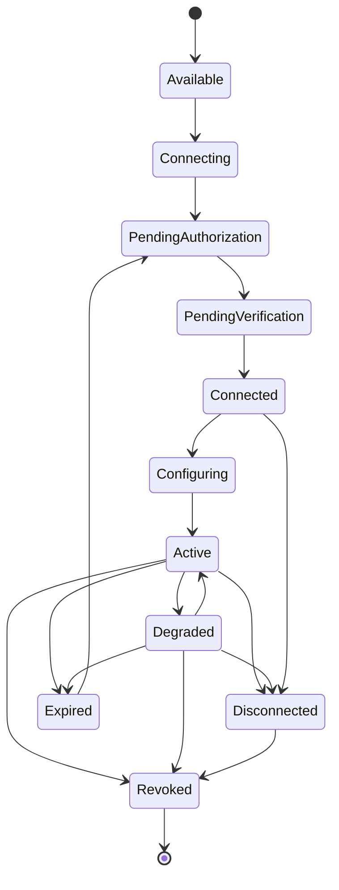

---

## Available State

A provider is available for connection.

No user-owned connection exists yet.

---

## Connecting State

A connection attempt has started.

Temporary authorization state may exist.

The provider is not yet trusted or active.

---

## Pending Authorization

Aerealith is waiting for the user or provider to complete authorization.

Examples:

```text
OAuth consent
API key entry
installation completion
administrator approval
```

---

## Pending Verification

Authorization may have succeeded, but Aerealith still needs to verify:

```text
provider identity
resource ownership
workspace authority
server authority
installation state
required permissions
```

Provider authorization alone may not prove resource ownership.

---

## Connected State

Aerealith has a valid provider connection.

The connection may still require configuration before features become active.

---

## Configuring State

The user is selecting:

```text
resources
permissions
modules
channels
repositories
calendars
folders
notification targets
```

---

## Active State

The connection is valid, configured, and available for approved capabilities.

---

## Degraded State

The connection remains present, but one or more capabilities are unavailable.

Possible causes:

```text
missing provider permission
expired credential
provider outage
rate-limit exhaustion
deleted provider resource
invalid configuration
provider API change
installation change
```

A degraded connection should preserve configuration and explain remediation.

---

## Disconnected State

The user intentionally stopped the connection.

Disconnected connections must not perform provider actions.

Credential revocation or deletion should occur according to provider capabilities.

---

## Revoked State

Aerealith or the provider revoked access because of:

```text
security incident
account suspension
provider policy violation
credential compromise
installation removal
ownership loss
administrative action
```

Revoked connections fail closed.

---

## Expired State

A credential or authorization grant expired.

The connection may support reauthorization without recreating all configuration.

---

## Connection Flow

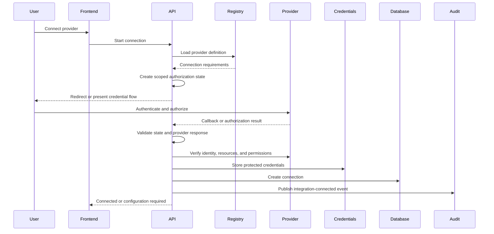

---

## Connection Methods

Providers may support different connection methods.

Potential methods:

```text
OAuth 2.0
OpenID Connect
bot installation
application installation
API key
service account
webhook-only
signed credential exchange
self-hosted endpoint
```

The method should be explicit in the provider definition.

---

## OAuth Architecture

OAuth connections should use:

```text
state validation
PKCE where supported
strict redirect URI validation
short-lived authorization state
nonce for OpenID Connect
minimum required scopes
secure token storage
refresh-token rotation where supported
```

OAuth used for integration authorization is separate from OAuth used for Aerealith login.

---

## OAuth Integration Flow

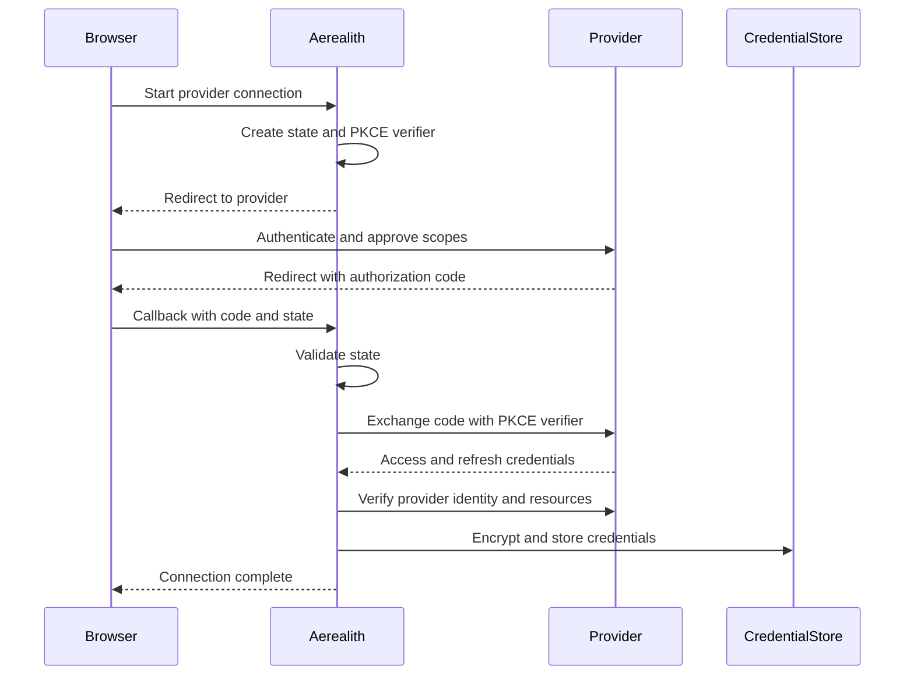

---

## OAuth State

OAuth state records should include:

```text
state ID
provider
Aerealith actor
target scope
redirect destination
PKCE verifier reference
created at
expires at
used at
request ID
trace ID
```

OAuth state should be:

```text
single-use
short-lived
cryptographically random
bound to the initiating session
```

---

## API Key Connections

Some providers may use API keys.

API key connection flows should:

```text
accept the key only through secure transport
validate the key with the provider
identify available scope
show permissions or capabilities
encrypt the key if future retrieval is required
never return the key after storage
support rotation
support revocation
```

The frontend must not retain provider API keys in browser storage.

---

## Service Account Connections

Service accounts may support:

```text
enterprise integrations
server-to-server access
self-hosted deployments
automation-owned provider resources
```

Service-account credentials should require:

```text
strong administrative permission
clear ownership
explicit environment
scope restriction
rotation
audit
```

Service accounts must not become shared human credentials.

---

## Credential Architecture

Provider credentials may include:

```text
access tokens
refresh tokens
API keys
application secrets
service-account credentials
webhook secrets
signing keys
bot tokens
```

Credentials should be:

```text
encrypted or secret-managed
scope-bound
environment-bound
rotatable
revocable
redacted
access-controlled
excluded from public contracts
excluded from ordinary logs
```

---

## Credential Storage

Credential metadata and credential material should remain separate where practical.

Connection metadata may contain:

```text
connection ID
provider
external account ID
granted scopes
status
expiration
credential reference
```

Credential storage contains:

```text
encrypted secret material
encryption version
key reference
rotation metadata
```

Public APIs must never expose the credential reference when doing so has no user-facing purpose.

---

## Credential Access

Only the runtime performing an approved provider operation should access the required credential.

A module should not receive raw provider credentials.

A workflow should not receive raw provider credentials.

AI should never receive provider credentials.

Provider calls should use an adapter that resolves credentials internally.

---

## Credential Rotation

Credential rotation may be:

```text
provider-initiated
user-initiated
scheduled
incident-driven
automatic through refresh-token rotation
```

Rotation should:

```text
verify new credential
replace or overlap safely
invalidate retired material
update health state
publish security telemetry
record meaningful changes
```

---

## Credential Expiration

The integration service should track:

```text
access-token expiration
refresh-token validity
API-key expiration where available
certificate expiration
webhook-secret rotation
```

Expiring credentials should produce:

```text
health warning
notification
reauthorization path
safe capability degradation
```

---

## Connection Ownership Verification

Authorization does not always prove authority over a provider resource.

Examples:

```text
A Discord user may authenticate without administering the selected server.
A GitHub user may authenticate without managing the selected organization.
A Google user may authenticate without owning a shared resource.
```

Provider adapters should define resource verification rules.

Verification may require:

```text
provider ownership
administrator role
specific provider permission
installation ownership
resource membership
```

---

## Provider Permission Model

Each provider has its own permission system.

Aerealith should normalize provider requirements without pretending all permission systems are identical.

A capability should declare:

```text
Aerealith permission
provider permission
resource scope
risk level
approval requirement
```

Both Aerealith and provider permission checks must pass.

---

## Dual Permission Flow

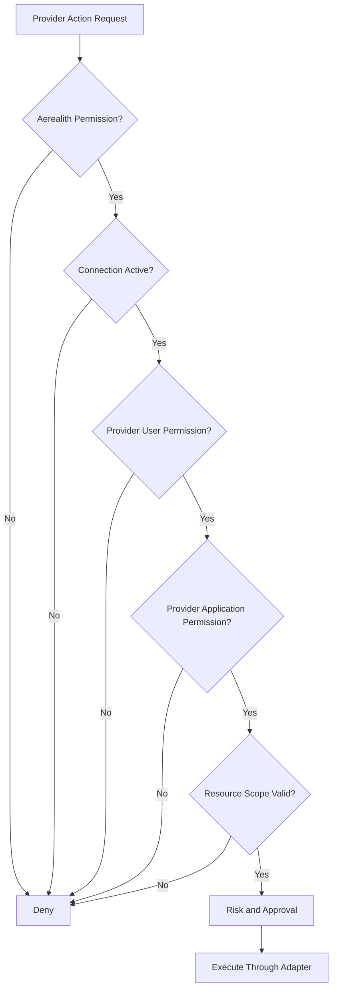

Not every provider requires separate human and application permissions.

The adapter should apply the checks appropriate to the provider.

---

## Permission Minimization

Aerealith should request the smallest provider permission set needed for the approved capability.

Each permission request should explain:

```text
which feature needs it
which data it permits
which actions it enables
whether it is optional
what fails without it
```

Do not request broad provider access because it might be useful later.

---

## Permission Upgrade

When a new capability requires additional provider permissions:

```text
show the additional permissions
explain the reason
show affected modules or workflows
require authorized approval
repeat provider authorization where required
record the permission change
```

A connection may remain degraded until the new permission is granted.

---

## Permission Drift

Provider permissions may change outside Aerealith.

Drift may be detected through:

```text
webhooks
provider events
failed actions
periodic health checks
provider metadata refresh
manual diagnostics
```

When drift occurs:

```text
mark affected capabilities degraded
block unsafe actions
preserve configuration
notify appropriate administrators
explain remediation
```

---

## Provider Capabilities

A provider capability is a bounded operation supported by an adapter.

Examples:

```text
send-message
create-calendar-event
read-repository
create-issue
upload-media
send-email
list-resources
disconnect-connection
```

Capabilities should describe intent rather than raw HTTP endpoints.

---

## Capability Definition

```ts
export interface IntegrationCapabilityDefinition {
  readonly id: string
  readonly name: string
  readonly description: string
  readonly inputSchema: string
  readonly outputSchema: string
  readonly requiredAerealithPermissions: readonly string[]
  readonly requiredProviderPermissions: readonly string[]
  readonly supportedScopeTypes: readonly IntegrationScopeType[]
  readonly riskLevel: RiskLevel
  readonly approvalRequired: boolean
  readonly idempotencyRequired: boolean
  readonly timeoutMs: number
  readonly retryPolicy: IntegrationRetryPolicy
  readonly auditRequired: boolean
}
```

---

## Capability IDs

Capability IDs should be stable and provider-aware when necessary.

Provider-neutral examples:

```text
communication.message.send
calendar.event.create
storage.asset.upload
developer.issue.create
community.member.timeout
```

Provider-specific examples:

```text
discord.command.register
github.repository.dispatch
google.drive.permission.create
```

Provider-neutral capabilities are preferred where behavior is genuinely shared.

Do not force fake neutrality when provider behavior is materially different.

---

## Capability Execution Flow

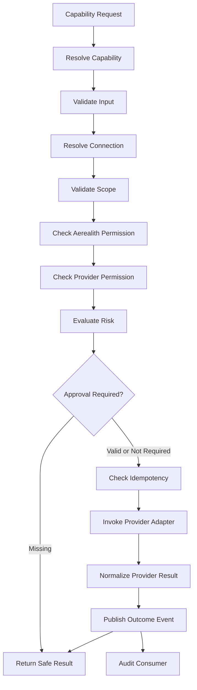

---

## Provider Adapter Interface

Provider-specific behavior should implement stable interfaces.

Example:

```ts
export interface IntegrationProviderAdapter {
  readonly providerId: string

  connect(
    input: ConnectIntegrationInput,
  ): Promise<Result<IntegrationConnectionResult, AerealithError>>

  refresh(
    connectionId: string,
  ): Promise<Result<IntegrationConnectionResult, AerealithError>>

  health(
    connectionId: string,
  ): Promise<Result<IntegrationHealth, AerealithError>>

  disconnect(connectionId: string): Promise<Result<void, AerealithError>>

  execute<TInput, TOutput>(
    capabilityId: string,
    input: TInput,
    context: IntegrationExecutionContext,
  ): Promise<Result<TOutput, AerealithError>>
}
```

The final interface may separate connection, health, event, and capability concerns into narrower interfaces.

---

## Narrow Adapter Interfaces

As the architecture matures, prefer focused interfaces such as:

```text
IntegrationConnectionAdapter
IntegrationCredentialAdapter
IntegrationCapabilityAdapter
IntegrationEventAdapter
IntegrationWebhookAdapter
IntegrationHealthAdapter
```

This prevents one enormous adapter from becoming a provider-shaped god object.

---

## Provider SDK Isolation

Provider SDKs should remain inside provider-specific implementation boundaries.

Avoid:

```text
libs/core importing provider SDKs
libs/contracts exporting provider SDK types
apps/frontend importing provider SDKs
workflow definitions containing provider SDK objects
modules receiving provider SDK clients
```

Provider types should be mapped into Aerealith-owned types.

---

## Monorepo Placement

Provider-specific integration runtimes belong in:

```text
apps/integrations/
```

Example:

```text
apps/integrations/
├── discord/
├── github/
├── google/
└── provider-name/
```

Not every provider requires a standalone runtime.

A provider that only uses request-response APIs may initially use an adapter inside the API service.

A provider requiring persistent connections may require a dedicated application.

---

## Runtime Selection

Provider runtime needs may include:

| Provider Behavior              | Likely Runtime                |
| ------------------------------ | ----------------------------- |
| OAuth callback                 | API Worker                    |
| Short outbound REST call       | API Worker or queue consumer  |
| Persistent gateway connection  | Dedicated integration runtime |
| Webhook intake                 | API Worker                    |
| Long synchronization job       | Queue consumer                |
| Scheduled reconciliation       | Scheduled worker              |
| Large media processing         | Dedicated worker              |
| Local or self-hosted connector | Dedicated connector runtime   |

Runtime choice should follow actual provider requirements.

---

## Integration Application Structure

Recommended provider runtime structure:

```text
apps/integrations/provider-name/
├── src/
│   ├── app/
│   │   ├── configuration/
│   │   ├── bootstrap/
│   │   └── runtime.ts
│   ├── connections/
│   ├── credentials/
│   ├── capabilities/
│   ├── events/
│   ├── webhooks/
│   ├── provider/
│   ├── health/
│   ├── observability/
│   ├── workers/
│   └── index.ts
├── Dockerfile
├── README.md
├── project.json
├── tsconfig.json
├── tsconfig.app.json
├── tsconfig.spec.json
└── vitest.config.mts
```

Not every provider needs every folder.

Create structure only when a real responsibility exists.

---

## Shared Integration Contracts

Potential structure:

```text
libs/contracts/src/integrations/
├── providers/
├── connections/
├── capabilities/
├── permissions/
├── events/
├── health/
├── webhooks/
└── index.ts
```

Provider-specific contracts may live under:

```text
libs/contracts/src/integrations/discord/
libs/contracts/src/integrations/github/
libs/contracts/src/integrations/google/
```

Reusable provider-neutral contracts should remain outside provider-specific folders.

---

## Core Integration Primitives

Potential core structure:

```text
libs/core/src/integrations/
├── integration-status.ts
├── integration-scope.ts
├── integration-capability.ts
├── integration-health.ts
├── integration-permission.ts
├── integration-errors.ts
└── index.ts
```

Only provider-neutral concepts belong in `libs/core`.

---

## Persistence Structure

Potential persistence structure:

```text
libs/db/src/
├── schema/integrations/
├── queries/integrations/
├── mappers/integrations/
└── repositories/integrations/
```

Provider-specific persistence may use:

```text
libs/db/src/schema/integrations/discord/
libs/db/src/schema/integrations/github/
libs/db/src/schema/integrations/google/
```

---

## Integration Data Model

Potential records include:

```text
IntegrationDefinition
IntegrationConnection
IntegrationCredentialReference
IntegrationPermissionGrant
IntegrationResourceLink
IntegrationHealthRecord
IntegrationEventReceipt
IntegrationWebhookReceipt
IntegrationSyncCursor
IntegrationActionReceipt
IntegrationReauthorizationRequest
```

---

## Suggested Tables

Potential table names:

```text
integration_definitions
integration_connections
integration_permission_grants
integration_resource_links
integration_health_records
integration_event_receipts
integration_webhook_receipts
integration_sync_cursors
integration_action_receipts
integration_reauthorization_requests
```

Credential material should remain in a separate protected store or encrypted credential table.

---

## Integration Connection Record

A connection record may contain:

```text
connection ID
provider
scope type
scope ID
external account ID
display name
status
connection method
granted scopes
connected by
connected at
last healthy at
degraded at
expired at
disconnected at
revoked at
credential reference
metadata
```

Provider metadata should be versioned or schema-validated when stored as JSON.

---

## Resource Link Record

A resource link maps an Aerealith scope or object to a provider resource.

Potential fields:

```text
resource link ID
connection ID
provider resource type
provider resource ID
Aerealith resource type
Aerealith resource ID
status
created by
created at
removed at
```

Resource links must remain scope-bound.

---

## Event Architecture

Providers may deliver events through:

```text
webhooks
persistent gateways
polling
scheduled synchronization
callback notifications
```

Raw provider events should be verified and normalized before entering platform event flows.

---

## Event Flow

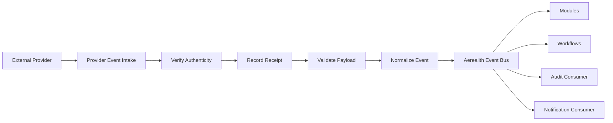

Not every raw provider event requires an audit record.

Audit records represent meaningful platform or user actions.

---

## Event Normalization

Provider events should map into stable Aerealith concepts.

Examples:

```text
Discord member join -> community.member.joined
GitHub issue created -> developer.issue.created
Google Calendar event updated -> calendar.event.updated
Cloudinary asset uploaded -> media.asset.created
```

Normalized events should preserve provider references where necessary.

They should not expose raw SDK objects.

---

## Normalized Event Fields

Normalized provider events may include:

```text
provider
connection ID
provider event type
provider event ID
event type
event version
occurred at
received at
actor
target
scope
resource references
request ID
trace ID
payload
metadata
```

---

## Event Versioning

Provider event formats can change independently from Aerealith event versions.

The adapter should translate:

```text
provider API version
provider event version
provider payload
```

into:

```text
Aerealith event type
Aerealith event version
normalized payload
```

Provider API changes should not silently redefine internal platform contracts.

---

## Webhook Architecture

Webhook handlers should exist under:

```text
/api/V1/webhooks/{providerId}
```

Provider-specific subpaths may be used when required.

Examples:

```text
/api/V1/webhooks/github
/api/V1/webhooks/discord
/api/V1/webhooks/resend
```

Webhook paths must not reveal secrets.

---

## Webhook Verification

Webhook intake should verify:

```text
provider signature
timestamp
delivery ID
expected endpoint
payload size
content type
schema
replay window
```

Verification may require access to the raw request body.

Do not transform signed content before verification when the provider signs raw bytes.

---

## Webhook Flow

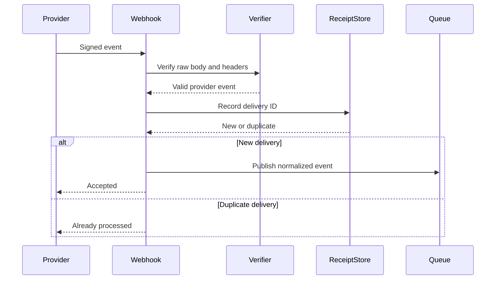

---

## Webhook Idempotency

Webhook deliveries should be treated as at least once.

Use:

```text
provider delivery ID
provider event ID
payload fingerprint
connection ID
unique constraint
```

to prevent duplicate outcomes.

A duplicate webhook must not duplicate:

```text
workflow runs
notifications without intent
provider actions
ticket creation
audit records
```

---

## Webhook Response Behavior

Webhook handlers should acknowledge valid events within provider timing requirements.

Long processing should occur asynchronously.

The handler should not wait for:

```text
workflow completion
AI generation
notification delivery
large synchronization
```

unless the provider contract explicitly requires a synchronous response.

---

## Polling and Synchronization

Some providers may not support all required webhooks.

Polling may be used for:

```text
resource discovery
health checks
incremental synchronization
permission drift detection
missed event recovery
```

Polling should be:

```text
bounded
rate-limit aware
cursor-based
observable
idempotent
scope-aware
```

---

## Sync Cursor

A sync cursor may track:

```text
connection
resource
provider cursor
last synchronized at
last successful page
status
error code
```

Sync cursors should remain provider-specific internally.

Platform-facing sync status should remain normalized.

---

## Reconciliation

Reconciliation compares stored state with provider state.

It may detect:

```text
removed installations
expired credentials
deleted resources
changed permissions
missed events
configuration drift
```

Reconciliation should:

```text
repair safe metadata drift
mark unsafe drift as degraded
notify administrators
avoid recreating provider resources silently
```

---

## Outbound Provider Actions

Outbound provider actions should use capability interfaces.

The caller should provide:

```text
connection
scope
capability ID
validated input
actor
request ID
trace ID
approval
idempotency key
```

The adapter resolves credentials internally.

---

## Provider Action Receipt

Action receipts support:

```text
idempotency
support
reconciliation
provider correlation
audit correlation
```

Potential fields:

```text
action receipt ID
connection ID
capability ID
idempotency key
provider request ID
provider resource ID
status
attempt
created at
completed at
result reference
error code
```

---

## Idempotency

Provider actions may be retried because of:

```text
network timeout
queue redelivery
worker restart
client retry
provider timeout
```

Each state-changing capability should define an idempotency strategy.

Possible mechanisms:

```text
provider idempotency key
Aerealith action receipt
unique constraint
operation fingerprint
existing-resource lookup
provider request ID
```

---

## Provider Outcome Uncertainty

A provider action may succeed even when Aerealith does not receive a response.

When the outcome is uncertain:

```text
do not blindly repeat destructive actions
store uncertain state
attempt safe reconciliation
query provider state when possible
require operator review when necessary
```

---

## Retry Architecture

Retries should be provider-aware.

A retry policy may include:

```text
maximum attempts
initial delay
maximum delay
backoff multiplier
jitter
retryable provider codes
retryable Aerealith errors
```

---

## Retry Rules

Retry only when:

```text
the failure may be temporary
the action is idempotent
the provider permits retry
the retry budget remains
permission remains valid
approval remains valid
```

Do not retry:

```text
invalid input
authorization denial
missing provider permission
resource not found where recreation is unsafe
explicit provider rejection
account suspension
revoked connection
expired approval
```

---

## Rate Limits

Provider rate limits are part of normal integration behavior.

The adapter should:

```text
read provider rate-limit metadata
coordinate request buckets where necessary
delay safe work
reject excessive work clearly
emit metrics
avoid retry storms
```

Modules and workflows should not bypass provider rate-limit coordination.

---

## Rate-Limit Flow

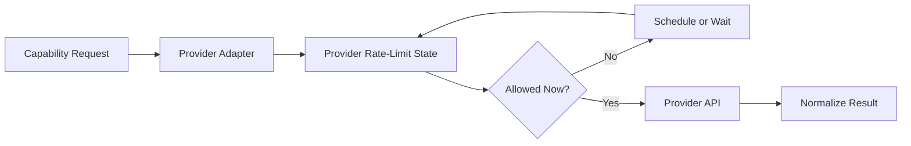

---

## Rate-Limit Scope

Provider rate limits may apply by:

```text
provider
application
credential
connection
resource
endpoint
route bucket
account
```

The adapter should model the provider’s actual behavior.

Do not assume one global requests-per-minute limit fits every provider.

---

## Provider Timeouts

Every provider call requires a bounded timeout.

Timeouts may vary by:

```text
connection operation
read operation
write operation
file upload
synchronization
webhook validation
```

Timeout values should be configurable and observable.

---

## Provider Error Mapping

Raw provider errors should map to stable Aerealith errors.

Common integration error codes may include:

```text
INTEGRATION_PROVIDER_NOT_FOUND
INTEGRATION_NOT_SUPPORTED
INTEGRATION_CONNECTION_NOT_FOUND
INTEGRATION_CONNECTION_NOT_ACTIVE
INTEGRATION_CONNECTION_EXPIRED
INTEGRATION_CONNECTION_REVOKED
INTEGRATION_AUTHORIZATION_FAILED
INTEGRATION_REAUTHORIZATION_REQUIRED
INTEGRATION_PERMISSION_MISSING
INTEGRATION_RESOURCE_NOT_FOUND
INTEGRATION_RESOURCE_FORBIDDEN
INTEGRATION_CAPABILITY_NOT_SUPPORTED
INTEGRATION_CAPABILITY_UNAVAILABLE
INTEGRATION_RATE_LIMITED
INTEGRATION_PROVIDER_UNAVAILABLE
INTEGRATION_PROVIDER_TIMEOUT
INTEGRATION_PROVIDER_REJECTED
INTEGRATION_WEBHOOK_INVALID
INTEGRATION_WEBHOOK_REPLAYED
INTEGRATION_CONFIGURATION_INVALID
INTEGRATION_SYNC_FAILED
INTEGRATION_DISCONNECT_FAILED
```

Provider-specific codes may exist when platform-neutral errors would lose important meaning.

---

## Safe Provider Errors

Public errors should not expose:

```text
access tokens
refresh tokens
API keys
provider request headers
provider secrets
provider stack traces
private provider payloads
internal endpoint details
```

Errors should explain actionable remediation where possible.

Example:

```text
The GitHub connection no longer has permission to read this repository.
Reconnect the integration or update the installation permissions.
```

---

## Health Architecture

Each connection should expose normalized health.

Potential states:

```text
Healthy
Degraded
Expired
Disconnected
Revoked
Unavailable
Unknown
```

Health may consider:

```text
credential validity
provider availability
required permissions
resource existence
installation state
webhook state
last successful action
last successful event
sync status
```

---

## Health Record

A health record may include:

```text
connection ID
status
checked at
last healthy at
issues
missing permissions
expired credentials
unavailable resources
recommended remediation
```

Health responses should not expose secrets.

---

## Health Checks

Health checks may be:

```text
passive
active
scheduled
event-driven
```

### Passive Health

Updated from normal provider operations.

### Active Health

Performs a bounded provider request.

### Scheduled Health

Runs periodically.

### Event-Driven Health

Updates from provider webhooks or gateway events.

---

## Health Check Rules

Health checks should:

```text
use low-cost provider operations
respect rate limits
avoid state changes
avoid broad data retrieval
record failures safely
```

Health checks must not trigger provider writes.

---

## Graceful Degradation

Provider failures should degrade only affected capabilities.

Examples:

| Failure                | Required Behavior                                      |
| ---------------------- | ------------------------------------------------------ |
| Provider unavailable   | Block provider actions and preserve platform controls. |
| Credential expired     | Require reauthorization and preserve configuration.    |
| Permission removed     | Block affected capabilities and explain remediation.   |
| Webhooks delayed       | Use reconciliation where practical.                    |
| Rate-limited           | Queue or delay safe work.                              |
| Resource deleted       | Mark configuration invalid or degraded.                |
| AI unavailable         | Preserve non-AI integration behavior.                  |
| Audit consumer delayed | Preserve events and alert operations.                  |

---

## Disconnect Architecture

Disconnecting an integration is a meaningful action.

Disconnect should:

```text
authenticate the actor
verify scope
verify permission
evaluate risk
require confirmation where appropriate
disable integration-dependent modules
stop integration-triggered workflows
stop provider actions
revoke provider authorization where supported
delete or revoke credentials
invalidate caches
mark the connection disconnected
publish an event
create an audit record
explain retained data
```

---

## Disconnect Flow

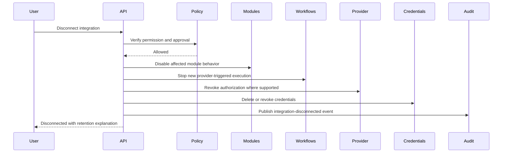

---

## Disconnect Versus Delete Data

Disconnecting and deleting integration data are separate operations.

### Disconnect

```text
stops provider access
revokes credentials
stops new provider activity
preserves required configuration and history
```

### Delete Integration Data

```text
removes eligible provider-derived records
removes eligible configuration
preserves required audit or legal records
requires additional confirmation where appropriate
```

---

## Reauthorization

Expired or changed provider authorization may require reauthorization.

Reauthorization should:

```text
preserve connection identity where safe
preserve configuration
show changed permissions
verify provider identity
verify resource ownership again when needed
rotate credentials
record the change
```

Reauthorization must not silently broaden provider scope.

---

## Revocation

Revocation may be triggered by:

```text
user disconnect
provider token revocation
provider installation removal
security incident
account suspension
ownership loss
administrator action
provider policy violation
```

A revoked connection must fail closed.

---

## Module Integration

Modules may depend on integration capabilities.

A module manifest should declare:

```text
provider
required connection type
required capabilities
required provider permissions
health requirements
failure behavior
```

A module should not access raw provider credentials or SDK clients.

---

## Module Capability Flow

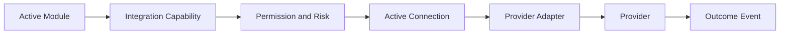

---

## Module Degradation

When a required integration degrades:

```text
the module should enter degraded state
unsafe actions should stop
configuration should remain
health should explain the provider issue
```

The module must not pretend provider operations still work.

---

## Workflow Integration

Integrations may register workflow:

```text
triggers
conditions
actions
```

Examples:

```text
Discord member joined
GitHub issue created
calendar event starts
media asset uploaded
send provider message
create provider issue
upload provider asset
```

Workflow actions must use approved integration capabilities.

---

## Workflow Trigger Registration

An integration trigger should define:

```text
trigger ID
provider
event type
event version
input schema
scope rules
deduplication strategy
```

Provider raw events should be normalized before workflow matching.

---

## Workflow Action Registration

An integration action should define:

```text
action ID
provider
capability
input schema
output schema
required permissions
risk level
approval requirement
idempotency
retry policy
timeout
audit policy
```

---

## AI Integration Boundaries

AI may help users:

```text
understand connection health
explain missing permissions
suggest configuration
prepare provider actions
draft provider content
summarize provider events
```

AI must not:

```text
receive provider credentials
grant provider permissions
approve its own provider actions
silently broaden connection scope
silently reconnect revoked integrations
silently disconnect providers
execute destructive provider actions without approval
```

---

## AI-Proposed Provider Action

The flow should be:

```text
AI Suggestion
→ Structured Proposal
→ Capability Validation
→ Connection Validation
→ Aerealith Permission
→ Provider Permission
→ Risk Evaluation
→ Human Approval
→ Provider Adapter
→ Audit
→ Explain Actual Outcome
```

---

## Developer Platform

The developer platform may expose integration APIs for:

```text
listing providers
creating connections
reading connection health
listing capabilities
receiving normalized events
managing webhooks
disconnecting connections
```

Developer access requires scoped credentials.

---

## Public Integration Routes

Potential provider routes include:

```text
GET /api/V1/integrations
GET /api/V1/integrations/providers
GET /api/V1/integrations/providers/{providerId}
```

Connection routes may include:

```text
GET /api/V1/integrations/connections
POST /api/V1/integrations/{providerId}/connect
GET /api/V1/integrations/{providerId}/callback
GET /api/V1/integrations/connections/{connectionId}
GET /api/V1/integrations/connections/{connectionId}/health
GET /api/V1/integrations/connections/{connectionId}/permissions
POST /api/V1/integrations/connections/{connectionId}/reauthorize
DELETE /api/V1/integrations/connections/{connectionId}
```

Capability routes may include:

```text
GET /api/V1/integrations/connections/{connectionId}/capabilities
POST /api/V1/integrations/connections/{connectionId}/capabilities/{capabilityId}
```

Exact routes should be finalized through RFC 0013 and API contract review.

---

## Provider-Specific Routes

Provider-specific routes may be used where necessary.

Examples:

```text
GET /api/V1/integrations/discord/servers
GET /api/V1/integrations/github/repositories
GET /api/V1/integrations/google/calendars
```

Provider-specific routes should still use shared:

```text
authentication
authorization
response envelopes
error model
request IDs
trace IDs
```

---

## Integration API Contracts

Potential contracts include:

```text
IntegrationProviderResponse
IntegrationConnectionResponse
IntegrationHealthResponse
IntegrationPermissionResponse
IntegrationCapabilityResponse
ConnectIntegrationRequest
ReconnectIntegrationRequest
ExecuteIntegrationCapabilityRequest
DisconnectIntegrationRequest
```

Contracts should live under:

```text
libs/contracts/src/api/V1/integrations/
```

---

## Frontend Architecture

The frontend should provide:

```text
integration catalog
connect flow
connection list
connection details
permission explanation
health status
resource selection
module dependencies
workflow dependencies
reauthorization
disconnect
data-retention explanation
```

---

## Integration Catalog

The catalog should answer:

```text
What does this integration do?
Which permissions does it require?
Which data may it access?
Which modules use it?
Which workflows may use it?
Is it available?
How do I disconnect it?
```

---

## Connection Detail UI

A connection detail page may show:

```text
provider
external account
scope
status
connected by
connected at
granted permissions
available capabilities
health issues
linked resources
dependent modules
dependent workflows
recent activity
disconnect control
```

It must not expose raw credentials.

---

## Permission UX

Permission explanations should use human-readable language.

Prefer:

```text
Aerealith needs permission to create calendar events when you approve a workflow action.
```

Avoid presenting only provider scope codes such as:

```text
calendar.events.write
```

The underlying technical scope may still be shown in advanced details.

---

## Integration Setup Wizard

A setup wizard may guide users through:

```text
provider selection
authorization
resource verification
permission review
resource selection
module selection
configuration
health validation
activation
```

Setup should not silently enable unrelated modules or workflows.

---

## Data Ownership

Provider-derived data remains scoped to the connected user, account, organization, or community.

Aerealith should make clear:

```text
what is read
what is stored
what is sent back
how long it is retained
how it is exported
how it is deleted
```

Provider data is not unrestricted Aerealith training material.

---

## Data Minimization

Aerealith should store the minimum provider data required for approved capabilities.

Before storing provider data, answer:

```text
Which feature needs it?
Which scope owns it?
Can a provider reference replace a copy?
How long is it needed?
Can metadata replace content?
Must it be searchable?
Must it be sent to AI?
Can it be deleted?
```

---

## Provider Payload Storage

Raw provider payloads should be retained only when necessary for:

```text
webhook verification
retry
idempotency
support
security investigation
```

Raw payload retention should be bounded.

Normalized data should be preferred for long-term platform behavior.

---

## Synchronization Data

Synchronization may create local copies of provider data.

Sync architecture should define:

```text
source of truth
direction
conflict resolution
deletion propagation
update frequency
cursor behavior
retention
```

A connection should not become a silent permanent mirror of the provider.

---

## Source of Truth

Each synchronized domain should identify its source of truth.

Examples:

```text
Provider is authoritative.
Aerealith is authoritative.
Bidirectional with explicit conflict rules.
```

Avoid undocumented bidirectional synchronization.

That path leads directly to data-shaped misery.

---

## Conflict Resolution

Possible conflict strategies include:

```text
provider wins
Aerealith wins
latest valid change wins
manual resolution
field-level ownership
```

Conflict resolution should be explicit per synchronized capability.

---

## Deletion Propagation

When provider data is deleted:

```text
local references should be updated
derived data should be removed or marked unavailable
search indexes should be updated
module health may degrade
audit history may retain safe references
```

Aerealith must not recreate deleted provider content without explicit intent.

---

## Retention

Retention should be defined for:

```text
connection metadata
credentials
permission grants
provider events
webhook receipts
sync cursors
action receipts
provider-derived content
health history
```

Disconnecting should trigger appropriate retention and deletion behavior.

---

## Export

Integration exports may include:

```text
connection metadata
linked resources
configuration
permission history
normalized events
provider-derived data where permitted
```

Exports require:

```text
authorization
scope filtering
private-data review
signed expiring delivery
audit event
```

Aerealith must not export provider data that the requesting user is not permitted to access.

---

## Security Architecture

Integration security follows:

```text
docs/architecture/Security Architecture.md
```

High-priority threats include:

```text
credential theft
OAuth state substitution
callback manipulation
provider impersonation
webhook forgery
webhook replay
permission escalation
cross-scope access
cross-provider confusion
malicious provider payloads
unbounded synchronization
provider rate-limit abuse
provider SDK compromise
```

---

## Integration Security Rules

Every provider action should verify:

```text
connection exists
connection is active
credential is valid
scope matches
Aerealith permission exists
provider permission exists
target resource is valid
risk is correct
approval is valid
idempotency passes
```

---

## Callback Security

Provider callbacks should validate:

```text
state
nonce where required
PKCE verifier
provider
environment
redirect URI
session binding
expiration
single use
```

A callback should not accept user-supplied connection ownership without provider verification.

---

## Webhook Security

Webhook handlers must:

```text
verify authenticity
validate timestamps
reject replays
limit payload size
validate schemas
normalize data
record safe telemetry
```

Webhook secrets must remain isolated.

---

## SSRF Protection

Integrations that accept provider URLs or self-hosted endpoints should protect against server-side request forgery.

Controls include:

```text
allowed schemes
host validation
private-network restrictions
metadata-endpoint blocking
redirect limits
DNS revalidation
timeouts
response-size limits
```

Self-hosted integration support requires an explicit network-access policy.

---

## Provider SDK Security

Provider SDKs should be reviewed for:

```text
maintenance
security history
transitive dependencies
runtime compatibility
license
request behavior
credential handling
```

SDKs should be pinned and updated through the repository dependency process.

---

## Observability

Integration observability should answer:

```text
Which providers are connected?
Which connections are healthy?
Which credentials are expiring?
Which permissions are missing?
Which webhooks are failing?
Which providers are rate-limiting Aerealith?
Which actions are failing?
Which sync jobs are delayed?
Which connections were revoked?
```

---

## Metrics

Useful integration metrics include:

```text
connection count
active connection count
degraded connection count
connection success rate
authorization failure rate
reauthorization count
credential refresh failure count
provider request count
provider latency
provider error rate
rate-limit count
webhook delivery count
webhook verification failure count
webhook replay count
event normalization failure count
sync duration
sync failure count
action retry count
disconnect failure count
```

---

## Logs

Integration logs should include:

```text
provider
connection ID when safe
capability
operation
result
error code
provider status code
request ID
trace ID
duration
attempt
```

Logs must not include:

```text
access tokens
refresh tokens
API keys
bot tokens
authorization headers
webhook secrets
private provider payloads without a defined purpose
```

---

## Tracing

Trace context should propagate through:

```text
frontend
API
connection service
credential service
provider adapter
provider API
event normalization
queue
workflow
module
audit consumer
notification consumer
```

A provider action should be traceable from request to provider result and audit record.

---

## Alerts

Potential integration alerts include:

```text
provider outage
credential refresh failures
webhook verification failures
webhook delivery backlog
connection degradation spike
provider rate-limit spike
integration action failure spike
sync backlog
reconciliation failure
disconnect revocation failure
```

---

## Provider Health Dashboard

Operations should have a provider-level view showing:

```text
provider status
active connections
degraded connections
request latency
error rate
rate-limit state
webhook health
credential-refresh health
sync backlog
```

This operational dashboard is distinct from user-facing connection health.

---

## Failure Behavior

When provider security or permission state is uncertain, fail closed.

Examples:

```text
credential validity unknown -> block write
permission state unknown -> block protected action
scope verification failed -> deny
approval unavailable -> block approval-required action
provider response ambiguous -> reconcile before retrying destructive action
```

---

## Provider Outages

During provider outages:

```text
preserve connection records
stop unsafe writes
queue safe retryable work within limits
show degraded status
avoid retry storms
continue unrelated Aerealith behavior
```

---

## Runtime Portability

Integration behavior should remain compatible with:

```text
Cloudflare Workers
Node.js
Docker
Kubernetes
self-hosted connector runtimes
```

Provider-specific runtime concerns should remain behind adapters.

---

## Cloudflare Workers

Workers may host:

```text
OAuth initiation
OAuth callbacks
webhook intake
short provider API calls
connection APIs
health APIs
```

Persistent connections should use a compatible dedicated runtime.

---

## Docker

Persistent and background integration runtimes should be containerized.

Container requirements include:

```text
Node.js 24.x
non-root user
minimal image
validated configuration
health checks
graceful shutdown
no embedded secrets
structured logging
resource limits
dependency and image scanning
```

---

## Kubernetes

Kubernetes may later support:

```text
persistent provider runtimes
queue-consumer scaling
scheduled reconciliation
secret injection
network policies
resource limits
rolling updates
health-based restart
```

Horizontal scaling must preserve:

```text
connection ownership
provider session ownership
rate-limit coordination
idempotency
webhook deduplication
```

---

## Graceful Shutdown

Integration workers should:

```text
stop accepting new work
finish safe in-flight requests
persist action receipts
release connection or shard ownership
close persistent provider sessions
flush telemetry
close database resources
exit within a bounded timeout
```

A restart must not duplicate completed provider actions.

---

## Environment Separation

Integration environments should use separate:

```text
provider applications
OAuth credentials
API keys
webhook secrets
callback URLs
databases
queues
test resources
observability labels
```

Recommended environments:

```text
local
test
preview
staging
production
```

Preview environments must not receive production credentials by default.

---

## Configuration

Integration configuration may include:

```text
provider application ID
provider client ID
provider client secret binding
callback URL
webhook secret binding
API endpoint
provider API version
timeout
retry policy
rate-limit policy
health interval
event retention
```

Configuration should be centralized and validated at startup.

Avoid scattered direct environment access.

---

## Environment Variables

Environment variables should use Aerealith-prefixed names.

Examples:

```text
AEREALITH_INTEGRATIONS_ENABLED
AEREALITH_INTEGRATION_HEALTH_INTERVAL_MS
AEREALITH_INTEGRATION_REQUEST_TIMEOUT_MS
AEREALITH_INTEGRATION_MAX_RETRIES
```

Provider-specific secret names may include:

```text
AEREALITH_DISCORD_BOT_TOKEN
AEREALITH_DISCORD_CLIENT_SECRET
AEREALITH_GITHUB_CLIENT_SECRET
AEREALITH_GOOGLE_CLIENT_SECRET
AEREALITH_CLOUDINARY_API_SECRET
AEREALITH_RESEND_API_KEY
```

Secrets must never enter frontend environment variables.

---

## Testing Strategy

Integration testing should include:

```text
registry tests
definition validation tests
connection lifecycle tests
OAuth state tests
PKCE tests
callback tests
credential encryption tests
credential rotation tests
permission tests
resource verification tests
capability tests
webhook verification tests
webhook replay tests
normalization tests
idempotency tests
retry tests
rate-limit tests
health tests
disconnect tests
revocation tests
reconciliation tests
module integration tests
workflow integration tests
AI-disabled tests
integration tests
end-to-end tests
```

Coverage requirement:

```text
80% statements
80% branches
80% functions
80% lines
```

---

## Critical Integration Tests

Tests must prove:

```text
forged OAuth state is rejected
expired OAuth state is rejected
replayed OAuth state is rejected
provider credentials are never returned publicly
provider credentials are never logged
connection scope is enforced
provider permissions are enforced
Aerealith permissions are enforced
provider SDK types do not escape adapters
invalid webhook signatures are rejected
replayed webhooks do not duplicate outcomes
duplicate provider actions do not duplicate outcomes
permission drift degrades affected capabilities
disconnect revokes operational access
revoked connections cannot execute actions
provider failure does not break unrelated platform behavior
AI cannot access provider credentials
AI cannot execute provider actions without approval
```

---

## Provider Contract Tests

Each provider adapter should pass a shared contract test suite.

The suite may verify:

```text
connection result shape
health result shape
safe error mapping
capability discovery
disconnect behavior
credential redaction
request and trace propagation
timeout handling
retry classification
```

Provider-specific tests should cover additional behavior.

---

## Webhook Test Matrix

Webhook tests should include:

```text
valid signature
invalid signature
missing signature
expired timestamp
duplicate delivery
malformed payload
oversized payload
unknown event
unsupported event version
provider retry
queue failure
```

---

## Rate-Limit Tests

Rate-limit tests should simulate:

```text
single request
burst requests
shared bucket exhaustion
retry-after behavior
multiple connections
multiple workers
provider global limits
recovery after reset
```

Tests should prove there is no uncontrolled retry storm.

---

## Disconnect Tests

Disconnect tests should prove:

```text
credentials are revoked or deleted
provider actions stop
dependent modules degrade or disable
provider-triggered workflows stop
cached state is invalidated
connection status changes
audit event is produced
repeated disconnect is idempotent
```

---

## Integration Test Adapters

Development and CI should support:

```text
fake provider adapters
recorded safe fixtures
sandbox provider accounts
test applications
deterministic webhook fixtures
provider failure simulation
rate-limit simulation
```

A fake adapter should support:

```text
success
authorization failure
missing permission
timeout
rate limit
invalid response
revocation
```

---

## End-to-End Tests

Initial E2E flows should include:

```text
list available providers
connect provider
complete callback
verify resource ownership
review permissions
activate connection
execute a safe capability
receive a provider event
view connection health
disconnect
verify further actions are blocked
```

Failure flows should include:

```text
reject invalid callback
reject missing permission
handle credential expiration
handle provider outage
handle webhook replay
handle revoked connection
```

---

## Release Scope

The integration architecture is delivered in stages.

### Release 0.2

Should establish:

```text
integration domain primitives
connection entities
provider-neutral contracts
credential references
repository patterns
```

### Release 0.3

Should establish:

```text
identity and integration OAuth separation
authorization foundations
scope checks
risk and approval primitives
```

### Release 0.5

Should establish:

```text
integration API patterns
request and trace propagation
event envelope
idempotency
audit consumers
workflow action foundations
```

### Release 0.6

Should establish:

```text
provider registry
connection lifecycle
provider adapter interface
connect and disconnect APIs
integration health
webhook foundation
credential handling
developer documentation
Discord connection foundations
```

### Release 0.7

Should establish:

```text
Discord persistent runtime
ownership verification
provider permission diagnostics
provider events
module capability integration
```

### Release 0.8

Should establish:

```text
moderation and ticket capabilities
workflow actions
AI-assisted provider suggestions
community data controls
```

### Release 0.9

Should establish:

```text
provider telemetry
health alerts
rate-limit monitoring
webhook monitoring
reconciliation
failure testing
rollback and recovery
```

### Post-MVP

May establish:

```text
additional providers
provider marketplace
enterprise private integrations
self-hosted connectors
advanced bidirectional sync
third-party adapters
```

---

## MVP Integration Scope

The MVP integration scope should include:

```text
provider registry foundation
provider-neutral adapter interface
connection lifecycle
OAuth and installation foundations
credential protection
health checks
permission diagnostics
webhook intake
event normalization
idempotency
disconnect and revocation
Discord as the flagship integration
Resend as a platform communication provider
Cloudinary as a media provider where required
Grafana Cloud as infrastructure rather than a user integration
```

The MVP should not claim every planned provider is implemented.

---

## Initial Provider Priorities

Recommended priority:

```text
1. Discord
2. Resend
3. Cloudinary
4. GitHub
5. Google services
6. Additional providers based on product demand
```

Discord receives the deepest MVP implementation because it proves:

```text
persistent connections
provider permissions
module behavior
community operations
provider events
provider actions
rate limits
approval safety
```

Resend and Cloudinary may initially be platform-owned provider adapters rather than end-user connection experiences.

---

## Implementation Sequence

Recommended implementation order:

```text
1. Accept RFC 0013.
2. Define provider IDs and naming rules.
3. Define the integration registry.
4. Define connection states and transitions.
5. Define provider adapter interfaces.
6. Define connection and capability contracts.
7. Define credential references and storage behavior.
8. Define provider permission contracts.
9. Define health contracts.
10. Define webhook intake contracts.
11. Define event normalization rules.
12. Build connection APIs.
13. Build OAuth state and callback handling.
14. Build credential encryption or secret references.
15. Build capability execution.
16. Build action receipts and idempotency.
17. Build provider error mapping.
18. Build health checks.
19. Build disconnect and revocation.
20. Build the Discord adapter and runtime.
21. Add Resend and Cloudinary adapters where required.
22. Add module integration.
23. Add workflow triggers and actions.
24. Add AI action-proposal boundaries.
25. Add observability and alerts.
26. Add reconciliation.
27. Run provider failure, replay, and rate-limit tests.
28. Complete security review.
```

---

## Required Architecture Decisions

Before the integration foundation is considered stable, Aerealith must finalize:

```text
provider ID format
provider definition schema
connection status values
connection scope types
provider adapter interfaces
capability ID conventions
credential storage model
credential rotation model
OAuth callback model
provider permission model
webhook route conventions
webhook receipt retention
event normalization conventions
health-check intervals
disconnect behavior
revocation behavior
provider error-code conventions
provider runtime selection
```

Before bidirectional synchronization is introduced, Aerealith must finalize:

```text
source-of-truth rules
conflict resolution
deletion propagation
cursor behavior
sync retention
reconciliation
```

Before third-party integrations are introduced, Aerealith must finalize:

```text
publisher verification
package format
adapter signing
sandboxing
network access
secret access
security review
revocation
marketplace governance
```

---

## Integration Architecture Anti-Patterns

Avoid:

```text
exposing provider SDK types as platform contracts
giving modules raw provider clients
giving workflows raw provider clients
giving AI provider credentials
storing tokens in frontend state
trusting OAuth login as provider-resource ownership
requesting every provider permission
treating installation as ownership verification
calling provider APIs directly from route handlers
returning raw provider errors
processing webhooks without signature verification
assuming webhook delivery occurs once
retrying destructive actions blindly
treating disconnect as a cosmetic status change
silently broadening connection scope
storing every provider payload forever
creating one microservice per provider without evidence
calling infrastructure providers product integrations without a user connection model
```

---

## Relationship to Service Architecture

The integration service owns:

```text
provider registry
connection lifecycle
credential coordination
permission diagnostics
health
disconnect
```

Provider adapters execute provider-specific behavior.

Application services remain responsible for:

```text
authorization
risk
approval
domain orchestration
event publication
```

---

## Relationship to API Architecture

Integration APIs use:

```text
/api/V1/
```

Webhook routes use:

```text
/api/V1/webhooks/{providerId}
```

Responses use required success and error envelopes.

Request and trace IDs should propagate through provider actions.

---

## Relationship to Data Architecture

Integration persistence remains in:

```text
libs/db
```

Provider credentials remain separate from public connection metadata.

Persistence rows must not become API contracts.

Provider data requires explicit:

```text
scope
classification
retention
export
deletion
```

---

## Relationship to Auth Architecture

Integration authorization and login authentication are separate.

Auth establishes the Aerealith actor.

The integration architecture verifies:

```text
provider identity
provider resource ownership
provider permissions
connection scope
```

Integration OAuth credentials must not become browser session credentials.

---

## Relationship to Security Architecture

Integrations cross external trust boundaries.

They require:

```text
credential protection
callback validation
webhook verification
permission minimization
scope validation
timeouts
rate limits
idempotency
safe error mapping
audit
revocation
```

---

## Relationship to Discord Architecture

Discord is the first full implementation of the integration architecture.

Discord adds provider-specific behavior for:

```text
gateway connections
server ownership
Discord permissions
role hierarchy
interactions
rate-limit buckets
community events
```

Those behaviors remain inside the Discord boundary.

The shared integration architecture remains provider-neutral.

---

## Relationship to Module Architecture

Modules declare integration capabilities and provider permissions.

Modules may not:

```text
access raw credentials
construct unrestricted provider clients
bypass connection health
bypass provider permissions
bypass approval
```

A degraded or revoked connection should degrade dependent modules.

---

## Relationship to Workflow Architecture

Workflows consume normalized provider events and invoke registered integration capabilities.

Workflow execution must revalidate:

```text
connection status
provider permission
resource scope
approval
```

before meaningful provider actions.

---

## Relationship to AI Architecture

AI may explain, summarize, and propose integration behavior.

AI may not:

```text
grant provider permission
access provider credentials
approve its own provider action
silently connect or disconnect providers
silently expand scope
```

AI-proposed provider actions execute through normal capability, permission, risk, approval, and audit flows.

---

## Relationship to Trust Model

Integrations represent delegated access to external systems.

Users should be able to understand:

```text
what is connected
which permissions were granted
which data is accessed
which actions are available
which modules and workflows use the connection
how to revoke access
what data remains after disconnect
```

Integration access must remain:

```text
scoped
understandable
auditable
revocable
aligned with user intent
```

---

## Relationship to Self-Hosting

The integration architecture supports future self-hosting through:

```text
provider-neutral contracts
replaceable adapters
environment-driven configuration
Docker support
Kubernetes support
self-hosted callback configuration
local secret management
optional provider connections
```

A self-hosted deployment may choose which providers to enable.

Core platform behavior should continue when a provider is unavailable or disabled.

---

## Success Criteria

The integration architecture is successful when:

```text
every provider has a validated definition
provider IDs are stable
connections have explicit scope
OAuth state is single-use and validated
provider resource ownership is verified
credentials remain protected
credentials are rotatable and revocable
provider permissions are minimized
Aerealith and provider permissions are both enforced
provider SDKs remain isolated
capabilities are explicit
provider events are normalized
webhooks are verified
duplicate events do not duplicate outcomes
provider actions are idempotent where required
rate limits are respected
health is observable
degraded connections fail safely
disconnect revokes operational access
dependent modules and workflows respond correctly
AI cannot bypass integration controls
Discord proves the architecture
core platform behavior works without integrations
Cloudflare and Grafana Cloud remain classified as infrastructure
Docker and Kubernetes remain viable
80% coverage is enforced
```

---

## Final Standard

Aerealith integrations should connect external systems without surrendering platform control or user trust.

The standard is:

> Every Aerealith integration is defined through a stable provider contract, connected within an explicit scope, authorized through a verified and revocable credential flow, limited to declared capabilities and minimum provider permissions, isolated behind provider adapters, protected by Aerealith authorization and risk controls, normalized into platform-owned events and results, resilient to retries and rate limits, observable through connection health, disconnectable in reality rather than appearance, and unable to bypass Aerealith's service, data, auth, security, module, workflow, AI, or trust architecture.
