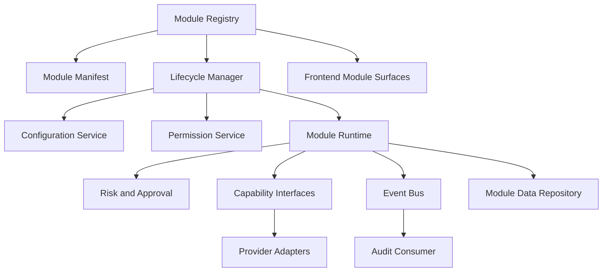
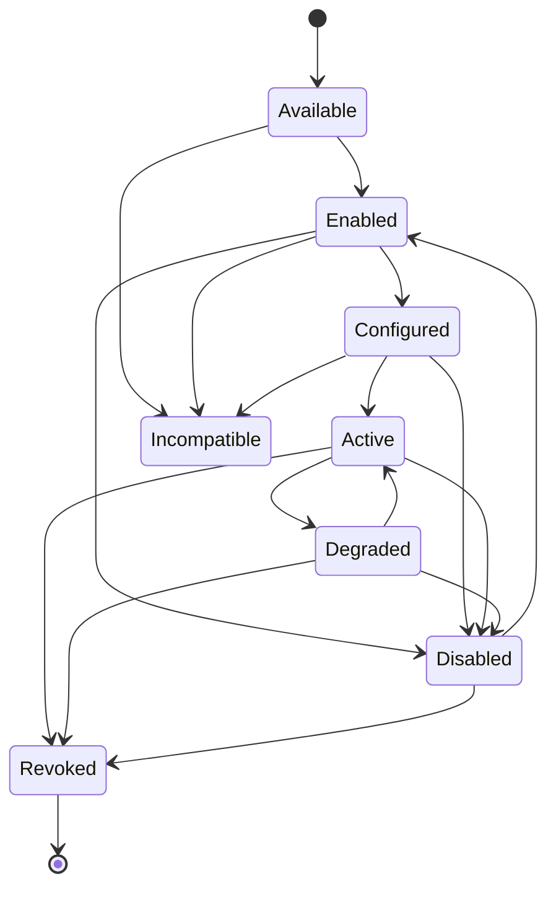
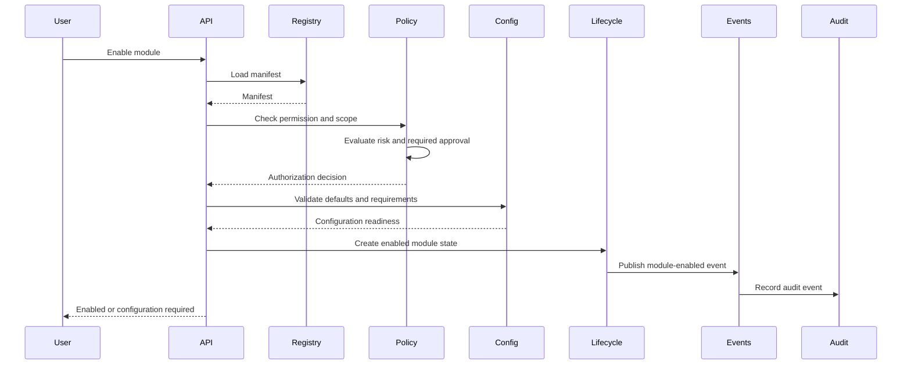
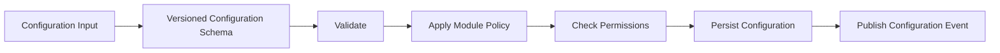
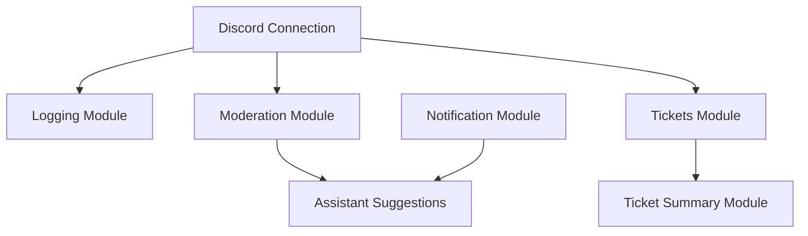
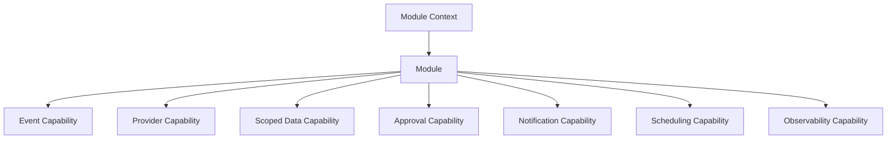
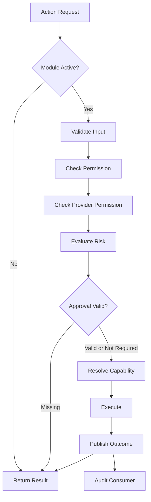
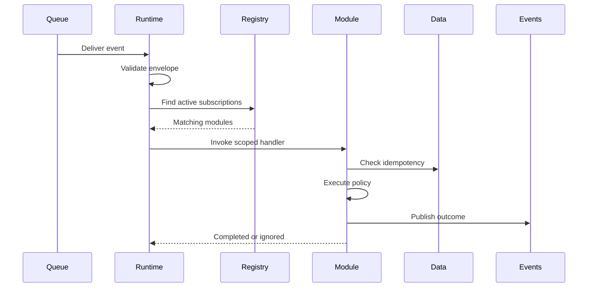
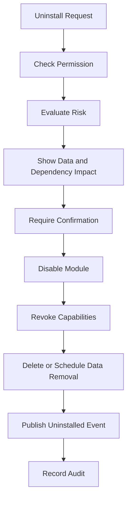
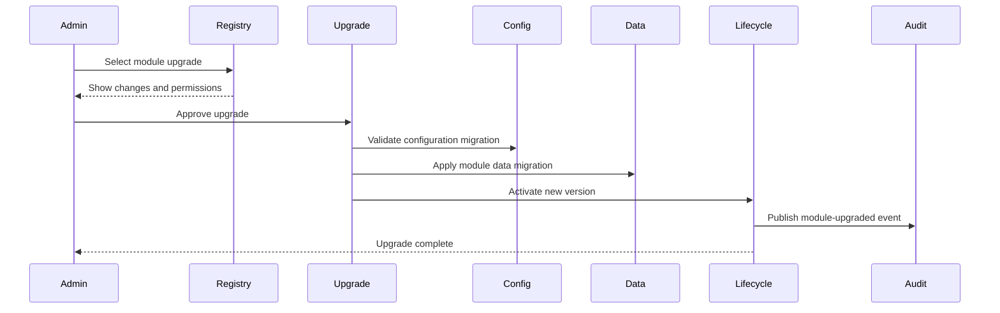

# Module Architecture

Status: Draft
Owner: SinLess Games LLC
Last Updated: 2026-07-12
Security Classification: Internal Architecture
Primary Release: `0.7 — Discord Platform Foundation`

Pending Decision Records:

- `docs/rfcs/0012-workflow-records-and-approval-primitive.md`
- `docs/rfcs/0013-provider-abstraction-and-integration-interface.md`
- `docs/rfcs/0014-module-registry-manifest-and-lifecycle.md`
- `docs/rfcs/0015-discord-permission-role-hierarchy-and-action-safety.md`
- `docs/rfcs/0016-ai-assistant-boundaries-and-mvp-memory-scope.md`

Related RFCs:

- `docs/rfcs/0002-monorepo-library-boundaries.md`
- `docs/rfcs/0003-api-versioning-and-route-strategy.md`
- `docs/rfcs/0004-error-and-result-model.md`
- `docs/rfcs/0005-entity-schema-and-contract-strategy.md`
- `docs/rfcs/0008-configuration-and-secrets-model.md`
- `docs/rfcs/0009-authentication-session-and-authorization-model.md`
- `docs/rfcs/0010-api-envelope-request-and-trace-id-propagation.md`
- `docs/rfcs/0011-event-envelope-audit-model-and-idempotency.md`

Related Architecture:

- `docs/architecture/Monorepo Architecture.md`
- `docs/architecture/Frontend Architecture.md`
- `docs/architecture/API Architecture.md`
- `docs/architecture/Service Architecture.md`
- `docs/architecture/Data Architecture.md`
- `docs/architecture/Auth Architecture.md`
- `docs/architecture/Security Architecture.md`
- `docs/architecture/Discord Architecture.md`

---

## Purpose

This document defines the module architecture for Aerealith AI.

Modules are installable or enableable units of platform behavior that add capabilities to an account, community, integration, dashboard, workflow, or provider connection.

Modules allow Aerealith to grow without turning the core platform into one enormous, tightly coupled application.

The module architecture governs:

```text
module identity
module manifests
module discovery
module compatibility
module enablement
module configuration
module activation
module disablement
module dependencies
module permissions
module actions
module events
module risk classification
module approval behavior
module audit behavior
module versioning
module upgrades
module data ownership
module provider capabilities
module testing
module observability
module lifecycle
future third-party distribution
```

The guiding rule is:

> Modules extend Aerealith through explicit contracts, capabilities, permissions, events, and lifecycle rules without bypassing platform security, trust, data, or service boundaries.

A module may extend the platform.

It may not become a private kingdom with its own auth, secrets, database access, provider client, or rules of physics.

---

## Architecture Summary

Aerealith uses a manifest-driven module architecture.

Every module defines:

```text
identity
name
version
description
publisher
status
supported providers
required capabilities
required permissions
configuration schema
actions
events consumed
events produced
dependencies
risk levels
approval rules
audit behavior
enable behavior
disable behavior
data-retention behavior
```

Modules initially exist as first-party code inside the Aerealith monorepo.

The MVP does not require:

```text
arbitrary third-party code execution
runtime-downloaded packages
untrusted plugin sandboxes
a public marketplace
one process per module
one microservice per module
```

The first-party Discord modules prove the architecture before the platform accepts third-party modules.

The initial module runtime is logical rather than independently deployed.

Modules may run inside:

```text
the combined frontend and API Worker
a persistent integration runtime
a queue consumer
a scheduled worker
```

depending on the capability they provide.

---

## Module Architecture Goals

The module architecture should provide:

```text
clear module ownership
predictable lifecycle
safe configuration
provider-neutral contracts
explicit permission requirements
explicit risk classification
approval-aware execution
consistent audit behavior
dependency validation
version compatibility
data isolation
graceful disablement
reversible enablement
observability
testability
future marketplace readiness
```

---

## Non-Goals

The initial module architecture does not require:

```text
remote untrusted code execution
user-uploaded JavaScript
dynamic npm installation
arbitrary filesystem access
unrestricted network access
one container per module
cross-module table access
modules creating their own auth systems
modules defining their own audit model
modules bypassing platform permissions
modules bypassing provider permissions
automatic AI approval
public third-party publishing
revenue sharing
full marketplace moderation
```

These capabilities require future architecture, sandboxing, security review, and dedicated RFCs.

---

## Core Principles

Aerealith modules follow these principles:

```text
Modules are explicit, not magical.
Every module has a manifest.
Every module has a lifecycle.
Modules request capabilities rather than unrestricted runtime access.
Modules do not own authentication truth.
Modules do not bypass authorization.
Modules do not bypass risk evaluation.
Modules do not approve their own actions.
Modules do not bypass audit behavior.
Modules do not directly access unrelated module data.
Modules do not construct unrestricted provider clients.
Modules do not expose persistence rows.
Module configuration is schema-validated.
Module dependencies are explicit.
Module versions are compatibility-sensitive.
Disabling a module stops behavior without deleting configuration by default.
Module data ownership and retention are documented.
AI-enabled modules must still obey platform security.
Core platform behavior must remain usable when optional modules fail.
```

---

## What Is a Module?

A module is a bounded package of platform capability.

A module may provide:

```text
commands
dashboard pages
configuration
event handlers
provider actions
scheduled tasks
workflow actions
workflow triggers
notifications
reports
moderation features
ticket features
integration features
AI-assisted suggestions
developer tools
```

A module is not automatically:

```text
a separate service
a separate deployment
a database schema
an integration provider
a workflow
a user role
```

A module may use services, providers, workflows, and persistence through approved interfaces.

---

## Module Types

Aerealith may support several module categories.

| Module Type        | Purpose                                                   |
| ------------------ | --------------------------------------------------------- |
| Platform Module    | Extends core Aerealith behavior across the platform.      |
| Integration Module | Adds behavior for one or more external providers.         |
| Community Module   | Adds features to a community or server context.           |
| Dashboard Module   | Adds dashboard surfaces and management views.             |
| Workflow Module    | Adds triggers, conditions, or actions to workflows.       |
| Developer Module   | Adds developer-facing APIs, tools, or event surfaces.     |
| Assistant Module   | Adds AI-assisted summaries, suggestions, or explanations. |
| Operations Module  | Adds diagnostics, reliability, or operational capability. |

A module may belong to more than one category, but its responsibilities should remain coherent.

---

## First-Party and Third-Party Modules

### First-Party Modules

First-party modules are maintained by Aerealith.

They may live directly in the monorepo.

Examples:

```text
Discord moderation
Discord tickets
Discord automod
Discord welcome
Discord logging
notification center
audit viewer
workflow approvals
developer webhooks
```

First-party modules still follow the same manifest, lifecycle, permission, audit, and testing rules as future third-party modules.

First-party status is not permission to skip architecture.

### Third-Party Modules

Third-party modules are future modules created outside the core Aerealith team.

Third-party module support will require:

```text
publisher identity
package signing
review process
security scanning
sandboxing or constrained execution
capability declarations
permission review
version compatibility
marketplace moderation
revocation
incident response
data-use disclosure
```

Third-party execution is not part of the MVP.

---

## High-Level Module Architecture



The registry describes what exists.

The lifecycle manager controls whether it may operate.

The runtime executes only through approved capabilities.

---

## Monorepo Placement

First-party modules should live near the runtime or feature they extend.

Recommended placement:

```text
apps/
├── services/
│   └── api/
│       └── src/features/modules/
└── integrations/
    └── discord/
        └── src/modules/first-party/
```

Shared module contracts should live in:

```text
libs/contracts/src/modules/
```

Provider-neutral module primitives should live in:

```text
libs/core/src/modules/
```

Module persistence should live in:

```text
libs/db/src/schema/modules/
libs/db/src/repositories/modules/
libs/db/src/mappers/modules/
```

Shared module API helpers may live in:

```text
libs/api/src/modules/
```

Reusable module UI belongs in:

```text
libs/ui/src/modules/
```

---

## Module Dependency Direction

Allowed by default:

```text
apps/services/* -> libs/core
apps/services/* -> libs/contracts
apps/services/* -> libs/db
apps/services/* -> libs/api
apps/services/* -> libs/observability
apps/services/* -> libs/flags

apps/integrations/* -> libs/core
apps/integrations/* -> libs/contracts
apps/integrations/* -> libs/db
apps/integrations/* -> libs/observability
apps/integrations/* -> libs/flags
```

Avoid:

```text
module A -> module B private implementation
module -> raw provider SDK outside provider boundary
module -> unrelated database tables
module -> apps/frontend internals
module -> tools/*
libs/core -> module implementation
libs/contracts -> module implementation
```

Modules should depend on declared capabilities and shared contracts.

They should not import random internal files because TypeScript allowed it.

---

## Module Registry

The module registry is the authoritative catalog of known modules.

The registry should answer:

```text
Which modules exist?
Who publishes them?
Which version is available?
Which providers are supported?
Which capabilities are required?
Which permissions are required?
Which dependencies are required?
Which configuration schema applies?
Which lifecycle state is active?
Which routes or surfaces belong to the module?
Which events does it consume and produce?
```

The registry should not execute module behavior directly.

It stores and exposes module metadata.

---

## Registry Sources

During the MVP, the registry may be built from first-party manifests compiled into the application.

Potential future registry sources include:

```text
signed module packages
approved marketplace records
self-hosted module repositories
enterprise private catalogs
```

Dynamic registry sources require additional security architecture.

---

## Module Identity

Every module requires a stable identifier.

Preferred format:

```text
publisher.module-name
```

Examples:

```text
aerealith.discord-moderation
aerealith.discord-tickets
aerealith.discord-automod
aerealith.audit-viewer
aerealith.workflow-approvals
```

Module IDs should be:

```text
lowercase
stable
globally unique within the registry
publisher-qualified
safe for URLs and configuration
```

A module ID should not change merely because the display name changes.

---

## Module Manifest

Every module must define a manifest.

The manifest is the module's contract with the platform.

Expected fields include:

```text
id
name
description
version
publisher
status
categories
supported providers
minimum platform version
required capabilities
required permissions
optional permissions
configuration schema version
actions
commands
events consumed
events produced
dependencies
conflicts
risk policy
approval policy
audit policy
enable policy
disable policy
data policy
frontend surfaces
```

---

## Manifest Example

```ts
export interface ModuleManifest {
  readonly id: string
  readonly name: string
  readonly description: string
  readonly version: string
  readonly publisher: ModulePublisher
  readonly status: ModuleStatus
  readonly categories: readonly ModuleCategory[]
  readonly supportedProviders: readonly string[]
  readonly minimumPlatformVersion: string
  readonly requiredCapabilities: readonly ModuleCapabilityRequirement[]
  readonly requiredPermissions: readonly string[]
  readonly optionalPermissions: readonly string[]
  readonly configurationSchemaVersion: number
  readonly actions: readonly ModuleActionDefinition[]
  readonly commands: readonly ModuleCommandDefinition[]
  readonly eventsConsumed: readonly ModuleEventSubscription[]
  readonly eventsProduced: readonly ModuleEventDefinition[]
  readonly dependencies: readonly ModuleDependency[]
  readonly conflicts: readonly ModuleConflict[]
  readonly riskPolicy: ModuleRiskPolicy
  readonly approvalPolicy: ModuleApprovalPolicy
  readonly auditPolicy: ModuleAuditPolicy
  readonly enablePolicy: ModuleEnablePolicy
  readonly disablePolicy: ModuleDisablePolicy
  readonly dataPolicy: ModuleDataPolicy
  readonly frontendSurfaces: readonly ModuleFrontendSurface[]
}
```

The exact schema should be finalized in RFC 0014.

---

## Manifest Validation

Manifests must be runtime-validated.

Validation should reject:

```text
duplicate module IDs
invalid versions
unknown permissions
unknown capabilities
missing configuration schemas
circular dependencies
invalid event names
unsupported providers
unknown risk levels
conflicting lifecycle rules
missing audit rules
unsafe frontend routes
```

Manifest validation should run:

```text
during development
in unit tests
in CI
at runtime startup where appropriate
during future marketplace ingestion
```

---

## Manifest Immutability

Published module versions should have immutable manifests.

Changing a manifest should require a new module version.

This protects:

```text
permission review
dependency behavior
configuration compatibility
audit expectations
upgrade planning
marketplace integrity
```

Development builds may evolve freely before publication.

Released versions should not silently change underneath installations.

---

## Module Versioning

Modules should use semantic versioning or another explicitly documented compatibility model.

Recommended direction:

```text
MAJOR = incompatible module contract or configuration change
MINOR = backward-compatible capability or feature addition
PATCH = backward-compatible fix
```

Module versions are separate from:

```text
platform version
API version
configuration schema version
event version
provider API version
```

These versions may move independently.

---

## Platform Compatibility

A module manifest should declare a minimum supported Aerealith platform version.

Future manifests may also declare:

```text
maximum supported platform version
required API capabilities
required contract versions
required provider adapter versions
```

Compatibility must be checked before enablement or upgrade.

---

## Configuration Schema Versioning

Module configuration requires an independent schema version.

Example:

```text
module version: 2.4.0
configuration schema version: 3
```

A module upgrade may not require configuration migration.

A configuration schema change may require:

```text
validation
defaulting
migration
user review
new permissions
new approval
```

---

## Module Lifecycle

The canonical module lifecycle is:

```text
Available
Enabled
Configured
Active
Degraded
Disabled
Incompatible
Revoked
```



---

## Available State

A module is `Available` when:

```text
the registry recognizes it
the module version is compatible
its publisher is trusted
its runtime is present
its required provider is available
```

Available does not mean enabled.

Available modules must not execute active behavior.

---

## Enabled State

A module is `Enabled` when an authorized actor has chosen to use it in a specific scope.

Enablement should record:

```text
module ID
module version
scope
enabled by
enabled at
requested permissions
configuration state
request ID
trace ID
```

Enabled modules may still require configuration before activation.

---

## Configured State

A module is `Configured` when:

```text
required configuration exists
configuration passes schema validation
required provider resources exist
required dependencies are enabled
required permissions are granted
```

Configured does not automatically mean active if runtime or provider health is unavailable.

---

## Active State

A module is `Active` when:

```text
it is enabled
it is configured
dependencies are healthy
required capabilities are available
required permissions are present
the runtime is operational
the module is not suspended or revoked
```

Only active modules may process normal events and actions.

---

## Degraded State

A module is `Degraded` when it remains enabled but cannot provide all expected behavior.

Examples:

```text
provider permission removed
configured channel deleted
dependency unavailable
runtime health failure
rate limits
provider outage
required feature disabled
configuration drift
AI provider unavailable for assistant-only behavior
```

A degraded module should:

```text
stop unsafe behavior
retain configuration
surface a clear reason
expose remediation guidance
emit observability data
recover automatically when safe
```

---

## Disabled State

A module is `Disabled` when its behavior has been intentionally stopped.

Disabling should:

```text
stop event consumption where practical
stop commands and provider actions
stop scheduled work
pause module-triggered workflows
preserve configuration by default
preserve required operational and audit history
revoke module runtime capabilities
publish a module-disabled event
```

Disablement is reversible.

Deletion is separate.

---

## Incompatible State

A module is `Incompatible` when it cannot run safely because of:

```text
platform version
provider version
contract version
missing runtime capability
unsupported configuration version
dependency conflict
```

Incompatible modules should not execute.

The system should explain the incompatibility.

---

## Revoked State

A module may be revoked because of:

```text
security incident
publisher revocation
malicious behavior
credential compromise
platform policy violation
module signing failure
critical incompatibility
administrator action
```

Revoked modules must stop executing.

Future marketplace infrastructure should support emergency revocation.

---

## Module Enablement Flow



---

## Enablement Requirements

Before enabling a module, Aerealith should verify:

```text
module exists
module version is compatible
target scope exists
actor may manage modules in that scope
required provider connection exists
required permissions are understood
required dependencies are available
conflicts are absent
required approval is present
configuration defaults are safe
```

Enablement should not silently grant new permissions.

---

## Module Configuration

Module configuration must be:

```text
schema-validated
scope-bound
versioned
permission-aware
auditable when meaningful
exportable where appropriate
deletable according to policy
```

Configuration may contain:

```text
channel selections
role selections
feature toggles
thresholds
message templates
retention settings
workflow references
notification preferences
provider resource references
```

---

## Configuration Ownership

Configuration belongs to the scope in which the module is enabled.

Potential scopes:

```text
user
account
organization
community
server
integration connection
developer application
```

Configuration in one scope must not automatically affect another scope.

---

## Configuration Defaults

Defaults should be safe.

Safe defaults should prefer:

```text
disabled destructive behavior
minimal provider permissions
manual approval
bounded limits
short retention
private visibility
no AI autonomy
no public posting
no automatic deletion
```

A module must not use an unsafe default merely because configuration would be easier.

---

## Configuration Validation Flow



---

## Configuration Migration

When a configuration schema changes, the module must define migration behavior.

Possible strategies:

```text
automatic backward-compatible migration
automatic migration requiring later review
manual migration with user confirmation
disable until reconfigured
retain old version temporarily
```

Destructive configuration migration requires explicit review.

A failed migration must not silently discard configuration.

---

## Module Dependencies

Modules may depend on:

```text
another module
a provider connection
a service capability
a platform feature
a contract version
a runtime capability
```

Dependencies must be explicit in the manifest.

Examples:

```text
ticket summaries depend on tickets
assistant moderation suggestions depend on moderation
Discord automod depends on Discord connection
workflow notifications depend on notifications
```

---

## Dependency Rules

Dependency behavior should define:

```text
required or optional
minimum version
maximum version if needed
scope relationship
enablement order
disable behavior
failure behavior
upgrade behavior
```

A module must not discover hidden dependencies only after failing in production.

---

## Dependency Graph



Dependency graphs must remain acyclic.

Circular dependencies should fail manifest validation.

---

## Dependency Failure

When a required dependency fails or is disabled, the dependent module should:

```text
enter degraded or disabled state
stop unsafe actions
retain configuration
explain the dependency failure
emit health information
recover when the dependency returns
```

A module should not continue pretending it is healthy.

---

## Disablement and Dependencies

When disabling a module with dependents, Aerealith should:

```text
show affected modules
require confirmation when impact is meaningful
disable or degrade dependent modules according to policy
preserve configurations
publish lifecycle events
record audit events
```

Do not silently break dependent behavior.

---

## Module Conflicts

A manifest may declare conflicts.

Conflicts may occur when modules:

```text
own the same command
perform competing moderation behavior
write incompatible provider configuration
require mutually exclusive provider permissions
use conflicting workflow triggers
```

Conflict handling may:

```text
block enablement
require explicit priority
require configuration changes
allow coexistence with restricted features
```

---

## Module Capabilities

Modules should receive narrow capability interfaces.

Potential capabilities include:

```text
send notification
publish event
query module configuration
execute approved provider action
read scoped domain data
write module-owned data
schedule scoped work
register workflow trigger
register workflow action
request approval
write operational metrics
```

Modules should not receive a general-purpose global container.

---

## Capability-Based Runtime



Capabilities should be granted according to the manifest and current lifecycle state.

---

## Module Context

A module execution context may include:

```text
module ID
module version
installation ID
scope
actor
request ID
trace ID
configuration
permissions
provider connection reference
risk decision
approval reference
feature flags
runtime environment
```

The context must not include:

```text
raw provider credentials
unrestricted database client
unrestricted provider SDK client
all account secrets
unrelated module state
```

---

## Provider Capabilities

Integration modules should operate through provider capability interfaces.

Examples:

```text
send message
delete message
timeout member
create role
read channel metadata
create ticket channel
disconnect integration
```

Modules should not receive a raw provider client when a narrower capability can express the required behavior.

---

## Provider-Neutral Module Design

Provider-neutral modules should describe intent rather than provider implementation.

Prefer:

```text
SendCommunityMessage
ModerateCommunityMember
CreateSupportConversation
AssignCommunityRole
```

Avoid outside provider boundaries:

```text
DiscordRESTPostChannelMessage
DiscordGuildMemberTimeout
DiscordCreateGuildRole
```

Provider-specific modules may use provider terminology internally.

Shared platform contracts should remain normalized.

---

## Module Actions

A module action is a named operation a module can perform.

An action definition should include:

```text
action ID
display name
description
input schema
output schema
required permissions
required capabilities
risk level
approval policy
audit policy
idempotency requirements
timeout
retry policy
```

---

## Action Definition Example

```ts
export interface ModuleActionDefinition {
  readonly id: string
  readonly name: string
  readonly description: string
  readonly inputSchema: string
  readonly outputSchema: string
  readonly requiredPermissions: readonly string[]
  readonly requiredCapabilities: readonly string[]
  readonly riskLevel: RiskLevel
  readonly approvalRequired: boolean
  readonly auditRequired: boolean
  readonly idempotencyRequired: boolean
}
```

---

## Action Execution Flow



---

## Module Commands

Modules may expose commands through:

```text
Discord interactions
dashboard actions
REST APIs
tRPC procedures
GraphQL mutations
developer API operations
```

Commands should map to module actions or application services.

Transport-specific commands must not duplicate business rules.

---

## Module Events

Modules may consume and produce events.

A manifest should declare event subscriptions.

Example:

```text
consumes:
  community.member.joined
  community.message.created

produces:
  moderation.case.created
  ticket.created
  module.action.completed
```

Modules should consume normalized events rather than raw provider SDK objects whenever possible.

---

## Event Subscription Rules

Event subscriptions should define:

```text
event type
supported event versions
scope requirements
filter behavior
idempotency key
ordering requirements
failure behavior
retry behavior
```

A module should ignore unknown future event fields safely.

It should reject incompatible event versions clearly.

---

## Event Delivery

Event delivery should be treated as at least once.

Module event handlers must be idempotent.

Duplicate events must not duplicate:

```text
moderation actions
role creation
ticket creation
workflow execution
notifications without intent
audit records
```

---

## Event Handler Flow



---

## Module Permissions

Module permissions are Aerealith permissions.

Examples:

```text
module.read
module.enable
module.disable
module.configure
module.delete-data
module.upgrade
module.manage-permissions
```

Feature-specific permissions may include:

```text
moderation.warn
moderation.timeout
ticket.manage
automod.configure
notification.manage
workflow.trigger
```

Modules must not invent undocumented permission strings at runtime.

---

## Provider Permissions

A module may also require provider permissions.

Examples for Discord:

```text
Manage Messages
Moderate Members
Ban Members
Manage Roles
Manage Channels
View Audit Log
```

The manifest should declare provider permission requirements in a normalized, explainable form.

Provider permission checks occur before provider actions.

---

## Permission Changes

If an upgrade requires new permissions:

```text
do not grant them silently
show the new permissions
explain why they are needed
show affected features
require authorized approval
revalidate provider authorization
record the change
```

The module may remain degraded until new permissions are granted.

---

## Risk Classification

Every meaningful module action requires a risk classification.

| Risk     | Examples                                                 | Default Behavior                                      |
| -------- | -------------------------------------------------------- | ----------------------------------------------------- |
| Low      | Read-only summaries, formatting, non-destructive views.  | Execute when authorized.                              |
| Medium   | Posting, updating settings, starting bounded workflows.  | Verify according to policy.                           |
| High     | Moderation, deletion, permission changes.                | Require explicit approval.                            |
| Critical | Billing, credentials, security controls, infrastructure. | Require step-up authentication and elevated approval. |

A module may not downgrade platform-defined risk.

A future policy may raise the risk of an action based on context.

---

## Approval Integration

Modules use the shared Aerealith approval primitive.

An approval should bind to:

```text
module
module version
action
actor
target
scope
input fingerprint
risk level
expiration
```

An approval for one module action must not authorize another.

An approval must be rejected if:

```text
the target changed
the payload changed
the module version changed materially
the approval expired
the actor lost permission
the module was disabled
the provider permission changed
the action already executed
```

---

## Audit Policy

Every module manifest should declare its audit policy.

Audit behavior may be:

```text
required
conditional
not required
```

Examples requiring audit:

```text
module enabled
module disabled
configuration changed
provider permission changed
moderation action executed
ticket closed
workflow triggered
data deleted
integration disconnected
module upgraded
```

Read-only rendering usually does not require a user-facing audit event.

---

## Audit Event Fields

Module audit events may include:

```text
module ID
module version
installation ID
action
actor
target
scope
risk level
result
request ID
trace ID
approval ID
provider action ID
timestamp
metadata
```

Audit events should not include secrets or unnecessary private content.

---

## Data Ownership

Modules may own module-specific data.

Examples:

```text
configuration
module lifecycle state
module records
module event receipts
module action history
module-specific operational data
```

Module-owned data must be:

```text
scope-bound
documented
classified
retention-aware
exportable where appropriate
deletable according to policy
separate from unrelated module data
```

---

## Shared Domain Data

Modules may read or update shared domain data only through approved service or repository interfaces.

A module should not directly mutate:

```text
identity tables
session tables
unrelated module tables
integration credential tables
audit records
permission records
billing records
```

Cross-domain writes must go through the owning service.

---

## Module Persistence Records

Potential records include:

```text
ModuleDefinition
ModuleInstallation
ModuleConfiguration
ModuleDependencyState
ModuleHealthState
ModuleEventReceipt
ModuleActionReceipt
ModuleUpgradeRecord
ModuleDataRetentionPolicy
```

---

## Suggested Tables

Potential database tables:

```text
module_definitions
module_installations
module_configurations
module_dependency_states
module_health_states
module_event_receipts
module_action_receipts
module_upgrade_records
```

First-party manifests may remain code-owned while installation state remains database-owned.

---

## Module Installation Record

A module installation record may contain:

```text
installation ID
module ID
module version
scope type
scope ID
status
enabled by
enabled at
configured at
activated at
degraded at
disabled at
revoked at
configuration version
health state
```

---

## Module Configuration Record

A module configuration record may contain:

```text
configuration ID
installation ID
schema version
configuration
created by
updated by
created at
updated at
```

Configuration stored as JSON must still use a versioned runtime schema.

---

## Module Data Retention

Every module should document:

```text
what data it stores
why it stores it
which scope owns it
how long it retains it
how it exports it
how it deletes it
what remains after disablement
what remains after uninstall
what remains in audit records
```

Disablement should not silently delete operational history.

Uninstallation or explicit data deletion may remove module-owned data according to policy.

---

## Disablement Versus Uninstallation

Disablement and uninstallation are different.

### Disablement

```text
stops behavior
preserves configuration
preserves installation record
preserves required history
allows re-enable
```

### Uninstallation

```text
removes the module from the scope
stops behavior
removes or schedules removal of module-owned data
preserves required audit records
may require confirmation
may require export opportunity
```

---

## Module Deletion Flow



---

## Module Upgrade Architecture

Module upgrades should be explicit.

An upgrade process should check:

```text
new manifest
platform compatibility
dependency compatibility
new permissions
configuration migration
event compatibility
data migration
risk changes
audit changes
provider capability changes
rollback capability
```

---

## Upgrade Flow



---

## Upgrade Safety

An upgrade requiring new high-risk capability should not auto-activate.

The module may enter:

```text
Enabled
Configured
Degraded
```

until the new permission or approval requirement is satisfied.

---

## Rollback

Module upgrade rollback should be possible where practical.

Rollback planning should consider:

```text
configuration schema
module-owned data
event versions
provider resource changes
new permissions
dependency versions
irreversible actions
```

A rollback should not silently discard data created under the newer version.

---

## Module Health

Each enabled module should expose health information.

Potential states:

```text
Healthy
Degraded
Disabled
Incompatible
Revoked
Unknown
```

Health may consider:

```text
runtime availability
configuration validity
dependency health
provider connection health
provider permissions
queue health
recent failures
scheduled task state
```

---

## Health Summary

A module health response may include:

```text
module ID
module version
status
last checked at
issues
missing permissions
invalid configuration fields
failed dependencies
recommended remediation
```

Health responses should remain safe for the caller's permission level.

---

## Observability

Module observability should answer:

```text
Which modules are active?
Which modules are degraded?
Which actions are failing?
Which event handlers are failing?
Which dependencies are unavailable?
Which modules are producing excessive retries?
Which permissions are missing?
Which versions are installed?
Which upgrades are failing?
```

---

## Metrics

Useful module metrics include:

```text
module enablement count
module disablement count
active installation count
degraded installation count
action count
action failure count
action duration
event consumption count
event failure count
event retry count
configuration validation failure count
dependency failure count
approval rejection count
provider error count
upgrade success count
upgrade failure count
```

---

## Logs

Module logs should include:

```text
module ID
module version
installation ID
scope when safe
operation
event type
action
result
error code
request ID
trace ID
duration
```

Logs should not include:

```text
provider credentials
session tokens
API key secrets
raw configuration secrets
unnecessary user content
private module data without a defined purpose
```

---

## Tracing

Trace context should propagate through:

```text
frontend
API
module lifecycle
module action
provider capability
event publication
queue consumer
audit consumer
notification consumer
```

A module action should be traceable from request to final result.

---

## Module Failure Behavior

Modules should fail independently where possible.

A module failure should not crash the entire platform.

Failure behavior may include:

```text
return safe error
enter degraded state
pause event consumption
disable scheduled work
preserve failed event for retry
emit alert
stop provider writes
retain configuration
```

Core authentication, permissions, and platform navigation should remain operational when an optional module fails.

---

## Graceful Degradation

Examples:

| Failure                       | Required Behavior                                              |
| ----------------------------- | -------------------------------------------------------------- |
| AI provider unavailable       | Disable AI-only behavior; keep non-AI module behavior working. |
| Provider permission removed   | Block affected actions and explain remediation.                |
| Required dependency disabled  | Degrade or disable the dependent module.                       |
| Invalid configuration         | Stop unsafe behavior and require reconfiguration.              |
| Queue unavailable             | Stop event-driven actions that cannot be processed safely.     |
| Audit publication unavailable | Follow the platform's documented safe-failure policy.          |
| Module runtime unavailable    | Mark the module degraded and alert operations.                 |

---

## AI-Enabled Modules

AI-enabled modules may:

```text
summarize
explain
classify
suggest
draft
prepare proposed actions
```

They must not:

```text
grant permissions
approve themselves
bypass risk evaluation
bypass approval
bypass provider permissions
silently execute destructive actions
silently retain private context
use private data for training without consent
```

---

## AI Module Action Flow

```text
Receive Context
→ Minimize Data
→ Generate Suggestion
→ Validate Structured Output
→ Check Permissions
→ Evaluate Risk
→ Request Approval
→ Execute Through Capability
→ Audit
→ Explain Outcome
```

AI output is input to the platform.

It is not authority.

---

## AI Independence

A module should declare whether AI is:

```text
required
optional
not used
```

Core modules should prefer AI-optional behavior.

When AI is unavailable:

```text
manual operation remains available
non-AI workflows continue
permissions remain enforced
audit remains operational
provider actions remain controlled
```

---

## Workflow Integration

Modules may register workflow primitives.

Potential workflow extensions include:

```text
triggers
conditions
actions
approval requirements
notifications
```

Examples:

```text
Discord member joins
ticket created
moderation case opened
module becomes degraded
integration disconnects
```

Module workflow primitives should use versioned contracts.

---

## Workflow Action Rules

Workflow actions registered by modules must define:

```text
input schema
output schema
required permission
risk level
approval requirement
idempotency behavior
timeout
retry behavior
audit behavior
```

Workflow execution must not bypass normal module action policy.

---

## Frontend Module Surfaces

Modules may contribute frontend surfaces.

Potential surfaces:

```text
dashboard cards
settings pages
configuration forms
status panels
activity views
navigation items
developer documentation
```

The MVP should not dynamically execute arbitrary remote frontend code.

First-party frontend module surfaces should be statically compiled.

---

## Frontend Registration

A first-party frontend registry may describe:

```text
route
navigation label
icon
required permission
required module state
layout
lazy-loaded component
```

Example:

```ts
export interface ModuleFrontendSurface {
  readonly id: string
  readonly route: string
  readonly label: string
  readonly requiredPermission?: string
  readonly requiredModuleState: ModuleStatus
}
```

---

## Frontend Security

Frontend module surfaces are presentation only.

They must not define authoritative:

```text
permissions
risk level
approval validity
provider authority
module lifecycle truth
```

The backend remains authoritative.

---

## Module API Routes

Potential module routes include:

```text
GET /api/V1/modules
GET /api/V1/modules/{moduleId}
GET /api/V1/modules/installations
GET /api/V1/modules/installations/{installationId}
POST /api/V1/modules/{moduleId}/enable
POST /api/V1/modules/installations/{installationId}/disable
POST /api/V1/modules/installations/{installationId}/activate
DELETE /api/V1/modules/installations/{installationId}
GET /api/V1/modules/installations/{installationId}/health
GET /api/V1/modules/installations/{installationId}/configuration
PATCH /api/V1/modules/installations/{installationId}/configuration
POST /api/V1/modules/installations/{installationId}/upgrade
```

Provider-scoped routes may use provider context.

Example:

```text
GET /api/V1/integrations/discord/servers/{serverId}/modules
POST /api/V1/integrations/discord/servers/{serverId}/modules/{moduleId}/enable
```

---

## Module API Contracts

Potential contracts include:

```text
ModuleDefinitionResponse
ModuleInstallationResponse
ModuleHealthResponse
ModuleConfigurationResponse
EnableModuleRequest
DisableModuleRequest
UpdateModuleConfigurationRequest
UpgradeModuleRequest
UninstallModuleRequest
```

Contracts should live under:

```text
libs/contracts/src/api/V1/modules/
```

---

## Module Service Boundary

The module service owns:

```text
registry queries
module installation records
lifecycle transitions
dependency checks
configuration validation
health aggregation
upgrade coordination
uninstallation coordination
```

The module service does not automatically execute every module action.

Module actions are executed by the runtime that owns the required capability.

---

## Runtime Resolution

The platform should resolve where an action executes.

Potential runtimes:

```text
API Worker
persistent Discord runtime
queue consumer
scheduled worker
future isolated module runtime
```

A manifest or module registration may declare supported execution targets.

---

## Execution Target Example

```ts
export type ModuleExecutionTarget =
  'api' | 'integration-runtime' | 'queue-consumer' | 'scheduled-worker'
```

The exact runtime model should remain internal and not leak into public module contracts unless needed.

---

## Module Security

Module security follows:

```text
docs/architecture/Security Architecture.md
```

High-priority threats include:

```text
permission escalation
cross-scope access
module dependency confusion
malicious configuration
provider capability abuse
approval bypass
event replay
configuration injection
secret leakage
unsafe upgrade
publisher compromise
untrusted module execution
AI prompt injection
```

---

## Module Trust Model

Every meaningful module action should remain:

```text
authenticated
authorized
scope-bound
risk-evaluated
approved when required
auditable
revocable
explainable
```

Module enablement itself may be a meaningful action requiring audit.

---

## Future Third-Party Security

Before third-party modules are permitted, Aerealith must define:

```text
package format
publisher verification
module signing
signature validation
sandbox model
network policy
storage policy
secret access policy
capability grants
review process
malware scanning
update policy
revocation
incident response
marketplace moderation
```

Third-party modules must never receive unrestricted platform access.

---

## Sandboxing Direction

Future third-party modules may require:

```text
isolated process
WebAssembly sandbox
restricted worker
dedicated container
capability RPC boundary
network allowlist
resource quotas
execution timeout
read-only package filesystem
scoped storage
```

The MVP should not pretend ordinary in-process TypeScript is a secure sandbox.

---

## Module Signing Direction

Future distributed modules should be signed.

Signing may prove:

```text
publisher identity
package integrity
version integrity
manifest integrity
```

Signature validation does not prove the module is safe.

It proves who signed it and that it was not modified.

---

## Marketplace Direction

A future marketplace may provide:

```text
module discovery
publisher profiles
versions
compatibility
permissions
reviews
security status
installation counts
pricing later
revocation notices
```

Marketplace availability is not part of the MVP.

The module architecture should remain ready for it without prematurely building it.

---

## Module Governance

Module governance should define:

```text
who may publish
who may approve first-party modules
who may change permissions
who may revoke modules
how breaking changes are reviewed
how deprecations are communicated
how security incidents are handled
```

First-party module manifests should require code review.

Security-sensitive permission changes should require additional review.

---

## Deprecation

A module version may become deprecated.

Deprecation should include:

```text
reason
replacement
migration path
support end date
security status
upgrade guidance
```

Deprecated modules may remain operational temporarily.

Revoked modules must stop executing.

---

## Module Documentation

Every module should document:

```text
purpose
publisher
version
supported scopes
supported providers
required permissions
optional permissions
configuration
actions
events
dependencies
risk levels
approval behavior
audit behavior
data stored
retention
disable behavior
uninstall behavior
failure behavior
troubleshooting
```

---

## Module README

Recommended first-party module README:

```text
apps/integrations/discord/src/modules/first-party/example/README.md
```

The README should explain user-facing and developer-facing behavior.

The manifest remains the machine-readable contract.

---

## Documentation Routes

Public or developer documentation may appear under:

```text
/documentation/modules
/documentation/modules/{moduleId}
```

Internal architecture documentation may remain under:

```text
docs/modules/
docs/architecture/
```

---

## Testing Strategy

Module testing should include:

```text
manifest validation tests
registry tests
lifecycle tests
configuration schema tests
configuration migration tests
dependency tests
conflict tests
permission tests
risk tests
approval tests
audit tests
action tests
event-consumer tests
idempotency tests
provider-capability tests
disablement tests
uninstallation tests
upgrade tests
health tests
observability tests
AI-disabled tests
integration tests
end-to-end tests
```

Coverage requirement:

```text
80% statements
80% branches
80% functions
80% lines
```

---

## Critical Module Tests

Tests must prove:

```text
an unavailable module cannot execute
a disabled module cannot execute
an incompatible module cannot execute
invalid configuration cannot activate
missing dependencies prevent activation
circular dependencies are rejected
missing permissions block actions
provider permission failures block provider actions
high-risk actions require approval
approval cannot be reused for another action
duplicate events do not duplicate outcomes
module configuration survives disable and re-enable
uninstall removes or schedules removal of module-owned data
audit-required actions emit audit events
AI-enabled modules work safely when AI is disabled
one module cannot access unrelated module data
modules cannot construct unrestricted provider clients
```

---

## Lifecycle Test Matrix

| Transition                 | Required Test                                  |
| -------------------------- | ---------------------------------------------- |
| Available → Enabled        | Permission and compatibility checks pass.      |
| Enabled → Configured       | Configuration validates.                       |
| Configured → Active        | Dependencies and capabilities are healthy.     |
| Active → Degraded          | Failure is detected and unsafe behavior stops. |
| Degraded → Active          | Recovery is safe and observable.               |
| Active → Disabled          | New actions stop and configuration remains.    |
| Disabled → Enabled         | Configuration remains available.               |
| Any Active State → Revoked | Execution stops immediately.                   |

---

## Adversarial Testing

Adversarial tests should include:

```text
forged module ID
forged installation scope
configuration schema bypass
dependency cycle
approval replay
event replay
provider-capability escalation
cross-module data access
cross-account module access
manifest tampering
version downgrade
unsafe upgrade
disabled-module action request
revoked-module action request
malicious AI-generated action arguments
```

---

## Module Test Adapter

Modules should be testable through capability mocks.

Example test capabilities:

```text
FakeEventPublisher
FakeProviderCapability
FakeNotificationCapability
FakeApprovalService
InMemoryModuleRepository
TestModuleContext
```

Mocks should preserve permission, risk, and lifecycle behavior.

They should not simply return success for every operation.

---

## First-Party Module Structure

Recommended first-party module structure:

```text
apps/integrations/discord/src/modules/first-party/example/
├── application/
│   ├── example.actions.ts
│   ├── example.commands.ts
│   └── example.handlers.ts
├── configuration/
│   ├── example.configuration.schema.ts
│   ├── example.configuration.defaults.ts
│   └── example.configuration.migrations.ts
├── events/
│   ├── example.event-handlers.ts
│   └── example.events.ts
├── policies/
│   ├── example.permission.policy.ts
│   ├── example.risk.policy.ts
│   └── example.audit.policy.ts
├── ui/
│   └── example.frontend-surfaces.ts
├── manifest.ts
├── example.module.ts
├── example.module.spec.ts
├── README.md
└── index.ts
```

Not every module needs every folder.

Create only the structure the module genuinely uses.

---

## Shared Module Library Structure

Potential shared structure:

```text
libs/core/src/modules/
├── module-status.ts
├── module-category.ts
├── module-context.ts
├── module-capability.ts
├── module-errors.ts
└── index.ts
```

```text
libs/contracts/src/modules/
├── manifest/
├── lifecycle/
├── configuration/
├── actions/
├── events/
├── health/
└── index.ts
```

```text
libs/db/src/
├── schema/modules/
├── mappers/modules/
├── queries/modules/
└── repositories/modules/
```

---

## Module Runtime Structure

Potential module service structure:

```text
apps/services/api/src/features/modules/
├── application/
│   ├── list-modules.service.ts
│   ├── enable-module.service.ts
│   ├── disable-module.service.ts
│   ├── configure-module.service.ts
│   ├── uninstall-module.service.ts
│   └── upgrade-module.service.ts
├── domain/
│   ├── module-lifecycle.policy.ts
│   ├── module-dependency.policy.ts
│   ├── module-compatibility.policy.ts
│   └── module-permission.policy.ts
├── registry/
│   ├── module.registry.ts
│   ├── module.manifest-loader.ts
│   └── module.manifest-validator.ts
├── transport/
│   ├── module.routes.ts
│   ├── module.handlers.ts
│   └── module.validation.ts
├── infrastructure/
│   └── module.dependencies.ts
└── index.ts
```

---

## Module Error Codes

Potential error codes include:

```text
MODULE_NOT_FOUND
MODULE_VERSION_NOT_FOUND
MODULE_INCOMPATIBLE
MODULE_ALREADY_ENABLED
MODULE_NOT_ENABLED
MODULE_NOT_CONFIGURED
MODULE_NOT_ACTIVE
MODULE_DISABLED
MODULE_DEGRADED
MODULE_REVOKED
MODULE_CONFIGURATION_INVALID
MODULE_CONFIGURATION_MIGRATION_FAILED
MODULE_DEPENDENCY_MISSING
MODULE_DEPENDENCY_INCOMPATIBLE
MODULE_DEPENDENCY_CYCLE
MODULE_CONFLICT
MODULE_PERMISSION_MISSING
MODULE_PROVIDER_PERMISSION_MISSING
MODULE_APPROVAL_REQUIRED
MODULE_ACTION_NOT_FOUND
MODULE_ACTION_FAILED
MODULE_EVENT_VERSION_UNSUPPORTED
MODULE_UPGRADE_FAILED
MODULE_UNINSTALL_FAILED
```

Public error codes become compatibility-sensitive.

---

## Release Scope

The module architecture is primarily delivered through:

```text
0.2 Core Domain and Data Platform
0.5 API and Service Platform
0.6 Developer Portal and Integrations
0.7 Discord Platform Foundation
0.8 Moderation, Tickets and Community Operations
0.9 Observability and Reliability
```

### Release 0.2

Should establish:

```text
module identifiers
module domain primitives
module contracts
repository patterns
configuration schema foundations
```

### Release 0.5

Should establish:

```text
module API routes
event envelope
approval primitive
audit behavior
idempotent action foundations
```

### Release 0.6

Should establish:

```text
provider abstraction
developer documentation
integration health
module setup documentation
```

### Release 0.7

Should establish:

```text
module registry
manifest validation
module lifecycle
dependencies
Discord first-party modules
permission requirements
role-hierarchy integration
enable, configure, disable, and re-enable behavior
```

### Release 0.8

Should establish:

```text
moderation modules
ticket modules
automod modules
assistant suggest-and-approve behavior
community data controls
```

### Release 0.9

Should establish:

```text
module telemetry
module health
alerts
upgrade and rollback rehearsal
failure and burst testing
```

---

## Implementation Sequence

Recommended implementation order:

```text
1. Accept RFC 0014.
2. Define module IDs and naming rules.
3. Define the manifest schema.
4. Define lifecycle states and transitions.
5. Define module installation records.
6. Define configuration schema conventions.
7. Define dependency and conflict rules.
8. Define capability interfaces.
9. Define module permission rules.
10. Define module action contracts.
11. Define module event subscription contracts.
12. Define module risk and approval behavior.
13. Define module audit behavior.
14. Build the first-party registry.
15. Build manifest validation.
16. Build enablement and configuration APIs.
17. Build disable and re-enable behavior.
18. Build module health evaluation.
19. Implement the first Discord modules.
20. Add idempotent event handling.
21. Add module upgrade support.
22. Add module uninstallation and data-deletion behavior.
23. Add frontend module surfaces.
24. Add observability and alerts.
25. Run lifecycle, adversarial, and AI-disabled tests.
```

---

## Required Architecture Decisions

Before the module system is considered stable, Aerealith must finalize:

```text
module ID format
manifest schema
module status values
module versioning rules
configuration schema versioning
dependency behavior
conflict behavior
capability interface model
action definition format
event subscription format
module data ownership
disablement behavior
uninstallation behavior
upgrade and rollback behavior
first-party module list
future package format
future signing model
future sandbox model
future marketplace governance
```

---

## Module Architecture Anti-Patterns

Avoid:

```text
one microservice per module
modules constructing unrestricted provider clients
modules importing unrelated module internals
modules directly writing unrelated domain tables
modules defining their own authentication
modules trusting frontend permission state
modules bypassing approval
modules writing audit rows directly
modules using raw provider payloads as platform contracts
modules executing while disabled
modules silently requesting new permissions
modules deleting configuration on disable
modules hiding dependency failures
modules using unversioned configuration
modules accepting arbitrary JSON without validation
modules treating AI output as authority
runtime installation of untrusted npm packages
calling ordinary in-process TypeScript a sandbox
```

---

## Relationship to Discord Architecture

Discord is the first provider surface used to prove the module architecture.

Discord modules must follow:

```text
manifest rules
lifecycle rules
dependency rules
configuration rules
dual permission checks
role-hierarchy checks
risk classification
approval rules
audit rules
provider capability boundaries
```

Discord-specific logic remains inside the Discord runtime.

The module system itself remains provider-neutral.

---

## Relationship to Service Architecture

The module service owns registry and lifecycle behavior.

Application services remain responsible for:

```text
authorization
risk
approval
domain orchestration
event publication
```

Modules call service capabilities.

They should not duplicate core platform services.

---

## Relationship to API Architecture

Module APIs use:

```text
/api/V1/
```

Module responses use required success and error envelopes.

Public module contracts remain versioned and persistence-neutral.

---

## Relationship to Data Architecture

Module persistence remains in:

```text
libs/db
```

Module configuration must be schema-validated.

Persistence rows must not become public module contracts.

Module data ownership, retention, export, and deletion must be documented.

---

## Relationship to Auth Architecture

The module architecture does not own authentication.

The module service uses current backend auth context.

Module actions require:

```text
authenticated identity where required
current scope
required permission
resource ownership where applicable
risk classification
approval where required
```

Frontend module visibility is not authorization.

---

## Relationship to Security Architecture

Modules are security boundaries.

They receive only declared capabilities.

They must not receive unrestricted:

```text
secrets
database clients
provider clients
network access
filesystem access
execution privileges
```

Future third-party modules require a real sandbox and package-security model.

---

## Relationship to Trust Model

Every meaningful module behavior should be:

```text
understandable
permission-scoped
approved when needed
auditable
reversible where practical
revocable
aligned with user intent
```

A user should be able to understand:

```text
what a module can do
what data it stores
which permissions it requires
how to disable it
how to remove it
what remains after removal
```

---

## Relationship to AI

AI-enabled modules remain subordinate to platform controls.

AI may propose module actions.

AI may not:

```text
enable modules
grant permissions
approve actions
change risk levels
execute destructive behavior
retain private data without policy
```

unless the exact operation is independently authorized and approved through normal platform behavior.

---

## Relationship to Future Marketplace

The manifest, capability, lifecycle, permission, data, upgrade, and observability models should prepare Aerealith for a future marketplace.

The MVP should prove those foundations using first-party modules.

It should not prematurely build public third-party execution before the security model exists.

---

## Success Criteria

The module architecture is successful when:

```text
every module has a validated manifest
module identities are stable
module versions are explicit
configuration is schema-validated
module lifecycle is predictable
disabled modules cannot execute
configuration survives disable and re-enable
dependencies are explicit
dependency cycles are rejected
module conflicts are detected
permissions are declared and enforced
provider permissions are checked
high-risk actions require approval
module actions emit required events
audit-required actions produce audit records
event consumers are idempotent
module data remains scoped
modules cannot access unrelated data
modules cannot access unrestricted provider clients
module failures degrade safely
AI-enabled modules work safely without AI
first-party Discord modules prove the architecture
third-party execution remains blocked until sandboxing exists
80% coverage is enforced
```

---

## Final Standard

Aerealith modules should make the platform expandable without making it ungovernable.

The standard is:

> Every Aerealith module is identified by a stable manifest, installed into an explicit scope, governed by a predictable lifecycle, configured through versioned schemas, restricted to declared capabilities, subject to platform and provider permissions, risk-evaluated, approval-aware, auditable, observable, independently disableable, and unable to bypass Aerealith's service, data, auth, security, or trust architecture.
