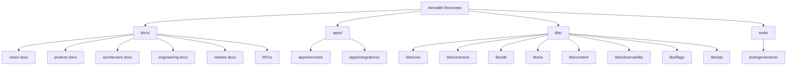
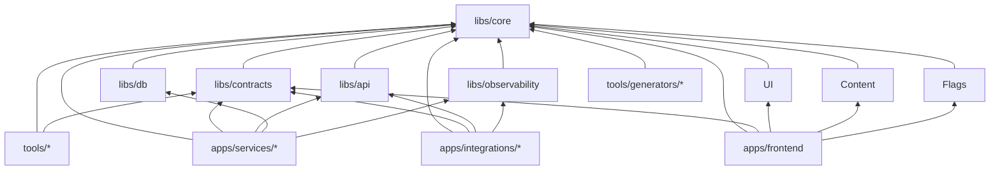
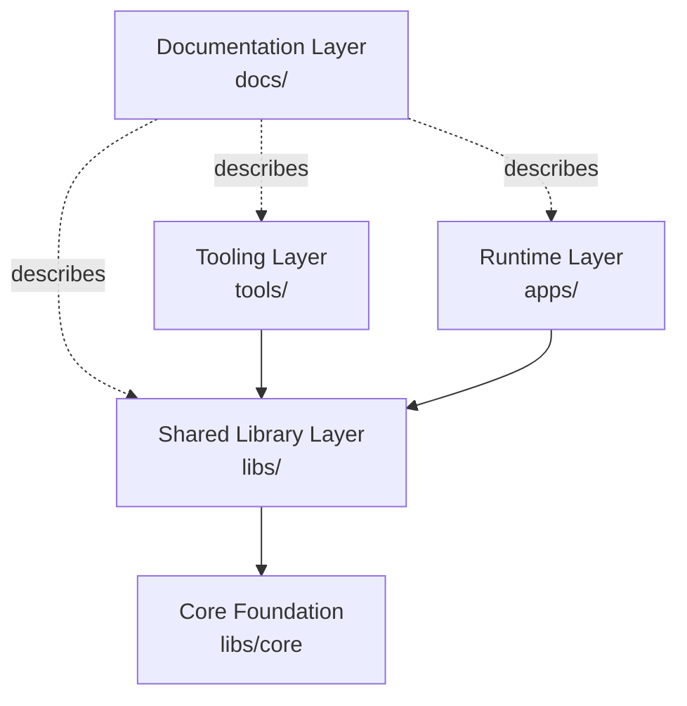
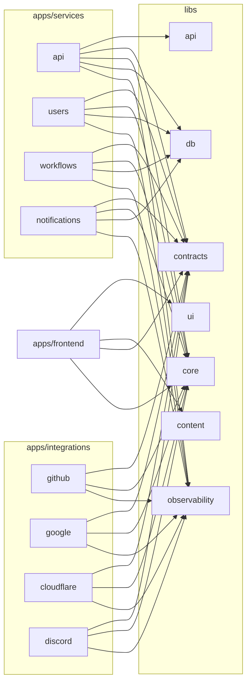
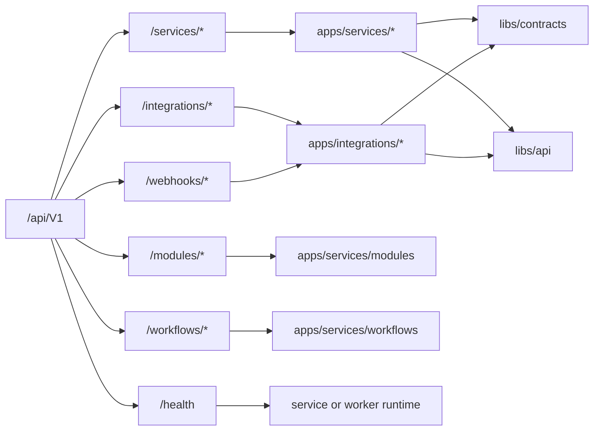
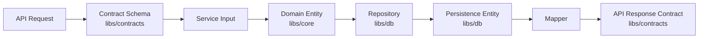
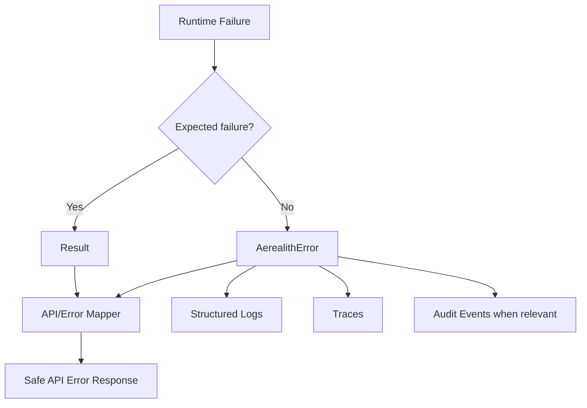

# Monorepo Architecture

Status: Draft
Implementation State: Target architecture; not current implementation evidence
Current-State Source: [Current Architecture](./Current%20Architecture.md)
Owner: SinLess Games LLC
Last Updated: 2026-07-18
Related RFCs:

- `docs/rfcs/0002-monorepo-library-boundaries.md`
- `docs/rfcs/0003-api-versioning-and-route-strategy.md`
- `docs/rfcs/0004-error-and-result-model.md`
- `docs/rfcs/0005-entity-schema-and-contract-strategy.md`

---

## Purpose

This document defines the intended monorepo architecture for the Aerealith platform.

The monorepo is the source-of-truth workspace for Aerealith applications, services, integrations,
libraries, documentation, generators, tests, and internal tooling.

The goal is simple:

> Keep the repo organized enough to scale, but simple enough to work in every day.

Aerealith should be easy to navigate, easy to test, easy to generate from, and hard to accidentally
turn into a haunted junk drawer. Tiny goblin prevention, basically. 🧌

---

## Architecture Summary

Aerealith uses an Nx-powered TypeScript monorepo.

The approved top-level structure is:

```text
docs/
apps/
apps/services/
apps/integrations/
libs/
tools/
tools/generators/
```

The core rule:

> Deployable things live in `apps/`, reusable things live in `libs/`, repo tooling lives in `tools/`,
> and decisions live in `docs/`.

---

## Approved Root Structure

```text
.
├── apps/
│   ├── integrations/
│   └── services/
├── docs/
├── libs/
└── tools/
    └── generators/
```

---

## Root Folder Responsibilities

| Folder               | Responsibility                                                                               |
| -------------------- | -------------------------------------------------------------------------------------------- |
| `apps/`              | Runnable and deployable application entrypoints.                                             |
| `apps/services/`     | Platform-owned service runtimes, workers, APIs, jobs, and service entrypoints.               |
| `apps/integrations/` | Provider-specific integration runtimes, callbacks, sync jobs, and connection surfaces.       |
| `docs/`              | Product, architecture, engineering, release, RFC, and trust documentation.                   |
| `libs/`              | Shared runtime libraries, contracts, primitives, schemas, UI, data, and reusable logic.      |
| `tools/`             | Internal developer tooling, maintenance scripts, repo automation, and non-runtime utilities. |
| `tools/generators/`  | Nx generators and scaffolding utilities for creating consistent project structure.           |

---

## Monorepo Map



---

## Dependency Direction

Dependencies should flow inward toward stable shared libraries.

Apps may depend on libraries.

Libraries should not depend on apps.

Tools may depend on libraries when useful.

Runtime apps should not depend on tooling code.



---

## Golden Dependency Rule

The default library rule is:

```text
libs/* may depend on libs/core only.
```

This rule keeps shared libraries independent and prevents dependency spaghetti.

Allowed by default:

```text
libs/api -> libs/core
libs/contracts -> libs/core
libs/db -> libs/core
libs/ui -> libs/core
libs/content -> libs/core
libs/flags -> libs/core
libs/observability -> libs/core
```

Avoid by default:

```text
libs/api -> libs/db
libs/ui -> libs/api
libs/contracts -> libs/db
libs/content -> libs/ui
libs/observability -> libs/api
```

Cross-library dependencies may be allowed later, but they must be intentional, documented, and reviewed.

---

## Monorepo Layer Model

Aerealith should be understood as layered architecture.



The core foundation should remain stable.

The runtime layer can evolve faster.

The documentation layer explains why decisions exist.

The tooling layer helps enforce and generate consistency.

---

## Application Architecture

`apps/` contains runnable projects.

A project belongs in `apps/` when it can be started, served, deployed, scheduled, or executed as a
runtime entrypoint.

Examples:

```text
apps/frontend
apps/services/api
apps/services/users
apps/services/notifications
apps/integrations/github
apps/integrations/google
apps/integrations/cloudflare
```

Applications should be thin entrypoints.

They should orchestrate libraries and runtime infrastructure, not become dumping grounds for shared
business logic.

---

## Service Application Architecture

`apps/services/` contains platform-owned service runtimes.

Services are responsible for Aerealith-owned platform behavior.

Examples:

```text
apps/services/api
apps/services/auth
apps/services/users
apps/services/accounts
apps/services/notifications
apps/services/audit
apps/services/workflows
apps/services/modules
```

Service responsibilities may include:

```text
HTTP routes
RPC handlers
queue consumers
scheduled jobs
workflow execution
domain orchestration
audit event creation
platform-owned API behavior
```

Services may depend on:

```text
libs/core
libs/contracts
libs/api
libs/db
libs/observability
libs/flags
```

Services should not casually import from other services.

Shared behavior should move into `libs/`.

---

## Integration Application Architecture

`apps/integrations/` contains provider-specific integration runtimes.

Integrations are responsible for external systems.

Examples:

```text
apps/integrations/github
apps/integrations/google
apps/integrations/cloudflare
apps/integrations/discord
apps/integrations/email
apps/integrations/storage
```

Integration responsibilities may include:

```text
OAuth connection flows
provider callbacks
webhook receivers
provider sync jobs
provider API clients
provider permission checks
provider health checks
provider-specific event mapping
```

Integrations may depend on:

```text
libs/core
libs/contracts
libs/api
libs/observability
```

Integrations should avoid depending directly on service internals.

Communication between services and integrations should happen through contracts, events, queues,
HTTP APIs, or shared provider-neutral abstractions.

---

## Frontend Application Architecture

The frontend is a deployable application and belongs in:

```text
apps/frontend
```

The frontend should depend on shared UI, content, contracts, flags, and core primitives.

Expected frontend dependencies:

```text
apps/frontend -> libs/ui
apps/frontend -> libs/content
apps/frontend -> libs/contracts
apps/frontend -> libs/core
apps/frontend -> libs/flags
```

The frontend should not import database code.

Avoid:

```text
apps/frontend -> libs/db
```

The frontend should treat API contracts as the boundary between browser UI and backend behavior.

---

## Library Architecture

`libs/` contains reusable runtime libraries.

Libraries should be stable, focused, and easy to test.

Recommended library purposes:

| Library              | Responsibility                                                                                       |
| -------------------- | ---------------------------------------------------------------------------------------------------- |
| `libs/core`          | Core primitives, constants, errors, types, entities, schemas, enums, and utilities.                  |
| `libs/contracts`     | API contracts, DTOs, request/response shapes, and version-aware contract schemas.                    |
| `libs/api`           | API helpers, route utilities, middleware helpers, response mappers, and request handling utilities.  |
| `libs/db`            | Database client, schema, repositories, queries, mappers, migrations, and persistence adapters.       |
| `libs/ui`            | Shared React UI primitives, patterns, accessibility utilities, styles, and design-system components. |
| `libs/content`       | Shared site/app copy, policy text, translations, and content registry utilities.                     |
| `libs/flags`         | Feature flags, rollout helpers, and flag contracts.                                                  |
| `libs/observability` | Logging, tracing, metrics, diagnostics, and observability helpers.                                   |

---

## Core Library

`libs/core` is the foundation library.

It should be the safest library to import from almost anywhere.

It may contain:

```text
constants
errors
error codes
entities
schemas
types
enums
guards
utilities
result helpers
shared platform primitives
```

It should not depend on other Aerealith libraries by default.

`libs/core` should avoid provider-specific runtime behavior.

Good examples:

```text
AerealithError
Result<T, E>
HttpStatus
HttpMethod
UserEntity
WaitlistEntity
EmailSchema
TimestampType
assertNever
isDefined
```

---

## Contracts Library

`libs/contracts` contains shared API and service boundary contracts.

It may contain:

```text
DTOs
API request types
API response types
API schemas
route contract types
versioned API contracts
shared event contracts
workflow contracts
integration contracts
```

Contracts should be version-aware.

Example:

```text
libs/contracts/src/api/V1/services/users/create-user.request.ts
libs/contracts/src/api/V1/services/users/create-user.response.ts
```

Contracts may depend on `libs/core`.

Contracts should not depend on `libs/db`.

---

## API Library

`libs/api` contains reusable API-layer helpers.

It may contain:

```text
route helpers
middleware helpers
request context helpers
response helpers
error serialization
pagination helpers
auth boundary helpers
validation helpers
```

`libs/api` should not own business domains.

It should help services expose APIs consistently.

It may depend on `libs/core`.

It may depend on `libs/contracts` only if explicitly allowed by a future RFC or architecture update.

Until then, keep it simple and avoid cross-library creep.

---

## Database Library

`libs/db` owns persistence behavior.

It may contain:

```text
database client
database config
table schemas
repositories
queries
transactions
mappers
database enums
migrations
persistence adapters
database error mapping
```

`libs/db` may depend on `libs/core`.

`libs/db` should not depend on API routes, frontend code, or UI code.

Database models should not be returned directly to public APIs.

The database layer should map persistence data into domain or contract-safe shapes.

---

## UI Library

`libs/ui` owns reusable UI primitives and patterns.

It may contain:

```text
buttons
inputs
dialogs
forms
navigation primitives
layout primitives
accessibility helpers
design tokens
themes
CSS utilities
```

`libs/ui` may depend on `libs/core`.

It should avoid depending on app-specific routes, app state, database code, or provider-specific
integration behavior.

The UI library should stay reusable across dashboards, docs surfaces, public pages, and future app
surfaces.

---

## Content Library

`libs/content` owns structured content.

It may contain:

```text
marketing copy
policy copy
localized content
translation helpers
content validation
content generation scripts
content types
```

`libs/content` may depend on `libs/core`.

It should avoid importing UI components.

UI renders content; content should not render UI.

---

## Tools Architecture

`tools/` contains repo tooling.

Examples:

```text
tools/scripts
tools/generators
tools/maintenance
tools/checks
```

Tooling may:

```text
generate files
repair docs
validate repo structure
sync project metadata
create release scaffolds
create service scaffolds
create integration scaffolds
run maintenance tasks
```

Tooling should not be imported by runtime apps.

If a runtime app needs logic that currently lives in `tools/`, move that logic into a library.

---

## Generator Architecture

`tools/generators/` contains Nx generators and scaffolding utilities.

Generators should create consistent project structure.

Examples:

```text
tools/generators/service
tools/generators/integration
tools/generators/library
tools/generators/rfc
tools/generators/release
```

Generators should create boring, predictable output.

Good generator output should include:

```text
project files
source entrypoint
test file
README
project.json
tsconfig files
eslint config
vitest config where needed
```

Generators should not create magical code that nobody understands.

Generated code should be readable, editable, and reviewable.

---

## Documentation Architecture

`docs/` contains decisions, plans, and operating standards.

Recommended docs structure:

```text
docs/
├── architecture/
├── engineering/
├── product/
├── releases/
├── rfcs/
└── vision/
```

Documentation should explain:

```text
what Aerealith is
why decisions exist
how the platform is shaped
how engineers work
what releases contain
what boundaries must be respected
```

Docs should not be treated as random notes.

Docs are part of the product operating system.

---

## Runtime Import Rules

Allowed:

```text
apps/* -> libs/*
apps/services/* -> libs/*
apps/integrations/* -> libs/*
tools/* -> libs/*
libs/* -> libs/core
```

Forbidden by default:

```text
libs/* -> apps/*
libs/* -> tools/*
apps/* -> tools/* at runtime
apps/services/* -> apps/integrations/* internals
apps/integrations/* -> apps/services/* internals
apps/frontend -> libs/db
docs/* -> runtime source imports
```

---

## Runtime Boundary Diagram



---

## API Route Relationship

The monorepo should align with the API route strategy:

```text
/api/V#/
```

Examples:

```text
/api/V1/services/users
/api/V1/services/accounts
/api/V1/integrations/github
/api/V1/integrations/google
/api/V1/modules
/api/V1/workflows
/api/V1/webhooks/github
/api/V1/health
```

Service API routes should map naturally to `apps/services/`.

Integration routes should map naturally to `apps/integrations/`.

Contracts should map naturally to `libs/contracts/`.

Shared API helpers should map naturally to `libs/api/`.

---

## API to Monorepo Mapping



---

## Data Boundary Relationship

Data modeling follows the entity, schema, and contract strategy.



Important rules:

```text
Persistence entities do not become API responses.
API contracts do not become database entities.
Schemas validate runtime data.
Mappers translate between layers.
```

---

## Error Boundary Relationship

Error handling follows the error and result model.



Important rules:

```text
Expected recoverable failures return Result<T, E>.
Unexpected failures throw AerealithError.
Public responses use safe messages.
Logs may include diagnostics when safe.
Secrets must not leak into public errors.
```

---

## Testing Architecture

Tests should live near the code they validate.

Examples:

```text
libs/core/src/errors/aerealith.error.spec.ts
libs/db/src/repositories/user/drizzle-user.repository.spec.ts
libs/ui/src/primitives/actions/button.spec.tsx
apps/frontend-e2e/src/example.spec.ts
```

Testing expectations:

```text
libraries should have unit tests
mappers should have tests
schemas should have validation tests
UI primitives should have behavior and accessibility tests
service routes should have route tests where practical
integrations should have mocked provider tests
e2e tests should validate critical user flows
```

Testing should not depend on implementation details more than needed.

---

## Build and Output Architecture

Source files should live in source folders.

Build output should live outside source folders.

Expected output folders:

```text
dist/
coverage/
out-tsc/
```

Avoid generated TypeScript outputs beside source files unless explicitly required.

Usually avoid:

```text
libs/*/src/**/*.js
libs/*/src/**/*.d.ts
apps/*/src/**/*.js
apps/*/src/**/*.d.ts
```

If generated source-adjacent files are required, the reason must be documented.

---

## Naming Rules

Folder names should be lowercase.

Use:

```text
docs/releases/
docs/rfcs/
apps/services/
apps/integrations/
libs/core/
tools/generators/
```

Avoid:

```text
docs/Releases/
docs/RFCs/
Apps/
Libs/
Tools/
```

File names may use readable title case for docs when helpful, but folder names should stay lowercase.

Examples:

```text
docs/architecture/Monorepo Architecture.md
docs/product/Product Overview.md
docs/releases/0.1/Release.md
```

---

## Configuration Architecture

Root configuration should stay at the workspace root when it affects the full repo.

Examples:

```text
package.json
pnpm-workspace.yaml
nx.json
tsconfig.base.json
eslint.config.mjs
prettier.config.mjs
.markdownlint.mjs
vitest.config.ts
vitest.workspace.ts
```

Project-specific config should stay with the project.

Examples:

```text
apps/frontend/project.json
apps/frontend/vite.config.mts
apps/frontend/tsconfig.app.json
libs/core/project.json
libs/core/vitest.config.mts
libs/db/drizzle.config.ts
```

Root config should define workspace standards.

Project config should define project behavior.

---

## Dependency Management

Aerealith uses `pnpm`.

Package dependencies should be managed intentionally.

Rules:

```text
Prefer workspace-level dev dependencies for shared tooling.
Avoid duplicate tooling versions across projects.
Keep runtime dependencies minimal.
Do not add dependencies casually.
Use libraries before adding new packages.
Prefer boring dependencies over clever ones.
```

Dependency additions should answer:

```text
Why is this needed?
Where will it be used?
Can existing code handle this?
Is it runtime or dev-only?
Does it increase deployment size?
Does it affect Cloudflare or self-hosting compatibility?
```

---

## Nx Project Boundaries

Nx should understand projects clearly.

Every runnable or buildable project should have:

```text
project.json
tsconfig.json
eslint.config.mjs
test config where needed
README.md where useful
```

Nx targets should be predictable:

```text
lint
typecheck
test
build where needed
e2e where needed
```

The repo should keep common scripts simple:

```text
pnpm format
pnpm lint
pnpm typecheck
pnpm test
pnpm e2e
pnpm check
pnpm fix
```

---

## Project Generation Rules

New projects should be generated instead of hand-created when practical.

Generators should enforce:

```text
folder placement
project naming
test setup
lint setup
typecheck setup
README creation
import boundaries
default file structure
```

Generators reduce drift.

If a project must be created manually, it should still follow the same output shape as generated
projects.

---

## When to Create a New App

Create a new app when the thing is:

```text
deployable
runnable
independently served
scheduled independently
owned as a separate runtime
connected to provider-specific callbacks
a distinct worker/service/job entrypoint
```

Examples:

```text
frontend app
API service
worker service
queue consumer
integration webhook receiver
scheduled sync worker
```

Do not create an app just to organize shared code.

Shared code belongs in `libs/`.

---

## When to Create a New Library

Create a new library when the thing is:

```text
shared by multiple apps
shared by multiple services
shared by multiple integrations
a stable domain foundation
a reusable UI package
a reusable validation or contract package
a provider-neutral abstraction
```

Examples:

```text
core primitives
API contracts
database access
UI components
content registry
observability helpers
feature flags
```

Do not create a library for every tiny helper.

Small helpers should start inside the library or app that owns them.

Move them when reuse becomes real.

---

## When to Create a New Tool

Create a new tool when the thing is:

```text
repo maintenance
code generation
documentation repair
metadata sync
developer workflow automation
local validation
project scaffolding
```

Tools should support the repo.

Tools should not become runtime dependencies.

---

## Monorepo Anti-Patterns

Avoid:

```text
apps importing from other apps
libraries importing from apps
runtime code importing from tools
database code leaking into frontend
provider-specific code leaking into core
one giant utilities library
one giant API service with all logic inside it
contracts depending on persistence models
UI components importing database code
copy-pasted schemas across services
random generated files committed beside source
uppercase duplicate folders on case-sensitive systems
```

These are how monorepos become spaghetti warehouses.

---

## Review Checklist

When adding or changing monorepo structure, ask:

```text
Does this belong in apps, libs, tools, or docs?
Is this deployable or reusable?
Is this runtime code or repo tooling?
Does this create a forbidden dependency?
Could this live in libs/core?
Does this leak provider-specific behavior into shared code?
Does this leak database details into contracts?
Does this make generated output harder to review?
Does Nx understand this project?
Can this be tested independently?
```

---

## Migration Notes

Current and future cleanup should prioritize:

```text
lowercase docs/releases
lowercase docs/rfcs
removal of accidental generated source outputs
consistent project.json placement
consistent lint/typecheck/test targets
moving shared logic from apps into libs
moving runtime-independent tooling into tools
```

Any large migration should be done in small commits.

Avoid mixing architecture changes with unrelated feature work.

---

## Relationship to RFCs

This document implements and explains decisions from:

```text
docs/rfcs/0002-monorepo-library-boundaries.md
docs/rfcs/0003-api-versioning-and-route-strategy.md
docs/rfcs/0004-error-and-result-model.md
docs/rfcs/0005-entity-schema-and-contract-strategy.md
```

If this document and an accepted RFC disagree, the RFC should be treated as the source of truth until
one of the documents is updated.

---

## Relationship to Engineering Docs

Architecture defines the shape.

Engineering defines the workflow.

This document should align with:

```text
docs/engineering/README.md
docs/engineering/Code Style.md
docs/engineering/Testing Standard.md
docs/engineering/Documentation Standard.md
docs/engineering/Local Development.md
```

Engineering docs should not redefine monorepo boundaries.

They should explain how to work within them.

---

## Relationship to Release Docs

Release docs should explain when monorepo changes ship.

Architecture docs explain what the structure means.

Release docs should reference this document when a release adds:

```text
new apps
new services
new integrations
new libraries
new generators
new dependency rules
new workspace scripts
new project boundaries
```

---

## Success Criteria

The monorepo architecture is successful when:

```text
new contributors can find where things belong
apps stay thin and deployable
libraries stay focused and reusable
tools stay out of runtime code
docs explain decisions clearly
Nx understands project boundaries
shared code avoids circular dependencies
API contracts do not depend on persistence models
frontend does not depend on database code
provider-specific code stays isolated
new services and integrations can be generated consistently
```

---

## Final Standard

Aerealith should use a boring, predictable monorepo that scales without becoming hostile.

The standard is:

> Apps run the platform, libs power the platform, tools maintain the platform, docs explain the
> platform, and core holds the platform together.
