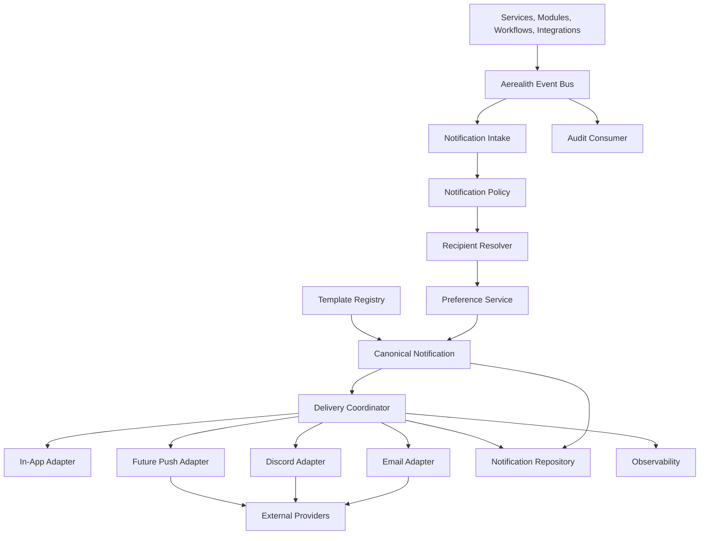
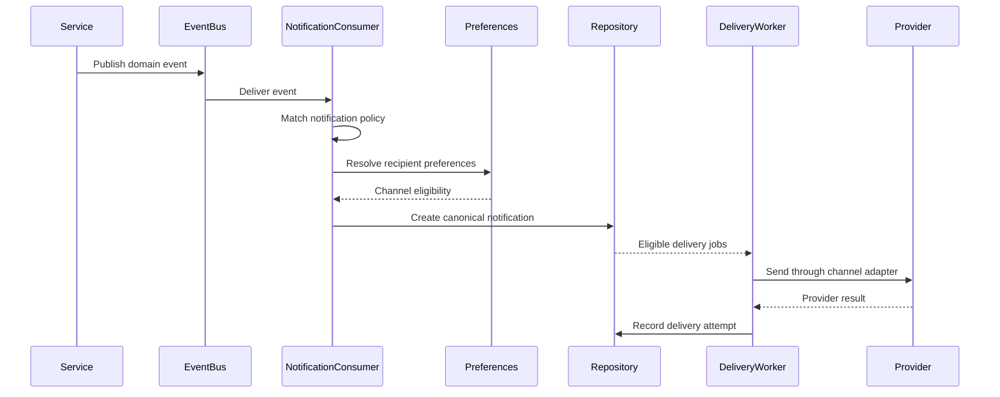
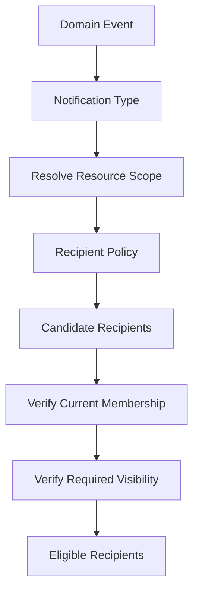
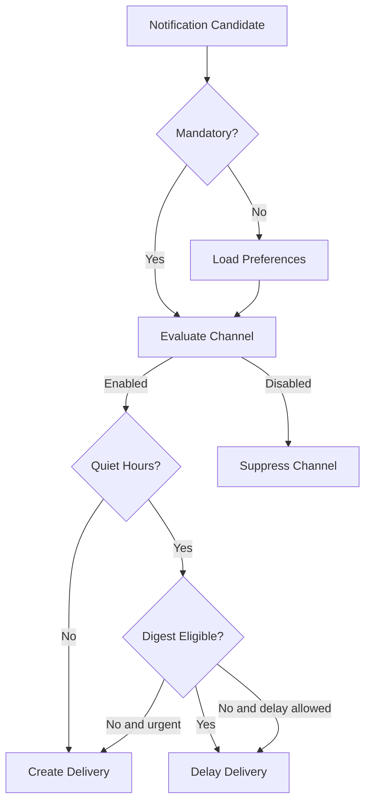
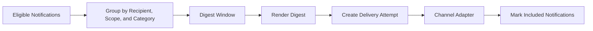
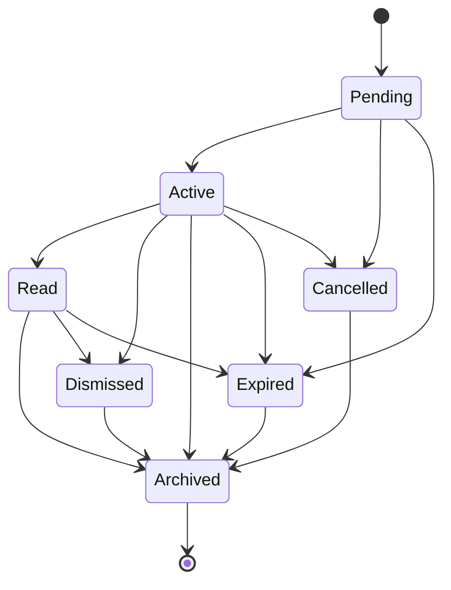
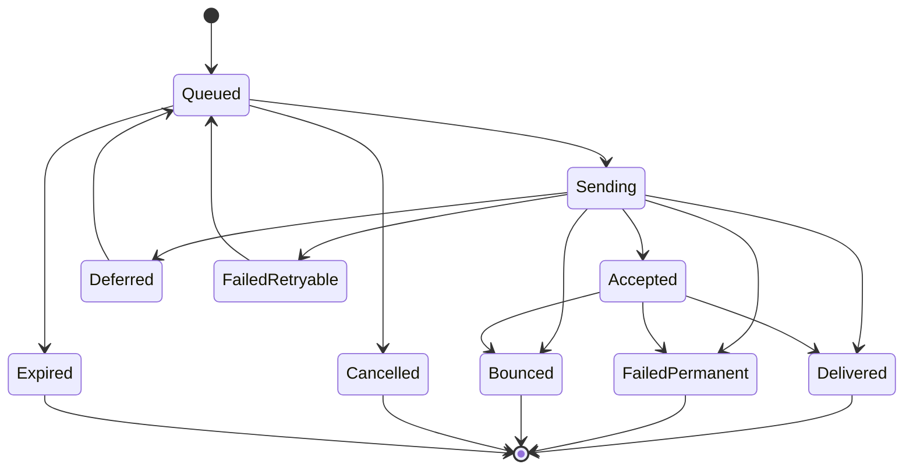
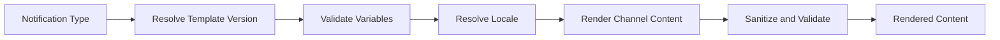
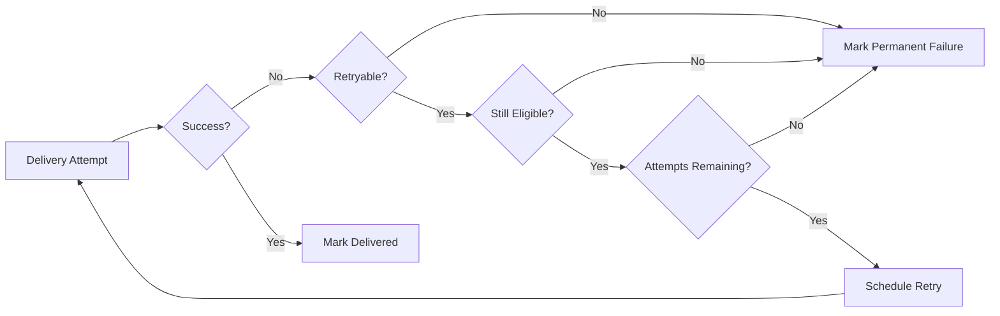

# Notification Architecture

Status: Draft
Owner: SinLess Games LLC
Last Updated: 2026-07-12
Security Classification: Internal Architecture
Foundation Release: `0.5 — API & Service Platform`
Primary Product Release: `0.8 — Moderation, Tickets & Community Operations`

Pending Decision Records:

- `docs/rfcs/0008-configuration-and-secrets-model.md`
- `docs/rfcs/0009-authentication-session-and-authorization-model.md`
- `docs/rfcs/0010-api-envelope-request-and-trace-id-propagation.md`
- `docs/rfcs/0011-event-envelope-audit-model-and-idempotency.md`
- `docs/rfcs/0012-workflow-records-and-approval-primitive.md`
- `docs/rfcs/0013-provider-abstraction-and-integration-interface.md`
- `docs/rfcs/0017-observability-trace-propagation-and-alerting.md`

Related RFCs:

- `docs/rfcs/0002-monorepo-library-boundaries.md`
- `docs/rfcs/0003-api-versioning-and-route-strategy.md`
- `docs/rfcs/0004-error-and-result-model.md`
- `docs/rfcs/0005-entity-schema-and-contract-strategy.md`

Related Architecture:

- `docs/architecture/Monorepo Architecture.md`
- `docs/architecture/Frontend Architecture.md`
- `docs/architecture/API Architecture.md`
- `docs/architecture/Service Architecture.md`
- `docs/architecture/Data Architecture.md`
- `docs/architecture/Auth Architecture.md`
- `docs/architecture/Security Architecture.md`
- `docs/architecture/Discord Architecture.md`
- `docs/architecture/Module Architecture.md`
- `docs/architecture/Workflow Architecture.md`
- `docs/architecture/AI Architecture.md`
- `docs/architecture/Integration Architecture.md`

---

## Purpose

This document defines the notification architecture for Aerealith AI.

Notifications communicate meaningful platform information to users, administrators, developers, communities, and operators through controlled delivery channels.

The notification architecture governs:

```text
notification creation
notification categories
notification severity
recipient resolution
user preferences
channel preferences
quiet hours
delivery eligibility
templates
localization
in-app notifications
email delivery
Discord delivery
future push delivery
digest delivery
scheduling
deduplication
idempotency
delivery attempts
retries
provider failures
read state
dismissal
archival
retention
privacy
security
observability
audit behavior
```

The guiding rule is:

> Domain services describe what happened and who should know, while the notification service decides whether, when, and through which approved channels the information should be delivered.

A domain service should not independently implement email, Discord messages, browser notifications, and every future delivery channel.

The notification service centralizes delivery policy without becoming the owner of every domain event.

---

## Architecture Summary

Aerealith uses an event-driven, channel-neutral notification architecture.

Platform services, modules, integrations, workflows, and security systems publish normalized events or explicit notification requests.

The notification service:

```text
validates the request
resolves recipients
loads preferences
applies mandatory-delivery policy
applies quiet hours
applies channel eligibility
creates a canonical notification record
renders channel-specific content
creates delivery attempts
dispatches through approved adapters
records provider outcomes
retries safe failures
updates notification state
emits metrics and events
```

The initial supported channels are:

```text
in-app
email through Resend
Discord where explicitly configured and permitted
```

Future channels may include:

```text
web push
mobile push
SMS for narrowly approved security use
additional communication providers
developer webhooks
```

The canonical notification record remains provider-neutral.

Channel-specific delivery records remain separate.

---

## Notification Architecture Goals

The notification architecture should provide:

```text
one notification model
multiple delivery channels
centralized preferences
clear mandatory-notification rules
privacy-aware content
bounded retries
idempotent delivery
provider-neutral contracts
user-controlled delivery
quiet hours
digest support
localization readiness
accessible presentation
observable provider health
safe graceful degradation
future self-hosting support
```

---

## Non-Goals

The initial notification architecture does not require:

```text
a full marketing automation platform
arbitrary bulk email campaigns
unrestricted SMS delivery
behavioral advertising
cross-customer notification targeting
hidden engagement manipulation
a visual email-template builder
untrusted user-authored HTML email
exactly-once provider delivery
one microservice per notification channel
AI-generated security notifications without review
```

Transactional and operational notifications are the initial priority.

Marketing communication requires explicit consent and separate product policy.

---

## Core Principles

Aerealith notifications follow these principles:

```text
Notifications are domain events translated into user communication.
The canonical notification is separate from its delivery attempts.
Recipients and scopes are explicit.
Preferences are respected unless delivery is mandatory.
Mandatory notifications must be narrowly defined.
Security notifications cannot be silently disabled when policy requires them.
Channels are adapters, not domain models.
Provider SDK types do not become notification contracts.
Notification content is minimized.
Secrets never enter notification content.
Delivery is treated as at least once.
Duplicate requests must not create duplicate user-visible outcomes.
Retries are bounded.
Provider failures remain visible.
Users can review notification history.
Users can manage preferences.
Notification delivery must not become a dark pattern.
Core platform behavior must not depend on successful notification delivery.
```

---

## What Is a Notification?

A notification is a canonical platform record representing information intended for one or more recipients.

A notification may communicate:

```text
an account-security event
a workflow approval request
a workflow failure
a Discord integration problem
a module health problem
a moderation outcome
a ticket update
an invitation
an onboarding step
a developer event
a system-status update
```

A notification is not automatically:

```text
an email
a Discord message
a push notification
an audit record
a log entry
a provider event
```

One notification may create zero, one, or several delivery attempts.

---

## Notification Terminology

| Term                   | Meaning                                                                                 |
| ---------------------- | --------------------------------------------------------------------------------------- |
| Notification           | The canonical provider-neutral communication record.                                    |
| Notification Type      | A stable identifier describing what the notification represents.                        |
| Category               | A user-facing grouping such as security, workflows, or integrations.                    |
| Severity               | The importance or urgency of the notification.                                          |
| Recipient              | The user, account member, developer, or administrator who may receive the notification. |
| Channel                | An in-app, email, Discord, push, or other delivery surface.                             |
| Delivery Attempt       | One attempt to deliver one notification through one channel.                            |
| Template               | A versioned rendering definition for notification content.                              |
| Preference             | A recipient-controlled rule for notification categories and channels.                   |
| Mandatory Notification | A narrowly defined notification that cannot be fully disabled.                          |
| Digest                 | A grouped delivery containing several eligible notifications.                           |
| Quiet Hours            | A recipient-defined period during which eligible deliveries are delayed.                |
| Notification Event     | An event describing notification lifecycle or delivery behavior.                        |

---

## High-Level Architecture



---

## Architectural Separation

The notification architecture separates:

```text
event
notification
delivery
provider result
```

### Domain Event

Describes what happened.

Example:

```text
workflow.run.failed
```

### Notification

Describes what a recipient should be told.

Example:

```text
Your workflow failed and requires attention.
```

### Delivery Attempt

Describes how Aerealith attempted to communicate the notification.

Example:

```text
Email delivery attempt through Resend
```

### Provider Result

Describes what the provider reported.

Example:

```text
Accepted by provider
Bounced
Rate-limited
Rejected
```

These records should not be collapsed into one mutable row.

---

## Event-Driven Notification Flow



---

## Explicit Notification Requests

Some application services may create an explicit notification request instead of relying on a generic event subscription.

This is appropriate when the domain operation already knows:

```text
the intended recipient
the exact notification type
the target resource
the urgency
the required action
```

An explicit request must still pass through:

```text
validation
recipient resolution
preference policy
mandatory-delivery policy
template rendering
deduplication
delivery coordination
```

Application services should not call Resend, Discord, or another provider directly.

---

## Notification Producers

Notification-producing systems may include:

```text
authentication
accounts
integrations
Discord
modules
workflows
approvals
tickets
moderation
developer platform
security
operations
AI proposals
```

Each producer should publish stable events or notification requests.

Producers should not own channel-specific rendering.

---

## Notification Categories

Recommended initial categories:

```text
security
account
approvals
workflows
integrations
modules
communities
moderation
tickets
developer
system
product
marketing
```

Categories support:

```text
preference management
inbox filtering
digest grouping
analytics
retention rules
```

Categories must not become authorization controls.

---

## Notification Types

Every notification should use a stable type identifier.

Examples:

```text
security.new-sign-in
security.password-changed
security.session-revoked
security.api-key-created
account.email-verification
account.invitation-received
approval.action-requested
approval.action-approved
approval.action-rejected
workflow.run-failed
workflow.run-partially-succeeded
workflow.approval-required
integration.connection-degraded
integration.reauthorization-required
integration.disconnected
module.degraded
module.permission-required
discord.role-hierarchy-blocked
discord.bot-removed
ticket.created
ticket.assigned
ticket.waiting-on-user
ticket.closed
moderation.action-completed
developer.webhook-failing
system.maintenance
```

Notification type identifiers should be:

```text
lowercase
stable
dot-separated
domain-oriented
documented
```

---

## Notification Type Definition

A notification type definition should describe:

```text
type ID
category
default severity
default channels
mandatory channels
supported recipient types
template references
deduplication behavior
quiet-hour behavior
digest eligibility
retention policy
audit behavior
```

Example:

```ts
export interface NotificationTypeDefinition {
  readonly id: string
  readonly category: NotificationCategory
  readonly defaultSeverity: NotificationSeverity
  readonly defaultChannels: readonly NotificationChannel[]
  readonly mandatoryChannels: readonly NotificationChannel[]
  readonly supportedRecipientTypes: readonly NotificationRecipientType[]
  readonly templateId: string
  readonly deduplicationWindowMs?: number
  readonly digestEligible: boolean
  readonly quietHoursAllowed: boolean
  readonly retentionPolicyId: string
  readonly auditRequired: boolean
}
```

---

## Notification Type Registry

The notification type registry is the authoritative catalog of notification behavior.

It should answer:

```text
Does this notification type exist?
Which category does it belong to?
Which severity applies?
Which templates apply?
Which channels are supported?
Is it mandatory?
May it be delayed?
May it enter a digest?
How is it deduplicated?
How long is it retained?
```

Unknown notification types should be rejected.

---

## Notification Severity

Recommended severity levels:

```text
Informational
Success
Warning
High
Critical
```

| Severity      | Meaning                                                  | Example                                           |
| ------------- | -------------------------------------------------------- | ------------------------------------------------- |
| Informational | Useful information with no immediate action required.    | Module enabled successfully.                      |
| Success       | A requested operation completed successfully.            | Integration connected.                            |
| Warning       | Attention may be required.                               | Provider permission is missing.                   |
| High          | Prompt action is recommended.                            | Workflow partially completed and requires review. |
| Critical      | Immediate security or operational attention is required. | Suspected credential compromise.                  |

Severity influences presentation and delivery policy.

Severity does not replace category or mandatory-delivery rules.

---

## Priority Versus Severity

Priority and severity should remain separate where needed.

Severity describes impact.

Priority describes delivery urgency.

Potential priorities:

```text
low
normal
high
immediate
```

Example:

```text
A successful export is informational but may have normal priority.
A scheduled maintenance warning may be high priority but not critical severity.
```

The initial implementation may derive priority from severity unless product requirements justify separate fields.

---

## Notification Channels

Initial channels:

```text
in-app
email
Discord
```

Future channels:

```text
web push
mobile push
SMS
developer webhook
additional messaging providers
```

Every channel must implement a shared delivery contract.

---

## In-App Notifications

In-app notifications are the canonical user-visible notification history.

In-app delivery should generally be available for:

```text
authenticated users
account members
administrators
developers
community managers
```

In-app notifications support:

```text
unread state
read state
dismissal
archival
deep links
actions
filtering
pagination
```

Creating a canonical notification may itself create the in-app representation.

A separate provider call is not required.

---

## Email Notifications

Email delivery is initially provided through Resend.

Resend is an infrastructure provider for Aerealith-operated transactional email.

Email notifications may include:

```text
verification
password reset
new sign-in
security changes
workflow approval
workflow failure
integration degradation
invitation
ticket update
```

Email content should be:

```text
transactional
minimal
accessible
responsive
privacy-aware
free of secrets
```

---

## Discord Notifications

Discord delivery may be used when:

```text
a Discord connection is active
the target server or channel is explicitly configured
the recipient or administrator has enabled the channel
Aerealith and Discord permissions permit delivery
the content is appropriate for the selected Discord surface
```

Discord notifications may target:

```text
an administrator channel
a moderation channel
a ticket channel
a user through an approved interaction response
```

Aerealith should not send direct messages or public server messages merely because Discord is connected.

The destination and behavior must be explicitly configured.

---

## Future Push Notifications

Future browser or mobile push delivery should require:

```text
explicit subscription
device registration
revocation
expiration handling
payload minimization
provider-neutral contracts
```

Push payloads should avoid sensitive content on lock screens by default.

---

## SMS Direction

SMS should not be an ordinary default notification channel.

Potential future uses may include:

```text
critical account recovery
high-risk security verification
emergency operational notification
```

SMS support requires:

```text
explicit consent
cost controls
regional support
abuse protection
privacy review
provider review
```

---

## Channel Adapter Interface

Every external delivery channel should implement a normalized adapter.

Example:

```ts
export interface NotificationChannelAdapter {
  readonly channel: NotificationChannel

  deliver(
    request: NotificationDeliveryRequest,
  ): Promise<Result<NotificationDeliveryResult, AerealithError>>

  health(): Promise<Result<NotificationChannelHealth, AerealithError>>
}
```

A channel adapter owns:

```text
provider request mapping
provider authentication
timeouts
provider retries
provider error mapping
provider identifiers
```

A channel adapter does not own:

```text
recipient preferences
mandatory-delivery policy
notification type selection
domain event interpretation
authorization
```

---

## Channel-Neutral Delivery Request

A delivery request may include:

```ts
export interface NotificationDeliveryRequest {
  readonly deliveryId: string
  readonly notificationId: string
  readonly recipient: NotificationRecipient
  readonly channel: NotificationChannel
  readonly subject?: string
  readonly content: NotificationRenderedContent
  readonly actionUrl?: string
  readonly idempotencyKey: string
  readonly requestId: string
  readonly traceId?: string
  readonly expiresAt?: string
}
```

Provider-specific adapters map this request into provider payloads.

---

## Recipient Model

A notification recipient may be:

```text
user
account member
organization member
community administrator
developer
support operator
system operator
external verified address
```

Most notifications should target Aerealith identities rather than arbitrary addresses.

External recipients require a clear product purpose and policy.

---

## Recipient Reference

```ts
export interface NotificationRecipient {
  readonly type: NotificationRecipientType
  readonly recipientId: string
  readonly userId?: string
  readonly accountId?: string
  readonly organizationId?: string
  readonly communityId?: string
}
```

Recipient references should remain scope-bound.

---

## Recipient Resolution

Recipient resolution determines who should receive a notification.

Resolution may use:

```text
explicit recipient
resource owner
account owners
organization administrators
community administrators
workflow approvers
ticket participants
integration owners
developer application owners
```

Recipient resolution must be explicit and testable.

Avoid broad rules such as:

```text
notify everyone in the account
```

unless that is the documented product behavior.

---

## Recipient Resolution Flow



Recipients should be resolved from current server-side state.

Stale cached membership must not expose notifications to former members.

---

## Recipient Authorization

Receiving a notification can reveal private information.

Before creating or delivering a notification, verify that the recipient may know:

```text
the event occurred
the target resource exists
the included details
the action URL destination
```

A notification must not reveal private ticket, moderation, workflow, or integration details to an unauthorized recipient.

---

## Notification Preferences

Recipients should be able to manage notification preferences.

Preferences may control:

```text
category
notification type
channel
scope
frequency
digest behavior
quiet hours
```

Preferences should not allow disabling mandatory security or legal communication where policy requires delivery.

---

## Preference Hierarchy

Preferences may exist at several levels:

```text
platform default
account default
organization default
community default
user preference
notification-type override
channel override
```

The exact override model should remain understandable.

Recommended precedence:

```text
mandatory policy
→ explicit notification-type preference
→ category preference
→ scope preference
→ user channel preference
→ platform default
```

Mandatory policy always wins.

---

## Preference Record

A preference may include:

```text
preference ID
user ID
scope
category
notification type
channel
enabled
frequency
quiet-hours behavior
created at
updated at
```

Preferences should not store provider credentials.

---

## Mandatory Notifications

Mandatory notifications should be narrowly defined.

Potential mandatory notifications include:

```text
email verification
password reset
password changed
MFA disabled
new API key created
account deletion initiated
significant security incident
material legal or privacy update where required
```

Mandatory does not mean every available channel is mandatory.

Example:

```text
A password-change notification may require email and in-app delivery.
It does not automatically require Discord delivery.
```

---

## Mandatory Notification Rules

Mandatory notification types should define:

```text
required channels
fallback channels
delay policy
quiet-hours bypass
retention
recipient eligibility
```

Mandatory notifications should still:

```text
minimize private information
avoid secrets
respect verified contact methods
record delivery outcome
```

---

## Preference Evaluation



---

## Quiet Hours

Users may configure quiet hours for eligible channels.

Quiet hours may include:

```text
start time
end time
time zone
days of week
allowed exceptions
```

Quiet hours should generally apply to:

```text
email
push
Discord
```

In-app notifications may still be created immediately while external delivery is delayed.

---

## Quiet-Hour Exceptions

Quiet hours may be bypassed for:

```text
critical security events
time-sensitive approval expiration
critical service incidents
user-requested immediate delivery
```

Bypass behavior must be defined by notification type.

It must not be inferred solely from message wording.

---

## Time Zone Handling

Quiet hours and scheduled delivery should use an explicit IANA time zone.

Examples:

```text
America/Denver
America/Chicago
Europe/London
```

Store scheduling data in UTC.

Apply recipient-local time only during delivery calculation.

---

## Digest Architecture

Digests group multiple eligible notifications into one delivery.

Potential digest frequencies:

```text
hourly
daily
weekly
```

Digest-eligible categories may include:

```text
workflow summaries
module health summaries
community activity
ticket summaries
developer events
```

Security-critical notifications should not wait for a digest.

---

## Digest Flow



---

## Digest Grouping Rules

Digest grouping should consider:

```text
recipient
account
organization
community
category
channel
time window
locale
```

Notifications from unrelated private scopes must not be combined into one digest unless the recipient is explicitly authorized for each item and the UX clearly distinguishes them.

---

## Notification Scheduling

A notification may be:

```text
immediate
delayed
scheduled
digest-bound
```

Scheduled delivery should define:

```text
deliver at
recipient time zone
expiration
quiet-hours behavior
deduplication behavior
```

Notifications that are no longer relevant at delivery time should expire or be revalidated.

---

## Expiration

Some notifications should expire.

Examples:

```text
approval request
temporary invitation
password reset reminder
integration reauthorization request
```

Expiration should prevent:

```text
stale action links
late approval
irrelevant external delivery
```

Expired notifications may remain in history with an expired status.

---

## Notification Lifecycle

Recommended notification states:

```text
Pending
Active
Read
Dismissed
Archived
Expired
Cancelled
```



---

## Pending State

A notification is `Pending` while:

```text
recipient resolution is incomplete
scheduled delivery is waiting
digest aggregation is waiting
required content is being rendered
```

---

## Active State

An active notification is available to the recipient.

For in-app notifications, active usually means visible in the notification inbox.

---

## Read State

Read state indicates that the recipient opened or explicitly marked the notification as read.

Read state does not prove the recipient understood or acted on the notification.

---

## Dismissed State

Dismissal removes a notification from the primary notification view.

Dismissal should not delete required history or audit records.

---

## Archived State

Archived notifications remain available in historical views according to retention policy.

---

## Expired State

Expired notifications are no longer actionable.

Action URLs or approval controls should fail safely after expiration.

---

## Cancelled State

A notification may be cancelled when:

```text
the underlying condition resolved
the action is no longer available
the recipient lost access
the workflow was cancelled
the integration was disconnected
```

Cancelled notifications should not continue external delivery.

---

## Delivery Lifecycle

Recommended delivery attempt states:

```text
Queued
Sending
Accepted
Delivered
Deferred
FailedRetryable
FailedPermanent
Bounced
Suppressed
Cancelled
Expired
```



Provider capabilities may not support every status.

The adapter should map provider-specific statuses into the closest normalized state.

---

## Accepted Versus Delivered

`Accepted` means the provider accepted the request.

It does not always mean the recipient received it.

`Delivered` means the provider reported successful delivery where supported.

Aerealith must not claim delivery when only provider acceptance is known.

---

## Delivery Attempt Record

A delivery attempt may contain:

```text
delivery ID
notification ID
recipient ID
channel
provider
status
attempt number
idempotency key
provider message ID
queued at
started at
accepted at
delivered at
failed at
next retry at
error code
request ID
trace ID
```

---

## Notification Data Model

Potential records include:

```text
Notification
NotificationRecipient
NotificationPreference
NotificationDeliveryAttempt
NotificationTemplate
NotificationTemplateVersion
NotificationDigest
NotificationDigestItem
NotificationAction
NotificationProviderEvent
```

---

## Suggested Tables

Potential table names:

```text
notifications
notification_recipients
notification_preferences
notification_delivery_attempts
notification_templates
notification_template_versions
notification_digests
notification_digest_items
notification_actions
notification_provider_events
```

---

## Canonical Notification Record

A notification record may include:

```text
notification ID
notification type
category
severity
priority
source
scope
title
body
action reference
created at
available at
expires at
cancelled at
deduplication key
request ID
trace ID
metadata
```

Canonical notification content should remain channel-neutral.

Channel adapters may render shorter or differently formatted versions.

---

## Notification Recipient Record

A recipient record may include:

```text
notification recipient ID
notification ID
recipient type
recipient ID
user ID
scope
status
read at
dismissed at
archived at
created at
```

One canonical notification may have several recipients.

Per-recipient state must remain separate.

---

## Notification Action

Notifications may expose actions such as:

```text
review approval
open workflow run
reconnect integration
review module permission
open ticket
review security activity
```

An action should contain:

```text
action ID
label
target type
target reference
URL or route
required permission
expiration
```

Action availability must be checked again when selected.

A notification action is not authorization.

---

## Action URL Security

Action URLs should:

```text
use approved application routes
avoid raw secrets
avoid authorization tokens in query parameters
validate redirects
require current authentication
require current authorization
```

Email action links may use short-lived single-use tokens only when the flow requires them, such as:

```text
email verification
password reset
invitation acceptance
```

---

## Templates

Templates define how a notification is rendered for one or more channels.

Templates should be versioned.

A template may contain:

```text
subject
title
plain-text body
HTML email body
Discord content
in-app content
action labels
localization keys
```

Templates should not contain business logic.

---

## Template Registry

The template registry should answer:

```text
Which template belongs to this notification type?
Which version is active?
Which locales exist?
Which channels are supported?
Which variables are required?
Which variables are sensitive?
```

---

## Template Versioning

Published template versions should be immutable.

A template version may contain:

```text
template ID
version
channel
locale
required variables
subject template
content template
created by
approved by
created at
```

Changing production content should create a new version.

---

## Template Variables

Template variables must be schema-validated.

Example variables:

```text
recipientDisplayName
workflowName
integrationName
communityName
actionUrl
expiresAt
```

Avoid passing entire domain entities into templates.

Pass only the values the template requires.

---

## Template Rendering Flow



---

## Localization

Notification architecture should support localization even if the MVP initially ships in English.

Localization should consider:

```text
locale
time zone
date formatting
number formatting
pluralization
fallback language
```

Template localization should not alter:

```text
permission behavior
risk classification
mandatory-delivery rules
```

---

## Recipient Locale

Recipient locale may come from:

```text
user preference
account preference
organization preference
browser preference
platform default
```

Stored notification history may use:

```text
rendered content
template version and variables
```

The exact choice should balance historical accuracy, storage, and future localization changes.

---

## Rendering Safety

Rendered notification content must be safe for the target channel.

Controls should include:

```text
HTML escaping
URL validation
Markdown restrictions
Discord mention restrictions
length limits
template-variable validation
```

Do not allow untrusted values to inject:

```text
HTML
scripts
mass mentions
arbitrary links
provider markup
```

---

## Discord Mention Safety

Discord notification rendering should control:

```text
@everyone
@here
role mentions
user mentions
channel mentions
```

Mass mentions should be disabled by default.

An explicitly approved module policy is required before allowing broad mentions.

---

## Email HTML Safety

Email HTML should use approved templates and components.

Avoid:

```text
untrusted raw HTML
inline scripts
external executable content
tracking beyond approved policy
hidden content
deceptive links
```

A plain-text version should exist for transactional email.

---

## In-App Rendering Safety

In-app notifications should render through approved UI components.

Avoid:

```text
dangerouslySetInnerHTML
untrusted arbitrary Markdown
unvalidated external URLs
```

---

## Deduplication

Duplicate events should not create duplicate user-visible notifications.

Deduplication may use:

```text
source event ID
notification type
recipient
scope
target resource
deduplication window
explicit deduplication key
```

---

## Deduplication Key

A deduplication key may contain:

```text
notification type
recipient
scope
resource
event ID
```

Example:

```text
integration.connection-degraded:user-123:connection-456
```

The exact value should be hashed or stored safely where needed.

---

## Deduplication Window

Some notifications should deduplicate only within a time window.

Examples:

```text
repeated provider outage warning
repeated workflow retry failure
repeated module permission warning
```

Deduplication should not hide distinct security events.

---

## Aggregation

Repeated related notifications may be aggregated.

Example:

```text
Five workflow runs failed in the last hour.
```

Aggregation should preserve access to the underlying items.

Aggregation is different from deduplication.

Deduplication suppresses equivalent duplicates.

Aggregation summarizes several legitimate events.

---

## Idempotency

Delivery must be treated as at least once.

Potential duplicate sources:

```text
queue redelivery
worker restart
provider timeout
provider callback replay
client retry
event replay
```

Idempotency should exist for:

```text
notification creation
recipient creation
delivery-attempt creation
provider send request
provider callback processing
digest creation
```

---

## Delivery Idempotency

A delivery should use a stable idempotency key where supported.

Potential fields:

```text
notification ID
recipient ID
channel
template version
delivery generation
```

A repeated queue message should return the existing attempt or create a new retry attempt according to policy.

It should not create an unrelated duplicate delivery.

---

## Exactly Once

Aerealith should not claim exactly-once external delivery.

The practical target is:

```text
at-least-once processing
idempotent creation
bounded provider retries
deduplicated user-visible outcomes
observable delivery state
```

---

## Retry Architecture

Retries apply to delivery attempts, not canonical notification creation.

Retry policy should consider:

```text
channel
provider
error type
notification expiration
mandatory status
attempt count
recipient preference changes
```

---

## Retry Policy

A retry policy may define:

```text
maximum attempts
initial delay
maximum delay
backoff multiplier
jitter
retryable errors
terminal errors
```

Example:

```ts
export interface NotificationRetryPolicy {
  readonly maxAttempts: number
  readonly initialDelayMs: number
  readonly maximumDelayMs: number
  readonly backoffMultiplier: number
  readonly useJitter: boolean
  readonly retryableErrorCodes: readonly string[]
}
```

---

## Retry Rules

Retry only when:

```text
the failure may be temporary
the notification has not expired
the channel remains enabled
the recipient remains eligible
the attempt is idempotent
the retry budget remains
```

Do not retry:

```text
invalid recipient
unverified email address
permanent provider rejection
invalid template
authorization failure
recipient removed from scope
suppressed recipient
cancelled notification
```

---

## Retry Flow



---

## Delivery Revalidation

Before retrying, revalidate:

```text
recipient still exists
recipient still has access
channel remains enabled
connection remains active
notification remains relevant
notification has not expired
```

A notification should not be delivered to a user who lost access while the delivery was queued.

---

## Provider Callbacks

Some providers may send delivery-status callbacks.

Examples:

```text
email delivered
email bounced
email complained
push subscription expired
webhook rejected
```

Callbacks should use:

```text
signature verification
event ID deduplication
schema validation
provider mapping
safe logging
```

---

## Email Provider Events

Resend provider events may update:

```text
accepted
delivered
bounced
complained
failed
```

Provider events must be mapped into normalized notification delivery states.

Raw provider event payloads should not become public contracts.

---

## Bounce Handling

Repeated email bounces may cause:

```text
email channel suppression
verification review
user-facing warning in-app
support diagnostic state
```

A bounced address should not be retried indefinitely.

---

## Complaint Handling

Provider spam complaints should:

```text
suppress eligible non-mandatory email
record provider status
alert operations when necessary
preserve required security communication through approved fallback
```

Marketing communication must stop according to consent and provider policy.

---

## Channel Suppression

A delivery channel may be suppressed because of:

```text
provider complaint
invalid destination
repeated bounce
user preference
administrator policy
security incident
provider revocation
```

Suppression should be explicit and reviewable.

---

## Notification Service Boundary

The notification service owns:

```text
notification type registry
recipient resolution
preference evaluation
mandatory policy
canonical notification creation
template selection
delivery coordination
notification queries
read and dismissal state
digest coordination
```

Channel adapters own provider-specific delivery behavior.

Domain services own the events that justify notifications.

---

## Notification Service Interface

Potential application interfaces include:

```ts
export interface NotificationService {
  create(
    input: CreateNotificationInput,
  ): Promise<Result<NotificationEntity, AerealithError>>

  markRead(
    input: MarkNotificationReadInput,
  ): Promise<Result<NotificationRecipientEntity, AerealithError>>

  dismiss(
    input: DismissNotificationInput,
  ): Promise<Result<NotificationRecipientEntity, AerealithError>>

  cancel(
    input: CancelNotificationInput,
  ): Promise<Result<NotificationEntity, AerealithError>>
}
```

Delivery behavior should use a separate coordinator.

---

## Event Consumer Boundary

The notification event consumer should:

```text
validate the event envelope
match event-to-notification policy
deduplicate the event
resolve recipients
create notification records
schedule deliveries
```

It should not block the original domain operation.

---

## Queue Architecture

Notification delivery should use asynchronous queues where practical.

Potential queues:

```text
notification-intake
notification-delivery
notification-digest
notification-provider-events
```

The MVP may use fewer physical queues while maintaining logical separation.

---

## Queue Delivery Semantics

Queue delivery should be treated as:

```text
at least once
```

Consumers must use:

```text
event receipts
delivery IDs
unique constraints
idempotency keys
bounded retries
dead-letter handling
```

---

## Dead-Letter Behavior

A delivery may enter dead-letter handling when:

```text
retry attempts are exhausted
the payload remains invalid
the provider repeatedly fails
the adapter throws an unexpected error
```

Dead-letter handling should provide:

```text
operator visibility
safe payload reference
error code
attempt history
manual retry where appropriate
cancellation
```

Dead-letter storage must not expose private content unnecessarily.

---

## Transaction Boundaries

Creating a notification and its initial recipients should be one coherent transaction where practical.

Creating external delivery attempts may use:

```text
transactional outbox
queue publication after commit
idempotent workers
```

Avoid sending external messages inside a database transaction.

---

## Outbox Direction

The notification service may use an outbox pattern to ensure:

```text
notification records persist
delivery work is eventually queued
queue publication can retry safely
```

A future event RFC should define the shared outbox implementation.

---

## Data Ownership

The notification domain owns:

```text
canonical notifications
recipient state
notification preferences
delivery attempts
templates
digests
provider delivery events
```

It does not own:

```text
workflow state
integration state
ticket state
moderation cases
authentication state
```

Notification records may reference those domains through safe identifiers.

---

## Notification Content Storage

Stored content should be minimized.

Potential strategies:

```text
store rendered canonical content
store template version plus variables
store both for historical fidelity
```

The selected strategy should consider:

```text
privacy
localization
template changes
audit needs
storage
deletion propagation
```

Secrets must never be stored in notification content.

---

## Sensitive Notification Content

Sensitive details should remain behind authenticated application views.

Email or push content may say:

```text
A security change was made to your account.
Review your security activity in Aerealith.
```

rather than exposing:

```text
full session metadata
private moderation evidence
ticket transcript content
provider credentials
```

---

## Data Classification

Notification data may be:

| Class     | Examples                                          |
| --------- | ------------------------------------------------- |
| Public    | Public product announcement.                      |
| Internal  | Module health metadata.                           |
| Private   | Workflow name, account invitation.                |
| Sensitive | Security event, moderation action, ticket update. |
| Secret    | Not permitted in notification content.            |

Classification should influence:

```text
channel eligibility
content detail
retention
logging
provider selection
```

---

## Retention

Retention should be defined separately for:

```text
canonical notifications
recipient read state
delivery attempts
provider events
templates
digests
suppression records
preferences
```

Initial direction:

```text
in-app notifications retain a bounded history
delivery attempts retain enough information for support and reliability
provider payloads retain only what diagnostics require
preferences remain while the user or scope exists
security notifications may retain longer than ordinary product notifications
```

Exact durations should be defined in privacy and operations documentation.

---

## Deletion

Notification deletion should distinguish:

```text
dismissal
archival
user-history deletion
scope deletion
provider-event cleanup
```

Deleting a notification should not delete:

```text
required audit records
security records required by policy
the underlying domain event
```

---

## Account Deletion

Account deletion should coordinate:

```text
notification preference deletion
notification-recipient deletion or anonymization
delivery cancellation
email suppression cleanup where appropriate
retention exceptions
```

Queued deliveries for a deleted account should be cancelled unless legally or operationally required.

---

## Export

Notification exports may include:

```text
notification history
read state
preferences
delivery summaries
```

Exports should not expose:

```text
provider credentials
raw provider payloads
other recipients
private administrator-only metadata
```

---

## Privacy

Notifications can reveal sensitive information through:

```text
email subject lines
Discord channels
push previews
shared devices
lock screens
provider logs
```

Channel policy should account for this risk.

Sensitive notification types should use minimal external content and link to the authenticated Aerealith application.

---

## Consent

Marketing and optional product communication require appropriate consent.

Consent should distinguish:

```text
transactional email
security email
product updates
marketing email
community notifications
Discord notifications
push notifications
```

Opting out of marketing must not disable required transactional or security communication.

---

## Marketing Separation

Marketing notifications should use separate:

```text
consent
templates
audience rules
suppression rules
delivery policies
analytics
```

The transactional notification service may provide shared infrastructure.

Marketing targeting must not silently reuse private platform behavior.

---

## Security Architecture

Notification security follows:

```text
docs/architecture/Security Architecture.md
```

High-priority threats include:

```text
cross-scope notification leaks
email-address enumeration
template injection
Discord mass mentions
malicious action URLs
provider credential leakage
notification spam
delivery replay
forged provider callbacks
private content on public channels
```

---

## Notification Security Rules

Every notification should verify:

```text
the notification type exists
the source event is valid
the recipient is eligible
the recipient may view the referenced resource
the target scope is correct
the selected channel is permitted
the template variables are safe
the action URL is approved
the notification is not a duplicate
```

---

## Cross-Scope Protection

Tests must prove:

```text
one account cannot receive another account's notification
one Discord server cannot receive another server's notification
one ticket participant cannot see another ticket
one developer application cannot receive another application's events
```

---

## Email Enumeration Protection

Public notification-related APIs must not reveal whether:

```text
an email address exists
a user has an account
a recipient is subscribed
```

Password reset and verification flows should use generic responses.

---

## Provider Credentials

Notification provider credentials may include:

```text
Resend API key
Discord bot token
push service credentials
SMS provider credentials
```

Credentials must remain:

```text
server-side
secret-managed
environment-specific
rotatable
redacted
```

They must not enter templates, logs, API responses, or frontend configuration.

---

## Rate Limiting

Notification creation and delivery should use rate limits.

Potential dimensions:

```text
producer
user
account
organization
notification type
recipient
channel
provider
```

Rate limits protect against:

```text
spam
workflow loops
module failure
provider cost abuse
malicious API use
```

Mandatory security notifications should use carefully designed exceptions rather than no limits.

---

## Notification Flood Protection

Flood protection may:

```text
deduplicate
aggregate
delay
digest
suppress repeated identical warnings
alert operators
```

Flood protection must not hide distinct critical security events.

---

## AI Notification Boundaries

AI may help:

```text
summarize notification history
explain a notification
draft optional user-facing text
prepare a digest summary
```

AI must not:

```text
decide that a mandatory notification is unnecessary
change recipient authorization
invent notification events
silently message users
include private data outside the approved scope
generate security claims without verified platform data
```

---

## AI-Generated Content

AI-generated notification content should be limited to approved capabilities.

Structured facts should come from platform data.

AI may improve presentation, but the platform should remain authoritative for:

```text
what happened
who is affected
what action is available
whether the issue is resolved
```

Critical security notifications should use deterministic approved templates.

---

## Workflow Integration

Workflows may generate notifications for:

```text
approval requested
approval expiring
run failed
run partially succeeded
run completed
manual intervention required
```

Workflow definitions should reference notification types rather than embed provider-specific delivery logic.

---

## Module Integration

Modules may declare notification types they produce.

A module manifest may define:

```text
notification type
category
severity
default channels
template
preference behavior
audit behavior
```

Module notification definitions must pass registry validation.

A disabled or revoked module must not continue generating new module notifications.

---

## Discord Integration

Discord notifications should use the Discord provider capability boundary.

The notification service should not import unrestricted Discord clients.

Discord delivery must verify:

```text
connection active
server scope
channel configuration
bot permission
channel permission
mention policy
message length
```

---

## Integration Health Notifications

Integration health notifications may be generated for:

```text
credential expiration
provider permission removal
resource deletion
provider outage
bot removal
reauthorization requirement
```

Repeated health warnings should use deduplication and aggregation.

---

## Auth Notifications

Authentication and security notifications may include:

```text
email verification
password reset
password changed
new sign-in
session revoked
MFA enabled
MFA disabled
API key created
API key revoked
identity linked
identity removed
```

Security notifications should use deterministic templates and mandatory-delivery policy where required.

---

## Moderation Notifications

Moderation notifications may target:

```text
the requesting moderator
server administrators
affected staff channels
the moderated user where platform policy permits
```

Moderation content should avoid exposing private evidence to unauthorized recipients.

---

## Ticket Notifications

Ticket notifications may include:

```text
ticket created
ticket assigned
staff replied
user replied
waiting on user
waiting on staff
ticket resolved
ticket closed
```

Ticket notifications should respect:

```text
ticket membership
server scope
transcript privacy
channel configuration
recipient preference
```

---

## Developer Notifications

Developer notifications may include:

```text
API key created
webhook failing
webhook disabled
rate limit reached
integration permission changed
application review required
```

Developer notifications should remain scoped to the developer application or organization.

---

## System Notifications

System notifications may include:

```text
maintenance
degraded platform feature
incident resolution
required account action
policy update
```

System notifications require explicit audience selection.

Do not broadcast internal operational details to every user.

---

## Audit Behavior

Not every notification requires a separate user-facing audit record.

Audit-required notification behavior may include:

```text
mandatory security notification created
critical security notification delivery failed
notification preference changed
marketing consent changed
administrator broadcast created
notification template changed
notification channel suppressed
```

Ordinary in-app read state does not require an immutable audit record.

---

## Notification Events

The notification service may publish:

```text
notification.created
notification.cancelled
notification.expired
notification.read
notification.dismissed
notification.delivery.queued
notification.delivery.accepted
notification.delivery.delivered
notification.delivery.failed
notification.delivery.bounced
notification.preference.updated
notification.digest.created
```

Events should use the shared event envelope.

---

## Observability

Notification observability should answer:

```text
How many notifications are created?
Which channels are used?
Which providers are failing?
Are security notifications being delivered?
Are email bounces increasing?
Are queues delayed?
Are duplicate notifications increasing?
Are users receiving notification floods?
Are digests being generated on time?
```

---

## Metrics

Useful notification metrics include:

```text
notification count
notification count by type
notification count by category
recipient count
delivery count by channel
delivery success rate
delivery failure rate
delivery latency
provider acceptance rate
provider delivery rate
bounce rate
complaint rate
retry count
dead-letter count
deduplication count
suppression count
digest count
digest item count
queue depth
consumer lag
```

---

## Logs

Notification logs should include:

```text
notification type
category
channel
provider
delivery status
error code
attempt
request ID
trace ID
duration
recipient reference when safe
```

Logs must not include:

```text
provider credentials
raw email bodies by default
raw ticket content
private moderation evidence
password-reset tokens
verification tokens
authorization headers
```

---

## Tracing

Trace context should propagate through:

```text
domain event
notification consumer
recipient resolution
preference evaluation
notification creation
delivery queue
channel adapter
provider callback
audit consumer
```

A workflow failure notification should be traceable back to the workflow event that created it.

---

## Alerts

Potential operational alerts include:

```text
critical notification delivery failure
security email failure spike
email bounce spike
provider authentication failure
notification queue backlog
dead-letter growth
template-rendering failure
provider callback verification failure
digest generation delay
Discord delivery failure spike
```

---

## Provider Health

Each channel adapter should expose health.

Potential states:

```text
Healthy
Degraded
Unavailable
Misconfigured
RateLimited
Unknown
```

Health may consider:

```text
credential validity
provider API availability
recent success rate
rate limits
callback health
configuration
```

---

## Graceful Degradation

Notification failures should not usually roll back the original domain action.

Examples:

| Failure                           | Required Behavior                                                                  |
| --------------------------------- | ---------------------------------------------------------------------------------- |
| Email provider unavailable        | Preserve in-app notification and retry email safely.                               |
| Discord connection unavailable    | Preserve in-app state and mark Discord delivery failed or deferred.                |
| Template invalid                  | Do not send malformed content; alert operations.                                   |
| Preference service unavailable    | Use documented safe fallback policy.                                               |
| Notification database unavailable | Domain action continues only according to the producer's required-delivery policy. |
| AI unavailable                    | Use deterministic templates.                                                       |
| Provider callback unavailable     | Preserve accepted state and reconcile later.                                       |

---

## Required-Delivery Failures

Some operations may require proof that a notification record was durably created.

Examples:

```text
password change
account deletion initiation
critical security action
```

The domain operation should define whether failure to persist the notification:

```text
blocks the action
allows the action but creates an operational alert
requires an alternate delivery
```

This policy should be explicit per notification type.

---

## Failure Safety

When recipient authorization or notification scope is uncertain:

```text
do not deliver
```

When provider delivery outcome is uncertain:

```text
do not claim delivery
record uncertain or accepted state
reconcile before unsafe retry
```

---

## Frontend Architecture

The frontend should provide:

```text
notification bell
unread count
notification inbox
category filtering
read and unread state
dismissal
archival
notification detail
action links
preference management
quiet-hours management
digest settings
channel settings
```

---

## Frontend Routes

Potential routes:

```text
/notifications
/notifications/preferences
/notifications/{notificationId}
```

Account or organization settings may include:

```text
/settings/notifications
/accounts/{accountId}/settings/notifications
/communities/{communityId}/settings/notifications
```

---

## Notification Bell

The notification bell should display:

```text
bounded unread count
new-notification state
accessible label
keyboard support
```

Avoid constantly animated or manipulative attention behavior.

---

## Notification Inbox

The inbox should support:

```text
pagination
filter by category
filter by severity
read state
scope context
action availability
empty state
loading state
error state
```

The inbox should not expose notifications for inaccessible resources.

---

## Unread Count

Unread count should be computed efficiently.

Potential strategies:

```text
database count
cached count
event-updated count
```

The database remains the source of truth.

Unread-count caches should be rebuildable.

---

## Optimistic UI

The frontend may optimistically mark a notification as read or dismissed.

The server remains authoritative.

Failed updates should reconcile visibly.

---

## Real-Time Updates

Future real-time notification updates may use:

```text
WebSocket
Server-Sent Events
polling
provider-specific push
```

The MVP may use:

```text
TanStack Query polling
manual refresh
event-driven invalidation where available
```

Real-time transport must not bypass notification authorization.

---

## Accessibility

Notification UI should support:

```text
screen readers
keyboard navigation
focus management
clear severity labels
non-color indicators
reduced motion
high contrast
readable timestamps
```

New notifications should not steal focus unexpectedly.

Critical notifications should use accessible announcements without creating repetitive noise.

---

## API Routes

Potential notification routes include:

```text
GET /api/V1/notifications
GET /api/V1/notifications/{notificationId}
GET /api/V1/notifications/unread-count
POST /api/V1/notifications/{notificationId}/read
POST /api/V1/notifications/{notificationId}/unread
POST /api/V1/notifications/{notificationId}/dismiss
POST /api/V1/notifications/read-all
DELETE /api/V1/notifications/{notificationId}
```

Preference routes may include:

```text
GET /api/V1/notifications/preferences
PATCH /api/V1/notifications/preferences
GET /api/V1/notifications/preferences/{scopeType}/{scopeId}
PATCH /api/V1/notifications/preferences/{scopeType}/{scopeId}
```

Administrative routes may include:

```text
GET /api/V1/internal/notifications/deliveries/{deliveryId}
POST /api/V1/internal/notifications/deliveries/{deliveryId}/retry
POST /api/V1/internal/notifications/{notificationId}/cancel
```

Exact routes should be finalized through API contract review.

---

## Notification Contracts

Potential contracts include:

```text
NotificationResponse
NotificationListResponse
NotificationUnreadCountResponse
NotificationPreferenceResponse
NotificationDeliverySummaryResponse
MarkNotificationReadRequest
DismissNotificationRequest
UpdateNotificationPreferencesRequest
NotificationActionResponse
```

Contracts should live under:

```text
libs/contracts/src/api/V1/notifications/
```

---

## Required API Envelope

Notification API responses must use the required success and error envelopes.

Example success:

```json
{
  "success": true,
  "data": {
    "id": "ntf_123",
    "type": "workflow.run-failed",
    "category": "workflows",
    "severity": "warning",
    "title": "Workflow failed",
    "read": false
  },
  "requestId": "req_123",
  "traceId": "trace_456"
}
```

Example error:

```json
{
  "success": false,
  "error": {
    "code": "NOTIFICATION_NOT_FOUND",
    "message": "The notification could not be found.",
    "category": "notification",
    "retryable": false,
    "requestId": "req_123",
    "traceId": "trace_456",
    "details": null
  }
}
```

---

## Notification Error Codes

Potential error codes include:

```text
NOTIFICATION_NOT_FOUND
NOTIFICATION_TYPE_NOT_FOUND
NOTIFICATION_TYPE_DISABLED
NOTIFICATION_RECIPIENT_NOT_FOUND
NOTIFICATION_RECIPIENT_NOT_ELIGIBLE
NOTIFICATION_RECIPIENT_FORBIDDEN
NOTIFICATION_PREFERENCE_INVALID
NOTIFICATION_CHANNEL_DISABLED
NOTIFICATION_CHANNEL_UNAVAILABLE
NOTIFICATION_CHANNEL_SUPPRESSED
NOTIFICATION_TEMPLATE_NOT_FOUND
NOTIFICATION_TEMPLATE_INVALID
NOTIFICATION_TEMPLATE_RENDER_FAILED
NOTIFICATION_DUPLICATE
NOTIFICATION_EXPIRED
NOTIFICATION_CANCELLED
NOTIFICATION_DELIVERY_NOT_FOUND
NOTIFICATION_DELIVERY_FAILED
NOTIFICATION_PROVIDER_UNAVAILABLE
NOTIFICATION_PROVIDER_RATE_LIMITED
NOTIFICATION_PROVIDER_REJECTED
NOTIFICATION_PROVIDER_CALLBACK_INVALID
NOTIFICATION_DIGEST_FAILED
```

Public error codes become compatibility-sensitive.

---

## API Authorization

Notification routes should verify:

```text
authenticated user
recipient ownership
active account or organization scope
resource visibility
administrator permission for shared preferences
```

A caller should not access a notification merely because they know its ID.

---

## Preference Administration

User preferences belong to the user.

Account or organization administrators may configure:

```text
default preferences
mandatory organizational notifications
approved Discord notification channels
workflow notification defaults
```

Administrators should not silently disable required personal security notifications.

---

## Notification Configuration

Service configuration may include:

```text
notification enabled
default channels
email provider
email sender
delivery timeouts
retry policy
digest schedule
retention
provider callback secrets
rate limits
```

Configuration should be centralized and validated.

---

## Environment Variables

Environment variables should use Aerealith-prefixed names.

Examples:

```text
AEREALITH_NOTIFICATIONS_ENABLED
AEREALITH_NOTIFICATIONS_EMAIL_ENABLED
AEREALITH_NOTIFICATIONS_DISCORD_ENABLED
AEREALITH_NOTIFICATIONS_DELIVERY_TIMEOUT_MS
AEREALITH_NOTIFICATIONS_MAX_RETRIES
AEREALITH_NOTIFICATIONS_DIGEST_ENABLED
AEREALITH_NOTIFICATIONS_DEFAULT_LOCALE
AEREALITH_NOTIFICATIONS_RETENTION_DAYS
```

Resend secrets may use:

```text
AEREALITH_RESEND_API_KEY
AEREALITH_RESEND_FROM_EMAIL
AEREALITH_RESEND_WEBHOOK_SECRET
```

Secrets must not enter frontend environment variables.

---

## Environment Separation

Notification environments should use separate:

```text
provider credentials
sender domains
provider projects
Discord connections
webhook secrets
databases
queues
templates
observability labels
```

Recommended environments:

```text
local
test
preview
staging
production
```

Preview environments should not send real production email by default.

---

## Local Development

Local development should support:

```text
in-app-only mode
fake email adapter
fake Discord adapter
captured local delivery inbox
deterministic provider responses
disabled-notification mode
```

Developers should not require production provider credentials.

---

## Fake Channel Adapters

Fake adapters should support:

```text
success
accepted
delivered
rate limit
temporary failure
permanent failure
bounce
invalid recipient
timeout
```

A fake adapter should not always return success.

---

## Runtime Portability

Notification behavior should remain compatible with:

```text
Cloudflare Workers
Node.js
Docker
Kubernetes
self-hosted deployments
```

Runtime-specific behavior should remain behind:

```text
queue adapters
channel adapters
template renderers
scheduler adapters
secret adapters
```

---

## Cloudflare Workers

Cloudflare Workers may host:

```text
notification APIs
notification event consumers
short delivery coordination
provider callbacks
scheduled digest triggers
```

Longer delivery work may use queues or dedicated workers.

---

## Docker

Notification workers should be containerizable.

Container requirements include:

```text
Node.js 24.x
non-root user
minimal image
validated configuration
health checks
graceful shutdown
no embedded secrets
structured logging
resource limits
dependency and image scanning
```

---

## Kubernetes

Kubernetes may later support:

```text
delivery-worker scaling
digest workers
provider-callback workers
scheduled notification jobs
resource limits
secret injection
network policies
health-based restart
```

Horizontal scaling must preserve:

```text
idempotency
delivery leases
queue safety
digest ownership
provider rate limits
```

---

## Graceful Shutdown

Notification workers should:

```text
stop consuming new work
finish safe in-flight deliveries
persist attempt state
release leases
requeue retryable work
flush telemetry
close resources
exit within a bounded timeout
```

A restart must not create unrelated duplicate deliveries.

---

## Health Checks

Notification runtimes should expose:

```text
liveness
readiness
queue health
database health
template-registry health
channel-adapter health
```

Readiness should fail when the runtime cannot safely process delivery work.

---

## Scaling Strategy

Potential scaling units include:

```text
notification intake consumers
email delivery workers
Discord delivery workers
digest workers
provider callback consumers
```

Split channels into separate deployments only when:

```text
provider volume
failure isolation
runtime requirements
scaling needs
security boundaries
```

justify it.

---

## Backpressure

Notification systems should handle bursts through:

```text
queues
bounded concurrency
provider rate-limit coordination
digesting
aggregation
priority queues
```

Critical security notifications may use a higher-priority queue.

Low-priority notifications must not starve critical delivery.

---

## Priority Queues

Future queue separation may include:

```text
critical
transactional
normal
digest
```

Priority must not bypass:

```text
authorization
preferences
mandatory policy
provider limits
```

---

## Testing Strategy

Notification testing should include:

```text
notification type registry tests
recipient resolution tests
authorization tests
preference tests
mandatory-policy tests
quiet-hours tests
time-zone tests
digest tests
template tests
localization tests
deduplication tests
idempotency tests
delivery tests
retry tests
provider adapter tests
callback verification tests
bounce tests
suppression tests
retention tests
security tests
integration tests
end-to-end tests
```

Coverage requirement:

```text
80% statements
80% branches
80% functions
80% lines
```

---

## Critical Notification Tests

Tests must prove:

```text
unauthorized recipients do not receive notifications
cross-account notifications are blocked
cross-community notifications are blocked
mandatory security notifications cannot be fully disabled
marketing notifications require consent
quiet hours delay eligible notifications
critical notifications bypass quiet hours only when policy permits
duplicate events create one notification outcome
duplicate queue delivery does not create unrelated duplicate delivery
expired notifications are not delivered
cancelled notifications are not delivered
provider credentials never appear in content
provider credentials never appear in logs
Discord mass mentions are disabled by default
invalid templates cannot send
provider callbacks require verification
email bounces suppress invalid destinations appropriately
AI cannot invent mandatory notification events
```

---

## Preference Test Matrix

| Scenario                        | Expected Behavior                                                  |
| ------------------------------- | ------------------------------------------------------------------ |
| Category disabled               | Eligible notification is suppressed for that channel.              |
| Mandatory security notification | Required channel remains enabled.                                  |
| Quiet hours active              | Eligible delivery is delayed.                                      |
| Critical quiet-hours exception  | Immediate delivery occurs according to policy.                     |
| Digest enabled                  | Eligible notifications enter the digest.                           |
| User removed from account       | Queued scoped delivery is cancelled.                               |
| Discord connection revoked      | Discord delivery fails closed.                                     |
| Email unverified                | Email delivery is suppressed unless the flow verifies the address. |

---

## Idempotency Tests

Idempotency tests should simulate:

```text
duplicate domain event
duplicate notification request
duplicate queue delivery
worker crash after provider acceptance
worker crash before attempt update
duplicate provider callback
repeated digest job
```

The user-visible outcome should remain singular and explainable.

---

## Security Tests

Security testing should include:

```text
forged notification ID
forged recipient ID
forged account scope
forged community scope
template injection
malicious URLs
Discord mass mentions
email-header injection
provider callback forgery
provider callback replay
sensitive content on public channel
```

---

## Provider Contract Tests

Each channel adapter should pass a shared contract test suite.

The suite should verify:

```text
normalized result shape
safe error mapping
timeout behavior
retry classification
request and trace propagation
credential redaction
provider ID mapping
```

---

## End-to-End Tests

Initial E2E flows should include:

```text
receive an in-app notification
see unread count update
open notification
mark notification read
dismiss notification
change preference
receive email notification
receive workflow approval notification
follow action link
cancel expired notification action
```

Failure E2E flows should include:

```text
email provider unavailable
Discord connection unavailable
template rendering failure
duplicate event
expired notification
removed recipient
```

---

## File Structure

Recommended notification service structure:

```text
apps/services/api/src/features/notifications/
├── application/
│   ├── create-notification.service.ts
│   ├── mark-notification-read.service.ts
│   ├── dismiss-notification.service.ts
│   ├── cancel-notification.service.ts
│   ├── update-notification-preferences.service.ts
│   └── get-unread-count.service.ts
├── domain/
│   ├── notification.policy.ts
│   ├── notification-preference.policy.ts
│   ├── notification-mandatory.policy.ts
│   ├── notification-deduplication.policy.ts
│   └── notification-retention.policy.ts
├── registry/
│   ├── notification-type.registry.ts
│   ├── notification-type.validator.ts
│   └── first-party/
├── recipients/
│   ├── recipient.resolver.ts
│   ├── recipient.policy.ts
│   └── recipient.sources.ts
├── templates/
│   ├── template.registry.ts
│   ├── template.renderer.ts
│   ├── template.validator.ts
│   └── first-party/
├── delivery/
│   ├── delivery.coordinator.ts
│   ├── delivery.retry.ts
│   ├── delivery.idempotency.ts
│   └── delivery.scheduler.ts
├── channels/
│   ├── notification-channel.adapter.ts
│   ├── in-app/
│   ├── email/
│   └── discord/
├── digests/
│   ├── digest.coordinator.ts
│   ├── digest.renderer.ts
│   └── digest.scheduler.ts
├── transport/
│   ├── notification.routes.ts
│   ├── notification.handlers.ts
│   └── notification.validation.ts
├── observability/
│   ├── notification.metrics.ts
│   ├── notification.tracing.ts
│   └── notification.logging.ts
├── infrastructure/
│   ├── notification.queue.ts
│   ├── notification.config.ts
│   └── notification.dependencies.ts
└── index.ts
```

---

## Worker Structure

Potential delivery-worker structure:

```text
apps/services/workers/src/notifications/
├── delivery.consumer.ts
├── digest.consumer.ts
├── provider-event.consumer.ts
├── dead-letter.consumer.ts
└── index.ts
```

---

## Shared Notification Primitives

Potential core structure:

```text
libs/core/src/notifications/
├── notification-category.ts
├── notification-severity.ts
├── notification-channel.ts
├── notification-status.ts
├── notification-delivery-status.ts
├── notification-recipient.ts
├── notification-errors.ts
└── index.ts
```

---

## Shared Notification Contracts

Potential contract structure:

```text
libs/contracts/src/notifications/
├── definitions/
├── recipients/
├── preferences/
├── deliveries/
├── templates/
├── digests/
├── events/
└── index.ts
```

---

## Persistence Structure

Potential persistence structure:

```text
libs/db/src/
├── schema/notifications/
├── queries/notifications/
├── mappers/notifications/
└── repositories/notifications/
```

Repository interfaces should return domain entities or `Result<T, E>`.

They should not expose raw Drizzle rows.

---

## Notification Repository Interfaces

Potential repository interfaces:

```text
NotificationRepository
NotificationRecipientRepository
NotificationPreferenceRepository
NotificationDeliveryRepository
NotificationTemplateRepository
NotificationDigestRepository
```

Repositories should support scoped queries.

Example:

```ts
findForRecipient({
  recipientId,
  accountId,
  cursor,
  limit,
})
```

rather than an unscoped global lookup.

---

## Release Scope

The notification architecture is delivered in stages.

### Release 0.2

Should establish:

```text
notification domain primitives
recipient primitives
preference primitives
repository patterns
```

### Release 0.3

Should establish:

```text
security notifications
verification email
password reset email
session and credential-change notifications
```

### Release 0.4

Should establish:

```text
notification bell
notification inbox
unread count
preference UI foundation
accessible notification presentation
```

### Release 0.5

Should establish:

```text
event-driven notification intake
canonical notification records
delivery attempts
idempotency
retry behavior
workflow approval notifications
audit integration
```

### Release 0.6

Should establish:

```text
Resend adapter
provider callback handling
integration health notifications
developer notification documentation
```

### Release 0.7

Should establish:

```text
Discord notification adapter
server and channel configuration
module health notifications
role-hierarchy and permission notifications
```

### Release 0.8

Should establish:

```text
ticket notifications
moderation notifications
workflow summaries
approval reminders
community notification preferences
```

### Release 0.9

Should establish:

```text
delivery telemetry
provider health
bounce monitoring
queue alerts
digest reliability
failure recovery
load testing
```

### Post-MVP

May establish:

```text
web push
mobile push
advanced digests
additional delivery providers
enterprise routing
user-authored notification rules
```

---

## MVP Notification Scope

The MVP notification scope should include:

```text
canonical notification records
in-app notifications
unread count
read and dismissal state
notification preferences
mandatory security rules
Resend email delivery
Discord delivery for explicitly configured contexts
delivery attempts
bounded retries
deduplication
idempotency
provider callback handling
workflow approval notifications
workflow failure notifications
integration health notifications
module health notifications
ticket notifications
moderation outcome notifications
observability
```

The MVP should not include:

```text
marketing automation
unrestricted SMS
public notification marketplace
user-authored HTML templates
arbitrary third-party delivery adapters
```

---

## Implementation Sequence

Recommended implementation order:

```text
1. Define notification type IDs and naming rules.
2. Define notification categories and severities.
3. Define canonical notification entities.
4. Define recipient entities and scope rules.
5. Define notification preference contracts.
6. Define mandatory-notification policy.
7. Define channel adapter interfaces.
8. Define delivery-attempt records.
9. Define template contracts and versioning.
10. Build the notification type registry.
11. Build recipient resolution.
12. Build preference evaluation.
13. Build canonical notification creation.
14. Build in-app notification APIs.
15. Build unread count and read state.
16. Build delivery queues.
17. Build the Resend adapter.
18. Build provider callback processing.
19. Add deduplication and idempotency.
20. Add bounded retry behavior.
21. Add workflow and approval notifications.
22. Add integration and module health notifications.
23. Add Discord delivery.
24. Add quiet hours.
25. Add digest foundations.
26. Add delivery telemetry and alerts.
27. Add retention and deletion behavior.
28. Run flood, replay, scope, and provider-failure tests.
29. Complete privacy and security review.
```

---

## Required Architecture Decisions

Before the notification foundation is considered stable, Aerealith must finalize:

```text
notification type naming
notification categories
severity values
priority values
mandatory notification list
preference precedence
quiet-hours behavior
digest frequency options
canonical content storage model
template versioning
localization strategy
delivery status values
retry policies
provider callback retention
notification retention
suppression behavior
Discord destination configuration
email sender domains
```

Before push notifications are introduced, Aerealith must finalize:

```text
subscription model
device model
payload privacy
subscription revocation
provider selection
lock-screen behavior
```

Before marketing communication is introduced, Aerealith must finalize:

```text
marketing consent
audience rules
unsubscribe behavior
suppression rules
analytics
legal review
```

---

## Notification Architecture Anti-Patterns

Avoid:

```text
calling email providers directly from domain services
calling Discord directly from workflow handlers
using one database row for notification and every delivery attempt
ignoring recipient authorization
sending private content in email subjects
storing secrets in templates
allowing untrusted HTML templates
using notification preferences as authorization
allowing users to disable every security notification
using wildcard recipients
retrying permanent failures forever
claiming delivery after provider acceptance
sending duplicate notifications for duplicate events
sending Discord mass mentions by default
using AI to invent security notifications
making domain operations depend on optional delivery channels
treating marketing and transactional communication as the same consent
```

---

## Relationship to Service Architecture

The notification service is a logical platform service.

It centralizes:

```text
notification policy
recipient resolution
preferences
templates
delivery coordination
```

Other services publish events or create notification requests.

They do not implement each delivery provider independently.

---

## Relationship to API Architecture

Notification APIs use:

```text
/api/V1/
```

Responses use required success and error envelopes.

Request and trace IDs should propagate through:

```text
notification API
event consumer
delivery queue
channel adapter
provider callback
```

---

## Relationship to Data Architecture

Notification persistence remains in:

```text
libs/db
```

Canonical notifications, recipients, preferences, delivery attempts, templates, and digests are separate records.

Persistence rows must not become API contracts.

Notification data requires explicit:

```text
scope
classification
retention
export
deletion
```

---

## Relationship to Auth Architecture

Notification access requires current authentication and authorization.

The notification service must not trust:

```text
frontend recipient IDs
frontend account scope
stale membership
user-supplied email ownership
```

Mandatory security notifications depend on verified identity and contact methods.

---

## Relationship to Security Architecture

Notifications can leak private information.

The architecture must enforce:

```text
recipient authorization
scope isolation
template safety
credential isolation
provider callback verification
rate limits
deduplication
safe external content
```

Security-sensitive notifications should use deterministic templates and minimal content.

---

## Relationship to Integration Architecture

Email, Discord, push, and future delivery providers are channel adapters.

Provider credentials remain isolated.

The notification service uses approved integration capabilities rather than provider SDKs.

---

## Relationship to Discord Architecture

Discord is an optional notification channel.

Discord delivery must respect:

```text
server scope
channel configuration
bot permissions
channel permissions
mention policy
connection health
```

A Discord connection does not automatically authorize notification delivery to every channel.

---

## Relationship to Module Architecture

Modules may register notification types and produce notification events.

Modules must not:

```text
call providers directly
invent mandatory-delivery policy
bypass recipient authorization
bypass preferences
```

Disabled or revoked modules should stop producing new module notifications.

---

## Relationship to Workflow Architecture

Workflows may produce notifications and approval requests.

Workflow definitions should reference stable notification types.

Notification delivery failure should not silently change workflow success unless the workflow explicitly requires successful delivery.

---

## Relationship to AI Architecture

AI may summarize, explain, or draft optional notification content.

AI may not:

```text
change recipient scope
change mandatory policy
claim an event happened without platform evidence
silently send messages
```

Deterministic platform data remains authoritative.

---

## Relationship to Trust Model

Notifications should increase user understanding without manipulating attention.

Users should be able to understand:

```text
why they received a notification
which scope it belongs to
which action is available
which channels are enabled
how to change preferences
```

Notification design should remain:

```text
honest
controllable
scoped
accessible
non-deceptive
```

---

## Relationship to Privacy

Notification privacy affects:

```text
email subjects
message previews
Discord channels
provider metadata
retention
analytics
marketing consent
exports
deletion
```

Private content should remain inside authenticated Aerealith views whenever practical.

---

## Relationship to Self-Hosting

The notification architecture supports future self-hosting through:

```text
provider-neutral channel interfaces
replaceable email adapters
in-app-only mode
environment-driven configuration
Docker support
Kubernetes support
local fake adapters
optional external providers
```

A self-hosted deployment may use:

```text
Resend
another SMTP or email provider
local email relay
in-app notifications only
```

The notification domain should not require Resend specifically.

---

## Success Criteria

The notification architecture is successful when:

```text
notifications use stable type identifiers
canonical notifications remain provider-neutral
recipient scope is explicit
recipient authorization is enforced
preferences are centralized
mandatory security rules are narrowly defined
quiet hours work correctly
digest behavior is bounded
templates are versioned and validated
in-app history is available
email delivery uses an isolated adapter
Discord delivery requires explicit configuration
delivery attempts are separate records
duplicate events do not create duplicate outcomes
retries are bounded
permanent failures stop retrying
provider acceptance is not misrepresented as delivery
provider callbacks are verified
security notifications use minimal content
marketing requires separate consent
notification floods are controlled
delivery health is observable
core platform behavior works when providers fail
Cloudflare Workers remain supported
Docker and Kubernetes remain viable
80% coverage is enforced
```

---

## Final Standard

Aerealith notifications should communicate meaningful information without leaking data, overwhelming users, or coupling the platform to one provider.

The standard is:

> Every Aerealith notification is created from a validated event or explicit request, assigned a stable type and scope, delivered only to currently authorized recipients, evaluated against mandatory policy and user preferences, rendered through versioned templates, dispatched through replaceable channel adapters, protected by deduplication and idempotency, retried only when safe, observable through normalized delivery state, private by design, accessible in presentation, and unable to bypass Aerealith's auth, security, integration, workflow, module, AI, data, or trust architecture.
