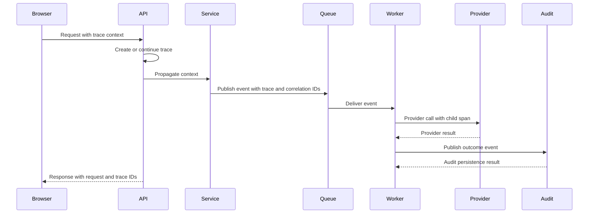

# Observability Architecture

Status: Draft
Implementation State: Target architecture; not current implementation evidence
Current-State Source: [Current Architecture](./Current%20Architecture.md)
Owner: SinLess Games LLC
Last Updated: 2026-07-18
Security Classification: Internal Architecture
Foundation Release: `0.5 — API & Service Platform`
Primary Hardening Release: `0.9 — Observability & Reliability`

Pending Decision Records:

- `docs/rfcs/0008-configuration-and-secrets-model.md`
- `docs/rfcs/0010-api-envelope-request-and-trace-id-propagation.md`
- `docs/rfcs/0011-event-envelope-audit-model-and-idempotency.md`
- `docs/rfcs/0017-observability-trace-propagation-and-alerting.md`

Related RFCs:

- `docs/rfcs/0002-monorepo-library-boundaries.md`
- `docs/rfcs/0003-api-versioning-and-route-strategy.md`
- `docs/rfcs/0004-error-and-result-model.md`
- `docs/rfcs/0005-entity-schema-and-contract-strategy.md`
- `docs/rfcs/0009-authentication-session-and-authorization-model.md`
- `docs/rfcs/0012-workflow-records-and-approval-primitive.md`
- `docs/rfcs/0013-provider-abstraction-and-integration-interface.md`
- `docs/rfcs/0014-module-registry-manifest-and-lifecycle.md`
- `docs/rfcs/0015-discord-permission-role-hierarchy-and-action-safety.md`
- `docs/rfcs/0016-ai-assistant-boundaries-and-mvp-memory-scope.md`

Related Architecture:

- `docs/architecture/Monorepo Architecture.md`
- `docs/architecture/Frontend Architecture.md`
- `docs/architecture/API Architecture.md`
- `docs/architecture/Service Architecture.md`
- `docs/architecture/Data Architecture.md`
- `docs/architecture/Auth Architecture.md`
- `docs/architecture/Security Architecture.md`
- `docs/architecture/Discord Architecture.md`
- `docs/architecture/Module Architecture.md`
- `docs/architecture/Workflow Architecture.md`
- `docs/architecture/AI Architecture.md`
- `docs/architecture/Integration Architecture.md`
- `docs/architecture/Notification Architecture.md`
- `docs/architecture/Audit Architecture.md`

---

## Purpose

This document defines the intended observability architecture for the Aerealith platform.

The observability architecture governs how Aerealith produces, transports, stores, analyzes, presents, alerts on, and retains operational telemetry across:

```text
frontend applications
Cloudflare Workers
Hono APIs
logical services
persistent integration runtimes
Discord gateway and REST behavior
workflow coordinators
queue consumers
scheduled workers
PostgreSQL and CockroachDB
Drizzle persistence
Docker containers
Kubernetes workloads
service mesh components
third-party providers
AI model providers
CI/CD pipelines
security tooling
```

The observability architecture covers:

```text
metrics
logs
traces
profiles
health checks
readiness
service-level indicators
service-level objectives
error budgets
alerting
incident correlation
request IDs
trace IDs
correlation IDs
provider health
queue health
database health
cost visibility
release visibility
security telemetry
audit correlation
runbooks
dashboards
retention
sampling
redaction
cardinality control
self-hosting
```

The guiding rule is:

> Every production failure should be detectable, diagnosable, attributable, and explainable without requiring direct database access, guesswork, or reconstruction from scattered provider consoles.

Observability should help Aerealith answer:

```text
What is happening?
Where is it happening?
Who or what is affected?
When did it begin?
What changed?
What is the user-visible impact?
Which dependency is failing?
Can the system recover safely?
What should an operator do next?
```

---

## Architecture Summary

Aerealith uses OpenTelemetry as the preferred telemetry instrumentation and transport standard.

The platform emits:

```text
structured logs
application metrics
distributed traces
continuous profiles where supported
health signals
release metadata
security signals
business-operational signals
```

Telemetry is routed through provider-neutral adapters and collectors to one or more backends.

Primary observability platforms include:

```text
Grafana Cloud
Datadog
```

The broader Grafana-oriented stack may include:

```text
Mimir for metrics
Loki for logs
Tempo for traces
Pyroscope for continuous profiling
Grafana Alerting for alerts
Kiali for service-mesh visibility
```

Datadog may provide complementary:

```text
APM
infrastructure monitoring
log analysis
real-user monitoring
synthetic monitoring
security monitoring
incident correlation
```

Aerealith should avoid duplicating every signal through two independent SDK stacks.

The preferred direction is:

```text
Application Instrumentation
→ OpenTelemetry SDK or Runtime Adapter
→ OpenTelemetry Collector or Edge Export Adapter
→ Grafana Cloud and/or Datadog
```

Provider-specific exporters remain infrastructure configuration.

Application code should not depend directly on one observability vendor's types.

---

## Observability Goals

The observability architecture should provide:

```text
end-to-end request correlation
service and dependency health
fast failure detection
clear user-impact visibility
provider-neutral instrumentation
safe structured logging
low-cardinality metrics
traceable workflows and provider actions
queue backlog and retry visibility
AI latency and cost visibility
security-event visibility
release and deployment correlation
bounded telemetry cost
self-hosting support
useful local development telemetry
repeatable incident investigation
```

---

## Non-Goals

The observability architecture does not require:

```text
logging every object field
retaining every trace forever
sending secrets or private content to observability providers
using observability data as the authoritative audit store
using metrics as the source of business truth
one dashboard for every code file
one alert for every possible error
paging operators for ordinary recoverable failures
vendor-specific instrumentation throughout application code
capturing complete request and response bodies by default
turning production debugging into permanent surveillance
```

Observability must improve understanding without creating an uncontrolled privacy, cost, or noise problem.

---

## Core Principles

Aerealith observability follows these principles:

```text
Instrument once and export through replaceable adapters.
Prefer OpenTelemetry semantic conventions.
Use structured logs rather than free-form log strings.
Use metrics for trends and thresholds.
Use traces for distributed causality.
Use profiles for resource and code-path analysis.
Use audit records for durable accountability.
Never log secrets.
Minimize private data.
Keep metric labels low-cardinality.
Propagate request and trace context across every boundary.
Correlate telemetry with releases and deployments.
Alert on user impact and actionable system conditions.
Every page-worthy alert requires a runbook.
Observability failures must not crash core product behavior.
Telemetry cost must remain measurable and bounded.
```

---

## Observability Versus Audit

Observability and audit overlap, but they serve different purposes.

### Observability

Answers:

```text
Is the system healthy?
Where is latency occurring?
Which service is failing?
How many requests are affected?
What changed in the deployment?
```

Observability data includes:

```text
metrics
logs
traces
profiles
health checks
alerts
```

### Audit

Answers:

```text
Who performed a meaningful action?
Which resource changed?
Which approval was used?
What was the final outcome?
```

Audit records are:

```text
append-oriented
scope-aware
retention-governed
user or administrator reviewable
```

Observability providers must not become the authoritative audit store.

Audit records may reference trace IDs.

Traces may reference audit event IDs.

---

## Telemetry Types

Aerealith uses four primary telemetry pillars:

```text
metrics
logs
traces
profiles
```

Health checks and events complement these pillars.

---

## Metrics

Metrics represent aggregated numeric measurements over time.

Metrics are appropriate for:

```text
request rate
error rate
latency
queue depth
consumer lag
provider rate limits
database connection usage
workflow duration
AI token usage
cost estimates
active integration count
module health count
```

Metrics should use stable names, documented units, and bounded label sets.

---

## Logs

Logs represent discrete structured diagnostic events.

Logs are appropriate for:

```text
unexpected failures
state transitions
provider errors
startup configuration
shutdown behavior
retry scheduling
security denials
background-job outcomes
```

Logs should be machine-queryable.

Prefer structured fields such as:

```text
service
operation
status
errorCode
requestId
traceId
correlationId
provider
moduleId
workflowId
runId
durationMs
```

---

## Traces

Traces represent distributed execution paths.

Traces should connect:

```text
browser request
edge request
API handler
application service
repository call
queue publish
queue consumer
provider API call
audit consumer
notification delivery
```

A trace should show where time was spent and where failure occurred.

---

## Profiles

Continuous profiling helps identify:

```text
CPU hotspots
memory pressure
allocation hotspots
blocking operations
unexpected runtime cost
```

Pyroscope or a compatible profiler may be used where runtime support permits.

Profiles must avoid capturing sensitive payloads.

---

## High-Level Observability Architecture

```mermaid
flowchart TD
  Browser["Browser / Frontend"]
  Edge["Cloudflare Edge and Workers"]
  API["Hono API"]
  Services["Logical Services"]
  Integrations["Integration Runtimes"]
  Workers["Queue and Scheduled Workers"]
  Database["PostgreSQL / CockroachDB"]
  Providers["External Providers"]

  SDK["OpenTelemetry SDKs and Runtime Adapters"]
  Collector["OpenTelemetry Collector / Export Gateway"]

  Mimir["Grafana Cloud Metrics / Mimir"]
  Loki["Grafana Cloud Logs / Loki"]
  Tempo["Grafana Cloud Traces / Tempo"]
  Pyroscope["Grafana Cloud Profiles / Pyroscope"]
  Datadog["Datadog"]
  Kiali["Kiali"]
  Alerts["Alerting and Incident Routing"]

  Browser --> SDK
  Edge --> SDK
  API --> SDK
  Services --> SDK
  Integrations --> SDK
  Workers --> SDK
  Database --> Collector
  Providers --> Services

  SDK --> Collector
  Collector --> Mimir
  Collector --> Loki
  Collector --> Tempo
  Collector --> Pyroscope
  Collector --> Datadog

  Mimir --> Alerts
  Loki --> Alerts
  Tempo --> Alerts
  Datadog --> Alerts
  Kiali --> Alerts
```



Not every runtime supports every telemetry signal equally.

The architecture should preserve consistent contracts while allowing runtime-specific exporters.

---

## OpenTelemetry Standard

OpenTelemetry is the preferred standard for:

```text
trace context
span creation
metric instruments
log correlation
semantic attributes
export transport
collector pipelines
```

Aerealith should use W3C Trace Context where supported:

```text
traceparent
tracestate
```

Baggage should be used sparingly.

Do not place secrets, private message content, or high-cardinality values in baggage.

---

## Instrumentation Boundary

Shared instrumentation helpers belong in:

```text
libs/observability
```

Potential structure:

```text
libs/observability/src/
├── context/
├── logging/
├── metrics/
├── tracing/
├── profiling/
├── health/
├── redaction/
├── exporters/
├── testing/
└── index.ts
```

Application code should use Aerealith-owned interfaces.

Provider-specific configuration should remain in:

```text
infrastructure configuration
runtime bootstrap
collector configuration
deployment manifests
```

---

## Observability Interface Direction

Potential shared interfaces:

```ts
export interface AerealithLogger {
  debug(message: string, context?: LogContext): void
  info(message: string, context?: LogContext): void
  warn(message: string, context?: LogContext): void
  error(message: string, context?: LogContext): void
}

export interface AerealithMetrics {
  increment(name: string, value?: number, attributes?: MetricAttributes): void
  record(name: string, value: number, attributes?: MetricAttributes): void
  gauge(name: string, value: number, attributes?: MetricAttributes): void
}

export interface AerealithTracer {
  startSpan<T>(
    name: string,
    options: SpanOptions,
    operation: (span: AerealithSpan) => Promise<T>,
  ): Promise<T>
}
```

The final implementation may wrap OpenTelemetry APIs directly where doing so remains stable and provider-neutral.

---

## Request Context

Every inbound request should establish an observability context.

Expected fields:

```text
requestId
traceId
spanId
correlationId
causationId
service
environment
release
actor reference when safe
scope reference when safe
```

The request ID is an application support identifier.

The trace ID is a distributed tracing identifier.

They may be related but should not be treated as interchangeable.

---

## Request ID

A request ID should be:

```text
unique
opaque
safe to expose publicly
included in API responses
included in logs
included in traces
propagated to background work
```

Example response field:

```json
{
  "requestId": "req_123"
}
```

The request ID should not encode:

```text
user ID
account ID
server ID
internal host information
```

---

## Trace ID

A trace ID should follow the active tracing standard.

Trace IDs should be propagated across:

```text
HTTP
queue messages
scheduled jobs
provider adapters
audit events
notification events
workflow steps
```

Trace IDs may be returned in API envelopes when safe.

---

## Correlation and Causation

Correlation IDs group related activity.

Examples:

```text
workflow run
integration connection flow
account deletion process
Discord moderation action
```

Causation IDs identify the event or action that directly caused later work.

Example:

```text
community.member.joined
→ workflow.run.started
→ notification.created
```

These identifiers improve investigation without requiring full event sourcing.

---

## Trace Propagation



---

## Frontend Observability

Frontend observability should cover:

```text
page load performance
route transitions
API failures
GraphQL or tRPC failures
React rendering errors
JavaScript exceptions
user-visible latency
asset failures
session initialization
feature-flag evaluation
```

Potential tools include:

```text
OpenTelemetry browser instrumentation
Datadog RUM
synthetic monitoring
Web Vitals
```

Frontend telemetry must avoid collecting:

```text
password fields
session tokens
private form contents
private messages
full DOM snapshots by default
```

---

## Web Vitals

Frontend performance should track:

```text
Largest Contentful Paint
Interaction to Next Paint
Cumulative Layout Shift
First Contentful Paint
Time to First Byte
```

Web Vitals should be segmented by:

```text
route group
deployment version
device class
browser class
region
```

Avoid user IDs as metric labels.

---

## Frontend Error Boundaries

React error boundaries should:

```text
capture safe error context
show a user-friendly fallback
include request or trace references when available
avoid exposing stack traces publicly
emit telemetry
```

A frontend error should not silently leave the user staring at a dead screen like the application has chosen violence.

---

## API Observability

Hono API observability should include:

```text
request count
request duration
response status
error code
route template
request size
response size
rate-limit outcome
authentication outcome
authorization outcome
```

Use route templates rather than raw URLs.

Correct:

```text
/api/V1/workflows/{workflowId}
```

Avoid metric labels such as:

```text
/api/V1/workflows/wf_123456
```

Raw resource IDs create unbounded cardinality.

---

## API Span Structure

An API trace may include spans for:

```text
http.request
auth.resolve-session
auth.authorize
request.validate
service.execute
repository.query
queue.publish
response.serialize
```

Spans should include safe attributes such as:

```text
http.request.method
http.route
http.response.status_code
aerealith.error.code
aerealith.risk.level
aerealith.approval.required
```

Do not include raw request bodies by default.

---

## Service Observability

Logical services should expose telemetry for:

```text
operation count
operation duration
operation outcome
error code
retry count
external dependency time
state transition
```

Service operation names should be stable.

Examples:

```text
module.enable
workflow.trigger
integration.disconnect
notification.deliver
moderation.timeout
```

---

## Repository and Database Observability

Database observability should include:

```text
query duration
connection pool usage
connection failures
transaction duration
transaction rollback count
lock contention
migration duration
replication health where applicable
CockroachDB transaction retry count
```

Queries should be identified by:

```text
repository operation
query name
normalized SQL fingerprint
```

Do not attach raw parameter values to telemetry.

---

## Drizzle Observability

Drizzle-based persistence should instrument:

```text
repository operation
query duration
row-count category
transaction outcome
retry behavior
migration execution
```

Repository methods should expose stable operation names.

Example:

```text
workflowRepository.findById
moduleRepository.updateStatus
integrationRepository.listForAccount
```

---

## PostgreSQL and CockroachDB Signals

Database dashboards should include:

```text
CPU
memory
storage
active connections
connection saturation
query latency
slow-query count
transaction conflicts
deadlocks
replication or range health
backup status
restore status
```

Cross-database compatibility testing should emit separate environment and engine attributes.

Example:

```text
database.system=postgresql
database.system=cockroachdb
```

---

## Queue Observability

Queues and event consumers should expose:

```text
published message count
consumed message count
queue depth
oldest message age
consumer lag
processing duration
retry count
dead-letter count
deduplication count
idempotency conflict count
```

Queue dashboards should answer:

```text
Is work arriving?
Is work being processed?
Is backlog growing?
Which consumer is failing?
Are retries creating a storm?
```

---

## Event Telemetry

Event telemetry should use:

```text
event type
event version
producer
consumer
outcome
attempt
```

Avoid using event IDs as metric labels.

Event IDs belong in logs and traces.

---

## Workflow Observability

Workflow telemetry should include:

```text
run count
run duration
run success rate
run failure rate
partial-success rate
approval wait time
retry count
timeout count
cancellation count
stuck-run count
step duration
action failure rate
```

Every workflow run should correlate:

```text
workflow ID in logs and traces
workflow version
run ID
current step
request ID
trace ID
approval ID where applicable
```

Workflow IDs and run IDs should not become metric labels unless cardinality is tightly bounded.

---

## Stuck-Run Detection

A workflow may be considered stuck when:

```text
it remains Running beyond its heartbeat threshold
it waits for a retry past the scheduled time
it waits for expired approval
it has no terminal state after queue completion
```

Stuck-run detection should create:

```text
metric
structured log
operator alert
runbook link
recovery option
```

---

## Discord Observability

Discord telemetry should include:

```text
gateway connection state
gateway reconnect count
gateway resume count
heartbeat latency
event rate by normalized type
interaction latency
interaction timeout count
REST request count
REST latency
rate-limit count
rate-limit wait time
permission denial count
role-hierarchy denial count
server health state
module failure count
```

Discord observability should distinguish:

```text
Aerealith permission denial
Discord user permission denial
bot permission denial
role-hierarchy block
provider rejection
provider outage
```

These are operationally different failures.

---

## Discord Gateway Health

Gateway health should expose:

```text
connected
resumable
session age
last heartbeat acknowledgment
last event received
reconnect attempts
shard ID later
```

A live process is not necessarily a healthy Discord runtime.

---

## Integration Observability

Integration telemetry should include:

```text
connection count
connection success rate
connection degradation count
credential refresh failure count
provider request latency
provider error rate
provider rate-limit count
webhook verification failure count
webhook replay count
sync duration
sync lag
reconciliation failures
disconnect failures
```

Provider telemetry should be normalized while preserving provider identity.

---

## Provider Health

Provider health should distinguish:

```text
Healthy
Degraded
Unavailable
RateLimited
Misconfigured
CredentialExpired
PermissionMissing
Unknown
```

A single provider outage should not mark the entire Aerealith platform unavailable.

---

## Webhook Observability

Webhook telemetry should include:

```text
request count
verification success rate
verification failure rate
payload-size distribution
duplicate delivery count
normalization failure count
processing latency
queue publication failure
```

Do not log full webhook payloads by default.

---

## Module Observability

Module telemetry should include:

```text
available module count
enabled installation count
active installation count
degraded installation count
module action count
module action duration
module action failure count
configuration validation failures
dependency failures
permission failures
upgrade failures
```

Every module telemetry event should include safe fields such as:

```text
moduleId
moduleVersion
operation
status
errorCode
```

Installation IDs belong in logs and traces, not high-cardinality metrics.

---

## Notification Observability

Notification telemetry should include:

```text
notification count by type and category
delivery count by channel
delivery success rate
delivery latency
retry count
bounce rate
complaint rate
dead-letter count
deduplication count
suppression count
digest delay
queue depth
```

Provider acceptance must not be labeled as confirmed delivery.

---

## Audit Observability

Audit subsystem telemetry should include:

```text
audit event received count
audit record created count
validation failure count
redaction count
secret-detection count
idempotency deduplication count
consumer lag
write failure count
dead-letter count
query latency
export failure count
```

Critical audit failures require prominent alerting.

---

## AI Observability

AI telemetry should include:

```text
capability
provider
model class
request count
request latency
time to first token
time to completion
input tokens
output tokens
estimated cost
provider failure rate
validation failure rate
fallback count
context denial count
policy denial count
proposal count
approval rate
tool execution success rate
```

AI logs must not include full private prompts or model responses by default.

---

## AI Cost Visibility

AI cost should be observable by:

```text
capability
account class
provider
model
module
environment
time period
```

Avoid user IDs as long-lived metric labels.

Detailed per-user usage belongs in protected application records rather than shared metrics.

---

## AI Quality Signals

Operational AI quality signals may include:

```text
structured-output failure rate
tool-proposal rejection rate
user retry rate
user correction rate
proposal rejection rate
hallucination report count
prompt-injection detection count
```

Quality telemetry does not replace formal evaluations.

---

## Security Observability

Security telemetry should include:

```text
authentication failure spikes
revoked-session attempts
authorization denials
cross-scope access attempts
OAuth state failures
webhook verification failures
API key failures
approval replay attempts
secret-scanner findings
critical dependency vulnerabilities
container vulnerabilities
privileged actions
break-glass activation
```

Security telemetry should remain separate from ordinary product analytics.

---

## CI/CD Observability

Engineering pipelines should expose status for:

```text
build
lint
format
typecheck
unit tests
integration tests
end-to-end tests
coverage
static analysis
dependency review
secret scanning
container scanning
visual regression
deployment
rollback
```

Current and planned tools include:

```text
GitHub CodeQL
Snyk
Semgrep
Gitleaks
Trivy
Codecov
Dependabot
Renovate
Meticulous AI
SonarQube or SonarLint
Datadog
Grafana Cloud
```

---

## CI Signal Ownership

| Tool          | Signal Ownership                                         |
| ------------- | -------------------------------------------------------- |
| CodeQL        | Semantic vulnerability findings.                         |
| Snyk          | Dependency, code, container, and IaC risk.               |
| Semgrep       | Custom and policy-driven static analysis.                |
| Gitleaks      | Secret detection.                                        |
| Trivy         | Image, package, and configuration scanning.              |
| Codecov       | Coverage trend and threshold visibility.                 |
| Dependabot    | Security alerts and dependency updates.                  |
| Renovate      | Dependency update policy and automation.                 |
| Meticulous AI | Visual regression status.                                |
| Datadog       | Runtime and service telemetry.                           |
| Grafana Cloud | Metrics, logs, traces, profiles, dashboards, and alerts. |

These tools should publish release and deployment metadata where supported.

---

## Release Observability

Every deployment should include:

```text
release version
Git commit SHA
build ID
deployment ID
environment
deployed at
deployment actor or workflow
```

Telemetry should allow operators to compare:

```text
before deployment
after deployment
previous release
current release
```

Release markers should appear on dashboards.

---

## Deployment Events

Useful deployment events include:

```text
deployment.started
deployment.succeeded
deployment.failed
deployment.rolled-back
migration.started
migration.succeeded
migration.failed
```

Deployment events should correlate with:

```text
service
release
environment
request or workflow ID
```

---

## Service-Level Indicators

A service-level indicator is a measured signal representing user-visible service quality.

Recommended indicator categories:

```text
availability
latency
correctness
freshness
durability
```

---

## Service-Level Objectives

A service-level objective defines a target for one or more indicators.

Potential initial SLOs:

```text
API availability
API latency
Discord interaction acknowledgment latency
workflow completion reliability
notification creation reliability
audit-event persistence reliability
queue freshness
integration health-check freshness
```

Exact target percentages and windows require operational review.

---

## User-Journey SLOs

Aerealith should eventually define SLOs around important user journeys rather than only internal services.

Examples:

```text
sign in and load dashboard
connect Discord server
enable module
execute approved moderation action
view audit result
receive workflow approval notification
```

User-journey SLOs reveal failures that individual service metrics may miss.

---

## Error Budgets

An error budget represents the allowed failure or unavailability within an SLO window.

Error budgets should influence:

```text
release pace
reliability work
incident priority
feature rollout
```

When an error budget is exhausted:

```text
reduce risky deployment activity
prioritize reliability defects
review alert quality
review capacity and dependency failures
```

Error budgets must not be used to excuse security failures or data loss.

---

## RED Method

Request-driven services should use the RED method:

```text
Rate
Errors
Duration
```

Examples:

```text
API
provider adapters
notification delivery
AI requests
workflow actions
```

---

## USE Method

Infrastructure resources should use the USE method:

```text
Utilization
Saturation
Errors
```

Examples:

```text
CPU
memory
network
database connections
queue workers
container resources
```

---

## Health Checks

Every deployable runtime should expose:

```text
liveness
readiness
startup health where useful
```

### Liveness

Answers:

```text
Is the process alive?
```

Liveness should not fail because an optional external provider is unavailable.

### Readiness

Answers:

```text
Can this runtime safely receive its assigned work?
```

Readiness may fail when:

```text
required configuration is invalid
database access is unavailable
required queue is unavailable
provider credentials required for this runtime are invalid
policy registry failed to load
```

---

## Health Endpoint Direction

Potential endpoints:

```text
/health/live
/health/ready
/health/startup
```

Public health endpoints should expose minimal information.

Detailed dependency health belongs behind authenticated operational access.

---

## Dependency Health

Dependency health should include:

```text
database
queue
secret store
provider adapter
observability exporter
feature-flag service
object storage
```

An observability exporter failure should not normally make the product runtime unready.

Telemetry should fail safely and buffer or drop according to documented policy.

---

## Logging Architecture

Logs should be structured JSON in production.

Recommended fields:

```text
timestamp
level
message
service
environment
release
operation
status
errorCode
requestId
traceId
spanId
correlationId
causationId
provider
moduleId
workflowId
runId
durationMs
```

Fields should use consistent naming across runtimes.

---

## Log Levels

Recommended levels:

```text
trace
debug
info
warn
error
fatal
```

Production defaults should avoid `trace` and `debug` unless temporarily enabled through controlled configuration.

---

## Log-Level Guidance

### Trace

Very detailed internal flow.

Normally disabled in production.

### Debug

Diagnostic detail useful during investigation.

Must remain redacted.

### Info

Normal meaningful runtime behavior.

Examples:

```text
service started
connection established
migration completed
consumer resumed
```

### Warn

Unexpected condition with safe recovery or degraded behavior.

### Error

Operation failed and requires investigation or user-visible handling.

### Fatal

Runtime cannot continue safely.

---

## Error Logging

Errors should use the stable Aerealith error model.

Log fields should include:

```text
errorCode
errorCategory
retryable
publicMessage category
internal cause category
```

Do not expose full exception details in public responses.

Internal stack traces may be logged only after redaction.

---

## Secret Redaction

Logs, traces, and events must redact:

```text
passwords
session tokens
cookies
API key secrets
OAuth access tokens
OAuth refresh tokens
webhook secrets
private keys
authorization headers
MFA secrets
recovery codes
```

Redaction should occur:

```text
at instrumentation helpers
at logger serializers
at collector processors
at provider ingestion controls
```

Defense in depth is required.

---

## PII Minimization

Observability data should avoid:

```text
full names
email addresses
raw IP addresses
private message content
ticket transcripts
moderation evidence
uploaded document content
```

When identity correlation is required, prefer:

```text
opaque internal ID
hashed identifier
coarse category
safe reference
```

---

## Content Logging Policy

By default, do not log:

```text
request bodies
response bodies
GraphQL variables
Discord message content
ticket messages
AI prompts
AI responses
webhook payloads
```

Temporary content logging requires:

```text
explicit incident need
short retention
restricted access
redaction
approval
post-incident cleanup
```

---

## Metric Naming

Metric names should be:

```text
stable
lowercase
unit-aware
provider-neutral
```

Examples:

```text
aerealith.api.requests
aerealith.api.request.duration
aerealith.workflow.runs
aerealith.workflow.run.duration
aerealith.discord.gateway.connected
aerealith.integration.requests
aerealith.notification.deliveries
aerealith.audit.consumer.lag
aerealith.ai.tokens.input
```

The exact naming convention should be finalized in RFC 0017.

---

## Metric Units

Use explicit units:

```text
seconds
milliseconds
bytes
items
requests
tokens
currency units
```

Avoid ambiguous metric names such as:

```text
request_time
```

Prefer:

```text
aerealith.api.request.duration
```

with a documented unit.

---

## Cardinality Control

High-cardinality metric labels are a major cost and reliability risk.

Avoid labels such as:

```text
userId
accountId
workflowRunId
messageId
requestId
traceId
raw URL
error message
```

Appropriate metric labels may include:

```text
service
environment
route template
operation
provider
status class
error code
module ID when bounded
workflow action type
```

Detailed identifiers belong in logs and traces.

---

## Histogram Strategy

Latency and size measurements should use histograms.

Potential histogram dimensions:

```text
API request duration
provider request duration
queue processing duration
workflow run duration
AI request duration
notification delivery duration
```

Bucket strategy should reflect real latency expectations.

Default library buckets should be reviewed rather than accepted blindly.

---

## Trace Sampling

Aerealith should use configurable trace sampling.

Potential strategies:

```text
head sampling
tail sampling
error-biased sampling
latency-biased sampling
security-event sampling
```

Recommended direction:

```text
sample a bounded percentage of successful requests
retain a higher percentage of errors
retain slow traces
retain critical security traces
retain workflow and provider failures
```

Sampling policy must remain transparent to operators.

---

## Tail Sampling

A collector may apply tail sampling based on:

```text
error status
latency threshold
service
operation
risk level
security signal
```

Tail sampling can preserve important traces while controlling cost.

It requires buffering and collector capacity planning.

---

## Log Sampling

Routine high-volume logs may be sampled.

Never sample away all evidence of:

```text
critical security events
audit consumer failures
credential failures
break-glass actions
data-loss conditions
```

Sampling must be applied by policy, not random developer improvisation.

---

## Profile Sampling

Profiles should use bounded sampling rates.

Profiling overhead should be measured before broad production rollout.

Runtime-specific support may vary across:

```text
Cloudflare Workers
Node.js containers
Kubernetes workloads
```

---

## Dashboard Architecture

Dashboards should be organized by operational question.

Recommended dashboard groups:

```text
platform overview
API health
frontend experience
Discord runtime
integrations
workflows
notifications
audit
AI
queues
database
Kubernetes
security
release comparison
```

---

## Platform Overview Dashboard

Should answer:

```text
Is the platform available?
Are users experiencing failures?
Which service is degraded?
Is latency increasing?
Are queues backing up?
Did a deployment just occur?
```

Core panels may include:

```text
request rate
error rate
p95 and p99 latency
active incidents
queue depth
database saturation
provider health
release markers
```

---

## Service Dashboard Standard

Every production service dashboard should include:

```text
request or work rate
error rate
latency
resource usage
dependency health
queue state where applicable
release version
SLO status
recent alerts
```

---

## Dashboard Ownership

Every dashboard should have:

```text
owner
purpose
primary audience
data sources
review date
runbook links
```

Stale dashboards should be retired.

A dashboard graveyard is still a graveyard, even if it has pretty graphs.

---

## Alerting Architecture

Alerts should be generated from:

```text
metrics
logs
traces
synthetic checks
health checks
security findings
```

Alerts should focus on:

```text
user impact
security impact
data durability
operational actionability
```

---

## Alert Severity

Recommended alert severities:

```text
Critical
High
Warning
Informational
```

### Critical

Immediate human response required.

Examples:

```text
widespread authentication outage
audit events cannot be durably preserved
data loss
credential compromise
production database unavailable
```

### High

Prompt response required.

Examples:

```text
major queue backlog
Discord runtime disconnected broadly
provider failure affecting many users
workflow failure spike
```

### Warning

Investigation required during normal operational response.

### Informational

Useful operational signal without paging.

---

## Page Versus Ticket

Page an operator when:

```text
immediate action can reduce user or security impact
waiting creates material risk
the condition is not expected to self-heal safely
```

Create a ticket or non-paging alert when:

```text
work can wait
impact is limited
recovery is automatic
trend review is sufficient
```

---

## Alert Ownership

Every alert must define:

```text
owner
severity
condition
expected impact
runbook
escalation
silence policy
```

An alert without an owner is just a haunted notification.

---

## Duplicate Alert Prevention

When both Grafana Cloud and Datadog monitor the same signal, one system should own paging.

The other may provide:

```text
secondary visibility
correlation
backup detection
```

Avoid duplicate paging for the same incident.

---

## Alert Grouping

Alerts should group related failures by:

```text
service
provider
environment
region
incident class
```

Grouping should avoid one page per affected resource.

---

## Alert Inhibition

Alerting should inhibit downstream noise when a root dependency is already known to be unavailable.

Example:

```text
Database unavailable
```

may inhibit:

```text
API repository errors
workflow persistence errors
notification persistence errors
```

The root incident remains visible.

---

## Runbooks

Every high or critical alert requires a runbook.

A runbook should include:

```text
alert meaning
likely causes
user impact
first checks
dashboards
logs and traces
safe mitigation
rollback steps
escalation
recovery verification
```

Runbooks should remain version-controlled.

---

## Incident Correlation

Incident investigation should correlate:

```text
alerts
release events
traces
logs
metrics
audit records
provider status
security findings
```

An incident timeline should answer:

```text
what changed
when impact began
when detection occurred
which mitigation was applied
when recovery completed
```

---

## Synthetic Monitoring

Synthetic monitoring may test:

```text
public homepage
sign-in availability
API health
critical documentation routes
OAuth callback availability
webhook endpoints
```

Authenticated synthetic flows require secure test identities and dedicated credentials.

Synthetic monitoring must not modify real user data.

---

## Real User Monitoring

Real-user monitoring may provide:

```text
frontend performance
browser errors
route latency
geographic impact
release comparison
```

RUM configuration must minimize private data and session capture.

Session replay should remain disabled unless a dedicated privacy and security review approves a constrained use.

---

## Kiali and Service Mesh Observability

When Kubernetes and Istio are used, Kiali may provide:

```text
service topology
traffic flow
mTLS status
error rates
latency
configuration validation
```

Kiali does not replace application tracing or business metrics.

Service-mesh telemetry should correlate with OpenTelemetry traces where practical.

---

## Kubernetes Observability

Kubernetes telemetry should include:

```text
node health
pod health
container restarts
CPU and memory
resource requests and limits
OOM kills
scheduling failures
persistent-volume health
network-policy failures
service-account behavior
```

Application alerts should not depend solely on Kubernetes readiness.

A pod can be ready while the product experience is still broken.

---

## Container Observability

Containers should expose:

```text
process uptime
CPU
memory
file descriptors where relevant
network errors
restart count
graceful-shutdown duration
```

Container logs should write to stdout and stderr in structured form.

---

## Cloudflare Observability

Cloudflare-related telemetry may include:

```text
Worker request rate
Worker errors
CPU time
subrequest count
cache status
WAF actions
rate-limit actions
queue behavior
Durable Object health where used
```

Cloudflare logs may be exported through:

```text
Logpush
Workers Analytics
OpenTelemetry-compatible exporters where supported
```

Cloudflare-specific telemetry should map into normalized platform dashboards.

---

## Edge Trace Context

The edge should preserve or create trace context before forwarding work.

Edge-generated request IDs should be propagated into:

```text
API handlers
queues
provider calls
responses
```

Proxy or CDN identifiers may be stored as safe secondary fields.

---

## Database Migration Observability

Migration telemetry should include:

```text
migration ID
engine
start time
end time
duration
status
rows affected category
backfill progress
lock wait
retry count
```

Migration failures require immediate visibility before application rollout continues.

---

## Backup and Restore Observability

Backup telemetry should include:

```text
last successful backup
backup duration
backup size
backup failure
retention status
encryption status
restore-test result
restore-test duration
```

A backup dashboard without restore-test visibility is optimism wearing a badge.

---

## Cost Observability

Observability cost should be tracked by:

```text
metrics volume
log volume
trace volume
profile volume
retention
provider
service
environment
```

Cost controls may include:

```text
sampling
retention tiers
cardinality limits
log-level controls
attribute filtering
collector routing
```

---

## Telemetry Budgets

Each environment should define telemetry budgets.

Examples:

```text
maximum daily log volume
maximum active metric series
maximum trace ingestion
maximum profile overhead
```

Production budgets may differ from preview and staging.

---

## Retention

Retention should be defined separately for:

```text
metrics
logs
traces
profiles
synthetic results
security telemetry
release events
```

Suggested direction:

```text
metrics: longer trend retention
logs: shorter operational retention with selected longer security retention
traces: sampled bounded retention
profiles: bounded performance-analysis retention
```

Exact durations require cost, privacy, and operational review.

---

## Environment Separation

Observability data should be labeled and separated by:

```text
local
test
preview
staging
production
```

Production alerts should not fire from preview data.

Preview telemetry should not receive production secrets or private production data.

---

## Local Development

Local development should support:

```text
console structured logs
local OpenTelemetry collector
local Grafana stack where useful
in-memory metrics for tests
trace visualization
fake exporters
disabled-export mode
```

Developers should be able to inspect local request and trace flow without production access.

---

## Test Observability

Test telemetry may help diagnose:

```text
flaky tests
slow tests
resource leaks
integration-test failures
end-to-end timing
```

Test telemetry must remain separate from production dashboards and alerts.

---

## Observability Configuration

Configuration may include:

```text
observability enabled
service name
environment
release
OTLP endpoint
metric export interval
trace sampling rate
log level
profiling enabled
provider API keys
redaction policy
```

Configuration should be centralized and validated.

Avoid scattered direct environment access.

---

## Environment Variables

Environment variables should use Aerealith-prefixed names.

Examples:

```text
AEREALITH_OBSERVABILITY_ENABLED
AEREALITH_OTEL_EXPORTER_OTLP_ENDPOINT
AEREALITH_OTEL_SERVICE_NAME
AEREALITH_OTEL_TRACE_SAMPLE_RATE
AEREALITH_LOG_LEVEL
AEREALITH_PROFILING_ENABLED
AEREALITH_GRAFANA_CLOUD_ENDPOINT
AEREALITH_DATADOG_ENABLED
```

Provider credentials must remain secret-managed.

---

## Collector Architecture

An OpenTelemetry Collector may provide:

```text
batching
retry
filtering
redaction
sampling
resource enrichment
multi-backend export
```

Collector pipelines should be version-controlled.

---

## Collector Failure Behavior

When the collector is unavailable:

```text
application behavior should continue
telemetry should buffer only within bounded limits
backpressure must not exhaust memory
loss should be measurable
critical security or audit behavior must use durable platform records instead
```

---

## Export Routing

Telemetry may route by signal and environment.

Example:

```text
metrics -> Grafana Cloud and selected Datadog monitors
logs -> Loki and selected Datadog security pipelines
traces -> Tempo and Datadog APM where justified
profiles -> Pyroscope
```

Do not duplicate high-volume telemetry without a documented reason.

---

## Vendor Ownership Model

Aerealith should define which platform is authoritative for each operational function.

Example direction:

| Function                 | Primary Platform             | Secondary Platform          |
| ------------------------ | ---------------------------- | --------------------------- |
| Metrics dashboards       | Grafana Cloud                | Datadog                     |
| Logs                     | Grafana Cloud Loki           | Datadog selected pipelines  |
| Traces                   | Grafana Cloud Tempo          | Datadog APM where justified |
| Profiles                 | Grafana Cloud Pyroscope      | None initially              |
| Runtime security signals | Datadog where configured     | Grafana dashboards          |
| Paging                   | One selected owner per alert | Secondary visibility only   |

The exact ownership model should be finalized in RFC 0017.

---

## Privacy and Observability

Observability data must follow:

```text
purpose limitation
data minimization
access control
retention
delete or anonymize where required
provider review
```

Observability must not become a hidden archive of private user content.

---

## Access Control

Observability access should use:

```text
named identities
MFA
least privilege
environment separation
role-based access
access review
```

Production log and trace access should be restricted.

Sensitive security telemetry may require stronger roles.

---

## Break-Glass Access

Emergency observability access should be:

```text
time-limited
reason-bound
audited
reviewed after use
```

Break-glass access should not become ordinary dashboard access.

---

## Observability Data Export

Operational telemetry exports should require:

```text
authorized purpose
scope restriction
private-data review
short-lived artifact access
```

Exports should not casually include raw production logs or private traces.

---

## Observability Failure Modes

The observability system may fail through:

```text
collector outage
provider outage
credential failure
quota exhaustion
cardinality explosion
log flood
sampling misconfiguration
alert-routing failure
dashboard drift
clock skew
trace-context loss
```

Each failure mode should have detection and recovery behavior.

---

## Clock Synchronization

Distributed telemetry depends on accurate clocks.

Hosts and runtimes should use reliable time synchronization.

Clock skew can distort:

```text
trace ordering
incident timelines
queue-age calculations
certificate validity
provider signatures
```

Clock-drift alerts should exist for self-hosted and Kubernetes infrastructure where practical.

---

## Graceful Degradation

Observability failures should degrade safely.

| Failure                      | Required Behavior                                                |
| ---------------------------- | ---------------------------------------------------------------- |
| Metrics exporter unavailable | Continue product behavior and emit bounded local diagnostics.    |
| Log backend unavailable      | Continue with bounded buffering and avoid memory exhaustion.     |
| Trace exporter unavailable   | Continue requests without blocking.                              |
| Profiling unavailable        | Disable profiling and preserve runtime behavior.                 |
| Dashboard unavailable        | Preserve telemetry ingestion where possible.                     |
| Alert router unavailable     | Use documented secondary escalation path for critical incidents. |
| Datadog unavailable          | Preserve Grafana Cloud telemetry.                                |
| Grafana Cloud unavailable    | Preserve selected Datadog telemetry where configured.            |
| AI unavailable               | Keep deterministic operational dashboards and alerts.            |

---

## Observability and User-Facing Status

User-facing status should be derived from verified operational state.

Potential status surfaces:

```text
integration health
module health
workflow health
provider outage notices
maintenance notices
```

Internal telemetry detail should not be exposed directly to users.

---

## Status Page Direction

A future status page may display:

```text
platform availability
API status
Discord integration status
notification delivery status
AI capability status
scheduled maintenance
incident updates
```

Status communication should remain accurate and avoid exposing sensitive infrastructure details.

---

## Incident Response Integration

Observability should support:

```text
detection
triage
containment
recovery
post-incident review
```

Incident records should link:

```text
alerts
dashboards
traces
logs
releases
audit records
runbooks
```

---

## Post-Incident Review

Post-incident review should evaluate:

```text
time to detect
time to acknowledge
time to mitigate
time to recover
alert usefulness
telemetry gaps
runbook quality
release correlation
```

Every major incident should produce observability improvements where gaps were found.

---

## Testing Strategy

Observability testing should include:

```text
request-context tests
trace-propagation tests
structured-log tests
redaction tests
metric-name tests
cardinality tests
sampling tests
exporter-failure tests
health-check tests
alert-rule tests
dashboard-query tests
queue-lag tests
release-marker tests
provider-adapter tests
integration tests
end-to-end tests
```

Coverage requirement:

```text
80% statements
80% branches
80% functions
80% lines
```

Telemetry correctness requires direct tests beyond code coverage.

---

## Critical Observability Tests

Tests must prove:

```text
request IDs are created and propagated
trace context crosses HTTP and queue boundaries
public responses contain safe request references
logs are structured
secrets are redacted
private request bodies are not logged
metric labels remain bounded
raw resource IDs are not metric labels
provider errors include safe correlation
workflow traces connect trigger to action
Discord moderation traces include provider result
audit events preserve trace IDs
notification delivery preserves trace IDs
exporter failure does not crash requests
health checks distinguish live from ready
release metadata appears in telemetry
```

---

## Redaction Tests

Redaction tests should include:

```text
Authorization header
Cookie header
session token
API key
OAuth token
Discord bot token
password
MFA secret
private key
webhook secret
AI prompt containing a secret pattern
```

The telemetry event should remain useful without the prohibited value.

---

## Cardinality Tests

Tests should detect accidental labels containing:

```text
user IDs
request IDs
trace IDs
message IDs
workflow run IDs
raw URLs
error messages
```

CI should fail when approved metric schemas are violated.

---

## Trace Propagation Tests

Trace propagation tests should cover:

```text
browser to API
API to service
service to database
service to queue
queue to worker
worker to provider
provider result to audit event
notification consumer
```

---

## Alert Tests

Alert rules should be tested against synthetic time series.

Tests should prove:

```text
alert fires at threshold
alert resolves correctly
alert does not fire on expected noise
alert groups correctly
alert includes runbook and owner
critical alerts reach the intended route
```

---

## Dashboard Tests

Dashboard validation should check:

```text
queries compile
expected labels exist
panels use bounded time ranges
release markers render
links point to valid runbooks
```

Dashboard-as-code is preferred.

---

## End-to-End Observability Tests

Initial E2E scenarios should include:

```text
send API request
observe request ID in response
find matching log
find matching trace
find service span
find database span
trigger queue work
find consumer span
find audit correlation
```

Failure scenarios should include:

```text
provider timeout
queue retry
permission denial
invalid webhook
AI output validation failure
observability exporter outage
```

---

## File Structure

Recommended observability library structure:

```text
libs/observability/
├── src/
│   ├── context/
│   │   ├── request-context.ts
│   │   ├── trace-context.ts
│   │   └── correlation-context.ts
│   ├── logging/
│   │   ├── logger.ts
│   │   ├── log-context.ts
│   │   ├── log-serializer.ts
│   │   └── log-redaction.ts
│   ├── metrics/
│   │   ├── metrics.ts
│   │   ├── metric-names.ts
│   │   ├── metric-attributes.ts
│   │   └── metric-guards.ts
│   ├── tracing/
│   │   ├── tracer.ts
│   │   ├── span-names.ts
│   │   ├── span-attributes.ts
│   │   └── propagation.ts
│   ├── profiling/
│   │   └── profiler.ts
│   ├── health/
│   │   ├── health-check.ts
│   │   ├── liveness.ts
│   │   └── readiness.ts
│   ├── exporters/
│   ├── testing/
│   └── index.ts
├── project.json
├── tsconfig.json
├── tsconfig.lib.json
├── tsconfig.spec.json
└── vitest.config.mts
```

---

## Application Instrumentation Structure

Each deployable may include:

```text
src/observability/
├── bootstrap.ts
├── service-metrics.ts
├── service-tracing.ts
├── service-health.ts
└── service-logging.ts
```

Shared logic should remain in `libs/observability`.

Deployables should define only service-specific instruments and runtime setup.

---

## Infrastructure Structure

Potential infrastructure paths:

```text
infrastructure/observability/
├── otel-collector/
├── grafana/
├── datadog/
├── dashboards/
├── alerts/
├── runbooks/
└── synthetic/
```

The exact repository path may differ based on the final infrastructure layout.

---

## Dashboard as Code

Dashboards should be version-controlled where practical.

Changes should receive review.

Dashboard definitions should include:

```text
title
owner
purpose
queries
variables
annotations
runbook links
```

---

## Alert Rules as Code

Alert definitions should be version-controlled.

Changes should be reviewed for:

```text
threshold
window
severity
owner
runbook
routing
noise risk
```

---

## Runbook Structure

Recommended runbook path:

```text
docs/runbooks/observability/
```

Potential runbooks:

```text
API Error Rate.md
Database Saturation.md
Queue Backlog.md
Discord Gateway Down.md
Audit Consumer Failure.md
Notification Delivery Failure.md
AI Provider Failure.md
Telemetry Pipeline Failure.md
```

---

## Release Scope

The observability architecture is delivered in stages.

### Release 0.1

Should establish:

```text
CI visibility
coverage reporting
static-analysis visibility
dependency-update visibility
visual-regression status
```

### Release 0.2

Should establish:

```text
structured logging foundations
shared observability library
error-code telemetry
database-operation telemetry
```

### Release 0.3

Should establish:

```text
authentication telemetry
session telemetry
security-event telemetry
rate-limit telemetry
```

### Release 0.4

Should establish:

```text
frontend error monitoring
Web Vitals
route performance
user-visible error correlation
```

### Release 0.5

Should establish:

```text
request IDs
trace IDs
OpenTelemetry instrumentation
API metrics
service metrics
queue telemetry
workflow telemetry
audit-consumer telemetry
```

### Release 0.6

Should establish:

```text
integration health
provider request telemetry
webhook telemetry
credential-expiration monitoring
```

### Release 0.7

Should establish:

```text
Discord gateway telemetry
interaction telemetry
rate-limit telemetry
module health dashboards
permission and hierarchy failure metrics
```

### Release 0.8

Should establish:

```text
moderation telemetry
ticket telemetry
AI request telemetry
AI usage and cost metrics
notification delivery telemetry
```

### Release 0.9

Should establish:

```text
SLOs
error budgets
production dashboards
production alerts
runbooks
synthetic monitoring
release comparison
incident correlation
backup and restore monitoring
telemetry cost controls
failure and load testing
```

### Release 1.0 and 1.1

Should establish:

```text
private-beta observability review
alert-noise review
production access review
incident rehearsal
human reliability review
launch monitoring
```

---

## MVP Observability Scope

The MVP should include:

```text
OpenTelemetry-compatible instrumentation
structured logs
request IDs
trace IDs
correlation IDs
API metrics
service-operation metrics
queue metrics
database metrics
Discord runtime metrics
integration health
workflow metrics
notification delivery metrics
audit-consumer metrics
AI usage and cost metrics
Grafana Cloud dashboards
Datadog integration where justified
alert ownership
runbooks
sampling and redaction
release metadata
```

The MVP does not require:

```text
perfect tracing across every provider
full session replay
unlimited log retention
one dashboard per module
full anomaly detection
AI-generated incident response
```

---

## Implementation Sequence

Recommended implementation order:

```text
1. Accept RFC 0017.
2. Define telemetry naming and attribute conventions.
3. Create libs/observability.
4. Implement request IDs and trace IDs.
5. Implement structured logging and redaction.
6. Add OpenTelemetry tracing bootstrap.
7. Add API request metrics and spans.
8. Add service-operation metrics and spans.
9. Add repository and database instrumentation.
10. Add queue propagation and consumer telemetry.
11. Add release metadata.
12. Add Grafana Cloud export.
13. Add Datadog export where justified.
14. Define primary alert ownership.
15. Build platform overview dashboard.
16. Build API and database dashboards.
17. Build Discord and integration dashboards.
18. Build workflow, notification, audit, and AI dashboards.
19. Define initial SLIs and SLOs.
20. Define alert rules and runbooks.
21. Add frontend monitoring and Web Vitals.
22. Add synthetic checks.
23. Add profiling where supported.
24. Add telemetry cost and cardinality controls.
25. Add observability failure tests.
26. Run incident-response rehearsal.
27. Complete privacy and security review.
```

---

## Required Architecture Decisions

Before the observability foundation is considered stable, Aerealith must finalize:

```text
telemetry naming convention
service-name convention
resource attributes
request ID format
trace propagation format
correlation and causation fields
log schema
redaction rules
metric label allowlists
trace sampling policy
log sampling policy
retention by signal
Grafana Cloud ownership
Datadog ownership
alert-routing ownership
SLO definitions
error-budget policy
runbook format
health endpoint policy
frontend RUM policy
profiling policy
```

Before dual-provider export is expanded, Aerealith must finalize:

```text
which signals are duplicated
which platform owns paging
cost budget
data residency
redaction parity
outage fallback
```

---

## Observability Anti-Patterns

Avoid:

```text
logging secrets
logging full request bodies by default
using user IDs as metric labels
using request IDs as metric labels
using raw URLs instead of route templates
creating vendor-specific telemetry throughout application code
having two systems page for the same alert
keeping every trace forever
using logs as the audit system
using metrics as business truth
alerting on every exception
creating alerts without runbooks
creating dashboards without owners
making telemetry export block user requests
storing AI prompts in logs
capturing private Discord or ticket content
ignoring release metadata
claiming a backup is healthy without restore tests
```

---

## Relationship to Service Architecture

Services own domain behavior.

The observability layer records:

```text
operation
latency
outcome
error code
correlation
```

Observability helpers should not contain business logic.

---

## Relationship to API Architecture

API routes should emit:

```text
request ID
trace ID
route template
status code
error code
latency
```

Public responses should include safe correlation references.

---

## Relationship to Data Architecture

Database telemetry should observe:

```text
query performance
connection health
migration health
backup and restore health
```

Telemetry must not expose raw query parameters or private row data.

---

## Relationship to Auth Architecture

Authentication telemetry should distinguish:

```text
success
invalid credential
revoked session
expired session
MFA requirement
rate limit
provider failure
```

Security-sensitive fields remain redacted.

---

## Relationship to Security Architecture

Observability supports:

```text
threat detection
incident response
privileged-access review
vulnerability visibility
secret-exposure detection
```

Observability does not replace prevention, authorization, encryption, or audit.

---

## Relationship to Discord Architecture

Discord observability should expose:

```text
gateway health
REST health
rate limits
permissions
role hierarchy
module health
interaction latency
```

Discord-specific attributes remain inside the provider boundary.

---

## Relationship to Module Architecture

Modules should emit normalized telemetry through shared helpers.

Modules must not:

```text
create private observability exporters
log secrets
invent unbounded metric labels
bypass redaction
```

---

## Relationship to Workflow Architecture

Workflow runs should be traceable from trigger to final action.

Workflow metrics should show:

```text
success
failure
retry
approval wait
partial success
stuck runs
```

---

## Relationship to AI Architecture

AI telemetry should expose:

```text
provider
model class
latency
usage
cost
validation
policy denial
proposal outcomes
```

AI private context remains outside normal logs.

---

## Relationship to Integration Architecture

Integration telemetry should normalize:

```text
provider health
latency
errors
rate limits
webhook behavior
sync behavior
```

Provider SDK details remain isolated.

---

## Relationship to Notification Architecture

Notification telemetry should distinguish:

```text
created
queued
accepted
delivered
failed
bounced
suppressed
```

Provider acceptance must not be presented as delivery.

---

## Relationship to Audit Architecture

Audit records may reference trace IDs and request IDs.

Observability data may help investigate audit failures.

Observability systems must not become the authoritative audit store.

---

## Relationship to Trust Model

Observability should make the system more understandable without violating user trust.

Telemetry should be:

```text
purpose-bound
minimal
protected
retention-limited
honest
```

---

## Relationship to Self-Hosting

The observability architecture supports self-hosting through:

```text
OpenTelemetry standards
replaceable collectors
Grafana-compatible backends
Datadog-optional behavior
structured stdout logs
Docker support
Kubernetes support
local dashboards
```

A self-hosted deployment may choose:

```text
Grafana stack
Datadog
another OpenTelemetry-compatible backend
local-only observability
```

Core product behavior should remain independent from the selected backend.

---

## Success Criteria

The observability architecture is successful when:

```text
every request has a request ID
every distributed operation can carry trace context
logs are structured
secrets are redacted
metrics have bounded cardinality
route metrics use templates
queue backlog is visible
workflow runs are traceable
Discord gateway health is visible
provider rate limits are visible
notification delivery states are visible
audit-consumer failures are visible
AI usage and cost are visible
deployments are correlated with telemetry
SLOs represent user-visible behavior
alerts are actionable
critical alerts have runbooks
duplicate paging is controlled
telemetry cost is measurable
observability outages do not crash product behavior
Grafana Cloud and Datadog remain replaceable infrastructure
Cloudflare Workers remain supported
Docker and Kubernetes remain viable
80% coverage is enforced
```

---

## Final Standard

Aerealith observability should make the platform operable without making users observable beyond what is necessary.

The standard is:

> Every Aerealith runtime emits structured, correlated, provider-neutral telemetry through controlled interfaces. Requests, workflows, modules, integrations, Discord actions, notifications, audit events, database operations, AI requests, deployments, and background work remain traceable through stable identifiers; metrics remain low-cardinality; logs and traces exclude secrets and unnecessary private content; alerts focus on user impact and actionable failure; dashboards and runbooks remain owned and version-controlled; observability cost and retention remain bounded; and no telemetry provider becomes a hidden dependency, audit authority, or privacy exception.
