# Architecture

Status: Active
Owner: SinLess Games LLC
Last Updated: 2026-07-18
Document Type: Architecture Index
Implementation State: Mixed; current truth is explicitly identified

The `docs/architecture/` folder explains how Aerealith is designed and how
accepted target boundaries relate to repository reality. Use
[Current Architecture](./Current%20Architecture.md) for what exists now; other
documents may describe accepted or planned target states.

## Project Context

- [Project Overview](../Project-Overview.md)
- [Company and Project Structure](../Company-and-Project-Structure.md)
- [Current State](../CURRENT_STATE.md)
- [Documentation Index](../README.md)

## Purpose

Aerealith AI is designed to become a modular, intelligent, trusted control center for digital life.

The platform is expected to support:

- web dashboard
- Discord community management
- AI assistant capabilities
- workflow automation
- integrations
- modules
- audit logs
- notifications
- developer APIs
- observability
- future marketplace support
- future self-hosting support

Architecture documentation exists to make sure those systems grow intentionally instead of becoming tangled together.

---

## Architecture Philosophy

Aerealith architecture should follow one main rule:

> Start simple, but do not build dead ends.

The platform should avoid both:

```text
Overengineering before real users exist.
```

and:

```text
Shortcuts that make the real vision impossible later.
```

The best architecture for Aerealith is:

```text
Simple enough to ship.
Modular enough to grow.
Typed enough to trust.
Documented enough to maintain.
Flexible enough to replace providers.
Safe enough to automate responsibly.
```

---

## Core Architecture Principles

## User Control First

Aerealith should never hide meaningful actions from the user.

The architecture must support:

```text
approval gates
permission checks
audit logs
manual overrides
clear settings
safe disable paths
```

---

## Trust Before Automation

AI, workflows, modules, and integrations must operate inside trust boundaries.

Before automation becomes powerful, Aerealith needs:

```text
permissions
risk levels
approvals
audit trails
explainability
revocation
failure handling
```

---

## Modular by Default

Aerealith should be built from modules and services with clear boundaries.

Modules should be:

```text
enabled intentionally
configured visibly
audited meaningfully
disabled safely
```

---

## Cloud-First, Not Cloud-Locked

Aerealith may use Cloudflare early because it is practical.

But the architecture should stay:

```text
Docker-aware
provider-replaceable
self-hosting-compatible later
environment-driven
```

Early provider choices should not become permanent prison bars. Fancy prison bars are still prison bars. 🧪

---

## Useful Without AI

AI is a major part of Aerealith, but the platform must not become useless if AI is unavailable.

Core functionality should still work:

```text
dashboard
settings
Discord modules
moderation
tickets
audit logs
notifications
integrations
non-AI workflows
```

AI should enhance the platform, not hold it hostage.

---

## Current Architecture Documents

| Document                                            | Purpose                                                  |
| --------------------------------------------------- | -------------------------------------------------------- |
| [Current Architecture](./Current%20Architecture.md) | High-level architecture for the full Aerealith platform. |

---

## Recommended Architecture Documents

This folder should eventually include:

```text
docs/architecture/README.md
docs/architecture/Current Architecture.md
docs/architecture/Monorepo Architecture.md
docs/architecture/Frontend Architecture.md
docs/architecture/API Architecture.md
docs/architecture/Service Architecture.md
docs/architecture/Data Architecture.md
docs/architecture/Auth Architecture.md
docs/architecture/Security Architecture.md
docs/architecture/Discord Architecture.md
docs/architecture/Module Architecture.md
docs/architecture/Workflow Architecture.md
docs/architecture/AI Architecture.md
docs/architecture/Integration Architecture.md
docs/architecture/Notification Architecture.md
docs/architecture/Audit Architecture.md
docs/architecture/Observability Architecture.md
```

---

## Recommended Reading Order

Start here:

1. [Current Architecture](./Current%20Architecture.md)
2. [Monorepo Architecture](./Monorepo%20Architecture.md)
3. [Frontend Architecture](./Frontend%20Architecture.md)
4. [API Architecture](./API%20Architecture.md)
5. [Service Architecture](./Service%20Architecture.md)
6. [Data Architecture](./Data%20Architecture.md)
7. [Auth Architecture](./Auth%20Architecture.md)
8. [Security Architecture](./Security%20Architecture.md)
9. [Discord Architecture](./Discord%20Architecture.md)
10. [Module Architecture](./Module%20Architecture.md)
11. [Workflow Architecture](./Workflow%20Architecture.md)
12. [AI Architecture](./AI%20Architecture.md)
13. [Integration Architecture](./Integration%20Architecture.md)
14. [Notification Architecture](./Notification%20Architecture.md)
15. [Audit Architecture](./Audit%20Architecture.md)
16. [Observability Architecture](./Observability%20Architecture.md)

Some files may be created in later releases.

---

## Architecture Map

```mermaid
flowchart TD
    System["System Architecture"]

    Mono["Monorepo Architecture"]
    Frontend["Frontend Architecture"]
    API["API Architecture"]
    Services["Service Architecture"]
    Data["Data Architecture"]
    Auth["Auth Architecture"]
    Security["Security Architecture"]

    Discord["Discord Architecture"]
    Modules["Module Architecture"]
    Workflows["Workflow Architecture"]
    AI["AI Architecture"]
    Integrations["Integration Architecture"]
    Notifications["Notification Architecture"]
    Audit["Audit Architecture"]
    Observability["Observability Architecture"]
    Deployment["Deployment Architecture"]
    SelfHosting["Self Hosting Architecture"]

    System --> Mono
    System --> Frontend
    System --> API
    System --> Services
    System --> Data
    System --> Auth
    System --> Security

    Services --> Discord
    Services --> Modules
    Services --> Workflows
    Services --> AI
    Services --> Integrations
    Services --> Notifications
    Services --> Audit

    API --> Security
    Services --> Observability
    Data --> Audit
    Deployment --> Observability
    Deployment --> SelfHosting
```



---

## High-Level Architecture

Aerealith is organized around these major layers:

```text
Client Layer
Application Layer
API / Service Layer
Module Layer
Integration Layer
Data Layer
Event / Workflow Layer
AI Layer
Observability Layer
Trust / Security Layer
```

---

## System Layers

| Layer                  | Purpose                                                                                         |
| ---------------------- | ----------------------------------------------------------------------------------------------- |
| Client Layer           | User-facing surfaces like dashboard, Discord bot, future mobile/desktop/browser apps.           |
| Application Layer      | Deployable apps and runtime entrypoints.                                                        |
| API / Service Layer    | Versioned routes, service orchestration, validation, permissions, and actions.                  |
| Module Layer           | First-party and future third-party platform capabilities.                                       |
| Integration Layer      | External provider connections such as Discord, email, storage, observability, and AI providers. |
| Data Layer             | Persistent state, entities, settings, logs, tickets, workflows, and memory foundation.          |
| Event / Workflow Layer | Event handling, queues, workflow execution, approvals, and automation.                          |
| AI Layer               | Assistant behavior, summaries, suggestions, action preparation, and future model routing.       |
| Observability Layer    | Logs, metrics, traces, health, diagnostics, and incident visibility.                            |
| Trust / Security Layer | Auth, permissions, approvals, audit logs, secrets, privacy, and safety boundaries.              |

---

## MVP Architecture Focus

The MVP architecture should focus on the smallest coherent platform that proves Aerealith is real.

MVP architecture should include:

```text
Web dashboard
Account foundation
Assistant surface
Discord bot/app foundation
Discord server linking
Module registry
Module enable/disable
Role and permission mapping
Moderation basics
Automod foundation
Tickets
Ticket transcripts
Audit logs
Basic notifications
Workflow foundation
Integration health
Observability foundation
```

MVP architecture should not include:

```text
Marketplace runtime
Third-party modules
Sandboxed plugin runtime
Full workflow builder
Advanced model routing
Local AI models
Mobile app
Desktop app
Browser extension
Full self-hosting
Enterprise governance
```

---

## Repository Architecture

Aerealith uses an Nx + pnpm TypeScript monorepo.

Recommended root structure:

```text
apps/
libs/
docs/
```

---

## Apps

Apps are deployable or user-facing entrypoints.

Recommended early apps:

```text
apps/
├── frontend/
└── api/
```

| App             | Purpose                                                       |
| --------------- | ------------------------------------------------------------- |
| `apps/frontend` | Main Aerealith web dashboard and control center.              |
| `apps/api`      | API/service entrypoint if separated from the frontend Worker. |

---

## Libraries

Libraries contain shared code.

Recommended libraries:

```text
libs/
├── api/
├── content/
├── contracts/
├── core/
├── db/
├── flags/
├── observability/
└── ui/
```

| Library              | Purpose                                                                           |
| -------------------- | --------------------------------------------------------------------------------- |
| `libs/core`          | Shared constants, errors, primitive types, utilities, and foundational logic.     |
| `libs/contracts`     | API contracts, DTOs, schemas, request/response types, and shared boundaries.      |
| `libs/api`           | API helpers, route helpers, middleware foundations, and service-facing utilities. |
| `libs/db`            | Database entities, schemas, migrations, and data access foundations.              |
| `libs/ui`            | Shared frontend UI components and design system foundations.                      |
| `libs/content`       | Shared copy, structured content, and content helpers.                             |
| `libs/flags`         | Feature flag helpers and configuration boundaries.                                |
| `libs/observability` | Logging, metrics, tracing, diagnostics, and monitoring helpers.                   |

---

## Library Dependency Rule

The default library dependency rule is:

```text
libs/* may depend on libs/core only.
```

Allowed by default:

```text
libs/api -> libs/core
libs/db -> libs/core
libs/ui -> libs/core
libs/contracts -> libs/core
libs/content -> libs/core
libs/flags -> libs/core
libs/observability -> libs/core
```

Avoid by default:

```text
libs/api -> libs/db
libs/ui -> libs/api
libs/contracts -> libs/db
libs/content -> libs/ui
libs/observability -> libs/api
```

Exceptions must be intentional and documented.

---

## Architecture Decision Records

Major architecture decisions should eventually be captured as ADRs.

Recommended folder:

```text
docs/architecture/decisions/
```

Recommended ADR format:

```text
ADR-0001 — Use Nx Monorepo.md
ADR-0002 — Use pnpm.md
ADR-0003 — Use Cloudflare Workers.md
ADR-0004 — Use Hono for Services.md
ADR-0005 — Use Dockerfiles for Deployable Services.md
```

Each ADR should include:

```text
Status
Context
Decision
Consequences
Alternatives Considered
Related Docs
```

---

## Architecture Ownership

Architecture decisions should not live only in somebody’s head.

Architecture docs should be updated when:

```text
service boundaries change
library boundaries change
deployment strategy changes
data ownership changes
provider assumptions change
security model changes
module behavior changes
AI behavior changes
workflow behavior changes
integration behavior changes
```

If the architecture changes but the docs do not, the docs become haunted furniture: technically present, spiritually useless. 👻

---

## Relationship to Product Docs

Product docs explain what Aerealith should do.

Architecture docs explain how the system is shaped to support it.

Relevant product docs:

```text
docs/product/Product Overview.md
docs/product/MVP Scope.md
docs/product/Platform Capabilities.md
docs/product/Module System.md
docs/product/Discord Platform.md
docs/product/AI Assistant.md
docs/product/Automation.md
docs/product/Dashboard.md
docs/product/Integrations.md
docs/product/Developer Platform.md
```

---

## Relationship to Engineering Docs

Engineering docs explain how developers work inside the architecture.

Relevant engineering docs:

```text
docs/engineering/README.md
docs/engineering/Local Development.md
docs/engineering/Code Style.md
docs/engineering/Testing.md
docs/engineering/TypeScript Standards.md
docs/engineering/Package Management.md
docs/engineering/Monorepo Rules.md
docs/engineering/Dependency Rules.md
docs/engineering/Environment Variables.md
docs/engineering/Secrets.md
docs/engineering/Git Workflow.md
docs/engineering/CI.md
docs/engineering/Docker.md
docs/engineering/Cloudflare.md
docs/engineering/Documentation Standards.md
```

Architecture says:

```text
This is the system shape.
```

Engineering says:

```text
This is how we work inside that shape.
```

---

## Relationship to Release Docs

Release docs define when architectural work happens.

Relevant release docs:

```text
docs/releases/README.md
docs/releases/0.1/README.md
docs/releases/0.1/Architecture Changes.md
docs/releases/0.1/Checklist.md
```

Architecture docs should be updated as releases introduce major changes.

---

## Architecture Review Questions

Before adding a new architecture decision, service, library, provider, module, or abstraction, ask:

```text
Does this serve the current release?
Can this be simpler?
Does this improve user control?
Does this preserve auditability?
Does this respect library boundaries?
Does this create provider lock-in?
Can this fail safely?
Does this still work if AI is unavailable?
Does this need approval gates?
Does this need audit logs?
Does this belong in a module?
Does this belong in an integration adapter?
Can it be tested?
Can future contributors understand it?
```

---

## Architecture Quality Gates

A major architecture change should pass these gates.

## Simplicity Gate

```text
The design is no more complex than the current release needs.
```

## Boundary Gate

```text
Responsibilities are clear and dependency direction is intentional.
```

## Trust Gate

```text
Permissions, approvals, audit logs, privacy, and safety are considered.
```

## Testing Gate

```text
The architecture can be tested without heroic nonsense.
```

## Observability Gate

```text
Failures can be diagnosed.
```

## Provider Gate

```text
Provider-specific logic is isolated where practical.
```

## Documentation Gate

```text
The decision is documented clearly enough for future contributors.
```

---

## Architecture Non-Goals

Architecture docs should not become implementation dumps.

Avoid turning architecture docs into:

```text
giant code comments
temporary TODO lists
unreviewed wishlists
random notes
duplicate product docs
duplicate task trackers
```

Architecture docs should describe system shape, responsibilities, boundaries, tradeoffs, and decisions.

---

## Current Architecture Priorities

Current priority order:

```text
1. System Architecture
2. Monorepo Architecture
3. Engineering Standards
4. Frontend Architecture
5. API Architecture
6. Service Architecture
7. Data Architecture
8. Discord Architecture
9. Module Architecture
10. Workflow Architecture
11. AI Architecture
12. Observability Architecture
13. Deployment Architecture
14. Self Hosting Architecture
```

The next recommended architecture doc is:

```text
docs/architecture/Monorepo Architecture.md
```

---

## Final Architecture Standard

Aerealith architecture should make the platform easier to build, easier to trust, easier to observe, easier to extend, and harder to accidentally ruin.

The standard is:

> Aerealith is built as a trusted orchestration layer where users can connect services, enable modules, approve actions, review audit logs, automate workflows, and use AI assistance without losing control.
