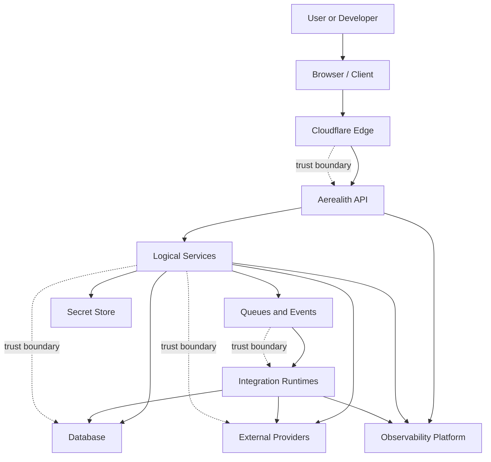
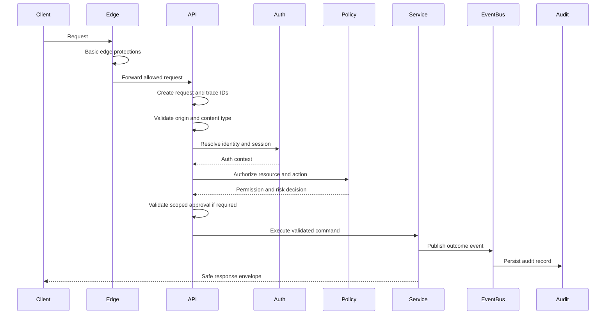
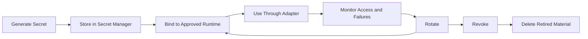
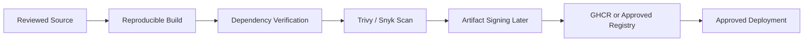
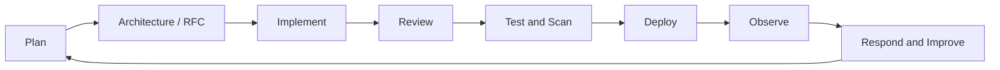
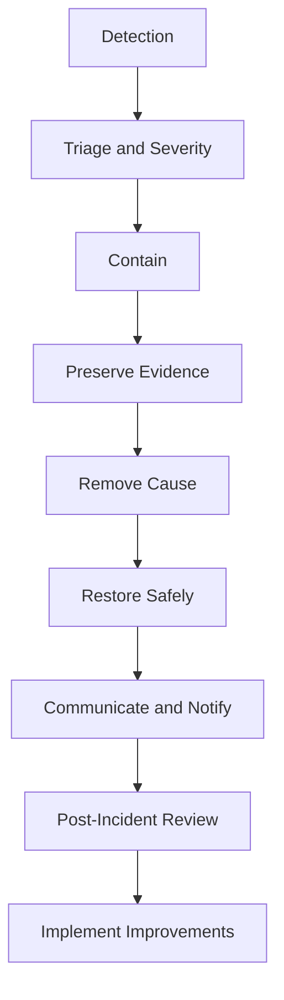

# Security Architecture

Status: Draft
Owner: Tim Pierce / SinLess Games
Last Updated: 2026-07-12
Security Classification: Internal Architecture
Review Requirement: Security review required before production launch

Pending Decision Records:

- `docs/rfcs/0008-configuration-and-secrets-model.md`
- `docs/rfcs/0009-authentication-session-and-authorization-model.md`
- `docs/rfcs/0010-api-envelope-request-and-trace-id-propagation.md`
- `docs/rfcs/0011-event-envelope-audit-model-and-idempotency.md`
- `docs/rfcs/0013-provider-abstraction-and-integration-interface.md`
- `docs/rfcs/0017-observability-trace-propagation-and-alerting.md`

Related RFCs:

- `docs/rfcs/0002-monorepo-library-boundaries.md`
- `docs/rfcs/0003-api-versioning-and-route-strategy.md`
- `docs/rfcs/0004-error-and-result-model.md`
- `docs/rfcs/0005-entity-schema-and-contract-strategy.md`

Related Architecture:

- `docs/architecture/Monorepo Architecture.md`
- `docs/architecture/Frontend Architecture.md`
- `docs/architecture/API Architecture.md`
- `docs/architecture/Service Architecture.md`
- `docs/architecture/Data Architecture.md`
- `docs/architecture/Auth Architecture.md`

---

## Purpose

This document defines the security architecture for Aerealith AI.

The security architecture governs how Aerealith protects:

```text
users
accounts
communities
integrations
credentials
sessions
developer access
private content
workflows
automations
AI-assisted actions
infrastructure
source code
build pipelines
deployments
audit records
operational systems
```

The objective is to build a platform that is:

```text
secure by default
least-privileged
permission-scoped
auditable
revocable
observable
recoverable
provider-neutral
portable
resistant to misuse
honest about its limitations
```

The guiding rule is:

> No identity, service, integration, automation, model, network location, or user interface is trusted merely because it is inside Aerealith.

Every meaningful action must be authenticated where required, authorized, risk-evaluated, approved when required, executed through an owned service boundary, and recorded when audit rules apply.

---

## Security Architecture Summary

Aerealith uses layered security rather than relying on one control.

Core layers include:

```text
identity verification
server-side session validation
authorization and resource scoping
risk evaluation
action-specific approval
input validation
secure service boundaries
provider permission checks
data classification
encryption
secret isolation
event and audit records
rate limiting
observability
secure build and deployment pipelines
vulnerability management
incident response
backup and recovery
```

The core request flow is:

```text
Request
→ Establish Context
→ Authenticate
→ Authorize
→ Validate
→ Evaluate Risk
→ Verify Approval
→ Execute
→ Publish Event
→ Record Audit
→ Observe Outcome
```

Security controls must exist at the service boundary.

Frontend controls improve user experience but do not establish security.

---

## Security Goals

Aerealith security should protect these properties.

| Property              | Goal                                                                                        |
| --------------------- | ------------------------------------------------------------------------------------------- |
| Confidentiality       | Private information is visible only to authorized identities and services.                  |
| Integrity             | Data and actions cannot be changed without valid permission and approved execution paths.   |
| Availability          | Core platform behavior remains usable and recoverable during failures.                      |
| Accountability        | Meaningful actions can be traced to an actor, request, approval, and outcome.               |
| Revocability          | Sessions, credentials, integrations, permissions, and automations can be revoked.           |
| Scope Isolation       | Permission in one context does not silently transfer to another.                            |
| User Control          | Users can understand, approve, disable, export, and delete supported data and capabilities. |
| Provider Independence | Security does not depend entirely on one hosting or identity provider.                      |
| AI Independence       | Core security and platform behavior continue to work when AI is unavailable.                |

---

## Security Principles

Aerealith security follows these principles:

```text
Fail closed when security state is uncertain.
Trust current server-side state, not client claims.
Grant the minimum permission required.
Keep permissions scoped to explicit resources.
Separate authentication, authorization, risk, and approval.
Require stronger verification for higher-risk actions.
Treat provider payloads as untrusted input.
Treat internal service calls as authenticated and authorized operations.
Never expose secrets through public contracts.
Never log raw credentials.
Make security-sensitive actions observable.
Make meaningful actions auditable.
Make credentials and permissions revocable.
Design deletion, recovery, and rollback before production.
Use automation to detect problems, not to silently waive security controls.
```

---

## Shared Security Responsibility

Security is not owned by one package or one future security team.

| Area           | Responsibility                                                                                    |
| -------------- | ------------------------------------------------------------------------------------------------- |
| Product        | Clear consent, understandable permissions, revocation, and safe defaults.                         |
| Frontend       | Safe presentation, secure browser behavior, no credential exposure, accessible security flows.    |
| API            | Authentication, authorization, validation, rate limits, safe responses, and request context.      |
| Services       | Domain permission enforcement, risk evaluation, approvals, event publication, and audit behavior. |
| Data           | Access controls, encryption, retention, deletion, migration safety, backup, and recovery.         |
| Integrations   | Provider verification, token protection, permission checks, and disconnect behavior.              |
| Infrastructure | Network controls, secrets, runtime isolation, deployment safety, and recovery.                    |
| Engineering    | Secure coding, dependency management, testing, review, and CI enforcement.                        |
| Operations     | Detection, alerting, incident response, rollback, restoration, and post-incident review.          |

Security responsibilities must remain explicit even while one person performs several roles.

---

## Security Boundary Overview



Every arrow crossing a trust boundary requires explicit validation and authorization appropriate to the operation.

---

## Trust Boundaries

A trust boundary exists whenever data or control moves between systems with different authority or risk.

Primary trust boundaries include:

```text
browser to edge
edge to API
API to logical service
service to database
service to queue
queue to consumer
service to external provider
integration callback to Aerealith
developer client to public API
CI pipeline to deployment platform
runtime to secret store
operator to production system
AI provider to Aerealith
AI-generated suggestion to executable action
```

Each boundary should define:

```text
identity
authentication method
authorization rules
input schema
rate limits
timeout
error behavior
logging
trace propagation
privacy classification
replay and idempotency behavior
```

---

## Threat Model

Aerealith should assume attacks may come from:

```text
unauthenticated internet clients
authenticated users abusing valid access
compromised user sessions
malicious third-party applications
compromised integration providers
malformed provider callbacks
dependency supply-chain attacks
leaked secrets
misconfigured infrastructure
privileged insider misuse
automated bots
AI prompt injection
malicious uploaded content
cross-tenant access attempts
replayed requests or events
compromised CI credentials
```

Aerealith must not assume that authenticated requests are harmless.

Authenticated users can still:

```text
access resources outside their scope
attempt privilege escalation
submit malicious content
replay approved actions
abuse rate limits
trigger expensive operations
target other users or communities
```

---

## Protected Assets

Important assets include:

| Asset                   | Security Concern                                     |
| ----------------------- | ---------------------------------------------------- |
| User identities         | Account takeover, impersonation, enumeration.        |
| Sessions                | Theft, replay, fixation, unauthorized persistence.   |
| Password hashes         | Offline cracking and credential compromise.          |
| API keys                | Unauthorized developer access.                       |
| Integration credentials | External-provider compromise.                        |
| Community data          | Privacy, moderation history, tickets, and ownership. |
| Workflow approvals      | Replay and unauthorized action execution.            |
| Audit records           | Tampering, deletion, or misleading history.          |
| Source code             | Supply-chain compromise and secret leakage.          |
| Build pipeline          | Malicious artifact creation or deployment.           |
| Deployment credentials  | Production compromise.                               |
| Encryption keys         | Decryption of protected data.                        |
| AI context              | Private-data leakage and prompt injection.           |
| Backups                 | Large-scale data exposure.                           |

---

## Security Risk Classification

Aerealith uses action risk levels for product and service behavior.

| Risk     | Examples                                                             | Required Behavior                                              |
| -------- | -------------------------------------------------------------------- | -------------------------------------------------------------- |
| Low      | Reads, formatting, summaries, harmless preferences.                  | Normal authorization and validation.                           |
| Medium   | Posting, settings changes, workflow triggers.                        | Authorization plus contextual verification where required.     |
| High     | Moderation, data deletion, permission changes.                       | Explicit verification and scoped approval.                     |
| Critical | Billing, credentials, security controls, destructive infrastructure. | Step-up authentication, elevated approval, and enhanced audit. |

Security vulnerability severity should be tracked separately using an established severity system such as:

```text
Critical
High
Medium
Low
Informational
```

Action risk and vulnerability severity are related but not interchangeable.

---

## Identity Security

Identity security follows:

```text
docs/architecture/Auth Architecture.md
```

Core requirements:

```text
provider-neutral identities
opaque browser session tokens
server-side session records
session revocation
single-use verification and recovery tokens
strong password hashing
secure identity linking
step-up authentication
scoped developer credentials
MFA-ready architecture
```

The platform must not accept user identity from:

```text
request body fields
frontend Redux state
unsigned headers
URL parameters
unverified provider metadata
```

Identity must come from a verified session or credential.

---

## Authentication Security

Protected requests require authentication appropriate to the client.

| Client                         | Primary Authentication                              |
| ------------------------------ | --------------------------------------------------- |
| Browser application            | Server-managed session using an HttpOnly cookie.    |
| External developer client      | Scoped API key initially.                           |
| Future third-party application | OAuth-compatible authorization after dedicated RFC. |
| Physically separated service   | Workload or service identity.                       |
| Provider webhook               | Provider signature or equivalent verification.      |
| Administrative operator        | Strong session with step-up authentication.         |

Authentication failures must not reveal unnecessary account state.

---

## Authorization Security

Authorization decisions must be server-side.

Authorization should evaluate:

```text
identity
session state
account state
active scope
membership
role
permission
resource ownership
resource state
provider permission
risk level
approval state
feature availability
```

Authorization is required even when:

```text
the frontend hid the action
the route is internal
the caller is an administrator
the request came from another Aerealith service
the operation was suggested by AI
the provider already granted permission
```

---

## Permission Scoping

Permissions must be scoped to the resource context.

Potential scopes:

```text
user
account
organization
community
server
integration
module
workflow
developer application
```

Examples:

```text
Permission to edit Account A does not permit editing Account B.
Permission to moderate Server A does not permit moderating Server B.
Approval to disconnect Integration A does not permit disconnecting Integration B.
An API key for staging must not operate against production.
```

Scope fields must be included in repository queries where required to prevent cross-tenant access.

---

## Approval Security

Approval is required for meaningful actions according to the trust and risk models.

An approval must bind to:

```text
actor
operation
resource
scope
payload fingerprint
risk level
expiration
approval source
```

Approval must be rejected when:

```text
the payload changed
the target changed
the scope changed
the approval expired
the approver lost permission
the requester lost permission
the credential was revoked
the action already executed
```

Approvals must be single-use where reuse would create risk.

---

## Request Security Pipeline



No later stage may assume an earlier stage happened unless the pipeline enforces that invariant.

---

## Input Validation

All input is untrusted until validated.

Validate:

```text
request bodies
path parameters
query parameters
headers
cookies
webhook payloads
provider API responses
queue events
GraphQL inputs
tRPC inputs
uploaded files
environment configuration
database JSON fields
AI-generated structured output
```

Zod is the preferred runtime validation library where practical.

Validation should enforce:

```text
type
length
range
format
allowed values
required relationships
scope
size limits
safe defaults
```

---

## Output Validation

Sensitive or public outputs should be contract-safe.

Output validation is especially valuable for:

```text
public API responses
GraphQL responses
webhook delivery payloads
developer exports
AI-generated structured content
data exports
integration callbacks
```

Persistence rows must never be serialized directly.

Response mappers must explicitly omit private and secret fields.

---

## API Security

API security follows:

```text
docs/architecture/API Architecture.md
```

Public API routes use:

```text
/api/V1/
```

API security requirements:

```text
versioned contracts
authentication
authorization
input validation
safe output contracts
rate limiting
request size limits
content-type enforcement
origin and CORS policy
CSRF protection where relevant
request and trace IDs
safe error envelopes
idempotency where required
timeouts
observability
```

---

## Required API Response Envelope

Success responses should use the approved response envelope.

```json
{
  "success": true,
  "data": {},
  "requestId": "req_123",
  "traceId": "trace_456"
}
```

Error responses should use the approved error envelope.

```json
{
  "success": false,
  "error": {
    "code": "COMMON_FORBIDDEN",
    "message": "You do not have permission to perform this action.",
    "category": "auth",
    "retryable": false,
    "requestId": "req_123",
    "traceId": "trace_456",
    "details": null
  }
}
```

Internal exception details must not be exposed publicly.

---

## Rate Limiting

Rate limiting should apply according to risk and abuse potential.

Potential rate-limit dimensions:

```text
IP address
user
session
account
organization
API key
provider
route group
operation
environment
```

High-priority rate-limited routes include:

```text
sign-up
sign-in
password reset
email verification
OAuth callback
API key authentication
webhook ingestion
search
AI requests
file upload
moderation actions
integration connection
developer API access
```

Rate limiting is not authorization.

A request within its rate limit may still be forbidden.

---

## Request Size Limits

Request size limits should be explicit.

Apply limits to:

```text
JSON request bodies
file uploads
webhook payloads
GraphQL queries
GraphQL variables
batch APIs
AI context
data imports
```

Oversized requests should fail with a stable error code.

Example:

```text
COMMON_PAYLOAD_TOO_LARGE
```

---

## GraphQL Security

GraphQL requires additional controls.

GraphQL security should include:

```text
authentication
field-level authorization where needed
query depth limits
query complexity limits
operation allowlists where appropriate
introspection policy by environment
pagination requirements
resolver timeouts
batching limits
mutation validation
safe errors
```

GraphQL types must not mirror database tables directly.

GraphQL must not expose private fields merely because they exist in domain or persistence models.

---

## tRPC Security

tRPC procedures are internal conveniences, not trusted shortcuts.

Every tRPC procedure must enforce:

```text
authentication
authorization
input validation
risk evaluation
approval rules
rate limits where required
safe errors
observability
```

A tRPC procedure must not be considered secure merely because only the frontend currently calls it.

---

## Frontend Security

Frontend security follows:

```text
docs/architecture/Frontend Architecture.md
```

The frontend must not store:

```text
passwords
session tokens
API key secrets
OAuth access tokens
provider credentials
encryption keys
MFA secrets
recovery codes
```

in:

```text
Redux
localStorage
sessionStorage
IndexedDB
URL parameters
client logs
analytics events
```

Browser sessions should use HttpOnly cookies.

---

## Browser Security Controls

Frontend and edge responses should support appropriate browser security headers.

Potential headers include:

```text
Content-Security-Policy
Strict-Transport-Security
X-Content-Type-Options
Referrer-Policy
Permissions-Policy
Cross-Origin-Opener-Policy
Cross-Origin-Resource-Policy
Cross-Origin-Embedder-Policy where compatible
```

The exact policy must account for:

```text
Cloudflare deployment
Apollo and GraphQL endpoints
Fumadocs
analytics
observability
image hosting
external fonts
integration callbacks
development environments
```

Security policies must not be disabled globally merely to fix one integration.

---

## Content Security Policy

Aerealith should use a restrictive Content Security Policy.

The policy should prefer:

```text
self-hosted resources
nonces or hashes for approved scripts
explicit connect-src endpoints
explicit image sources
explicit font sources
object-src 'none'
base-uri restrictions
frame-ancestors restrictions
```

Avoid broad directives such as:

```text
script-src *
connect-src *
unsafe-eval
unsafe-inline
```

unless a documented and reviewed requirement exists.

Development and production policies may differ.

Production must remain restrictive.

---

## Cross-Site Scripting Protection

Prevent XSS through:

```text
React's default escaping
safe Markdown and MDX rendering
content sanitization
restricted HTML support
Content Security Policy
safe URL validation
avoiding dangerous HTML APIs
dependency review
```

Use of:

```text
dangerouslySetInnerHTML
raw HTML in Markdown
untrusted iframe content
user-generated scriptable content
```

requires explicit review.

---

## Markdown and Documentation Security

Fumadocs and documentation rendering must treat repository and generated content safely.

Documentation security should consider:

```text
raw HTML
MDX components
embedded scripts
external iframes
untrusted links
image URLs
code examples
generated navigation
search indexes
```

Only approved MDX components should execute in the frontend.

User-provided Markdown must not be treated as trusted application code.

---

## Cross-Site Request Forgery

Cookie-authenticated state-changing operations require CSRF protections appropriate to the deployment.

Controls may include:

```text
SameSite cookies
origin validation
CSRF tokens
custom headers
strict content types
referer validation where appropriate
```

A frontend route guard does not prevent CSRF.

The API must enforce CSRF protections.

---

## Open Redirect Protection

Redirect targets must be validated.

Never redirect directly to arbitrary user-provided URLs.

Allowed redirect destinations should be:

```text
relative application paths
allowlisted origins
signed return URLs where necessary
```

OAuth redirect URIs must use exact registered values.

---

## Service Security

Service security follows:

```text
docs/architecture/Service Architecture.md
```

Services should:

```text
remain thin at transport boundaries
validate inputs
enforce authorization
classify risk
require approvals
use repositories
publish normalized events
map provider errors
propagate request and trace IDs
use bounded timeouts
use safe retries
```

Service methods should accept explicit request or security context.

---

## Service-to-Service Security

Logical services inside the same runtime should use direct typed calls.

Physically separated services require workload authentication.

Potential mechanisms include:

```text
Cloudflare service bindings
mutual TLS
signed service tokens
Kubernetes workload identity
private network identity
short-lived workload credentials
```

Network location alone must not establish authorization.

Separated services must verify:

```text
calling workload
operation
environment
scope
request integrity
```

---

## Integration Security

External integrations are high-risk boundaries.

Integration security should include:

```text
provider OAuth state validation
PKCE where supported
strict redirect URIs
minimal provider scopes
secure token storage
scope review
provider permission checks
signature verification
disconnect and revocation
provider error mapping
rate-limit awareness
health monitoring
```

Provider credentials must remain isolated from public connection metadata.

---

## Integration Permission Minimization

Request only the provider permissions required by enabled capabilities.

Provider permission requests should be:

```text
documented
human-readable
capability-linked
reviewable
revocable
```

Do not request broad permissions because they may be useful later.

When permissions change:

```text
explain the reason
require approval
re-run provider authorization where needed
record the change
```

---

## Webhook Security

Webhook handlers must treat every payload as untrusted.

Required controls where supported:

```text
signature verification
timestamp validation
replay protection
payload size limit
schema validation
provider event ID
idempotency
rate limiting
request logging without secrets
failure visibility
```

Webhook verification must use the raw payload when required by provider signature algorithms.

Do not parse and reconstruct the payload before verification if doing so changes signed bytes.

---

## Provider Callback Security

OAuth and provider callbacks should validate:

```text
state
nonce where applicable
PKCE verifier
expected provider
expected environment
redirect target
authorization code lifetime
connection ownership
```

A successful provider callback must not automatically imply ownership of every provider resource.

Resource ownership must be verified separately when required.

---

## Credential Security

Credentials include:

```text
passwords
session tokens
API keys
OAuth tokens
webhook secrets
signing keys
database credentials
deployment credentials
encryption keys
service credentials
```

Credentials must be:

```text
generated securely
stored appropriately
scoped
rotatable
revocable
redacted
audited when managed
short-lived where practical
```

---

## Secret Storage

Secrets must not be committed to source control.

Approved secret sources may include:

```text
Cloudflare secrets
Kubernetes Secrets
external secret managers
Vault-compatible systems
environment-specific CI secret stores
local uncommitted environment files
```

Repository examples must contain placeholders only.

Never place real secrets in:

```text
README files
issue descriptions
screenshots
test fixtures
example environment files
Terraform state without protection
container images
frontend bundles
build logs
```

---

## Secret Lifecycle



Every production secret should have:

```text
owner
purpose
environment
scope
rotation expectation
revocation procedure
```

---

## Secret Rotation

Rotation procedures should exist for:

```text
database credentials
OAuth client secrets
provider tokens
webhook signing secrets
session signing or encryption keys
API keys
deployment credentials
observability tokens
CI credentials
```

Rotation should support overlapping validity where needed to avoid unsafe downtime.

Retired secrets must be revoked after migration.

---

## Cryptography

Use established cryptographic libraries and platform primitives.

Preferred sources:

```text
Web Crypto API
well-maintained cryptographic libraries
provider-managed key services
documented password-hashing implementations
```

Do not design custom cryptographic algorithms.

Cryptographic choices should define:

```text
algorithm
key size
nonce or IV behavior
authentication mode
storage format
version
rotation
failure behavior
```

---

## Encryption at Rest

Sensitive data should be encrypted where appropriate.

Potential application-level encryption targets:

```text
OAuth refresh tokens
provider access tokens
TOTP secrets
private integration credentials
sensitive configuration
```

Encryption keys must remain separate from encrypted values.

Encryption does not replace authorization or retention controls.

---

## Encryption in Transit

Production communication should use TLS.

This includes:

```text
browser to edge
edge to service
service to database
service to provider
service to observability
CI to deployment platform
backup transfer
```

Internal traffic must not be assumed safe merely because it is private.

---

## Data Security

Data security follows:

```text
docs/architecture/Data Architecture.md
```

Data must be classified as:

```text
Public
Internal
Private
Sensitive
Secret
```

Classification should influence:

```text
access
encryption
logging
retention
export
deletion
backup
analytics
AI use
```

---

## Data Access Rules

Data access should follow:

```text
minimum required fields
explicit scope
repository ownership
authorization before query
safe projections
bounded list operations
auditable sensitive reads where required
```

Avoid:

```text
SELECT *
broad administrator queries without justification
cross-domain table writes
unbounded exports
loading secret fields into ordinary objects
```

---

## Tenant and Scope Isolation

Tenant isolation must be enforced through:

```text
explicit account or organization scope
repository query constraints
authorization decisions
resource ownership
tests for cross-scope access
unique constraints where appropriate
```

A user-controlled account ID must never be trusted without membership verification.

Tests must attempt forged scope identifiers.

---

## Data Export Security

Exports should require:

```text
authentication
authorization
scope validation
risk evaluation
approval where appropriate
asynchronous generation
signed expiring download
short artifact retention
audit record
```

Exports must not contain private information belonging to unrelated users.

Export artifacts should not be permanently public.

---

## Data Deletion Security

Deletion should require controls appropriate to its risk.

Potential requirements:

```text
step-up authentication
explicit confirmation
approval
dependency analysis
credential revocation
audit event
idempotency
retention explanation
backup-expiry explanation
```

Deletion must not be implemented as an unaudited raw database operation.

---

## Backup Security

Backups must be:

```text
encrypted
access-controlled
retained according to policy
separated from ordinary runtime access
monitored
restorable
expired predictably
```

Backup credentials must not be shared broadly with application runtimes.

A restore test is part of backup security.

---

## Audit Security

Audit records provide accountability.

Audit records should be:

```text
append-oriented
idempotent
scope-aware
queryable
retained according to policy
protected from casual mutation
```

Required fields may include:

```text
audit ID
event ID
event type
actor
target
scope
source
service
risk level
result
request ID
trace ID
approval ID
timestamp
metadata
```

---

## Audit Integrity

Controls supporting audit integrity may include:

```text
unique event IDs
append-only repository methods
restricted write permissions
separate consumer path
integrity hashes later
retention controls
alerts on write failures
```

Audit records should not contain:

```text
passwords
raw tokens
provider secrets
full private content
unnecessary personal data
```

---

## Event Security

Internal events must use a versioned envelope.

Events should include:

```text
eventId
eventType
eventVersion
source
occurredAt
actor
target
scope
requestId
traceId
riskLevel
approvalId
payload
metadata
```

Consumers must validate the event envelope and expected payload schema.

Queue messages must not be trusted solely because they came from the platform queue.

---

## Event Replay Protection

Queue delivery should be treated as at least once.

Consumers must be idempotent.

Replay protection may use:

```text
event IDs
unique constraints
consumer checkpoints
operation fingerprints
provider delivery IDs
deduplication records
```

A duplicate event must not duplicate:

```text
moderation actions
workflow execution
integration disconnection
notifications without intent
audit records
billing behavior
```

---

## AI Security

AI is a high-risk input and suggestion source.

AI output must not be trusted as:

```text
identity
permission
approval
validated data
safe executable code
authoritative policy
provider response
```

AI-assisted actions must use the same service pipeline as human-requested actions.

---

## AI Security Boundaries

AI systems must not:

```text
approve their own actions
invent permissions
change risk classifications
bypass authentication
bypass authorization
bypass provider permissions
bypass approval
silently use private data for training
expose hidden system instructions
execute arbitrary generated code
```

AI may:

```text
summarize
explain
classify
suggest
prepare a proposed action
generate a draft configuration
```

The resulting output must be validated and approved when required.

---

## Prompt Injection Defense

Aerealith should assume external content may contain instructions intended to manipulate the model.

Potential sources:

```text
messages
documents
web pages
provider data
tickets
community content
uploaded files
integration metadata
```

Defenses include:

```text
separating data from instructions
using structured tool contracts
allowlisting tool capabilities
validating tool arguments
scoping tool access
requiring approval
minimizing context
labeling untrusted content
auditing AI-proposed actions
```

A model statement that an action is authorized has no security value.

---

## AI Data Privacy

AI context should use the minimum private information necessary.

AI-related data must follow:

```text
consent
scope
retention
export
deletion
access control
provider contract
training restrictions
```

Aerealith must never train on private user data without explicit consent.

Provider requests should avoid unnecessary secrets and private metadata.

---

## AI Provider Failure

Core security must continue to function when AI is disabled or unavailable.

The following must remain operational without AI:

```text
authentication
authorization
approval
audit
moderation execution
integration management
workflow records
notifications
data export
data deletion
security monitoring
```

AI availability must never become a prerequisite for enforcing security.

---

## File and Upload Security

Future file handling must define:

```text
allowed file types
maximum size
content-type validation
magic-byte validation
malware scanning
storage isolation
signed access
retention
metadata stripping
image processing
safe filename handling
```

File names must not be used directly as storage paths.

Uploaded content must not be executed.

---

## URL and Remote Content Security

Remote URLs should be validated before fetching.

Protections should address:

```text
server-side request forgery
private network access
metadata endpoints
redirect chains
unsupported schemes
oversized responses
slow responses
malicious content types
```

Allow only approved schemes.

Resolve and validate destinations before and during redirects where necessary.

---

## SSRF Protection

Services fetching user-controlled URLs should:

```text
reject private and loopback destinations
reject link-local addresses
reject cloud metadata endpoints
limit redirects
limit response size
use timeouts
allowlist destinations when possible
validate DNS resolution changes
```

Provider-owned URLs may still require validation.

---

## Command and Code Execution

Aerealith should not execute user-provided shell commands or arbitrary code as part of the MVP.

Future code execution requires:

```text
isolated sandbox
resource limits
network restrictions
filesystem restrictions
timeout
audit
approval
malware controls
dedicated RFC
```

Generated AI code must not be executed automatically.

---

## Infrastructure Security

Aerealith supports:

```text
Cloudflare Workers
Docker
Kubernetes
```

Infrastructure security should remain provider-aware but architecture-neutral.

Cloud-specific controls must remain isolated behind deployment configuration and adapters.

---

## Cloudflare Security

Cloudflare deployments may use:

```text
TLS termination
WAF controls
rate limiting
bot controls
DDoS protection
Worker bindings
secret storage
access policies
deployment previews
```

Cloudflare security controls are defense in depth.

They do not replace service authentication, authorization, validation, or audit behavior.

---

## Worker Security

Worker runtimes should:

```text
use explicit bindings
avoid global secret exposure
validate environment configuration
avoid unsafe dynamic evaluation
use compatible dependencies
apply request size limits
use safe response headers
separate preview and production environments
```

Preview environments must not automatically receive unrestricted production credentials.

---

## Container Security

Every deployable container should use secure defaults.

Requirements:

```text
minimal base image
pinned image version
non-root user
read-only filesystem where practical
no unnecessary packages
no embedded secrets
health check
resource limits
scanned dependencies
scanned operating-system packages
reproducible build
```

Avoid running containers as root unless a documented requirement exists.

---

## Container Image Pipeline



A failed critical security scan should block deployment unless an explicit exception is documented and approved.

---

## Kubernetes Security

Kubernetes deployments should use:

```text
namespaces
service accounts
least-privileged RBAC
network policies
security contexts
resource requests and limits
read-only root filesystems where possible
non-root containers
secret injection
admission policies
image provenance controls
pod disruption planning
```

Production workloads should not use the default service account without justification.

---

## Kubernetes Secret Security

Kubernetes Secrets are encoded, not inherently encrypted.

Production clusters should consider:

```text
encryption at rest
external secret management
restricted RBAC
short-lived credentials
secret rotation
audit logging
```

Secrets should not be mounted into workloads that do not require them.

---

## Network Security

Network access should follow least privilege.

Potential controls:

```text
deny-by-default network policies
restricted database access
private service connectivity
controlled egress
allowlisted provider endpoints where practical
administrative access controls
TLS
```

Internet egress should not be unrestricted merely for convenience when a narrower policy is practical.

---

## Database Security

Database controls should include:

```text
encrypted connections
separate environment credentials
least-privileged database roles
migration-specific permissions
backup-specific permissions
connection limits
query timeouts
audit and observability
network restrictions
```

Application credentials should not automatically have permission to:

```text
create database users
change database security settings
access unrelated databases
destroy backups
```

---

## Environment Separation

Aerealith environments should include:

```text
local
test
preview
staging
production
```

Environments must separate:

```text
credentials
databases
provider applications
API keys
domains
queues
storage
observability labels
deployment permissions
```

Preview environments should not use production user data by default.

---

## Production Access

Production access should be limited.

Controls should include:

```text
named individual identities
MFA
least privilege
short-lived access where possible
audit logs
no shared administrator accounts
documented emergency process
access review
```

Routine development should not require direct production database access.

---

## Break-Glass Access

Emergency elevated access may be required.

A break-glass process should define:

```text
who may activate it
required reason
strong authentication
time limit
automatic expiration
audit event
notification
post-use review
credential rotation where needed
```

Break-glass access must not become ordinary administrator access.

---

## CI/CD Security

CI/CD is a production security boundary.

Pipelines should enforce:

```text
locked dependencies
lint
format check
typecheck
tests
80% coverage
secret scanning
dependency review
static analysis
container scanning
build verification
deployment approval
environment separation
```

Production deployment should occur only from approved source and workflow paths.

---

## Current Security Toolchain

The Aerealith repository uses or plans to use:

```text
GitHub CodeQL
GitHub dependency review
Dependabot
Renovate
Snyk
Semgrep
Gitleaks
Trivy
SonarQube or SonarLint
Codecov
Datadog
Grafana Cloud
Meticulous AI
```

Each tool has a distinct role.

| Tool                | Primary Role                                                               |
| ------------------- | -------------------------------------------------------------------------- |
| CodeQL              | Semantic static analysis and vulnerability discovery.                      |
| Dependency Review   | Pull-request dependency risk visibility.                                   |
| Dependabot          | Dependency vulnerability alerts and update automation.                     |
| Renovate            | Dependency update management and policy automation.                        |
| Snyk                | Dependency, code, container, and infrastructure scanning where configured. |
| Semgrep             | Custom static-analysis and security policy rules.                          |
| Gitleaks            | Secret detection.                                                          |
| Trivy               | Container, dependency, configuration, and image scanning.                  |
| SonarQube/SonarLint | Code-quality and security analysis.                                        |
| Codecov             | Coverage visibility and enforcement support.                               |
| Datadog             | Operational telemetry and security-relevant monitoring where configured.   |
| Grafana Cloud       | Metrics, logs, traces, dashboards, and alerts.                             |
| Meticulous AI       | Automated visual regression and frontend-change validation.                |

Security tools support review.

They do not replace engineering judgment.

---

## Dependency Security

Aerealith should use:

```text
pnpm
one committed lockfile
pinned major versions
automated updates
dependency review
vulnerability scanning
license awareness
```

Before adding a dependency, review:

```text
maintenance activity
security history
runtime compatibility
transitive dependency size
license
need
replacement cost
Cloudflare compatibility
```

Avoid adding dependencies for trivial functionality.

---

## Lockfile Security

The committed lockfile is part of the build definition.

Rules:

```text
Do not mix npm, Yarn, and pnpm lockfiles.
Review unexpected lockfile changes.
Use frozen lockfile installs in CI.
Do not manually edit dependency integrity data.
```

CI should fail when dependency installation does not match the committed lockfile.

---

## Supply-Chain Security

Supply-chain protections should cover:

```text
source dependencies
GitHub Actions
container base images
package registry access
build tools
generated artifacts
deployment tools
third-party scripts
```

Pin third-party GitHub Actions to immutable references where practical.

Review workflow permission scopes.

---

## GitHub Actions Security

Workflows should use:

```text
minimum permissions
explicit permissions blocks
protected environments
restricted production secrets
trusted event triggers
safe pull-request handling
concurrency controls
artifact retention
```

Untrusted pull-request code must not receive production secrets.

Avoid dangerous combinations such as executing untrusted code in a privileged `pull_request_target` workflow.

---

## Source Control Security

Repository protections should include:

```text
protected primary branch
required reviews
required status checks
secret scanning
signed commits or tags later if adopted
restricted force pushes
restricted deletion
CODEOWNERS later where helpful
```

Security-sensitive changes should require review from an appropriate owner.

---

## Generated Code Security

Generated code must be:

```text
readable
reviewable
linted
tested
free of embedded secrets
subject to dependency boundaries
```

Generators must not create insecure defaults.

Generated output does not receive an automatic trust exemption.

---

## Static Analysis

Static analysis should detect:

```text
unsafe code patterns
injection risks
missing authorization
dangerous cryptography
secret handling
unvalidated input
unsafe subprocess use
insecure random generation
dependency boundary violations
```

Semgrep rules may be added for Aerealith-specific invariants.

Potential custom rules:

```text
No libs/db imports from apps/frontend.
No process.env access outside approved config modules.
No authorization header logging.
No raw provider-token serialization.
No direct database rows returned from handlers.
No dangerous HTML without approved wrapper.
```

---

## Secret Scanning

Secret scanning should run:

```text
locally where practical
in pre-commit or pre-push workflows where useful
in CI
through repository security features
```

A detected secret must be considered compromised.

Deleting it from the latest commit is not sufficient.

Required response:

```text
revoke
rotate
remove from history when needed
review access
document incident
```

---

## Vulnerability Management

Vulnerabilities should be tracked by:

```text
severity
exploitability
exposure
affected environment
available fix
compensating controls
owner
deadline
```

Target remediation guidance:

| Severity      | Default Response                                                              |
| ------------- | ----------------------------------------------------------------------------- |
| Critical      | Immediate investigation and emergency remediation.                            |
| High          | Prioritized remediation before release or within a tightly bounded timeframe. |
| Medium        | Scheduled remediation based on exposure and release planning.                 |
| Low           | Track and resolve during normal maintenance.                                  |
| Informational | Review for relevance and improvement opportunities.                           |

Exact service-level deadlines should be defined in engineering or security operations documentation.

---

## Security Exceptions

A security exception must document:

```text
finding
risk
affected system
reason remediation is deferred
compensating controls
owner
approval
expiration date
review date
```

Security exceptions must expire.

An exception is not permanent acceptance.

---

## Secure Development Lifecycle

Security should be included throughout development.



---

## Design Security Review

Architecture and RFC review should consider:

```text
trust boundaries
identity
authorization
data scope
private data
secrets
provider permissions
abuse cases
audit requirements
revocation
failure behavior
rollback
self-hosting impact
```

High-risk features must not begin implementation without documented security direction.

---

## Code Review Security

Reviewers should examine:

```text
authorization
input validation
output mapping
secret handling
logging
error behavior
dependency additions
database scope
race conditions
idempotency
unsafe browser behavior
provider permissions
AI action boundaries
```

Formatting automation should keep review attention on behavior rather than style debates.

---

## Security Testing

Security testing should include:

```text
unit tests
authorization tests
scope-isolation tests
schema validation tests
integration tests
adversarial tests
dependency scans
static analysis
secret scans
container scans
browser security tests
end-to-end tests
manual review
```

Coverage requirement:

```text
80% statements
80% branches
80% functions
80% lines
```

Coverage is not proof of security.

Security-sensitive paths require explicit tests.

---

## Required Security Tests

Tests should prove:

```text
unauthenticated callers are rejected
unauthorized callers are rejected
revoked sessions fail immediately
forged account scope is rejected
forged roles are ignored
frontend state cannot grant permission
high-risk actions require approval
approval cannot be replayed for another action
provider permissions are checked
webhook signatures are verified
duplicate events do not duplicate actions
secrets do not appear in public errors
secrets do not appear in client bundles
AI cannot bypass approval
AI provider failure does not disable security
integration disconnect revokes access
```

---

## Adversarial Test Categories

Adversarial tests should include:

```text
session replay
session fixation
CSRF
XSS
open redirect
SQL injection attempts
GraphQL complexity abuse
forged resource scope
cross-tenant access
webhook replay
OAuth state substitution
API key guessing
approval replay
queue replay
malicious Markdown
prompt injection
SSRF
oversized payload
rate-limit evasion
secret leakage
```

---

## Security Coverage Gate

Security-sensitive packages should maintain the repository coverage standard.

Critical branches should be tested regardless of aggregate coverage.

Examples:

```text
permission denied path
approval missing path
revoked session path
provider permission missing path
duplicate event path
invalid signature path
secret-redaction path
```

Do not game coverage with meaningless assertions.

---

## Observability Security

Security observability should answer:

```text
What failed?
Where did it fail?
Who or what attempted it?
Which resources were targeted?
Was access denied?
Was a credential revoked?
Was an approval reused?
Did a provider fail?
Is an attack ongoing?
Can the system recover safely?
```

---

## Security Telemetry

Potential security telemetry includes:

```text
authentication failures
authorization denials
revoked-session attempts
rate-limit events
webhook signature failures
OAuth state failures
API key failures
approval failures
cross-scope access attempts
provider permission failures
secret-scanner findings
dependency vulnerabilities
container vulnerabilities
administrative actions
```

Telemetry must avoid unnecessary private data.

---

## Alerting

Alerts should exist for meaningful conditions such as:

```text
authentication failure spike
authorization denial spike
repeated revoked-session use
webhook verification failures
provider token failures
queue backlog
audit consumer failure
unexpected administrator activity
critical vulnerability finding
production secret exposure
database backup failure
restore test failure
deployment rollback
```

Alert thresholds should minimize noise without hiding real failures.

---

## Security Logging

Security logs should include:

```text
timestamp
operation
result
error code
actor ID when safe
resource ID when safe
scope
request ID
trace ID
service
environment
risk level
```

Security logs must not include:

```text
passwords
session tokens
API key secrets
authorization headers
OAuth codes
provider tokens
MFA secrets
private encryption keys
raw recovery codes
```

---

## Log Integrity and Access

Production logs should have:

```text
restricted access
retention policy
environment separation
tamper resistance appropriate to risk
export controls
access auditing
```

Debug logging must not be enabled broadly in production when it exposes unnecessary data.

---

## Incident Response

Aerealith needs a documented incident-response process before production launch.

Incident phases:

```text
detect
triage
contain
eradicate
recover
communicate
review
improve
```

---

## Incident Severity

Potential incident severity:

| Severity | Description                                                          |
| -------- | -------------------------------------------------------------------- |
| SEV-1    | Active compromise, broad data exposure, or critical platform outage. |
| SEV-2    | Significant security failure or material customer impact.            |
| SEV-3    | Limited impact with contained scope.                                 |
| SEV-4    | Minor event or investigation with no confirmed impact.               |

The incident process should define decision authority and communication expectations for each level.

---

## Incident Response Flow



---

## Incident Containment

Potential containment actions:

```text
revoke sessions
revoke API keys
rotate provider credentials
disable integration
disable feature flag
block route
pause queue consumer
roll back deployment
isolate workload
restrict network access
disable compromised account
```

Containment actions should be documented and reversible where possible.

---

## Evidence Preservation

Security incidents may require preserving:

```text
logs
traces
audit records
deployment history
configuration history
access history
affected artifacts
database snapshots
provider events
```

Evidence handling should minimize unnecessary copying of private data.

---

## Security Communication

Incident communication should be:

```text
accurate
timely
clear
appropriately scoped
honest about uncertainty
updated as facts change
```

Aerealith should not conceal meaningful security incidents from affected users.

Legal and regulatory notification requirements should be reviewed before production.

---

## Post-Incident Review

Post-incident review should document:

```text
timeline
impact
root cause
contributing factors
detection quality
response quality
recovery
user communication
control failures
action items
owners
deadlines
```

The purpose is improvement, not blame.

---

## Business Continuity

Security includes maintaining safe service during disruption.

Business-continuity planning should cover:

```text
provider outage
database outage
Cloudflare outage
credential compromise
queue failure
observability outage
email outage
AI provider outage
integration outage
repository or CI outage
```

Core platform behavior should degrade safely.

---

## Disaster Recovery

Disaster recovery should define:

```text
RPO
RTO
backup source
restore procedure
credential rotation
deployment recovery
DNS recovery
provider reconfiguration
verification checklist
```

Restoration must be rehearsed.

Documentation without a tested restore is not recovery readiness.

---

## Rollback Security

Every production deployment should have a rollback strategy.

Rollback planning should consider:

```text
application version
database migration compatibility
configuration changes
secret rotation
queue message compatibility
event versions
provider callbacks
frontend asset caching
```

A rollback must not reintroduce a known critical vulnerability without explicit emergency review.

---

## Feature Flags and Security

Feature flags may control rollout.

Feature flags must not be used as the only authorization control.

Correct:

```text
Feature flag determines whether the UI and route are available.
Authorization determines who may use the capability.
```

Incorrect:

```text
Anyone with the hidden route may use it because the flag is off in the UI.
```

---

## Third-Party Risk

Third-party services should be reviewed for:

```text
data access
credential access
data location
retention
security history
contract terms
subprocessors
incident notification
export and deletion support
replacement path
```

Third parties include:

```text
hosting providers
observability providers
email providers
AI providers
storage providers
authentication providers
analytics providers
developer tools
```

---

## Provider Abstraction

Security-sensitive providers should sit behind adapters.

Adapters should allow:

```text
provider replacement
centralized credential handling
normalized errors
consistent timeouts
consistent logging
consistent health checks
consistent revocation
```

Provider SDK types must not leak across the platform.

---

## Privacy and Security

Privacy and security overlap but are not identical.

Security controls should support:

```text
data minimization
purpose limitation
consent
retention
export
deletion
access transparency
private-data training restrictions
```

A system can be technically secure and still violate user trust by collecting too much data.

Aerealith should avoid both failures.

---

## Security Documentation

Security documentation should eventually include:

```text
docs/security/README.md
docs/security/Threat Model.md
docs/security/Secure Development.md
docs/security/Incident Response.md
docs/security/Secrets Management.md
docs/security/Vulnerability Management.md
docs/security/Access Control.md
docs/security/Backup and Recovery.md
docs/security/Provider Reviews.md
```

Architecture defines the platform direction.

Security runbooks define operational actions.

---

## Security Gates

Security should be included in release gates.

### Product Security Gate

Asks:

```text
Are permissions understandable?
Can users revoke access?
Are risky actions explained?
Are private fields minimized?
```

### Engineering Security Gate

Asks:

```text
Do lint, tests, scans, and coverage pass?
Are dependencies reviewed?
Are contracts validated?
Are secrets absent?
```

### Trust Security Gate

Asks:

```text
Are meaningful actions scoped, approved, auditable, and revocable?
Can AI bypass controls?
Does permission transfer incorrectly between contexts?
```

### Operations Security Gate

Asks:

```text
Can failures be detected?
Can credentials be rotated?
Can the system be rolled back?
Can data be restored?
```

### Documentation Security Gate

Asks:

```text
Are security decisions documented?
Are runbooks current?
Are known risks recorded?
Are exceptions tracked?
```

---

## Release Security Requirements

### Release 0.1

Must establish:

```text
dependency scanning
secret scanning
static analysis
CI quality gates
locked package management
secure repository configuration
```

### Release 0.2

Must establish:

```text
data boundaries
error safety
configuration validation
secret model
migration safety
consent foundation
```

### Release 0.3

Must establish:

```text
authentication
session revocation
authorization
risk levels
approval records
rate limiting
security review
```

### Release 0.4

Must establish:

```text
secure frontend shell
safe session UX
browser security headers
accessible security flows
no client-owned permission truth
```

### Release 0.5

Must establish:

```text
API validation
required envelopes
request and trace propagation
event idempotency
audit consumers
workflow approval gates
```

### Release 0.6

Must establish:

```text
developer credential security
webhook verification
provider abstraction
integration disconnect and revocation
```

### Release 0.7 and 0.8

Must establish:

```text
external-platform permission checks
role hierarchy checks
moderation approval
safe destructive actions
AI action restrictions
```

### Release 0.9

Must establish:

```text
security telemetry
alerts
incident runbooks
backup and restore rehearsal
rollback rehearsal
secret and PII log audit
```

### Release 1.0 and 1.1

Must establish:

```text
human security review
beta abuse testing
launch threat review
production access review
legal and privacy readiness
no unresolved critical or high security defects
```

---

## Security Implementation Sequence

Recommended sequence:

```text
1. Accept RFC 0008 for configuration and secrets.
2. Accept RFC 0009 for authentication and authorization.
3. Define the initial threat model.
4. Finalize security data classification.
5. Centralize request context.
6. Implement server-side session revocation.
7. Implement centralized permission evaluation.
8. Implement risk and approval primitives.
9. Enforce input and response schemas.
10. Enforce request and trace ID propagation.
11. Implement event idempotency.
12. Implement audit consumer behavior.
13. Add provider credential adapters.
14. Add webhook verification.
15. Harden frontend browser policies.
16. Add dependency, secret, static, and container scans.
17. Add security telemetry and alerts.
18. Write incident, rollback, backup, and restoration runbooks.
19. Run adversarial testing.
20. Complete human security review before production.
```

---

## Security Anti-Patterns

Avoid:

```text
trusting frontend roles
storing browser credentials in localStorage
using feature flags as authorization
returning raw database rows
logging authorization headers
exposing provider errors directly
using wildcard CORS with credentials
accepting unsigned webhooks
requesting unnecessary provider permissions
using one global administrator token
sharing production credentials with preview environments
running containers as root without need
using unbounded retries
executing AI-generated actions without approval
allowing AI to classify its own risk
assuming internal services are trusted
treating network location as identity
manually editing production data without audit
committing secrets
ignoring scanner findings indefinitely
using security tools as a substitute for review
```

---

## Required Architecture Decisions

Before production, Aerealith must finalize:

```text
session lifetime and rotation
MFA requirements
password hashing deployment model
credential encryption strategy
secret manager strategy
API key format and scopes
service identity strategy
CSRF policy
Content Security Policy
data retention periods
backup RPO and RTO
security incident severity and notification process
security exception approval
provider risk review process
```

These decisions should be recorded through RFCs or dedicated security documentation.

---

## Security Review Checklist

Before shipping a meaningful feature, ask:

```text
What assets does this feature access?
What trust boundaries does it cross?
Who can invoke it?
Which scope applies?
Which permission is required?
What risk level applies?
Does it need approval?
Can approval be replayed?
What data is stored?
What data is logged?
Which secrets are used?
Can it be revoked?
Can it be rolled back?
How does it fail?
How is it detected?
How is it tested?
What happens when AI is unavailable?
```

---

## Success Criteria

The security architecture is successful when:

```text
identity comes only from verified credentials
browser sessions are opaque and revocable
authorization is server-side
permissions are explicitly scoped
high-risk actions require approval
approvals cannot be replayed across actions
provider permissions are verified
secrets remain outside source and public contracts
private data is classified and minimized
webhooks are verified and idempotent
events cannot duplicate destructive outcomes
audit records are reliably created
AI cannot bypass security controls
core security works without AI
dependencies and containers are scanned
production access is restricted and auditable
incidents can be detected and contained
credentials can be rotated
deployments can be rolled back
backups can be restored
80% coverage is enforced
human security review occurs before launch
```

---

## Final Standard

Aerealith security should preserve user control while protecting the platform from misuse, compromise, and accidental authority.

The standard is:

> Every meaningful Aerealith action crosses explicit trust boundaries, uses verified identity, current server-side authorization, resource scope, risk evaluation, and action-specific approval where required. Secrets remain isolated, data remains classified and minimized, providers remain constrained, events remain idempotent, actions remain auditable, AI remains subordinate to platform security, and every production system remains observable, revocable, recoverable, and reviewable.
