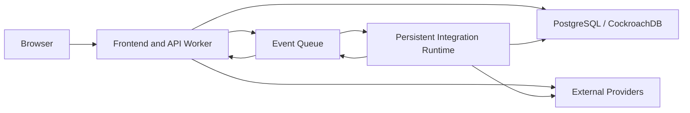
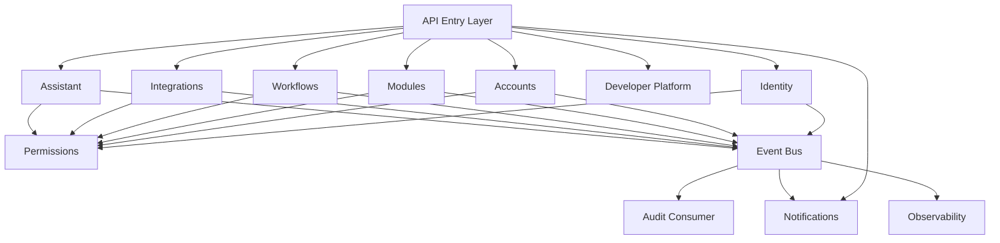
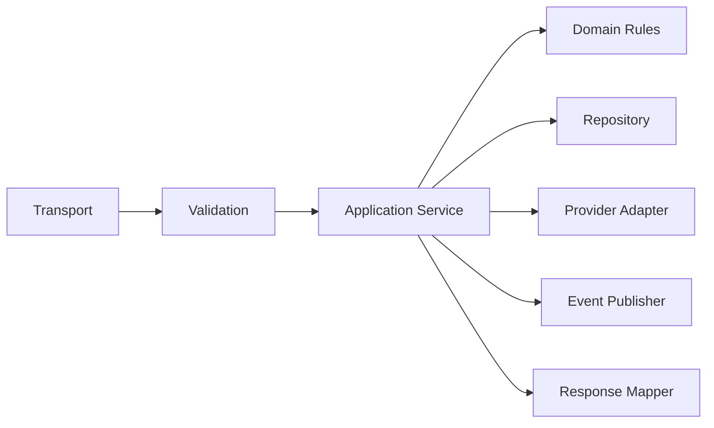
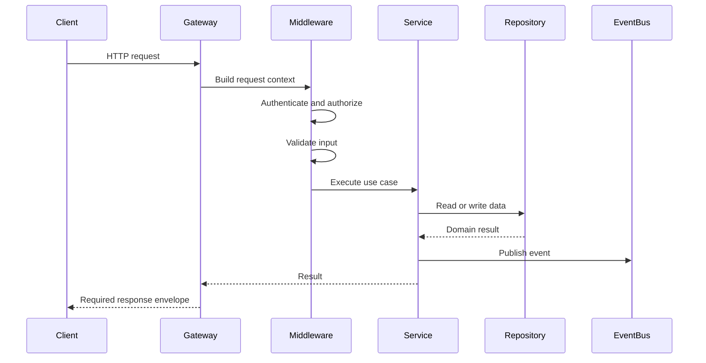
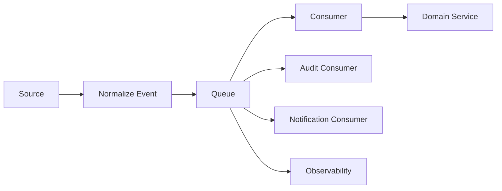
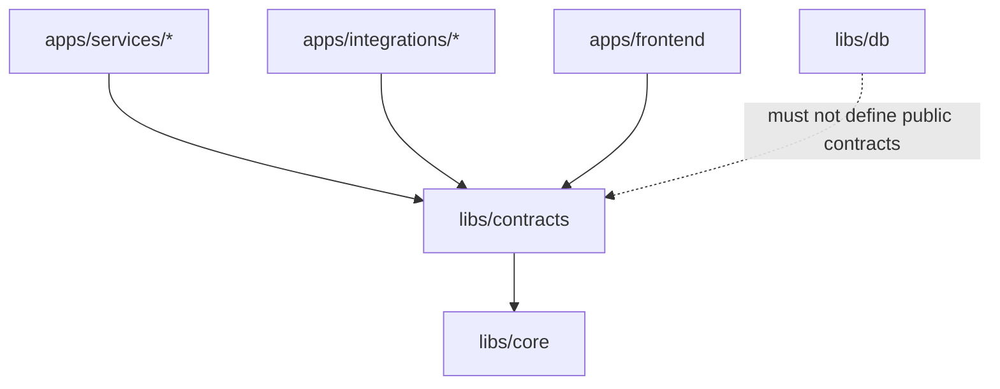
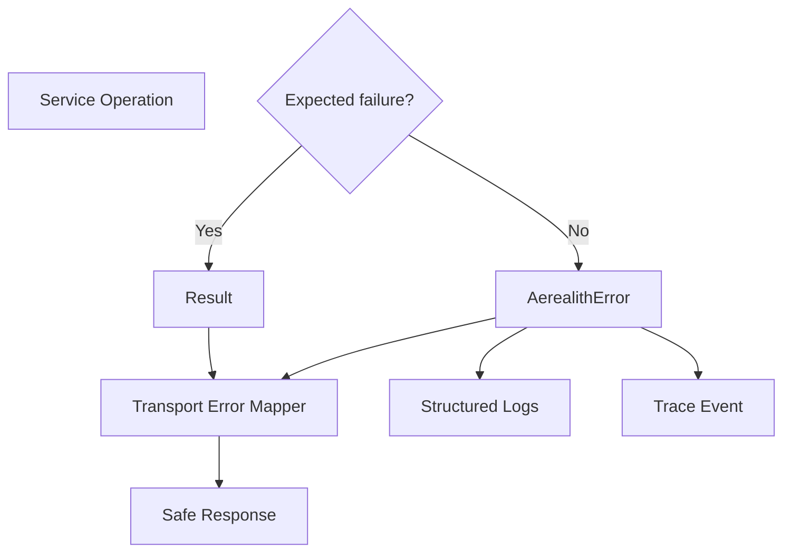
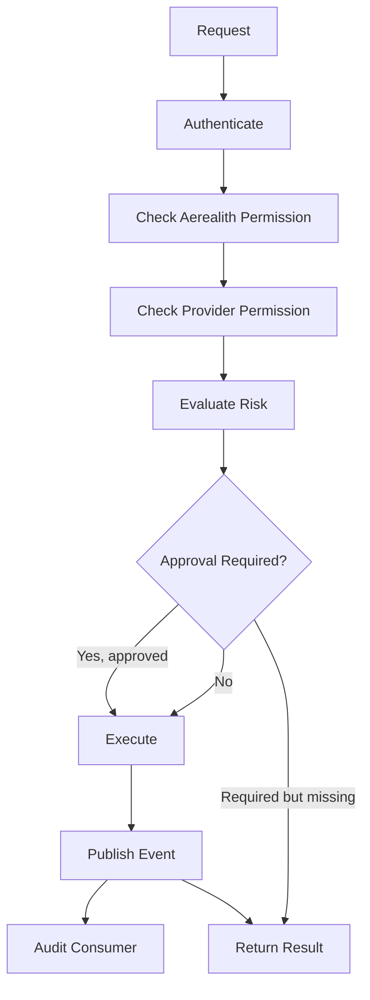
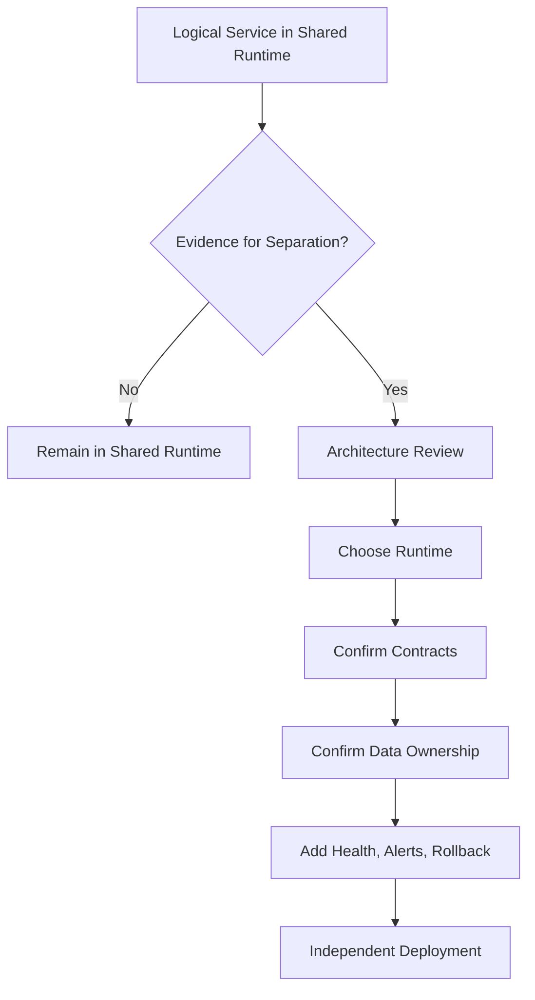

# Service Architecture

Status: Draft
Owner: SinLess Games LLC
Last Updated: 2026-07-12
Related RFCs:

- `docs/rfcs/0002-monorepo-library-boundaries.md`
- `docs/rfcs/0003-api-versioning-and-route-strategy.md`
- `docs/rfcs/0004-error-and-result-model.md`
- `docs/rfcs/0005-entity-schema-and-contract-strategy.md`

Related Architecture:

- `docs/architecture/Monorepo Architecture.md`
- `docs/architecture/Frontend Architecture.md`
- `docs/architecture/API Architecture.md`

---

## Purpose

This document defines the service architecture for Aerealith AI.

Services are the runtime units that execute platform-owned behavior, expose APIs, consume events, run scheduled work, coordinate integrations, enforce permissions, and produce audit records.

The service architecture should allow Aerealith to begin with a small number of deployable units while preserving clean internal boundaries that can later be separated when scale, reliability, security, or ownership requires it.

The guiding rule is:

> Design logical service boundaries now, but create physical microservices only when operational evidence justifies them.

Aerealith should not begin as a swarm of tiny services merely because the platform may eventually become large.

---

## Architecture Summary

Aerealith uses a modular service architecture.

During the MVP, most platform-owned HTTP behavior may run inside one combined frontend and API Worker deployment.

Logical services remain separated by:

```text
domain ownership
route ownership
contracts
events
permissions
data access
tests
observability
```

The initial MVP deployment shape is:

```text
combined frontend and API Worker
integration runtime or bot deployment where a persistent connection is required
```

Future services may be separated into independent deployments without redesigning the platform contracts.

The service stack includes:

```text
TypeScript
Node.js 24.x
Hono
REST /api/V1/
tRPC for internal typed flows
GraphQL for complex developer and exploration surfaces
Zod
Drizzle
PostgreSQL or CockroachDB-compatible persistence
queues and events
Cloudflare Workers
Docker
Kubernetes
```

---

## Core Service Principles

Aerealith services should follow these principles:

```text
Start modular before starting distributed.
Keep services thin at the transport boundary.
Keep domain behavior independent from HTTP frameworks.
Validate every boundary.
Keep contracts separate from persistence.
Use explicit permissions.
Treat auditability as platform behavior.
Keep provider-specific behavior isolated.
Support graceful degradation.
Make failures observable.
Make retries safe.
Do not require AI for core platform behavior.
Split deployments only when there is evidence.
```

---

## Logical Services and Physical Deployments

A logical service is not automatically a separate deployable application.

### Logical Service

A logical service owns:

```text
a domain or platform responsibility
routes or procedures
domain orchestration
permission checks
events
data access boundaries
tests
metrics
documentation
```

Examples:

```text
identity service
account service
notification service
workflow service
module service
audit service
integration service
assistant service
```

### Physical Deployment

A physical deployment is an independently deployed runtime.

Examples:

```text
combined frontend/API Worker
persistent gateway or bot process
queue consumer
scheduled worker
isolated high-risk service
```

Multiple logical services may initially run inside one physical deployment.

This distinction lets Aerealith avoid premature microservices while preserving future separation.

---

## MVP Deployment Shape

The MVP should keep the number of physical deployments small.



The combined Worker may contain multiple logical service modules.

The persistent integration runtime exists for integrations that require:

```text
long-lived gateway connections
persistent sessions
continuous event consumption
runtime behavior unsuitable for edge request execution
```

A new deployment should not be created merely to create cleaner folders.

---

## Monorepo Placement

Deployable service applications belong in:

```text
apps/services/
```

Provider-specific integration runtimes belong in:

```text
apps/integrations/
```

Shared behavior belongs in:

```text
libs/
```

Recommended structure:

```text
apps/
├── frontend/
├── services/
│   ├── api/
│   ├── workers/
│   └── scheduled/
└── integrations/
    └── provider-name/

libs/
├── api/
├── contracts/
├── core/
├── db/
├── flags/
├── observability/
└── ui/
```

Not every folder must exist immediately.

Folders should be created when their responsibility becomes real.

---

## Service Responsibility Model

Each logical service should have one clear responsibility.

| Service Area       | Responsibility                                                                        |
| ------------------ | ------------------------------------------------------------------------------------- |
| Identity           | Authentication, sessions, verification, revocation, and identity context.             |
| Accounts           | Accounts, profiles, preferences, settings, consent, and account lifecycle.            |
| Permissions        | Platform roles, scopes, policies, ownership, and authorization decisions.             |
| Modules            | Module registry, manifests, configuration, enablement, and lifecycle.                 |
| Workflows          | Workflow records, approval gates, execution history, and manual triggers.             |
| Notifications      | In-app notifications, delivery preferences, and notification records.                 |
| Audit              | Audit event consumption, persistence, querying, and export.                           |
| Integrations       | Connection records, provider health, disconnection, and normalized provider behavior. |
| Assistant          | Suggestions, explanations, safe context use, and approval-aware proposals.            |
| Developer Platform | API keys, webhooks, developer events, documentation, and developer tooling.           |
| Operations         | Health, readiness, diagnostics, scheduled maintenance, and internal operations.       |

Services may be implemented inside one runtime while retaining these logical boundaries.

---

## Service Boundary Diagram



---

## Service Internal Layers

Each service should use explicit internal layers where appropriate.

```text
transport
application
domain
persistence
infrastructure
```

### Transport Layer

The transport layer owns:

```text
HTTP routes
tRPC procedures
GraphQL resolvers
webhook handlers
queue handlers
scheduled job entrypoints
request parsing
response serialization
```

The transport layer should remain thin.

It should not contain large amounts of business logic.

### Application Layer

The application layer owns:

```text
use cases
domain orchestration
permission coordination
transaction boundaries
event creation
approval requirements
provider coordination
```

Application services describe what the platform is doing.

### Domain Layer

The domain layer owns:

```text
entities
value objects
domain rules
invariants
risk classification
state transitions
provider-neutral behavior
```

The domain layer should not depend on:

```text
Hono
Cloudflare
Drizzle
PostgreSQL
GraphQL
tRPC
external providers
```

### Persistence Layer

The persistence layer owns:

```text
tables
queries
repositories
transactions
database mappings
migration compatibility
```

Persistence should depend on domain contracts where needed.

Domain code must not depend on persistence implementation details.

### Infrastructure Layer

The infrastructure layer owns:

```text
queue clients
email adapters
storage adapters
provider clients
observability exporters
feature flag adapters
runtime bindings
```

Infrastructure behavior should be replaceable behind interfaces.

---

## Internal Service Flow



---

## Hono Service Direction

Hono is the preferred HTTP framework for service runtimes.

Hono is used because it provides:

```text
Fetch API compatibility
Cloudflare Workers support
small runtime overhead
middleware composition
typed route support
portable HTTP handlers
simple testing
```

Hono should remain a transport concern.

Domain logic must not require Hono request or context objects.

Avoid:

```ts
export function createAccount(context: HonoContext) {
  // Domain and persistence logic mixed together.
}
```

Prefer:

```ts
export async function createAccount(
  input: CreateAccountInput,
  context: RequestContext,
): Promise<Result<AccountEntity, AerealithError>> {
  // Application behavior independent from Hono.
}
```

---

## API Gateway Direction

The initial API runtime may act as a lightweight gateway.

The gateway may:

```text
route requests
build request context
validate content type
apply CORS rules
authenticate callers
enforce rate limits
validate input
dispatch to logical services
serialize responses
map errors
record request metrics
```

The gateway should not become the location for all business logic.



---

## Public Service APIs

Stable public HTTP APIs use:

```text
/api/V#/
```

The first stable API version is:

```text
/api/V1/
```

Examples:

```text
/api/V1/services/users
/api/V1/services/accounts
/api/V1/modules
/api/V1/workflows
/api/V1/integrations
/api/V1/health
```

Public routes must follow the API architecture and RFC-defined versioning rules.

Public service behavior should remain stable within a major API version.

---

## Internal Typed APIs

tRPC may be used for internal typed application flows.

Appropriate tRPC use cases include:

```text
tightly coupled frontend and backend flows
internal dashboards
rapidly evolving internal UI operations
developer tooling owned by Aerealith
```

tRPC must not become the only access path to stable public platform behavior.

Stable public behavior should remain available through:

```text
/api/V1/
```

tRPC procedures should still enforce:

```text
authentication
authorization
validation
risk classification
approval rules
safe errors
observability
```

---

## GraphQL Service Direction

GraphQL may be used for:

```text
developer portal exploration
event exploration
relationship-heavy queries
analytics-style reads
complex dashboard reads
future API explorer experiences
```

GraphQL should not mirror database tables directly.

Resolvers should call application services or query services.

Avoid:

```text
GraphQL resolver -> raw database table
```

Prefer:

```text
GraphQL resolver -> application/query service -> repository -> contract-safe result
```

Mutations must follow the same approval, permission, event, and audit rules as REST routes.

---

## Synchronous Communication

Synchronous communication is appropriate when:

```text
the caller needs an immediate result
the operation is short-lived
failure must be returned immediately
the dependency is available within the request budget
```

Preferred synchronous mechanisms:

```text
in-process application service call
HTTP
tRPC for internal app flows
GraphQL resolver execution
```

During the MVP, logical services in the same runtime should usually use direct typed function calls.

Do not use local HTTP calls between logical services inside the same process.

Avoid:

```text
account service HTTP-calls identity service inside the same Worker
```

Prefer:

```text
account application service calls identity or permission interface directly
```

---

## Asynchronous Communication

Asynchronous communication is appropriate when:

```text
the caller does not need immediate completion
work may take longer than a request
provider calls need retry behavior
events must fan out to multiple consumers
audit records should be written independently
notifications must be dispatched
the operation must survive transient failure
```

Preferred asynchronous mechanisms:

```text
queues
event consumers
scheduled jobs
background workers
```

---

## Event Flow

The canonical event flow is:

```text
source
normalize
publish
consume
handle
persist outcome
observe
```



External provider events should be normalized before entering the platform event system.

Provider payloads must not become the internal platform event contract.

---

## Event Envelope

Events should use a stable, versionable envelope.

A future event RFC should finalize the exact schema.

Expected fields include:

```text
eventId
eventType
eventVersion
occurredAt
source
actor
target
accountId
organizationId
requestId
traceId
riskLevel
approvalId
payload
metadata
```

Example:

```ts
export interface AerealithEvent<TPayload> {
  readonly eventId: string
  readonly eventType: string
  readonly eventVersion: number
  readonly occurredAt: string
  readonly source: string
  readonly actor?: EventActor
  readonly target?: EventTarget
  readonly requestId?: string
  readonly traceId?: string
  readonly riskLevel?: RiskLevel
  readonly approvalId?: string
  readonly payload: TPayload
  readonly metadata?: Readonly<Record<string, unknown>>
}
```

---

## Event Delivery Semantics

Queue delivery should be treated as:

```text
at least once
```

Consumers must assume a message may be delivered more than once.

Consumers should be idempotent.

A repeated event must not create repeated destructive outcomes.

Examples:

```text
one event should create one audit record
one webhook event should create one normalized platform event
one workflow action should execute once
one notification should not be duplicated without intent
```

---

## Idempotency Strategy

Idempotency may use:

```text
event IDs
provider delivery IDs
request idempotency keys
consumer checkpoint records
unique database constraints
deduplication tables
transactional state checks
```

Idempotency should be tested.

A consumer is not idempotent merely because duplicate delivery is unlikely.

---

## Service Contracts

Shared service contracts belong in:

```text
libs/contracts
```

Contracts may define:

```text
commands
queries
events
requests
responses
DTOs
provider-neutral integration shapes
workflow records
approval records
```

Contracts should not depend on persistence models.

Contracts exposed publicly should be version-aware.

Internal contracts should still be explicit and typed.

---

## Contract Direction Diagram



---

## Service Dependency Rules

Allowed by default:

```text
apps/services/* -> libs/core
apps/services/* -> libs/contracts
apps/services/* -> libs/api
apps/services/* -> libs/db
apps/services/* -> libs/observability
apps/services/* -> libs/flags
```

Avoid by default:

```text
apps/services/a -> apps/services/b internals
apps/services/* -> apps/integrations/* internals
apps/services/* -> tools/*
libs/* -> apps/services/*
```

Logical services inside the same runtime may call shared application interfaces.

They should not import private implementation details from unrelated service modules.

---

## Service Ownership

Every logical service should have an identifiable owner, even while the team is small.

Ownership should answer:

```text
Who maintains the service?
Which routes belong to it?
Which data does it own?
Which events does it publish?
Which events does it consume?
Which permissions does it enforce?
Which dashboards and alerts belong to it?
Which documentation describes it?
```

Ownership does not require a separate team.

It requires clear responsibility.

---

## Data Ownership

Each domain should have clear ownership over its persisted data.

Examples:

| Domain        | Owned Data                                                           |
| ------------- | -------------------------------------------------------------------- |
| Identity      | Sessions, verification records, revocation records, auth identities. |
| Accounts      | Accounts, profiles, preferences, settings, and consent records.      |
| Modules       | Module manifests, enablement state, and configuration records.       |
| Workflows     | Workflow records, runs, approvals, and execution history.            |
| Integrations  | Connection records, provider metadata, sync state, and health state. |
| Notifications | Notification records, delivery state, and preferences.               |
| Audit         | Immutable or append-oriented audit records.                          |

During the MVP, domains may share one physical database.

Logical ownership should still be preserved.

Services should not casually mutate tables owned by another domain.

---

## Shared Database Direction

A shared database is acceptable during the MVP.

A shared database does not mean unrestricted data access.

Rules:

```text
Each domain owns its tables.
Cross-domain reads should use explicit repositories or query services.
Cross-domain writes should go through the owning service.
Persistence schemas must not become public contracts.
Transactions should remain local where possible.
```

A service should not reach into another domain's tables because doing so is convenient.

That creates hidden coupling and makes future separation painful.

---

## Transaction Boundaries

Transactions should protect one coherent domain operation.

Good transaction examples:

```text
create account and default settings
record approval and update workflow state
disconnect integration and revoke stored credentials
enable module and persist validated configuration
```

Avoid distributed transactions across providers or queues.

Use:

```text
local transactions
outbox-style event publishing where needed
idempotent consumers
compensating actions
reconciliation jobs
```

The exact outbox strategy may be defined in a future RFC.

---

## Configuration Model

Service configuration should be centralized and validated.

Configuration may include:

```text
database connection
runtime environment
API origin
queue bindings
provider endpoints
feature flag configuration
observability endpoints
rate limit configuration
```

Configuration should be validated at startup where possible.

Services should fail clearly when required configuration is missing.

Avoid scattered direct environment access.

Prefer:

```text
validated config object
runtime binding adapter
typed service configuration
```

---

## Secrets Model

Secrets must never be committed.

Secrets may include:

```text
database credentials
API keys
OAuth client secrets
signing secrets
webhook secrets
session secrets
provider tokens
private keys
```

Services should access secrets through runtime bindings or secret managers.

Potential environments include:

```text
Cloudflare secrets
Kubernetes Secrets
external secret managers
local development environment files
```

Secret values must not appear in:

```text
logs
errors
API responses
audit metadata
source control
example configuration
```

---

## Error Handling

Service errors follow:

```text
docs/rfcs/0004-error-and-result-model.md
```

Services should use:

```text
AerealithError
stable error codes
Result<T, E> for expected recoverable outcomes
safe public messages
private diagnostic context
request IDs
trace IDs
retryable metadata
```

Expected domain failures should return typed results.

Unexpected or unrecoverable failures may throw structured errors.

---

## Service Error Flow



Services must not return raw database or provider errors to clients.

Provider errors should be mapped to Aerealith error codes.

---

## Authentication and Authorization

Every service operation must determine whether authentication and authorization are required.

Authentication establishes identity.

Authorization determines whether the identity may perform the operation.

Authorization should consider:

```text
user role
account ownership
organization membership
resource ownership
module permissions
integration permissions
developer scopes
admin permissions
risk level
approval state
```

Authorization should be centralized enough to remain consistent.

Service methods should not assume a frontend route guard has already enforced permission.

---

## Permission Flow

The canonical permission flow is:

```text
request
authenticate
build request context
check Aerealith permissions
check provider permissions when relevant
evaluate risk
require approval when needed
execute
publish event
write audit record through consumer
return safe result
```



---

## Risk Classification

Meaningful actions should be assigned a risk level.

| Risk     | Examples                                                 | Default Behavior                                  |
| -------- | -------------------------------------------------------- | ------------------------------------------------- |
| Low      | Formatting, summaries, reminders, non-destructive reads. | May become automatable after repeated approval.   |
| Medium   | Posting, changing settings, starting workflows.          | Ask or verify based on context and trust history. |
| High     | Moderation, deleting data, changing permissions.         | Always verify before execution.                   |
| Critical | Billing, security, destructive infrastructure.           | Explicit confirmation and elevated approval.      |

Risk classification must not rely solely on frontend behavior.

The service layer is authoritative.

---

## Approval Primitive

Approval is required when an action:

```text
changes or deletes data
changes permissions
affects billing or security
posts publicly
messages or moderates users
changes infrastructure
exposes private information
connects or disconnects an integration
creates long-running automation
cannot easily be reversed
```

Approvals must be scoped.

Approval in one account, community, server, provider, or workflow does not automatically authorize another.

Approval must be checked before execution.

---

## Audit Architecture

Meaningful service actions should emit events suitable for audit recording.

Audit records should be written by an event consumer rather than duplicated inline at every call site.

Audit records may include:

```text
timestamp
event type
actor
target
service
module
source
risk level
result
request ID
trace ID
approval source
metadata
```

Audit writing must be idempotent.

A retried event must not create duplicate audit records.

---

## AI Service Boundary

AI is a capability, not a required dependency for core service behavior.

Core services must work when AI is unavailable.

The assistant service may:

```text
summarize
explain
suggest
prepare a proposed action
classify or organize information
```

The assistant service must not bypass:

```text
permissions
risk evaluation
approval gates
audit requirements
provider restrictions
user intent
```

A proposed action follows the same service flow as a manually requested action.

AI failure should degrade assistant behavior without breaking core platform functionality.

---

## Integration Service Boundary

Provider-specific behavior belongs in:

```text
apps/integrations/
```

or provider-specific adapters used by a logical integration service.

Integration adapters should expose provider-neutral capabilities where possible.

Example interface:

```ts
export interface IntegrationProvider {
  connect(input: ConnectIntegrationInput): Promise<Result<ConnectionResult>>
  health(connectionId: string): Promise<Result<IntegrationHealth>>
  disconnect(connectionId: string): Promise<Result<void>>
}
```

Provider adapters should map external behavior into normalized platform contracts.

Services should not spread provider SDK types across the monorepo.

---

## Notification Service Boundary

The notification service owns notification records and delivery coordination.

It may support:

```text
in-app notifications
email notifications
provider notifications
future push notifications
notification preferences
delivery attempts
read state
```

Notification events should be generated from platform events when practical.

A domain service should not directly implement every notification channel.

---

## Workflow Service Boundary

The workflow service initially owns:

```text
workflow records
workflow status
workflow history
manual triggers
approval gates
execution records
notifications
```

The MVP does not require a full visual workflow engine.

The initial execution path is:

```text
trigger
condition
approval gate
action
audit event
notification
```

Workflow actions must call owning services rather than mutate unrelated domain data directly.

---

## Module Service Boundary

The module service owns:

```text
module registry
module manifests
module versions
module availability
module enablement
module configuration
module lifecycle
module dependencies
module permissions
module risk metadata
```

Module lifecycle should support:

```text
Available
Enabled
Configured
Active
Disabled
```

Disabling and re-enabling a module should preserve configuration unless deletion is explicitly requested.

Modules should not bypass service permission or audit behavior.

---

## Observability Requirements

Every service should emit structured observability data.

Required dimensions may include:

```text
service
operation
route
method
status
duration
requestId
traceId
accountId when safe
environment
release
error code
retryable
provider
queue
event type
```

Observability must not expose secrets or unnecessary private data.

---

## Logs

Service logs should be structured.

Logs should support:

```text
request correlation
trace correlation
error grouping
service filtering
provider filtering
environment filtering
release filtering
```

Logs should avoid:

```text
raw authorization headers
session tokens
provider secrets
passwords
private keys
unnecessary request bodies
unnecessary user content
```

---

## Metrics

Useful service metrics include:

```text
request count
request latency
error rate
validation failure rate
authorization failure rate
queue depth
consumer lag
retry count
dead-letter count
provider error rate
workflow execution duration
approval wait time
integration health
```

Metrics should answer:

```text
What failed?
Where did it fail?
Who was affected?
Is retry safe?
Is the service recovering?
```

---

## Tracing

Trace context should propagate across:

```text
browser
API
logical service
database
provider call
queue
consumer
audit handler
notification handler
```

Request IDs identify individual requests.

Trace IDs connect distributed work.

Service boundaries should not discard trace context.

---

## Health and Readiness

Every deployable runtime should expose health information.

Recommended routes:

```text
/api/V1/health
/api/V1/health/liveness
/api/V1/health/readiness
```

Liveness answers:

```text
Is the process running?
```

Readiness answers:

```text
Can the runtime safely receive work?
```

Readiness may depend on:

```text
required configuration
database connectivity
queue connectivity
critical provider bindings
migration compatibility
```

Public health responses should expose minimal detail.

Protected diagnostic routes may provide richer information.

---

## Resilience Strategy

Services should assume dependencies can fail.

Resilience mechanisms may include:

```text
timeouts
bounded retries
exponential backoff
jitter
circuit breakers where justified
queue buffering
dead-letter handling
idempotency
graceful degradation
health-based routing
reconciliation jobs
```

Retries should not be automatic everywhere.

Retry only when:

```text
the failure may be temporary
the operation is idempotent
the retry budget is bounded
the caller or consumer can observe final failure
```

---

## Timeout Strategy

Every external call should have a bounded timeout.

External calls include:

```text
database operations
provider APIs
email delivery
storage operations
GraphQL upstreams
HTTP service calls
```

An absent timeout is an unbounded failure budget.

Timeout values should be configurable and observable.

---

## Retry Strategy

Retries should use:

```text
maximum attempt count
backoff
jitter
retryable error classification
dead-letter or terminal failure behavior
```

Do not retry:

```text
validation errors
authorization failures
not found errors
conflicts requiring user action
explicit provider rejection
```

Retry behavior should align with the error model's `retryable` field.

---

## Rate Limiting

Services should support rate limits based on:

```text
IP
user
account
organization
API key
provider
route group
operation risk
```

Authentication routes, provider callbacks, destructive actions, and public APIs may need stricter limits.

Rate limiting must not replace authorization.

---

## Runtime Portability

Service code should remain portable across:

```text
Cloudflare Workers
Node.js
Docker
Kubernetes
```

Portable service code should prefer:

```text
Fetch API standards
runtime adapters
explicit bindings
provider-neutral interfaces
validated configuration
standard request and response objects
```

Provider-specific runtime behavior should remain isolated.

---

## Cloudflare Workers

Cloudflare Workers are a primary runtime target.

Worker-compatible services should:

```text
avoid unnecessary Node-only dependencies
use Fetch API handlers
use Worker bindings through adapters
keep startup behavior lightweight
support edge deployment constraints
```

Cloudflare-specific bindings should not leak into domain code.

---

## Docker

Every deployable runtime should eventually have a Dockerfile.

Docker provides:

```text
local production-like execution
CI consistency
self-hosting foundations
portable deployment
Kubernetes compatibility
```

Containerization is infrastructure capability.

Public self-hosting is a separate product milestone.

---

## Kubernetes

Kubernetes support should remain possible without becoming the MVP operating requirement.

Kubernetes may later provide:

```text
deployment orchestration
horizontal scaling
service discovery
rolling updates
health-based restarts
secret injection
configuration management
scheduled jobs
queue consumers
```

The MVP should not require a large Kubernetes service mesh merely to function.

---

## Scaling Strategy

Scale the simplest part that is actually under pressure.

Possible scaling units include:

```text
HTTP Worker instances
queue consumers
provider gateway runtimes
scheduled workers
database read capacity
database write capacity
cache
specific high-volume logical services
```

Do not split a service because of hypothetical future traffic.

---

## Service Extraction Criteria

A logical service may become an independent deployment when one or more of these are true:

```text
it requires independent scaling
it requires a different runtime
it has materially different availability needs
it has a separate security boundary
it has a separate deployment cadence
it creates resource contention
it requires persistent connections
it has clear team ownership
it needs independent failure isolation
its operational evidence supports separation
```

A new deployment should include:

```text
documented ownership
contracts
health checks
observability
deployment config
rollback plan
security review
failure behavior
```

---

## Service Extraction Diagram



---

## Recommended Service File Structure

A logical service inside the API runtime may use:

```text
apps/services/api/src/features/accounts/
├── application/
│   ├── create-account.service.ts
│   ├── update-account.service.ts
│   └── delete-account.service.ts
├── domain/
│   ├── account.policy.ts
│   └── account.rules.ts
├── transport/
│   ├── account.routes.ts
│   ├── account.handlers.ts
│   └── account.validation.ts
├── infrastructure/
│   └── account.dependencies.ts
├── account.service.spec.ts
└── index.ts
```

Shared persistence remains in:

```text
libs/db/
```

Shared contracts remain in:

```text
libs/contracts/
```

Shared domain entities and primitives remain in:

```text
libs/core/
```

---

## Independent Service Structure

A separately deployable service may use:

```text
apps/services/example/
├── src/
│   ├── app/
│   │   ├── middleware/
│   │   ├── routes/
│   │   └── server.ts
│   ├── application/
│   ├── domain/
│   ├── infrastructure/
│   ├── workers/
│   └── index.ts
├── Dockerfile
├── eslint.config.mjs
├── project.json
├── README.md
├── tsconfig.json
├── tsconfig.app.json
├── tsconfig.spec.json
└── vitest.config.mts
```

Generated service structure should remain readable and modifiable.

---

## Naming Standards

Use lowercase folder names.

Service folders should use kebab-case.

Examples:

```text
apps/services/api
apps/services/notifications
apps/services/workflow-runner
apps/services/audit-consumer
apps/integrations/provider-name
```

Use clear class and function names.

Prefer:

```text
createAccount
approveWorkflow
disconnectIntegration
recordAuditEvent
```

Avoid:

```text
processThing
handleData
runStuff
serviceManager
commonService
```

---

## Testing Strategy

Service testing should include:

```text
unit tests
application service tests
domain rule tests
schema validation tests
repository tests
route tests
middleware tests
authorization tests
approval tests
event contract tests
consumer idempotency tests
provider adapter tests
integration tests
end-to-end tests for critical flows
```

Coverage requirement:

```text
80% statements
80% branches
80% functions
80% lines
```

Coverage should include meaningful failure paths.

---

## Critical Service Tests

Critical tests should prove:

```text
unauthenticated requests are rejected
unauthorized requests are rejected
validation failures use the required envelope
high-risk actions cannot bypass approval
provider permissions are checked when relevant
replayed events do not duplicate outcomes
audit events contain required fields
request IDs propagate
trace IDs propagate
secrets do not appear in errors
core behavior works when AI is disabled
disconnecting an integration revokes access
```

---

## Contract Testing

Contract tests should verify:

```text
request schemas match route behavior
response schemas match serialized output
error codes remain stable
event versions remain compatible
provider adapters return normalized results
GraphQL types do not expose persistence fields
tRPC procedures enforce equivalent permissions
```

Public contract changes should be reviewed as compatibility-sensitive changes.

---

## Deployment Testing

Each deployable service should prove:

```text
it starts with valid configuration
it fails clearly with invalid required configuration
health checks work
readiness reflects critical dependencies
container build succeeds
deployment can be rolled back
shutdown behavior is safe where relevant
migrations are compatible
```

---

## Security Review Areas

Service security reviews should include:

```text
authentication
authorization
permission escalation
approval bypass
input validation
webhook verification
secret handling
rate limiting
CORS
CSRF where relevant
logging exposure
provider token storage
data ownership
audit completeness
replay attacks
idempotency
```

High-risk service changes should receive explicit human review.

---

## Service Documentation

Every logical service should eventually document:

```text
purpose
owner
routes
procedures
events published
events consumed
permissions
risk levels
data ownership
dependencies
health behavior
failure behavior
retry behavior
runbook
alerts
```

Recommended service README:

```text
apps/services/example/README.md
```

Architecture describes the shared standard.

Service README files describe service-specific behavior.

---

## Operations Runbooks

Separately deployable services should eventually have runbooks covering:

```text
service unavailable
database unavailable
queue backlog
provider outage
authentication failure spike
latency increase
deployment rollback
secret rotation
data reconciliation
consumer failure
```

Runbooks should be tested through exercises where practical.

---

## Service Anti-Patterns

Avoid:

```text
microservices created only for folder organization
business logic inside route handlers
logical services calling each other through local HTTP
shared mutable global state
raw database rows returned from services
provider SDK types exposed as platform contracts
services writing another domain's tables directly
authorization enforced only in the frontend
audit records manually duplicated at every call site
unbounded retries
external calls without timeouts
queue consumers without idempotency
AI services bypassing approval
secret values in logs
one generic service containing unrelated behavior
```

---

## Migration Direction

Current and future service work should prioritize:

```text
keeping the MVP deployment count small
defining logical service ownership
moving business logic out of route handlers
creating stable contracts
centralizing request context
centralizing permissions
adding risk and approval primitives
normalizing external events
adding idempotent consumers
adding audit event consumption
adding request and trace propagation
adding health and readiness checks
adding Dockerfiles to deployable runtimes
```

---

## Relationship to Monorepo Architecture

This document implements service boundaries within:

```text
docs/architecture/Monorepo Architecture.md
```

Deployable runtimes belong in:

```text
apps/services/
apps/integrations/
```

Reusable behavior belongs in:

```text
libs/
```

Service architecture must not weaken the monorepo dependency rules.

---

## Relationship to API Architecture

This document supports:

```text
docs/architecture/API Architecture.md
```

The API architecture defines transport surfaces.

The service architecture defines how platform behavior is organized behind those surfaces.

REST, tRPC, and GraphQL should call the same application services where behavior overlaps.

---

## Relationship to Frontend Architecture

The frontend communicates with services through:

```text
REST /api/V1/
tRPC internal typed flows
GraphQL developer and exploration flows
```

The frontend must not import service implementation code.

The service layer remains authoritative for:

```text
permissions
risk
approval
audit behavior
data mutation
provider actions
workflow execution
```

---

## Relationship to Data Architecture

The service architecture depends on clear data ownership.

Services use repositories and persistence adapters.

Services should operate on domain entities and contract-safe models.

Persistence details must not leak through transport responses.

---

## Relationship to Trust Model

Trust is a service-level requirement.

Every meaningful service action should be:

```text
user-approved when needed
understandable
permission-scoped
auditable
reversible when possible
revocable
aligned with user intent
```

The service layer must enforce these rules even when a request bypasses the expected frontend flow.

---

## Success Criteria

The service architecture is successful when:

```text
logical services have clear responsibilities
the MVP uses only the deployables it actually needs
business logic stays outside transport handlers
contracts remain separate from persistence
permissions are enforced centrally and consistently
high-risk actions require approval
meaningful actions emit auditable events
queue consumers are idempotent
request and trace IDs propagate
services degrade safely when providers fail
core behavior works without AI
Cloudflare Workers remain supported
Docker and Kubernetes remain viable
services can be separated later without rewriting domain behavior
80% coverage is enforced
```

---

## Final Standard

Aerealith should begin as a modular platform, not a premature microservice mesh.

The standard is:

> Logical services own clear platform responsibilities, shared runtimes keep the MVP operationally simple, contracts and events preserve boundaries, the service layer enforces permission and trust rules, and physical services are extracted only when scale, security, reliability, runtime, or ownership provides evidence that separation is worth its cost.
