# System Architecture

Aerealith AI is designed as a modular, cloud-first, Docker-aware platform for managing digital complexity through one secure, intelligent, customizable control center.

The system architecture should support:

- a web dashboard
- Discord community management
- AI assistant capabilities
- workflow automation
- integrations
- modules
- audit logs
- notifications
- developer APIs
- observability
- future marketplace support
- future self-hosting support

Aerealith should start simple, but it should not be built in a way that blocks future growth.

---

## Purpose

This document describes the high-level system architecture for Aerealith AI.

It explains:

- the major system layers
- the core runtime model
- the main app/service boundaries
- how frontend, APIs, modules, workflows, AI, Discord, and integrations connect
- how data, events, trust, observability, and deployment fit together
- what is MVP architecture
- what belongs to future architecture work

This document is not a deep implementation spec for every subsystem.

Detailed subsystem architecture should live in separate documents.

---

## Architecture Goal

The architecture goal is:

> Build a trusted orchestration layer for the digital world that starts with Discord communities and expands into a broader digital-life operating system.

Aerealith should let users control connected services from one place without hiding what the system is doing.

The architecture must support:

```text
User control
Permission-aware actions
Auditable behavior
Modular capabilities
Provider replacement
AI-assisted workflows
Cloud-first deployment
Future self-hosting
```

---

## Architecture Principles

## Simple First

The architecture should stay simple until real product pressure requires more complexity.

Prefer:

```text
Clear modules
Clear APIs
Clear data ownership
Clear event flow
Clear provider boundaries
```

Avoid:

```text
Premature microservices
Mystery abstractions
Hidden side effects
Provider lock-in
Unnecessary dependency chains
```

---

## Modular by Default

Aerealith should be built around modules.

Modules allow the platform to grow without turning into one giant tangled application.

Examples:

```text
Discord moderation module
Discord tickets module
Discord automod module
Workflow module
Notification module
Integration module
AI assistant module
Audit log module
```

---

## Trust Before Automation

The system must prioritize:

```text
Permissions
Approvals
Audit logs
Explainability
Revocation
Safe defaults
Human override
```

AI should assist users.

AI should not silently take control.

---

## Cloud-First, Not Cloud-Locked

Aerealith may use Cloudflare early because it is practical.

However, the architecture should avoid unnecessary lock-in.

The long-term direction is:

```text
Cloudflare-first
Docker-aware
Provider-replaceable
Self-hosting-compatible later
```

---

## Platform Useful Without AI

AI is important, but the platform must not collapse when AI is unavailable.

Core functionality should still work:

```text
Dashboard
Discord modules
Moderation
Tickets
Logs
Settings
Notifications
Integrations
Workflows where non-AI
```

AI should enhance the product, not be the only way the product works.

---

## High-Level Architecture

Aerealith is organized into several major layers:

```text
Client Layer
Application Layer
API / Service Layer
Module Layer
Integration Layer
Data Layer
Event / Workflow Layer
AI Layer
Observability Layer
Trust / Security Layer
```

---

## High-Level System Diagram

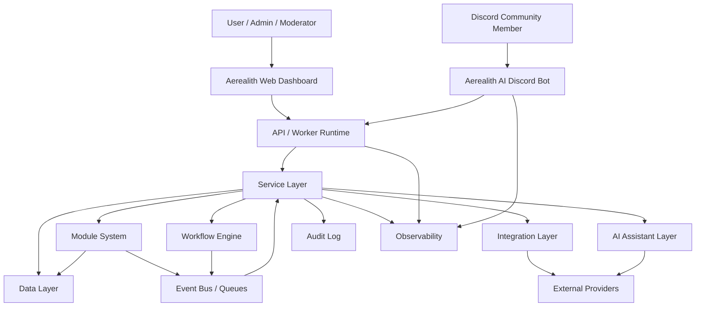

---

## System Layers

---

## 1. Client Layer

The client layer contains user-facing surfaces.

MVP client surfaces:

```text
Web dashboard
Discord bot/app
```

Future client surfaces:

```text
Mobile app
Desktop app
Browser extension
Developer portal
Public API explorer
Marketplace UI
Self-hosted admin UI
```

---

## 2. Application Layer

The application layer contains deployable apps.

Expected early apps:

```text
apps/frontend
apps/api
```

The exact deployment model may evolve.

For Cloudflare Worker deployment, the frontend Worker may serve both:

```text
Static dashboard assets
API routes
```

If API separation becomes necessary, `apps/api` can become its own deployable service.

---

## 3. API / Service Layer

The API/service layer exposes Aerealith capabilities to:

```text
Dashboard
Discord bot
Integrations
Webhooks
Future developer APIs
```

API routes should be versioned.

Recommended direction:

```text
/api/v1/...
```

Service code should avoid becoming one giant controller layer.

Instead, services should be organized around product domains.

Examples:

```text
AccountService
DiscordGuildService
ModuleService
ModerationService
TicketService
WorkflowService
IntegrationService
NotificationService
AuditLogService
AssistantService
```

---

## 4. Module Layer

The module layer provides pluggable platform capabilities.

MVP module focus:

```text
First-party modules only
Discord modules first
Module registry foundation
Module enable/disable
Module settings
Module permissions
Module audit logs
```

Post-MVP module focus:

```text
Module marketplace
Module packs
Third-party modules
Sandboxed plugin runtime
Module versioning
Module permissions marketplace review
```

---

## 5. Integration Layer

The integration layer connects Aerealith to external services.

MVP integrations:

```text
Discord
Resend or email provider
Grafana Cloud / observability
Cloudflare platform resources
Basic webhooks
```

Future integrations:

```text
GitHub
Google
Twitch
YouTube
Reddit
SMTP
S3 / MinIO
Cloudinary
Local AI providers
Custom APIs
```

Integrations should be provider-aware but not provider-chaotic.

Each integration should define:

```text
Provider
Auth/scopes
Connection status
Health
Permissions
Actions
Events
Failure behavior
Disconnect/revoke path
Audit behavior
```

---

## 6. Data Layer

The data layer stores platform state.

Data should support:

```text
Users
Accounts
Sessions
Preferences
Discord guilds
Discord members/context
Modules
Module settings
Tickets
Moderation cases
Audit logs
Workflows
Workflow runs
Integrations
Notifications
Memory foundation
```

The database architecture will be expanded in:

```text
docs/architecture/Data Architecture.md
```

---

## 7. Event / Workflow Layer

The event/workflow layer connects actions across the platform.

Examples:

```text
Discord message received
Automod rule triggered
Ticket created
Ticket closed
Moderation action performed
Module enabled
Integration failed
Workflow suggested
Workflow approved
Notification sent
Assistant action requested
```

Events should make the system easier to observe, automate, and audit.

MVP should include the foundation.

Advanced workflow automation belongs later.

---

## 8. AI Layer

The AI layer provides assistant capabilities.

MVP AI should support:

```text
Dashboard assistant chat
Explanations
Suggestions
Summaries
Approval-based actions
Discord staff summaries
Ticket/context summaries
Workflow suggestions
Audit logs for meaningful AI actions
Fallback behavior when AI unavailable
```

Future AI should support:

```text
Model routing
User-configured AI providers
Local models
Assistant skills
Advanced memory
Workflow planning
Multimodal understanding
Voice
Agentic actions with stronger controls
```

AI should never bypass permissions.

---

## 9. Observability Layer

The observability layer helps Aerealith understand health, failures, and behavior.

MVP observability should include:

```text
Application logs
Worker logs
Request IDs
Trace IDs where practical
Error visibility
Basic metrics
Discord bot health
Integration health
Workflow failure visibility
Cloudflare observability
Grafana Cloud integration
```

Future observability should include:

```text
Runbooks
Incident response
Service dashboards
SLOs
Alert routing
Audit reliability checks
Self-hosted observability path
```

---

## 10. Trust / Security Layer

Trust and security must cross every layer.

The trust layer includes:

```text
Authentication
Authorization
Permissions
Role checks
Approval gates
Risk levels
Audit logs
Data ownership
Memory controls
Integration revocation
AI disclosure
Safe failure behavior
Secret management
```

Trust is not a feature module.

It is a system-wide requirement.

---

## Monorepo Architecture

Aerealith uses an Nx + pnpm TypeScript monorepo.

Recommended root structure:

```text
apps/
libs/
docs/
```

---

## Repository Structure

```text
apps/
├── frontend/
└── api/

libs/
├── api/
├── content/
├── contracts/
├── core/
├── db/
├── flags/
├── observability/
└── ui/

docs/
├── README.md
├── vision/
├── product/
├── releases/
├── architecture/
├── engineering/
├── services/
├── modules/
├── integrations/
├── api/
├── operations/
└── rfcs/
```

---

## Monorepo Diagram

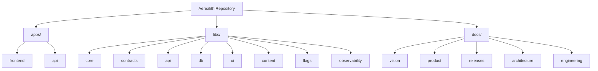

---

## Library Architecture

Libraries should keep shared code organized and reusable.

## Library Purpose

| Library              | Purpose                                                                           |
| -------------------- | --------------------------------------------------------------------------------- |
| `libs/core`          | Shared constants, errors, primitive types, utility functions, foundational logic. |
| `libs/contracts`     | API contracts, DTOs, schemas, request/response types, shared boundaries.          |
| `libs/api`           | API helpers, route helpers, middleware foundations, service-facing utilities.     |
| `libs/db`            | Database entities, schemas, migrations, and data access foundations.              |
| `libs/ui`            | Shared frontend UI components and design system foundations.                      |
| `libs/content`       | Shared copy, structured content, docs/content helpers.                            |
| `libs/flags`         | Feature flag helpers and configuration boundaries.                                |
| `libs/observability` | Logging, metrics, tracing, diagnostics, and monitoring helpers.                   |

---

## Library Dependency Rule

The default dependency rule is:

```text
libs/* may depend on libs/core only.
```

Allowed by default:

```text
libs/api -> libs/core
libs/db -> libs/core
libs/ui -> libs/core
libs/contracts -> libs/core
libs/content -> libs/core
libs/flags -> libs/core
libs/observability -> libs/core
```

Avoid by default:

```text
libs/api -> libs/db
libs/ui -> libs/api
libs/contracts -> libs/db
libs/content -> libs/ui
libs/observability -> libs/api
```

---

## Library Dependency Diagram

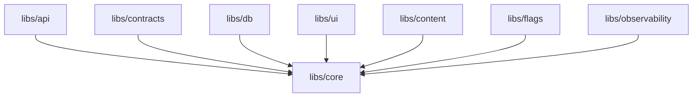

---

## Dependency Exceptions

Exceptions may be allowed later, but they should be intentional.

Before creating a cross-library dependency, ask:

```text
Can this shared logic live in libs/core?
Should this boundary live in libs/contracts?
Can this dependency be inverted?
Will this create circular dependency risk?
Will this make deployment harder?
Will this make testing harder?
```

Exceptions should be documented.

---

## Runtime Architecture

Aerealith should standardize around:

```text
Node 24.x
TypeScript
pnpm
Nx
```

Runtime expectations should be consistent across:

```text
local development
CI
build scripts
test runners
Cloudflare Worker deployment
future Docker containers
```

---

## Frontend Architecture

The frontend is the main Aerealith control center.

Recommended app:

```text
apps/frontend
```

Recommended stack:

```text
Vite
React
React Router
TailwindCSS
TanStack
```

---

## Frontend Responsibilities

MVP frontend responsibilities:

```text
Dashboard shell
Navigation
Account/profile/settings foundation
Assistant chat surface
Connected Discord servers
Discord server dashboard
Module grid
Module settings
Role/permission mapping UI
Moderation logs
Ticket overview
Audit logs
Basic notifications
Integration health
Workflow overview
```

Future frontend responsibilities:

```text
Workflow builder
Marketplace
Billing
Developer portal
Advanced analytics
Memory review UI
Organization dashboard
Mobile companion views
Self-hosted admin views
```

---

## Frontend Boundary Rule

The frontend should not own core business logic.

Frontend may contain:

```text
UI state
forms
route loaders
presentation logic
client API wrappers
view models
```

Frontend should not own:

```text
permission truth
moderation enforcement
audit creation
integration secrets
workflow execution
Discord action authority
AI provider secrets
```

---

## API Architecture

The API should expose stable service boundaries.

Recommended route direction:

```text
/api/v1/...
```

---

## API Responsibilities

The API should handle:

```text
authentication context
authorization checks
input validation
service orchestration
module actions
integration actions
workflow actions
audit log creation
notification creation
safe error responses
```

The API should not blindly trust the frontend.

---

## API Route Groups

Potential route groups:

```text
/api/v1/account
/api/v1/users
/api/v1/settings
/api/v1/discord
/api/v1/modules
/api/v1/moderation
/api/v1/tickets
/api/v1/workflows
/api/v1/integrations
/api/v1/notifications
/api/v1/audit
/api/v1/assistant
/api/v1/developer
```

---

## Discord Architecture

Discord is the flagship MVP platform surface.

The Discord architecture should include:

```text
Official Aerealith AI Discord bot
Discord OAuth / install flow
Guild linking
Guild settings
Role mapping
Permission checks
Module manager
Command manager
Moderation actions
Automod events
Tickets
Transcripts
Discord audit logs
Dashboard controls
```

---

## Discord System Diagram

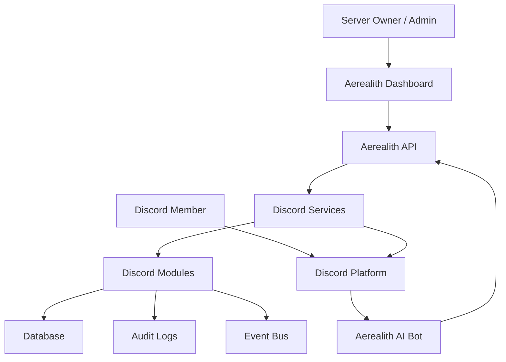

---

## Discord MVP Modules

MVP Discord modules:

```text
Core Discord integration
Server linking
Permissions / role mapping
Module manager
Command manager foundation
Basic roles
Moderation basics
Automod foundation
Tickets
Ticket transcripts
Logging / audit events
Basic welcome
Basic activity summaries
```

---

## Discord Safety Requirements

Discord actions must respect:

```text
Discord permissions
Discord role hierarchy
Aerealith permissions
Server owner/admin approval
Risky action confirmation
Audit logging
Module enablement state
```

AI should not automatically punish Discord users in MVP.

---

## Module Architecture

Modules are first-party capabilities that can be enabled, disabled, configured, and audited.

---

## Module Model

A module should define:

```text
ID
Name
Description
Version
Status
Required permissions
Config schema
Actions
Events
Dependencies
Risk level
Audit behavior
Enable/disable behavior
```

---

## Module Lifecycle

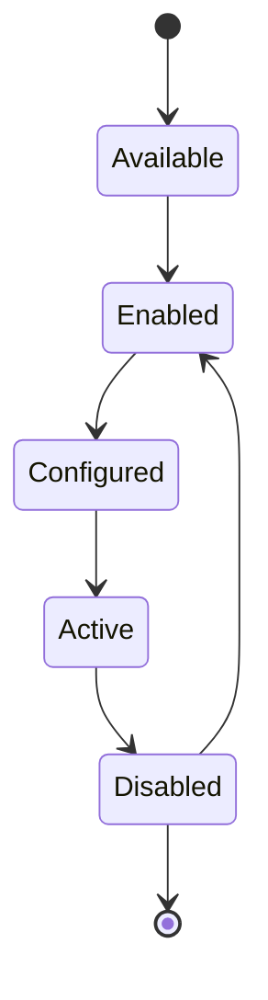

---

## Module Architecture Rules

Modules should:

```text
Declare permissions
Validate config
Fail safely
Write audit logs for meaningful actions
Avoid hidden side effects
Expose clear settings
Support disable behavior
Respect platform trust rules
```

---

## Workflow Architecture

Workflows coordinate actions across modules, events, integrations, and notifications.

MVP workflow scope:

```text
Workflow records
Workflow status
Manual workflow concepts
Assistant suggestions
Basic approval gates
Workflow history foundation
Audit logs
```

Post-MVP workflow scope:

```text
Visual builder
Triggers
Conditions
Actions
Variables
Loops
Branches
Dry runs
Templates
Scheduling
Cross-service workflows
```

---

## Workflow Diagram

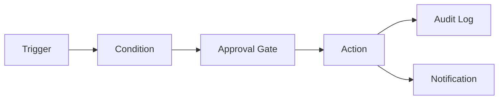

---

## Workflow Safety

Workflows should support:

```text
approval gates
dry-run behavior later
audit logs
failure state
retry policy later
disable switch
permission checks
human override
```

---

## AI Assistant Architecture

The assistant layer helps users understand and operate the platform.

The assistant should not own authority by itself.

Authority comes from:

```text
user permissions
server permissions
module settings
approval gates
system policy
audit requirements
```

---

## AI Assistant Responsibilities

MVP assistant responsibilities:

```text
Answer questions about connected context
Explain dashboard state
Summarize Discord activity
Summarize tickets
Suggest workflows
Suggest moderation actions
Prepare actions for approval
Explain risky actions
Create audit logs for meaningful actions
Fallback when AI provider unavailable
```

---

## AI Assistant Non-Responsibilities

MVP assistant should not:

```text
Automatically punish Discord users
Bypass role checks
Use private data without permission
Hide AI actions
Train on private data without explicit consent
Silently store sensitive memory
Run destructive actions without confirmation
```

---

## AI Architecture Diagram

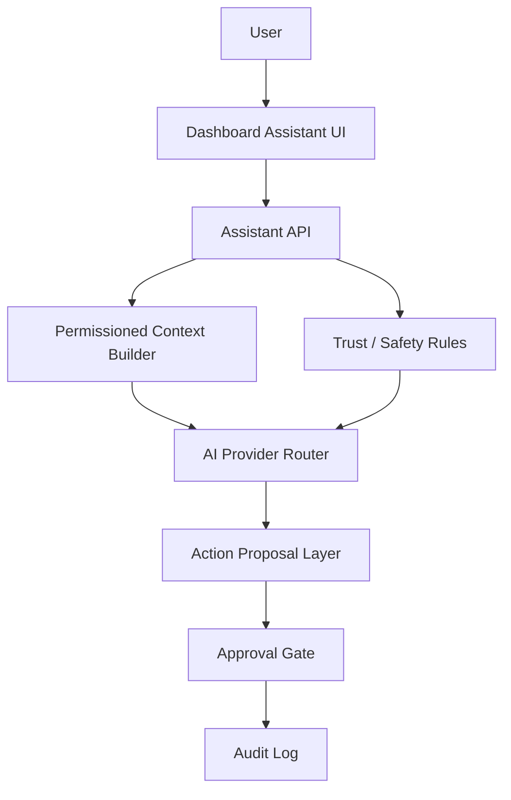

---

## Integration Architecture

Integrations connect Aerealith to external systems.

Each integration should have:

```text
connection state
credentials / token storage
scopes
health checks
available actions
available events
sync behavior
disconnect behavior
audit behavior
failure behavior
```

---

## Integration Pattern

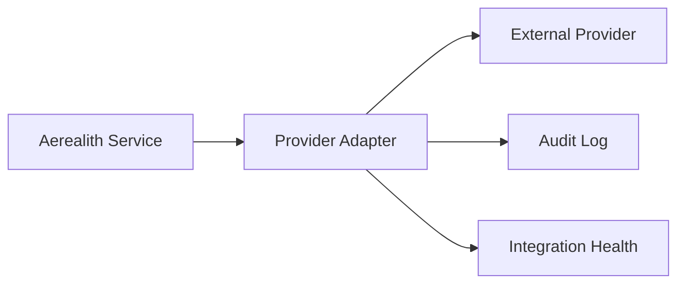

---

## Provider Replacement Direction

Aerealith should support replaceable providers over time.

Examples:

| Capability           | Early Provider      | Future Replacement |
| -------------------- | ------------------- | ------------------ |
| Email                | Resend              | SMTP               |
| Media/Object Storage | Cloudinary / R2     | S3 / MinIO         |
| Observability        | Grafana Cloud       | Grafana OSS        |
| Hosting              | Cloudflare          | Docker/self-hosted |
| AI                   | Hosted AI providers | Local models       |

Provider replacement should not be a day-one product feature, but the architecture should not make it impossible.

---

## Data Architecture Overview

The data layer should store platform state cleanly.

Potential data areas:

```text
users
accounts
sessions
profiles
preferences
discord_guilds
discord_guild_settings
discord_role_mappings
modules
module_settings
moderation_cases
tickets
ticket_messages
ticket_transcripts
audit_logs
workflows
workflow_runs
integrations
notifications
assistant_memory
```

Detailed schema belongs in:

```text
docs/architecture/Data Architecture.md
docs/engineering/Database.md
```

---

## Data Ownership

Users and communities should understand what data belongs to them.

Community-owned data may include:

```text
server settings
moderation history
ticket history
transcripts
module configuration
logs
analytics
```

Data should eventually be:

```text
reviewable
exportable
deletable where appropriate
portable where practical
```

---

## Event Architecture

Events help Aerealith coordinate work without tightly coupling every feature.

MVP event sources:

```text
Discord events
Dashboard actions
Module actions
Ticket events
Moderation events
Integration events
Workflow events
Assistant action requests
```

---

## Event Flow

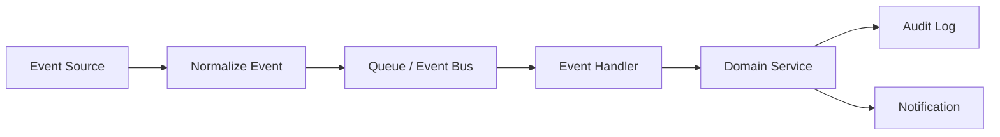

---

## Event Rules

Events should be:

```text
typed
versionable
traceable
auditable where meaningful
safe to retry where practical
clear about source
clear about actor
clear about target
```

---

## Notification Architecture

Notifications should help users know what matters without spamming them.

MVP notification channels:

```text
Dashboard attention items
In-app notifications
Basic email notifications where needed
Discord staff alerts
```

Future notification channels:

```text
Mobile push
Desktop notifications
Digest emails
Webhook notifications
SMS if ever justified
```

---

## Notification Rule

Before sending a notification, ask:

```text
Is this worth interrupting the user?
```

Notifications should support:

```text
priority
source
target user/team
action required
read state
dismissal
audit relation where appropriate
```

---

## Audit Architecture

Audit logs are a core platform feature.

They should record meaningful actions across:

```text
accounts
Discord servers
modules
moderation
tickets
workflows
integrations
assistant actions
notifications
settings
permissions
```

---

## Audit Log Fields

Audit logs should generally include:

```text
timestamp
event type
actor
target
module
source
risk level
result
request ID
trace ID
approval source
metadata
```

---

## Audit Rule

If an action changes permissions, moderation state, tickets, workflows, integrations, billing, or user/community data, it probably needs an audit log.

---

## Security Architecture Overview

Detailed security architecture belongs in its own document.

At the system level, Aerealith must support:

```text
authentication
authorization
least privilege
role-based access
Discord permission checks
secret safety
input validation
rate limiting
CSRF/CORS strategy where relevant
safe error responses
audit logs
integration token protection
secure environment configuration
```

---

## Permission Flow

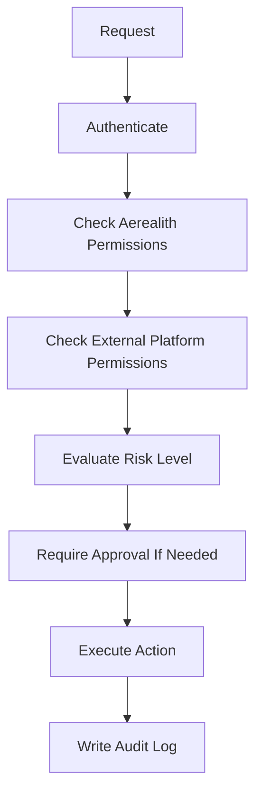

---

## Deployment Architecture

Aerealith should begin Cloudflare-first.

Early deployment may include:

```text
Cloudflare Workers
Cloudflare Pages/Assets style serving through Workers
Cloudflare KV
Cloudflare R2
Cloudflare Queues
Cloudflare Analytics Engine
Cloudflare Observability
```

The system should remain Docker-aware for future self-hosting.

---

## Deployment Direction

```text
MVP:
Cloudflare-first

Post-MVP:
Provider boundaries become stronger

Future:
Docker/self-hosted preview
```

---

## Deployable Units

Potential deployable units:

```text
frontend worker
api worker
discord bot worker/service
workflow worker/service
notification worker/service
integration worker/service
admin/support tools
```

In early releases, some of these may be combined.

Do not split into many deployables before there is a real need.

---

## Environment Architecture

Aerealith should support multiple environments.

Expected environments:

```text
local
preview
staging
production
```

---

## Environment Responsibilities

| Environment  | Purpose                                        |
| ------------ | ---------------------------------------------- |
| `local`      | Developer machine testing and experimentation. |
| `preview`    | Branch/PR validation and review builds.        |
| `staging`    | Production-like testing before release.        |
| `production` | Real users and live communities.               |

---

## Environment Rules

Environments should have separate:

```text
secrets
databases
storage
queues
AI provider settings
Discord app/bot configuration where necessary
observability labels
feature flags
```

Never use production secrets in local development.

---

## Configuration Architecture

Configuration should be explicit and typed where practical.

A config value should define:

```text
name
description
required status
default value if any
secret status
environment availability
owner
```

Configuration should fail clearly when required values are missing.

---

## Observability Architecture

Observability should help answer:

```text
What happened?
Where did it happen?
Who was affected?
How bad is it?
Can it recover?
What should we do next?
```

---

## Observability Signals

Aerealith should eventually collect:

```text
logs
metrics
traces
errors
audit events
health checks
queue status
integration health
Discord bot health
workflow failures
AI provider failures
```

MVP can start smaller, but observability should not be ignored.

---

## Self-Hosting Architecture Direction

Full self-hosting is not MVP.

However, Aerealith should keep future self-hosting in mind.

MVP should support:

```text
Docker-aware deployable boundaries
provider assumptions documented
secrets not hardcoded
environment-based configuration
replaceable provider thinking
```

Future self-hosting should support:

```text
Docker Compose
self-hosted setup guide
SMTP
S3 / MinIO
Grafana OSS
local AI
backup / restore
upgrade path
self-hosted admin dashboard
```

---

## MVP System Architecture

The MVP architecture should focus on the smallest coherent platform.

MVP should include:

```text
Web dashboard
Account foundation
Assistant surface
Discord bot/app foundation
Discord server linking
Module registry
Module enable/disable
Role/permission mapping
Moderation basics
Automod foundation
Tickets
Ticket transcripts
Audit logs
Basic notifications
Workflow foundation
Integration health
Observability foundation
```

---

## MVP Architecture Diagram

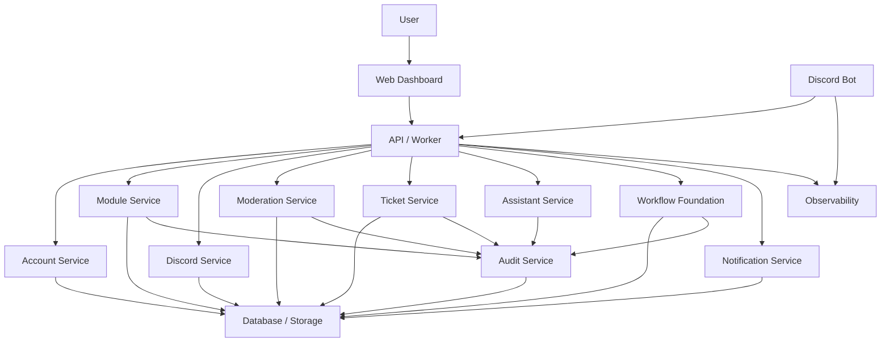

---

## Architecture Non-Goals

This document does not fully define:

```text
Database schema
Auth implementation
Discord bot internals
AI provider routing details
Workflow engine details
Marketplace runtime
Plugin sandboxing
Billing architecture
Mobile architecture
Desktop architecture
Self-hosted deployment
Enterprise architecture
```

Those should be separate architecture documents.

---

## Architecture Risks

## Risk: Overbuilding Too Early

Aerealith could become too complex before it has real users.

Mitigation:

```text
Keep MVP architecture focused.
Avoid unnecessary microservices.
Avoid marketplace/plugin runtime before first-party modules work.
```

---

## Risk: Tight Provider Lock-In

Early provider choices could leak everywhere.

Mitigation:

```text
Create provider adapters.
Document assumptions.
Use environment-based configuration.
Keep Docker direction alive.
```

---

## Risk: AI Becomes Too Central

If AI owns too much, the product may fail when AI is unavailable.

Mitigation:

```text
Core platform behavior must work without AI.
AI prepares, explains, summarizes, and suggests.
Users approve meaningful actions.
```

---

## Risk: Discord Complexity Spreads Everywhere

Discord-specific logic could leak into unrelated platform layers.

Mitigation:

```text
Keep Discord logic inside Discord services/modules.
Expose normalized contracts to the rest of the platform.
```

---

## Risk: Weak Auditability

Actions without logs reduce trust.

Mitigation:

```text
Make audit logs a shared platform behavior.
Require audit logs for meaningful or risky actions.
```

---

## Risk: Dependency Spaghetti

Libraries could start depending on each other randomly.

Mitigation:

```text
Use libs/core as the default shared dependency.
Document exceptions.
Enforce boundaries later with tooling.
```

---

## Future Architecture Documents

Recommended future architecture docs:

```text
docs/architecture/README.md
docs/architecture/Monorepo Architecture.md
docs/architecture/Frontend Architecture.md
docs/architecture/API Architecture.md
docs/architecture/Service Architecture.md
docs/architecture/Data Architecture.md
docs/architecture/Auth Architecture.md
docs/architecture/Security Architecture.md
docs/architecture/Discord Architecture.md
docs/architecture/Module Architecture.md
docs/architecture/Workflow Architecture.md
docs/architecture/AI Architecture.md
docs/architecture/Integration Architecture.md
docs/architecture/Notification Architecture.md
docs/architecture/Audit Architecture.md
docs/architecture/Observability Architecture.md
docs/architecture/Deployment Architecture.md
docs/architecture/Self Hosting Architecture.md
```

---

## Architecture Review Questions

Before adding a new system, service, provider, or major abstraction, ask:

```text
Does this serve the current release?
Can this be simpler?
Does this improve user control?
Does this preserve auditability?
Does this respect library boundaries?
Does this create provider lock-in?
Does this still work if AI is unavailable?
Does this need approval gates?
Does this need audit logs?
Does this belong in a module?
Does this belong in an integration adapter?
Can it fail safely?
Can it be tested?
Can future contributors understand it?
```

---

## Final System Standard

Aerealith’s system architecture should be simple enough to build, modular enough to grow, trustworthy enough to manage communities, and flexible enough to become a broader digital-life operating system.

The standard is:

> Aerealith is a trusted orchestration layer where users can connect services, enable modules, approve actions, review logs, automate workflows, and use AI assistance without losing control.
