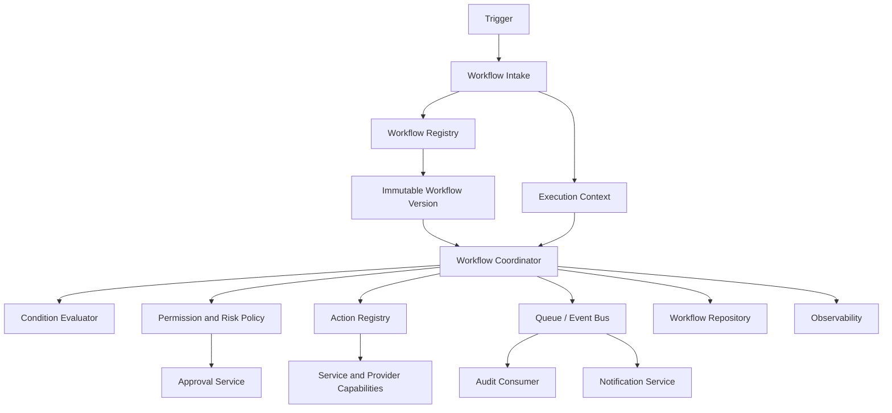
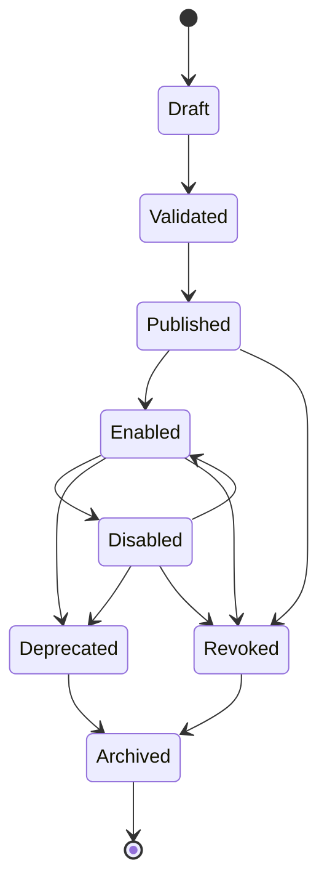
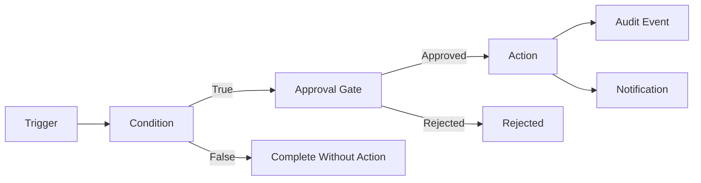
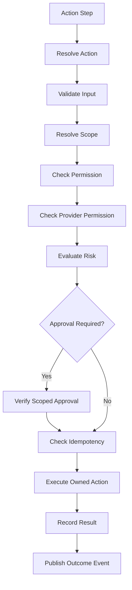
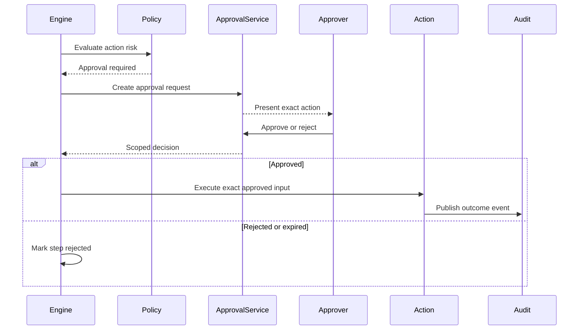
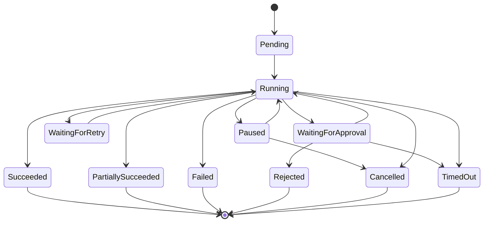
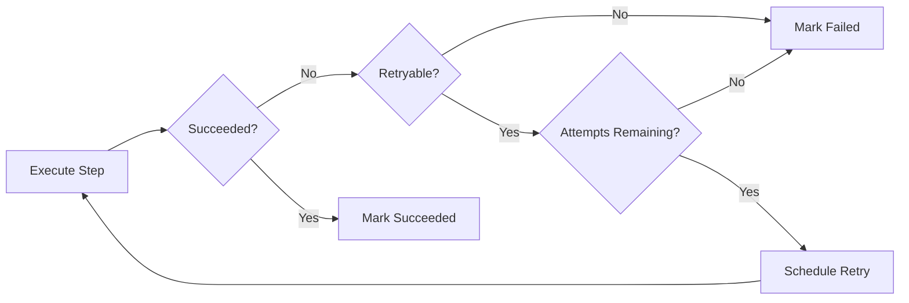

# Workflow Architecture

Status: Draft
Owner: Tim Pierce / SinLess Games
Last Updated: 2026-07-12
Security Classification: Internal Architecture
Foundation Release: `0.5 — API & Service Platform`
Full Builder Release: `1.4 — Workflow Builder`

Pending Decision Records:

- `docs/rfcs/0011-event-envelope-audit-model-and-idempotency.md`
- `docs/rfcs/0012-workflow-records-and-approval-primitive.md`
- `docs/rfcs/0013-provider-abstraction-and-integration-interface.md`
- `docs/rfcs/0014-module-registry-manifest-and-lifecycle.md`
- `docs/rfcs/0016-ai-assistant-boundaries-and-mvp-memory-scope.md`
- `docs/rfcs/0017-observability-trace-propagation-and-alerting.md`

Related RFCs:

- `docs/rfcs/0002-monorepo-library-boundaries.md`
- `docs/rfcs/0003-api-versioning-and-route-strategy.md`
- `docs/rfcs/0004-error-and-result-model.md`
- `docs/rfcs/0005-entity-schema-and-contract-strategy.md`
- `docs/rfcs/0008-configuration-and-secrets-model.md`
- `docs/rfcs/0009-authentication-session-and-authorization-model.md`
- `docs/rfcs/0010-api-envelope-request-and-trace-id-propagation.md`

Related Architecture:

- `docs/architecture/Monorepo Architecture.md`
- `docs/architecture/Frontend Architecture.md`
- `docs/architecture/API Architecture.md`
- `docs/architecture/Service Architecture.md`
- `docs/architecture/Data Architecture.md`
- `docs/architecture/Auth Architecture.md`
- `docs/architecture/Security Architecture.md`
- `docs/architecture/Discord Architecture.md`
- `docs/architecture/Module Architecture.md`

---

## Purpose

This document defines the workflow architecture for Aerealith AI.

Workflows coordinate trusted platform behavior across:

```text
services
modules
integrations
notifications
approvals
provider actions
scheduled work
community operations
developer events
AI-assisted suggestions
```

The workflow architecture governs:

```text
workflow definitions
workflow versions
triggers
conditions
approval gates
actions
execution state
run history
step history
idempotency
retries
timeouts
cancellation
failure handling
notifications
audit events
provider capabilities
module extensions
manual execution
scheduled execution
future visual building
```

The guiding rule is:

> A workflow may coordinate actions, but it may not bypass authentication, authorization, risk evaluation, approval, provider permissions, audit requirements, or ownership boundaries.

A workflow is a controlled execution plan.

It is not a backdoor around the rest of the platform.

---

## Architecture Summary

Aerealith uses a versioned, record-based workflow architecture.

A workflow consists of:

```text
a trigger
optional conditions
zero or more approval gates
one or more actions
execution and failure policies
notification behavior
audit behavior
```

The initial execution path is:

```text
Trigger
→ Validate
→ Resolve Scope
→ Authorize
→ Evaluate Conditions
→ Evaluate Risk
→ Require Approval
→ Execute Action
→ Publish Events
→ Write Audit Records
→ Send Notifications
```

The MVP foundation provides:

```text
workflow records
workflow versions
manual triggers
approval gates
execution history
run status
notifications
audit integration
idempotent action execution
```

The MVP does not require:

```text
a full visual builder
arbitrary DAG editing
custom code execution
untrusted scripts
large-scale autonomous scheduling
AI-generated execution without approval
complex branching editors
public workflow marketplace
```

Those capabilities are deferred until the workflow foundations are proven.

---

## Workflow Architecture Goals

The workflow architecture should provide:

```text
predictable execution
versioned definitions
clear ownership
explicit scope
safe retries
idempotent actions
approval before risky execution
complete run history
auditable meaningful actions
module extensibility
provider-neutral capabilities
graceful failure
cancellation
observability
testability
future visual-builder readiness
```

---

## Non-Goals

The initial workflow architecture does not require:

```text
a general-purpose programming language
arbitrary shell execution
arbitrary JavaScript execution
user-uploaded code
distributed transactions
exactly-once queue delivery
unrestricted recursive workflows
unbounded loops
unbounded parallelism
full event sourcing
one microservice per workflow
AI-controlled approval
automatic destructive action
```

Aerealith should prove safe workflow records and execution before building a sprawling automation engine.

---

## Core Principles

Aerealith workflows follow these principles:

```text
Every workflow is versioned.
Every run references an immutable workflow version.
Every trigger is validated.
Every action has an owner.
Every action declares permissions and risk.
Every meaningful action is auditable.
Approval must occur before execution.
Approvals are bound to exact actions and inputs.
Queue delivery is treated as at least once.
Actions must be idempotent where retries are possible.
Workflows do not receive unrestricted database or provider access.
Secrets are referenced, not embedded.
Execution history is append-oriented.
Failures are visible.
Cancellation is explicit.
AI output is treated as untrusted input.
Core workflows must remain usable without AI.
```

---

## Workflow Terminology

| Term              | Meaning                                                                       |
| ----------------- | ----------------------------------------------------------------------------- |
| Workflow          | A named automation or coordinated execution definition.                       |
| Workflow Version  | An immutable version of a workflow definition.                                |
| Trigger           | The event or request that starts a workflow run.                              |
| Condition         | A validated decision that controls whether execution continues.               |
| Action            | An owned operation performed by a service, module, or provider capability.    |
| Step              | One executable or evaluative unit within a workflow.                          |
| Run               | One execution of one workflow version.                                        |
| Step Run          | The execution record for one workflow step.                                   |
| Approval Gate     | A required authorization checkpoint before a risky action.                    |
| Execution Context | The actor, scope, request, trace, and runtime information for a run.          |
| Compensation      | A separate corrective action used after a partially completed workflow fails. |
| Idempotency Key   | A stable key used to prevent duplicate execution.                             |

---

## What Is a Workflow?

A workflow is an ordered definition of platform behavior.

A workflow may:

```text
react to an event
perform validation
check conditions
wait for approval
invoke service actions
invoke module actions
invoke provider capabilities
send notifications
record outcomes
```

A workflow is not:

```text
a database transaction across every system
a provider SDK wrapper
an authorization system
an approval system
a replacement for service logic
an unrestricted code runner
```

Workflow actions call owned application services.

They do not reimplement the services they coordinate.

---

## High-Level Architecture



---

## Initial Runtime Model

Workflow coordination may run across:

```text
the API Worker
queue consumers
scheduled workers
persistent integration runtimes
```

The initial platform should keep these logical responsibilities clear without creating unnecessary deployments.

Potential execution placement:

| Workflow Work                         | Initial Runtime              |
| ------------------------------------- | ---------------------------- |
| Manual trigger intake                 | API Worker                   |
| Workflow record creation              | API Worker                   |
| Short validation and condition checks | API Worker or queue consumer |
| Provider event trigger                | Integration runtime          |
| Long-running or retryable action      | Queue consumer               |
| Scheduled trigger                     | Scheduled worker             |
| Discord gateway-triggered action      | Discord integration runtime  |
| Notification delivery                 | Notification consumer        |
| Audit persistence                     | Audit consumer               |

---

## Monorepo Placement

Workflow service behavior belongs under:

```text
apps/services/api/src/features/workflows/
```

Queue or worker behavior may belong under:

```text
apps/services/workers/
apps/services/scheduled/
```

Integration-owned workflow triggers and actions belong under:

```text
apps/integrations/
```

Shared workflow contracts belong in:

```text
libs/contracts/src/workflows/
```

Core workflow primitives belong in:

```text
libs/core/src/workflows/
```

Persistence belongs in:

```text
libs/db/src/schema/workflows/
libs/db/src/repositories/workflows/
libs/db/src/mappers/workflows/
```

Reusable API behavior may belong in:

```text
libs/api/src/workflows/
```

---

## Dependency Direction

Allowed by default:

```text
workflow service -> libs/core
workflow service -> libs/contracts
workflow service -> libs/db
workflow service -> libs/api
workflow service -> libs/observability
workflow service -> libs/flags
workflow service -> approved service interfaces
workflow service -> approved module action interfaces
```

Avoid:

```text
workflow service -> raw provider SDKs
workflow service -> unrelated database tables
workflow service -> frontend internals
workflow service -> module private implementations
workflow service -> unrestricted global dependency container
workflow service -> tools/*
```

The workflow coordinator should depend on action contracts and capabilities rather than provider internals.

---

## Workflow Layers

The workflow architecture uses these logical layers:

```text
transport
application
domain
execution
persistence
infrastructure
```

### Transport Layer

The transport layer receives:

```text
REST requests
tRPC requests
GraphQL mutations
provider events
module events
queue messages
scheduled triggers
manual dashboard triggers
```

It should:

```text
validate transport input
authenticate where required
create request context
resolve workflow identity
dispatch to application behavior
return a safe response
```

### Application Layer

The application layer owns:

```text
create workflow
publish workflow version
enable workflow
disable workflow
trigger workflow
approve workflow action
cancel workflow
retry workflow step
query workflow history
```

### Domain Layer

The domain layer owns:

```text
workflow lifecycle
workflow version rules
run state transitions
step state transitions
approval requirements
risk policy
retry policy
cancellation policy
```

### Execution Layer

The execution layer owns:

```text
step coordination
condition evaluation
action resolution
approval waiting
timeout handling
retry scheduling
event publication
result recording
```

### Persistence Layer

The persistence layer owns:

```text
workflow records
workflow versions
run records
step-run records
trigger receipts
approval references
idempotency records
execution history
```

### Infrastructure Layer

The infrastructure layer owns:

```text
queue clients
schedulers
provider adapters
secret references
observability exporters
runtime configuration
```

---

## Workflow Lifecycle

The workflow definition lifecycle is:

```text
Draft
Validated
Published
Enabled
Disabled
Deprecated
Archived
Revoked
```



---

## Draft State

A workflow is `Draft` while it is being created or modified.

Draft workflows:

```text
may change
may be incomplete
must not execute
must not receive production triggers
```

Draft changes do not mutate previously published versions.

---

## Validated State

A workflow is `Validated` when:

```text
the definition schema is valid
all referenced triggers exist
all referenced conditions exist
all referenced actions exist
permissions are known
risk levels are known
dependencies are compatible
the graph contains no prohibited cycles
```

Validation does not automatically publish or enable the workflow.

---

## Published State

Publishing creates an immutable workflow version.

A published version should not be edited in place.

Changing a published workflow requires a new version.

This protects:

```text
run reproducibility
approval integrity
audit clarity
rollback
debugging
contract compatibility
```

---

## Enabled State

An enabled workflow may receive triggers.

Enablement should verify:

```text
workflow version is published
scope is valid
dependencies are available
permissions are understood
provider connections are healthy
required secrets exist
required approvals for enablement are present
```

---

## Disabled State

A disabled workflow must not accept new triggers.

Disabling should:

```text
stop new runs
stop new scheduled triggers
stop event matching
preserve definitions
preserve run history
preserve configuration
leave in-progress runs subject to cancellation policy
publish a workflow-disabled event
```

---

## Deprecated State

A deprecated workflow remains visible for migration or historical purposes.

Deprecated workflows should not receive new enablement unless explicitly permitted.

Deprecation should document:

```text
reason
replacement
migration path
support deadline
```

---

## Revoked State

A workflow may be revoked because of:

```text
security incident
malicious behavior
unsafe definition
credential compromise
policy violation
administrative action
critical provider change
```

Revoked workflows must stop receiving new triggers.

In-progress behavior should follow the safest cancellation policy.

---

## Workflow Versioning

Each published definition receives an immutable version.

Workflow versions should capture:

```text
workflow ID
version number
definition schema version
trigger definitions
condition definitions
action definitions
risk policy
approval policy
retry policy
timeout policy
failure policy
created by
published by
published at
```

A run always references one exact workflow version.

---

## Version Example

```ts
export interface WorkflowVersion {
  readonly id: string
  readonly workflowId: string
  readonly version: number
  readonly schemaVersion: number
  readonly status: WorkflowVersionStatus
  readonly definition: WorkflowDefinition
  readonly createdBy: string
  readonly createdAt: string
  readonly publishedBy?: string
  readonly publishedAt?: string
}
```

The exact contract should be finalized in RFC 0012.

---

## Definition Immutability

Once a workflow version has executed, its definition must remain available for history and explanation.

Do not overwrite:

```text
trigger configuration
action input mappings
risk classification
approval requirements
retry rules
```

for an existing version.

Create a new version instead.

---

## Workflow Definition

A workflow definition may contain:

```text
metadata
trigger
conditions
steps
failure policy
timeout policy
notification policy
audit policy
```

Conceptual structure:

```ts
export interface WorkflowDefinition {
  readonly name: string
  readonly description?: string
  readonly trigger: WorkflowTriggerDefinition
  readonly conditions: readonly WorkflowConditionDefinition[]
  readonly steps: readonly WorkflowStepDefinition[]
  readonly failurePolicy: WorkflowFailurePolicy
  readonly timeoutPolicy: WorkflowTimeoutPolicy
  readonly notificationPolicy: WorkflowNotificationPolicy
}
```

---

## Workflow Graph Direction

The initial engine should prefer a simple ordered step model.

Supported initial behavior:

```text
sequential steps
conditions
approval gates
bounded retries
explicit failure policies
manual cancellation
```

Future behavior may add:

```text
parallel branches
joins
delays
schedules
loops with strict bounds
sub-workflows
```

Complex graph behavior should not be introduced until run semantics, failure behavior, and observability are proven.

---

## Initial Execution Shape



---

## Trigger Architecture

A trigger starts a workflow run.

Trigger types may include:

```text
manual
event
schedule
provider event
module event
API request
webhook
developer event
```

The MVP should prioritize:

```text
manual triggers
internal event triggers
provider event triggers
```

Broad scheduling and visual trigger creation may arrive later.

---

## Manual Triggers

Manual triggers may originate from:

```text
dashboard
Discord command
developer API
administrator tool
module action
```

Manual triggers require:

```text
authenticated actor where relevant
scope validation
workflow permission
input validation
risk evaluation
idempotency handling where needed
```

---

## Event Triggers

Event triggers match normalized Aerealith events.

A trigger subscription should define:

```text
event type
supported event versions
scope rules
filter rules
deduplication behavior
workflow version
```

Event triggers should not depend directly on raw provider SDK payloads.

---

## Provider Event Triggers

Provider events should be normalized before triggering workflows.

Example:

```text
Discord MESSAGE_CREATE
```

becomes:

```text
community.message.created
```

The workflow engine should consume the normalized event.

Provider-specific data may remain inside validated metadata when needed.

---

## Scheduled Triggers

Scheduled triggers may support:

```text
one-time execution
recurring execution
calendar-based execution
delayed execution
```

Scheduled execution should define:

```text
time zone behavior
misfire behavior
duplicate prevention
maximum catch-up behavior
cancellation
ownership
```

Full scheduling UI is not required for the initial workflow foundation.

---

## Trigger Validation

Every trigger must validate:

```text
trigger identity
workflow state
workflow version
scope
input schema
actor
event version
idempotency key
feature availability
```

Unknown or malformed triggers should fail safely.

---

## Trigger Receipts

Trigger receipts may be stored for:

```text
deduplication
support
diagnostics
security investigation
run correlation
```

A trigger receipt may include:

```text
trigger receipt ID
workflow ID
workflow version ID
source type
source event ID
scope
received at
request ID
trace ID
run ID
status
```

---

## Condition Architecture

Conditions decide whether workflow execution continues.

Conditions should be:

```text
deterministic where practical
schema-validated
side-effect free
bounded in execution time
observable
```

Examples:

```text
module is active
integration is healthy
member has role
message matches policy
account plan permits action
notification preference is enabled
resource status equals expected value
```

---

## Condition Rules

Conditions must not:

```text
perform provider writes
modify database state
send notifications
approve actions
create hidden side effects
```

A condition evaluates.

An action changes state.

---

## Condition Result

A condition result should include:

```text
passed
reason code
safe explanation
evaluated at
input fingerprint
```

This supports understandable run history.

---

## Action Architecture

An action is an owned platform operation.

Actions should be registered by:

```text
services
modules
integrations
platform capabilities
```

Examples:

```text
send notification
post community message
timeout community member
create ticket
enable module
disconnect integration
update preference
create audit export
```

---

## Action Definition

Every action should define:

```text
action ID
owner
version
input schema
output schema
required permissions
required provider permissions
risk level
approval policy
idempotency policy
retry policy
timeout
audit policy
```

Example:

```ts
export interface WorkflowActionDefinition {
  readonly id: string
  readonly version: number
  readonly owner: string
  readonly inputSchema: string
  readonly outputSchema: string
  readonly requiredPermissions: readonly string[]
  readonly requiredCapabilities: readonly string[]
  readonly riskLevel: RiskLevel
  readonly approvalRequired: boolean
  readonly idempotencyRequired: boolean
  readonly retryPolicy: WorkflowRetryPolicy
  readonly timeoutMs: number
  readonly auditRequired: boolean
}
```

---

## Action Registry

The action registry is the authoritative catalog of executable workflow actions.

It should answer:

```text
Does the action exist?
Which version is available?
Who owns it?
Which runtime executes it?
Which schema applies?
Which permissions are required?
Which risk applies?
Is approval required?
Is the action currently available?
```

The registry should not expose unrestricted execution.

Execution still requires workflow, permission, scope, and approval checks.

---

## Action Ownership

Every action must have one owning service or module.

The owner is responsible for:

```text
business rules
authorization requirements
input schema
risk classification
idempotency
provider behavior
error mapping
audit behavior
tests
documentation
```

The workflow engine coordinates actions.

It does not become the owner of every action's internal behavior.

---

## Action Execution Flow



---

## Approval Gates

Approval gates are first-class workflow steps.

An approval gate must occur before the protected action.

Approval may be required because of:

```text
action risk
workflow policy
account policy
module policy
provider policy
administrator policy
```

---

## Approval Binding

Approval should bind to:

```text
workflow ID
workflow version
run ID
step ID
action ID
action version
actor
target
scope
input fingerprint
risk level
expiration
```

An approval becomes invalid when:

```text
the workflow version changes
the action input changes
the target changes
the scope changes
the actor loses permission
the approver loses permission
the approval expires
the action already executed
the run is cancelled
```

---

## Approval Flow



---

## Approval Waiting

A run waiting for approval should enter:

```text
WaitingForApproval
```

The workflow should store:

```text
approval ID
requested at
expires at
required approver policy
pending action fingerprint
```

The run must not hold an open request or database transaction while waiting.

Approval resumes the run asynchronously.

---

## Run Lifecycle

The workflow run lifecycle is:

```text
Pending
Running
WaitingForApproval
WaitingForRetry
Paused
Succeeded
PartiallySucceeded
Failed
Rejected
Cancelled
TimedOut
```



---

## Pending State

A run is `Pending` when it has been accepted but execution has not started.

A pending run may be waiting for:

```text
queue delivery
runtime capacity
scheduled time
dependency availability
```

---

## Running State

A run is `Running` while it is actively evaluating or executing a step.

A run should not remain `Running` indefinitely without heartbeat or timeout behavior.

---

## Waiting for Approval

A run is `WaitingForApproval` when the next protected action requires a decision.

The run should remain durable while waiting.

No worker should need to stay alive.

---

## Waiting for Retry

A run is `WaitingForRetry` after a retryable failure.

The run should record:

```text
failed step
attempt number
next attempt at
retry reason
last error code
```

---

## Paused State

A run may be paused because of:

```text
administrator action
provider outage
dependency degradation
security incident
maintenance
```

Paused runs should not execute new actions.

---

## Partially Succeeded State

A run is `PartiallySucceeded` when:

```text
one or more actions completed
a later action failed
full rollback was not possible
the final state is mixed
```

This status must be visible and explained.

Do not label partial execution as a simple success.

---

## Rejected State

A run is `Rejected` when required approval is explicitly denied.

Rejection should preserve:

```text
approval reference
rejection reason where available
rejected by
rejected at
```

---

## Cancelled State

A run is `Cancelled` when execution was intentionally stopped.

Cancellation does not imply completed actions were undone.

The run history must show which steps already succeeded.

---

## Timed-Out State

A run is `TimedOut` when:

```text
a step exceeded its timeout
approval expired
the overall run exceeded its maximum duration
```

Timeout should be explicit, not represented as an unknown failure.

---

## Step Lifecycle

A workflow step may use:

```text
Pending
Running
WaitingForApproval
WaitingForRetry
Succeeded
Skipped
Failed
Rejected
Cancelled
TimedOut
```

Each step run should record:

```text
step ID
step type
action or condition ID
attempt
status
started at
completed at
input fingerprint
output reference
error code
approval ID
request ID
trace ID
```

---

## Execution Context

Every run should have an immutable or append-only execution context.

Potential fields:

```text
workflow ID
workflow version ID
run ID
actor
scope
trigger
request ID
trace ID
environment
feature flags
locale where relevant
provider connection references
```

Credentials and raw secrets should not be stored in ordinary workflow context.

---

## Context Snapshot

A workflow run should snapshot enough context to explain execution later.

It should not snapshot every permission forever as authority.

Before each meaningful action, the platform should verify current:

```text
session state
permission state
resource ownership
provider permission
module state
integration state
approval validity
```

A run created by an authorized actor must not continue executing after authority is revoked when current policy requires revalidation.

---

## Permission Revalidation

Permissions should be revalidated:

```text
at trigger intake
before each meaningful action
after long approval waits
after retry delays
after provider reconnection
before resuming paused runs
```

This prevents long-running workflows from relying on stale permission state.

---

## Idempotency

Workflow execution must assume duplicate delivery.

Potential duplicate sources include:

```text
queue redelivery
provider event replay
client retry
network timeout
worker restart
scheduler duplication
manual resubmission
```

Idempotency should be enforced at:

```text
trigger level
run creation
step execution
action execution
event publication
audit consumption
notification delivery where practical
```

---

## Workflow Idempotency Key

A workflow run may use:

```text
workflow ID
workflow version
trigger source
scope
source event ID
client idempotency key
```

as part of a stable deduplication identity.

The exact key should match the trigger type.

---

## Action Idempotency

State-changing actions should define their idempotency strategy.

Potential mechanisms:

```text
action execution ID
provider idempotency key
unique database constraint
operation fingerprint
existing-result lookup
consumer receipt
transactional state check
```

An action is not safe to retry merely because its function is called twice in a test.

---

## Exactly Once

Aerealith should not claim exactly-once distributed execution.

The practical target is:

```text
at-least-once delivery
idempotent processing
durable state
observable retries
deduplicated outcomes
```

That is less magical and far more honest.

---

## Retry Architecture

Retries should be defined per action.

A retry policy may include:

```text
maximum attempts
initial delay
backoff multiplier
maximum delay
jitter
retryable error codes
non-retryable error codes
```

Example:

```ts
export interface WorkflowRetryPolicy {
  readonly maxAttempts: number
  readonly initialDelayMs: number
  readonly maximumDelayMs: number
  readonly backoffMultiplier: number
  readonly useJitter: boolean
  readonly retryableErrorCodes: readonly string[]
}
```

---

## Retry Rules

Retry only when:

```text
the failure may be temporary
the action is idempotent
the retry count is bounded
the final failure remains visible
the required permission remains valid
the approval remains valid
```

Do not automatically retry:

```text
validation failure
authorization failure
approval rejection
missing provider permission
invalid target
conflict requiring user action
explicit provider rejection
cancelled run
```

---

## Retry Flow



---

## Timeout Architecture

Timeouts should exist at several levels:

```text
provider request timeout
action timeout
step timeout
approval timeout
overall run timeout
```

Timeout values should be:

```text
bounded
configurable within safe limits
observable
documented
```

A timeout must not leave run state permanently ambiguous.

---

## Failure Policies

Workflow definitions should declare failure behavior.

Potential policies:

```text
stop immediately
continue with later safe steps
mark partial success
pause for operator review
execute compensation
send notification
```

The default should be:

```text
stop on unexpected failure
```

Continuing after failure must be intentional.

---

## Failure Policy Example

```ts
export type WorkflowFailureMode = 'stop' | 'continue' | 'pause' | 'compensate'
```

The exact policy model should be finalized by RFC.

---

## Compensation

Compensation is a corrective action after partial execution.

Examples:

```text
remove a temporary resource
restore previous configuration
send corrective notification
revoke a newly issued credential
```

Compensation is not guaranteed rollback.

External actions may be irreversible.

---

## Compensation Rules

Compensation actions must:

```text
be explicit
be permission-aware
be risk-classified
be approval-aware when required
be idempotent
be audited
have their own failure behavior
```

Do not pretend every provider action can be perfectly undone.

---

## Cancellation

Users or administrators may cancel eligible runs.

Cancellation should:

```text
verify permission
record who cancelled
stop future steps
stop retry scheduling
revoke pending approvals where appropriate
preserve completed-step history
publish a cancellation event
```

Cancellation cannot necessarily undo completed external actions.

The UI must explain that clearly.

---

## Pause and Resume

Pause and resume may be supported for long-running workflows.

Resuming should revalidate:

```text
workflow enabled state
actor authority
scope
dependencies
provider connection
provider permissions
module state
approval state
```

A paused run should not blindly continue with stale assumptions.

---

## Concurrency Control

Workflows may need concurrency rules.

Potential policies:

```text
allow concurrent runs
one active run per workflow
one active run per scope
one active run per target resource
replace previous pending run
queue behind active run
```

Concurrency policy should be explicit.

---

## Concurrency Keys

A concurrency key may use:

```text
workflow ID
scope
target resource
provider connection
module installation
```

Example:

```text
workflow:{workflowId}:server:{serverId}:target:{memberId}
```

Concurrency keys must avoid leaking private values into logs or external responses.

---

## Parallel Execution Direction

Parallel steps may be introduced later.

Parallel execution requires clear behavior for:

```text
maximum concurrency
partial failure
join conditions
cancellation
approval
retry
resource limits
ordering
```

The initial workflow engine should not add parallel branches until these semantics are explicitly defined.

---

## Loop Direction

Loops are not required for the initial workflow engine.

Future loops must be:

```text
bounded
observable
rate-limited
cancellable
protected against recursive explosion
```

Unbounded loops must never be accepted.

---

## Recursive Workflows

One workflow triggering another may be supported later.

Recursive or chained workflows require:

```text
depth limits
cycle detection
trace propagation
scope preservation
approval preservation rules
idempotency
```

A workflow must not create infinite trigger chains.

---

## Workflow Events

The workflow system should publish normalized events.

Potential events:

```text
workflow.created
workflow.version.published
workflow.enabled
workflow.disabled
workflow.run.created
workflow.run.started
workflow.run.waiting-for-approval
workflow.run.succeeded
workflow.run.partially-succeeded
workflow.run.failed
workflow.run.rejected
workflow.run.cancelled
workflow.step.started
workflow.step.succeeded
workflow.step.failed
workflow.approval.requested
workflow.approval.resolved
```

Events should use the shared event envelope.

---

## Audit Architecture

Workflow actions that meaningfully affect platform state should produce audit events.

Audited behavior includes:

```text
workflow created
workflow published
workflow enabled
workflow disabled
workflow deleted
workflow manually triggered
workflow approval requested
workflow approved
workflow rejected
workflow cancelled
high-risk action executed
provider action executed
```

Audit records should be written by the shared audit consumer.

The workflow engine should publish normalized outcome events rather than writing audit rows directly.

---

## Audit Fields

Workflow-related audit records may include:

```text
workflow ID
workflow version
run ID
step ID
action ID
actor
target
scope
risk level
result
request ID
trace ID
approval ID
trigger source
timestamp
metadata
```

Audit records should not contain:

```text
raw credentials
secret values
unnecessary private content
complete provider payloads
```

---

## Notification Architecture

Workflow notifications may be emitted for:

```text
approval requested
approval expiring
run started
run failed
run partially succeeded
run completed
run cancelled
provider unavailable
manual intervention required
```

Notification delivery should use the notification service.

The workflow engine should not independently implement every notification channel.

---

## Module Integration

Modules may register workflow:

```text
triggers
conditions
actions
approval policies
event subscriptions
```

Module workflow definitions should be declared in the module manifest or associated contracts.

A disabled or degraded module must not continue exposing unsafe workflow actions.

---

## Module Action Registration

A module action registration should define:

```text
module ID
module version
action ID
action version
input schema
output schema
required permission
provider capability
risk level
approval policy
idempotency policy
timeout
retry policy
```

---

## Module Lifecycle Relationship

Workflow execution should verify module state.

An action must fail safely when its module is:

```text
Disabled
Degraded in a way that blocks the action
Incompatible
Revoked
```

A module being enabled when the workflow was published does not guarantee it remains active at execution time.

---

## Integration Relationship

Provider actions should use integration capability interfaces.

The workflow engine should not directly call:

```text
Discord SDK
Cloudflare SDK
Google SDK
GitHub SDK
email provider SDK
```

Instead, it calls approved provider-neutral or provider-owned action interfaces.

---

## Provider Action Example

Prefer:

```text
community.member.timeout
```

over exposing:

```text
discord.guildMember.timeout
```

to provider-neutral workflow definitions.

Provider-specific workflows may still use provider-specific actions where that distinction is intentional and documented.

---

## Provider Permission Revalidation

Before provider actions, verify:

```text
integration connection is active
credentials remain valid
required provider permission exists
target resource still exists
role hierarchy permits the action
provider rate limits permit execution
```

Provider state may change after a workflow begins.

---

## Secret Handling

Workflow definitions and run records must not store raw secrets.

Use references such as:

```text
credential reference
secret binding name
integration connection ID
approved configuration reference
```

The runtime resolves secrets only for the action that requires them.

Modules and workflows should not receive unrelated secret access.

---

## Workflow Input

Workflow input should be:

```text
schema-validated
size-limited
scope-bound
versioned where necessary
safe to persist
```

Sensitive fields should be classified.

Large raw provider payloads should not be copied into every run record.

---

## Workflow Output

Action output should be:

```text
schema-validated
size-limited
safe for persistence
safe for logs
safe for downstream mapping
```

Large output should use references rather than embedding entire payloads.

Examples:

```text
export artifact ID
provider message ID
transcript ID
report ID
```

---

## Data Architecture

Workflow persistence belongs in:

```text
libs/db
```

Potential records include:

```text
Workflow
WorkflowVersion
WorkflowRun
WorkflowStepRun
WorkflowTriggerReceipt
WorkflowActionReceipt
WorkflowConcurrencyLease
WorkflowSchedule
WorkflowRunEvent
```

Approvals remain part of the shared approval domain and are referenced by workflow records.

---

## Suggested Tables

Potential table names:

```text
workflows
workflow_versions
workflow_runs
workflow_step_runs
workflow_trigger_receipts
workflow_action_receipts
workflow_concurrency_leases
workflow_schedules
workflow_run_events
```

---

## Workflow Record

A workflow record may contain:

```text
workflow ID
name
description
scope type
scope ID
status
current published version
created by
created at
updated at
disabled at
deprecated at
revoked at
```

---

## Workflow Version Record

A workflow version record may contain:

```text
workflow version ID
workflow ID
version number
definition schema version
immutable definition
created by
created at
published by
published at
definition fingerprint
```

---

## Workflow Run Record

A workflow run may contain:

```text
run ID
workflow ID
workflow version ID
status
trigger type
trigger reference
scope
actor
started at
completed at
cancelled at
request ID
trace ID
current step
failure code
failure message
idempotency key
```

---

## Workflow Step Run Record

A step run may contain:

```text
step-run ID
run ID
step ID
step type
action or condition ID
action version
status
attempt
started at
completed at
approval ID
input fingerprint
output reference
error code
retry at
```

---

## Action Receipt

An action receipt supports idempotency and diagnostics.

Potential fields:

```text
action receipt ID
run ID
step ID
action ID
idempotency key
status
provider action ID
result reference
created at
completed at
```

A unique constraint should prevent duplicate execution where possible.

---

## Run History

Run history should be append-oriented.

History may record:

```text
status changes
step transitions
approval requests
approval decisions
retries
cancellation
provider results
failure explanations
```

Run history supports:

```text
user explanation
debugging
support
audit correlation
recovery
```

---

## Event Sourcing

The workflow architecture does not require full event sourcing for the MVP.

Workflow state may use relational records plus append-oriented run events.

Full event sourcing should only be introduced if workflow replay and state reconstruction clearly require it.

---

## Retention

Workflow retention should define:

```text
definition retention
version retention
run-history retention
step-output retention
trigger-receipt retention
action-receipt retention
approval retention
audit retention
```

Retention may vary by:

```text
account plan
security requirements
community policy
legal requirements
```

Deleting a workflow definition must not silently destroy required audit or historical run records.

---

## Data Export

Workflow data export may include:

```text
workflow definitions
workflow versions
run history
step history
approval history
configuration
```

Exports require:

```text
permission checks
scope validation
private-data filtering
signed expiring access
audit event
```

---

## Workflow Deletion

Workflow deletion should distinguish:

```text
disable
archive
delete definition
delete run history where permitted
```

Deleting a workflow may require:

```text
permission
risk evaluation
confirmation
dependency impact review
active-run handling
schedule cancellation
audit event
retention explanation
```

---

## API Routes

Potential workflow routes include:

```text
GET /api/V1/workflows
POST /api/V1/workflows
GET /api/V1/workflows/{workflowId}
PATCH /api/V1/workflows/{workflowId}
DELETE /api/V1/workflows/{workflowId}
```

Version routes may include:

```text
GET /api/V1/workflows/{workflowId}/versions
POST /api/V1/workflows/{workflowId}/versions
GET /api/V1/workflows/{workflowId}/versions/{version}
POST /api/V1/workflows/{workflowId}/versions/{version}/publish
```

Lifecycle routes may include:

```text
POST /api/V1/workflows/{workflowId}/enable
POST /api/V1/workflows/{workflowId}/disable
POST /api/V1/workflows/{workflowId}/archive
```

Run routes may include:

```text
POST /api/V1/workflows/{workflowId}/runs
GET /api/V1/workflows/{workflowId}/runs
GET /api/V1/workflows/{workflowId}/runs/{runId}
POST /api/V1/workflows/{workflowId}/runs/{runId}/cancel
POST /api/V1/workflows/{workflowId}/runs/{runId}/retry
POST /api/V1/workflows/{workflowId}/runs/{runId}/pause
POST /api/V1/workflows/{workflowId}/runs/{runId}/resume
```

Approval routes may include:

```text
GET /api/V1/workflows/approvals
GET /api/V1/workflows/approvals/{approvalId}
POST /api/V1/workflows/approvals/{approvalId}/approve
POST /api/V1/workflows/approvals/{approvalId}/reject
```

Exact routes should be finalized through RFC and API contract review.

---

## API Contracts

Potential contracts include:

```text
WorkflowResponse
WorkflowVersionResponse
WorkflowRunResponse
WorkflowStepRunResponse
CreateWorkflowRequest
CreateWorkflowVersionRequest
PublishWorkflowVersionRequest
TriggerWorkflowRequest
CancelWorkflowRunRequest
ApproveWorkflowActionRequest
RejectWorkflowActionRequest
```

Contracts should live under:

```text
libs/contracts/src/api/V1/workflows/
```

---

## Frontend Architecture

The MVP frontend should support:

```text
workflow list
workflow details
workflow status
workflow run history
run details
manual trigger
approval inbox
approval detail
cancel action
failure explanation
notification links
```

The full visual workflow builder is deferred to:

```text
1.4 — Workflow Builder
```

---

## Initial Workflow UI

Initial routes may include:

```text
/workflows
/workflows/{workflowId}
/workflows/{workflowId}/runs
/workflows/{workflowId}/runs/{runId}
/workflows/approvals
/workflows/approvals/{approvalId}
```

The initial UI should focus on clarity and operational control rather than drag-and-drop theater.

---

## Future Visual Builder

The future builder may support:

```text
trigger selection
condition editing
action selection
approval gates
branching
scheduling
variable mapping
validation
testing
draft and publish
version comparison
```

The visual builder must generate the same validated workflow definition used by APIs and services.

It must not create a separate hidden execution model.

---

## Builder Validation

The future builder should validate:

```text
missing actions
invalid mappings
unsupported versions
missing permissions
unbounded loops
dependency conflicts
missing approval gates
unreachable steps
unsafe concurrency
invalid schedules
```

The builder should show risk and permissions before publication.

---

## Developer Platform

The developer portal may expose:

```text
workflow APIs
trigger APIs
action definitions
event schemas
error codes
approval behavior
webhook events
SDK examples
```

Developer-created workflows must obey the same:

```text
permissions
scope
risk
approval
audit
rate limits
```

as workflows created through the Aerealith UI.

---

## GraphQL Direction

GraphQL may expose workflow exploration surfaces.

Potential queries:

```text
workflow relationships
run history
step history
approval relationships
event relationships
```

Workflow mutations should still call application services.

GraphQL resolvers must not mutate workflow tables directly.

---

## tRPC Direction

tRPC may support internal typed workflow UI flows.

Appropriate uses:

```text
workflow dashboard
approval inbox
run detail
internal draft editing
```

tRPC must not bypass the stable REST `/api/V1/` boundary for public platform behavior.

---

## Security Architecture

Workflow security follows:

```text
docs/architecture/Security Architecture.md
```

High-priority threats include:

```text
approval bypass
approval replay
forged scope
forged trigger
duplicate execution
provider capability escalation
secret leakage
unbounded workflow execution
recursive trigger loops
unauthorized schedule creation
cross-account workflow access
AI-generated malicious action inputs
```

---

## Workflow Security Rules

Every workflow action should verify:

```text
workflow is enabled
workflow version is valid
run is active
actor is authenticated where required
scope is valid
permission is current
provider permission is current
module is active
risk level is correct
approval is valid
action input matches approved input
idempotency check passes
```

---

## Trust Model

Every meaningful workflow action should remain:

```text
understandable
permission-scoped
approved when required
auditable
revocable
reversible where practical
aligned with user intent
```

Automation does not remove the trust model.

Automation increases the importance of the trust model.

---

## Progressive Trust

A workflow may eventually move through:

```text
Observe
Suggest
Ask
Verify
Execute
Explain
Learn
Offer Automation
Trusted Automation
Revoke
```

Trusted automation must remain:

```text
scope-bound
permission-bound
risk-limited
auditable
revocable
```

“Trusted” does not mean “unrestricted forever.”

---

## Trusted Automation

Future trusted automation may execute approved low- or medium-risk behavior without asking every time.

It should require:

```text
explicit user opt-in
bounded scope
approved action set
risk ceiling
clear revocation
execution history
periodic review
```

High-risk and critical actions should continue to require stronger approval according to policy.

---

## AI Workflow Boundaries

AI may:

```text
suggest a workflow
draft a workflow definition
explain a workflow
summarize run history
suggest conditions
suggest actions
prepare an approval request
```

AI must not:

```text
publish a workflow without permission
enable a workflow without approval
grant permissions
change risk levels
approve its own actions
execute destructive actions without approval
insert raw secrets
create unbounded loops
silently expand scope
```

---

## AI-Generated Workflow Flow

```text
User Request
→ AI Draft
→ Schema Validation
→ Action Registry Validation
→ Permission Review
→ Risk Review
→ Human Review
→ Publish
→ Enable
→ Execute Through Normal Workflow Engine
```

AI-generated definitions receive no execution privilege merely because AI created them.

---

## AI Independence

Core workflow behavior must work when AI is unavailable.

Without AI, users should still be able to:

```text
view workflows
trigger workflows manually
approve actions
reject actions
view run history
cancel runs
receive notifications
audit workflow behavior
```

AI features should degrade separately.

---

## Prompt Injection

Workflow input may contain untrusted content from:

```text
messages
tickets
documents
webhooks
provider events
uploaded files
AI context
```

Workflow security should not treat content as authority.

Controls include:

```text
structured schemas
action allowlists
permission checks
risk classification
approval
scope checks
input size limits
data minimization
```

---

## Observability

Workflow observability should answer:

```text
Which workflows are enabled?
Which workflows are running?
Which workflows are waiting for approval?
Which runs are failing?
Which actions are retrying?
Which providers are causing failures?
Which runs were cancelled?
Which workflows are producing duplicate triggers?
Which queues are delayed?
```

---

## Metrics

Useful workflow metrics include:

```text
workflow count
enabled workflow count
run count
run duration
run success rate
run failure rate
partial-success rate
approval wait time
approval rejection rate
step duration
step failure rate
retry count
timeout count
cancellation count
duplicate-trigger count
action idempotency conflict count
queue delay
```

---

## Logs

Workflow logs should include:

```text
workflow ID
workflow version
run ID
step ID
action ID
status
attempt
error code
request ID
trace ID
duration
scope when safe
```

Logs should not include:

```text
raw credentials
secret values
authorization headers
unnecessary private input
complete provider payloads
```

---

## Tracing

Trace context should propagate through:

```text
trigger
API
workflow engine
approval
queue
action runtime
provider call
event publication
audit consumer
notification consumer
```

A run should be traceable end to end.

---

## Health

Workflow health should consider:

```text
queue health
scheduler health
database health
action registry health
approval service health
provider capability health
stuck-run count
retry backlog
```

A workflow runtime may be live but not ready when it cannot safely execute state-changing actions.

---

## Stuck-Run Detection

A run may be considered stuck when:

```text
it remains running beyond its heartbeat threshold
it waits for a retry that was never scheduled
it waits for approval past expiration
its queue message disappears without terminal state
```

Stuck runs should generate:

```text
metric
alert
operator-visible state
recovery option
```

---

## Recovery

Workflow recovery may support:

```text
resume from durable step state
retry a failed step
cancel a run
mark a run terminal after investigation
reconcile provider outcome
execute compensation
```

Recovery actions should be authorized and audited.

---

## Reconciliation

External provider actions may succeed even when Aerealith does not receive a response.

Reconciliation may:

```text
query provider state
compare expected and actual outcome
mark the action succeeded
mark the action failed
require operator review
```

Reconciliation must avoid repeating destructive actions blindly.

---

## Runtime Portability

Workflow behavior should remain compatible with:

```text
Cloudflare Workers
Node.js
Docker
Kubernetes
```

Runtime-specific concerns should remain behind:

```text
queue adapters
scheduler adapters
database adapters
provider adapters
secret adapters
```

---

## Cloudflare Workers

Cloudflare Workers may host:

```text
workflow APIs
manual trigger intake
short coordination
queue producers
queue consumers where suitable
scheduled triggers
```

Long-running execution should use durable asynchronous records rather than holding requests open.

---

## Docker

Workflow consumers and scheduled workers should be containerizable.

Container requirements include:

```text
Node.js 24.x
non-root execution
validated configuration
health checks
graceful shutdown
no embedded secrets
structured logging
resource limits
dependency and image scanning
```

---

## Kubernetes

Kubernetes may later support:

```text
queue-consumer scaling
scheduled workers
separate action runtimes
resource limits
health-based restart
secret injection
network policies
```

Horizontal scaling must preserve:

```text
idempotency
concurrency leases
run ownership
queue safety
```

---

## Graceful Shutdown

Workflow workers should:

```text
stop receiving new work
finish safe in-flight work
persist current step state
release concurrency leases
requeue retryable work where needed
flush telemetry
close resources
exit within a bounded timeout
```

A worker restart must not duplicate completed actions.

---

## Testing Strategy

Workflow testing should include:

```text
definition schema tests
versioning tests
lifecycle tests
trigger tests
condition tests
action registry tests
permission tests
risk tests
approval tests
run-state tests
step-state tests
idempotency tests
retry tests
timeout tests
cancellation tests
compensation tests
module integration tests
provider capability tests
queue tests
security tests
AI-disabled tests
integration tests
end-to-end tests
```

Coverage requirement:

```text
80% statements
80% branches
80% functions
80% lines
```

---

## Critical Workflow Tests

Tests must prove:

```text
draft workflows cannot execute
disabled workflows cannot execute
revoked workflows cannot execute
runs reference immutable workflow versions
invalid triggers are rejected
forged scope is rejected
conditions have no side effects
missing permission blocks actions
missing provider permission blocks provider actions
high-risk actions require approval
approval occurs before action execution
approval cannot be reused for another action
changed action input invalidates approval
duplicate trigger delivery creates one run
duplicate step delivery creates one action outcome
retryable failures are bounded
non-retryable failures are not retried
cancelled runs do not execute later steps
timeouts produce terminal or recoverable state
module disablement blocks module actions
AI cannot approve or execute its own action
core workflows function with AI disabled
```

---

## State Transition Tests

Tests should verify every valid and invalid transition.

Examples:

```text
Draft -> Published must fail without validation
Published -> Enabled requires dependencies
Disabled workflow cannot create a new run
WaitingForApproval cannot execute before approval
Rejected run cannot resume
Cancelled run cannot resume unless a future explicit policy allows it
Succeeded run cannot return to Running
```

---

## Idempotency Tests

Idempotency tests should simulate:

```text
duplicate HTTP request
duplicate provider event
duplicate queue delivery
worker crash after provider success
worker crash before database update
repeated approval callback
repeated notification event
```

The expected outcome should remain singular and explainable.

---

## Adversarial Testing

Adversarial workflow tests should include:

```text
forged workflow ID
forged workflow version
forged run scope
approval replay
approval payload modification
recursive trigger loop
unbounded retry attempt
unbounded schedule creation
action registry spoofing
cross-account action
disabled-module action
revoked-integration action
malicious AI-generated definition
secret inserted into workflow input
duplicate destructive action
```

---

## End-to-End Testing

Initial E2E flows should include:

```text
create workflow record
publish workflow version
enable workflow
trigger manually
wait for approval
approve action
execute action
view run history
view audit record
disable workflow
verify new trigger is rejected
```

Failure E2E flows should include:

```text
reject approval
cancel run
provider permission missing
provider unavailable
duplicate trigger
AI unavailable
```

---

## Workflow Error Codes

Potential error codes include:

```text
WORKFLOW_NOT_FOUND
WORKFLOW_VERSION_NOT_FOUND
WORKFLOW_VERSION_INVALID
WORKFLOW_NOT_PUBLISHED
WORKFLOW_NOT_ENABLED
WORKFLOW_DISABLED
WORKFLOW_DEPRECATED
WORKFLOW_REVOKED
WORKFLOW_TRIGGER_INVALID
WORKFLOW_TRIGGER_DUPLICATE
WORKFLOW_CONDITION_FAILED
WORKFLOW_ACTION_NOT_FOUND
WORKFLOW_ACTION_UNAVAILABLE
WORKFLOW_ACTION_INPUT_INVALID
WORKFLOW_PERMISSION_MISSING
WORKFLOW_PROVIDER_PERMISSION_MISSING
WORKFLOW_APPROVAL_REQUIRED
WORKFLOW_APPROVAL_INVALID
WORKFLOW_APPROVAL_EXPIRED
WORKFLOW_APPROVAL_REJECTED
WORKFLOW_RUN_NOT_FOUND
WORKFLOW_RUN_CANCELLED
WORKFLOW_RUN_TIMED_OUT
WORKFLOW_RUN_ALREADY_COMPLETED
WORKFLOW_STEP_FAILED
WORKFLOW_STEP_TIMED_OUT
WORKFLOW_RETRY_EXHAUSTED
WORKFLOW_CONCURRENCY_LIMITED
WORKFLOW_DEPENDENCY_UNAVAILABLE
WORKFLOW_COMPENSATION_FAILED
```

Public error codes become compatibility-sensitive.

---

## File Structure

Recommended workflow service structure:

```text
apps/services/api/src/features/workflows/
├── application/
│   ├── create-workflow.service.ts
│   ├── create-workflow-version.service.ts
│   ├── publish-workflow-version.service.ts
│   ├── enable-workflow.service.ts
│   ├── disable-workflow.service.ts
│   ├── trigger-workflow.service.ts
│   ├── cancel-workflow-run.service.ts
│   ├── resume-workflow-run.service.ts
│   └── get-workflow-run.service.ts
├── domain/
│   ├── workflow-lifecycle.policy.ts
│   ├── workflow-run.policy.ts
│   ├── workflow-risk.policy.ts
│   ├── workflow-retry.policy.ts
│   └── workflow-concurrency.policy.ts
├── execution/
│   ├── workflow.coordinator.ts
│   ├── workflow.action-registry.ts
│   ├── workflow.condition-registry.ts
│   ├── workflow.trigger-registry.ts
│   ├── workflow.step-executor.ts
│   └── workflow.recovery.ts
├── transport/
│   ├── workflow.routes.ts
│   ├── workflow.handlers.ts
│   └── workflow.validation.ts
├── infrastructure/
│   ├── workflow.queue.ts
│   ├── workflow.scheduler.ts
│   └── workflow.dependencies.ts
└── index.ts
```

---

## Shared Workflow Primitives

Potential core structure:

```text
libs/core/src/workflows/
├── workflow-status.ts
├── workflow-run-status.ts
├── workflow-step-status.ts
├── workflow-context.ts
├── workflow-risk.ts
├── workflow-errors.ts
└── index.ts
```

---

## Shared Workflow Contracts

Potential contract structure:

```text
libs/contracts/src/workflows/
├── definitions/
├── versions/
├── triggers/
├── conditions/
├── actions/
├── runs/
├── steps/
├── approvals/
├── events/
└── index.ts
```

---

## Persistence Structure

Potential persistence structure:

```text
libs/db/src/
├── schema/workflows/
├── queries/workflows/
├── mappers/workflows/
└── repositories/workflows/
```

Repository interfaces should return domain entities or `Result<T, E>`.

They should not return raw Drizzle rows.

---

## Release Scope

The workflow architecture is delivered in stages.

### Release 0.2

Should establish:

```text
workflow identifiers
workflow domain primitives
repository patterns
schema foundations
```

### Release 0.5

Should establish:

```text
workflow records
workflow versions
run records
step records
manual triggers
approval gates
event envelope
idempotency
notifications
audit behavior
```

### Release 0.6

Should establish:

```text
developer workflow documentation
public route documentation
provider action conventions
webhook trigger foundations
```

### Release 0.7 and 0.8

Should establish:

```text
Discord triggers
Discord actions
module action registration
moderation approvals
ticket workflow foundations
manual automation suggestions
```

### Release 0.9

Should establish:

```text
workflow telemetry
alerts
stuck-run detection
retry monitoring
failure recovery
load testing
rollback rehearsal
```

### Release 1.4

Should establish:

```text
full workflow builder
advanced triggers
advanced conditions
branching
scheduling
version comparison
testing and simulation
expanded automation controls
```

---

## MVP Workflow Scope

The MVP workflow foundation should include:

```text
workflow records
immutable workflow versions
manual triggers
basic event triggers
sequential steps
conditions
approval gates
action execution
run history
step history
notifications
audit events
bounded retries
timeouts
cancellation
idempotency
```

The MVP should not include:

```text
full drag-and-drop builder
arbitrary loops
unrestricted schedules
public workflow marketplace
third-party workflow code
autonomous AI execution
complex parallel graphs
```

---

## Implementation Sequence

Recommended implementation order:

```text
1. Accept RFC 0011.
2. Accept RFC 0012.
3. Define workflow IDs and statuses.
4. Define workflow-definition schema.
5. Define immutable workflow versions.
6. Define workflow run and step-run records.
7. Define trigger contracts.
8. Define condition contracts.
9. Define action contracts.
10. Build the action registry.
11. Build the condition registry.
12. Build manual trigger intake.
13. Build the workflow coordinator.
14. Build approval waiting and resumption.
15. Add run-state persistence.
16. Add step-state persistence.
17. Add idempotency receipts.
18. Add bounded retry behavior.
19. Add timeouts.
20. Add cancellation.
21. Add notifications.
22. Add audit event publication.
23. Add module actions.
24. Add provider actions.
25. Add Discord triggers and actions.
26. Add observability and stuck-run detection.
27. Add adversarial and AI-disabled tests.
28. Build the full visual builder in release 1.4.
```

---

## Required Architecture Decisions

Before the workflow foundation is considered stable, Aerealith must finalize:

```text
workflow-definition schema
workflow version numbering
run status values
step status values
trigger registration
condition registration
action registration
approval binding
idempotency strategy
retry policy format
timeout policy
failure policy
cancellation semantics
concurrency policy
schedule model
compensation model
retention policy
secret reference model
full builder scope
```

---

## Workflow Architecture Anti-Patterns

Avoid:

```text
editing published workflow versions
executing draft workflows
storing raw secrets in workflow definitions
calling provider SDKs directly from the workflow engine
placing business logic inside workflow definitions
using workflow approval as permission
allowing workflows to approve themselves
retrying destructive actions without idempotency
assuming queue delivery happens once
holding database transactions while waiting for approval
using one approval for multiple actions
continuing after failure without explicit policy
creating unbounded loops
creating recursive trigger chains
treating cancellation as rollback
hiding partial success
allowing disabled modules to execute workflow actions
allowing AI-generated definitions to execute without review
building the visual editor before execution semantics are stable
```

---

## Relationship to Service Architecture

The workflow engine coordinates service actions.

Services remain responsible for:

```text
domain rules
authorization requirements
provider behavior
data ownership
error mapping
action idempotency
```

The workflow engine should not absorb every service into one giant automation blob.

---

## Relationship to API Architecture

Workflow APIs use:

```text
/api/V1/
```

Workflow responses use the required success and error envelopes.

Request and trace IDs should propagate throughout workflow execution.

---

## Relationship to Data Architecture

Workflow persistence remains in:

```text
libs/db
```

Definitions, versions, runs, steps, receipts, and schedules are distinct records.

Persistence rows must not become public workflow contracts.

---

## Relationship to Auth Architecture

Workflows use current backend authentication and authorization.

They must not trust:

```text
frontend permission state
stale role snapshots
user-supplied actor IDs
unsigned trigger identity
```

Permissions should be revalidated before meaningful actions.

---

## Relationship to Security Architecture

Workflows cross multiple trust boundaries.

They must enforce:

```text
input validation
scope
permission
risk
approval
idempotency
timeouts
secret isolation
provider constraints
audit
observability
```

A workflow engine is powerful.

That is precisely why it should be boringly strict.

---

## Relationship to Discord Architecture

Discord may provide:

```text
workflow triggers
workflow actions
approval surfaces
notification surfaces
```

Discord-specific behavior remains inside the Discord integration boundary.

The workflow engine consumes normalized events and approved action capabilities.

---

## Relationship to Module Architecture

Modules may register workflow primitives.

A module must declare:

```text
triggers
conditions
actions
permissions
risk
approval
idempotency
timeouts
audit behavior
```

Disabled, degraded, incompatible, or revoked modules cannot execute workflow actions that depend on them.

---

## Relationship to Trust Model

Workflows automate user intent.

They must preserve:

```text
understanding
scope
approval
auditability
revocation
explanation
```

Automation should reduce repetitive effort.

It should not reduce user control.

---

## Relationship to AI

AI may help users create and understand workflows.

AI remains subordinate to:

```text
schemas
permissions
risk policies
approval gates
action registries
provider capabilities
audit requirements
```

The platform must work without AI.

---

## Relationship to Future Marketplace

Future modules or marketplace packages may contribute workflow primitives.

Before third-party workflow actions are accepted, Aerealith must define:

```text
publisher verification
action signing
sandboxing
capability grants
security review
version compatibility
revocation
```

The MVP includes first-party workflow actions only.

---

## Success Criteria

The workflow architecture is successful when:

```text
every workflow has a stable identity
every published version is immutable
every run references one exact version
draft workflows cannot execute
disabled workflows cannot execute
triggers are validated and deduplicated
conditions remain side-effect free
actions have explicit owners
actions declare permissions and risk
high-risk actions require approval
approval occurs before execution
approvals cannot be replayed
action inputs match approved inputs
queue redelivery does not duplicate outcomes
retries are bounded
timeouts are explicit
cancellation stops future work
partial success remains visible
module actions respect module lifecycle
provider actions respect provider permissions
run history is durable
meaningful actions produce audit records
notifications are delivered through the notification service
AI cannot approve or execute its own actions
core workflow behavior works without AI
Cloudflare Workers remain supported
Docker and Kubernetes remain viable
80% coverage is enforced
```

---

## Final Standard

Aerealith workflows should automate work without automating away responsibility.

The standard is:

> Every Aerealith workflow is defined through a versioned and validated contract, executed against an immutable workflow version, scoped to an authorized context, coordinated through registered service and module actions, protected by current permission and provider checks, risk-evaluated, approval-gated where required, idempotent under duplicate delivery, observable throughout execution, auditable after meaningful actions, cancellable, explainable, and unable to bypass Aerealith's trust, auth, security, module, provider, or data architecture.
