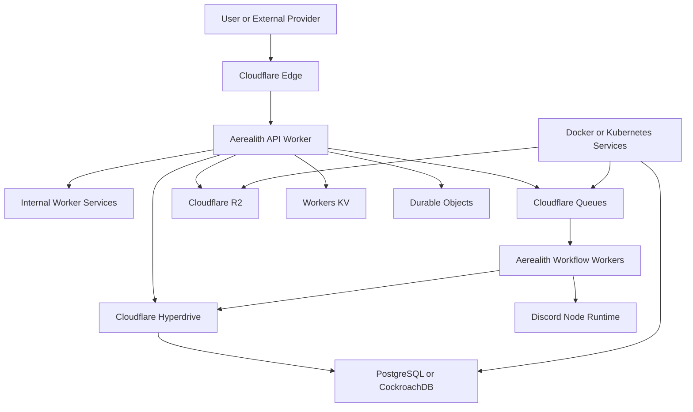

# Cloudflare

Status: Draft
Owner: Tim Pierce / SinLess Games
Last Updated: 2026-07-13
Security Classification: Internal Engineering
Primary Edge Platform: Cloudflare Developer Platform
Primary Edge Runtime: Cloudflare Workers
Primary Deployment Tool: Wrangler
Primary API Framework: Hono
Primary Database: PostgreSQL or CockroachDB
Primary ORM: Drizzle
Container Fallback: Docker and Kubernetes

Related Engineering Documentation:

- `docs/engineering/Code Style.md`
- `docs/engineering/Testing.md`
- `docs/engineering/TypeScript Standards.md`
- `docs/engineering/Package Management.md`
- `docs/engineering/Monorepo Rules.md`
- `docs/engineering/Dependency Rules.md`
- `docs/engineering/Environment Variables.md`
- `docs/engineering/Secrets.md`
- `docs/engineering/Docker.md`
- `docs/engineering/Git Workflow.md`
- `docs/engineering/Security Practices.md`
- `docs/engineering/Release Process.md`

Related Architecture:

- `docs/architecture/Monorepo Architecture.md`
- `docs/architecture/Frontend Architecture.md`
- `docs/architecture/API Architecture.md`
- `docs/architecture/Service Architecture.md`
- `docs/architecture/Data Architecture.md`
- `docs/architecture/Auth Architecture.md`
- `docs/architecture/Security Architecture.md`
- `docs/architecture/Discord Architecture.md`
- `docs/architecture/Module Architecture.md`
- `docs/architecture/Workflow Architecture.md`
- `docs/architecture/AI Architecture.md`
- `docs/architecture/Integration Architecture.md`
- `docs/architecture/Notification Architecture.md`
- `docs/architecture/Audit Architecture.md`
- `docs/architecture/Observability Architecture.md`
- `docs/architecture/Local Development.md`

Related RFCs:

- `docs/rfcs/0002-monorepo-library-boundaries.md`
- `docs/rfcs/0003-api-versioning-and-route-strategy.md`
- `docs/rfcs/0008-configuration-and-secrets-model.md`
- `docs/rfcs/0009-authentication-session-and-authorization-model.md`
- `docs/rfcs/0010-api-envelope-request-and-trace-id-propagation.md`
- `docs/rfcs/0011-event-envelope-audit-model-and-idempotency.md`
- `docs/rfcs/0012-workflow-records-and-approval-primitive.md`
- `docs/rfcs/0013-provider-abstraction-and-integration-interface.md`
- `docs/rfcs/0016-ai-assistant-boundaries-and-mvp-memory-scope.md`
- `docs/rfcs/0017-observability-trace-propagation-and-alerting.md`

---

## Purpose

This document defines the Cloudflare engineering standards for Aerealith AI.

It governs how contributors design, build, configure, test, deploy, observe, secure, and maintain Aerealith services running on the Cloudflare Developer Platform.

The standard covers:

```text
Cloudflare Workers
Wrangler
Worker bindings
custom domains
routes
service bindings
Hyperdrive
Workers KV
R2
Durable Objects
Queues
Workflows
Cron Triggers
Cache API
Workers Logs
Logpush
Tail Workers
secrets
environments
versions
deployments
gradual rollouts
local development
testing
Cloudflare-specific CI/CD
portability
self-hosted fallbacks
```

The objective is to use Cloudflare as Aerealith’s primary managed edge platform while preserving:

```text
provider neutrality
Docker compatibility
Kubernetes compatibility
self-hosting
clear service boundaries
database portability
provider isolation
testability
safe rollback
```

The guiding rule is:

> Cloudflare is Aerealith’s preferred edge and managed execution platform, not an architectural dependency that the core product cannot survive without.

---

## Core Principles

Aerealith Cloudflare engineering follows these principles:

```text
Cloudflare-first does not mean Cloudflare-only.
Core domain code remains runtime-neutral.
Cloudflare bindings are injected through adapters.
Workers own stateless edge execution.
Durable state has an explicit authoritative owner.
PostgreSQL or CockroachDB remains the primary relational system of record.
Drizzle remains the primary ORM.
Provider-specific types remain inside Cloudflare adapters.
Secrets use Cloudflare secret bindings rather than plain variables.
Every Worker has a pinned compatibility date.
Compatibility-date changes are reviewed and tested.
Environments use isolated resources.
Production deployments use immutable versions.
High-risk releases use staged rollout.
Queues assume at-least-once delivery.
Consumers are idempotent.
KV is not authoritative for security-sensitive state.
Durable Objects are used for coordination, not as a universal database.
R2 is used for object storage, not relational truth.
Cloudflare Workflows do not replace the Aerealith workflow domain.
Discord gateway connections remain in a persistent Node.js runtime.
```

---

## Cloudflare’s Role in Aerealith

Cloudflare may provide:

```text
DNS
TLS termination
CDN
edge request handling
public API execution
webhook intake
rate limiting
WAF controls
bot controls
queue infrastructure
object storage
distributed coordination
scheduled triggers
internal Worker-to-Worker calls
database connection acceleration
deployment and rollback
edge observability
```

Cloudflare is infrastructure.

It is not automatically a user-configurable product integration.

Infrastructure capabilities should not appear in the product’s integration registry merely because Aerealith uses them internally.

---

## Platform Boundary

Cloudflare-specific code should remain inside:

```text
apps/services/api-cloudflare/
apps/services/edge/
libs/cloudflare/
libs/infrastructure-cloudflare/
tools/cloudflare/
```

The exact project structure may evolve.

Cloudflare-specific types must not leak into:

```text
core
contracts
modules
workflow definitions
audit contracts
notification contracts
AI capabilities
provider-neutral integration interfaces
```

Examples of types that should remain inside Cloudflare boundaries:

```text
ExecutionContext
KVNamespace
R2Bucket
Queue
MessageBatch
DurableObjectNamespace
Workflow
Fetcher
Hyperdrive
Cloudflare environment bindings
```

---

## Architecture Overview



---

## Approved Cloudflare Products

| Product          | Aerealith Role                                    | Authority                |
| ---------------- | ------------------------------------------------- | ------------------------ |
| Workers          | Public edge API and lightweight request execution | Compute only             |
| Hyperdrive       | Worker access to PostgreSQL-compatible databases  | Not a database           |
| Queues           | Asynchronous delivery and decoupling              | Delivery transport       |
| R2               | Files, exports, attachments, and artifacts        | Object authority         |
| Workers KV       | Read-heavy cache and distributed configuration    | Non-authoritative        |
| Durable Objects  | Coordination and serialized state ownership       | Narrow authority         |
| Workflows        | Cloudflare-managed durable infrastructure tasks   | Infrastructure execution |
| Cache API/CDN    | HTTP response caching                             | Cache only               |
| Service Bindings | Private Worker-to-Worker communication            | Transport                |
| Workers Logs     | Cloudflare runtime diagnostics                    | Operational telemetry    |
| Secrets          | Worker-specific secret bindings                   | Secret delivery          |
| Cron Triggers    | Scheduled infrastructure triggers                 | Trigger only             |

---

## Conditionally Approved Products

The following require a specific architecture decision before becoming foundational:

```text
D1
Workers AI
Vectorize
AI Gateway
Browser Rendering
Cloudflare Containers
Pages Functions
Analytics Engine
Pipelines
Workers for Platforms
```

Conditional approval means:

```text
the product may be evaluated
the product may be used in a narrow adapter
the product may not silently become authoritative platform infrastructure
```

---

## Explicit Non-Requirements

Aerealith core operation must not require:

```text
Workers AI
D1
Vectorize
Cloudflare-specific authentication
Cloudflare-specific user identity
Cloudflare-managed email
Cloudflare-managed relational storage
Cloudflare-managed Discord execution
```

Core capabilities should remain runnable with:

```text
Docker
Kubernetes
PostgreSQL
CockroachDB
provider-neutral queues
provider-neutral object storage
provider-neutral telemetry
```

---

## Cloudflare Account Model

Aerealith should separate Cloudflare resources by environment.

Minimum protected environments:

```text
preview
staging
production
```

Local and test execution should generally use:

```text
Wrangler local mode
Miniflare
test fixtures
fake adapters
```

Production isolation should use one or more of:

```text
separate Cloudflare accounts
separate zones
separate Worker names
separate namespaces
separate buckets
separate queues
separate Hyperdrive configurations
separate API tokens
```

The strongest practical isolation should be used for production.

---

## Environment Model

Canonical Aerealith environments:

```text
local
test
preview
staging
production
```

Cloudflare Wrangler environments create separately named Worker deployments based on the root Worker name and environment name. Environment-specific settings must be reviewed carefully because some Wrangler configuration keys are non-inheritable. ([Cloudflare Docs][1])

Recommended naming:

```text
aerealith-api-preview
aerealith-api-staging
aerealith-api-production

aerealith-webhook-preview
aerealith-webhook-staging
aerealith-webhook-production
```

Production should not share stateful bindings with preview or staging.

---

## Resource Isolation

Each protected environment should receive separate:

```text
KV namespaces
R2 buckets
Queues
dead-letter queues
Durable Object namespaces where applicable
Hyperdrive configurations
service bindings
secrets
routes
custom domains
```

Invalid sharing examples:

```text
preview Worker using the production R2 bucket
staging Worker publishing to the production queue
local development connecting to the production Hyperdrive configuration
test Worker using the production Durable Object namespace
```

---

## Resource Naming

Recommended resource-name pattern:

```text
aerealith-<service>-<purpose>-<environment>
```

Examples:

```text
aerealith-api-cache-production
aerealith-audit-events-production
aerealith-audit-events-dlq-production
aerealith-exports-production
aerealith-workflow-coordination-production
aerealith-database-production
```

Names should be:

```text
lowercase
hyphenated
purpose-specific
environment-specific
stable
```

---

## Wrangler

Wrangler is the standard Cloudflare development and deployment CLI.

It owns:

```text
Worker configuration
local Worker execution
binding configuration
type generation
secret management
version upload
deployment
log tailing
resource commands
```

Wrangler must be:

```text
declared in the owning project
version-pinned through the lockfile
invoked through pnpm
```

Recommended commands:

```bash
pnpm wrangler --version
pnpm wrangler dev
pnpm wrangler types
pnpm wrangler deploy
pnpm wrangler tail
```

Avoid globally installed Wrangler as the authoritative toolchain.

---

## Wrangler Configuration Format

Aerealith should prefer:

```text
wrangler.jsonc
```

Reasons include:

```text
schema support
comments
JSON tooling
consistent formatting
easy automated validation
```

`wrangler.toml` may be used where an existing project already owns it.

A single project should not maintain both formats.

---

## Example Worker Configuration

```jsonc
{
  "$schema": "./node_modules/wrangler/config-schema.json",

  "name": "aerealith-api",
  "main": "src/worker.ts",

  "compatibility_date": "2026-07-13",
  "compatibility_flags": ["nodejs_compat"],

  "workers_dev": false,

  "observability": {
    "enabled": true,
    "head_sampling_rate": 1,
  },

  "vars": {
    "AEREALITH_ENVIRONMENT": "local",
    "AEREALITH_SERVICE_NAME": "service-api",
    "AEREALITH_DATABASE_DIALECT": "postgresql",
  },

  "secrets": {
    "required": ["AEREALITH_AUTH_SECRET"],
  },

  "hyperdrive": [
    {
      "binding": "AEREALITH_DATABASE",
      "id": "<HYPERDRIVE_CONFIGURATION_ID>",
    },
  ],

  "r2_buckets": [
    {
      "binding": "AEREALITH_OBJECT_STORAGE",
      "bucket_name": "aerealith-objects-production",
      "preview_bucket_name": "aerealith-objects-preview",
    },
  ],

  "kv_namespaces": [
    {
      "binding": "AEREALITH_EDGE_CACHE",
      "id": "<PRODUCTION_NAMESPACE_ID>",
      "preview_id": "<PREVIEW_NAMESPACE_ID>",
    },
  ],

  "queues": {
    "producers": [
      {
        "binding": "AEREALITH_EVENTS_QUEUE",
        "queue": "aerealith-events-production",
      },
    ],
  },

  "env": {
    "preview": {
      "name": "aerealith-api-preview",
      "vars": {
        "AEREALITH_ENVIRONMENT": "preview",
      },
    },

    "staging": {
      "name": "aerealith-api-staging",
      "vars": {
        "AEREALITH_ENVIRONMENT": "staging",
      },
    },

    "production": {
      "name": "aerealith-api-production",
      "vars": {
        "AEREALITH_ENVIRONMENT": "production",
      },
    },
  },
}
```

IDs, names, and bindings should be generated or injected through environment-aware deployment automation.

---

## Compatibility Dates

Every Worker must define:

```text
compatibility_date
```

The compatibility date determines which Worker runtime behavior changes are enabled.

Rules:

```text
Do not omit the compatibility date.
Do not use an ancient compatibility date indefinitely.
Do not advance it without tests.
Do not update every Worker blindly in one release.
Treat compatibility-date changes as runtime upgrades.
```

Cloudflare compatibility dates allow a Worker to opt into runtime changes through a date-based compatibility model. ([Cloudflare Docs][2])

---

## Compatibility-Date Update Process

A compatibility-date update should include:

```text
release-note review
Worker unit tests
Worker integration tests
binding tests
database tests
provider adapter tests
preview deployment
staging soak
rollback verification
```

Recommended cadence:

```text
review monthly
update deliberately
avoid gaps longer than one quarter without documented reason
```

Security or runtime fixes may require faster adoption.

---

## Node.js Compatibility

Cloudflare Workers support a growing set of Node.js APIs through the `nodejs_compat` compatibility flag. With a sufficiently recent compatibility date, the flag also enables the newer compatibility implementation. Node compatibility may increase bundle size and does not mean every Node.js behavior is identical to a full Node runtime. ([Cloudflare Docs][3])

Recommended Worker configuration:

```jsonc
{
  "compatibility_date": "2026-07-13",
  "compatibility_flags": ["nodejs_compat"],
}
```

---

## Node Compatibility Rules

`nodejs_compat` does not make Worker code automatically portable.

Worker-compatible code should still prefer:

```text
Fetch API
Web Crypto
URL
URLSearchParams
Request
Response
Headers
ReadableStream
WritableStream
TransformStream
TextEncoder
TextDecoder
```

Avoid unnecessary dependencies on:

```text
filesystem persistence
child processes
operating-system signals
local sockets
native binaries
process-global mutable state
```

---

## Runtime-Neutral Core

Core logic should accept interfaces such as:

```ts
export interface ObjectStore {
  put(key: string, value: ReadableStream | ArrayBuffer, metadata?: Readonly<Record<string, string>>): Promise<Result<void, AerealithError>>;

  get(key: string): Promise<Result<StoredObject | null, AerealithError>>;
}
```

The Cloudflare implementation may use R2.

The Docker implementation may use:

```text
S3
MinIO
filesystem-backed development storage
another object-storage provider
```

---

## Worker Entry Points

Workers should use ES module entry points.

Example:

```ts
export default {
  async fetch(request: Request, environment: WorkerEnvironment, context: ExecutionContext): Promise<Response> {
    return handleRequest(request, loadWorkerDependencies(environment, context));
  },
};
```

The entry point should remain thin.

It should own:

```text
binding access
configuration loading
request context creation
application composition
```

It should not own domain behavior.

---

## Hono

Hono is the preferred HTTP framework for Worker-native APIs.

Hono routes should:

```text
validate input
establish request context
authenticate
authorize
call application services
map results
```

They should not:

```text
call Drizzle directly
read raw secrets
call Discord.js
write audit rows directly
execute unapproved AI tools
```

---

## Example Hono Worker

```ts
import { Hono } from 'hono';

import type { ApiErrorResponse, ApiSuccessResponse } from '@aerealith/contracts/api';
import { createRequestContext } from '@aerealith/core/request-context';

import type { WorkerEnvironment } from './worker-environment.js';
import { createWorkerServices } from './composition/create-worker-services.js';

type Bindings = WorkerEnvironment;

const app = new Hono<{
  Bindings: Bindings;
}>();

app.use('*', async (context, next) => {
  const requestContext = createRequestContext({
    requestId: context.req.header('x-request-id') ?? crypto.randomUUID(),
    cloudflareRayId: context.req.header('cf-ray'),
  });

  context.set('requestContext', requestContext);

  await next();

  context.header('x-request-id', requestContext.requestId);
});

app.get('/health/live', (context) => {
  return context.json({
    status: 'live',
  });
});

app.get('/api/V1/modules', async (context) => {
  const services = createWorkerServices(context.env, context.executionCtx);

  const result = await services.moduleQueryService.list(context.get('requestContext'));

  if (!result.ok) {
    const response: ApiErrorResponse = {
      success: false,
      error: result.error,
    };

    return context.json(response, 500);
  }

  const response: ApiSuccessResponse<typeof result.value> = {
    success: true,
    data: result.value,
    requestId: context.get('requestContext').requestId,
  };

  return context.json(response);
});

export default app;
```

---

## Bindings

Cloudflare bindings are runtime-provided dependencies.

Examples:

```text
KV namespace
R2 bucket
Queue producer
Durable Object namespace
Service binding
Hyperdrive connection
secret
plain variable
```

Bindings should be treated as dependency injection.

They should not be accessed throughout feature code.

---

## Binding Access

Binding access should remain inside:

```text
Worker entry point
configuration loader
Cloudflare adapter
composition root
```

Bad:

```ts
export function runWorkflow(
  environment: WorkerEnvironment,
): Promise<void> {
  return environment.AEREALITH_EVENTS_QUEUE.send(...)
}
```

Good:

```ts
export class CloudflareEventPublisher implements EventPublisher {
  public constructor(private readonly queue: Queue) {}

  public async publish(event: AerealithEvent): Promise<Result<void, AerealithError>> {
    // ...
  }
}
```

---

## Binding Names

Binding names should use uppercase snake case.

Examples:

```text
AEREALITH_DATABASE
AEREALITH_EDGE_CACHE
AEREALITH_OBJECT_STORAGE
AEREALITH_EVENTS_QUEUE
AEREALITH_AUDIT_QUEUE
AEREALITH_COORDINATION
AEREALITH_INTERNAL_API
```

Avoid:

```text
DB
BUCKET
QUEUE
KV
SERVICE
```

Ambiguous binding names become difficult to review as the system grows.

---

## Worker Environment Type

Each Worker should define an explicit environment interface.

```ts
export interface WorkerEnvironment {
  readonly AEREALITH_ENVIRONMENT: string;
  readonly AEREALITH_SERVICE_NAME: string;

  readonly AEREALITH_AUTH_SECRET: string;

  readonly AEREALITH_DATABASE: Hyperdrive;
  readonly AEREALITH_EDGE_CACHE: KVNamespace;
  readonly AEREALITH_OBJECT_STORAGE: R2Bucket;
  readonly AEREALITH_EVENTS_QUEUE: Queue;
  readonly AEREALITH_INTERNAL_API: Fetcher;
}
```

The interface does not replace runtime validation.

String bindings remain untrusted until parsed.

---

## Wrangler Type Generation

Worker projects should generate binding and runtime types through Wrangler.

Recommended command:

```bash
pnpm wrangler types
```

Generated type files should:

```text
be deterministic
be reviewed
be included in type checking
not replace application configuration schemas
```

---

## Environment Variables

Cloudflare plain-text variables follow:

```text
docs/engineering/Environment Variables.md
```

Non-secret values belong in:

```text
vars
typed runtime configuration
deployment metadata
```

Secret values do not belong in `vars`.

---

## Secrets

Cloudflare Worker secrets are encrypted bindings intended for sensitive values such as API keys and tokens. Local development can use `.dev.vars` or `.env`, but the two local mechanisms should not be mixed, and secret files must not be committed. Wrangler can also validate that declared required secrets exist before deployment. ([Cloudflare Docs][4])

Approved examples:

```text
AEREALITH_AUTH_SECRET
AEREALITH_DISCORD_CLIENT_SECRET
AEREALITH_AI_OPENAI_API_KEY
AEREALITH_NOTIFICATIONS_RESEND_API_KEY
```

---

## Secret Commands

Typical commands:

```bash
pnpm wrangler secret put \
  AEREALITH_AUTH_SECRET \
  --env production

pnpm wrangler secret delete \
  AEREALITH_AUTH_SECRET \
  --env preview
```

Commands should be wrapped by repository tooling where practical.

Avoid passing secret values directly in command arguments.

---

## Secret Ownership

Secrets should remain scoped to the Worker that requires them.

Examples:

```text
API Worker receives auth secret.
AI adapter Worker receives AI provider key.
Email adapter Worker receives email provider key.
Discord Node runtime receives Discord bot token.
```

Invalid:

```text
Every Worker receives every production secret.
```

---

## Secret Rotation

Secret rotation should support:

```text
new secret introduction
overlap where required
deployment validation
traffic migration
old secret revocation
audit
```

Secret rotation should not require rebuilding Worker code unless the configuration contract changes.

---

## Service Bindings

Service bindings allow one Worker to call another Worker without exposing the target through a public URL. They support request forwarding and Worker RPC-style interfaces. ([Cloudflare Docs][5])

Use service bindings for:

```text
private internal APIs
shared capability services
provider adapter services
internal authorization queries
notification dispatch
```

---

## Service-Binding Rules

Service bindings should:

```text
use stable internal contracts
propagate request and trace context
enforce authorization at the target
have explicit timeouts
return structured errors
remain versioned
```

A private network path does not make a request trusted.

The target Worker must still validate:

```text
caller identity
scope
input
permission
risk
approval
```

---

## Service-Binding Contracts

Service-binding contracts should be Aerealith-owned.

Avoid exposing:

```text
Cloudflare Fetcher
WorkerEntrypoint
RpcTarget
ExecutionContext
```

through core domain interfaces.

Example:

```ts
export interface InternalModuleService {
  listAvailableModules(request: ListModulesRequest, context: RequestContext): Promise<Result<readonly ModuleSummary[], AerealithError>>;
}
```

---

## Worker-to-Worker Calls

Preferred options:

```text
Service Binding for internal synchronous calls
Queue for asynchronous work
event publication for outcome propagation
```

Avoid calling another Worker through its public URL when a service binding is appropriate.

Public calls create unnecessary:

```text
DNS dependency
public attack surface
authentication complexity
network overhead
```

---

## Public Domains

Public Workers should use custom domains or approved routes.

Recommended domain direction:

```text
app.aerealith.ai
api.aerealith.ai
hooks.aerealith.ai
assets.aerealith.ai
```

Environment domains:

```text
preview-api.aerealith.ai
staging-api.aerealith.ai
api.aerealith.ai
```

---

## Routes and Custom Domains

Cloudflare routes map URL patterns to Workers and can place a Worker in front of an existing origin. Cloudflare recommends custom domains when the Worker itself is the application origin. ([Cloudflare Docs][6])

Aerealith should prefer:

```text
Custom Domain for Worker-owned applications
Route for edge middleware in front of another origin
```

---

## Route Security

Security-critical routes should fail closed.

Examples:

```text
authentication gateway
webhook verification
admin authorization
request-signing boundary
```

A security Worker must not silently bypass itself because of an account limit, deployment error, or route configuration mistake.

---

## Primary Database

Aerealith’s relational system of record is:

```text
PostgreSQL
or
CockroachDB
```

The primary ORM is:

```text
Drizzle
```

Cloudflare-native storage does not replace this decision without a new architecture review.

---

## Hyperdrive

Hyperdrive is the preferred Cloudflare Worker path to PostgreSQL-compatible relational databases.

Cloudflare documents Hyperdrive support for PostgreSQL-compatible databases, including CockroachDB, and provides a Drizzle integration path for Worker applications. ([Cloudflare Docs][7])

Hyperdrive provides:

```text
Worker-to-database connectivity
connection pooling
connection reuse
latency optimization
credential isolation through bindings
```

Hyperdrive is not the database.

---

## Hyperdrive Boundaries

The data path should remain:

```text
Worker
→ database adapter
→ Drizzle
→ Hyperdrive connection
→ PostgreSQL or CockroachDB
```

Application code should not depend directly on the Hyperdrive binding.

---

## Drizzle with Hyperdrive

Drizzle should remain inside:

```text
libs/db
```

Example composition:

```ts
import { drizzle } from 'drizzle-orm/postgres-js';
import postgres from 'postgres';

export function createCloudflareDatabase(hyperdrive: Hyperdrive): AerealithDatabase {
  const client = postgres(hyperdrive.connectionString, {
    max: 5,
    prepare: false,
  });

  return createAerealithDatabase(drizzle(client));
}
```

Exact driver settings must be verified against the approved driver, Hyperdrive behavior, and CockroachDB compatibility.

---

## Database Credentials

Database credentials should normally be owned by:

```text
Hyperdrive configuration
approved secret management
database role
```

Worker code should not log or expose:

```text
Hyperdrive connection string
database password
database certificate
database host details classified as private
```

---

## Database Roles

Cloudflare-facing database credentials should use least privilege.

Potential roles:

```text
api_runtime
worker_runtime
audit_consumer
migration
read_only_support
```

A migration-capable credential should not be supplied to every Worker.

---

## Transaction Behavior

Aerealith transaction semantics remain defined by the data architecture.

Cloudflare does not change requirements for:

```text
idempotency
unique constraints
outbox
transaction retry
CockroachDB serialization retry
approval binding
audit consistency
```

---

## Hyperdrive Failure

When Hyperdrive or the database is unavailable:

```text
readiness should fail for database-required Workers
requests should return structured temporary errors
writes should not be acknowledged as successful
retryable async work should remain queued
telemetry should identify the dependency
```

---

## D1

D1 is not the primary Aerealith relational database.

D1 may be evaluated for narrow auxiliary use cases such as:

```text
edge-local metadata
isolated feature experiments
temporary operational indexes
Cloudflare-only support tooling
```

It must not become authoritative for:

```text
users
sessions
organizations
permissions
module installations
workflow definitions
audit truth
billing
provider credentials
```

without an accepted RFC.

---

## D1 Isolation

A D1-backed feature must expose a provider-neutral repository interface.

Core code must not import:

```text
D1Database
D1PreparedStatement
D1Result
```

D1 schema ownership must remain separate from PostgreSQL and CockroachDB migrations.

---

## Workers KV

Workers KV is approved for read-heavy, cacheable, non-authoritative data.

Workers KV is eventually consistent. Cloudflare notes that changes can take 60 seconds or longer to become visible at other locations, and advises against using KV for atomic or transactional workloads. ([Cloudflare Docs][8])

Approved uses:

```text
feature presentation cache
public configuration cache
routing metadata
safe allowlist cache
template cache
non-critical lookup cache
short-lived derived data
```

---

## Prohibited KV Uses

Workers KV must not be authoritative for:

```text
session revocation
permissions
approval consumption
idempotency receipts for destructive actions
credential rotation
account suspension
module authorization
workflow state
audit records
financial data
```

Security-sensitive decisions must read from an authoritative source.

---

## KV Cache Invalidation

KV-backed data should define:

```text
cache key
value schema
version
TTL
authoritative source
invalidation strategy
stale behavior
```

Example key:

```text
module-catalog:v1:public
```

Avoid keys containing:

```text
raw email
session token
access token
private message content
```

---

## KV Fallback

A cache miss should normally fall back to:

```text
database
configuration service
provider-neutral authoritative source
```

A cache failure should not corrupt authoritative state.

---

## R2

R2 is the preferred Cloudflare object-storage adapter.

R2 supports Worker bindings and an S3-compatible API, allowing Aerealith to preserve an S3-style portability boundary. ([Cloudflare Docs][9])

Approved R2 use cases:

```text
exports
attachments
uploaded documents
generated reports
backup artifacts
media
large workflow artifacts
AI source documents
temporary processing objects
```

---

## R2 Object Model

R2 object keys should be:

```text
opaque
scope-aware
stable
non-secret
```

Recommended structure:

```text
<environment>/<scope-type>/<scope-id>/<resource-type>/<resource-id>/<version>
```

Example:

```text
production/community/com_123/audit-export/exp_456/export.json
```

---

## R2 Metadata

R2 metadata must not contain:

```text
tokens
credentials
full private messages
database connection strings
authorization headers
```

Metadata should be allowlisted.

Example:

```text
content-type
content-length
content-hash
scope-type
scope-id
created-at
retention-class
```

---

## R2 Access

Private R2 objects should be accessed through:

```text
authenticated Worker
short-lived signed access
authorized export endpoint
```

Buckets should not be made public by default.

Public buckets require:

```text
content classification
cache policy
abuse controls
custom domain review
security review
```

---

## R2 Portability

Application code should depend on:

```text
ObjectStore
SignedObjectAccessService
ObjectMetadataRepository
```

not directly on:

```text
R2Bucket
R2Object
R2HTTPMetadata
```

This preserves compatibility with:

```text
S3
MinIO
other self-hosted object storage
```

---

## Durable Objects

Durable Objects are approved for narrow stateful coordination.

Cloudflare describes each Durable Object as a globally unique, single-threaded stateful instance with private persistent storage, making it useful for coordination problems. ([Cloudflare Docs][10])

Potential Aerealith uses:

```text
rate-limit coordination
per-scope websocket coordination
single-owner scheduling
distributed leases
short-lived approval coordination
Discord shard coordination
live presence
deduplicated event coordination
```

---

## Durable Object Selection

Use a Durable Object when the problem requires:

```text
one logical owner for a key
serialized mutation
real-time coordination
strongly consistent per-key state
connection ownership
```

Do not use a Durable Object merely because:

```text
state exists
the database query seems inconvenient
the feature runs on Cloudflare
```

---

## Durable Object Identity

Durable Object IDs should derive from stable, non-secret ownership keys.

Examples:

```text
community:com_123
workflow-run:run_456
provider-rate-limit:discord:application
```

Avoid raw:

```text
session tokens
access tokens
email addresses
private message content
```

---

## Durable Object State

Durable Object state should remain:

```text
small
bounded
versioned
recoverable
owned by one capability
```

Long-term relational truth should remain in PostgreSQL or CockroachDB unless an RFC defines otherwise.

---

## Durable Object Migrations

Durable Object class changes and migrations require:

```text
preview validation
migration review
rollback analysis
state compatibility
staging soak
```

Worker code rollback does not automatically roll back Durable Object storage changes.

---

## Durable Object Portability

A Durable Object-backed capability must expose a provider-neutral interface.

Potential self-hosted implementation:

```text
database advisory lock
Redis coordination
PostgreSQL lease table
dedicated coordinator service
```

---

## Cloudflare Queues

Cloudflare Queues is the preferred asynchronous delivery mechanism for Worker-native services.

Queues support asynchronous processing, batching, retries, delays, dead-letter handling, and external pull consumers. ([Cloudflare Docs][11])

Approved use cases:

```text
event delivery
audit ingestion
notification delivery
workflow triggers
provider webhook processing
media processing
export generation
AI background tasks
```

---

## Queue Semantics

All Queue consumers must assume:

```text
at-least-once delivery
duplicate messages
delayed messages
out-of-order messages
consumer restarts
partial batch failure
```

A Queue message being delivered does not prove it is unique.

---

## Queue Envelope

Every message should use the Aerealith event envelope.

```ts
export interface QueueMessageEnvelope<TPayload> {
  readonly eventId: string;
  readonly eventType: string;
  readonly eventVersion: number;
  readonly occurredAt: string;
  readonly requestId?: string;
  readonly traceId?: string;
  readonly idempotencyKey: string;
  readonly scope: EventScope;
  readonly payload: TPayload;
}
```

Messages should be:

```text
small
versioned
validated
provider-neutral where practical
free of raw credentials
```

---

## Queue Naming

Recommended queues:

```text
aerealith-events-<environment>
aerealith-audit-<environment>
aerealith-notifications-<environment>
aerealith-workflows-<environment>
aerealith-webhooks-<environment>
```

Dead-letter queues:

```text
aerealith-events-dlq-<environment>
aerealith-audit-dlq-<environment>
aerealith-notifications-dlq-<environment>
```

---

## Queue Producer

Example:

```ts
export class CloudflareQueueEventPublisher implements EventPublisher {
  public constructor(private readonly queue: Queue) {}

  public async publish(event: AerealithEvent): Promise<Result<void, AerealithError>> {
    try {
      await this.queue.send(event, {
        contentType: 'json',
      });

      return ok(undefined);
    } catch (error: unknown) {
      return err(mapCloudflareQueueError(error));
    }
  }
}
```

---

## Queue Consumer

Example:

```ts
export default {
  async queue(batch: MessageBatch<unknown>, environment: WorkerEnvironment, context: ExecutionContext): Promise<void> {
    const consumer = createEventConsumer(environment, context);

    for (const message of batch.messages) {
      const parsed = AerealithEventSchema.safeParse(message.body);

      if (!parsed.success) {
        message.ack();
        await consumer.deadLetterInvalidMessage(message.id, parsed.error);
        continue;
      }

      const result = await consumer.consume(parsed.data);

      if (result.ok) {
        message.ack();
        continue;
      }

      if (result.error.retryable) {
        message.retry();
        continue;
      }

      message.ack();
      await consumer.deadLetterPermanentFailure(parsed.data, result.error);
    }
  },
};
```

Exact acknowledgment and retry behavior should follow the approved Queue consumer configuration.

---

## Dead-Letter Queues

Every high-value Queue should define a dead-letter path.

Dead-letter handling should record:

```text
message ID
event ID
event type
failure code
attempt count
queue
consumer
timestamp
request ID
trace ID
```

It must not automatically record private payloads.

---

## Queue Purging

Queue purging is destructive.

Production purge actions require:

```text
human approval
environment confirmation
queue-name confirmation
audit record
documented incident or maintenance reason
```

A routine deployment should never purge a production queue.

---

## Queue Backpressure

Consumers should define:

```text
batch size
maximum concurrency
retry delay
maximum attempts
dead-letter queue
provider concurrency
database concurrency
```

Do not configure consumer concurrency solely for maximum throughput.

Provider limits and database capacity remain authoritative constraints.

---

## Cloudflare Workflows

Cloudflare Workflows provides durable multi-step execution with persisted state and automatic retry behavior. ([Cloudflare Docs][12])

Cloudflare Workflows may support:

```text
infrastructure maintenance
long-running export generation
provider reconciliation
deployment automation
backup orchestration
large media-processing flows
```

---

## Aerealith Workflows Versus Cloudflare Workflows

These are distinct concepts.

### Aerealith Workflow Engine

Owns:

```text
user-authored workflows
module actions
authorization
approval
provider-neutral capabilities
workflow history
user-visible state
```

### Cloudflare Workflows

May provide:

```text
managed durable execution
step persistence
retry infrastructure
Cloudflare-hosted orchestration
```

Cloudflare Workflows may implement part of the infrastructure behind Aerealith workflows.

They do not define the Aerealith workflow contract.

---

## Workflow Portability

Aerealith workflow definitions must not contain:

```text
Cloudflare Workflow class names
Cloudflare binding IDs
Worker implementation functions
Durable Object references
Cloudflare-specific serialized values
```

The Aerealith engine should be able to execute through:

```text
Cloudflare Workflows
queue-backed workers
Docker workers
Kubernetes workers
```

---

## Workflow Idempotency

Every Cloudflare Workflow step must be idempotent or use an idempotency receipt.

A retryable step must not duplicate:

```text
Discord moderation
email delivery
billing action
data deletion
credential rotation
notification
audit event
```

---

## Workflow Step Design

A step should be:

```text
small
bounded
independently retryable
observable
versioned
safe under replay
```

A step should not depend on in-memory state from a previous invocation.

---

## Cron Triggers

Cron Triggers may initiate:

```text
cleanup
retention processing
scheduled reconciliation
health review
stale workflow recovery
usage aggregation
```

A Cron Trigger is not proof that the job runs only once.

Scheduled jobs must remain:

```text
idempotent
lease-aware
observable
bounded
safe under delayed execution
```

---

## Scheduled Job Ownership

Scheduled jobs should publish work into a Queue when:

```text
the job may be long-running
the job needs retries
the job processes many records
the job calls rate-limited providers
```

The scheduled Worker should not monopolize execution by processing an unbounded dataset directly.

---

## Cache API

Cloudflare’s Cache API provides programmatic access to cache data from a Worker. Cache contents are location-specific rather than automatically replicated between data centers. ([Cloudflare Docs][13])

Approved use cases:

```text
public GET responses
public metadata
safe static content
versioned API reference data
```

---

## Cache Safety

Do not cache:

```text
authenticated private responses
responses containing Set-Cookie
authorization decisions
session state
approval state
private user data
provider credentials
```

unless the cache key and privacy model have received security review.

---

## Cache Keys

A cache key should include all values affecting the response.

Potential components:

```text
method
normalized URL
API version
tenant or public scope
locale
content version
feature version
```

Do not create cache keys from unvalidated headers.

---

## Cache-Control

Public endpoints should define explicit:

```text
Cache-Control
ETag
Vary
```

Private API responses should normally use:

```text
Cache-Control: no-store
```

or another reviewed private caching policy.

---

## Cloudflare CDN

Static assets should use:

```text
content hashes
long immutable cache lifetimes
safe MIME types
explicit security headers
```

Example:

```text
Cache-Control: public, max-age=31536000, immutable
```

Only content-addressed or versioned assets should receive long immutable caching.

---

## Discord Runtime

The Discord gateway runtime should not run as an ordinary Cloudflare Worker.

The Discord integration requires a persistent provider connection and provider-specific runtime lifecycle.

It should remain in:

```text
Node.js container
Docker
Kubernetes
self-hosted persistent process
```

Cloudflare may still support the Discord integration through:

```text
HTTP interaction intake
webhook verification
public callback routes
internal service bindings
Queues
R2
database access
```

---

## Discord HTTP Interactions

Cloudflare Workers may handle Discord HTTP interactions when:

```text
signature verification is implemented correctly
the response deadline is respected
long work is queued
duplicate interactions are deduplicated
```

The Worker should not receive the Discord bot token unless it owns a capability requiring it.

---

## Discord Gateway Separation

Preferred direction:

```text
Discord HTTP callback
→ Cloudflare Worker
→ verify signature
→ validate interaction
→ publish queue message
→ Node Discord runtime or worker
```

Persistent gateway processing remains outside the Worker isolate.

---

## Better Auth

Better Auth remains the authentication foundation.

Cloudflare deployment must preserve:

```text
database-backed sessions
secure cookies
server-side session validation
revocation
identity linking
authorization scope
```

Cloudflare does not become the authoritative user identity system.

---

## Auth at the Edge

The Worker may:

```text
parse cookies
validate session
load identity
create request context
enforce route authentication
```

It must not trust:

```text
client-provided user ID
client-provided role
unsigned headers
Cloudflare metadata as product authorization
```

---

## Session Caching

Session or authorization caching requires careful review.

Workers KV must not be authoritative for revocation-sensitive session state because of eventual consistency.

Potential safe design:

```text
authoritative session in PostgreSQL
short-lived derived cache
bounded TTL
revocation-sensitive actions query authority
```

---

## Cloudflare Access

Cloudflare Access may protect:

```text
internal dashboards
preview administration
operational endpoints
developer tools
```

Cloudflare Access does not replace Aerealith product authentication or authorization.

An Access-approved request must still pass Aerealith authorization.

---

## Webhook Intake

Cloudflare Workers are well suited to webhook intake.

A webhook Worker should:

```text
read the raw body
verify signature
validate timestamp
enforce replay protection
validate content type
enforce body-size limits
parse schema
record receipt
queue normalized work
respond quickly
```

---

## Webhook Secrets

Webhook secrets should use Worker secret bindings.

They must not appear in:

```text
Wrangler vars
logs
request diagnostics
audit metadata
error responses
```

---

## Webhook Replay Protection

Replay protection should use an authoritative or strongly coordinated store.

Potential implementations:

```text
PostgreSQL unique receipt
Durable Object
provider-specific replay store
```

Workers KV alone is not sufficient for strict replay protection.

---

## Request Context

Every request should include:

```text
request ID
trace ID
Cloudflare Ray ID where present
service name
environment
actor
scope
```

Example:

```ts
export interface CloudflareRequestContext extends RequestContext {
  readonly cloudflareRayId?: string;
  readonly cloudflareColo?: string;
}
```

Cloudflare metadata should be treated as operational context.

It should not become authorization truth.

---

## Request IDs

Preferred order:

```text
validated incoming Aerealith request ID
otherwise generate a new request ID
```

The Cloudflare Ray ID may be recorded separately.

Do not replace the platform request ID with the Ray ID.

---

## Client IP

Cloudflare-provided client IP metadata may support:

```text
rate limiting
security analysis
abuse prevention
incident investigation
```

Client IP should be:

```text
validated
privacy-classified
retained only as required
never treated as user identity
```

---

## Cloudflare Headers

Potentially useful Cloudflare headers include:

```text
cf-ray
cf-connecting-ip
cf-ipcountry
```

Application code should access them through an adapter.

Do not propagate every incoming Cloudflare header to downstream systems.

---

## Security Boundary

Cloudflare provides an outer security layer.

Aerealith still requires:

```text
authentication
authorization
input validation
approval
idempotency
secret management
audit
provider permission checks
```

WAF or bot protection does not replace application security.

---

## WAF

Cloudflare WAF rules may protect:

```text
known exploit patterns
administrative paths
abusive clients
suspicious countries or networks where justified
oversized requests
known scanners
```

WAF rules should be maintained through:

```text
infrastructure as code
review
staging validation
change audit
```

---

## Rate Limiting

Rate limiting should exist at multiple layers.

Potential layers:

```text
Cloudflare edge
application user
account
organization
community
provider
workflow
AI budget
```

Edge rate limits cannot replace scope-aware application limits.

---

## Rate-Limit Keys

Rate limits may use:

```text
authenticated actor ID
account ID
organization ID
community ID
route
provider capability
IP address for unauthenticated traffic
```

Avoid relying solely on IP addresses for authenticated users.

---

## Bot and Abuse Controls

Cloudflare bot controls may help protect:

```text
sign-in
password reset
public forms
webhook-like public endpoints
high-cost AI routes
```

Automated provider callbacks must be exempted only through narrow verified rules.

---

## TLS

Public Aerealith domains must use HTTPS.

Production should reject:

```text
insecure redirect targets
HTTP callback URLs
mixed-content frontend configuration
insecure authentication base URLs
```

Origin communication should use authenticated and encrypted paths.

---

## CORS

CORS should use explicit approved origins.

Avoid:

```text
Access-Control-Allow-Origin: *
```

with credentials.

Preview, staging, and production origin lists must remain separate.

---

## CSRF

Cookie-authenticated state-changing endpoints require CSRF protection.

Cloudflare edge execution does not remove this requirement.

Controls may include:

```text
SameSite cookies
Origin validation
CSRF tokens
method restrictions
content-type restrictions
```

---

## Security Headers

Public frontend and API responses should consider:

```text
Content-Security-Policy
Strict-Transport-Security
X-Content-Type-Options
Referrer-Policy
Permissions-Policy
frame restrictions
```

Headers should be owned by shared security middleware.

---

## API Tokens

Cloudflare API tokens must use least privilege.

Separate tokens should exist for:

```text
development
preview deployment
staging deployment
production deployment
read-only diagnostics
infrastructure provisioning
```

Avoid account-global API keys.

---

## Deployment Token Permissions

A Worker deployment token should receive only permissions required for:

```text
Worker scripts
specific routes or zones
specific queues
specific R2 buckets
specific namespaces
specific Hyperdrive configuration
```

Production deployment credentials must not be available to pull-request jobs.

---

## Infrastructure as Code

Cloudflare resources should be managed through:

```text
Wrangler configuration
Terraform
approved Cloudflare API automation
```

Dashboard-only changes create configuration drift.

Any emergency dashboard change should be:

```text
documented
audited
reconciled into code
reviewed after the incident
```

---

## Terraform Direction

Terraform may own:

```text
Cloudflare accounts and zones
DNS
routes
custom domains
R2 buckets
Queues
KV namespaces
Hyperdrive configurations
API tokens
WAF rules
rate limits
Access policies
```

Wrangler may own:

```text
Worker source
Worker bindings
compatibility date
Worker-specific deployment
```

The ownership division must be explicit.

---

## State Ownership

Infrastructure state must not contain raw secret values where avoidable.

Terraform state requires:

```text
encryption
restricted access
locking
backup
audit
```

Wrangler secret commands should remain separate from plain infrastructure state where appropriate.

---

## Observability

Cloudflare Worker observability should integrate with the broader Aerealith telemetry system.

Required telemetry:

```text
structured logs
request ID
trace ID
Ray ID
service name
environment
deployment version
latency
outcome
error code
queue attempts
provider latency
database latency
```

---

## Workers Logs

Workers Logs can collect invocation logs, custom logs, errors, and uncaught exceptions. Cloudflare recommends structured JSON logging for queryable fields. ([Cloudflare Docs][14])

Aerealith logs should still use the shared structured logging schema.

---

## Log Output

Good:

```ts
logger.info('Workflow trigger accepted', {
  workflowId,
  eventId,
  requestId,
  traceId,
  cloudflareRayId,
});
```

Avoid:

```ts
console.log('Workflow trigger accepted:', request, environment);
```

---

## Log Privacy

Cloudflare logs must not contain:

```text
cookies
authorization headers
session tokens
database URLs
provider secrets
full Discord messages
ticket transcripts
AI prompts
private documents
```

Log redaction should occur before data reaches Cloudflare logging.

---

## Real-Time Logs

Real-time logs and `wrangler tail` are useful for deployment diagnostics, but high-volume streams may be sampled and are not a durable audit mechanism. ([Cloudflare Docs][15])

Do not rely on real-time logs for:

```text
audit retention
security-event durability
billing truth
workflow history
```

---

## Logpush and External Observability

Cloudflare Logpush can export Worker trace-event logs to supported destinations. ([Cloudflare Docs][16])

Potential destinations include:

```text
Grafana Cloud
Datadog
object storage
log-processing pipeline
```

The final export route must follow the Observability Architecture.

---

## Tail Workers

Tail Workers may provide custom log processing.

They should be used only when:

```text
native Worker logging is insufficient
custom filtering is required
custom telemetry routing is required
```

Tail Workers must not become a second hidden audit pipeline.

---

## OpenTelemetry

Aerealith should preserve OpenTelemetry-compatible:

```text
trace IDs
span IDs
service names
attributes
error codes
```

Feature code should not depend on Cloudflare-specific logging interfaces.

Cloudflare telemetry adapters should map into the shared observability model.

---

## Metrics

Important Cloudflare-facing metrics include:

```text
request count
request latency
error rate
CPU time
subrequest count
queue depth
queue age
queue retry count
dead-letter count
database latency
Hyperdrive errors
R2 operation errors
Durable Object failures
deployment error rate
```

Metrics must avoid unbounded high-cardinality attributes.

---

## Cloudflare Limits

Cloudflare runtime, storage, queue, and request limits vary by product and plan and may change over time. Workers also impose runtime limits such as isolate memory, subrequests, and connection constraints. ([Cloudflare Docs][17])

Rules:

```text
Do not hardcode plan assumptions into domain logic.
Validate limits before production rollout.
Alert before capacity limits become incidents.
Stream large bodies rather than buffering.
Bound batch sizes and concurrency.
```

---

## Memory

Worker code should avoid:

```text
large in-memory arrays
buffering large uploads
buffering full exports
loading large AI documents into memory
large JSON serialization
```

Prefer:

```text
streaming
R2
Queues
pagination
bounded chunks
```

---

## Subrequests

Services should budget subrequests explicitly.

Potential subrequests include:

```text
database connections
R2 operations
KV operations
service-binding calls
provider calls
Queue publication
```

Avoid one remote call per item in an unbounded collection.

---

## Cost Management

Cloudflare cost controls should track:

```text
Worker requests
CPU time
Queue operations
Workflow steps
R2 storage
R2 operations
KV reads and writes
Hyperdrive usage
log storage
egress to external providers
```

Cost alerts should be environment-specific.

---

## Cost Attribution

Where practical, attribute usage to:

```text
service
environment
account
organization
community
module
workflow
AI capability
```

Do not use private user data as billing labels.

---

## Local Development

Local Worker development should use:

```bash
pnpm wrangler dev
```

Local mode should use:

```text
local bindings
fake providers
local PostgreSQL
local R2-compatible adapter where appropriate
local Queue emulation
synthetic secrets
```

---

## Local Secrets

Local Worker secrets may use:

```text
.dev.vars
or
.env
```

The project should choose one convention and document it.

Recommended direction:

```text
.dev.vars
```

for Worker-specific local values.

Files must be ignored by Git.

---

## Remote Development

Wrangler remote development should be used sparingly.

Remote development may touch:

```text
real Cloudflare resources
shared namespaces
shared queues
shared buckets
provider credentials
```

It should use isolated preview resources.

Never use production bindings for ordinary development.

---

## Local Database

Worker local development should connect to:

```text
local PostgreSQL
local CockroachDB compatibility instance
```

Do not require production Hyperdrive for local development.

The database adapter should support:

```text
direct local connection
Hyperdrive connection in deployed environments
```

---

## Local Queue Testing

Local tests should verify:

```text
message schema
duplicate delivery
retry
dead-letter behavior
batch handling
```

Local Queue emulation should not be treated as proof of production performance.

---

## Testing

Worker code requires:

```text
unit tests
runtime tests
binding tests
integration tests
preview tests
deployment smoke tests
```

---

## Workers Vitest Integration

Cloudflare provides a Vitest integration that runs tests inside the Workers runtime using local Worker infrastructure and supports bindings and Worker APIs. ([Cloudflare Docs][18])

The Worker project should use the supported Cloudflare Vitest integration rather than pretending Node.js tests prove Worker compatibility.

---

## Example Worker Test Configuration

```ts
import { cloudflareTest } from '@cloudflare/vitest-pool-workers';
import { defineConfig } from 'vitest/config';

export default defineConfig({
  plugins: [
    cloudflareTest({
      wrangler: {
        configPath: './wrangler.jsonc',
      },
    }),
  ],

  test: {
    coverage: {
      provider: 'v8',
      thresholds: {
        statements: 80,
        branches: 80,
        functions: 80,
        lines: 80,
      },
    },
  },
});
```

Versions must be pinned according to the current supported compatibility matrix.

---

## Worker Unit Tests

Unit tests should validate:

```text
request parsing
schema validation
response mapping
cache policy
binding adapters
error mapping
```

Unit tests should not require deployed Cloudflare resources.

---

## Worker Integration Tests

Integration tests should validate:

```text
Hono routing
bindings
KV behavior
R2 behavior
Queue producers and consumers
Durable Objects
Service Bindings
Hyperdrive adapter behavior
```

Tests should use synthetic isolated data.

---

## Runtime Parity Tests

Worker-compatible projects should be tested in:

```text
actual Worker test runtime
local Wrangler execution
preview deployment
```

Node.js-only tests are insufficient.

---

## Portability Tests

Core application services should also be tested through:

```text
Node.js adapter
Docker deployment
Worker adapter
```

The same domain behavior should pass regardless of runtime composition.

---

## Binding Contract Tests

Each Cloudflare adapter should pass a shared provider-neutral contract suite.

Examples:

```text
CloudflareObjectStore contract
CloudflareEventPublisher contract
CloudflareCoordinationService contract
CloudflareInternalServiceClient contract
```

---

## Hyperdrive Tests

Hyperdrive-related tests should cover:

```text
connection
query
transaction
timeout
connection failure
PostgreSQL behavior
CockroachDB retry behavior
Drizzle mapping
secret redaction
```

---

## KV Tests

KV tests should prove:

```text
cache miss fallback
stale data tolerance
schema version rejection
TTL behavior
authoritative-source recovery
```

Do not write tests that incorrectly assume immediate global consistency.

---

## Queue Tests

Queue tests should prove:

```text
duplicate delivery is safe
retryable failures retry
permanent failures dead-letter
partial batch failure behaves correctly
event version is validated
idempotency receipts persist
```

---

## Durable Object Tests

Durable Object tests should prove:

```text
stable identity
serialized state change
state migration
concurrent requests
alarm behavior where used
recovery after hibernation
bounded state
```

---

## R2 Tests

R2 adapter tests should cover:

```text
put
get
head
delete
metadata
streaming
missing object
authorization
signed access
retention
content hash
```

---

## Security Tests

Cloudflare security tests should cover:

```text
invalid webhook signature
replayed webhook
oversized request
forbidden origin
missing session
cross-scope access
secret leakage
cache privacy
unauthorized service-binding call
invalid Worker environment
```

---

## Preview Deployment Tests

Every Worker change should deploy to an isolated preview environment when practical.

Preview validation should include:

```text
startup
health
routing
bindings
database access
queue publication
R2 access
logs
request ID
trace ID
```

---

## CI/CD

Cloudflare deployments should occur through trusted CI.

Developers may deploy to personal or isolated preview resources.

Staging and production deployments should not originate from an untracked local machine.

---

## Deployment Stages

Recommended pipeline:

```text
1. Install through frozen lockfile.
2. Format check.
3. Lint.
4. Type check.
5. Unit tests.
6. Worker runtime tests.
7. Contract tests.
8. Build.
9. Validate Wrangler configuration.
10. Upload preview version.
11. Run preview smoke tests.
12. Deploy staging.
13. Run staging integration tests.
14. Approve production.
15. Upload production version.
16. Apply staged traffic.
17. Monitor.
18. Complete rollout or roll back.
```

---

## Worker Versions and Deployments

Cloudflare separates Worker versions from deployments. A version may be uploaded without immediately serving traffic, and deployments can gradually shift traffic between versions. Storage resources such as KV, R2, Durable Objects, and D1 are not rolled back merely by switching Worker code versions. ([Cloudflare Docs][19])

This distinction is critical.

---

## Version Upload

Recommended release direction:

```bash
pnpm wrangler versions upload \
  --env production \
  --message "Release 0.6.0" \
  --tag "0.6.0"
```

Uploading a version should not automatically mean full production traffic.

---

## Gradual Deployment

High-risk Worker releases should use gradual traffic movement.

Potential stages:

```text
1%
5%
25%
50%
100%
```

Stage progression should consider:

```text
error rate
latency
CPU time
database errors
queue errors
authorization failures
business outcome metrics
```

---

## Deployment Risk Levels

### Low Risk

Examples:

```text
documentation metadata
non-functional logging adjustment
safe static response
```

May use:

```text
all-at-once deployment
```

### Medium Risk

Examples:

```text
new route
new cache behavior
new binding adapter
```

Should use:

```text
preview
staging
monitored production rollout
```

### High Risk

Examples:

```text
authentication
authorization
session handling
webhook verification
database write path
Queue consumer
Durable Object state
```

Requires:

```text
security review
staged deployment
rollback plan
direct monitoring
```

---

## Rollback

Rollback should select a previously verified Worker version.

Rollback must consider:

```text
database migration compatibility
event schema compatibility
Queue backlog compatibility
Durable Object migration compatibility
R2 object-format compatibility
configuration changes
```

Code rollback alone may not reverse state changes.

---

## Storage Compatibility

Every release affecting persisted state should define:

```text
forward compatibility
backward compatibility
migration path
rollback limitations
```

Affected state may include:

```text
PostgreSQL
CockroachDB
KV values
R2 objects
Queue messages
Durable Object storage
Workflow state
```

---

## Deployment Lock

Production deployment should use a release lock or serialized release workflow.

Do not allow two unrelated production deployments to race.

---

## Deployment Audit

Production deployment records should include:

```text
Worker name
version ID
release version
commit SHA
actor
environment
compatibility date
bindings changed
deployment percentage
timestamp
outcome
```

---

## Deployment Failure

A failed deployment should:

```text
stop traffic progression
preserve current stable deployment
record diagnostics
notify maintainers
avoid automatic state rollback
```

---

## Wrangler Configuration Validation

CI should validate:

```text
schema
binding names
environment names
compatibility date
required secrets
resource references
routes
observability
migration configuration
```

Potential command:

```bash
pnpm cloudflare:validate
```

---

## Infrastructure Drift

Drift checks should compare:

```text
repository configuration
deployed Worker bindings
routes
custom domains
resource IDs
environment variables
secret presence
compatibility dates
```

Secret values should not be retrieved or compared directly.

---

## Cloudflare API Automation

Cloudflare API calls should use:

```text
scoped API tokens
bounded retries
request IDs
safe logs
```

API automation should not use global account credentials.

---

## Developer Commands

Recommended root commands:

```bash
pnpm cloudflare:dev
pnpm cloudflare:types
pnpm cloudflare:test
pnpm cloudflare:build
pnpm cloudflare:validate
pnpm cloudflare:preview
pnpm cloudflare:tail
pnpm cloudflare:deploy:staging
pnpm cloudflare:deploy:production
```

---

## Project Commands

Example package scripts:

```json
{
  "scripts": {
    "dev": "wrangler dev",
    "types": "wrangler types",
    "test": "vitest",
    "build": "wrangler deploy --dry-run",
    "validate": "wrangler deploy --dry-run",
    "tail": "wrangler tail"
  }
}
```

Actual deployment commands should run through protected CI workflows.

---

## Monorepo Integration

Cloudflare projects should use Nx tags such as:

```text
type:app
scope:api
scope:cloudflare
runtime:worker
visibility:internal
```

Cloudflare infrastructure libraries may use:

```text
type:library
scope:cloudflare
runtime:worker
visibility:internal
```

---

## Dependency Rules

Worker projects may depend on:

```text
runtime:worker
runtime:neutral
frontend-safe or contract libraries where appropriate
Cloudflare adapter libraries
```

Worker projects must not depend on:

```text
Discord.js
Node-only database pool implementations
filesystem-based storage
container orchestration libraries
test-support at runtime
```

---

## Cloudflare SDK Isolation

Cloudflare-specific imports should be restricted to approved scopes.

Potential restricted imports:

```text
cloudflare:workers
@cloudflare/workers-types
@cloudflare/vitest-pool-workers
wrangler
Cloudflare API clients
```

These packages should not enter runtime-neutral core.

---

## Provider-Neutral Interfaces

Recommended Cloudflare adapters:

```text
CloudflareQueueEventPublisher
CloudflareR2ObjectStore
CloudflareKVCache
CloudflareDurableLeaseService
CloudflareServiceBindingClient
CloudflareHyperdriveDatabaseFactory
CloudflareTelemetryAdapter
```

Each should implement an Aerealith-owned interface.

---

## Cloudflare Worker Project Structure

Recommended structure:

```text
apps/services/api-cloudflare/
├── src/
│   ├── worker.ts
│   ├── worker-environment.ts
│   ├── config/
│   ├── composition/
│   ├── transport/
│   └── adapters/
│       ├── hyperdrive/
│       ├── kv/
│       ├── queues/
│       ├── r2/
│       └── service-bindings/
├── tests/
│   ├── integration/
│   └── fixtures/
├── package.json
├── project.json
├── tsconfig.json
├── vitest.config.ts
└── wrangler.jsonc
```

---

## Shared Cloudflare Library

Potential structure:

```text
libs/cloudflare/
├── src/
│   ├── configuration/
│   ├── errors/
│   ├── request-context/
│   ├── queues/
│   ├── r2/
│   ├── kv/
│   ├── durable-objects/
│   └── index.ts
├── package.json
├── project.json
└── tsconfig.json
```

Do not create one giant Cloudflare utility package with unrelated behavior.

---

## Error Mapping

Cloudflare runtime and binding errors should map into Aerealith errors.

Examples:

```text
CLOUDFLARE_BINDING_MISSING
CLOUDFLARE_QUEUE_UNAVAILABLE
CLOUDFLARE_R2_UNAVAILABLE
CLOUDFLARE_KV_UNAVAILABLE
CLOUDFLARE_SERVICE_BINDING_FAILED
CLOUDFLARE_DURABLE_OBJECT_FAILED
CLOUDFLARE_HYPERDRIVE_UNAVAILABLE
CLOUDFLARE_DEPLOYMENT_FAILED
```

Public messages should remain safe and provider-neutral where possible.

---

## Error Example

```ts
export function mapR2Error(error: unknown): AerealithError {
  return createError({
    code: 'OBJECT_STORAGE_UNAVAILABLE',
    message: 'Object storage is temporarily unavailable.',
    category: 'storage',
    retryable: true,
    cause: error,
  });
}
```

The public API should not need to know that R2 caused the failure.

---

## Graceful Degradation

Optional Cloudflare services should degrade safely.

| Failure                        | Expected Behavior                              |
| ------------------------------ | ---------------------------------------------- |
| KV unavailable                 | Fall back to authority where safe              |
| R2 unavailable                 | File operation fails; core API continues       |
| Queue unavailable              | Required async action fails safely             |
| Workers Logs unavailable       | Application continues with alternate telemetry |
| Optional AI Worker unavailable | AI features degrade                            |
| Service Binding unavailable    | Target capability reports unavailable          |
| Hyperdrive unavailable         | Database-dependent readiness fails             |

---

## Cloudflare Outage Planning

Aerealith should define an outage plan for:

```text
Workers deployment outage
Worker runtime outage
R2 outage
Queue outage
Hyperdrive outage
Cloudflare DNS or edge outage
account access loss
API token compromise
```

---

## Portability Plan

Each Cloudflare capability should have a conceptual replacement.

| Cloudflare Capability | Portable Alternative                      |
| --------------------- | ----------------------------------------- |
| Workers               | Node.js API service                       |
| Service Bindings      | Internal HTTP or RPC                      |
| Queues                | Kafka, NATS, RabbitMQ, or database queue  |
| R2                    | S3 or MinIO                               |
| KV                    | Redis or database cache                   |
| Durable Objects       | PostgreSQL leases or coordination service |
| Hyperdrive            | Direct PostgreSQL pool or proxy           |
| Cron Triggers         | Kubernetes CronJob or scheduler           |
| Workflows             | Queue-backed workflow workers             |
| Workers Logs          | OpenTelemetry collector and logging stack |

The replacement does not need to be active at all times.

The interface boundary must make replacement practical.

---

## Cloudflare Account Recovery

Account recovery planning should include:

```text
multiple authorized administrators
hardware-backed MFA
recovery codes
documented ownership
scoped service tokens
emergency access procedure
DNS recovery plan
registry of critical resources
```

---

## API Token Incident

When a Cloudflare token is exposed:

```text
revoke the token
identify accessed resources
review account audit logs
rotate related credentials
redeploy if required
document the incident
```

Deleting the token from source control is not sufficient.

---

## Data Backup

Cloudflare storage still requires a backup and recovery plan.

### R2

Consider:

```text
versioning strategy
replication
object inventory
retention policy
offline or cross-provider backup for critical artifacts
```

### KV

KV should not contain irreplaceable authoritative data.

### Durable Objects

Critical Durable Object state requires:

```text
reconstruction strategy
export strategy
or authoritative mirror
```

### PostgreSQL and CockroachDB

Database backup remains defined by the Data Architecture.

---

## Data Residency

Data placement and residency requirements must be reviewed before storing:

```text
private messages
tickets
attachments
audit evidence
AI documents
personal information
```

Cloudflare product selection should not silently change data-location commitments.

---

## Privacy

Cloudflare-bound data should be minimized.

Ask:

```text
Does this data need to reach the edge?
Does it need to be stored?
How long is it retained?
Can an identifier replace the content?
Does this content enter logs?
Does this content enter AI?
```

---

## Compliance

Cloudflare product certifications or controls may support compliance efforts.

They do not automatically make Aerealith compliant.

Aerealith remains responsible for:

```text
configuration
data classification
access control
retention
deletion
incident response
vendor management
```

---

## Worker Code Review

Reviewers should evaluate:

```text
runtime compatibility
binding ownership
secret handling
database access
cache correctness
Queue idempotency
Durable Object ownership
request limits
streaming
error mapping
portability
```

---

## Cloudflare Change Review Triggers

Additional review is required when a change:

```text
adds a new Cloudflare product
changes compatibility date
adds a binding
changes a route
changes a custom domain
changes a Durable Object class
changes Queue retry behavior
changes database connectivity
changes secret requirements
changes WAF or rate limits
changes deployment strategy
```

---

## New Worker Checklist

Before creating a Worker:

```text
define purpose
define owner
define runtime tag
define environment isolation
define bindings
define secret requirements
define routes
define health behavior
define observability
define portability adapter
define tests
define deployment strategy
define rollback
```

---

## New Binding Checklist

Before adding a binding:

```text
define why it is needed
define owner
define environment resources
define TypeScript type
define runtime schema where applicable
define adapter
define failure behavior
define tests
define secret classification
define portability alternative
```

---

## New Queue Checklist

Before adding a Queue:

```text
define producer
define consumer
define event schema
define event version
define idempotency key
define retry policy
define dead-letter queue
define retention
define concurrency
define alerting
define replay process
```

---

## New Durable Object Checklist

Before adding a Durable Object:

```text
define coordination key
define state owner
define state size
define migration strategy
define recovery strategy
define portability fallback
define concurrency tests
define observability
```

---

## New R2 Bucket Checklist

Before adding a bucket:

```text
define data classification
define access model
define object-key scheme
define retention
define deletion
define backup
define public/private status
define CORS
define lifecycle policy
define portability requirement
```

---

## Deployment Checklist

Before production deployment:

```text
tests pass
Worker runtime tests pass
Wrangler config validates
bindings match production
required secrets exist
compatibility date reviewed
database migration compatible
Queue consumers compatible
Durable Object migrations reviewed
preview smoke tests pass
staging tests pass
rollback version exists
monitoring is active
```

---

## Common Anti-Patterns

Avoid:

```text
placing all backend code in one Worker
reading bindings throughout domain code
using KV as an authorization database
using R2 as a relational database
using Durable Objects for every stateful feature
using Cloudflare Workflows as the product workflow contract
running the Discord gateway in an ordinary Worker
sharing production bindings with preview
storing secrets in vars
deploying production from a developer laptop
calling another Worker through a public URL unnecessarily
assuming Queue delivery is unique
assuming code rollback restores storage
advancing compatibility dates without tests
using Cloudflare types in public contracts
binding every secret to every Worker
logging raw request or environment objects
```

---

## Valid Architecture Example

```text
Public request
→ Cloudflare Worker
→ Hono route
→ runtime validation
→ Better Auth session validation
→ authorization
→ application service
→ provider-neutral repository
→ Drizzle
→ Hyperdrive
→ PostgreSQL
```

Async action:

```text
Application service
→ versioned event
→ Cloudflare Queue
→ idempotent worker
→ capability interface
→ provider adapter
→ audit event
```

---

## Invalid Architecture Example

```text
Hono route
→ env.DISCORD_BOT_TOKEN
→ Discord REST call
→ env.DB SQL
→ console.log(request)
```

Problems:

```text
route owns provider execution
raw secret accessed in transport
provider boundary bypassed
database boundary bypassed
authorization may be bypassed
audit may be bypassed
private request data may enter logs
portability is destroyed
```

---

## Testing Strategy

Cloudflare-related validation should include:

```text
Wrangler schema validation
Worker runtime tests
binding adapter tests
Cloudflare integration tests
preview deployments
security tests
portability tests
Docker parity tests
deployment rollback tests
```

Required minimum coverage:

```text
80% statements
80% branches
80% functions
80% lines
```

Cloudflare configuration files require direct validation rather than code coverage.

---

## Critical Cloudflare Tests

Tests must prove:

```text
configuration fails when required bindings are missing
secrets do not enter plain variables
preview cannot access production resources
KV is not used as authoritative permission state
Queue delivery is idempotent
dead-letter behavior works
R2 access is scope-authorized
Durable Object identity is stable
service-binding targets authorize callers
Hyperdrive errors are normalized
Discord gateway code is not bundled into Workers
Cloudflare code can be replaced by provider-neutral test adapters
compatibility-date updates pass Worker-runtime tests
```

---

## CI Validation Sequence

Recommended order:

```text
1. Validate Wrangler version.
2. Validate configuration schema.
3. Generate Worker types.
4. Check generated-type drift.
5. Lint.
6. Type check.
7. Run unit tests.
8. Run Worker runtime tests.
9. Run binding contract tests.
10. Build Worker bundle.
11. Inspect bundle.
12. Upload preview version.
13. Run smoke tests.
14. Deploy staging.
15. Run integration tests.
16. Approve production.
17. Upload production version.
18. Apply gradual deployment.
19. Monitor.
```

---

## File Structure

Recommended Cloudflare tooling structure:

```text
tools/
├── cloudflare/
│   ├── validate-config.mjs
│   ├── validate-bindings.mjs
│   ├── validate-resource-isolation.mjs
│   ├── generate-worker-types.mjs
│   ├── upload-version.mjs
│   ├── deploy-version.mjs
│   └── rollback-version.mjs
└── cloudflare-policy/
    ├── approved-products.json
    ├── resource-owners.json
    ├── environment-resources.json
    ├── allowed-bindings.json
    └── deployment-policy.json
```

---

## Root Script Direction

```json
{
  "scripts": {
    "cloudflare:dev": "nx run service-api-cloudflare:dev",
    "cloudflare:types": "nx run-many -t cloudflare-types",
    "cloudflare:test": "nx run-many -t cloudflare-test",
    "cloudflare:build": "nx run-many -t cloudflare-build",
    "cloudflare:validate": "node tools/cloudflare/validate-config.mjs",
    "cloudflare:preview": "node tools/cloudflare/upload-version.mjs preview",
    "cloudflare:tail": "wrangler tail",
    "cloudflare:rollback": "node tools/cloudflare/rollback-version.mjs"
  }
}
```

Production deployment commands should remain protected.

---

## Implementation Sequence

Recommended implementation order:

```text
1. Define Cloudflare account and environment isolation.
2. Pin Wrangler.
3. Select wrangler.jsonc as the standard.
4. Create Worker project tags.
5. Create Worker environment types.
6. Add compatibility-date policy.
7. Enable and test nodejs_compat where required.
8. Add Hono Worker entry points.
9. Add centralized configuration loading.
10. Add required secret declarations.
11. Add Hyperdrive database adapter.
12. Add Drizzle integration tests.
13. Add R2 object-store adapter.
14. Add Queue event publisher and consumer.
15. Add dead-letter queues.
16. Add Workers KV cache adapter.
17. Add Service Binding client adapters.
18. Add Durable Object coordination only where justified.
19. Add Workers runtime Vitest integration.
20. Add preview deployment workflow.
21. Add staging deployment workflow.
22. Add version upload and gradual deployment.
23. Add rollback tooling.
24. Add Workers Logs integration.
25. Add external telemetry export.
26. Add Terraform or equivalent resource management.
27. Add drift detection.
28. Add portability contract tests.
```

---

## Required Decisions

Before this standard is considered stable, Aerealith must finalize:

```text
Cloudflare account separation
zone ownership
Worker naming
Wrangler version
compatibility-date cadence
nodejs_compat policy
custom-domain structure
route ownership
Terraform versus Wrangler resource ownership
Hyperdrive connection driver
Queue naming
Queue retry policy
dead-letter retention
R2 bucket structure
KV namespace ownership
Durable Object approval process
Cloudflare Workflows use cases
Workers Logs retention
Logpush destination
gradual deployment percentages
rollback authority
API token model
Cloudflare Access use
D1 approval status
Workers AI approval status
```

---

## Relationship to Docker

Cloudflare is the preferred managed edge platform.

Docker remains the primary portable runtime and self-hosting path.

Core services should expose:

```text
Worker adapter
Node.js adapter
container entry point
```

where the runtime role supports both.

---

## Relationship to Monorepo Rules

Cloudflare projects are runtime-specific outer-layer applications and adapters.

They may depend on runtime-neutral libraries.

Runtime-neutral libraries may not depend on Cloudflare projects.

---

## Relationship to Dependency Rules

Cloudflare binding types remain inside Worker or infrastructure scopes.

Provider SDKs such as Discord.js remain outside general Worker code.

Cloudflare-specific imports do not cross public domain boundaries.

---

## Relationship to Environment Variables

Cloudflare string bindings follow the `AEREALITH_` naming convention.

Plain values use Wrangler variables.

Sensitive values use Cloudflare secrets.

Every value is runtime-validated before application use.

---

## Relationship to Secrets

Cloudflare secrets provide runtime secret delivery.

They do not replace:

```text
secret classification
least privilege
rotation
redaction
incident response
```

Each Worker receives only the secrets required by its role.

---

## Relationship to Data Architecture

PostgreSQL or CockroachDB remains the primary database.

Drizzle remains the ORM.

Hyperdrive is a connectivity adapter.

KV, R2, Durable Objects, and D1 have narrower roles.

---

## Relationship to Auth Architecture

Better Auth and database-backed sessions remain authoritative.

Cloudflare edge controls may supplement authentication.

They do not replace product identity or authorization.

---

## Relationship to Discord Architecture

Discord remains the flagship integration.

The persistent gateway runs in a Node.js container.

Workers may own public interaction and webhook edges.

Provider execution remains behind Discord capability adapters.

---

## Relationship to Workflow Architecture

Aerealith workflows remain provider-neutral, versioned, authorized, approval-aware, and auditable.

Cloudflare Queues or Workflows may execute infrastructure steps.

They do not redefine the product workflow model.

---

## Relationship to AI Architecture

Cloudflare AI products may be supported through provider adapters.

They remain optional.

Core platform behavior must continue when Cloudflare-hosted AI is disabled.

AI receives no Cloudflare secrets or unrestricted bindings.

---

## Relationship to Observability Architecture

Cloudflare telemetry maps into the shared OpenTelemetry and structured-log model.

Cloudflare Workers Logs may provide local operational visibility.

Grafana Cloud and Datadog remain supported observability destinations.

---

## Relationship to Self-Hosting

Every critical Cloudflare capability should have a documented portable abstraction.

Self-hosted users should be able to operate Aerealith without:

```text
Cloudflare account
Hyperdrive
R2
KV
Durable Objects
Cloudflare Queues
Cloudflare Workflows
```

The self-hosted implementation may require alternate infrastructure.

It must not require redesigning the domain model.

---

## Success Criteria

The Cloudflare standard is successful when:

```text
Cloudflare serves as the primary edge platform
core code remains runtime-neutral
Worker bindings remain isolated
every Worker has a pinned compatibility date
compatibility updates are tested
Wrangler is version-pinned
environments use isolated resources
secrets use encrypted bindings
PostgreSQL or CockroachDB remains authoritative
Drizzle remains the ORM
Hyperdrive is an adapter
KV is used only for tolerant read-heavy data
R2 uses a provider-neutral object-store boundary
Durable Objects have narrow coordination ownership
Queue consumers are idempotent
dead-letter queues exist
Cloudflare Workflows do not replace product workflows
Discord gateway execution remains persistent Node.js
Worker tests run in the Worker runtime
production deployments use immutable versions
high-risk releases use gradual rollout
rollback considers storage compatibility
Cloudflare telemetry maps into shared observability
Docker and Kubernetes fallbacks remain viable
self-hosting does not require Cloudflare
```

---

## Final Standard

Aerealith should use Cloudflare aggressively where Cloudflare provides clear operational value, but never carelessly enough to turn infrastructure convenience into permanent product coupling.

The standard is:

> Every Aerealith Cloudflare workload runs through a clearly owned Worker or adapter, uses a pinned and tested compatibility date, receives typed bindings and least-privileged secrets through its composition root, keeps PostgreSQL or CockroachDB as the primary relational authority, uses KV only for stale-tolerant read-heavy data, uses R2 through a portable object-storage contract, uses Durable Objects only for narrowly justified coordination, treats Queues as at-least-once delivery, separates Cloudflare durable execution from Aerealith’s workflow domain, deploys through immutable versions and monitored rollouts, emits safe structured telemetry, isolates production resources from development, and preserves a tested Docker or Kubernetes path for every critical capability.
