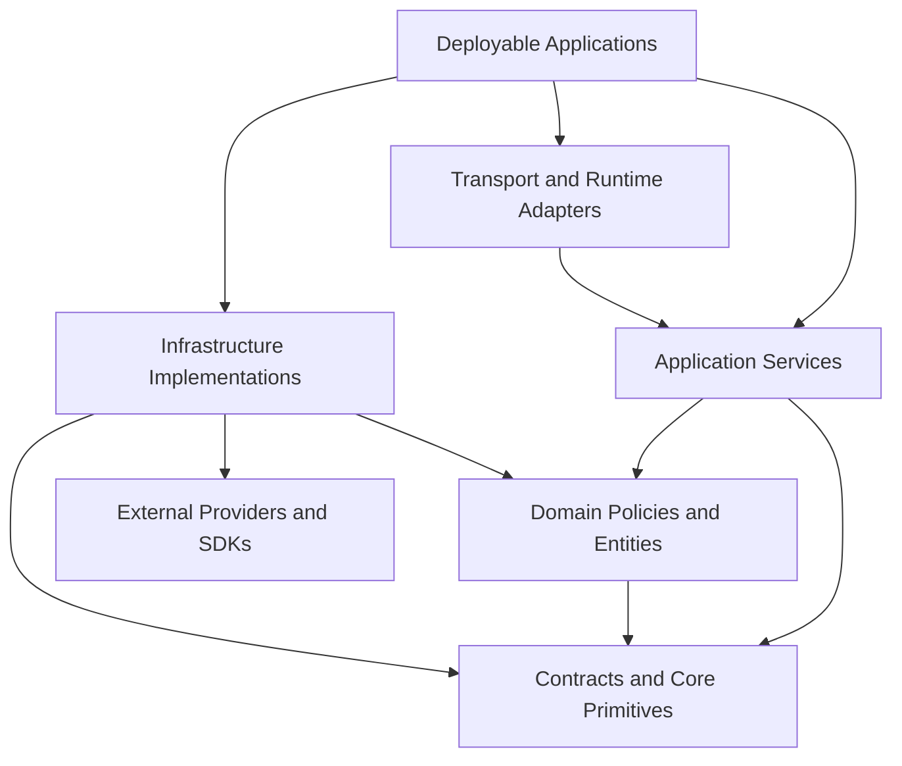

# Dependency Rules

Status: Draft
Owner: SinLess Games LLC
Last Updated: 2026-07-13
Security Classification: Internal Engineering
Workspace Manager: pnpm
Project Graph: Nx
Primary Language: TypeScript
Primary Runtime: Node.js 24.x

Related Engineering Documentation:

- `docs/engineering/Code Style.md`
- `docs/engineering/Testing.md`
- `docs/engineering/TypeScript Standards.md`
- `docs/engineering/Package Management.md`
- `docs/engineering/Monorepo Rules.md`
- `docs/engineering/Git Workflow.md`
- `docs/engineering/Security Practices.md`
- `docs/engineering/Release Process.md`

Related Architecture:

- `docs/architecture/Monorepo Architecture.md`
- `docs/architecture/Frontend Architecture.md`
- `docs/architecture/API Architecture.md`
- `docs/architecture/Service Architecture.md`
- `docs/architecture/Data Architecture.md`
- `docs/architecture/Auth Architecture.md`
- `docs/architecture/Security Architecture.md`
- `docs/architecture/Discord Architecture.md`
- `docs/architecture/Module Architecture.md`
- `docs/architecture/Workflow Architecture.md`
- `docs/architecture/AI Architecture.md`
- `docs/architecture/Integration Architecture.md`
- `docs/architecture/Notification Architecture.md`
- `docs/architecture/Audit Architecture.md`
- `docs/architecture/Observability Architecture.md`
- `docs/architecture/Local Development.md`

Related RFCs:

- `docs/rfcs/0002-monorepo-library-boundaries.md`
- `docs/rfcs/0005-entity-schema-and-contract-strategy.md`
- `docs/rfcs/0008-configuration-and-secrets-model.md`
- `docs/rfcs/0009-authentication-session-and-authorization-model.md`
- `docs/rfcs/0010-api-envelope-request-and-trace-id-propagation.md`
- `docs/rfcs/0011-event-envelope-audit-model-and-idempotency.md`
- `docs/rfcs/0012-workflow-records-and-approval-primitive.md`
- `docs/rfcs/0013-provider-abstraction-and-integration-interface.md`
- `docs/rfcs/0014-module-registry-manifest-and-lifecycle.md`
- `docs/rfcs/0015-discord-permission-role-hierarchy-and-action-safety.md`
- `docs/rfcs/0016-ai-assistant-boundaries-and-mvp-memory-scope.md`
- `docs/rfcs/0017-observability-trace-propagation-and-alerting.md`

---

## Purpose

This document defines the dependency rules for Aerealith AI.

It governs which projects, libraries, applications, modules, adapters, frameworks, providers, and infrastructure components may depend on one another.

The dependency rules cover:

```text
workspace dependencies
external dependencies
runtime dependencies
development dependencies
peer dependencies
optional dependencies
project graph direction
layer boundaries
provider isolation
database isolation
frontend isolation
runtime compatibility
public entry points
path aliases
cross-feature imports
dependency inversion
circular dependencies
dependency injection
side effects
dynamic imports
security-sensitive dependencies
test dependencies
build dependencies
deployment dependencies
dependency exceptions
dependency validation
```

The objective is to keep Aerealith dependencies:

```text
intentional
directional
minimal
reviewable
secure
replaceable
testable
portable
compatible with supported runtimes
aligned with architectural ownership
```

The guiding rule is:

> A dependency is allowed only when it points in the correct architectural direction, is declared by the project that uses it, crosses an intentional public boundary, and does not weaken runtime, security, provider, data, or ownership isolation.

A dependency is not valid merely because:

```text
TypeScript can resolve it
pnpm installed it
Nx can build it
the package is already in the repository
the import makes implementation easier
```

---

## Dependency Rules Versus Package Management

Package management governs:

```text
installing packages
version ranges
lockfiles
registries
updates
vulnerability response
publishing
```

Dependency rules govern:

```text
who may depend on whom
which direction dependencies may point
which runtime may consume a package
which public boundary may be imported
which architectural layers must remain isolated
```

A package can comply with package-management policy while violating dependency rules.

Example:

```text
discord.js is correctly installed and pinned
but imported by the workflow engine
```

The package-management state is valid.

The architectural dependency is invalid.

---

## Core Principles

Aerealith dependency rules follow these principles:

```text
Dependencies point inward.
Applications compose implementations.
Domain code depends on abstractions.
Infrastructure implements abstractions.
Contracts do not depend on implementations.
Provider SDKs remain inside provider adapters.
Database implementations remain inside the data boundary.
Frontend code cannot depend on server implementations.
Modules and workflows use capabilities rather than provider clients.
AI cannot depend on credential stores.
Audit is event-driven rather than directly written by features.
Notifications are requested through contracts rather than channel SDKs.
Test dependencies never enter production code.
Circular dependencies are prohibited.
Public entry points define consumable behavior.
Every external import is declared by the importing project.
```

---

## Dependency Graph Model

The expected architectural direction is:



The dependency graph should generally point from:

```text
outer runtime concerns
toward
stable domain contracts
```

The stable inner layers must not depend on volatile outer implementations.

---

## Layer Definitions

Aerealith uses the following conceptual layers:

```text
transport
application
domain
contracts
infrastructure
provider
runtime composition
```

---

## Transport Layer

The transport layer owns:

```text
HTTP routes
request parsing
response mapping
framework context
webhook intake
interaction intake
browser transport
```

Transport may depend on:

```text
application services
contracts
authentication context
observability
```

Transport may not depend directly on:

```text
database rows
provider SDKs
credential stores
domain persistence implementations
```

A route handler should not call Discord, Resend, Drizzle, or an AI SDK directly.

---

## Application Layer

The application layer coordinates:

```text
authorization
domain policy
repositories
approvals
provider-neutral capabilities
event publication
notifications
audit-producing events
```

Application services may depend on:

```text
domain interfaces
contracts
repository interfaces
capability interfaces
approval interfaces
event publisher interfaces
observability interfaces
```

Application services should not depend on:

```text
HTTP framework contexts
React
raw provider SDKs
Drizzle rows
raw database clients
environment variables
```

---

## Domain Layer

The domain layer owns:

```text
business rules
lifecycle transitions
risk evaluation
permission policy
approval policy
state models
invariants
```

Domain code may depend on:

```text
core primitives
domain-owned interfaces
runtime-neutral contracts
```

Domain code must not depend on:

```text
Hono
NestJS
React
Drizzle
Discord.js
Resend
Cloudinary
AI provider SDKs
environment variables
filesystem
network clients
```

---

## Contracts Layer

The contracts layer owns stable boundary definitions.

Examples:

```text
API schemas
event schemas
module manifests
workflow definitions
provider-neutral capabilities
notification definitions
audit definitions
AI capability schemas
```

Contracts may depend on:

```text
runtime-neutral schema libraries
small core primitives
portable serialization types
```

Contracts may not depend on:

```text
applications
database rows
provider SDKs
framework request types
secret stores
runtime configuration
```

---

## Infrastructure Layer

Infrastructure implements interfaces for:

```text
database access
queues
caches
object storage
email delivery
provider actions
telemetry exporters
secret access
```

Infrastructure may depend on:

```text
domain interfaces
contracts
provider SDKs
database drivers
runtime APIs
```

Infrastructure must map external types into Aerealith-owned types before returning them.

---

## Provider Layer

Provider-specific projects own:

```text
provider SDKs
provider authentication
provider payload mapping
provider errors
provider rate limits
provider retries
provider health
provider-specific permissions
```

Examples:

```text
Discord adapter
Resend adapter
Cloudinary adapter
GitHub adapter
Google adapter
AI model adapter
Datadog exporter
Grafana Cloud exporter
```

Provider types must not cross the provider boundary.

---

## Runtime Composition Layer

Deployable applications compose concrete implementations.

The composition root may create:

```text
repositories
application services
provider adapters
event consumers
telemetry providers
configuration
```

The composition root is allowed to know about both:

```text
interfaces
implementations
```

Ordinary feature code should not.

---

## Dependency Direction Rule

Dependencies must point toward more stable abstractions.

Preferred:

```text
workflow application
→ WorkflowActionExecutor interface
← DiscordWorkflowActionAdapter
```

Invalid:

```text
workflow application
→ DiscordWorkflowActionAdapter
→ discord.js
```

The first design permits:

```text
Discord
future providers
fake providers
tests
self-hosted alternatives
```

The second couples workflows directly to Discord.

---

## Dependency Inversion

When an inner layer needs behavior from an outer layer, the inner layer owns the interface.

Example:

```ts
export interface WorkflowActionExecutor {
  execute(
    input: WorkflowActionRequest,
    context: WorkflowExecutionContext,
  ): Promise<Result<WorkflowActionResult, AerealithError>>
}
```

Provider-specific implementation:

```ts
export class DiscordWorkflowActionAdapter implements WorkflowActionExecutor {
  public async execute(
    input: WorkflowActionRequest,
    context: WorkflowExecutionContext,
  ): Promise<Result<WorkflowActionResult, AerealithError>> {
    // Map the provider-neutral request to Discord.
  }
}
```

The workflow library depends on the interface.

The application composition root injects the Discord implementation.

---

## Project Categories

Every project is categorized as:

```text
application
library
tool
test-support
```

Dependency rules differ by category.

---

## Application Dependencies

Applications may depend on:

```text
libraries
runtime implementations
provider adapters
configuration
observability
```

Applications should not depend on another deployable application.

Invalid:

```text
service-api
→ integration-discord application
```

Preferred:

```text
service-api
→ integration contracts
integration-discord
→ integration contracts
```

Applications communicate through:

```text
events
queues
HTTP contracts
shared interfaces
provider-neutral capabilities
```

They do not import each other's runtime entry points.

---

## Library Dependencies

Libraries should depend only on libraries at the same or more stable architectural level.

A library should not depend on a deployable application.

Invalid:

```text
lib-workflows
→ service-api
```

Libraries may depend on provider implementations only when the library itself is the provider adapter.

---

## Tool Dependencies

Tools may depend on:

```text
Node.js APIs
Nx APIs
pnpm metadata
repository configuration
test utilities
```

Production applications must not import tool projects.

Tools should not become runtime service dependencies.

---

## Test-Support Dependencies

Test-support projects may depend on production interfaces.

Production projects may not depend on test-support projects.

Allowed:

```text
testing
→ contracts
testing
→ core
testing
→ provider interfaces
```

Invalid:

```text
service-api
→ testing
```

---

## Required Project Tags

Dependency enforcement should use Nx tags.

Every project should define:

```text
type
scope
runtime
visibility
```

Example:

```json
{
  "tags": [
    "type:library",
    "scope:workflow",
    "runtime:neutral",
    "visibility:internal"
  ]
}
```

Optional tags may include:

```text
risk
stability
deployment
provider
```

---

## Type Tags

Supported type tags:

```text
type:app
type:library
type:tool
type:test-support
```

---

## Runtime Tags

Supported runtime tags:

```text
runtime:browser
runtime:worker
runtime:node
runtime:neutral
runtime:test
```

Runtime dependencies must remain compatible.

---

## Visibility Tags

Supported visibility tags:

```text
visibility:public
visibility:internal
visibility:private
```

### Public

May be consumed by:

```text
external developers
third-party modules
published packages
public clients
```

Public projects require:

```text
stable exports
documentation
versioning
compatibility review
```

### Internal

May be consumed by approved repository projects.

### Private

May be consumed only by its owning feature or application.

---

## Scope Tags

Recommended scope tags:

```text
scope:frontend
scope:api
scope:service
scope:core
scope:contracts
scope:data
scope:auth
scope:security
scope:discord
scope:integration
scope:module
scope:workflow
scope:notification
scope:audit
scope:ai
scope:observability
scope:flags
scope:ui
scope:content
scope:tooling
scope:testing
```

---

## Dependency Matrix

Recommended dependency permissions:

| Source        | Allowed Dependencies                                          |
| ------------- | ------------------------------------------------------------- |
| Frontend      | Contracts, UI, flags, content, browser-safe clients           |
| API           | Contracts, application services, auth, core, observability    |
| Services      | Contracts, core, data interfaces, capabilities, observability |
| Core          | Runtime-neutral primitives and contracts                      |
| Contracts     | Runtime-neutral schema and serialization primitives           |
| Data          | Core, contracts, Drizzle, supported database drivers          |
| Auth          | Core, contracts, data interfaces, observability               |
| Security      | Core, contracts, auth interfaces, observability               |
| Discord       | Integration interfaces, core, Discord SDK, observability      |
| Integration   | Core, contracts, provider-neutral interfaces                  |
| Modules       | Core, contracts, approved capabilities                        |
| Workflows     | Core, contracts, capability and approval interfaces           |
| Notifications | Core, contracts, channel interfaces                           |
| Audit         | Core, contracts, data interfaces, observability               |
| AI            | Core, contracts, AI interfaces, capability interfaces         |
| Observability | Telemetry SDKs and safe shared primitives                     |
| UI            | React, design tokens, frontend-safe contracts                 |
| Tooling       | Node.js and repository tooling                                |
| Testing       | Production interfaces and test frameworks                     |

This table describes maximum allowed directions.

It does not imply every listed dependency is automatically justified.

---

## Runtime Compatibility

A project may depend only on projects compatible with its runtime.

---

## Runtime-Neutral Projects

`runtime:neutral` projects may depend only on:

```text
runtime-neutral libraries
portable Web APIs
plain TypeScript
runtime-neutral schema libraries
```

They may not depend on:

```text
Node.js filesystem
DOM
Cloudflare bindings
Discord.js
native modules
database drivers
framework runtime internals
```

---

## Browser Projects

`runtime:browser` projects may depend on:

```text
runtime:browser
runtime:neutral
```

They may not depend on:

```text
runtime:node
runtime:worker implementations
database packages
secret stores
provider bot clients
server-only frameworks
```

---

## Worker Projects

`runtime:worker` projects may depend on:

```text
runtime:worker
runtime:neutral
```

Node.js dependencies require explicit compatibility review.

A package being bundled successfully does not prove Worker compatibility.

---

## Node Projects

`runtime:node` projects may depend on:

```text
runtime:node
runtime:neutral
```

Node-specific types must not leak into runtime-neutral contracts.

---

## Test Projects

`runtime:test` projects may depend on approved production interfaces and test tooling.

Production runtimes may not depend on `runtime:test`.

---

## Frontend Dependency Rules

Frontend code may depend on:

```text
API contracts
frontend-safe view models
UI components
feature flags
content
typed API clients
browser-safe observability interfaces
```

Frontend code must not depend on:

```text
database code
Drizzle
server-side Better Auth internals
provider SDKs
credential services
Node.js filesystem
server environment configuration
server-only telemetry exporters
```

Authorization logic must not be implemented only in frontend dependencies.

---

## API Dependency Rules

API transport may depend on:

```text
application services
auth middleware
contracts
request context
observability
```

API transport must not depend directly on:

```text
provider SDKs
database rows
raw database clients
email SDKs
Discord SDKs
AI provider SDKs
```

The API application's composition root may wire those implementations.

Route handlers may not call them directly.

---

## Service Dependency Rules

Logical services may depend on:

```text
domain policies
repository interfaces
capability interfaces
event publishers
approval services
notification request interfaces
observability
```

Services must not depend on:

```text
transport framework objects
React components
provider SDK objects
Drizzle row types
raw environment values
```

---

## Data Dependency Rules

Only approved backend projects may depend on `@aerealith/db`.

The data boundary owns:

```text
Drizzle schemas
queries
repositories
database row types
mappers
transactions
migrations
PostgreSQL behavior
CockroachDB compatibility
```

The data package may depend on:

```text
Drizzle
PostgreSQL driver
CockroachDB-compatible driver behavior
core domain types
contracts
```

It must not expose:

```text
raw rows
raw SQL fragments
database connection objects
transaction objects
```

to higher layers.

---

## Database Row Rule

Database row types remain inside `libs/db`.

Invalid:

```ts
import type { WorkflowRunRow } from '@aerealith/db'
```

inside:

```text
API
frontend
workflow domain
module
AI
notification
```

Correct:

```ts
import type { WorkflowRun } from '@aerealith/core/workflows'
```

The data layer maps:

```text
WorkflowRunRow
→ WorkflowRun
```

---

## Auth Dependency Rules

Auth may depend on:

```text
core identity types
contracts
repository interfaces
Better Auth adapter boundary
observability
security primitives
```

Other features may depend on:

```text
AuthService interface
SessionService interface
AuthenticatedActor
AuthorizationContext
```

Other features should not depend on:

```text
Better Auth internal types
session database rows
cookie implementation
credential implementation
```

---

## Security Dependency Rules

Security-sensitive projects should have a narrow dependency graph.

Projects handling:

```text
credentials
sessions
cryptography
approvals
break-glass access
audit integrity
data deletion
```

must not become general-purpose dependencies.

A security project should expose narrow interfaces rather than broad utilities.

---

## Discord Dependency Rules

Only the Discord provider boundary may depend on:

```text
discord.js
Discord REST types
Discord gateway types
Discord permission flags
Discord interaction objects
```

The Discord project may expose:

```text
normalized events
provider-neutral resource references
capability implementations
health status
safe error codes
```

Invalid:

```text
workflow
→ discord.js
```

Valid:

```text
workflow
→ WorkflowActionExecutor
← DiscordWorkflowActionAdapter
→ discord.js
```

---

## Integration Dependency Rules

Integration projects may depend on:

```text
provider-neutral integration contracts
core
observability
provider-specific SDK
credential reference interface
```

Integration projects may not expose:

```text
raw provider client
raw OAuth token
provider SDK objects
provider-specific errors
```

to modules, workflows, frontend, audit, or AI.

---

## Module Dependency Rules

Modules may depend on:

```text
module contracts
core
approved capability interfaces
module-safe configuration
```

Modules may not depend on:

```text
database clients
raw repositories
Discord.js
Resend
AI provider SDKs
credential stores
runtime composition containers
```

Modules receive required capabilities from the host.

---

## Cross-Module Dependencies

One module must not import another module's private implementation.

Allowed interaction methods:

```text
shared capability
shared core library
documented event
public module contract
```

Invalid:

```text
ticket module
→ moderation module internal repository
```

Preferred:

```text
ticket module
→ moderation capability interface
```

---

## Workflow Dependency Rules

Workflow code may depend on:

```text
workflow contracts
core
approval interface
capability registry
clock
ID generator
event publisher
repository interfaces
```

Workflow code may not depend on:

```text
Discord.js
Resend SDK
Cloudinary SDK
AI provider SDK
database driver
HTTP framework
```

Persisted workflow definitions must remain provider-neutral and serializable.

---

## Notification Dependency Rules

Domain services may depend on:

```text
NotificationRequestPublisher
NotificationType identifiers
notification event contracts
```

They must not depend on:

```text
Resend SDK
Discord message client
push provider SDK
notification database rows
```

Correct direction:

```text
domain outcome
→ notification request or event
→ notification service
→ channel adapter
→ provider SDK
```

---

## Audit Dependency Rules

Feature services may depend on:

```text
event publisher
audit event contracts
```

Feature services must not depend on:

```text
audit repository
audit tables
audit record mutation APIs
```

Correct direction:

```text
feature outcome
→ normalized event
→ audit consumer
→ audit repository
```

This prevents features from bypassing:

```text
audit policy
redaction
idempotency
append-only behavior
```

---

## AI Dependency Rules

AI projects may depend on:

```text
AI contracts
core
approved capability interfaces
prompt templates
usage metering
observability
model-provider interfaces
```

AI projects may not depend on:

```text
raw credentials
credential stores
unrestricted provider clients
database internals
audit repositories
authorization implementation internals
```

AI may propose capability usage.

The platform performs:

```text
validation
authorization
risk evaluation
approval
execution
audit
```

---

## Observability Dependency Rules

Feature code may depend on:

```text
Aerealith logger interface
tracer interface
meter interface
safe telemetry context
```

Feature code should not depend directly on:

```text
Datadog SDK
Grafana SDK
Loki client
Tempo client
Mimir client
Pyroscope SDK
```

Vendor-specific dependencies remain inside the observability boundary.

---

## Infrastructure Tooling Versus Product Integrations

The following are infrastructure or engineering dependencies:

```text
Datadog
Snyk
Semgrep
Codecov
Dependabot
Renovate
Meticulous AI
Grafana Cloud
```

They do not become product integration dependencies merely because the repository uses them.

Product code should not import engineering-tool packages unless the tool has an explicit runtime product role.

---

## External Dependency Ownership

Every external package must be declared by the project that imports it.

Example:

```text
integration-discord imports discord.js
```

Then:

```text
apps/integrations/discord/package.json
```

must declare:

```json
{
  "dependencies": {
    "discord.js": "<approved-version>"
  }
}
```

The root package must not own the dependency merely because it is used by several projects.

---

## Phantom Dependencies

Phantom dependencies are prohibited.

A phantom dependency exists when a project imports a package it did not declare.

Example:

```text
lib-workflows imports zod
but only the root package declares zod
```

Each importing project must declare the dependency.

pnpm's isolated dependency model should be preserved.

Do not solve phantom dependencies through broad hoisting.

---

## Transitive Dependencies

A project must not import a package merely because another dependency brings it transitively.

Bad:

```text
package A depends on package B
package B depends on package C
package A imports package C without declaring it
```

Package A must declare package C directly.

Transitive dependency layout is not a public contract.

---

## Workspace Dependencies

Internal package dependencies must use the workspace protocol.

Example:

```json
{
  "dependencies": {
    "@aerealith/contracts": "workspace:*",
    "@aerealith/core": "workspace:*"
  }
}
```

This prevents accidental resolution from a public registry.

---

## Runtime Dependencies

A package belongs in `dependencies` when production code needs it at runtime.

Examples:

```text
Hono
NestJS
React
Drizzle
Discord.js
Resend
runtime validation library
OpenTelemetry runtime
```

---

## Development Dependencies

A package belongs in `devDependencies` when used only for:

```text
testing
linting
formatting
compilation
code generation
local tooling
type checking
```

Examples:

```text
Vitest
Playwright
ESLint
Prettier
TypeScript
test fixtures
```

Production builds must not require development dependencies.

---

## Peer Dependencies

Peer dependencies should be used when the consumer must provide one shared host runtime.

Examples:

```text
React component library
framework plugin
module SDK
OpenTelemetry extension
```

Peer dependencies should not be used to avoid normal dependency ownership.

---

## Optional Dependencies

Optional dependencies are permitted only when:

```text
the feature is genuinely optional
startup handles absence safely
the package is not imported eagerly
the capability can be disabled
tests cover package absence
```

Example:

```text
optional profiling agent
optional local development provider
optional self-hosting adapter
```

---

## Optional Provider Loading

Optional provider adapters should use controlled dynamic imports.

```ts
export async function loadProviderAdapter(
  provider: SupportedProvider,
): Promise<IntegrationProviderAdapter> {
  switch (provider) {
    case 'discord': {
      const module = await import('@aerealith/integration-discord')

      return module.createDiscordIntegrationAdapter()
    }

    case 'github': {
      const module = await import('@aerealith/integration-github')

      return module.createGitHubIntegrationAdapter()
    }

    default:
      return assertNever(provider)
  }
}
```

Dynamic imports must not bypass:

```text
provider registry
capability allowlist
configuration validation
security review
```

---

## Dynamic Imports

Dynamic imports are appropriate for:

```text
optional integrations
runtime-specific adapters
large frontend route bundles
development-only tooling
```

Dynamic imports are not appropriate for hiding invalid dependency cycles.

Avoid:

```ts
const dependency = await import('../invalid-cross-boundary/internal-file.js')
```

merely to avoid static graph detection.

---

## Side-Effect Dependencies

Dependencies with import-time side effects require review.

Potential side effects include:

```text
global registration
telemetry initialization
prototype modification
environment mutation
CSS loading
decorator metadata
provider login
connection startup
```

Side-effect initialization should occur in the composition root.

Feature libraries should not connect to providers or initialize telemetry merely because they were imported.

---

## Import-Time Behavior

Importing a library should not:

```text
connect to a database
start a Discord gateway
send telemetry
read production secrets
schedule jobs
send notifications
execute migrations
```

These actions belong in explicit startup methods.

Good:

```ts
const runtime = createDiscordRuntime(config)

await runtime.start()
```

Bad:

```ts
import '@aerealith/integration-discord'
// Gateway connects during import.
```

---

## Public Entry Points

Cross-project imports must use intentional public entry points.

Good:

```ts
import type { WorkflowDefinition } from '@aerealith/contracts/workflows'
```

Bad:

```ts
import type { WorkflowDefinition } from '../../../../../libs/contracts/src/workflows/internal/types'
```

Public entry points define compatibility boundaries.

---

## Private Import Rule

Imports from another project's private source paths are prohibited.

Examples:

```text
@aerealith/db/src/internal/*
@aerealith/core/src/private/*
@aerealith/integration-discord/src/client/*
```

Private imports bypass:

```text
ownership
versioning
declaration safety
compatibility
security boundaries
```

---

## Path Alias Rules

Path aliases must map to public project entry points.

Preferred:

```json
{
  "paths": {
    "@aerealith/core": ["libs/core/src/index.ts"],
    "@aerealith/core/errors": ["libs/core/src/errors/index.ts"],
    "@aerealith/contracts/workflows": ["libs/contracts/src/workflows/index.ts"]
  }
}
```

Avoid broad aliases exposing all source files.

```json
{
  "@aerealith/core/*": ["libs/core/src/*"]
}
```

unless every matched location is intentionally public.

---

## Barrel File Rules

Barrel files are allowed at public boundaries.

Examples:

```text
libs/core/src/index.ts
libs/contracts/src/workflows/index.ts
libs/db/src/audit/index.ts
```

Avoid deep barrel chains.

Barrels can create:

```text
circular dependencies
large import graphs
accidental public APIs
bundle-size growth
slow type checking
```

---

## Circular Dependencies

Circular dependencies are prohibited.

This includes:

```text
project cycles
library cycles
feature cycles
runtime cycles
type-only architectural cycles
```

Example:

```text
workflow
→ notification
→ workflow
```

Even when TypeScript resolves the cycle, ownership is unclear.

---

## Resolving Circular Dependencies

Resolve cycles through:

```text
dependency inversion
moving shared primitives inward
introducing a narrow interface
publishing an event
splitting responsibilities
removing invalid coupling
```

Do not resolve cycles with:

```text
dynamic require
late import
global service locator
duplicated types
barrel manipulation
```

---

## Type-Only Imports

Type-only imports still count as architecture dependencies.

Invalid:

```ts
import type { DiscordGuild } from 'discord.js'
```

inside a runtime-neutral workflow package.

The fact that the import is erased at runtime does not make the architectural dependency valid.

---

## Dependency Injection

Dependencies should be injected explicitly.

Preferred:

```ts
export class ExecuteWorkflowService {
  public constructor(
    private readonly repository: WorkflowRepository,
    private readonly executor: WorkflowActionExecutor,
    private readonly approvalService: ApprovalService,
    private readonly eventPublisher: EventPublisher,
  ) {}
}
```

Avoid hidden dependency acquisition.

```ts
const repository = GlobalContainer.resolve('workflowRepository')
```

---

## Service Locator Rule

General-purpose service locators are prohibited.

Framework dependency-injection containers may be used at application boundaries.

Domain and application code should receive dependencies through:

```text
constructors
factories
function parameters
explicit context
```

---

## Dependency Lifetime

Dependency ownership should define lifetime.

Potential lifetimes:

```text
application singleton
request-scoped
operation-scoped
worker-scoped
transient
```

Examples:

```text
configuration -> application singleton
database pool -> application singleton
request context -> request-scoped
transaction -> operation-scoped
provider client -> adapter-owned reusable instance
```

Do not create expensive clients per request unless required.

---

## Resource Dependencies

Dependencies owning resources must define:

```text
startup
health
shutdown
reconnection
failure behavior
```

Examples:

```text
database pools
Discord gateway
queue consumers
telemetry exporters
provider clients
```

The composition root owns their lifecycle.

---

## Startup Dependencies

Startup ordering should be explicit.

Example:

```text
load configuration
→ initialize observability
→ connect database
→ verify migrations
→ initialize repositories
→ initialize services
→ start transport
→ start consumers
```

Do not rely on module import order.

---

## Optional Runtime Dependencies

Aerealith must remain operational when optional dependencies are unavailable.

Examples:

```text
AI provider
Discord integration
Datadog
Grafana Cloud
Cloudinary
Resend for non-required email
```

Optional dependency failure should degrade the relevant capability, not crash unrelated core behavior.

---

## Required Runtime Dependencies

Required dependencies may include:

```text
primary database
session storage
core configuration
essential cryptography
```

Failure of a required dependency should:

```text
fail readiness
produce safe diagnostics
avoid partial unsafe startup
```

---

## Dependency Health

Runtime dependencies should expose normalized health.

Potential states:

```text
healthy
degraded
unavailable
misconfigured
rate-limited
unknown
```

Health should not expose secrets or raw provider responses.

---

## Remote Service Dependencies

A remote service dependency should define:

```text
timeout
retry policy
circuit behavior
idempotency
authentication
health
fallback
observability
```

Do not issue unbounded remote calls.

---

## Timeouts

Every remote dependency call requires a timeout.

Examples:

```text
database query timeout
provider request timeout
AI request timeout
email delivery timeout
webhook forwarding timeout
```

Timeout values should be configuration-owned and use explicit units.

---

## Retry Rules

Retries are allowed only when:

```text
the error is retryable
the operation is idempotent
the retry budget remains
the action has not expired
the target remains valid
```

Do not retry:

```text
authorization denial
invalid input
missing permission
permanent provider rejection
revoked credentials
expired approval
```

---

## Circuit Breaker Direction

Circuit breakers may be introduced for unstable remote dependencies.

Potential targets:

```text
AI providers
email providers
media providers
external APIs
```

Circuit breakers should remain inside the owning adapter.

Domain services should receive normalized unavailable or degraded results.

---

## Dependency Failure Isolation

One optional dependency failure should not cause cascading platform failure.

Examples:

| Dependency Failure          | Expected Behavior                                                 |
| --------------------------- | ----------------------------------------------------------------- |
| AI provider unavailable     | Core features continue without AI.                                |
| Discord unavailable         | Discord capabilities degrade; account and web functions continue. |
| Resend unavailable          | In-app notification persists; email retries safely.               |
| Datadog unavailable         | Application continues with alternate or local telemetry.          |
| Cloudinary unavailable      | Media operations fail safely; unrelated features continue.        |
| Workflow worker unavailable | New work queues; API remains available where safe.                |

---

## Framework Dependency Rules

Each deployable should have one primary framework.

Examples:

```text
Hono API
NestJS service
Next.js frontend
Vite frontend or tool
```

Do not mix frameworks inside one deployable without an accepted architecture decision.

Framework-specific types remain at the transport boundary.

---

## Hono Dependency Rules

Hono types may exist inside:

```text
API transport
middleware
Worker runtime composition
```

They should not enter:

```text
domain
repositories
provider adapters
contracts
```

---

## NestJS Dependency Rules

NestJS may own:

```text
controllers
providers
modules
interceptors
guards
composition
```

Domain and core libraries should not require NestJS decorators or container types.

---

## React Dependency Rules

React may be used in:

```text
frontend
UI libraries
browser-safe component packages
```

React should not be imported by:

```text
core
contracts
data
provider adapters
workers
Discord runtime
```

---

## Drizzle Dependency Rules

Drizzle may be imported only by:

```text
libs/db
database migration tooling
narrow test harnesses
```

Drizzle should not become a dependency of:

```text
frontend
domain
modules
workflows
AI
notifications
audit policy
provider adapters
```

---

## Better Auth Dependency Rules

Better Auth server dependencies belong in the auth implementation boundary.

Shared consumers should use Aerealith-owned interfaces and contracts.

Do not expose Better Auth internal session or adapter types as public platform contracts.

---

## Provider SDK Rule

Provider SDKs must remain isolated.

Examples:

| SDK             | Allowed Boundary           |
| --------------- | -------------------------- |
| Discord.js      | Discord integration        |
| Resend SDK      | Email notification adapter |
| Cloudinary SDK  | Media adapter              |
| GitHub SDK      | GitHub integration         |
| Google SDK      | Google integration         |
| AI provider SDK | AI provider adapter        |
| Datadog SDK     | Observability adapter      |

---

## Duplicate Capability Rule

Do not add a new dependency when an approved Aerealith capability already provides the behavior.

Before adding a package, check whether the repository already has:

```text
HTTP client abstraction
ID generator
clock
logger
schema utility
retry policy
URL validator
provider adapter
queue abstraction
```

Avoid multiple competing libraries for the same foundational behavior without a migration plan.

---

## Competing Frameworks

Multiple libraries solving the same concern increase complexity.

Examples to avoid without justification:

```text
several validation libraries
several HTTP client libraries
several state-management libraries
several logging libraries
several date libraries
several queue abstractions
```

One library may be retained for a framework-specific need, but the overlap must be explicit.

---

## Dependency Size

Dependency cost includes:

```text
bundle size
install size
cold start
transitive packages
memory
build time
type-check time
security surface
maintenance
```

A dependency review should consider more than its direct package size.

---

## Frontend Bundle Dependencies

Frontend dependencies require review for:

```text
client bundle size
tree-shaking
server-only imports
Node.js polyfills
side effects
accessibility
browser compatibility
```

Large route-specific dependencies should be loaded lazily where practical.

---

## Worker Bundle Dependencies

Worker dependencies require review for:

```text
bundle size
cold start
unsupported Node.js APIs
dynamic code execution
native bindings
filesystem assumptions
```

A Node.js-compatible package may still be unsuitable for a Worker.

---

## Native Dependencies

Native dependencies require additional review.

Consider:

```text
CPU architecture
operating system
glibc versus musl
container base image
build toolchain
prebuilt binary provenance
Cloudflare incompatibility
```

Native dependencies should not enter runtime-neutral or Worker libraries.

---

## Security-Sensitive Dependencies

Security-sensitive dependencies include:

```text
cryptography
sessions
authentication
OAuth
JWT
HTML sanitization
file parsing
archive processing
URL parsing
webhook signatures
```

They require:

```text
security review
maintenance review
direct tests
controlled version policy
vulnerability monitoring
```

---

## Dependency Trust Boundaries

Dependencies should be classified by trust.

Potential classes:

```text
internal trusted
internal restricted
external runtime
external provider
external tooling
untrusted input parser
```

A dependency that parses untrusted data deserves stronger review than a formatting utility.

---

## File-Parsing Dependencies

File parsers should remain inside a controlled parsing boundary.

They require:

```text
input-size limits
format validation
resource limits
malware scanning integration
timeout
failure isolation
```

Parsed file output remains untrusted until validated.

---

## HTML and Markdown Dependencies

Rendering dependencies should remain separated from sanitization dependencies.

A Markdown renderer does not automatically provide XSS protection.

Frontend or notification rendering must use approved sanitization.

---

## AI Dependencies

AI provider packages are optional infrastructure.

Core Aerealith behavior must not depend on a model SDK.

AI SDK imports belong only inside model-provider adapters.

---

## Observability Dependencies

Automatic instrumentation can introduce hidden behavior.

Observability dependency review should consider:

```text
automatic patching
private-data capture
runtime hooks
bundle size
native profiling
Worker compatibility
```

Instrumentation should be initialized explicitly.

---

## Tooling Dependencies

Tooling dependencies belong at the root or owning tool project.

Examples:

```text
ESLint
Prettier
Semgrep integration
Snyk CLI integration
Codecov uploader
Meticulous tooling
Renovate configuration
```

Tooling dependencies should not enter production bundles.

---

## Dependency Exceptions

A dependency-rule exception requires:

```text
clear reason
specific source project
specific target dependency
narrow scope
owner
security review when relevant
expiration or review date
tests
```

Exceptions should be documented in:

```text
docs/engineering/Dependency Exceptions.md
```

or a machine-readable registry.

---

## Exception Registry

Example:

```json
{
  "exceptions": [
    {
      "source": "service-legacy-import",
      "target": "runtime-node-compatibility",
      "reason": "Temporary migration boundary",
      "owner": "Platform Engineering",
      "expires": "2026-10-01",
      "issue": "AER-412"
    }
  ]
}
```

An exception should not be added merely to silence lint.

---

## Temporary Exceptions

Temporary exceptions require:

```text
tracked issue
removal condition
expiration date
direct owner
```

Expired exceptions should fail CI.

---

## Permanent Exceptions

Permanent exceptions require an accepted architecture decision.

Examples may include:

```text
framework-required runtime coupling
generated code dependency
official compatibility adapter
```

Permanent does not mean unreviewed forever.

---

## ESLint Enforcement

ESLint should enforce:

```text
restricted imports
no private cross-project imports
no provider SDK outside provider scope
no Drizzle outside data scope
no test-support imports in production
no direct process.env outside config
```

Example conceptual restriction:

```js
{
  patterns: [
    {
      group: ['discord.js'],
      message:
        'Discord.js may be imported only from the Discord integration project.',
    },
    {
      group: ['drizzle-orm'],
      message:
        'Drizzle may be imported only from the data boundary.',
    },
  ],
}
```

---

## Nx Enforcement

Nx dependency constraints should enforce:

```text
runtime compatibility
scope direction
type restrictions
visibility
test isolation
```

Example direction:

```js
{
  sourceTag: 'runtime:browser',
  onlyDependOnLibsWithTags: [
    'runtime:browser',
    'runtime:neutral',
  ],
},
{
  sourceTag: 'scope:core',
  onlyDependOnLibsWithTags: [
    'scope:core',
    'scope:contracts',
    'runtime:neutral',
  ],
},
{
  sourceTag: 'type:app',
  notDependOnLibsWithTags: [
    'type:app',
  ],
}
```

Application-to-application imports should be prohibited by default.

---

## Package Manifest Enforcement

Validation should ensure:

```text
external imports are declared
workspace imports use workspace protocol
runtime dependencies are not dev-only
test dependencies are not runtime dependencies
private projects are not accidentally publishable
```

---

## Cycle Detection

CI should fail on circular dependencies.

Detection should include:

```text
Nx project cycles
TypeScript import cycles
package dependency cycles
```

Some package-manager cycles may be technically installable.

They remain architecture defects unless explicitly approved.

---

## Boundary Compile Fixtures

The repository may include compile fixtures that intentionally violate dependency rules.

Examples:

```text
frontend imports @aerealith/db
workflow imports discord.js
AI imports credential store
production imports @aerealith/testing
core imports Hono
```

The validation succeeds only when those invalid fixtures fail to compile or lint.

---

## Public Export Tests

Libraries should be tested through documented package exports.

Tests should confirm:

```text
public paths resolve
private paths fail
declarations do not expose private dependencies
runtime imports work
```

---

## Declaration Leakage Tests

Generated TypeScript declarations must not expose:

```text
Discord.js types
Drizzle row types
Hono context
NestJS decorators
provider SDK errors
private implementation classes
```

unless the package intentionally owns that public boundary.

---

## Dependency Validation Commands

Recommended commands:

```bash
pnpm deps:check
pnpm deps:cycles
pnpm deps:undeclared
pnpm deps:boundaries
pnpm deps:exports
pnpm deps:graph
```

Potential Nx commands:

```bash
pnpm nx graph
pnpm nx affected -t lint,typecheck,test
```

---

## Root Script Direction

Recommended root scripts:

```json
{
  "scripts": {
    "deps:check": "node tools/scripts/validate-dependencies.mjs",
    "deps:cycles": "node tools/scripts/detect-dependency-cycles.mjs",
    "deps:undeclared": "node tools/scripts/check-undeclared-dependencies.mjs",
    "deps:boundaries": "node tools/scripts/validate-boundaries.mjs",
    "deps:exports": "node tools/scripts/validate-package-exports.mjs",
    "deps:graph": "nx graph"
  }
}
```

---

## Continuous Integration

Pull-request CI should validate:

```text
dependency declarations
project tags
runtime compatibility
boundary rules
provider isolation
database isolation
frontend isolation
cycle absence
public exports
package manifests
```

---

## Pull Request Dependency Review

A pull request adding a dependency should explain:

```text
what is being added
which project owns it
why existing capabilities are insufficient
runtime compatibility
security impact
transitive impact
bundle impact
replacement or removal path
```

A pull request adding a new internal dependency edge should explain:

```text
source project
target project
reason
direction
public interface
whether an event or interface would reduce coupling
```

---

## High-Risk Dependency Changes

Additional architecture or security review is required when adding dependencies involving:

```text
authentication
authorization
credentials
cryptography
database access
provider administration
code execution
file parsing
HTML rendering
AI tool execution
audit integrity
data deletion
```

---

## Dependency Graph Review

Reviewers should inspect:

```text
new incoming edges
new outgoing edges
new dependency hubs
cross-runtime edges
cross-scope edges
new provider coupling
new data coupling
```

Useful command:

```bash
pnpm nx graph
```

---

## Dependency Hub Rules

Foundational dependency hubs may include:

```text
contracts
core
observability interfaces
```

Dependency hubs should remain:

```text
small
stable
runtime-neutral
well tested
low in external dependency count
```

A foundational project should not casually add:

```text
provider SDK
framework
database driver
large utility package
```

---

## God Dependency Rule

Avoid libraries that everything depends on.

Warning signs include:

```text
generic shared package
hundreds of exports
many unrelated external dependencies
many runtime tags
many scope tags
frequent circular-dependency pressure
```

Split by stable architectural responsibility.

---

## Version Coupling

Internal projects should not depend on implementation details of a specific version unless the contract requires it.

Provider-specific version handling belongs inside provider adapters.

Database migration compatibility belongs inside the data layer.

---

## Dependency Deprecation

A dependency should be deprecated when:

```text
it is no longer maintained
it has unacceptable security risk
it is replaced by an approved platform capability
it creates architectural coupling
it is incompatible with supported runtimes
```

Deprecation should include:

```text
replacement
migration plan
owner
removal target
```

---

## Dependency Removal

Removing a dependency requires:

```text
removing imports
removing manifest entries
updating lockfile
removing configuration
removing adapters
removing overrides
removing patches
updating documentation
running affected tests
```

Do not leave unused dependency configuration behind.

---

## Dependency Migration

Large dependency migrations should be staged.

Suggested sequence:

```text
1. Introduce the new abstraction.
2. Add the new implementation.
3. Add compatibility tests.
4. Migrate consumers.
5. Remove direct old imports.
6. Remove the old dependency.
7. Remove temporary adapters.
8. Update architecture rules.
```

---

## Dependency Incident Response

When a dependency is compromised or critically vulnerable:

```text
identify affected projects
identify production reachability
block unsafe versions
apply patch, override, update, or removal
rotate credentials where necessary
rebuild release artifacts
update the SBOM
run targeted tests
document the incident
```

Architectural isolation should reduce the blast radius.

Example:

```text
Discord SDK vulnerability
```

should primarily affect:

```text
Discord integration runtime
```

rather than:

```text
workflow
modules
frontend
core
```

---

## Dependency Metrics

Potential dependency health metrics include:

```text
project dependency count
external dependency count
transitive dependency count
circular dependency count
undeclared import count
cross-runtime violation count
provider leakage count
database leakage count
unused dependency count
largest dependency hubs
```

Metrics should guide review.

They should not become arbitrary quotas.

---

## Testing Strategy

Dependency-rule testing should include:

```text
Nx boundary tests
ESLint import tests
cycle detection
package manifest validation
undeclared import detection
public export tests
declaration leakage tests
runtime compatibility tests
production pruning tests
```

---

## Critical Dependency Tests

Tests must prove:

```text
frontend cannot import data
frontend cannot import provider SDKs
core cannot import provider SDKs
core cannot import database implementations
contracts cannot import applications
workflows cannot import Discord.js
modules cannot import raw provider clients
AI cannot import credential stores
features cannot write audit rows directly
features cannot call Resend directly
production cannot import test support
applications cannot import other applications
external imports are declared
workspace imports use workspace protocol
circular dependencies fail validation
private package paths cannot be imported
```

---

## Runtime Compatibility Tests

Tests should verify:

```text
runtime-neutral packages compile without Node.js or DOM types
Worker packages do not import unsupported native modules
browser packages do not import server-only packages
Node packages do not leak Node types through neutral contracts
```

---

## Production Dependency Tests

A production build should verify:

```text
runtime starts without devDependencies
test packages are absent
tooling packages are absent
optional packages can be absent
declared runtime packages are sufficient
```

---

## File Structure

Recommended dependency tooling structure:

```text
tools/
├── scripts/
│   ├── validate-dependencies.mjs
│   ├── validate-boundaries.mjs
│   ├── detect-dependency-cycles.mjs
│   ├── check-undeclared-dependencies.mjs
│   ├── validate-package-exports.mjs
│   └── validate-runtime-compatibility.mjs
└── dependency-rules/
    ├── project-tags.json
    ├── allowed-edges.json
    ├── restricted-packages.json
    ├── dependency-exceptions.json
    └── project-owners.json
```

---

## Restricted Package Registry

A machine-readable registry may define package restrictions.

Example:

```json
{
  "discord.js": {
    "allowedScopes": ["scope:discord"]
  },
  "drizzle-orm": {
    "allowedScopes": ["scope:data"]
  },
  "resend": {
    "allowedScopes": ["scope:notification"]
  }
}
```

The registry should support exceptions only through documented review.

---

## Allowed Edge Registry

A machine-readable edge registry may define allowed scope dependencies.

Example:

```json
{
  "scope:frontend": [
    "scope:contracts",
    "scope:ui",
    "scope:flags",
    "scope:content"
  ],
  "scope:workflow": ["scope:contracts", "scope:core"],
  "scope:data": ["scope:contracts", "scope:core"]
}
```

Nx and custom scripts may consume this registry.

---

## Implementation Sequence

Recommended implementation order:

```text
1. Finalize project tag taxonomy.
2. Define the architectural dependency matrix.
3. Define runtime compatibility rules.
4. Define restricted external packages.
5. Add Nx dependency constraints.
6. Add ESLint restricted imports.
7. Add external dependency ownership checks.
8. Add workspace-protocol validation.
9. Add application-to-application import restrictions.
10. Add provider SDK isolation checks.
11. Add data-boundary checks.
12. Add frontend-boundary checks.
13. Add production-to-test dependency checks.
14. Add cycle detection.
15. Add public export tests.
16. Add declaration leakage tests.
17. Add dependency exception registry.
18. Add exception-expiration validation.
19. Add dependency graph review to pull requests.
20. Add CI enforcement.
21. Migrate existing violations.
22. Review foundational dependency hubs.
```

---

## Required Decisions

Before these dependency rules are considered stable, Aerealith must finalize:

```text
project tag taxonomy
allowed dependency matrix
runtime compatibility matrix
application-to-application import policy
provider SDK restriction registry
database dependency restrictions
public entry-point policy
path-alias policy
barrel-file policy
peer dependency policy
optional dependency policy
dynamic import policy
service lifetime conventions
dependency exception process
exception expiration policy
cycle-detection tooling
undeclared dependency tooling
```

---

## Dependency Anti-Patterns

Avoid:

```text
frontend importing database code
core importing provider SDKs
contracts importing application services
workflows importing Discord.js
modules importing provider clients
AI importing credentials
features calling Resend directly
features writing audit rows directly
applications importing applications
production code importing test utilities
deep imports into another project's source
relying on transitive dependencies
root-owned application dependencies
broad hoisting
dynamic imports hiding invalid edges
global service locators
import-time provider connections
circular dependencies
generic shared god libraries
dependency exceptions without expiration
```

---

## Valid Dependency Examples

### Frontend

```text
frontend
→ contracts
→ UI
→ typed API client
```

### API

```text
service-api
→ application services
→ contracts
→ core
→ observability interfaces
```

### Data

```text
service composition root
→ database repository implementation
→ Drizzle
→ PostgreSQL or CockroachDB
```

### Discord

```text
workflow
→ WorkflowActionExecutor interface
← Discord adapter
→ Discord.js
```

### Notification

```text
workflow event
→ notification service
→ email adapter
→ Resend
```

### Audit

```text
module outcome event
→ audit consumer
→ audit repository
```

### AI

```text
AI proposal
→ capability interface
→ authorization
→ approval
→ provider adapter
```

---

## Invalid Dependency Examples

### Frontend to Data

```text
frontend
→ @aerealith/db
```

Why invalid:

```text
server-only code enters the browser graph
persistence types leak into the UI
credentials or Node.js dependencies may be bundled
```

---

### Workflow to Discord

```text
workflow
→ discord.js
```

Why invalid:

```text
workflow becomes provider-specific
rate limits may be bypassed
permission policy may be duplicated
provider types may enter persisted workflow definitions
```

---

### Module to Credential Store

```text
module
→ credential service implementation
```

Why invalid:

```text
module gains access to raw secrets
capability boundaries are bypassed
least privilege is broken
```

---

### AI to Provider Client

```text
AI orchestration
→ unrestricted Discord client
```

Why invalid:

```text
model output can influence unrestricted provider actions
authorization and approval may be bypassed
credential access may leak
```

---

### Service to Audit Repository

```text
feature service
→ audit repository
```

Why invalid:

```text
audit policy can be bypassed
records may be fabricated
redaction may be skipped
append-only behavior may be weakened
```

---

### Workflow to Resend

```text
workflow
→ Resend SDK
```

Why invalid:

```text
notification preferences are bypassed
channel policy is bypassed
provider credentials enter workflow execution
```

---

## Relationship to Package Management

Package management defines how packages are installed, versioned, updated, and scanned.

Dependency rules define whether those packages may be used by a particular project.

Both standards must pass.

---

## Relationship to Monorepo Rules

Monorepo rules define:

```text
project structure
project tags
public entry points
project ownership
```

Dependency rules define the allowed edges between those projects.

---

## Relationship to Code Style

Code style requires clear imports, explicit dependencies, and narrow interfaces.

Dependency rules determine whether an import is architecturally legal.

Readable code can still contain an invalid dependency.

---

## Relationship to TypeScript Standards

TypeScript path aliases, project references, declarations, and type-only imports must follow dependency rules.

Type-only imports do not bypass architectural restrictions.

---

## Relationship to Testing

Tests should prove dependency boundaries through:

```text
lint fixtures
compile fixtures
Nx graph validation
package export tests
runtime compatibility tests
```

Test code must not normalize invalid production dependencies.

---

## Relationship to Local Development

Local development uses fake adapters and explicit composition.

Core development should not require optional providers.

Dependency isolation makes it possible to run:

```text
frontend only
API only
Discord integration separately
AI disabled
observability exporters disabled
```

---

## Relationship to Security Architecture

Dependency rules are security controls.

They limit:

```text
credential access
provider access
database access
audit mutation
AI action authority
frontend trust
```

Weakening an import rule can weaken a security boundary.

---

## Relationship to Data Architecture

Database implementations remain isolated inside the data boundary.

Other projects depend on repositories and domain entities rather than Drizzle or raw rows.

---

## Relationship to Integration Architecture

Provider-specific dependencies remain inside adapters.

Modules, workflows, notifications, audit, and AI use provider-neutral contracts.

---

## Relationship to Module Architecture

Modules receive approved capabilities from the host.

Modules do not import infrastructure implementations or provider clients.

---

## Relationship to Workflow Architecture

Workflows depend on serializable definitions, capability interfaces, approval, and event contracts.

They do not depend on provider SDKs.

---

## Relationship to AI Architecture

AI proposes actions through controlled capability contracts.

AI does not depend on raw credentials, database internals, or unrestricted provider clients.

---

## Relationship to Observability Architecture

Feature projects depend on Aerealith observability interfaces.

Vendor SDKs remain isolated inside observability adapters.

---

## Relationship to Self-Hosting

Dependency isolation supports self-hosting by allowing:

```text
provider replacement
optional integration removal
local infrastructure adapters
alternative observability
Docker deployment
Kubernetes deployment
AI-disabled operation
```

The core platform should not depend on Aerealith-managed vendor implementations.

---

## Success Criteria

The dependency rules are successful when:

```text
dependencies point in the correct direction
projects import only intentional public entry points
frontend cannot import server internals
core remains runtime-neutral
contracts remain implementation-neutral
database code remains inside the data boundary
provider SDKs remain inside provider adapters
modules use capabilities
workflows use capabilities
AI cannot access credentials
features cannot bypass audit policy
features cannot bypass notification policy
production code cannot import test support
applications do not import applications
external imports are declared by owners
workspace dependencies use workspace protocol
circular dependencies are absent
optional integrations can be disabled
runtime compatibility is enforced
dependency exceptions are narrow and time-bounded
CI rejects invalid dependency edges
```

---

## Final Standard

Aerealith dependencies should make architecture visible, enforceable, and difficult to bypass.

The standard is:

> Every Aerealith dependency must have a clear owner, point toward a stable abstraction, match the consuming project's runtime, cross only an intentional public boundary, and preserve provider, persistence, frontend, security, module, workflow, AI, audit, and notification isolation. External packages must be declared by the projects that import them, internal packages must use workspace links, applications must compose rather than import one another, infrastructure must implement interfaces owned by inner layers, circular dependencies must fail validation, and exceptions must be narrow, reviewed, tested, documented, and temporary unless supported by an accepted architecture decision.
