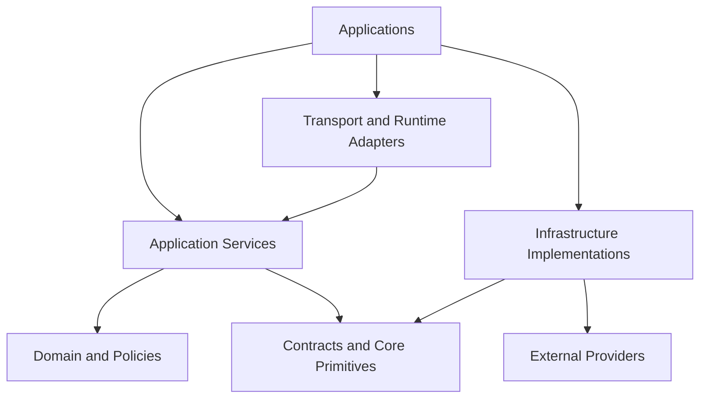

# Monorepo Rules

Status: Draft
Owner: SinLess Games LLC
Last Updated: 2026-07-13
Security Classification: Internal Engineering
Workspace Manager: pnpm
Task Orchestration: Nx
Primary Language: TypeScript
Primary Runtime: Node.js 24.x

Related Engineering Documentation:

- `docs/engineering/Code Style.md`
- `docs/engineering/Testing.md`
- `docs/engineering/TypeScript Standards.md`
- `docs/engineering/Package Management.md`
- `docs/engineering/Local Development.md`
- `docs/engineering/Git Workflow.md`
- `docs/engineering/Dependency Management.md`
- `docs/engineering/Security Practices.md`
- `docs/engineering/Release Process.md`

Related Architecture:

- `docs/architecture/Monorepo Architecture.md`
- `docs/architecture/Frontend Architecture.md`
- `docs/architecture/API Architecture.md`
- `docs/architecture/Service Architecture.md`
- `docs/architecture/Data Architecture.md`
- `docs/architecture/Auth Architecture.md`
- `docs/architecture/Security Architecture.md`
- `docs/architecture/Discord Architecture.md`
- `docs/architecture/Module Architecture.md`
- `docs/architecture/Workflow Architecture.md`
- `docs/architecture/AI Architecture.md`
- `docs/architecture/Integration Architecture.md`
- `docs/architecture/Notification Architecture.md`
- `docs/architecture/Audit Architecture.md`
- `docs/architecture/Observability Architecture.md`
- `docs/architecture/Local Development.md`

Related RFCs:

- `docs/rfcs/0002-monorepo-library-boundaries.md`
- `docs/rfcs/0003-api-versioning-and-route-strategy.md`
- `docs/rfcs/0004-error-and-result-model.md`
- `docs/rfcs/0005-entity-schema-and-contract-strategy.md`
- `docs/rfcs/0008-configuration-and-secrets-model.md`
- `docs/rfcs/0010-api-envelope-request-and-trace-id-propagation.md`
- `docs/rfcs/0011-event-envelope-audit-model-and-idempotency.md`
- `docs/rfcs/0012-workflow-records-and-approval-primitive.md`
- `docs/rfcs/0013-provider-abstraction-and-integration-interface.md`
- `docs/rfcs/0014-module-registry-manifest-and-lifecycle.md`
- `docs/rfcs/0015-discord-permission-role-hierarchy-and-action-safety.md`
- `docs/rfcs/0016-ai-assistant-boundaries-and-mvp-memory-scope.md`
- `docs/rfcs/0017-observability-trace-propagation-and-alerting.md`

---

## Purpose

This document defines the engineering rules for the Aerealith AI monorepo.

It governs how contributors create, organize, name, connect, build, test, version, publish, and remove projects within the repository.

The monorepo rules cover:

```text
applications
libraries
tools
project naming
directory structure
package ownership
Nx project metadata
project tags
dependency constraints
public APIs
path aliases
package exports
cross-project imports
runtime boundaries
provider boundaries
database boundaries
frontend boundaries
shared contracts
configuration
testing
build targets
task caching
affected commands
generators
ownership
deprecation
project removal
```

The objective is to keep the repository:

```text
understandable
modular
secure
testable
incremental
portable
scalable
easy to navigate
difficult to couple accidentally
```

The guiding rule is:

> Every project must have one clear responsibility, one identifiable owner, one intentional public boundary, and only the dependencies permitted by its architectural role.

A valid filesystem path does not automatically make an import valid.

A package being available in the workspace does not automatically make it an approved dependency.

---

## Core Principles

The Aerealith monorepo follows these principles:

```text
Architecture is enforced through project boundaries.
Applications compose behavior.
Libraries own reusable behavior.
Provider SDKs remain inside provider boundaries.
Database implementations remain inside the data boundary.
Frontend code cannot import server implementations.
Contracts do not depend on implementations.
Core domain code remains runtime-neutral where practical.
Cross-project imports use public entry points.
Circular dependencies are prohibited.
Projects remain independently testable.
Projects expose only intentional APIs.
Project tags describe architecture.
Nx constraints enforce project tags.
pnpm manifests describe external package ownership.
Generators produce compliant projects.
Repository-wide tooling remains centralized.
```

---

## Monorepo Tooling

Aerealith uses:

```text
pnpm for package and workspace management
Nx for project graph and task orchestration
TypeScript project references where appropriate
ESLint for import and boundary enforcement
Vitest for unit and integration tests
Playwright for end-to-end tests
```

Responsibilities are separated as follows:

| Tool       | Responsibility                                                                              |
| ---------- | ------------------------------------------------------------------------------------------- |
| pnpm       | External package installation, workspace linking, lockfile, dependency resolution           |
| Nx         | Internal project graph, task execution, caching, affected calculations, project constraints |
| TypeScript | Compile-time type checking and project references                                           |
| ESLint     | Source-level import restrictions and code rules                                             |
| Vitest     | Unit, contract, and integration tests                                                       |
| Playwright | Browser and end-to-end validation                                                           |

pnpm and Nx describe related but different graphs.

pnpm answers:

```text
Which npm and workspace packages are installed?
```

Nx answers:

```text
Which Aerealith projects depend on which other Aerealith projects?
```

Both graphs must reflect the intended architecture.

---

## Repository Shape

The expected high-level repository structure is:

```text
.
├── apps/
│   ├── frontend/
│   ├── services/
│   │   ├── api/
│   │   ├── workers/
│   │   └── scheduled/
│   └── integrations/
│       ├── discord/
│       └── provider-name/
├── libs/
│   ├── api/
│   ├── content/
│   ├── contracts/
│   ├── core/
│   ├── db/
│   ├── flags/
│   ├── observability/
│   ├── ui/
│   └── utils/
├── tools/
│   ├── generators/
│   ├── scripts/
│   └── testing/
├── docs/
├── docker/
├── nx.json
├── package.json
├── pnpm-workspace.yaml
├── pnpm-lock.yaml
├── tsconfig.base.json
└── eslint.config.mjs
```

The exact set of projects may evolve.

The directory hierarchy must continue to reflect architectural ownership rather than convenience.

---

## Project Categories

Every Nx project must belong to one primary project category.

Supported categories:

```text
application
library
tool
test-support
```

---

## Applications

Applications are deployable or independently executable units.

Examples:

```text
frontend
API
background workers
scheduled workers
Discord gateway runtime
future provider runtimes
command-line tools intended for deployment
```

Applications may:

```text
compose libraries
own runtime configuration
initialize infrastructure
bind transports
define deployment entry points
```

Applications should not become general-purpose shared-code containers.

Reusable behavior belongs in libraries.

---

## Libraries

Libraries contain reusable, independently testable code.

Examples:

```text
contracts
domain primitives
database repositories
observability
UI components
feature flags
shared provider-neutral interfaces
```

Libraries should have:

```text
a clear responsibility
a defined owner
a public entry point
a supported runtime
tests
dependency constraints
```

Libraries should not exist solely to reduce line count in an application.

Create a library when it represents:

```text
a stable architectural boundary
reusable domain behavior
a separately testable capability
a provider abstraction
a data boundary
a public contract
a reusable UI system
```

---

## Tools

Tools support repository development and delivery.

Examples:

```text
generators
migration scripts
validation scripts
dependency checks
release tooling
test harnesses
local diagnostics
```

Tools may use Node.js-specific APIs.

Tools must not become hidden runtime dependencies of production applications.

---

## Test-Support Projects

Test-support projects provide reusable test behavior.

Examples:

```text
factories
fakes
fixed clocks
ID generators
database harnesses
provider harnesses
Playwright fixtures
```

Production code must not import test-support projects.

Test-support packages should be marked clearly through project tags.

---

## Project Naming

Nx project names use lowercase kebab-case.

Examples:

```text
frontend
service-api
service-workers
service-scheduled
integration-discord
lib-contracts
lib-core
lib-db
lib-observability
lib-ui
tool-testing
```

Package names use the Aerealith scope.

Examples:

```text
@aerealith/frontend
@aerealith/service-api
@aerealith/service-workers
@aerealith/integration-discord
@aerealith/contracts
@aerealith/core
@aerealith/db
@aerealith/observability
@aerealith/ui
@aerealith/testing
```

Names should describe purpose.

Avoid names such as:

```text
common
shared
misc
helpers
stuff
new-lib
platform2
backend
service
utils2
```

---

## Directory Naming

Directories use lowercase kebab-case.

Good:

```text
provider-adapters
workflow-actions
notification-templates
role-hierarchy
```

Avoid:

```text
ProviderAdapters
provider_adapters
providerAdapters
```

Framework-required names remain valid.

Examples:

```text
page.tsx
layout.tsx
route.ts
project.json
```

---

## Project Ownership

Every project must have an identifiable owner.

Ownership may be documented through:

```text
CODEOWNERS
project metadata
package metadata
maintainer documentation
```

Ownership should identify the team or functional area responsible for:

```text
architecture
security review
dependency updates
breaking changes
maintenance
deprecation
```

Suggested ownership domains:

```text
Frontend Platform
API Platform
Data Platform
Discord Integration
AI Platform
Workflow Platform
Security
Observability
Developer Experience
```

A project without an owner should not become foundational.

---

## Project Metadata

Every Nx project should define:

```text
name
root
source root
project type
tags
targets
implicit dependencies only when necessary
```

Example `project.json`:

```json
{
  "name": "lib-core",
  "projectType": "library",
  "sourceRoot": "libs/core/src",
  "tags": [
    "type:library",
    "scope:core",
    "runtime:neutral",
    "visibility:internal"
  ],
  "targets": {
    "lint": {},
    "typecheck": {},
    "test": {},
    "build": {}
  }
}
```

Project metadata should be generated and validated.

---

## Required Project Tags

Every project must define tags for:

```text
type
scope
runtime
visibility
```

Additional tags may define:

```text
risk
stability
domain
deployment
```

---

## Type Tags

Supported type tags:

```text
type:app
type:library
type:tool
type:test-support
```

A project must have exactly one primary type tag.

---

## Scope Tags

Recommended scope tags:

```text
scope:frontend
scope:api
scope:service
scope:core
scope:contracts
scope:data
scope:auth
scope:security
scope:discord
scope:integration
scope:module
scope:workflow
scope:notification
scope:audit
scope:ai
scope:observability
scope:flags
scope:ui
scope:content
scope:tooling
scope:testing
```

A project may have one primary scope and narrowly justified secondary domain tags.

Avoid assigning many scope tags merely to bypass dependency rules.

---

## Runtime Tags

Supported runtime tags:

```text
runtime:browser
runtime:worker
runtime:node
runtime:neutral
runtime:test
```

The runtime tag controls which APIs and dependencies a project may use.

Examples:

```text
frontend -> runtime:browser
API Worker -> runtime:worker
Discord gateway -> runtime:node
core domain -> runtime:neutral
testing helpers -> runtime:test
```

---

## Visibility Tags

Supported visibility tags:

```text
visibility:public
visibility:internal
visibility:private
```

### Public

May be consumed outside the repository or by third-party module developers.

Requires:

```text
stable exports
versioning
documentation
compatibility review
```

### Internal

May be consumed by approved projects inside the repository.

### Private

May be consumed only within its owning application or feature boundary.

---

## Risk Tags

Optional risk tags:

```text
risk:low
risk:medium
risk:high
risk:critical
```

High-risk and critical projects may require:

```text
stronger review
additional tests
restricted ownership
security scanning
release approval
```

Examples:

```text
auth
credentials
approval
audit integrity
data deletion
```

---

## Dependency Direction

Dependencies should point from outer layers toward inner layers.

Recommended direction:

```text
Applications
→ Feature application libraries
→ Domain libraries
→ Core primitives and contracts
```

Infrastructure implementations should satisfy interfaces owned by inner layers.

Conceptual direction:



Infrastructure may depend on domain interfaces.

Domain libraries must not depend on infrastructure implementations.

---

## Foundational Dependency Rules

The following rules are mandatory:

```text
contracts do not import applications
core does not import applications
core does not import provider SDKs
core does not import database implementations
frontend does not import database code
frontend does not import server-only secrets
API contracts do not expose persistence rows
modules do not import raw provider clients
workflows do not import raw provider clients
AI does not import credential stores
test-support does not enter production bundles
```

---

## Project Dependency Matrix

Recommended dependency direction:

| Source Scope          | May Depend On                                                               |
| --------------------- | --------------------------------------------------------------------------- |
| `scope:frontend`      | contracts, UI, flags, content, approved frontend API client                 |
| `scope:api`           | contracts, core, application services, auth, data interfaces, observability |
| `scope:service`       | contracts, core, data, observability, provider abstractions                 |
| `scope:core`          | contracts, runtime-neutral utilities                                        |
| `scope:contracts`     | runtime schema dependencies and narrow primitives                           |
| `scope:data`          | contracts, core, database driver, Drizzle                                   |
| `scope:auth`          | contracts, core, data interfaces, observability                             |
| `scope:discord`       | integration abstractions, Discord SDK, observability                        |
| `scope:integration`   | contracts, core, provider-neutral integration interfaces                    |
| `scope:module`        | contracts, core, registered capabilities                                    |
| `scope:workflow`      | contracts, core, capability interfaces, approval interfaces                 |
| `scope:notification`  | contracts, core, provider-neutral channel interfaces                        |
| `scope:audit`         | contracts, core, data interfaces, observability                             |
| `scope:ai`            | contracts, core, provider-neutral AI interfaces, capability interfaces      |
| `scope:observability` | contracts where required, telemetry SDKs                                    |
| `scope:ui`            | React, design tokens, frontend contracts                                    |
| `scope:testing`       | production interfaces, test frameworks                                      |
| `scope:tooling`       | repository tooling and Node.js APIs                                         |

This matrix is directional.

It does not imply every listed dependency is always appropriate.

---

## Frontend Boundary

Frontend projects may import:

```text
frontend-safe contracts
UI components
feature flags
content
typed API clients
browser-safe utilities
```

Frontend projects may not import:

```text
libs/db
server repositories
provider SDKs
credential stores
Node.js filesystem APIs
server configuration
server-only observability exporters
Better Auth server internals
```

The frontend cannot be treated as a trusted authorization boundary.

Hiding a button is not authorization.

---

## API Boundary

The API application may compose:

```text
transport
authentication
application services
repositories
provider adapters
observability
```

Route handlers should not become reusable domain libraries.

Reusable behavior should move to:

```text
application libraries
domain libraries
provider-neutral interfaces
```

The API must not become the permanent dumping ground for every backend concern.

---

## Data Boundary

Database implementations belong under:

```text
libs/db
```

Only approved backend projects may import `@aerealith/db`.

The data project owns:

```text
Drizzle schemas
database rows
mappers
repositories
queries
transaction adapters
migration tooling
```

The data project must not expose:

```text
raw Drizzle rows
raw query builders
database connections
transaction objects
SQL fragments
```

through public application contracts.

---

## Contract Boundary

The contracts project owns:

```text
API contracts
event contracts
provider-neutral capability contracts
module manifests
workflow definitions
notification definitions
audit definitions
runtime schemas
```

Contracts must remain independent from:

```text
applications
database rows
provider SDKs
framework request objects
runtime secrets
```

Contracts may depend on a runtime schema library such as Zod.

Contract libraries should remain portable across:

```text
browser
Worker
Node.js
tests
```

unless a narrower runtime is explicitly declared.

---

## Core Boundary

The core project owns provider-neutral domain primitives.

Examples:

```text
Result
AerealithError
IDs
risk levels
scope types
approval fingerprints
module statuses
workflow statuses
notification statuses
audit outcomes
```

Core must remain free from:

```text
Discord.js
Drizzle
React
Hono
NestJS
Resend
Cloudinary
AI provider SDKs
filesystem APIs
```

Core should remain `runtime:neutral` wherever practical.

---

## Provider Boundary

Provider SDKs belong only inside provider-specific projects.

Examples:

```text
discord.js -> integration-discord
GitHub SDK -> integration-github
Google SDK -> integration-google
Resend SDK -> notification-resend adapter
Cloudinary SDK -> media-cloudinary adapter
AI provider SDK -> provider-specific AI adapter
```

Provider projects must map SDK types into Aerealith-owned contracts before returning data.

Raw provider objects must not cross into:

```text
core
contracts
modules
workflows
notifications
audit
AI context
frontend
```

---

## Discord Boundary

The Discord project owns:

```text
gateway connection
Discord REST calls
Discord command registration
interaction verification
Discord permission mapping
Discord role hierarchy
Discord rate limits
Discord event normalization
```

The Discord project may expose:

```text
provider-neutral capability adapters
normalized events
health
connection behavior
```

It must not expose unrestricted Discord clients to modules or workflows.

---

## AI Boundary

The AI project owns:

```text
model-provider adapters
prompt assembly
structured output validation
AI capability orchestration
AI usage accounting
```

AI projects may depend on:

```text
contracts
core
capability interfaces
observability
```

AI projects may not depend directly on:

```text
credential stores
raw provider clients
database internals
unrestricted module implementations
```

AI tool execution must route through platform capabilities.

---

## Workflow Boundary

The workflow project owns:

```text
workflow definitions
workflow versions
run state
step execution
retry policy
approval waits
cancellation
idempotency
```

Workflow code may invoke registered capabilities.

Workflow code may not import:

```text
Discord.js
Resend SDK
database drivers
AI provider SDKs
raw HTTP clients for provider actions
```

---

## Module Boundary

Modules must depend on:

```text
module contracts
core primitives
approved platform capabilities
```

Modules must not construct:

```text
database clients
provider clients
global service containers
credential readers
```

Modules receive capability interfaces from the host.

One module must not import another module's private implementation.

Shared behavior belongs in an approved shared library or capability.

---

## Notification Boundary

The notification project owns:

```text
notification registry
recipient resolution
preferences
templates
delivery coordination
channel interfaces
```

Channel-specific adapters remain isolated.

Domain services publish notification requests or events.

They do not import Resend or Discord delivery clients directly.

---

## Audit Boundary

The audit project owns:

```text
audit policy
event normalization
redaction
idempotency
persistence interface
query behavior
export behavior
```

Application services publish normalized outcome events.

They do not write audit rows directly during ordinary behavior.

---

## Observability Boundary

Observability libraries own:

```text
structured logging
OpenTelemetry setup
metrics
tracing
profiling hooks
redaction
telemetry context
```

Vendor-specific telemetry SDKs should remain behind observability adapters.

Feature libraries should depend on Aerealith observability interfaces rather than Datadog or Grafana-specific APIs.

---

## Runtime Compatibility Rules

Projects tagged `runtime:neutral` may use only APIs supported by every intended runtime.

Allowed examples:

```text
URL
URLSearchParams
TextEncoder
TextDecoder
Web Crypto
plain TypeScript
runtime-neutral schema libraries
```

Disallowed examples:

```text
node:fs
node:path
node:net
browser DOM
Cloudflare-specific bindings
Discord.js
native Node.js packages
```

Runtime-specific behavior belongs in an adapter.

---

## Browser Runtime Rules

Projects tagged `runtime:browser` may use:

```text
DOM
React
browser storage where approved
browser Fetch API
browser events
```

They may not use:

```text
Node.js built-ins
database packages
server credentials
server-only environment variables
provider bot tokens
```

---

## Worker Runtime Rules

Projects tagged `runtime:worker` may use:

```text
Fetch API
Request
Response
Headers
Web Crypto
Worker bindings
Cloudflare-compatible packages
```

They may not use unsupported Node.js APIs unless the approved compatibility mode explicitly supports them.

Any Node.js compatibility requirement should be reviewed for:

```text
bundle size
runtime support
security
portability
```

---

## Node Runtime Rules

Projects tagged `runtime:node` may use:

```text
Node.js built-ins
persistent sockets
filesystem
process signals
native packages where approved
```

Node projects should not leak Node-specific types into runtime-neutral contracts.

---

## Test Runtime Rules

Projects tagged `runtime:test` may depend on:

```text
Vitest
Playwright
test factories
fakes
database harnesses
```

Production projects must not import `runtime:test` projects.

---

## Public Entry Points

Every library must expose intentional public entry points.

Example:

```text
libs/core/src/index.ts
libs/core/src/errors/index.ts
libs/core/src/workflows/index.ts
```

Package exports should match supported entry points.

Example:

```json
{
  "exports": {
    ".": {
      "types": "./dist/index.d.ts",
      "import": "./dist/index.js"
    },
    "./errors": {
      "types": "./dist/errors/index.d.ts",
      "import": "./dist/errors/index.js"
    }
  }
}
```

Consumers must import through public entry points.

---

## Private Imports

Private source-path imports are prohibited.

Bad:

```ts
import { mapAuditRow } from '@aerealith/db/src/audit/internal/map-audit-row'
```

Good:

```ts
import type { AuditRecordRepository } from '@aerealith/db/audit'
```

Private imports create:

```text
hidden coupling
fragile refactors
accidental API expansion
circular dependencies
declaration leakage
```

---

## Relative Imports

Relative imports are preferred inside one project when paths remain clear.

```ts
import { createWorkflowFingerprint } from './create-workflow-fingerprint.js'
```

Cross-project imports must use workspace package names or approved path aliases.

Avoid deep relative paths across project roots.

```ts
import { something } from '../../../../libs/core/src/something'
```

This bypasses package ownership and Nx boundaries.

---

## Path Aliases

Path aliases should map to project public entry points.

Example:

```json
{
  "compilerOptions": {
    "paths": {
      "@aerealith/core": ["libs/core/src/index.ts"],
      "@aerealith/core/*": ["libs/core/src/*/index.ts"],
      "@aerealith/contracts": ["libs/contracts/src/index.ts"],
      "@aerealith/db": ["libs/db/src/index.ts"]
    }
  }
}
```

Avoid wildcards that expose every internal source file.

Bad:

```json
{
  "@aerealith/core/*": ["libs/core/src/*"]
}
```

unless each matched path is an intentional public boundary.

---

## Barrel Files

Barrel files should exist only at deliberate public boundaries.

Allowed:

```text
libs/core/src/index.ts
libs/contracts/src/workflows/index.ts
libs/db/src/audit/index.ts
```

Avoid deep barrel chains:

```text
feature/index.ts
feature/domain/index.ts
feature/domain/entities/index.ts
```

Excessive barrels can create:

```text
circular dependencies
ambiguous ownership
large bundles
slow type checking
accidental public APIs
```

---

## Circular Dependencies

Circular dependencies are prohibited.

This includes cycles between:

```text
projects
libraries
feature folders
public barrels
type-only imports where architecture is still cyclic
```

Do not resolve cycles with:

```text
dynamic require
global registries
late imports
duplicated contracts
service locators
```

Resolve cycles through:

```text
dependency inversion
moving shared primitives inward
splitting responsibilities
introducing an interface
removing an invalid dependency
```

---

## Nx Dependency Constraints

Nx dependency constraints should enforce project tags.

Example direction:

```json
{
  "sourceTag": "scope:frontend",
  "onlyDependOnLibsWithTags": [
    "scope:contracts",
    "scope:ui",
    "scope:flags",
    "scope:content",
    "runtime:browser",
    "runtime:neutral"
  ]
}
```

Additional constraints should prevent:

```text
browser -> node
core -> provider
contracts -> implementation
production -> test-support
module -> provider SDK
workflow -> provider SDK
AI -> credential store
```

---

## Example Dependency Constraints

Conceptual ESLint/Nx configuration:

```js
{
  sourceTag: 'runtime:browser',
  onlyDependOnLibsWithTags: [
    'runtime:browser',
    'runtime:neutral',
  ],
},
{
  sourceTag: 'runtime:worker',
  onlyDependOnLibsWithTags: [
    'runtime:worker',
    'runtime:neutral',
  ],
},
{
  sourceTag: 'runtime:node',
  onlyDependOnLibsWithTags: [
    'runtime:node',
    'runtime:neutral',
  ],
},
{
  sourceTag: 'scope:core',
  onlyDependOnLibsWithTags: [
    'scope:contracts',
    'scope:core',
    'runtime:neutral',
  ],
},
{
  sourceTag: 'scope:frontend',
  notDependOnLibsWithTags: [
    'scope:data',
    'scope:security',
    'runtime:node',
  ],
}
```

Exact rules should be defined in the repository ESLint configuration.

---

## External Dependency Ownership

An Nx project must declare every external package it imports in its own package manifest.

A project must not rely on:

```text
root-only runtime dependencies
transitive packages
hoisted packages
another project's package.json
```

Example:

```text
integration-discord imports discord.js
```

Then:

```text
apps/integrations/discord/package.json
```

must declare `discord.js`.

---

## Phantom Dependencies

Phantom dependencies are prohibited.

A phantom dependency exists when:

```text
project A imports package X
project A does not declare package X
package X is available only because another package installed it
```

pnpm's isolated workspace model should help expose this.

CI should validate undeclared imports.

---

## Shared External Dependencies

Two projects may independently declare the same external dependency.

Example:

```text
contracts and API both use Zod
```

Each should declare it when each imports it.

Do not move the dependency to the root merely to avoid duplicate declarations.

The lockfile and pnpm store will still deduplicate compatible package content.

---

## Internal Workspace Dependencies

Internal package dependencies use the workspace protocol.

Example:

```json
{
  "dependencies": {
    "@aerealith/contracts": "workspace:*",
    "@aerealith/core": "workspace:*"
  }
}
```

Do not resolve internal Aerealith packages from the public registry during local development.

---

## Project Creation Rules

New projects should be created through repository generators.

Example commands:

```bash
pnpm nx generate @aerealith/generators:library
pnpm nx generate @aerealith/generators:service
pnpm nx generate @aerealith/generators:integration
pnpm nx generate @aerealith/generators:module
```

Generators should prompt for or derive:

```text
name
project type
scope
runtime
visibility
owner
test strategy
build strategy
```

Manual project creation is allowed only when the generator cannot support the requirement.

The resulting project must still pass all validation.

---

## Generator Output

Generators should create:

```text
project metadata
package manifest
TypeScript configuration
lint target
type-check target
test target
build target where required
public entry point
README
ownership metadata
```

Generated projects should pass:

```text
formatting
lint
type checking
tests
Nx boundary validation
package-manifest validation
```

---

## Library Creation Criteria

Create a new library when at least one of these is true:

```text
the code represents a stable architecture boundary
the code is reused by more than one project
the code requires independent testing
the code requires a different runtime
the code isolates a provider
the code isolates persistence
the code defines public contracts
the code requires separate ownership
```

Do not create a library solely because:

```text
a file is long
a folder contains several files
a developer prefers more packages
a feature might someday be reused
```

---

## Application Creation Criteria

Create a new application when the runtime requires:

```text
independent deployment
independent scaling
persistent connection
different runtime
different security boundary
different shutdown behavior
different resource profile
```

Do not create a microservice merely because a domain is conceptually distinct.

Logical services may remain inside one deployable until operational evidence justifies separation.

---

## Integration Runtime Criteria

Create a dedicated integration application when a provider requires:

```text
persistent gateway connection
long-running session
provider-specific scaling
provider-specific network behavior
independent restart
provider-specific rate-limit coordination
```

Short request-response adapters may remain within an existing service boundary when appropriate.

---

## Source Structure

A project should organize source by responsibility.

Recommended library structure:

```text
libs/example/
├── src/
│   ├── domain/
│   ├── application/
│   ├── infrastructure/
│   ├── index.ts
│   └── internal/
├── project.json
├── package.json
├── tsconfig.json
├── tsconfig.lib.json
├── tsconfig.spec.json
└── README.md
```

Not every project requires every folder.

Create folders only for real responsibilities.

---

## Feature Structure

Feature-level structure may use:

```text
application
domain
transport
persistence
adapters
consumers
registry
configuration
observability
```

Avoid ambiguous folders such as:

```text
logic
misc
common
helpers
managers
stuff
```

---

## Public and Internal Source

A project may distinguish:

```text
src/public/
src/internal/
```

or use public entry points to expose only selected files.

Internal files must not be imported by external projects.

The repository should enforce this through:

```text
exports
path aliases
lint rules
declaration tests
```

---

## Project README

Every significant project should include a README describing:

```text
purpose
owner
runtime
public exports
allowed dependencies
configuration
test commands
build commands
deployment behavior
```

A README should not duplicate entire architecture documents.

It should explain the project's local contract.

---

## Required Targets

Every production project should normally define:

```text
lint
typecheck
test
```

Buildable or deployable projects should also define:

```text
build
```

Applications may define:

```text
serve
container
deploy
```

Projects with migrations or schemas may define:

```text
generate
migrate
validate
```

---

## Target Naming

Target names should remain consistent.

Recommended names:

```text
serve
build
lint
typecheck
test
test:coverage
test:integration
test:e2e
container
validate
```

Avoid project-specific synonyms such as:

```text
compile
check-types
unit
run-dev
package-app
```

unless a tool requires them.

---

## Target Inputs and Outputs

Nx targets should declare inputs and outputs accurately.

Example:

```json
{
  "build": {
    "inputs": ["production", "^production"],
    "outputs": ["{workspaceRoot}/dist/libs/core"]
  }
}
```

Incorrect inputs can produce stale cache hits.

Incorrect outputs can prevent cache restoration.

---

## Cacheable Targets

Suitable cacheable targets include:

```text
build
lint
typecheck
unit tests
contract tests
static analysis
code generation when deterministic
```

Usually non-cacheable targets include:

```text
serve
deployment
database migration execution
real provider tests
environment mutation
```

A task should be cached only when it is deterministic for the declared inputs.

---

## Deterministic Tasks

A cacheable task must not depend on undeclared:

```text
wall clock
random data
external network
developer machine state
untracked environment variables
production provider state
```

Tests should inject:

```text
fixed clock
deterministic IDs
fake providers
synthetic data
```

---

## Environment Inputs

Task configuration should declare relevant environment variables.

A task affected by:

```text
AEREALITH_DATABASE_DIALECT
AEREALITH_AI_PROVIDER
AEREALITH_ENVIRONMENT
```

must include those inputs where they change output.

Do not include secret values in cache metadata or remote cache keys.

---

## Nx Affected Commands

Contributors should use Nx affected commands for fast feedback.

Examples:

```bash
pnpm nx affected -t lint
pnpm nx affected -t typecheck
pnpm nx affected -t test
pnpm nx affected -t build
```

Affected commands do not replace full validation.

Shared changes may have broad impact.

Examples:

```text
contracts
core
TypeScript configuration
ESLint configuration
Nx configuration
package lockfile
```

---

## Full Validation

The repository should provide:

```bash
pnpm validate
```

The validation command should include:

```text
format check
lint
type checking
unit tests
coverage
contract tests
build
boundary validation
package-manifest validation
```

A deeper command may provide:

```bash
pnpm validate:full
```

Including:

```text
integration tests
migration tests
CockroachDB compatibility
E2E tests
container tests
security scans
```

---

## Project Graph Review

Contributors should use:

```bash
pnpm nx graph
```

to review project relationships.

The graph should make major architecture areas recognizable.

Warning signs include:

```text
frontend connected directly to data
core connected to providers
contracts connected to applications
one project connected to nearly everything
many circular relationships
test-support entering production
```

---

## Large Dependency Hubs

Some foundational projects naturally have many consumers.

Examples:

```text
contracts
core
observability interfaces
```

These projects require careful stability.

A project with many incoming dependencies should:

```text
change conservatively
maintain stable exports
avoid runtime-specific dependencies
have strong tests
receive compatibility review
```

---

## God Libraries

Avoid libraries that accumulate unrelated responsibilities.

Examples of problematic names:

```text
shared
common
platform
utils
base
```

A god library often creates:

```text
circular dependencies
unrelated rebuilds
unclear ownership
large public APIs
security boundary erosion
```

Split by architectural purpose.

---

## Utility Libraries

Utility libraries should be narrow.

Good:

```text
@aerealith/utils-ids
@aerealith/utils-time
@aerealith/utils-url-security
```

Potentially acceptable internal structure:

```text
libs/utils/src/ids/
libs/utils/src/time/
libs/utils/src/urls/
```

Avoid one giant:

```text
@aerealith/utils
```

containing every helper in the repository.

---

## Feature Libraries

Feature libraries should expose behavior through explicit services or interfaces.

Example:

```text
@aerealith/workflows
@aerealith/notifications
@aerealith/audit
```

Feature libraries should not expose:

```text
internal repositories
framework handlers
provider clients
database rows
```

unless the library specifically owns that boundary.

---

## Buildable Libraries

A library should be buildable when it requires:

```text
declaration output
independent package exports
container reuse
publication
strict runtime boundary
```

Not every small internal library must emit independent JavaScript.

Buildability introduces:

```text
configuration
output
declaration maintenance
cache behavior
package exports
```

Use it intentionally.

---

## Publishable Libraries

A library may be publishable only when:

```text
external consumers exist
public compatibility is intentional
versioning exists
documentation exists
security review exists
package exports are stable
```

Publishable libraries require:

```text
semantic versioning
release process
README
license
files allowlist
declaration tests
provenance
```

---

## Private Libraries

Most internal libraries should declare:

```json
{
  "private": true
}
```

Private libraries may still have intentional internal package exports.

Private does not mean unstructured.

---

## Cross-Feature Imports

Feature A should not import Feature B's private implementation.

Preferred interaction:

```text
Feature A
→ interface or event
→ Feature B public application capability
```

Avoid:

```text
workflow importing notification repository internals
module importing Discord REST client
AI importing ticket database mapper
```

---

## Cross-Feature Events

Events may reduce direct coupling when:

```text
one feature publishes a meaningful outcome
another feature reacts asynchronously
delivery can be at least once
idempotency is supported
```

Do not use events to hide synchronous command requirements.

Commands and queries requiring immediate results should use explicit interfaces.

---

## Shared Contracts

When two projects need a shared type, place it according to ownership.

Examples:

```text
public API contract -> contracts
provider-neutral primitive -> core
database row -> db
Discord SDK type -> Discord adapter
frontend-only view model -> frontend
```

Do not move a type into `contracts` merely because two projects currently use it.

Contracts should represent stable boundaries, not arbitrary shared implementation details.

---

## Dependency Inversion

Inner layers should own interfaces required from outer layers.

Example:

```text
workflow domain requires action execution
```

The workflow project should own:

```ts
export interface WorkflowActionExecutor {
  execute(
    request: WorkflowActionRequest,
  ): Promise<Result<WorkflowActionResult, AerealithError>>
}
```

A Discord adapter may implement the interface.

The workflow project should not import Discord.js.

---

## Service Locators

Global service locators are prohibited.

Avoid:

```ts
const service = container.get('notification-service')
```

inside arbitrary domain code.

Use:

```text
constructor injection
factory injection
explicit application composition
```

Framework dependency-injection containers should remain at application boundaries.

---

## Global Registries

Registries are acceptable when they own stable definitions.

Examples:

```text
module registry
workflow action registry
notification type registry
audit policy registry
AI capability registry
```

Registries should:

```text
have one owner
validate entries
avoid hidden runtime mutation
support test reset
expose narrow APIs
```

A registry should not become a general dependency container.

---

## Feature Flags

Feature flag definitions belong in:

```text
libs/flags
```

Feature projects may consume typed flag interfaces.

Feature flags must not create invalid dependencies.

Examples:

```text
frontend may read frontend-safe flag values
server evaluates authoritative feature availability
```

Feature flags do not replace:

```text
authorization
provider permissions
approval
module lifecycle
```

---

## Configuration Boundaries

Configuration loaders belong to deployable applications or dedicated configuration libraries.

Feature libraries should receive typed configuration.

They should not access:

```ts
process.env
```

directly.

A runtime-neutral project must not depend on Node.js environment types solely to read configuration.

---

## Secret Boundaries

Secret access must remain in approved server-side projects.

Examples:

```text
credential service
provider adapter
deployment configuration
secret manager adapter
```

Frontend, contracts, core, modules, workflows, and AI context must not receive raw secrets.

Monorepo constraints should prevent secret-handling projects from becoming broad dependencies.

---

## Database Migration Ownership

Database migrations belong to the data project.

Applications should not contain independent migration directories for shared data.

Migration commands may be exposed through repository tooling.

Schema ownership should remain clear by domain while execution remains coordinated.

---

## Generated Code

Generated code should live in clearly identified directories.

Examples:

```text
libs/contracts/src/generated/
apps/frontend/src/generated/
```

Generated code must not be edited manually.

Generated files should:

```text
have deterministic output
be formatted
be type-checked
avoid absolute machine paths
declare their source
```

Generated output should not create imports that violate project boundaries.

---

## Code Generation Ownership

Generators belong under:

```text
tools/generators
```

Generators should use repository conventions for:

```text
project names
tags
package names
targets
paths
tests
README
ownership
```

A generator change that affects many projects should be reviewed as a repository architecture change.

---

## Test Placement

Unit tests generally live beside source files.

Example:

```text
module-registry.ts
module-registry.spec.ts
```

Larger test suites may use:

```text
tests/integration/
tests/e2e/
tests/fixtures/
```

Test ownership should remain with the project whose behavior is tested.

---

## Shared Test Support

Shared test utilities belong in:

```text
tools/testing
```

or:

```text
libs/testing
```

depending on whether they are an Nx library.

Shared test support may expose:

```text
factories
fakes
fixed clocks
ID generators
database harnesses
provider harnesses
```

Production code must not depend on test support.

---

## End-to-End Project

End-to-end tests may live in a dedicated application or test project.

Example:

```text
apps/frontend-e2e
```

The E2E project may depend on:

```text
frontend
API test deployment
test-support
Playwright
```

The frontend application must not depend on the E2E project.

---

## Fixture Boundaries

Fixtures must be:

```text
synthetic
small
versioned where appropriate
free of secrets
free of production data
```

Provider fixtures belong to the provider test-support area.

Do not store real Discord events, tickets, emails, prompts, or provider credentials.

---

## Documentation Placement

Repository-wide documentation belongs under:

```text
docs/
```

Project-specific implementation notes may live in a project README.

Architecture decisions belong in:

```text
docs/rfcs/
```

Architecture direction belongs in:

```text
docs/architecture/
```

Engineering standards belong in:

```text
docs/engineering/
```

---

## Project Removal

Removing a project requires review of:

```text
Nx project graph
pnpm workspace
package manifests
path aliases
package exports
build targets
test targets
Dockerfiles
deployment manifests
CI configuration
documentation
CODEOWNERS
feature flags
database migrations
```

After removal:

```bash
pnpm install
pnpm nx graph
pnpm validate
```

Dead paths and aliases should be removed in the same change.

---

## Project Renaming

Renaming a project may affect:

```text
Nx name
package name
path aliases
package exports
Docker targets
deployment names
cache keys
documentation
import paths
CODEOWNERS
```

A rename should be performed through a generator or controlled migration script.

Do not rename only the folder.

---

## Project Moves

Moving a project requires updating:

```text
source root
project root
TypeScript references
path aliases
package exports
Docker build paths
CI paths
documentation
```

A project move should preserve its public package name unless a breaking rename is intentional.

---

## Deprecation

A project or public export should be deprecated before removal when consumers require migration time.

Deprecation documentation should include:

```text
replacement
reason
migration steps
removal target
owner
```

Deprecated projects must remain maintained until removal or explicitly frozen.

---

## Breaking Changes

Breaking changes include:

```text
renaming package
removing export
changing runtime
changing project visibility
changing public contract
changing allowed dependency direction
splitting or merging packages
```

Breaking changes require:

```text
impact review
migration plan
documentation
tests
release coordination
```

---

## Package Splitting

Split a project when:

```text
it contains unrelated responsibilities
it supports incompatible runtimes
it has conflicting dependency needs
it requires separate ownership
it causes excessive rebuilds
it exposes too much publicly
```

Do not split solely to create more packages.

---

## Package Merging

Merge projects when:

```text
they always change together
they have the same owner
they have the same runtime
their public boundaries provide no value
their separation creates unnecessary indirection
```

Merging should not erase a real security or provider boundary.

---

## Large Project Review

A project should be reviewed when it becomes:

```text
a dependency of most of the repository
responsible for unrelated domains
difficult to test independently
slow to type-check
slow to build
the source of repeated circular-dependency pressure
```

Size alone is not the problem.

Unclear responsibility is.

---

## Build Output

Build output belongs under:

```text
dist/
```

or another centrally configured generated directory.

Compiled output must not be written into source directories.

Build output must not be committed unless a specific publishing process requires it.

---

## Source Maps

Source maps should be generated according to runtime and deployment policy.

Source maps must not create imports or paths that expose local machine directories.

Production source-map publication requires security review.

---

## Container Build Boundaries

Each deployable application should own its container build or use a shared container generator.

Container builds should include only:

```text
required application output
required runtime dependencies
required configuration schema
health entry points
```

Container builds should not copy the entire repository into the runtime image.

---

## Deployment Boundaries

Deployment configuration belongs near the owning application or in a dedicated deployment area.

A library should not own deployment manifests unless it is independently deployable.

Deployment names should align with Nx project names where practical.

---

## CI Boundaries

CI should use Nx project metadata and affected calculations.

Avoid hardcoded project lists in many workflow files.

Centralize repeated behavior through:

```text
Nx targets
reusable workflows
repository scripts
```

CI should validate:

```text
project tags
dependency constraints
package manifests
exports
project references
target consistency
```

---

## Remote Cache

Nx remote cache may be used for:

```text
build
lint
typecheck
unit tests
deterministic generation
```

Remote cache configuration must not expose:

```text
secrets
private source outside approved systems
production data
```

Cache access should be scoped and revocable.

---

## Cache Safety

Tasks that read secrets or real provider state should not be remotely cached unless outputs are guaranteed safe.

Examples normally excluded:

```text
real provider tests
deployment
migration execution
secret validation
production diagnostics
```

---

## Architecture Boundary Tests

The repository should include automated tests proving:

```text
frontend cannot import data
core cannot import provider SDKs
contracts cannot import applications
production cannot import test support
modules cannot import raw providers
workflows cannot import raw providers
AI cannot import credential stores
```

These tests may use:

```text
Nx constraints
ESLint
dependency graph scripts
package-manifest validation
```

---

## Import Restriction Tests

The repository may include compile fixtures that intentionally attempt invalid imports.

Example invalid fixtures:

```text
frontend imports @aerealith/db
core imports discord.js
workflow imports resend
production imports @aerealith/testing
```

CI should confirm those imports fail.

---

## Public Export Tests

Buildable libraries should be consumed through package exports in a clean fixture project.

Tests should verify:

```text
root export
documented subpath exports
declaration resolution
ESM resolution
private path rejection
```

---

## Project Reference Validation

TypeScript project references should match Nx dependencies where practical.

Validation should detect:

```text
missing references
stale references
reference cycles
references to private implementation projects
```

---

## Package Manifest Validation

Project package manifests should be checked for:

```text
name
private
type
dependencies
devDependencies
peerDependencies
exports
engines where required
scripts
```

The manifest should match the project's Nx role.

Examples:

```text
runtime dependency imported but undeclared
test package listed as production dependency
publishable package marked private
internal project using public registry version instead of workspace protocol
```

---

## Project Graph Health Metrics

The repository may track:

```text
project count
average dependency count
largest dependency hubs
circular dependency count
affected-project breadth
build time
type-check time
cache hit rate
```

Metrics should inform architecture review.

They should not become vanity targets.

---

## Monorepo Performance

Monorepo performance depends on:

```text
clear boundaries
accurate task inputs
small public APIs
limited barrels
project references
deterministic tasks
effective caching
```

Avoid improving speed by weakening validation.

---

## Type-Check Performance

Type-check performance may degrade because of:

```text
giant barrel files
deep generic types
large cross-project imports
incorrect project references
one project importing many internal paths
```

Performance tuning should preserve architecture.

---

## Build Performance

Build performance should use:

```text
Nx affected execution
cacheable targets
incremental TypeScript
parallel independent tasks
shared tool configuration
```

Do not parallelize tasks with hidden shared mutable state.

---

## Repository Scripts

Repository scripts belong under:

```text
tools/scripts/
```

They should:

```text
validate arguments
use stable error codes
avoid unsafe defaults
support CI
redact secrets
respect project metadata
```

Scripts should query Nx project information rather than maintain separate hardcoded project lists where practical.

---

## Root Package Scripts

Root scripts should provide stable entry points.

Example:

```json
{
  "scripts": {
    "graph": "nx graph",
    "lint": "nx run-many -t lint",
    "typecheck": "nx run-many -t typecheck",
    "test": "nx run-many -t test",
    "build": "nx run-many -t build",
    "validate": "node tools/scripts/validate-workspace.mjs",
    "validate:boundaries": "node tools/scripts/validate-boundaries.mjs",
    "validate:projects": "node tools/scripts/validate-projects.mjs"
  }
}
```

Exact scripts should be finalized in the root package.

---

## Validation Commands

Recommended commands:

```bash
pnpm nx graph
pnpm nx show projects
pnpm nx affected -t lint,typecheck,test
pnpm validate:boundaries
pnpm validate:projects
pnpm validate
pnpm validate:full
```

---

## Pull Request Rules

A pull request creating or modifying project boundaries should include:

```text
reason for the project or boundary
owner
runtime
scope
visibility
allowed dependencies
public exports
tests
documentation
```

Reviewers should verify:

```text
the project is necessary
the dependency direction is correct
the public API is narrow
provider and data boundaries remain intact
runtime tags are accurate
```

---

## Boundary Change Review

Additional architecture review is required when a change:

```text
adds a new foundational library
creates a new deployable application
introduces a new runtime
changes provider isolation
changes database ownership
changes contract ownership
adds a public package
weakens Nx constraints
```

---

## Security Review Triggers

Security review is required when a project gains access to:

```text
credentials
sessions
authentication
authorization
approval
audit integrity
data export
data deletion
provider administration
filesystem
network targets
```

Adding a dependency edge into a security-sensitive project is itself security-relevant.

---

## Common Anti-Patterns

Avoid:

```text
frontend importing database code
core importing provider SDKs
contracts importing application services
workflows importing Discord.js
modules importing provider clients
AI importing credential storage
production code importing test utilities
deep imports into another package's src directory
root-only runtime dependencies
phantom dependencies
circular dependencies
god libraries
generic shared folders
public exports of internal rows
one application containing every backend responsibility
one microservice per domain without operational need
manual project creation without metadata
hardcoded CI project lists
using tags to bypass architecture instead of describe it
```

---

## Good Dependency Example

```text
frontend
→ @aerealith/contracts
→ @aerealith/ui
→ typed API client
```

```text
service-api
→ @aerealith/contracts
→ @aerealith/core
→ @aerealith/db
→ @aerealith/observability
```

```text
integration-discord
→ @aerealith/contracts
→ @aerealith/core
→ Discord.js
→ @aerealith/observability
```

```text
workflow engine
→ @aerealith/contracts
→ @aerealith/core
→ capability interfaces
```

---

## Invalid Dependency Example

```text
frontend
→ @aerealith/db
```

Why invalid:

```text
database implementation enters the browser boundary
persistence types may leak into public contracts
server credentials or Node.js code may enter the frontend graph
```

---

## Invalid Provider Example

```text
workflow engine
→ discord.js
```

Why invalid:

```text
workflow becomes coupled to one provider
provider permissions and rate limits may be bypassed
Discord types may leak into persisted workflow definitions
```

Correct direction:

```text
workflow engine
→ provider-neutral capability interface
→ Discord capability adapter
→ discord.js
```

---

## Invalid Audit Example

```text
module service
→ audit database repository
```

Why invalid:

```text
module service can fabricate or mutate audit rows directly
audit policy and redaction may be bypassed
```

Correct direction:

```text
module service
→ normalized outcome event
→ audit consumer
→ audit repository
```

---

## Invalid Notification Example

```text
workflow service
→ Resend SDK
```

Why invalid:

```text
workflow owns channel-specific delivery
preferences and mandatory policy may be bypassed
provider credentials may leak
```

Correct direction:

```text
workflow service
→ workflow outcome event
→ notification service
→ email adapter
→ Resend
```

---

## Invalid AI Example

```text
AI orchestration
→ Discord bot token
```

Why invalid:

```text
AI receives credential access
tool execution bypasses capability policy
approval and audit may be bypassed
```

Correct direction:

```text
AI action proposal
→ capability validation
→ permission
→ approval
→ Discord adapter
```

---

## Required Monorepo Tests

Tests must prove:

```text
all projects have required tags
all production projects define lint, typecheck, and test
all buildable projects define build
frontend cannot import server-only projects
core remains provider-neutral
contracts remain implementation-neutral
provider SDKs remain isolated
data rows remain inside data projects
test support cannot enter production
circular dependencies are absent
workspace dependencies use the workspace protocol
external imports are declared
public exports resolve
private source paths are rejected
```

---

## CI Validation Sequence

Recommended monorepo validation order:

```text
1. Validate workspace and package-manager versions.
2. Validate package manifests.
3. Validate project metadata.
4. Validate required tags.
5. Validate dependency constraints.
6. Detect circular dependencies.
7. Validate TypeScript references.
8. Validate public exports.
9. Run formatting.
10. Run lint.
11. Run type checking.
12. Run tests.
13. Run builds.
14. Run clean package-consumer tests.
```

---

## File Structure

Recommended monorepo tooling structure:

```text
tools/
├── generators/
│   ├── application/
│   ├── library/
│   ├── integration/
│   ├── module/
│   └── service/
├── scripts/
│   ├── validate-workspace.mjs
│   ├── validate-projects.mjs
│   ├── validate-boundaries.mjs
│   ├── validate-package-manifests.mjs
│   ├── validate-public-exports.mjs
│   └── detect-cycles.mjs
└── monorepo/
    ├── allowed-tags.json
    ├── dependency-constraints.json
    ├── project-owners.json
    └── runtime-rules.json
```

---

## Project Owner Registry

A project-owner registry may contain:

```json
{
  "lib-core": {
    "owner": "Platform Architecture",
    "risk": "high"
  },
  "lib-db": {
    "owner": "Data Platform",
    "risk": "high"
  },
  "integration-discord": {
    "owner": "Discord Integration",
    "risk": "high"
  }
}
```

The registry should not duplicate CODEOWNERS unnecessarily.

It may provide machine-readable validation and reporting.

---

## Implementation Sequence

Recommended implementation order:

```text
1. Finalize repository directory structure.
2. Define project naming rules.
3. Define package naming rules.
4. Define required project tags.
5. Define runtime tags.
6. Define visibility tags.
7. Define Nx dependency constraints.
8. Define package ownership rules.
9. Create project generators.
10. Add public entry-point conventions.
11. Add path-alias restrictions.
12. Add private-import restrictions.
13. Add circular-dependency detection.
14. Add package-manifest validation.
15. Add undeclared dependency detection.
16. Add project-reference validation.
17. Add package-export tests.
18. Add production-to-test dependency restrictions.
19. Add provider SDK isolation checks.
20. Add data-boundary checks.
21. Add frontend-boundary checks.
22. Add project ownership metadata.
23. Migrate existing projects to compliant tags.
24. Review the Nx graph.
25. Add CI enforcement.
```

---

## Required Decisions

Before these rules are considered stable, Aerealith must finalize:

```text
exact project naming convention
exact package naming convention
project configuration location
required tag set
allowed dependency matrix
public versus internal visibility rules
path-alias policy
barrel-file policy
project-reference policy
buildable library criteria
publishable library criteria
test-support project location
generator ownership
CODEOWNERS structure
remote cache provider
dependency-cycle detection tooling
```

---

## Relationship to Monorepo Architecture

`docs/architecture/Monorepo Architecture.md` defines the intended architectural shape.

This document defines the enforceable engineering rules that keep the repository aligned with that shape.

Architecture explains why boundaries exist.

Monorepo rules define how those boundaries are applied.

---

## Relationship to Code Style

Code style governs source-level readability and structure.

Monorepo rules govern project-level ownership and dependency direction.

A source file can follow code style and still violate the monorepo architecture through an invalid import.

---

## Relationship to TypeScript Standards

TypeScript project references, path aliases, ESM behavior, and declarations must align with project boundaries.

TypeScript aliases must not bypass Nx constraints.

Public declarations must not expose private project types.

---

## Relationship to Package Management

pnpm package declarations must match Nx project dependencies.

Every imported external dependency belongs to the importing project.

Every internal package dependency uses the workspace protocol.

---

## Relationship to Testing

Every project must be independently testable.

Boundary validation is part of the test strategy.

Test-support projects may depend on production interfaces.

Production projects may not depend on test-support implementations.

---

## Relationship to Local Development

Local development commands should use Nx targets and workspace metadata.

Starting one service should not require manually discovering unrelated package paths.

Generators and scripts should produce consistent local workflows.

---

## Relationship to Security Architecture

Monorepo boundaries are security controls.

They prevent:

```text
credential access from untrusted projects
provider client access from modules
database access from frontend code
audit bypass
notification bypass
AI tool bypass
```

Weakening a dependency constraint may weaken a security boundary.

---

## Relationship to Data Architecture

Database schemas, rows, queries, and migrations remain inside the data boundary.

Other projects consume repository interfaces and domain entities.

Cross-database compatibility remains owned by the data project.

---

## Relationship to Integration Architecture

Provider SDKs and credentials remain inside provider-specific projects.

Provider-neutral contracts remain in contracts or integration libraries.

Applications compose provider adapters without leaking them into modules or workflows.

---

## Relationship to Module Architecture

Modules depend on host-provided capabilities and contracts.

Modules do not import provider clients, persistence implementations, or unrestricted platform services.

Module manifests remain stable public definitions.

---

## Relationship to Workflow Architecture

Workflow definitions remain provider-neutral and serializable.

Workflow execution uses registered capabilities.

Provider-specific execution remains behind adapters.

---

## Relationship to AI Architecture

AI projects may propose actions through capability contracts.

AI projects may not import raw provider clients or credential stores.

Core platform projects must continue to build and run when AI projects are disabled.

---

## Relationship to Observability Architecture

Features use provider-neutral observability interfaces.

Vendor-specific telemetry packages remain inside the observability boundary.

Telemetry initialization belongs in deployable applications.

---

## Relationship to Self-Hosting

Clear project and runtime boundaries support self-hosting by making it possible to:

```text
replace providers
disable integrations
use local infrastructure
build selected applications
deploy with Docker
deploy with Kubernetes
```

Self-hosted builds should not require every Aerealith-managed provider project.

---

## Success Criteria

The monorepo rules are successful when:

```text
every project has a clear purpose
every project has an owner
every project has required tags
dependency direction is enforced
frontend cannot import server internals
core remains provider-neutral
contracts remain implementation-neutral
database rows remain inside the data boundary
provider SDKs remain inside provider projects
modules and workflows use capabilities
AI cannot access raw credentials
test support cannot enter production
cross-project imports use public entry points
path aliases do not expose private source
circular dependencies are absent
external dependencies are declared by owners
internal packages use workspace links
projects can be tested independently
affected commands provide fast feedback
task caching remains deterministic
generators produce compliant projects
CI rejects architectural violations
the Nx graph remains understandable
```

---

## Final Standard

The Aerealith monorepo should make architectural ownership visible in every directory, package, import, and project dependency.

The standard is:

> Every Aerealith project has one clear responsibility, one defined runtime, one documented owner, one intentional public boundary, and only the dependencies permitted by its architectural role. Applications compose capabilities, libraries own reusable behavior, contracts remain implementation-neutral, core remains provider-neutral, persistence remains inside the data layer, provider SDKs remain inside adapters, modules and workflows depend on capabilities rather than clients, test support never enters production, circular dependencies are rejected, package ownership matches source imports, and Nx, pnpm, TypeScript, ESLint, generators, and CI work together to prevent convenience from eroding the platform's security, portability, or maintainability.
