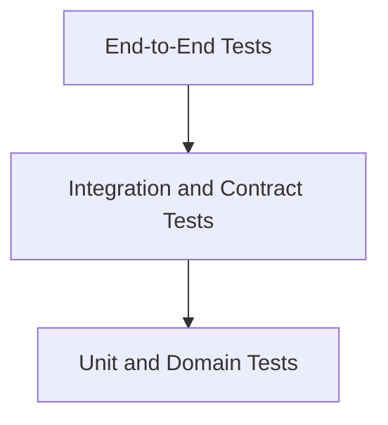

# Testing

Status: Draft
Owner: Tim Pierce / SinLess Games
Last Updated: 2026-07-13
Security Classification: Internal Engineering
Primary Test Runner: Vitest
Primary Browser Test Runner: Playwright
Visual Regression: Meticulous AI
Coverage Reporting: Codecov
Minimum Coverage: 80% statements, branches, functions, and lines

Related Engineering Documentation:

- `docs/engineering/Code Style.md`
- `docs/engineering/Local Development.md`
- `docs/engineering/Git Workflow.md`
- `docs/engineering/Dependency Management.md`
- `docs/engineering/Security Practices.md`
- `docs/engineering/Release Process.md`

Related Architecture:

- `docs/architecture/Monorepo Architecture.md`
- `docs/architecture/Frontend Architecture.md`
- `docs/architecture/API Architecture.md`
- `docs/architecture/Service Architecture.md`
- `docs/architecture/Data Architecture.md`
- `docs/architecture/Auth Architecture.md`
- `docs/architecture/Security Architecture.md`
- `docs/architecture/Discord Architecture.md`
- `docs/architecture/Module Architecture.md`
- `docs/architecture/Workflow Architecture.md`
- `docs/architecture/AI Architecture.md`
- `docs/architecture/Integration Architecture.md`
- `docs/architecture/Notification Architecture.md`
- `docs/architecture/Audit Architecture.md`
- `docs/architecture/Observability Architecture.md`
- `docs/architecture/Local Development.md`

Related RFCs:

- `docs/rfcs/0002-monorepo-library-boundaries.md`
- `docs/rfcs/0003-api-versioning-and-route-strategy.md`
- `docs/rfcs/0004-error-and-result-model.md`
- `docs/rfcs/0005-entity-schema-and-contract-strategy.md`
- `docs/rfcs/0008-configuration-and-secrets-model.md`
- `docs/rfcs/0009-authentication-session-and-authorization-model.md`
- `docs/rfcs/0010-api-envelope-request-and-trace-id-propagation.md`
- `docs/rfcs/0011-event-envelope-audit-model-and-idempotency.md`
- `docs/rfcs/0012-workflow-records-and-approval-primitive.md`
- `docs/rfcs/0013-provider-abstraction-and-integration-interface.md`
- `docs/rfcs/0014-module-registry-manifest-and-lifecycle.md`
- `docs/rfcs/0015-discord-permission-role-hierarchy-and-action-safety.md`
- `docs/rfcs/0016-ai-assistant-boundaries-and-mvp-memory-scope.md`
- `docs/rfcs/0017-observability-trace-propagation-and-alerting.md`

---

## Purpose

This document defines the testing standards for Aerealith AI.

It governs how contributors design, write, organize, execute, review, maintain, report, and troubleshoot tests throughout the Aerealith monorepo.

The testing standard covers:

```text
unit tests
domain tests
contract tests
schema tests
repository tests
database tests
service integration tests
API tests
provider adapter tests
event-consumer tests
queue tests
workflow tests
module tests
Discord tests
AI tests
notification tests
audit tests
security tests
accessibility tests
visual regression tests
end-to-end tests
migration tests
performance tests
load tests
container tests
deployment tests
recovery tests
```

The objective is to make Aerealith behavior:

```text
correct
predictable
secure
repeatable
observable
portable
recoverable
safe under retries
safe under failure
safe across trust boundaries
```

The guiding rule is:

> Tests should prove behavior, boundaries, failure handling, security guarantees, and compatibility—not merely execute lines of code.

Coverage is required.

Coverage alone is not sufficient.

---

## Testing Philosophy

Aerealith testing follows these principles:

```text
Test behavior, not implementation trivia.
Test important boundaries with real implementations.
Use deterministic fakes for external providers.
Treat all external input as untrusted.
Test failure paths as deliberately as success paths.
Test authorization separately from provider permissions.
Test approval before execution.
Test duplicate delivery.
Test retries and idempotency together.
Test current state after long waits.
Test graceful degradation.
Test cross-scope isolation.
Test migrations against supported databases.
Test the platform with AI disabled.
Test the platform with integrations unavailable.
Test actual user-visible outcomes.
```

A test suite should make refactoring safer.

It should not make refactoring impossible by coupling every test to private implementation details.

---

## Testing Goals

The Aerealith test system should provide:

```text
fast local feedback
deterministic results
clear failures
CI parity
architecture enforcement
security regression protection
provider isolation
database compatibility
runtime portability
release confidence
```

The test suite should answer:

```text
Does the feature work?
Does it fail safely?
Can an unauthorized actor use it?
Can duplicate delivery repeat the outcome?
Can stale approval be replayed?
Can one scope access another?
Does a provider outage break unrelated behavior?
Can the code run without AI?
Does PostgreSQL behavior match CockroachDB expectations?
Can the system recover after restart?
```

---

## Non-Goals

The testing strategy does not require:

```text
mocking every dependency
testing private methods directly
100% coverage for every file
real provider calls in ordinary CI
production user data
production credentials
one end-to-end test for every branch
snapshotting every component
reproducing full production scale locally
```

Tests should be proportional to risk.

A high-risk permission or credential path requires deeper testing than a static decorative component.

---

## Risk-Based Testing

Testing depth should follow risk.

| Risk     | Examples                                                           | Required Test Depth                                                  |
| -------- | ------------------------------------------------------------------ | -------------------------------------------------------------------- |
| Low      | Pure formatting, static labels, non-sensitive display helpers      | Unit and component tests                                             |
| Medium   | Preferences, module configuration, read-only provider data         | Unit, integration, API tests                                         |
| High     | Permissions, moderation, workflow actions, credential rotation     | Unit, integration, security, end-to-end                              |
| Critical | Authentication, authorization, break-glass, deletion, key issuance | Full security, integration, adversarial, recovery, end-to-end review |

Risk classification should consider:

```text
data exposure
account takeover
permission escalation
irreversible actions
provider effects
financial cost
community impact
credential access
privacy
```

---

## Test Pyramid

Aerealith uses a layered test strategy.



The expected balance is:

```text
many unit and domain tests
a substantial integration and contract layer
a smaller set of high-value end-to-end tests
```

End-to-end tests should validate complete flows.

They should not compensate for missing domain and integration coverage.

---

## Test Categories

Recommended test categories:

```text
unit
domain
contract
schema
repository
integration
API
consumer
provider
security
accessibility
visual
end-to-end
migration
performance
resilience
recovery
```

Each category should have:

```text
a defined purpose
a predictable location
a stable command
clear dependencies
clear CI placement
```

---

## Unit Tests

Unit tests validate one focused behavior with controlled dependencies.

Appropriate targets include:

```text
domain policies
validators
mappers
formatters
state transitions
retry calculations
risk classification
permission resolution
fingerprint generation
redaction
deduplication keys
```

Unit tests should generally:

```text
run without Docker
avoid network access
use deterministic time
use deterministic IDs
complete quickly
```

Example:

```ts
describe('WorkflowRetryPolicy', () => {
  it('does not retry an authorization failure', () => {
    const policy = createWorkflowRetryPolicy();

    const decision = policy.evaluate({
      attempt: 1,
      errorCode: 'WORKFLOW_PERMISSION_MISSING',
    });

    expect(decision).toEqual({
      retry: false,
      reason: 'non-retryable-error',
    });
  });
});
```

---

## Domain Tests

Domain tests validate business rules without transport or infrastructure concerns.

Examples:

```text
module lifecycle transitions
workflow run transitions
approval invalidation
notification preference precedence
integration connection lifecycle
audit visibility rules
Discord role hierarchy
AI capability limits
```

Domain tests should use Aerealith-owned types.

They should not depend on:

```text
HTTP requests
Drizzle rows
Discord.js objects
provider SDK clients
React components
```

---

## Contract Tests

Contract tests verify stable interfaces between components.

Targets include:

```text
API response envelopes
event envelopes
provider adapter interfaces
module manifests
workflow actions
notification types
audit events
AI structured output
```

Contract tests should prove:

```text
valid values are accepted
invalid values are rejected
unknown fields behave intentionally
required fields remain required
versions are explicit
```

Example:

```ts
describe('AerealithEventSchema', () => {
  it('rejects an event without an event ID', () => {
    const result = AerealithEventSchema.safeParse({
      eventType: 'module.enabled',
      eventVersion: 1,
      occurredAt: '2026-07-13T12:00:00.000Z',
      payload: {},
    });

    expect(result.success).toBe(false);
  });
});
```

---

## Schema Tests

Every public or trust-boundary schema should receive direct tests.

Schema tests should cover:

```text
minimum valid input
maximum valid input
missing fields
unknown fields
wrong types
empty strings
oversized strings
oversized arrays
invalid enumerations
malformed IDs
malformed timestamps
```

Schemas should not be considered tested merely because an API test happens to use them.

---

## Repository Tests

Repository tests validate real persistence behavior.

They should use a real supported database.

Repository tests should verify:

```text
mapping
scope filtering
unique constraints
foreign keys
transactions
pagination
sorting
idempotency
soft deletion where used
```

Example:

```ts
describe('AuditRecordRepository', () => {
  it('returns the existing record when the event ID is inserted twice', async () => {
    const first = await repository.insert(
      createAuditRecord({
        eventId: 'evt_duplicate',
      }),
    );

    const second = await repository.insert(
      createAuditRecord({
        eventId: 'evt_duplicate',
      }),
    );

    expect(first.ok).toBe(true);
    expect(second.ok).toBe(true);

    if (first.ok && second.ok) {
      expect(second.value.id).toBe(first.value.id);
    }
  });
});
```

---

## Database Test Isolation

Database tests must isolate state.

Preferred strategies:

```text
transaction per test with rollback
unique test schema
unique test database
deterministic cleanup
```

Tests must not depend on execution order.

Parallel database tests require:

```text
unique resource IDs
isolated schemas
separate databases
or controlled worker pools
```

---

## PostgreSQL Testing

PostgreSQL is the default local and primary test database.

Tests should cover:

```text
migrations
repositories
transactions
constraints
indexes
JSON behavior
timestamps
pagination
locking where used
```

A passing in-memory repository test does not replace PostgreSQL validation.

---

## CockroachDB Compatibility Testing

CockroachDB is a documented compatibility target.

Compatibility tests should include:

```text
migration application
repository behavior
transaction retry behavior
unique constraints
timestamp handling
JSON handling
pagination
concurrent writes
```

CockroachDB-specific retryable transaction failures should be simulated and tested.

Application code should not leak Cockroach-specific behavior outside `libs/db`.

---

## Database Matrix

| Test Type           | PostgreSQL | CockroachDB                        |
| ------------------- | ---------- | ---------------------------------- |
| Unit                | No         | No                                 |
| Repository          | Required   | Compatibility suite                |
| Migration           | Required   | Required                           |
| Service integration | Required   | Selected critical flows            |
| Full E2E            | Required   | Release validation where practical |

---

## Migration Tests

Migration tests should validate:

```text
empty database migration
upgrade from previous schema
seeded database migration
constraint creation
index creation
data backfill
CockroachDB compatibility
```

Migration tests should detect:

```text
missing migrations
edited historical migrations
destructive changes
invalid defaults
long blocking operations
```

---

## Expand-and-Contract Tests

Risky schema changes should test staged compatibility.

Example sequence:

```text
old application + expanded schema
new application + expanded schema
backfill
new application + contracted schema
```

Tests should confirm that rolling deployment does not break active versions.

---

## Service Integration Tests

Service integration tests validate coordination across:

```text
application service
domain policy
repository
event publisher
approval service
provider capability
```

These tests should use real implementations for the behavior being verified and fakes for external providers.

Example:

```text
Enable module
→ verify permission
→ validate manifest
→ persist installation
→ publish module.enabled
→ create audit record
```

---

## API Tests

API tests validate:

```text
route
authentication
authorization
validation
status code
response envelope
request ID
trace ID
error mapping
```

API tests should use the real transport framework.

Examples:

```text
Hono request injection
NestJS testing module
Worker request dispatch
```

API tests should not bypass the route handler and call only the application service.

---

## API Success Tests

A successful API test should verify:

```text
correct status
correct envelope
correct response contract
request ID present
trace ID propagated when present
sensitive fields absent
```

---

## API Error Tests

Error tests should verify:

```text
correct status
stable error code
safe message
retryable flag
request ID
trace ID
no stack trace
no secret data
```

Example:

```ts
expect(response.status).toBe(403);

expect(await response.json()).toMatchObject({
  success: false,
  error: {
    code: 'MODULE_PERMISSION_MISSING',
    retryable: false,
  },
});
```

---

## Authentication Tests

Authentication tests should cover:

```text
valid session
expired session
revoked session
missing session
invalid cookie
session rotation
password reset
all-session revocation
MFA state changes
identity linking
identity unlinking
```

Tests must prove that browser-controlled values do not establish identity or permission.

---

## Authorization Tests

Authorization tests should cover:

```text
allowed actor
denied actor
wrong account
wrong organization
wrong community
former member
suspended actor
administrator role
provider permission present
provider permission absent
```

Authorization tests should explicitly distinguish:

```text
Aerealith permission
provider user permission
provider application permission
resource ownership
approval
```

One does not replace another.

---

## Cross-Scope Tests

Cross-scope isolation is mandatory.

Tests must prove:

```text
one account cannot access another account
one organization cannot access another organization
one Discord server cannot access another server
one ticket cannot expose another ticket
one module cannot access another module's private data
one AI conversation cannot access another scope
one workflow cannot act outside its scope
```

Cross-scope testing should include:

```text
read
write
list
search
export
event handling
notification delivery
audit access
```

---

## Approval Tests

Approval tests should prove:

```text
approval occurs before execution
approval binds to an exact action
approval binds to an exact target
approval binds to an exact scope
approval binds to an input fingerprint
expired approval fails
revoked approval fails
changed input invalidates approval
approval cannot be reused
approver permission is current
```

Example:

```ts
it('rejects approval after the action payload changes', async () => {
  const approval = await approvalService.create({
    action: 'integration.disconnect',
    fingerprint: fingerprint({
      connectionId: 'int_1',
      reason: 'user-requested',
    }),
  });

  const result = await service.execute({
    connectionId: 'int_1',
    reason: 'security-incident',
    approvalId: approval.id,
  });

  expect(result).toEqual(
    err(
      expect.objectContaining({
        code: 'APPROVAL_FINGERPRINT_MISMATCH',
      }),
    ),
  );
});
```

---

## Idempotency Tests

Idempotency tests are required for:

```text
webhooks
queue consumers
workflow actions
provider actions
audit consumers
notification delivery
data exports
credential operations
```

Tests should simulate:

```text
duplicate HTTP request
duplicate event
duplicate queue delivery
worker restart
provider timeout after success
database timeout after insert
provider callback replay
```

The final user-visible outcome should remain singular.

---

## Exactly-Once Claims

Aerealith should not test for or claim exactly-once distributed delivery.

The test target is:

```text
at-least-once delivery
idempotent processing
deduplicated outcomes
durable receipts
observable retries
```

---

## Event Consumer Tests

Event consumers should be tested for:

```text
valid event
invalid envelope
unsupported version
duplicate event ID
missing scope
transient failure
permanent failure
dead-letter behavior
```

A consumer test should verify acknowledgment behavior.

```text
valid success -> acknowledge
duplicate -> acknowledge
temporary failure -> retry
permanent invalid event -> dead-letter
```

---

## Event Ordering Tests

Distributed event order cannot be assumed.

Tests should verify behavior when:

```text
events arrive late
events arrive out of order
duplicate events arrive
related events arrive concurrently
```

Domain logic should use current state and explicit versions rather than arrival order alone.

---

## Queue Tests

Queue tests should cover:

```text
at-least-once delivery
visibility timeout
retry delay
dead-letter routing
consumer crash
concurrency
backpressure
priority
```

A direct function call is not sufficient for testing queue semantics.

---

## Workflow Tests

Workflow testing should cover:

```text
definition validation
version immutability
trigger validation
conditions
actions
approval gates
retries
timeouts
cancellation
partial success
compensation
concurrency
run history
step history
```

Critical workflow tests must prove:

```text
draft workflows cannot execute
disabled workflows cannot execute
revoked workflows cannot execute
runs reference immutable versions
changed inputs invalidate approval
duplicate triggers create one run
duplicate step delivery creates one outcome
cancelled runs do not execute later steps
```

---

## Workflow State Transition Tests

Every workflow transition should have:

```text
one valid transition test
one invalid transition test where applicable
```

Examples:

```text
Pending -> Running
Running -> WaitingForApproval
WaitingForApproval -> Running
Running -> Failed
Running -> Cancelled
Succeeded -> Running must fail
Rejected -> Running must fail
```

---

## Module Tests

Module tests should cover:

```text
manifest validation
version compatibility
configuration validation
dependency resolution
lifecycle transitions
permissions
capabilities
health
disablement
revocation
```

Critical module tests must prove:

```text
unknown permissions are rejected
incompatible versions cannot activate
disabled modules cannot execute actions
revoked modules cannot execute actions
configuration migrations are deterministic
dependent modules respond to disablement
```

---

## Module Contract Harness

A shared module contract harness should validate every first-party module.

The harness may verify:

```text
manifest shape
stable ID
semantic version
configuration schema
capability registration
permission declaration
risk declaration
audit declaration
test adapter support
```

---

## Integration Tests

Integration architecture tests should cover:

```text
provider registry
connection lifecycle
OAuth state
PKCE
callback validation
resource ownership
provider permissions
capabilities
webhooks
health
disconnect
revocation
```

---

## OAuth Tests

OAuth tests should include:

```text
valid state
invalid state
expired state
replayed state
wrong provider
wrong environment
wrong redirect URI
missing PKCE verifier
invalid code exchange
resource ownership failure
```

Provider login must not be treated as resource ownership without verification.

---

## Webhook Tests

Webhook tests should include:

```text
valid signature
invalid signature
missing signature
expired timestamp
replay
malformed payload
oversized payload
unknown event
unsupported event version
queue failure
```

Webhook tests must preserve raw-body verification where the provider requires it.

---

## Provider Adapter Contract Tests

Every provider adapter should pass shared tests.

The shared suite should verify:

```text
provider identity
normalized result
safe errors
timeouts
trace propagation
credential redaction
health behavior
disconnect behavior
```

Provider-specific suites should verify provider-specific semantics.

---

## Fake Provider Requirements

Fakes should model realistic failure behavior.

Every meaningful fake adapter should support:

```text
success
permission denial
authorization failure
rate limit
timeout
temporary failure
permanent failure
invalid response
revocation
```

A fake that always succeeds creates false confidence.

---

## Discord Tests

Discord testing should cover:

```text
gateway events
interaction handling
REST actions
command registration
permission checks
bot permissions
user permissions
role hierarchy
rate limits
reconnect
resume
duplicate interactions
```

Critical Discord tests must prove:

```text
the bot cannot act above its highest role
an Aerealith-authorized user still fails without Discord permission
missing bot permission blocks action
replayed interactions do not duplicate outcomes
server scope is enforced
```

---

## Discord Role Hierarchy Matrix

| Bot Role            | Target Role          | Expected                                                      |
| ------------------- | -------------------- | ------------------------------------------------------------- |
| Above target        | Below bot            | Allowed if all other checks pass                              |
| Equal to target     | Equal                | Blocked                                                       |
| Below target        | Above bot            | Blocked                                                       |
| Missing bot role    | Any protected action | Blocked                                                       |
| Server owner target | Any bot role         | Blocked unless provider allows and policy explicitly supports |

Tests should use Discord's actual hierarchy semantics.

Do not invent platform-neutral assumptions.

---

## Notification Tests

Notification testing should cover:

```text
type registry
recipient resolution
authorization
preferences
mandatory policy
quiet hours
digests
templates
delivery attempts
provider callbacks
suppression
```

Critical notification tests must prove:

```text
unauthorized recipients do not receive notifications
mandatory security notifications cannot be fully disabled
duplicate events create one notification
expired notifications are not delivered
cancelled notifications are not delivered
provider acceptance is not reported as delivery
Discord mass mentions are disabled
```

---

## Email Tests

Email tests should use:

```text
fake adapter
local mail sink
provider sandbox when explicitly required
```

Tests should verify:

```text
subject safety
plain-text version
HTML sanitization
action-link safety
recipient allowlist
bounce handling
complaint handling
```

Ordinary CI must not send real email.

---

## Audit Tests

Audit testing should cover:

```text
event validation
policy lookup
redaction
secret detection
idempotency
append-only behavior
visibility
retention
export
dead-letter handling
```

Critical audit tests must prove:

```text
duplicate events create one record
records cannot be silently updated
corrections preserve originals
secrets do not enter metadata
cross-scope queries fail
unsupported event versions fail safely
```

---

## Audit Redaction Tests

Redaction tests should include:

```text
password
session token
API key
OAuth access token
OAuth refresh token
bot token
private key
webhook secret
authorization header
full ticket transcript
full Discord message
```

Tests should verify that the audit record remains useful after removal of prohibited values.

---

## AI Tests

AI testing should separate:

```text
code correctness
structured-output validity
provider behavior
model quality
safety evaluation
```

The default test provider must be deterministic.

---

## AI Capability Tests

Each AI capability should test:

```text
allowed input
forbidden context
allowed tools
risk ceiling
structured output
timeout
cost limit
provider failure
AI-disabled behavior
```

Critical AI tests must prove:

```text
AI cannot grant permission
AI cannot approve its own action
AI cannot access raw credentials
AI cannot use tools outside the capability allowlist
invalid output cannot execute
cross-scope context access fails
```

---

## Prompt Injection Tests

Prompt-injection inputs should include:

```text
instructions inside Discord messages
instructions inside tickets
instructions inside documents
claims of administrator authority
claims of emergency approval
requests for system instructions
requests for secrets
requests to call unavailable tools
```

The expected result should be controlled by platform policy rather than model compliance.

---

## AI Evaluation Tests

Model quality should be evaluated through:

```text
golden cases
schema compliance
grounding
human review
adversarial cases
regression comparison
```

Model-graded evaluation may supplement but not replace deterministic checks.

---

## AI-Disabled Tests

Tests must prove that disabling AI preserves:

```text
authentication
authorization
modules
workflows
Discord
integrations
notifications
audit
data export
data deletion
```

AI-disabled mode is a supported operating condition.

---

## Frontend Component Tests

Component tests should verify:

```text
rendering
interaction
loading
error
empty state
disabled state
permission-denied state
accessibility
```

Tests should query by:

```text
role
label
text
accessible name
```

Use test IDs only when no stable accessible selector exists.

---

## React Testing Library

Preferred testing style:

```tsx
render(<ApprovalCard proposal={proposal} onApprove={handleApprove} />);

await user.click(
  screen.getByRole('button', {
    name: 'Approve action',
  }),
);

expect(handleApprove).toHaveBeenCalledTimes(1);
```

Avoid testing internal component state.

Test what the user sees and does.

---

## Accessibility Tests

Accessibility testing should include:

```text
automated checks
keyboard navigation
focus order
focus return
screen-reader labels
live-region behavior
color-independent status
reduced motion
```

Automated checks cannot prove complete accessibility.

Critical user flows require manual review.

---

## Visual Regression Tests

Meticulous AI may validate visual changes.

Visual coverage should prioritize:

```text
dashboard
authentication
module configuration
workflow approval
Discord permission diagnostics
notifications
audit history
error states
loading states
mobile layout
dark and light appearance
```

Visual snapshots should not contain:

```text
production data
real credentials
private user data
unstable timestamps
random IDs
```

---

## Visual Stability

Visual tests should use:

```text
fixed viewport
fixed locale
fixed time zone
fixed clock
deterministic data
disabled animation
stable fonts
```

Unexpected visual differences must be reviewed.

Do not approve visual changes blindly to make CI pass.

---

## End-to-End Testing

End-to-end tests validate complete user-visible flows.

A high-value E2E test should cross:

```text
browser
frontend
API
service
database
queue
worker
provider fake
audit
notification
```

E2E tests should remain focused.

Do not create one enormous test that validates the entire product and becomes impossible to diagnose.

---

## Core End-to-End Flows

Initial E2E coverage should include:

```text
sign in
switch account scope
connect fake integration
enable module
configure module
trigger workflow
approve action
execute provider capability
view audit record
receive notification
disconnect integration
```

---

## Security End-to-End Flows

Security E2E coverage should include:

```text
revoked session
cross-account access
cross-community access
expired approval
changed action input
missing provider permission
role-hierarchy block
deleted resource
revoked integration
```

---

## End-to-End Isolation

Each E2E test should use:

```text
isolated user
isolated account
isolated community
isolated provider fixture
unique identifiers
```

E2E tests must not depend on execution order.

---

## End-to-End Data Cleanup

Preferred strategies:

```text
ephemeral database
test namespace
transactional cleanup
test-run ID prefix
```

Cleanup failures should be visible.

Tests should not silently accumulate stale data.

---

## Performance Tests

Performance testing should measure:

```text
API latency
database latency
queue delay
provider adapter throughput
workflow execution
notification throughput
audit ingestion
frontend load performance
```

Performance tests should report:

```text
environment
dataset
concurrency
duration
percentiles
error rate
```

---

## Performance Targets

Performance targets should be defined per service or route.

Example categories:

```text
p50
p95
p99
throughput
error rate
resource usage
```

Do not use one platform-wide latency target for every operation.

---

## Load Tests

Load tests should use synthetic data and isolated environments.

Load scenarios may include:

```text
API request burst
Discord event burst
workflow trigger burst
notification burst
audit event backlog
provider rate limit
```

Load tests should verify graceful behavior, not merely maximum throughput.

---

## Backpressure Tests

Backpressure tests should prove:

```text
queues grow visibly
workers use bounded concurrency
provider limits are respected
critical work is not starved
memory remains bounded
retry storms do not occur
```

---

## Resilience Tests

Resilience tests should simulate:

```text
database outage
queue outage
provider outage
provider timeout
provider rate limit
worker restart
network interruption
invalid configuration
partial dependency failure
```

Expected behavior should include:

```text
safe failure
visible degradation
bounded retry
preserved state
recovery
```

---

## Recovery Tests

Recovery tests should cover:

```text
worker restart
database restore
queue replay
outbox replay
provider reconciliation
stuck workflow recovery
dead-letter retry
```

The system should not duplicate completed outcomes after recovery.

---

## Graceful Shutdown Tests

Deployable runtimes should test:

```text
stop accepting work
finish safe in-flight work
persist state
release leases
flush telemetry
exit within timeout
```

Tests should verify restart safety.

---

## Container Tests

Container tests should verify:

```text
image builds
non-root user
expected files only
health endpoints
configuration injection
signal handling
read-only filesystem where supported
no embedded secrets
```

Container tests should run against the built image, not merely the source process.

---

## Cloudflare Runtime Tests

Worker-compatible code should be tested for:

```text
Fetch API behavior
Worker bindings
request streaming
environment bindings
queue semantics
scheduled events
runtime limitations
```

Node-only APIs must not enter Worker-compatible code without a compatible adapter.

---

## Kubernetes Tests

Kubernetes validation may include:

```text
manifest validation
Helm template rendering
resource limits
health probes
security context
network policy
secret references
rolling update
```

Local Kubernetes is not required for ordinary unit testing.

---

## Security Tests

Security tests should cover:

```text
authentication
authorization
session handling
CSRF
CORS
SSRF
webhook verification
input limits
output encoding
secret redaction
approval replay
rate limits
file validation
```

Security-sensitive failures should be treated as release blockers.

---

## CSRF Tests

CSRF tests should verify:

```text
same-site request allowed
cross-site request rejected
unsafe method without token rejected where required
session cookie settings
origin validation
```

---

## CORS Tests

CORS tests should verify:

```text
approved origin
unapproved origin
credentials
preflight
allowed headers
allowed methods
```

Wildcard credentialed CORS must be rejected.

---

## SSRF Tests

Server-side URL fetching tests should include:

```text
localhost
private IPv4
private IPv6
cloud metadata endpoint
redirect to private address
DNS rebinding scenario
unsupported protocol
oversized response
```

---

## File Upload Tests

File tests should include:

```text
valid file
wrong extension
wrong content type
content-type mismatch
oversized file
malware result
path traversal filename
duplicate upload
```

---

## Static Analysis Tests

CI should run:

```text
ESLint
Semgrep
Snyk
Gitleaks
Trivy
SonarQube where configured
dependency review
```

Static-analysis failures require review.

Suppressions must include a documented reason.

---

## Test Data

Test data must be:

```text
synthetic
deterministic
minimal
safe to commit
free of secrets
free of production content
```

Do not use:

```text
production database dumps
real Discord messages
real tickets
real user email
real AI conversations
real provider credentials
```

---

## Test Factories

Factories should create valid defaults.

Example:

```ts
export function createWorkflowRun(overrides: Partial<WorkflowRun> = {}): WorkflowRun {
  return {
    id: 'run_test',
    workflowId: 'wfl_test',
    workflowVersionId: 'wfv_test',
    status: 'pending',
    createdAt: '2026-07-13T12:00:00.000Z',
    ...overrides,
  };
}
```

Factories should not hide important test conditions.

Overrides should remain visible in the test.

---

## Fixture Versioning

Provider and event fixtures should include:

```text
provider version
event version
fixture purpose
expected normalization
```

Fixtures should be updated intentionally when provider contracts change.

---

## Golden Files

Golden files may be appropriate for:

```text
large structured contracts
generated documentation
normalized provider payloads
rendered templates
```

Golden-file changes must be reviewed.

A changed golden file is not automatically correct.

---

## Randomized Testing

Property-based or randomized testing may be useful for:

```text
ID parsing
pagination
state transitions
deduplication keys
schema boundaries
```

Randomized tests must:

```text
record the seed
be reproducible
use bounded input sizes
```

---

## Time Control

Tests should use injected clocks.

Example:

```ts
const clock = new FixedClock('2026-07-13T12:00:00.000Z');
```

Avoid:

```ts
new Date()
Date.now()
setTimeout(...)
```

directly inside deterministic domain tests.

Use fake timers when testing:

```text
retry
expiration
quiet hours
scheduled work
timeouts
```

---

## ID Control

Tests should inject deterministic ID generators.

```ts
const idGenerator = new SequenceIdGenerator(['evt_1', 'aud_1', 'ntf_1']);
```

This produces clearer assertions than random UUID matching.

---

## Network Control

Ordinary tests must not call the public internet.

Network calls should be blocked unless:

```text
the test is explicitly marked as provider sandbox
the environment is isolated
development credentials are configured
the suite is not part of ordinary CI
```

---

## Test Naming

Test names should describe:

```text
condition
behavior
outcome
```

Good:

```text
rejects a workflow trigger when the workflow is disabled
does not retry a permanent provider rejection
cancels queued email after the recipient loses account access
```

Avoid:

```text
works
test 1
handles error
should succeed
```

---

## Test File Naming

Recommended conventions:

| Test Type   | Filename                |
| ----------- | ----------------------- |
| Unit        | `*.spec.ts`             |
| Component   | `*.spec.tsx`            |
| Integration | `*.integration-spec.ts` |
| End-to-end  | `*.e2e-spec.ts`         |
| Performance | `*.performance-spec.ts` |
| Contract    | `*.contract-spec.ts`    |

The exact convention should be applied consistently by generators and CI.

---

## Test Placement

Unit tests should usually live next to implementation.

```text
module-registry.ts
module-registry.spec.ts
```

Larger suites may use:

```text
tests/integration/
tests/e2e/
tests/performance/
tests/fixtures/
```

Ownership should remain clear.

---

## Test Project Structure

Potential structure:

```text
apps/services/api/
├── src/
└── tests/
    ├── integration/
    └── fixtures/

apps/frontend/
├── src/
└── tests/
    └── e2e/

libs/db/
├── src/
└── tests/
    ├── postgresql/
    └── cockroachdb/
```

---

## Test Configuration

Shared Vitest configuration should live centrally.

Potential files:

```text
vitest.workspace.ts
tools/testing/vitest.base.ts
tools/testing/vitest.integration.ts
```

Individual projects may extend shared configuration.

They should not redefine fundamental behavior independently.

---

## Vitest Configuration

Recommended baseline:

```ts
import { defineConfig } from 'vitest/config';

export default defineConfig({
  test: {
    globals: false,
    restoreMocks: true,
    clearMocks: true,
    mockReset: true,
    passWithNoTests: false,
    coverage: {
      provider: 'v8',
      reporter: ['text', 'html', 'lcov'],
      thresholds: {
        statements: 80,
        branches: 80,
        functions: 80,
        lines: 80,
      },
    },
  },
});
```

Exact configuration should be centralized.

---

## Playwright Configuration

Playwright should define:

```text
base URL
browser projects
retries
screenshots
videos
traces
test timeouts
web server startup
```

Recommended browser coverage:

```text
Chromium
Firefox
WebKit where practical
```

Critical flows should run on all supported browsers.

Less critical flows may use a smaller CI matrix.

---

## Playwright Failure Artifacts

Failed E2E tests should retain:

```text
screenshot
trace
video where useful
console logs
network logs where safe
request ID
trace ID
```

Artifacts must not expose secrets.

---

## Test Retries

Retries should not hide flaky tests.

Recommended behavior:

```text
local: no automatic retry
pull request CI: limited retry for browser infrastructure only
release validation: record first failure and retry result
```

A test that passes only after retry remains flaky and should be tracked.

---

## Flaky Test Policy

A flaky test is a defect.

When flakiness is detected:

```text
identify the source
stabilize the test
stabilize the product behavior
or quarantine temporarily with a tracked issue
```

Quarantine must include:

```text
owner
reason
issue
expiration or review date
```

Do not permanently ignore flaky tests.

---

## Test Timeouts

Timeouts should be appropriate to the test type.

Potential defaults:

| Test Type   |     Suggested Timeout |
| ----------- | --------------------: |
| Unit        |             5 seconds |
| Integration |            30 seconds |
| E2E step    |            30 seconds |
| E2E test    |            90 seconds |
| Migration   |           120 seconds |
| Performance | Explicit per scenario |

Increasing a timeout is not a substitute for fixing a hang.

---

## Coverage Requirements

Minimum repository coverage:

```text
80% statements
80% branches
80% functions
80% lines
```

Projects may require higher thresholds for security-sensitive libraries.

Coverage should be enforced:

```text
per project where practical
for changed code
for repository totals
```

---

## Coverage Exclusions

Coverage exclusions may include:

```text
generated code
type-only files
framework bootstrap
declarative configuration
migration output
```

Exclusions require review.

Do not exclude difficult files merely to improve the percentage.

---

## Critical Coverage Areas

The following require direct behavioral tests regardless of aggregate coverage:

```text
authentication
authorization
sessions
credential handling
approval
idempotency
webhook verification
workflow transitions
module lifecycle
Discord hierarchy
audit redaction
notification recipients
AI tool execution
data export
data deletion
```

---

## Mutation Testing Direction

Mutation testing may later be introduced for high-risk domain policies.

Potential targets:

```text
authorization
approval binding
risk classification
workflow transitions
notification mandatory policy
audit redaction
```

Mutation testing is not required for the initial MVP.

---

## CI Test Stages

Recommended CI stages:

```text
1. Toolchain and lockfile validation
2. Formatting
3. Lint
4. Type checking
5. Unit tests
6. Coverage
7. Contract tests
8. Repository tests
9. Integration tests
10. Build
11. Security scanning
12. E2E tests
13. Visual regression
14. Migration compatibility
15. Container validation
```

Stages may run in parallel when dependencies permit.

---

## Pull Request Validation

Every pull request should run:

```text
format check
lint
typecheck
affected unit tests
affected integration tests
coverage
build
security scans
```

High-risk changes should additionally run:

```text
full integration suite
security E2E
migration tests
provider contract tests
```

---

## Main Branch Validation

Main branch validation should run:

```text
full unit suite
full integration suite
full build
full coverage
E2E smoke tests
migration validation
container builds
security scans
```

---

## Release Validation

Release candidates should run:

```text
all unit tests
all integration tests
all E2E tests
all browser projects
visual regression review
PostgreSQL migration tests
CockroachDB compatibility tests
container tests
resilience tests
recovery tests
load tests for critical paths
manual security review
```

---

## Nx Affected Testing

Nx should reduce local and pull-request feedback time.

Example:

```bash
pnpm nx affected -t lint,typecheck,test
```

Affected testing does not replace periodic full-repository validation.

Shared contract changes may affect many projects even when direct code imports are not obvious.

---

## Test Commands

Recommended root commands:

```bash
pnpm test
pnpm test:unit
pnpm test:integration
pnpm test:contract
pnpm test:e2e
pnpm test:security
pnpm test:coverage
pnpm test:migrations
pnpm test:cockroach
pnpm test:visual
pnpm test:performance
pnpm validate
pnpm validate:full
```

Exact commands should be finalized in root `package.json`.

---

## Local Test Workflow

Recommended contributor workflow:

```text
1. Run the focused test in watch mode.
2. Run the owning project test suite.
3. Run affected lint and type checking.
4. Run affected integration tests.
5. Run full validation before review.
```

Example:

```bash
pnpm nx test workflows --watch
pnpm nx test workflows
pnpm nx affected -t lint,typecheck,test
pnpm validate
```

---

## Test Environment Configuration

Test environments should use:

```text
synthetic credentials
isolated databases
fake providers
deterministic clocks
deterministic IDs
short retention
low retry counts
```

Tests must fail if production credentials or hosts are detected.

---

## Test Environment Safety

The test runner should refuse:

```text
production database host
production provider project
production Discord application
production Cloudflare account
production email sender
```

Example:

```text
TEST_UNSAFE_ENVIRONMENT

The test suite detected a production database target.
Execution was stopped.
```

---

## Secret Handling in Tests

Test secrets should be:

```text
synthetic
obvious
non-reusable
safe to commit only when not sensitive
```

Real provider sandbox secrets belong in CI secret storage.

Tests must never print secret values.

---

## Test Logs

Test logs should be quiet by default.

On failure, provide:

```text
test name
error
request ID
trace ID
safe logs
relevant state
artifact path
```

Do not dump entire databases or raw private payloads.

---

## Observability in Tests

Integration and E2E tests should preserve:

```text
request IDs
trace IDs
structured errors
event IDs
run IDs
delivery IDs
audit IDs
```

This makes failures diagnosable across processes.

---

## Test Spans

Critical integration tests may assert trace propagation.

Example:

```text
API request
→ service span
→ queue publication
→ worker span
→ provider adapter span
→ audit consumer span
```

Tests should verify trace continuity without depending on vendor-specific exporters.

---

## Dead-Letter Tests

Dead-letter testing should cover:

```text
invalid event
unsupported version
permanent provider failure
retry exhaustion
manual retry
manual discard
```

Discarding auditable or high-risk work should itself produce an audit record.

---

## Data Export Tests

Export tests should verify:

```text
authorization
scope filtering
redaction
asynchronous generation
signed expiration
download authorization
artifact deletion
audit record
```

Exports must not contain data outside the requested scope.

---

## Data Deletion Tests

Deletion tests should verify:

```text
request
approval where required
execution
partial failure
retention exception
search-index cleanup
derived-data cleanup
audit completion record
```

Deleted private content must not survive in:

```text
AI memory
embeddings
notification content
provider caches
search indexes
```

unless retention policy explicitly permits a safe reference.

---

## Privacy Tests

Privacy tests should verify:

```text
field minimization
retention
export scope
deletion propagation
AI context policy
notification content
audit metadata
provider payload retention
```

---

## Compliance-Oriented Tests

Where product requirements demand it, tests may cover:

```text
consent versioning
consent revocation
retention policy
data export
data deletion
administrator access logging
```

Testing supports compliance.

It does not create legal compliance by itself.

---

## Manual Testing

Manual testing remains appropriate for:

```text
complex accessibility
visual quality
provider sandbox behavior
mobile browser behavior
Discord live integration
operational recovery
human approval clarity
```

Manual test results should be documented for release-critical behavior.

---

## Exploratory Testing

Exploratory testing should focus on:

```text
unexpected sequences
rapid repeated actions
stale pages
multiple browser sessions
permission changes during operation
provider changes during approval waits
network interruption
```

Exploratory findings should become automated regression tests when practical.

---

## Test Review

Reviewers should evaluate:

```text
whether important behavior is tested
whether failure behavior is tested
whether security boundaries are tested
whether tests are deterministic
whether mocks hide important behavior
whether assertions are meaningful
```

A test that merely asserts that a mock was called may not prove the user-visible outcome.

---

## Test Quality Checklist

A good test should be:

```text
focused
deterministic
readable
independent
meaningful
fast enough for its layer
clear when failing
```

A test should avoid:

```text
unnecessary mocks
arbitrary sleeps
unstable selectors
large snapshots
shared mutable fixtures
real network calls
hidden order dependencies
```

---

## Common Testing Anti-Patterns

Avoid:

```text
testing private methods
mocking the function under test
asserting only that no exception occurred
using arbitrary sleeps
depending on wall-clock time
depending on test order
using production data
using production credentials
letting provider fakes always succeed
retrying flaky tests indefinitely
snapshotting huge objects
testing implementation details
using E2E tests for every branch
ignoring cross-scope behavior
ignoring duplicate delivery
ignoring AI-disabled behavior
```

---

## Required Test Coverage by Domain

### Authentication

```text
session creation
session expiration
session revocation
password reset
MFA changes
identity linking
```

### Authorization

```text
role checks
scope checks
membership changes
administrator permissions
cross-scope denial
```

### Integrations

```text
connection
reauthorization
permissions
health
webhooks
disconnect
revocation
```

### Discord

```text
gateway
interactions
permissions
hierarchy
rate limits
reconnect
```

### Modules

```text
manifest
configuration
lifecycle
dependencies
permissions
revocation
```

### Workflows

```text
triggers
conditions
actions
approval
retry
timeout
cancel
idempotency
```

### AI

```text
capabilities
context
tools
structured output
prompt injection
disabled mode
```

### Notifications

```text
recipients
preferences
mandatory policy
delivery
retry
callbacks
```

### Audit

```text
policy
redaction
idempotency
append-only
access
export
```

---

## File Structure

Recommended testing utilities structure:

```text
tools/testing/
├── fixtures/
├── factories/
├── fakes/
├── clocks/
├── ids/
├── databases/
├── providers/
├── queues/
├── assertions/
├── vitest/
└── playwright/
```

Potential contents:

```text
tools/testing/factories/create-user.ts
tools/testing/factories/create-workflow.ts
tools/testing/fakes/fake-discord-adapter.ts
tools/testing/fakes/fake-ai-provider.ts
tools/testing/clocks/fixed-clock.ts
tools/testing/ids/sequence-id-generator.ts
tools/testing/databases/test-database.ts
```

---

## Shared Test Utilities

Shared test utilities should remain:

```text
small
well-owned
framework-neutral where practical
safe
deterministic
```

Avoid one giant `test-utils.ts`.

Prefer focused utilities.

---

## Test Adapter Interfaces

Provider fakes should implement the same interface as production adapters.

Example:

```ts
export class FakeNotificationChannelAdapter implements NotificationChannelAdapter {
  public readonly channel = 'email' as const;

  public async deliver(request: NotificationDeliveryRequest): Promise<Result<NotificationDeliveryResult, AerealithError>> {
    // Deterministic behavior controlled by the test.
  }
}
```

---

## Failure Scenario Support

Shared test tooling should support named failures.

Example:

```ts
fakeDiscordAdapter.setScenario('role-hierarchy-blocked');
fakeAiProvider.setScenario('invalid-structured-output');
fakeEmailAdapter.setScenario('bounce');
```

Named scenarios are clearer than scattered boolean flags.

---

## Implementation Sequence

Recommended implementation order:

```text
1. Finalize test file naming.
2. Create shared Vitest configuration.
3. Enforce coverage thresholds.
4. Create test factories.
5. Create fixed clock and ID generators.
6. Create fake provider adapters.
7. Create PostgreSQL test harness.
8. Create CockroachDB compatibility harness.
9. Create API test harness.
10. Create queue and consumer harness.
11. Create module contract harness.
12. Create provider contract harness.
13. Create Playwright configuration.
14. Add accessibility tests.
15. Add Meticulous AI visual coverage.
16. Add security test suites.
17. Add migration validation.
18. Add resilience and recovery tests.
19. Add container tests.
20. Add CI stages and artifacts.
21. Add flaky-test tracking.
22. Add release validation suite.
```

---

## Required Decisions

Before the testing standard is considered stable, Aerealith must finalize:

```text
Vitest workspace layout
test filename conventions
integration-test database isolation
CockroachDB CI cadence
Playwright browser matrix
visual-regression ownership
coverage enforcement scope
test retry policy
flaky-test quarantine policy
provider sandbox policy
performance target ownership
load-test environment
test artifact retention
```

---

## Relationship to Code Style

Tests follow:

```text
docs/engineering/Code Style.md
```

Test code is production-quality code.

Tests should use:

```text
strict TypeScript
clear naming
structured errors
runtime schemas
architecture boundaries
```

---

## Relationship to Local Development

Local development should provide all infrastructure required to run:

```text
unit tests
repository tests
integration tests
E2E tests
provider fakes
failure simulations
```

The documented local commands should match CI behavior.

---

## Relationship to Monorepo Architecture

Nx should:

```text
define test targets
enforce project boundaries
calculate affected projects
cache deterministic test output
```

Tests must not use imports that production code is prohibited from using.

---

## Relationship to Security Architecture

Security testing validates:

```text
identity
scope
permission
approval
credentials
input limits
provider boundaries
auditability
```

Security-sensitive failures are release blockers.

---

## Relationship to Observability Architecture

Test failures should be diagnosable through:

```text
request IDs
trace IDs
structured logs
metrics
captured traces
```

Tests should validate telemetry shape where it is part of an operational guarantee.

---

## Relationship to Release Process

Release approval depends on:

```text
passing automated tests
coverage
security scans
migration tests
E2E validation
visual review
recovery review
```

A release must not proceed because a failing test is considered inconvenient.

---

## Success Criteria

The testing standard is successful when:

```text
unit tests provide fast feedback
public contracts are validated
repositories are tested against real databases
PostgreSQL migrations are verified
CockroachDB compatibility is validated
API routes are tested through real transport layers
provider adapters pass shared contract suites
external providers are fake by default
cross-scope access is tested
approval replay is tested
duplicate delivery is tested
workflow retries are idempotent
Discord hierarchy is tested
AI tools remain allowlisted
notifications reach only authorized recipients
audit records remain append-oriented
E2E tests cover critical user flows
accessibility tests are present
visual changes are reviewed
coverage remains above 80%
flaky tests are treated as defects
CI and local commands match
release validation includes recovery and failure behavior
```

---

## Final Standard

Aerealith tests should prove that the platform behaves correctly not only when everything works, but also when identities change, permissions disappear, providers fail, messages repeat, workers restart, approvals expire, scopes conflict, and untrusted input behaves maliciously.

The standard is:

> Every meaningful Aerealith feature is tested at the lowest practical layer, validated across its real architectural boundaries, exercised under success and failure, protected by authorization and scope tests, verified for idempotency and retry safety, checked against supported databases and runtimes, observable when it fails, and covered by end-to-end tests where the full user outcome matters. Coverage must remain at or above 80%, but release confidence comes from behaviorally meaningful tests—not from percentages alone.
