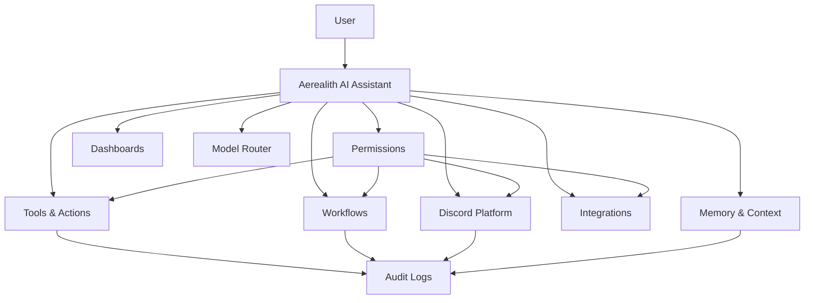
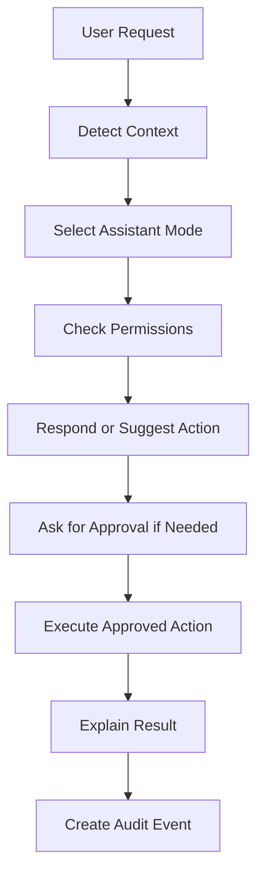
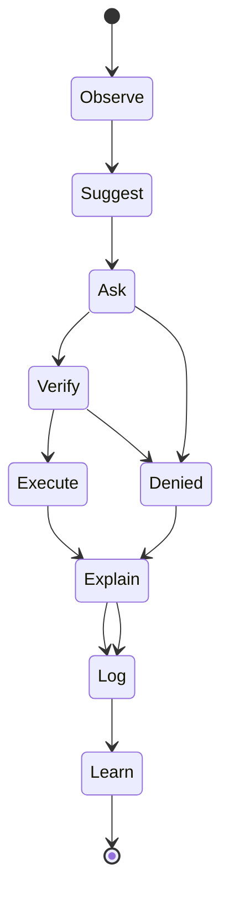
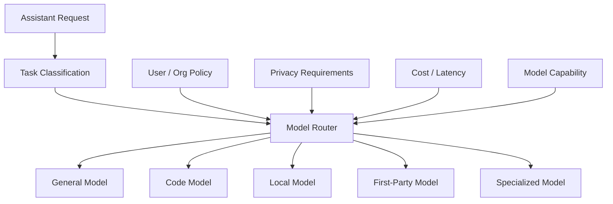

# AI Assistant

Aerealith AI includes a trusted assistant experience for understanding, organizing, and safely acting across the user’s digital life.

The assistant is not the whole product.

The assistant is the natural-language control layer for the broader Aerealith platform.

It helps users interact with accounts, Discord communities, workflows, automations, integrations, dashboards, memory, notifications, developer tools, and future platform capabilities through a secure, explainable, permissioned interface.

---

## Purpose

This document defines the Aerealith AI assistant as a product experience.

It explains:

- what the assistant is
- how the assistant should behave
- where the assistant appears
- how users customize it
- how memory works
- how tool access works
- how approval-based actions work
- how AI assists Discord communities
- how model routing should work
- how local and self-hosted models fit later
- what the assistant must never do
- what belongs in MVP, post-MVP, and future assistant scope

This document does not define model architecture, prompt internals, database schemas, vendor contracts, or AI training pipelines.

Those belong in separate technical, architecture, and operations documents.

---

## Product Position

Aerealith’s assistant is:

> A trusted AI interface for understanding, organizing, and safely acting across the user’s digital life.

It should help users:

- understand what is happening
- organize scattered digital context
- summarize important activity
- suggest useful actions
- create workflows
- manage Discord communities
- configure modules
- review tickets and logs
- understand dashboards
- automate repetitive work safely
- stay in control

The assistant should not be treated as a generic chatbot.

It is connected to the Aerealith platform, but only through permissioned, auditable, user-controlled access.

---

## Assistant Identity

The official assistant identity is:

```text
Aerealith AI
```

Users should eventually be able to customize how their assistant appears and communicates.

This may include:

- assistant nickname
- tone
- personality
- verbosity
- humor level
- technical depth
- formality
- emoji usage
- default explanation style
- preferred response format

The official product and bot identity should remain Aerealith AI.

Custom names and personalities are user experience layers, not separate products.

---

## Assistant Philosophy

The assistant should be helpful without becoming controlling.

Aerealith’s assistant should:

- explain before acting
- ask before meaningful actions
- verify risky actions
- log meaningful actions
- respect permissions
- respect user memory settings
- disclose AI involvement
- avoid hidden automation
- suggest automation only when useful
- remain useful even when AI is unavailable

The assistant exists to enhance users, not replace them.

---

## Core Principle

> The assistant may help users act, but it should not quietly take control.

Aerealith should never make the user wonder:

```text
What did it do?
Why did it do that?
What did it access?
Can I undo this?
Can I stop it from doing that again?
```

The product should answer those questions clearly.

---

## Assistant Role

The assistant can serve different roles depending on context.

| Role                            | Purpose                                                                                                   |
| ------------------------------- | --------------------------------------------------------------------------------------------------------- |
| Personal Digital-Life Assistant | Helps individuals manage tasks, memory, notifications, summaries, connected apps, and routines.           |
| Discord Community Assistant     | Helps owners and staff manage moderation, tickets, logs, settings, modules, and community health.         |
| Developer / Technical Assistant | Helps developers understand APIs, services, integrations, logs, projects, deployments, and documentation. |
| Workflow Automation Assistant   | Helps users identify repeated tasks and build safe workflows.                                             |
| Creator Assistant               | Helps creators manage announcements, content workflows, Discord communities, and engagement.              |
| Admin Assistant                 | Helps organization or server admins manage permissions, settings, audit logs, and policies.               |
| Support Assistant               | Helps summarize tickets, gather context, and suggest next steps.                                          |

The assistant should adapt to context instead of forcing every user into one interaction style.

---

## Assistant Surfaces

The assistant should appear across multiple product surfaces.

| Surface           | Status         | Purpose                                                                                        |
| ----------------- | -------------- | ---------------------------------------------------------------------------------------------- |
| Web App           | MVP            | Primary assistant chat, settings, action approvals, memory review, dashboard summaries.        |
| Discord           | MVP / Post-MVP | Staff summaries, moderation suggestions, ticket help, configuration help, community summaries. |
| Dashboard Widgets | MVP / Post-MVP | Contextual summaries, recommendations, next actions, alerts.                                   |
| API               | Post-MVP       | Programmatic assistant capabilities where safe.                                                |
| Developer Portal  | Post-MVP       | API help, integration guidance, docs assistance.                                               |
| Mobile App        | Future         | Portable assistant, approvals, alerts, quick actions, reminders.                               |
| Desktop App       | Future         | Local quick commands, notifications, workstation assistance.                                   |
| Browser Extension | Future         | Context-aware help inside websites, dashboards, docs, and tools.                               |
| Voice Interface   | Future         | Voice-based interaction and assistant control.                                                 |

---

## Assistant System Model



---

# Assistant Modes

Aerealith should support assistant modes.

Modes help the assistant adapt to the user’s current task, context, permissions, and expectations.

| Mode                    | Primary User                    | Purpose                                                                          |
| ----------------------- | ------------------------------- | -------------------------------------------------------------------------------- |
| Personal Mode           | Individual User                 | Personal organization, reminders, summaries, connected apps, memory, workflows.  |
| Discord Staff Mode      | Moderators / Staff              | Moderation context, tickets, logs, incident summaries, staff workflows.          |
| Discord Owner Mode      | Server Owners                   | Server health, module configuration, permissions, analytics, governance.         |
| Developer Mode          | Developers / Homelab Users      | APIs, logs, integrations, projects, technical workflows, infrastructure context. |
| Creator Mode            | Creators / Streamers            | Content workflows, announcements, community activity, engagement, schedules.     |
| Admin Mode              | Organization / Workspace Admins | Members, permissions, policies, audit logs, billing, governance.                 |
| Support Mode            | Support Staff                   | Tickets, user context, summaries, suggested replies, escalation.                 |
| Automation Builder Mode | Power Users                     | Workflow design, triggers, conditions, actions, approvals, dry runs.             |

Modes should not bypass safety rules.

A mode changes how the assistant communicates and what context it prioritizes.

A mode does not remove permission checks.

---

## Assistant Mode Flow



---

# Assistant Autonomy

The default assistant behavior should be controlled and trust-first.

## Default Autonomy

Aerealith should use this default model:

```text
Ask for meaningful or risky actions.
Allow low-risk actions only after permission.
Suggest before automating.
Verify before executing.
Explain after completion.
```

MVP should be more conservative.

MVP should lean toward:

```text
Suggest first.
Ask before action.
Verify risky actions.
Log meaningful actions.
```

---

## Autonomy Levels

| Level | Name                            | Behavior                                                        |
| ----- | ------------------------------- | --------------------------------------------------------------- |
| 0     | Disabled                        | Assistant is unavailable or turned off.                         |
| 1     | Answer Only                     | Assistant answers questions but cannot suggest actions.         |
| 2     | Suggest Only                    | Assistant can suggest actions but cannot execute them.          |
| 3     | Ask Every Time                  | Assistant asks before every action.                             |
| 4     | Permissioned Low-Risk Actions   | Assistant can perform approved low-risk actions within scope.   |
| 5     | Trusted Automation              | Assistant can run specific approved automations.                |
| 6     | Restricted Autonomous Operation | Future only, tightly scoped, logged, reversible where possible. |

The assistant should never jump users into higher autonomy levels without clear consent.

---

## Default Assistant Action Flow



The standard flow is:

```text
Observe → Suggest → Ask → Verify → Execute → Explain → Log → Learn
```

---

# Assistant Capabilities

## Core Capabilities

| Capability                | Status            | Description                                                                  |
| ------------------------- | ----------------- | ---------------------------------------------------------------------------- |
| Assistant Chat            | MVP               | Users can talk to the assistant through the web app.                         |
| Explainable Responses     | MVP               | Assistant explains answers, uncertainty, limits, and next steps.             |
| Action Suggestions        | MVP               | Assistant can suggest actions without executing them.                        |
| Approval-Based Actions    | MVP               | Assistant can request permission before executing supported actions.         |
| Basic Memory Use          | MVP               | Assistant can use user-approved memory and preferences.                      |
| Workflow Suggestions      | MVP               | Assistant can identify repeated behavior and suggest workflows.              |
| Discord Staff Summaries   | MVP / Post-MVP    | Assistant can summarize relevant Discord activity for staff.                 |
| Moderation Suggestions    | MVP / Post-MVP    | Assistant can suggest moderation actions but not automatically punish users. |
| Ticket Summaries          | Post-MVP          | Assistant can summarize ticket history and next steps.                       |
| Dashboard Summaries       | MVP / Post-MVP    | Assistant can summarize dashboard information.                               |
| Module Configuration Help | Post-MVP          | Assistant can help configure modules.                                        |
| Developer Help            | Post-MVP          | Assistant can help with APIs, docs, logs, and integrations.                  |
| Model Routing             | Post-MVP / Future | Assistant can route tasks to appropriate models.                             |
| Local Model Support       | Future            | Assistant can use local/self-hosted AI providers.                            |
| Voice Interaction         | Future            | Assistant can support voice-based interaction.                               |

---

# Memory & Context

Memory allows the assistant to become more useful over time.

Memory must be intentional, reviewable, editable, exportable, deletable, and scoped.

The assistant should remember useful context after permission.

It should not silently collect everything.

---

## Memory Default

The assistant should use this memory behavior:

```text
Useful context may be remembered after asking permission or through clearly configured settings.
```

The assistant should not assume that every interaction should become memory.

---

## Memory Types

| Memory Type          | Description                                                               |
| -------------------- | ------------------------------------------------------------------------- |
| User Preferences     | Preferred tone, formatting, assistant behavior, notification preferences. |
| Product Preferences  | Dashboard layout, enabled features, module preferences.                   |
| Personal Context     | User-approved information useful for future assistance.                   |
| Discord Context      | Server-specific settings, staff roles, modules, moderation preferences.   |
| Workflow Context     | Repeated tasks, workflow history, automation suggestions.                 |
| Project Context      | Developer/project details, repo preferences, documentation references.    |
| Organization Context | Shared policies, roles, workflows, and governance settings.               |

---

## Memory Scopes

| Scope          | Purpose                                                |
| -------------- | ------------------------------------------------------ |
| Personal       | Applies only to the individual user.                   |
| Discord Server | Applies only to one Discord guild.                     |
| Organization   | Applies to a shared organization or workspace.         |
| Project        | Applies to a specific project or repository.           |
| Integration    | Applies to a connected external service.               |
| Session        | Temporary context that should not be stored long-term. |

---

## Memory Controls

Users should be able to:

- review memories
- edit memories
- delete memories
- export memories
- disable memory
- scope memory
- approve memory creation
- revoke memory access
- see where memory was used
- separate personal, Discord, organization, and project memory

---

## Memory Safety Rules

The assistant must not:

- store secrets directly
- store sensitive personal information without clear need and consent
- use private data for training without explicit consent
- mix personal and organization memory without permission
- expose private memory to Discord communities
- expose server context to unrelated servers
- hide what it remembers
- make memory impossible to delete

---

# Personality & Customization

Users should be able to customize the assistant experience.

Personality affects presentation and communication.

Personality must not affect safety, truthfulness, permissions, or decision logic.

---

## Customization Options

| Option            | Description                                                 |
| ----------------- | ----------------------------------------------------------- |
| Nickname          | User-defined assistant nickname.                            |
| Tone              | Friendly, professional, concise, playful, technical, etc.   |
| Verbosity         | Short, balanced, detailed.                                  |
| Humor Level       | None, light, moderate.                                      |
| Technical Depth   | Beginner, intermediate, advanced.                           |
| Formality         | Casual, neutral, formal.                                    |
| Emoji Usage       | None, light, expressive.                                    |
| Explanation Style | Direct answer, step-by-step, summary-first, teaching style. |
| Default Mode      | Personal, Discord, Developer, Creator, Admin, etc.          |

---

## Customization Boundaries

Customization must not allow the assistant to:

- lie
- hide AI involvement
- pretend to be human
- bypass permissions
- ignore safety policies
- manipulate users
- produce hidden actions
- remove audit requirements
- silently train on private data
- impersonate staff without disclosure

---

# Tool Access

The assistant may access platform tools only through scoped permissions.

Tool access should be explicit, reviewable, revocable, and logged when meaningful.

---

## Supported Tool Areas

| Tool Area     | Examples                                                                                       |
| ------------- | ---------------------------------------------------------------------------------------------- |
| Discord       | Summaries, moderation suggestions, ticket summaries, module help, staff actions with approval. |
| Workflows     | Suggest workflows, create draft workflows, run approved workflows.                             |
| Notifications | Send reminders, ask for approvals, create summaries.                                           |
| Dashboards    | Summarize activity, explain metrics, suggest next actions.                                     |
| Integrations  | Connect context from external tools and suggest actions.                                       |
| API Actions   | Help developers use APIs or perform approved API actions.                                      |
| Memory        | Save, update, review, delete, or explain memory with permission.                               |
| Modules       | Explain, configure, enable, disable, or suggest modules with proper permissions.               |

---

## Tool Access Requirements

Before using a tool, the assistant should know:

- who is requesting the action
- what context the action belongs to
- what permission is required
- what risk level applies
- whether approval is needed
- whether the action is reversible
- what audit event will be created
- what data will be accessed
- what data will be changed

---

## Tool Action Risk Levels

| Risk     | Examples                                                         | Default Behavior                               |
| -------- | ---------------------------------------------------------------- | ---------------------------------------------- |
| Low      | Read dashboard summary, explain settings, draft response.        | Allowed if user has access.                    |
| Medium   | Send notification, create ticket summary, update workflow draft. | Ask or confirm depending on context.           |
| High     | Moderate user, change roles, close ticket, purge messages.       | Require explicit confirmation.                 |
| Critical | Billing, security settings, credentials, infrastructure changes. | Require elevated approval or block by default. |

---

# Approval-Based Actions

Meaningful assistant actions should require approval.

Approval prompts should be clear and specific.

---

## Approval Prompt Requirements

An approval prompt should explain:

- what action will happen
- where it will happen
- who or what will be affected
- what permissions are used
- whether AI is involved
- what data will be accessed
- whether the action can be undone
- what audit log will be created
- what happens if the action fails

Example:

```text
Aerealith wants to timeout @example-user for 10 minutes in Sinless Games.

Reason:
Repeated spam detected in #general.

This action will:
- apply a Discord timeout
- create a moderation case
- write an audit log
- notify configured staff channels

Do you approve?
```

---

# Automation Suggestions

The assistant should suggest automation when repeated user behavior indicates a clear pattern.

Automation should be earned, not assumed.

Examples:

```text
You have closed this type of ticket the same way 5 times.

Would you like Aerealith to create a workflow that drafts this close response for review?
```

```text
You check this server activity summary every morning.

Would you like a daily summary sent to you automatically?
```

---

## Automation Rules

The assistant must not:

- enable automation silently
- hide automated actions
- automate high-risk actions by default
- punish Discord users automatically in MVP
- create workflows without permission
- expand workflow permissions without review
- make automation hard to disable

---

# Discord Assistant Behavior

The assistant should be useful inside Discord, especially for staff and server owners.

It should support:

- staff summaries
- moderation suggestions
- ticket summaries
- rule explanations
- onboarding help
- configuration help
- community health summaries
- AI support helper later

Risky Discord actions should remain approval-based.

---

## Discord Assistant Features

| Feature                    | Status         | Notes                                                       |
| -------------------------- | -------------- | ----------------------------------------------------------- |
| Staff Summaries            | MVP / Post-MVP | Summarize relevant staff activity, tickets, and moderation. |
| Moderation Suggestions     | MVP / Post-MVP | Suggest possible actions, never auto-punish in MVP.         |
| Incident Summaries         | MVP / Post-MVP | Summarize context around a moderation incident.             |
| Ticket Summaries           | Post-MVP       | Summarize long support tickets.                             |
| Rule Explanation Help      | Post-MVP       | Explain server rules to members or staff.                   |
| Config Help                | Post-MVP       | Help admins configure modules and settings.                 |
| Community Health Summaries | Future         | Summarize server trends, risks, and engagement.             |
| AI Support Helper          | Future         | Assist with support responses under staff control.          |
| AI Moderation Assistant    | Future         | More advanced AI-supported moderation workflows.            |

---

## AI Moderation

AI should not automatically punish Discord users in MVP.

Automatic AI-based punishment may only be considered later with:

- explicit server owner opt-in
- strict server-defined rules
- clear action limits
- audit logs
- repeated approved behavior
- easy disable controls
- staff review tools
- appeal/support paths where appropriate

Default AI moderation should be:

```text
Summarize → Suggest → Ask Staff → Verify → Execute Approved Action → Log
```

---

# Developer Assistant Behavior

The assistant should help developers and technical users understand and use Aerealith.

Developer assistance may include:

- explaining APIs
- generating example requests
- summarizing logs
- explaining integration failures
- helping create workflows
- helping read documentation
- suggesting module patterns
- explaining deployment or self-hosting docs later
- helping troubleshoot connected services

Developer assistance should never leak secrets or expose data the user does not have permission to access.

---

# Model Routing

Aerealith should eventually support routing tasks to different AI models.

Model routing should be based on:

- task type
- model capability
- privacy requirements
- cost
- latency
- availability
- user preference
- organization policy
- safety requirements
- context length needs
- tool-use capability

Advanced model routing is post-MVP/future.

The product should not depend permanently on one provider.

---

## Model Routing Concept



---

## User Model Choice

Users should eventually be able to choose or configure AI providers.

This may include:

- default provider
- preferred model
- privacy mode
- cost limits
- local model preference
- organization-approved models
- fallback behavior
- disabled AI mode

Advanced model settings should be hidden from beginners by default and exposed for power users, organizations, and self-hosted deployments.

---

# Local and Self-Hosted Models

Local and self-hosted AI support should be a future product direction.

Self-hosted or local model support may allow:

- privacy-sensitive workflows
- offline-friendly workflows
- lower-cost inference
- user-controlled AI providers
- organization-controlled AI policies
- self-hosted deployments
- experimental first-party model use

Local model support should be presented honestly.

Aerealith should not claim local models can do everything cloud models can do.

---

# Assistant Audit Logs

Every meaningful assistant action should be logged.

Audit logs should include:

- suggested actions
- requested permissions
- approved actions
- denied actions
- executed actions
- failed actions
- memory created
- memory edited
- memory deleted
- workflow suggested
- workflow created
- workflow executed
- Discord moderation suggested
- Discord moderation executed
- ticket summarized
- module configuration changed
- integration action performed

---

## Assistant Audit Event Examples

```text
assistant.action.suggested
assistant.action.approval_requested
assistant.action.approved
assistant.action.denied
assistant.action.executed
assistant.action.failed
assistant.memory.created
assistant.memory.updated
assistant.memory.deleted
assistant.workflow.suggested
assistant.workflow.created
assistant.discord.moderation.suggested
assistant.discord.ticket.summarized
assistant.model.routed
assistant.tool.used
```

---

## Audit Record Shape

```json
{
  "event": "assistant.action.executed",
  "assistant_mode": "discord_staff",
  "actor": {
    "type": "user",
    "id": "user_..."
  },
  "context": {
    "type": "discord_guild",
    "id": "guild_..."
  },
  "action": {
    "type": "discord.timeout",
    "target": "discord_user_..."
  },
  "approval": {
    "required": true,
    "approved": true,
    "approved_by": "user_..."
  },
  "model": {
    "provider": "configured_provider",
    "model": "configured_model"
  },
  "risk_level": "high",
  "result": "success",
  "timestamp": "2026-01-01T00:00:00Z"
}
```

---

# User Controls

Users should be able to control the assistant.

Controls should include:

- enable/disable assistant
- choose assistant mode
- customize assistant style
- control memory
- review memory
- delete memory
- export memory
- manage tool access
- manage Discord assistant permissions
- manage workflow permissions
- manage automation suggestions
- manage notification behavior
- disable AI in specific contexts
- disable AI for specific servers/workspaces
- review assistant audit logs
- revoke assistant access

---

## Assistant Settings

Recommended settings:

| Setting                | Purpose                                          |
| ---------------------- | ------------------------------------------------ |
| Assistant Enabled      | Turns assistant on or off.                       |
| Default Mode           | Chooses default assistant mode.                  |
| Personality            | Controls communication style.                    |
| Verbosity              | Controls response length.                        |
| Technical Depth        | Controls explanation complexity.                 |
| Memory Enabled         | Allows or disables memory.                       |
| Memory Scope           | Controls where memory applies.                   |
| Tool Access            | Controls what tools assistant can use.           |
| Approval Requirements  | Controls when assistant must ask.                |
| Automation Suggestions | Enables/disables automation recommendations.     |
| AI in Discord          | Enables/disables Discord assistant behavior.     |
| Model Provider         | Advanced setting for choosing provider later.    |
| Privacy Mode           | Restricts what data can be sent to AI providers. |

---

# AI Availability and Graceful Degradation

Aerealith should remain useful if AI is unavailable.

If AI fails or is disabled, the platform should still support:

- login
- dashboard access
- Discord bot basics
- module settings
- workflow records
- manual workflows
- notifications
- audit logs
- tickets
- moderation tools
- role mapping
- integrations where possible
- API access where possible

AI should enhance the platform.

AI should not be the only thing holding the platform together.

---

## AI Failure Behavior

When AI is unavailable, Aerealith should:

- explain the outage or limitation
- avoid pretending the assistant worked
- fall back to manual controls
- preserve user data
- avoid losing approvals
- avoid partial hidden actions
- retry only when safe
- log failures where meaningful

---

# Safety & Trust Rules

The assistant must never:

- pretend to be human
- hide AI involvement
- train on private data without explicit consent
- manipulate users into subscriptions
- bypass permissions
- silently moderate users
- make irreversible changes without confirmation
- store secrets directly
- access unrelated data
- expose private memory to the wrong context
- act outside configured scope
- impersonate staff without disclosure
- create hidden automation
- make dark-pattern recommendations
- prioritize revenue over user trust

---

# Capability Boundaries

## Not Just a Chatbot

The assistant is more than chat, but it is not the entire product.

Aerealith should remain useful through dashboards, modules, workflows, APIs, and Discord tools even without AI.

## Not Fully Autonomous by Default

The assistant should not act like an uncontrolled agent.

Autonomy should be earned through approval, trust, permissions, and clear boundaries.

## Not a Human Replacement

The assistant should help users, staff, creators, developers, and admins.

It should not pretend to be a person or replace human responsibility.

## Not a Private Data Vacuum

The assistant should not collect or retain everything.

Memory should be useful, scoped, permissioned, and manageable.

## Not a Vendor-Locked AI Wrapper

Aerealith should support provider flexibility over time.

Model routing, local models, self-hosted models, and provider configuration should remain part of the long-term direction.

---

# MVP Assistant Scope

The MVP assistant should include:

```text
Web assistant chat
Basic assistant settings
Explainable responses
Action suggestions
Approval-based actions
Basic memory foundation
Discord staff summaries
Moderation suggestions, not automatic punishment
Ticket/context summaries
Workflow suggestions
Audit logs for assistant actions
AI availability fallback behavior
```

MVP should focus on trust, clarity, and usefulness.

It should not try to ship full autonomy.

---

# Post-MVP Assistant Scope

Post-MVP assistant expansion should include:

```text
Assistant modes
Memory review/edit/delete UI
Scoped memory
Advanced Discord summaries
Ticket summaries
Module configuration help
Workflow drafting
Workflow dry-run explanations
Developer assistant behavior
Integration summaries
Notification summaries
Dashboard insights
Basic model routing
Custom personality settings
Organization assistant settings
Privacy mode controls
```

---

# Future Assistant Scope

Future assistant capabilities may include:

```text
Advanced model routing
User-configured AI providers
Local model support
Self-hosted model support
Voice interface
Mobile assistant
Desktop assistant
Browser extension assistant
AI support helper
Advanced AI moderation assistant
Community health reports
Context graph reasoning
First-party Aerealith models
Organization policy-aware AI
Marketplace assistant skills
Long-term AI continuity research
```

Long-term AI research should avoid unsupported claims about sentience, consciousness, or personhood.

Aerealith may explore persistent, adaptive, explainable AI behavior without pretending the system is something it is not.

---

# Assistant Release Path

| Release                                | Assistant Focus                                                    |
| -------------------------------------- | ------------------------------------------------------------------ |
| 0.4 — Frontend Platform                | Web assistant UI foundation.                                       |
| 0.5 — API & Service Platform           | Assistant action and tool-access foundations.                      |
| 0.7 — Discord Platform Foundation      | Discord assistant groundwork.                                      |
| 0.8 — Community Operations             | Moderation and ticket assistance.                                  |
| 1.0 — Private Beta                     | Test assistant usefulness and trust model.                         |
| 1.1 — MVP Production Launch            | Stable MVP assistant capabilities.                                 |
| 1.3 — AI Assistant & Memory Foundation | Memory review, stronger assistant modes, model routing foundation. |
| 1.4 — Workflow Automation Builder      | Workflow drafting, automation suggestions, dry-run explanations.   |
| 1.7 — Digital Life OS Expansion        | Personal digital-life summaries and context graph foundations.     |
| 1.9 — Cloud Independence               | Provider abstraction and self-hosting preparation.                 |
| 2.0 — Self-Hosted Preview              | Local/self-hosted AI configuration paths.                          |

---

# Assistant Success Criteria

The assistant succeeds when users say:

```text
I understand what Aerealith is doing.
```

```text
I feel in control.
```

```text
The assistant saves me time without making me nervous.
```

```text
It remembers useful things, not creepy things.
```

```text
It asks before doing anything important.
```

```text
It helps my Discord staff without silently punishing people.
```

```text
It explains what happened when something fails.
```

```text
I can turn features off when I do not want them.
```

---

# Review Questions

Before adding an assistant feature, ask:

- Which persona does this serve?
- Which assistant mode does this belong to?
- What data does it need?
- What memory does it use?
- What permissions does it require?
- What risk level does it have?
- Does it need approval?
- Does it need verification?
- Is the action reversible?
- Does it need an audit log?
- Does it disclose AI involvement?
- Does it work without AI?
- Can the user disable it?
- Can the user understand it?
- Can the user revoke access?
- Does it reduce complexity without reducing control?

If the answer is unclear, the assistant feature is not ready.

---

# Final Standard

Aerealith’s assistant should make the platform easier to understand, easier to use, and easier to trust.

It should help users manage their digital life, Discord communities, workflows, integrations, dashboards, and automations without hiding what it is doing.

The assistant should be powerful, but permissioned.

Adaptive, but honest.

Helpful, but not manipulative.

Personalized, but not invasive.

Automated, but not uncontrolled.

Aerealith AI should feel like a trusted control layer for the user’s digital world — never a black box taking over behind the scenes.
