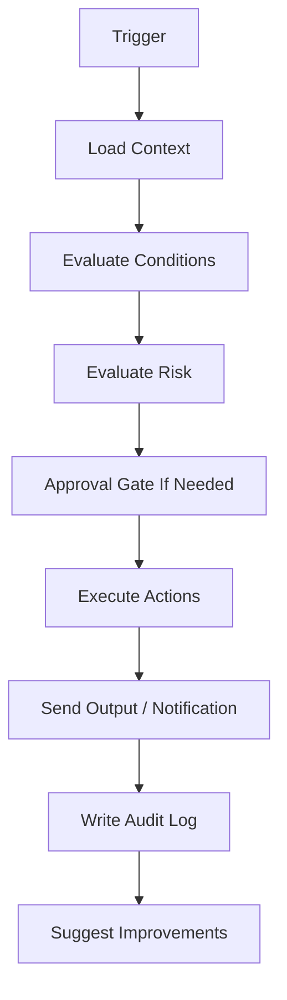
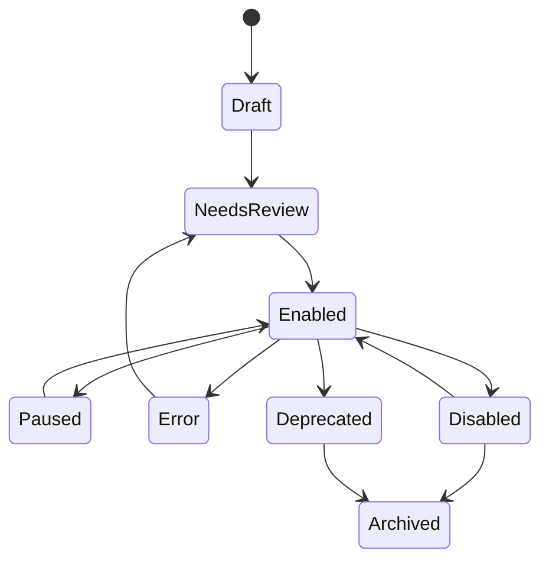
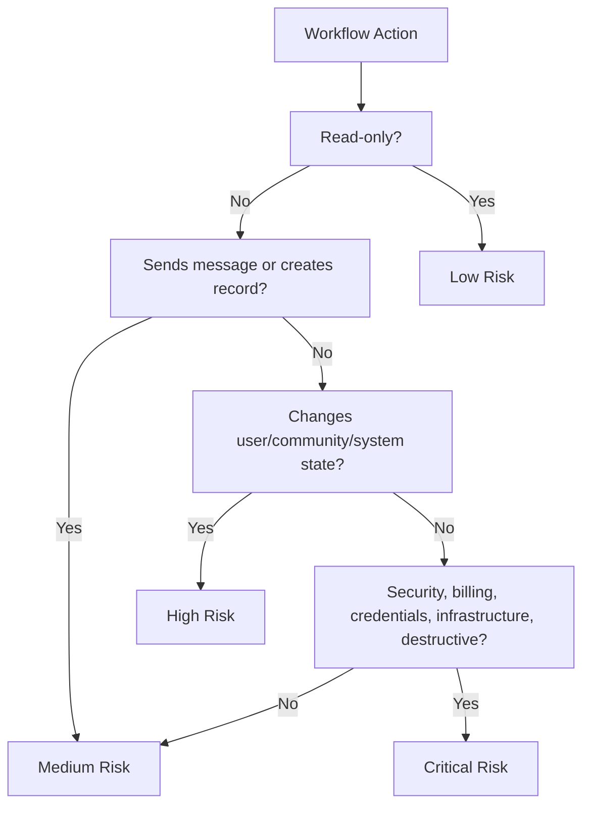
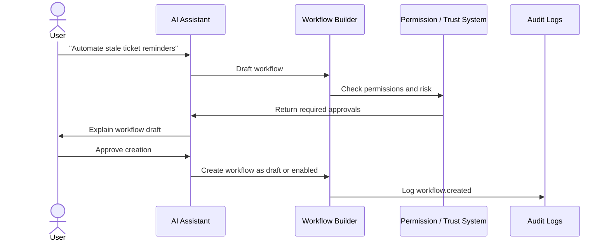

# Automation

Aerealith AI uses automation to reduce repetitive digital work without reducing user control.

Automation is not blind autonomy.

Automation in Aerealith should be permissioned, explainable, auditable, revocable, and safe by default.

The goal is simple:

> Let users automate the work they understand, approve, and trust.

---

## Purpose

This document defines automation as a product area inside Aerealith AI.

It explains:

- what automation means in Aerealith
- how workflows work
- how automation differs from AI autonomy
- how users create automations
- how Aerealith suggests automations
- how approval gates work
- how risk levels affect automation
- how Discord automation works
- how integrations connect to automation
- how automation is audited
- what belongs in MVP, post-MVP, and future scope

This document does not define the full workflow engine implementation, database schema, queue system, event bus, or runtime architecture.

Those belong in architecture and engineering documentation.

---

## Product Position

Automation in Aerealith is:

> A trusted workflow system for turning repeated digital actions into safe, controlled, auditable processes.

Automation should help users:

- save time
- reduce repetitive tasks
- connect services
- manage Discord communities
- respond to important events
- summarize activity
- route notifications
- trigger workflows
- coordinate staff actions
- reduce mistakes
- stay in control

Automation should never feel like the system is secretly acting behind the user’s back.

---

## Automation Philosophy

Aerealith automation should be:

- earned
- permissioned
- explainable
- auditable
- revocable
- scoped
- reversible where possible
- safe by default
- modular
- integration-aware
- dashboard-visible
- API-accessible where appropriate

Automation should begin with user intent.

Aerealith should not automate something just because it can.

---

## Core Principle

> Automation should reduce repetitive work, not remove user control.

Before Aerealith automates something, the user should understand:

- what will trigger it
- what it will do
- what data it will access
- what systems it will affect
- what permissions it requires
- whether it can be undone
- where it will be logged
- how to pause, edit, or delete it

---

## Key Terms

| Term          | Meaning                                                                                           |
| ------------- | ------------------------------------------------------------------------------------------------- |
| Workflow      | A defined process made of triggers, conditions, actions, approvals, and outputs.                  |
| Automation    | A workflow that can run without the user manually starting every step.                            |
| Trigger       | The event, schedule, or action that starts a workflow.                                            |
| Condition     | A rule that decides whether a workflow should continue or branch.                                 |
| Action        | Something the workflow does.                                                                      |
| Approval Gate | A required user/staff/admin approval before continuing.                                           |
| Dry Run       | A preview of what the workflow would do without actually doing it.                                |
| Execution Run | A specific instance of a workflow running.                                                        |
| Template      | A reusable workflow starting point.                                                               |
| Connector     | A supported integration that can provide triggers or actions.                                     |
| Scope         | The context where a workflow applies, such as personal, Discord server, organization, or project. |

---

## Automation Model



---

## Workflow Anatomy

A workflow should be understandable as a simple chain.

```text
When this happens,
if these conditions are true,
ask for approval if needed,
then do these actions,
then explain and log the result.
```

Example:

```text
When a Discord ticket has no staff response for 24 hours,
if the ticket is still open,
notify Support Staff,
then create an audit event.
```

---

## Workflow Structure

| Part          | Purpose                           | Example                          |
| ------------- | --------------------------------- | -------------------------------- |
| Name          | Human-readable workflow name.     | Stale Ticket Reminder            |
| Scope         | Where the workflow applies.       | Discord Server                   |
| Trigger       | What starts the workflow.         | Ticket inactive for 24 hours     |
| Conditions    | Rules that must pass.             | Ticket is open, not escalated    |
| Approval Gate | Optional required approval.       | Ask Manager before escalation    |
| Actions       | Steps the workflow performs.      | Notify support, tag ticket       |
| Outputs       | Visible results.                  | Discord message, dashboard alert |
| Audit Events  | Logged records.                   | workflow.executed                |
| Owner         | Who controls the workflow.        | Server Owner                     |
| Status        | Enabled, disabled, draft, paused. | Enabled                          |

---

## Automation vs AI Autonomy

Automation and AI autonomy are not the same thing.

Automation is defined, scoped, and predictable.

AI may help suggest, configure, summarize, or explain automation, but AI should not silently create uncontrolled behavior.

| Concept                  | Meaning                                                                              |
| ------------------------ | ------------------------------------------------------------------------------------ |
| Automation               | A controlled workflow with known triggers, rules, and actions.                       |
| AI Suggestion            | AI recommends an action or workflow.                                                 |
| AI-Assisted Workflow     | AI helps draft or explain workflow behavior.                                         |
| AI-Orchestrated Workflow | Future capability where AI helps coordinate workflow steps under strict permissions. |
| Uncontrolled Autonomy    | Not allowed by default.                                                              |

---

## Default Automation Rule

Aerealith should default to:

```text
Suggest first.
Ask before enabling.
Verify risky behavior.
Log every meaningful action.
Allow disabling at any time.
```

---

## Automation Scopes

Workflows must be scoped.

A workflow created in one context should not automatically apply everywhere.

| Scope                | Description                                    |
| -------------------- | ---------------------------------------------- |
| Personal             | Applies to one user.                           |
| Discord Server       | Applies to one Discord guild.                  |
| Organization         | Applies to a shared organization or workspace. |
| Project              | Applies to a project, repo, or environment.    |
| Integration          | Applies to a connected external service.       |
| Self-Hosted Instance | Applies to a self-hosted deployment.           |

Example:

```text
A moderation escalation workflow enabled for one Discord server does not apply to every Discord server connected to the same account.
```

---

## Workflow Status Model

| Status       | Meaning                                              |
| ------------ | ---------------------------------------------------- |
| Draft        | Workflow is being created but cannot run yet.        |
| Disabled     | Workflow exists but cannot run.                      |
| Enabled      | Workflow can run when triggered.                     |
| Paused       | Workflow is temporarily stopped.                     |
| Needs Review | Workflow requires owner/admin review before running. |
| Error        | Workflow failed and needs attention.                 |
| Deprecated   | Workflow is being replaced.                          |
| Archived     | Workflow is preserved but inactive.                  |

---

## Workflow Lifecycle



---

## Automation Risk Levels

Every workflow and action should have a risk level.

| Risk     | Meaning                                                                            | Examples                                                   | Default Behavior                         |
| -------- | ---------------------------------------------------------------------------------- | ---------------------------------------------------------- | ---------------------------------------- |
| Low      | Read-only or harmless actions.                                                     | Generate summary, show dashboard insight.                  | Can run with permissioned access.        |
| Medium   | Creates records or sends messages.                                                 | Send reminder, create ticket, post announcement.           | May require approval depending on scope. |
| High     | Changes user/community state.                                                      | Timeout user, change role, close ticket, purge messages.   | Requires explicit approval.              |
| Critical | Affects billing, security, credentials, infrastructure, or destructive operations. | Change security settings, billing actions, delete records. | Elevated approval or blocked by default. |

---

## Risk Evaluation



---

## Approval Gates

Approval gates are required checkpoints before a workflow continues.

Approval gates should be used when actions are risky, sensitive, unusual, irreversible, or policy-controlled.

---

## Approval Gate Types

| Gate                  | Purpose                                       |
| --------------------- | --------------------------------------------- |
| User Approval         | The individual user must approve.             |
| Server Owner Approval | Discord server owner must approve.            |
| Staff Approval        | A staff member must approve.                  |
| Admin Approval        | Workspace/org admin must approve.             |
| Multi-Approval        | More than one person must approve.            |
| Time-Limited Approval | Approval expires after a set time.            |
| Policy Approval       | Action must match organization/server policy. |
| Elevated Confirmation | Extra confirmation for high-risk actions.     |

---

## Approval Prompt Requirements

Approval prompts should explain:

- workflow name
- trigger
- proposed action
- target
- risk level
- permissions used
- expected result
- whether the action can be undone
- who requested it
- where it will be logged
- what happens if denied

Example:

```text
Workflow: Repeat Spam Escalation

Aerealith wants to timeout @example-user for 10 minutes.

Why:
The user triggered spam detection 3 times in 5 minutes.

This action will:
- apply a Discord timeout
- create a moderation case
- notify staff
- write an audit event

Risk level: High
Approval required: Moderator or higher

Approve?
```

---

## Triggers

Triggers start workflows.

Aerealith should support several trigger types over time.

| Trigger Type          | Status         | Examples                                                       |
| --------------------- | -------------- | -------------------------------------------------------------- |
| Manual Trigger        | MVP            | User manually runs workflow.                                   |
| Discord Event Trigger | MVP / Post-MVP | Ticket created, user warned, automod triggered.                |
| Schedule Trigger      | Post-MVP       | Daily summary, weekly report, recurring reminder.              |
| Webhook Trigger       | Post-MVP       | External service sends event.                                  |
| Integration Trigger   | Post-MVP       | GitHub issue opened, calendar event created, stream goes live. |
| System Trigger        | Post-MVP       | Service unhealthy, workflow failed, permission missing.        |
| AI-Suggested Trigger  | Future         | AI suggests a useful trigger from repeated behavior.           |

---

## Trigger Examples

```text
When a Discord ticket is created
When a ticket is stale for 24 hours
When a user receives 3 warnings
When a new member joins
When a creator goes live
Every weekday at 8 AM
When a GitHub issue is opened
When a workflow fails
When an integration disconnects
```

---

## Conditions

Conditions decide whether a workflow should continue.

| Condition Type        | Examples                                                |
| --------------------- | ------------------------------------------------------- |
| User Condition        | User has role, user is verified, user is staff.         |
| Discord Condition     | Channel is allowed, server module enabled, role exists. |
| Time Condition        | During quiet hours, after 24 hours, only weekdays.      |
| Count Condition       | User has 3 warnings, ticket has 0 replies.              |
| Integration Condition | GitHub issue has label, service is unhealthy.           |
| Permission Condition  | Actor has required role or permission.                  |
| Risk Condition        | Action risk is below configured threshold.              |

Example:

```text
If ticket is open
and no staff response exists
and ticket is older than 24 hours
then notify Support Staff.
```

---

## Actions

Actions are what workflows do.

Actions should be permissioned, logged, and scoped.

| Action Area   | Examples                                                                         |
| ------------- | -------------------------------------------------------------------------------- |
| Discord       | Send message, create ticket, close ticket, warn user, timeout user, assign role. |
| Notifications | Send alert, request approval, send digest, notify staff.                         |
| Workflows     | Start workflow, pause workflow, create follow-up task.                           |
| Dashboard     | Create alert, update status, show recommendation.                                |
| Memory        | Suggest memory, update approved memory, review memory.                           |
| Integrations  | Create issue, post update, fetch summary, sync state.                            |
| AI            | Summarize, draft response, suggest action, explain incident.                     |
| Admin         | Change setting, request approval, disable module.                                |

High-risk actions must require approval.

---

## Dry Runs

Aerealith should support dry runs.

A dry run previews what a workflow would do without executing actions.

Dry runs help users trust automation.

---

## Dry Run Output

A dry run should show:

- trigger used
- conditions evaluated
- actions that would run
- actions that would be skipped
- permissions required
- risk levels
- expected outputs
- audit events that would be created
- possible failures
- required approvals

Example:

```text
Dry Run: Stale Ticket Reminder

Trigger:
Ticket inactive for 24 hours.

Conditions:
✅ Ticket is open
✅ No staff response in 24 hours
✅ Support Staff role exists

Actions:
1. Send reminder to #staff-support
2. Add "stale" tag to ticket
3. Create audit event

No risky actions detected.
```

---

## Automation Suggestions

Aerealith should suggest automation when repeated user behavior shows a clear pattern.

Automation suggestions should be helpful, not pushy.

---

## Suggestion Examples

```text
You have manually closed this type of ticket the same way 5 times.

Would you like Aerealith to create a draft workflow that suggests this close response next time?
```

```text
You check this Discord activity summary every morning.

Would you like a daily summary sent to you automatically?
```

```text
You often notify staff when automod catches excessive mentions.

Would you like Aerealith to create a staff alert workflow?
```

---

## Suggestion Rules

The assistant may suggest automation when:

- a repeated pattern is detected
- the user has performed the action several times
- the workflow can be explained clearly
- the action is low or medium risk
- the user can approve before enabling
- the workflow can be disabled
- audit logs can be created

The assistant should not aggressively push automation.

---

## Discord Automation

Discord is one of the first major automation surfaces for Aerealith.

Discord automation should support moderation, tickets, onboarding, roles, engagement, music, announcements, analytics, and staff workflows.

---

## Discord Workflow Examples

| Workflow                  | Description                                                                 |
| ------------------------- | --------------------------------------------------------------------------- |
| Stale Ticket Reminder     | Notify support staff when a ticket has no response after a configured time. |
| Repeat Warning Escalation | Alert moderators when a user reaches a warning threshold.                   |
| Automod Staff Alert       | Notify staff when automod triggers repeatedly.                              |
| New Member Onboarding     | Send welcome message, assign New Member role, start verification.           |
| Level Role Reward         | Assign a role when a member reaches a level milestone.                      |
| Stream Announcement       | Post when a creator goes live.                                              |
| Giveaway End Reminder     | Notify event staff when a giveaway is ending.                               |
| Music Queue Cleanup       | Clear inactive music queue after a configured time.                         |
| Ticket Transcript Export  | Post or store transcript when ticket closes.                                |
| Raid Suspicion Alert      | Alert staff when join/message patterns look suspicious.                     |

---

## Discord Automation Safety

Discord automation must respect:

- Discord-native permissions
- role hierarchy
- Aerealith module permissions
- server configuration
- staff role mapping
- audit log requirements
- risk level approval rules
- Discord API limits
- user privacy
- server owner control

AI should not automatically punish Discord users in MVP.

---

## Workflow Templates

Templates help users start quickly.

Templates should be editable, explainable, and safe by default.

---

## Template Categories

| Category             | Examples                                                        |
| -------------------- | --------------------------------------------------------------- |
| Personal             | Daily brief, reminder routing, weekly review.                   |
| Discord Moderation   | Warning escalation, automod alert, purge review.                |
| Discord Tickets      | Stale ticket reminder, transcript on close, support escalation. |
| Discord Onboarding   | Welcome flow, verification reminder, role assignment.           |
| Community Engagement | Level role reward, event reminder, giveaway announcement.       |
| Creator              | Stream announcement, video post notification, community digest. |
| Developer            | GitHub issue summary, deployment alert, incident note.          |
| Operations           | Service health alert, error summary, incident workflow.         |

---

## Template Requirements

A template should include:

- name
- description
- recommended scope
- required modules
- required permissions
- risk level
- trigger
- conditions
- actions
- approval gates
- default settings
- customization points
- audit events
- disable behavior

---

## Workflow Builder

The workflow builder should support both beginners and power users.

MVP may start with simple workflow records and manual workflows.

Post-MVP should introduce a more complete builder.

---

## Builder Experience

The builder should allow users to define:

- workflow name
- scope
- trigger
- conditions
- actions
- approval gates
- notification routing
- failure behavior
- audit behavior
- enabled/disabled state

Beginner users should see guided setup.

Power users should get advanced controls.

---

## Builder Modes

| Mode                | Purpose                                                           |
| ------------------- | ----------------------------------------------------------------- |
| Guided Builder      | Beginner-friendly step-by-step creation.                          |
| Template Builder    | Start from preset workflows.                                      |
| Advanced Builder    | Configure triggers, conditions, actions, branches, and variables. |
| AI-Assisted Builder | Assistant drafts workflows from user intent.                      |
| API Builder         | Developers create or update workflows through APIs.               |

---

## AI-Assisted Automation

The AI assistant can help users create and understand workflows.

AI may:

- identify repeated behavior
- suggest workflows
- explain workflow behavior
- draft workflow steps
- summarize workflow runs
- explain failures
- recommend safer settings
- suggest approval gates
- suggest templates

AI must not silently enable automation.

---

## AI-Assisted Workflow Creation



---

## Workflow Variables

Workflows should eventually support variables.

Examples:

```text
{{user.name}}
{{discord.guild.name}}
{{ticket.id}}
{{ticket.category}}
{{moderation.reason}}
{{workflow.run_id}}
{{integration.github.issue_number}}
```

Variables should be scoped and permissioned.

A workflow should not expose private data into public Discord channels without explicit configuration.

---

## Workflow Branching

Advanced workflows should support branching.

Example:

```text
If ticket category is "billing":
  notify billing support

If ticket category is "appeal":
  notify moderators

If ticket category is "bug":
  create GitHub issue
```

Branching is likely post-MVP/future.

---

## Workflow History

Every workflow run should produce a history record.

Workflow history should include:

- workflow ID
- workflow version
- trigger
- actor
- scope
- conditions evaluated
- actions attempted
- approvals requested
- approvals granted/denied
- result
- errors
- timestamps
- audit events
- related module events

---

## Workflow Run Example

```json
{
  "workflow_id": "workflow_stale_ticket_reminder",
  "workflow_version": "0.1.0",
  "run_id": "run_...",
  "scope": {
    "type": "discord_guild",
    "id": "guild_..."
  },
  "trigger": {
    "type": "ticket.inactive",
    "ticket_id": "ticket_..."
  },
  "conditions": [
    {
      "name": "ticket_is_open",
      "result": true
    },
    {
      "name": "no_staff_response_24h",
      "result": true
    }
  ],
  "actions": [
    {
      "type": "discord.message.send",
      "target": "channel_staff_support",
      "result": "success"
    }
  ],
  "risk_level": "medium",
  "approval": {
    "required": false
  },
  "result": "success",
  "timestamp": "2026-01-01T00:00:00Z"
}
```

---

## Automation Audit Events

Automation must be auditable.

Important events should include:

```text
workflow.created
workflow.updated
workflow.enabled
workflow.disabled
workflow.paused
workflow.resumed
workflow.deleted
workflow.triggered
workflow.condition.evaluated
workflow.approval.requested
workflow.approval.approved
workflow.approval.denied
workflow.action.executed
workflow.action.failed
workflow.completed
workflow.failed
workflow.dry_run.started
workflow.dry_run.completed
workflow.template.applied
workflow.ai_suggestion.created
```

---

## Failure Handling

Automation will fail sometimes.

Aerealith should make failure understandable and recoverable.

---

## Failure Types

| Failure             | Example                                        |
| ------------------- | ---------------------------------------------- |
| Permission Failure  | Bot cannot send message or manage role.        |
| Missing Dependency  | Required module disabled.                      |
| Integration Failure | External service unavailable.                  |
| Validation Failure  | Workflow config is invalid.                    |
| Approval Timeout    | Required approval was not granted.             |
| Rate Limit          | Discord or external API rate limit reached.    |
| Data Missing        | Required ticket/user/channel no longer exists. |
| Action Failed       | Action attempted but did not complete.         |

---

## Failure Behavior

When a workflow fails, Aerealith should:

- stop safely when needed
- log the failure
- explain what happened
- identify the failed step
- notify the workflow owner if important
- suggest a fix where possible
- avoid retry loops
- retry only when safe
- preserve partial execution history
- avoid hiding partial changes

---

## User Controls

Users should be able to control automation clearly.

Controls should include:

- create workflow
- edit workflow
- enable workflow
- disable workflow
- pause workflow
- resume workflow
- duplicate workflow
- delete workflow
- run workflow manually
- dry run workflow
- view workflow history
- view workflow permissions
- view workflow risk level
- view workflow audit logs
- export workflow config later
- import workflow config later
- revoke workflow permissions
- disable automation suggestions

---

## Dashboard Experience

Automation should be visible in the dashboard.

The dashboard should show:

- active workflows
- paused workflows
- failed workflows
- recent runs
- approval requests
- automation suggestions
- workflow templates
- risk levels
- permissions
- connected modules
- connected integrations
- workflow health
- audit history

---

## Workflow Card

A workflow card should show:

```text
Workflow name
Status
Scope
Trigger
Risk level
Last run
Next run if scheduled
Required modules
Required permissions
Settings button
Run button
Dry run button
Pause/disable button
History button
```

---

## API Access

Automation should eventually be API-accessible.

API capabilities may include:

```text
List workflows
Read workflow
Create workflow
Update workflow
Enable workflow
Disable workflow
Pause workflow
Resume workflow
Run workflow
Dry run workflow
Read workflow history
Read workflow audit events
List workflow templates
Apply workflow template
Export workflow
Import workflow
```

API actions should respect the same permissions, risk levels, approvals, and audit requirements as UI actions.

---

## Export and Import

Workflow export/import should be supported post-MVP.

Export/import enables:

- reusable workflows
- Discord server templates
- organization libraries
- marketplace packs
- backups
- self-hosted migrations
- environment promotion

Exports should not include:

- secrets
- credentials
- private user data
- unrelated memories
- hidden internal state
- inaccessible integration data

---

## Marketplace Readiness

Automation should prepare for a future marketplace.

Marketplace items may include:

- workflow templates
- Discord automation packs
- creator workflow packs
- developer workflow packs
- dashboard templates
- module presets
- integration recipes

Marketplace automation must require:

- permission manifests
- risk labels
- installation review
- creator attribution
- versioning
- audit behavior
- organization governance
- uninstall/disable support

Marketplace support is future scope.

---

## Automation Boundaries

Aerealith automation should be powerful, but controlled.

## Not Uncontrolled Autonomy

Automation should not operate outside defined triggers, conditions, permissions, and scopes.

## Not Hidden Behavior

Users should know what workflows exist and what they do.

## Not Silent Moderation

Discord moderation automation should not silently punish users without clear configuration, approval rules, and audit logs.

## Not Secret Data Movement

Workflows should not move data between services without permission and visibility.

## Not Irreversible by Default

Irreversible or destructive actions should require explicit confirmation.

## Not Vendor Lock-In

Automation should avoid being permanently tied to one provider where practical.

---

## MVP Automation Scope

MVP automation should include:

```text
Workflow foundation
Workflow records
Manual workflows
Basic workflow status
Approval gates
Automation suggestions
Workflow history
Audit logs
Discord workflow foundations
Ticket-related workflows
Moderation-related workflow suggestions
Notification-related workflows
Assistant-suggested workflows
Basic dashboard visibility
```

MVP should focus on trust and clarity before advanced workflow complexity.

---

## Post-MVP Automation Scope

Post-MVP should include:

```text
Scheduled triggers
Discord event triggers
Webhook triggers
Integration triggers
Conditions
Action library
Workflow templates
Dry runs
Workflow builder UI
Workflow failure handling
Workflow notifications
Export/import
Ticket escalation workflows
Level-role workflows
Creator notification workflows
Dashboard workflow insights
Basic API access
```

---

## Future Automation Scope

Future automation may include:

```text
Advanced visual workflow builder
Branching logic
Variables
Loops with safety limits
Multi-approval workflows
Organization governance
Marketplace workflow packs
AI-orchestrated workflows
Cross-service automation
Self-hosted automation runners
Local automation agents
Advanced incident workflows
Infrastructure runbooks
Community health automations
Private workflow libraries
```

---

## Release Path

| Release                                | Automation Focus                                       |
| -------------------------------------- | ------------------------------------------------------ |
| 0.5 — API & Service Platform           | Workflow foundation and service patterns.              |
| 0.7 — Discord Platform Foundation      | Discord module events usable by workflows.             |
| 0.8 — Community Operations             | Ticket and moderation workflow foundations.            |
| 1.0 — Private Beta                     | Test workflow usefulness and trust model.              |
| 1.1 — MVP Production Launch            | Stable workflow foundation and approval behavior.      |
| 1.3 — AI Assistant & Memory Foundation | Stronger automation suggestions and assistant context. |
| 1.4 — Workflow Automation Builder      | Triggers, conditions, actions, templates, dry runs.    |
| 1.5 — Marketplace & Module Ecosystem   | Workflow packs and automation templates.               |
| 1.7 — Digital Life OS Expansion        | Personal digital-life automations.                     |
| 1.9 — Cloud Independence               | Provider abstraction and self-hosting preparation.     |
| 2.0 — Self-Hosted Preview              | Self-hosted workflow execution paths.                  |

---

## Success Criteria

Automation succeeds when users say:

```text
Aerealith saves me time without making me nervous.
```

```text
I understand what my workflows do.
```

```text
I can pause or disable automation whenever I want.
```

```text
Automation helps my Discord staff without creating chaos.
```

```text
I trust the system because every important action is logged.
```

```text
The assistant suggests useful automations instead of forcing them.
```

```text
I can preview what will happen before enabling something risky.
```

---

## Review Questions

Before adding an automation feature, ask:

- Which persona does this serve?
- What problem does this reduce?
- What triggers the workflow?
- What conditions control it?
- What actions can it perform?
- What permissions does it need?
- What risk level does it have?
- Does it require approval?
- Can users dry run it?
- Can users pause or disable it?
- What audit logs are created?
- What happens if it fails?
- Can it be explained clearly?
- Does AI assist or control it?
- Does it respect module permissions?
- Does it respect integration boundaries?
- Does it reduce complexity without reducing control?

If a workflow cannot be explained clearly, it is not ready.

---

## Final Standard

Aerealith automation should feel like a trusted helper, not a hidden machine.

It should turn repeated work into controlled workflows.

It should ask before risky actions.

It should explain what happened.

It should log what matters.

It should be easy to pause, edit, revoke, or delete.

Automation should make Aerealith more powerful without making users feel less in control.
