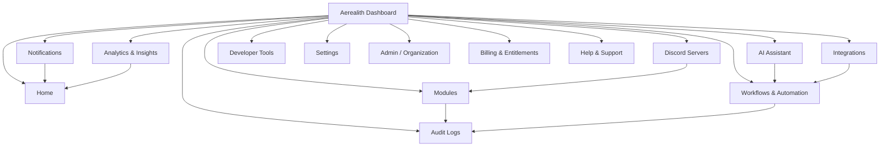
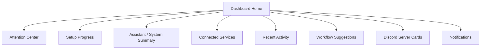

# Dashboard

Status: Target specification
Document Type: Target Dashboard Specification
Implementation State: Intended and phased dashboard behavior; verify current availability in [Current State](../CURRENT_STATE.md)
Authority: Target product behavior; [Project Overview](../Project-Overview.md) defines product identity and boundaries

Aerealith is the platform; Aerealith AI is its assistant/application layer.
The Aerealith Dashboard is the main control center for the platform.

It is where users manage their digital life, Discord communities, modules, workflows, integrations, assistant settings, notifications, audit logs, analytics, and future organization controls.

The dashboard should make Aerealith feel understandable, configurable, and trustworthy.

It should be powerful without feeling overwhelming.

---

## Purpose

This document defines the Aerealith Dashboard as a product surface.

It explains:

- what the dashboard is
- who uses it
- what areas it should include
- how dashboard navigation should work
- how modules should be displayed
- how Discord servers should be managed
- how workflows, notifications, audit logs, and integrations appear
- how AI should assist inside the dashboard
- what belongs in MVP, post-MVP, and future dashboard scope

This document does not define frontend component implementation, routing code, database schemas, API contracts, or visual design tokens.

Those belong in architecture, engineering, design system, and UI documentation.

---

## Product Position

The dashboard is:

> The visual control center for Aerealith.

It should give users one place to:

- understand what is happening
- configure Aerealith
- manage Discord servers
- enable and disable modules
- review audit logs
- approve actions
- manage workflows
- connect integrations
- configure the AI assistant
- review notifications
- view summaries and insights
- manage account and privacy settings

The dashboard should make users feel:

```text
I know what is going on.
I know what Aerealith can access.
I know what is enabled.
I know what needs my attention.
I can change or disable anything important.
```

---

## Dashboard Philosophy

The dashboard should be:

- clear
- modular
- searchable
- fast
- beginner-friendly
- power-user capable
- trust-first
- permission-aware
- context-aware
- audit-friendly
- responsive
- AI-assisted, not AI-dependent

Aerealith should avoid dashboard bloat.

The dashboard should not become a giant pile of buttons.

Every page should answer:

```text
What matters here?
What can I do?
What needs attention?
What changed recently?
How do I stay in control?
```

---

## Core Principle

> The dashboard should reveal complexity only when the user needs it.

A new user should see a calm, guided experience.

A power user should be able to open advanced settings, inspect logs, configure modules, review events, and connect APIs.

Both users should feel like the system is built for them.

---

## Dashboard Users

| Persona                      | Dashboard Need                                                                                     |
| ---------------------------- | -------------------------------------------------------------------------------------------------- |
| Individual Digital Life User | Needs personal overview, assistant, workflows, connected services, memory, notifications, privacy. |
| Discord Server Owner         | Needs server overview, modules, staff roles, permissions, logs, tickets, analytics, setup.         |
| Discord Admin / Manager      | Needs module settings, role mapping, tickets, moderation logs, workflow controls, staff tools.     |
| Discord Moderator / Staff    | Needs moderation history, tickets, audit logs, user context, quick actions.                        |
| Creator / Streamer           | Needs community dashboards, content notifications, announcements, engagement, analytics.           |
| Developer / Homelab User     | Needs integrations, APIs, logs, service status, workflow automation, docs links.                   |
| Organization Admin           | Needs users, roles, permissions, policies, billing, audit logs, shared workflows.                  |
| Self-Hosted Operator         | Future need for deployment health, provider settings, backups, updates, system status.             |

---

## Dashboard Product Model



---

## Dashboard Information Priority

The dashboard should prioritize information by importance.

| Priority | Type                | Examples                                                                           |
| -------- | ------------------- | ---------------------------------------------------------------------------------- |
| 1        | Requires Attention  | Approval requests, failed workflows, disconnected integrations, security warnings. |
| 2        | Important Status    | Enabled modules, server health, ticket counts, recent moderation actions.          |
| 3        | Recent Activity     | Audit logs, workflow runs, assistant actions, module changes.                      |
| 4        | Useful Suggestions  | Automation suggestions, setup recommendations, module presets.                     |
| 5        | General Information | Analytics, usage summaries, trends, documentation links.                           |

The dashboard should not bury urgent actions under generic analytics.

---

## Navigation Model

The dashboard should use a stable navigation structure.

Recommended primary navigation:

```text
Home
Assistant
Discord
Modules
Workflows
Integrations
Notifications
Logs
Analytics
Developer
Settings
```

Context-specific navigation may appear inside sections.

For example, inside a Discord server:

```text
Overview
Modules
Commands
Roles & Permissions
Moderation
Automod
Tickets
Logs
Analytics
Community Engagement
Music & Voice
Utility
Creator Notifications
Server Listing
Settings
```

---

## Navigation Principles

Navigation should be:

- predictable
- searchable
- context-aware
- keyboard-friendly later
- role-aware
- permission-aware
- mobile-responsive
- not overloaded

If a user does not have permission to access a section, the dashboard should either hide it or show a clear explanation.

---

## Dashboard Contexts

The dashboard should support multiple contexts.

| Context                  | Description                                      |
| ------------------------ | ------------------------------------------------ |
| Personal Dashboard       | User’s personal digital-life control center.     |
| Discord Server Dashboard | Dashboard for one linked Discord guild.          |
| Organization Dashboard   | Shared workspace/team dashboard.                 |
| Developer Dashboard      | APIs, keys, docs, integrations, logs.            |
| Module Dashboard         | Configuration and status for a module.           |
| Workflow Dashboard       | Workflow creation, runs, approvals, and history. |
| Integration Dashboard    | Connected services and health.                   |
| Admin Dashboard          | Permissions, policies, billing, governance.      |
| Self-Hosted Dashboard    | Future instance-level admin and operations view. |

Context should always be visible.

A user should know whether they are configuring themselves, a Discord server, an organization, or a project.

---

## Dashboard Home

The dashboard home should answer:

```text
What needs my attention right now?
What changed recently?
What is working?
What is broken?
What can I do next?
```

---

## Home Widgets

| Widget                      | Status         | Purpose                                                                            |
| --------------------------- | -------------- | ---------------------------------------------------------------------------------- |
| Welcome / Setup Progress    | MVP            | Guides new users through account, Discord, assistant, integrations, and workflows. |
| Attention Center            | MVP            | Shows approvals, failures, alerts, missing permissions, and important tasks.       |
| Assistant Summary           | MVP            | Shows AI-generated or system-generated summary of current state.                   |
| Connected Services          | MVP            | Shows linked Discord servers and integrations.                                     |
| Recent Activity             | MVP            | Shows audit events, workflow runs, module changes, assistant actions.              |
| Workflow Suggestions        | MVP / Post-MVP | Shows suggested automations from repeated behavior.                                |
| Discord Server Cards        | MVP            | Shows linked Discord servers and status.                                           |
| Ticket Summary              | MVP / Post-MVP | Shows open tickets, stale tickets, and support activity.                           |
| Moderation Summary          | MVP / Post-MVP | Shows recent moderation and automod activity.                                      |
| Notification Digest         | Post-MVP       | Shows unread alerts, reminders, and summaries.                                     |
| Usage / Entitlement Summary | Post-MVP       | Shows plan, limits, usage, and enabled premium features.                           |
| Community Health            | Future         | Shows AI-assisted health insights and trends.                                      |

---

## Home Layout Concept



---

## Attention Center

The Attention Center should show important items that require user awareness or action.

Examples:

```text
Discord bot is missing Manage Roles permission.
A workflow failed 3 times.
A ticket has been stale for 24 hours.
A high-risk moderation action needs approval.
Memory review is available.
An integration disconnected.
A module update requires review.
A billing entitlement will expire soon.
```

---

## Attention Item Requirements

Each attention item should show:

- title
- severity
- affected context
- short explanation
- suggested action
- dismiss option when safe
- link to details
- related audit event if applicable

Severity levels:

| Severity | Meaning                        |
| -------- | ------------------------------ |
| Info     | Useful but not urgent.         |
| Notice   | Worth reviewing.               |
| Warning  | Could cause degraded behavior. |
| Critical | Requires immediate attention.  |

---

## AI Assistant in the Dashboard

The assistant should be available inside the dashboard.

It should help users:

- understand dashboard state
- configure modules
- summarize logs
- explain errors
- suggest workflows
- review tickets
- understand permissions
- draft settings
- find features
- answer product questions
- explain what changed

The assistant should never become the only way to use the dashboard.

Manual controls must exist.

---

## Assistant Panel

The dashboard may include an assistant panel.

The panel should support:

- asking questions about the current page
- explaining settings
- summarizing visible data
- suggesting next steps
- drafting workflows
- preparing approval prompts
- linking to relevant docs
- showing confidence/uncertainty when needed

Example:

```text
Why is my Tickets module not working?
```

A good assistant response should explain:

```text
Tickets is enabled, but Aerealith is missing permission to create private channels.

To fix this:
1. Open Roles & Permissions.
2. Give the Aerealith AI role permission to Manage Channels.
3. Re-run the module health check.
```

---

## Discord Dashboard

The Discord Dashboard is a major dashboard area.

It should let server owners and staff manage Aerealith’s Discord modules from the web.

---

## Discord Server Overview

The server overview should show:

- server name and icon
- bot install status
- server link status
- owner/admin status
- enabled modules
- missing permissions
- staff roles
- open tickets
- recent moderation
- recent automod triggers
- recent audit events
- basic analytics
- setup progress
- recommended next steps

---

## Discord Dashboard Sections

Recommended Discord dashboard sections:

```text
Overview
Modules
Commands
Roles & Permissions
Moderation
Automod
Tickets
Logs
Analytics
Community Engagement
Music & Voice
Utility
Creator Notifications
Server Listing
Settings
```

---

## Discord Module Grid

The module grid should use cards.

This matches the style of modern Discord bot dashboards while adding Aerealith’s trust, risk, and permission model.

Each module card should show:

```text
Module name
Short description
Enabled/disabled toggle
Status
Risk level
Plan/entitlement label later
Settings button
Help button
Missing permission warning
Dependency warning
Recent activity count
```

---

## Module Card Example

```text
Tickets
Support tickets with panels, private channels, transcripts, and staff actions.

Status: Enabled
Risk: Medium
Dependencies: Discord Core, Permissions, Logging
Permissions: Manage Channels, Send Messages, Read Messages

[Settings] [Help] [View Logs] [Disable]
```

---

## Bulk Actions

Bulk actions should exist, but carefully.

Examples:

```text
Enable all low-risk modules
Disable all modules
Apply preset
Reset to safe defaults
Export module config
```

High-risk modules should not be enabled through careless bulk actions without review.

For example, `Enable All` should not silently enable moderation, purge, automod punishments, or role-changing modules without explaining risks.

---

## Commands Dashboard

The Commands dashboard should let admins control Discord slash commands.

It should support:

- command search
- command category filters
- enable/disable commands
- module dependency notices
- per-command settings
- permission requirements
- help text
- examples
- usage limits
- audit logs for changes

---

## Command Card Example

```text
/roll
Roll dice for games, tabletop sessions, and roleplay.

Module: Dice
Status: Enabled
Risk: Low
Permission: Everyone by default

[Settings] [Help] [Disable]
```

---

## Command Categories

Recommended command categories:

```text
Moderation
Tickets
Automod
Roles
Utility
Music
Games
Dice
Fun
Levels
Announcements
Forms
Developer
Admin
AI Assistant
```

---

## Roles & Permissions Dashboard

The Roles & Permissions dashboard should help server owners safely map Discord roles to Aerealith permissions.

It should support:

- common role creation
- role mapping
- staff role assignment
- permission preview
- missing permission detection
- role hierarchy warnings
- module permission configuration
- command permission configuration
- audit visibility

---

## Common Role Creation

Aerealith should offer to create built-in common roles when they do not exist.

Recommended roles:

```text
Aerealith Admin
Manager
Moderator
Support Staff
Trial Staff
Read-Only Auditor
Event Manager
Music DJ
Community Helper
Member
New Member
Verified
Muted / Restricted
VIP
Subscriber / Supporter
```

Role creation should require approval and show a preview.

---

## Role Mapping View

The role mapping view should answer:

```text
Which Discord roles can use which Aerealith features?
```

Example table:

| Discord Role | Aerealith Role    | Can Configure Modules | Can Moderate | Can Manage Tickets | Can View Logs |
| ------------ | ----------------- | --------------------: | -----------: | -----------------: | ------------: |
| Owner        | Server Owner      |                   Yes |          Yes |                Yes |           Yes |
| Admin        | Aerealith Admin   |                   Yes |          Yes |                Yes |           Yes |
| Moderator    | Moderator         |                    No |          Yes |            Limited |           Yes |
| Support      | Support Staff     |                    No |           No |                Yes |       Limited |
| Auditor      | Read-Only Auditor |                    No |           No |                 No |           Yes |

---

## Moderation Dashboard

The Moderation dashboard should help staff review and manage moderation activity.

It should show:

- recent moderation actions
- user moderation history
- warnings
- timeouts
- kicks
- bans
- unbans
- purges
- staff notes
- cases
- reasons
- actor/target history
- filters by user, action, staff member, date, channel
- export later

---

## Moderation Action View

A moderation action should show:

```text
Action
Target user
Staff actor
Reason
Timestamp
Channel
Message link if available
Risk level
Approval source
Related automod trigger
Related case
Audit event
```

---

## Automod Dashboard

The Automod dashboard should let admins configure automated moderation safely.

It should include:

- blocked words
- spam detection
- repeated message detection
- excessive mentions
- link filtering
- invite filtering
- raid suspicion alerts
- escalation rules
- staff alert channels
- action settings
- test mode / dry run
- audit logs
- recent triggers

---

## Automod Safety Controls

Automod should support:

```text
Alert only
Delete message
Warn user
Timeout user
Escalate to staff
Create moderation case
Create review ticket
```

MVP should prefer alert/review behavior for risky actions.

Automatic punishments should require explicit configuration.

---

## Tickets Dashboard

The Tickets dashboard should manage support and community workflows.

It should show:

- open tickets
- closed tickets
- stale tickets
- ticket categories
- assigned staff
- ticket panels
- transcript settings
- ticket logs
- ticket analytics later
- ticket forms later
- escalation rules later

---

## Ticket Queue View

Ticket queue columns may include:

```text
Ticket ID
User
Category
Status
Assigned Staff
Last Activity
Created At
Priority
Actions
```

---

## Ticket Detail View

A ticket detail view should show:

- user
- staff
- messages/transcript preview where allowed
- category
- status
- notes
- linked moderation cases
- timeline
- close reason
- transcript status
- audit events
- AI summary later

---

## Community Engagement Dashboard

The Community Engagement dashboard should help owners make the server more active.

It should include:

- leveling
- level roles
- leaderboards
- giveaways
- polls
- events
- starboard/highlights
- reputation later
- economy later
- challenges later

---

## Leveling Dashboard

The leveling dashboard should support:

- enable/disable leveling
- XP rules
- cooldowns
- ignored channels
- ignored roles
- level-up messages
- level roles
- leaderboard settings
- anti-spam controls
- reset/import/export later

---

## Music & Voice Dashboard

The Music & Voice dashboard should control Discord music and voice features.

It should include:

- music module enable/disable
- DJ role mapping
- allowed channels
- blocked channels
- queue limits
- volume limits
- playback permissions
- vote skip settings
- temporary voice channels later
- voice text linking later
- music audit events

Music controls should respect platform rules, copyright requirements, provider restrictions, and Discord limitations.

---

## Utility Dashboard

The Utility dashboard should manage smaller quality-of-life modules.

Examples:

```text
AFK
Reminders
Tags
Autoresponder
Embeds
Slowmode
Auto Message
Auto Delete
Server Info
User Info
Avatar
Profile
Dice
Randomizer
Fun Commands
```

These should be easy to enable, disable, and configure.

Professional communities should be able to disable fun/noise modules quickly.

---

## Creator Notifications Dashboard

The Creator Notifications dashboard should help creators and communities connect external platforms.

Supported modules may include:

```text
YouTube
Twitch
TikTok
Kick
Reddit
GitHub
Steam
Epic Games
```

The dashboard should support:

- connected creator accounts
- notification channels
- message templates
- role mentions
- rate limits
- preview messages
- last post/live status
- failure logs

---

## Server Listing Dashboard

The Server Listing dashboard should let server owners control if and how their server appears in any Aerealith community/server directory.

It should support:

- listing enable/disable
- server description
- invite URL
- tags/categories
- language
- content rating
- preview card
- listing status
- rules/compliance checks
- analytics later

Server listing should always be opt-in.

---

## Workflows Dashboard

The Workflows dashboard should show automation clearly.

It should support:

- workflow list
- workflow cards
- templates
- automation suggestions
- active runs
- failed runs
- approval requests
- dry runs
- workflow history
- Discord workflow filters
- integration workflow filters
- AI-assisted workflow drafting

---

## Workflow Card

A workflow card should show:

```text
Workflow name
Status
Scope
Trigger
Risk level
Last run
Next scheduled run if applicable
Required modules
Required permissions
Run button
Dry run button
History button
Settings button
Pause/disable button
```

---

## Integrations Dashboard

The Integrations dashboard should manage connected services.

It should show:

- connected services
- disconnected services
- integration health
- permission scopes
- last sync
- errors
- reconnect button
- remove connection button
- available integrations
- integration workflows
- integration audit events

---

## Integration Card

```text
Discord
Connected
3 servers linked
Last sync: 2 minutes ago
Health: Good

[Manage] [Reconnect] [View Logs]
```

---

## Notifications Dashboard

The Notifications dashboard should give users control over their attention.

It should support:

- in-app notifications
- approval requests
- summaries
- reminders
- Discord alerts
- email settings
- quiet hours later
- priority routing later
- notification history
- notification preferences

---

## Notification Categories

```text
Approvals
Security
Discord
Tickets
Moderation
Workflows
Integrations
Billing
System
Assistant
Reminders
Summaries
```

---

## Logs & Audit Dashboard

Logs and audit events are critical to trust.

The Logs dashboard should allow users to review important platform activity.

It should support:

- audit event search
- filters
- actor/target view
- module filters
- Discord filters
- workflow filters
- assistant filters
- export later
- retention information
- permission-aware visibility

---

## Audit Log Fields

An audit log row should show:

```text
Timestamp
Event
Actor
Target
Context
Module
Risk Level
Result
Approval Source
Details
```

---

## Audit Log Examples

```text
discord.module.enabled
discord.user.warned
discord.messages.purged
discord.ticket.closed
assistant.action.approval_requested
workflow.executed
integration.disconnected
memory.created
module.config.updated
role.mapping.changed
```

---

## Analytics Dashboard

Analytics should help users understand trends without overwhelming them.

MVP should include basic activity summaries.

Deeper analytics should come post-MVP.

---

## Analytics Areas

| Area                 | Status   | Examples                                                            |
| -------------------- | -------- | ------------------------------------------------------------------- |
| Basic Activity       | MVP      | Recent activity, enabled modules, ticket counts, moderation counts. |
| Discord Analytics    | Post-MVP | Growth, active members, engagement, retention.                      |
| Moderation Analytics | Post-MVP | Warnings, timeouts, bans, automod triggers, repeat offenders.       |
| Ticket Analytics     | Post-MVP | Volume, response time, categories, stale tickets.                   |
| Engagement Analytics | Post-MVP | Levels, leaderboards, events, giveaways, starboard.                 |
| Workflow Analytics   | Post-MVP | Runs, failures, saved time, common triggers.                        |
| Integration Health   | Post-MVP | Failures, latency, reconnects, sync status.                         |
| Community Health     | Future   | AI-assisted summary of overall community state.                     |

---

## Developer Dashboard

The Developer Dashboard should support users building on Aerealith.

It should include:

- API documentation links
- API keys later
- webhook settings later
- integration diagnostics
- event explorer
- module manifest viewer
- workflow API tools
- logs
- examples
- SDK information later

Developer controls should be hidden from users who do not need them.

---

## Settings Dashboard

Settings should be divided clearly.

Recommended settings areas:

```text
Account
Profile
Security
Assistant
Memory
Notifications
Privacy
Connected Services
Discord
Developer
Billing
Organization
Appearance
Data Export
Danger Zone
```

---

## Danger Zone

Danger Zone should include high-risk actions such as:

```text
Delete account
Disconnect Discord server
Delete memory
Delete workflow
Reset module configuration
Disable all modules
Delete organization
Remove integration
```

Danger Zone actions must require strong confirmation and audit logs where applicable.

---

## Billing & Entitlements Dashboard

Billing should not shape MVP dashboard design too early, but the dashboard should eventually support entitlements.

Post-MVP billing dashboard may include:

- current plan
- usage
- enabled premium features
- invoices
- payment method
- subscription status
- organization billing
- marketplace purchases later

Billing must be transparent and avoid dark patterns.

---

## Organization Dashboard

Organization dashboards should come after the individual and Discord experience is stable.

Organization dashboard areas may include:

- members
- roles
- permissions
- policies
- shared workflows
- shared integrations
- organization memory
- audit logs
- billing
- module governance
- marketplace approvals later

---

## Self-Hosted Dashboard

Self-hosting is future scope, but dashboard design should not block it.

Future self-hosted dashboard areas may include:

- instance health
- service status
- provider configuration
- SMTP settings
- storage provider settings
- AI provider settings
- backups
- updates
- logs
- admin users
- license/entitlements if applicable

Self-hosting should be treated as a product, not just deployment scripts.

---

## Search and Command Palette

The dashboard should support search early and a command palette later.

Search should help users find:

- modules
- settings
- commands
- workflows
- tickets
- audit events
- Discord servers
- integrations
- documentation

A future command palette may support:

```text
Enable Tickets
Open Moderation Logs
Find user
Create workflow
Search commands
Open assistant settings
Reconnect Discord
View failed workflows
```

---

## Dashboard Widgets

Widgets are reusable dashboard blocks.

Widgets should be:

- modular
- permission-aware
- configurable
- movable later
- hideable later
- explainable
- linked to detailed views

---

## Widget Examples

```text
Open Tickets
Recent Moderation
Workflow Failures
Pending Approvals
Server Health
Integration Health
Assistant Suggestions
Recent Audit Events
Leveling Leaderboard
Music Queue
Upcoming Events
Creator Notifications
Memory Review
```

---

## Dashboard States

Every dashboard page should handle common states gracefully.

| State                  | Requirement                             |
| ---------------------- | --------------------------------------- |
| Loading                | Show clear loading state.               |
| Empty                  | Explain what the user can do next.      |
| Error                  | Explain what failed and how to recover. |
| Permission Denied      | Explain required permission.            |
| Missing Setup          | Guide user through setup.               |
| Missing Integration    | Show connect/reconnect action.          |
| Missing Bot Permission | Explain Discord permission issue.       |
| No Data Yet            | Avoid making the product feel broken.   |
| Disabled Module        | Explain how to enable it.               |
| AI Unavailable         | Fall back to manual controls.           |

---

## Empty State Examples

```text
No workflows yet.

Create your first workflow from a template or ask Aerealith to suggest one based on your repeated actions.
```

```text
Tickets is not enabled for this server.

Enable Tickets to create support panels, private ticket channels, and transcripts.
```

```text
No audit events yet.

Important actions will appear here after modules, workflows, or staff actions run.
```

---

## Trust Requirements

The dashboard must make trust visible.

Users should be able to see:

- what is enabled
- what is disabled
- what has access
- what changed recently
- who changed it
- what AI suggested
- what AI executed
- what workflows ran
- what failed
- what needs approval
- how to revoke access
- how to export/delete data where practical

---

## Permission-Aware UI

The dashboard should respect permissions.

Users should not see dangerous controls they cannot use unless there is a good reason to show them with an explanation.

Permission-aware UI should support:

```text
Visible and enabled
Visible but disabled with explanation
Hidden
Requires approval
Requires higher role
Requires Discord permission
Requires Aerealith permission
Requires plan/entitlement later
```

---

## Responsive Dashboard

The dashboard should be usable on different screen sizes.

MVP should prioritize desktop web.

Mobile-responsive web should still be considered.

Later mobile app support can improve approvals, notifications, and quick actions.

---

## Responsive Priorities

| Device      | Priority             | Notes                                                      |
| ----------- | -------------------- | ---------------------------------------------------------- |
| Desktop     | MVP                  | Primary management experience.                             |
| Tablet      | Post-MVP             | Useful for moderation and dashboard review.                |
| Mobile Web  | Basic MVP / Post-MVP | Should handle approvals and quick checks.                  |
| Mobile App  | Future               | Better notifications, approvals, reminders, quick actions. |
| Desktop App | Future               | Local quick commands and notifications.                    |

---

## Accessibility

The dashboard should be designed with accessibility in mind.

Requirements:

- readable contrast
- keyboard navigation
- clear focus states
- semantic structure
- useful labels
- non-color-only status indicators
- clear error messages
- reduced motion option
- responsive text sizing

Accessibility should not be treated as polish-only.

It is part of trust and usability.

---

## MVP Dashboard Scope

MVP dashboard should include:

```text
Dashboard home
Setup progress
Account settings
Assistant chat surface
Basic assistant settings
Connected Discord servers
Discord server overview
Discord module grid
Module enable/disable
Module settings
Command enable/disable basics
Common role creation
Role mapping
Moderation logs
Ticket overview
Ticket logs
Audit logs
Basic activity summaries
Workflow overview
Automation suggestions
Integration overview
Notification center foundation
Permission warnings
Missing Discord permission alerts
Basic settings pages
```

---

## Post-MVP Dashboard Scope

Post-MVP should include:

```text
Advanced workflow builder
Dry runs
Workflow templates
Advanced notification preferences
Quiet hours
Ticket analytics
Moderation analytics
Community analytics
Leveling dashboard
Music dashboard
Creator notifications dashboard
Forms dashboard
Announcements dashboard
Polls/events dashboard
Memory review UI
Assistant customization UI
Developer dashboard
API keys
Webhook management
Billing dashboard
Organization dashboard foundation
Export/import for module and workflow configs
Advanced search
```

---

## Future Dashboard Scope

Future dashboard capabilities may include:

```text
Custom dashboard layouts
User-created widgets
Marketplace dashboard widgets
Mobile app dashboard
Desktop companion dashboard
Browser extension context panel
Self-hosted admin dashboard
Advanced organization governance
Community health reports
AI dashboard builder
Cross-server analytics
Cross-workspace overview
Private marketplace management
Advanced audit export
Compliance reports
Local AI provider settings
Provider replacement settings
```

---

## Release Path

| Release                           | Dashboard Focus                                                |
| --------------------------------- | -------------------------------------------------------------- |
| 0.4 — Frontend Platform           | Web dashboard foundation, account/settings, assistant surface. |
| 0.5 — API & Service Platform      | Dashboard connects to API capabilities and service status.     |
| 0.7 — Discord Platform Foundation | Discord server dashboard, module grid, role mapping basics.    |
| 0.8 — Community Operations        | Moderation, tickets, logs, and Discord operations views.       |
| 0.9 — Observability & Reliability | Health, errors, logging, and operational visibility.           |
| 1.0 — Private Beta                | Dashboard usability testing and guided setup feedback.         |
| 1.1 — MVP Production Launch       | Stable MVP dashboard and Discord management surface.           |
| 1.2 — Billing & Entitlements      | Billing dashboard, usage, plan visibility.                     |
| 1.3 — AI Assistant & Memory       | Memory review, assistant settings, AI summaries.               |
| 1.4 — Workflow Automation Builder | Workflow builder, dry runs, templates, approval center.        |
| 1.5 — Marketplace & Modules       | Marketplace views, module packages, template discovery.        |
| 1.6 — Mobile/Desktop Companion    | Mobile/desktop dashboard companions and quick actions.         |
| 1.7 — Digital Life OS Expansion   | Personal digital-life dashboards and context graph views.      |
| 1.9 — Self-Hosting Foundations    | Provider settings, backup/restore, instance preparation.       |
| 2.0 — Self-Hosted Preview         | Self-hosted admin dashboard and deployment health.             |

---

## Dashboard Review Questions

Before adding a dashboard page, widget, or control, ask:

- Which persona uses this?
- What decision does this help them make?
- What action can they take from here?
- Does this reduce complexity?
- Does this reveal too much too early?
- Does this require permission checks?
- Does this need an audit log?
- Does this need an empty state?
- Does this need a failure state?
- Does this need AI assistance?
- Can it work without AI?
- Is it searchable?
- Is it understandable to a beginner?
- Is advanced control available for power users?
- Can the user undo, disable, or revoke the related behavior?
- Does it make the user feel more in control?

If a dashboard item does not help users understand, decide, or act, it should be reconsidered.

---

## Success Criteria

The dashboard succeeds when users say:

```text
I can see what matters.
```

```text
I know what needs my attention.
```

```text
I can configure my Discord server without jumping between five bots.
```

```text
I understand what Aerealith can access.
```

```text
I can turn modules and automations off when I want.
```

```text
I can review what happened.
```

```text
The assistant helps, but I am not forced to use it.
```

```text
The dashboard makes Aerealith feel powerful but not chaotic.
```

---

## Final Standard

The Aerealith Dashboard should be the place where complexity becomes manageable.

It should bring together assistant controls, Discord management, modules, workflows, integrations, notifications, analytics, logs, permissions, and settings into one coherent control center.

It should be simple enough for beginners.

Powerful enough for advanced users.

Transparent enough to earn trust.

Flexible enough to grow.

The dashboard should make users feel in control of their digital life.
