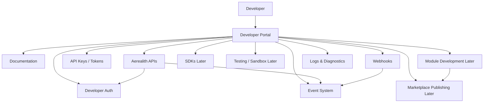
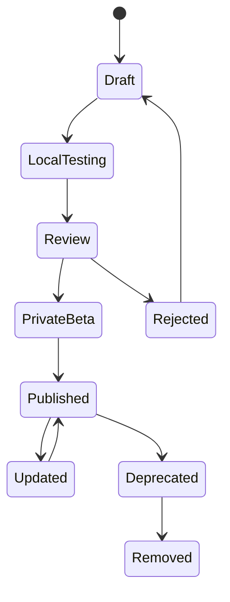

# Developer Platform

The Aerealith Developer Platform gives developers, builders, module creators, automation users, and future marketplace contributors a clear way to build on top of Aerealith AI.

Aerealith should not only be a product people use.

It should become a platform people can extend.

The Developer Platform should make Aerealith programmable, documented, observable, secure, and eventually ecosystem-driven.

---

## Purpose

This document defines the Developer Platform as a product area inside Aerealith AI.

It explains:

- what the Developer Platform is
- who it serves
- what APIs Aerealith should expose
- how developers authenticate
- how integrations, modules, workflows, and webhooks should work
- how documentation should be organized
- how SDKs should be approached
- how developer tools should support debugging
- how marketplace development should evolve later
- what belongs in MVP, post-MVP, and future scope

This document does not define final API schemas, database models, runtime internals, SDK implementation details, or deployment architecture.

Those belong in architecture, engineering, API reference, and service documentation.

---

## Product Position

The Developer Platform is:

> The programmable foundation for building with, extending, integrating, and automating Aerealith AI.

It should allow developers to:

- read platform documentation
- use Aerealith APIs
- create integrations
- manage webhooks
- build workflows
- inspect events
- debug failures
- manage API access
- build modules later
- publish marketplace items later
- support self-hosted deployments later

The Developer Platform should be useful before the marketplace exists.

Marketplace support should grow from a solid developer foundation, not the other way around.

---

## Developer Platform Philosophy

The Developer Platform should be:

- well-documented
- strongly typed where practical
- secure by default
- permissioned
- auditable
- versioned
- stable
- observable
- beginner-friendly
- power-user capable
- API-first
- marketplace-ready later
- self-hosting-aware later

Aerealith should avoid “magic APIs” that are impossible to understand.

Developers should be able to see what an API does, what permissions it requires, what it changes, what it returns, and what audit events it creates.

---

## Core Principle

> Every major Aerealith capability should eventually be API-accessible.

The API is not only an implementation detail.

The API is a product surface.

If users can manage modules, workflows, integrations, Discord servers, tickets, logs, dashboards, and assistant settings through the UI, then developers should eventually be able to manage the same capabilities through documented APIs where appropriate.

---

# Developer Personas

| Persona                         | Needs                                                                               |
| ------------------------------- | ----------------------------------------------------------------------------------- |
| Developer / Homelab User        | APIs, docs, examples, logs, integrations, webhooks, self-hosting path.              |
| Marketplace Developer           | Module/package publishing, manifests, reviews, testing, versioning, docs.           |
| Power Automator                 | Workflow APIs, webhook triggers, event inspection, templates, debugging.            |
| Discord Server Owner / Admin    | Developer tools for server-specific automation and integrations.                    |
| Small Team / Organization Admin | API access, audit logs, organization controls, webhooks, policy-aware integrations. |
| Self-Hosted Operator            | Configuration docs, provider replacement, deployment guides, admin APIs.            |
| Internal Aerealith Developer    | Consistent service contracts, docs, event schemas, observability, testing flows.    |

---

# Developer Platform Product Model



---

# Developer Platform Surfaces

| Surface                      | Status            | Purpose                                                                 |
| ---------------------------- | ----------------- | ----------------------------------------------------------------------- |
| Developer Documentation      | MVP               | Explains concepts, setup, APIs, auth, modules, workflows, integrations. |
| API Reference                | MVP / Post-MVP    | Documents available REST/RPC/GraphQL/WebSocket APIs.                    |
| Developer Portal             | MVP / Post-MVP    | Central dashboard for keys, webhooks, logs, integrations, examples.     |
| API Explorer                 | Post-MVP          | Lets developers test API calls safely.                                  |
| Event Explorer               | Post-MVP          | Shows emitted events, webhook deliveries, failures, and payloads.       |
| Webhook Dashboard            | Post-MVP          | Manage inbound/outbound webhooks.                                       |
| Module Manifest Viewer       | Post-MVP          | Inspect module manifests, permissions, events, and dependencies.        |
| SDKs                         | Post-MVP / Future | Typed libraries for supported languages.                                |
| Sandbox                      | Future            | Safe test workspace for integrations and modules.                       |
| Marketplace Publisher Portal | Future            | Publish modules, workflows, templates, integrations, and packages.      |
| Self-Hosted Admin Docs       | Future            | Deployment, provider replacement, updates, backups, and operations.     |

---

# Developer Platform Areas

The Developer Platform should include these major areas.

| Area              | Purpose                                                                       |
| ----------------- | ----------------------------------------------------------------------------- |
| Documentation     | Guides, concepts, tutorials, API reference, examples, and architecture notes. |
| APIs              | Programmatic access to platform capabilities.                                 |
| Authentication    | Secure access for users, apps, integrations, and automation.                  |
| API Keys & Tokens | Developer-managed credentials with scoped permissions.                        |
| Webhooks          | Event delivery and external automation support.                               |
| Events            | Standardized platform events for workflows, logs, modules, and integrations.  |
| SDKs              | Typed client libraries and generated API clients later.                       |
| Integration Tools | Tools for building and debugging integrations.                                |
| Module Tools      | Tools for building modules and packages later.                                |
| Workflow Tools    | API and UI tools for creating and managing workflows.                         |
| Observability     | Logs, request traces, webhook delivery history, and diagnostics.              |
| Marketplace Tools | Publishing, reviews, manifests, security checks, and versioning later.        |
| Self-Hosting Docs | Deployment, configuration, provider replacement, and operations later.        |

---

# Documentation Strategy

Documentation is part of the product.

Developer documentation should be treated as a first-class surface, not an afterthought.

---

## Documentation Principles

Developer documentation should be:

- accurate
- versioned
- searchable
- example-driven
- beginner-friendly
- technically precise
- copy-pasteable
- linked to related concepts
- honest about limitations
- clear about required permissions
- clear about risk levels
- clear about MVP vs future features

---

## Recommended Documentation Structure

```text
docs/
├── README.md
├── vision/
├── product/
├── architecture/
├── engineering/
├── api/
├── services/
├── modules/
├── integrations/
├── workflows/
├── discord/
├── developer/
├── operations/
├── releases/
└── rfcs/
```

---

## Developer Documentation Sections

```text
docs/developer/
├── README.md
├── Getting Started.md
├── Authentication.md
├── API Overview.md
├── API Versioning.md
├── Webhooks.md
├── Events.md
├── Rate Limits.md
├── Errors.md
├── Permissions.md
├── SDKs.md
├── Integration Development.md
├── Module Development.md
├── Workflow Development.md
├── Marketplace Publishing.md
├── Local Development.md
├── Self Hosting.md
└── Troubleshooting.md
```

---

# API Philosophy

Aerealith APIs should be designed for clarity, stability, and permissioned access.

The API should expose platform capabilities without leaking internal implementation details.

---

## API Principles

Aerealith APIs should be:

- versioned
- documented
- predictable
- typed where practical
- permission-aware
- audit-aware
- rate-limited
- observable
- stable across releases
- safe by default
- consistent in error handling
- compatible with future SDKs

---

## API Style

Aerealith may support multiple API styles where appropriate.

| API Style | Purpose                                                                     |
| --------- | --------------------------------------------------------------------------- |
| REST      | Stable resource-oriented APIs for common platform operations.               |
| tRPC      | Strongly typed internal/app-facing APIs where useful.                       |
| GraphQL   | Flexible querying for dashboards, developer tools, and complex views later. |
| WebSocket | Real-time updates, events, dashboard status, workflow progress.             |
| Webhooks  | External event delivery and automation.                                     |

The product should avoid exposing too many API styles to beginners at once.

Developer documentation should make clear which API style is recommended for which use case.

---

# API Capability Areas

Aerealith should eventually expose APIs for major product areas.

| Area          | API Purpose                                                          | Status         |
| ------------- | -------------------------------------------------------------------- | -------------- |
| Identity      | User, profile, session, connected identity APIs.                     | MVP / Post-MVP |
| Discord       | Guilds, modules, tickets, moderation logs, role mapping.             | MVP / Post-MVP |
| Modules       | Enable, disable, configure, inspect manifests, view module status.   | MVP / Post-MVP |
| Workflows     | Create, update, run, dry run, pause, inspect workflow history.       | Post-MVP       |
| Integrations  | Connect, inspect, revoke, view health, manage provider settings.     | MVP / Post-MVP |
| Notifications | Send, list, configure, approve, route notifications.                 | Post-MVP       |
| Audit Logs    | Query meaningful platform actions.                                   | MVP / Post-MVP |
| Assistant     | Tool access, action approval, assistant summaries where safe.        | Post-MVP       |
| Memory        | Review, edit, delete, export user-approved memory where appropriate. | Post-MVP       |
| Dashboard     | Widget data, summaries, analytics, user-configured views.            | Post-MVP       |
| Marketplace   | Publish, install, review, version packages later.                    | Future         |
| Self-Hosting  | Instance health, provider settings, backups, updates later.          | Future         |

---

# API Versioning

Aerealith APIs should be versioned from the beginning.

Recommended public API path pattern:

```text
/api/v1
```

Service-specific routing may follow the platform convention:

```text
/api/v1/services/<service-name>
```

Examples:

```text
/api/v1/services/discord
/api/v1/services/modules
/api/v1/services/workflows
/api/v1/services/integrations
/api/v1/services/audit
```

---

## Versioning Rules

API versioning should follow these rules:

1. Breaking changes require a new version.
2. Deprecated endpoints should provide migration guidance.
3. Experimental APIs must be clearly labeled.
4. Internal APIs should not be treated as public contracts.
5. Public APIs should include examples.
6. API responses should use consistent error shapes.
7. API docs should include required permissions.
8. API docs should include relevant audit events.

---

# Authentication and Authorization

Developer access must be secure and scoped.

Aerealith should support different authentication methods depending on use case.

---

## Authentication Types

| Type                        | Status         | Purpose                                                    |
| --------------------------- | -------------- | ---------------------------------------------------------- |
| User Session                | MVP            | Web app and dashboard access.                              |
| OAuth / Connected Identity  | MVP / Post-MVP | Connecting external services like Discord, GitHub, Google. |
| API Keys                    | Post-MVP       | Developer access to APIs.                                  |
| Personal Access Tokens      | Post-MVP       | User-owned developer access.                               |
| Organization Tokens         | Future         | Organization-scoped automation and integrations.           |
| Marketplace App Credentials | Future         | Third-party apps/modules.                                  |
| Self-Hosted Admin Tokens    | Future         | Instance-level administration.                             |

---

## Authorization Principles

Authorization should be:

- scoped
- least-privilege
- role-aware
- context-aware
- revocable
- auditable
- organization-policy-aware later
- Discord-role-aware where relevant
- module-aware where relevant
- workflow-aware where relevant

A developer credential should never have more access than required.

---

# API Keys and Tokens

API keys should be introduced after core API foundations are stable.

API keys should support:

- name/label
- owner
- scope
- permissions
- expiration
- last used timestamp
- rotation
- revocation
- usage logs
- rate limits
- environment label
- organization ownership later

---

## API Key Example

```json
{
  "id": "key_...",
  "name": "Discord Automation Worker",
  "owner_type": "user",
  "owner_id": "user_...",
  "scopes": ["discord.guild.read", "workflow.run", "audit.read"],
  "expires_at": "2026-12-31T00:00:00Z",
  "last_used_at": "2026-01-01T00:00:00Z"
}
```

---

# Permissions

Developer features must use the same trust model as the rest of Aerealith.

APIs should not bypass permissions just because they are programmatic.

---

## Permission Categories

```text
identity.read
identity.write

discord.guild.read
discord.guild.write
discord.module.read
discord.module.write
discord.ticket.read
discord.ticket.write
discord.moderation.read
discord.moderation.write

module.read
module.write

workflow.read
workflow.write
workflow.run

integration.read
integration.write

notification.read
notification.write

audit.read

assistant.read
assistant.action.request

memory.read
memory.write

developer.key.manage
webhook.manage
marketplace.publish
```

---

## Permission Requirements

Every protected API endpoint should document:

- required permission
- required role
- context scope
- risk level
- approval requirements
- audit events created
- rate limits
- possible failure states

---

# Webhooks

Webhooks allow Aerealith to send and receive events.

Webhooks are critical for workflows, integrations, automation, and external systems.

---

## Webhook Types

| Type                | Purpose                                      |
| ------------------- | -------------------------------------------- |
| Outbound Webhook    | Aerealith sends events to an external URL.   |
| Inbound Webhook     | External systems send events into Aerealith. |
| Workflow Webhook    | Starts or continues workflows.               |
| Integration Webhook | Provider-specific event handling.            |
| Marketplace Webhook | Future package/module lifecycle events.      |
| Self-Hosted Webhook | Future local/self-hosted event routing.      |

---

## Outbound Webhook Events

Examples:

```text
discord.ticket.created
discord.ticket.closed
discord.user.warned
discord.messages.purged
workflow.completed
workflow.failed
module.enabled
module.config.updated
integration.disconnected
assistant.action.executed
audit.event.created
```

---

## Webhook Delivery Requirements

Webhook delivery should include:

- event ID
- event type
- timestamp
- signature
- retry behavior
- delivery status
- response code
- failure reason
- redelivery option
- rate limits
- secret rotation later

---

## Webhook Security

Webhooks should support:

- signed payloads
- secret rotation
- replay protection
- HTTPS enforcement
- scoped event subscriptions
- rate limits
- delivery logs
- revocation
- failure alerts

---

# Event System

The Developer Platform should expose standardized platform events.

Events power:

- webhooks
- workflows
- audit logs
- dashboards
- analytics
- integrations
- modules
- observability
- marketplace packages later

---

## Event Naming

Events should follow a predictable pattern:

```text
<domain>.<resource>.<action>
```

Examples:

```text
discord.ticket.created
discord.ticket.closed
discord.user.warned
discord.messages.purged
module.enabled
module.disabled
workflow.created
workflow.executed
workflow.failed
integration.connected
integration.disconnected
assistant.action.executed
memory.created
audit.event.created
```

---

## Event Payload Principles

Event payloads should be:

- typed
- versioned
- scoped
- permission-safe
- minimal by default
- expandable when authorized
- traceable to audit logs where relevant

Events should not leak sensitive data across scopes.

---

# SDK Strategy

SDKs should come after APIs stabilize.

The first SDKs should support the languages and ecosystems most useful to Aerealith.

---

## Recommended SDK Targets

| SDK                            | Priority      | Reason                                                         |
| ------------------------------ | ------------- | -------------------------------------------------------------- |
| TypeScript / JavaScript        | First         | Aerealith stack, Discord bots, web apps, Node ecosystem.       |
| Python                         | Later         | Automation, scripting, AI, data workflows.                     |
| C#                             | Later         | Unity, game/dev tooling, Windows ecosystem.                    |
| REST/OpenAPI Client Generation | Early Support | Helps generate clients without maintaining every SDK manually. |

---

## SDK Principles

SDKs should be:

- typed
- documented
- versioned
- generated where practical
- minimal
- stable
- easy to install
- compatible with API versioning
- safe around secrets
- clear about permissions

Aerealith should not rush SDKs before the API stabilizes.

---

# Developer Portal

The Developer Portal should be the central developer-facing dashboard.

It should include:

- getting started guide
- API reference
- auth guide
- API key management
- webhook management
- event explorer
- integration diagnostics
- module manifest viewer
- workflow tools
- SDK docs
- examples
- changelog
- status/health links
- support links

---

## Developer Portal Navigation

Recommended navigation:

```text
Overview
Getting Started
API Reference
Authentication
API Keys
Webhooks
Events
Integrations
Modules
Workflows
Discord
SDKs
Examples
Diagnostics
Changelog
Support
```

---

# API Explorer

The API Explorer should allow developers to test API calls safely.

It should support:

- endpoint browsing
- required permission display
- sample requests
- sample responses
- auth state
- context selection
- risk label
- dry-run support where available
- copy as cURL
- copy as TypeScript
- copy as Python later

High-risk endpoints should not execute casually from the API Explorer without confirmation.

---

# Event Explorer

The Event Explorer should help developers debug event-driven behavior.

It should show:

- event type
- timestamp
- source
- context
- payload preview
- related workflow
- related webhook delivery
- related audit event
- failure status
- retry status

This is especially useful for Discord modules, workflows, webhooks, integrations, and marketplace packages later.

---

# Integration Development

Developers should eventually be able to build integrations.

Integration development should require:

- integration manifest
- auth model
- permission model
- event model
- data access rules
- rate limit handling
- failure behavior
- audit behavior
- user-facing configuration
- documentation
- security review later

---

## Integration Development Lifecycle



---

# Module Development

Module development should come after the first-party module system is stable.

Developers may eventually build modules that provide:

- Discord tools
- workflow actions
- dashboard widgets
- integration connectors
- assistant skills
- templates
- reports
- community tools

Third-party runtime modules should not be rushed.

The safe path is:

1. First-party modules.
2. Official templates.
3. Importable packages.
4. Marketplace packages.
5. Sandboxed plugin runtime later.

---

## Module Development Requirements

A module should define:

- manifest
- permissions
- risk level
- settings schema
- UI surfaces
- API surfaces
- events
- audit behavior
- dependencies
- uninstall behavior
- versioning
- marketplace metadata later

---

# Workflow Development

Developers and power users should eventually be able to create workflows programmatically.

Workflow development should support:

- workflow manifests
- triggers
- conditions
- actions
- approval gates
- variables
- dry runs
- history
- audit logs
- import/export
- marketplace packaging later

---

## Workflow Manifest Example

```yaml
id: workflow.discord.stale-ticket-reminder
name: Stale Ticket Reminder
scope: discord_guild
risk_level: medium

trigger:
  type: discord.ticket.inactive
  duration: 24h

conditions:
  - ticket.status == "open"
  - ticket.assigned_staff == null

actions:
  - type: discord.message.send
    target: staff_channel
    template: stale_ticket_notice

audit:
  events:
    - workflow.triggered
    - workflow.action.executed
    - workflow.completed
```

---

# Marketplace Development

Marketplace support is future scope.

The Developer Platform should prepare for it early by using manifests, versioning, permissions, audit logs, and reviewable package boundaries.

Marketplace developers may eventually publish:

- modules
- workflows
- dashboard widgets
- templates
- integrations
- assistant skills
- Discord packs
- server presets
- reports
- themes later

---

## Marketplace Publishing Requirements

Marketplace items should require:

- creator identity
- package manifest
- version
- permissions
- risk level
- dependencies
- screenshots or previews
- documentation
- changelog
- support link
- security review status
- uninstall behavior
- data access declaration
- pricing/entitlement metadata later

---

# Sandboxed Plugin Runtime

A sandboxed plugin runtime is future scope.

Aerealith should not allow unrestricted third-party code early.

If code-based plugins are introduced later, they must support:

- sandboxing
- permission manifests
- resource limits
- network restrictions
- secrets isolation
- audit logs
- review process
- takedown controls
- versioning
- organization approval
- user consent
- runtime observability

---

# Developer Diagnostics

Developers need to understand what failed.

Diagnostics should include:

- API request logs
- webhook delivery logs
- event history
- integration health
- module errors
- workflow failures
- permission failures
- rate limit events
- validation errors
- auth failures
- trace IDs where available

---

## Diagnostic Record Example

```json
{
  "type": "webhook.delivery.failed",
  "event_id": "event_...",
  "webhook_id": "webhook_...",
  "status_code": 500,
  "attempt": 3,
  "next_retry_at": "2026-01-01T00:10:00Z",
  "error": "Receiver returned internal server error.",
  "trace_id": "trace_..."
}
```

---

# Error Handling

Developer-facing errors should be consistent.

Errors should include:

- error code
- message
- details where safe
- request ID
- trace ID where available
- documentation link where helpful
- suggested fix when possible

---

## Error Shape

```json
{
  "error": {
    "code": "PERMISSION_DENIED",
    "message": "This API key does not have permission to read Discord moderation logs.",
    "details": {
      "required_permission": "discord.moderation.read"
    },
    "request_id": "req_...",
    "trace_id": "trace_...",
    "docs_url": "/docs/developer/Permissions"
  }
}
```

---

# Rate Limits

APIs and webhooks should be rate-limited.

Rate limits should be:

- documented
- predictable
- visible in response headers where appropriate
- different by endpoint risk/cost
- different by plan later
- safe against abuse
- fair to developers
- clear when exceeded

---

## Rate Limit Response

```json
{
  "error": {
    "code": "RATE_LIMITED",
    "message": "Too many requests. Try again later.",
    "details": {
      "retry_after_seconds": 60
    }
  }
}
```

---

# Security Requirements

Developer features must be secure by default.

Security requirements:

1. API credentials must be scoped.
2. API credentials must be revocable.
3. API credentials should support expiration.
4. Secrets must never be exposed after creation.
5. Webhooks should support signed payloads.
6. High-risk APIs should require approval where appropriate.
7. Audit logs should track meaningful developer actions.
8. Organization policies should govern developer access later.
9. Marketplace packages must be reviewable.
10. Third-party runtime code must be sandboxed if introduced.
11. Private data must not leak across scopes.
12. Developer tools must not bypass user trust controls.

---

# Data Ownership

Developers should not gain ownership of user data simply because they build with Aerealith.

Users, communities, and organizations own the data they provide, connect, configure, or authorize.

Developer tools must respect:

- user consent
- organization policy
- Discord server ownership
- integration scope
- memory scope
- export/delete rights
- audit requirements
- privacy controls

---

# Observability for Developers

The Developer Platform should expose enough observability to help developers debug safely.

Developer-visible observability may include:

- request IDs
- trace IDs
- webhook attempts
- event IDs
- failure reasons
- rate limit status
- integration health
- module health
- workflow run logs

Internal logs should not expose secrets or unrelated user data.

---

# Local Development

Aerealith should support local development for contributors and future extension developers.

Local development documentation should include:

- repository setup
- pnpm install
- environment variables
- local services
- Docker usage
- test commands
- lint commands
- typecheck commands
- local API development
- local worker development
- mock integrations
- seed data later

Local developer setup should stay as simple as practical.

---

# Self-Hosting Developer Path

Self-hosting is future scope, but the Developer Platform should prepare for it.

Self-hosted developer documentation should eventually cover:

- Docker Compose
- environment configuration
- provider replacement
- SMTP setup
- S3/MinIO setup
- Grafana OSS setup
- local AI provider setup
- backups
- restore
- updates
- logs
- admin accounts
- security hardening

Self-hosting should be treated as a product.

---

# Developer Platform Boundaries

## Not a Free-For-All Plugin Runtime

Aerealith should not allow unrestricted third-party runtime code early.

Safety, sandboxing, permissions, and review must come first.

## Not Internal-Only Documentation

Developer docs should not assume the reader already knows the codebase.

Docs should help external builders understand the platform.

## Not API Spaghetti

APIs should be organized, versioned, and documented.

One-off endpoints should not become the long-term product contract.

## Not Permission Bypass

Developer APIs must respect the same permissions and audit rules as UI actions.

## Not Marketplace First

The marketplace should come after the developer foundation is stable.

---

# MVP Developer Platform Scope

MVP should include:

```text
Developer documentation foundation
API overview
API versioning rules
Authentication documentation
Discord API foundations where needed
Module API foundations where needed
Integration API foundations
Audit log API foundations
Basic webhook foundation
Basic event naming conventions
Error code conventions
Request ID / trace ID behavior
Developer portal foundation
API docs linked from dashboard
```

MVP should focus on clarity, consistency, and internal/external readiness.

---

# Post-MVP Developer Platform Scope

Post-MVP should include:

```text
API key management
Personal access tokens
Webhook dashboard
Outbound webhooks
Inbound webhooks
Event explorer
API explorer
Integration diagnostics
Module manifest viewer
Workflow API
Workflow templates API
SDK generation strategy
TypeScript SDK
Examples repository
Developer changelog
Developer support flow
```

---

# Future Developer Platform Scope

Future developer capabilities may include:

```text
Marketplace publisher portal
Third-party module publishing
Third-party workflow packs
Third-party integration packages
Dashboard widget development
Assistant skill development
Sandboxed plugin runtime
Private organization marketplace
Self-hosted package registry
Advanced SDKs
Python SDK
C# SDK
CLI tool
Local development sandbox
Test Discord guild tooling
App review system
Security scan reports
Revenue share / marketplace billing
```

---

# Release Path

| Release                               | Developer Platform Focus                                             |
| ------------------------------------- | -------------------------------------------------------------------- |
| 0.5 — API & Service Platform          | API foundations, service patterns, events, versioning.               |
| 0.6 — Developer Portal & Integrations | Developer portal, API docs, integration guides, webhook foundations. |
| 0.7 — Discord Platform Foundation     | Discord API/module docs and guild/module event foundations.          |
| 0.8 — Community Operations            | Ticket/moderation APIs and audit event docs.                         |
| 0.9 — Observability & Reliability     | Request IDs, traces, logs, diagnostics, health docs.                 |
| 1.0 — Private Beta                    | Validate developer docs and APIs with early users.                   |
| 1.1 — MVP Production Launch           | Stable MVP API and developer documentation.                          |
| 1.4 — Workflow Automation Builder     | Workflow API, templates, dry runs, automation developer tools.       |
| 1.5 — Marketplace & Module Ecosystem  | Publishing tools, package manifests, review flows.                   |
| 1.8 — Advanced Integrations           | More provider integrations and developer integration tools.          |
| 1.9 — Cloud Independence              | Provider abstraction and self-hosting developer docs.                |
| 2.0 — Self-Hosted Preview             | Self-hosted admin/developer docs and local provider setup.           |

---

# Developer Platform Review Questions

Before adding a developer feature, ask:

- Which developer persona does this serve?
- Is this MVP, post-MVP, future, or internal-only?
- Is the API documented?
- Is the API versioned?
- What permissions does it require?
- What audit events does it create?
- What data can it access?
- What data can it change?
- Does it need rate limits?
- Does it expose secrets?
- Does it support request IDs or trace IDs?
- Can it be tested safely?
- Does it work with organization governance later?
- Does it support marketplace growth later?
- Does it support self-hosting later?
- Does it reduce complexity without reducing control?

If a developer feature bypasses trust, permissions, or documentation, it is not ready.

---

# Success Criteria

The Developer Platform succeeds when developers say:

```text
I understand how Aerealith works.
```

```text
The APIs are predictable.
```

```text
The docs are clear enough to build from.
```

```text
I know what permissions my integration needs.
```

```text
Webhook failures are easy to debug.
```

```text
I can build workflows without fighting the platform.
```

```text
The module system feels extensible but safe.
```

```text
Aerealith gives me everything except my idea.
```

---

# Final Standard

The Aerealith Developer Platform should make the platform programmable without making it unsafe.

It should give builders clear APIs, useful documentation, reliable events, secure permissions, meaningful diagnostics, and a path toward modules, workflows, integrations, marketplace publishing, and self-hosting.

The Developer Platform should be powerful enough for serious builders and clear enough for new developers.

It should help Aerealith become an ecosystem, not just an app.
