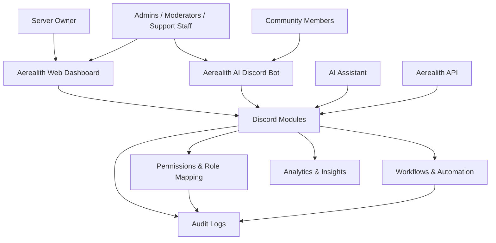
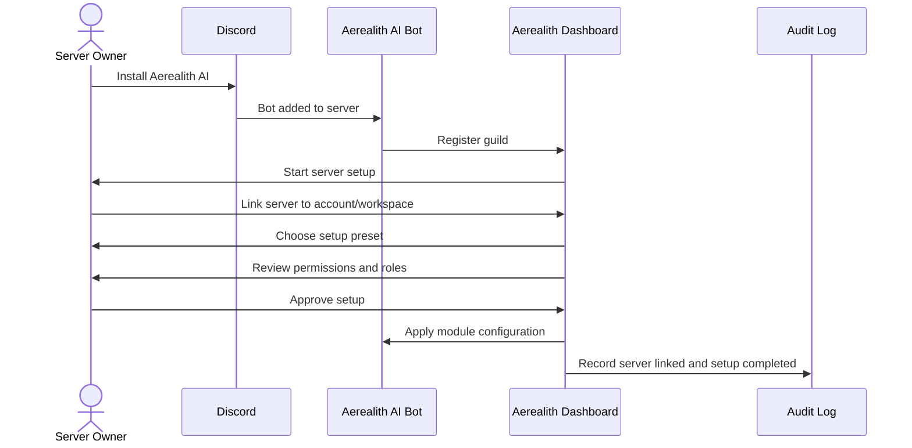
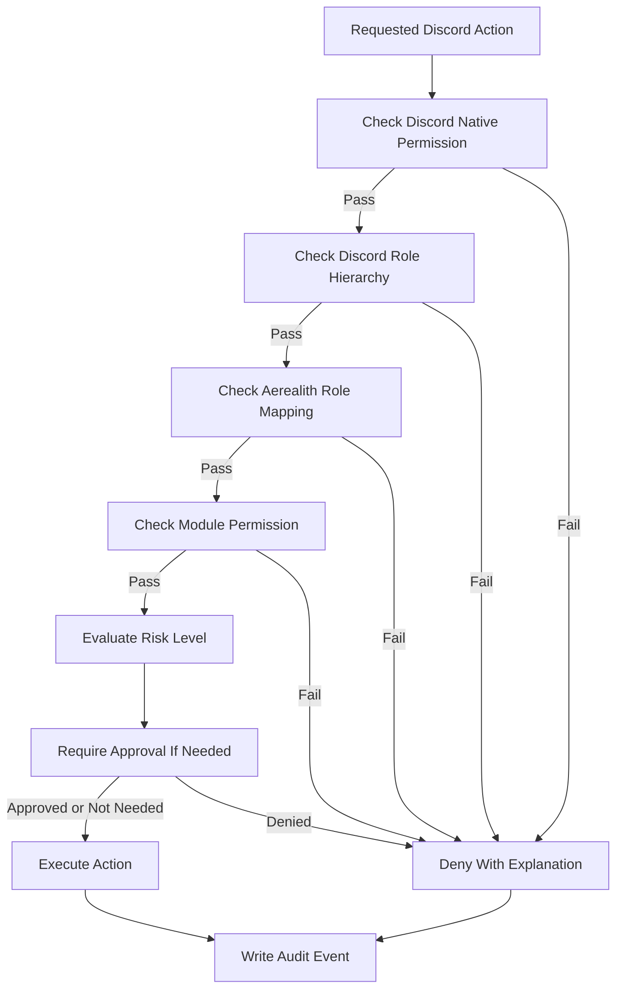
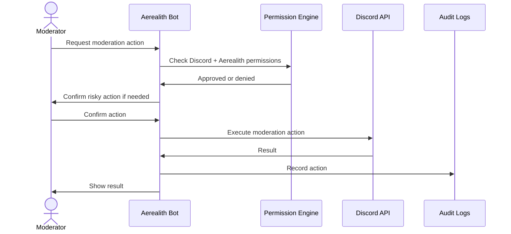

# Discord Platform

Status: Target specification
Document Type: Target Discord Product Specification
Implementation State: Intended and phased Discord capabilities; verify current availability in [Current State](../CURRENT_STATE.md)
Authority: Target product behavior; [Project Overview](../Project-Overview.md) defines product identity and boundaries

Aerealith is the platform; Aerealith AI is its assistant/application layer.
Aerealith treats Discord as a major first-party product area.

Discord is not just another integration.

It is the first flagship community surface for proving that Aerealith can manage online communities through modular, trusted, user-controlled systems.

The Discord Platform should combine the strengths of modern Discord management bots, ticket systems, moderation tools, role tools, community engagement systems, automation platforms, and AI assistance into one cohesive Aerealith experience.

---

## Purpose

This document defines the Aerealith Discord Platform.

It explains:

- what the Discord product is
- who it serves
- what modules it should include
- how server setup should work
- how permissions and roles should work
- how moderation should behave
- how tickets should work
- how community engagement should work
- how AI should assist Discord communities
- how Discord connects to workflows, dashboards, analytics, and audit logs
- what belongs in MVP, post-MVP, and future releases

This is a product requirements and strategy document.

It is not a full command reference, database schema, Discord API implementation guide, or bot source-code specification.

Detailed command specifications should live in a later document:

```text
docs/product/Discord Commands.md
```

---

## Product Position

Aerealith Discord is:

> A modular operating layer for Discord communities.

It should help owners, admins, moderators, staff, creators, and community members manage Discord servers safely from one place.

Aerealith Discord should:

- reduce the need for multiple bots
- provide modular server tools
- support moderation and safety
- support tickets and support workflows
- support community engagement
- support leveling, roles, music, games, dice, and utility tools
- provide dashboards and analytics
- connect Discord to Aerealith workflows
- expose safe AI assistance
- keep every meaningful action auditable
- keep server owners in control

---

## Discord Philosophy

Aerealith should make Discord community management feel powerful without feeling messy.

The Discord Platform should be:

- modular
- easy to configure
- safe by default
- permission-aware
- role-aware
- staff-friendly
- member-friendly
- beginner-friendly
- power-user capable
- auditable
- AI-assisted, not AI-controlled
- useful without AI
- respectful of Discord platform rules
- exportable where practical

A server owner should be able to install Aerealith, enable modules, choose presets, create common staff roles, configure permissions, and start managing a server without needing five separate bots.

---

## Core Product Goal

Aerealith Discord should accomplish all of the following:

1. Replace the need for many disconnected Discord bots.
2. Become a modular operating layer for Discord communities.
3. Provide AI-assisted Discord management.
4. Help owners and staff manage communities safely from one place.
5. Connect Discord activity to the broader Aerealith platform.

The strongest framing is:

> Aerealith Discord helps communities run safer, smarter, more organized servers through modular tools, trusted automation, and owner-controlled AI assistance.

---

## Official Bot Identity

The official Discord bot/app should be named:

```text
Aerealith AI
```

The official bot identity should be stable and recognizable.

Assistant personalities, nicknames, server-specific voices, or themed personas can be customizable later, but the official app/bot should remain clearly identified as Aerealith AI.

---

## Primary Discord Personas

| Persona                        | Needs                                                                                                 |
| ------------------------------ | ----------------------------------------------------------------------------------------------------- |
| Discord Server Owner           | Wants one platform to configure, govern, monetize, protect, and grow the server.                      |
| Discord Admin / Manager        | Needs module settings, permissions, staff controls, logs, roles, automation, and dashboards.          |
| Discord Moderator / Staff      | Needs fast, safe moderation, tickets, notes, history, escalation, and audit trails.                   |
| Discord Support Staff          | Needs ticket queues, transcripts, forms, assignments, and user context.                               |
| Discord Community Member       | Needs clear onboarding, roles, tickets, fair moderation, reminders, music, games, and engagement.     |
| Creator / Streamer             | Needs announcements, roles, content notifications, community analytics, events, and engagement tools. |
| Roleplay / Community Organizer | Needs persona tools, dice, events, roles, tickets, forms, and moderation boundaries.                  |

---

## Discord Product Surfaces

Aerealith Discord should exist across multiple surfaces.

| Surface           | Purpose                                                                                            |
| ----------------- | -------------------------------------------------------------------------------------------------- |
| Discord Bot       | Slash commands, buttons, modals, messages, automod, tickets, moderation, engagement, utility.      |
| Web Dashboard     | Server overview, module configuration, permissions, analytics, logs, tickets, roles, settings.     |
| AI Assistant      | Staff assistance, summaries, moderation suggestions, configuration help, workflow recommendations. |
| API               | Programmatic access to Discord module configuration, logs, tickets, workflows, and analytics.      |
| Developer Portal  | Documentation for Discord modules, events, permissions, webhooks, and future plugin support.       |
| Mobile App Later  | Approvals, alerts, ticket updates, moderation review, server summaries.                            |
| Desktop App Later | Fast staff actions, notifications, server monitoring, quick commands.                              |

---

## Discord Platform Model



---

## Discord Setup

---

## Server Installation Flow

The server installation flow should be clear and guided.



---

## Server Linking

Server linking connects a Discord guild to an Aerealith account or workspace.

Server linking should support:

- bot install detection
- Discord OAuth verification
- owner/admin validation
- guild ownership check
- workspace selection
- module preset selection
- permission review
- common role setup
- dashboard creation
- audit event creation

Server linking should never assume ownership only because the bot is installed.

The user linking the server must have appropriate Discord permissions.

---

## Setup Presets

Aerealith should provide guided presets for common server types.

| Preset                | Purpose                                                                           |
| --------------------- | --------------------------------------------------------------------------------- |
| Simple Community      | Basic moderation, welcome, tickets, roles, and logs.                              |
| Gaming Community      | Moderation, tickets, roles, events, leveling, music, and announcements.           |
| Creator Community     | Creator notifications, roles, announcements, tickets, engagement, and analytics.  |
| Developer Community   | GitHub links, support tickets, docs links, announcements, roles, and moderation.  |
| Roleplay Community    | Persona tools, dice, roles, forms, tickets, moderation, and safety controls.      |
| Private Friend Server | Lightweight utilities, music, reminders, roles, dice, and fun commands.           |
| Large Public Server   | Strict moderation, automod, verification, audit logs, analytics, staff workflows. |

Presets should be editable after setup.

---

## Built-In Roles

Aerealith should support built-in common role concepts.

These are Aerealith role concepts that can map to Discord roles.

If the configured Discord roles do not exist, Aerealith should offer to create them for the server.

Aerealith should never silently create powerful roles without owner/admin approval.

---

## Common Staff Roles

| Aerealith Role    | Purpose                                                                           |
| ----------------- | --------------------------------------------------------------------------------- |
| Server Owner      | Highest authority for the linked Discord server.                                  |
| Aerealith Admin   | Can configure Aerealith modules and server settings.                              |
| Manager           | Can manage staff workflows, tickets, logs, roles, and module behavior.            |
| Moderator         | Can perform moderation actions according to granted permissions.                  |
| Support Staff     | Can view and respond to tickets.                                                  |
| Trial Staff       | Limited staff permissions for new moderators.                                     |
| Read-Only Auditor | Can view logs, tickets, reports, and audit history without changing settings.     |
| Event Manager     | Can manage events, announcements, reminders, giveaways, and community activities. |
| Music DJ          | Can manage music queues, playback, and music module settings where allowed.       |
| Community Helper  | Can assist with support and onboarding without moderation powers.                 |

---

## Common Member Roles

| Aerealith Role         | Purpose                                                    |
| ---------------------- | ---------------------------------------------------------- |
| Member                 | Standard verified community member.                        |
| New Member             | Recently joined member with limited access if configured.  |
| Verified               | Member who completed verification/onboarding.              |
| Muted / Restricted     | Member with limited communication access.                  |
| Subscriber / Supporter | Paid supporter, patron, member, or premium community role. |
| VIP                    | Special access or recognition role.                        |
| Bot                    | Role for bots.                                             |
| Event Participant      | Role used for events or temporary activities.              |
| Level Roles            | Roles assigned through leveling progression.               |

---

## Role Creation Behavior

When a server does not have recommended roles, Aerealith should ask:

```text
Aerealith can create the recommended staff roles for this server.

Roles to create:
- Aerealith Admin
- Manager
- Moderator
- Support Staff
- Trial Staff
- Read-Only Auditor
- Event Manager
- Music DJ

You can rename, remove, or map these roles before applying.
```

Role creation should include:

- preview before creation
- permission explanation
- owner/admin approval
- safe default permissions
- role hierarchy warnings
- audit log entry
- rollback guidance where possible

---

## Discord Permission Model

Aerealith should use both Discord-native permissions and Aerealith module permissions.

Discord permissions define what Discord allows.

Aerealith permissions define what Aerealith modules allow.

Both must pass before a meaningful action is performed.

---

## Permission Layers

| Layer                  | Purpose                                                                                      |
| ---------------------- | -------------------------------------------------------------------------------------------- |
| Discord Permissions    | Native Discord permissions such as Manage Messages, Kick Members, Ban Members, Manage Roles. |
| Discord Role Hierarchy | Prevents actions against users with equal or higher roles.                                   |
| Aerealith Role Mapping | Maps Discord roles to Aerealith staff concepts.                                              |
| Module Permissions     | Controls who can use specific Aerealith modules.                                             |
| Action Permissions     | Controls specific actions such as warn, timeout, close ticket, purge messages.               |
| Approval Rules         | Requires confirmation for risky actions.                                                     |
| Audit Requirements     | Records meaningful actions.                                                                  |

---

## Permission Decision Flow



---

## Discord Module Categories

Aerealith Discord modules should be grouped into clear categories.

| Category             | Purpose                                                                            |
| -------------------- | ---------------------------------------------------------------------------------- |
| Core                 | Bot operation, guild linking, permissions, role mapping, module registry.          |
| Moderation           | Manual moderation actions, history, notes, warnings, timeouts, bans, purges.       |
| Automod              | Automated safety rules, filtering, spam detection, raid protection, escalation.    |
| Tickets & Support    | Ticket panels, staff queues, forms, transcripts, escalation, appeals.              |
| Logging & Audit      | Server logs, staff actions, automod actions, config changes, transcript events.    |
| Roles & Onboarding   | Welcome, verification, autoroles, reaction roles, self roles, level roles.         |
| Community Engagement | Levels, XP, reputation, economy later, starboard, polls, giveaways, events.        |
| Utility              | AFK, reminders, tags, autoresponders, embeds, slowmode, server/user info.          |
| Music & Voice        | Music playback, queue, DJ roles, temporary voice channels, voice tools.            |
| Games & Fun          | Dice rolling, randomizers, games, memes, fun commands, roleplay utilities.         |
| Creator & Social     | YouTube, Twitch, TikTok, Kick, Reddit, GitHub, and content notifications.          |
| Analytics            | Server activity, staff activity, tickets, moderation, growth, engagement.          |
| AI Assistance        | Summaries, staff assistant, moderation suggestions, ticket summaries, config help. |

---

## MVP Discord Modules

The MVP should include the core modules required to make Aerealith useful and trustworthy for early Discord communities.

| Module ID                      | Module                     | Status | Risk   | Purpose                                                                  |
| ------------------------------ | -------------------------- | ------ | ------ | ------------------------------------------------------------------------ |
| mod.discord.core               | Core Discord Integration   | MVP    | Medium | Supports bot operation and guild connection.                             |
| mod.discord.server-linking     | Server Linking             | MVP    | Medium | Links Discord guilds to Aerealith accounts/workspaces.                   |
| mod.discord.permissions        | Permissions / Role Mapping | MVP    | High   | Maps Discord roles to Aerealith permissions.                             |
| mod.discord.moderation         | Moderation Basics          | MVP    | High   | Supports warn, timeout, kick, ban, unban, delete, purge, notes, history. |
| mod.discord.automod            | Automod Foundation         | MVP    | High   | Provides basic automated moderation rules and staff alerts.              |
| mod.discord.tickets            | Tickets                    | MVP    | Medium | Supports ticket panels and basic support workflows.                      |
| mod.discord.ticket-transcripts | Ticket Transcripts         | MVP    | Medium | Stores and/or posts ticket transcripts.                                  |
| mod.discord.logging            | Logging / Audit Events     | MVP    | Medium | Tracks meaningful server, staff, and module actions.                     |
| mod.discord.basic-welcome      | Basic Welcome              | MVP    | Low    | Sends basic welcome/goodbye messages.                                    |
| mod.discord.basic-roles        | Basic Roles                | MVP    | Medium | Supports common role creation and role mapping.                          |
| mod.discord.basic-analytics    | Basic Activity Summaries   | MVP    | Low    | Provides simple audit/activity summaries.                                |

---

## Full Discord Module Catalog

---

## Core Modules

| Module ID                   | Module                     | Status   | Purpose                                                            |
| --------------------------- | -------------------------- | -------- | ------------------------------------------------------------------ |
| mod.discord.core            | Core Discord Integration   | MVP      | Bot connection, guild identity, event handling.                    |
| mod.discord.server-linking  | Server Linking             | MVP      | Links Discord guilds to Aerealith accounts/workspaces.             |
| mod.discord.permissions     | Permissions / Role Mapping | MVP      | Maps roles and permissions into Aerealith controls.                |
| mod.discord.module-manager  | Module Manager             | MVP      | Enables, disables, and configures Discord modules.                 |
| mod.discord.command-manager | Command Manager            | MVP      | Enables/disables commands and command categories.                  |
| mod.discord.health          | Bot Health                 | Post-MVP | Shows latency, missing permissions, shard state, and event status. |

---

## Moderation Modules

| Module ID                   | Module             | Status   | Purpose                                                     |
| --------------------------- | ------------------ | -------- | ----------------------------------------------------------- |
| mod.discord.moderation      | Moderation Basics  | MVP      | Manual staff moderation actions.                            |
| mod.discord.mod-history     | Moderation History | MVP      | User warnings, punishments, notes, and prior actions.       |
| mod.discord.staff-notes     | Staff Notes        | MVP      | Private notes about users or incidents.                     |
| mod.discord.purge           | Message Purge      | MVP      | Delete message batches with confirmation and audit logging. |
| mod.discord.appeals         | Appeals            | Post-MVP | Members can appeal moderation actions.                      |
| mod.discord.case-management | Case Management    | Post-MVP | Groups moderation actions into cases.                       |
| mod.discord.strikes         | Strike System      | Post-MVP | Escalating strike rules and expiration policies.            |
| mod.discord.mass-actions    | Mass Moderation    | Future   | Bulk actions during raids or incidents.                     |

---

## Automod Modules

| Module ID                    | Module                | Status         | Purpose                                                            |
| ---------------------------- | --------------------- | -------------- | ------------------------------------------------------------------ |
| mod.discord.automod          | Automod Foundation    | MVP            | Basic rule-based safety automation.                                |
| mod.discord.word-filter      | Blocked Words         | MVP            | Filters configured words or phrases.                               |
| mod.discord.spam-filter      | Spam Detection        | MVP            | Detects repeated messages and spam bursts.                         |
| mod.discord.mention-filter   | Mention Protection    | MVP            | Detects excessive mentions.                                        |
| mod.discord.link-filter      | Link Filtering        | MVP            | Filters unsafe or disallowed links.                                |
| mod.discord.invite-filter    | Invite Filtering      | MVP            | Blocks Discord invites where configured.                           |
| mod.discord.raid-alerts      | Raid Suspicion Alerts | MVP / Post-MVP | Detects suspicious join or message patterns.                       |
| mod.discord.escalation-rules | Escalation Rules      | Post-MVP       | Escalates repeat behavior into staff alerts or actions.            |
| mod.discord.advanced-automod | Advanced Automod      | Future         | More complex rules, scoring, AI assistance, and behavior patterns. |

---

## Tickets & Support Modules

| Module ID                      | Module                     | Status   | Purpose                                               |
| ------------------------------ | -------------------------- | -------- | ----------------------------------------------------- |
| mod.discord.tickets            | Tickets                    | MVP      | Ticket panels, creation, staff response.              |
| mod.discord.ticket-panels      | Ticket Panels              | MVP      | Buttons/select menus for opening tickets.             |
| mod.discord.ticket-transcripts | Ticket Transcripts         | MVP      | Stores and/or posts ticket transcripts.               |
| mod.discord.ticket-roles       | Ticket Staff Roles         | MVP      | Controls who can view and manage tickets.             |
| mod.discord.ticket-categories  | Ticket Categories          | Post-MVP | Category-based ticket routing.                        |
| mod.discord.ticket-forms       | Ticket Forms               | Post-MVP | Forms before ticket creation.                         |
| mod.discord.ticket-assignments | Ticket Assignments         | Post-MVP | Assign tickets to staff members.                      |
| mod.discord.ticket-escalation  | Ticket Escalation          | Post-MVP | Escalate tickets to managers/admins.                  |
| mod.discord.ticket-sla         | Ticket SLA / Stale Tickets | Future   | Tracks stale tickets and response targets.            |
| mod.discord.ai-ticket-helper   | AI Ticket Helper           | Future   | Summaries, suggested replies, and context assistance. |

---

## Logging & Audit Modules

| Module ID                | Module                 | Status   | Purpose                                                    |
| ------------------------ | ---------------------- | -------- | ---------------------------------------------------------- |
| mod.discord.logging      | Logging / Audit Events | MVP      | Core Discord audit event tracking.                         |
| mod.discord.action-log   | Action Log             | MVP      | Logs staff and module actions.                             |
| mod.discord.message-log  | Message Log            | Post-MVP | Logs message edits/deletes where configured and compliant. |
| mod.discord.member-log   | Member Log             | Post-MVP | Join, leave, ban, unban, role changes.                     |
| mod.discord.voice-log    | Voice Log              | Post-MVP | Voice join, leave, move events where configured.           |
| mod.discord.config-log   | Configuration Log      | MVP      | Logs module and setting changes.                           |
| mod.discord.audit-export | Audit Export           | Future   | Exports audit logs for community ownership and review.     |

---

## Roles & Onboarding Modules

| Module ID                  | Module                | Status         | Purpose                                                |
| -------------------------- | --------------------- | -------------- | ------------------------------------------------------ |
| mod.discord.basic-roles    | Basic Roles           | MVP            | Create/map common staff and member roles.              |
| mod.discord.autoroles      | Autoroles             | Post-MVP       | Assign roles on join or after conditions.              |
| mod.discord.reaction-roles | Reaction / Self Roles | Post-MVP       | Members self-assign roles.                             |
| mod.discord.role-menus     | Role Menus            | Post-MVP       | Select menus for self-role assignment.                 |
| mod.discord.level-roles    | Level Roles           | Post-MVP       | Assign roles based on level/XP.                        |
| mod.discord.welcome        | Welcome & Goodbye     | MVP / Post-MVP | Welcome, goodbye, and intro messages.                  |
| mod.discord.onboarding     | Onboarding Flow       | Post-MVP       | Guided member onboarding.                              |
| mod.discord.verification   | Verification          | Post-MVP       | Verification gates, rules acceptance, anti-raid steps. |
| mod.discord.temp-roles     | Temporary Roles       | Future         | Time-limited role assignment.                          |
| mod.discord.role-sync      | External Role Sync    | Future         | Sync roles from Patreon, Twitch, GitHub, etc.          |

---

## Community Engagement Modules

| Module ID                | Module                 | Status   | Purpose                                        |
| ------------------------ | ---------------------- | -------- | ---------------------------------------------- |
| mod.discord.leveling     | Leveling System        | Post-MVP | XP, levels, rank cards, level roles.           |
| mod.discord.reputation   | Reputation             | Future   | Member kudos/rep system.                       |
| mod.discord.leaderboards | Leaderboards           | Post-MVP | Server leaderboards for XP, rep, activity.     |
| mod.discord.starboard    | Starboard / Highlights | Post-MVP | Highlight community-favorite messages.         |
| mod.discord.giveaways    | Giveaways              | Post-MVP | Giveaway creation, entries, winners.           |
| mod.discord.polls        | Polls                  | Post-MVP | Community polls and voting.                    |
| mod.discord.events       | Events                 | Post-MVP | Community events, RSVPs, reminders.            |
| mod.discord.economy      | Economy System         | Future   | Server currency, shop, rewards, and balances.  |
| mod.discord.challenges   | Challenges / Quests    | Future   | Community challenges and activity goals.       |
| mod.discord.birthdays    | Birthdays              | Future   | Birthday reminders and roles where configured. |

---

## Utility Modules

| Module ID                 | Module           | Status         | Purpose                                    |
| ------------------------- | ---------------- | -------------- | ------------------------------------------ |
| mod.discord.afk           | AFK              | Post-MVP       | Members can set AFK status.                |
| mod.discord.reminders     | Reminders        | Post-MVP       | User and server reminders.                 |
| mod.discord.tags          | Tags             | Post-MVP       | Reusable text snippets.                    |
| mod.discord.autoresponder | Autoresponder    | Post-MVP       | Responds to configured text triggers.      |
| mod.discord.embeds        | Message Embedder | Post-MVP       | Create and edit managed embeds.            |
| mod.discord.slowmode      | Slowmode         | Post-MVP       | Manage channel slowmode.                   |
| mod.discord.auto-message  | Auto Message     | Post-MVP       | Timed channel messages.                    |
| mod.discord.auto-delete   | Auto Delete      | Post-MVP       | Delete messages matching configured rules. |
| mod.discord.server-info   | Server Info      | MVP / Post-MVP | Shows server information.                  |
| mod.discord.user-info     | User Info        | MVP / Post-MVP | Shows user info and join data.             |
| mod.discord.avatar        | Avatar           | Post-MVP       | Shows user avatars.                        |
| mod.discord.profile       | Profile          | Future         | Server/global profile cards.               |

---

## Music & Voice Modules

| Module ID                      | Module             | Status   | Purpose                                         |
| ------------------------------ | ------------------ | -------- | ----------------------------------------------- |
| mod.discord.music              | Music              | Post-MVP | Music playback in voice channels.               |
| mod.discord.music-queue        | Music Queue        | Post-MVP | Queue, skip, pause, resume, shuffle, repeat.    |
| mod.discord.music-dj           | DJ Controls        | Post-MVP | DJ role and playback permissions.               |
| mod.discord.music-playlists    | Playlists          | Future   | Saved queues and playlists.                     |
| mod.discord.voice-tools        | Voice Tools        | Post-MVP | Move users, voice moderation, voice utilities.  |
| mod.discord.voice-text-linking | Voice Text Linking | Future   | Create linked text channels for voice sessions. |
| mod.discord.temp-channels      | Temporary Channels | Future   | Temporary voice/text channels.                  |

Music features must respect platform rules, provider terms, copyright requirements, and rate limits.

---

## Games, Dice & Fun Modules

| Module ID                  | Module                | Status   | Purpose                                                   |
| -------------------------- | --------------------- | -------- | --------------------------------------------------------- |
| mod.discord.dice           | Dice Rolling          | Post-MVP | Roll dice for games, tabletop, roleplay, randomness.      |
| mod.discord.randomizer     | Randomizer            | Post-MVP | Coin flips, random picks, number rolls.                   |
| mod.discord.fun            | Fun Commands          | Post-MVP | Lightweight community fun commands.                       |
| mod.discord.rps            | Rock Paper Scissors   | Post-MVP | Simple member game.                                       |
| mod.discord.trivia         | Trivia                | Future   | Trivia games and quizzes.                                 |
| mod.discord.memes          | Memes                 | Future   | Meme-style commands where appropriate.                    |
| mod.discord.roleplay-tools | Roleplay Tools        | Future   | Safe roleplay helper tools.                               |
| mod.discord.persona-tools  | Persona / Proxy Tools | Future   | Tupperbox-style persona/proxy tools with safety controls. |

Dice rolling should support common formats such as:

```text
/roll d20
/roll 2d6
/roll 4d6 drop-lowest
/roll d100
/roll advantage
/roll disadvantage
```

---

## Creator & Social Modules

| Module ID              | Module                | Status   | Purpose                                                 |
| ---------------------- | --------------------- | -------- | ------------------------------------------------------- |
| mod.discord.youtube    | YouTube Notifications | Post-MVP | Notify when creators post videos.                       |
| mod.discord.twitch     | Twitch Notifications  | Post-MVP | Notify when streamers go live.                          |
| mod.discord.tiktok     | TikTok Notifications  | Future   | Notify when creators post videos.                       |
| mod.discord.kick       | Kick Notifications    | Future   | Notify when streamers go live.                          |
| mod.discord.reddit     | Reddit Feed           | Future   | Post updates from subreddits.                           |
| mod.discord.github     | GitHub Updates        | Future   | Repository, release, issue, and workflow notifications. |
| mod.discord.steam      | Steam Updates         | Future   | Game/server/community related updates.                  |
| mod.discord.epic-games | Epic Games Updates    | Future   | Game-related notifications where useful.                |

---

## Analytics Modules

| Module ID                        | Module                   | Status   | Purpose                                                  |
| -------------------------------- | ------------------------ | -------- | -------------------------------------------------------- |
| mod.discord.basic-analytics      | Basic Activity Summaries | MVP      | Basic server activity and audit summaries.               |
| mod.discord.server-analytics     | Server Analytics         | Post-MVP | Member growth, activity, retention, engagement.          |
| mod.discord.moderation-analytics | Moderation Analytics     | Post-MVP | Warns, timeouts, bans, automod triggers, staff activity. |
| mod.discord.ticket-analytics     | Ticket Analytics         | Post-MVP | Ticket volume, response time, close rate, categories.    |
| mod.discord.engagement-analytics | Engagement Analytics     | Post-MVP | Levels, messages, reactions, events, participation.      |
| mod.discord.staff-analytics      | Staff Analytics          | Future   | Staff workload, action volume, ticket activity.          |
| mod.discord.health-report        | Community Health Report  | Future   | AI-assisted community health summaries.                  |

---

## Moderation

Moderation should be fast, safe, auditable, and clear.

Moderation should support both Discord-native staff workflows and Aerealith dashboard review.

---

## MVP Moderation Actions

MVP should support:

```text
Warn
Timeout
Kick
Ban
Unban
Delete message
Purge messages
Add staff note
View moderation history
View user context
View case details
```

Purge messages should be included, but treated as high-risk.

Purge actions should require:

- permission check
- role hierarchy check
- confirmation
- amount limit
- reason
- audit log
- optional log channel post
- clear irreversible-action warning

---

## Moderation Action Risk

| Action          | Risk     | Approval Behavior                        |
| --------------- | -------- | ---------------------------------------- |
| View user info  | Low      | No extra approval if permissioned.       |
| Add staff note  | Medium   | Reason required.                         |
| Warn            | Medium   | Reason required.                         |
| Delete message  | High     | Reason recommended, audit required.      |
| Purge messages  | High     | Confirmation required.                   |
| Timeout         | High     | Duration and reason required.            |
| Kick            | High     | Confirmation and reason required.        |
| Ban             | High     | Strong confirmation and reason required. |
| Unban           | Medium   | Reason required.                         |
| Mass moderation | Critical | Future only, strict approval.            |

---

## Moderation Flow



---

## Automod

Automod should protect communities while keeping owners and staff in control.

MVP automod should focus on rule-based protection, staff alerts, and safe escalation.

AI moderation may assist later, but should not automatically punish users by default.

---

## Automod MVP Features

| Feature                    | Status                     |
| -------------------------- | -------------------------- |
| Blocked words              | MVP                        |
| Spam detection             | MVP                        |
| Repeated message detection | MVP                        |
| Excessive mentions         | MVP                        |
| Link filtering             | MVP                        |
| Invite filtering           | MVP                        |
| Staff alerts               | MVP                        |
| Basic escalation rules     | MVP / Post-MVP             |
| New account suspicion      | Post-MVP                   |
| Raid suspicion             | MVP / Post-MVP             |
| Advanced behavior scoring  | Future                     |
| AI moderation suggestions  | MVP / Post-MVP             |
| AI automatic punishment    | Future, strict opt-in only |

---

## AI Moderation Safety

AI should not automatically punish users in MVP.

MVP AI moderation should support:

- summarizing incidents
- identifying possible rule violations
- suggesting actions to staff
- helping write clear moderation reasons
- grouping context
- identifying repeated behavior patterns

Automatic AI-based punishment should only be considered later when:

- server owner explicitly enables it
- rules are strict and clear
- actions are low-risk or tightly scoped
- repeated approved behavior exists
- audit logs are mandatory
- staff can review outcomes
- automation can be disabled immediately

---

## Tickets

Tickets should support server help, moderation appeals, applications, support requests, reports, and community workflows.

MVP should start with ticket panels using buttons or select menus.

Forms and advanced workflows should come post-MVP.

---

## Ticket MVP Features

| Feature                            | Status   |
| ---------------------------------- | -------- |
| Ticket panel                       | MVP      |
| Button/select menu ticket creation | MVP      |
| Private ticket channel creation    | MVP      |
| Staff role access                  | MVP      |
| Ticket close                       | MVP      |
| Ticket reason/category label       | MVP      |
| Ticket transcript                  | MVP      |
| Ticket log channel                 | MVP      |
| Ticket audit event                 | MVP      |
| Ticket assignment                  | Post-MVP |
| Forms before ticket creation       | Post-MVP |
| Ticket escalation                  | Post-MVP |
| Appeals workflow                   | Post-MVP |
| AI ticket summaries                | Future   |

---

## Ticket Transcript Storage

Ticket transcripts should be configurable.

A server should be able to choose:

```text
Store transcripts in Aerealith
Post transcripts to a Discord log channel
Do both
Disable transcript storage where appropriate
Export transcripts later
```

Transcript settings should explain:

- what is stored
- where it is stored
- who can access it
- how long it is retained
- how it can be exported
- how deletion works
- what Discord data is included

---

## Community Engagement

Community engagement is a major Discord product area.

Aerealith should not only moderate communities.

It should help communities feel alive.

---

## Engagement Features

| Feature      | Status   | Purpose                                          |
| ------------ | -------- | ------------------------------------------------ |
| Leveling     | Post-MVP | Reward activity with XP and levels.              |
| Level Roles  | Post-MVP | Assign roles based on level milestones.          |
| Leaderboards | Post-MVP | Show top members by XP, activity, or reputation. |
| Reputation   | Future   | Allow members to recognize helpful users.        |
| Giveaways    | Post-MVP | Run community giveaways.                         |
| Polls        | Post-MVP | Gather community feedback.                       |
| Events       | Post-MVP | Schedule and remind users about events.          |
| Starboard    | Post-MVP | Highlight community-favorite messages.           |
| Challenges   | Future   | Server-wide goals and quests.                    |
| Economy      | Future   | Currency, rewards, shops, and engagement loops.  |

---

## Leveling System

The leveling system should support:

- XP per message
- cooldowns
- ignored channels
- ignored roles
- level-up messages
- level cards
- rank command
- leaderboard
- role rewards
- XP multipliers later
- import/export later

Leveling must avoid encouraging spam.

Anti-spam and cooldown rules should be required.

---

## Music Module

Aerealith should include a music module.

The music module should support community listening while respecting platform rules, provider restrictions, copyright constraints, and Discord limitations.

---

## Music Features

| Feature             | Status   |
| ------------------- | -------- |
| Join voice channel  | Post-MVP |
| Leave voice channel | Post-MVP |
| Play track          | Post-MVP |
| Pause/resume        | Post-MVP |
| Skip                | Post-MVP |
| Queue               | Post-MVP |
| Shuffle             | Post-MVP |
| Repeat              | Post-MVP |
| Now playing         | Post-MVP |
| Volume controls     | Post-MVP |
| DJ role             | Post-MVP |
| Vote skip           | Future   |
| Playlists           | Future   |
| Saved queues        | Future   |
| Music permissions   | Post-MVP |
| Music audit events  | Post-MVP |

---

## Music Safety and Rules

Music should support:

- DJ role control
- channel restrictions
- queue limits
- rate limits
- volume limits
- content/provider compliance
- audit logs for staff-level changes
- graceful failure when sources are unavailable

---

## Dice, Games & Fun

Aerealith should support lightweight fun and utility tools.

These tools help communities engage without needing separate fun bots.

---

## Dice Rolling

Dice rolling should support:

```text
/roll d20
/roll 2d6
/roll 1d100
/roll 4d6 drop-lowest
/roll advantage
/roll disadvantage
```

Future dice support may include:

- named rolls
- character presets
- private GM rolls
- public rolls
- roll history
- roleplay campaign tools
- custom dice formulas

---

## Fun Commands

Fun commands may include:

- coin flip
- random number
- random choice
- rock paper scissors
- dad joke
- cat/dog/pug images
- avatar
- profile
- server info
- user info
- memes later
- trivia later

Fun modules should be easy to disable for professional communities.

---

## AI in Discord

AI should be helpful inside Discord, but controlled carefully.

AI should assist owners and staff before it acts directly.

---

## Early AI Discord Features

| Feature                    | Status                     |
| -------------------------- | -------------------------- |
| Staff assistant commands   | MVP / Post-MVP             |
| Incident summaries         | MVP / Post-MVP             |
| Moderation suggestions     | MVP / Post-MVP             |
| Ticket summaries           | Post-MVP                   |
| Rule explanation help      | Post-MVP                   |
| Configuration help         | Post-MVP                   |
| Server activity summaries  | Post-MVP                   |
| Community health summaries | Future                     |
| AI support agent           | Future                     |
| AI automatic moderation    | Future, strict opt-in only |

---

## AI Rules

AI in Discord must:

- disclose when AI is involved
- avoid silent punishment
- avoid impersonating staff
- respect server settings
- respect user privacy
- follow module permissions
- create audit logs for meaningful actions
- ask for approval before risky actions
- explain uncertainty when needed
- be disable-friendly

---

## Dashboard Experience

The Discord dashboard should feel like a module grid and control center.

It should support:

- server overview
- bot install/link status
- module cards
- module enable/disable toggles
- module settings
- command settings
- permission/role mapping
- common role creation
- moderation logs
- ticket logs
- audit events
- basic analytics
- staff management
- alerts for missing permissions
- upgrade/entitlement notices later
- search
- presets
- help links

---

## Dashboard Module Card

Each module card should show:

```text
Module name
Short description
Status
Enabled/disabled toggle
Risk level
Required permissions
Settings button
Help button
Premium/plan label later
Missing permission warning
Dependency warning
```

---

## Dashboard Navigation

Recommended dashboard sections:

```text
Dashboard
Modules
Commands
Roles & Permissions
Moderation
Automod
Tickets
Logs
Analytics
Community Engagement
Music & Voice
Utility
Creator Notifications
Server Listing
Settings
```

---

## Commands

This document should include command examples only.

A full command specification should live in:

```text
docs/product/Discord Commands.md
```

---

## Example Commands

```text
/setup
/modules
/module enable tickets
/module disable music
/roles setup
/roles create-common
/mod warn
/mod timeout
/mod purge
/ticket panel create
/ticket close
/ticket transcript
/level rank
/leaderboard
/music play
/music skip
/roll d20
/remind me
/server
/user
```

---

## Logging & Audit Events

Every meaningful Discord action should create an Aerealith audit event.

Examples:

```text
discord.guild.linked
discord.module.enabled
discord.module.disabled
discord.module.config.updated
discord.role.created
discord.role.mapped
discord.user.warned
discord.user.timed_out
discord.user.kicked
discord.user.banned
discord.user.unbanned
discord.message.deleted
discord.messages.purged
discord.automod.rule.triggered
discord.ticket.created
discord.ticket.closed
discord.ticket.transcript.created
discord.level.role.assigned
discord.music.queue.updated
discord.giveaway.created
discord.form.submitted
```

Audit logs should include:

- actor
- target
- server
- channel
- module
- action
- reason
- result
- timestamp
- permissions used
- risk level
- approval source
- related ticket/case/workflow where applicable

---

## Workflows & Automation

Discord should connect to Aerealith workflows.

Examples:

```text
When a ticket is stale, notify support staff.
When a user receives 3 warnings, alert moderators.
When a creator goes live, post an announcement.
When a giveaway ends, announce the winner.
When automod triggers repeatedly, create a staff review ticket.
When a new member joins, start onboarding.
When a level milestone is reached, assign a role.
```

Automation should remain permissioned, auditable, and revocable.

---

## Community Data Ownership

Discord communities should own their community data.

This includes:

- module configuration
- role mappings
- moderation history
- ticket records
- ticket transcripts
- audit logs
- analytics
- forms
- server settings
- workflow configuration

Aerealith should support export where practical.

Export support may be post-MVP or future depending on data type.

---

## Platform Compliance

Aerealith Discord must comply with:

- Discord platform rules
- Discord API limits
- Discord bot permissions
- Discord privacy expectations
- applicable user safety requirements
- data retention requirements
- user consent expectations
- server owner/admin configuration choices

Aerealith should degrade gracefully when Discord API limits, permission failures, or outages occur.

---

## Discord Capability Boundaries

Aerealith Discord should be powerful, but not reckless.

## Not a Surveillance Bot

Aerealith should not collect Discord data simply because it can.

Logging must be configurable, purposeful, permissioned, and transparent.

## Not Fully Autonomous Moderation by Default

Aerealith should not silently punish users with AI.

AI moderation should begin as suggestions, summaries, and staff assistance.

## Not a Replacement for Discord Ownership

Server owners remain responsible for their communities.

Aerealith helps manage the server, but it does not own the server.

## Not a Black Box

Module actions, automod triggers, staff actions, AI involvement, and configuration changes should be visible and auditable.

## Not a Music Piracy Tool

The music module must respect platform rules, provider restrictions, copyright requirements, and technical limitations.

---

## MVP Discord Scope

The MVP Discord scope should include:

```text
Official Aerealith AI Discord bot
Server install flow
Server linking flow
Common role creation
Role and permission mapping
Module manager
Command manager
Moderation basics
Warn
Timeout
Kick
Ban
Unban
Delete message
Purge messages
Staff notes
Moderation history
Automod foundation
Blocked words
Spam detection
Excessive mentions
Link filtering
Invite filtering
Staff alerts
Tickets
Ticket panels
Ticket close
Ticket transcripts
Logging and audit events
Basic welcome messages
Basic dashboard
Basic activity summaries
```

---

## Post-MVP Discord Scope

Post-MVP should include:

```text
Welcome and onboarding
Verification
Autoroles
Reaction roles
Self roles
Leveling
Level roles
Leaderboards
Announcements
Forms
Custom commands
Reminders
Giveaways
Starboard
Polls
Events
Music
Voice tools
AFK
Tags
Autoresponder
Embeds
Slowmode
Auto messages
Auto delete
Creator notifications
Ticket forms
Ticket assignments
Ticket escalation
Moderation appeals
Server analytics
Ticket analytics
Moderation analytics
AI ticket summaries
AI staff assistant improvements
```

---

## Future Discord Scope

Future Discord capabilities may include:

```text
Persona/proxy-style tools
Roleplay community tools
Advanced automod
AI support agent
AI moderation assistant
Reputation system
Economy system
Challenges/quests
Advanced event management
Cross-server community networks
Marketplace Discord module packs
Private server templates
Self-hosted Discord module support
Advanced community health reports
Advanced staff analytics
External role sync
Temporary channels
Music playlists
Campaign dice tools
```

---

## Success Criteria

Aerealith Discord succeeds when:

- server owners need fewer bots
- admins can configure modules confidently
- moderators can act quickly and safely
- support staff can manage tickets cleanly
- members understand onboarding and support flows
- communities feel more active and organized
- music, dice, levels, and engagement tools reduce bot clutter
- staff actions are auditable
- risky actions require appropriate confirmation
- AI helps without taking control
- server data is exportable where practical
- Discord feels connected to the broader Aerealith platform

---

## Review Questions

Before adding a Discord feature, ask:

- Which Discord persona does this serve?
- Is this a module, command, workflow, setting, or integration?
- Should it be MVP, post-MVP, or future?
- What permissions does it require?
- What role should be allowed to use it?
- What risk level does it have?
- Does it need confirmation?
- Does it need an audit event?
- Does it affect member safety?
- Does it respect Discord platform rules?
- Can it be disabled?
- Can it be configured from the dashboard?
- Should it be API-accessible?
- Could it become a marketplace module or preset later?
- Does it reduce bot clutter?
- Does it keep the server owner in control?

---

## Final Standard

Aerealith Discord should become the trusted control layer for Discord communities.

It should combine moderation, tickets, roles, logging, engagement, music, games, utility, automation, analytics, and AI assistance into one modular platform.

The goal is not to copy every Discord bot feature blindly.

The goal is to bring the best community-management capabilities together in a way that is safer, clearer, more configurable, more auditable, and easier to trust.

Aerealith Discord should make communities easier to manage and more enjoyable to belong to.
