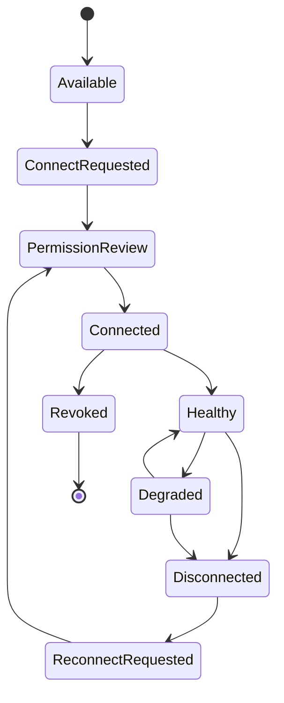
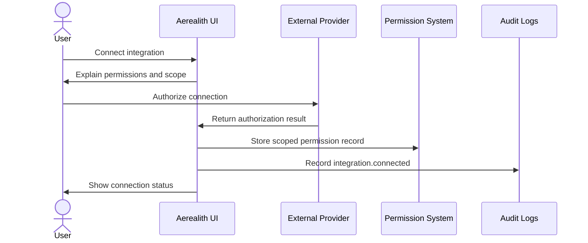

# Integrations

Aerealith AI is designed to connect the tools, platforms, services, communities, APIs, and systems users already rely on.

Integrations are how Aerealith becomes useful across the user’s real digital life.

Aerealith should integrate before replacing.

The goal is not to force users into a closed ecosystem.

The goal is to bring scattered tools together through one trusted, permissioned, explainable control layer.

---

## Purpose

This document defines integrations as a product area inside Aerealith AI.

It explains:

- what integrations are
- why integrations matter
- how integrations should be categorized
- how users connect external services
- how permissions and consent should work
- how integrations connect to modules, workflows, dashboards, memory, notifications, and AI
- how provider replacement should work
- what integrations belong in MVP, post-MVP, and future scope
- what Aerealith should not try to replace

This document does not define full OAuth implementation, API schemas, provider SDKs, service code, database models, or secrets-management architecture.

Those belong in architecture and engineering documentation.

---

## Product Position

Integrations in Aerealith are:

> Permissioned connections between Aerealith and the external tools that make up a user’s digital life.

Integrations allow Aerealith to:

- connect Discord communities
- summarize activity
- automate repeated workflows
- send notifications
- read approved context
- perform approved actions
- generate dashboards
- power assistant responses
- support developer workflows
- connect creator platforms
- monitor infrastructure
- support self-hosting provider replacement later

Integrations should make Aerealith more useful without making it invasive.

---

## Integration Philosophy

Aerealith integrations should be:

- permissioned
- scoped
- explainable
- auditable
- revocable
- modular
- replaceable where practical
- observable
- reliable
- user-controlled
- workflow-ready
- dashboard-visible
- privacy-aware
- API-accessible where appropriate

Aerealith should not connect to something just because it can.

Every integration should serve a real user need.

---

## Core Principle

> Integrations should connect the user’s digital world without taking ownership of it.

Aerealith should help users manage existing tools.

It should not trap users inside Aerealith.

---

# Integration Types

| Type                             | Meaning                                                                       | Examples                                         |
| -------------------------------- | ----------------------------------------------------------------------------- | ------------------------------------------------ |
| First-Party Platform Integration | Deep product integration treated as a major product surface.                  | Discord                                          |
| Official Built-In Integration    | Supported integration maintained by Aerealith.                                | GitHub, Google, Cloudflare, Grafana              |
| Provider Integration             | Replaceable backend provider used by Aerealith features.                      | Resend, SMTP, Cloudinary, S3, MinIO              |
| AI Provider Integration          | AI model provider used for assistant/model routing.                           | OpenAI-compatible provider, local model provider |
| Community / Creator Integration  | External platform used for creator and community workflows.                   | Twitch, YouTube, TikTok, Kick, Reddit            |
| Developer Integration            | Tool used for developer/project workflows.                                    | GitHub, GitLab later, webhooks                   |
| Infrastructure Integration       | Tool used for operations, observability, cloud, DNS, or deployment workflows. | Cloudflare, Grafana, Kubernetes, Proxmox         |
| Custom Integration               | User-defined API, webhook, or connector.                                      | Custom webhook, custom REST endpoint             |
| Marketplace Integration          | Future third-party integration distributed through marketplace.               | Community-built modules/plugins                  |

---

# Integration Status Model

Each integration should have a status.

| Status       | Meaning                                           |
| ------------ | ------------------------------------------------- |
| Planned      | Integration is planned but not implemented.       |
| Experimental | Integration exists for testing only.              |
| MVP          | Required for the first usable product experience. |
| Beta         | Usable by early users but still being refined.    |
| Stable       | Supported for production use.                     |
| Deprecated   | Integration is being phased out.                  |
| Removed      | Integration has been removed after migration.     |

---

# Integration ID Model

Integration IDs should be stable and readable.

Recommended pattern:

```text
int.<provider>
```

Examples:

| Integration ID        | Provider                      |
| --------------------- | ----------------------------- |
| int.discord           | Discord                       |
| int.github            | GitHub                        |
| int.google            | Google                        |
| int.cloudflare        | Cloudflare                    |
| int.grafana           | Grafana                       |
| int.twitch            | Twitch                        |
| int.youtube           | YouTube                       |
| int.tiktok            | TikTok                        |
| int.kick              | Kick                          |
| int.reddit            | Reddit                        |
| int.steam             | Steam                         |
| int.epic-games        | Epic Games                    |
| int.home-assistant    | Home Assistant                |
| int.resend            | Resend                        |
| int.smtp              | SMTP                          |
| int.cloudinary        | Cloudinary                    |
| int.s3                | S3-Compatible Storage         |
| int.minio             | MinIO                         |
| int.openai-compatible | OpenAI-Compatible AI Provider |
| int.local-model       | Local AI Model Provider       |
| int.webhook           | Custom Webhook                |
| int.custom-api        | Custom API                    |

---

# Integration Product Model

```mermaid
flowchart TD
    User["User / Community / Organization"]

    Integrations["Aerealith Integrations"]

    Discord["Discord"]
    GitHub["GitHub"]
    Google["Google"]
    Cloudflare["Cloudflare"]
    Grafana["Grafana"]
    Creator["Creator Platforms"]
    Storage["Storage Providers"]
    Email["Email Providers"]
    AI["AI Providers"]
    Custom["Custom APIs / Webhooks"]

    Assistant["AI Assistant"]
    Workflows["Workflows & Automation"]
    Modules["Modules"]
    Dashboard["Dashboard"]
    Notifications["Notifications"]
    Memory["Memory & Context"]
    Audit["Audit Logs"]

    User --> Integrations

    Integrations --> Discord
    Integrations --> GitHub
    Integrations --> Google
    Integrations --> Cloudflare
    Integrations --> Grafana
    Integrations --> Creator
    Integrations --> Storage
    Integrations --> Email
    Integrations --> AI
    Integrations --> Custom

    Integrations --> Assistant
    Integrations --> Workflows
    Integrations --> Modules
    Integrations --> Dashboard
    Integrations --> Notifications
    Integrations --> Memory
    Integrations --> Audit
```



---

# Integration Scopes

Integrations must be scoped.

A connected service should only be available where the user or organization has allowed it.

| Scope                | Description                                                  |
| -------------------- | ------------------------------------------------------------ |
| Personal             | Connected to one user account.                               |
| Discord Server       | Connected to one Discord guild.                              |
| Organization         | Connected to an organization or workspace.                   |
| Project              | Connected to a project, repository, or environment.          |
| Module               | Connected only for a specific module.                        |
| Workflow             | Connected only for a specific workflow or automation.        |
| Self-Hosted Instance | Connected at the instance level for self-hosted deployments. |

Example:

```text
A GitHub integration connected for one project should not automatically be available to every Discord server or organization workspace.
```

---

# Integration Lifecycle



| Stage               | Meaning                                      |
| ------------------- | -------------------------------------------- |
| Available           | Integration exists and can be connected.     |
| Connect Requested   | User starts connection flow.                 |
| Permission Review   | User reviews requested access.               |
| Connected           | Integration is linked.                       |
| Healthy             | Integration is working.                      |
| Degraded            | Integration has warnings or partial failure. |
| Disconnected        | Integration is no longer active.             |
| Reconnect Requested | User or system starts reconnect flow.        |
| Revoked             | Access was removed by user/admin/provider.   |

---

# Connection Flow

Integrations should use clear connection flows.

A connection flow should explain:

- what service is being connected
- who owns the connection
- what scope it applies to
- what permissions are requested
- why each permission is needed
- what data may be read
- what actions may be performed
- what modules/workflows may use it
- how to revoke it
- where actions will be logged

---

## Standard Connection Flow



---

# Permission and Consent Model

Integrations must use scoped permissions and consent.

Aerealith should never request broad access when narrow access is enough.

---

## Permission Requirements

Integration permissions should be:

- least-privilege
- human-readable
- scoped to context
- revocable
- logged
- reviewable
- module-aware
- workflow-aware
- organization-policy-aware later

Example:

```text
GitHub Summary needs read access to selected repositories so Aerealith can summarize issues, pull requests, and releases.

It does not need permission to write code or merge pull requests.
```

---

## Consent Records

Aerealith should record consent for meaningful integration access.

Consent records should include:

- user
- organization or workspace if applicable
- integration provider
- connected account
- scope
- granted permissions
- reason shown to user
- timestamp
- expiration if applicable
- revocation status
- related modules/workflows

---

# Integration Risk Levels

| Risk     | Meaning                                                                         | Examples                                                  | Default Behavior                           |
| -------- | ------------------------------------------------------------------------------- | --------------------------------------------------------- | ------------------------------------------ |
| Low      | Read-only metadata or harmless status checks.                                   | Read server name, integration health.                     | Allowed after connection.                  |
| Medium   | Sends messages, creates records, updates workflow state.                        | Post Discord message, create ticket, send email.          | May require approval depending on context. |
| High     | Changes user/community/service state.                                           | Change roles, moderate users, update DNS, deploy service. | Requires explicit confirmation.            |
| Critical | Affects billing, credentials, security, infrastructure, or destructive actions. | IAM changes, delete resources, payment actions.           | Elevated approval or blocked by default.   |

---

# Integration Manifest

Each integration should have a manifest.

The manifest describes how Aerealith understands and governs the integration.

Example:

```yaml
id: int.github
name: GitHub
category: developer
status: planned
risk_level: medium

auth:
  type: oauth
  supports_reconnect: true
  supports_revocation: true

scopes:
  supported:
    - personal
    - organization
    - project
  default: project

permissions:
  read:
    - repositories.read
    - issues.read
    - pull_requests.read
    - releases.read
  write:
    - issues.create
    - comments.create

events:
  receives:
    - github.issue.opened
    - github.pull_request.opened
    - github.release.published
  emits:
    - integration.connected
    - integration.disconnected
    - integration.sync.failed

surfaces:
  ui:
    - dashboard
    - developer_portal
    - assistant
  api:
    - integrations
    - workflows

data:
  stores_metadata: true
  stores_content: configurable
  supports_export: true
  supports_delete: true

audit:
  required: true
```

---

# Integration Manifest Fields

| Field        | Required | Purpose                                                         |
| ------------ | -------: | --------------------------------------------------------------- |
| id           |      Yes | Stable integration identifier.                                  |
| name         |      Yes | Human-readable provider name.                                   |
| category     |      Yes | Discord, developer, creator, infrastructure, provider, AI, etc. |
| status       |      Yes | Planned, MVP, Beta, Stable, etc.                                |
| risk_level   |      Yes | Default risk classification.                                    |
| auth         |      Yes | Authentication/authorization model.                             |
| scopes       |      Yes | Supported connection scopes.                                    |
| permissions  |      Yes | Available read/write permissions.                               |
| events       |      Yes | Events received and emitted.                                    |
| surfaces     |      Yes | UI/API surfaces where integration appears.                      |
| data         |      Yes | Data storage/export/delete behavior.                            |
| audit        |      Yes | Audit behavior.                                                 |
| dependencies | Optional | Required modules/services.                                      |
| rate_limits  | Optional | Known provider limits.                                          |
| self_hosting | Optional | Replacement path or local equivalent.                           |

---

# Integration Events

Integrations should emit standardized events.

Events support:

- audit logs
- workflows
- notifications
- dashboards
- assistant summaries
- analytics
- troubleshooting

Standard events:

```text
integration.connected
integration.disconnected
integration.reconnected
integration.revoked
integration.permission.updated
integration.permission.revoked
integration.health.changed
integration.sync.started
integration.sync.completed
integration.sync.failed
integration.rate_limited
integration.action.requested
integration.action.approved
integration.action.executed
integration.action.failed
```

Provider events should follow this pattern:

```text
<provider>.<resource>.<action>
```

Examples:

```text
discord.ticket.created
github.issue.opened
github.pull_request.opened
google.calendar.event.created
cloudflare.dns.record.updated
grafana.alert.firing
twitch.stream.started
youtube.video.published
workflow.webhook.received
```

---

# Integration Audit Logs

Every meaningful integration action should create an audit event.

Audit logs should include:

- integration ID
- provider account
- actor
- scope
- module/workflow using the integration
- action requested
- permissions used
- data accessed
- result
- error if failed
- timestamp
- approval source
- risk level

Example:

```json
{
  "event": "integration.action.executed",
  "integration_id": "int.discord",
  "provider_account": "guild_...",
  "actor": {
    "type": "user",
    "id": "user_..."
  },
  "scope": {
    "type": "discord_guild",
    "id": "guild_..."
  },
  "action": "discord.message.send",
  "permissions_used": ["discord.messages.send"],
  "risk_level": "medium",
  "approval": {
    "required": false
  },
  "result": "success",
  "timestamp": "2026-01-01T00:00:00Z"
}
```

---

# Dashboard Experience

Integrations should be visible in the dashboard.

Users should be able to understand connection health, permissions, usage, and failures.

---

## Integration Dashboard Features

The Integrations dashboard should support:

- available integrations
- connected integrations
- disconnected integrations
- integration health
- permission review
- reconnect flow
- revoke/disconnect flow
- module dependencies
- workflow dependencies
- recent actions
- recent failures
- audit logs
- provider status where available
- setup guidance
- documentation links

---

## Integration Card

Example integration card:

```text
Discord

Status: Connected
Scope: 3 servers
Health: Good
Used by: Discord Modules, Tickets, Moderation, Workflows
Last event: 2 minutes ago

[Manage] [View Permissions] [View Logs] [Reconnect]
```

---

## Integration Health States

| State              | Meaning                                       |
| ------------------ | --------------------------------------------- |
| Not Connected      | Integration has not been connected.           |
| Connected          | Integration is authorized and usable.         |
| Healthy            | Integration is working normally.              |
| Degraded           | Integration has warnings or partial failures. |
| Permission Missing | Integration needs additional permissions.     |
| Rate Limited       | Provider rate limits are affecting behavior.  |
| Disconnected       | Integration was disconnected.                 |
| Revoked            | User/admin/provider revoked access.           |
| Error              | Integration is failing and needs attention.   |

---

# AI and Integrations

The AI assistant may use integration context only when allowed.

AI should help users:

- understand connected services
- summarize activity
- explain failures
- suggest workflows
- configure modules
- review logs
- draft messages
- generate reports
- understand permissions

AI must not access integration data outside the user’s scope.

AI must not use private integration data for training without explicit consent.

---

## AI Integration Rules

The assistant must:

- respect integration permissions
- explain what data it used when relevant
- avoid exposing data across scopes
- ask before performing meaningful actions
- log meaningful tool use
- avoid storing integration data as memory unless allowed
- summarize instead of over-collecting where possible

---

# Integrations and Memory

Integrations can provide useful context, but not everything should become memory.

Aerealith should store only what is useful, allowed, and explainable.

---

## Integration Data Memory Rules

| Data Type                   | Default Behavior                       |
| --------------------------- | -------------------------------------- |
| Connection Metadata         | Store as needed.                       |
| Permission Records          | Store and audit.                       |
| Integration Health          | Store recent state.                    |
| User Preferences            | Store if user approved or configured.  |
| Discord Server Config       | Store as server context.               |
| Ticket / Moderation History | Store according to server settings.    |
| GitHub Project Context      | Store only when connected and scoped.  |
| Email Content               | Do not store by default.               |
| Calendar Details            | Store only if needed and allowed.      |
| Raw Secrets                 | Never store as memory.                 |
| Provider Tokens             | Store only in approved secret storage. |

---

# Integrations and Workflows

Integrations power workflows.

A workflow may use integration events as triggers or integration actions as outputs.

Examples:

```text
When a Twitch stream starts, post in Discord.
When a GitHub issue is opened, notify a project channel.
When a Grafana alert fires, create an incident workflow.
When a Discord ticket closes, export a transcript.
When a Google Calendar event is near, send a reminder.
When a Cloudflare DNS change is requested, require approval.
```

---

## Workflow Integration Requirements

Before a workflow uses an integration, Aerealith should verify:

- integration is connected
- connection is healthy
- required permissions exist
- workflow scope matches integration scope
- risk level is acceptable
- approval requirements are configured
- audit events are enabled
- rate limits are respected

---

# Provider Replacement

Aerealith should avoid unnecessary vendor lock-in.

Some integrations are product integrations.

Others are provider integrations that should be replaceable.

---

## Replaceable Provider Areas

| Area              | Preferred Provider        | Replacement Path                         |
| ----------------- | ------------------------- | ---------------------------------------- |
| Email             | Resend                    | SMTP-compatible provider                 |
| Media / Assets    | Cloudinary                | S3-compatible storage, MinIO             |
| Object Storage    | S3-compatible provider    | MinIO or other S3-compatible storage     |
| Observability     | Grafana Cloud             | Grafana OSS stack                        |
| AI Models         | Configured cloud provider | Other model providers, local models      |
| Deployment / Edge | Cloudflare                | Docker/self-hosted deployment path later |

Provider replacement should be planned early, even if full self-hosting comes later.

---

## Provider Abstraction Principle

Aerealith may start with specific providers, but the platform should avoid hardcoding product behavior around one vendor.

The product should define:

```text
Email capability
Storage capability
Observability capability
AI model capability
Deployment capability
```

Not:

```text
Only Resend forever
Only Cloudinary forever
Only one AI provider forever
Only one deployment provider forever
```

---

# Core Integration Catalog

---

## MVP Integrations

| Integration ID    | Name          | Status         | Purpose                                                                         |
| ----------------- | ------------- | -------------- | ------------------------------------------------------------------------------- |
| int.discord       | Discord       | MVP            | First-party community platform, bot, modules, tickets, moderation, roles, logs. |
| int.resend        | Resend        | MVP            | Product emails, verification, notifications, system messages.                   |
| int.grafana-cloud | Grafana Cloud | MVP            | Observability dashboards, logs, metrics, traces, alerts.                        |
| int.cloudflare    | Cloudflare    | MVP / Post-MVP | Domains, Workers, DNS, edge hosting, deployment foundation.                     |
| int.webhook       | Webhooks      | MVP / Post-MVP | Basic event input/output for workflows and integrations.                        |

---

## Post-MVP Integrations

| Integration ID        | Name                          | Purpose                                                                                 |
| --------------------- | ----------------------------- | --------------------------------------------------------------------------------------- |
| int.github            | GitHub                        | Repositories, issues, pull requests, releases, workflows, developer automation.         |
| int.google            | Google                        | Calendar, Gmail, Drive, Docs, Sheets, account productivity workflows where appropriate. |
| int.smtp              | SMTP                          | Email provider replacement path.                                                        |
| int.s3                | S3-Compatible Storage         | Storage replacement path.                                                               |
| int.cloudinary        | Cloudinary                    | Media and asset management.                                                             |
| int.twitch            | Twitch                        | Creator stream notifications and community workflows.                                   |
| int.youtube           | YouTube                       | Creator upload notifications and content workflows.                                     |
| int.reddit            | Reddit                        | Feed notifications and community updates.                                               |
| int.openai-compatible | OpenAI-Compatible AI Provider | AI provider abstraction and model routing.                                              |

---

## Future Integrations

| Integration ID      | Name             | Purpose                                         |
| ------------------- | ---------------- | ----------------------------------------------- |
| int.home-assistant  | Home Assistant   | Smart home and local automation.                |
| int.proxmox         | Proxmox          | Homelab infrastructure context and operations.  |
| int.kubernetes      | Kubernetes       | Cluster state, deployments, health, automation. |
| int.prometheus      | Prometheus       | Metrics and observability data.                 |
| int.loki            | Loki             | Logs and observability.                         |
| int.tempo           | Tempo            | Traces and observability.                       |
| int.gitlab          | GitLab           | Repository and DevOps workflows.                |
| int.bitbucket       | Bitbucket        | Repository workflows.                           |
| int.slack           | Slack            | Team notifications and workflow surfaces.       |
| int.microsoft-teams | Microsoft Teams  | Organization communication workflows.           |
| int.tiktok          | TikTok           | Creator content notifications.                  |
| int.kick            | Kick             | Stream notifications.                           |
| int.steam           | Steam            | Gaming/community workflows.                     |
| int.epic-games      | Epic Games       | Gaming/community workflows.                     |
| int.payments        | Payment Provider | Billing, subscriptions, marketplace purchases.  |
| int.local-model     | Local AI Models  | Local/self-hosted AI inference.                 |
| int.custom-api      | Custom API       | User-defined advanced integration.              |

---

# Discord Integration

Discord is the first flagship integration and should be treated as a first-party product surface.

Discord integration supports:

- official bot
- guild linking
- role mapping
- module management
- moderation
- automod
- tickets
- transcripts
- logs
- community engagement
- leveling
- music
- dice
- utilities
- workflows
- analytics
- AI staff assistance

Discord should not be treated as a small connector.

It is a major platform area.

---

# GitHub Integration

GitHub should support developer and project workflows.

Possible capabilities:

- repository connection
- issue summaries
- pull request summaries
- release notes
- workflow run summaries
- repository health
- project dashboards
- Discord notifications
- workflow triggers
- developer assistant help

Example workflows:

```text
When a GitHub issue is opened, post a summary to Discord.
When a release is published, create an announcement draft.
When a workflow fails, notify the project channel.
```

---

# Google Integration

Google integration should be scoped carefully because it may access sensitive personal or business data.

Possible areas:

- Calendar
- Gmail
- Drive
- Docs
- Sheets

Google integration should require clear permission explanations.

Aerealith should avoid overbroad access.

Example use cases:

```text
Summarize today's calendar.
Create reminders from emails after approval.
Find relevant docs for a project.
Send a digest of important updates.
```

---

# Cloudflare Integration

Cloudflare integration supports Aerealith’s infrastructure, deployment, DNS, and edge strategy.

Possible capabilities:

- domain management
- DNS records
- Workers deployment context
- Pages/Workers status
- cache or routing insights
- incident support
- dashboard links
- workflow triggers later

High-risk Cloudflare actions such as DNS changes should require strong approval.

---

# Grafana Integration

Grafana integration supports observability and operations.

Possible capabilities:

- dashboard links
- alerts
- incident summaries
- logs/metrics/traces context
- service health summaries
- workflow triggers from alerts
- AI-assisted incident explanation later

Example workflow:

```text
When a Grafana alert fires, create an incident summary and notify the configured Discord staff channel.
```

---

# Creator Platform Integrations

Creator integrations support communities, announcements, and content workflows.

Supported platforms may include:

- Twitch
- YouTube
- TikTok
- Kick
- Reddit

Possible capabilities:

- stream alerts
- upload notifications
- community announcements
- content calendars
- Discord posting
- engagement analytics later

Creator integrations should support message templates, role mentions, rate limits, and failure logs.

---

# Email Integrations

Email is both a product capability and a provider dependency.

Aerealith may use email for:

- account verification
- security messages
- notifications
- workflow alerts
- summaries
- billing messages
- support communication

Resend may be used early, but SMTP compatibility should remain a future replacement path.

---

# Storage Integrations

Storage integrations may support:

- uploaded files
- media assets
- ticket transcripts
- exported data
- marketplace packages
- generated reports
- dashboard assets

Cloudinary may support media workflows.

S3-compatible storage and MinIO should remain provider replacement paths.

Raw secrets should never be stored in normal storage.

---

# AI Provider Integrations

AI provider integrations support model routing and assistant behavior.

Aerealith should eventually support:

- configured default AI provider
- task-specific model routing
- organization-approved model providers
- privacy mode
- local model routing
- self-hosted AI models
- fallback providers
- provider availability checks

AI providers should be replaceable.

Aerealith should remain useful even when AI is unavailable.

---

# Custom Integrations

Custom integrations should support advanced users, developers, and self-hosted operators.

Future custom integration capabilities may include:

- inbound webhooks
- outbound webhooks
- custom REST actions
- custom headers
- secret references
- event mapping
- workflow triggers
- response parsing
- rate limits
- retry rules
- audit logs

Custom integrations should be powerful but guarded.

Secrets should be stored only in approved secret storage.

---

# Integration Security Rules

Aerealith integrations must follow these rules:

1. Use least privilege.
2. Explain requested permissions.
3. Scope access clearly.
4. Allow revocation.
5. Audit meaningful actions.
6. Do not store raw secrets in memory.
7. Do not use private data for training without explicit consent.
8. Do not expose data across scopes.
9. Do not perform high-risk actions without approval.
10. Respect provider terms and platform rules.
11. Respect rate limits.
12. Fail safely.
13. Make errors understandable.
14. Support export/delete where practical.
15. Avoid unnecessary vendor lock-in.

---

# Integration Failure Handling

Integrations fail.

Aerealith should make failures visible and recoverable.

---

## Failure Types

| Failure            | Example                                                  |
| ------------------ | -------------------------------------------------------- |
| Permission Missing | Discord bot lacks Manage Roles.                          |
| Token Expired      | OAuth token needs refresh.                               |
| Revoked Access     | User removed authorization from provider.                |
| Rate Limited       | Provider temporarily limits requests.                    |
| Provider Outage    | External service is unavailable.                         |
| API Changed        | Provider changed API behavior.                           |
| Scope Mismatch     | Workflow tries to use integration outside allowed scope. |
| Data Unavailable   | Requested object no longer exists.                       |
| Action Failed      | Provider rejected the action.                            |

---

## Failure Behavior

When an integration fails, Aerealith should:

- show clear status
- explain what failed
- show the affected module/workflow
- suggest a fix
- avoid hidden retries for risky actions
- retry only when safe
- notify the right user/admin if important
- log the failure
- degrade gracefully

Example:

```text
Tickets cannot create channels because Aerealith AI is missing Manage Channels permission in Discord.

Affected module:
Tickets

Recommended fix:
Update the Aerealith AI bot role permissions or move the bot role higher in the role hierarchy.
```

---

# Rate Limits

Aerealith must respect provider rate limits.

Rate limit handling should include:

- backoff
- retry scheduling
- user-visible warnings
- workflow pausing when needed
- no spam retry loops
- audit events for repeated failures
- fallback behavior when possible

Discord, GitHub, Google, Cloudflare, and other providers may have different rate limit behavior.

Aerealith should avoid making provider limits the user’s mystery problem.

---

# Data Ownership

Users and communities own the data they provide, connect, configure, or authorize.

Integration-related data may include:

- connection metadata
- permission records
- module configuration
- workflow configuration
- Discord logs
- ticket transcripts
- moderation history
- analytics
- imported project context
- generated summaries
- exported reports

Aerealith should support export and deletion where practical, while respecting legal, security, billing, abuse-prevention, and provider constraints.

---

# Integration Boundaries

## Not a Replacement for Every App

Aerealith should not try to rebuild every connected platform.

It should orchestrate, summarize, automate, and connect them.

## Not a Data Vacuum

Aerealith should not ingest every possible piece of data from a connected service.

It should collect only what is useful, permissioned, and explainable.

## Not a Secret Vault by Default

Aerealith may store secret references for integrations, but raw secrets should remain in approved secret storage.

## Not Provider-Locked

Aerealith should avoid designing product features that can only work with one provider forever.

## Not Invisible Automation

Integration actions should be visible, permissioned, and auditable.

---

# MVP Integration Scope

MVP should focus on integrations required to prove the platform.

```text
Discord integration
Discord OAuth / linking
Discord bot connection
Discord permissions and role mapping
Discord module event handling
Resend email provider
Basic email notifications
Grafana Cloud observability integration
Cloudflare deployment/domain foundation
Webhook foundation
Integration dashboard foundation
Integration health status
Permission review
Revoke/disconnect controls
Audit logs for integration actions
```

---

# Post-MVP Integration Scope

Post-MVP should include:

```text
GitHub integration
Google integration
SMTP provider replacement
S3-compatible storage
Cloudinary media integration
Twitch notifications
YouTube notifications
Reddit feeds
Outbound webhooks
Inbound webhooks
Integration-triggered workflows
Integration diagnostics
Integration event explorer
Integration export/delete controls
Basic AI provider configuration
```

---

# Future Integration Scope

Future integration capabilities may include:

```text
Home Assistant
Proxmox
Kubernetes
Prometheus
Loki
Tempo
GitLab
Bitbucket
Slack
Microsoft Teams
TikTok
Kick
Steam
Epic Games
Payment providers
Local AI models
Self-hosted AI providers
Custom API builder
Marketplace integrations
Private organization integrations
Self-hosted provider settings
Cross-service automation
Advanced integration analytics
```

---

# Release Path

| Release                                        | Integration Focus                                                             |
| ---------------------------------------------- | ----------------------------------------------------------------------------- |
| 0.5 — API & Service Platform                   | Integration foundation, service patterns, event handling.                     |
| 0.6 — Developer Portal & Integrations          | Developer portal, integration docs, webhooks, API guides.                     |
| 0.7 — Discord Platform Foundation              | Discord bot, guild linking, permissions, module events.                       |
| 0.8 — Community Operations                     | Discord modules, tickets, moderation, logs, workflows.                        |
| 0.9 — Observability & Reliability              | Grafana Cloud, logs, metrics, traces, alerts.                                 |
| 1.0 — Private Beta                             | Validate integration setup, failures, and dashboard UX.                       |
| 1.1 — MVP Production Launch                    | Stable Discord and core provider integrations.                                |
| 1.3 — AI Assistant & Memory                    | Assistant-aware integration summaries and scoped context.                     |
| 1.4 — Workflow Automation Builder              | Integration triggers, actions, webhooks, templates.                           |
| 1.5 — Marketplace & Modules                    | Marketplace integration packages and presets.                                 |
| 1.7 — Digital Life OS Expansion                | Broader personal integrations and connected dashboards.                       |
| 1.8 — Advanced Integrations & Ecosystem Growth | GitHub, Google, Cloudflare, Grafana, creator and infrastructure integrations. |
| 1.9 — Cloud Independence & Self-Hosting        | Provider replacement and self-hosting preparation.                            |
| 2.0 — Self-Hosted Preview                      | Self-hosted provider configuration and local integration options.             |

---

# Integration Review Questions

Before adding an integration, ask:

- Which persona does this serve?
- What user problem does it solve?
- Is this MVP, post-MVP, future, or research?
- What data does it access?
- What actions can it perform?
- What permissions are required?
- Can permissions be narrowed?
- What scope does it apply to?
- Can users revoke access?
- What audit logs are created?
- What workflows can use it?
- What modules depend on it?
- What happens when it fails?
- What provider limits apply?
- Does it need dashboard visibility?
- Does it need API access?
- Does it create vendor lock-in?
- Can it be replaced later?
- Does it reduce complexity without reducing control?

If an integration cannot answer these questions clearly, it is not ready.

---

# Success Criteria

Integrations succeed when users say:

```text
Aerealith connects the tools I already use.
```

```text
I understand what each integration can access.
```

```text
I can disconnect anything whenever I want.
```

```text
My Discord server, workflows, dashboards, and assistant feel connected.
```

```text
I do not need to jump between apps just to understand what is happening.
```

```text
Failures are clear instead of mysterious.
```

```text
Aerealith helps me integrate my digital life without locking me in.
```

---

# Final Standard

Integrations should make Aerealith feel connected, useful, and trustworthy.

They should bring the user’s existing tools into one coherent control center.

They should be powerful, but scoped.

Helpful, but revocable.

Automated, but auditable.

Flexible, but understandable.

Aerealith should connect the digital world without trying to own it.
