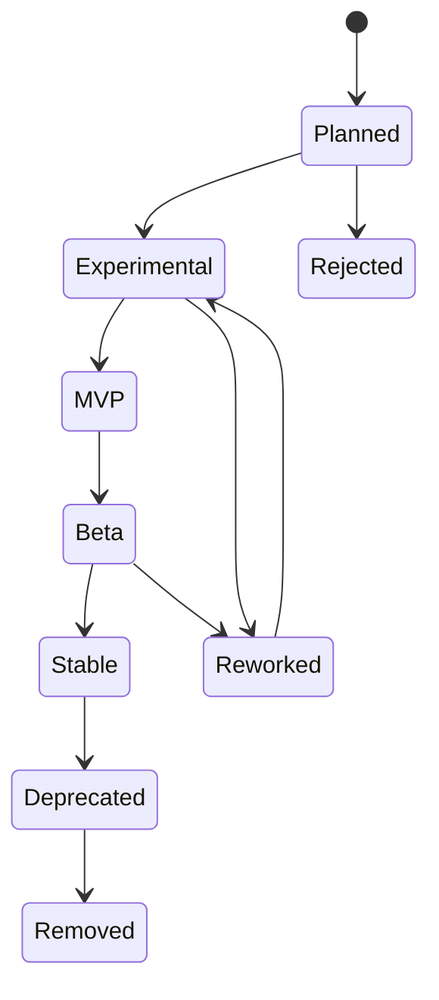
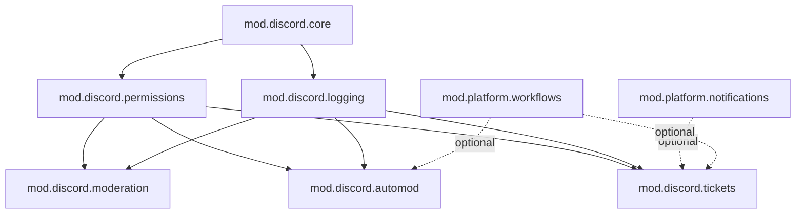
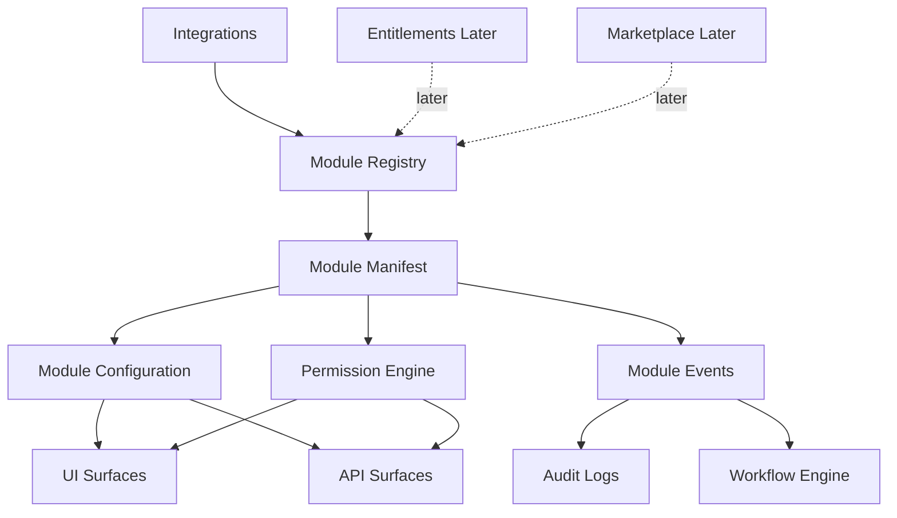
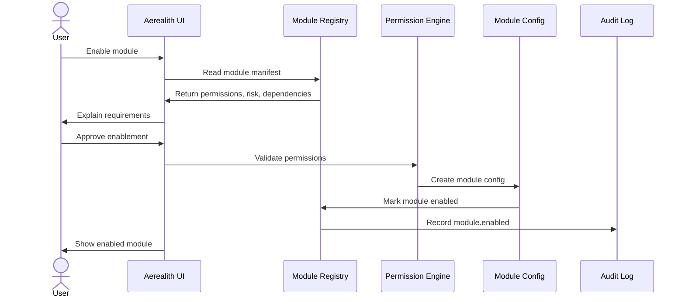

# Module System

Aerealith AI is built to be modular.

The Module System defines how Aerealith packages, enables, disables, configures, governs, audits, and extends user-facing product capabilities.

Modules allow Aerealith to grow without becoming a tangled pile of hardcoded features.

A module should add capability without adding confusion.

---

## Purpose

The purpose of this document is to define how modules work across Aerealith.

It answers:

- What is a module?
- What is not a module?
- How are modules enabled and disabled?
- How are modules scoped?
- How do modules declare permissions?
- How do modules define configuration?
- How are module actions audited?
- How do modules interact with workflows, integrations, dashboards, and APIs?
- How does the module system prepare for marketplace and self-hosted ecosystems?

This document does not define every individual module in detail.

Detailed module specifications should live in focused documents such as:

```text
docs/product/Discord Platform.md
docs/product/Automation.md
docs/product/Marketplace.md
docs/product/Developer Platform.md
```

---

## Module Philosophy

Aerealith modules should be:

- optional by default
- easy to enable
- easy to disable
- permission-scoped
- auditable
- configurable
- dependency-aware
- versioned
- API-accessible where appropriate
- safe to uninstall
- explainable to users
- organization-governable
- marketplace-ready later
- self-hosting-compatible later

A module should never require users to understand the entire platform before using it.

A module should clearly explain:

- what it does
- what it needs access to
- what actions it can take
- what data it stores
- what events it emits
- what settings can be changed
- how it can be disabled
- what happens when it is removed

---

## Core Principle

> Modules are user-configurable product units, not internal platform services.

Aerealith should separate product modules from platform capabilities.

This keeps the system clean.

---

## Capability vs Module vs Package vs Plugin

| Term        | Meaning                                                                                      | Example                                              |
| ----------- | -------------------------------------------------------------------------------------------- | ---------------------------------------------------- |
| Capability  | A broad platform ability.                                                                    | Discord Management, Workflows, Notifications, Memory |
| Module      | A user/admin-configurable product unit.                                                      | Discord Tickets, Moderation, Welcome Flow            |
| Package     | A distributable bundle of modules, workflows, templates, dashboards, prompts, or settings.   | Creator Community Pack                               |
| Plugin      | A code-based extension that adds runtime behavior, tools, actions, widgets, or integrations. | Third-party GitHub analytics plugin                  |
| Template    | A reusable non-code starting point.                                                          | Ticket preset, dashboard layout, workflow template   |
| Integration | A connection to an external system.                                                          | Discord, GitHub, Google, Cloudflare                  |

---

## What Is a Module?

A module is a product unit that can be enabled, disabled, configured, permissioned, audited, and eventually distributed.

Examples:

```text
Discord Tickets
Discord Moderation
Discord Automod
Welcome Flow
Reaction Roles
Daily Brief
Memory Review
GitHub Summary
Workflow Template Library
Dashboard Widgets
```

A module usually has:

- an ID
- a name
- a category
- a scope
- a status
- a risk level
- permissions
- settings
- dependencies
- events
- audit behavior
- UI surfaces
- API surfaces
- optional presets
- optional entitlement rules later

---

## What Is Not a Module?

Internal platform services are not modules.

These are platform capabilities or infrastructure services:

```text
Billing Service
Authentication Service
Audit Log Service
Permission Engine
Notification Engine
Memory Storage
Database Layer
API Gateway
Observability Pipeline
```

These services may power modules, but users should not think of them as installable modules.

For example:

- `Notifications` is a platform capability.
- `Discord Ticket Notifications` may be module behavior.
- `Audit Logs` is a platform capability.
- `Moderation Audit Events` are module-emitted records.

---

## Module Contexts

Modules must be scoped.

A module enabled in one context should not automatically be enabled everywhere.

| Context              | Meaning                                                   |
| -------------------- | --------------------------------------------------------- |
| Personal             | Module enabled for a single user.                         |
| Discord Guild        | Module enabled for a specific Discord server.             |
| Organization         | Module enabled for an organization or team.               |
| Workspace            | Module enabled for a workspace inside an organization.    |
| Project              | Module enabled for a project, repository, or environment. |
| Self-Hosted Instance | Module enabled for an entire self-hosted deployment.      |

Example:

```text
Discord Tickets may be enabled for one Discord guild.

That does not mean Tickets are enabled for every guild connected to the same Aerealith account.
```

---

## Module Status Model

| Status       | Meaning                                   |
| ------------ | ----------------------------------------- |
| Planned      | Module is planned but not implemented.    |
| Experimental | Module exists but is not stable.          |
| MVP          | Module is part of the MVP capability set. |
| Beta         | Module is usable but still being refined. |
| Stable       | Module is production-ready.               |
| Deprecated   | Module is being phased out.               |
| Removed      | Module has been removed after migration.  |

---

## Module Lifecycle



| Stage        | Meaning                                                         |
| ------------ | --------------------------------------------------------------- |
| Planned      | The module idea is documented.                                  |
| Experimental | The module is being tested internally.                          |
| MVP          | The module supports the first usable version.                   |
| Beta         | The module is usable by early users.                            |
| Stable       | The module is reliable and supported.                           |
| Deprecated   | The module is still available but should be migrated away from. |
| Removed      | The module no longer exists.                                    |
| Reworked     | The module needs redesign before continuing.                    |
| Rejected     | The module does not fit the platform.                           |

---

## Module Risk Levels

Every module should declare a risk level.

| Risk Level | Meaning                                                                                       | Examples                                              |
| ---------- | --------------------------------------------------------------------------------------------- | ----------------------------------------------------- |
| Low        | Read-only, dashboard-only, or harmless user-facing behavior.                                  | Dashboard widget, daily summary                       |
| Medium     | Creates records, posts messages, updates workflow state, or changes module state.             | Tickets, announcements, reminders                     |
| High       | Moderates users, changes roles, deletes messages, or affects communities.                     | Moderation, automod, role management                  |
| Critical   | Affects billing, security, credentials, production infrastructure, or destructive operations. | Billing controls, IAM changes, infrastructure actions |

Risk level affects:

- approval requirements
- default settings
- audit requirements
- permission prompts
- admin review
- marketplace review
- organization governance
- automation eligibility

---

## Module ID Model

Module IDs should be stable, readable, and namespaced.

Recommended pattern:

```text
mod.<scope>.<name>
```

Examples:

| Module ID                      | Meaning                             |
| ------------------------------ | ----------------------------------- |
| mod.discord.core               | Core Discord integration module     |
| mod.discord.server-linking     | Discord server linking              |
| mod.discord.permissions        | Discord permission and role mapping |
| mod.discord.moderation         | Discord moderation basics           |
| mod.discord.automod            | Discord automod foundation          |
| mod.discord.tickets            | Discord tickets                     |
| mod.discord.ticket-transcripts | Ticket transcripts                  |
| mod.discord.logging            | Discord logging and audit events    |
| mod.discord.welcome            | Welcome and onboarding              |
| mod.discord.roles              | Role management                     |
| mod.discord.reaction-roles     | Reaction/self-assignable roles      |
| mod.discord.announcements      | Announcements                       |
| mod.discord.forms              | Forms                               |
| mod.discord.starboard          | Starboard/highlights                |
| mod.discord.giveaways          | Giveaways                           |
| mod.discord.custom-commands    | Custom commands                     |
| mod.platform.assistant         | Assistant interface                 |
| mod.platform.memory            | Memory foundation                   |
| mod.platform.workflows         | Workflow foundation                 |
| mod.platform.notifications     | Notification module behavior        |
| mod.platform.dashboard-widgets | Basic dashboard widgets             |
| mod.platform.templates         | Official template library           |

---

## Module Manifest

Every module should have a manifest.

The manifest describes what the module is, what it needs, what it can do, and how it should be governed.

Example:

```yaml
id: mod.discord.tickets
name: Tickets
description: Create and manage support tickets for Discord communities.
category: discord
status: mvp
risk_level: medium
version: 0.1.0

scope:
  supported:
    - discord_guild
  default: discord_guild

surfaces:
  ui:
    - web_dashboard
    - discord
  api:
    - modules
    - tickets

permissions:
  required:
    - discord.channels.create
    - discord.channels.read
    - discord.messages.read
    - discord.messages.send
    - tickets.create
    - tickets.close
    - tickets.transcripts.write
  optional:
    - notifications.send
    - workflows.trigger

dependencies:
  required:
    - mod.discord.core
    - mod.discord.permissions
    - mod.discord.logging
  optional:
    - mod.platform.notifications
    - mod.platform.workflows

settings:
  schema: ./settings.schema.json
  presets:
    - simple-support-desk
    - game-server-appeals
    - creator-community-support

events:
  emits:
    - ticket.created
    - ticket.assigned
    - ticket.closed
    - ticket.transcript.created
    - module.action.failed

audit:
  required: true
  events:
    - ticket.created
    - ticket.closed
    - ticket.transcript.created
    - module.config.updated

entitlements:
  required_plan: null
  marketplace_item: false

uninstall:
  safe_disable: true
  export_config_supported: true
  data_retention_policy: keep_existing_records
```

---

## Manifest Fields

| Field        | Required | Purpose                                                                       |
| ------------ | -------: | ----------------------------------------------------------------------------- |
| id           |      Yes | Stable module identifier.                                                     |
| name         |      Yes | Human-readable module name.                                                   |
| description  |      Yes | Clear explanation of what the module does.                                    |
| category     |      Yes | Product category such as Discord, Platform, Workflow, Dashboard, Integration. |
| status       |      Yes | Planned, MVP, Beta, Stable, Deprecated, etc.                                  |
| risk_level   |      Yes | Low, medium, high, or critical.                                               |
| version      |      Yes | Module version.                                                               |
| scope        |      Yes | Supported module scopes.                                                      |
| surfaces     |      Yes | UI and API surfaces where the module appears.                                 |
| permissions  |      Yes | Required and optional permissions.                                            |
| dependencies |      Yes | Required and optional dependencies.                                           |
| settings     |      Yes | Configuration schema and presets.                                             |
| events       |      Yes | Events emitted by the module.                                                 |
| audit        |      Yes | Audit behavior and event requirements.                                        |
| entitlements |    Later | Plan, billing, marketplace, or access requirements.                           |
| uninstall    |      Yes | Disable, export, and data retention behavior.                                 |

---

## Module Permissions

Modules must declare permissions before they can act.

Permissions should be:

- explicit
- scoped
- understandable
- least-privilege
- revocable
- auditable
- reviewed during installation or enablement

Example permission categories:

| Category      | Examples                                                                   |
| ------------- | -------------------------------------------------------------------------- |
| Discord       | Read channels, send messages, manage roles, timeout users, create channels |
| Tickets       | Create tickets, close tickets, write transcripts                           |
| Moderation    | Warn users, timeout users, kick users, ban users                           |
| Memory        | Read scoped memory, write memory, review memory                            |
| Workflows     | Trigger workflow, read workflow state, update workflow state               |
| Notifications | Send notification, request approval, send digest                           |
| Dashboard     | Read widget data, write widget config                                      |
| Admin         | Manage module config, approve module install, disable module               |

---

## Permission Prompt Requirements

When enabling a module, Aerealith should explain:

- what the module does
- what permissions it needs
- why each permission is needed
- what data it may access
- what actions it may perform
- what audit events it emits
- who can configure it
- how to disable it
- whether it has dependencies
- whether it has risk

Example:

```text
Tickets needs permission to create Discord channels because each ticket opens a private support channel.

Tickets also needs permission to read and send messages in ticket channels so staff and users can communicate.

Ticket transcripts are stored so server staff can review closed support cases.
```

---

## Module Configuration

Modules should expose structured configuration.

Configuration should be editable through the UI and eventually through APIs.

Example configuration areas:

| Area             | Purpose                                                     |
| ---------------- | ----------------------------------------------------------- |
| General Settings | Enablement, display name, description, default behavior     |
| Permissions      | Who can use, configure, or approve module actions           |
| Channels         | Discord channels, dashboard locations, notification targets |
| Roles            | Staff roles, admin roles, member roles, escalation roles    |
| Behavior         | Module-specific rules and defaults                          |
| Notifications    | Where alerts, approvals, summaries, and failures go         |
| Audit            | What actions are logged and where they can be reviewed      |
| Automation       | Whether workflows can trigger module actions                |
| Data Retention   | How long records, logs, transcripts, or outputs are stored  |
| Presets          | Beginner-friendly configuration templates                   |

---

## Module Presets

Modules should support presets.

Presets help users start quickly without understanding every setting.

Examples:

| Module            | Presets                                                                |
| ----------------- | ---------------------------------------------------------------------- |
| Tickets           | Simple Support Desk, Game Server Appeals, Creator Community Support    |
| Moderation        | Small Community, Large Public Server, Strict Safety, Relaxed Community |
| Welcome           | Creator Community, Gaming Clan, Developer Community, Private Server    |
| Roles             | Simple Self-Roles, Staff Roles, Subscriber Roles, Game Roles           |
| Announcements     | Streamer Updates, Patch Notes, Community News                          |
| Dashboard Widgets | Minimal Overview, Community Health, Staff Operations                   |
| Memory Review     | Personal Review, Project Review, Organization Review                   |
| Daily Brief       | Personal Daily Brief, Server Owner Brief, Developer Brief              |

Presets should be:

- editable
- explainable
- exportable later
- marketplace-ready later
- safe by default

---

## Module Dependencies

Modules can declare dependencies.

Dependencies prevent broken configurations and hidden behavior.

Example:

```text
Discord Tickets depends on:
- Core Discord Integration
- Discord Permissions
- Discord Logging

Discord Ticket Notifications optionally depend on:
- Platform Notifications
- Workflow Foundation
```

Dependency types:

| Type        | Meaning                                               |
| ----------- | ----------------------------------------------------- |
| Required    | Module cannot work without it.                        |
| Optional    | Module gains extra features if dependency exists.     |
| Conflicting | Module cannot run with another module or setting.     |
| Recommended | Module works better with it, but does not require it. |

---

## Dependency Diagram



---

## Module Events

Modules should emit standardized events.

Events support:

- audit logs
- workflows
- notifications
- dashboards
- analytics
- observability
- automation
- debugging

Standard module events:

```text
module.enabled
module.disabled
module.config.updated
module.permission.requested
module.permission.granted
module.permission.revoked
module.dependency.missing
module.dependency.enabled
module.action.requested
module.action.approved
module.action.denied
module.action.executed
module.action.failed
module.uninstalled
module.exported
module.imported
```

Module-specific events should follow a predictable naming pattern:

```text
<domain>.<resource>.<action>
```

Examples:

```text
discord.ticket.created
discord.ticket.closed
discord.moderation.warned
discord.moderation.timeout.created
discord.automod.rule.triggered
discord.role.assigned
platform.memory.reviewed
platform.workflow.triggered
platform.notification.sent
```

---

## Module Audit Logs

Every meaningful module action should be auditable.

Audit records should include:

- module ID
- module version
- context
- actor
- target
- action
- permissions used
- approval source
- risk level
- result
- timestamp
- related workflow
- related integration
- related Discord guild/channel/message/user where applicable
- error details if failed

Example audit event:

```json
{
  "event": "discord.ticket.closed",
  "module_id": "mod.discord.tickets",
  "module_version": "0.1.0",
  "context": {
    "type": "discord_guild",
    "id": "guild_..."
  },
  "actor": {
    "type": "discord_user",
    "id": "user_..."
  },
  "target": {
    "type": "ticket",
    "id": "ticket_..."
  },
  "risk_level": "medium",
  "approval": {
    "required": false,
    "source": "role_permission"
  },
  "result": "success",
  "timestamp": "2026-01-01T00:00:00Z"
}
```

---

## Module UI Surfaces

Modules may expose UI in different places.

| UI Surface          | Purpose                                                    |
| ------------------- | ---------------------------------------------------------- |
| Web Dashboard       | Configure modules, view status, edit settings, review logs |
| Discord             | Commands, interactions, buttons, modals, messages          |
| Assistant Interface | Ask questions, configure settings, request actions         |
| Admin Console       | Organization governance, restrictions, approvals           |
| Developer Portal    | API docs, event docs, module manifests                     |
| Marketplace Later   | Discover, install, review, and manage packages             |
| Mobile Later        | Approvals, alerts, quick actions                           |
| Desktop Later       | Local quick actions and notifications                      |

A module should declare which UI surfaces it supports.

---

## Module API Surfaces

Modules should eventually expose API controls where appropriate.

Possible API operations:

```text
List modules
Read module
Enable module
Disable module
Update module config
Read module config
Export module config
Import module config
Read module status
Read module audit events
Read module events
Read module permissions
Grant module permission
Revoke module permission
Run module action
Validate module config
Preview module behavior
```

Important module behavior should not be trapped inside the web UI.

---

## Module Export and Import

Users should eventually be able to export and import module configuration.

This is likely post-MVP.

Export/import enables:

- Discord server templates
- backups
- organization libraries
- marketplace packages
- self-hosted migrations
- environment promotion
- reusable community setups

Exported module config should include:

- module ID
- version
- settings
- presets used
- permissions requested
- dependencies
- channel/role mappings where safe
- workflow links
- dashboard layout links
- audit/export metadata

Exported module config should not include:

- secrets
- private user data
- unrelated memories
- raw credentials
- hidden system state
- organization-restricted data without permission

---

## Safe Disable and Uninstall

Modules must be safe to disable.

Disabling a module should explain:

- what stops immediately
- what data remains
- what workflows are affected
- what notifications stop
- what integrations are no longer used
- whether audit logs remain
- whether export is available
- whether re-enable restores configuration

Example:

```text
Disabling Tickets will stop new tickets from being created.

Existing ticket records and audit logs will remain.

Ticket channels will not be deleted automatically unless you choose that option.
```

---

## First-Party Modules

MVP modules should be first-party and built into the platform.

Users should enable and configure them, not install packages from a marketplace during MVP.

First-party modules are developed, reviewed, maintained, and supported by Aerealith.

MVP should prioritize first-party modules because they are:

- safer
- easier to govern
- easier to debug
- easier to document
- easier to support
- better for proving the module model

---

## Third-Party Modules

Third-party module support should come later.

Aerealith should not allow unrestricted third-party runtime code early.

The recommended path is:

1. First-party built-in modules.
2. Official templates and presets.
3. Importable configuration packages.
4. Marketplace packages.
5. Sandboxed plugin runtime later.

Third-party runtime plugins may eventually be allowed, but only with:

- sandboxing
- permission manifests
- security review
- versioning
- resource limits
- audit logs
- revocation
- takedown controls
- organization approval
- user consent
- clear warnings
- marketplace governance

---

## Marketplace Readiness

The Module System should prepare for the marketplace, but it should not depend on the marketplace.

Marketplace-ready modules should support:

- manifests
- versioning
- permissions
- dependencies
- presets
- export/import
- audit events
- install validation
- risk levels
- compatibility metadata
- creator attribution later
- review status later
- entitlement metadata later

Marketplace belongs in a separate document.

This document defines the foundation.

---

## Module Governance

Organizations and communities need governance controls.

Admins should eventually be able to:

- approve modules
- block modules
- disable modules
- restrict modules by role
- restrict modules by workspace
- restrict modules by Discord guild
- pin module versions
- require review before enablement
- require approval for high-risk modules
- view module audit logs
- export module configuration
- define approved presets
- block third-party modules
- allow only first-party modules
- enforce data retention settings

Governance should be available before third-party marketplace modules become broadly available.

---

## Entitlements and Monetization

Modules may become monetizable later.

Examples:

```text
Free modules
Premium modules
Pro modules
Enterprise modules
Paid marketplace modules
Private organization modules
```

However, billing should not shape the MVP module system too early.

The MVP module design should focus on:

- correctness
- safety
- configuration
- permissions
- auditability
- scope
- user value

Entitlements can gate access later.

The core module model should not become messy just to support pricing too soon.

---

## Discord as the First Module System

Discord should be the first real proof of the Module System.

Discord has clear modular needs:

```text
Moderation
Automod
Tickets
Ticket Transcripts
Welcome
Roles
Reaction Roles
Announcements
Forms
Logging
Starboard
Giveaways
Custom Commands
Reminders
```

Discord modules prove that Aerealith can:

- enable and disable features per server
- manage permissions
- map roles
- audit actions
- configure modules
- show module status
- support staff workflows
- expose dashboard controls
- connect module events to workflows
- support future templates and marketplace packages

---

## MVP Module Set

The MVP module system should include the following modules.

### Discord MVP Modules

| Module ID                      | Name                       | Status | Risk   | Purpose                                                     |
| ------------------------------ | -------------------------- | ------ | ------ | ----------------------------------------------------------- |
| mod.discord.core               | Core Discord Integration   | MVP    | Medium | Connects Aerealith to Discord and supports bot operation.   |
| mod.discord.server-linking     | Server Linking             | MVP    | Medium | Links Discord guilds to Aerealith accounts/workspaces.      |
| mod.discord.permissions        | Permissions / Role Mapping | MVP    | High   | Maps Discord roles and permissions to Aerealith controls.   |
| mod.discord.moderation         | Moderation Basics          | MVP    | High   | Supports basic staff moderation actions.                    |
| mod.discord.automod            | Automod Foundation         | MVP    | High   | Provides basic automated moderation rules and escalation.   |
| mod.discord.tickets            | Tickets                    | MVP    | Medium | Allows users to create and staff to manage support tickets. |
| mod.discord.ticket-transcripts | Ticket Transcripts         | MVP    | Medium | Stores and exposes ticket transcripts where configured.     |
| mod.discord.logging            | Logging / Audit Events     | MVP    | Medium | Records important Discord module actions.                   |

---

### Platform MVP Modules

| Module ID                      | Name                      | Status | Risk   | Purpose                                                 |
| ------------------------------ | ------------------------- | ------ | ------ | ------------------------------------------------------- |
| mod.platform.assistant         | Assistant Interface       | MVP    | Medium | Provides assistant-facing module behavior and controls. |
| mod.platform.memory            | Memory Foundation         | MVP    | Medium | Provides user-controlled memory module behavior.        |
| mod.platform.workflows         | Workflow Foundation       | MVP    | Medium | Provides basic workflow records, approvals, and runs.   |
| mod.platform.notifications     | Notifications             | MVP    | Medium | Provides module-related notification behavior.          |
| mod.platform.dashboard-widgets | Basic Dashboard Widgets   | MVP    | Low    | Provides dashboard modules and summary cards.           |
| mod.platform.templates         | Official Template Library | MVP    | Low    | Provides official presets and templates.                |

---

## Future Module Set

Future modules may include:

### Discord Future Modules

```text
mod.discord.welcome
mod.discord.roles
mod.discord.reaction-roles
mod.discord.announcements
mod.discord.forms
mod.discord.starboard
mod.discord.giveaways
mod.discord.custom-commands
mod.discord.reminders
mod.discord.analytics
mod.discord.onboarding
mod.discord.verification
mod.discord.persona-tools
```

### Platform Future Modules

```text
mod.platform.advanced-memory-review
mod.platform.workflow-builder
mod.platform.daily-brief
mod.platform.weekly-review
mod.platform.insight-reports
mod.platform.integration-health
mod.platform.api-key-management
mod.platform.marketplace-library
mod.platform.organization-governance
mod.platform.self-hosting-admin
```

### Integration Future Modules

```text
mod.integration.github
mod.integration.google
mod.integration.cloudflare
mod.integration.grafana
mod.integration.home-assistant
mod.integration.twitch
mod.integration.steam
mod.integration.epic-games
mod.integration.smtp
mod.integration.s3
```

---

## Module System Release Path

```text
0.7 / 0.8
First-party built-in Discord modules.

1.1
Stable MVP module registry and entitlement awareness.

1.4
Workflow/module presets and automation packs.

1.5
Marketplace and third-party package ecosystem.

2.0
Self-hosted/private package sources.
```

---

## Module System Architecture Concept



---

## Module Enablement Flow



---

## Module Safety Rules

Aerealith modules must follow these rules:

1. Modules must declare permissions.
2. Modules must declare risk level.
3. Modules must declare dependencies.
4. Modules must be scoped.
5. Modules must be auditable.
6. Modules must be disable-friendly.
7. Modules must explain what they do.
8. Modules must not silently escalate access.
9. Modules must not hide AI involvement.
10. Modules must not store secrets directly.
11. Modules must not access unrelated user data.
12. Modules must respect organization governance.
13. Modules must support safe configuration defaults.
14. Modules must not require marketplace infrastructure for MVP.
15. Modules must not allow third-party runtime code until sandboxing and governance exist.

---

## Module Review Questions

Before building or enabling a module, ask:

- What user problem does this module solve?
- Which personas need this module?
- What scope does this module run in?
- What permissions does it require?
- What risk level does it have?
- What actions can it perform?
- What data can it access?
- What data can it store?
- What events does it emit?
- What audit logs does it create?
- What dependencies does it require?
- What happens when it is disabled?
- Can users export its configuration?
- Can it be configured safely by beginners?
- Can power users customize it?
- Does it need API access?
- Does it need marketplace support later?
- Does it respect the Trust Model?
- Does it reduce complexity without reducing control?

If a module cannot answer these questions clearly, it is not ready.

---

## Final Standard

The Module System should make Aerealith expandable without making it chaotic.

Modules should be easy to understand, safe to configure, clear to audit, and simple to disable.

The MVP should begin with first-party modules, especially Discord modules, because they prove the model with real user value.

Marketplace, third-party plugins, monetization, and self-hosted package sources should come later, after the core module foundation is stable and trustworthy.

Aerealith modules should add power without taking control away from users.
