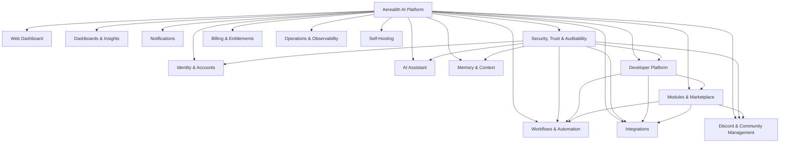
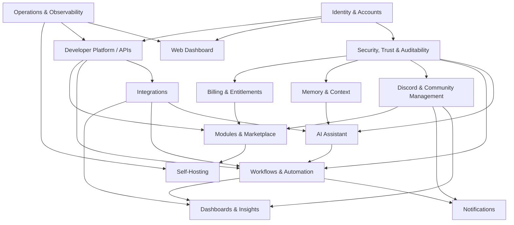
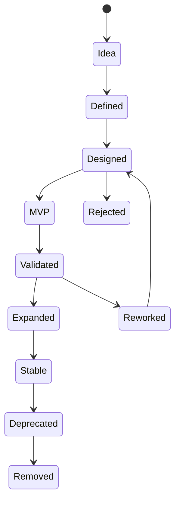

# Platform Capabilities

Aerealith AI brings your digital life together into one intelligent, secure, customizable control center.

This document defines the major platform capabilities Aerealith should support across its product surfaces, releases, modules, APIs, integrations, and long-term ecosystem.

It is a product capability catalog, not a detailed implementation specification.

---

## Purpose

The purpose of this document is to define what Aerealith can do as a platform.

It answers:

- What are the major capability areas?
- Which capabilities belong to MVP?
- Which capabilities are post-MVP or future?
- Which personas does each capability serve?
- Which product surfaces use each capability?
- Which capabilities depend on each other?
- What is intentionally out of scope?

This document should help guide product planning, release planning, architecture discussions, issue creation, module design, and future detailed specifications.

---

## Capability Philosophy

Aerealith should become more capable without becoming more complicated.

Capabilities should be:

- modular
- permissioned
- explainable
- auditable
- extensible
- API-accessible where appropriate
- usable through multiple product surfaces
- safe by default
- customizable over time

A capability should not exist just because it is technically possible.

A capability should exist because it helps users reduce digital complexity while staying in control.

---

## Capability Status Model

Each capability should be assigned a status.

| Status   | Meaning                                                                    |
| -------- | -------------------------------------------------------------------------- |
| MVP      | Required for the first usable product experience.                          |
| Post-MVP | Important after launch, but not required for MVP.                          |
| Future   | Long-term platform capability.                                             |
| Research | Exploratory capability that requires validation before product commitment. |

---

## Capability ID Model

Capabilities use simple IDs for planning, documentation, GitHub issues, and release tracking.

| Prefix      | Area                           |
| ----------- | ------------------------------ |
| CAP-ID      | Identity & Accounts            |
| CAP-WEB     | Web Dashboard                  |
| CAP-AI      | AI Assistant                   |
| CAP-MEM     | Memory & Context               |
| CAP-AUTO    | Workflows & Automation         |
| CAP-INT     | Integrations                   |
| CAP-DISCORD | Discord & Community Management |
| CAP-DASH    | Dashboards & Insights          |
| CAP-NOTIFY  | Notifications                  |
| CAP-DEV     | Developer Platform             |
| CAP-TRUST   | Security, Trust & Auditability |
| CAP-MODULE  | Modules & Marketplace          |
| CAP-BILL    | Billing & Entitlements         |
| CAP-OPS     | Operations & Observability     |
| CAP-HOST    | Self-Hosting                   |

---

## Platform Capability Map

---

## Core Capability Areas

---

## 1. Identity & Accounts

Identity is the foundation of user control, permissions, personalization, ownership, billing, memory, and auditability.

| Field            | Value                                                                |
| ---------------- | -------------------------------------------------------------------- |
| Capability Area  | Identity & Accounts                                                  |
| Status           | MVP                                                                  |
| Primary Releases | 0.2, 0.3                                                             |
| Primary Personas | Individual User, Discord Server Owner, Organization Admin, Developer |
| Product Surfaces | Web App, API, Developer Portal, Discord Linking                      |

### Capabilities

| ID         | Capability                 | Status   | Description                                                                    |
| ---------- | -------------------------- | -------- | ------------------------------------------------------------------------------ |
| CAP-ID-001 | User Accounts              | MVP      | Users can create and manage Aerealith accounts.                                |
| CAP-ID-002 | Login & Logout             | MVP      | Users can securely authenticate and end sessions.                              |
| CAP-ID-003 | Email Verification         | MVP      | Users can verify email ownership.                                              |
| CAP-ID-004 | Sessions                   | MVP      | User sessions are tracked, refreshed, and revoked securely.                    |
| CAP-ID-005 | Profiles                   | MVP      | Users can manage profile information.                                          |
| CAP-ID-006 | Preferences                | MVP      | Users can configure product, assistant, notification, and privacy preferences. |
| CAP-ID-007 | Connected Identities       | MVP      | Users can link external accounts such as Discord.                              |
| CAP-ID-008 | Organizations / Workspaces | Post-MVP | Users can manage shared spaces, roles, members, and ownership.                 |
| CAP-ID-009 | Consent Records            | MVP      | User consent is captured and auditable.                                        |
| CAP-ID-010 | Account Deletion / Export  | Post-MVP | Users can export or delete account-related data where practical.               |

### Product Notes

Identity should support both individuals and communities.

A Discord server should not exist as an isolated object disconnected from the user account system. Guild ownership, admin access, staff configuration, and module management should connect back to Aerealith identity and permissions.

---

## 2. Web Dashboard

The web dashboard is the main control center for Aerealith.

| Field            | Value                                                                    |
| ---------------- | ------------------------------------------------------------------------ |
| Capability Area  | Web Dashboard                                                            |
| Status           | MVP                                                                      |
| Primary Releases | 0.4                                                                      |
| Primary Personas | Individual User, Discord Server Owner, Discord Admin, Developer, Creator |
| Product Surfaces | Web App                                                                  |

### Capabilities

| ID          | Capability               | Status   | Description                                                                        |
| ----------- | ------------------------ | -------- | ---------------------------------------------------------------------------------- |
| CAP-WEB-001 | Dashboard Home           | MVP      | Users can see important summaries, status, tasks, and connected areas.             |
| CAP-WEB-002 | Account Settings         | MVP      | Users can manage account, preferences, privacy, and security settings.             |
| CAP-WEB-003 | Connected Services View  | MVP      | Users can view connected integrations and their status.                            |
| CAP-WEB-004 | Discord Server Dashboard | MVP      | Server owners/admins can configure Discord modules and review server status.       |
| CAP-WEB-005 | Assistant Interface      | MVP      | Users can interact with the AI assistant from the web app.                         |
| CAP-WEB-006 | Workflow Overview        | MVP      | Users can view available workflows, automation suggestions, and history.           |
| CAP-WEB-007 | Audit Activity View      | MVP      | Users can review meaningful actions and results.                                   |
| CAP-WEB-008 | Notification Center      | Post-MVP | Users can review alerts, summaries, approvals, and reminders.                      |
| CAP-WEB-009 | Admin Views              | Post-MVP | Workspace or organization admins can manage members, roles, billing, and policies. |
| CAP-WEB-010 | Advanced Customization   | Future   | Users can customize layouts, widgets, dashboards, and product behavior.            |

### Product Notes

The dashboard should be beginner-friendly by default.

Power-user controls should be available through progressive disclosure.

---

## 3. AI Assistant

The AI assistant is the intelligent interface for understanding, explaining, planning, recommending, and helping users act across their digital ecosystem.

AI is a capability, not the whole product.

| Field            | Value                                                               |
| ---------------- | ------------------------------------------------------------------- |
| Capability Area  | AI Assistant                                                        |
| Status           | MVP / Post-MVP                                                      |
| Primary Releases | 0.4, 1.3                                                            |
| Primary Personas | Individual User, Discord Owner, Developer, Creator, Power Automator |
| Product Surfaces | Web App, Discord, API, Mobile Later, Desktop Later                  |

### Capabilities

| ID         | Capability               | Status   | Description                                                                                            |
| ---------- | ------------------------ | -------- | ------------------------------------------------------------------------------------------------------ |
| CAP-AI-001 | Assistant Chat Interface | MVP      | Users can interact with Aerealith through natural language.                                            |
| CAP-AI-002 | Explainable Responses    | MVP      | AI responses should explain reasoning, limits, uncertainty, and next steps when relevant.              |
| CAP-AI-003 | Action Suggestions       | MVP      | The assistant can recommend actions without executing them automatically.                              |
| CAP-AI-004 | Approval-Based Actions   | MVP      | The assistant can request approval before performing meaningful actions.                               |
| CAP-AI-005 | Customizable Personality | Post-MVP | Users can customize assistant tone and presentation.                                                   |
| CAP-AI-006 | Model Routing            | Post-MVP | Aerealith can route tasks to models based on capability, privacy, cost, latency, and user preferences. |
| CAP-AI-007 | First-Party Models       | Future   | Aerealith may use its own models for specific platform tasks.                                          |
| CAP-AI-008 | Local Model Support      | Future   | Users may use local or self-hosted models where supported.                                             |
| CAP-AI-009 | AI Action History        | MVP      | AI-assisted actions are visible and auditable.                                                         |
| CAP-AI-010 | AI Safety Boundaries     | MVP      | AI behavior respects permissions, safety rules, and user control.                                      |

### Product Notes

The assistant should never silently take control.

The assistant should ask first, verify intent, execute approved actions, explain results, and offer automation only after trust has been earned.

---

## 4. Memory & Context

Memory and context allow Aerealith to become more useful over time without becoming invasive.

| Field            | Value                                                                 |
| ---------------- | --------------------------------------------------------------------- |
| Capability Area  | Memory & Context                                                      |
| Status           | MVP Foundation / Post-MVP Expansion                                   |
| Primary Releases | 0.2, 1.3                                                              |
| Primary Personas | Individual User, Discord Owner, Organization Admin, AI Assistant User |
| Product Surfaces | Web App, Assistant, API                                               |

### Capabilities

| ID          | Capability             | Status   | Description                                                                                  |
| ----------- | ---------------------- | -------- | -------------------------------------------------------------------------------------------- |
| CAP-MEM-001 | User Preferences       | MVP      | Stores product and assistant preferences.                                                    |
| CAP-MEM-002 | User Memory Foundation | MVP      | Stores user-approved memory records.                                                         |
| CAP-MEM-003 | Memory Review          | Post-MVP | Users can review what Aerealith remembers.                                                   |
| CAP-MEM-004 | Memory Edit/Delete     | Post-MVP | Users can edit or delete memory records.                                                     |
| CAP-MEM-005 | Memory Export          | Post-MVP | Users can export memory data where practical.                                                |
| CAP-MEM-006 | Scoped Memory          | Post-MVP | Memory can be scoped to user, community, organization, project, or integration.              |
| CAP-MEM-007 | Community Context      | Post-MVP | Discord communities can maintain server-specific configuration and operational context.      |
| CAP-MEM-008 | Organization Memory    | Future   | Organizations can maintain shared knowledge, policies, and workflow context.                 |
| CAP-MEM-009 | Context Graph          | Future   | Aerealith can represent relationships between users, tools, workflows, services, and events. |
| CAP-MEM-010 | Consent-Based Learning | MVP      | Private user data is never used for training without explicit consent.                       |

### Product Notes

Aerealith should remember what helps the user, not everything.

Memory must be intentional, reviewable, editable, exportable, deletable, and scoped.

---

## 5. Workflows & Automation

Workflows and automation turn repeated actions into controlled, permissioned, auditable processes.

| Field            | Value                                                               |
| ---------------- | ------------------------------------------------------------------- |
| Capability Area  | Workflows & Automation                                              |
| Status           | MVP Foundation / Post-MVP Expansion                                 |
| Primary Releases | 0.5, 1.4                                                            |
| Primary Personas | Individual User, Discord Admin, Developer, Creator, Power Automator |
| Product Surfaces | Web App, Assistant, Discord, API                                    |

### Capabilities

| ID           | Capability                | Status   | Description                                                                 |
| ------------ | ------------------------- | -------- | --------------------------------------------------------------------------- |
| CAP-AUTO-001 | Workflow Foundation       | MVP      | Basic workflow concepts, records, and execution model.                      |
| CAP-AUTO-002 | Manual Workflows          | MVP      | Users can run defined workflows manually.                                   |
| CAP-AUTO-003 | Approval Gates            | MVP      | Workflows can require approval before meaningful actions.                   |
| CAP-AUTO-004 | Automation Suggestions    | MVP      | Aerealith can suggest automation after repeated approved behavior.          |
| CAP-AUTO-005 | Trigger System            | Post-MVP | Workflows can run from events, schedules, webhooks, or integration changes. |
| CAP-AUTO-006 | Conditions                | Post-MVP | Workflows can branch based on rules or context.                             |
| CAP-AUTO-007 | Actions                   | Post-MVP | Workflows can perform approved actions across connected systems.            |
| CAP-AUTO-008 | Workflow History          | MVP      | Workflow runs are logged and reviewable.                                    |
| CAP-AUTO-009 | Dry Runs                  | Post-MVP | Users can preview what a workflow would do before execution.                |
| CAP-AUTO-010 | Workflow Templates        | Post-MVP | Reusable workflow templates help users start quickly.                       |
| CAP-AUTO-011 | Advanced Builder          | Future   | Power users can build complex multi-step automations.                       |
| CAP-AUTO-012 | AI-Orchestrated Workflows | Future   | AI can help plan, configure, and run workflows within approved boundaries.  |

### Product Notes

Automation should be earned through progressive trust.

Aerealith should not jump from suggestion to autonomous execution without repeated user approval and clear boundaries.

---

## 6. Integrations

Integrations connect Aerealith to the tools users already use.

Aerealith should integrate before replacing.

| Field            | Value                                                                  |
| ---------------- | ---------------------------------------------------------------------- |
| Capability Area  | Integrations                                                           |
| Status           | MVP Foundation / Post-MVP Expansion                                    |
| Primary Releases | 0.5, 0.6, 1.8                                                          |
| Primary Personas | Individual User, Discord Owner, Developer, Creator, Organization Admin |
| Product Surfaces | Web App, API, Developer Portal, Assistant                              |

### Capabilities

| ID          | Capability                   | Status   | Description                                                                     |
| ----------- | ---------------------------- | -------- | ------------------------------------------------------------------------------- |
| CAP-INT-001 | Integration Foundation       | MVP      | Core model for connecting external services.                                    |
| CAP-INT-002 | Discord Integration          | MVP      | Discord is the first flagship integration and product surface.                  |
| CAP-INT-003 | OAuth / Connection Flows     | MVP      | Users can securely connect supported services.                                  |
| CAP-INT-004 | Integration Status           | MVP      | Users can see connection health and availability.                               |
| CAP-INT-005 | Webhooks                     | Post-MVP | External systems can send events into Aerealith.                                |
| CAP-INT-006 | GitHub Integration           | Post-MVP | Supports repository, issue, release, and workflow-related use cases.            |
| CAP-INT-007 | Google Integration           | Post-MVP | Supports calendar, email, files, and productivity workflows where appropriate.  |
| CAP-INT-008 | Cloudflare Integration       | Future   | Supports deployment, DNS, Workers, infrastructure, and observability use cases. |
| CAP-INT-009 | Grafana Integration          | Future   | Supports dashboard, alert, metric, and observability context.                   |
| CAP-INT-010 | Home Assistant Integration   | Future   | Supports smart home and device automation workflows.                            |
| CAP-INT-011 | Storage Provider Abstraction | Future   | Supports Cloudinary, S3-compatible storage, MinIO, or future storage providers. |
| CAP-INT-012 | Email Provider Abstraction   | Future   | Supports Resend, SMTP, and future email providers.                              |

### Product Notes

Integrations should be modular, permissioned, observable, and replaceable where practical.

No single provider should become inseparable from Aerealith.

---

## 7. Discord & Community Management

Discord is a major first-party product area and the first proof that Aerealith can manage communities through modular, configurable systems.

| Field            | Value                                                            |
| ---------------- | ---------------------------------------------------------------- |
| Capability Area  | Discord & Community Management                                   |
| Status           | MVP / Post-MVP                                                   |
| Primary Releases | 0.7, 0.8                                                         |
| Primary Personas | Discord Server Owner, Discord Admin, Moderator, Community Member |
| Product Surfaces | Discord Bot, Web Dashboard, API                                  |

### Capabilities

| ID              | Capability                       | Status   | Description                                                           |
| --------------- | -------------------------------- | -------- | --------------------------------------------------------------------- |
| CAP-DISCORD-001 | Official Discord Bot             | MVP      | Aerealith provides a first-party Discord bot.                         |
| CAP-DISCORD-002 | Guild Installation               | MVP      | Server owners can install the bot.                                    |
| CAP-DISCORD-003 | Guild Linking                    | MVP      | Discord servers can link to Aerealith accounts/workspaces.            |
| CAP-DISCORD-004 | Module Enable/Disable            | MVP      | Server admins can enable or disable modules per server.               |
| CAP-DISCORD-005 | Permission Mapping               | MVP      | Discord roles and permissions map to Aerealith controls.              |
| CAP-DISCORD-006 | Role Mapping                     | MVP      | Roles can be mapped for moderation, staff, access, and automation.    |
| CAP-DISCORD-007 | Slash Commands                   | MVP      | Users and staff can interact with Aerealith through Discord commands. |
| CAP-DISCORD-008 | Event Handling                   | MVP      | Aerealith can respond to Discord events safely.                       |
| CAP-DISCORD-009 | Moderation Basics                | MVP      | Warnings, timeouts, kicks, bans, notes, and logs where appropriate.   |
| CAP-DISCORD-010 | Automod Foundation               | MVP      | Basic rule-based moderation and escalation.                           |
| CAP-DISCORD-011 | Ticket Basics                    | MVP      | Users can create support tickets and staff can manage them.           |
| CAP-DISCORD-012 | Ticket Transcripts               | MVP      | Ticket history can be recorded and reviewed.                          |
| CAP-DISCORD-013 | Welcome & Onboarding             | Post-MVP | Server onboarding, welcome messages, and verification flows.          |
| CAP-DISCORD-014 | Reaction / Self-Assignable Roles | Post-MVP | Members can self-select roles through configured flows.               |
| CAP-DISCORD-015 | Announcements                    | Post-MVP | Managed announcement workflows.                                       |
| CAP-DISCORD-016 | Custom Commands                  | Post-MVP | Server-specific commands and responses.                               |
| CAP-DISCORD-017 | Forms                            | Post-MVP | Server forms for applications, support, and community workflows.      |
| CAP-DISCORD-018 | Giveaways                        | Post-MVP | Community giveaway tools.                                             |
| CAP-DISCORD-019 | Starboard / Highlights           | Post-MVP | Community-highlighted content.                                        |
| CAP-DISCORD-020 | Server Analytics                 | Post-MVP | Insights into community activity, moderation, tickets, and growth.    |
| CAP-DISCORD-021 | Persona / Proxy Tools            | Future   | Roleplay/persona-style tools where appropriate and safe.              |
| CAP-DISCORD-022 | Advanced Community Workflows     | Future   | Complex workflows spanning Discord, web app, integrations, and AI.    |

### Product Notes

Discord capabilities should be detailed further in `docs/product/Discord Platform.md`.

This document should define the scope, not every command or configuration setting.

---

## 8. Dashboards & Insights

Dashboards and insights help users understand what is happening across their digital ecosystem.

| Field            | Value                                                                  |
| ---------------- | ---------------------------------------------------------------------- |
| Capability Area  | Dashboards & Insights                                                  |
| Status           | MVP Foundation / Post-MVP Expansion                                    |
| Primary Releases | 0.4, 0.9, 1.7                                                          |
| Primary Personas | Individual User, Discord Owner, Developer, Creator, Organization Admin |
| Product Surfaces | Web App, Assistant, API                                                |

### Capabilities

| ID           | Capability                     | Status   | Description                                                          |
| ------------ | ------------------------------ | -------- | -------------------------------------------------------------------- |
| CAP-DASH-001 | Dashboard Summary              | MVP      | Shows key activity, status, and next actions.                        |
| CAP-DASH-002 | Discord Server Overview        | MVP      | Shows server status, enabled modules, logs, and health.              |
| CAP-DASH-003 | Activity Feed                  | MVP      | Shows recent important actions and events.                           |
| CAP-DASH-004 | Audit Summary                  | MVP      | Shows meaningful actions and approval history.                       |
| CAP-DASH-005 | Workflow Insights              | Post-MVP | Shows workflow performance and automation opportunities.             |
| CAP-DASH-006 | Community Analytics            | Post-MVP | Shows Discord community trends, tickets, moderation, and engagement. |
| CAP-DASH-007 | Personal Digital Life Overview | Post-MVP | Shows connected apps, tasks, reminders, workflows, and alerts.       |
| CAP-DASH-008 | Integration Health             | Post-MVP | Shows connected service health and failures.                         |
| CAP-DASH-009 | AI Summaries                   | Post-MVP | AI-generated summaries of activity, risk, trends, or next steps.     |
| CAP-DASH-010 | Custom Dashboards              | Future   | Users can customize widgets, views, reports, and layouts.            |

### Product Notes

Dashboards should clarify, not overwhelm.

Insights should help users decide what matters.

---

## 9. Notifications

Notifications connect Aerealith to the user's attention.

They should be useful, intentional, and respectful.

| Field            | Value                                                                  |
| ---------------- | ---------------------------------------------------------------------- |
| Capability Area  | Notifications                                                          |
| Status           | MVP Foundation / Post-MVP Expansion                                    |
| Primary Releases | 0.4, 0.5, 1.4                                                          |
| Primary Personas | Individual User, Discord Staff, Creator, Developer, Organization Admin |
| Product Surfaces | Web App, Discord, Email, Mobile Later, Desktop Later                   |

### Capabilities

| ID             | Capability               | Status   | Description                                                                        |
| -------------- | ------------------------ | -------- | ---------------------------------------------------------------------------------- |
| CAP-NOTIFY-001 | In-App Notifications     | MVP      | Users receive alerts and updates inside the web app.                               |
| CAP-NOTIFY-002 | Email Notifications      | MVP      | Important account and workflow events can be sent by email.                        |
| CAP-NOTIFY-003 | Discord Notifications    | MVP      | Discord-related alerts can appear in configured channels or DMs where appropriate. |
| CAP-NOTIFY-004 | Approval Prompts         | MVP      | Users can approve or deny important actions.                                       |
| CAP-NOTIFY-005 | Notification Preferences | MVP      | Users can configure notification behavior.                                         |
| CAP-NOTIFY-006 | Summary Notifications    | Post-MVP | Users can receive digest-style summaries.                                          |
| CAP-NOTIFY-007 | Quiet Hours              | Post-MVP | Users can limit interruptions by time.                                             |
| CAP-NOTIFY-008 | Priority Routing         | Post-MVP | Aerealith can route alerts by urgency and context.                                 |
| CAP-NOTIFY-009 | Mobile Push              | Future   | Mobile app notifications for approvals, reminders, and alerts.                     |
| CAP-NOTIFY-010 | Desktop Notifications    | Future   | Desktop companion notifications and quick actions.                                 |

### Product Notes

Aerealith should ask:

> Is this worth the user's attention?

Not:

> Can we send a notification?

---

## 10. Developer Platform

The developer platform makes Aerealith extensible, programmable, and buildable.

| Field            | Value                                                                   |
| ---------------- | ----------------------------------------------------------------------- |
| Capability Area  | Developer Platform                                                      |
| Status           | MVP Foundation / Post-MVP Expansion                                     |
| Primary Releases | 0.5, 0.6, 1.5                                                           |
| Primary Personas | Developer, Marketplace Developer, Power Automator, Self-Hosted Operator |
| Product Surfaces | Developer Portal, API, Docs, SDKs Later                                 |

### Capabilities

| ID          | Capability              | Status         | Description                                                               |
| ----------- | ----------------------- | -------------- | ------------------------------------------------------------------------- |
| CAP-DEV-001 | API Foundation          | MVP            | Core platform capabilities are accessible through APIs where appropriate. |
| CAP-DEV-002 | API Documentation       | MVP            | Developers can understand available APIs.                                 |
| CAP-DEV-003 | Authentication Guides   | MVP            | Developers can authenticate safely.                                       |
| CAP-DEV-004 | API Keys                | Post-MVP       | Developers can create and manage keys for integrations.                   |
| CAP-DEV-005 | Webhooks                | Post-MVP       | External systems can subscribe to Aerealith events.                       |
| CAP-DEV-006 | SDK Strategy            | Post-MVP       | Client libraries or generated SDKs can be introduced.                     |
| CAP-DEV-007 | Developer Portal        | MVP / Post-MVP | Central home for APIs, guides, examples, and diagnostics.                 |
| CAP-DEV-008 | Integration Diagnostics | Post-MVP       | Developers can debug integration failures.                                |
| CAP-DEV-009 | Module Development Kit  | Future         | Developers can build Aerealith modules.                                   |
| CAP-DEV-010 | Marketplace Publishing  | Future         | Developers can publish extensions.                                        |

### Product Notes

Every major capability should eventually be accessible through APIs.

The API is a product surface, not just an implementation detail.

---

## 11. Security, Trust & Auditability

Security and trust define how Aerealith behaves when actions matter.

| Field            | Value                          |
| ---------------- | ------------------------------ |
| Capability Area  | Security, Trust & Auditability |
| Status           | MVP                            |
| Primary Releases | 0.1 through 1.1                |
| Primary Personas | All Personas                   |
| Product Surfaces | All Surfaces                   |

### Capabilities

| ID            | Capability                | Status         | Description                                                   |
| ------------- | ------------------------- | -------------- | ------------------------------------------------------------- |
| CAP-TRUST-001 | Permission Model          | MVP            | Actions are governed by scoped permissions.                   |
| CAP-TRUST-002 | Approval Flow             | MVP            | Meaningful actions can require user approval.                 |
| CAP-TRUST-003 | Verification Flow         | MVP            | Risky actions require extra confirmation.                     |
| CAP-TRUST-004 | Audit Logs                | MVP            | Meaningful actions produce reviewable logs.                   |
| CAP-TRUST-005 | AI Action Disclosure      | MVP            | Users can see when AI is involved in actions.                 |
| CAP-TRUST-006 | Revoke / Disable Controls | MVP            | Users can revoke permissions and automation.                  |
| CAP-TRUST-007 | Data Ownership Controls   | MVP / Post-MVP | Users can control, export, and delete data where practical.   |
| CAP-TRUST-008 | Security Defaults         | MVP            | Platform defaults should protect users.                       |
| CAP-TRUST-009 | Progressive Trust         | MVP            | Automation is earned through repeated approved actions.       |
| CAP-TRUST-010 | Policy Boundaries         | Post-MVP       | Organizations and communities can define action policies.     |
| CAP-TRUST-011 | Risk Scoring              | Post-MVP       | Actions can be evaluated by risk level.                       |
| CAP-TRUST-012 | Reversal Tracking         | Post-MVP       | Reversible actions can be tracked and undone where practical. |

### Product Notes

Trust is not one module.

Trust is a platform-wide behavior.

---

## 12. Modules & Marketplace

Modules allow Aerealith to grow without becoming one giant hardcoded product.

Marketplace capabilities allow the ecosystem to expand beyond first-party development.

| Field            | Value                                                            |
| ---------------- | ---------------------------------------------------------------- |
| Capability Area  | Modules & Marketplace                                            |
| Status           | MVP Foundation / Future Expansion                                |
| Primary Releases | 0.7, 1.5                                                         |
| Primary Personas | Discord Owner, Developer, Marketplace Developer, Power Automator |
| Product Surfaces | Web App, Discord, Developer Portal, Marketplace Later            |

### Capabilities

| ID             | Capability                  | Status         | Description                                                      |
| -------------- | --------------------------- | -------------- | ---------------------------------------------------------------- |
| CAP-MODULE-001 | Module Registry             | MVP            | Aerealith can define and track available modules.                |
| CAP-MODULE-002 | Enable / Disable Modules    | MVP            | Users/admins can turn modules on or off.                         |
| CAP-MODULE-003 | Module Configuration        | MVP            | Modules can expose configurable settings.                        |
| CAP-MODULE-004 | Module Permissions          | MVP            | Modules declare required permissions.                            |
| CAP-MODULE-005 | Module Audit Events         | MVP            | Module actions are auditable.                                    |
| CAP-MODULE-006 | First-Party Modules         | MVP / Post-MVP | Aerealith provides official modules.                             |
| CAP-MODULE-007 | Module Templates            | Post-MVP       | Users can start from known module configurations.                |
| CAP-MODULE-008 | Third-Party Modules         | Future         | External developers can build modules.                           |
| CAP-MODULE-009 | Marketplace Discovery       | Future         | Users can discover modules, workflows, integrations, and themes. |
| CAP-MODULE-010 | Marketplace Reviews         | Future         | Users can rate and review marketplace items.                     |
| CAP-MODULE-011 | Marketplace Security Review | Future         | Marketplace items undergo permission and safety review.          |
| CAP-MODULE-012 | Private Marketplace Items   | Future         | Organizations can share internal modules and workflows.          |

### Product Notes

The marketplace should not come before the core platform is trustworthy.

A strong module system should exist before a public marketplace.

---

## 13. Billing & Entitlements

Billing and entitlements control access to plans, modules, usage limits, organizations, and premium capabilities.

Pricing details do not belong in this document.

| Field            | Value                                              |
| ---------------- | -------------------------------------------------- |
| Capability Area  | Billing & Entitlements                             |
| Status           | MVP Foundation / Post-MVP Expansion                |
| Primary Releases | 1.1, 1.2                                           |
| Primary Personas | Individual User, Discord Owner, Organization Admin |
| Product Surfaces | Web App, API, Admin Dashboard                      |

### Capabilities

| ID           | Capability                   | Status         | Description                                                 |
| ------------ | ---------------------------- | -------------- | ----------------------------------------------------------- |
| CAP-BILL-001 | Entitlement Foundation       | MVP            | Platform can determine what a user/community has access to. |
| CAP-BILL-002 | Plan Model                   | MVP / Post-MVP | Platform supports plan definitions.                         |
| CAP-BILL-003 | Usage Limits                 | Post-MVP       | Platform can track usage against plan limits.               |
| CAP-BILL-004 | Subscription Management      | Post-MVP       | Users can manage subscriptions.                             |
| CAP-BILL-005 | Payment Provider Integration | Post-MVP       | Platform connects to payment provider.                      |
| CAP-BILL-006 | Invoices / Receipts          | Post-MVP       | Users can access billing records.                           |
| CAP-BILL-007 | Grace Periods                | Post-MVP       | Billing state can degrade gracefully.                       |
| CAP-BILL-008 | Organization Billing         | Future         | Workspaces can manage billing ownership and team access.    |
| CAP-BILL-009 | Marketplace Purchases        | Future         | Marketplace items can be paid or entitled.                  |

### Product Notes

Billing must remain transparent and free from dark patterns.

Aerealith should never manipulate users into subscriptions.

---

## 14. Operations & Observability

Operations and observability help Aerealith remain reliable, diagnosable, and trustworthy.

| Field            | Value                                                          |
| ---------------- | -------------------------------------------------------------- |
| Capability Area  | Operations & Observability                                     |
| Status           | MVP / Post-MVP                                                 |
| Primary Releases | 0.9                                                            |
| Primary Personas | Developer, Homelab User, Internal Operator, Organization Admin |
| Product Surfaces | Internal Dashboards, Web App Later, API, Grafana               |

### Capabilities

| ID          | Capability                | Status         | Description                                         |
| ----------- | ------------------------- | -------------- | --------------------------------------------------- |
| CAP-OPS-001 | Structured Logging        | MVP            | Services produce useful logs.                       |
| CAP-OPS-002 | Metrics                   | MVP            | Services expose measurable platform signals.        |
| CAP-OPS-003 | Tracing                   | MVP            | Critical flows can be traced across systems.        |
| CAP-OPS-004 | Health Checks             | MVP            | Services expose health status.                      |
| CAP-OPS-005 | Readiness Checks          | MVP            | Services indicate when they are ready for traffic.  |
| CAP-OPS-006 | Grafana Cloud Integration | MVP            | Hosted observability uses Grafana Cloud.            |
| CAP-OPS-007 | Frontend Telemetry        | MVP            | Client-side errors and performance can be observed. |
| CAP-OPS-008 | Alerts                    | MVP            | Critical failures can notify operators.             |
| CAP-OPS-009 | Incident Response Docs    | MVP / Post-MVP | Operators have documented response paths.           |
| CAP-OPS-010 | Backup / Recovery Docs    | Post-MVP       | Backup and restore strategy is documented.          |
| CAP-OPS-011 | User-Facing Status        | Future         | Users can see service status and incident updates.  |
| CAP-OPS-012 | Grafana OSS Compatibility | Future         | Self-hosting path supports Grafana OSS.             |

### Product Notes

Reliability is part of trust.

Aerealith should not hide failures.

---

## 15. Self-Hosting

Self-hosting is a future product capability, not just a deployment script.

Dockerization should begin early, but supported self-hosting should arrive after the hosted platform is stable.

| Field            | Value                                                             |
| ---------------- | ----------------------------------------------------------------- |
| Capability Area  | Self-Hosting                                                      |
| Status           | Future                                                            |
| Primary Releases | 1.9, 2.0                                                          |
| Primary Personas | Self-Hosted Operator, Developer, Homelab User, Organization Admin |
| Product Surfaces | Docs, CLI Later, Admin Tools Later                                |

### Capabilities

| ID           | Capability                 | Status         | Description                                                      |
| ------------ | -------------------------- | -------------- | ---------------------------------------------------------------- |
| CAP-HOST-001 | Dockerfiles for Services   | MVP Foundation | Every deployable service should be dockerizable early.           |
| CAP-HOST-002 | Docker Compose Reference   | Future         | Self-hosted preview can run from reference Compose setup.        |
| CAP-HOST-003 | Provider Replacement Paths | Future         | Hosted dependencies have documented alternatives.                |
| CAP-HOST-004 | SMTP Compatibility         | Future         | Resend can be replaced with SMTP-compatible providers.           |
| CAP-HOST-005 | S3 / MinIO Compatibility   | Future         | Cloudinary or storage providers can be replaced where practical. |
| CAP-HOST-006 | Grafana OSS Compatibility  | Future         | Grafana Cloud can be replaced by self-hosted Grafana.            |
| CAP-HOST-007 | Local AI Provider Support  | Future         | Local/self-hosted AI models can be configured.                   |
| CAP-HOST-008 | Backup / Restore           | Future         | Self-hosted operators can back up and restore data.              |
| CAP-HOST-009 | Upgrade Path               | Future         | Self-hosted deployments have documented upgrades.                |
| CAP-HOST-010 | Self-Hosted Admin Docs     | Future         | Operators have clear setup, security, and maintenance docs.      |

### Product Notes

Dockerization is a foundation.

Self-hosting is a product.

---

## MVP Capability Set

The MVP should focus on proving that Aerealith can help individuals and Discord communities manage digital complexity from one secure, intelligent control center.

## MVP Capabilities

| Capability Area        | MVP Focus                                                                          |
| ---------------------- | ---------------------------------------------------------------------------------- |
| Identity & Accounts    | Account creation, login, sessions, profiles, preferences, connected identities     |
| Web Dashboard          | Dashboard home, account settings, Discord dashboard, assistant interface           |
| AI Assistant           | Chat interface, suggestions, explainable responses, approval-based actions         |
| Memory & Context       | User preferences, basic memory foundation, consent model                           |
| Workflows & Automation | Workflow foundation, manual workflows, approval gates, automation suggestions      |
| Integrations           | Integration foundation, Discord integration, connection status                     |
| Discord                | Bot, guild install/linking, modules, permissions, moderation basics, ticket basics |
| Dashboards & Insights  | Dashboard summary, Discord overview, activity feed, audit summary                  |
| Notifications          | In-app notifications, email notifications, Discord notifications, approval prompts |
| Developer Platform     | API foundation, documentation, authentication guides                               |
| Security & Trust       | Permissions, approvals, verification, audit logs, revocation, progressive trust    |
| Modules                | Registry, enable/disable, configuration, permissions, first-party modules          |
| Billing                | Basic entitlement foundation                                                       |
| Operations             | Logs, metrics, traces, health checks, alerts, Grafana Cloud                        |
| Self-Hosting           | Dockerfiles for services as a foundation only                                      |

---

## Future Capability Set

Future capability areas should expand Aerealith without weakening the platform foundation.

| Future Area           | Direction                                                                        |
| --------------------- | -------------------------------------------------------------------------------- |
| Advanced AI           | Model routing, first-party models, local models, deeper context reasoning        |
| Advanced Memory       | Scoped memory, organization memory, context graph                                |
| Advanced Workflows    | Trigger system, conditions, actions, dry runs, templates, visual builder         |
| Marketplace           | Modules, workflows, integrations, themes, AI skills                              |
| Companion Apps        | Browser extension, desktop app, mobile app                                       |
| Advanced Discord      | Analytics, forms, giveaways, highlights, custom commands, persona tools          |
| Organizations         | Workspaces, policies, shared memory, governance, billing ownership               |
| Self-Hosting          | Docker Compose, provider replacement, backup/restore, upgrade paths              |
| Infrastructure Ops    | Deployment workflows, runbooks, incident response, technical automation          |
| Advanced Integrations | GitHub, Google, Cloudflare, Grafana, Home Assistant, storage, email, custom APIs |

---

## Capability Dependencies

Aerealith capabilities depend on each other.

Some capabilities cannot safely exist until their foundations are ready.

## Dependency Notes

| Capability          | Depends On                                                                  |
| ------------------- | --------------------------------------------------------------------------- |
| AI Assistant        | Identity, permissions, memory, integrations, audit logs                     |
| Memory              | Identity, consent, privacy controls, data ownership                         |
| Workflows           | Identity, permissions, integrations, audit logs, notifications              |
| Discord Modules     | Discord integration, module system, permissions, audit logs                 |
| Marketplace         | Module system, developer platform, permissions, billing, trust review       |
| Billing             | Identity, organizations, entitlements, audit logs                           |
| Self-Hosting        | Dockerized services, provider abstraction, backup/restore, operational docs |
| Advanced Automation | Workflow foundation, trust model, permissions, dry runs, auditability       |

---

## Capability Lifecycle

Capabilities should move through a predictable lifecycle.

| Stage      | Meaning                                                      |
| ---------- | ------------------------------------------------------------ |
| Idea       | Capability is being considered.                              |
| Defined    | Product purpose, personas, and boundaries are documented.    |
| Designed   | UX, architecture, permissions, and dependencies are planned. |
| MVP        | Minimal usable version exists.                               |
| Validated  | Real usage confirms value.                                   |
| Expanded   | Capability gains advanced features.                          |
| Stable     | Capability is mature and reliable.                           |
| Deprecated | Capability is being phased out.                              |
| Removed    | Capability has been removed after migration.                 |
| Rejected   | Capability does not fit the product.                         |
| Reworked   | Capability needs redesign before continuing.                 |

---

## Capability Boundaries

Aerealith should be ambitious without becoming unfocused.

These boundaries help prevent scope creep.

## Password Management

Aerealith may integrate with password managers, but it is not primarily a password manager.

Credential storage should only become a native capability if there is a strong product, security, and trust reason.

## Cloud Storage

Aerealith may integrate with storage providers, media platforms, and object storage, but it is not primarily a generic cloud storage provider.

The platform should orchestrate files and context, not become a Dropbox clone.

## Generic Chatbot

Aerealith includes conversational AI, but it is not just a chatbot.

The assistant should connect to context, workflows, permissions, integrations, and actions.

## Single-Purpose Discord Bot

Aerealith includes Discord bot capabilities, but it is not only a Discord bot.

Discord is the first flagship platform surface connected to a larger digital-life platform.

## Fully Autonomous Agent

Aerealith should not optimize for unapproved autonomy.

Meaningful actions should be permissioned, verified, explained, auditable, and revocable.

## Surveillance Platform

Aerealith should not collect data simply because it can.

Memory and context should serve users, not monitor them.

## Vendor-Locked Platform

Aerealith should avoid unnecessary dependency lock-in.

Major dependencies should be replaceable where practical.

---

## Capability-to-Release Map

This map is broad and should not replace detailed release specifications.

| Release                                             | Capability Focus                                                                 |
| --------------------------------------------------- | -------------------------------------------------------------------------------- |
| 0.1 — Foundation & Workspace                        | Docker foundations, workspace standards, core library conventions                |
| 0.2 — Core Domain & Data Platform                   | Identity data, memory foundations, consent, entities, schemas, database          |
| 0.3 — Authentication & Identity                     | Accounts, sessions, verification, roles, permissions                             |
| 0.4 — Frontend Platform                             | Web dashboard, assistant UI, settings, profile, frontend observability           |
| 0.5 — API & Service Platform                        | API foundation, service patterns, validation, WebSocket/tRPC/GraphQL foundations |
| 0.6 — Developer Portal & Integrations               | Developer portal, API docs, integration guides, webhooks, keys                   |
| 0.7 — Discord Platform Foundation                   | Discord bot, guild linking, module framework, permissions                        |
| 0.8 — Moderation, Tickets & Community Operations    | Moderation basics, tickets, roles, onboarding, logs, dashboards                  |
| 0.9 — Observability, Reliability & Operations       | Logs, metrics, tracing, Grafana Cloud, health checks, alerts                     |
| 1.0 — Private Beta                                  | Controlled onboarding, product validation, support, feedback                     |
| 1.1 — MVP Production Launch                         | Public launch, stable MVP capabilities, entitlement foundation                   |
| 1.2 — Billing, Entitlements & Plans                 | Plans, subscriptions, usage, billing dashboards                                  |
| 1.3 — AI Assistant & Memory Foundation              | Advanced assistant behavior, memory review, model routing                        |
| 1.4 — Workflow Automation Builder                   | Trigger system, conditions, actions, templates, dry runs                         |
| 1.5 — Marketplace & Module Ecosystem                | Marketplace, third-party modules, publishing, reviews                            |
| 1.6 — Mobile/Desktop Companion                      | Mobile, desktop, quick actions, approvals, notifications                         |
| 1.7 — Digital Life OS Expansion                     | Unified notification center, personal dashboards, context graph                  |
| 1.8 — Advanced Integrations & Ecosystem Growth      | GitHub, Google, Cloudflare, Grafana, Home Assistant, advanced APIs               |
| 1.9 — Cloud Independence & Self-Hosting Foundations | Provider abstraction, Docker Compose, backup/restore foundations                 |
| 2.0 — Self-Hosted Preview                           | Supported self-hosted preview and deployment documentation                       |

---

## Product Surfaces by Capability

| Capability Area            | Website | Web App | Assistant | Discord | Developer Portal |     API | Mobile Later | Desktop Later | Browser Later |
| -------------------------- | ------: | ------: | --------: | ------: | ---------------: | ------: | -----------: | ------------: | ------------: |
| Identity & Accounts        |     Yes |     Yes |   Partial | Partial |          Partial |     Yes |          Yes |           Yes |           Yes |
| Web Dashboard              | Partial |     Yes |   Partial |      No |               No | Partial |      Partial |       Partial |       Partial |
| AI Assistant               | Partial |     Yes |       Yes |     Yes |          Partial |     Yes |          Yes |           Yes |           Yes |
| Memory & Context           |      No |     Yes |       Yes | Partial |               No |     Yes |          Yes |           Yes |           Yes |
| Workflows & Automation     | Partial |     Yes |       Yes | Partial |          Partial |     Yes |          Yes |           Yes |           Yes |
| Integrations               | Partial |     Yes |       Yes | Partial |              Yes |     Yes |      Partial |       Partial |           Yes |
| Discord                    | Partial |     Yes |   Partial |     Yes |          Partial |     Yes |      Partial |       Partial |            No |
| Dashboards & Insights      | Partial |     Yes |       Yes | Partial |          Partial |     Yes |      Partial |       Partial |       Partial |
| Notifications              |      No |     Yes |   Partial |     Yes |               No |     Yes |          Yes |           Yes |           Yes |
| Developer Platform         | Partial | Partial |   Partial |      No |              Yes |     Yes |           No |            No |            No |
| Security & Trust           |     Yes |     Yes |       Yes |     Yes |              Yes |     Yes |          Yes |           Yes |           Yes |
| Modules & Marketplace      | Partial |     Yes |   Partial | Partial |              Yes |     Yes |      Partial |       Partial |       Partial |
| Billing & Entitlements     | Partial |     Yes |        No | Partial |               No |     Yes |      Partial |       Partial |            No |
| Operations & Observability |      No | Partial |   Partial |      No |          Partial |     Yes |           No |       Partial |            No |
| Self-Hosting               | Partial | Partial |        No |      No |              Yes | Partial |           No |            No |            No |

---

## Personas by Capability

| Capability Area            | Primary Personas                                                    |
| -------------------------- | ------------------------------------------------------------------- |
| Identity & Accounts        | Individual User, Discord Owner, Organization Admin, Developer       |
| Web Dashboard              | Individual User, Discord Owner, Admin, Creator, Developer           |
| AI Assistant               | Individual User, Developer, Creator, Discord Owner                  |
| Memory & Context           | Individual User, Organization Admin, Discord Owner                  |
| Workflows & Automation     | Individual User, Discord Admin, Developer, Creator, Power Automator |
| Integrations               | Individual User, Developer, Creator, Organization Admin             |
| Discord                    | Discord Owner, Admin, Moderator, Community Member                   |
| Dashboards & Insights      | Individual User, Discord Owner, Creator, Developer                  |
| Notifications              | Individual User, Moderator, Creator, Developer                      |
| Developer Platform         | Developer, Marketplace Developer, Self-Hosted Operator              |
| Security & Trust           | All Personas                                                        |
| Modules & Marketplace      | Discord Owner, Developer, Marketplace Developer, Power Automator    |
| Billing & Entitlements     | Individual User, Discord Owner, Organization Admin                  |
| Operations & Observability | Developer, Homelab User, Internal Operator                          |
| Self-Hosting               | Self-Hosted Operator, Developer, Homelab User                       |

---

## Capability Review Questions

Before adding, expanding, or prioritizing a capability, ask:

- Which persona does this serve?
- Is this MVP, post-MVP, future, or research?
- Does this reduce digital complexity?
- Does this keep users in control?
- Does this require permissions?
- Does this require audit logs?
- Does this require approval or verification?
- Does this need to be API-accessible?
- Does this belong in Aerealith or should Aerealith integrate with another tool?
- Does this create vendor lock-in?
- Does this increase trust or weaken it?
- Can it be modular?
- Can it be disabled or revoked?
- Can it evolve naturally over time?
- Does it support the roadmap?

If the capability does not clearly support Aerealith's product direction, it should be reconsidered.

---

## Final Standard

Aerealith capabilities should work together as one cohesive platform.

Each capability should make the platform more useful, more trustworthy, more understandable, or more extensible.

The goal is not to build every possible feature.

The goal is to build the right capabilities in the right order so Aerealith can become the trusted operating system for digital life.

One Platform. Infinite Possibilities.
