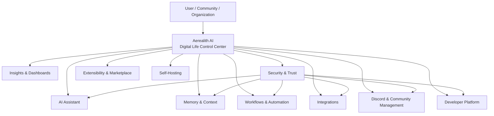
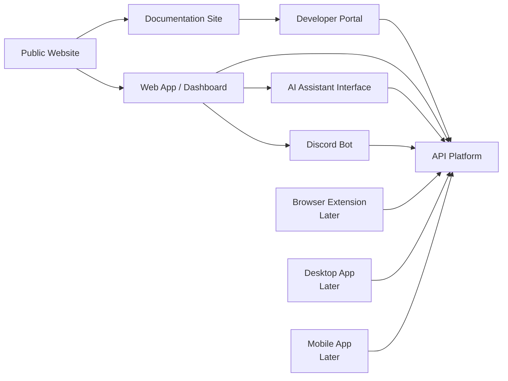

# Product Overview

Aerealith AI brings your digital life together into one intelligent, secure, customizable control center.

It is designed to reduce app sprawl, connect fragmented tools, simplify online workflows, and give users a trusted place to manage their digital world without giving up control.

Aerealith is not just another assistant, dashboard, Discord bot, automation tool, or integration hub.

It is a modular platform for managing digital life, communities, workflows, automations, insights, and connected services through one user-controlled intelligence layer.

---

## Purpose

This document defines Aerealith AI as a product.

It explains:

- what Aerealith does
- who it serves
- what problems it solves
- what product surfaces it includes
- what capabilities define the platform
- what belongs in the first product story
- what belongs to future product direction

This document is intentionally product-focused.

It does not define implementation details, service architecture, database models, pricing tiers, infrastructure topology, or release execution.

Those belong in separate documentation areas.

---

## Product Promise

Aerealith brings your digital life together into one intelligent, secure, customizable control center.

The product should help users feel:

- less overwhelmed
- more organized
- safer online
- more capable
- more informed
- more in control
- like they finally have one place for everything

The primary emotional outcome is control.

Aerealith should make users feel like their digital world is manageable again.

---

## The Problem

The modern online world is fragmented.

People rely on too many apps, dashboards, bots, accounts, services, tools, notifications, communities, files, workflows, automations, and platforms.

This creates app sprawl.

App sprawl makes it harder to:

- understand what is happening
- remember where things are
- manage repeated tasks
- protect accounts and data
- coordinate communities
- connect tools together
- automate safely
- maintain digital routines
- trust AI with useful context
- keep control over online life

Aerealith exists because the digital world has become too scattered to manage comfortably by hand.

---

## Product Positioning

Aerealith AI is a secure, modular, user-controlled digital life platform.

It combines AI assistance, memory, workflows, automation, integrations, dashboards, Discord community management, APIs, developer tools, and long-term extensibility into one trusted system.

Aerealith should be understood as:

> An operating system for your digital life.

It is not trying to replace every app.

It is trying to connect them, organize them, explain them, automate repetitive work, and give the user one coherent place to manage everything.

---

## What Aerealith Is

Aerealith is:

- an AI assistant platform
- a digital life control center
- a workflow and automation system
- a Discord and community-management platform
- an integration layer for apps and services
- a dashboard and insight system
- a developer-accessible API platform
- a user-controlled memory and context system
- a modular ecosystem that can grow over time

Aerealith should help users understand, manage, automate, and improve their digital life without hiding what it is doing.

---

## What Aerealith Is Not

Aerealith is not:

- another ChatGPT wrapper
- another Discord bot
- another automation platform
- another password manager
- another cloud storage provider
- a black-box AI system
- a data-selling platform
- a tool that takes control away from users
- a product that hides AI actions
- a system designed around vendor lock-in

Aerealith may include assistant features, Discord features, automation features, storage integrations, memory systems, and security tools, but its value comes from bringing those capabilities together into one coherent platform.

---

## Primary Launch Audience

Aerealith should launch with two primary audience groups:

1. Individuals
2. Discord communities

These audiences are equally important for the first product story.

Individuals need one place to manage personal digital life, tasks, context, workflows, and connected services.

Discord communities need one place to manage moderation, tickets, roles, onboarding, automation, logging, analytics, and community operations.

Additional audiences should be supported as the platform grows.

| Audience                    | Product Need                                                                                         | Aerealith Value                                                                                      |
| --------------------------- | ---------------------------------------------------------------------------------------------------- | ---------------------------------------------------------------------------------------------------- |
| Individuals                 | Manage digital life, tasks, memory, apps, workflows, accounts, reminders, and automations.           | Provides a trusted AI control center for personal digital organization.                              |
| Discord Communities         | Manage moderation, tickets, roles, logs, automation, onboarding, analytics, and community workflows. | Provides a modular one-stop Discord management platform connected to the larger Aerealith ecosystem. |
| Developers / Homelab Users  | Manage projects, infrastructure, APIs, repositories, alerts, services, and automation.               | Provides technical workflows, observability, integrations, and assistant-driven operations.          |
| Creators / Streamers        | Manage content workflows, posting, scheduling, community engagement, and analytics.                  | Provides creator-focused automation, insights, and connected platform support.                       |
| Small Teams / Organizations | Manage shared workflows, users, permissions, integrations, policies, and operational tasks.          | Provides controlled collaboration, organization memory, governance, and auditable automation.        |

---

## Core Product Pillars

Aerealith is built around ten product pillars.

| Pillar                         | Purpose                                                                                                                        |
| ------------------------------ | ------------------------------------------------------------------------------------------------------------------------------ |
| AI Assistant                   | Gives users a natural interface for planning, asking, understanding, organizing, and acting across connected systems.          |
| Memory & Context               | Helps Aerealith remember useful information with user control, review, editing, deletion, scoping, and consent.                |
| Workflows & Automation         | Lets users define repeatable processes, safe automations, approval flows, routines, and triggered actions.                     |
| Integrations                   | Connects apps, platforms, services, communities, APIs, infrastructure, and external tools.                                     |
| Insights & Dashboards          | Turns connected activity and data into summaries, dashboards, trends, reports, and recommendations.                            |
| Discord & Community Management | Provides modular Discord management for moderation, tickets, roles, logging, onboarding, automation, and community operations. |
| Developer Platform             | Provides APIs, documentation, webhooks, SDKs, integration tools, and developer-facing platform access.                         |
| Security & Trust               | Keeps actions permissioned, auditable, reversible where possible, explainable, and controlled by the user.                     |
| Extensibility & Marketplace    | Allows modules, workflow templates, integrations, assistant personalities, and ecosystem extensions over time.                 |
| Self-Hosting                   | Supports the long-term goal of user-controlled, portable, self-hostable deployment options.                                    |

---

## Product Model

---

## Primary Product Surfaces

Aerealith should be available through multiple product surfaces.

Not every surface is part of the initial launch.

| Surface                | Phase       | Purpose                                                                                                                     |
| ---------------------- | ----------- | --------------------------------------------------------------------------------------------------------------------------- |
| Public Website         | Early       | Explains the product, vision, features, pricing direction, community, documentation, and onboarding paths.                  |
| Web App / Dashboard    | Early       | Main control center for accounts, assistant, workflows, integrations, Discord settings, dashboards, and user configuration. |
| AI Assistant Interface | Early       | Primary conversational and task interface for users.                                                                        |
| Discord Bot            | Early       | First-party community-management product surface and major proof of modular operations.                                     |
| Developer Portal       | Early / Mid | Provides API docs, integration guides, examples, keys, webhooks, and developer onboarding.                                  |
| API Platform           | Early / Mid | Makes Aerealith capabilities accessible programmatically.                                                                   |
| Documentation Site     | Early       | Explains usage, setup, architecture, modules, policies, APIs, and platform behavior.                                        |
| Browser Extension      | Later       | Provides context-aware assistance inside websites, dashboards, docs, and tools.                                             |
| Desktop App            | Later       | Provides local productivity access, notifications, quick actions, and workstation-level assistance.                         |
| Mobile App             | Later       | Provides portable assistant access, reminders, approvals, notifications, and quick actions.                                 |

---

## Surface Relationship

---

## Early Product Story

The early product story should focus on two strong foundations:

1. Personal assistant, memory, and workflows.
2. Discord management and community operations.

Together, these prove the core idea of Aerealith:

> One intelligent platform can help manage personal digital life and online communities through secure, modular, user-controlled systems.

The early product does not need every future capability to be complete.

It needs to prove that Aerealith can:

- understand user context
- connect useful tools
- manage repeated workflows
- support modular Discord operations
- explain what it is doing
- keep users in control
- remain secure, auditable, and reversible where possible

---

## Discord Product Position

Discord is a major first-party product area.

It is not just another integration.

Discord is one of the first proofs that Aerealith can manage complex communities through modular, configurable systems.

The Discord platform should combine the kinds of features people currently spread across multiple bots, including:

- moderation
- automod
- logging
- tickets
- role automation
- welcome and onboarding flows
- verification
- reaction roles
- forms
- announcements
- reminders
- custom commands
- tags
- starboard-style community highlights
- giveaways
- server analytics
- community dashboards
- persona/proxy-style roleplay tools where appropriate
- module enable/disable controls per server

The long-term goal is for Aerealith to become a one-stop management layer for Discord communities while remaining connected to the broader Aerealith web app, APIs, user accounts, workflows, analytics, and automation system.

---

## AI Assistant Experience

Aerealith should include a customizable AI assistant experience.

Users should be able to shape how the assistant communicates, what it remembers, what it can access, what actions it can perform, and how much autonomy it has.

The Product Overview should not lock a permanent assistant name.

The assistant identity system should be defined in a separate product document.

At a product level, the assistant should support:

- customizable tone
- customizable personality
- user-defined boundaries
- permissioned memory
- scoped tool access
- approval rules
- explainable actions
- workflow suggestions
- automation recommendations
- clear AI disclosure where relevant

The assistant should enhance users, not replace them.

---

## Control Model

Aerealith should follow a trust-first control model.

The default behavior should be:

1. Ask first.
2. Verify intent.
3. Perform the approved action.
4. Explain what happened.
5. Offer automation only after repeated user behavior makes automation useful.

Aerealith should not assume permission.

Aerealith should not silently take sensitive actions.

Aerealith should not hide what it did.

Aerealith should not manipulate users into giving more access than needed.

---

## Automation Philosophy

Automation should be earned.

Aerealith should notice repeated user behavior and offer to turn it into a workflow only after the user has performed that action enough times to establish a clear pattern.

Automation should be:

- permissioned
- scoped
- auditable
- revocable
- explainable
- reversible where possible
- safe by default
- blocked when risk is too high

Automation should reduce repetitive work without reducing user control.

---

## Product Trust Requirements

Trust is not a feature checkbox.

Trust is part of the product.

Aerealith should always make it clear:

- what it can access
- what it remembers
- what it changed
- what it plans to do
- what requires approval
- what was automated
- what failed
- what data was used
- what can be undone
- what cannot be undone

Aerealith should never sell user data.

Aerealith should never train on private user data without explicit consent.

Aerealith should never hide AI actions.

Aerealith should never dark-pattern users.

Aerealith should never intentionally create vendor lock-in.

Aerealith should never prioritize revenue over user trust.

---

## Product Experience Principles

Every Aerealith product surface should follow these principles:

| Principle                                   | Product Meaning                                                                                          |
| ------------------------------------------- | -------------------------------------------------------------------------------------------------------- |
| Reduce complexity without reducing control. | Aerealith should simplify the user’s digital life without hiding important choices.                      |
| Cohesion over fragmentation.                | Aerealith should connect scattered tools into one understandable experience.                             |
| Ask before acting.                          | Sensitive or meaningful actions require user approval.                                                   |
| Explain what happened.                      | Users should understand what Aerealith did and why.                                                      |
| Make actions auditable.                     | Important actions should leave a clear record.                                                           |
| Make automation reversible where possible.  | Users should be able to undo, pause, revoke, or change automation behavior.                              |
| Keep the platform useful without AI.        | If AI is unavailable, core dashboards, settings, workflows, and platform controls should still function. |
| Make dependencies replaceable.              | Aerealith should avoid unnecessary vendor lock-in.                                                       |
| Make capabilities accessible through APIs.  | Major product capabilities should eventually be programmable and extensible.                             |
| Evolve naturally.                           | Aerealith should grow in a way that feels coherent, not bloated.                                         |

---

## Product Capabilities

The following capabilities define what Aerealith should provide over time.

| Capability            | Description                                                                                                                |
| --------------------- | -------------------------------------------------------------------------------------------------------------------------- |
| Account & Identity    | Users can create accounts, manage profiles, preferences, security settings, and connected identities.                      |
| AI Assistant          | Users can interact with Aerealith through natural language, guided workflows, explanations, and task support.              |
| Memory                | Users can allow Aerealith to remember useful information while retaining review, edit, scope, export, and delete controls. |
| Workflows             | Users can create repeatable processes for personal tasks, community operations, projects, integrations, and automations.   |
| Automation            | Users can automate approved actions across connected tools and services.                                                   |
| Discord Management    | Communities can manage moderation, tickets, roles, logs, onboarding, analytics, and modules.                               |
| Integrations          | Users can connect external platforms, apps, APIs, developer tools, cloud services, and community tools.                    |
| Dashboards            | Users can see summaries, insights, analytics, health, activity, and operational state.                                     |
| Notifications         | Users can receive alerts, approvals, reminders, and summaries across supported channels.                                   |
| Developer APIs        | Developers can build on top of Aerealith capabilities through documented APIs and integration tools.                       |
| Module System         | Features can be enabled, disabled, configured, extended, and governed by user or organization needs.                       |
| Audit & Activity Logs | Important actions are recorded for review, accountability, and troubleshooting.                                            |
| Data Controls         | Users can manage access, privacy, memory, exports, deletion, and consent.                                                  |
| Marketplace           | Future ecosystem for modules, workflow templates, integrations, assistant identities, and extensions.                      |
| Self-Hosting          | Future deployment model for users and organizations needing more control.                                                  |

---

## MVP Product Direction

The MVP should be phased.

It should not try to ship every long-term idea at once.

The strongest early product story is:

> Aerealith helps individuals and Discord communities manage scattered digital workflows from one secure, intelligent control center.

Early MVP emphasis:

- account foundation
- web dashboard
- AI assistant interface
- user preferences
- memory foundation
- workflow foundation
- integration foundation
- Discord bot foundation
- Discord module configuration
- moderation and ticket basics
- audit logs
- notification patterns
- developer-accessible APIs where needed

The MVP should prove the platform is useful, trustworthy, modular, and expandable.

---

## Future Product Directions

The following are important product directions, but they should be clearly treated as future expansion areas unless tied to a specific release milestone.

| Future Direction                   | Product Intent                                                                                                                          |
| ---------------------------------- | --------------------------------------------------------------------------------------------------------------------------------------- |
| Browser Extension                  | Provide context-aware help inside websites, dashboards, documentation, and tools.                                                       |
| Desktop App                        | Provide local workstation access, quick commands, notifications, and productivity assistance.                                           |
| Mobile App                         | Provide portable approvals, reminders, summaries, alerts, and assistant access.                                                         |
| Marketplace                        | Allow users and creators to share modules, workflows, integrations, assistant personalities, and templates.                             |
| Self-Hosting                       | Allow advanced users and organizations to run Aerealith in their own environments.                                                      |
| Advanced Infrastructure Operations | Support deeper observability, incident response, deployments, runbooks, and technical operations.                                       |
| Advanced AI Routing                | Route tasks intelligently between Aerealith models and external models based on task type, capability, privacy, cost, and availability. |
| Payments & Entitlements            | Support subscriptions, usage, plan access, add-ons, and product entitlement logic.                                                      |
| Organization Workspaces            | Support teams, roles, policies, shared workflows, organization memory, and governance controls.                                         |
| Long-Term AI Continuity Research   | Explore persistent, adaptive, explainable AI behavior without making unsupported claims about sentience or autonomy.                    |

---

## AI and Model Strategy

Aerealith should not depend on a single AI model.

The platform should support intelligent routing between models based on:

- task type
- model capability
- privacy requirements
- cost
- latency
- availability
- user settings
- organization policy
- safety requirements

Aerealith may use its own models over time, but the product should remain functional even when AI services are degraded or unavailable.

AI should enhance the platform.

AI should not be the only thing holding the platform together.

---

## Payments and Entitlements

Payments are core to the platform’s business and access model, but pricing details do not belong in this document.

This document should not define:

- pricing
- plan limits
- subscription costs
- add-on costs
- billing tables
- feature gates

Those should live in a separate business model, billing, or entitlements document.

At the product overview level, Aerealith should simply acknowledge that billing and entitlements will eventually control access to plans, modules, usage, organizations, marketplace items, and premium capabilities.

---

## Product Boundary

This document defines what Aerealith is as a product.

It does not define:

- database schema
- infrastructure architecture
- service boundaries
- API routes
- implementation stack
- pricing tables
- legal policy text
- deployment scripts
- CI/CD pipelines
- detailed Discord command specs
- detailed workflow engine schemas
- detailed memory schemas

Those belong in focused documents.

---

## Success Criteria

Aerealith is succeeding as a product when users say things like:

> I feel in control.

> I finally have one place for everything.

> I waste less time managing apps.

> I understand what my tools are doing.

> My community is easier to manage.

> I trust Aerealith with important parts of my digital life because it is transparent, secure, customizable, and keeps me in control.

Long-term success means users cannot imagine managing their complex digital world without Aerealith.

---

## Relationship to Other Product Documents

This document is the root of the product documentation tree.

```mermaid
flowchart TD
    ProductOverview["Product Overview.md"]

    ProductOverview --> Personas["User Personas.md"]
    ProductOverview --> Capabilities["Platform Capabilities.md"]
    ProductOverview --> Modules["Module System.md"]
    ProductOverview --> Discord["Discord Platform.md"]
    ProductOverview --> Assistant["AI Assistant.md"]
    ProductOverview --> Automation["Automation.md"]
    ProductOverview --> Dashboard["Dashboard.md"]
    ProductOverview --> Integrations["Integrations.md"]
    ProductOverview --> Developer["Developer Platform.md"]
    ProductOverview --> SelfHosting["Self Hosting.md"]
    ProductOverview --> Marketplace["Marketplace.md"]
    ProductOverview --> Trust["Product Trust.md"]
```

---

## Recommended Next Documents

After this document, the next product documents should be:

1. `docs/product/User Personas.md`
2. `docs/product/Platform Capabilities.md`
3. `docs/product/Discord Platform.md`
4. `docs/product/AI Assistant.md`
5. `docs/product/Module System.md`

These should break the Product Overview into focused, buildable product specifications.

---

## Final Product Standard

Aerealith should bring the user’s digital life together without taking it away from them.

The product should be powerful, but understandable.

Automated, but permissioned.

Intelligent, but honest.

Customizable, but safe.

Extensible, but coherent.

Aerealith exists to eliminate unnecessary complexity so people can focus on what actually matters.
