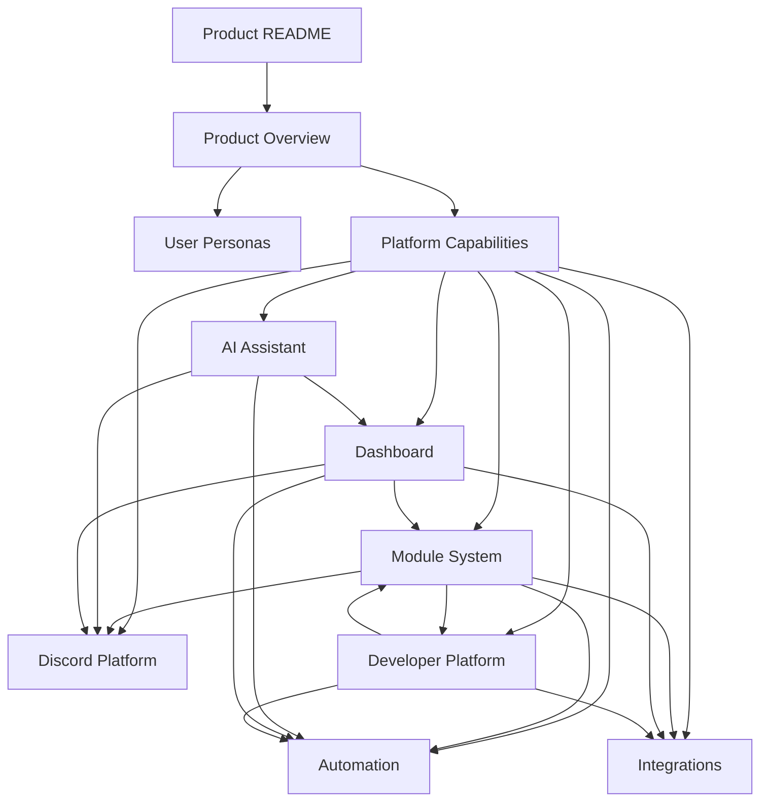
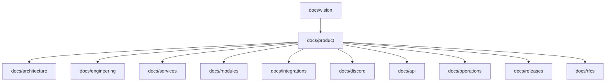

# Product Documentation

Status: Accepted
Owner: SinLess Games LLC
Last Updated: 2026-07-18
Document Type: Target Product Index
Implementation State: Intended behavior; not proof of current availability
Authority: Product navigation; [Project Overview](../Project-Overview.md) defines product identity and boundaries

The `docs/product/` folder defines the intended user-facing shape of Aerealith.
Aerealith is the platform; Aerealith AI is the assistant within it. Product
documents must be checked against [Current State](../CURRENT_STATE.md) before a
capability is described as available.

SinLess Industries is the operating umbrella for SinLess Games and Aerealith AI.
SinLess Games LLC remains the legal project steward and the service provider where
identified; see [Company and Project Structure](../Company-and-Project-Structure.md).

**Tagline:** One Platform. Infinite Possibilities.

**North Star:** Reduce digital complexity without reducing user control.

## Project Context

- [Project Overview](../Project-Overview.md)
- [Company and Project Structure](../Company-and-Project-Structure.md)
- [Current State](../CURRENT_STATE.md)
- [Documentation Index](../README.md)

## Purpose

The product documentation exists to define the intended user-facing shape of the Aerealith platform before implementation details are considered.

It should answer:

- What does Aerealith do?
- Who is Aerealith for?
- What problems does Aerealith solve?
- What capabilities should the platform provide?
- What product surfaces should exist?
- How should users experience the dashboard, assistant, Discord bot, modules, workflows, and integrations?
- What belongs in MVP?
- What belongs later?
- What should Aerealith intentionally avoid becoming?

This folder should guide product planning, roadmap decisions, UX design, engineering specs, release planning, and future marketplace/module strategy.

---

## Product Position

Aerealith is the operating system for your digital life.

It is a modular platform that combines:

- AI assistance
- memory and context
- workflows and automation
- Discord community management
- integrations
- dashboards and insights
- notifications
- developer APIs
- modules
- marketplace readiness
- future self-hosting

Aerealith is not just a chatbot, Discord bot, automation tool, dashboard, or integration hub.

Its value comes from connecting those capabilities into one trusted, user-controlled system.

---

## Reading Order

Read the product documents in this order:

1. [Product Overview](./Product%20Overview.md)
2. [User Personas](./User%20Personas.md)
3. [Platform Capabilities](./Platform%20Capabilities.md)
4. [Module System](./Module%20System.md)
5. [Discord Platform](./Discord%20Platform.md)
6. [AI Assistant](./AI%20Assistant.md)
7. [Automation](./Automation.md)
8. [Dashboard](./Dashboard.md)
9. [Integrations](./Integrations.md)
10. [Developer Platform](./Developer%20Platform.md)

This order moves from broad product definition into specific product surfaces and systems.

---

## Document Map



---

## Product Documents

---

## Product Overview

**File:** [Product Overview.md](./Product%20Overview.md)

Expands the target product experience for the Aerealith platform.

This document explains:

- the core product promise
- the problem Aerealith solves
- product positioning
- what Aerealith is
- what Aerealith is not
- primary launch audience
- product pillars
- product surfaces
- early product story
- future product directions
- MVP product direction

Start here first.

This document is the root product definition.

---

## User Personas

**File:** [User Personas.md](./User%20Personas.md)

Defines who Aerealith is being built for.

This document covers:

- individual users
- Discord server owners
- Discord admins/managers
- Discord moderators/staff
- Discord community members
- developers/homelab users
- creators/streamers
- organization admins
- marketplace developers
- self-hosted operators
- power automators
- enterprise/compliance admins

Use this document when deciding who a feature is for.

If a product idea does not clearly serve a persona, reconsider it.

---

## Platform Capabilities

**File:** [Platform Capabilities.md](./Platform%20Capabilities.md)

Defines what Aerealith can do as a platform.

This document acts as the product capability catalog.

It covers:

- identity and accounts
- web dashboard
- AI assistant
- memory and context
- workflows and automation
- integrations
- Discord and community management
- dashboards and insights
- notifications
- developer platform
- security, trust, and auditability
- modules and marketplace
- billing and entitlements
- operations and observability
- self-hosting

Use this document when planning release scope, GitHub issues, platform modules, or future specs.

---

## Module System

**File:** [Module System.md](./Module%20System.md)

Defines how Aerealith packages user-facing functionality into enableable, disableable, configurable product units.

This document covers:

- what counts as a module
- what does not count as a module
- module IDs
- module manifests
- module permissions
- module risk levels
- module dependencies
- module events
- module audit logs
- module configuration
- presets
- export/import
- first-party modules
- third-party modules
- marketplace readiness
- Discord as the first real module system

Use this document when designing modular features.

Modules should add capability without adding confusion.

---

## Discord Platform

**File:** [Discord Platform.md](./Discord%20Platform.md)

Defines Aerealith’s Discord product surface.

Discord is a major first-party product area and the first flagship proof that Aerealith can manage communities through modular, trusted, user-controlled systems.

This document covers:

- official Discord bot identity
- server installation
- server linking
- built-in common roles
- role creation
- permissions and role mapping
- Discord modules
- moderation
- automod
- tickets
- ticket transcripts
- logging and audit events
- community engagement
- leveling
- music
- dice and fun tools
- creator notifications
- Discord dashboard
- AI in Discord
- workflows and automation
- community data ownership

Use this document when planning Discord features.

Aerealith Discord should reduce bot clutter while improving trust, safety, auditability, and community experience.

---

## AI Assistant

**File:** [AI Assistant.md](./AI%20Assistant.md)

Defines the Aerealith assistant experience.

The assistant is the natural-language control layer for the broader platform.

This document covers:

- assistant identity
- assistant philosophy
- assistant modes
- autonomy levels
- memory and context
- customization
- tool access
- approval-based actions
- automation suggestions
- Discord assistant behavior
- developer assistant behavior
- model routing
- local/self-hosted model support
- assistant audit logs
- user controls
- safety boundaries

Use this document when designing AI-assisted product behavior.

The assistant should help users act, but it should not quietly take control.

---

## Automation

**File:** [Automation.md](./Automation.md)

Defines workflows and automation as a product area.

Automation should reduce repetitive work without reducing user control.

This document covers:

- workflows
- triggers
- conditions
- actions
- approval gates
- dry runs
- risk levels
- workflow history
- automation suggestions
- Discord automation
- workflow templates
- workflow builder
- AI-assisted automation
- export/import
- marketplace readiness
- failure handling
- automation audit events

Use this document when designing workflows, automation features, or event-driven behavior.

Automation should be earned, permissioned, explainable, auditable, and revocable.

---

## Dashboard

**File:** [Dashboard.md](./Dashboard.md)

Defines the Aerealith web dashboard as the main visual control center.

This document covers:

- dashboard home
- attention center
- AI assistant panel
- Discord dashboard
- module grid
- commands dashboard
- roles and permissions dashboard
- moderation dashboard
- automod dashboard
- tickets dashboard
- community engagement dashboard
- music and voice dashboard
- utility dashboard
- creator notifications dashboard
- workflows dashboard
- integrations dashboard
- notifications dashboard
- logs and audit dashboard
- analytics dashboard
- developer dashboard
- settings dashboard
- organization and self-hosted dashboards later

Use this document when designing web app UX.

The dashboard should make users feel in control.

---

## Integrations

**File:** [Integrations.md](./Integrations.md)

Defines how Aerealith connects to external tools, services, platforms, and providers.

This document covers:

- integration types
- integration IDs
- connection flow
- scoped permissions
- consent records
- integration risk levels
- integration manifests
- integration events
- audit logs
- integration dashboard
- AI and integrations
- memory and integrations
- workflow triggers/actions
- provider replacement
- Discord
- GitHub
- Google
- Cloudflare
- Grafana
- creator platforms
- email providers
- storage providers
- AI providers
- custom APIs and webhooks

Use this document when adding external service connections.

Aerealith should integrate before replacing.

---

## Developer Platform

**File:** [Developer Platform.md](./Developer%20Platform.md)

Defines the programmable foundation of Aerealith.

This document covers:

- developer documentation
- APIs
- API versioning
- authentication
- authorization
- API keys and tokens
- permissions
- webhooks
- event system
- SDK strategy
- developer portal
- API explorer
- event explorer
- integration development
- module development
- workflow development
- marketplace development
- sandboxed plugin runtime
- diagnostics
- errors
- rate limits
- local development
- self-hosting developer path

Use this document when planning APIs, developer tools, SDKs, webhooks, or marketplace foundations.

The Developer Platform should help Aerealith become an ecosystem, not just an app.

---

## Product Principles

All product documents should follow these principles.

## Reduce Complexity Without Reducing Control

Aerealith should simplify the user’s digital life without hiding important decisions.

## Integrate Before Replacing

Aerealith should connect the tools users already rely on instead of forcing replacement too early.

## Trust Is Product Behavior

Trust should be visible in permissions, approvals, audit logs, memory controls, AI disclosure, and revocation paths.

## AI Is a Capability, Not the Product

Aerealith should remain useful through dashboards, modules, workflows, Discord tools, integrations, APIs, and logs even when AI is unavailable.

## Automation Must Be Earned

Automation should be suggested after repeated behavior, approved by the user, scoped, logged, and easy to disable.

## Discord Is First-Party

Discord is not a small connector.

It is the first flagship community product surface for Aerealith.

## Modules Add Power Without Chaos

Modules should be optional, configurable, scoped, auditable, and safe to disable.

## APIs Are Product Surfaces

Major Aerealith capabilities should eventually be API-accessible where appropriate.

## Users Own Their Data

User, community, organization, workflow, memory, integration, and Discord data should be exportable and deletable where practical.

## Future Self-Hosting Should Not Be Blocked

Dockerization, provider replacement, and clean boundaries should be considered early even if supported self-hosting comes later.

---

## Product Scope Summary

Aerealith product scope includes:

```text
Account and identity
Dashboard
AI assistant
Memory and context
Workflows and automation
Discord bot and dashboard
Discord moderation
Discord tickets
Discord roles and permissions
Discord engagement
Discord music, dice, and utilities
Modules
Integrations
Notifications
Audit logs
Analytics and insights
Developer APIs
Webhooks
Documentation
Marketplace readiness
Future self-hosting
```

---

## MVP Product Focus

The MVP should prove that Aerealith can help individuals and Discord communities manage digital complexity from one secure, intelligent control center.

MVP should focus on:

```text
Account foundation
Web dashboard
AI assistant foundation
User preferences
Memory foundation
Workflow foundation
Integration foundation
Discord bot foundation
Discord server linking
Discord module system
Common role creation
Role and permission mapping
Moderation basics
Automod foundation
Tickets
Ticket transcripts
Logging and audit events
Basic welcome
Basic activity summaries
Notifications foundation
Developer/API foundations
Observability foundation
```

The MVP should not try to ship every future idea at once.

It should prove the platform is useful, trustworthy, modular, and expandable.

---

## Post-MVP Product Focus

Post-MVP should expand into:

```text
Advanced dashboard views
Workflow builder
Dry runs
Workflow templates
Memory review UI
Assistant customization
Advanced Discord modules
Welcome and onboarding
Verification
Reaction/self roles
Leveling
Music
Dice and games
Announcements
Forms
Creator notifications
Community analytics
GitHub integration
Google integration
Webhooks
API keys
Developer portal expansion
Billing and entitlements
Organization foundations
```

---

## Future Product Focus

Future product work may include:

```text
Marketplace
Third-party modules
Sandboxed plugins
Assistant skills
Advanced model routing
Local/self-hosted models
Mobile app
Desktop app
Browser extension
Advanced organization governance
Advanced infrastructure operations
Cross-service automation
Self-hosted preview
Private marketplace
Provider replacement settings
Advanced analytics
Community health reports
Enterprise/compliance features
```

---

## Product Boundaries

Aerealith should avoid becoming unfocused.

Aerealith is not primarily:

- a generic chatbot
- a single-purpose Discord bot
- a generic cloud storage provider
- a password manager
- a hidden surveillance system
- a fully autonomous AI agent
- a dark-pattern subscription machine
- a vendor-locked platform
- a replacement for every app users already use

Aerealith should connect, organize, automate, and explain.

It should not try to own every part of the user’s digital life.

---

## Relationship to Other Documentation

Product documentation should connect to the rest of the repo docs.



## Relationship Rules

| Folder               | Relationship                                                       |
| -------------------- | ------------------------------------------------------------------ |
| `docs/vision/`       | Defines why Aerealith exists and what it believes.                 |
| `docs/product/`      | Defines what Aerealith is and what users experience.               |
| `docs/architecture/` | Defines how the platform is structured technically.                |
| `docs/engineering/`  | Defines how the platform is built and maintained.                  |
| `docs/services/`     | Defines deployable services and service boundaries.                |
| `docs/modules/`      | Defines detailed module specifications.                            |
| `docs/integrations/` | Defines detailed integration specifications.                       |
| `docs/discord/`      | Defines detailed Discord commands, modules, events, and workflows. |
| `docs/api/`          | Defines public and internal API contracts.                         |
| `docs/operations/`   | Defines deployment, observability, incidents, and reliability.     |
| `docs/releases/`     | Defines phased delivery and release scope.                         |
| `docs/rfcs/`         | Defines proposed changes and major decisions.                      |

---

## Recommended Next Product Documents

The following product documents should be added next:

```text
docs/product/Notifications.md
docs/product/Product Trust.md
docs/product/Memory and Context.md
docs/product/Marketplace.md
docs/product/Self Hosting.md
docs/product/Billing and Entitlements.md
docs/product/MVP Scope.md
```

Suggested order:

1. `Notifications.md`
2. `Product Trust.md`
3. `Memory and Context.md`
4. `Marketplace.md`
5. `MVP Scope.md`
6. `Billing and Entitlements.md`
7. `Self Hosting.md`

---

## Product Review Questions

Before adding or changing a product feature, ask:

- Which persona does this serve?
- Which product document owns this feature?
- Is this MVP, post-MVP, future, or research?
- Does this reduce digital complexity?
- Does this keep users in control?
- Does this require permissions?
- Does this require audit logs?
- Does this require approval or verification?
- Does this need to be API-accessible?
- Does this belong in Aerealith, or should Aerealith integrate with another tool?
- Does this create vendor lock-in?
- Can it be disabled?
- Can it be explained clearly?
- Can it fail safely?
- Does it work without AI?
- Does it respect user/community data ownership?
- Does it support the long-term roadmap?

If the feature does not make Aerealith more useful, trustworthy, understandable, or extensible, reconsider it.

---

## Final Product Standard

Aerealith should make the digital world feel manageable again.

It should bring together personal workflows, Discord communities, AI assistance, automation, integrations, dashboards, modules, APIs, and future ecosystem capabilities into one coherent control center.

It should be powerful, but understandable.

Automated, but permissioned.

Intelligent, but honest.

Customizable, but safe.

Extensible, but coherent.

Aerealith should help users feel in control of their digital life.

One Platform. Infinite Possibilities.
