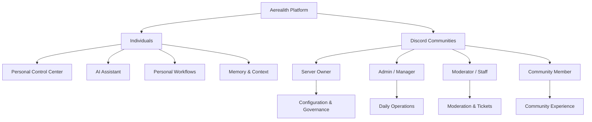
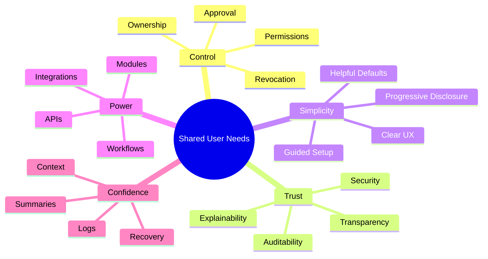

# User Personas

Status: Target specification
Document Type: Target Persona Specification
Implementation State: Intended personas and experience priorities; verify current availability in [Current State](../CURRENT_STATE.md)
Authority: Target product behavior; [Project Overview](../Project-Overview.md) defines product identity and boundaries

Aerealith is the platform; Aerealith AI is its assistant/application layer.
Aerealith is designed for people and communities trying to manage an increasingly fragmented digital world.

This document defines the primary, secondary, and future user personas for Aerealith. These personas should guide product decisions, feature prioritization, onboarding, interface design, automation behavior, Discord module design, and long-term platform planning.

Aerealith should be beginner-friendly by default while progressively revealing deeper power-user controls for users who need them.

---

## Purpose

The purpose of this document is to define who Aerealith is being built for.

It answers:

- Who are the primary users?
- What problems do they face?
- What do they need from Aerealith?
- What should they feel before and after using the platform?
- How comfortable are they with AI, automation, and technical systems?
- What product decisions should be influenced by each persona?

This document should help prevent Aerealith from becoming too vague, too technical, too narrow, or too bloated.

---

## Persona Philosophy

Aerealith serves different types of users, but every persona shares one core need:

> They want their digital world to feel manageable again.

Some users need personal organization.

Some need Discord community management.

Some need automation.

Some need developer tools.

Some need self-hosting.

Some need dashboards, logs, permissions, workflows, memory, and AI assistance.

Aerealith should support these needs without forcing every user to understand every part of the platform at once.

---

## Persona Naming

Persona names are intentionally left as user-chosen placeholders.

Use the role names until final names are selected.

Suggested format:

```text
[Name TBD] — The Individual Digital Life User
[Name TBD] — The Discord Server Owner
[Name TBD] — The Discord Admin / Manager
[Name TBD] — The Discord Moderator / Staff Member
[Name TBD] — The Discord Community Member
```

Names should be memorable, human, and easy to reference in product discussions.

---

## Launch Persona Focus

Aerealith launches with two equal product anchors:

1. Individuals
2. Discord communities

The individual user represents Aerealith as a personal digital-life control center.

The Discord server owner represents Aerealith as a modular community-management platform.

Discord admins, moderators, staff members, and community members are also critical because they interact with the system daily and are directly affected by its workflows.



---

## Persona Groups

## Launch Personas

These personas should guide MVP and early product design.

| Persona                          | Priority | Why They Matter                                                                 |
| -------------------------------- | -------: | ------------------------------------------------------------------------------- |
| Individual Digital Life User     |  Primary | Represents the core digital-life control center use case.                       |
| Discord Server Owner             |  Primary | Represents the buyer/admin for the first flagship community product surface.    |
| Discord Admin / Manager          |  Primary | Configures community systems and manages ongoing operations.                    |
| Discord Moderator / Staff Member |  Primary | Uses moderation, tickets, logs, and workflows daily.                            |
| Discord Community Member         |  Primary | Experiences onboarding, roles, support, tickets, forms, and automation effects. |

---

## Secondary Personas

These personas matter early but should not overload the MVP.

| Persona                         |  Priority | Why They Matter                                                                            |
| ------------------------------- | --------: | ------------------------------------------------------------------------------------------ |
| Developer / Homelab User        | Secondary | Strong fit for APIs, integrations, infrastructure awareness, automation, and self-hosting. |
| Creator / Streamer              | Secondary | Strong fit for Discord, audience management, content workflows, automation, and analytics. |
| Small Team / Organization Admin | Secondary | Strong fit for shared workflows, permissions, roles, policies, billing, and governance.    |

---

## Future Personas

These personas should influence long-term roadmap planning.

| Persona                       | Priority | Why They Matter                                                                                |
| ----------------------------- | -------: | ---------------------------------------------------------------------------------------------- |
| Marketplace Developer         |   Future | Builds modules, plugins, integrations, workflows, themes, and AI skills.                       |
| Self-Hosted Operator          |   Future | Needs deployment control, provider replacement, backups, updates, and admin documentation.     |
| Power Automator               |   Future | Builds complex workflows across many systems and services.                                     |
| Enterprise / Compliance Admin |   Future | Needs policy controls, audit logs, data governance, compliance workflows, and admin oversight. |

---

## Persona Matrix

| Persona                         | Technical Skill | AI Comfort     | Automation Trust | Primary Need                                | Product Surface                  |
| ------------------------------- | --------------- | -------------- | ---------------- | ------------------------------------------- | -------------------------------- |
| Individual Digital Life User    | Low to Medium   | Medium         | Low to Medium    | One place to manage digital life            | Web App, Assistant, Mobile Later |
| Discord Server Owner            | Medium          | Medium         | Medium           | Manage community with fewer tools           | Web App, Discord Bot             |
| Discord Admin / Manager         | Medium          | Medium         | Medium           | Configure and operate server systems        | Dashboard, Discord Bot           |
| Discord Moderator / Staff       | Low to Medium   | Medium         | Medium           | Fast, safe moderation and support tools     | Discord Bot, Dashboard           |
| Discord Community Member        | Low             | Low to Medium  | Low              | Clear, fair, helpful community interactions | Discord                          |
| Developer / Homelab User        | High            | High           | Medium to High   | APIs, automation, observability, control    | API, Dashboard, Docs             |
| Creator / Streamer              | Medium          | Medium         | Medium           | Manage content and community workflows      | Dashboard, Discord Bot           |
| Small Team / Organization Admin | Medium to High  | Medium         | Medium           | Shared workflows, access, governance        | Dashboard, Admin Tools           |
| Marketplace Developer           | High            | High           | Medium           | Build and distribute extensions             | Developer Portal, APIs           |
| Self-Hosted Operator            | High            | Medium to High | Medium           | Deploy and control infrastructure           | Docs, CLI, Admin Tools           |
| Power Automator                 | High            | High           | High             | Build advanced workflows                    | Workflow Builder, APIs           |
| Enterprise / Compliance Admin   | High            | Medium         | Low to Medium    | Auditability, policy, governance            | Admin Dashboard, Reports         |

---

## Detailed Persona Profiles

---

## [Name TBD] — The Individual Digital Life User

### Summary

The Individual Digital Life User wants one place to manage their scattered digital life.

They may use many apps, accounts, services, calendars, files, communities, devices, subscriptions, and tools. They do not want to become a systems administrator just to stay organized.

They want Aerealith to simplify their digital life while keeping them in control.

### Common Problems

- Too many apps and services to manage
- Important information spread across many places
- Repetitive digital tasks
- Too many notifications
- Difficulty remembering what needs attention
- Lack of context across tools
- Uncertainty about what AI can safely do
- Fear of losing control over personal data

### Goals

- Bring digital life into one control center
- Understand what needs attention
- Automate repetitive work safely
- Use AI without losing control
- Stay organized
- Feel safer online
- Spend less time managing tools

### Jobs To Be Done

```text
When my digital life feels scattered, I want one place to understand what matters, so I can stay organized without checking every app manually.
```

```text
When I repeat the same digital task several times, I want Aerealith to suggest automation, so I can save time without giving up control.
```

```text
When Aerealith uses AI, I want it to explain what it is doing, so I can trust the result.
```

### Emotional Journey

| Before Aerealith          | After Aerealith                          |
| ------------------------- | ---------------------------------------- |
| Overwhelmed               | In control                               |
| Scattered                 | Organized                                |
| Unsure                    | Confident                                |
| Reactive                  | Prepared                                 |
| Distrustful of automation | Comfortable with permissioned automation |

### Product Needs

- Simple onboarding
- Clear dashboard
- Assistant interface
- Memory controls
- Connected service overview
- Approval prompts
- Automation suggestions
- Notification summaries
- Privacy controls
- Explainable AI behavior

### Product Implications

Aerealith should not overwhelm this user with every advanced feature at once.

The experience should begin simple and become more powerful as the user gains confidence.

---

## [Name TBD] — The Discord Server Owner

### Summary

The Discord Server Owner is responsible for the health, safety, and growth of a Discord community.

They may currently rely on multiple bots for moderation, tickets, roles, logging, forms, giveaways, announcements, and analytics.

They want one modular system that can replace the chaos of managing many disconnected bots.

### Common Problems

- Too many Discord bots
- Bot configuration spread across multiple dashboards
- Inconsistent permissions
- Poor auditability
- Staff confusion
- Weak moderation visibility
- Ticket systems that feel disconnected
- Difficulty scaling server operations
- Limited analytics
- Premium features scattered across multiple services

### Goals

- Manage community tools from one platform
- Reduce bot clutter
- Configure modules per server
- Keep staff actions auditable
- Improve moderation and support workflows
- Understand community health
- Keep users safe
- Reduce manual staff workload

### Jobs To Be Done

```text
When I manage a Discord server, I want one platform for moderation, tickets, roles, logs, and automation, so I do not need five different bots.
```

```text
When my staff performs actions, I want those actions logged and explainable, so I can maintain accountability.
```

```text
When I enable a module, I want to understand what permissions it needs, so I can safely configure my server.
```

### Emotional Journey

| Before Aerealith             | After Aerealith                   |
| ---------------------------- | --------------------------------- |
| Frustrated by bot sprawl     | Confident with one modular system |
| Unsure what staff changed    | Clear audit visibility            |
| Worried about safety         | Better protected                  |
| Overloaded by configuration  | Guided setup                      |
| Reactive to community issues | Proactive and informed            |

### Product Needs

- Server onboarding
- Discord bot install flow
- Module enable/disable controls
- Permission mapping
- Role mapping
- Moderation configuration
- Ticket configuration
- Audit logs
- Dashboard analytics
- Staff access controls
- Clear module descriptions

### Product Implications

Discord should be treated as a major first-party product area.

The server owner experience should prioritize clarity, trust, permissions, and configuration confidence.

---

## [Name TBD] — The Discord Admin / Manager

### Summary

The Discord Admin / Manager handles ongoing server configuration and daily operations.

They are often responsible for managing modules, configuring roles, updating automations, reviewing logs, handling escalations, and making sure staff have what they need.

They need power and speed, but they also need guardrails.

### Common Problems

- Complex server settings
- Staff roles that are hard to manage
- Module configuration confusion
- Lack of centralized logs
- Repetitive admin tasks
- Poor visibility into active workflows
- Unclear permission boundaries
- Manual onboarding and role management

### Goals

- Configure server systems reliably
- Manage staff permissions
- Review activity and logs
- Automate repeated operations
- Avoid mistakes that affect the whole server
- Keep workflows consistent
- Reduce owner dependency

### Jobs To Be Done

```text
When I configure server modules, I want clear settings and safe defaults, so I can manage the community without breaking important workflows.
```

```text
When staff need access, I want role-based permissions, so each person can do their job without unnecessary power.
```

```text
When something changes, I want to know who changed it and why, so I can troubleshoot quickly.
```

### Emotional Journey

| Before Aerealith       | After Aerealith             |
| ---------------------- | --------------------------- |
| Buried in settings     | Focused and guided          |
| Worried about mistakes | Protected by guardrails     |
| Lacking visibility     | Clear operational awareness |
| Dependent on many bots | Unified management          |
| Manual and repetitive  | More automated              |

### Product Needs

- Advanced module configuration
- Role and permission management
- Change history
- Audit logs
- Automation controls
- Staff dashboards
- Server health overview
- Escalation settings
- Configuration validation
- Rollback where possible

### Product Implications

The admin interface should support advanced controls without making the default experience intimidating.

Use progressive disclosure: simple defaults first, advanced settings when needed.

---

## [Name TBD] — The Discord Moderator / Staff Member

### Summary

The Discord Moderator or Staff Member uses Aerealith during daily community operations.

They need fast, reliable tools for moderation, tickets, logging, warnings, timeouts, user lookup, transcripts, escalations, and staff coordination.

This persona cares less about platform philosophy and more about whether the tools work quickly and safely during real situations.

### Common Problems

- Slow moderation workflows
- Confusing commands
- Inconsistent logs
- Poor ticket visibility
- Repeated manual actions
- Lack of context during incidents
- Unclear escalation paths
- Fear of making mistakes
- Switching between multiple bots

### Goals

- Take fast moderation actions
- Resolve tickets efficiently
- Understand user history
- Escalate when needed
- Avoid accidental abuse of power
- Keep actions logged
- Reduce repetitive staff work
- Maintain community safety

### Jobs To Be Done

```text
When a user breaks rules, I want quick moderation tools with clear confirmation, so I can act safely and consistently.
```

```text
When I handle a ticket, I want context, assignment, transcripts, and escalation in one place, so support feels organized.
```

```text
When I take an action, I want Aerealith to log it automatically, so staff accountability is maintained.
```

### Emotional Journey

| Before Aerealith       | After Aerealith            |
| ---------------------- | -------------------------- |
| Rushed                 | Supported                  |
| Unsure                 | Confident                  |
| Switching tools        | Focused                    |
| Worried about mistakes | Protected by confirmations |
| Manual logging         | Automatic audit trail      |

### Product Needs

- Fast commands
- Clear moderation UI
- Ticket assignment
- Ticket transcripts
- User context
- Warning history
- Confirmation for risky actions
- Staff notes
- Escalation tools
- Action logs
- Mobile-friendly approval flows later

### Product Implications

Moderator tools should prioritize speed, clarity, and auditability.

High-risk actions should verify intent without making urgent work painfully slow.

---

## [Name TBD] — The Discord Community Member

### Summary

The Discord Community Member is not configuring Aerealith, but they experience its effects.

They interact with onboarding, verification, roles, tickets, forms, reminders, announcements, automod, and possibly AI-powered support.

They need the system to feel fair, clear, respectful, and helpful.

### Common Problems

- Confusing onboarding
- Unclear rules
- Slow support
- Unfair or unexplained moderation
- Hard-to-use ticket systems
- Role confusion
- Too many bot messages
- Lack of transparency

### Goals

- Join communities smoothly
- Understand rules and expectations
- Get help when needed
- Manage roles easily
- Trust moderation systems
- Avoid spammy bot interactions
- Feel respected by automation

### Jobs To Be Done

```text
When I join a server, I want clear onboarding, so I know what to do and where to go.
```

```text
When I need help, I want an easy ticket process, so I can contact staff without confusion.
```

```text
When moderation affects me, I want clear information, so I understand what happened.
```

### Emotional Journey

| Before Aerealith          | After Aerealith             |
| ------------------------- | --------------------------- |
| Confused                  | Guided                      |
| Ignored                   | Supported                   |
| Annoyed by bots           | Helped by useful automation |
| Unsure of rules           | Clear on expectations       |
| Distrustful of moderation | More confident in fairness  |

### Product Needs

- Clear onboarding
- Friendly bot messages
- Accessible forms
- Easy ticket creation
- Role selection
- Transparent moderation messages
- Helpful reminders
- Minimal notification spam
- Privacy-aware interactions

### Product Implications

Community-facing interactions should be simple, respectful, and clear.

Aerealith should never make members feel like they are being managed by a faceless punishment machine.

---

## Secondary Personas

---

## [Name TBD] — The Developer / Homelab User

### Summary

The Developer or Homelab User wants automation, observability, integrations, APIs, deployment control, and technical flexibility.

They may run personal servers, Discord communities, GitHub projects, Docker services, game servers, websites, or self-hosted tools.

They want Aerealith to connect their systems and help them understand what is happening.

### Common Problems

- Too many dashboards
- Manual infrastructure tasks
- Fragmented alerts
- Hard-to-track deployments
- Repetitive commands
- Poor cross-service visibility
- No single automation layer
- Tooling spread across many services

### Goals

- Monitor important services
- Automate repeated technical tasks
- Connect GitHub, Discord, infrastructure, and observability
- Use APIs and webhooks
- Build custom workflows
- Eventually self-host
- Keep technical systems understandable

### Jobs To Be Done

```text
When something breaks in my stack, I want Aerealith to summarize what happened, so I can troubleshoot faster.
```

```text
When I repeat technical tasks, I want to turn them into workflows, so I can save time and reduce mistakes.
```

```text
When I connect services, I want clear APIs and logs, so I can trust the automation.
```

### Product Implications

Developer-facing features should be strongly typed, documented, observable, API-accessible, and automation-friendly.

---

## [Name TBD] — The Creator / Streamer

### Summary

The Creator or Streamer manages content, community, announcements, schedules, social platforms, analytics, and audience engagement.

They often use Discord as a community hub and need workflows that reduce repetitive posting and community management.

### Common Problems

- Repetitive announcements
- Platform fragmentation
- Hard-to-track community activity
- Manual role and supporter management
- Content schedule chaos
- Too many analytics sources
- Community moderation burden

### Goals

- Manage community and content workflows
- Automate announcements
- Connect streaming/social platforms
- Track engagement
- Support fans and members
- Reduce manual posting
- Keep community safe

### Jobs To Be Done

```text
When I publish or stream, I want Aerealith to help notify my community, so I do not manually post everywhere.
```

```text
When my community grows, I want moderation and onboarding tools, so the server stays healthy.
```

### Product Implications

Creator workflows should focus on automation, announcements, analytics, Discord, role management, and low-friction configuration.

---

## [Name TBD] — The Small Team / Organization Admin

### Summary

The Small Team or Organization Admin needs shared workflows, roles, permissions, billing, governance, audit logs, and controlled collaboration.

They may manage a small business, game studio, creator team, open-source group, or internal community.

### Common Problems

- Shared access is hard to manage
- Workflows are inconsistent
- Permissions are unclear
- Billing ownership is messy
- No audit trail
- Team knowledge is scattered
- Too many tools for a small team

### Goals

- Manage team access
- Create shared workflows
- Control billing and entitlements
- Review audit logs
- Keep knowledge organized
- Connect team tools
- Enforce policy without slowing people down

### Jobs To Be Done

```text
When my team uses shared tools, I want clear roles and permissions, so people can work safely without unnecessary access.
```

```text
When an action affects the team, I want an audit trail, so I know who approved it and what changed.
```

### Product Implications

Organization features should focus on permissions, auditability, shared memory, billing ownership, policy controls, and role-based access.

---

## Future Personas

---

## [Name TBD] — The Marketplace Developer

### Summary

The Marketplace Developer builds modules, workflows, integrations, themes, templates, AI skills, or extensions for Aerealith.

They need stable APIs, documentation, publishing tools, permission manifests, testing tools, and review workflows.

### Product Implications

Aerealith should eventually provide a strong developer ecosystem where contributors can build without modifying the core platform.

---

## [Name TBD] — The Self-Hosted Operator

### Summary

The Self-Hosted Operator wants to deploy Aerealith under their own control.

They need Docker support, configuration documentation, provider replacement, backup/restore, upgrade paths, observability, security guidance, and clear limitations.

### Product Implications

Self-hosting should be treated as a product, not just a deployment script.

Dockerization should begin early, but supported self-hosting should arrive after the hosted platform is stable.

---

## [Name TBD] — The Power Automator

### Summary

The Power Automator wants to build advanced workflows across apps, services, APIs, Discord, infrastructure, notifications, and AI.

They need triggers, conditions, branching, approval gates, reusable templates, logs, debugging tools, and permissions.

### Product Implications

Workflow tools should support both beginner-friendly templates and advanced power-user capabilities.

---

## [Name TBD] — The Enterprise / Compliance Admin

### Summary

The Enterprise or Compliance Admin needs governance, policy enforcement, audit trails, data controls, access review, retention rules, approval workflows, and compliance reporting.

### Product Implications

Enterprise controls should not define the MVP, but the architecture should avoid decisions that make governance impossible later.

---

## Shared User Needs

Despite different personas, most Aerealith users need the same foundation.



Common needs include:

- clear onboarding
- safe defaults
- explainable AI
- understandable permissions
- revocable automation
- visible audit logs
- useful summaries
- modular configuration
- integrations with existing tools
- a dashboard that shows what matters
- beginner-friendly UX with advanced controls available later

---

## Anti-Personas

Aerealith is not primarily designed for every possible user.

Anti-personas help define product boundaries.

## Fully Autonomous AI Seekers

Users who want AI to act without approval, verification, audit logs, or boundaries are not the primary audience.

Aerealith should not optimize for blind autonomy.

## Simple Chatbot-Only Users

Users who only want a generic chat assistant may not need Aerealith.

Aerealith is larger than conversational AI.

## Single-Purpose Discord Bot Users

Users who only want one tiny Discord feature with no platform, dashboard, account, automation, or integration layer may not be the main fit.

Aerealith is designed as a modular platform.

## Generic Cloud Storage Seekers

Users looking only for file storage should use dedicated storage providers.

Aerealith may integrate with storage, but it is not primarily a cloud storage provider.

## Password Manager Replacement Seekers

Users looking only for credential storage should use specialized password managers.

Aerealith may integrate with password managers, but it should not replace them without a strong reason.

## Users Who Reject Transparency

Users who want hidden automation, invisible AI actions, dark patterns, or unlogged behavior are not aligned with Aerealith.

Aerealith should remain transparent and auditable.

---

## Product Design Implications

## Beginner-Friendly With Progressive Power

Aerealith should be approachable for beginners but powerful enough for advanced users.

Default experiences should be simple.

Advanced settings should be available when needed.


---

## Discord Requires Multiple User Experiences

Discord is not one persona.

A server owner, admin, moderator, and community member all experience Aerealith differently.

The Discord product should support:

- owner-level governance
- admin-level configuration
- moderator-level speed
- member-level clarity

---

## Trust Must Be Visible

Many personas have low or medium automation trust at first.

Aerealith should not expect users to trust it automatically.

It should show:

- what it can access
- what it is doing
- why it recommends something
- what requires approval
- what changed
- how to undo or revoke automation

---

## AI Should Adapt to User Comfort

Users have different AI comfort levels.

Aerealith should support:

- simple explanations for beginners
- technical details for advanced users
- customizable assistant tone
- adjustable automation thresholds
- clear AI disclosure
- manual controls when users do not want AI help

---

## Workflows Should Start From Real Use Cases

Workflow design should begin with user problems, not abstract automation features.

Examples:

- “Notify staff when a ticket is stale.”
- “Summarize Discord activity every morning.”
- “Warn me before a service goes unhealthy.”
- “Suggest automation after I repeat this task.”
- “Create a weekly content planning summary.”

---

## Product Surfaces Should Match Persona Needs

| Persona                         | Best Surface                       |
| ------------------------------- | ---------------------------------- |
| Individual Digital Life User    | Web App, Assistant, Mobile Later   |
| Discord Server Owner            | Web Dashboard, Discord Bot         |
| Discord Admin / Manager         | Web Dashboard, Discord Bot         |
| Discord Moderator / Staff       | Discord Bot, Quick Dashboard Views |
| Discord Community Member        | Discord Bot, Forms, Tickets        |
| Developer / Homelab User        | APIs, Docs, Dashboard              |
| Creator / Streamer              | Dashboard, Discord, Automation     |
| Small Team / Organization Admin | Admin Dashboard, Billing, Roles    |
| Marketplace Developer           | Developer Portal, APIs             |
| Self-Hosted Operator            | Docs, Docker, Admin Tools          |
| Power Automator                 | Workflow Builder, APIs             |
| Enterprise / Compliance Admin   | Audit Logs, Policies, Reports      |

---

## Success Criteria

Aerealith is serving its personas well when:

- individuals feel more in control of their digital life
- Discord owners can manage servers with fewer bots
- admins can configure systems safely
- moderators can act quickly and responsibly
- community members feel guided and respected
- developers can build against stable APIs
- creators can reduce repetitive community work
- teams can manage shared access and workflows
- future self-hosted users have a clear path toward deployment control
- automation feels earned, not forced
- AI feels helpful, not invasive
- users understand what Aerealith does and why

---

## Persona Review Questions

When designing a feature, ask:

- Which persona is this for?
- Is this a launch, secondary, or future persona need?
- What problem does this solve?
- What job does this help the user complete?
- What emotional state should improve?
- How much technical knowledge does this require?
- How much AI trust does this assume?
- What permissions does this need?
- What could go wrong?
- How does the user stay in control?

If a feature does not clearly serve a persona, it should be reconsidered.

---

## Final Standard

Aerealith should serve people before it serves features.

Every persona represents someone trying to reduce complexity, gain clarity, save time, protect their data, support a community, or build something useful.

The product should meet users where they are, then help them grow into the full power of the platform.

Aerealith should make users feel in control.
