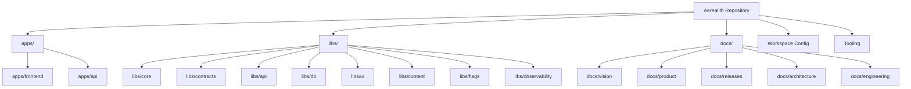
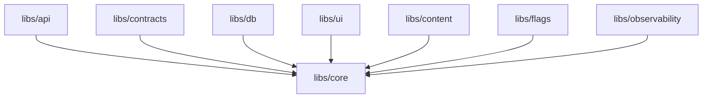

# 0.1 — Architecture Changes

Release `0.1 — Foundation & Workspace` introduces the first architectural foundation for Aerealith.

This release does not define the final production architecture.

It establishes the initial workspace, folder structure, library boundaries, tooling assumptions, documentation structure, and deployment direction that later releases will build on.

---

## Purpose

This document records the architecture changes introduced in release `0.1`.

It explains:

- what structural decisions were made
- why those decisions matter
- how apps and libraries are organized
- how documentation is organized
- what boundaries should exist
- what tooling becomes part of the architecture
- what is intentionally not decided yet

This document should help future contributors understand why the repository is shaped the way it is.

---

## Architecture Change Summary

Release `0.1` introduces the following architecture changes:

```text
Nx monorepo foundation
pnpm workspace foundation
Node 24.x runtime standard
TypeScript workspace foundation
Apps folder
Libraries folder
Documentation folder
Release documentation structure
Initial library boundary rule
Tooling standards
Initial Cloudflare Worker deployment direction
Initial Docker expectation
Initial CI readiness path
```

---

## Architectural Goals

The architecture goals for release `0.1` are:

1. Create a clean monorepo foundation.
2. Make future apps and services easy to add.
3. Keep shared code organized.
4. Avoid dependency spaghetti early.
5. Make docs easy to navigate.
6. Make development commands predictable.
7. Prepare for Cloudflare deployment.
8. Prepare for future Docker/self-hosting support.
9. Keep early architecture simple.
10. Leave advanced product architecture for later releases.

---

## Monorepo Architecture

Aerealith is structured as a monorepo.

The monorepo should allow multiple apps, services, libraries, docs, and future packages to live in one coordinated workspace.

## Decision

Use:

```text
Nx
pnpm
TypeScript
```

## Reason

Aerealith is expected to grow into a large platform with:

- frontend app
- API/service entrypoints
- shared libraries
- Discord service foundations
- workflow foundations
- integration foundations
- observability helpers
- UI components
- contracts
- future modules
- future packages
- documentation

A monorepo keeps related code together while still allowing strong boundaries.

---

## Monorepo Model



---

## Workspace Tooling Changes

Release `0.1` introduces workspace-level tooling.

## Added / Expected Tooling

| Tool       | Architectural Role                                                      |
| ---------- | ----------------------------------------------------------------------- |
| Nx         | Monorepo orchestration, project graph, task running, app/lib structure. |
| pnpm       | Package management and workspace dependency linking.                    |
| TypeScript | Primary language and type system.                                       |
| ESLint     | Code quality and static analysis.                                       |
| Prettier   | Consistent formatting.                                                  |
| Commitlint | Commit message consistency.                                             |
| Vitest     | Testing foundation.                                                     |

---

## Tooling Architecture Impact

Tooling becomes part of the architecture because it defines how the project is built and maintained.

These tools affect:

- dependency boundaries
- project graph
- builds
- linting
- formatting
- tests
- CI behavior
- developer workflows
- release readiness

Tooling should stay useful and minimal.

If a tool does not clearly improve the project, avoid adding it.

---

## Runtime Architecture

## Decision

Aerealith should standardize around:

```text
Node 24.x
```

## Why

A consistent runtime prevents local/CI/deployment drift.

Node version expectations should be documented through one or more of:

```text
.node-version
.nvmrc
package.json engines
CI config
Docker images later
```

## Impact

All apps, services, libraries, and scripts should assume the same Node baseline unless explicitly documented otherwise.

---

## Package Architecture

## Decision

Use `pnpm` workspaces.

Expected files:

```text
package.json
pnpm-lock.yaml
pnpm-workspace.yaml
```

## Why

pnpm gives Aerealith:

- strict dependency behavior
- fast installs
- reliable workspace linking
- reproducible lockfile
- better monorepo dependency control

## Impact

Packages should avoid hidden dependencies.

A package should declare what it uses.

---

## Application Architecture

Release `0.1` introduces or plans the `apps/` folder.

Apps are deployable or user-facing entrypoints.

Recommended structure:

```text
apps/
├── frontend/
└── api/
```

---

## `apps/frontend`

Purpose:

```text
Main Aerealith web app and dashboard frontend.
```

Expected future responsibilities:

- dashboard shell
- routing
- assistant surface
- Discord dashboard
- module management UI
- settings
- workflows UI
- integrations UI
- notifications UI
- logs/audit UI

In release `0.1`, this app may be a placeholder or early foundation.

---

## `apps/api`

Purpose:

```text
API or service entrypoint foundation if used separately.
```

Expected future responsibilities may include:

- versioned API routes
- service handlers
- integration routes
- Discord callbacks
- webhook handlers
- workflow APIs
- module APIs

The exact API deployment model may evolve, especially if the frontend Worker also owns API routes.

---

## App Boundary Rule

Apps may depend on libraries.

Apps should not contain reusable domain logic that belongs in `libs/`.

Example:

```text
Good:
apps/frontend uses libs/ui and libs/core.

Bad:
apps/frontend contains shared error classes that other apps copy later.
```

---

## Library Architecture

Release `0.1` introduces or plans the `libs/` folder.

Libraries contain shared code.

Recommended structure:

```text
libs/
├── api/
├── content/
├── contracts/
├── core/
├── db/
├── flags/
├── observability/
└── ui/
```

---

## Library Purposes

| Library              | Purpose                                                                       |
| -------------------- | ----------------------------------------------------------------------------- |
| `libs/core`          | Shared constants, errors, utilities, primitive types, and foundational logic. |
| `libs/contracts`     | API contracts, DTOs, schemas, request/response types, shared boundaries.      |
| `libs/api`           | API helpers, middleware foundations, route helpers, service-facing utilities. |
| `libs/db`            | Database entities, schema patterns, migrations, and data access foundations.  |
| `libs/ui`            | Shared frontend UI components and design system foundations.                  |
| `libs/content`       | Shared copy, structured content, documentation/content helpers.               |
| `libs/flags`         | Feature flag helpers and configuration boundaries.                            |
| `libs/observability` | Logging, metrics, tracing, diagnostics helpers.                               |

---

## Library Dependency Architecture

## Default Rule

The default dependency rule is:

```text
libs/* may depend on libs/core only.
```

This means:

```text
libs/api -> libs/core
libs/db -> libs/core
libs/ui -> libs/core
libs/contracts -> libs/core
libs/content -> libs/core
libs/flags -> libs/core
libs/observability -> libs/core
```

These are allowed by default.

---

## Avoid by Default

Avoid cross-library dependencies unless explicitly approved.

Examples to avoid:

```text
libs/api -> libs/db
libs/ui -> libs/api
libs/contracts -> libs/db
libs/content -> libs/ui
libs/observability -> libs/api
```

---

## Why This Rule Exists

This rule prevents early dependency spaghetti.

Aerealith is expected to grow into a large platform.

Without clear library boundaries, the codebase can quickly become difficult to refactor, test, package, and deploy.

---

## Dependency Diagram



---

## Dependency Exceptions

Exceptions may be allowed later, but they should be intentional.

An exception should answer:

```text
Why is this dependency needed?
Can this dependency be inverted?
Should this shared type live in libs/core instead?
Should this contract live in libs/contracts?
Will this create circular dependency risk?
Can this be enforced or documented?
```

Exceptions should be documented in architecture or engineering docs.

---

## Documentation Architecture

Release `0.1` introduces the documentation structure.

Recommended structure:

```text
docs/
├── README.md
├── vision/
├── product/
├── releases/
├── architecture/
├── engineering/
├── services/
├── modules/
├── integrations/
├── api/
├── operations/
└── rfcs/
```

---

## Documentation Areas

| Folder               | Purpose                                                                                    |
| -------------------- | ------------------------------------------------------------------------------------------ |
| `docs/vision/`       | Long-term beliefs, mission, philosophy, positioning, roadmap, trust model.                 |
| `docs/product/`      | User-facing product scope, capabilities, dashboard, Discord, AI, automation, integrations. |
| `docs/releases/`     | Milestone planning, scope, features, testing, checklists, release tracking.                |
| `docs/architecture/` | System design, boundaries, diagrams, technical architecture decisions.                     |
| `docs/engineering/`  | Coding standards, testing standards, local development, contribution rules.                |
| `docs/services/`     | Service boundaries, deployable units, service contracts, ownership.                        |
| `docs/modules/`      | Detailed module specifications.                                                            |
| `docs/integrations/` | Detailed integration specifications.                                                       |
| `docs/api/`          | Public/internal API contracts, versioning, examples.                                       |
| `docs/operations/`   | Deployment, observability, incidents, runbooks, reliability.                               |
| `docs/rfcs/`         | Proposed changes, major decisions, architecture/product proposals.                         |

---

## Documentation Decision

Docs should be written in Markdown.

Documentation should be:

- easy to navigate
- linked from README files
- structured by topic
- updated when decisions change
- treated as part of the product
- useful to future contributors

---

## Release Documentation Architecture

Release `0.1` introduces a repeatable release folder structure.

Recommended structure:

```text
docs/releases/<version>/
├── README.md
├── Release.md
├── Features.md
├── Architecture Changes.md
├── Tasks.md
├── Testing.md
├── Checklist.md
└── Breaking Changes.md
```

For release `0.1`:

```text
docs/releases/0.1/
├── README.md
├── Release.md
├── Features.md
├── Architecture Changes.md
├── Tasks.md
├── Testing.md
├── Checklist.md
└── Breaking Changes.md
```

---

## Release Documentation Purpose

Each release should clearly define:

- goal
- scope
- features
- architecture changes
- tasks
- tests
- checklist
- breaking changes
- exit criteria

This keeps releases focused and prevents scope creep.

---

## Naming Architecture

Release `0.1` establishes naming expectations.

## Folder Naming

Use lowercase folders.

Recommended:

```text
docs/releases/
```

Avoid mixing:

```text
docs/Releases/
docs/releases/
```

## Why

Some operating systems are case-sensitive and some are not.

Mixing capitalization can cause Git and CI issues.

---

## Markdown File Naming

For product and planning docs, readable names are acceptable:

```text
Product Overview.md
MVP Scope.md
Architecture Changes.md
Breaking Changes.md
```

For code files, prefer predictable lowercase naming patterns.

Examples:

```text
base.error.ts
auth-error.enum.ts
domain.constants.ts
```

---

## Cloudflare Architecture Foundation

Release `0.1` may include early Cloudflare Worker configuration.

Aerealith is expected to use Cloudflare Workers for the web platform.

## Possible Worker Config

```text
wrangler.toml
src/worker.ts
apps/frontend/
dist/apps/frontend/
```

## Possible Bindings

```text
ASSETS
AEREALITH_KV
AEREALITH_AI
FLAGSHIP_FLAGS
AEREALITH_ANALYTICS
EVENTBUS
```

---

## Cloudflare Direction

Cloudflare may provide:

- Worker runtime
- static asset serving
- SPA fallback
- KV storage
- R2 object storage
- queues
- analytics engine
- observability
- feature flag binding
- preview URLs

Cloudflare is an early platform provider, but Aerealith should avoid designing itself as impossible to move later.

---

## Deployment Architecture Direction

Release `0.1` does not finalize production deployment.

It establishes early assumptions.

## Early Direction

```text
Cloudflare-first
Docker-aware
Provider-replaceable later
Self-hosting-compatible later
```

## Meaning

Aerealith may use Cloudflare first because it is practical for early development.

However:

- deployable services should eventually have Dockerfiles
- provider-specific logic should be isolated where practical
- secrets should not be hardcoded
- environment configuration should be explicit
- self-hosting should not be blocked by messy architecture

---

## Docker Architecture Foundation

Full self-hosting is not part of release `0.1`.

However, release `0.1` establishes this expectation:

```text
Every deployable app/service should eventually have a Dockerfile.
```

## Docker in 0.1

Included:

```text
Docker expectations documented
Future self-hosting compatibility noted
Deployable boundaries considered
```

Not included:

```text
Full Docker Compose
Self-hosted installer
Production self-hosted setup
Backup/restore
Provider replacement dashboard
```

---

## CI Architecture Foundation

Release `0.1` should prepare for CI.

The expected CI path should eventually run:

```text
pnpm install
pnpm lint
pnpm typecheck
pnpm test
pnpm build
```

## CI Direction

CI should verify:

- install works
- formatting/linting is valid
- TypeScript compiles
- tests pass
- builds work
- docs do not break obvious conventions where possible later

Full deployment automation belongs later.

---

## Environment Configuration Architecture

Release `0.1` should establish environment configuration expectations.

## Expected Direction

Use explicit environment variables.

Provide examples where possible.

Do not commit secrets.

Recommended files:

```text
.env.example
```

Possible future environment docs:

```text
docs/engineering/Environment.md
docs/operations/Secrets.md
```

---

## Secret Handling Rule

Secrets must not be committed.

Any service credentials, API keys, tokens, webhook secrets, provider tokens, or private values should be stored in approved secret storage and referenced through environment configuration.

---

## Testing Architecture Foundation

Release `0.1` establishes the test foundation.

## Decision

Use:

```text
Vitest
```

## Scope

Release `0.1` should define:

- test command
- test configuration foundation
- basic expectations
- future testing location/patterns

Full product testing comes later.

---

## Error and Observability Architecture Foundation

Release `0.1` does not implement full observability.

It creates space for it.

Expected future library:

```text
libs/observability
```

Expected future docs:

```text
docs/operations/
docs/architecture/Observability.md
```

Future observability should include:

- logs
- metrics
- traces
- request IDs
- error handling
- service health
- worker health
- Discord bot health
- integration health

Release `0.9` owns full observability and reliability readiness.

---

## Architecture Decisions Introduced

## ADR-0.1-001 — Use Nx Monorepo

Decision:

```text
Use Nx as the monorepo orchestration tool.
```

Reason:

```text
Aerealith needs apps, libraries, task orchestration, and project graph visibility.
```

Impact:

```text
Future apps/libs should be registered as Nx projects.
```

---

## ADR-0.1-002 — Use pnpm

Decision:

```text
Use pnpm as the package manager.
```

Reason:

```text
pnpm provides strict, fast workspace dependency management.
```

Impact:

```text
Use pnpm commands and commit pnpm-lock.yaml.
```

---

## ADR-0.1-003 — Standardize on Node 24.x

Decision:

```text
Use Node 24.x as the expected runtime.
```

Reason:

```text
A consistent runtime prevents local/CI/deployment mismatch.
```

Impact:

```text
Document or enforce Node 24.x through repo configuration.
```

---

## ADR-0.1-004 — Use TypeScript

Decision:

```text
Use TypeScript as the primary language.
```

Reason:

```text
Aerealith needs strong types, contracts, API boundaries, and maintainable platform code.
```

Impact:

```text
Core code should be strongly typed.
```

---

## ADR-0.1-005 — Use Markdown Documentation

Decision:

```text
Use Markdown for repository documentation.
```

Reason:

```text
Markdown is portable, readable in GitHub, easy to diff, and easy to maintain.
```

Impact:

```text
Docs should live under docs/ and be linked through README files.
```

---

## ADR-0.1-006 — Use Lowercase Documentation Folders

Decision:

```text
Use lowercase documentation folder names.
```

Reason:

```text
Avoid case-sensitivity issues across operating systems and CI.
```

Impact:

```text
Prefer docs/releases/ over docs/Releases/.
```

---

## ADR-0.1-007 — Define Library Dependency Rule

Decision:

```text
libs/* may depend on libs/core only by default.
```

Reason:

```text
Avoid early cross-library dependency complexity.
```

Impact:

```text
Cross-library dependencies require explicit approval and documentation.
```

---

## ADR-0.1-008 — Cloudflare-First, Docker-Aware

Decision:

```text
Use Cloudflare-first deployment direction while preserving Docker/self-hosting compatibility.
```

Reason:

```text
Cloudflare is practical early, but Aerealith should not become unnecessarily provider-locked.
```

Impact:

```text
Provider-specific code should be isolated where practical. Deployable services should eventually have Dockerfiles.
```

---

## Architecture Changes Not Included

Release `0.1` does not introduce final architecture for:

```text
Authentication
Authorization
Database schema
Discord bot runtime
Workflow engine
Module runtime
Marketplace runtime
Billing
AI model routing
Memory system
Notification routing
Organization governance
Self-hosted deployment
Mobile app
Desktop app
Browser extension
```

These belong to later releases.

---

## Migration Notes

Release `0.1` is foundational.

There may be no migration from previous architecture if this is the first formal release.

If existing folders or files predate this structure, they should be moved toward the documented layout.

Important migration note:

```text
Prefer docs/releases/ over docs/Releases/.
```

If both exist, consolidate into lowercase `docs/releases/`.

---

## Compatibility Notes

Release `0.1` should keep compatibility with:

```text
Node 24.x
pnpm
Nx
TypeScript
GitHub
Cloudflare Worker direction
Linux development environments
future CI
future Docker builds
```

Avoid decisions that assume only one local machine or one operating system.

---

## Risks

## Risk: Over-Architecture

The project could become too abstract too early.

Mitigation:

```text
Keep 0.1 focused on practical structure and tooling.
Delay advanced runtime architecture until needed.
```

---

## Risk: Under-Architecture

The project could skip important boundaries and become messy.

Mitigation:

```text
Define app/lib/doc structure early.
Define library dependency rules early.
Use release docs to control scope.
```

---

## Risk: Cloudflare Lock-In

Early Cloudflare usage could leak into all architecture decisions.

Mitigation:

```text
Keep provider-specific logic isolated where practical.
Document provider assumptions.
Keep Docker/self-hosting direction alive.
```

---

## Risk: Library Dependency Spaghetti

Shared libraries could start depending on each other randomly.

Mitigation:

```text
Use libs/core as the default shared foundation.
Require approval for cross-library dependencies.
```

---

## Risk: Case-Sensitive Path Issues

Mixed folder capitalization can create problems across systems.

Mitigation:

```text
Use lowercase folders consistently.
Prefer docs/releases/.
```

---

## Validation

Architecture changes in release `0.1` are valid when:

```text
The folder structure is understandable.
Workspace tooling works.
Apps and libraries have clear homes.
Docs have clear homes.
Release docs have clear homes.
Library boundary rules are documented.
Cloudflare direction is documented if used.
Docker expectations are documented.
CI expectations are documented.
Future releases can build on this structure.
```

---

## Future Architecture Work

Later releases should define more detailed architecture documents.

Recommended future docs:

```text
docs/architecture/README.md
docs/architecture/System Architecture.md
docs/architecture/Monorepo Architecture.md
docs/architecture/Service Architecture.md
docs/architecture/Data Architecture.md
docs/architecture/Auth Architecture.md
docs/architecture/Discord Architecture.md
docs/architecture/Module Architecture.md
docs/architecture/Workflow Architecture.md
docs/architecture/Integration Architecture.md
docs/architecture/Observability Architecture.md
docs/architecture/Self Hosting Architecture.md
```

---

## Final Standard

Release `0.1` architecture should make the Aerealith repo clean, predictable, and ready to grow.

It should avoid both chaos and overengineering.

The standard is:

> Aerealith has a clear workspace architecture that future apps, libraries, services, docs, releases, and deployment paths can safely build on.
