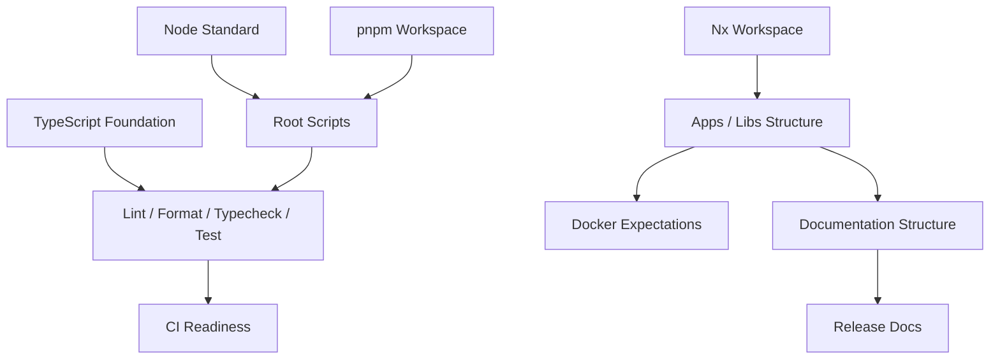

# 0.1 — Features

Release `0.1 — Foundation & Workspace` does not ship end-user product features.

Instead, this release ships the foundational project features required for every future Aerealith AI release.

These features make the repository installable, buildable, checkable, documented, and ready for serious development.

---

## Purpose

This document lists the features included in release `0.1`.

For this release, “features” means foundational capabilities such as:

- workspace setup
- package management
- TypeScript configuration
- linting
- formatting
- testing foundation
- documentation structure
- release documentation
- app/library structure
- engineering standards
- CI readiness
- Docker expectations

Release `0.1` is successful when the project foundation is strong enough for future product work.

---

## Feature Summary

| Feature Area            | Included in 0.1 | Purpose                                             |
| ----------------------- | --------------: | --------------------------------------------------- |
| Nx Workspace            |             Yes | Provides monorepo structure and task orchestration. |
| pnpm Workspace          |             Yes | Provides fast, strict package management.           |
| Node Version Standard   |             Yes | Ensures consistent runtime expectations.            |
| TypeScript Foundation   |             Yes | Establishes strongly typed development.             |
| ESLint                  |             Yes | Establishes code quality checks.                    |
| Prettier                |             Yes | Establishes consistent formatting.                  |
| Commitlint              |             Yes | Establishes commit message standards.               |
| Vitest Foundation       |             Yes | Prepares testing baseline.                          |
| Root Package Scripts    |             Yes | Provides standard developer commands.               |
| App Structure           |             Yes | Creates or plans deployable app locations.          |
| Library Structure       |             Yes | Creates or plans shared library boundaries.         |
| Documentation Structure |             Yes | Creates organized docs folders.                     |
| Release Documentation   |             Yes | Defines release tracking format.                    |
| Docker Expectations     |             Yes | Documents future Docker requirements.               |
| CI Readiness            |             Yes | Prepares install/lint/typecheck/test/build flow.    |
| Product Features        |              No | Product implementation begins in later releases.    |

---

## Included Features

---

## F-0.1-001 — Nx Workspace Foundation

Release `0.1` should establish Aerealith as an Nx monorepo.

### Purpose

Nx provides:

- monorepo organization
- app/library structure
- task orchestration
- project graph visibility
- affected task support later
- CI optimization later
- consistent project commands

### Expected Outcome

The repository should have a working Nx workspace foundation.

Expected files may include:

```text
nx.json
project.json files where applicable
workspace project configuration
```

### Acceptance Criteria

```text
Nx is installed and configured.
Nx recognizes workspace projects.
Nx commands can be run from the repo root.
The workspace structure supports apps and libs.
```

---

## F-0.1-002 — pnpm Workspace Foundation

Release `0.1` should establish pnpm as the package manager.

### Purpose

pnpm provides:

- fast installs
- strict dependency behavior
- workspace package linking
- better monorepo dependency control
- reproducible lockfile behavior

### Expected Outcome

The repo should install dependencies using pnpm.

Expected files:

```text
package.json
pnpm-lock.yaml
pnpm-workspace.yaml
```

### Acceptance Criteria

```text
pnpm install works.
pnpm-lock.yaml is committed.
Workspace packages are recognized.
Root package scripts use pnpm.
```

---

## F-0.1-003 — Node Version Standard

Release `0.1` should define the expected Node.js version.

### Purpose

A consistent Node version prevents local/CI mismatch.

Aerealith should standardize around:

```text
Node 24.x
```

### Expected Outcome

The repo should document or enforce the Node version.

Possible files:

```text
.node-version
.nvmrc
package.json engines
```

### Acceptance Criteria

```text
Node 24.x expectation is documented.
Developers can identify the expected runtime version.
CI can use the same Node version later.
```

---

## F-0.1-004 — TypeScript Foundation

Release `0.1` should establish the TypeScript configuration.

### Purpose

Aerealith should use TypeScript as the primary language.

The TypeScript foundation should support:

- strong typing
- shared base configuration
- app/library inheritance
- path alias planning
- typecheck command
- future contract/schema work

### Expected Outcome

Expected files may include:

```text
tsconfig.base.json
tsconfig.json
app/library tsconfig files
```

### Acceptance Criteria

```text
TypeScript is installed.
Base TypeScript config exists.
Typecheck command exists.
Typecheck passes or limitations are documented.
Strict typing expectations are documented.
```

---

## F-0.1-005 — ESLint Foundation

Release `0.1` should establish linting.

### Purpose

ESLint should enforce basic code quality rules and catch avoidable problems early.

### Expected Outcome

Expected files may include:

```text
eslint.config.js
eslint.config.mjs
eslint.config.ts
```

The exact filename depends on the chosen ESLint configuration style.

### Acceptance Criteria

```text
ESLint is installed.
ESLint config exists.
pnpm lint works.
Linting scope is documented.
```

---

## F-0.1-006 — Prettier Foundation

Release `0.1` should establish formatting.

### Purpose

Prettier keeps formatting consistent and avoids style debates.

### Expected Outcome

Expected files may include:

```text
prettier.config.js
.prettierrc
.prettierignore
```

### Acceptance Criteria

```text
Prettier is installed.
Prettier config exists.
pnpm format works.
Formatting rules are consistent across the repo.
```

Optional command:

```text
pnpm format:check
```

---

## F-0.1-007 — Commitlint Foundation

Release `0.1` should establish commit message standards.

### Purpose

Commitlint helps keep commit messages consistent and release-friendly.

### Expected Outcome

Expected files may include:

```text
commitlint.config.js
commitlint.config.mjs
commitlint.config.ts
```

### Acceptance Criteria

```text
Commitlint is installed or planned.
Commit message standard is documented.
Commitlint config exists if enabled.
```

Recommended convention:

```text
Conventional Commits
```

Examples:

```text
feat(core): add base error class
fix(frontend): correct dashboard route
docs(releases): add 0.1 release docs
chore(workspace): configure nx
```

---

## F-0.1-008 — Vitest Testing Foundation

Release `0.1` should prepare the testing foundation.

### Purpose

Vitest should provide the baseline for unit testing and future library/app tests.

### Expected Outcome

Expected files may include:

```text
vitest.config.ts
test setup files where needed
```

### Acceptance Criteria

```text
Vitest is installed or planned.
pnpm test exists.
Test command runs or limitations are documented.
At least one placeholder/sample test may exist if useful.
```

Release `0.1` does not require full product test coverage.

---

## F-0.1-009 — Root Package Scripts

Release `0.1` should define common root commands.

### Purpose

Developers should not have to guess how to work with the repo.

### Required Scripts

The root `package.json` should define or prepare:

```text
pnpm lint
pnpm format
pnpm typecheck
pnpm test
pnpm build
```

### Optional Scripts

Useful optional scripts:

```text
pnpm clean
pnpm graph
pnpm affected
pnpm format:check
pnpm lint:fix
pnpm dev
```

### Acceptance Criteria

```text
Core commands exist.
Commands are documented.
Commands work or limitations are documented.
```

---

## Repository Structure Features

---

## F-0.1-010 — Apps Structure

Release `0.1` should establish where deployable apps live.

### Purpose

Apps are deployable or user-facing applications.

### Recommended Structure

```text
apps/
├── frontend/
└── api/
```

### Expected App Purpose

| App             | Purpose                                                  |
| --------------- | -------------------------------------------------------- |
| `apps/frontend` | Main web dashboard/frontend application.                 |
| `apps/api`      | API or service entrypoint foundation if used separately. |

The exact architecture may evolve, especially with Cloudflare Worker deployment patterns.

### Acceptance Criteria

```text
apps/ folder exists or is intentionally planned.
Frontend app location is clear.
API/service app location is clear or documented.
Future deployable boundaries are not ambiguous.
```

---

## F-0.1-011 — Libraries Structure

Release `0.1` should establish shared library locations.

### Purpose

Libraries keep shared code organized and prevent app-level duplication.

### Recommended Structure

```text
libs/
├── api/
├── content/
├── contracts/
├── core/
├── db/
├── flags/
├── observability/
└── ui/
```

### Library Purpose

| Library              | Purpose                                                                   |
| -------------------- | ------------------------------------------------------------------------- |
| `libs/core`          | Shared constants, errors, primitive types, utilities, foundational logic. |
| `libs/contracts`     | Shared contracts, DTOs, schemas, API boundary types.                      |
| `libs/api`           | API helpers, routing utilities, middleware foundations.                   |
| `libs/db`            | Database entities, schema patterns, migrations, data access foundations.  |
| `libs/ui`            | Shared frontend UI components and design system foundations.              |
| `libs/content`       | Shared content, copy, docs/content helpers.                               |
| `libs/flags`         | Feature flag helpers and configuration boundaries.                        |
| `libs/observability` | Logging, metrics, tracing, diagnostics helpers.                           |

### Acceptance Criteria

```text
libs/ folder exists or is intentionally planned.
Initial library boundaries are documented.
Library purpose is clear.
Future shared code has an obvious home.
```

---

## F-0.1-012 — Library Dependency Rule

Release `0.1` should define the default dependency rule.

### Rule

```text
libs/* may depend on libs/core only.
```

### Purpose

This prevents early dependency spaghetti.

### Allowed by Default

```text
libs/api -> libs/core
libs/db -> libs/core
libs/ui -> libs/core
libs/contracts -> libs/core
libs/flags -> libs/core
libs/observability -> libs/core
```

### Avoid by Default

```text
libs/api -> libs/db
libs/ui -> libs/api
libs/contracts -> libs/db
libs/content -> libs/ui
```

### Acceptance Criteria

```text
Dependency rule is documented.
Exceptions require explicit architecture/engineering approval.
Future lint/dependency checks may enforce the rule.
```

---

## Documentation Features

---

## F-0.1-013 — Root Documentation Structure

Release `0.1` should establish the docs folder.

### Purpose

Docs should be organized from the start.

Documentation is part of the product, not cleanup work.

### Recommended Structure

```text
docs/
├── README.md
├── vision/
├── product/
├── releases/
├── architecture/
├── engineering/
├── services/
├── modules/
├── integrations/
├── api/
├── operations/
└── rfcs/
```

### Acceptance Criteria

```text
docs/ folder exists.
Main docs README exists.
Vision docs exist or are planned.
Product docs exist or are planned.
Release docs exist.
Future documentation folders are clear.
```

---

## F-0.1-014 — Vision Documentation Foundation

Release `0.1` should include or prepare the vision documentation foundation.

### Purpose

Vision docs explain why Aerealith exists and what principles guide it.

Expected folder:

```text
docs/vision/
```

Expected documents may include:

```text
Vision.md
Mission.md
Core Values.md
Product Philosophy.md
Manifesto.md
Roadmap.md
Positioning.md
Trust Model.md
README.md
```

### Acceptance Criteria

```text
Vision docs folder exists or is planned.
Vision docs are linked from docs README.
Core project direction is documented.
```

---

## F-0.1-015 — Product Documentation Foundation

Release `0.1` should include or prepare the product documentation foundation.

### Purpose

Product docs explain what Aerealith is and what users experience.

Expected folder:

```text
docs/product/
```

Expected documents may include:

```text
Product Overview.md
User Personas.md
Platform Capabilities.md
Module System.md
Discord Platform.md
AI Assistant.md
Automation.md
Dashboard.md
Integrations.md
Developer Platform.md
MVP Scope.md
README.md
```

### Acceptance Criteria

```text
Product docs folder exists or is planned.
Product README exists or is planned.
MVP scope is documented.
Product docs are linked from root docs.
```

---

## F-0.1-016 — Release Documentation Foundation

Release `0.1` should establish release documentation.

### Purpose

Release docs turn product strategy into staged delivery.

Expected folder:

```text
docs/releases/
```

Expected documents:

```text
docs/releases/README.md
docs/releases/0.1/README.md
docs/releases/0.1/Release.md
docs/releases/0.1/Features.md
docs/releases/0.1/Architecture Changes.md
docs/releases/0.1/Tasks.md
docs/releases/0.1/Testing.md
docs/releases/0.1/Checklist.md
docs/releases/0.1/Breaking Changes.md
```

### Acceptance Criteria

```text
docs/releases/ exists.
docs/releases/README.md exists.
docs/releases/0.1/ exists.
Release 0.1 docs exist.
Release doc structure is repeatable for future releases.
```

---

## Engineering Standards Features

---

## F-0.1-017 — Naming and Folder Standards

Release `0.1` should establish basic naming standards.

### Purpose

Consistent naming prevents messy docs and code organization.

### Recommended Standards

```text
Use lowercase folder names.
Use descriptive Markdown file names.
Use PascalCase for TypeScript classes.
Use camelCase for variables and functions.
Use kebab-case or dot-separated filenames where appropriate for code.
Avoid duplicate folders that differ only by capitalization.
```

Docs folder should prefer:

```text
docs/releases/
```

Avoid mixing:

```text
docs/releases/
docs/releases/
```

### Acceptance Criteria

```text
Folder naming standard is documented.
docs/releases is preferred over docs/releases.
Case-sensitive folder risk is documented.
```

---

## F-0.1-018 — Environment Configuration Foundation

Release `0.1` should prepare environment configuration standards.

### Purpose

Future apps/services need predictable environment handling.

### Expected Foundation

```text
.env.example
environment variable naming conventions
secret handling expectations
local development notes
Cloudflare/Wrangler environment notes where applicable
```

### Acceptance Criteria

```text
Environment configuration expectations are documented.
Secrets are not committed.
Example env file exists or is planned.
```

---

## F-0.1-019 — Cloudflare Worker Foundation

Release `0.1` may include early Cloudflare Worker configuration if the frontend/app foundation already exists.

### Purpose

Aerealith’s frontend/platform deployment path includes Cloudflare Workers.

### Possible Foundation Files

```text
wrangler.toml
src/worker.ts
apps/frontend/
dist/apps/frontend/
```

### Known Bindings To Document When Used

```text
ASSETS
AEREALITH_KV
AEREALITH_AI
FLAGSHIP_FLAGS
AEREALITH_ANALYTICS
EVENTBUS
```

### Acceptance Criteria

```text
Worker entrypoint is documented if present.
Wrangler config is valid if present.
Cloudflare bindings are documented if used.
Deployment expectations are clear.
```

This feature may be partial in `0.1` and expanded later.

---

## F-0.1-020 — Docker Expectations Foundation

Release `0.1` should document Docker expectations.

### Purpose

Aerealith is cloud-first but should not block future self-hosting.

### Expected Direction

```text
Every deployable app/service should eventually have a Dockerfile.
```

### Release 0.1 Scope

Included:

```text
Docker expectation documented.
Future self-hosting compatibility noted.
Deployable boundaries considered.
```

Not required:

```text
Full Docker Compose
Production self-hosting
Self-hosted installer
Backup/restore
Provider replacement dashboard
```

### Acceptance Criteria

```text
Docker expectations are documented.
Full self-hosting is clearly marked future scope.
```

---

## F-0.1-021 — CI Readiness Foundation

Release `0.1` should prepare for CI.

### Purpose

CI keeps the workspace reliable as the project grows.

### Expected CI Flow

```text
pnpm install
pnpm lint
pnpm typecheck
pnpm test
pnpm build
```

### Release 0.1 Scope

Release `0.1` may include:

```text
Initial GitHub Actions workflow
CI documentation
CI command expectations
```

### Acceptance Criteria

```text
CI expectations are documented.
Core commands are suitable for CI.
Initial CI workflow exists or is planned.
```

---

## Quality Features

---

## F-0.1-022 — Basic Build Verification

Release `0.1` should support build verification.

### Purpose

The repo should have a reliable way to confirm that the workspace builds.

### Expected Command

```bash
pnpm build
```

### Acceptance Criteria

```text
Build command exists.
Build succeeds or known limitations are documented.
Build failures are not mysterious.
```

---

## F-0.1-023 — Basic Typecheck Verification

Release `0.1` should support typecheck verification.

### Expected Command

```bash
pnpm typecheck
```

### Acceptance Criteria

```text
Typecheck command exists.
Typecheck succeeds or known limitations are documented.
TypeScript errors are visible.
```

---

## F-0.1-024 — Basic Lint Verification

Release `0.1` should support lint verification.

### Expected Command

```bash
pnpm lint
```

### Acceptance Criteria

```text
Lint command exists.
Lint succeeds or known limitations are documented.
Lint scope is clear.
```

---

## F-0.1-025 — Basic Format Verification

Release `0.1` should support formatting.

### Expected Command

```bash
pnpm format
```

Optional:

```bash
pnpm format:check
```

### Acceptance Criteria

```text
Format command exists.
Formatting succeeds or known limitations are documented.
Formatting applies to code/docs/configs where appropriate.
```

---

## F-0.1-026 — Basic Test Verification

Release `0.1` should support a test command.

### Expected Command

```bash
pnpm test
```

### Acceptance Criteria

```text
Test command exists.
Vitest is configured or planned.
Test command succeeds or known limitations are documented.
```

---

## Release Management Features

---

## F-0.1-027 — Release Folder Template

Release `0.1` should establish a repeatable release folder pattern.

### Purpose

Future releases should not need to invent structure from scratch.

### Template

```text
docs/releases/<version>/
├── README.md
├── Release.md
├── Features.md
├── Architecture Changes.md
├── Tasks.md
├── Testing.md
├── Checklist.md
└── Breaking Changes.md
```

### Acceptance Criteria

```text
Release 0.1 uses the template.
Future releases can copy the structure.
Each file has a clear purpose.
```

---

## F-0.1-028 — Release Status Tracking

Release `0.1` should define release status language.

### Status Options

```text
Planned
In Progress
Blocked
Testing
Beta
Released
Deprecated
```

### Acceptance Criteria

```text
Release status model is documented.
Release docs can indicate status.
Future releases can use the same model.
```

---

## F-0.1-029 — Release Exit Criteria

Release `0.1` should define what completion means.

### Purpose

The release should not be marked done just because files exist.

It should be marked done when the foundation works.

### Exit Criteria Summary

```text
pnpm install works.
Core scripts exist.
Lint works.
Format works.
Typecheck works.
Test command exists.
Build command exists.
Docs structure exists.
Release docs exist.
Library boundaries are documented.
CI expectations are documented.
Docker expectations are documented.
```

### Acceptance Criteria

```text
Exit criteria are documented.
Checklist references exit criteria.
Testing doc verifies core commands.
```

---

## Not Included Features

Release `0.1` intentionally does not include the following features.

```text
Authentication implementation
User dashboard product behavior
Discord bot moderation features
Ticket implementation
AI assistant intelligence
Memory system
Workflow engine
Marketplace
Billing
Advanced integrations
Database-heavy product features
Production observability
Mobile app
Desktop app
Browser extension
Full self-hosting
```

Placeholder folders or stubs may exist, but full implementation belongs to later releases.

---

## Feature Dependency Map



---

## Feature Priority

| Priority | Feature Group                | Reason                                                   |
| -------- | ---------------------------- | -------------------------------------------------------- |
| Critical | pnpm, Nx, Node, TypeScript   | Required for all development.                            |
| Critical | Root scripts                 | Required for repeatable commands.                        |
| Critical | Docs/release structure       | Required for planning and scope control.                 |
| High     | ESLint, Prettier, Commitlint | Required for consistency.                                |
| High     | Apps/libs structure          | Required for future architecture.                        |
| High     | Testing foundation           | Required for future reliability.                         |
| Medium   | Docker expectations          | Required for future self-hosting compatibility.          |
| Medium   | CI readiness                 | Required for future release quality.                     |
| Medium   | Cloudflare foundation        | Useful if worker deployment is already being configured. |

---

## Feature Review Questions

Before adding a feature to release `0.1`, ask:

- Is this foundational?
- Does this help future releases build faster?
- Does this improve workspace clarity?
- Does this improve developer experience?
- Does this improve code quality?
- Does this improve documentation quality?
- Does this belong in `0.1`, or is it product implementation?
- Can this wait until `0.2` or later?
- Does this add unnecessary tooling complexity?
- Does this support the long-term architecture?
- Does this support future self-hosting without blocking MVP?

If the feature is not foundational, it probably does not belong in release `0.1`.

---

## Success Criteria

Release `0.1` features are successful when:

```text
The repo installs cleanly.
The workspace structure is understandable.
Core commands are available.
TypeScript is configured.
Linting is configured.
Formatting is configured.
Testing foundation exists.
Docs are organized.
Release docs are organized.
Future apps and libraries have clear homes.
Future releases have a repeatable structure.
```

---

## Final Feature Standard

The features in release `0.1` should make Aerealith easier to build, easier to document, easier to check, and easier to extend.

This release should not chase flashy product features.

It should create the foundation that makes those future features possible without chaos.
