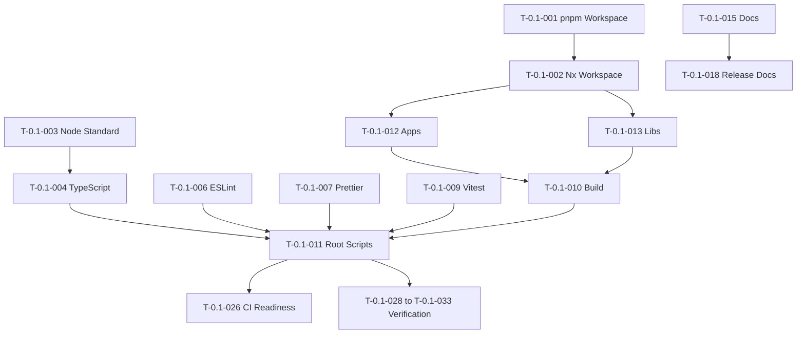

# 0.1 — Tasks

Release `0.1 — Foundation & Workspace` turns the foundational release scope into actionable work items.

This release is focused on repository setup, workspace tooling, documentation structure, development standards, and release planning.

It does not ship user-facing product features.

---

## Purpose

This document defines the task list for release `0.1`.

Tasks should be used to:

- track implementation progress
- create GitHub issues
- verify release completeness
- prevent scope creep
- keep foundational work organized
- prepare the repo for future releases

---

## Task Status Legend

| Status       | Meaning                                                |
| ------------ | ------------------------------------------------------ |
| Not Started  | Work has not begun.                                    |
| In Progress  | Work is actively happening.                            |
| Blocked      | Work cannot continue until something else is resolved. |
| Needs Review | Work is complete but needs review.                     |
| Done         | Work is complete and verified.                         |
| Deferred     | Work moved to a later release.                         |

---

## Priority Legend

| Priority | Meaning                                   |
| -------- | ----------------------------------------- |
| Critical | Required for release completion.          |
| High     | Strongly expected for release completion. |
| Medium   | Useful but can be deferred if needed.     |
| Low      | Nice to have.                             |

---

## Task Summary

| Area                  | Critical |   High | Medium | Low |
| --------------------- | -------: | -----: | -----: | --: |
| Workspace             |      Yes |    Yes |     No |  No |
| Tooling               |      Yes |    Yes | Medium |  No |
| Repository Structure  |      Yes |    Yes |     No |  No |
| Documentation         |      Yes |    Yes | Medium |  No |
| Release Docs          |      Yes |    Yes |     No |  No |
| CI Readiness          |       No |    Yes | Medium |  No |
| Docker Expectations   |       No |    Yes | Medium |  No |
| Cloudflare Foundation |       No | Medium | Medium | Low |
| Verification          |      Yes |    Yes | Medium |  No |

---

## Critical Path

These tasks should be completed first.

```text
1. Establish pnpm workspace.
2. Establish Nx workspace.
3. Define Node 24.x expectation.
4. Configure TypeScript.
5. Configure linting and formatting.
6. Define root package scripts.
7. Establish apps/libs/docs structure.
8. Write release documentation.
9. Verify install/lint/typecheck/test/build path.
```

---

## Workspace Tasks

---

## T-0.1-001 — Initialize pnpm Workspace

**Priority:** Critical
**Status:** Not Started
**Feature:** F-0.1-002 — pnpm Workspace Foundation

### Description

Set up pnpm as the package manager for the repository.

### Tasks

- [ ] Add `package.json`.
- [ ] Add `pnpm-workspace.yaml`.
- [ ] Generate and commit `pnpm-lock.yaml`.
- [ ] Confirm workspace package discovery works.
- [ ] Document pnpm usage in the root README or engineering docs.

### Acceptance Criteria

- [ ] `pnpm install` works from the repo root.
- [ ] `pnpm-lock.yaml` is committed.
- [ ] Workspace packages are recognized.
- [ ] No npm/yarn lockfiles are used.

---

## T-0.1-002 — Initialize Nx Workspace

**Priority:** Critical
**Status:** Not Started
**Feature:** F-0.1-001 — Nx Workspace Foundation

### Description

Configure Nx as the monorepo orchestration tool.

### Tasks

- [ ] Add `nx.json`.
- [ ] Configure Nx project discovery.
- [ ] Ensure apps/libs can be represented as Nx projects.
- [ ] Add Nx-compatible scripts where needed.
- [ ] Confirm Nx commands run from the repo root.

### Acceptance Criteria

- [ ] Nx is installed.
- [ ] `nx.json` exists.
- [ ] Nx recognizes workspace projects.
- [ ] Nx task running works.
- [ ] Future apps and libraries can be added cleanly.

---

## T-0.1-003 — Define Node Version Standard

**Priority:** Critical
**Status:** Not Started
**Feature:** F-0.1-003 — Node Version Standard

### Description

Document or enforce the expected Node.js version.

Aerealith should standardize around:

```text
Node 24.x
```

### Tasks

- [ ] Add `.node-version` or `.nvmrc`.
- [ ] Add `engines.node` to `package.json` if appropriate.
- [ ] Document Node version in repo docs.
- [ ] Ensure local and future CI expectations match.

### Acceptance Criteria

- [ ] Node 24.x expectation is visible.
- [ ] Developers know which Node version to use.
- [ ] Future CI can use the same version.

---

## TypeScript Tasks

---

## T-0.1-004 — Configure TypeScript Base Settings

**Priority:** Critical
**Status:** Not Started
**Feature:** F-0.1-004 — TypeScript Foundation

### Description

Create the base TypeScript configuration for the workspace.

### Tasks

- [ ] Add `tsconfig.base.json`.
- [ ] Add root `tsconfig.json` if needed.
- [ ] Configure strict TypeScript expectations.
- [ ] Configure path aliases if appropriate.
- [ ] Ensure apps/libs can extend the base config.

### Acceptance Criteria

- [ ] TypeScript is installed.
- [ ] Base TypeScript configuration exists.
- [ ] TypeScript settings are shared consistently.
- [ ] Future projects can inherit from the base config.

---

## T-0.1-005 — Add Typecheck Command

**Priority:** Critical
**Status:** Not Started
**Feature:** F-0.1-023 — Basic Typecheck Verification

### Description

Add a standard command for typechecking the workspace.

### Tasks

- [ ] Add `typecheck` script to root `package.json`.
- [ ] Ensure command checks workspace projects.
- [ ] Document known limitations if any projects are placeholders.

### Acceptance Criteria

- [ ] `pnpm typecheck` exists.
- [ ] `pnpm typecheck` succeeds or limitations are documented.
- [ ] TypeScript errors are visible and actionable.

---

## Code Quality Tasks

---

## T-0.1-006 — Configure ESLint

**Priority:** Critical
**Status:** Not Started
**Feature:** F-0.1-005 — ESLint Foundation

### Description

Set up ESLint for workspace code quality.

### Tasks

- [ ] Install ESLint dependencies.
- [ ] Add ESLint configuration.
- [ ] Configure TypeScript linting.
- [ ] Add ignore rules where needed.
- [ ] Add root `lint` script.

### Acceptance Criteria

- [ ] ESLint config exists.
- [ ] `pnpm lint` works.
- [ ] Linting scope is clear.
- [ ] Lint output is understandable.

---

## T-0.1-007 — Configure Prettier

**Priority:** Critical
**Status:** Not Started
**Feature:** F-0.1-006 — Prettier Foundation

### Description

Set up Prettier for consistent formatting.

### Tasks

- [ ] Install Prettier.
- [ ] Add Prettier config.
- [ ] Add `.prettierignore`.
- [ ] Add root `format` script.
- [ ] Optionally add `format:check`.

### Acceptance Criteria

- [ ] Prettier config exists.
- [ ] `pnpm format` works.
- [ ] Formatting applies to code/docs/configs where appropriate.
- [ ] Formatting behavior is consistent.

---

## T-0.1-008 — Configure Commitlint

**Priority:** High
**Status:** Not Started
**Feature:** F-0.1-007 — Commitlint Foundation

### Description

Set up commit message standards.

Recommended convention:

```text
Conventional Commits
```

### Tasks

- [ ] Install Commitlint dependencies.
- [ ] Add Commitlint configuration.
- [ ] Document commit message format.
- [ ] Add examples to engineering docs or release docs.
- [ ] Optionally connect to Git hooks later.

### Acceptance Criteria

- [ ] Commitlint config exists or is clearly deferred.
- [ ] Commit message standard is documented.
- [ ] Example commit messages are provided.

---

## Testing Tasks

---

## T-0.1-009 — Configure Vitest Foundation

**Priority:** High
**Status:** Not Started
**Feature:** F-0.1-008 — Vitest Testing Foundation

### Description

Set up Vitest as the testing foundation.

### Tasks

- [ ] Install Vitest.
- [ ] Add Vitest config if needed.
- [ ] Add root `test` script.
- [ ] Add one sample test if useful.
- [ ] Document testing expectations.

### Acceptance Criteria

- [ ] `pnpm test` exists.
- [ ] Test command runs or limitations are documented.
- [ ] Future libraries can add tests cleanly.

---

## Build Tasks

---

## T-0.1-010 — Add Build Command

**Priority:** Critical
**Status:** Not Started
**Feature:** F-0.1-022 — Basic Build Verification

### Description

Add a standard workspace build command.

### Tasks

- [ ] Add `build` script to root `package.json`.
- [ ] Ensure Nx can run build targets where configured.
- [ ] Document build limitations for placeholder apps/libs.
- [ ] Confirm command is CI-ready.

### Acceptance Criteria

- [ ] `pnpm build` exists.
- [ ] `pnpm build` succeeds or limitations are documented.
- [ ] Build failures are visible and understandable.

---

## Root Script Tasks

---

## T-0.1-011 — Define Root Package Scripts

**Priority:** Critical
**Status:** Not Started
**Feature:** F-0.1-009 — Root Package Scripts

### Description

Create standard root scripts for development.

### Required Scripts

- [ ] `lint`
- [ ] `format`
- [ ] `typecheck`
- [ ] `test`
- [ ] `build`

### Optional Scripts

- [ ] `clean`
- [ ] `graph`
- [ ] `affected`
- [ ] `format:check`
- [ ] `lint:fix`
- [ ] `dev`

### Acceptance Criteria

- [ ] Required scripts exist.
- [ ] Scripts are documented.
- [ ] Scripts work or limitations are documented.

---

## Repository Structure Tasks

---

## T-0.1-012 — Create Apps Structure

**Priority:** Critical
**Status:** Not Started
**Feature:** F-0.1-010 — Apps Structure

### Description

Create or document the initial apps folder.

### Tasks

- [ ] Create `apps/`.
- [ ] Create or plan `apps/frontend/`.
- [ ] Create or plan `apps/api/`.
- [ ] Add app-level README files if useful.
- [ ] Document app purposes.

### Acceptance Criteria

- [ ] `apps/` location is clear.
- [ ] Frontend app location is clear.
- [ ] API/service app location is clear or intentionally deferred.
- [ ] Future deployable boundaries are not ambiguous.

---

## T-0.1-013 — Create Libraries Structure

**Priority:** Critical
**Status:** Not Started
**Feature:** F-0.1-011 — Libraries Structure

### Description

Create or document the initial shared library folder structure.

### Tasks

- [ ] Create `libs/`.
- [ ] Create or plan `libs/core/`.
- [ ] Create or plan `libs/contracts/`.
- [ ] Create or plan `libs/api/`.
- [ ] Create or plan `libs/db/`.
- [ ] Create or plan `libs/ui/`.
- [ ] Create or plan `libs/content/`.
- [ ] Create or plan `libs/flags/`.
- [ ] Create or plan `libs/observability/`.
- [ ] Add library README files if useful.

### Acceptance Criteria

- [ ] `libs/` location is clear.
- [ ] Initial library boundaries are documented.
- [ ] Each library has a clear purpose.
- [ ] Future shared code has an obvious home.

---

## T-0.1-014 — Document Library Dependency Rule

**Priority:** Critical
**Status:** Not Started
**Feature:** F-0.1-012 — Library Dependency Rule

### Description

Document the default library dependency rule.

Default rule:

```text
libs/* may depend on libs/core only.
```

### Tasks

- [ ] Add rule to release docs.
- [ ] Add rule to architecture docs later.
- [ ] Add rule to engineering docs later.
- [ ] Document exception process.
- [ ] Consider future lint/enforcement mechanism.

### Acceptance Criteria

- [ ] Dependency rule is documented.
- [ ] Examples of allowed and avoided dependencies are included.
- [ ] Exceptions require explicit documentation.

---

## Documentation Tasks

---

## T-0.1-015 — Create Root Docs Structure

**Priority:** Critical
**Status:** Not Started
**Feature:** F-0.1-013 — Root Documentation Structure

### Description

Create the documentation folder structure.

### Tasks

- [ ] Create `docs/`.
- [ ] Create `docs/README.md`.
- [ ] Create `docs/vision/`.
- [ ] Create `docs/product/`.
- [ ] Create `docs/releases/`.
- [ ] Create `docs/architecture/`.
- [ ] Create `docs/engineering/`.
- [ ] Create `docs/services/`.
- [ ] Create `docs/modules/`.
- [ ] Create `docs/integrations/`.
- [ ] Create `docs/api/`.
- [ ] Create `docs/operations/`.
- [ ] Create `docs/rfcs/`.

### Acceptance Criteria

- [ ] Docs folder exists.
- [ ] Main docs README exists.
- [ ] Documentation areas are clear.
- [ ] Future docs have obvious homes.

---

## T-0.1-016 — Add Vision Documentation Foundation

**Priority:** High
**Status:** Not Started
**Feature:** F-0.1-014 — Vision Documentation Foundation

### Description

Add or prepare the vision documentation foundation.

### Tasks

- [ ] Create `docs/vision/README.md`.
- [ ] Add `Vision.md`.
- [ ] Add `Mission.md`.
- [ ] Add `Core Values.md`.
- [ ] Add `Product Philosophy.md`.
- [ ] Add `Manifesto.md`.
- [ ] Add `Roadmap.md`.
- [ ] Add `Positioning.md`.
- [ ] Add `Trust Model.md`.

### Acceptance Criteria

- [ ] Vision folder exists.
- [ ] Vision docs are linked.
- [ ] Core direction is documented.

---

## T-0.1-017 — Add Product Documentation Foundation

**Priority:** High
**Status:** Not Started
**Feature:** F-0.1-015 — Product Documentation Foundation

### Description

Add or prepare the product documentation foundation.

### Tasks

- [ ] Create `docs/product/README.md`.
- [ ] Add `Product Overview.md`.
- [ ] Add `User Personas.md`.
- [ ] Add `Platform Capabilities.md`.
- [ ] Add `Module System.md`.
- [ ] Add `Discord Platform.md`.
- [ ] Add `AI Assistant.md`.
- [ ] Add `Automation.md`.
- [ ] Add `Dashboard.md`.
- [ ] Add `Integrations.md`.
- [ ] Add `Developer Platform.md`.
- [ ] Add `MVP Scope.md`.

### Acceptance Criteria

- [ ] Product folder exists.
- [ ] Product README exists.
- [ ] Product docs are linked.
- [ ] MVP scope is documented.

---

## T-0.1-018 — Add Release Documentation Foundation

**Priority:** Critical
**Status:** Not Started
**Feature:** F-0.1-016 — Release Documentation Foundation

### Description

Create the release documentation structure.

### Tasks

- [ ] Create `docs/releases/README.md`.
- [ ] Create `docs/releases/0.1/`.
- [ ] Add `docs/releases/0.1/README.md`.
- [ ] Add `docs/releases/0.1/Release.md`.
- [ ] Add `docs/releases/0.1/Features.md`.
- [ ] Add `docs/releases/0.1/Architecture Changes.md`.
- [ ] Add `docs/releases/0.1/Tasks.md`.
- [ ] Add `docs/releases/0.1/Testing.md`.
- [ ] Add `docs/releases/0.1/Checklist.md`.
- [ ] Add `docs/releases/0.1/Breaking Changes.md`.

### Acceptance Criteria

- [ ] Release docs folder exists.
- [ ] Release `0.1` docs exist.
- [ ] Release doc structure is repeatable.
- [ ] Future releases can copy the template.

---

## Naming and Consistency Tasks

---

## T-0.1-019 — Normalize Documentation Folder Casing

**Priority:** High
**Status:** Not Started
**Feature:** F-0.1-017 — Naming and Folder Standards

### Description

Ensure documentation folders use lowercase names.

Preferred:

```text
docs/releases/
```

Avoid:

```text
docs/releases/
```

### Tasks

- [ ] Check for duplicate docs folders with different casing.
- [ ] Consolidate into lowercase folders.
- [ ] Update links to lowercase paths.
- [ ] Document lowercase folder standard.

### Acceptance Criteria

- [ ] `docs/releases/` is used consistently.
- [ ] No duplicate `docs/releases/` folder remains.
- [ ] Links use consistent casing.

---

## T-0.1-020 — Document Naming Standards

**Priority:** Medium
**Status:** Not Started
**Feature:** F-0.1-017 — Naming and Folder Standards

### Description

Document naming expectations for folders, docs, and code files.

### Tasks

- [ ] Document lowercase folder preference.
- [ ] Document Markdown naming style.
- [ ] Document code filename style.
- [ ] Document TypeScript naming style.

### Acceptance Criteria

- [ ] Naming standards are documented.
- [ ] Contributors understand folder/file naming expectations.

---

## Environment and Secrets Tasks

---

## T-0.1-021 — Add Environment Configuration Foundation

**Priority:** High
**Status:** Not Started
**Feature:** F-0.1-018 — Environment Configuration Foundation

### Description

Prepare environment configuration standards.

### Tasks

- [ ] Add `.env.example` if needed.
- [ ] Document environment variable naming.
- [ ] Document local development environment expectations.
- [ ] Document secret handling expectations.
- [ ] Ensure secrets are not committed.

### Acceptance Criteria

- [ ] Environment expectations are documented.
- [ ] `.env.example` exists or is intentionally deferred.
- [ ] Secret handling rule is documented.

---

## T-0.1-022 — Document Secret Handling Rules

**Priority:** Critical
**Status:** Not Started
**Feature:** F-0.1-018 — Environment Configuration Foundation

### Description

Document that secrets must never be committed.

### Tasks

- [ ] Add secret handling guidance.
- [ ] Document where secrets should be stored.
- [ ] Document safe local development patterns.
- [ ] Confirm `.gitignore` excludes common secret files.

### Acceptance Criteria

- [ ] Secrets are not committed.
- [ ] `.env` files are ignored where appropriate.
- [ ] Secret handling expectations are clear.

---

## Cloudflare Foundation Tasks

---

## T-0.1-023 — Add Cloudflare Worker Config if Present

**Priority:** Medium
**Status:** Not Started
**Feature:** F-0.1-019 — Cloudflare Worker Foundation

### Description

Add or validate early Cloudflare Worker configuration if it already exists in the project.

### Tasks

- [ ] Add or validate `wrangler.toml`.
- [ ] Confirm Worker entrypoint path.
- [ ] Confirm frontend asset directory path.
- [ ] Confirm SPA fallback behavior.
- [ ] Document configured bindings.
- [ ] Keep secrets out of config.

### Known Binding Names

```text
ASSETS
AEREALITH_KV
AEREALITH_AI
FLAGSHIP_FLAGS
AEREALITH_ANALYTICS
EVENTBUS
```

### Acceptance Criteria

- [ ] Wrangler config is valid if present.
- [ ] Worker entrypoint is documented.
- [ ] Bindings are documented.
- [ ] No secrets are committed.

---

## T-0.1-024 — Document Cloudflare Assumptions

**Priority:** Medium
**Status:** Not Started
**Feature:** F-0.1-019 — Cloudflare Worker Foundation

### Description

Document early Cloudflare platform assumptions.

### Tasks

- [ ] Document Cloudflare-first direction.
- [ ] Document Worker usage.
- [ ] Document KV/R2/Queues/Analytics assumptions if used.
- [ ] Document provider replacement philosophy.
- [ ] Clarify that full self-hosting is future scope.

### Acceptance Criteria

- [ ] Cloudflare assumptions are documented.
- [ ] Provider lock-in risk is acknowledged.
- [ ] Future self-hosting remains possible.

---

## Docker Tasks

---

## T-0.1-025 — Document Docker Expectations

**Priority:** High
**Status:** Not Started
**Feature:** F-0.1-020 — Docker Expectations Foundation

### Description

Document Docker expectations for future deployable apps and services.

### Tasks

- [ ] Document that deployable apps/services should eventually have Dockerfiles.
- [ ] Document that full self-hosting is not `0.1`.
- [ ] Document provider replacement direction.
- [ ] Add Docker notes to release docs.

### Acceptance Criteria

- [ ] Docker expectations are documented.
- [ ] Self-hosting is marked future.
- [ ] Future deployable boundaries consider Docker.

---

## CI Tasks

---

## T-0.1-026 — Add CI Readiness Documentation

**Priority:** High
**Status:** Not Started
**Feature:** F-0.1-021 — CI Readiness Foundation

### Description

Document the expected CI flow.

### Expected CI Flow

```text
pnpm install
pnpm lint
pnpm typecheck
pnpm test
pnpm build
```

### Tasks

- [ ] Document CI expectations.
- [ ] Ensure root scripts are suitable for CI.
- [ ] Add initial CI workflow if practical.
- [ ] Document deployment automation as later scope.

### Acceptance Criteria

- [ ] CI expectations are documented.
- [ ] Core commands can be used by CI.
- [ ] Initial CI workflow exists or is intentionally deferred.

---

## T-0.1-027 — Add Initial GitHub Actions Workflow

**Priority:** Medium
**Status:** Not Started
**Feature:** F-0.1-021 — CI Readiness Foundation

### Description

Add an initial GitHub Actions workflow if practical.

### Tasks

- [ ] Add `.github/workflows/ci.yml`.
- [ ] Use Node 24.x.
- [ ] Enable pnpm.
- [ ] Run install.
- [ ] Run lint.
- [ ] Run typecheck.
- [ ] Run test.
- [ ] Run build.

### Acceptance Criteria

- [ ] CI workflow exists or is intentionally deferred.
- [ ] CI uses the documented Node version.
- [ ] CI uses pnpm.
- [ ] CI checks the core commands.

---

## Verification Tasks

---

## T-0.1-028 — Verify Install

**Priority:** Critical
**Status:** Not Started
**Feature:** F-0.1-029 — Release Exit Criteria

### Command

```bash
pnpm install
```

### Acceptance Criteria

- [ ] Command completes successfully.
- [ ] Lockfile is up to date.
- [ ] No unexpected package manager files are created.

---

## T-0.1-029 — Verify Lint

**Priority:** Critical
**Status:** Not Started
**Feature:** F-0.1-024 — Basic Lint Verification

### Command

```bash
pnpm lint
```

### Acceptance Criteria

- [ ] Command completes successfully.
- [ ] Any known limitations are documented.

---

## T-0.1-030 — Verify Formatting

**Priority:** Critical
**Status:** Not Started
**Feature:** F-0.1-025 — Basic Format Verification

### Command

```bash
pnpm format
```

Optional:

```bash
pnpm format:check
```

### Acceptance Criteria

- [ ] Command completes successfully.
- [ ] Formatting applies consistently.

---

## T-0.1-031 — Verify Typecheck

**Priority:** Critical
**Status:** Not Started
**Feature:** F-0.1-023 — Basic Typecheck Verification

### Command

```bash
pnpm typecheck
```

### Acceptance Criteria

- [ ] Command completes successfully.
- [ ] TypeScript errors are resolved or documented.

---

## T-0.1-032 — Verify Tests

**Priority:** High
**Status:** Not Started
**Feature:** F-0.1-026 — Basic Test Verification

### Command

```bash
pnpm test
```

### Acceptance Criteria

- [ ] Command completes successfully.
- [ ] Test limitations are documented if the project has minimal tests.

---

## T-0.1-033 — Verify Build

**Priority:** Critical
**Status:** Not Started
**Feature:** F-0.1-022 — Basic Build Verification

### Command

```bash
pnpm build
```

### Acceptance Criteria

- [ ] Command completes successfully.
- [ ] Build limitations are documented if any apps/libs are placeholders.

---

## Release Management Tasks

---

## T-0.1-034 — Create Release Checklist

**Priority:** Critical
**Status:** Not Started
**Feature:** F-0.1-029 — Release Exit Criteria

### Description

Create the final go/no-go checklist for release `0.1`.

### Tasks

- [ ] Add `docs/releases/0.1/Checklist.md`.
- [ ] Include product gate.
- [ ] Include engineering gate.
- [ ] Include documentation gate.
- [ ] Include CI/readiness gate.
- [ ] Include final completion criteria.

### Acceptance Criteria

- [ ] Checklist exists.
- [ ] Checklist maps to release scope.
- [ ] Checklist can be used to mark release complete.

---

## T-0.1-035 — Create Testing Document

**Priority:** Critical
**Status:** Not Started
**Feature:** F-0.1-029 — Release Exit Criteria

### Description

Create release testing instructions.

### Tasks

- [ ] Add `docs/releases/0.1/Testing.md`.
- [ ] Include install verification.
- [ ] Include lint verification.
- [ ] Include format verification.
- [ ] Include typecheck verification.
- [ ] Include test verification.
- [ ] Include build verification.
- [ ] Include documentation/link review.

### Acceptance Criteria

- [ ] Testing document exists.
- [ ] Core verification commands are listed.
- [ ] Expected outcomes are clear.

---

## T-0.1-036 — Create Breaking Changes Document

**Priority:** High
**Status:** Not Started
**Feature:** F-0.1-027 — Release Folder Template

### Description

Create release breaking changes documentation.

### Tasks

- [ ] Add `docs/releases/0.1/Breaking Changes.md`.
- [ ] Document that this is the first formal release.
- [ ] Document any known path casing changes.
- [ ] Document any migration notes.

### Acceptance Criteria

- [ ] Breaking changes document exists.
- [ ] Breaking changes are documented or explicitly marked none.
- [ ] Migration notes are included if needed.

---

## Optional / Deferred Tasks

---

## T-0.1-037 — Add Nx Dependency Boundary Enforcement

**Priority:** Medium
**Status:** Deferred
**Feature:** F-0.1-012 — Library Dependency Rule

### Description

Add automated enforcement for library dependency boundaries.

### Notes

This can be deferred if documentation is enough for release `0.1`.

### Future Acceptance Criteria

- [ ] Dependency boundaries are enforced through lint/Nx rules.
- [ ] Violations fail lint or CI.
- [ ] Exceptions are documented.

---

## T-0.1-038 — Add Sample Library Test

**Priority:** Low
**Status:** Not Started
**Feature:** F-0.1-008 — Vitest Testing Foundation

### Description

Add a small sample test to confirm Vitest is wired correctly.

### Acceptance Criteria

- [ ] Sample test exists.
- [ ] `pnpm test` runs successfully.
- [ ] Test can be removed or replaced later.

---

## T-0.1-039 — Add Workspace Graph Script

**Priority:** Low
**Status:** Not Started
**Feature:** F-0.1-001 — Nx Workspace Foundation

### Description

Add a convenience script for viewing the Nx project graph.

### Example

```bash
pnpm graph
```

### Acceptance Criteria

- [ ] Graph script exists if useful.
- [ ] Nx project graph can be viewed.

---

## Task Dependency Map



---

## Done Definition

A task is done when:

```text
The work is implemented or documented.
Acceptance criteria are satisfied.
Related docs are updated.
Commands pass where applicable.
No secrets are committed.
No unrelated product scope is added.
```

---

## Release 0.1 Completion Standard

Release `0.1` tasks are complete when:

```text
Workspace setup is done.
Tooling setup is done.
Repository structure is clear.
Documentation structure is clear.
Release documentation exists.
Core scripts exist.
Verification commands pass or limitations are documented.
CI expectations are documented.
Docker expectations are documented.
Future releases have a clean foundation.
```

The standard is:

> A developer can clone the repo, install dependencies, understand the structure, run core checks, and know where future work belongs.
