# Releases

Status: Active
Owner: SinLess Games LLC
Last Updated: 2026-07-18
Document Type: Delivery Planning Index
Implementation State: Plans and gates; repository evidence proves completion

The `docs/releases/` folder defines how Aerealith is staged, tested, and
launched over time. Release documents turn product direction into a delivery
path; they do not make planned capabilities current.

## Project Context

- [Project Overview](../Project-Overview.md)
- [Company and Project Structure](../Company-and-Project-Structure.md)
- [Current State](../CURRENT_STATE.md)
- [Documentation Index](../README.md)

## Purpose

This folder exists to define:

- what each release is trying to prove
- what belongs in each release
- what does not belong yet
- what must be stable before moving forward
- how product, architecture, engineering, Discord, AI, automation, integrations, and operations evolve together

Release docs should help keep Aerealith focused.

When a feature feels important but does not fit the current milestone, it should move to a later release instead of bloating the current one.

---

## Release Philosophy

Aerealith should be built in layers.

Each release should create a stronger foundation for the next release.

The goal is not to ship every idea immediately.

The goal is to ship the right capabilities in the right order.

---

## Core Release Principles

## Foundation Before Features

Core workspace, architecture, types, services, auth, dashboard, and observability should come before advanced product features.

## Trust Before Autonomy

Audit logs, permissions, approvals, and user control should come before advanced AI automation.

## Discord Before Marketplace

First-party Discord modules should prove the module system before third-party modules or marketplace publishing.

## Dashboard Before Advanced Automation

Users need to understand and control Aerealith before the platform performs complex workflows.

## MVP Before Expansion

The MVP should prove that Aerealith is real, useful, trustworthy, and expandable.

## Self-Hosting Later, Compatibility Early

Dockerfiles, provider boundaries, and clean configuration should exist early, but full self-hosting comes later.

---

## Release Spine

Aerealith’s release path is milestone-based.

```text
0.1 — Foundation & Workspace
0.2 — Core Domain & Data Platform
0.3 — Authentication & Identity
0.4 — Frontend Platform
0.5 — API & Service Platform
0.6 — Developer Portal & Integrations
0.7 — Discord Platform Foundation
0.8 — Moderation, Tickets & Community Operations
0.9 — Observability & Reliability
1.0 — Private Beta
1.1 — MVP Production Launch
```

Post-MVP releases:

```text
1.2 — Billing, Entitlements & Plans
1.3 — AI Assistant & Memory Foundation
1.4 — Workflow Automation Builder
1.5 — Marketplace & Module Ecosystem
1.6 — Mobile/Desktop Companion
1.7 — Digital Life OS Expansion
1.8 — Advanced Integrations & Ecosystem Growth
1.9 — Cloud Independence & Self-Hosting Foundations
2.0 — Self-Hosted Preview
```

---

## Release Map

```mermaid
flowchart TD
    R01["0.1 Foundation & Workspace"]
    R02["0.2 Core Domain & Data Platform"]
    R03["0.3 Authentication & Identity"]
    R04["0.4 Frontend Platform"]
    R05["0.5 API & Service Platform"]
    R06["0.6 Developer Portal & Integrations"]
    R07["0.7 Discord Platform Foundation"]
    R08["0.8 Moderation, Tickets & Community Operations"]
    R09["0.9 Observability & Reliability"]
    R10["1.0 Private Beta"]
    R11["1.1 MVP Production Launch"]

    R12["1.2 Billing, Entitlements & Plans"]
    R13["1.3 AI Assistant & Memory Foundation"]
    R14["1.4 Workflow Automation Builder"]
    R15["1.5 Marketplace & Module Ecosystem"]
    R16["1.6 Mobile/Desktop Companion"]
    R17["1.7 Digital Life OS Expansion"]
    R18["1.8 Advanced Integrations & Ecosystem Growth"]
    R19["1.9 Cloud Independence & Self-Hosting Foundations"]
    R20["2.0 Self-Hosted Preview"]

    R01 --> R02
    R02 --> R03
    R03 --> R04
    R04 --> R05
    R05 --> R06
    R06 --> R07
    R07 --> R08
    R08 --> R09
    R09 --> R10
    R10 --> R11

    R11 --> R12
    R12 --> R13
    R13 --> R14
    R14 --> R15
    R15 --> R16
    R16 --> R17
    R17 --> R18
    R18 --> R19
    R19 --> R20
```



---

## Release Stages

| Stage             | Meaning                                                                   |
| ----------------- | ------------------------------------------------------------------------- |
| Foundation        | Core repo, tooling, types, configs, architecture, and service boundaries. |
| Platform Core     | Auth, dashboard, APIs, modules, integrations, events, workflows.          |
| Flagship Product  | Discord bot, Discord dashboard, moderation, tickets, roles, logs.         |
| Trust & Readiness | Observability, audit logs, privacy, support, failure handling.            |
| Private Beta      | Real early users test end-to-end usefulness.                              |
| MVP Launch        | Stable first production release.                                          |
| Expansion         | Billing, AI, workflows, marketplace, mobile, integrations, self-hosting.  |

---

## Release Document Structure

Each release folder should contain a `README.md`.

Recommended structure:

```text
docs/releases/
├── README.md
├── 0.1/
│   └── README.md
├── 0.2/
│   └── README.md
├── 0.3/
│   └── README.md
├── 0.4/
│   └── README.md
├── 0.5/
│   └── README.md
├── 0.6/
│   └── README.md
├── 0.7/
│   └── README.md
├── 0.8/
│   └── README.md
├── 0.9/
│   └── README.md
├── 1.0/
│   └── README.md
├── 1.1/
│   └── README.md
└── post-mvp/
    └── README.md
```

Later, each release may include:

```text
Scope.md
Checklist.md
Technical Readiness.md
Launch Notes.md
Known Issues.md
Retrospective.md
```

---

## Release Document Template

Each release document should answer:

```text
What is this release?
Why does it exist?
What does it prove?
What is included?
What is excluded?
What must be stable before moving on?
What product docs does it depend on?
What architecture/engineering docs does it require?
What risks exist?
What is the exit criteria?
```

Recommended release file structure:

```md
# <Release Number> — <Release Name>

## Purpose

## Release Goal

## What This Release Proves

## Included Scope

## Explicitly Out of Scope

## Product Requirements

## Engineering Requirements

## Trust Requirements

## Observability Requirements

## Documentation Requirements

## Risks

## Dependencies

## Exit Criteria

## Next Release
```

---

## Core Release Timeline

---

## 0.1 — Foundation & Workspace

**Goal:** Establish the repo, workspace, tooling, and project structure.

This release should create the foundation for all future development.

Included scope:

```text
Nx workspace
pnpm workspace
Node version standard
TypeScript foundation
ESLint
Prettier
Commitlint
Basic folder structure
Base package scripts
Core documentation structure
Initial Docker expectations
Initial CI foundation
```

This release proves:

```text
The project can be built, checked, and developed consistently.
```

---

## 0.2 — Core Domain & Data Platform

**Goal:** Establish shared domain types, core libraries, schemas, errors, constants, entities, and data foundations.

Included scope:

```text
libs/core foundation
libs/contracts foundation
libs/db foundation
shared errors
error codes
constants
entities
schemas
types
database connection patterns
migration patterns
seed strategy later
```

This release proves:

```text
Aerealith has a stable shared domain foundation.
```

---

## 0.3 — Authentication & Identity

**Goal:** Add account, identity, session, and profile foundations.

Included scope:

```text
user accounts
login
logout
sessions
profile
basic settings
connected identity foundation
Discord identity foundation
auth error handling
auth audit events
```

This release proves:

```text
Users can securely access Aerealith.
```

---

## 0.4 — Frontend Platform

**Goal:** Establish the web dashboard foundation.

Included scope:

```text
Vite frontend
React
React Router
TailwindCSS
TanStack foundations
dashboard shell
routing
layout
navigation
settings pages
assistant surface foundation
connected services UI foundation
basic design system
```

This release proves:

```text
Aerealith has a real user-facing control center.
```

---

## 0.5 — API & Service Platform

**Goal:** Establish API and service foundations.

Included scope:

```text
API routing
service boundaries
versioned API conventions
event conventions
workflow records foundation
integration foundation
module registry foundation
audit logging foundation
request IDs
error shapes
basic service docs
```

This release proves:

```text
Aerealith capabilities can be exposed through stable service patterns.
```

---

## 0.6 — Developer Portal & Integrations

**Goal:** Establish developer-facing documentation and integration foundations.

Included scope:

```text
developer documentation
API overview
authentication docs
event naming docs
webhook foundation
integration dashboard foundation
integration health
Discord integration docs
basic provider integration docs
developer portal foundation
```

This release proves:

```text
Aerealith is becoming a platform developers can understand and build against.
```

---

## 0.7 — Discord Platform Foundation

**Goal:** Establish the official Discord bot/app and server linking foundation.

Included scope:

```text
official Aerealith AI Discord bot
bot install flow
Discord OAuth/linking
server linking
guild registration
Discord dashboard foundation
role mapping foundation
common role creation foundation
module manager foundation
command manager foundation
Discord permission checks
missing permission warnings
```

This release proves:

```text
Aerealith can connect to and manage a Discord server.
```

---

## 0.8 — Moderation, Tickets & Community Operations

**Goal:** Add the first real Discord community management features.

Included scope:

```text
moderation basics
warn
timeout
kick
ban
unban
delete message
purge messages
staff notes
moderation history
automod foundation
blocked words
spam detection
excessive mentions
link filtering
invite filtering
staff alerts
tickets
ticket panels
ticket close
ticket transcripts
ticket logs
Discord audit events
basic welcome
basic activity summaries
```

This release proves:

```text
Aerealith can replace multiple core Discord management bots for early community operations.
```

---

## 0.9 — Observability & Reliability

**Goal:** Make the platform understandable, diagnosable, and reliable enough for beta.

Included scope:

```text
application logs
request IDs
trace IDs
error visibility
Cloudflare observability
Grafana Cloud integration
health checks
integration health
Discord bot health
workflow failure visibility
audit reliability
basic incident workflow
deployment checks
rollback guidance
```

This release proves:

```text
Aerealith can be operated safely and debugged when things fail.
```

---

## 1.0 — Private Beta

**Goal:** Test the end-to-end product with early users.

Private Beta scope:

```text
account login
dashboard shell
Discord bot install
Discord server linking
basic module registry
module enable/disable
basic role mapping
moderation basics
tickets
ticket close
basic transcripts
audit logs
assistant chat
assistant explanations
assistant suggestions
workflow foundation
basic notifications
basic observability
```

Private Beta may be rough.

It should still be safe.

This release proves:

```text
Real users can use Aerealith end-to-end and provide meaningful feedback.
```

---

## 1.1 — MVP Production Launch

**Goal:** Launch the first stable, trustworthy production MVP.

Production MVP scope:

```text
stable auth
stable dashboard
stable Discord setup
stable server linking
stable module settings
stable common role creation
stable role and permission mapping
stable moderation basics
stable tickets
stable ticket transcripts
stable audit logs
basic notifications
basic assistant behavior
basic workflow foundation
basic integration health
terms and privacy pages
trust/safety explanations
support/admin workflow
observability and error visibility
```

This release proves:

```text
Aerealith is real, useful, trustworthy, and expandable.
```

---

## Post-MVP Release Path

---

## 1.2 — Billing, Entitlements & Plans

Adds billing and entitlement foundations.

Potential scope:

```text
plan model
feature gates
usage limits
billing dashboard
payment provider integration
subscription status
organization billing foundation
premium module awareness
```

Billing should be transparent and avoid dark patterns.

---

## 1.3 — AI Assistant & Memory Foundation

Expands assistant and memory capabilities.

Potential scope:

```text
assistant modes
assistant customization
memory review UI
edit memory
delete memory
memory scopes
Discord assistant improvements
ticket summaries
moderation summaries
assistant audit improvements
model routing foundation
```

---

## 1.4 — Workflow Automation Builder

Adds stronger automation capabilities.

Potential scope:

```text
workflow builder
scheduled triggers
Discord event triggers
conditions
actions
approval gates
dry runs
workflow templates
workflow history
failure handling
automation suggestions
```

---

## 1.5 — Marketplace & Module Ecosystem

Adds marketplace and package foundations.

Potential scope:

```text
marketplace browsing
official packages
module packs
workflow packs
template packs
package manifests
install flow
review flow
entitlements
third-party preparation
```

Third-party runtime code should still wait until sandboxing is ready.

---

## 1.6 — Mobile/Desktop Companion

Adds companion app surfaces.

Potential scope:

```text
mobile approvals
mobile notifications
quick actions
desktop notifications
desktop quick commands
assistant companion
ticket alerts
moderation alerts
workflow approvals
```

---

## 1.7 — Digital Life OS Expansion

Expands beyond Discord-first use cases.

Potential scope:

```text
personal dashboard improvements
personal workflows
personal summaries
connected app context
calendar/email/doc integrations where appropriate
digital-life memory
cross-service insights
```

---

## 1.8 — Advanced Integrations & Ecosystem Growth

Adds broader integrations.

Potential scope:

```text
GitHub
Google
Twitch
YouTube
Reddit
Cloudflare advanced controls
Grafana advanced controls
creator integrations
developer integrations
infrastructure integrations
custom API integrations
```

---

## 1.9 — Cloud Independence & Self-Hosting Foundations

Prepares full self-hosting.

Potential scope:

```text
provider abstraction
SMTP replacement
S3/MinIO storage
Grafana OSS path
local AI provider preparation
Docker Compose preparation
backup/restore planning
environment configuration
self-hosting docs
```

---

## 2.0 — Self-Hosted Preview

Ships the first serious self-hosted preview.

Potential scope:

```text
Docker Compose
self-hosted deployment guide
provider replacement settings
SMTP configuration
S3/MinIO configuration
Grafana OSS setup
local AI configuration path
backup/restore
self-hosted admin dashboard
upgrade path
support boundaries
```

---

## Release Gates

A release should not be considered complete until its gates pass.

## Product Gate

```text
The feature solves the intended user problem.
The expected user flow works.
The UI is understandable.
The feature can be disabled where appropriate.
The feature has documented scope.
```

## Trust Gate

```text
Permissions are clear.
Risky actions require confirmation.
Meaningful actions are audited.
Failures are explainable.
AI involvement is disclosed where relevant.
Data access is scoped.
```

## Engineering Gate

```text
Build passes.
Typecheck passes.
Lint passes.
Tests pass where applicable.
Errors are handled.
Secrets are not exposed.
Environment config is documented.
```

## Operations Gate

```text
Logs exist.
Failures can be diagnosed.
Health can be checked.
Rollback path exists where practical.
Observability is sufficient for the release.
```

## Documentation Gate

```text
Relevant docs are updated.
Known limitations are documented.
Setup steps are documented.
Configuration is explained.
Release scope is clear.
```

---

## Release Status

Each release should use a clear status.

| Status      | Meaning                                             |
| ----------- | --------------------------------------------------- |
| Planned     | Release is defined but not started.                 |
| In Progress | Work is actively happening.                         |
| Blocked     | Release cannot proceed until blockers are resolved. |
| Testing     | Release is being tested.                            |
| Beta        | Release is available to early users.                |
| Released    | Release is complete.                                |
| Deprecated  | Release is no longer the active target.             |

---

## Scope Rules

## If It Is Not Required, Park It

Cool ideas should not automatically enter the current release.

Use the parking lot.

## If It Risks Trust, Slow Down

Features involving moderation, AI actions, billing, privacy, secrets, or destructive operations need extra review.

## If It Requires Marketplace, Delay It

Marketplace should not shape early platform design too heavily.

## If It Requires Full Self-Hosting, Delay It

Design for future self-hosting, but do not block MVP on it.

## If It Is Core Discord Management, Prioritize It

Discord is the flagship MVP proof.

## If It Improves Auditability, Consider It Early

Trust features are not polish.

They are core product behavior.

---

## Release Review Questions

Before adding a feature to a release, ask:

- Does this feature belong in this release?
- Does it serve the release goal?
- Is it required to prove the milestone?
- Can it be simplified?
- Can it wait?
- Does it increase risk?
- Does it require new permissions?
- Does it require audit logs?
- Does it require user approval?
- Does it affect Discord safety?
- Does it affect private user data?
- Does it depend on unfinished systems?
- Does it make MVP harder to ship?
- Does it support the long-term roadmap?

If the answer is unclear, move it to a later release or write an RFC.

---

## Relationship to Product Docs

Release docs should be guided by the product docs.

```text
docs/product/Product Overview.md
docs/product/MVP Scope.md
docs/product/Platform Capabilities.md
docs/product/Module System.md
docs/product/Discord Platform.md
docs/product/AI Assistant.md
docs/product/Automation.md
docs/product/Dashboard.md
docs/product/Integrations.md
docs/product/Developer Platform.md
```

Product docs define what Aerealith should become.

Release docs define when each part should be built.

---

## Relationship to Architecture and Engineering Docs

Release docs should eventually connect to:

```text
docs/architecture/
docs/engineering/
docs/services/
docs/modules/
docs/integrations/
docs/api/
docs/operations/
```

Architecture and engineering docs explain how each release is built.

Release docs explain why each release exists and what it must deliver.

---

## Final Release Standard

Aerealith releases should be focused, useful, and trustworthy.

Each release should move the platform forward without hiding scope creep inside vague goals.

The release path should make Aerealith easier to build, easier to test, easier to explain, and easier to trust.

A release is successful when it proves its milestone clearly and creates a stronger foundation for the next one.
