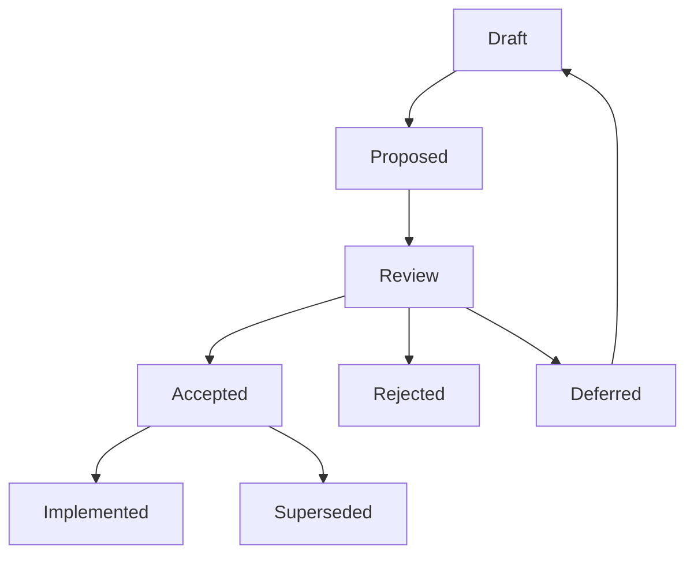

# 0001 — RFC Process

Status: Draft
Created: 2026-07-09
Updated: 2026-07-09
Owner: Tim Pierce / SinLess Games
Related Release: `0.1 — Foundation & Workspace`

---

## Summary

This RFC defines the Request for Comments process for Aerealith AI.

RFCs are used to document important decisions before the project builds too much on top of them.

The RFC process should help Aerealith make clear, thoughtful, reviewable decisions for architecture, product, engineering, trust, Discord, AI, modules, integrations, data, APIs, automation, and future self-hosting.

RFCs should be useful and lightweight.

They should not become bureaucracy.

---

## Context

Aerealith AI is planned as a large modular platform with:

- web dashboard
- Discord management platform
- AI assistant
- module system
- automation/workflow system
- integrations
- developer APIs
- audit logs
- observability
- future marketplace
- future self-hosting

Many early decisions will shape the project for a long time.

Examples include:

- monorepo boundaries
- API route strategy
- error model
- entity/schema strategy
- Discord permission safety
- AI approval model
- memory rules
- workflow structure
- provider replacement strategy
- audit/event model

Without a written decision process, important choices may become invisible assumptions.

This RFC creates the process for making those choices explicit.

---

## Problem

Aerealith needs a way to make major decisions without slowing the project down.

Without RFCs, the project risks:

- unclear architecture decisions
- repeated debates
- undocumented tradeoffs
- accidental provider lock-in
- weak security/trust reasoning
- inconsistent API patterns
- messy module boundaries
- unclear AI safety rules
- future rewrites caused by early assumptions

But if RFCs are overused, the project risks:

- paperwork overload
- slow development
- decision fatigue
- fake formality
- docs that nobody reads

The process must be strong enough for serious decisions and light enough to actually use.

---

## Goals

This RFC should define:

```text
When to write an RFC.
When not to write an RFC.
How RFCs are numbered.
How RFCs are named.
What statuses RFCs can have.
What metadata RFCs should include.
How RFCs move from draft to implemented.
How accepted RFCs guide implementation.
How old RFCs are superseded.
How RFCs connect to releases and architecture docs.
```

---

## Non-Goals

This RFC does not define:

```text
The final architecture of Aerealith.
The full product roadmap.
The full API design.
The database model.
The Discord permission model.
The AI safety model.
The module runtime.
The workflow engine.
The provider replacement model.
The self-hosting architecture.
```

Those decisions should be handled by separate RFCs.

---

## Proposed Decision

Aerealith should use lightweight Markdown RFCs for platform-shaping decisions.

RFCs should live in:

```text
docs/rfcs/
```

RFC filenames should use four-digit numbering and lowercase kebab-case:

```text
0001-rfc-process.md
0002-monorepo-library-boundaries.md
0003-api-versioning-and-route-strategy.md
```

RFCs should include frontmatter, a clear status, context, problem statement, proposed decision, tradeoffs, risks, impacts, migration plan, and acceptance criteria.

Accepted RFCs should guide implementation.

Implemented RFCs should be updated to show that the decision has been applied.

Superseded RFCs should not be deleted.

---

## When to Write an RFC

Write an RFC when a decision affects:

```text
Architecture
Data models
API contracts
Security
Trust
Permissions
AI behavior
Memory
Automation
Discord actions
Module system
Integrations
Provider lock-in
Self-hosting
Billing
Public developer experience
Long-term compatibility
```

Write an RFC when a decision is:

- expensive to reverse
- likely to affect many files
- likely to affect future releases
- related to user trust or privacy
- related to destructive actions
- related to AI autonomy
- related to public APIs
- related to storage or data ownership
- related to Discord moderation or permissions
- related to provider replacement or self-hosting

---

## When Not to Write an RFC

Do not write an RFC for:

```text
Small typo fixes
Simple docs edits
Minor refactors
One-file implementation details
Routine dependency updates
Formatting changes
Small utility functions
Simple bug fixes
Temporary experiments
```

Use normal tasks, issues, commits, or pull request notes for those.

---

## Simple Rule

```text
If the decision shapes the platform, write an RFC.
If the decision only shapes a file, just do it.
```

---

## RFC Folder Structure

The RFC folder should use this structure:

```text
docs/rfcs/
├── README.md
├── RFC Template.md
├── 0001-rfc-process.md
├── 0002-monorepo-library-boundaries.md
├── 0003-api-versioning-and-route-strategy.md
├── 0004-error-and-result-model.md
└── 0005-entity-schema-and-contract-strategy.md
```

Future RFCs should follow the same numbering and naming pattern.

---

## RFC Numbering

RFCs should use four-digit numbers.

Examples:

```text
0001-rfc-process.md
0002-monorepo-library-boundaries.md
0003-api-versioning-and-route-strategy.md
```

Rules:

```text
Use the next available number.
Do not reuse RFC numbers.
Do not renumber accepted RFCs.
Do not renumber implemented RFCs.
Use lowercase kebab-case filenames.
Keep filenames short but descriptive.
```

---

## RFC Naming

Good RFC names:

```text
0004-error-and-result-model.md
0008-discord-permission-and-action-safety-model.md
0010-audit-log-and-event-model.md
0013-workflow-automation-foundation.md
```

Avoid:

```text
RFC about Discord stuff.md
final-api-decision-v2.md
new-thing.md
architecture.md
```

---

## RFC Statuses

Each RFC should have one status.

| Status      | Meaning                                                         |
| ----------- | --------------------------------------------------------------- |
| Draft       | The RFC is being written and is not ready for decision.         |
| Proposed    | The RFC is ready for review.                                    |
| Accepted    | The proposal has been approved and should guide implementation. |
| Rejected    | The proposal was reviewed and declined.                         |
| Deferred    | The RFC may be useful later but is not being decided now.       |
| Superseded  | A newer RFC replaces this RFC.                                  |
| Implemented | The accepted RFC has been implemented.                          |

---

## RFC Frontmatter

Each RFC should start with frontmatter.

Required fields:

```yaml
---
title: 'RFC Title'
rfc: '0000'
status: 'Draft'
created: 'YYYY-MM-DD'
updated: 'YYYY-MM-DD'
owner: 'Tim Pierce / SinLess Games'
reviewers: []
related_release: ''
related_docs: []
supersedes: []
superseded_by: []
tags:
  - rfc
---
```

---

## RFC Metadata Block

Each RFC should also include a readable metadata block after the title.

Example:

```md
Status: Draft
Created: 2026-07-09
Updated: 2026-07-09
Owner: Tim Pierce / SinLess Games
Related Release: `0.1 — Foundation & Workspace`
```

This makes RFCs easy to read in plain Markdown without needing tooling to parse frontmatter.

---

## RFC Lifecycle



---

## Step 1 — Create a Draft

Create a new RFC by copying:

```text
docs/rfcs/RFC Template.md
```

Use the next available RFC number.

Example:

```text
docs/rfcs/0006-environment-config-and-secret-handling.md
```

Set the status to:

```text
Draft
```

Draft RFCs may be incomplete.

---

## Step 2 — Write the Proposal

The RFC should explain:

```text
Summary
Context
Problem
Goals
Non-goals
Proposed decision
Detailed design
Examples
Alternatives considered
Tradeoffs
Risks
Mitigations
Security/trust impact
Privacy impact
AI impact
Discord impact
Self-hosting/provider impact
Migration plan
Rollout plan
Acceptance criteria
Testing requirements
Documentation updates
Open questions
```

Not every section needs to be long.

Every section should be honest.

---

## Step 3 — Mark as Proposed

When the RFC is ready for review, update the status:

```text
Proposed
```

A proposed RFC should be complete enough to make a decision.

It should not have major missing sections unless they are clearly marked as open questions.

---

## Step 4 — Review

Review should check:

```text
Does this solve the right problem?
Is the scope clear?
Are tradeoffs documented?
Are alternatives documented?
Does this affect trust, safety, security, privacy, or data ownership?
Does this affect future self-hosting?
Does this affect Discord permissions or moderation?
Does this affect API compatibility?
Does this affect module boundaries?
Does this make the system harder to maintain?
Is there a simpler option?
What happens if this decision is wrong?
```

---

## Step 5 — Decide

After review, update the status to one of:

```text
Accepted
Rejected
Deferred
```

If accepted, the RFC becomes guidance for implementation.

If rejected, the RFC should explain why.

If deferred, the RFC should explain what must change before reconsidering.

---

## Step 6 — Implement

When implementation is complete, update the status to:

```text
Implemented
```

Implementation notes may include:

```text
Related PRs
Related commits
Related docs
Related release tasks
Known follow-up work
```

---

## Step 7 — Supersede When Needed

If a later RFC replaces an earlier RFC, do not delete the old one.

Mark the old RFC:

```text
Superseded
```

Then link to the replacement RFC.

Example:

```text
Superseded by: 0018-new-api-routing-model.md
```

---

## Decision Rules

An RFC may be accepted when:

```text
The problem is clear.
The proposed decision is clear.
Tradeoffs are documented.
Major risks are documented.
Security and trust impact are considered.
Privacy impact is considered.
AI impact is considered where relevant.
Discord impact is considered where relevant.
Self-hosting/provider impact is considered where relevant.
Migration and rollout are realistic.
Acceptance criteria are clear.
```

An RFC should not be accepted when:

```text
The proposal is vague.
The scope is too broad.
The risks are ignored.
The security/trust impact is unclear.
The decision creates avoidable provider lock-in.
The decision contradicts core product values.
The decision introduces hidden AI autonomy.
The decision cannot be implemented or tested.
```

---

## Emergency Decisions

Sometimes a decision must be made quickly.

For urgent fixes, security issues, outages, or blockers:

```text
Make the safe decision first.
Document the decision afterward.
Create a retroactive RFC if the decision affects the platform.
```

Emergency RFCs should clearly say:

```text
This RFC documents an emergency decision that was made before the RFC was written.
```

---

## RFCs and Releases

RFCs should connect to releases.

| Release                                          | RFCs Likely Needed                                           |
| ------------------------------------------------ | ------------------------------------------------------------ |
| 0.1 — Foundation & Workspace                     | RFC process, monorepo boundaries.                            |
| 0.2 — Core Domain & Data Platform                | Errors, entities, schemas, contracts, data rules.            |
| 0.3 — Authentication & Identity                  | Auth model, sessions, identity providers, account lifecycle. |
| 0.5 — API & Service Platform                     | API routing, events, request IDs, service boundaries.        |
| 0.7 — Discord Platform Foundation                | Discord permissions, server linking, module safety.          |
| 0.8 — Moderation, Tickets & Community Operations | Moderation safety, tickets, audit logs, automod rules.       |
| 0.9 — Observability & Reliability                | Logs, metrics, traces, incidents, health checks.             |
| 1.1 — MVP Production Launch                      | Trust, release readiness, support, operational safety.       |

---

## RFCs and Architecture Decisions

Accepted RFCs may become architecture decisions.

A future architecture doc may summarize accepted RFCs as ADRs.

Examples:

```text
RFC 0002 accepted → ADR: Use libs/core as the default shared dependency.
RFC 0003 accepted → ADR: Use /api/v1 for public versioned API routes.
RFC 0004 accepted → ADR: Use AerealithError and stable error codes.
```

RFCs explain the full reasoning.

Architecture docs summarize the final decision.

---

## RFCs and Implementation

Implementation should not drift away from accepted RFCs.

If implementation needs to differ from an accepted RFC:

```text
Update the RFC if the change is small.
Create a new RFC if the change is major.
Mark the old RFC as superseded if replaced.
Link implementation back to the relevant RFC.
```

---

## RFCs and Documentation

Accepted RFCs should update related documentation.

Possible docs to update:

```text
docs/architecture/
docs/engineering/
docs/product/
docs/releases/
docs/services/
docs/modules/
docs/integrations/
docs/api/
docs/operations/
```

If an RFC changes how the project should be built, operated, or understood, the docs should reflect it.

---

## RFCs and Trust

RFCs must take trust seriously.

Any RFC touching security, privacy, permissions, AI, moderation, billing, memory, user data, community data, or destructive actions must include trust impact.

Trust-related RFCs should answer:

```text
Can users understand this?
Can users disable this?
Can users review this?
Can users override this?
Can this fail safely?
Does this require approval?
Does this require audit logs?
Does this expose private data?
Could this harm a Discord community?
Could this give AI too much authority?
```

---

## RFCs and AI

Any RFC touching AI behavior must answer:

```text
What can AI do?
What can AI suggest?
What can AI never do?
What requires approval?
What gets logged?
What happens when AI is unavailable?
What user or community context is used?
What memory is used?
What data must not be used?
```

AI should support users.

AI should not silently take control.

---

## RFCs and Discord

Any RFC touching Discord must answer:

```text
What Discord permissions are required?
What role hierarchy checks are required?
What actions are destructive?
What actions require confirmation?
What actions are audit logged?
What happens if permissions are missing?
What happens if Discord API calls fail?
Can AI trigger this action?
Can users undo this action?
```

Discord moderation and community management features must be safe by default.

---

## RFCs and Self-Hosting

Any RFC touching providers or infrastructure should consider future self-hosting.

Self-hosting does not need to ship early, but early decisions should avoid unnecessary lock-in.

Provider-related RFCs should answer:

```text
What provider is being used?
Can it be replaced later?
What interface hides provider-specific logic?
What data would need migration?
Does this block Docker/self-hosting later?
Is there an open-source/self-hosted alternative?
```

---

## Starter RFCs

The first RFCs should be:

| RFC                                                                                           | Purpose                                                                    |
| --------------------------------------------------------------------------------------------- | -------------------------------------------------------------------------- |
| [0001 — RFC Process](./0001-rfc-process.md)                                                   | Defines how RFCs work.                                                     |
| [0002 — Monorepo Library Boundaries](./0002-monorepo-library-boundaries.md)                   | Defines app/library boundaries and dependency rules.                       |
| [0003 — API Versioning and Route Strategy](./0003-api-versioning-and-route-strategy.md)       | Defines API route/versioning rules.                                        |
| [0004 — Error and Result Model](./0004-error-and-result-model.md)                             | Defines error classes, error codes, result handling, and API error shapes. |
| [0005 — Entity, Schema, and Contract Strategy](./0005-entity-schema-and-contract-strategy.md) | Defines entity, schema, DTO, and contract boundaries.                      |

---

## Early RFC Backlog

Recommended early RFC backlog:

```text
0006-environment-config-and-secret-handling.md
0007-provider-replacement-strategy.md
0008-discord-permission-and-action-safety-model.md
0009-module-system-foundation.md
0010-audit-log-and-event-model.md
0011-ai-assistant-safety-and-approval-model.md
0012-memory-and-context-model.md
0013-workflow-automation-foundation.md
0014-integration-health-and-connection-model.md
0015-observability-and-request-tracing-model.md
```

---

## Security and Trust Impact

This RFC creates a process for documenting decisions.

It does not directly change product behavior.

However, it improves trust by requiring security, privacy, permission, AI, Discord, provider, and migration impacts to be considered before major decisions are accepted.

---

## Privacy Impact

This RFC does not directly process, store, expose, or delete user data.

It does require future RFCs to explicitly consider privacy impact when relevant.

---

## AI Impact

This RFC does not directly change AI behavior.

It does require future RFCs involving AI to document approval gates, audit logging, memory use, fallback behavior, and boundaries.

---

## Discord Impact

This RFC does not directly change Discord behavior.

It does require future RFCs involving Discord to document permissions, role hierarchy, destructive actions, confirmations, audit logs, and failure behavior.

---

## Self-Hosting and Provider Impact

This RFC does not directly change provider usage or self-hosting support.

It does require future provider-related RFCs to consider replacement paths and future self-hosting compatibility.

---

## Migration Plan

No code migration is required.

Documentation migration may include:

```text
Create docs/rfcs/README.md.
Create docs/rfcs/RFC Template.md.
Create docs/rfcs/0001-rfc-process.md.
Use docs/rfcs/ as the canonical RFC folder.
Avoid docs/RFCs/ casing.
```

---

## Rollout Plan

```text
Create RFC folder.
Create RFC README.
Create RFC template.
Create this RFC.
Review this RFC.
Accept or revise this RFC.
Use the process for RFC 0002 and later.
Update docs if the process changes.
```

---

## Acceptance Criteria

This RFC is accepted when:

```text
RFC folder location is defined.
RFC numbering is defined.
RFC statuses are defined.
RFC frontmatter is defined.
RFC lifecycle is defined.
RFC review expectations are defined.
RFC acceptance rules are defined.
RFC superseding behavior is defined.
RFC relationship to releases is defined.
RFC relationship to architecture docs is defined.
```

---

## Implementation Checklist

```text
Create docs/rfcs/README.md.
Create docs/rfcs/RFC Template.md.
Create docs/rfcs/0001-rfc-process.md.
Create starter RFC files.
Link RFC docs from docs/README.md when appropriate.
Link RFC process from release 0.1 docs when appropriate.
Use this process for RFC 0002.
```

---

## Testing Requirements

This RFC is documentation-only.

Testing requires:

```text
Markdownlint passes.
Links are valid.
Only one H1 exists.
Tables follow markdownlint spacing.
Frontmatter is valid YAML.
RFC process is understandable.
```

---

## Documentation Updates

If this RFC is accepted, update or verify:

```text
docs/rfcs/README.md
docs/rfcs/RFC Template.md
docs/releases/0.1/README.md
docs/releases/0.1/Release.md
docs/releases/0.1/Checklist.md
docs/README.md
```

---

## Open Questions

```text
Should accepted RFCs automatically generate ADR summaries later?
Should RFCs require explicit reviewer approval before acceptance?
Should RFC status be tracked only in frontmatter or also in a readable metadata block?
Should RFCs have owners beyond Tim Pierce / SinLess Games once contributors join?
Should RFCs be linked to GitHub issues or PRs from day one?
```

---

## Decision

```text
Pending
```

---

## Decision Notes

```text
Decision notes will be added after review.
```

---

## References

```text
docs/rfcs/README.md
docs/rfcs/RFC Template.md
docs/releases/0.1/README.md
docs/releases/0.1/Release.md
docs/releases/0.1/Checklist.md
```

---

## Final Standard

The RFC process should make Aerealith easier to build, safer to change, and harder to accidentally damage.

The standard is:

> Important decisions are written down before they become expensive assumptions.
