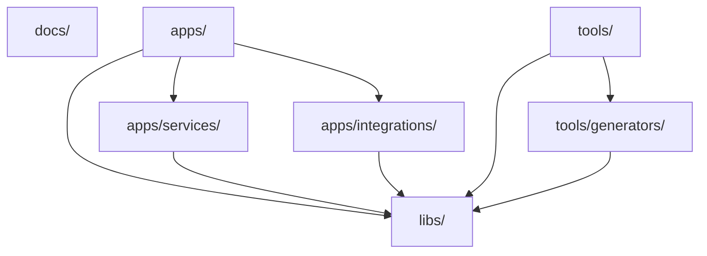

# 0002 — Monorepo Library Boundaries

Status: Implemented
Created: 2026-07-09
Updated: 2026-07-09
Owner: Tim Pierce / SinLess Games
Reviewed By: Timothy Pierce
Reviewed On: 2026-07-09
Implemented By: Timothy Pierce
Implemented On: 2026-07-09
Related Release: `0.1 — Foundation & Workspace`

---

## Summary

This RFC defines the initial monorepo structure and dependency boundary rules for Aerealith AI.

Aerealith should use a clear workspace layout:

```text
docs/
apps/
apps/services/
apps/integrations/
libs/
tools/
tools/generators/
```

The goal is to keep the repository understandable, scalable, and safe to expand without creating dependency spaghetti.

This RFC is marked as implemented because the initial monorepo boundary decision has been reviewed and accepted by Timothy Pierce.

---

## Context

Aerealith AI is planned as a modular platform with many future capabilities.

The repository needs a structure that can support:

- documentation
- deployable applications
- services
- integrations
- shared libraries
- internal tools
- code generators
- future automation
- future APIs
- future platform modules

Without clear boundaries, the project can quickly become difficult to maintain.

A monorepo makes it easier to keep related systems together, but only if the repo has strong organization rules.

This RFC defines those rules early.

---

## Problem

A large monorepo can become messy if every folder can depend on every other folder.

Without clear structure, Aerealith risks:

- unclear ownership
- duplicated logic
- circular dependencies
- app code leaking into libraries
- libraries depending on deployable apps
- integrations becoming tangled with services
- tools becoming runtime dependencies
- generators becoming mixed with product code
- difficult builds
- hard-to-test packages
- confusing imports
- future refactor pain

The workspace needs a simple rule set before more code is added.

---

## Goals

This RFC should define:

```text
The top-level repository structure.
The purpose of docs/.
The purpose of apps/.
The purpose of apps/services/.
The purpose of apps/integrations/.
The purpose of libs/.
The purpose of tools/.
The purpose of tools/generators/.
Which folders may depend on which folders.
Which dependencies are forbidden by default.
How shared code should be organized.
How future exceptions should be handled.
```

---

## Non-Goals

This RFC does not define:

```text
The final service architecture.
The final integration runtime.
The final database architecture.
The final API contract strategy.
The final deployment topology.
The final package publishing strategy.
The final self-hosting structure.
The full module runtime.
```

Those decisions should be handled by later RFCs or architecture documents.

---

## Proposed Decision

Aerealith should use the following initial monorepo structure:

```text
docs/
apps/
apps/services/
apps/integrations/
libs/
tools/
tools/generators/
```

The repository should follow these core boundary rules:

```text
docs/ contains documentation only.
apps/ contains deployable applications and runtime entrypoints.
apps/services/ contains deployable or runnable service applications.
apps/integrations/ contains deployable or runnable integration applications.
libs/ contains shared runtime code.
tools/ contains internal developer tooling.
tools/generators/ contains code generators and scaffolding tools.
```

Dependency direction should flow inward:

```text
apps -> libs
apps/services -> libs
apps/integrations -> libs
tools -> libs where needed
tools/generators -> libs where needed
```

Libraries should not depend on apps.

Runtime application code should not depend on tooling code.

Tools should not become required runtime dependencies.

---

## Repository Structure

The approved structure is:

```text
docs/
apps/
apps/services/
apps/integrations/
libs/
tools/
tools/generators/
```

Expanded view:

```text
.
├── docs/
├── apps/
│   ├── services/
│   └── integrations/
├── libs/
└── tools/
    └── generators/
```

---

## Folder Responsibilities

| Folder               | Responsibility                                                                                               |
| -------------------- | ------------------------------------------------------------------------------------------------------------ |
| `docs/`              | Product, architecture, engineering, release, RFC, API, operations, and planning documentation.               |
| `apps/`              | Top-level home for deployable or runnable applications.                                                      |
| `apps/services/`     | Service applications, API services, workers, jobs, or platform service entrypoints.                          |
| `apps/integrations/` | Integration applications, provider adapters, external connection handlers, or integration-specific runtimes. |
| `libs/`              | Shared runtime libraries used by apps, services, integrations, and sometimes tools.                          |
| `tools/`             | Internal development tools, scripts, maintenance utilities, and repo automation.                             |
| `tools/generators/`  | Workspace generators, scaffolding tools, code templates, and project/file creation utilities.                |

---

## Dependency Direction

The dependency direction should be simple.

```text
apps/ may depend on libs/.
apps/services/ may depend on libs/.
apps/integrations/ may depend on libs/.
tools/ may depend on libs/ when needed.
tools/generators/ may depend on libs/ when needed.
libs/ should not depend on apps/.
libs/ should not depend on tools/.
apps/ should not depend on tools/ at runtime.
```

---

## Dependency Diagram



The diagram shows allowed dependency direction.

It does not mean every dependency should exist.

Dependencies should still be minimal.

---

## Boundary Rules

### Rule 1 — Documentation Stays in `docs/`

Documentation belongs in:

```text
docs/
```

Examples:

```text
docs/rfcs/
docs/releases/
docs/product/
docs/architecture/
docs/engineering/
docs/api/
docs/operations/
```

Documentation should not be mixed into runtime source folders unless it is package-local reference material.

---

### Rule 2 — Deployable Runtime Code Lives in `apps/`

Deployable or runnable applications belong in:

```text
apps/
```

This includes:

```text
apps/services/
apps/integrations/
```

Runtime apps may depend on shared libraries.

Runtime apps should not be imported by libraries.

---

### Rule 3 — Services Live in `apps/services/`

Service applications belong in:

```text
apps/services/
```

Examples may include:

```text
apps/services/api/
apps/services/web/
apps/services/worker/
apps/services/queue-worker/
apps/services/scheduler/
```

The exact service names may evolve.

The rule is that service entrypoints should have a clear home.

---

### Rule 4 — Integrations Live in `apps/integrations/`

Integration-specific runtime apps belong in:

```text
apps/integrations/
```

Examples may include:

```text
apps/integrations/github/
apps/integrations/google/
apps/integrations/cloudflare/
apps/integrations/email/
apps/integrations/storage/
```

An integration app may connect to external systems, handle callbacks, process provider-specific jobs, or expose integration-specific worker behavior.

Provider-specific runtime logic should not leak randomly across the repo.

---

### Rule 5 — Shared Runtime Code Lives in `libs/`

Shared runtime code belongs in:

```text
libs/
```

Examples:

```text
libs/core/
libs/contracts/
libs/api/
libs/db/
libs/ui/
libs/content/
libs/flags/
libs/observability/
```

Libraries should be reusable and should not assume a specific deployable app unless explicitly documented.

---

### Rule 6 — Internal Tools Live in `tools/`

Internal developer tooling belongs in:

```text
tools/
```

Examples:

```text
tools/scripts/
tools/checks/
tools/migrations/
tools/release/
tools/dev/
```

Tooling should support development and maintenance.

Tooling should not become part of runtime application dependencies unless explicitly intended.

---

### Rule 7 — Generators Live in `tools/generators/`

Code generators and scaffolding utilities belong in:

```text
tools/generators/
```

Examples:

```text
tools/generators/library/
tools/generators/service/
tools/generators/integration/
tools/generators/rfc/
tools/generators/release/
```

Generators should create consistent files and folders.

Generators should encode project conventions so repeated setup work stays clean.

---

## Library Boundary Rule

The default library dependency rule is:

```text
libs/* may depend on libs/core only.
```

This keeps the dependency graph clean.

Allowed by default:

```text
libs/api -> libs/core
libs/contracts -> libs/core
libs/db -> libs/core
libs/ui -> libs/core
libs/content -> libs/core
libs/flags -> libs/core
libs/observability -> libs/core
```

Avoid by default:

```text
libs/api -> libs/db
libs/ui -> libs/api
libs/contracts -> libs/db
libs/content -> libs/ui
libs/observability -> libs/api
```

Exceptions may be allowed later, but they must be intentional and documented.

---

## Import Rules

Recommended import rules:

```text
Apps may import from libs.
Services may import from libs.
Integrations may import from libs.
Tools may import from libs when useful.
Generators may import from libs when useful.
Libs may import from libs/core by default.
Libs should avoid importing from other libs by default.
Libs must not import from apps.
Libs must not import from tools.
Runtime apps must not import from tools at runtime.
Docs should not be imported by runtime code.
```

---

## Allowed Dependencies

| Source               | May Depend On | Notes                                                                        |
| -------------------- | ------------- | ---------------------------------------------------------------------------- |
| `apps/`              | `libs/`       | Apps use shared runtime code.                                                |
| `apps/services/`     | `libs/`       | Services use shared runtime code.                                            |
| `apps/integrations/` | `libs/`       | Integrations use shared contracts, utils, config, and provider abstractions. |
| `tools/`             | `libs/`       | Tools may reuse shared utilities when useful.                                |
| `tools/generators/`  | `libs/`       | Generators may reuse shared utilities when useful.                           |
| `libs/*`             | `libs/core`   | Default library dependency rule.                                             |

---

## Forbidden by Default

| Source               | Should Not Depend On   | Reason                                                                        |
| -------------------- | ---------------------- | ----------------------------------------------------------------------------- |
| `libs/`              | `apps/`                | Shared libraries must not depend on deployable apps.                          |
| `libs/`              | `tools/`               | Runtime libraries must not depend on dev tooling.                             |
| `apps/`              | `tools/`               | Runtime apps should not depend on internal tooling.                           |
| `apps/services/`     | `apps/integrations/`   | Service-to-integration coupling should be avoided unless explicitly designed. |
| `apps/integrations/` | `apps/services/`       | Integration-to-service coupling should be avoided unless explicitly designed. |
| `docs/`              | Runtime source imports | Docs are not runtime code.                                                    |

---

## Service and Integration Boundary

Services and integrations should remain separate because they have different responsibilities.

Services are platform-owned runtime entrypoints.

Integrations are provider-specific runtime entrypoints or connection surfaces.

A service may coordinate integration behavior through shared contracts, APIs, events, queues, or provider abstraction libraries.

A service should not casually import integration app internals.

An integration should not casually import service app internals.

If they need to share code, move that shared code to `libs/`.

---

## Tools Boundary

Tools are for the repository, not the product runtime.

Tools may:

```text
generate files
check repo health
validate docs
create release scaffolds
create RFC scaffolds
run maintenance scripts
support developer workflows
```

Tools should not:

```text
be required by production runtime code
hide business logic
own platform contracts
own runtime entities
own API behavior
```

If logic is needed by both tools and apps, put it in `libs/`.

---

## Generators Boundary

Generators should help keep the project consistent.

Generators may create:

```text
release docs
RFC docs
service folders
integration folders
library folders
test files
config files
boilerplate
```

Generators should not become magical.

Generated output should be readable, reviewable, and easy to modify.

---

## Naming Standards

Use lowercase folders.

Preferred:

```text
docs/
apps/
apps/services/
apps/integrations/
libs/
tools/
tools/generators/
```

Avoid duplicate folders that differ only by capitalization.

Examples to avoid:

```text
docs/RFCs/
docs/releases/
Apps/
Libs/
Tools/
```

Markdown files may use readable names where appropriate.

Code files should use predictable lowercase naming patterns.

---

## Examples

### Good Shared Code Placement

```text
A shared error class belongs in libs/core.
A shared API response type belongs in libs/contracts.
A shared logging helper belongs in libs/observability.
A shared config parser belongs in libs/core or libs/config if added later.
```

### Bad Shared Code Placement

```text
A reusable error class inside apps/services/api.
A shared provider interface inside one integration app.
A runtime helper inside tools/.
A database entity inside a frontend app.
```

### Good Runtime Placement

```text
A service entrypoint belongs in apps/services/.
An integration runtime belongs in apps/integrations/.
A dashboard application belongs in apps/ or apps/services/ depending on deployment shape.
```

### Good Tooling Placement

```text
An RFC scaffold generator belongs in tools/generators/.
A release doc generator belongs in tools/generators/.
A local maintenance script belongs in tools/.
```

---

## Alternatives Considered

| Option                   | Summary                                        | Why Not                                                |
| ------------------------ | ---------------------------------------------- | ------------------------------------------------------ |
| Flat repo                | Put everything at the root.                    | Becomes messy quickly and does not scale.              |
| Apps only                | Put all shared code inside apps.               | Causes duplication and weak boundaries.                |
| Libs only                | Put deployable code inside libs.               | Blurs runtime boundaries and package responsibilities. |
| Provider folders at root | Put integrations directly at root.             | Makes the repo harder to navigate as providers grow.   |
| Tools mixed with apps    | Put scripts and generators inside app folders. | Risks tooling becoming tangled with runtime code.      |

---

## Tradeoffs

| Benefit                          | Cost                                                   |
| -------------------------------- | ------------------------------------------------------ |
| Clearer repo structure           | Requires discipline when adding new folders.           |
| Cleaner dependency graph         | Some shared code must be moved into libraries earlier. |
| Easier future generators         | Generator structure must be maintained.                |
| Easier future CI rules           | Boundary rules may need enforcement tooling later.     |
| Better long-term maintainability | Slightly more upfront planning.                        |

---

## Risks

```text
Developers may put shared code in apps because it is faster.
Integrations may become tightly coupled to services.
Tools may accidentally become runtime dependencies.
Libraries may begin depending on each other casually.
Folder structure may grow without updated docs.
Boundary rules may drift without enforcement.
```

---

## Mitigations

```text
Document boundaries early.
Use clear README files in major folders.
Move shared code into libs/.
Keep apps focused on runtime entrypoints.
Keep tools focused on development workflows.
Add Nx or lint boundary enforcement later.
Review new folders before adding them.
Use generators to create consistent structures.
```

---

## Security and Trust Impact

This RFC has indirect security and trust impact.

A clean monorepo boundary helps prevent:

```text
secrets leaking into runtime bundles
tooling code entering production paths
provider-specific code spreading across the repo
security-sensitive logic being duplicated
audit-related logic being implemented inconsistently
```

This RFC does not directly change user-facing security behavior.

---

## Privacy Impact

This RFC does not directly process, store, expose, or delete private user data.

It does help future privacy work by defining where shared data handling logic should live.

Privacy-sensitive shared logic should live in libraries, not scattered across apps.

---

## AI Impact

This RFC does not directly change AI behavior.

If AI-related runtime logic is added later, shared AI types, safety rules, and approval contracts should live in libraries rather than inside one deployable app.

---

## Self-Hosting and Provider Impact

This RFC supports future self-hosting and provider replacement by keeping provider-specific runtime code organized.

Provider-specific applications should live under:

```text
apps/integrations/
```

Provider-neutral contracts, interfaces, and shared logic should live under:

```text
libs/
```

This makes it easier to replace providers later without rewriting unrelated services.

---

## Migration Plan

If the repo already has informal folders, migrate toward this structure:

```text
Documentation -> docs/
Runtime applications -> apps/
Service applications -> apps/services/
Integration applications -> apps/integrations/
Shared runtime code -> libs/
Internal tools -> tools/
Generators -> tools/generators/
```

Migration checklist:

```text
Create docs/.
Create apps/.
Create apps/services/.
Create apps/integrations/.
Create libs/.
Create tools/.
Create tools/generators/.
Move docs into docs/.
Move service entrypoints into apps/services/.
Move integration entrypoints into apps/integrations/.
Move shared code into libs/.
Move internal scripts into tools/.
Move generators into tools/generators/.
Update imports.
Update README links.
Update release docs.
Update architecture docs.
```

---

## Rollout Plan

```text
Accept this RFC.
Mark this RFC as implemented.
Create or verify the approved folder structure.
Update release 0.1 docs if needed.
Update architecture docs if needed.
Use this structure for future releases.
Add automated dependency enforcement later if needed.
```

---

## Acceptance Criteria

This RFC is accepted when:

```text
The approved top-level folder structure is documented.
The purpose of docs/ is documented.
The purpose of apps/ is documented.
The purpose of apps/services/ is documented.
The purpose of apps/integrations/ is documented.
The purpose of libs/ is documented.
The purpose of tools/ is documented.
The purpose of tools/generators/ is documented.
Dependency direction is documented.
Library dependency rules are documented.
Forbidden dependencies are documented.
Exception behavior is documented.
```

---

## Implementation Checklist

```text
Document docs/.
Document apps/.
Document apps/services/.
Document apps/integrations/.
Document libs/.
Document tools/.
Document tools/generators/.
Mark RFC as reviewed by Timothy Pierce.
Mark RFC as implemented.
Use lowercase folder names.
Avoid duplicate folder casing.
Update release 0.1 architecture notes.
Use this boundary model for future generators.
```

---

## Testing Requirements

This RFC is documentation and architecture-only.

Testing requires:

```text
Markdownlint passes.
Only one H1 exists.
Tables follow markdownlint spacing.
Frontmatter is valid YAML.
Folder names are lowercase.
The documented structure is understandable.
No references conflict with the approved folder structure.
```

Future automated testing may include:

```text
Nx dependency boundary checks.
ESLint import boundary checks.
Custom repo structure checks.
Generator output tests.
```

---

## Documentation Updates

If this RFC changes, update or verify:

```text
docs/rfcs/README.md
docs/releases/0.1/README.md
docs/releases/0.1/Release.md
docs/releases/0.1/Architecture Changes.md
docs/releases/0.1/Checklist.md
docs/architecture/README.md
docs/engineering/README.md
```

---

## Open Questions

```text
Should apps/services/ and apps/integrations/ each have their own README files?
Should tools/generators/ use Nx generators, custom scripts, or both?
Should dependency boundaries be enforced immediately or after 0.2?
Should integration-neutral provider interfaces live in libs/integrations later?
Should services communicate through direct imports, API calls, queues, or events?
```

---

## Decision

```text
Accepted and implemented.
```

---

## Decision Notes

```text
Reviewed by Timothy Pierce on 2026-07-09.
Implemented by Timothy Pierce on 2026-07-09.
The approved structure is docs/, apps/, apps/services/, apps/integrations/, libs/, tools/, and tools/generators/.
Discord is intentionally not treated as a special-case top-level category in this RFC.
```

---

## References

```text
docs/rfcs/README.md
docs/rfcs/RFC Template.md
docs/releases/0.1/README.md
docs/releases/0.1/Release.md
docs/releases/0.1/Architecture Changes.md
```

---

## Final Standard

The monorepo should be boring, clear, and hard to accidentally ruin.

The standard is:

> Runtime apps live in apps, shared logic lives in libs, documentation lives in docs, internal tooling lives in tools, and generators live in tools/generators.
