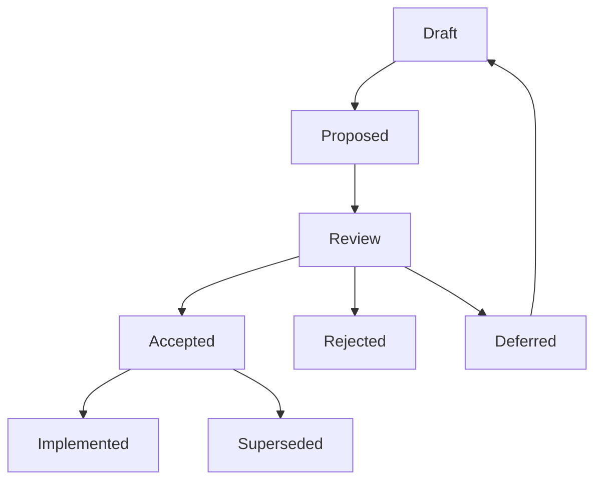

# RFCs

The `docs/rfcs/` folder contains Aerealith AI’s Request for Comments documents.

RFCs are used for decisions that shape the platform.

They are not for every small change.

They exist so important product, architecture, engineering, security, AI, Discord, module, data, and integration decisions are written down before the project builds too much on top of them.

---

## Purpose

RFCs help Aerealith make thoughtful decisions before implementation becomes expensive.

Use RFCs to:

- propose major changes
- compare options
- document tradeoffs
- explain why a decision matters
- collect feedback
- define acceptance criteria
- preserve historical context
- prevent future confusion

An RFC should answer:

```text
What are we deciding?
Why does it matter?
What options did we consider?
What are the tradeoffs?
What decision are we proposing?
What changes if this is accepted?
```

---

## RFC Philosophy

Aerealith should not become buried in paperwork.

RFCs should be useful, not performative.

The goal is not bureaucracy.

The goal is clarity.

Use an RFC when a decision affects the platform.

Do not use an RFC when a normal task, issue, or small code change is enough.

---

## When to Write an RFC

Write an RFC when a decision affects:

```text
Architecture
Data models
API contracts
Security
Trust
Permissions
AI behavior
Memory
Automation
Discord actions
Module system
Integrations
Provider lock-in
Self-hosting
Billing
Public developer experience
Long-term compatibility
```

RFCs are especially important when a decision is:

- expensive to reverse
- likely to affect many files
- likely to affect many future releases
- connected to user trust or privacy
- connected to destructive actions
- connected to AI autonomy
- connected to public APIs
- connected to storage or data ownership
- connected to Discord moderation or permissions

---

## When Not to Write an RFC

Do not write an RFC for:

```text
Small typo fixes
Simple docs edits
Minor refactors
One-file implementation details
Routine dependency updates
Formatting changes
Small utility functions
Simple bug fixes
Temporary experiments
```

Use normal tasks, commits, issues, or PR notes for those.

---

## Simple Rule

```text
If the decision shapes the platform, write an RFC.
If the decision only shapes a file, just do it.
```

---

## RFC Folder Structure

Recommended structure:

```text
docs/rfcs/
├── README.md
├── RFC Template.md
├── 0001-rfc-process.md
├── 0002-monorepo-library-boundaries.md
├── 0003-api-versioning-and-route-strategy.md
├── 0004-error-and-result-model.md
└── 0005-entity-schema-and-contract-strategy.md
```

Future RFCs should follow the same numbering pattern.

---

## RFC Numbering

RFCs should use four-digit numbers.

Examples:

```text
0001-rfc-process.md
0002-monorepo-library-boundaries.md
0003-api-versioning-and-route-strategy.md
```

Rules:

```text
Use the next available number.
Do not reuse RFC numbers.
Do not renumber accepted RFCs.
Use lowercase kebab-case filenames.
Keep filenames short but descriptive.
```

Good:

```text
0008-discord-permission-and-action-safety-model.md
0010-audit-log-and-event-model.md
0013-workflow-automation-foundation.md
```

Avoid:

```text
RFC about Discord stuff.md
final-api-decision-v2.md
new-thing.md
```

---

## RFC Statuses

Each RFC should have one status.

| Status      | Meaning                                                         |
| ----------- | --------------------------------------------------------------- |
| Draft       | The RFC is being written and is not ready for decision.         |
| Proposed    | The RFC is ready for review.                                    |
| Accepted    | The proposal has been approved and should guide implementation. |
| Rejected    | The proposal was reviewed and declined.                         |
| Superseded  | A newer RFC replaces this RFC.                                  |
| Deferred    | The RFC may be useful later but is not being decided now.       |
| Implemented | The accepted RFC has been implemented.                          |

---

## Recommended RFC Metadata

Each RFC should start with metadata.

Example:

```md
## 0001 — RFC Process

Status: Draft
Created: YYYY-MM-DD
Updated: YYYY-MM-DD
Owner: Tim Pierce / SinLess Games
Related Release: 0.1 — Foundation & Workspace
Related Docs:

- docs/releases/0.1/README.md
- docs/releases/0.1/Release.md
```

---

## RFC Lifecycle



---

## RFC Process

## 1. Create a Draft

Copy:

```text
docs/rfcs/RFC Template.md
```

Create a new file using the next number.

Example:

```text
docs/rfcs/0006-environment-config-and-secret-handling.md
```

Set status to:

```text
Draft
```

---

## 2. Write the Proposal

The RFC should explain:

- context
- problem
- goals
- non-goals
- options
- proposed decision
- tradeoffs
- risks
- migration plan
- acceptance criteria

The proposal should be clear enough that future contributors understand why the decision was made.

---

## 3. Mark as Proposed

When the RFC is ready for review, change status to:

```text
Proposed
```

At this point, the RFC should be complete enough to make a decision.

---

## 4. Review

Review should check:

```text
Does this solve the right problem?
Is the scope clear?
Are tradeoffs documented?
Are alternatives documented?
Does this affect trust, safety, security, privacy, or data ownership?
Does this affect future self-hosting?
Does this affect Discord permissions or moderation?
Does this affect API compatibility?
Does this affect module boundaries?
Does this make the system harder to maintain?
```

---

## 5. Decide

After review, update status to one of:

```text
Accepted
Rejected
Deferred
```

If accepted, the RFC becomes guidance for implementation.

If rejected, keep the file and explain why.

If deferred, keep the file and explain what must change before reconsidering.

---

## 6. Implement

When implementation is complete, update status to:

```text
Implemented
```

Add links to relevant PRs, commits, release docs, or implementation files when useful.

---

## 7. Supersede When Needed

If a later RFC replaces an earlier RFC, do not delete the old one.

Mark it:

```text
Superseded
```

Then link to the replacement RFC.

---

## RFC Review Questions

Before accepting an RFC, ask:

- Is this decision necessary now?
- Does this support the Aerealith roadmap?
- Does this reduce long-term complexity?
- Does this protect user trust?
- Does this keep users in control?
- Does this avoid unnecessary provider lock-in?
- Does this support future self-hosting where practical?
- Does this fit the module system?
- Does this fit the API strategy?
- Does this fit the data model strategy?
- Does this create security or privacy risks?
- Does this require audit logs?
- Does this require user approval flows?
- Does this create migration work?
- Is there a simpler option?
- What happens if we are wrong?

---

## Starter RFCs

These RFCs should be created first.

| RFC                                                                                           | Purpose                                                                    |
| --------------------------------------------------------------------------------------------- | -------------------------------------------------------------------------- |
| [0001 — RFC Process](./0001-rfc-process.md)                                                   | Defines how RFCs work.                                                     |
| [0002 — Monorepo Library Boundaries](./0002-monorepo-library-boundaries.md)                   | Defines app/library boundaries and dependency rules.                       |
| [0003 — API Versioning and Route Strategy](./0003-api-versioning-and-route-strategy.md)       | Defines API route/versioning rules.                                        |
| [0004 — Error and Result Model](./0004-error-and-result-model.md)                             | Defines error classes, error codes, result handling, and API error shapes. |
| [0005 — Entity, Schema, and Contract Strategy](./0005-entity-schema-and-contract-strategy.md) | Defines entity, schema, DTO, and contract boundaries.                      |

---

## Recommended Early RFC Backlog

After the starter RFCs, create these as needed:

```text
0006-environment-config-and-secret-handling.md
0007-provider-replacement-strategy.md
0008-discord-permission-and-action-safety-model.md
0009-module-system-foundation.md
0010-audit-log-and-event-model.md
0011-ai-assistant-safety-and-approval-model.md
0012-memory-and-context-model.md
0013-workflow-automation-foundation.md
0014-integration-health-and-connection-model.md
0015-observability-and-request-tracing-model.md
```

---

## RFCs and Releases

RFCs should connect to releases.

Example:

| Release                                          | RFCs Likely Needed                                           |
| ------------------------------------------------ | ------------------------------------------------------------ |
| 0.1 — Foundation & Workspace                     | RFC process, monorepo boundaries.                            |
| 0.2 — Core Domain & Data Platform                | Errors, entities, schemas, contracts, data rules.            |
| 0.3 — Authentication & Identity                  | Auth model, sessions, identity providers, account lifecycle. |
| 0.5 — API & Service Platform                     | API routing, events, request IDs, service boundaries.        |
| 0.7 — Discord Platform Foundation                | Discord permissions, server linking, module safety.          |
| 0.8 — Moderation, Tickets & Community Operations | Moderation safety, tickets, audit logs, automod rules.       |
| 0.9 — Observability & Reliability                | Logs, metrics, traces, incidents, health checks.             |
| 1.1 — MVP Production Launch                      | Trust, release readiness, support, operational safety.       |

---

## RFCs and Architecture Decisions

Accepted RFCs may become architecture decisions.

A future architecture doc may summarize accepted RFCs as ADRs.

Example:

```text
RFC 0002 accepted → ADR: Use libs/core as the default shared dependency.
RFC 0003 accepted → ADR: Use /api/v1 for public versioned API routes.
RFC 0004 accepted → ADR: Use AerealithError and stable error codes.
```

RFCs explain the full reasoning.

Architecture docs summarize the final decision.

---

## RFCs and Implementation

Implementation should not drift away from accepted RFCs.

If implementation needs to differ from an accepted RFC:

1. Update the RFC if the change is small.
2. Create a new RFC if the change is major.
3. Mark the old RFC as superseded if replaced.
4. Link the implementation back to the relevant RFC.

---

## Naming Standards

Use lowercase folder names.

Preferred:

```text
docs/rfcs/
```

Avoid:

```text
docs/RFCs/
```

Use lowercase kebab-case filenames for numbered RFCs.

Preferred:

```text
0004-error-and-result-model.md
```

Avoid:

```text
0004 Error And Result Model.md
```

The template file may remain readable:

```text
RFC Template.md
```

---

## Final Standard

RFCs should make Aerealith easier to build, safer to change, and harder to accidentally damage.

The standard is:

> Important decisions are written down before they become expensive assumptions.
