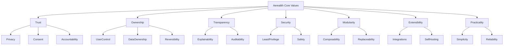

# Core Values

Status: Active
Owner: SinLess Games LLC
Last Updated: 2026-07-17
Document Type: Vision

---

# Foundation

Aerealith exists to reduce digital complexity without reducing user control.

Every decision—whether architectural, technical, operational, or user-facing—
should reinforce the same foundation:

- Trust
- User Ownership
- Transparency
- Security
- Practicality
- Modularity
- Extensibility

Features should not exist simply because they are technically interesting.
Every capability should solve a real problem while remaining understandable,
auditable, secure, and respectful of the people using it.

# Trust

Trust is the foundation of Aerealith.

Users should never be expected to trust the platform simply because it uses AI.
Trust is earned through predictable behavior, honest communication,
transparent permissions, and reliable operation.

Every interaction should increase confidence rather than uncertainty.

---

# User Ownership

Users remain in control of:

- Their identity
- Their data
- Their connected services
- Their automations
- Their memories
- Their workflows
- Their communities

Organizations retain ownership of organizational data.

Communities retain ownership of community data.

Aerealith never assumes ownership of user information.

---

# User Control

The user is always the final authority.

Meaningful actions require meaningful approval.

Permissions should be:

- Visible
- Understandable
- Revocable
- Granular
- Easy to review

Whenever technically possible, users should be able to disable, remove,
replace, or override platform behavior.

---

# Transparency

Nothing important should happen silently.

Aerealith should clearly communicate:

- What it knows
- What it can access
- Why an action is requested
- Which permissions are required
- Whether AI is involved
- What happened
- How to reverse the action

Users should never need to guess why something occurred.

---

# Security

Security is part of the product—not an optional enterprise feature.

Security principles include:

- Least privilege
- Secure defaults
- Strong authentication
- Principle of separation
- Secret protection
- Defense in depth
- Human approval for high-risk actions

Security should strengthen usability instead of making the platform difficult to
operate.

---

# Privacy

Collect only the information required to provide a capability.

Private information should never become training data without explicit user
consent.

Users should always be able to understand:

- What information exists
- Why it exists
- How long it exists
- How to export it
- How to delete it

Privacy is the default—not an upgrade.

---

# Explainability

Artificial intelligence should never become an excuse for opaque behavior.

Whenever possible, Aerealith explains:

- Why it reached a conclusion
- Why it recommends an action
- Which information influenced the recommendation
- What uncertainty exists

Explanations should be understandable to end users—not only developers.

---

# Auditability

Meaningful actions create meaningful records.

Audit history should identify:

- Actor
- Target
- Module
- Integration
- Request source
- Timestamp
- Result
- Required approval
- Relevant metadata

Audit trails should support debugging, compliance, and accountability without
collecting unnecessary personal information.

---

# Safety

Automation should never silently bypass user intent.

The platform should:

- Avoid unnecessary privilege escalation
- Require confirmation for destructive actions
- Respect configured safeguards
- Fail safely
- Preserve recoverability whenever possible

Protecting user trust always takes precedence over convenience.

---

# Modularity

Every capability should function as an independent module whenever practical.

Modules should be:

- Enableable
- Disableable
- Replaceable
- Testable
- Independently documented
- Independently deployable where appropriate

A modular platform is easier to understand, maintain, secure, and evolve.

---

# Extensibility

Aerealith is designed as a platform—not a closed application.

New capabilities should integrate through stable interfaces rather than
requiring core modifications.

The platform should encourage:

- Plugins
- Integrations
- APIs
- Community modules
- Enterprise extensions
- Future products

Growth should come through composition instead of increasing complexity.

---

# Self-Hosting

Users should have meaningful deployment choice.

Where practical, Aerealith should support:

- SaaS deployment
- Self-hosting
- Hybrid environments
- Air-gapped installations
- Enterprise infrastructure

Deployment flexibility is part of user ownership.

---

# Practicality

Technology exists to solve real problems.

Every feature should answer three questions:

1. What problem does this solve?
2. Who benefits from it?
3. Why does it belong in Aerealith?

Features that do not improve the user experience, platform capabilities, or
long-term vision should not be added.

---

# Simplicity

Prefer the simplest solution that satisfies the requirements.

Simplicity should never sacrifice:

- Security
- Reliability
- Documentation
- Testing
- Accessibility
- Maintainability

Good engineering reduces complexity instead of hiding it.

---

# Reliability

Users should be able to depend on the platform.

Reliability includes:

- Predictable behavior
- Graceful failure
- Recovery mechanisms
- Stable APIs
- Consistent interfaces
- Long-term maintainability

Trust is impossible without reliability.

---

# Reversibility

Whenever technically possible, actions should be reversible.

Irreversible operations require:

- Clear warning
- Explicit confirmation
- Appropriate permissions

Mistakes should be recoverable whenever practical.

---

# Accountability

Every meaningful action should have a responsible actor.

Whether an action originates from:

- A user
- An administrator
- An automation
- An integration
- A plugin
- An AI assistant

…the platform should make that origin understandable.

Responsibility should never be hidden behind automation.

---

# Final Standard

Every decision made within Aerealith should support one guiding principle:

> **Reduce digital complexity without reducing user control.**

If a feature increases confusion, hides important behavior, weakens security,
reduces transparency, or takes ownership away from the user, it does not align
with Aerealith's values.

The platform succeeds when users are **more informed, more capable, more secure,
and more in control** than they were before using it.
