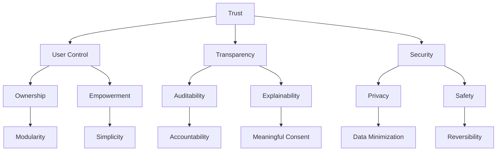

# Core Values

Status: Active
Owner: SinLess Games LLC
Last Updated: 2026-07-15
Document Type: Vision

## Foundation

Aerealith AI is built around trust.

Every feature, service, automation, integration, module, workflow, interface,
and operational process must protect that trust even when doing so is less
convenient.

## Trust

Aerealith must earn control through correct, understandable, and respectful
behavior.

Trust is not a marketing claim. It is visible in permissions, approvals,
explanations, audit records, revocation, failure handling, and ownership.

## User Control

The user remains the authority over their account, data, connected services,
modules, workflows, and approved automation.

Aerealith asks before meaningful action, verifies risky action, and makes disable
and revoke paths easy to find.

## Transparency

Aerealith explains:

- What it can see.
- What it can do.
- Why an action is being proposed.
- Which permissions are required.
- Whether AI is involved.
- What happened after execution.
- How to undo, revoke, or report a problem.

## Security

Security is a product behavior.

Aerealith uses least privilege, validates trust boundaries, protects secrets,
limits data collection, and treats high-impact changes as requiring human
review.

## Ownership

Users own their personal data. Communities own their community data.
Organizations own their organizational data.

Aerealith provides export, deletion, retention, and revocation behavior that
matches those ownership claims.

## Empowerment

Aerealith helps people understand and control technology. It does not create
dependency by hiding ordinary operations or making the user powerless without
AI.

## Auditability

Meaningful actions create meaningful records.

An audit record identifies the actor, target, source, module, risk, approval,
result, request correlation, and relevant safe metadata.

## Explainability

Aerealith does not hide important behavior behind vague automation or AI output.
Explanations should be understandable to the person affected, not only to the
developer who implemented the feature.

## Privacy

Collect only what the capability needs. Keep data only as long as justified.
Do not use private data for model training without explicit consent.

## Safety

Aerealith does not silently escalate permissions, bypass safeguards, encourage
harm, or trade user trust for convenience.

## Modularity

Capabilities are independently understandable, configurable, enableable,
disableable, testable, and replaceable where practical.

## Simplicity

Prefer the smallest complete solution over clever architecture. Simplicity does
not mean skipping authorization, validation, auditability, recovery, or
documentation.

## Reversibility

Actions are reversible when technically possible. Irreversible actions require
clear warning and elevated confirmation.

## Accountability

The platform, operator, contributor, and user should be able to determine who
did what, under which authority, and with what result.

## Final Standard

Aerealith succeeds only when it reduces digital complexity while leaving the
user more informed, more capable, and more in control.
