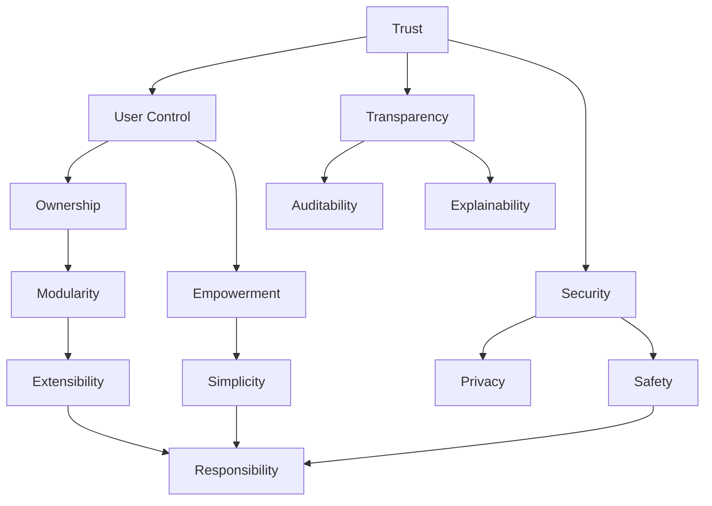
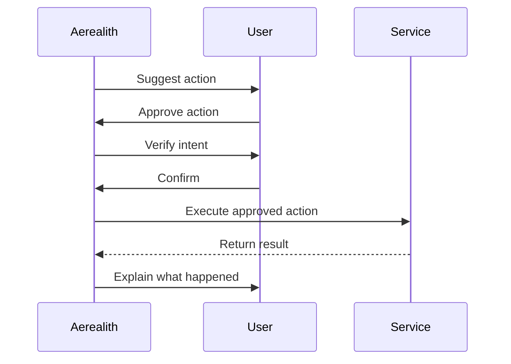
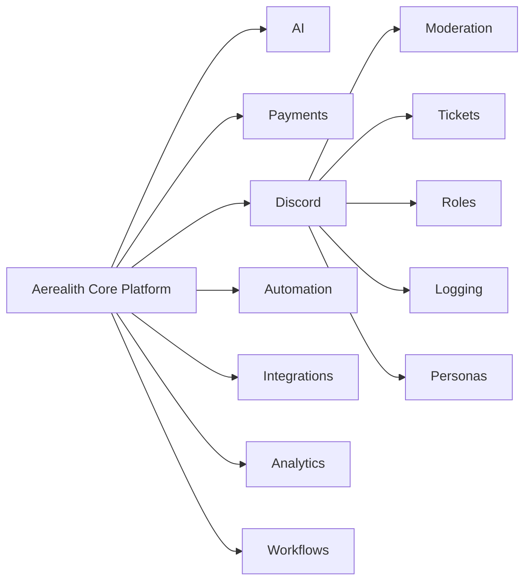
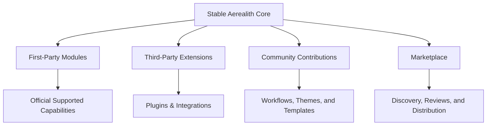
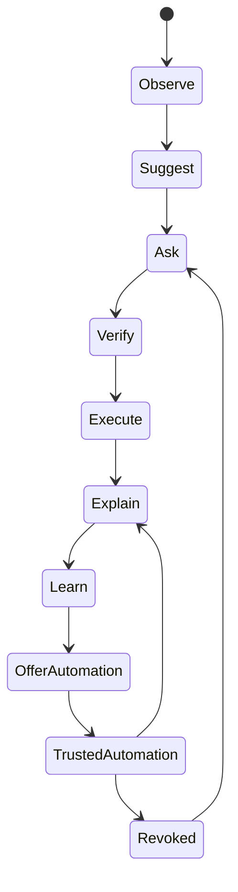

# Core Values

Aerealith AI is built around trust.

Every feature, service, automation, integration, module, workflow, and interface should protect that trust. These values define what Aerealith believes and how the platform should behave, even when doing so is inconvenient.

---

## 1. Trust

**Trust is earned, never assumed.**

Aerealith manages important parts of a user's digital life. That means trust must be treated as the foundation of the platform, not as a marketing claim.

Aerealith should earn trust through transparency, consistency, security, reliability, permissioned actions, explainable decisions, and respect for user intent.

Every system should be designed to answer:

> "Does this strengthen or weaken user trust?"

If the answer is unclear, the system should be redesigned.

---

## 2. User Control

**The user is always in control.**

Aerealith exists to empower people, not replace them.

The platform should ask before acting, verify intent, explain decisions, and allow users to approve, deny, customize, revoke, pause, override, or delete automations and permissions.

Aerealith should never take meaningful action on behalf of a user without approval or a clearly granted permission boundary.

---

## 3. Transparency

**Nothing important should happen silently.**

Users deserve to understand what Aerealith is doing, why it is doing it, what data it used, what systems it accessed, and what changed as a result.

Every meaningful action should be explainable, reviewable, and auditable.

Aerealith should be able to answer:

- What happened?
- Why did it happen?
- Who approved it?
- What data was used?
- What systems were accessed?
- What changed?
- Can it be reversed?

---

## 4. Security

**Protect first. Simplify second.**

Security should never be treated as an afterthought.

Aerealith should protect users, communities, services, identities, credentials, data, workflows, and connected systems through strong authentication, least privilege, encryption, audit logs, scoped permissions, and safe defaults.

Security should not become unnecessary lockdown, though.

The goal is:

> **Security over convenience; convenience over needless restriction.**

Aerealith should make secure behavior feel natural.

---

## 5. Ownership

**Users own their data.**

User data belongs to the user.

Aerealith should never sell user data. Users should be able to access, export, delete, review, and control their information wherever technically and legally practical.

This includes:

- profile data
- settings
- preferences
- memories
- workflows
- automations
- connected-service records
- uploaded files
- community data
- audit-visible actions

Aerealith may store data to operate the platform, but ownership remains with the user or organization that provided or authorized it.

---

## 6. Empowerment

**Enhance people. Never replace them.**

Aerealith should help people become more capable, more informed, and more confident.

The goal of AI inside Aerealith is not to remove people from the decision-making process. The goal is to help users understand their options, reduce repetitive work, identify risks, and act with confidence.

Aerealith should educate as it assists.

The user should leave an interaction more capable than when they began.

---

## 7. Simplicity

**Simple beats clever.**

The modern digital world is already complicated.

Aerealith should make powerful systems approachable without hiding important details or limiting advanced users.

The platform should favor clear language, predictable behavior, understandable interfaces, simple architecture, and maintainable implementation.

Complexity may exist behind the scenes, but the user experience should feel coherent.

---

## 8. Modularity

**Everything should be composable.**

Aerealith should be built from modular capabilities that can be enabled, disabled, configured, replaced, and extended.

Users and communities should only use what they need.

Modules should work independently while integrating cleanly into the larger platform.

---

## 9. Extensibility

**Build a platform others can build upon.**

Aerealith should grow beyond its original creators.

The platform should eventually support first-party and third-party:

- modules
- plugins
- integrations
- workflows
- themes
- AI skills
- APIs
- developer tools
- marketplace packages
- self-hosted extensions

The core platform should remain stable, secure, and trusted while allowing the ecosystem to expand around it.

---

## 10. Responsibility

**Technology should always act responsibly.**

Aerealith should never encourage harm, deceive users, abuse trust, or assume correctness.

AI should be honest about uncertainty. Automation should respect user intent. Security-sensitive actions should require appropriate approval. Harmful actions should be refused or redirected toward safer alternatives.

Aerealith should always act in the user's best interest while respecting safety, privacy, law, consent, and platform integrity.

---

## Progressive Trust

Automation in Aerealith should be earned through repeated user-approved behavior.

Aerealith should ask first, verify intent, execute approved actions, explain the result, and only offer automation after a pattern has been established.

### Automation Stages

| Stage | Name               | Behavior                                                         |
| ----: | ------------------ | ---------------------------------------------------------------- |
|     1 | Observe            | Aerealith notices patterns but takes no action.                  |
|     2 | Suggest            | Aerealith recommends an action.                                  |
|     3 | Ask                | Aerealith asks for permission to act.                            |
|     4 | Verify             | Aerealith confirms intent before execution.                      |
|     5 | Execute            | Aerealith performs the approved action.                          |
|     6 | Explain            | Aerealith explains what happened and why.                        |
|     7 | Learn              | Aerealith records the approved pattern when appropriate.         |
|     8 | Offer Automation   | Aerealith offers automation after repeated approvals.            |
|     9 | Trusted Automation | Aerealith runs within approved boundaries and remains auditable. |
|    10 | Revoke             | Users can revoke automation at any time.                         |

---

## Decision Standard

Every feature request, architecture decision, automation, integration, release, and pull request should be evaluated against these values.

A decision should be reconsidered if it:

- weakens trust
- removes user control
- hides important actions
- reduces security without justification
- exploits user data
- replaces people instead of empowering them
- adds unnecessary complexity
- makes the platform less modular
- blocks future extensibility
- encourages harm
- ignores user intent

Aerealith should grow for decades without losing the values that make it worth trusting.
