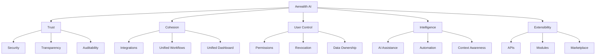
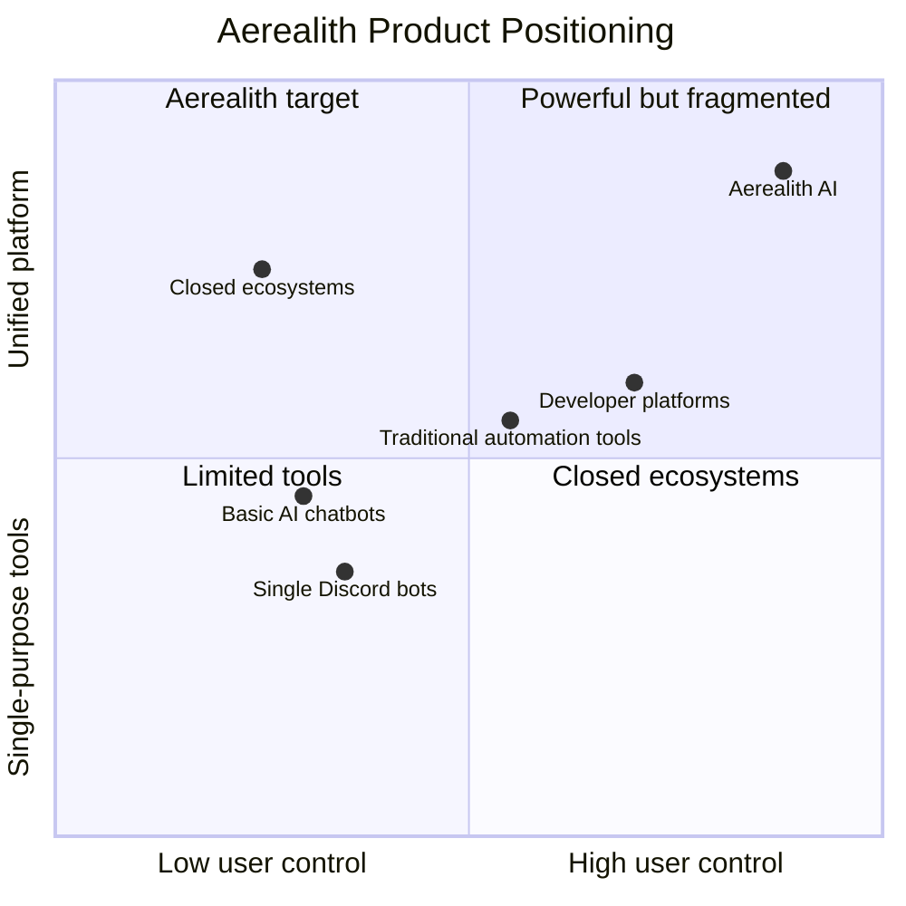
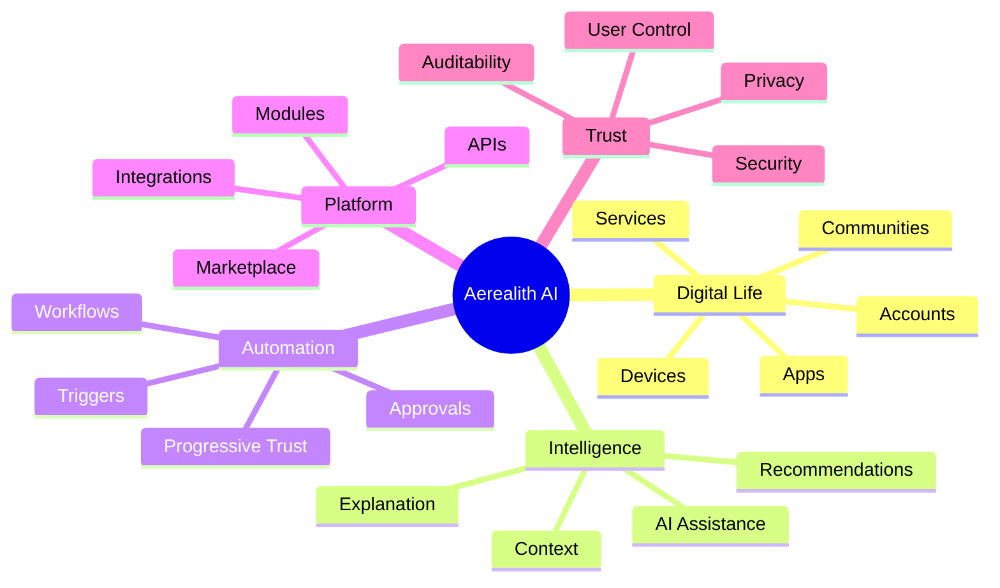

# Positioning

Aerealith AI is the operating system for your digital life.

This document defines how Aerealith should be described, positioned, compared, and understood by users, communities, developers, contributors, and future partners.

Positioning exists to keep the message clear.

Aerealith is not just an AI assistant.

It is not just a Discord bot.

It is not just an automation tool.

It is a trusted, modular orchestration platform designed to bring a fragmented digital world into one manageable, secure, and intelligent experience.

---

## Core Positioning Statement

Aerealith AI is a modular platform that brings your digital life together through intelligent automation, trusted AI, seamless integrations, and user-controlled workflows.

It helps individuals and communities save time, understand their technology, stay secure, and remain in control across the applications, services, devices, communities, and systems they already use.

---

## Short Positioning Statement

Aerealith AI is the operating system for your digital life.

---

## Tagline

One Platform. Infinite Possibilities.

---

## North Star

Reduce digital complexity without reducing user control.

---

## Category

Aerealith AI belongs to a new category:

> Digital Life Operating System

Internally, Aerealith can also be understood as:

> A trusted orchestration layer for the digital world.

These two phrases serve different purposes.

| Phrase                        | Purpose                                    |
| ----------------------------- | ------------------------------------------ |
| Digital Life Operating System | Public-facing, memorable, product-oriented |
| Trusted Orchestration Layer   | Internal, architectural, technical         |
| Modular AI Platform           | Useful for developers and integrations     |
| Community Management Platform | Useful for Discord and online communities  |
| Automation Platform           | A capability, not the whole product        |

Aerealith should not be limited to one narrow category because it is designed to unify several product areas into one cohesive ecosystem.

---

## What Aerealith Is

Aerealith AI is:

- A digital life operating system
- A trusted orchestration platform
- A modular AI platform
- A secure automation layer
- A unified control center
- A community management system
- A developer-extensible platform
- A workflow and integration ecosystem
- A platform for individuals and communities
- A foundation for future self-hosted digital infrastructure

Aerealith should feel like one coherent platform even when it connects many tools.

---

## What Aerealith Is Not

Aerealith AI is not:

- Another ChatGPT wrapper
- Another Discord bot
- Another automation platform
- Another password manager
- Another cloud storage provider
- A closed ecosystem
- A surveillance platform
- A data resale business
- A black-box AI agent
- A replacement for every specialized tool

Aerealith may include features that overlap with these categories, but its purpose is larger.

Its purpose is to unify, automate, explain, secure, and orchestrate the tools people already use.

---

## The Problem We Solve

Application sprawl has made the modern digital world too fragmented and complex to manage effectively.

People now rely on many disconnected systems:

- Messaging apps
- Community platforms
- Cloud services
- Developer tools
- Calendars
- Email
- Automation tools
- Dashboards
- Storage providers
- AI assistants
- Smart devices
- Game servers
- Infrastructure tools
- Payment platforms
- Security systems

Each tool may be useful on its own.

Together, they create complexity.

Aerealith exists to reduce that complexity by creating one trusted layer that connects the user's digital ecosystem and makes it easier to understand, manage, automate, and control.

---

## The Aerealith Difference

Aerealith is different because it combines five ideas into one platform.

Aerealith does not compete by being the loudest AI tool.

It competes by being the most trusted way to manage complexity.

---

## Positioning Pillars

### 1. Trust

Aerealith earns trust before receiving control.

It asks first, verifies intent, executes approved actions, explains what happened, remains auditable, and allows users to revoke automation at any time.

Trust is not a feature.

Trust is the foundation.

---

### 2. Cohesion

Aerealith creates cohesion across fragmented systems.

It should feel like one platform, not a collection of disconnected tools.

The goal is not to replace every application.

The goal is to make the user's existing digital ecosystem easier to manage.

---

### 3. User Control

Aerealith exists to enhance people, not replace them.

Users remain in control of their data, permissions, automations, workflows, AI behavior, connected services, and deployment preferences.

The platform should never take meaningful action without approval or an explicit permission boundary.

---

### 4. Intelligence

Aerealith uses AI to understand context, explain complexity, recommend actions, automate repeated work, and help users make better decisions.

AI is not the entire product.

AI is the intelligence layer that helps the platform feel adaptive, useful, and understandable.

---

### 5. Extensibility

Aerealith is designed to grow beyond its original creators.

The platform should support modules, integrations, workflows, plugins, APIs, SDKs, themes, AI skills, marketplace packages, and self-hosted extensions.

A strong core should enable a larger ecosystem.

---

## Primary Launch Positioning

At launch, Aerealith should be positioned around individuals and communities.

### Individuals

For individuals, Aerealith is a trusted control center for managing digital life.

It helps users:

- save time
- stay organized
- automate repetitive work
- understand their technology
- manage connected services
- protect their data
- stay in control

### Communities

For communities, Aerealith is a modular management platform.

It helps online communities, especially Discord communities:

- moderate safely
- manage tickets
- configure roles
- automate onboarding
- log important actions
- review analytics
- manage workflows
- reduce staff workload
- replace multiple disconnected bots with one modular platform

Discord is the first flagship community surface.

It is not the whole product.

---

## Future Audience Positioning

As Aerealith grows, its positioning should expand to include more audiences.

| Audience                 | Positioning                                                                                   |
| ------------------------ | --------------------------------------------------------------------------------------------- |
| Individuals              | A trusted operating system for managing digital life                                          |
| Communities              | A modular control center for online community operations                                      |
| Developers               | A platform foundation for building modules, workflows, integrations, and AI-powered tools     |
| Creators                 | A connected workspace for managing content, communities, schedules, analytics, and automation |
| Organizations            | A secure platform for workflows, permissions, integrations, automation, and governance        |
| Infrastructure Operators | An intelligent assistant for monitoring, troubleshooting, deployment, and operations          |
| Self-Hosted Users        | A deployment-flexible platform that can run under user control                                |

---

## Competitive Framing

Aerealith overlaps with several existing product categories, but it should not be positioned as a clone of any one category.

| Category            | What They Do                           | How Aerealith Differs                                                                                     |
| ------------------- | -------------------------------------- | --------------------------------------------------------------------------------------------------------- |
| AI Assistants       | Answer questions and perform AI tasks  | Aerealith connects AI to workflows, systems, permissions, memory, automation, and user-controlled actions |
| Automation Tools    | Connect apps with triggers and actions | Aerealith adds trust, context, explainability, user control, and modular platform behavior                |
| Discord Bots        | Manage Discord servers                 | Aerealith treats Discord as one platform surface connected to a larger architecture                       |
| Dashboards          | Display information                    | Aerealith turns information into context, decisions, workflows, and approved actions                      |
| Password Managers   | Store credentials                      | Aerealith should integrate with credential systems instead of replacing them unnecessarily                |
| Cloud Storage       | Store files                            | Aerealith should orchestrate files and context rather than becoming generic storage                       |
| Developer Platforms | Provide APIs and tools                 | Aerealith combines APIs, workflows, AI, modules, and user-facing orchestration                            |

Aerealith should be positioned as the connective layer between these categories.

---

## Integrate Before Replace

Aerealith should integrate before replacing.

The world already has excellent specialized tools.

Aerealith should connect those tools, simplify their use, secure their interactions, and help users understand them.

Native features should be built only when they provide meaningful value beyond integration.

Examples:

| Existing Tool                            | Aerealith Role                                        |
| ---------------------------------------- | ----------------------------------------------------- |
| Discord                                  | Enhance and manage communities                        |
| GitHub                                   | Summarize, automate, and assist development workflows |
| Grafana                                  | Surface insights and operational context              |
| Home Assistant                           | Connect home automation into broader workflows        |
| Bitwarden or other password managers     | Integrate securely rather than replace by default     |
| Cloudinary or object storage             | Manage media workflows and provider abstraction       |
| Resend or SMTP                           | Deliver notification and email workflows              |
| Cloudflare or self-hosted infrastructure | Support deployment flexibility                        |

Aerealith should be the control layer, not a forced replacement layer.

---

## Messaging Hierarchy

Aerealith messaging should follow this order.

### Level 1 — One-Liner

Aerealith AI is the operating system for your digital life.

### Level 2 — Short Description

Aerealith AI brings your digital life together through trusted AI, intelligent automation, seamless integrations, and user-controlled workflows.

### Level 3 — Product Description

Aerealith AI is a modular platform that helps individuals and communities manage their applications, services, devices, communities, workflows, and automations from one secure and intelligent control center.

### Level 4 — Expanded Description

Aerealith AI reduces digital complexity by connecting the tools people already use into one cohesive ecosystem. It combines AI assistance, automation, integrations, workflows, permissions, observability, and modular expansion while keeping users in control of their data, actions, and digital environment.

---

## Public Description Options

### Website Hero

Aerealith AI is the operating system for your digital life.

Bring your apps, communities, workflows, automations, and AI assistance into one secure, intelligent, and customizable platform.

One Platform. Infinite Possibilities.

### GitHub Repository Description

Aerealith AI is a modular digital life operating system for trusted AI, automation, integrations, community management, workflows, and extensible platform services.

### Discord App Description

Aerealith AI is a modular Discord management platform for moderation, tickets, automation, logging, analytics, roles, personas, forms, and community tools.

### Developer Description

Aerealith AI is an extensible platform for building trusted modules, workflows, integrations, APIs, and AI-powered tools on top of a secure digital orchestration layer.

### Self-Hosted Description

Aerealith AI is a deployment-flexible digital life platform designed to support cloud, hybrid, and future self-hosted environments.

---

## Brand Voice

Aerealith should sound:

- clear
- calm
- trustworthy
- intelligent
- protective
- professional
- slightly futuristic
- user-centered
- confident without hype
- technical when needed
- simple when possible

Aerealith should avoid sounding:

- manipulative
- overhyped
- vague
- corporate-cold
- fear-based
- overly cute
- reckless about AI
- dismissive of user control
- like a generic AI wrapper

---

## Words We Should Use

These words align with Aerealith's positioning:

- trusted
- modular
- secure
- intelligent
- unified
- cohesive
- transparent
- customizable
- extensible
- permissioned
- auditable
- user-controlled
- orchestration
- automation
- workflows
- integrations
- digital life
- community operations
- explainable AI
- progressive trust

---

## Words We Should Avoid

These words should be used carefully or avoided:

- autonomous
- replacement
- surveillance
- all-knowing
- magic
- effortless everything
- fully automatic
- no human needed
- black box
- lock-in
- unbeatable
- revolutionary
- sentient
- conscious

Aerealith can be ambitious without making irresponsible claims.

---

## Positioning Diagram

---

## Strategic Position

Aerealith should occupy the intersection of:

- AI assistance
- workflow automation
- integration orchestration
- community management
- user-owned data
- modular platform design
- developer extensibility
- future self-hosting

---

## Positioning Rules

Every public message should make at least one of these ideas clear:

1. Aerealith reduces digital complexity.
2. Aerealith keeps users in control.
3. Aerealith integrates before replacing.
4. Aerealith uses AI responsibly.
5. Aerealith is modular and extensible.
6. Aerealith is bigger than Discord.
7. Aerealith earns trust before taking action.
8. Aerealith protects user data.
9. Aerealith is built for individuals and communities first.
10. Aerealith is designed to become a long-term platform.

---

## The Positioning Test

Before using new messaging, ask:

- Does this make Aerealith sound like more than a chatbot?
- Does this make Aerealith sound like more than a Discord bot?
- Does this emphasize user control?
- Does this avoid overpromising AI capabilities?
- Does this communicate trust?
- Does this support the digital life operating system idea?
- Does this leave room for future platform growth?
- Does this match the public brand voice?
- Would we still want this wording ten years from now?

If the answer to any of these is no, the positioning should be revised.

---

## Final Position

Aerealith AI is the operating system for your digital life.

It brings fragmented applications, communities, services, workflows, automations, and AI assistance into one trusted, modular, and user-controlled platform.

It does not exist to replace people.

It exists to help them understand, manage, automate, and protect the digital world they already live in.

One Platform. Infinite Possibilities.\
