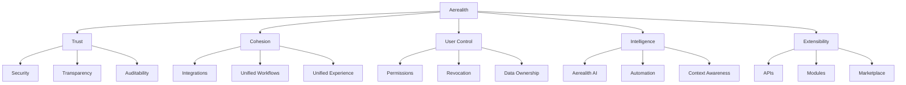
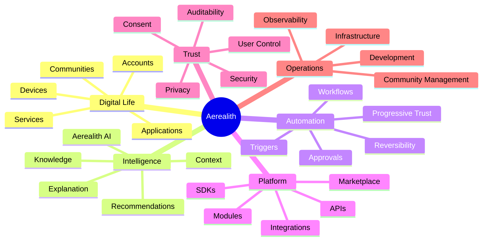

# Positioning

Status: Active
Owner: SinLess Games LLC
Last Updated: 2026-07-17
Document Type: Product Strategy

## Purpose

This document defines how Aerealith and Aerealith AI should be described,
positioned, compared, and understood by users, communities, developers,
contributors, partners, and future maintainers.

Positioning exists to keep the product narrative clear and consistent across:

- Product documentation
- Website content
- Repository descriptions
- Community communication
- Marketing materials
- Presentations
- Partner discussions
- Developer documentation
- Funding materials
- Application-store listings

Aerealith is not merely an AI assistant.

It is not merely a Discord bot.

It is not merely an automation tool.

Aerealith is a trusted, modular orchestration platform designed to bring a
fragmented digital world into one manageable, secure, and intelligent
experience.

Aerealith AI is the intelligent assistant that helps users understand and
interact with that platform.

---

## Scope

This document describes both current product positioning and long-term strategic
direction.

Some capabilities described here are implemented today.

Others are planned, future, or aspirational.

Positioning may describe the platform Aerealith is becoming, but public messaging
must not imply that planned or aspirational functionality is already available.

Implementation status is documented separately in:

- [`CURRENT_STATE.md`](./CURRENT_STATE.md)
- The product roadmap
- Release documentation
- Architecture documentation

Documentation and public messaging should use the following capability states:

- **Current** — implemented and available now
- **Planned** — approved for development
- **Future** — expected beyond the immediate roadmap
- **Vision** — long-term direction not yet committed to delivery

---

## Canonical Product Distinction

### Aerealith

**Aerealith** is the platform.

It is a modular digital orchestration platform designed to connect applications,
services, communities, workflows, infrastructure, knowledge, automation, and
intelligent capabilities through one trusted control layer.

### Aerealith AI

**Aerealith AI** is the intelligent assistant within the Aerealith platform.

It provides conversational interaction, contextual understanding, guidance,
workflow orchestration, recommendations, explanations, and decision support
within explicit permissions and approved boundaries.

The names must not be used interchangeably when technical precision matters.

> **Aerealith is the platform.**
>
> **Aerealith AI is the assistant that helps users interact with the platform.**

Public-facing language may sometimes use “Aerealith AI” as the primary product
brand where that name is more familiar, but authoritative documentation should
preserve the platform-and-assistant distinction.

---

## Core Positioning Statement

Aerealith is a modular platform that brings the digital world together through
intelligent assistance, secure automation, trusted integrations, and
user-controlled workflows.

It helps individuals, communities, developers, and organizations understand,
manage, connect, and automate the applications, services, devices, workflows,
and systems they already use.

Aerealith AI provides the intelligence layer that helps users interact with the
platform through conversation, context, recommendations, explanations, and
approved actions.

---

## Short Positioning Statement

> **Aerealith is the operating system for your digital life.**

---

## Supporting Statement

> **Aerealith AI is the trusted assistant that helps you understand, manage, and
> automate the digital world connected through Aerealith.**

---

## Tagline

> **One Platform. Infinite Possibilities.**

---

## North Star

> **Reduce digital complexity without reducing user control.**

Every major product, architecture, design, and messaging decision should support
this principle.

---

## Category

Aerealith belongs to an emerging product category:

> **Digital Life Operating System**

Internally and technically, Aerealith can also be understood as:

> **A trusted orchestration layer for the digital world.**

These phrases serve different audiences and purposes.

| Phrase                                 | Purpose                                                           |
| -------------------------------------- | ----------------------------------------------------------------- |
| Digital Life Operating System          | Public-facing, memorable, product-oriented positioning            |
| Trusted Digital Orchestration Platform | Internal, architectural, and technical positioning                |
| Modular AI Platform                    | Useful for developers, integrations, and intelligent capabilities |
| Community Operations Platform          | Useful for Discord and online-community positioning               |
| Automation Platform                    | Describes one major capability, not the whole product             |
| Integration Platform                   | Describes connectivity and orchestration capabilities             |
| Developer Platform                     | Describes APIs, modules, SDKs, and extension surfaces             |
| Intelligent Control Center             | Useful for individual and organizational messaging                |

Aerealith should not be limited to one narrow category because it is designed to
unify several product areas into one coherent platform.

---

## A Platform, Not a Single Application

Aerealith is designed as a long-lived platform rather than a single-purpose
application.

Individual applications, modules, services, assistants, integrations,
workflows, and interfaces should build upon a common foundation.

That foundation includes:

- Identity
- Permissions
- Consent
- Auditability
- Integrations
- Events
- Automation
- Knowledge
- Context
- Security
- Observability
- Developer interfaces
- Deployment capabilities

The platform should grow through composition.

It should not become a collection of independent products that happen to share
the same name or visual identity.

New capabilities should strengthen the shared platform rather than create
unrelated silos.

---

## What Aerealith Is

Aerealith is:

### Platform

- A digital life operating system
- A trusted digital orchestration platform
- A modular integration platform
- A unified control center
- A foundation for connected applications and services
- A platform for hosted, hybrid, and future self-hosted deployment

### Intelligence

- A platform for trusted AI assistance
- A contextual knowledge layer
- A system for recommendations and decision support
- A framework for explainable AI behavior
- A foundation for future intelligent modules and skills

### Automation

- A secure automation layer
- A workflow and orchestration system
- An approval-aware action framework
- An event-driven integration platform
- A system for progressive, revocable automation

### Communities

- A modular community-management platform
- A foundation for Discord operations
- A system for moderation, tickets, roles, logging, onboarding, and analytics
- A platform for connecting community operations with broader workflows

### Developers

- A developer-extensible platform
- An API and integration ecosystem
- A foundation for modules, plugins, workflows, and skills
- A future marketplace platform
- A secure foundation for third-party extensions

### Operations

- A control surface for connected infrastructure
- A platform for monitoring and operational context
- A foundation for developer and infrastructure workflows
- A system for connecting observability, alerts, approvals, and actions

Aerealith should feel like one coherent platform even when it connects many
tools and serves many use cases.

---

## What Aerealith AI Is

Aerealith AI is:

- The intelligent assistant within Aerealith
- A conversational interface to platform capabilities
- A contextual guide for connected systems
- A recommendation and decision-support layer
- A workflow-orchestration assistant
- An explanation layer for automation, integrations, and system behavior
- A permission-bound actor capable of proposing and executing approved actions

Aerealith AI should help users:

- Understand their systems
- Find relevant information
- Interpret events and alerts
- Build and manage workflows
- Review proposed actions
- Coordinate connected services
- Reduce repetitive work
- Learn from approved behavior
- Operate within explicit trust boundaries

Aerealith AI is a core part of the platform.

It is not the entirety of the platform.

---

## What Aerealith Is Not

Aerealith is not:

- Merely another chatbot
- Merely another ChatGPT wrapper
- Merely another Discord bot
- Merely another automation platform
- A password manager
- A generic cloud-storage provider
- A social network
- A closed ecosystem
- A surveillance platform
- A data-resale business
- A black-box autonomous agent
- A replacement for every specialized tool
- An operating system in the kernel or hardware-management sense
- A system that silently assumes authority over users
- A product whose value depends on hiding ordinary software behind AI

Aerealith may include capabilities that overlap with these categories, but its
purpose is broader.

Its purpose is to connect, explain, secure, automate, and orchestrate the tools
people already use while keeping users in control.

---

## The Problem We Solve

Application sprawl has made the modern digital world fragmented and difficult to
manage.

People now depend on disconnected systems such as:

- Messaging applications
- Community platforms
- Cloud services
- Developer tools
- Calendars
- Email
- Automation systems
- Dashboards
- Storage providers
- AI assistants
- Smart devices
- Game servers
- Infrastructure tools
- Payment platforms
- Security systems
- Documentation platforms
- Monitoring and observability services

Each tool may provide value independently.

Together, they create complexity.

That complexity produces:

- Repeated manual work
- Lost context
- Duplicated configuration
- Notification fatigue
- Dashboard fatigue
- Fragmented identity and permissions
- Poor visibility into what happened and why
- Automation without sufficient explanation
- Increased dependence on individual vendors
- More systems to configure, monitor, and maintain
- Difficulty transferring knowledge between tools
- Difficulty controlling data across providers

Aerealith exists to reduce this complexity by creating one trusted layer that
connects the user's digital ecosystem and makes it easier to understand, manage,
automate, and control.

---

## The Aerealith Difference

Aerealith combines five core ideas into one platform.

Aerealith does not compete by being the loudest AI product.

It competes by becoming the most trusted way to manage digital complexity.

---

## Positioning Pillars

### 1. Trust

Aerealith earns trust before receiving control.

It asks first, verifies intent, operates within approved boundaries, explains
what happened, remains auditable, and allows permissions and automation to be
revoked.

Trust is not a feature.

Trust is the foundation.

---

### 2. Cohesion

Aerealith creates cohesion across fragmented systems.

It should feel like one platform, not a collection of disconnected tools.

The goal is not to replace every application.

The goal is to make the user's existing digital ecosystem easier to understand
and manage.

---

### 3. User Control

Aerealith exists to enhance people, not replace them.

Users remain in control of:

- Their data
- Their permissions
- Their automations
- Their workflows
- Their connected services
- Their AI settings
- Their modules
- Their deployment preferences

The platform should not take meaningful action without approval or an explicit
permission boundary.

---

### 4. Intelligence

Aerealith uses intelligence to:

- Understand context
- Explain complexity
- Recommend actions
- Summarize information
- Coordinate workflows
- Automate repeated work
- Help users make better decisions

AI is not the whole product.

AI is the intelligence layer that helps the platform become adaptive, useful,
and understandable.

---

### 5. Extensibility

Aerealith is designed to grow beyond its original creators.

The platform should support:

- Modules
- Integrations
- Workflows
- Plugins
- APIs
- SDKs
- Themes
- AI skills
- Marketplace packages
- Self-hosted extensions

A strong and trusted core should enable a larger ecosystem.

---

## Primary Launch Positioning

Aerealith should initially be positioned around individuals, developers, and
online communities.

### Individuals

For individuals, Aerealith is a trusted control center for managing digital
life.

It helps users:

- Save time
- Stay organized
- Automate repetitive work
- Understand their technology
- Manage connected services
- Protect their data
- Maintain control
- Bring information together
- Reduce unnecessary context switching

### Communities

For communities, Aerealith is a modular management and operations platform.

It helps online communities, beginning with Discord, to:

- Moderate safely
- Manage tickets
- Configure roles
- Automate onboarding
- Log important actions
- Review analytics
- Manage workflows
- Coordinate staff activity
- Reduce administrative workload
- Replace multiple disconnected bots with one modular platform

Discord is the first flagship community integration.

It is not the whole product.

### Developers

For developers, Aerealith is a connected workspace and extensible platform for
development operations.

It helps developers:

- Understand repositories
- Navigate documentation
- Coordinate project workflows
- Review alerts and reports
- Automate repetitive tasks
- Connect development tools
- Build integrations and modules
- Manage infrastructure and deployment context

---

## Future Audience Positioning

As Aerealith grows, its positioning may expand to include additional audiences.

| Audience                 | Positioning                                                                                       |
| ------------------------ | ------------------------------------------------------------------------------------------------- |
| Individuals              | A trusted operating system for managing digital life                                              |
| Communities              | A modular control center for online-community operations                                          |
| Developers               | A platform for connected development workflows, modules, integrations, and AI-powered tools       |
| Creators                 | A connected workspace for managing content, communities, schedules, analytics, and automation     |
| Organizations            | A secure platform for workflows, permissions, integrations, automation, knowledge, and governance |
| Businesses               | A unified system for operational coordination, automation, communication, and reporting           |
| Infrastructure Operators | An intelligent assistant for monitoring, troubleshooting, deployment, and operations              |
| Self-Hosted Users        | A deployment-flexible platform designed to operate under user control                             |
| Extension Developers     | A secure foundation for building modules, workflows, integrations, plugins, and AI skills         |
| Partners                 | A platform through which specialized services can participate in trusted user workflows           |

These audiences represent long-term positioning and must not be presented as
fully supported until the relevant capabilities exist.

---

## Competitive Framing

Aerealith overlaps with several existing product categories, but it should not
be positioned as a clone of any one category.

| Category                | What They Do                                      | How Aerealith Differs                                                                                            |
| ----------------------- | ------------------------------------------------- | ---------------------------------------------------------------------------------------------------------------- |
| AI Assistants           | Answer questions and perform AI-assisted tasks    | Aerealith connects AI to workflows, systems, permissions, context, automation, and user-controlled actions       |
| Automation Tools        | Connect applications using triggers and actions   | Aerealith adds context, approvals, explainability, modularity, auditability, and progressive trust               |
| Discord Bots            | Manage Discord servers                            | Aerealith treats Discord as one platform integration connected to a larger architecture                          |
| Dashboards              | Display information                               | Aerealith connects information to context, explanations, workflows, decisions, and approved actions              |
| Password Managers       | Protect and provide credentials                   | Aerealith should integrate with credential systems rather than replace them unnecessarily                        |
| Cloud Storage           | Store files and objects                           | Aerealith should orchestrate files, providers, permissions, and context rather than become generic storage       |
| Developer Platforms     | Provide APIs, repositories, and development tools | Aerealith combines developer interfaces with AI, workflows, modules, integrations, and user-facing orchestration |
| Observability Platforms | Collect and display operational telemetry         | Aerealith should connect telemetry to explanations, workflows, approvals, and operational actions                |
| Community Platforms     | Host communication and community activity         | Aerealith should enhance and coordinate community operations rather than replace every community surface         |
| Personal Assistants     | Help users organize tasks and information         | Aerealith connects assistance to a broader modular platform and digital ecosystem                                |

Aerealith should be positioned as the trusted connective layer between these
categories.

---

## Integrate Before Replace

Aerealith should integrate before replacing.

The world already contains excellent specialized tools.

Aerealith should connect those tools, simplify their use, secure their
interactions, and help users understand them.

Native features should be built only when they provide meaningful value beyond
integration.

Replacement must be justified by one or more of the following:

- A substantially safer experience
- A more coherent user experience
- Stronger user control
- Better deployment flexibility
- A meaningful reduction in complexity
- A capability that cannot be provided through integration
- A strategic requirement of the platform foundation

Examples:

| Existing Tool                                     | Aerealith Role                                                               |
| ------------------------------------------------- | ---------------------------------------------------------------------------- |
| Discord                                           | Enhance and manage communities                                               |
| GitHub                                            | Summarize, explain, automate, and assist development workflows               |
| Datadog or Grafana                                | Surface insights, telemetry, alerts, and operational context                 |
| Snyk or Semgrep                                   | Connect security findings to explanations, prioritization, and workflows     |
| Codecov                                           | Surface coverage context and reporting                                       |
| Home Assistant                                    | Connect home automation to broader workflows                                 |
| Bitwarden or other password managers              | Integrate securely rather than replace by default                            |
| Cloudinary or object storage                      | Coordinate media workflows and provider abstraction                          |
| Resend, SMTP, or other email providers            | Deliver notification and communication workflows                             |
| Cloudflare or self-hosted infrastructure          | Support secure connectivity and deployment flexibility                       |
| Stripe, Lemon Squeezy, or other payment providers | Integrate billing and payment workflows without becoming a payment processor |

Aerealith should be the control layer, not a forced replacement layer.

---

## Messaging Hierarchy

Aerealith messaging should follow a consistent hierarchy.

### Level 1 — One-Liner

> **Aerealith is the operating system for your digital life.**

### Level 2 — Short Description

> Aerealith brings your digital world together through trusted AI, secure
> automation, seamless integrations, and user-controlled workflows.

### Level 3 — Product Description

> Aerealith is a modular platform that helps individuals, communities, and
> developers manage applications, services, workflows, communities, and
> automation through one secure and intelligent control center.

### Level 4 — Expanded Description

> Aerealith reduces digital complexity by connecting the tools people already
> use into one cohesive ecosystem. It combines intelligent assistance,
> automation, integrations, workflows, permissions, knowledge, observability,
> and modular expansion while keeping users in control of their data, actions,
> and digital environment.

### Level 5 — Technical Description

> Aerealith is a modular digital orchestration platform built around shared
> identity, permissions, events, workflows, integrations, auditability,
> contextual intelligence, and extensible service boundaries. Aerealith AI
> provides the conversational and intelligent interaction layer within that
> platform.

---

## Public Description Options

### Website Hero

> **Aerealith is the operating system for your digital life.**
>
> Bring your applications, communities, workflows, automation, and intelligent
> assistance into one secure, modular, and customizable platform.
>
> **One Platform. Infinite Possibilities.**

### Website Supporting Copy

> Aerealith connects the tools you already use, helps you understand what is
> happening, and gives you secure control over workflows, automation, and
> intelligent assistance.

### GitHub Repository Description

> Aerealith is a modular digital life operating system for trusted AI,
> automation, integrations, community operations, workflows, and extensible
> platform services.

### Discord Application Description

> Aerealith AI is a modular Discord management platform for moderation, tickets,
> automation, logging, analytics, roles, forms, personas, and community
> operations.

This description is specific to the Discord application and must not be treated
as the definition of the entire platform.

### Developer Description

> Aerealith is an extensible platform for building trusted modules, workflows,
> integrations, APIs, and AI-powered tools on top of a secure digital
> orchestration layer.

### Self-Hosted Description

> Aerealith is a deployment-flexible digital platform designed to support
> hosted, hybrid, and future self-hosted environments.

### Partner Description

> Aerealith provides a trusted orchestration layer through which services,
> integrations, and platforms can participate in secure, user-controlled
> workflows.

### Aerealith AI Description

> Aerealith AI is the intelligent assistant within Aerealith. It helps users
> understand connected systems, coordinate workflows, review recommendations,
> and perform approved actions through a conversational interface.

---

## Brand Voice

Aerealith should sound:

- Clear
- Calm
- Trustworthy
- Intelligent
- Protective
- Professional
- Slightly futuristic
- User-centered
- Confident without hype
- Technical when necessary
- Simple when possible
- Ambitious without being reckless

Aerealith should avoid sounding:

- Manipulative
- Overhyped
- Vague
- Corporate and emotionally distant
- Fear-based
- Excessively cute
- Reckless about artificial intelligence
- Dismissive of user control
- Like a generic AI wrapper
- Like every planned capability already exists
- Like automation is more important than consent

---

## Words We Should Use

These words align with Aerealith's positioning:

- Trusted
- Modular
- Secure
- Intelligent
- Unified
- Cohesive
- Transparent
- Customizable
- Extensible
- Permissioned
- Auditable
- User-controlled
- Orchestration
- Automation
- Workflows
- Integrations
- Digital life
- Community operations
- Explainable AI
- Progressive trust
- Context
- Consent
- Ownership
- Reversible
- Deployment-flexible
- Self-hostable
- Human-centered

---

## Words We Should Avoid

These words should be avoided or used with extreme care:

- Autonomous
- Replacement
- Surveillance
- All-knowing
- Magic
- Effortless everything
- Fully automatic
- No human needed
- Black box
- Lock-in
- Unbeatable
- Revolutionary
- Sentient
- Conscious
- Omnipresent
- Self-governing
- Infinitely intelligent
- Guaranteed
- Perfect
- Zero risk

Aerealith can be ambitious without making irresponsible or misleading claims.

---

## Positioning Diagram

The diagram is illustrative rather than a measured market analysis.

It should be used to communicate intended positioning, not objective competitor
rankings.

---

## Strategic Position

Aerealith should occupy the intersection of:

- AI assistance
- Knowledge and context
- Workflow automation
- Integration orchestration
- Communication
- Community operations
- Developer experience
- Infrastructure operations
- Security
- Identity and permissions
- Observability
- User-owned data
- Modular platform design
- Developer extensibility
- Deployment flexibility
- Future self-hosting

---

## Relationship to Discord

Discord is the first major real-world integration and community surface for
Aerealith.

It provides an opportunity to demonstrate:

- Modularity
- Permissions
- Auditability
- Automation
- Community operations
- Configurable workflows
- Multi-tenant behavior
- Administrative controls
- Integration architecture
- User-facing AI assistance

Discord is strategically important.

It is not the product boundary.

Aerealith must never be positioned publicly or internally as only a Discord bot.

The Discord application should be understood as one major platform integration
built on top of the broader Aerealith foundation.

---

## Relationship to Artificial Intelligence

Artificial intelligence is a core capability of Aerealith.

It enables:

- Conversational interaction
- Contextual understanding
- Recommendations
- Summarization
- Explanation
- Workflow assistance
- Decision support
- Future adaptive automation

Artificial intelligence does not replace:

- Authorization
- Validation
- Deterministic business logic
- Auditability
- Security controls
- Human accountability
- User consent

Aerealith should never use AI as an excuse for unpredictable, unauditable, or
unapproved behavior.

---

## Relationship to Automation

Automation is a major capability of Aerealith.

It should progress through increasing levels of trust:

1. Observe
2. Suggest
3. Ask
4. Verify
5. Execute
6. Explain
7. Learn from approved behavior
8. Offer repeatable automation
9. Operate within approved boundaries
10. Remain reviewable and revocable

Automation should reduce repetitive work without removing meaningful human
authority.

---

## Relationship to Self-Hosting

Aerealith should be cloud-capable without being permanently cloud-dependent.

The long-term platform direction includes support for:

- Hosted deployment
- Self-hosted deployment
- Hybrid environments
- Private infrastructure
- Enterprise environments
- Air-gapped deployment where practical

Self-hosting is part of the platform's long-term commitment to ownership,
resilience, provider choice, and freedom from unnecessary lock-in.

Public messaging must distinguish between current deployment support and future
self-hosting goals.

---

## Positioning Rules

Every public message should make at least one of these ideas clear:

1. Aerealith reduces digital complexity.
2. Aerealith keeps users in control.
3. Aerealith integrates before replacing.
4. Aerealith uses AI responsibly.
5. Aerealith is modular and extensible.
6. Aerealith is larger than its Discord integration.
7. Aerealith earns trust before receiving authority.
8. Aerealith protects user data and respects ownership.
9. Aerealith is initially built for individuals, developers, and communities.
10. Aerealith is designed to become a long-term platform.
11. Aerealith is the platform; Aerealith AI is the assistant.
12. Current capabilities must be distinguished from planned and aspirational direction.
13. Integration is the default; replacement must be justified.
14. Intelligence does not replace permissions, validation, or accountability.
15. Aerealith should become more capable without becoming less understandable.

Not every message needs to include every idea.

Every message should remain compatible with all of them.

---

## Messaging Boundaries

Public messaging must not:

- Present planned features as currently available
- Describe Aerealith AI as autonomous without qualification
- Suggest that Aerealith replaces human judgment
- Suggest that Discord is the entire platform
- Promise support for every application or provider
- Claim self-hosting support before it is available
- Imply that user data is used for training without consent
- Promise perfect security or zero risk
- Describe architectural aspirations as completed implementation
- Use “operating system” in a way that implies kernel-level functionality
- Suggest that automation may exceed approved permissions
- Blur the distinction between Aerealith and Aerealith AI where precision matters

---

## The Positioning Test

Before publishing new messaging, ask:

- Does this make Aerealith sound like more than a chatbot?
- Does this make Aerealith sound like more than a Discord bot?
- Does this distinguish the platform from the assistant?
- Does this emphasize user control?
- Does this avoid overstating AI capabilities?
- Does this communicate trust?
- Does this support the digital life operating system idea?
- Does this leave room for future platform growth?
- Does this clearly distinguish current capability from future direction?
- Does this support integration before replacement?
- Does this match the public brand voice?
- Is the wording understandable to the intended audience?
- Would we still want to use this wording ten years from now?

If the answer to any relevant question is no, the messaging should be revised.

---

## Final Position

Aerealith is the operating system for your digital life.

It brings fragmented applications, communities, services, information,
workflows, automation, and intelligent assistance into one trusted, modular, and
user-controlled platform.

Aerealith AI is the intelligent assistant that helps users understand and
interact with that platform.

Aerealith does not exist to replace people.

It exists to help them understand, manage, automate, and protect the digital
world they already live in.

> **One Platform. Infinite Possibilities.**
