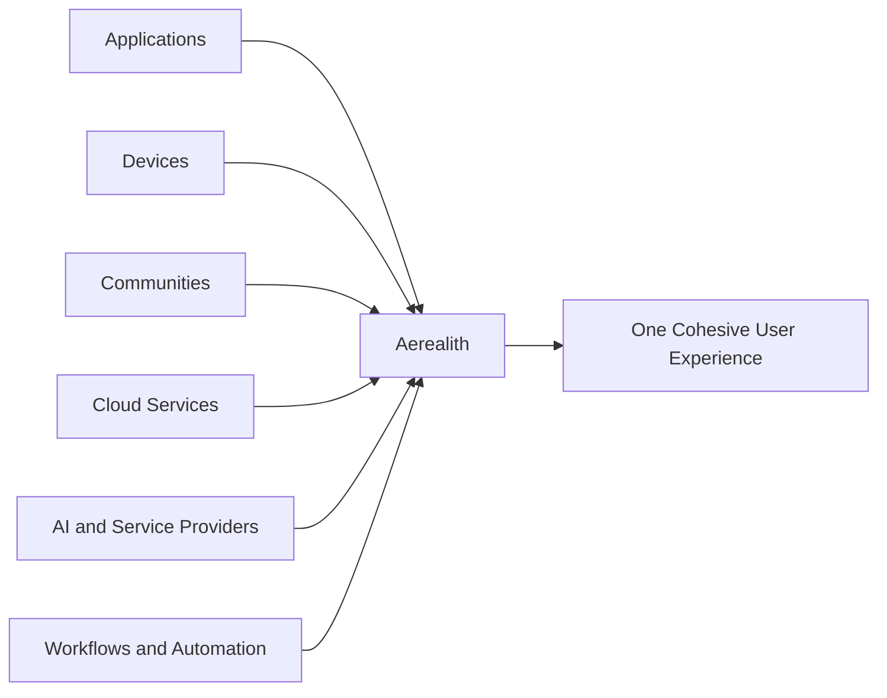
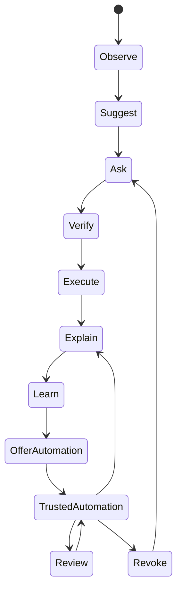
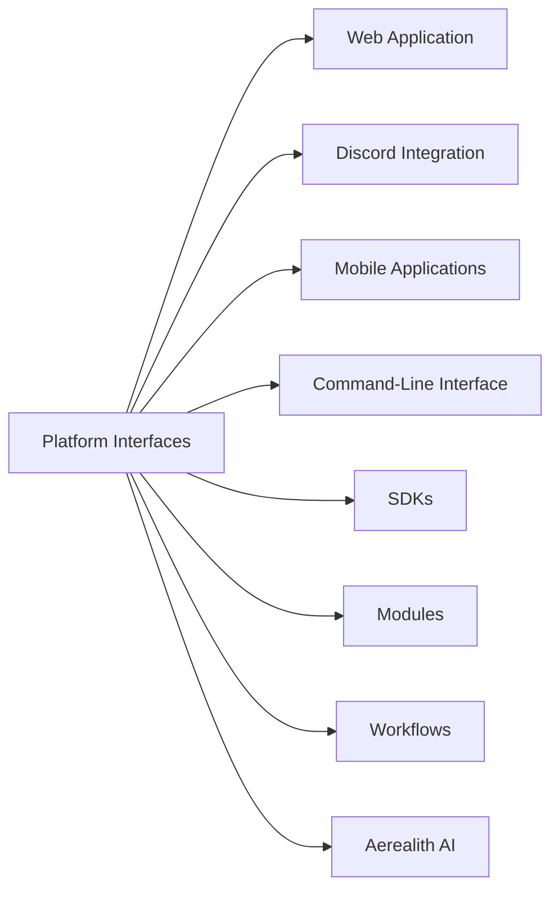

# Product Philosophy

Status: Active
Owner: SinLess Games LLC
Last Updated: 2026-07-17
Document Type: Product Strategy

## Purpose

This document defines how Aerealith should be designed, built, operated, and
experienced.

Technology changes.

Frameworks change.

Providers change.

Artificial intelligence evolves.

These philosophies should remain stable.

Every feature, service, module, workflow, integration, interface, automation,
and intelligent capability should align with the principles in this document.

This document is not a description of current implementation status.

Some principles describe current engineering expectations. Others define the
long-term direction of the platform.

Current, planned, future, and aspirational capabilities must be distinguished in
the relevant roadmap and current-state documentation.

---

## Canonical Product Distinction

### Aerealith

**Aerealith** is the platform.

It is a modular digital orchestration platform designed to connect applications,
services, communities, workflows, infrastructure, knowledge, automation, and
intelligent capabilities through one trusted control layer.

### Aerealith AI

**Aerealith AI** is the intelligent assistant within the Aerealith platform.

It provides conversational interaction, contextual understanding,
recommendations, explanations, workflow orchestration, and decision support
within explicit permissions and approved boundaries.

> **Aerealith is the platform.**
>
> **Aerealith AI is the assistant that helps users interact with the platform.**

The names may be used together in public branding, but they should not be
treated as interchangeable in authoritative documentation.

---

## Our Philosophy

Aerealith exists to reduce unnecessary digital complexity without reducing user
control.

Modern digital life is fragmented across applications, devices, communities,
services, accounts, providers, infrastructure, and workflows.

Aerealith should not attempt to replace every system people already use.

Instead, it should become a trusted orchestration layer that connects those
systems into a cohesive, secure, modular, and understandable experience.

Technology should adapt to people.

People should not be forced to adapt to unnecessary technological complexity.

The platform should make users more capable without making them more dependent
on opaque systems.

---

## The Aerealith Experience

Using Aerealith should feel coherent, calm, and intentional.

The platform should help users:

- Understand what is happening
- Bring fragmented information together
- Reduce repetitive work
- Coordinate connected services
- Review proposed actions
- Automate within explicit boundaries
- Recover when something goes wrong
- Maintain control over data, permissions, and deployment

Aerealith should work quietly when no attention is required.

It should become visible when guidance, approval, explanation, warning, or
intervention is valuable.

Aerealith should feel like a trusted partner.

It should never feel like a system that has quietly taken authority away from
the user.

When Aerealith is working well, users should spend less time managing technology
and more time accomplishing what matters.

---

# The Product Philosophies

## 1. Cohesion Over Fragmentation

Modern digital life is fragmented.

Applications solve individual problems, but they rarely work together in a
consistent, understandable way.

Aerealith exists to create cohesion across disconnected systems.

Every integration should strengthen the feeling that the user is interacting
with one trusted platform rather than a collection of unrelated services.

Cohesion does not require hiding meaningful differences between connected
systems.

Aerealith should unify the experience while preserving the permissions,
limitations, risks, and behavior of each underlying service.

---

## 2. Integrate Before Replace

The digital world already contains exceptional specialized software.

Aerealith should not rebuild existing products merely because doing so is
technically possible.

It should integrate with specialized tools when integration provides a secure,
reliable, and coherent experience.

Native functionality should be developed only when it provides meaningful value
beyond integration.

Replacement should be justified by one or more of the following:

- A substantially safer experience
- Stronger user control
- A meaningful reduction in complexity
- Better deployment flexibility
- A more coherent platform experience
- A capability that cannot reasonably be delivered through integration
- A foundational requirement of the Aerealith platform

Examples of systems Aerealith may integrate with include:

- Discord
- GitHub
- Home Assistant
- Bitwarden or other credential providers
- Datadog
- Grafana
- Docker
- Kubernetes
- Cloud providers
- Email providers
- Storage providers
- Payment providers
- Security and code-quality platforms

Integration expands the platform.

Replacement must be intentional.

---

## 3. Progressive Trust

Trust should be earned through experience.

Automation should not begin with unrestricted authority.

Aerealith should progress from low-risk assistance toward trusted automation
through repeated, visible, user-approved behavior.

The preferred progression is:

1. Observe
2. Suggest
3. Ask
4. Verify
5. Execute
6. Explain
7. Learn from approved behavior
8. Offer repeatable automation
9. Operate within approved boundaries
10. Remain reviewable and revocable

Automation may become self-executing only within clearly defined permissions,
risk limits, schedules, targets, and revocation paths.

The platform should never treat a previous approval as unlimited future
authority.

---

## 4. Explain Before Meaningful Action

Artificial intelligence and automation should not behave like black boxes.

Before a meaningful or high-risk action, Aerealith should provide enough
information for the user to make an informed decision.

The explanation should address:

- What is being proposed
- Why it is being proposed
- What information influenced the proposal
- Which systems or resources are involved
- Which permissions are required
- What is expected to change
- What risks or uncertainty exist
- Whether the action can be reversed

After execution, Aerealith should explain:

- What happened
- What changed
- Whether the action succeeded
- Whether anything failed or partially completed
- What records were created
- What the user can do next
- How the action can be reviewed, undone, or reported

Explanation is part of the product.

It is not optional polish.

---

## 5. Enhance, Never Displace Human Authority

Artificial intelligence exists to make people more capable.

Its purpose is to:

- Reduce repetitive work
- Simplify complex systems
- Improve access to information
- Support decision-making
- Educate users
- Increase confidence
- Surface risks and alternatives
- Coordinate approved work

Aerealith AI should not present itself as the final authority over users,
communities, or organizations.

It may recommend.

It may warn.

It may refuse unsafe or unauthorized actions.

It may execute approved work.

It should not quietly replace meaningful human judgment.

Users and authorized administrators remain responsible for decisions made
within their scope of authority.

Aerealith exists to strengthen those decisions.

---

## 6. Context Before Action

Good decisions require context.

Before performing a meaningful action, Aerealith should evaluate the context
available within its approved access boundaries.

Relevant context may include:

- User intent
- Identity
- Role and authority
- Permissions
- Connected systems
- Current environment
- Historical approved behavior
- Active policies
- Resource state
- Risk level
- Potential consequences
- Reversibility
- Conflicting instructions
- Organizational or community boundaries

Context does not grant authority.

Understanding a system does not imply permission to modify it.

The platform should understand before acting and verify before crossing a trust
boundary.

---

## 7. Quiet by Default, Visible When Necessary

The best technology does not constantly demand attention.

Aerealith should operate quietly when routine work is proceeding normally.

It may:

- Monitor
- Organize
- Synchronize
- Index
- Correlate
- Summarize
- Protect
- Prepare recommendations
- Execute pre-approved low-risk workflows

It should become visible when:

- Approval is required
- Risk has increased
- A failure needs attention
- A meaningful change occurred
- User intent is ambiguous
- An explanation is valuable
- A policy boundary would be crossed
- Recovery or intervention is required

Quiet operation must never mean hidden operation.

Users should still be able to review relevant activity, permissions, logs, and
automation history.

---

## 8. Adapt Without Becoming Intrusive

Attention is valuable.

Notifications should be intentional, relevant, and proportional to urgency.

Before interrupting someone, Aerealith should ask:

> Is this worth the user's attention now?

Not merely:

> Is the system technically capable of sending a notification?

The platform should prioritize:

- Relevance over frequency
- Urgency over novelty
- Summaries over notification floods
- Actionable information over noise
- User preferences over platform defaults
- Escalation paths over repeated interruptions

Adaptation should remain visible and configurable.

The platform should not silently manipulate engagement or optimize for
attention.

---

## 9. Replaceable by Design

Major external dependencies should be replaceable where practical.

No provider should become inseparable from Aerealith without explicit
architectural justification.

```mermaid
flowchart TD
    Platform["Aerealith Platform"]

    Platform --> AI["AI Providers"]
    Platform --> Email["Email Providers"]
    Platform --> Storage["Storage Providers"]
    Platform --> Observability["Observability Providers"]
    Platform --> Payments["Payment Providers"]
    Platform --> Identity["Identity Providers"]

    AI --> OpenAI
    AI --> Anthropic
    AI --> LocalModels["Local Models"]
    AI --> FutureModels["Future Providers"]

    Email --> Resend
    Email --> SMTP
    Email --> FutureEmail["Future Providers"]

    Storage --> Cloudinary
    Storage --> ObjectStorage["S3-Compatible Storage"]
    Storage --> MinIO

    Observability --> Datadog
    Observability --> GrafanaCloud["Grafana Cloud"]
    Observability --> GrafanaOSS["Grafana OSS"]

    Payments --> Stripe
    Payments --> LemonSqueezy["Lemon Squeezy"]

    Identity --> HostedIdentity["Hosted Identity"]
    Identity --> SelfHostedIdentity["Self-Hosted Identity"]
```

Replaceability may be achieved through:

- Stable internal interfaces
- Provider adapters
- Configuration-driven selection
- Data export
- Migration tooling
- Open protocols
- Graceful degradation
- Documented operational boundaries

Provider flexibility protects users and improves the longevity of the platform.

Abstraction should not be introduced without need, but critical dependencies
should not become permanent traps.

---

## 10. Interfaces Before Implementations

Platform capabilities should be exposed through stable and consistent
interfaces.

Where appropriate, those interfaces may include:

- APIs
- Events
- Commands
- Webhooks
- SDKs
- Module contracts
- Workflow actions
- Policy interfaces
- User-interface components

The web application should not receive privileged access to core capabilities
that other authorized clients cannot eventually use.

Aerealith AI should interact with platform services through governed interfaces,
not hidden shortcuts.

Interfaces are part of the product.

They are not merely implementation details.

This does not require every internal function to become a public API.

Public, partner, internal, and administrative interfaces should remain clearly
separated.

---

## 11. Evolve Deliberately

Technology changes rapidly.

Aerealith should adapt without chasing every trend.

Architecture should evolve through evidence, documented decisions, and
thoughtful iteration.

The platform should prefer:

- Incremental improvement over unnecessary rewrites
- Stable contracts over internal convenience
- Migration paths over abrupt breakage
- Measured adoption over trend-driven architecture
- Documented decisions over unexplained change
- User value over technical novelty

Compatibility should be preserved where practical.

Breaking changes should be intentional, documented, versioned, and supported by
migration guidance.

Growth should be deliberate.

Complexity should be introduced only when it provides meaningful value.

---

## 12. Eliminate Unnecessary Complexity

Everything Aerealith builds should reduce complexity without removing meaningful
capability or control.

Users should be able to accomplish more while thinking less about unnecessary
implementation detail.

Power should remain available.

Complexity should remain proportional to the task and optional where practical.

This principle applies to:

- User interfaces
- Configuration
- Permissions
- Workflows
- APIs
- Deployment
- Error handling
- Documentation
- Architecture
- Operations
- Contributor experience

Simplicity does not mean skipping:

- Authorization
- Validation
- Auditability
- Testing
- Recovery
- Documentation
- Accessibility
- Security
- Observability

The goal is not to hide important truth.

The goal is to remove unnecessary friction.

---

## 13. Modularity Over Monolithic Growth

Aerealith should grow through independently understandable capabilities.

Modules should be:

- Enableable
- Disableable
- Configurable
- Testable
- Documented
- Permission-aware
- Observable
- Replaceable where practical
- Isolated according to risk and responsibility

A module should clearly define:

- Its purpose
- Its data access
- Its permissions
- Its events
- Its dependencies
- Its configuration
- Its audit behavior
- Its failure modes
- Its user-facing boundaries

Modularity should not be used as an excuse to create unnecessary distributed
systems.

The platform should choose the smallest architecture that preserves clear
boundaries and future extensibility.

---

## 14. Security as Product Behavior

Security is not a separate layer added after product design.

It is part of how the product behaves.

Aerealith should use:

- Least privilege
- Secure defaults
- Explicit authorization
- Strong identity
- Secret protection
- Input validation
- Trust-boundary validation
- Defense in depth
- Auditable actions
- Human review for high-impact changes
- Safe failure behavior
- Documented incident response

Security should be understandable to users.

Warnings should explain risk without relying on fear.

Controls should protect people without making normal operation unnecessarily
hostile.

---

## 15. Reversibility and Recovery

Actions should be reversible when technically possible.

The platform should prefer:

- Drafts before publication
- Preview before execution
- Soft deletion before permanent deletion
- Versioning before destructive replacement
- Rollback before manual reconstruction
- Transactional operations where practical
- Idempotent workflows where appropriate
- Recovery guidance after partial failure

Irreversible actions should require:

- Clear warning
- Appropriate authority
- Elevated confirmation
- Explanation of consequences
- Audit records

The inability to reverse an action should be treated as a product constraint,
not hidden from the user.

---

## 16. Accessibility and Inclusive Capability

Aerealith should remain usable by people with different abilities, devices,
technical backgrounds, and levels of experience.

Accessibility is a product requirement.

The platform should support:

- Keyboard navigation
- Screen readers
- Understandable language
- Sufficient contrast
- Reduced-motion preferences
- Clear focus states
- Accessible forms
- Useful error messages
- Multiple interaction methods where practical
- Progressive disclosure of advanced capability

Advanced functionality should not require users to understand internal
architecture.

Simplicity for beginners should not remove capability from advanced users.

---

## 17. Documentation Is Part of the Product

Undocumented behavior is incomplete behavior.

Every meaningful capability should include documentation appropriate to its
audience.

Documentation may include:

- User guidance
- Administrator guidance
- Developer documentation
- API contracts
- Module documentation
- Architecture decisions
- Security requirements
- Operational runbooks
- Troubleshooting procedures
- Migration guidance
- Current-state status
- Known limitations

Documentation should distinguish:

- Current
- Planned
- Future
- Vision

Documentation should not present aspiration as implementation.

---

# Artificial Intelligence Philosophy

Artificial intelligence is a capability within Aerealith.

It is not the entirety of the platform.

Aerealith should route intelligent work according to factors such as:

- Task type
- Required capability
- Accuracy requirements
- Latency
- Cost
- Privacy requirements
- User preferences
- Organizational policy
- Data residency
- Locally available models
- Provider availability
- Safety requirements

Users and authorized organizations should be able to configure which providers
and models are permitted within their environment.

Aerealith may support:

- Hosted commercial models
- Open models
- Local models
- Specialized first-party models
- Future providers

Core platform capabilities should not depend entirely on a single AI provider.

When AI is unavailable, deterministic platform functions should continue to
operate wherever practical.

AI-generated output should not bypass:

- Authorization
- Validation
- Policy
- Auditability
- Human approval requirements
- Deterministic safety controls

A model recommendation is not authorization.

A model response is not proof.

A model action must remain subject to platform controls.

---

# Automation Philosophy

Automation should reduce repetitive work while preserving authority,
explainability, and recovery.

Every automation should have:

- A defined owner
- A clear trigger
- An explicit scope
- Known permissions
- A documented purpose
- A visible status
- An audit trail
- Failure handling
- A disable path
- A revocation path
- A review process

High-impact automation should include additional safeguards such as:

- Approval gates
- Rate limits
- Target restrictions
- Time restrictions
- Dry-run support
- Preview
- Multi-party approval
- Elevated confirmation
- Automatic rollback where practical

Automation should be trusted because it remains controlled and observable.

---

# Connectivity Philosophy

Internet connectivity should not be treated as permanently guaranteed.

Aerealith should detect available connectivity and adapt according to platform
capabilities and user preferences.

Where practical, the platform should support:

- Hosted operation
- Hybrid operation
- Self-hosted operation
- Local processing
- Offline-capable workflows
- Deferred synchronization
- Graceful degradation

Loss of connectivity should not create silent data corruption or undefined
behavior.

The platform should clearly communicate:

- Which capabilities remain available
- Which data may be stale
- Which actions are queued
- Which operations require connectivity
- What will happen when connectivity returns

Offline and self-hosted capabilities represent long-term direction and must not
be described as currently available until implemented.

---

# Learning and Memory Philosophy

Aerealith should learn with users, not exploit them.

Learning should improve the user's experience without compromising privacy,
ownership, or informed consent.

Memory should be:

- Intentional
- Visible
- Reviewable
- Editable
- Exportable
- Deletable
- Scoped
- Permission-aware
- Retained only as long as justified

Users should be able to understand:

- What Aerealith remembers
- Why it remembers it
- Where the information came from
- Which capabilities may use it
- How long it will be retained
- How to correct or remove it

Private user, community, or organizational information should not be used for
model training without explicit, informed consent.

Memory should not quietly become surveillance.

---

# Data Philosophy

Data collection should be proportional to capability.

Aerealith should collect only what is needed to provide, secure, operate, and
improve an approved capability.

Data should have:

- A defined owner
- A documented purpose
- An access policy
- A retention policy
- A deletion path
- An export path where appropriate
- An audit model
- A security classification where necessary

Personal data belongs to the user.

Community data belongs to the community.

Organizational data belongs to the organization.

Aerealith should act as a responsible steward, not as the owner of that data.

---

# Platform Philosophy

Aerealith is not simply an application.

It is a platform.

The core should remain stable while supporting an ecosystem of:

- First-party modules
- Third-party modules
- Integrations
- Workflows
- Plugins
- Themes
- AI skills
- Developer tools
- SDKs
- Marketplace packages
- Hosted extensions
- Self-hosted extensions

The platform should become more valuable as its ecosystem grows.

Ecosystem growth must not weaken the trusted core.

Extensions should operate within defined boundaries for:

- Permissions
- Data access
- Events
- Secrets
- Network access
- User consent
- Auditability
- Resource usage
- Failure isolation

Third-party extensibility should not mean unrestricted access.

---

# Self-Hosting Philosophy

Aerealith should be cloud-capable without being permanently cloud-dependent.

Where practical, the platform should support deployment choice.

Long-term deployment paths may include:

- Managed hosted service
- Self-hosted deployment
- Hybrid deployment
- Private infrastructure
- Enterprise environments
- Air-gapped operation

Self-hosting should not be treated as an unsupported copy of the hosted product.

It should eventually include documented expectations for:

- Installation
- Upgrades
- Backups
- Recovery
- Secrets
- Observability
- Scaling
- Security
- Provider configuration
- Migration

Self-hosting is part of the platform's commitment to ownership, resilience, and
freedom from unnecessary lock-in.

---

# Ethical Philosophy

Aerealith should never intentionally compromise user trust.

The platform must not intentionally:

- Sell private user data
- Train on private data without explicit consent
- Hide meaningful AI actions
- Hide meaningful automation
- Manipulate users into subscriptions
- Use dark patterns
- Deceive users through AI-generated content
- Create unnecessary vendor lock-in
- Disguise advertising as assistance
- Prioritize engagement over user well-being
- Prioritize revenue over safety or informed consent
- Present uncertain output as unquestionable fact
- Take unapproved meaningful action
- Conceal material limitations

Trust is more valuable than short-term growth.

When a feature cannot be built responsibly, it should not be built until its
risks can be addressed.

---

# Product Decision Hierarchy

When principles appear to conflict, decisions should generally prioritize:

1. Safety
2. Legal and ethical obligations
3. User control
4. Security
5. Privacy
6. Data ownership
7. Transparency
8. Reliability
9. Accessibility
10. Cohesion
11. Extensibility
12. Convenience
13. Speed of delivery

This hierarchy is a guide, not a substitute for documented judgment.

Significant tradeoffs should be recorded through the appropriate architecture,
engineering, product, or security decision process.

---

# Current, Planned, Future, and Vision

Product philosophy defines how Aerealith should behave.

It does not prove that every described capability exists today.

Documentation should use the following states:

- **Current** — implemented and available now
- **Planned** — approved for development
- **Future** — expected beyond the immediate roadmap
- **Vision** — long-term direction not committed to delivery

Public messaging should never convert philosophy into an unsupported product
claim.

For implementation status, refer to:

- [`CURRENT_STATE.md`](./CURRENT_STATE.md)
- Product roadmap documentation
- Release documentation
- Architecture documentation

---

# The Aerealith Test

Every meaningful feature, service, integration, module, workflow, and design
decision should be evaluated using the following questions.

## Trust and Control

- Does this build trust?
- Does this keep the user in control?
- Is meaningful consent required where appropriate?
- Can permissions be understood and revoked?
- Is responsibility attributable?

## Product Value

- Does this solve a real problem?
- Does this reduce digital complexity?
- Does this improve capability without creating unnecessary dependence?
- Does this fit within the product boundary?
- Does this strengthen the shared platform?

## Transparency and Safety

- Does this explain itself?
- Are risks and uncertainty visible?
- Are meaningful actions auditable?
- Does it fail safely?
- Is recovery possible?
- Are irreversible actions clearly identified?

## Architecture and Longevity

- Does this integrate before replacing?
- Is the capability modular?
- Are important dependencies replaceable where practical?
- Does it use stable interfaces?
- Can it evolve without unnecessary breakage?
- Does it degrade gracefully?

## Privacy and Ethics

- Does this protect user privacy?
- Is data collection proportional to the capability?
- Is data ownership respected?
- Does it avoid manipulation and dark patterns?
- Would we be comfortable publicly explaining how it works?

## Experience and Inclusion

- Is it understandable?
- Is it accessible?
- Does it respect the user's attention?
- Does it avoid unnecessary complexity?
- Can both new and advanced users operate it effectively?

## Long-Term Standard

- Does documentation accurately describe its current state?
- Would we still be proud to ship and support this ten years from now?

If the answer to a relevant question is **No**, the feature should be redesigned,
re-scoped, deferred, or supported by exceptional documented justification.

---

# Our North Star

> **Reduce digital complexity without reducing user control.**

Everything Aerealith builds should move the platform closer to that goal.

The platform succeeds when users become:

- More informed
- More capable
- More secure
- Less overwhelmed
- Less dependent on opaque systems
- More confident in their technology
- More in control of their digital environment

Aerealith should become more intelligent without becoming less understandable.

It should become more capable without becoming less trustworthy.

It should become more automated without becoming less accountable.

That is the product philosophy.
