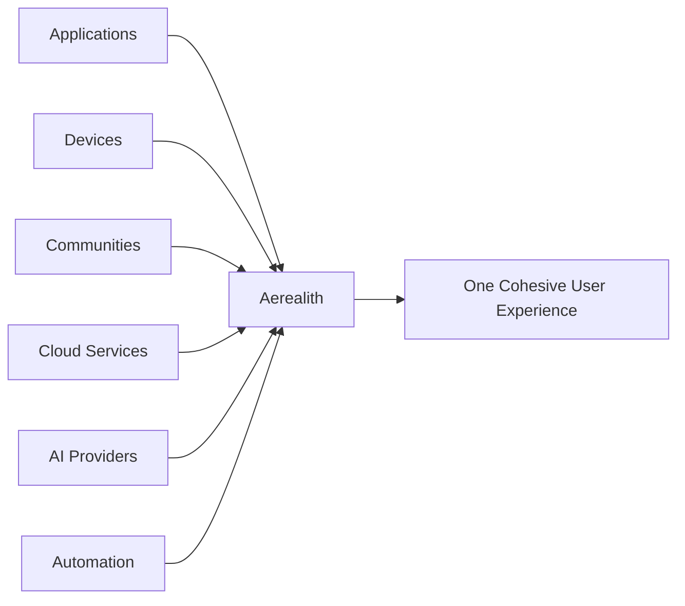
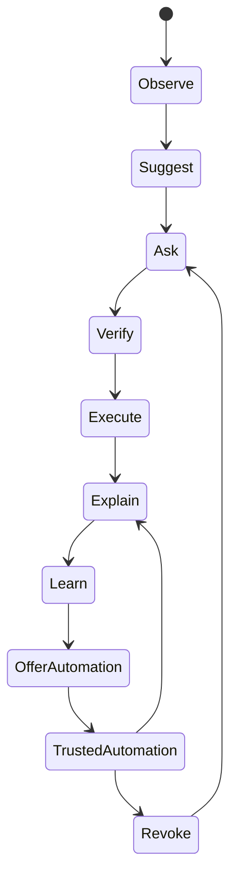
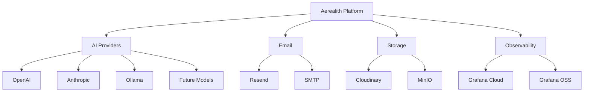
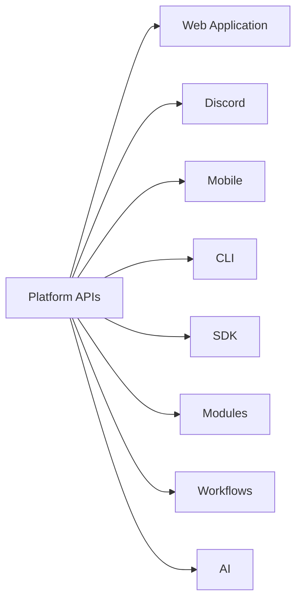

# Product Philosophy

The purpose of this document is to define how Aerealith AI should be designed, built, and experienced.

Technology changes.

Frameworks change.

Artificial intelligence evolves.

These philosophies should remain constant.

Every feature, service, module, workflow, integration, and AI capability should align with these principles.

---

## Our Philosophy

Aerealith AI exists to eliminate unnecessary digital complexity without reducing user control.

Modern digital life is fragmented across countless applications, devices, communities, services, and workflows.

Rather than replacing everything people already use, Aerealith should become the intelligent orchestration layer that unifies those systems into a cohesive, secure, and understandable experience.

Technology should adapt to people.

People should not have to adapt to technology.

---

## The Aerealith Experience

Using Aerealith should feel effortless.

It should quietly organize, automate, and simplify the user's digital life while remaining transparent, predictable, and always under the user's control.

Aerealith should become a trusted partner that works alongside people—not a system that takes control away from them.

When Aerealith is working well, users should spend less time managing technology and more time accomplishing what matters.

---

## The Twelve Product Philosophies

---

## 1. Cohesion Over Fragmentation

Modern digital life is fragmented.

Applications solve individual problems, but they rarely work together.

Aerealith exists to create a cohesive experience across disconnected systems.

Every integration should strengthen the feeling that the user is interacting with one intelligent platform rather than dozens of unrelated services.

---

## 2. Integrate Before Replace

The world already contains exceptional software.

Aerealith should not rebuild existing products simply because it can.

Instead, Aerealith should integrate with specialized tools whenever they provide the best experience.

Native capabilities should only be developed when they provide clear value beyond what integration alone can achieve.

Examples include:

- GitHub
- Discord
- Home Assistant
- Bitwarden
- Grafana
- Docker
- Kubernetes
- Cloud Providers

Integration expands the platform.

Replacement should be intentional.

---

## 3. Progressive Trust

Trust should be earned through experience.

Automation should never be assumed.

Every automated capability should evolve naturally through repeated user-approved interactions.

The AI should:

- Observe
- Recommend
- Request approval
- Verify intent
- Execute
- Explain
- Learn
- Offer automation

Only after trust has been established should automation become autonomous within clearly defined boundaries.

---

## 4. Explain Before You Execute

Artificial intelligence should never behave like a black box.

Every important action should answer four questions:

- What happened?
- Why did it happen?
- What changed?
- What should I do next?

Understanding builds trust.

Explanation is part of the product—not an optional feature.

---

## 5. Enhance, Never Replace

Artificial intelligence exists to make people more capable.

Its purpose is to:

- reduce repetitive work
- simplify complex systems
- improve decision making
- educate users
- increase confidence

It should never attempt to replace human judgment.

Users remain responsible for their decisions.

Aerealith exists to enhance those decisions.

---

## 6. Context Before Action

Good decisions require context.

Before performing meaningful actions, Aerealith should understand:

- user intent
- permissions
- connected systems
- historical behavior
- current environment
- potential consequences

The platform should reason before acting.

Not simply execute commands.

---

## 7. Invisible Technology

The best technology becomes invisible.

Users should not constantly think about Aerealith.

It should quietly:

- monitor
- organize
- synchronize
- automate
- protect

Only becoming visible when guidance, approval, explanation, or intervention is valuable.

Technology should support people without constantly demanding their attention.

---

## 8. Adapt, Don't Interrupt

Attention is valuable.

Notifications should be intentional.

Before interrupting someone, Aerealith should ask:

> Is this worth the user's attention?

Rather than:

> Can I send a notification?

The platform should prioritize relevance over frequency.

---

## 9. Replaceable by Design

Every dependency should be replaceable.

No external provider should become inseparable from Aerealith.

The platform should remain cloud-independent whenever practical.

Vendor flexibility protects both users and the longevity of the platform.

---

## 10. APIs First

Every capability should eventually be available through an API.

The platform should expose consistent interfaces that allow:

- applications
- modules
- integrations
- workflows
- AI orchestration
- third-party developers

to build upon the same capabilities.

The API is part of the product—not merely an implementation detail.

---

## 11. Evolve Naturally

Technology changes rapidly.

Aerealith should not chase trends.

Architecture should evolve through thoughtful iteration rather than unnecessary rewrites.

Features should remain compatible whenever practical.

Growth should be deliberate.

Complexity should be introduced only when it provides meaningful value.

---

## 12. Eliminate Unnecessary Complexity

Everything Aerealith builds should reduce complexity without reducing capability.

Users should accomplish more while thinking less about the technology itself.

Power should remain available.

Complexity should remain optional.

This philosophy should influence every design decision throughout the platform.

---

## Artificial Intelligence Philosophy

Artificial intelligence is a capability—not the product itself.

Aerealith should intelligently route work to the most appropriate model based on:

- task type
- required capabilities
- latency
- cost
- privacy requirements
- user preferences
- locally available models
- platform policies

Users should be able to configure their preferred providers.

Aerealith may include first-party models while continuing to support external providers.

If AI services become unavailable, the platform should continue functioning wherever possible.

Core platform capabilities should never depend entirely on a single AI provider.

---

## Connectivity Philosophy

Internet connectivity should never be assumed.

Aerealith should detect available connectivity and adapt based on user preferences.

Whenever practical, users should be able to choose between:

- cloud-first operation
- hybrid operation
- self-hosted operation
- offline-capable operation

The platform should degrade gracefully rather than fail completely.

---

## Learning Philosophy

Aerealith should learn with users—not from them.

Learning should improve the user's experience without compromising privacy.

Memory should be:

- intentional
- reviewable
- editable
- exportable
- deletable

Private information should never be used for model training without explicit user consent.

---

## Platform Philosophy

Aerealith is not simply an application.

It is a platform.

The core platform should remain stable while enabling an ecosystem of:

- first-party modules
- third-party modules
- plugins
- integrations
- workflows
- themes
- AI skills
- developer tools
- marketplace packages

Like VS Code and Home Assistant, the platform should become more valuable as its ecosystem grows.

---

## Ethical Philosophy

Aerealith should never compromise user trust.

The platform will never intentionally:

- sell user data
- train on private user data without explicit consent
- hide AI actions
- manipulate users into subscriptions
- intentionally create vendor lock-in
- use dark patterns
- deceive users through AI
- prioritize revenue over user trust

Trust is more valuable than short-term growth.

---

## The Aerealith Test

Every feature should be evaluated using the following questions.

- Does this build trust?
- Does this reduce digital complexity?
- Does this keep the user in control?
- Does this explain itself?
- Does this respect user intent?
- Does this integrate before replacing?
- Does this remain modular?
- Does this remain extensible?
- Does this protect user privacy?
- Does this degrade gracefully?
- Would we still be proud to ship this ten years from now?

If the answer to any of these questions is **No**, the feature should be redesigned or require exceptional justification before implementation.

---

## Our North Star

Reduce digital complexity without reducing user control.

Everything Aerealith builds should move the platform closer to that goal.
