# Vision Documentation

Status: Active
Owner: SinLess Games LLC
Last Updated: 2026-07-18
Document Type: Vision Index

## Purpose

The `docs/vision` directory defines why Aerealith exists, what it stands for,
how it earns trust, who it serves, and which principles must survive changes in
technology and implementation.

Vision documentation provides the long-term foundation for:

- Product strategy
- Product design
- Architecture
- Engineering standards
- Security
- Trust and permissions
- Release planning
- Contributor expectations
- Public positioning
- Community governance
- Developer ecosystem decisions

These documents describe the intended direction and behavior of Aerealith.

They do not define exact:

- Package versions
- Source-code paths
- Database schemas
- API routes
- Deployment manifests
- Infrastructure configuration
- Release status
- Current implementation details

Those details belong in the appropriate architecture, engineering, product,
operations, security, current-state, and release documentation.

---

## Canonical Product Distinction

### Aerealith

**Aerealith** is the platform.

It is a modular digital orchestration platform designed to connect applications,
services, communities, workflows, infrastructure, knowledge, automation, and
intelligent capabilities through one trusted control layer.

### Aerealith AI

**Aerealith AI** is the intelligent assistant within the Aerealith platform.

It provides conversational interaction, contextual understanding,
recommendations, explanations, workflow orchestration, and decision support
within explicit permissions and approved boundaries.

> **Aerealith is the platform.**
>
> **Aerealith AI is the assistant that helps users interact with the platform.**

The names may appear together in branding, but authoritative documentation
should preserve this distinction.

---

## Scope

The vision directory contains long-lived strategic guidance.

Its documents may describe:

- Current principles
- Approved long-term direction
- Product philosophy
- Trust requirements
- Platform identity
- Intended audiences
- Ethical commitments
- Strategic positioning
- Release direction
- Aspirational future capability

Vision documentation should not present future capability as currently
implemented.

Implementation status should be defined using:

- **Current** — implemented and available now
- **In Progress** — actively being developed
- **Planned** — approved but not yet complete
- **Future** — expected beyond the immediate roadmap
- **Vision** — long-term direction not committed to a specific release
- **Blocked** — unable to proceed because a dependency or decision is unresolved
- **Deferred** — intentionally postponed
- **Complete** — exit criteria have been satisfied

For implementation status, refer to:

- Current-state documentation
- Product roadmaps
- Release documentation
- Architecture documentation
- Engineering documentation
- Module-specific documentation

---

# Reading Order

The vision documents should be read in the following order.

## 1. [Vision](./Vision.md)

Defines the future Aerealith exists to create.

It explains:

- The problem Aerealith addresses
- The long-term product direction
- The distinction between Aerealith and Aerealith AI
- The intended audiences
- The role of Discord
- The role of integration, automation, and intelligence
- The long-term definition of success

---

## 2. [Mission](./Mission.md)

Defines what Aerealith must do to move toward the vision.

It should describe:

- The work Aerealith exists to perform
- The people and communities it serves
- The practical commitments required by the vision
- The relationship between capability and user control
- The responsibility of the platform to earn trust

---

## 3. [Core Values](./Core%20Values.md)

Defines the values that should guide decisions and behavior.

It should establish expectations around:

- Trust
- User control
- Transparency
- Security
- Privacy
- Ownership
- Accessibility
- Modularity
- Reliability
- Long-term responsibility

---

## 4. [Product Philosophy](./Product%20Philosophy.md)

Defines how Aerealith should be designed, built, operated, and experienced.

It establishes principles such as:

- Cohesion over fragmentation
- Integration before replacement
- Progressive trust
- Explanation before meaningful action
- Human authority
- Context before action
- Quiet operation
- Replaceable dependencies
- Stable interfaces
- Deliberate evolution
- Modularity
- Security as product behavior
- Reversibility
- Accessibility
- Documentation as part of the product

---

## 5. [Trust Model](./Trust%20Model.md)

Defines how authority is requested, granted, exercised, reviewed, and revoked.

It covers:

- Progressive trust
- Permission levels
- Risk levels
- Approval
- Verification
- Execution
- Explanation
- Auditability
- Automation eligibility
- Trusted automation
- Revocation
- Context-specific trust
- Discord trust
- AI trust
- Failure behavior
- Human override

---

## 6. [Positioning](./Positioning.md)

Defines how Aerealith should be understood and communicated.

It should clarify:

- Product category
- Platform identity
- Aerealith versus Aerealith AI
- Competitive framing
- Audience-specific messaging
- Public descriptions
- Messaging boundaries
- Current versus future claims
- The role of Discord
- The role of artificial intelligence
- The role of self-hosting
- The role of automation

---

## 7. [Manifesto](./Manifesto.md)

Expresses the conviction behind Aerealith.

It should communicate:

- Why fragmented digital systems should be challenged
- Why people should retain control
- Why trust matters
- Why AI should be understandable
- Why ownership and portability matter
- Why Aerealith is worth building

The manifesto may use stronger and more emotional language than the other vision
documents, but it should remain consistent with them.

---

## 8. [Roadmap](./Roadmap.md)

Defines the planned sequence through which the vision becomes real.

It should describe:

- Release stages
- Dependencies
- Major milestones
- Exit criteria
- The 20-week production plan
- Quality gates
- Security gates
- Documentation requirements
- Private-beta readiness
- Long-term platform expansion
- Self-hosting direction

The roadmap provides direction and sequencing.

It does not override release quality or exit criteria.

---

# Reading Paths by Audience

Different readers may begin with different documents while preserving the full
reading order for deeper understanding.

## Product and Leadership

1. [Vision](./Vision.md)
2. [Mission](./Mission.md)
3. [Positioning](./Positioning.md)
4. [Product Philosophy](./Product%20Philosophy.md)
5. [Roadmap](./Roadmap.md)
6. [Trust Model](./Trust%20Model.md)

---

## Architecture and Engineering

1. [Vision](./Vision.md)
2. [Product Philosophy](./Product%20Philosophy.md)
3. [Trust Model](./Trust%20Model.md)
4. [Core Values](./Core%20Values.md)
5. [Roadmap](./Roadmap.md)
6. Architecture and engineering documentation

---

## Security and Operations

1. [Trust Model](./Trust%20Model.md)
2. [Product Philosophy](./Product%20Philosophy.md)
3. [Core Values](./Core%20Values.md)
4. [Roadmap](./Roadmap.md)
5. Security and operational documentation

---

## Contributors

1. [Vision](./Vision.md)
2. [Mission](./Mission.md)
3. [Core Values](./Core%20Values.md)
4. [Product Philosophy](./Product%20Philosophy.md)
5. Contributor and engineering documentation

---

## Marketing and Public Communication

1. [Positioning](./Positioning.md)
2. [Vision](./Vision.md)
3. [Mission](./Mission.md)
4. [Manifesto](./Manifesto.md)
5. Current-state and release documentation

Public communication must be checked against implementation status before
publication.

---

## Module and Integration Developers

1. [Product Philosophy](./Product%20Philosophy.md)
2. [Trust Model](./Trust%20Model.md)
3. [Vision](./Vision.md)
4. [Roadmap](./Roadmap.md)
5. Developer and API documentation
6. Module-specific contracts

---

# North Star

> **Reduce digital complexity without reducing user control.**

This is the primary standard against which Aerealith should evaluate product,
architecture, engineering, trust, automation, and communication decisions.

A feature that reduces complexity by removing meaningful control does not satisfy
the North Star.

A feature that preserves control while creating unnecessary complexity also
fails the standard.

Aerealith should pursue both capability and control.

---

# Tagline

> **One Platform. Infinite Possibilities.**

The tagline expresses the breadth and extensibility of the platform.

It must not be used to imply that every possible capability currently exists.

---

# Core Ideas

## Aerealith Is the Platform

Aerealith is the operating system for your digital life.

It should provide a modular and trusted foundation for applications, services,
communities, workflows, automation, knowledge, infrastructure, and intelligent
assistance.

---

## Aerealith AI Is the Assistant

Aerealith AI is the intelligent assistant inside the platform.

It should help users understand complexity, evaluate choices, coordinate
approved actions, and use the platform more naturally.

It should not receive authority merely because it is intelligent.

---

## Trust Is Earned

Trust should never be assumed.

Aerealith should begin with observation, recommendations, and user approval.

Automation should be offered only after repeated trustworthy behavior and within
explicit limits.

---

## Users and Communities Own Their Data

Aerealith should act as a steward of data rather than treating access as
ownership.

Personal data belongs to the individual.

Community data belongs to the community.

Organizational data belongs to the organization.

---

## Artificial Intelligence Is a Capability

AI enhances the platform.

It should not hold the platform hostage to one provider, one model, or one
interaction pattern.

Core deterministic functionality should continue where practical when AI
providers are unavailable.

---

## Meaningful Actions Require Trust Controls

Meaningful actions should be:

- Authorized
- Permission-scoped
- Policy-compliant
- Explainable
- Auditable
- Reversible where practical
- Revocable
- Honest about uncertainty

---

## Integrate Before Replacing

Aerealith should connect excellent existing tools before rebuilding them.

Native capabilities should be created when they provide meaningful value beyond
integration.

---

## Cohesion Is More Valuable Than Feature Volume

A large collection of disconnected capabilities would recreate the problem
Aerealith exists to solve.

New features should strengthen the shared platform and contribute to one
coherent experience.

---

## Discord Is the First Flagship Integration

Discord is a major early platform surface.

It should prove the platform's ability to support:

- Communities
- Permissions
- Modules
- Moderation
- Tickets
- Onboarding
- Automation
- Auditability
- Operational visibility
- Future AI assistance

Discord is not the entire product.

---

## Architecture Should Start Simple

Aerealith should use the smallest architecture that can satisfy present
requirements without creating unnecessary dead ends.

Modularity should not be used as an excuse for premature distributed
complexity.

---

## Dependencies Should Be Replaceable

Critical external providers should have replacement paths where practical.

Replaceability should be intentional and evidence-driven rather than speculative.

---

## Interfaces Are Product Surfaces

Major capabilities should become accessible through governed interfaces where
appropriate.

These may include:

- APIs
- Events
- Commands
- Webhooks
- SDKs
- Modules
- Workflows
- User interfaces
- Aerealith AI

Public, partner, administrative, and internal interfaces should remain clearly
distinguished.

---

## Security Is Product Behavior

Security is not a final implementation phase.

Identity, authorization, secrets, validation, auditability, safe failure, and
recovery should be designed into capabilities from the beginning.

---

## Documentation Is Part of the Product

A capability is incomplete when users, operators, developers, or contributors
cannot understand how it works.

Documentation should evolve alongside implementation.

---

# Vision Hierarchy

The vision documentation should remain internally consistent.

When two documents appear to conflict, use the following order of interpretation:

1. Legal and ethical obligations
2. User safety
3. User control
4. Security and privacy
5. Vision
6. Mission
7. Core Values
8. Product Philosophy
9. Trust Model
10. Positioning
11. Roadmap
12. Public messaging

This hierarchy does not mean higher documents may ignore the detail of lower
documents.

It provides guidance when a material conflict requires resolution.

Any significant conflict should be documented and intentionally resolved.

---

# Relationship to Other Documentation

```mermaid
flowchart TD
    Vision["Vision Documentation"]

    Vision --> Product["Guides Product Priorities"]
    Vision --> Architecture["Constrains Architecture"]
    Vision --> Engineering["Constrains Engineering Standards"]
    Vision --> Security["Establishes Trust and Security Expectations"]
    Vision --> Decisions["Informs Decision Records"]
    Vision --> Releases["Shapes Release Goals"]
    Vision --> Messaging["Shapes Public Messaging"]
    Vision --> Contributors["Guides Contributor Expectations"]

    CurrentState["Current-State Documentation"]
    Roadmaps["Roadmaps and Releases"]
    ArchitectureDocs["Architecture Documentation"]
    EngineeringDocs["Engineering Documentation"]
    SecurityDocs["Security Documentation"]
    OperationsDocs["Operations Documentation"]

    Vision --> CurrentState
    Vision --> Roadmaps
    Vision --> ArchitectureDocs
    Vision --> EngineeringDocs
    Vision --> SecurityDocs
    Vision --> OperationsDocs
```



In simplified form:

```text
vision
├── guides product priorities
├── constrains architecture
├── constrains engineering standards
├── establishes trust and security expectations
├── informs decision records
├── shapes release goals
├── guides contributors
└── shapes public messaging
```

Vision documentation describes why and where.

Other documentation should describe what, how, when, and in what current state.

---

# Documentation Boundaries

## Vision Documentation Should Define

- Purpose
- Direction
- Product identity
- Long-term principles
- Trust expectations
- Ethical commitments
- Audience
- Strategic boundaries
- Success standards

---

## Vision Documentation Should Not Define

- Exact package versions
- Runtime-specific implementation details
- Database migration instructions
- Internal API routes
- Deployment credentials
- Environment secrets
- Temporary sprint tasks
- Unapproved implementation claims
- Detailed operational procedures
- Current capability without verification

---

# Change Policy

Vision documents are long-lived and should not change casually.

Small improvements may be made without a formal decision record when they:

- Correct grammar
- Improve readability
- Clarify an existing principle
- Remove ambiguity
- Repair links
- Standardize terminology
- Preserve the original meaning
- Improve the distinction between current and future capability

A material change requires additional review.

---

## Material Changes

A change is material when it alters:

- The mission
- The North Star
- Product identity
- Product category
- The distinction between Aerealith and Aerealith AI
- User ownership
- Data ownership
- Privacy commitments
- Trust requirements
- Permission philosophy
- Automation philosophy
- Ethical commitments
- The role of Discord
- Provider independence
- Self-hosting direction
- Primary audience
- Long-term direction
- Public positioning
- A binding platform principle

---

## Requirements for Material Changes

A material change requires:

- A clearly stated reason
- Description of the current principle
- Description of the proposed principle
- Impact analysis
- Product impact
- Architecture impact
- Engineering impact
- Security and trust impact
- Documentation impact
- Public-messaging impact
- Migration or transition considerations
- A decision record when the change creates, resolves, or reverses a binding
  decision
- Updates to affected reading paths
- Updates to affected cross-references
- Review by appropriate owners

Material changes should not be hidden inside routine wording edits.

---

## Change Review Questions

Before changing a vision document, ask:

- Does this alter what Aerealith is?
- Does this alter who Aerealith serves?
- Does this reduce user control?
- Does this expand platform authority?
- Does this alter data ownership?
- Does this weaken privacy?
- Does this change the role of AI?
- Does this change the role of Discord?
- Does this introduce vendor lock-in?
- Does this contradict another active vision document?
- Does this create an unsupported public claim?
- Does this require a decision record?
- Does this require changes outside the vision directory?

When the answer is unclear, the change should receive broader review.

---

# Consistency Requirements

All vision documents should use consistent language for core concepts.

## Required Terminology

Use:

- **Aerealith** for the platform
- **Aerealith AI** for the intelligent assistant
- **Community** as the general category
- **Discord server** or **Discord guild** when referring specifically to Discord
- **User control** rather than vague ownership language
- **Trusted automation** for bounded approved automation
- **Current**, **In Progress**, **Planned**, **Future**, and **Vision** for capability
  states
- **Provider** for replaceable external service dependencies
- **Module** for independently configurable platform capability
- **Integration** for a connection to an external system

Avoid using **Aerealith AI** as the name of the entire platform in authoritative
documentation unless quoting historical language or branding.

---

## Required Principles

Vision documents should not contradict the following principles without a
formal material change:

- Trust is earned
- User control is preserved
- AI does not bypass permissions
- Integration is preferred before replacement
- Data ownership remains with users, communities, and organizations
- Meaningful actions are auditable
- Automation is bounded and revocable
- Provider lock-in should be avoided where practical
- Discord is the first flagship integration, not the whole platform
- Current capability must not be overstated
- Security and privacy are part of product behavior

---

# Public Messaging Rules

Public communication derived from vision documentation must:

- Distinguish the platform from the assistant
- Distinguish current capability from future direction
- Avoid presenting roadmap items as completed
- Avoid implying unrestricted autonomous behavior
- Avoid presenting AI as infallible
- Avoid claiming self-hosting before it is supported
- Avoid claiming offline operation before it exists
- Avoid implying that Discord is the entire platform
- Avoid claiming integrations that have not been implemented
- Avoid promising delivery dates without approved release commitments
- Preserve the North Star
- Preserve the trust model

Vision language may be ambitious.

Product claims must remain verifiable.

---

# Implementation Conflict Policy

When an implementation idea conflicts with the vision:

1. Pause the implementation decision.
2. Identify the exact conflict.
3. Determine whether the implementation is incorrect or the vision is outdated.
4. Review the impact across product, architecture, engineering, security, trust,
   and public messaging.
5. Change the implementation when the vision remains valid.
6. Revise the vision only through the material-change process when the long-term
   principle genuinely needs to change.
7. Record binding decisions through the appropriate decision process.
8. Update all affected documentation.

A temporary implementation shortcut does not automatically justify changing the
vision.

A vision statement also should not remain unchanged merely because it is old.

The conflict must be resolved intentionally.

---

# Documentation Maintenance

The vision index should be reviewed when:

- A vision document is added or removed
- A document is renamed
- Reading order changes
- Product identity changes
- A major release changes strategic direction
- A material decision affects trust or ownership
- Public positioning changes
- The roadmap changes significantly
- A new major audience is introduced
- Self-hosting direction changes
- AI authority or memory behavior changes

Each review should confirm:

- Links remain valid
- Reading order remains logical
- Terminology is consistent
- Document statuses are accurate
- Current and future capabilities remain distinguished
- No active documents contradict one another
- Public messaging remains aligned
- Ownership and update dates remain accurate

---

# Vision Documentation Test

Before approving a new or updated vision document, ask:

## Purpose

- Does the document clearly belong in the vision directory?
- Does it define why, what, or long-term direction rather than implementation?
- Does it contribute something distinct?

## Consistency

- Does it preserve the North Star?
- Does it distinguish Aerealith from Aerealith AI?
- Does it align with the Trust Model?
- Does it align with Product Philosophy?
- Does it contradict another active vision document?

## Trust and Control

- Does it preserve user control?
- Does it protect user and community ownership?
- Does it avoid granting AI implicit authority?
- Does it preserve revocation and auditability?

## Accuracy

- Does it distinguish current capability from future direction?
- Could any statement be mistaken for a current product claim?
- Are roadmap and release references accurate?
- Are links valid?

## Longevity

- Is the language durable?
- Is it too dependent on a specific technology?
- Would the principle remain useful after implementation details change?
- Would we still defend this direction ten years from now?

If the document does not pass this test, it should be revised before becoming
active.

---

# Final Standard

The vision directory should provide a stable foundation for the entire
Aerealith project.

It should tell contributors:

- Why Aerealith exists
- What future it is trying to create
- What principles cannot be casually traded away
- How trust should be earned
- How users remain in control
- How the platform should grow
- How Aerealith AI fits within the platform
- How Discord fits within the larger ecosystem
- How implementation decisions should be evaluated
- How public claims should remain honest

The implementation will change.

The technology will change.

The providers will change.

The platform will grow.

The vision should remain clear enough to guide those changes without becoming a
prison for outdated assumptions.

> **Reduce digital complexity without reducing user control.**
